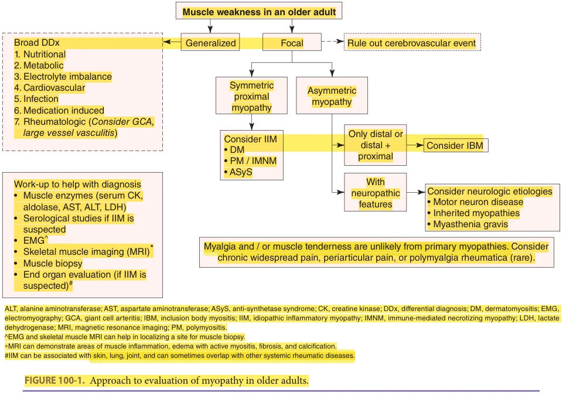
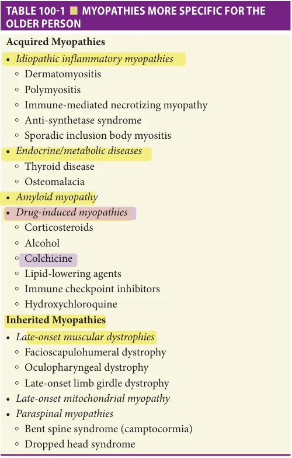
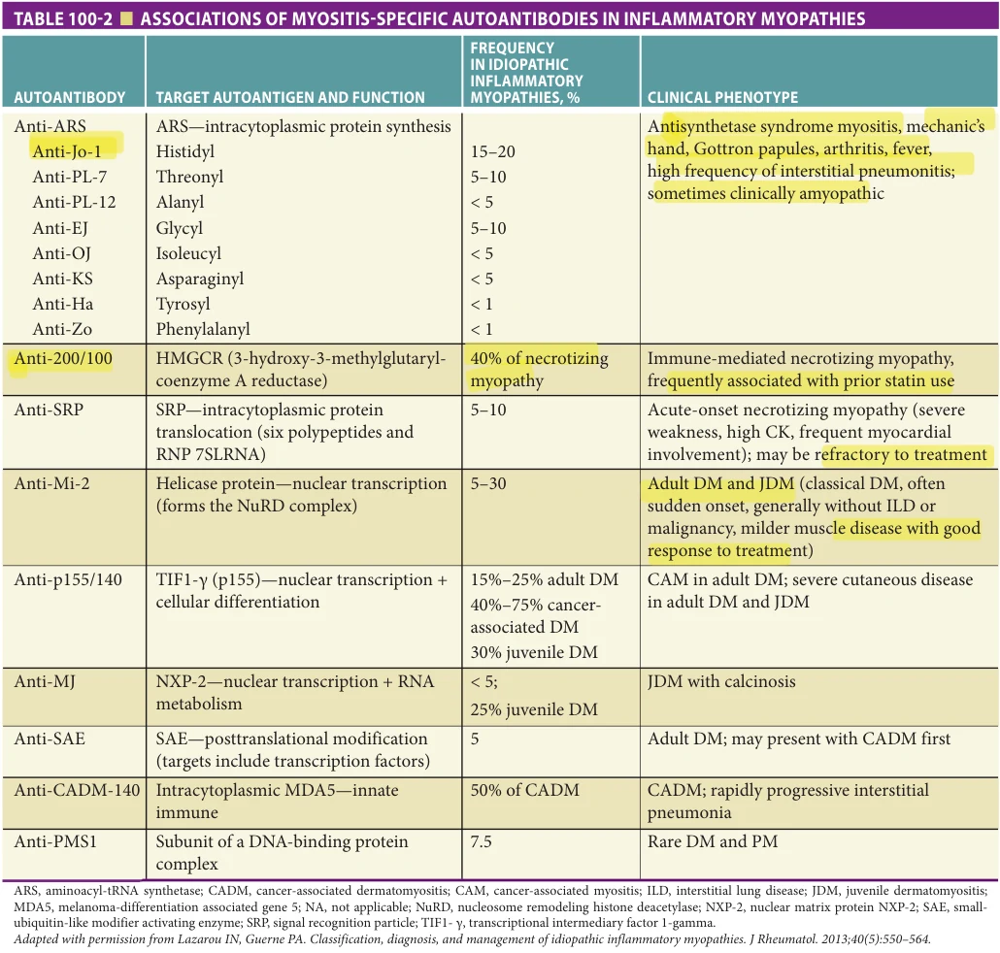
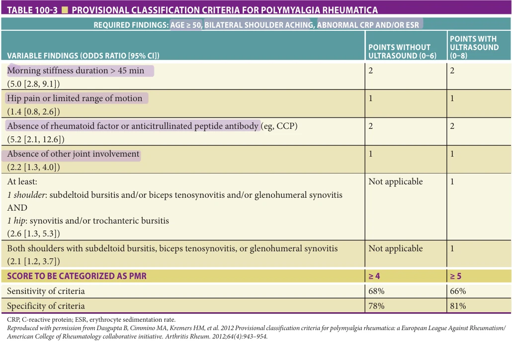
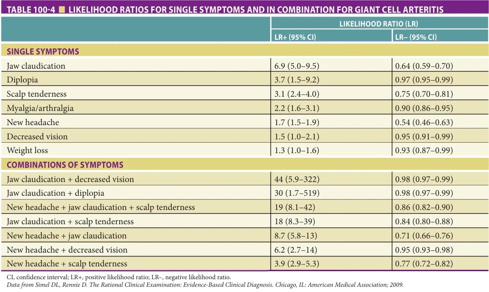
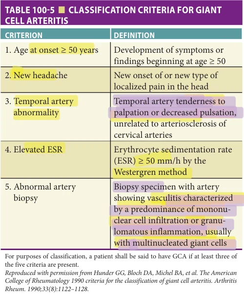

# Hazzard's Geriatric Medicine and Gerontology, 8e - Chapter 100: Myopathies, Polymyalgia Rheumatica, and Giant Cell Arteritis

Vivek Nagaraja

> **Status.** Fast build from the book; not lane-reviewed.

> **Source and method.** Printed pages 1589-1606, from the marked 8th-edition copy (PDF page = printed page + 34). Prose follows its text layer; tables and figures are source-page crops. The book is canonical.

**[p. 1589]**

Healthy muscle contributes to metabolic processes and functional status in humans. Myopathies are not uncommon in older adults, and when present, magnify the effects of age-related decline in muscle structure, mass, and function. This chapter reviews the common myopathies seen in older people as well as polymyalgia rheumatica and giant cell arteritis. Please see Chapter 49 for age-related changes in muscle and sarcopenia.

#### Learning Objectives

- Be able to characterize common muscle disorders of aging.

- Contrast the clinical presentation and management of polymyalgia rheumatica and giant cell arteritis.

#### Key Clinical Points

1. Most myopathies tend to present with proximal (large) muscle group involvement.

2. Inclusion body myositis (IBM), a gradual and insidious loss of muscle mass and strength, is associated with characteristic histology and normal to mildly elevated muscle enzyme levels. It is the most common form of inflammatory myositis in older adults.

3. Older adults are at risk for multiple druginduced myopathies, including those related to corticosteroids, heavy ethanol use, and lipid-lowering agents.

## CLINICAL EVALUATION OF MUSCLE DISEASE SYMPTOMS IN OLDER PEOPLE

The age-unrestricted list of conditions that can cause muscle disease symptoms is extensive. Candidate conditions are typically categorized as either acquired (autoimmune, endocrine disorder-related, toxin or drug-associated, amyloid, infectious, cancer-related, and others) or inherited (muscular dystrophies, metabolic myopathies, muscle channelopathies). The approach to the individual with myopathic symptoms is not age-specific, but the results must account for age-related variations within each component of the evaluation (see Figure 100-1). Most importantly, it is essential to factor in the coexistent medical conditions, impact on the activities of daily living (ADL) and instrumental activities of daily living (IADL), and the risks versus benefits of initiating the treatments for the underlying medical condition.

History As most extremity muscle bulk is proximal, symptoms of myopathic weakness tend to be associated with shoulder and hip girdle motions. Patients may report the inability to perform a specific task due to weakness or poor stamina in performing tasks once readily accomplished. Independence with ADLs, maintenance of balance and gait, and freedom from falling should be addressed as all are sustained in part

by maintaining muscle strength. Muscle pain is an uncommon symptom of primary myopathy in older people. It can be seen in polymyalgia rheumatica (PMR) or a regional or generalized musculoskeletal disorder, such a rotator cuff tendinopathy, subacromial or trochanteric bursitis, or fibromyalgia syndrome.

Examination Documenting the severity of initial and serial assessments of muscle strength should be based on the MRC grading scale of 0 to 5. The healthy older person should sustain

**[p. 1590]**

*FIGURE 100-1. Approach to evaluation of myopathy in older adults.*

muscle contraction against full resistance for 2 to 4 seconds, usually allotted to test individual muscles. More physiologically complex yet standard functional assessments, such as arising from a chair without the use of the arms, measuring the time necessary to perform this maneuver 5 to 10 times, or squatting from the standing position then arising without assistance, should be accomplished without difficulty by normal younger adults but may be difficult even for the healthy older person. The distribution of weakness may provide clues as to broad categorical etiologies: symmetric proximal extremity weakness with a normal neurologic exam suggests a myopathy, whereas distal weakness, distal and proximal weakness, or asymmetric weakness, suggests an underlying neuropathic problem or inclusion body myositis (IBM). Compared with objective muscle weakness, muscle tenderness is a less common finding in most primary myopathies. Muscle tenderness in older people, without demonstrated significant weakness, may be seen with fibromyalgia (chronic widespread pain), regional musculoskeletal disorders (focal findings), and rarely in some patients with PMR (symmetric proximal extremities).

Laboratory Markers Routine laboratory measurements of electrolytes (sodium, potassium, calcium, magnesium, and phosphorous) and muscle enzymes (primarily creatine kinase [CK] and aldolase, secondarily AST, ALT, and LDH) are essential

components of muscle disease evaluation. Older people have an age-related decrease in CK and aldolase-specific activity per unit DNA in muscle. Despite this fall in mean CK levels with age, the diagnostic accuracy of an elevated CK level in patients older than age 65 with histologically proven myopathy is equal to that in patients younger than age 65 in two retrospective studies.

Electromyography Electromyogram (EMG) assessment can identify myopathic changes that help to distinguish myopathy from neuropathic causes of motor weakness such as motor neuron disease, peripheral polyneuropathy, or myasthenia gravis. Changes in the voluntary motor unit action potentials (MUAP) and spontaneous muscle electrical activity on EMG can categorize muscle symptoms as arising primarily from either muscle or nerve and provide information on the distribution and severity. If done serially, the progression of myopathic changes can be tracked. MUAP duration best distinguishes between myopathy and neuropathy: total duration increases in neuropathies but decreases in myopathies. Other myopathic findings include MUAPs of small amplitude and polyphasic composition. Increased needle insertional activity (increased in damaged muscles, decreased in muscles replaced by fat or scarring) and spontaneous activity (fibrillation potentials [a degenerating muscle fiber with an unstable membrane fires

**[p. 1591]**

spontaneously at a regular rate] and positive sharp waves [needle touching damaged, degenerating fibers]) are features of inflammatory myopathy. Older people have a slight tendency toward prolonged MUAP duration and a small increase in the proportion of polyphasic potentials. These changes are due to denervation followed by intramuscular axonal spouting from neighboring axons and reinnervation as described above. This process occurs slowly, and thus the typical features of active degeneration—fibrillations and positive sharp waves—are not seen with aging alone. EMG assessment of a cool limb will also produce a higher percentage of increased duration, polyphasic potentials, and reduced spontaneous activity. During EMG testing, this must be considered in older people, who are at increased risk for cool limbs from circulatory insufficiency and reduced insulation (subcutaneous fat). EMG can be used to identify the muscle group that is likely to provide helpful information on biopsy. However, muscle biopsy should not be performed on a muscle that has recently undergone EMG testing.

Imaging of the Skeletal Muscles Magnetic resonance imaging (MRI) can demonstrate muscle inflammation, edema with active myositis, fibrosis, and calcification. Unlike muscle biopsy, MRI can assess large areas of muscle (eg, both thighs and both arms), thereby avoiding problems with sampling error. However, MRI is nonspecific and may not distinguish the changes of myositis from those that occur in rhabdomyolysis, muscular dystrophy, or metabolic myopathy. To minimize the sampling error from muscle biopsy and to increase the yield of diagnostic information, MRI can be a noninvasive option to identify the muscle group for biopsy. Musculoskeletal ultrasound is a less expensive and less time-consuming technology than MRI. However, there is not as much experience with ultrasound as MRI, and skeletal muscle ultrasound remains operator-dependent.

Muscle Biopsy Clinical features—history, exam, laboratories, EMG, and MRI—infrequently provide a diagnosis of a specific muscular disorder. Therefore, muscle biopsy is often necessary to confirm a diagnosis and to provide a basis for therapy. In most clinical circumstances, satisfactory muscle samples for evaluation can be provided by either open or percutaneous techniques. Complimentary tissue stains are chosen to evaluate general muscle morphology and fiber typing and distribution, and screening tests are chosen to evaluate enzyme deficiencies and storage diseases. Based on autopsy and muscle biopsy studies, muscle biopsy specimens from older people show an increased frequency of type II muscle fiber atrophy, type II fiber-specific decline in muscle satellite cell content, neurogenic changes (including fiber type grouping, angular atrophic fibers, target or “targetoid” fibers), and changes indicating mitochondrial dysfunction (ragged red fibers, and fibers staining negative for cytochrome c oxidase

[COX] with concomitant increase in succinate dehydrogenase [SDH] activity). In addition, findings of necrosis, cytoplasmic bodies, ring-fibers, and fibers with increased central nuclei have been noted in muscle specimens from those older than age 70. Clinically, the diagnostic accuracy of muscle biopsy findings for inflammatory myopathy in patients aged 65 and older approximates younger adults.

## MYOPATHIES IN OLDER PEOPLE

Table 100-1 provides a more specific list of conditions that should be considered in the older patient suspected of having a myopathy. These diseases, both primary muscular diseases, and diseases or drug-related syndromes with symptomatology in the muscular system, represent a more focused list of inflammatory and noninflammatory conditions and assume a comprehensive evaluation has excluded electrolyte disturbances, organ failure syndromes and rhabdomyolysis as causes of weakness. These disorders can also be separated into those causing primarily proximal muscle weakness or spinal weakness. The discussion to follow will survey these diseases, highlighting clinical findings of presentation or therapy that are more distinctive in older patients.

*TABLE 100-1 ■ MYOPATHIES MORE SPECIFIC FOR THE OLDER PERSON*

**[p. 1592]**

Idiopathic Inflammatory Myopathies The idiopathic inflammatory myopathies (IIM) are the most common cause of primary myopathy in older people. These conditions share to varying degrees findings of slowly progressive muscle weakness, which is usually symmetric and proximal, elevated serum levels of muscle enzymes, and characteristic changes of an inflammatory myopathy on muscle histopathology. In addition, extramuscular manifestations may include constitutional symptoms, dysphagia, cutaneous features, arthritis, and cardiopulmonary involvement. In 2017, the European League Against Rheumatism (EULAR) and the American College of Rheumatology (ACR) developed and validated revised classification criteria for adult IIMs and their significant subgroups.

The EULAR/ACR criteria classify patients as having “definite,” “probable,” and “possible” disease based on a score and corresponding probability of disease. This classification approach identifies up to 16 distinct clinical, serologic, and muscle biopsy variables. The broad categories of the IIMs based on their antibody subsets and clinical phenotypes are described in Table 100-2.

Dermatomyositis (DM), Polymyositis (PM), Immune-Mediated Necrotizing Myopathy (IMNM), and Anti-Synthetase Syndrome (ASyS) Patients with classic dermatomyositis (DM) typically present with symmetric proximal muscle weakness, elevated muscle enzymes, and characteristic cutaneous findings.

*TABLE 100-2 ■ ASSOCIATIONS OF MYOSITIS-SPECIFIC AUTOANTIBODIES IN INFLAMMATORY MYOPATHIES*

**[p. 1593]**

Patients presenting with weakness and elevated muscle enzymes in the absence of characteristic cutaneous findings of DM present a more complex diagnostic challenge. There are no specific cutaneous findings of other IIMs, and diagnostic serologic tests are less likely to be present. Historically, such patients were diagnosed with PM if the muscle weakness involved proximal muscle groups. With the newer classifications of IMNM and ASyS, and some overlaps with IBM, the existence of PM as a distinct entity is being questioned. In an older study, before the EULAR/ ACR classification, the estimated annual incidence for the clinically amyopathic subtype of DM was 0.2 per 100,000 persons, with a higher incidence in women.

The cardinal manifestation of DM is a symmetric proximal weakness of subacute onset. In some patients, the cutaneous or pulmonary features could precede the onset of muscle weakness. Several dermatologic features are described in DM: Gottron’s papules (erythematous to violaceous papules that occur symmetrically over bony prominences, particularly the extensor [orsal] aspects of the metacarpophalangeal [MCP] and interphalangeal [IP] joints), Heliotrope eruption (erythematous to violaceous eruption on the periorbital skin, sometimes accompanied by eyelid edema), facial erythema, shawl, Holster, and V-signs (skin that demonstrates both hyperpigmentation and hypopigmentation, as well as telangiectasias and epidermal atrophy, over the neck, upper chest, upper back, and lateral aspect of the thighs), and nail fold abnormalities (cuticular hypertrophy, periungual erythema, and dilated/dropped out capillary loops). In a subtype of DM called clinically amyopathic DM (CADM), associated with antimelanoma differentiation-associated gene 5 (anti-MDA5) antibody, additional cutaneous features can be seen, namely diffuse hair loss, panniculitis, oral ulcers, and ulcers at the digital pulp/periungual region (30). Interstitial lung disease (ILD) can be present in varying frequencies (20%–80%) in DM and can sometimes precede the onset of myositis. Often, the presenting symptom is dyspnea, which, when present with underlying myositis, could be compounded by myopathy due to the involvement of the diaphragm or respiratory muscles. In evaluating cardiopulmonary symptoms in an older patient with DM, it is essential to utilize studies such as pulmonary function tests with maximum inspiratory and expiratory pressure assessments and high-resolution CT scan of the chest. Cardiac manifestations can be present in IIM and may include arrhythmia, congestive heart failure, myocarditis, pericarditis, angina, and fibrosis. Early myocardial involvement can be identified using cardiac magnetic resonance imaging techniques in IIM patients without any overt baseline left ventricular dysfunction by an echocardiogram.

The muscle biopsy specimens from patients with DM show evidence of injury to capillaries and perifascicular myofibers in the forms of myofiber necrosis, perifascicular atrophy, fibrosis, and regeneration in perifascicular

regions near areas of connective tissue pathology. The earliest abnormality observed is the deposition of the membrane attack complex around small blood vessels. There may be suggestions of microinfarction mediated by blood vessel dysfunction, evident as abnormal muscle fibers are grouped in one portion of the fascicle. The predominant inflammatory infiltrate is seen in the perimysial and perivascular regions and comprises CD4+ T-cells, B-cells, dendritic cells, and macrophages. A pathognomonic feature is the increased expression of major histocompatibility complex (MHC) I on the muscle fibers (diffuse staining in PM, perifascicular staining in DM)—differentiating these conditions from dystrophies and certain metabolic myopathies causing mononuclear cell infiltrates. Advances in autoantibody detection have identified clinical subgroups of patients with either DM or myositis associated with malignancy. These myositis-specific autoantibodies define more homogeneous populations within the spectrum of the IIM, each with distinct clinical findings and immunogenetic associations (Table 100-2). The syndromes marked by these autoantibodies are more commonly seen in younger adults, with a mean age at diagnosis between 36 and 46, but can be seen in older people.

There is a strong association with specific malignancies in patients with DM, including ovarian, lung, pancreatic, stomach, and colorectal cancer. Approximately 15% of adult DM patients, especially those older than 40 years, have either a preexisting malignancy or will develop a malignancy in the future. In addition, the literature supports an association, based mainly on case-control and cohort studies, of DM with malignancy: up to 15% of patients with DM will have or develop an internal malignancy. Thus, in older people with DM, heightened awareness of the possibility of an underlying malignancy must be maintained. Although an intensive clinical evaluation to exclude an occult malignancy is not without patient risk. In addition, it is not cost-effective for all patients. Therefore, patients should complete gender-specific health care maintenance evaluations and investigations directed to determine the source of any abnormal sign or symptom uncovered through a comprehensive review of systems and physical examination.

Polymyositis (PM) Polymyositis is a term that was used traditionally to denote all IIMs that were not DM or sIBM. However, it is now a controversial entity with questionable specificity. PM is frequently misdiagnosed as it lacks a unique clinical phenotype. Common myopathies that have been misdiagnosed as PM include sIBM, DM, IMNM, overlap syndrome associated with a connective tissue disease (like systemic sclerosis), muscular dystrophies, myalgia syndromes, or toxic and endocrine myopathies. In the future, the term polymyositis could likely become obsolete as there is a refinement of the clinic-sero-pathologic classifications of IIMs.

Immune-mediated necrotizing myopathy IMNM is a group of inflammatory myopathies distinguished from PM in 2004.

**[p. 1594]**

Most IMNMs are associated with anti-signal recognition particle (anti-SRP) or anti-3-hydroxy-3-methylglutarylCoA reductase (anti-HMGCR) myositis-specific autoantibodies, although ~20% of patients with IMNM remain seronegative. Anti-SRP-positive IMNM tends to have a rapidly progressive proximal myopathy associated with high CK levels. Patients can frequently have dysphagia, ILD, and myocarditis. The prevalence of anti-HMGCR-positive IMNM ranges from 6% to 10% of IIMs, and anti-HMGCRpositive IMNM occurs more frequently in women older than 40 years. In patients positive for anti-HMGCR antibodies, the target of these autoantibodies is also the target of statins. Therefore, it has been hypothesized that statins may be a trigger of the disease. The percentage of statin exposure in these patients ranges from 15% to 65% depending on their geographic origin and age (90% of patients with anti-HMGCR-positive IMNM and older than 50 years have been exposed to statins). The presence of the MHC class II allele DRB1*11:01 confers a strong immunogenetic predisposition to anti-HMGCR-positive IMNM. Patients with anti-HMGCR-positive IMNMs tend to have proximal muscle involvement mainly in the lower extremities and often precedes upper extremity involvement. They tend not to have extramuscular features.

On muscle histopathology in patients with IMNM, the characteristic finding is the presence of necrotic muscle fibers. Necrotic myofibers exhibit the characteristics of different stages of necrotic and regenerating myofibres (ie, hyalinized, granular, myophagocytic, lytic, and regenerative). MHC class I on the sarcolemma is usually multifocal, whereas MHC class II is consistently absent from the sarcolemma. The inflammatory infiltrate is often minimal and, when present, tends to be CD 8+ T-cells with macrophages. Therefore, it is important to obtain a muscle biopsy from a muscle group with mild to moderate weakness. Muscle biopsies in patients who are chronically ill with myopathy will be of a low yield.

The disease course is often prolonged, and the main concerns are residual disability and mortality. In seropositive IMNM, muscle atrophy, residual weakness, and sarcopenia are quite profound due to the severity of the muscle damage. In older people, recovery can be expected to be prolonged as a consequence. Patients with seronegative and anti-HMGCR-positive IMNM must be screened for cancer. Patients with anti-SRP-positive IMNM must be screened for myocarditis, as these conditions have been associated with reduced survival for patients with these subclasses of IMNM.

Anti-synthetase syndrome ASyS is a complex autoimmune disorder characterized by the presence of autoantibodies against one of the aminoacyl-transfer (t)RNA synthetases, commonly anti-Jo1. It is a clinical syndrome including variable expression of myositis, ILD, polyarthritis, mechanic’s hands (roughening and cracking of the skin of the tips and sides of the fingers), Raynaud’s phenomenon, and fever. Both anti-PL7 and anti-PL12 are associated with more

prevalent and severe ILD, whereas anti-Jo1 is associated with more intense muscle involvement. Independent of the autoantibody status, Black race is a significant prognostic factor for ILD severity in the United States. The severity of the myopathy tends to be milder compared to other DM subtypes. The anti-Ro-52 antibody can be commonly present with anti-Jo-1 and is associated with an increased tendency to cause arthritis, mechanics hands, and DM-specific skin findings. The 5-year mortality rate reported in different cohorts ranges from 88% to 97%, and the co-existence of ILD increases this risk.

Treatment for IIM remains a challenge, especially in older people. The low prevalence, wide phenotypic heterogeneity, and variable clinical course complicate the assessment of different treatment approaches, hence the absence of standardized therapeutic guidelines. Management needs to be multidisciplinary with experienced clinicians and rehabilitation therapists. Tailored rehabilitation programs under the supervision of a physical therapist are safe in all types of IIMs and are generally recommended to increase strength and reduce disability. There are no current FDAapproved treatments for IIM and few randomized controlled trials to guide treatment. Current treatment approaches are primarily empirical and based on large observational cohorts, case series, and expert opinion. Once the diagnosis is confirmed and co-existent medical conditions are carefully reviewed, systemic glucocorticoid therapy is the initial treatment of choice. However, it is rarely used as monotherapy because of its side effects, such as osteoporosis, hypertension, or weight gain. The route of administration (oral versus intravenous) is based on the acuity and severity of clinical presentation, need for hospitalization, and severity of extramuscular manifestations (for example, certain forms of ILD, arthritis, overlap with another systemic rheumatic disease). Glucocorticoid therapy is started at a high dose and gradually tapered over many weeks to months based on the physician’s clinical judgment. Steroid-sparing therapies are initiated early in treatment to limit the cumulative dose of glucocorticoid, reduce glucocorticoid-related side effects, and maintain remission. These therapies include methotrexate, azathioprine (in patients with normal thiopurine methyltransferase activity), mycophenolate mofetil, ciclosporin, tacrolimus, and intravenous immunoglobulin. Special considerations in older people before initiating these therapies include coexistent medical conditions (especially liver or kidney disease to avoid drug toxicities), medication interactions, and certain unique aspects of the disease like ILD (where methotrexate is not preferred). Intravenous immunoglobulin has shown efficacy in DM and IMNM. For refractory forms of IIM, rituximab (a monoclonal antibody targeting the CD20 antigen on B lymphocytes) is preferred over cyclophosphamide due to decreased toxicity and better tolerance.

In recent years, few studies have addressed the differences in clinical manifestations, response to therapy, and prognosis between older and younger adults with IIM. In

**[p. 1595]**

a comprehensive review of an older cohort, Marie and colleagues retrospectively analyzed 79 consecutive patients with PM-DM presenting to a university’s clinic or hospital over 14 years. It is important to note that this study was conducted many years before identifying the newer IIM variants. Twenty-three (29%) of the patients were 65 years or older (9 men and 14 women, median age 69), 11 with DM, and 12 with PM. In comparing older with younger patients, there were no differences in the duration of symptoms prior to diagnosis or in frequencies of myositis diagnoses, Raynaud phenomenon, dysphonia, cardiac impairment, ILD, and peripheral neuropathy. There was a statistically higher frequency (p < 0.05) in the older cohort of esophageal dysfunction (35% vs 16%) and bacterial pneumonia (21% vs 5%), as well as a trend (p = 0.12) toward ventilatory insufficiency. Aspiration from esophageal dysfunction, combined with ventilatory insufficiency, were postulated factors leading to the higher frequency of pneumonia. The diagnostic accuracy of an elevated CK or aldolase, myopathic EMG findings, and characteristic inflammatory changes on muscle biopsy were similar to that in younger patients. However, older patients had a statistically higher frequency of elevated acute phase reactants and lower hemoglobin levels, total protein, and albumin. These latter findings may be owing to concurrent malignancy.

The response to therapy and outcome of older patients with PM-DM is poorer than in younger adults. Despite a similar distribution of most therapeutic modalities (steroids, azathioprine, intravenous immunoglobulin, methotrexate) between younger and older adults in the study of Marie, only 13.6% of older patients achieved complete remission of PM-DM versus 41% of younger patients. This trend is supported in previous reports. The age-specific mortality rate is also higher in older patients with PM-DM. Older age is but one of many described poor prognostic factors in PM-DM, including malignancy, gender, disease severity, ILD, dysphagia, bacterial pneumonia, delays in initiating therapy, and resistance to complications from therapy. It is therefore not surprising that older patients reported by Marie, who overall had a higher frequency of malignancy, dysphagia, bacterial pneumonia, and inability to induce remission with therapy versus younger patients, had a higher mortality rate as well: 48% versus 7%. Malignancies were directly responsible for six of the 11 deaths (54%) in older patients and bacterial pneumonia for four (36%). As the development of aspiration and ventilatory insufficiency is associated with bacterial pneumonia, an early assessment of esophageal and lung involvement in patients presenting with PM-DM can detect subclinical muscle involvement and early intervention, which may reduce subsequent morbidity and mortality.

Sporadic IBM and the hereditary inclusion body myopathies The term IBM was first used in 1971 to describe patients with IIM whose muscle biopsies displayed degenerating muscle fibers with rimmed vacuoles and unique, tubulofilamentous nuclear and cytoplasmic inclusions. Patients with IBM are now separated into two distinct sets based

on patterns of inheritance, clinical findings, muscle biopsy changes at the light- and electron-microscopic levels, and immunoreactivities demonstrated in the filaments: sporadic IBM (s-IBM) and the hereditary inclusion body myopathies (h-IBM). These two patient subsets share similar features on muscle biopsy. However, unlike in s-IBM, there is an absence of inflammatory change in muscle biopsy specimens from patients with h-IBM, hence the term inclusion body “myopathy,” not “myositis.”

S-IBM is the most common inflammatory myopathy in patients older than age 50, with a reported median age of 65 years at the time of diagnosis. The prevalence estimates range from five to seven cases per million, with more recent reports of up to 70 per million from Scandinavia. Older age of onset has been associated with a faster progression of weakness. As contrasted against PM and DM, s-IBM affects men two to three times more frequently than women and is more common in Caucasians than other races. The course of painless, proximal muscle weakness and atrophy develops insidiously, commonly over the years, often leading to a delay between the onset of symptoms and diagnosis. Unlike PM and DM, distal limb muscle involvement is seen in 50%, occurs early, and may predominate in up to one-third of patients. Quadriceps weakness, an early manifestation, is manifested as difficulty in climbing up or (more frequently) down a flight of stairs. Eventually, with progressing muscle weakness, getting out of a chair is difficult. Quadriceps weakness and knee giving-way may lead to an increased frequency of falling. The fall risk may be accentuated by co-existent medical conditions and polypharmacy in older adults. The tibialis anterior is frequently involved, leading to asymmetric and subtle foot drop further contributing to falls. In the clinic, “hopping on one leg” or “heel walk” can identify the early weakness of the tibialis anterior. A characteristic pattern of (often asymmetric) finger and wrist flexor, knee extensor, and ankle dorsiflexor weakness have been described. It may be specific enough to diagnose even when rimmed vacuoles and other characteristic histologic muscle biopsy findings are absent. Although interosseous muscles of the hand are generally spared, characteristic involvement of the flexor digitorum profundus and the flexor pollicis longus impairs the ability to oppose the thumb and index finger and perform fine motor movements, leading to significant disability. The prominent involvement of the quadriceps muscles may be severe enough in some patients that patellar reflexes are diminished, simulating an underlying neuropathy.

Rarely, cricopharyngeal involvement may lead to dysphagia and can precede limb weakness by years. The risk of aspiration is the highest in this group. Muscle enzymes are normal in approximately 20% and elevated no more than 12 times normal in most patients. A recently described autoantibody against cytosolic 5′-nucleotidase 1A (cN1A) has been recognized in patients with s-IBM. While not a diagnostic test, early studies have described good sensitivity (72%) and high specificity (92%). EMG findings are

**[p. 1596]**

atypical in 30%, including the absence of inflammatory changes or the presence of a prominent neuropathic component. A small percentage of patients may have an associated autoimmune, infectious (most commonly viral), or another systemic inflammatory disease. There are at least 12 published criteria sets for s-IBM, which encompass at least 24 diagnostic categories. Categories include age threshold, symptom duration and progression, strength assessment, CK level, EMG findings, and histologic and immunoreactivity assessments on muscle pathology. A data-driven assessment of these patient variables demonstrated that the combination of (1) finger flexion or quadriceps weakness, (2) endomysial inflammation on biopsy, and (3) either invasion of nonnecrotic muscle fibers or rimmed vacuoles had 90% sensitivity and 96% specificity as diagnostic criteria.

The mechanisms that underlie the pathogenesis of s-IBM are not well understood. It should no longer be considered a myodegenerative disorder solely, and often cited reports of intramuscular accumulation of β-amyloid and tau proteins have been refuted. Current evidence suggests a more complicated pathophysiologic process that involves a genetic contribution (strong association with the HLADRB1 and the MHC8.1 haplotypes), immunologic activity (autoantibody to cN1A, T and B cells surrounding and displacing myofibers, B cell maturation, and differentiation within muscle in the absence follicles, active myeloid dendritic cells), and other abnormalities of unclear relationship to the immune system (nuclear degeneration, sarcoplasmic accumulation of normally nuclear nucleic acid-binding proteins, and loss of fast-twitch sarcomeric proteins).

Rehabilitation strategies, more so than medical treatments, play critical roles in disease management. A physical therapy program of strength training should be prescribed for all patients with s-IBM and will not elevate serum CK levels. The presence of foot drop or knee instability requires splinting or bracing, respectively, to prevent contractures and aid in ambulation. Dysphagia should prompt evaluation to assess the need for intravenous immunoglobulin (IVIg), esophageal dilation, botulinum toxin injections, or cricopharyngeal myotomy. Standard medical therapy for IIM—corticosteroids with or without immunosuppressive agents—does not stop disease progression. Immunosuppressive therapy in IBM has been helpful in IBM only in specific subgroups, such as those with rapid progression and creatine phosphokinase > 15 × upper limit of normal, or overlap with other autoimmune conditions. The use of steroids is associated with accelerated atrophy of type II fibers in IBM. This lack of improvement with medical therapy has been described as a clinical hallmark of the disease. Furthermore, corticosteroids decrease CK levels if even the underlying pathophysiology is not autoimmune, and CK level changes do not always correlate with changes in strength. A recent study demonstrated that those treated with immunosuppressive medication developed difficulty walking faster than untreated patients.

## Endocrine/Metabolic Diseases

Thyroid disease Thyroid disease is prevalent in the older population. Hypothyroidism is more prevalent than hyperthyroidism (approximately 7% vs 2%, respectively), both conditions are more common in women than men, and either condition can lead to myopathic symptoms.

The diagnosis of hypothyroidism in older people can be difficult, as they present with fewer signs and symptoms and a diminished frequency of the classical signs of chilliness, paresthesias, weight gain, and cramps compared to younger patients. The prevalence of neuromuscular symptoms in patients with hypothyroidism is reported to be high (up to 80%) and includes weakness, muscle fatigue, and muscle cramps. Weakness is a common sign and symptom in older people with hypothyroidism, occurring in 53% of patients older than age 70 in one prospective study. Myopathic symptoms may rarely be the sole presenting feature of hypothyroidism. The spectrum of muscle involvement in hypothyroidism is broad. Symptomatic patients may present with myalgias without CK elevation, muscle hypertrophy with stiffness, weakness, and cramps, a myopathy that may simulate polymyositis with CK elevation. Pain and stiffness, when predominant, may suggest PMR or fibromyalgia. Rhabdomyolysis has been reported in hypothyroidism and is associated with muscle weakness; myalgia markedly elevated CK, and myoglobinuria. In hypothyroid myopathy without rhabdomyolysis, serum CK can vary from normal to markedly elevated. A delay in muscle relaxation after handgrip or muscle percussion—pseudomyotonia—may be seen. The severity of the myopathy parallels the degree and duration of the hormone deficiency. CK levels are usually elevated, and electromyography may either be normal or show myopathic features. Muscle biopsy may be normal, may show focal necrosis and mild inflammatory infiltrates, or demonstrate nonspecific morphologic changes, including fiber size variation, type I fiber predominance, and type II fiber atrophy. Thyroid hormone replacement therapy leads to rapid improvement of myopathic signs and symptoms, with complete recovery over several weeks or months. However, weakness may take longer to improve than chemical and EMG abnormalities. Most patients have recovered by 6 months, but up to 10% have weakness on examination 1 year after initiation of treatment.

Hyperthyroidism may also cause proximal myopathy. The reported prevalence of hyperthyroidism in older people is up to 4%, but those over 60 accounts for 10% to 17% of all hyperthyroid patients and 35% of all patients with thyrotoxicosis. Like patients with hypothyroidism, one prospective cohort study of hyperthyroid patients older than age 70 demonstrated a paucity of clinical signs compared with a younger adult population, emphasizing the difficulty of making a diagnosis. Clinically, the proximal myopathy of hyperthyroidism develops insidiously and progresses slowly but may lead to marked weakness. Rarely, an acutely progressive form of muscle weakness is described. Weakness is not uncommonly greater than the

**[p. 1597]**

degree of muscle atrophy. Paradoxically, serum CK levels are usually normal or minimally elevated. EMG and muscle biopsy features may show a myopathic process. As with hypothyroid patients, therapy is directed at correcting the underlying thyroid dysfunction.

Osteomalacia Osteomalacia is a metabolic bone disease of the under mineralized collagen matrix in which an unmineralized matrix (osteoid) accumulates at bone surfaces. This disease most often affects older people whose most common etiology is vitamin D deficiency, superimposed on the age-related decrease in muscle vitamin D receptor number and function. In this way, the presentation may mimic that of osteoporosis. Nonspecific bone pain and tenderness with or without fractures are the dominant symptoms, but muscle weakness is not uncommon. Patients with severe weakness may mimic the presentation of PM. The myopathy is characteristically proximal in distribution, and the lower limbs may produce a waddling gait. CK levels are typically normal, and a myopathic pattern may be seen on EMG. Minimal inflammatory infiltrates may be found with other myopathic features on muscle biopsy. Myopathy usually responds to vitamin D administration, with or without supplemental calcium or phosphate, depending on the etiology of osteomalacia.

Amyloid Myopathy Muscle involvement in patients with amyloidosis is a common finding in this rare disorder. Typical manifestations in skeletal muscle include pseudohypertrophy, palpable nodular masses within the muscle, and a “wooden consistency” firmness of muscles. These abnormalities may be severe enough to lead to weakness, pain, and immobility. Amyloid myopathy may present without these more typical features but rather with progressive proximal muscle weakness and dysphagia, elevated serum CK levels, and EMG changes of inflammatory myopathy. In addition, muscle biopsies may reveal extracellular amyloid deposits around muscle fibers and some small vessels. This proximal myopathy from amyloid is rare but should be considered in the older patient with a proximal myopathy without pseudohypertrophy.

Drug-Induced Myopathies Although the exact percentage is unknown, the prevalence of drug-induced myopathy in older people is not trivial. Older people are at risk for drug-induced myopathies. The medications commonly causing myopathic symptoms are given for diseases that themselves have an increased incidence with age. Such drugs usually require a cofactor (eg, renal or hepatic insufficiency), some of which are agerelated. A drug-induced myopathy may present as a necrotizing myopathy (eg, autoimmune necrotizing myopathy from statins), inflammatory myopathy (eg, procainamide), mitochondrial myopathy, antimicrotubular myopathy (eg, colchicine), lysosomal storage myopathy (eg, amiodarone), myofibrillar myopathy, or as type II muscle fiber atrophy (eg, corticosteroids). The scope of this chapter does not allow for an in-depth discussion of all possible toxic

myopathies, but the awareness of this important category is essential. The reader is referred to recent reviews. Summary comments below are limited to selected drugs with risk for toxic myopathy in older people.

Corticosteroids Myopathy is a well-known side effect of corticosteroids. Myopathy is generally seen with larger doses, longer duration, and more frequent dosing. The likelihood is also higher with the use of fluorinated steroids. The dichotomy exists when treating older patients with IIM, PMR, giant cell arteritis (GCA), or another systemic rheumatic disease that needs a prolonged duration of treatment with systemic steroids. The benefits of such prolonged steroid therapy should be weighed against the risk of causing steroid-induced myopathy. Proximal hip girdle muscles are mainly affected, but shoulder girdle and diffuse muscle involvement may be seen. Respiratory muscles can be affected, even when limb muscles remain strong. Typical findings include normal serum CK levels, a myopathic EMG without inflammatory changes, and muscle biopsy findings of excessive type II (IIb) muscle fiber atrophy or normal changes for age. Steroids induce a decrease in muscle protein synthesis and an increase in protein degradation. Antianabolic effects include inhibition of amino acid transport into muscle, inhibition of the ability of insulin, insulin-like growth factor I (IGF-I) and certain amino acids to stimulate the initiation of mRNA translation, and downregulation of myogenin and the degradation of MyoD, transcription factors required for differentiation of satellite cells into muscle fibers. Catabolic effects of steroids are mediated by stimulating proteolysis of muscle contractile proteins through ubiquitin-proteasome, lysosomal (cathepsins), and calcium-dependent (calpains) systems. Muscle wasting leads to increased urinary creatine excretion, detected as an increase in % creatinuria; urine creatine divided by the sum of urine creatine plus creatinine in a 24-hour specimen should be less than 6%, but is elevated in a steroid myopathy. This test is useful when trying to distinguish steroid myopathy from myalgias without myopathy in a normal CK level setting. Therapy for steroid myopathy involves steroid taper and reconditioning exercises, with exercise additionally beneficial for reducing glucocorticoid receptors in muscle.

Alcohol Older people are not immune to alcohol-related health problems. See Chapter 23 for details of aging and alcohol use. Alcoholic myopathy may present in three forms. First, a subclinical form is manifested solely by the elevation of muscle enzymes that return to normal during abstinence. Second, acute alcoholic myopathy is associated with acute intoxication. There may be a profound weakness, myalgias, and rhabdomyolysis, with marked elevation of CK and myoglobinuria. Findings of an inflammatory myopathy are seen on EMG, and biopsy shows necrosis with varying degrees of inflammation. There is also a high risk of falls with acute intoxication that may cause rhabdomyolysis or a fracture. With conservative care, the CK may rapidly drop over days to a week. This observation is

**[p. 1598]**

essential to keep in mind so that the patient may be kept from the inappropriate early use of corticosteroids. Third, the syndrome may mimic severe polymyositis at the onset. Finally, alcohol more commonly causes a chronic proximal myopathy. Chronic alcohol use may lead to muscle atrophy, more in the legs than arms, with evaluation showing normal CK levels, noninflammatory myopathic EMG, and type II fiber atrophy on muscle biopsy.

Colchicine Colchicine is used to manage acute gouty arthritis and less often for chronic management of chronic calcium pyrophosphate deposition disease. It is an uncommon cause of drug-induced myopathy. Colchicine can cause toxicity by preventing the extension of myotubules in the myocyte due to the binding of the drug to tubulin dimers. Patients present with proximal muscle weakness, elevated CK, and a nonspecific vacuolar myopathy on biopsy. Renal insufficiency is a major risk factor, making even low daily prophylactic doses (eg, in the treatment of gout) in this situation prone to causing neuromyotoxicity. Therefore, colchicine dose should always be adjusted for the degree of renal function.

Lipid-lowering agents All lipid-lowering agents, except for bile acid sequestrants (resins) and plant sterols, may cause myalgias or myopathy. Nicotinic acid, uncommonly, may cause myalgias and elevated CK levels. Ezetimibe (an inhibitor of the intestinal intraluminal sterol transporter) has been documented in case reports to cause tendinopathy and myopathy, either alone or when given with statins. Fibric acid derivatives can cause muscle cramps, acute or painful subacute myopathy, and elevated CK levels with or without signs of myoglobinuria. Myopathy from fibrates is more likely to occur in a patient with renal insufficiency. Among the lipid-lowering therapies, fibrates appear to have a higher relative risk for myopathy than do statins.

Statin drugs have been associated with myalgias (cramping, aching or stiffness, transient or persistent, with normal CK level) in 5% to 10%, myositis (elevated CK) in approximately 1%, and rhabdomyolysis in approximately 0.1% of treated patients. Statins have also been reported to cause tendon-associated pain, and it is estimated that up to 25% of statin users may develop exercise-induced muscle pain, cramping, or fatigue. Older people are at higher risk for the development of statin-induced myopathy. Other risk factors include patient characteristics (female sex, renal insufficiency, hepatic dysfunction, hypothyroidism, biliary tract obstruction, underlying muscle disease, grapefruit juice intake) and properties of the statin (higher dose, lipophilicity, and potential for drug-drug interactions with other medications metabolized by cytochrome P450 [especially CYP3A4] pathways, eg, amiodarone, fibrates, cyclosporine, HIV protease inhibitors and numerous antibiotics including erythromycin, clarithromycin, rifampin). The median duration of statin therapy before symptom onset is 6 months but maybe as long as 4 years. The myopathy is self-limited, with a median duration of myalgias and resolution of CK elevation following cessation of statin therapy of 2 to 3 months. Persistent symptoms and/or elevated

CK level despite statin discontinuation may indicate an underlying other myopathy or the development of a statin-induced necrotizing myopathy. There is no agreed-upon case definition for statin-induced myopathy, contributing to the inconsistent recommendations from national organizations (ACC/AHA/NHLBI, FDA, National Lipid Association) to screen for statin-related toxicity management symptoms. There is agreement that the statin be discontinued if the CK is more than 10-fold the upper limit of normal but differing recommendations as to when to measure CK (at baseline +/− at regular follow-up intervals, or just with symptoms) and how to manage statin therapy at lower levels of CK elevation. Treatment strategies include reducing the statin dose, changing to nondaily statin dosing, changing to a statin metabolized by a route other than by the CYP3A4 pathway, changing to a nonstatin lipid-lowering agent, and adding supplemental coenzyme Q10. The precise mechanisms of statin-induced myopathy are incompletely understood. However, they may include induction of apoptosis, induction of atrogin-1 (a ubiquitin ligase active in proteolysis), instability of myocyte membranes from decreased cholesterol content, depletion of isoprenoids (isoprenylation being responsible for the posttranslational modification of up to 2% of cellular proteins) or coenzyme Q10, mitochondrial dysfunction, and increased hepatic uptake of statins in individuals heterozygous (odds ratio for myopathy of 4.4) or homozygous (odds ratio 17.4) for the C-allele variant of the SLCO1B1 gene. As mentioned above, persistent myopathic symptoms and/or hyperCKemia following discontinuation of statin therapy may indicate the development of a medication-triggered immune-mediated necrotizing myopathy. Statins not only inhibit HMG-CoA reductase (HMGCR) but lead to a compensatory increase in HMGCR levels. Detection of an autoantibody (anti-200/100) against HMGCR is found in those patients with a progressive myopathy despite discontinuation of statin therapy. However, this antibody may also be detected in patients without prior statin exposure who presumably have sustained muscle damage (eg, from a toxin or infectious agent), leading to increased HMGCR expression from regenerating muscle cells. In statin-exposed patients, this autoimmune myopathy shows no gender bias, but the risk for developing anti-HMGCR antibodies is strongly associated with the HLADRβ1*11:01 gene allele. Several statins have been associated with this syndrome. Before the onset of myopathy, the duration of statin therapy could range from 31 months to as long as 7 years. Muscle biopsy shows a necrotizing myopathy without significant inflammation, similar to that seen in patients with anti-SRP antibodies. In contrast to those with no prior statin exposure, statin-exposed patients with this immune-mediated necrotizing myopathy respond to immunosuppressant therapy. However, aggressive therapy may be required, and the course of treatment may be prolonged.

Immune Checkpoint Inhibitors The past decade has seen the emergence of a revolutionary approach to cancer therapy using checkpoint inhibitors, called immunotherapy. These are immunomodulatory

**[p. 1599]**

antibodies used to enhance the immune system and have substantially improved the prognosis for patients with advanced malignancy. Multiple antibodies against programmed cell death receptor 1 (PD-1) and programmed cell death ligand 1 (PD-L1) are in development and have shown great promise in multiple malignancies. Nivolumab, pembrolizumab, cemiplimab, and dostarlimab, all of which target PD-1, and atezolizumab, avelumab, and durvalumab, all of which target PD-L1, have been approved in various indications (for example, melanoma, renal cell carcinoma, non–small cell lung cancer, head and neck cancer, urothelial carcinoma, Hodgkin lymphoma, Merkel cell carcinoma, and endometrial cancer). Ipilimumab, an anti-CTLA-4 antibody, is approved for use in patients with advanced melanoma based on a significant improvement in overall survival. However, with their increasing use, there are a growing number of reports on immune-related adverse events from immunotherapies. Immune-mediated neuromuscular side effects of checkpoint inhibitors greatly vary in presentation and differ from IIM. These side effects can be life-threatening and may result in permanent sequelae. In a multicenter cancer registry, myositis was the most frequent neuromuscular adverse event. In 32% of cases, myositis was complicated by concomitant myocarditis. Furthermore, cases of isolated myocarditis, myasthenia gravis, PMR, neuro-radiculopathy, and asymptomatic CK elevation were reported.

Hydroxychloroquine Hydroxychloroquine (HCQ) is an antimalarial medication with immunomodulatory properties. It is a mainstay of the medication regimen in systemic lupus erythematosus. It is also used in some patients with rheumatoid arthritis, inflammatory arthritides, IIMs with cutaneous manifestations, and Sjogren’s disease with joint involvement. The long-term use of HCQ can be associated with muscle toxicity, mainly described as a proximal myopathy with evidence of lysosomal dysfunction on muscle biopsy. Symptom onset has been reported anywhere from 6 months to 21 years of using HCQ. In a single-center study, the median age of presentation was 66 years. The clinical presentation could include proximal limb muscle weakness, dysphagia, axial weakness, heart failure due to myocardial involvement, and, rarely, respiratory failure. On electrocardiogram, QT interval prolongation can be seen in patients with cardiac involvement. However, the diagnosis is often delayed as it is a rare association. Muscle histopathology shows a myopathy with rimmed vacuoles and marked acid phosphatase reactivity and curvilinear bodies on electron microscopy. The mainstay of treatment is to stop HCQ, which can result in variable improvement in muscle weakness.

Late-Onset Muscular Dystrophies Muscular dystrophies are genetically determined degenerative myopathies that usually present before adulthood. These diverse groups of inherited muscle protein disorders are characterized by their patterns of inheritance and penetrance, age of onset, progression, severity, and muscles

involved. Weakness proceeds slowly, and the arrest of progression has been described. Depending on the particular disease, some patients may proceed into older adulthood with minimal or undetectable symptoms before the cumulative effects of muscle degeneration lead to functional decline. Three late-onset muscular dystrophies are described, each causing proximal limb weakness: facioscapulohumeral dystrophy, oculopharyngeal dystrophy, and late-onset limb-girdle dystrophy. These dystrophies are associated with normal or mild elevations of serum CK and a nonspecific myopathic pattern on EMG. Muscle biopsy findings are nondiagnostic and can show loss of muscle fibers, variation in fiber size, and degrees of muscle fiber necrosis. Therapy is limited to patient and family education, palliative measures to prevent aspiration, and empiric physical therapy.

Facioscapulohumeral dystrophy is an autosomal dominant disease that typically begins with facial muscle weakness (eg, inability to tightly close eyes or whistle), sparing the extraocular and pharyngeal muscles. Weakness tends to proceed caudally, involving muscles of the shoulder (scapular winging) then pelvic girdles, although early tibialis anterior involvement is characteristic. Extramuscular features include sensorineural hearing loss and retinal vasculopathy. Diagnosis can be made by molecular genetic testing of blood.

Oculopharyngeal dystrophy is also inherited through an autosomal dominant pattern with complete penetrance and is the only dystrophy that presents more commonly in older people. It is classified as a polyalanine disorder, with the mutation in poly (A) binding protein 1 (PABPN1). Symptoms begin in the fifth or sixth decade of life. Proximal upper and lower extremity weakness is a late finding, following the onset of symptoms with ptosis (bilateral, but can be asymmetric) and dysphagia. Supportive care includes surgery to correct ptosis and cricopharyngeal myotomy for severe dysphagia. The pathologic hallmark is unique, filamentous intranuclear inclusions that have been shown to contain aggregations of mutated PABPN1. Diagnosis is made through molecular genetic testing.

Limb-girdle dystrophy represents disorders with heterogeneous phenotypes but with predominant scapular and pelvic girdle involvement (legs earlier and more severely than the arms). The presence of dysrhythmia or contractures suggests laminopathy. Mutations in at least 19 genes have been described, encoding proteins for calpain 3, caveolin, dysferlin, lamin, sarcoglycans, and telethonin. Autosomal dominant (with incomplete penetrance) and recessive inheritance patterns are observed; thus, the clinical phenotype does not accurately predict the genotype. A specific diagnosis is based on the combination of results from DNA mutation testing and muscle protein analysis.

Late-Onset Mitochondrial Myopathy Ragged red fibers are the histologic hallmark of mitochondrial dysfunction and represent the result of a diverse set of conditions, including normal aging, sporadic IBM and other neuromuscular diseases, and myopathies from drugs

**[p. 1600]**

that cause mitochondrial damage. The mitochondrial myopathies/encephalomyopathies are a heterogeneous group of disorders displaying specific clinical manifestations, maternal inheritance, excessive ragged red fibers on muscle biopsy, the altered energy state of resting muscle, mutations in mitochondrial DNA (mtDNA), and deficiencies in the activities of oxidative phosphorylation enzymes. Most patients present symptomatically within the first three decades of life. A syndrome of late-onset mitochondrial myopathy has been described. Patients have progressive proximal muscle weakness of insidious onset and limb muscle fatigability, mainly in the lower limbs. Serum levels of CK are mildly elevated, and myopathic changes can be seen on EMG. Excessive ragged red fibers are noted on muscle biopsy. This condition represents an exaggerated form of the accumulation of mtDNA mutations that occurs with aging, which manifests clinically as a proximal myopathy.

Paraspinal Myopathies of Older People Severe weakness isolated to paraspinal muscles is uncommon and usually a manifestation of another underlying neurologic disease, muscular dystrophy, or myopathy. Weakness is evident when in the erect position, and the postural abnormality resolves when supine or with passive extension. Conditions reported to be associated with this finding include inflammatory and noninflammatory myopathies (including polymyositis, IBM, and certain endocrine/metabolic myopathies), facioscapulohumeral and limb-girdle dystrophies, neurologic diseases of the motor neuron (ALS, postpolio syndrome), and peripheral nerves (chronic inflammatory polyneuropathy), Parkinson disease, and as a paraneoplastic phenomenon. Involvement of the cervical spine is termed dropped head syndrome, while the phenotype of thoracolumbar spinal weakness is referred to as bent spine syndrome.

Although kyphosis is a frequent finding in older people, it is usually limited to the thoracic spine and rarely involves the lumbar spine. Bent spine syndrome, or camptocormia (from the Greek for active forward trunk bending), is the consequence of chronically progressive lumbar and thoracic kyphosis in the absence of an architectural abnormality of the vertebral column to account for the postural change. The majority of cases of muscular origin are due to idiopathic, late-onset, axial myopathy. Those affected are predominately older women, and a positive family history of similar symptoms is reported in up to three-fourth of patients. CK levels are normal or mildly elevated. EMG testing can reveal myopathic and/or neuropathic changes in paravertebral muscles and mild myopathic changes (some with inflammatory infiltrates) with a marked increase in connective tissue and fatty infiltration is seen in muscle biopsy specimens from affected patients. Radiographic, computerized tomographic, and magnetic resonance scanning analyses show diffuse muscle atrophy limited to the spinal muscles, without evidence of significant bony changes, in a pattern of muscle involvement

distinct from that caused by spinal stenosis. Treatment for this primary axial myopathy is mainly supportive, including exercise therapy, orthoses, and assistive devices for ambulation. Patients with secondary forms or with myositis on biopsy may respond to corticosteroids.

A more limited form of spinal weakness of the neck extensors causes dropped head syndrome. Weakness leads to the inability to keep the head from dropping on the chest. CK is usually normal but may be elevated, and EMG testing of affected muscles shows myopathic changes. Muscle biopsy may reveal inflammatory infiltrates as well as nonspecific mild myopathic abnormalities. Dropped head syndrome from isolated myositis may respond to steroid therapy.

## POLYMYALGIA RHEUMATICA AND GIANT CELL ARTERITIS

PMR and GCA are discussed together as they share similar epidemiologic, clinical, laboratory, and treatment findings. Each is a systemic inflammatory disease that probably forms the ends of a spectrum of illnesses. Thus, individual patients may be affected by one disease or both conditions simultaneously. The reported frequency of GCA occurring in patients with PMR ranges from 0% to 80% and varies according to how aggressively an approach to temporal artery biopsy is undertaken. A more realistic estimate is that GCA occurs in 15% to 20% of PMR patients.

Conversely, PMR occurs in 40% to 60% of patients with GCA and is the presenting symptom in 25%. Thus, the incidence of PMR is higher than that of GCA, and prevalence estimates are at least three times higher. Apart from the approach taken as to the clinical timing and size of temporal artery biopsy, differences in these prevalence data likely reflect selection bias of the populations studied and the use of different diagnostic criteria.

Polymyalgia Rheumatica PMR is a clinical syndrome of the neck and limb-girdle aching of older adults. Patients have laboratory evidence of systemic inflammatory response, an excellent response to low-dose corticosteroids and no evidence to support other causes of a systemic illness such as malignancy or another connective tissue disease.

Epidemiology and pathogenesis PMR is seen in patients aged 50 and older, and 90% of cases occur in those older than 60. The female-to-male ratio is 2:1, and Caucasians are the most commonly affected subgroup. The condition is especially prevalent among those from northern European ancestry. The incidence rate is 50 cases per 100,000 persons over the age of 50 per year, rises with increasing age, and is two- to threefold higher than the rate for GCA. The corresponding prevalence rate for PMR is 600 per 100,000. Lifetime risk is 2.4% for women and 1.7% for men.

The etiology of PMR is unknown, and the source of pain symptoms is not clearly defined. Evidence from studies of the shoulder, hip, and surrounding tissues using

**[p. 1601]**

radioisotopes, ultrasound, and fat-suppressed magnetic resonance imaging with gadolinium enhancement has demonstrated combinations of nonerosive synovitis at the phenotypic level, bursitis, tenosynovitis, and muscle edema in patients with active PMR. On musculoskeletal ultrasound, subdeltoid bursitis, biceps tenosynovitis, and/ or glenohumeral/hip synovitis are characteristic findings in PMR. The diffuse distribution of these findings— particularly the presence of abnormalities outside synovial compartments—may explain the generalized pain felt by patients and reflects a pattern of inflammatory changes distinct from that seen in rheumatoid arthritis. Microscopically, arthroscopic biopsy studies have documented the presence of synovitis. In the synovial lesion, vascular proliferation is accompanied by an inflammatory infiltrate composed primarily of macrophages, CD4+ T-cells, and scarce neutrophils. A relative absence of B-cells and γδ T-cells differentiate the synovitis of PMR from that seen in rheumatoid arthritis. The cellular milieu parallels that seen in the temporal arteries of patients with GCA (see further). This finding and the presence of GCA histology and proinflammatory cytokines without typical histologic changes in temporal artery biopsy specimens of PMR patients without GCA symptoms further strengthen the association between the two diseases. There is a reported association of PMR at the genetic level with the markers HLA-DRB1*0401 and HLA-DRB1*0404. Cases occurring in family members support a possible genetic component to the disease. However, the event that triggers disease in the setting of potential genetic risk is unknown. Seasonal outbreaks of cases have suggested an infectious etiology, but no specific, causal pathogen has been identified to date. PMR, unlike certain IIM, is not associated with malignancy.

Clinical features and diagnostic criteria An abrupt onset or slowly progressive, symmetric pain (of at least 1 month) and stiffness develop in the neck and proximal limb-girdle areas. Symptoms may be difficult to localize and can be severe enough to limit activity analogous to proximal myopathy or impingement syndrome. Shoulder pain (75%–90%) is more common than hip pain (50%–70%). Constitutional symptoms include fever, malaise, night sweats, and weight loss in a third of patients, but high fever is uncommon. Other associated symptoms include prolonged morning stiffness upon awakening of affected areas, daytime gelling with inactivity, and arthralgias. Symptoms of GCA (see below) are noted in 15% to 20% of patients. A thorough history, including an extensive review of systems, and general physical examination, is essential to exclude conditions that may present with similar complaints, including sources of myopathy (see section Myopathies in Older People), occult malignancy, other connective tissue diseases, chronic infections, and spinal and regional musculoskeletal disorders.

Physical examination is usually unrevealing. Palpable muscular tenderness, when present, is not dramatic. Shoulder and hip motion may be limited by pain, but true weakness is usually not present. A mild, symmetric, nonerosive

polyarthritis of the hands, wrists, and knees may be seen in a third of patients and be difficult to distinguish from the presentation of late-onset rheumatoid arthritis, especially when symptoms are confined to the large joints. Synovitis of the glenohumeral joint and tenosynovitis of the long head of the biceps tendon can be present in more than half of patients. Synovitis of small foot joints is less common than in older patients with rheumatoid arthritis. Steroidresponsive, dorsal hand pitting edema occurs with hand and wrist synovitis, similar to that seen in RS3PE (remitting seronegative symmetric synovitis with pitting edema) syndrome is seen in up to 8%.

An elevated acute-phase reactant is present in at least 80% to 90% of cases at presentation. The Westergren ESR is greater than 40 mm/h and not uncommonly as high as 100 mm/h. C-reactive protein is also elevated, but no specific cutoff is universally used to support the clinical diagnosis. In addition, test results are occasionally discordant because one test may perform better in certain persons than others. Using the height of serum IL-6 level elevation as a marker for adjusting initial corticosteroid therapy and monitoring response to treatment has been investigated but is not a standard of care.

Similarly, some have suggested that the height of ESR at presentation correlates with severity and prognosis. Normochromic, normocytic anemia during active disease may be seen in two-thirds of patients, and abnormal liver function tests in up to a third. Rheumatoid factor and antinuclear antibody testing are negative. To evaluate late-onset rheumatoid arthritis, it is important to obtain rheumatoid factor and anticyclic citrullinated protein levels. CK levels are normal, but EMG testing on rare occasions may show changes of inflammatory myopathy.

PMR is a clinical diagnosis based on a combination of clinical and laboratory findings, as no single manifestation is pathognomonic for the disease. The American College of Rheumatology (ACR) and the European League Against Rheumatism (EULAR) have proposed provisional classification criteria for PMR (Table 100-3).

Treatment The mainstay therapy for PMR is systemic glucocorticoids. Additional treatment with immunosuppressive agents may be considered individually, as suggested in the 2015 EULAR/ACR recommendations for PMR management. The minimum effective dose from a range of 12.5–25 mg prednisone equivalent daily should be used. Patients at high risk for relapse or prolonged therapy should receive the higher dose; those at lower risk should receive the lower dose. Clinical improvement should be noted after 2 weeks, with a nearly complete response at 4 weeks. For initial glucocorticoid tapering, the oral dose should be gradually reduced to 10 mg prednisone equivalent daily within 4 to 8 weeks; during therapy for relapse, the dose should be decreased gradually (within 4–8 weeks) after the relapse occurs. Once remission is achieved (after initial and relapse therapies), oral prednisone should be tapered by 1 mg every 4 weeks (or similar, eg, 2.5 mg every 10 weeks)

**[p. 1602]**

*TABLE 100-3 ■ PROVISIONAL CLASSIFICATION CRITERIA FOR POLYMYALGIA RHEUMATICA*

until discontinuation, as long as remission is maintained. Lack of initial response should prompt an evaluation for an alternate diagnosis. Despite rapid clinical improvement, further tapering of the dose is done slowly in order to prevent relapse. Once the ESR normalizes and symptoms resolve, but usually after 4 to 8 weeks, the dose is reduced in small decrements: by 2.5 mg every 2 to 4 weeks until 10 mg QD is reached, then by 1 mg every 4 weeks. The lowest dose that controls symptoms should always be used. If exacerbations occur during the taper (approximately 25% of patients), the dose can be increased (although not necessarily to the starting level), and the tapering recommenced. Patient symptoms rather than the ESR level alone are the main parameter to follow. Alternate-day dosing of steroids is less effective than a daily schedule.

A course of steroids under these guidelines may take a minimum of 12 to 18 months to complete. Three-quarters of patients are off steroid therapy by 2 years. Persistent elevation of the ESR, rise of the ESR after initial fall and symptom improvement during therapy, or failure to improve with low-dose corticosteroids, may indicate the presence of GCA and the consideration for temporal artery biopsy or an alternate diagnosis. Patients should be evaluated for signs and symptoms of GCA at every visit, and if present, referred for temporal artery biopsy even while on corticosteroid therapy. All patients receiving corticosteroids should be started on measures to prevent osteoporosis and be

closely monitored for other metabolic side effects. A percentage of patients, ranging from 10% to 30% depending on the reported series, may require longer corticosteroid courses or chronic daily doses (eg, prednisone at 5 mg or less per day) to maintain symptom control. The benefits of such prolonged therapy should be weighed against the serious risk of steroid-induced side effects in older people. Conclusive clinical trials do not well support alternative therapies.

Methotrexate is the only immunosuppressive agent that has proved efficacious for PMR in randomized controlled trials and should be considered early in treatment of patients at increased risk of PMR relapse or glucocorticoidrelated side effects. Other steroid-sparing therapies like HCQ, azathioprine, and other cytotoxics have been used, albeit with only limited success. While there are case reports and open-labeled studies indicating benefit with tocilizumab (an interleukin-6 inhibitor) in PMR, due to the lack of approval of tocilizumab for PMR and because of the absence of placebo-controlled trials, it should be considered only in individual cases as a second-line immunosuppressive agent. Analgesics may be added to improve pain symptoms. An NSAID or COX-2 inhibitor may be used as initial therapy in very mildly affected patients but should be changed over to corticosteroids if the marked improvement is not seen in 2 to 4 weeks. NSAIDs do not alter ESR levels or suppress subclinical GCA if present. More frequently, these agents are used

**[p. 1603]**

to provide adjunctive anti-inflammatory therapy to ongoing steroid therapy. Their use must be balanced against the risk of eliciting renal, cardiovascular, gastrointestinal, and hematologic side effects.

Giant Cell Arteritis GCA is a systemic, granulomatous, segmental, and focal panarteritis usually focused along the internal elastic lamina of medium- and large-sized extracranial arteries. The aorta and branch vessels from the aortic arch are most frequently involved. Disease manifestations are generally the result of tissue-organ ischemia or necrosis downstream from the site of vascular occlusion. Certain disease manifestations are steroid-responsive but require higher doses at the initiation of therapy as contrasted against treatment for PMR.

Epidemiology and pathogenesis As in PMR, GCA is seen in patients older than 50 years, most commonly in Caucasians, women, and in those from northern Scandinavian ancestry, with an incidence rate of approximately 17 to 27 cases per 100,000 persons older than age 50, and prevalence rate of about 200 per 100,000. The disease is rare in the United States in those of African and Asian descent, with an associated incidence rate of approximately 1 case per 100,000 persons.

The cause of GCA is unknown, but histologic and biochemical evaluations of affected arteries suggest that it is an antigen-driven disease with a cell-mediated immune response. Like PMR, GCA shares genetic risk factors (such as susceptibility to HLA-DRB1*01 and HLA-DRB1*04 genotypes) and pathogenetic pathways involving both the innate and adaptive immune system. The cellular infiltrate throughout the vessel wall mirrors that seen in the synovium of patients with active PMR. Destruction of the arterial wall is centered on the elastic fibers of the internal elastic lamina. The process is thought to begin in the adventitia, where activated dendritic cells recruit CD4+ T-cells coexpressing CD161 into the vessel wall. Based on the cytokine milieu secreted by dendritic cells, these ultimate T-effector cells (1) following exposure to IL-1β, IL-6, and IL-23, differentiate into IL-17 producing Th17 cells, or (2) following exposure to IL-12 and IL-18, differentiate into interferon-gamma (IFN-γ) producing T-helper-1 (Th1) cells. Research implicates these two independent inflammatory cytokine pathways in driving disease pathogenesis: the IL-17 axis thru activation of endothelial cells, vascular smooth muscle cells, and fibroblasts and associated with IL-6–mediated systemic/constitutional symptoms, and the IFN-γ axis activating macrophages, endothelial cells, and cytotoxic cells and associated with vascular occlusion and ischemic complications. The IL-17–mediated pathway is steroid-sensitive, whereas the IFN-γ pathway is steroid-resistant and is the predominant cell type in intramural infiltrates. The activity of both pathways characterizes the early disease, but the chronic disease is characterized by persistent Th1-inducing signals, independent of IL-17–mediated inflammation. In

combination with proteolytic enzymes and growth factors, a granulomatous reaction develops in the vessel wall, while secondary smooth muscle and matrix proliferation contributes to vascular occlusion.

Clinical features and diagnostic criteria Most patients have clinical findings attributable to involved arteries during the illness. The most prevalent symptoms include headache (65%) in the distribution of either the temporal or occipital arteries, visual disturbance (30%), permanent visual loss (15%), jaw claudication symptoms (eg, from chewing or talking; 45%), dysphagia or swallowing claudication (8%), tongue claudication (6%), limb (usually arm) claudication (4%), and persistent cough or sore throat (4%). Rare manifestations include tinnitus and ischemia of the scalp or tongue. Headaches may be severe, acute, and associated with scalp sensitivity in temporal and or occipital artery distributions. Typical PMR is seen in 40% to 60% and maybe the presenting finding in 25%. In approximately 25% of patients, nonerosive arthritis may be present, typically involving the metacarpophalangeal joints, wrists, and knees. Constitutional symptoms are common and may exist as the sole manifestation of disease. These include weight loss or anorexia (50%), fever (which may be prolonged and meet the criteria for fever of unknown etiology; 45%), fatigue (40%), and depression symptoms. Overall, the nonspecific nature of many of the symptoms mentioned above contributes to the delay, which on average can be weeks before the diagnosis is made. Table 100-4 lists the test characteristics of individual symptoms and their combinations as expressed by likelihood ratios.

Examination reveals signs related to affected arteries in up to two-thirds of patients. Scalp artery tenderness (27%) is a less frequent finding than a decreased temporal pulse (46%) in one study. Care should be taken to differentiate temporal artery findings from the signs of radiating pain from ipsilateral C2 radiculopathy (tenderness in the paraspinal area of the ipsilateral upper cervical spine, pain exacerbated by head position or motion), or scalp pain radiating from a myofascial pain emanating from the suboccipital muscles at the base of the skull (focal muscular tenderness, which may “trigger” radiating pain into the temporal scalp). A swollen, nodular or erythematous scalp artery is detected with equal frequency as a large artery bruit (20%). Large vessel vasculitis occurs in 25% of patients. Involvement of the thoracic or abdominal aorta may lead to aneurysmal dilation and possibly rupture, usually occurring years after the onset of disease during a time when most patients are not otherwise thought to have active disease. Hypertension from renovascular involvement is rare. Involvement of the ophthalmic, central retinal, and posterior ciliary arteries to the eye can cause optic nerve ischemic lesions (either anterior or posterior ischemic optic neuropathy, the former the commonest lesion and associated with partial or complete visual loss) or retinal ischemic lesions (either central retinal or cilioretinal artery occlusions which may also lead to severe visual

**[p. 1604]**

*TABLE 100-4 ■ LIKELIHOOD RATIOS FOR SINGLE SYMPTOMS AND IN COMBINATION FOR GIANT CELL ARTERITIS*

loss). Fundoscopic exam revealing a chalky white edematous optic disc suggests infarction of the optic nerve head, whereas optic disc cupping is a late finding. Visual loss occurs in 10% to 15% of patients, may be sudden and without warning, with the risk for permanent loss increased in patients with prior transient loss. Warning signs include symptoms of amaurosis fugax, visual disturbance with postural change, or diplopia. Vision loss for more than a few hours only very rarely returns. Less common findings in patients with GCA include peripheral neuropathy, scalp necrosis, cerebral infarction, and lesions that may mimic CNS vasculitis, tinnitus, and deafness.

The ESR is usually markedly elevated, not uncommonly to 80 to 100 mm/h or higher. A normo to hypochromic anemia may be seen and can be accompanied by reactive thrombocytosis. Other acute phase reactants such as C-reactive protein, haptoglobin, and alpha-2 globulin can be elevated; however, these measures, including an elevated ESR, should not be the only indication to begin immunosuppressive medication. A mild hepatic transaminitis and/or an elevated alkaline phosphatase can occur. The presence of anticardiolipin antibodies at presentation may be a poor prognostic marker for the subsequent development of vascular complications.

Radiographic investigations can help define the extent of disease but alone are rarely sufficient to diagnose GCA. The combination of positron emission tomography (PET) with computed tomography (CT) using 18F-fluorodeoxyglucose (18F-FDG) can detect hypermetabolic activity in vascular walls but cannot reliably distinguish between vasculitis and

atherosclerotic changes. Therefore, PET/CT is most useful in patients with GCA with suspected involvement of the aorta and its major branches or when other diagnoses that mimic GCA should be ruled out. Some disadvantages of PET/CT are the high cost of the test, radiation exposure, and the intrinsic limitation of resolution to approximately 2.4 mm. Magnetic resonance (MR) or CT angiography of the aorta and its proximal major branches can demonstrate the vascular occlusion or dissection responsible for limb claudication, or clinically suspected aortic involvement, but wall thickening or delayed enhancement of the arterial wall may not change with treatment and is not a reliable measure of disease status. Doppler ultrasonography (US) of the temporal arteries may show hypoechoic changes representing edema of the vessel wall (“halo sign”) and decreased blood flow and velocity as noninvasive diagnostic signs of active inflammation. However, Doppler US is neither sufficiently sensitive nor specific to routinely replace diagnostic arterial biopsy.

As clinical features are not specific, temporal artery biopsy remains the gold standard diagnostic test. The yield is increased when the artery to be biopsied is palpably or visibly abnormal. As the pathologic changes in an involved artery tend to occur as skip lesions along its length, a biopsy specimen of a minimum of 1 cm, preferably greater than 2 cm, is preferred. The artery should be sectioned at 3- to 5-mm intervals before microscopic examination. The need for biopsy should not delay steroid therapy, but biopsy performance should preferably occur within the first few days of steroid use. Prior or ongoing therapy with steroids (eg, in a patient with PMR) should not prevent a decision to

**[p. 1605]**

confirm the diagnosis by biopsy if the patient has active signs and symptoms of GCA. The temporal artery is the preferred site for biopsy, although a diagnosis can be confirmed by biopsy from a symptomatic occipital artery. A positive biopsy demonstrates evidence of vasculitis centered at the intima-media junction with a predominance of mononuclear cell infiltrates or granulomatous inflammation, usually with multinucleated giant cells. However, multinucleated giant cells are found in only 50% of specimens. Rarely is the inflammation restricted to the vasa vasorum or periadventitial small vessels. Histologic changes of GCA need to be distinguished from the normal changes in aging vessels, although distinguishing between “healed arteritis” and senescent changes may be difficult at best due to a significant overlap in the microscopic findings. Normal senescent changes in the temporal artery include progressive and relatively regular intimal thickening, medial degeneration and thinning with occasional calcium deposition, focal internal elastic fiber fracture, and fibrosis.

An initial negative biopsy occurs in up to one-third of patients and should first lead to a careful reevaluation of the specimen. Biopsy of the contralateral artery infrequently provides pathologic confirmation when the initial biopsy is negative but may be pursued in a patient for whom the diagnosis remains in doubt, especially if systemic symptoms predominate and there is a very high clinical suspicion for GCA. The diagnostic sensitivity of a temporal artery biopsy remains high even if steroid therapy was begun preoperatively, but biopsy is ideally not delayed for more than 1 week. A negative biopsy does not preclude a diagnosis of GCA if sufficient other clinical findings are present. It is a situation more commonly seen in patients who have predominately subclavian artery involvement.

The 1990 American College of Rheumatology classification criteria for GCA have become de facto diagnostic criteria in clinical practice (Table 100-5). These criteria provide structure to diagnose if artery biopsy is either not available or temporal artery abnormality is not present. In the original derivation, the criteria had a sensitivity of 94% and a specificity of 91%.

Treatment The risk of acute visual loss mandates that corticosteroid therapy be initiated in anyone suspected of having GCA, even before the temporal artery biopsy. Initial doses of 1 mg/kg (eg, 40–60 mg) of prednisone per day in a single morning dose, higher than starting doses for PMR, are standard. Even higher doses of 15 mg/kg (eg, 1000 mg given intravenously) per day are suggested for patients with active visual symptoms. The initial dose is maintained for 4 to 8 weeks to suppress clinical symptoms and normalize the ESR and/or CRP, slowly tapered over months. Most patients require an average of 2 years of therapy to control symptoms. One suggested schedule for tapering is to reduce the initial dose by 10 mg every 2 to 4 weeks until 40 mg daily is reached, then by 5 mg every 2 to 4 weeks until 20 mg daily, followed by a reduction

*TABLE 100-5 ■ CLASSIFICATION CRITERIA FOR GIANT CELL ARTERITIS*

of 2.5 mg every 2 to 4 weeks until 10 mg/day. After that, the dose is tapered following the pattern for patients with PMR, by 1 mg every 2 to 4 weeks. Disease exacerbations during tapering of steroids or after completion of therapy occur in up to two-thirds of patients, are more commonly manifested as PMR than ischemic complications, and require a transient increase or resumption in dose followed by further attempts at weaning. There are no clinical predictors for those at risk for relapse. The ESR is an imperfect indicator of disease activity and must be used in combination with clinical symptoms to assess disease and adjustment of therapy. Persistent elevation of ESR despite the absence of clinical disease activity may indicate silent large vessel disease (eg, aortitis) or be associated with another condition such as an unrecognized infection masked by steroid use.

The efficacy and glucocorticoid-sparing effects of tocilizumab, an interleukin-6 receptor α inhibitor, in GCA were recently demonstrated in the GiACTA trial. Based on the results of this study, which included 251 patients with GCA, the US Food and Drug Administration approved the use of tocilizumab in GCA. For patients with new-onset GCA who are at increased risk of developing glucocorticoidrelated adverse effects or complications, relapse, or prolonged therapy and in patients who experience relapse, tocilizumab should be instituted early on in the course of treatment. A clinical trial involving 41 patients with GCA showed that more patients treated with abatacept (selective T-cell costimulation inhibitor) had relapse-free survival at 12 months (compared to placebo) but did not make a difference on the overall frequency and severity of adverse

**[p. 1606]**

events. There may be a modest benefit from methotrexate as a steroid-sparing agent to lower relapse rates and total cumulative steroid dose, but steroid-associated side effects are not reduced. Infliximab was not effective as a steroid-sparing agent, and only anecdotal reports of utility for this purpose are described for trials of dapsone, adalimumab, leflunomide, HCQ, and azathioprine. Low-dose aspirin has been demonstrated to reduce the incidence of cranial ischemic events (particularly anterior ischemic optic neuropathy), and aspirin is known to reduce IFN-γ levels. All patients beginning steroids should be started on bone-protective therapy. Prophylaxis against infection from Pneumocystis jirovecii should be considered for those

## FURTHER READING

Aggarwal R, Bandos A, Reed AM, et al. Predictors of clin-

ical improvement in rituximab-treated refractory adult and juvenile dermatomyositis and adult polymyositis. Arthritis Rheumatol. 2014;66(3):740–749. Alemo Munters L, Dastmalchi M, Andgren V, et al. Improve-

ment in health and possible reduction in disease activity using endurance exercise in patients with established polymyositis and dermatomyositis: a multicenter randomized controlled trial with a 1-year open extension followup. Arthritis Care Res (Hoboken). 2013;65(12):1959–1968. Allenbach Y, Benveniste O, Stenzel W, Boyer O. Immune-

mediated necrotizing myopathy: clinical features and pathogenesis. Nat Rev Rheumatol. 2020;16(12):689–701. Balakrishnan A, Aggarwal R, Agarwal V, Gupta L. Inclu-

sion body myositis in the rheumatology clinic. Int J Rheum Dis. 2020;23(9):1126–1135. Buttgereit F, Matteson EL, Dejaco C. Polymyalgia rheumat-

ica and giant cell arteritis. JAMA. 2020;324(10):993–994. Cortese A, Machado P, Morrow J, et al. Longitudinal observa-

tional study of sporadic inclusion body myositis: implications for clinical trials. Neuromuscul Disord. 2013;23(5):404–412. Dasgupta B, Cimmino MA, Kremers HM, et al. 2012 pro-

visional classification criteria for polymyalgia rheumatica: a European League Against Rheumatism/American College of Rheumatology collaborative initiative. Arthritis Rheum. 2012;64(4):943–954. Dejaco C, Singh YP, Perel P, et al. 2015 recommendations for

the management of polymyalgia rheumatica: a European League Against Rheumatism/American College of Rheumatology collaborative initiative. Arthritis Rheumatol. 2015;67(10):2569–2580. Doran MF, Crowson CS, O’Fallon WM, Hunder GG,

Gabriel SE. Trends in the incidence of polymyalgia rheumatica over a 30 year period in Olmsted County, Minnesota, USA. J Rheumatol. 2002;29(8):1694–1697. Feng C, Liu W, Sun X, et al. Myocardial involvement charac-

teristics by cardiac MR imaging in patients with polymyositis and dermatomyositis. Rheumatology (Oxford). 2021; 20:keab271.

on a daily prednisone dose of 20 mg or higher. As aortic aneurysms occur more frequently in patients with GCA within 10 years of diagnosis, a yearly chest radiograph should be performed, with more sensitive studies such as chest CT reserved for patients with equivocal plain radiographic findings.

Although the life expectancy of patients with GCA is similar to that of the age-matched general population, unless severe aortitis is present, morbidity from the disease itself and its therapy may be substantial. Twenty to fifty percent of patients develop toxicities from corticosteroids. Thus, the impact of disease manifestations and the side effects of therapy cannot be underestimated in older people.

Katzberg HD, Kassardjian CD. Toxic and endocrine myop-

athies. Continuum (Minneap Minn). 2016;22(6, Muscle and Neuromuscular Junction Disorders):1815–1828. Lundberg IE, Tjärnlund A, Bottai M, et al. 2017 European

League Against Rheumatism/American College of Rheumatology Classification Criteria for Adult and Juvenile Idiopathic Inflammatory Myopathies and Their Major Subgroups. Arthritis Rheumatol. 2017;69(12): 2271–2282. Mammen AL, Chung T, Christopher-Stine L, et al. Autoan-

tibodies against 3-hydroxy-3-methylglutaryl-coenzyme A reductase in patients with statin-associated autoimmune myopathy. Arthritis Rheum. 2011;63(3):713–721. Mariampillai K, Granger B, Amelin D, et al. Development

of a new classification system for idiopathic inflammatory myopathies based on clinical manifestations and myositis-specific autoantibodies. JAMA Neurol. 2018;75(12):1528–1537. Matteson EL, Dejaco C. Polymyalgia rheumatica. Ann

Intern Med. 2017;166(9):ITC65–ITC80. Moreira A, Loquai C, Pföhler C, et al. Myositis and neu-

romuscular side-effects induced by immune checkpoint inhibitors. Eur J Cancer. 2019;106:12–23. Motomura K, Yamashita H, Yamada S, Takahashi Y,

Kaneko H. Clinical characteristics and prognosis of polymyositis and dermatomyositis associated with malignancy: a 25-year retrospective study. Rheumatol Int. 2019;39(10):1733–1739. Naddaf E, Paul P, AbouEzzeddine OF. Chloroquine and

hydroxychloroquine myopathy: clinical spectrum and treatment outcomes. Front Neurol. 2020;11:616075. Pinal-Fernandez I, Casal-Dominguez M, Huapaya JA,

et al. A longitudinal cohort study of the anti-synthetase syndrome: increased severity of interstitial lung disease in black patients and patients with anti-PL7 and anti-PL12 autoantibodies. Rheumatology (Oxford). 2017;56(6):999–1007. Stone JH, Klearman M, Collinson N. Trial of tocilizumab

in giant-cell arteritis. N Engl J Med. 2017;377(15): 1494–1495.
