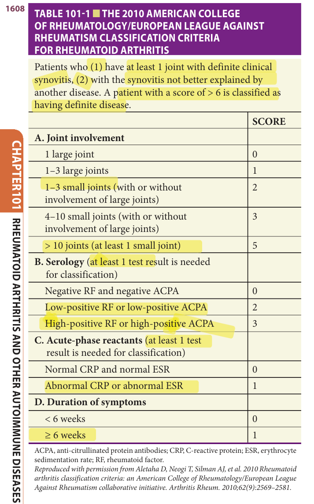
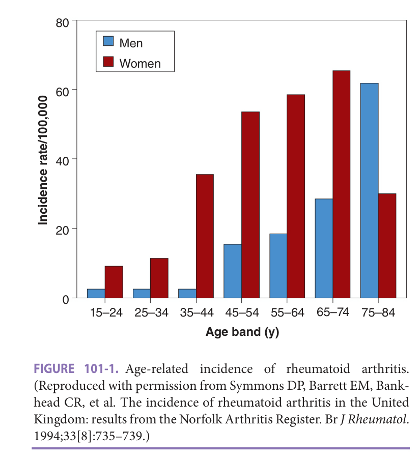
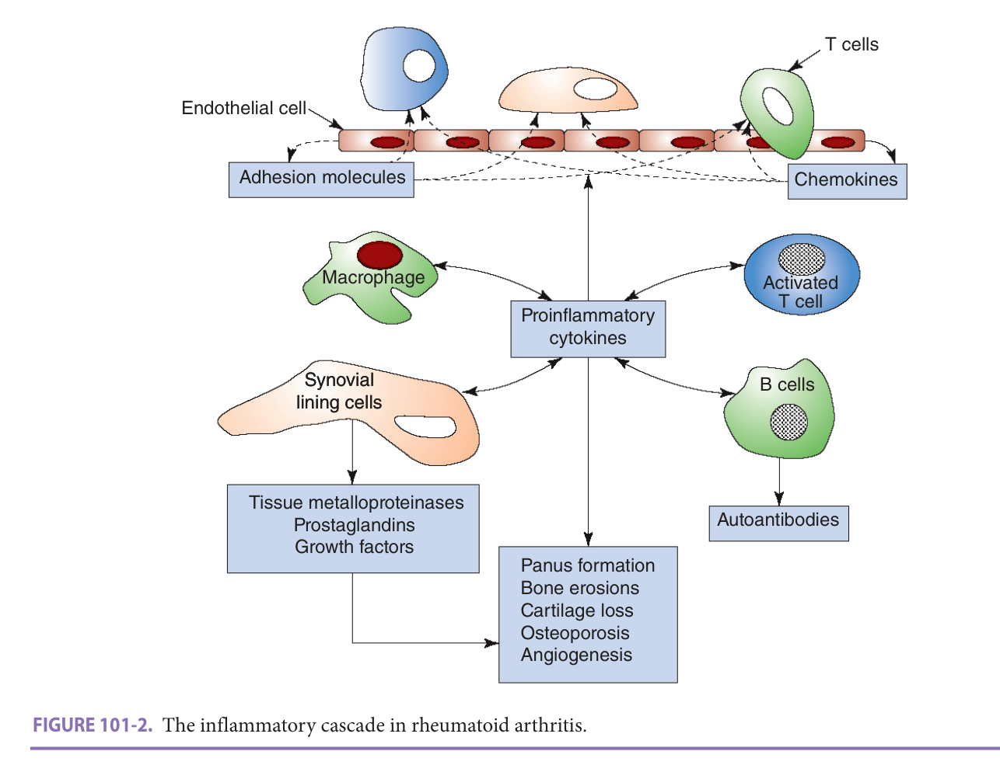
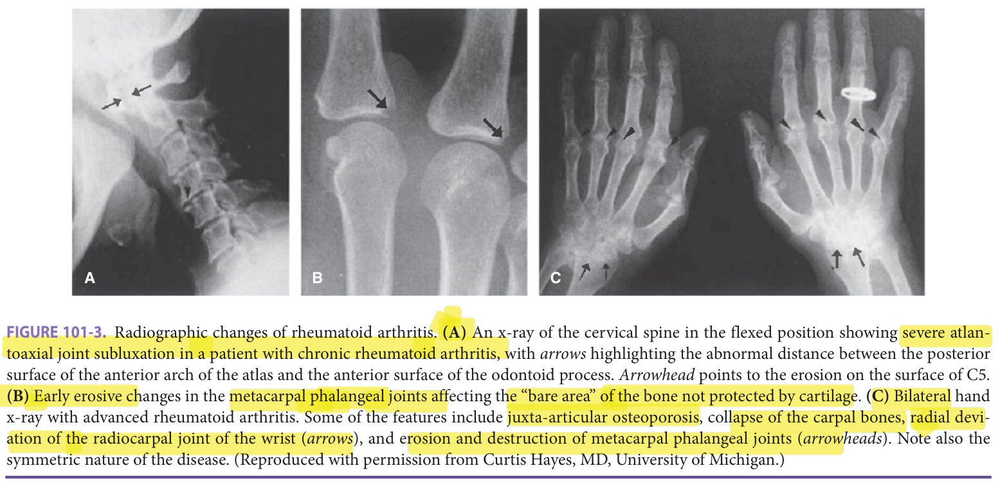
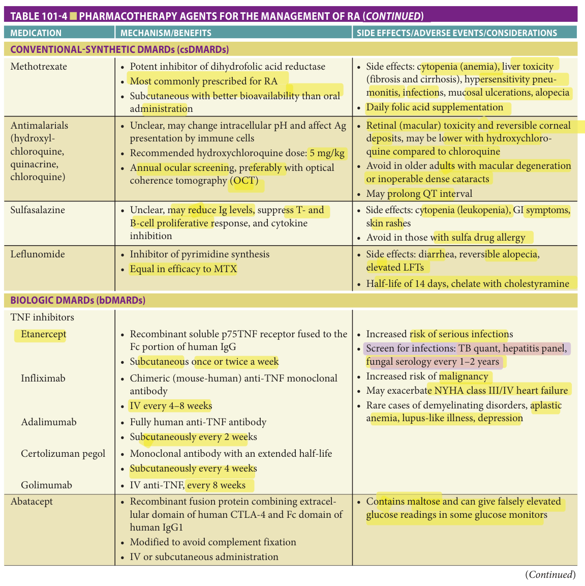
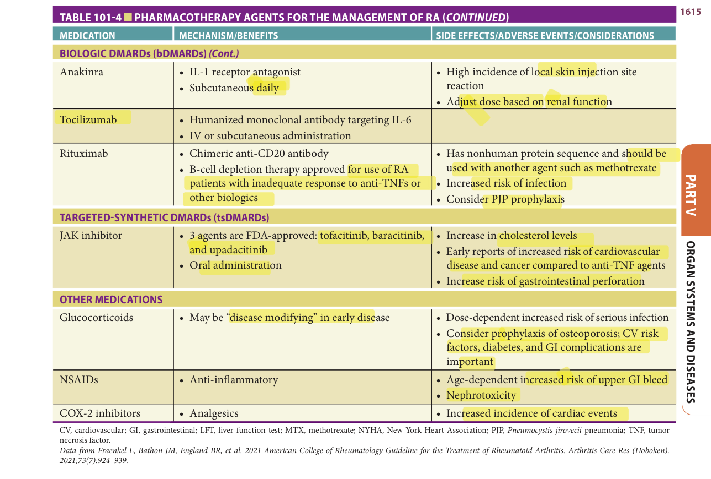
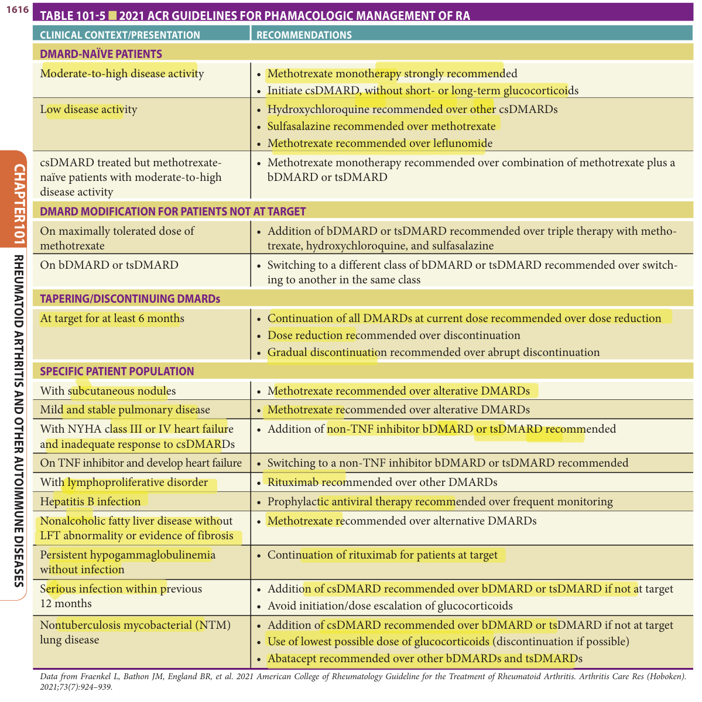
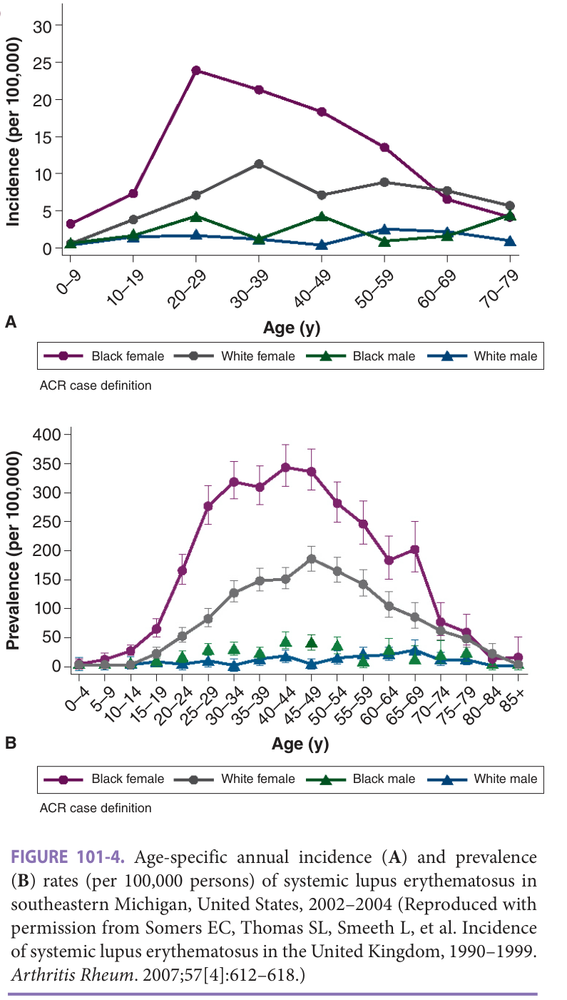
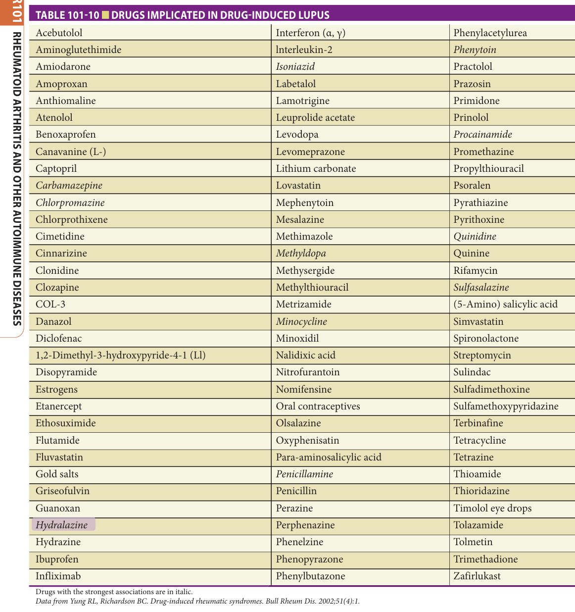
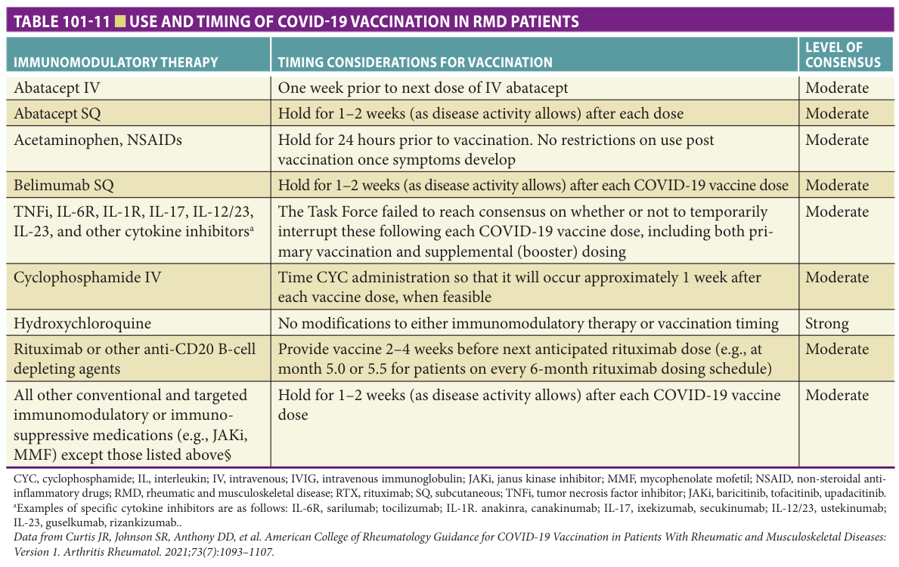

# Hazzard's Geriatric Medicine and Gerontology, 8e — Chapter 101: Rheumatoid Arthritis and Other Autoimmune Diseases

Jiha Lee, Raymond Yung

> **Lane-reviewed against the book, 25 Sep 2026.**

**[p. 1607]**

#### Learning Objectives

- To relate the consequence of aging to the clinical manifestations of rheumatoid arthritis (RA) and other autoimmune diseases.
- To understand the effects of age-associated physiologic changes and comorbidities on the use of common anti-rheumatic disease drugs.
- To identify the use and limitations of current rheumatic disease classification and treatment guidelines in older patients with autoimmune diseases.

#### Key Clinical Points

1. Patients with various autoimmune diseases exhibit evidence of accelerated aging.
2. Recent rheumatoid arthritis classification criteria focus on early disease diagnosis; their usefulness is untested in older patients with the disease.
3. Injectable and oral biologic therapies targeting multiple immune system pathways represent major advances in the treatment of autoimmune diseases, but these therapies are all associated with significant risk of side effects in older patients, particularly those with multiple comorbidities.
4. Functional and social assessments are important components in the management of autoimmune diseases in older adults.
5. It is important to exclude iatrogenic causes of rheumatic symptoms in older patients, as polypharmacy is a common issue in this age group.
6. Paraneoplastic rheumatic syndromes occur in many malignancies prevalent in older patients.

The past decade has witnessed tremendous strides in our understanding of the pathogenesis and approach to treatment of autoimmune diseases. This is mirrored by a growing knowledge of the many immune system changes in aging, and clinicians’ experience in administration of biological therapies in older adults with rheumatic diseases. While the field of rheumatology continues to focus on individual rheumatic illnesses, there is also a greater appreciation of the corresponding risks and side effects of these powerful agents on older patients with polypharmacy and multiple comorbid illnesses. This chapter summarizes recent key advances, with specific references to the geriatric population.

## Rheumatoid Arthritis

## Definition

Rheumatoid arthritis (RA) is a chronic systemic inflammatory disease that preferentially affects diarthrodial joints. The American College of Rheumatology (ACR), in collaboration with the European League Against Rheumatism (EULAR), updated the classification criteria of RA in 2010 ( **Table 101-1** ). The impetus for updating the original 1987 criteria was the recognition of the importance of early diagnosis and treatment of this disease. The new classification criteria therefore no longer include late sequelae of RA such as rheumatoid nodules or radiographic evidence of bony erosions. The new set of criteria should allow the study and treatment of patients with earlier stages of the disease. It should be noted that the new classification criteria apply to patients with objective evidence of synovitis in at least one joint, and the synovitis is not better explained by another disease such as lupus, psoriatic arthritis, or crystal-associated arthritis. It is also important to understand that the mean age of patients in the nine arthritis cohorts used to develop the new classification criteria ranges from 46 to 58 years. While the criteria set is useful for diagnosing early and active disease in younger patients, its usefulness in detecting community late-onset (> 60 years old) rheumatoid arthritis (LORA) has not been established. This is important because the disease presentation in LORA may be distinct from that of young-onset RA (YORA).

One important change in the 2010 classification criteria for RA is the inclusion of blood circulating anticyclic citrullinated peptide (anti-CCP) antibodies as equal to rheumatoid factor (RF) in its scoring system. Citrullination is a posttranslational modification of protein-bound arginine into the nonstandard amino acid citrulline, and many

**[p. 1608]**

citrullinated proteins have been found to be expressed in inflamed joints. Anti-CCP antibodies are as sensitive (70%–78%) as, and more specific (88%–96%) than IgM RF in early and fully established disease. Furthermore, the presence of these antibodies is a marker for erosive disease and may predict the eventual development of RA in patients presenting with undifferentiated arthritis. These antibodies may also be detected in healthy individuals, years before the onset of clinical RA. Anti-CCP antibodies may be helpful in assessing arthritis symptoms in high-risk groups, such as those with a strong family history of RA. Unlike classical RF, the incidence of anti-CCP antibodies does not appear to increase with normal aging, making it a particularly useful marker for this disease in older patient population.

**Table 101-1 — The 2010 American College of Rheumatology/European League Against Rheumatism classification criteria for rheumatoid arthritis**

Patients who (1) have at least 1 joint with definite clinical synovitis, (2) with the synovitis not better explained by another disease. A patient with a score of > 6 is classified as having definite disease.

| | SCORE |
|---|---|
| **A. Joint involvement** | |
| 1 large joint | 0 |
| 1–3 large joints | 1 |
| 1–3 small joints (with or without involvement of large joints) | 2 |
| 4–10 small joints (with or without involvement of large joints) | 3 |
| > 10 joints (at least 1 small joint) | 5 |
| **B. Serology (at least 1 test result is needed for classification)** | |
| Negative RF and negative ACPA | 0 |
| Low-positive RF or low-positive ACPA | 2 |
| High-positive RF or high-positive ACPA | 3 |
| **C. Acute-phase reactants (at least 1 test result is needed for classification)** | |
| Normal CRP and normal ESR | 0 |
| Abnormal CRP or abnormal ESR | 1 |
| **D. Duration of symptoms** | |
| < 6 weeks | 0 |
| ≥ 6 weeks | 1 |

ACPA, anti-citrullinated protein antibodies; CRP, C-reactive protein; ESR, erythrocyte sedimentation rate; RF, rheumatoid factor. _Reproduced with permission from Aletaha D, Neogi T, Silman AJ, et al. 2010 Rheumatoid arthritis classification criteria: an American College of Rheumatology/European League Against Rheumatism collaborative initiative. Arthritis Rheum. 2010;62(9):2569–2581._

> *Table 101-1 as printed (p. 1608).*

> Highlighting is the owner's annotation, not the book's.

In addition to classification criteria for the diagnosis of RA, the ACR has established criteria for functional status and for determining clinical remission in RA. The usefulness of these classification systems in older patients who often suffer functional disability from concomitant osteoarthritis, soft-tissue rheumatism, and cardiovascular or neurologic diseases is unclear.

## Epidemiology

The overall incidence of RA has been declining for a few decades. Interestingly, a long-term study from Mayo Clinic suggests that this may no longer be true. The study examined medical records in Olmsted County, Minnesota between 1985 and 2014, and found a steady incidence of age, sex, and race-adjusted RA. However, incidence of RF-positive RA decreased and incidence of RF-negative RA increased in 2005 to 2014 as compared with previous decades. The authors speculated that changing prevalence of environmental factors such as smoking, obesity, and others may have contributed to this trend.

The disease affects approximately 0.8% of the population in the United States and in many Western developed countries. Lower prevalence rates of 0.2% to 0.3% have been observed in China, Japan, some regions in Greece, and Africa. Southern Europeans may have a milder disease, with less extra-articular complications and less evidence of radiographic damage. Conversely, a much higher prevalence rate (up to 7%) and a more aggressive clinical course have been reported in several American-Indian and Alaska native populations. Gender and age are important factors in RA. Overall, women are affected by the disease two to three times more than men. However, this gender parity disappears in old age. The prevalence of RA increases with age and is commonest in the oldest group studied (often 65 years and older or 70 years and older). Approximately 5% of women older than 55 are affected by the disease. The incidence of RA also increases with age, with the peak incidence occurring in the sixth to eighth decades ( **Figure 101-1** ). The reason for the age-associated increase in disease susceptibility is currently unknown.

## Pathophysiology

There has been marked progress in our understanding of the pathogenesis of RA. In the future, RA and other autoimmune disease may be subclassified based on the individual’s genetic and molecular signatures, helping clinicians select the most appropriate treatment(s). RA is characterized by the activation and recruitment of T cells to the synovium, which set into motion a complex cascade of inflammatory responses ( **Figure 101-2** ). These responses result in further accumulation of inflammatory cells, panus formation, localized osteoporosis, bony erosions, and destruction of periarticular structures, which are characteristic of this disease. Rheumatoid synovitis is accompanied by the accumulation of inflammatory joint fluid with white cell count typically in the range of 2000 to 20,000 cells/mL. Soluble proteins that have been implicated in the inflammatory process include a number of proinflammatory cytokines (interleukin [IL]-1, IL-6, IL-13, IL-15, and tumor necrosis factor [TNF]), metalloproteinases (stromelysin, collagenases, and gelatinases), transforming growth factor-β,

**[p. 1609]**

granulocyte colony-stimulating factor, and activated complement components.

Genetic factors play an important role in RA susceptibility. The association between RA and human leukocyte antigen (HLA) has been refined to alleles coding for a “shared” epitope (the sequences QRRAA or QKRAA) on the HLA-DRB1 genes. The presence of the DRB1\*04 (DR4) allele is a marker for increased susceptibility and severe disease. Population differences in the prevalence of the “shared epitope” may help to explain in part the geographic variation in the prevalence of RA. Genome-wide association studies (GWAS) have identified over 50 genetic susceptibility loci, including the HLA-DRB1 allele, and. may help explain racial and geographical differences in RA susceptibility. Importantly, GWAS have identified new and exciting pharmaceutical targets for this disease.

An infectious etiology for RA has been postulated for more than half a century. Acute and chronic “reactive” arthritis can follow specific gastrointestinal (GI) or genital urinary infection. A transient RA-like illness can be seen in viral infections including parvovirus B19, Epstein-Barr virus, and human T-lymphotropic virus type 1. Accumulating evidence suggests that “dysbiosis” of the oral and intestinal microbiomes may be important in RA pathogenesis. _Porphyromonas gingivalis_ , which causes periodontal diseases and contains the citrullination enzyme peptidyl-arginine deiminase, has been linked to RA autoantibody formation and joint inflammation. Dysbiosis in older adults, usually referred to as inflammaging, contributes to the chronic low-grade proinflammatory state, and may influence characterization of RA in older adults.

> *FIGURE 101-1. Age-related incidence of rheumatoid arthritis. (Reproduced with permission from Symmons DP, Barrett EM, Bankhead CR, et al. The incidence of rheumatoid arthritis in the United Kingdom: results from the Norfolk Arthritis Register. _Br J Rheumatol_. 1994;33[8]:735–739.)*

> Highlighting is the owner's annotation, not the book's.

> *FIGURE 101-2. The inflammatory cascade in rheumatoid arthritis.*

> Highlighting is the owner's annotation, not the book's.

RA had been considered to be primarily a Th (T helper) 1-mediated disease based on the cytokine and chemokine receptor profile of T cells in synovial joints. The related

**[p. 1610]**

Th 17 (IL-23/IL-17) pathway may also be important in driving disease chronicity and joint destruction, although targeting the IL-23/IL-17 pathway has only modest success in RA compared to other forms of inflammatory arthritis. Although it is tempting to postulate that RA-associated DRB1 epitope triggers disease by presenting an arthrogenic peptide to T cells, extensive search of unique peptides that are displayed selectively by RA-associated HLA molecules has so far been unsuccessful. Costimulatory molecules, including CD28 and CD60, may play a role in activating T cells in RA joints. Dysfunctional T and non-T cell immune signaling has been increasingly recognized to be important in RA pathogenesis. This has resulted in the successful development of tofacitinib, a Janus kinase inhibitor (JAK inhibitor), as a novel therapy for RA. The precise contribution of B cells in RA pathogenesis is less well defined. The recent success of B cell depletion therapy has refocused attention on the role of these immune cells beyond autoantibody production, including plasma cells differentiation, and their immunomodulating effects on proinflammatory cytokines such as IL-6 and IL-17.

**Aging effects** The reason for the age-associated increase in RA susceptibility is unclear. The traditional view that aging is associated with a “decline” in immune response does not explain the high incidence and severe onset of this autoimmune disease that is commonly seen in older adults. Decline in sex hormone production also cannot account for the high incidence of RA in postmenopausal women. Age-related decline in thymic function has been suggested as a possible mechanism in autoimmunity in aging. While features of accelerated immune system aging are prevalent in RA patients, it is unclear if these represent primary or secondary events. Unlike in their younger counterparts, LORA occurs with equal frequency in men and women. Again, the rising incidence of RA in postmenopausal women suggests that reproductive hormones may influence the disease manifestation. However, they are unlikely to play a major pathogenic role in older adult population.

A central role of T cells in RA pathogenesis is well established, and enhanced production of proinflammatory cytokines in aging, including IL-6, TNF-α, and IL-1, important in the recruitment of T cells to RA joints may contribute to the increased susceptibility and severity of RA in older patients. Aging-associated obesity and changes in the gut microbiota may be important sources of chronic low-grade inflammation in older patients, which in turn may play a role in age-related diseases such as coronary artery disease, metabolic syndrome, Alzheimer disease, and cancer.

## Presentation

Whether LORA is a different disease from YORA is controversial. The clinical studies that address the issue were mostly descriptive or cross-sectional studies done in the 1950s and 1960s that have significant methodologic problems. The older definition of RA used in these studies also allowed terms such as “classical,” “definite,” and “probable” RA, which are no longer used today. As mentioned before, the most current RA classification criteria have not been validated in older patients.

**Table 101-2 — Clinical features of older adult-onset rheumatoid arthritis**

- Age of onset > 60 years
- Male: female ~1:1
- Acute presentation
- Oligoarticular (2–6 joints) disease
- Involvement of large and proximal joints
- Systemic complaints, eg, weight loss
- Absence of rheumatoid nodules
- Sicca symptoms common
- Laboratory: high erythrocyte sedimentation rate; often negative rheumatoid factor

Table 101-2 summarizes the features of LORA. In general, patients with LORA have a more equal gender distribution. The large joints, including the shoulder joint, are more often involved at presentation in LORA. Whether this is a result of concomitant rotator cuff disease that is prevalent in this age group is unclear. Symptoms in the proximal girdles have led to the belief that LORA may present with a polymyalgia rheumatica-like illness. Erythrocyte sedimentation rate (ESR) normally increases with age, especially in women. Elevated ESR is also more common in LORA. The prevalence of RF similarly increases after the age of 60 years, reaching 30% by the age of 90 years. Earlier reports suggest a lower frequency of RF in LORA than YORA. However, this has not been confirmed in more recent studies. As in younger patients, patients with LORA who are seropositive for RF have more severe clinical disease, more bony erosions on x-ray, worse functional outcome, and increased mortality. Whether patients with LORA who are seropositive have worse prognosis than do their younger counterparts is unclear. It is possible that the poor prognosis of LORA reported in some studies reflects the greater number of comorbid conditions that are present in older patients.

“Benign polyarthritis in older adults” occurs in up to a third of patients with LORA. They have a more explosive disease onset associated with systemic features such as fever and night sweats. The clinical features have led some to describe the disease as “infectious like.” The disease is called benign because its general prognosis is good, with most people going into remission within 1 year with or without treatment. Within this group can be included a peculiar syndrome unique to older patients called the RS3PE (remitting, seronegative, and symmetric synovitis with pitting edema) syndrome. This typically affects older adult men (2–3:1, male to female ratio) and is characterized by acute onset of symmetric polyarthritis/tenosynovitis with pitting edema involving both upper and lower extremities. As the name implies, these patients generally

**[p. 1611]**
have negative RF and antinuclear antibody (ANA). They often have high ESR and respond to low-dose prednisone. The association with HLA-B7 has been reported inconsistently. RS3PE may occasionally be associated with other rheumatic diseases, including polymyalgia rheumatica, spondyloarthropathies, psoriatic arthritis, RA, and sarcoid, and, rarely, malignancies.

## Evaluation

The assessment of RA in older adults is different from that of the younger age group. The nonspecific symptoms and signs of RA are prevalent in older patients. Rheumatic diseases that can mimic LORA, such as polymyalgia rheumatica, osteoarthritis, and crystal-induced arthritis, are prevalent in the older patient population. Anti-CCP antibody measurement may be useful in distinguishing LORA from polymyalgia rheumatica. In one small study, 65% of patients with LORA were anti-CCP antibody positive, but none of the patients with PMR or aged healthy subjects had the antibodies. Arthritis associated with malignancy can be misdiagnosed as RA before the correct diagnosis is made months or years later. Other differential diagnoses of RA in older population include inflammatory (erosive) osteoarthritis, late-onset spondyloarthropathy, endocrinopathy (eg, hypothyroidism, hyperparathyroidism, and diabetic cheiroarthropathy), amyloidosis, and the edematous phase of scleroderma. Conditions such as sarcoidosis, adult Still disease, hemochromatosis, and glycogen storage diseases can mimic RA but are unlikely to present for the first time so late in life. In addition to the above considerations, the initial evaluation of an older patient with RA should include a careful assessment of the patient’s living condition, social support, and cognitive and functional status. Many older patients have the misconception that there is no effective treatment for arthritis, and they should accept their physical suffering as part of normal aging. Older adults may feel embarrassed about or minimize their symptoms of arthritis by using terms such as “aching” and “stiff” instead of pain. Unfortunately, many clinicians also do not take their symptoms seriously, resulting in older adults receiving less aggressive treatment and the patients frequently feeling that their care resembles “a lick and a promise.” Because pain is, by far, the commonest presenting symptom of RA, pain assessment should be an integral part of the patient’s evaluation at presentation and in subsequent office visits. This can be difficult in older patients who have significant cognitive or verbal impairment. Information from caregivers, nonverbal pain behavior, physical and radiographic evidence of active joint inflammation, and decline in function are important clues that more aggressive therapy may be necessary.

The ACR classification system for assessing the functional status of patients with RA is shown in **Table 101-3** . However, use of this classification for an older patient may be difficult because of functional disability from other coexisting diseases. This quick assessment tool is useful for describing the global functional status and allows patients to be grouped for studies. Patients with RA with the worst (class IV) functional status were reported to have extremely poor prognosis, with survival similar to patients with multiple vessel coronary artery disease and stage IV Hodgkin lymphoma. More recently the ACR recommended five RA disease activity measures including the Disease Activity Score in 28 Joints (DAS28) with ESR or C-reactive protein (CRP), Clinical Disease Activity Index (CDAI), and Simplified Disease Activity Index (SDAI), along with three patient-reported functional status assessment measures including the Patient-Reported Outcomes Measurement Information System (PROMIS) physical function 10-item short form and the Health Assessment Questionnaire (HAQ) for routine use in clinical practice in patients with RA. These composite measures containing patient, provider, laboratory, and/or imaging data have been used to evaluate physical, mental, and social health in older adults. Many clinicians now feel that the prognosis for RA has improved with the advent of better therapeutic regimens for RA in the past two decades. Whether this translates into prolonged survival remains to be determined. Concomitant medical conditions affecting the patient’s hearing, eyesight, continence, and balance need to be addressed to optimize functional ability and to prevent falls. Current and past medical histories are important elements of the initial evaluation. This information is needed for the selection of specific treatment (see “Management” section). In contrast, family history is not as clinically helpful in assessing older patients with RA.

**Table 101-3 — American College of Rheumatology 1991 revised criteria for the classification of global functional status in rheumatoid arthritis**

| | |
|---|---|
| Class I | Completely able to perform usual activities of daily living (self-care, vocational, and avocational) |
| Class II | Able to perform usual self-care and vocational activities, but limited in avocational activities |
| Class III | Able to perform usual self-care activities, but limited in vocational and avocational activities |
| Class IV | Limited in ability to perform usual self-care, vocational, and avocational activities |

_Reproduced with permission from Hochberg MC, Chang RW, Dwosh I, et al. The American College of Rheumatology 1991 revised criteria for the classification of global functional status in rheumatoid arthritis. Arthritis Rheum. 1992;35(5):498–502._

In addition to excluding the diseases mentioned above, a new patient suspected of having RA should be tested for the presence of anemia, cytopenia, liver or renal dysfunction, RF, anti-CCP, and elevated inflammatory markers of ESR and CRP. The presence of extremely high RF should prompt the clinician to consider the possible diagnosis of cryoglobulinemia. Some patients have negative RF but positive ANA. These patients tend to have more severe

**[p. 1612]**

disease, similar to the patients with positive RF. A work-up for secondary Sjögren syndrome should be done in patients with concurrent sicca symptoms (dry eye and dry mouth). In general, ESR is a better indicator of disease activity than changes in the titer of RF. For some patients CRP level may more closely parallel their clinical course than ESR. Anti-CCP titer is not useful in following RA disease activity, although patients with reduced anti-CCP antibodies may have less joint damage in the long run. Anti-mutated citrullinated vimentin (MCV) antibodies have been touted as potentially new biomarkers for RA; early studies suggest the test could be a better predictor of aggressive disease and bone erosion than the anti-CCP test. Age does not appear to impact anti-MCV antibody titer, although this has not been demonstrated to be true in older RA population. A multibiomarker blood test of 12 proteins, Vectra DA, for determining RA disease activity has been approved by the US Food and Drug Administration (FDA). The test has good correlation with traditional clinical assessment of RA disease activity. The test is intended to complement, and not replace, sound clinical judgment. The test could be a useful objective tool in older RA patients who are unable to provide reliable feedback to the clinician because of impaired cognitive function or other comorbidities. “Cytokine panel” can be measured to examine for individual patient’s proinflammatory cytokine profile, but its role in personalized medicine (eg, choosing between anti-TNF versus another class of biologic therapy) and improving clinical outcomes has not been established.

Radiographic joint examination is an integral part of the evaluation of patients with RA. Older patients with RA for more than 10 years are at particular risk of cervical spine disease and atlantoaxial joint instability. This is an important consideration before a patient is intubated, as overextension of the cervical spine may compromise the brainstem or spinal cord. Early x-ray changes include soft-tissue swelling and regional osteoporosis around the joint. Typical erosions in hands and feet involve the juxtaarticular “bare areas” of bone not covered with cartilage ( **Figure 101-3** ). Isolated erosions in the first and second metacarpophalangeal joints may prompt the clinician to search for occult calcium pyrophosphate depositive disease, hyperparathyroidism, or hemochromatosis. Erosions are less common in the knee and hip joints. At these sites, RA typically causes cartilage loss and joint-space narrowing. Joint-space narrowing occurring predominantly in the lateral compartment of the knee and diffusely in the hip without bony proliferation is helpful for distinguishing RA from osteoarthritis. To assess joint-space narrowing of the knees, clinicians should request semiflexed weight-bearing films.

> *FIGURE 101-3. Radiographic changes of rheumatoid arthritis. **(A)** An x-ray of the cervical spine in the flexed position showing severe atlantoaxial joint subluxation in a patient with chronic rheumatoid arthritis, with _arrows_ highlighting the abnormal distance between the posterior surface of the anterior arch of the atlas and the anterior surface of the odontoid process. _Arrowhead_ points to the erosion on the surface of C5. **(B)** Early erosive changes in the metacarpal phalangeal joints affecting the “bare area” of the bone not protected by cartilage. **(C)** Bilateral hand x-ray with advanced rheumatoid arthritis. Some of the features include juxta-articular osteoporosis, collapse of the carpal bones, radial deviation of the radiocarpal joint of the wrist ( _arrows_ ), and erosion and destruction of metacarpal phalangeal joints ( _arrowheads_ ). Note also the symmetric nature of the disease. (Reproduced with permission from Curtis Hayes, MD, University of Michigan.)*

> Highlighting is the owner's annotation, not the book's.

Because of the limitation of clinical examination in detecting subtle signs of inflammation, peripheral joint ultrasound and magnetic resonance imaging have been increasingly used for detecting early or mild synovitis. The majority of patients with treated disease and considered by their physicians to be in remission continue to have evidence of active synovitis in advanced imaging such as ultrasound and magnetic resonance imaging. The unanswered question is whether more aggressive treatments of patient with clinically inactive disease but imaging evidence of ongoing synovitis affect patient outcomes such as overtreatment (and drug side effects), and long-term disability. Moreover, older patients with RA have additional facets that need to be taken into consideration, such as a more limited lifespan and greater infection risk with immunosuppression. Although embraced by many rheumatologists, the utility of these sensitive imaging modalities in clinical practice remains incompletely defined. The ACR “Choosing Wisely” recommendations recommend that MRI of the peripheral joints should not be used to routinely monitor

**[p. 1613]**

inflammatory arthritis. And the ACR Musculoskeletal Ultrasound Committee recognizes that the imaging modality may be reasonable to use in many clinical scenarios in rheumatology practice, but lacks cost-effectiveness data.

There is no evidence that patients with LORA are more likely to develop extra-articular disease, as compared to those with YORA. However, older patients may be disproportionately affected because extra-articular manifestations are more common in chronic RA. High titer of RF is a risk factor for extra-articular RA, especially in male patients. Rheumatoid nodules are the most characteristic extra-articular manifestation of RA and are present in up to 40% of seropositive White patients. These are most commonly found in areas of pressure such as the elbows, heels, and sacrum. Their presence does not correlate with disease activity and may increase in number during methotrexate therapy when synovitis is improving. Rheumatoid vasculitis affects vessels of all sizes. This complication may present as cutaneous vasculitis, mononeuritis multiplex, nail fold infarcts, or deep “punched-out” ulcers at atypical sites that fail to respond to conventional therapy. Pleuritis and pericarditis are found in 20% to 30% of patients with RA and do not usually cause any symptoms. Other respiratory complications of RA include pulmonary granuloma (often in the upper lobes), Caplan syndrome, fibrosing alveolitis, and bronchiolitis obliterans. Felty syndrome (RA with splenomegaly and neutropenia) typically occurs in White patients with long-standing, chronic erosive RA. These patients are at increased risk of developing lymphoproliferative malignancies. Thrombocytopenia may occur, in part, because of splenic sequestration. Mild-to-moderate normochromic, normocytic anemia is extremely common in patients with chronic RA. Iatrogenic causes (eg, nonsteroidal anti-inflammatory drugs [NSAIDs] and methotrexate) of anemia need to be excluded in all patients with RA who have anemia.

## Management

A number of treatment concepts and standards have emerged in RA clinical management. There is increasing recognition of the benefits of early and aggressive therapies in improving the long-term outcomes of RA. Outdated treatment goals have focused on improving patient symptoms by 25% or 50%. The concept of “treat-to-target” has long been embraced by clinicians treating diseases such as hypertension, hyperlipidemia, and diabetes. A similar “treat-to-target” approach has gained wide acceptance in RA management, utilizing composite disease activity indexes that have traditionally been confined to research, such as the DAS-28 or CDAI. The advent of biological therapies has allowed clinicians to aim for disease remission in many RA patients. And patients with poor prognostic factors of female sex, seropositive for RF and anti-CCP, increased inflammatory markers, functional limitations, and erosive changes on radiography have benefited from early initiation of biologic therapy. Nevertheless, there are unanswered questions about this aggressive management approach. These include lack of consensus on what disease activity measurements should be used and frequency of monitoring. And important issues to be addressed in future research include treatment burden (including cost and side effects), and benefits in remaining life (prognostication) in older patients with multi-comorbid diseases.

**Nonpharmacologic therapies** Successful management of RA involves patient participation in his/her care. In addition, family, social, and psychological supports are particularly critical in maintaining the older RA patient’s independence. Older patients diagnosed with the disease may be particularly fearful of what it means to their independence or may become depressed. Establishing a good rapport, gaining the trust of the patient and the family, providing information about the nature of the disease, and setting realistic goals are all important elements of the initial management of RA. Many patients and their relatives also find it helpful to seek out support groups in their local area. Increasingly, older patients and their families are turning to the Internet, health magazines, and other nontraditional sources for information about treatment options, including over-the-counter complementary therapies. There is a need for health care professionals to become knowledgeable in web and social media medical resources. Unexpected side effects of over-the-counter medications are increasingly being recognized. The latest information is often not available in traditional textbooks. Directing the patients to reputable websites such as those offered by the National Institute on Aging, the National Center for Complementary and Integrative Health, the Natural Medicines Comprehensive Database, the Cochrane Reviews, the American College of Rheumatology, or the Arthritis Foundation can be useful for more up-to-date information.

Nonpharmacologic therapies are crucial components of the total care of the patient with RA, which should be emphasized throughout the treatment course. In addition to their inherent usefulness, participation in these treatment modalities often provides the patients and their families with a sense of control over their chronic illness. The interprofessional team approach that typifies geriatric medicine is eminently suitable for treating older patients with chronic arthritis. Physical and occupational therapy should be offered to every patient with RA, including those with mild and early disease. Education about rest/activity, use of cold/heat, massage, and adaptive devices (to improve function and to prevent/correct joint deformity) are important. Performing exercises to strengthen muscles and ligaments for joint protection, gait training, and fall prevention can make a big difference in the life of patients with RA. Community-based exercise programs, such as the Centers for Disease Control and Prevention (CDC)-endorsed Arthritis Foundation Exercise Program (AFEP), are a good resource for those who are able to participate. Psychological counseling and support groups are often helpful, especially to those who are socially isolated because of their arthritis. Depression

**[p. 1614]**

is increasingly recognized as a common problem in older patients and in those with chronic illness. Adequate treatment will help break the vicious cycle of pain, depression, and disability. Although nonpharmacologic therapies do not affect the progression of RA joint destruction, they can improve the patient’s quality of life and help to reduce the requirement for pain medications that have significant potential for side effects in this vulnerable population.

**Pharmacologic therapies** There is an explosion of new drugs available for the treatment of RA. In particular, the number of biological response modifiers available to clinicians has expanded considerably, and many more are in the late stages of clinical development. The success of these agents, which target soluble inflammatory proteins, T cells, and B cells, suggests that targeting the downstream mediators may be sufficient to modulate the disease. The mechanism of action, monitoring considerations, and common side effects of conventional synthetic disease-modifying antirheumatic drugs (csDMARDs), targeted synthetic DMARDs (tsDMARDs), and biologic DAMRDs (bDMARDs) are summarized in **Table 101-4** .

The gradualism of the “pyramid approach” to RA treatment in the 1980s has been replaced with the widespread “treat-to-target” approach that aims to suppress RA

**[p. 1615]**

disease activity as completely and as soon as possible once the diagnosis is confirmed. This change in philosophy is, in part, a result of the recognition that joint damage occurs much sooner than was previously believed. Results of well-designed clinical trials have persuaded many that this new standard is attainable with more aggressive and early initiation of drug regimens. The 2021 ACR Guideline for the Treatment of Rheumatoid Arthritis provides updated recommendations for the pharmacologic management of RA, taking into consideration current disease activity, prior therapies used, and the presence of comorbidities **(Table 101-5)** . For DMARD-naïve RA patients with moderate-to-high disease activity, methotrexate monotherapy is recommended over other csDMARD (as dual or triple therapy), bDMARD, or tsDMARD therapy. Oral methotrexate is recommended at initiation, and those not at target may switch to subcutaneous methotrexate for better bioavailability. For RA patients not at target despite maximal tolerated methotrexate use, addition of bDMARD or tsDMARD is recommended, over triple therapy of methotrexate, hydroxychloroquine, and sulfasalazine. If patients have inadequate response to a bDMARD or tsDMARD, they may switch to a different class of biologic-modifying DMARD.

**Table 101-4 — Pharmacotherapy agents for the management of RA (continued)**

| MEDICATION | MECHANISM/BENEFITS | SIDE EFFECTS/ADVERSE EVENTS/CONSIDERATIONS |
|---|---|---|
| **CONVENTIONAL-SYNTHETIC DMARDs (csDMARDs)** | | |
| Methotrexate | • Potent inhibitor of dihydrofolic acid reductase • Most commonly prescribed for RA • Subcutaneous with better bioavailability than oral administration | • Side effects: cytopenia (anemia), liver toxicity (fibrosis and cirrhosis), hypersensitivity pneumonitis, infections, mucosal ulcerations, alopecia • Daily folic acid supplementation |
| Antimalarials (hydroxylchloroquine, quinacrine, chloroquine) | • Unclear, may change intracellular pH and affect Ag presentation by immune cells • Recommended hydroxychloroquine dose: 5 mg/kg • Annual ocular screening, preferably with optical coherence tomography (OCT) | • Retinal (macular) toxicity and reversible corneal deposits, may be lower with hydroxychloroquine compared to chloroquine • Avoid in older adults with macular degeneration or inoperable dense cataracts • May prolong QT interval |
| Sulfasalazine | • Unclear, may reduce Ig levels, suppress T- and B-cell proliferative response, and cytokine inhibition | • Side effects: cytopenia (leukopenia), GI symptoms, skin rashes • Avoid in those with sulfa drug allergy |
| Leflunomide | • Inhibitor of pyrimidine synthesis • Equal in efficacy to MTX | • Side effects: diarrhea, reversible alopecia, elevated LFTs • Half-life of 14 days, chelate with cholestyramine |
| **BIOLOGIC DMARDs (bDMARDs)** | | |
| TNF inhibitors | | |
| Etanercept | • Recombinant soluble p75TNF receptor fused to the Fc portion of human IgG • Subcutaneous once or twice a week | • Increased risk of serious infections • Screen for infections: TB quant, hepatitis panel, fungal serology every 1–2 years • Increased risk of malignancy • May exacerbate NYHA class III/IV heart failure • Rare cases of demyelinating disorders, aplastic anemia, lupus-like illness, depression |
| Infliximab | • Chimeric (mouse-human) anti-TNF monoclonal antibody • IV every 4–8 weeks | |
| Adalimumab | • Fully human anti-TNF antibody • Subcutaneously every 2 weeks | |
| Certolizuman pegol | • Monoclonal antibody with an extended half-life • Subcutaneously every 4 weeks | |
| Golimumab | • IV anti-TNF, every 8 weeks | |
| Abatacept | • Recombinant fusion protein combining extracellular domain of human CTLA-4 and Fc domain of human IgG1 • Modified to avoid complement fixation • IV or subcutaneous administration | • Contains maltose and can give falsely elevated glucose readings in some glucose monitors |

> *Table 101-4 as printed (p. 1614). The side-effect bullets in the TNF-inhibitor row span all five TNF inhibitors in the printed table.*

> Highlighting is the owner's annotation, not the book's.

**Table 101-4 — Pharmacotherapy agents for the management of RA (continued)**

| MEDICATION | MECHANISM/BENEFITS | SIDE EFFECTS/ADVERSE EVENTS/CONSIDERATIONS |
|---|---|---|
| **BIOLOGIC DMARDs (bDMARDs) (Cont.)** | | |
| Anakinra | • IL-1 receptor antagonist • Subcutaneous daily | • High incidence of local skin injection site reaction • Adjust dose based on renal function |
| Tocilizumab | • Humanized monoclonal antibody targeting IL-6 • IV or subcutaneous administration | |
| Rituximab | • Chimeric anti-CD20 antibody • B-cell depletion therapy approved for use of RA patients with inadequate response to anti-TNFs or other biologics | • Has nonhuman protein sequence and should be used with another agent such as methotrexate • Increased risk of infection • Consider PJP prophylaxis |
| **TARGETED-SYNTHETIC DMARDs (tsDMARDs)** | | |
| JAK inhibitor | • 3 agents are FDA-approved: tofacitinib, baracitinib, and upadacitinib • Oral administration | • Increase in cholesterol levels • Early reports of increased risk of cardiovascular disease and cancer compared to anti-TNF agents • Increase risk of gastrointestinal perforation |
| **OTHER MEDICATIONS** | | |
| Glucocorticoids | • May be “disease modifying” in early disease | • Dose-dependent increased risk of serious infection • Consider prophylaxis of osteoporosis; CV risk factors, diabetes, and GI complications are important |
| NSAIDs | • Anti-inflammatory | • Age-dependent increased risk of upper GI bleed • Nephrotoxicity |
| COX-2 inhibitors | • Analgesics | • Increased incidence of cardiac events |

CV, cardiovascular; GI, gastrointestinal; LFT, liver function test; MTX, methotrexate; NYHA, New York Heart Association; PJP, _Pneumocystis jirovecii_ pneumonia; TNF, tumor necrosis factor. _Data from Fraenkel L, Bathon JM, England BR, et al. 2021 American College of Rheumatology Guideline for the Treatment of Rheumatoid Arthritis. Arthritis Care Res (Hoboken). 2021;73(7):924–939._

> *Table 101-4 as printed (p. 1615).*

> Highlighting is the owner's annotation, not the book's.

Clinicians are often reluctant to use csDMARDs such as methotrexate and leflunomide as monotherapy because of their limited efficacy, high dropout rate, and potential serious side effects, especially in older patients. Great caution and dose adjustment are often needed when using these drugs to treat older adults with RA, especially in those with a history of renal and liver failure. The use of bDMARD or tsDMARDs in combination with or without methotrexate can boost the therapeutic efficacy of selected biologics. However, whether older patients tolerate combination therapies as well as monotherapy is uncertain.

Rituximab may be of benefit in patients with RA refractory to other biologic therapy and extra-articular manifestations such as rheumatoid vasculitis and interstitial lung disease. The main advantage of using combination of csDMARD therapy over the anticytokine biologic treatments is cost. Many European countries and US insurance companies continue to require patients to have a trial of methotrexate before receiving biologic therapies. An important advantage of biologic agents is rapid onset of action, with many patients experiencing improvement within a few weeks of treatment. These agents appear to be effective in patients with both seropositive and seronegative RA. The author has also found in his own practice that biologics

**[p. 1616]**

are more efficacious in reducing specific symptoms such as fatigue in RA patients, compared to csDMARDs.

**Table 101-5 — 2021 ACR guidelines for phamacologic management of RA**

| CLINICAL CONTEXT/PRESENTATION | RECOMMENDATIONS |
|---|---|
| **DMARD-NAÏVE PATIENTS** | |
| Moderate-to-high disease activity | • Methotrexate monotherapy strongly recommended • Initiate csDMARD, without short- or long-term glucocorticoids |
| Low disease activity | • Hydroxychloroquine recommended over other csDMARDs • Sulfasalazine recommended over methotrexate • Methotrexate recommended over leflunomide |
| csDMARD treated but methotrexate-naïve patients with moderate-to-high disease activity | • Methotrexate monotherapy recommended over combination of methotrexate plus a bDMARD or tsDMARD |
| **DMARD MODIFICATION FOR PATIENTS NOT AT TARGET** | |
| On maximally tolerated dose of methotrexate | • Addition of bDMARD or tsDMARD recommended over triple therapy with methotrexate, hydroxychloroquine, and sulfasalazine |
| On bDMARD or tsDMARD | • Switching to a different class of bDMARD or tsDMARD recommended over switching to another in the same class |
| **TAPERING/DISCONTINUING DMARDs** | |
| At target for at least 6 months | • Continuation of all DMARDs at current dose recommended over dose reduction • Dose reduction recommended over discontinuation • Gradual discontinuation recommended over abrupt discontinuation |
| **SPECIFIC PATIENT POPULATION** | |
| With subcutaneous nodules | • Methotrexate recommended over alterative DMARDs |
| Mild and stable pulmonary disease | • Methotrexate recommended over alterative DMARDs |
| With NYHA class III or IV heart failure and inadequate response to csDMARDs | • Addition of non-TNF inhibitor bDMARD or tsDMARD recommended |
| On TNF inhibitor and develop heart failure | • Switching to a non-TNF inhibitor bDMARD or tsDMARD recommended |
| With lymphoproliferative disorder | • Rituximab recommended over other DMARDs |
| Hepatitis B infection | • Prophylactic antiviral therapy recommended over frequent monitoring |
| Nonalcoholic fatty liver disease without LFT abnormality or evidence of fibrosis | • Methotrexate recommended over alternative DMARDs |
| Persistent hypogammaglobulinemia without infection | • Continuation of rituximab for patients at target |
| Serious infection within previous 12 months | • Addition of csDMARD recommended over bDMARD or tsDMARD if not at target • Avoid initiation/dose escalation of glucocorticoids |
| Nontuberculosis mycobacterial (NTM) lung disease | • Addition of csDMARD recommended over bDMARD or tsDMARD if not at target • Use of lowest possible dose of glucocorticoids (discontinuation if possible) • Abatacept recommended over other bDMARDs and tsDMARDs |

_Data from Fraenkel L, Bathon JM, England BR, et al. 2021 American College of Rheumatology Guideline for the Treatment of Rheumatoid Arthritis. Arthritis Care Res (Hoboken). 2021;73(7):924–939._

> *Table 101-5 as printed (p. 1616).*

> Highlighting is the owner's annotation, not the book's.

As new data emerge and new therapies become available, it is anticipated that updated treatment guidelines will be available much more frequently than in the past. However, older adults are often excluded from clinical trials, leaving a gap in knowledge on the efficacy and safety of RA treatment with DMARDs. It will be important to draw from limited clinical trial data and observational studies to understand how the new guidelines apply to older RA patients, especially in those with multiple medical conditions. Pharmaceutical companies have increasingly included older adults in pre- and postmarketing clinical trials. Additionally, there are an increasing number of rheumatology research consortia and registries that have provided “real world” data on the benefits and side effects of new treatments on older RA patients. Knowing that these agents may be efficacious in older patients provides some reassurance to clinicians. However, it is important to remember that subjects participating in these studies rarely mirror the patients geriatricians see in their clinic who have multiple comorbidities and who already suffer from polypharmacy. The decision as to which biological modifier to use will depend on individual patient characteristics

**[p. 1617]**

such as comorbidity, patient preferences such as administration schedule, physician experience, and insurance coverage owing to the high cost of these drugs. Because of the complexity of modern treatment regimens, coupled with the need to monitor many potentially serious side effects, drug therapy for RA should ideally be instituted in consultation with a rheumatologist. Involvement of physicians experienced in the use of immunosuppressive therapies (eg, hematologists and oncologists, or a gastroenterologist in the case of infliximab) will be helpful in patients living in isolated communities where there may not be a local rheumatologist.

**_Safety and Other Issues with Biologics_** While there is little doubt about the potential efficacy of the biologics in RA, there remains significant concern about their side effects, especially in vulnerable populations such as older patients with RA having multiple comorbidities. One useful acronym for the safe use of biologics is CONSIDER, outlined in **Table 101-6** . TNF is involved in host defense against foreign pathogens and in tumor surveillance. The most important risk associated with anticytokine therapy for older patients with RA is the increased incidence of fungal infections, tuberculosis, and atypical mycobacterial infections. The incidences of infections and serious infection were higher among older adults with RA compared to younger patients enrolled in the community-based Consortium of Rheumatology Researchers of North America (CORRONA) registry. Moreover, infection risks associated with tofacitinib were comparable to that of other biologic DMARDs such as anti-TNF therapies. As tuberculosis is usually caused by reactivation of latent infection, tuberculosis skin testing or interferon-gamma release assay and a chest x-ray should be done prior to starting these agents. Whether yearly tuberculosis screening and chest x-ray to detect new exposure are necessary in countries with a low incidence of tuberculosis is unclear. Yearly screening is recommended for selected patients who are at risk, such as those who travel regularly to TB endemic areas and nursing home residents.

Rare cases of demyelinating disorders, aplastic anemia, lupus-like illnesses, and depression have also been associated with anti-TNF therapies. The long-term consequences of anticytokine suppression are unknown. One meta-analysis reported a fourfold higher rate of malignancies in patients treated with TNF inhibitors.

Rituximab dramatically lowers the peripheral blood B-cell count for months after the infusion, and these patients also have lower IgG and IgM levels. The use of rituximab has been associated with the reactivation of JC polyomavirus infection, resulting in the disease progressive multifocal leukoencephalopathy. This complication, although very rare, highlights the potential for the development of all B-cell–dependent viral diseases in patients receiving the drug. Interestingly, progressive multifocal leukoencephalopathy has also been reported in patients with multiple sclerosis receiving natalizumab, a chimeric anti-α4 integrin antibody. Patients on rituximab are at risk for hepatitis B reactivation, and should be screened for the virus before initiation of therapy. Interestingly, rituximab has been successfully used in hepatitis C virus (HCV)-associated cryoglobulinemia without worsening of HVC-associated liver disease.

Are biologics “cost effective” in the treatment of older adults with rheumatic diseases? Cost effectiveness for young patients with RA is based on remaining in the workforce, but there are no such data for the geriatric cohort of retirees, and it is hard to define the economic value of improved functional status or quality of life. Wide variability has been observed in the prescription of biologics for older adults and their economic impact is all the more elusive. Changes in frailty, falls, fractures, hospitalization for serious infections, and potentially inappropriate medication use may provide alternative measures of cost effectiveness of RA treatment in older adults. The US FDA approved several “biosimilars” for adalimumab, infliximab, and rituximab, and increasing competition among the growing number of biologics is anticipated to help drive down the cost. Additionally, lower doses (than FDA guidelines) and, in some cases, reducing dose frequencies or duration of biologic treatments may be acceptable in selected patients to reduce risk of side effects and cost without adversely affecting outcomes.

As in other populations, cardiovascular disease is the single largest cause of death in patients with autoimmune inflammatory disorders. However, after accounting for the known traditional risk factors for heart diseases, patients with RA and lupus are at greater risk of developing coronary artery disease and stroke than those without these conditions. The reason for the increased incidence of cardiovascular disease in patients with these disorders of autoimmunity is not clear. Furthermore, a patient with RA who has a myocardial infarction has a similar prognosis as that of a diabetic patient with a similar event. Conventional therapies, such as the use of lipid-lowering agents, may not reverse the cardiovascular risk associated with these inflammatory conditions. While not proven, it is hoped that use of more aggressive immunosuppressive regimens will help reduce the cardiovascular morbidity and mortality in these patients. Aging per se has been described by some as a state of chronic low-grade inflammation that has been termed “inflamm-aging,” which may play a role in frailty and sarcopenia in both normal aging and chronic inflammatory conditions such as RA. Current data do not support an increased risk of major adverse cardiovascular events in tocilizumab-treated RA patients, despite the drug’s propensity to increase lipid levels.

A disease-associated inflammatory state, chronic use of steroids, and the lack of exercise owing to arthritis-associated disability may all contribute to the high incidence of osteoporosis in older patients with rheumatic diseases. Since these are chronic conditions, aggressive treatment with antiresorptive agents, adequate calcium intake, and vitamin D to prevent and treat osteoporosis and fracture is critical.

Many RA therapies involve significant immunosuppression that may affect the patient’s ability to mount an antibody response to immunization, worsening the

**[p. 1618]**

already-impaired immune reaction as a result of immune senescence in older patients. It is, therefore, important that these patients are given their age-appropriate immunizations such as pneumococcal and flu vaccines preferably prior to receiving therapy with biologics. Patients already on biologics should avoid receiving any live vaccines.

**Table 101-6 — CONSIDER the following when using immunomodulatory therapy in older adults**

**Comorbidities:** The patient’s underlying conditions such as cancer, unhealing pressure ulcers, chronic lung diseases, frequent urinary tract infections, hypercholesterolemia, or diverticulitis can increase the risk of complications when using immunosuppressive medications. Cognitive issues may also result in noncompliance and increase the risk for side effects.

**Opportunistic infections:** The older and more frail patients are at an even greater risk of developing opportunistic infections when exposed to biologics, such as reactivation and new acquisition of tuberculosis, viral (eg, herpes zoster, cytomegalovirus, viral hepatitis), or fungal infections.

**Novel presentation of side effects:** Older adults often have novel or atypical presentation of infection complications. For example, the patient may present with altered mental status and be unable to mount a fever or adequate white cell count elevation.

**Screening:** The physician should ensure that the older rheumatic disease patient be appropriately screened for cancer, infection, dental health, and heart disease. There should be a low threshold for re-screening for health conditions and to initiate early treatment as necessary.

**Immunization:** If at all possible, older adults should receive vaccinations against infections before they are started on an immunomodulatory agent.

**Drug dosing and interactions:** Older patients are more likely to suffer from polypharmacy. While there is a paucity of information regarding drug interactions with biologics, old age has an effect on pharmacokinetics of selected biologics. In addition, it may be prudent to select shorter acting biologics in the older adult population who are at risk for severe infection complications.

**Evaluate:** Physicians need to aggressively evaluate and monitor older patients for early sign of adverse events, including more frequent follow-up, than younger patients.

**Remaining lifespan:** The potential benefit of biologics should be considered in the context of a patient’s life expectancy. Frail older patients with limited remaining lifespan are at high risk of side effects from biological therapies.

**_Glucocorticoid Use in Treatment of RA_** Clinicians continue to debate the role of glucocorticoids in the management of RA, despite intriguing data showing that in early disease it may be “disease modifying,” because of frequent difficulty tapering and negative impacts associated with unintended prolonged glucocorticoid use. There is general consensus that high-dose chronic oral glucocorticoids should not be used in RA. Low-dose glucocorticoid may be considered for short-term (< 3 months) symptom control in patients with active RA. Unfortunately, older patients commonly develop significant side effects and become functionally dependent on the drug. Medicare beneficiaries older than age 75 with RA receiving less than or equal to 5 mg, more than 5 to 10 mg, or more than 10 mg of glucocorticoid per day had a 20%, 32%, and 47% increased risk for serious infection, respectively, compared to 13% risk in nonglucocorticoid users. In addition to dose-dependency, the risk of serious infection increases with prolonged use of glucocorticoids even at low dose. Older RA patients in Canada (mean age 74) taking as little as 5 mg prednisolone had a 30%, 46%, or 100% increased risk of serious infection when used continuously for the prior 3 months, 6 months, or 3 years, respectively, compared to nonsteroid users. Overall, it is important to use the lowest dose of glucocorticoids, with alternate day dosing if possible, for the shortest duration of time possible in this population, and to discontinue the drug when it is feasible. Interestingly, provider preference is one of the strongest predictors of RA patients receiving long-term glucocorticoids use. Assessment, prophylaxis, and treatment of osteoporosis, cardiovascular risk factors, diabetes, and GI complications are important. Judicious use of intra-articular steroid injections may provide local (and systemic) symptom relief and may be safer than oral glucocorticoids in older patients with poorly controlled diabetes, severe osteoporosis, and congestive heart failure. A time-release prednisone formulation has been approved by the US FDA, and the drug can be taken at night to improve morning symptoms in RA patients.

## Prevention

A major problem in attempting to prevent RA is identifying those who are at risk of developing the disease in the first place. Although genetic studies provide some clues as to which segment of the population may be at risk, the available information is not precise enough to be of practical use. Conversely, epidemiologic data suggest that smoking is a strong risk factor for RA, as well as more active and difficult to control disease, and developing RA-related interstitial lung disease. Smoking cessation is associated with lower RA disease activity, and may delay or even prevent development of seropositive RA. Along with environmental factors, preclinical anti-CCP positivity is associated higher risk of developing erosive RA, and ongoing studies are examining the early use of DMARDs such as hydroxychloroquine to determine if such approaches will prevent development of the full-blown chronic disease.

## Special Issues

**Patient preference and comorbidity** The choice of therapy should be made in conjunction with the patient and the caregivers. Although exercises are important to maintain joint and muscle functions in patients with RA, some older patients are unable to perform regular exercises because of their other medical conditions, or if they have lived an inactive lifestyle for many years and are reluctant to adopt

**[p. 1619]**

any change. In these situations, emphasizing the positive aspects of exercise (physical, psychological, and social), setting realistic goals, and recommending exercise programs specially tailored for the older population are helpful. In this regard, finding a physical and occupational therapist accustomed to working with older adults is important. Too often the author has seen patients who refuse to return to their therapist because of unrealistic short-term exercise goals.

The importance of assessing a patient’s risk of developing GI, renal, or cardiac complications, and osteoporosis prior to starting NSAIDs and corticosteroids has already been emphasized. Patient preference is important when deciding on a specific DMARD. Older patients with poor eyesight are often reluctant to begin antimalarials out of fear of potential ocular complications, however small the risk may be. These drugs are contraindicated in older patients who cannot be monitored for retinal toxicity, including individuals with macular degeneration or untreated cataract. Older adults who do not want to give up drinking alcohol may choose not to take methotrexate. Some older women have refused to take methotrexate because the drug was part of their breast cancer chemotherapy in the distant past. Intramuscular or subcutaneous methotrexate can be used in older patients who experience dyspepsia or who have difficulty swallowing. Methotrexate and biological response modifiers must be used with extreme caution or not at all in patients with chronic or active infection. Whether older patients with chronic lung disease taking DMARDs should receive _Pneumocystis carinii_ prophylaxis is unclear. Assessment of the patient’s tuberculosis status should be done prior to beginning anticytokine therapy. The appropriate use of biologics has already been discussed extensively.

Older patients on biologic therapies are faced with several important questions about immunization. Older patients with RA should have their immunization history thoroughly reviewed, and ideally have received all the appropriate immunizations prior to receiving DMARDs and biologic therapies (particularly rituximab). Influenza and pneumococcal vaccines should be given as they are in the general population. Short-term discontinuation of methotrexate for 2 weeks after influenza vaccination may improve vaccine response without significant increase in RA disease activity or transient risk of arthritis flare. Those who have not received the pneumococcal 13-valent vaccine (Prevnar 13) should receive the vaccination. The use of tetanus toxoid should be as per normal guidelines except for patients who have received rituximab within the previous 24 weeks, when passive immunization with tetanus immunoglobulin is recommended. Current recommendation is against the use of live vaccines in patients on biologic therapies. However, two studies suggest that RA patients on biologics may be safely vaccinated with the attenuated live herpes zoster vaccine, particularly if their disease is under good control. In recent years, a recombinant zoster vaccine was approved by the FDA offering a safer option for biologics-exposed patients. High rheumatoid disease activity and the use of biologics, prednisone, or hydroxycholoroquine are all risk factors for zoster in RA patients.

One study examined the influence of comorbidities on clinical outcomes of over 1500 DAMRD/biologics-treated RA patients in the CORRONA registry. As expected, older patients have more comorbidities than the younger cohort. Although disease activity measures at entry to the registry were similar across age categories, older patients have less improvement in their disease and functional measures over time, and were less likely to attain remission at follow-up. Importantly, the age difference can be largely accounted for by the number of comorbidities in the older patient population.

**Care settings** The physician’s choice of therapy has to take into account the patient’s overall state of health and mobility, and the care setting. In most cases, home laboratory monitoring for DMARD toxicity can be arranged for patients with significant mobility problems. Instead of DMARDs, the use of corticosteroids (oral, intra-articular, or parenteral; low- or high-dose “pulse” treatment) may be a good option in patients with RA with active disease in the end stages of their lives. Therapeutic goals may also be different in a patient near the end of life, when either long-term treatment outcome or side effects may not be important considerations. An example is a patient with RA who has end-stage dementia, when judicious use of corticosteroid rather than high-dose immunosuppression for active disease may be more appropriate. Biologic therapies achieve their therapeutic effect much sooner than DMARDs, such as methotrexate, and may therefore be a reasonable choice in DMARD-naïve patients whose disease is not controlled by corticosteroids and who are near the end of life.

## Systemic Lupus Erythematosus

Systemic lupus erythematosus (SLE) is a prototypic autoimmune disease that predominantly affects the female population. The incidence of lupus has been increasing with an estimated quarter of a million patients now with the disease in the United States. Late-onset lupus (LOL) is defined as symptoms beginning after the age of 55, representing approximately 10% of all cases of lupus. However, the United Kingdom General Practice Research Database (a population database covering 5% of the United Kingdom) has surprising data that the peak incidence of lupus in women occurs at age 50 to 54 years and for men it is 70 to 74 years. Improved therapies and greater appreciation of the importance of treating comorbid conditions such as coronary artery disease have resulted in more patients with lupus surviving into old age. An ongoing CDC–sponsored study in Southeast Michigan in the United Sates showed that there are substantial racial disparities in the burden of SLE, with Black patients experiencing earlier age at diagnosis and a twofold increase in SLE incidence and prevalence compared to White ( **Figure 101-4** ).

**[p. 1620]**

> *FIGURE 101-4. Age-specific annual incidence ( **A** ) and prevalence ( **B** ) rates (per 100,000 persons) of systemic lupus erythematosus in southeastern Michigan, United States, 2002–2004 (Reproduced with permission from Somers EC, Thomas SL, Smeeth L, et al. Incidence of systemic lupus erythematosus in the United Kingdom, 1990–1999. _Arthritis Rheum_ . 2007;57[4]:612–618.)*

> Highlighting is the owner's annotation, not the book's.

## Diagnosis

The diagnosis of SLE is based on the presence of signs, symptoms, and laboratory features of autoimmunity. The 1982 ACR Classification Criteria for SLE were revised to include the presence of antiphospholipid antibodies. And the most recent 2019 EULAR/ACR Classification Criteria for SLE use ANA as an entry criterion and include noninfectious fever ( **Table 101-7** ). These criteria were designed for research purposes and have not been validated in LOL. Low-titer ANA may be present in up to one-third of older adults. Positive ANAs (titer ≥ 1:80) have high sensitivity but poor specificity for SLE when measured by indirect immunofluorescence using the standard Hep-2 substrate. In contrast, the presence of anti-dsDNA (double-stranded deoxyribonucleic acid) or anti-Sm (Smith) antibodies is highly specific for SLE. However, these antibodies are only detected in 31% to 86% and 0% to 24% of patients with LOL, respectively.

**Table 101-7 — 2019 EULAR/ACR classification criteria for systemic lupus erythematosus (SLE)**

| ANA | ≥ 1:80 TITER ON HEP-2 CELLS OR AN EQUIVALENT POSITIVE TEST |
|---|---|
| Fever | Temperature > 38.3°C |
| Hematologic abnormalities | Hemolytic anemia, leukopenia/lymphopenia, or thrombocytopenia |
| Neuropsychiatric illness | Seizures or psychosis |
| Oral or nasal ulceration | Oral ulcers are often painless and occur in unusual parts of the oral cavity |
| Cutaneous manifestations | Subacute/acute cutaneous or discoid lupus |
| Serositis | Pleuritis, acute pericarditis, or peritonitis, pleural or pericardial effusion |
| Arthritis | Nonerosive polyarthritis involving the small joints |
| Renal disease | Proteinuria (> 0.5 g/d), lupus nephritis on biopsy according to ISN/RPS 2003 classification |
| Immunologic abnormalities | Anti-dsDNA, anti-Sm, or antiphospholipid antibody |
| Low complement | Low C3 and/or low C4 |

_ANA, antinuclear antibody; dsDNA, double-stranded deoxyribonucleic acid; Sm, Smith (antigen). Data from Aringer M, Costenbader K, Daikh D, et al. 2019 European League Against Rheumatism/American College of Rheumatology Classification Criteria for Systemic Lupus Erythematosus. Arthritis Rheumatol. 2019;71(9):1400–1412._

## Pathogenesis

The cause of SLE is unknown. The concordance rate of SLE in monozygotic twins is between 25% and 50%, suggesting that genetic and environmental factors are both important. Hormonal factors are important in the pathogenesis of SLE as the disease often affects women of childbearing age. Similar to other autoimmune diseases, an inciting role for microbial organisms has been postulated but not proven. Human SLE is a polygenic disease. At least 50 susceptibility or resistance loci have been identified in human and murine lupus (eg, _sle_ 1, 2, 3). A defect or deficiency in gene product(s) regulating immune complex clearance, such as in some cases of inherited complement (C1, C4, and C2) deficiencies, is associated with a high likelihood of the development of SLE. Variability in the Fc _γ_ receptor alleles is believed to play a role in determining the susceptibility to SLE in some racial and ethnic populations.

In addition to changes in the adaptive arm of the immune system, there is a pathogenic role for aberrant innate immune responses in lupus. Immune cells such as dendritic cells, macrophages, and other myeloid cells all participate in both the adaptive and innate arms of immune responses. Interferon alpha, a key mediator of innate immunity, may also be important in lupus pathogenesis. A Toll-like receptor 7 (TLR7) signaling defect may be important in sustaining the inflammatory response in this disease.

**[p. 1621]**
It is not clear whether LOL is a different disease from younger onset lupus. Many older adults have a low level of circulating autoantibodies. Additionally, measures of various markers of immunosenescence suggest that patients with autoimmune diseases have accelerated aging of the immune system. Given the apparent high incidence of lupus in middle-aged and late life, a better understanding of how immune senescence can affect the normally tightly regulated process that prevents the development of autoimmunity is needed. One hypothesis is that defective T-cell activation in aging may result in a suboptimal immune response to foreign antigen, which, in turn, may allow these cells to cross-react with self-antigens. Secondly, thymic involution and the accumulation of memory T cells in aging may “force” the proliferation of naïve T cells with high affinity for self-antigen. Thirdly, epigenetics, which refers to the regulation of gene expression through cellular processes including DNA methylation, histone modification, and RNA interference, is affected by aging. Both DNA methylation and histone acetylation are important mechanisms for the development of lupus and potentially other autoimmune diseases. Whether the age-dependent epigenetic changes also affect genes that are important in the development of autoimmunity in aging is unknown. Finally, it has been postulated that age-related DNA methylation changes may “reawaken” X-chromosome genes that have previously been inactivated in females. This, in turn, may help to explain the gender differences in lupus in the older adult population.

## Presentation

Because of the lack of awareness of this disease in older people, the average time it takes from the onset of symptoms to the diagnosis of LOL is long, averaging between 2 and 3 years. The female to male ratio of LOL is approximately 4:1, much lower than the 9:1 ratio in the younger age group. The high prevalence of SLE in younger African-Americans is not so apparent in LOL. However, whether this merely reflects the demographics of the study locations is unclear.

The clinical features of patients with LOL are quite different from those of patients who develop lupus at a younger age ( **Table 101-8** ). The patients with LOL tend to have a milder disease and are less likely to develop alopecia, malar rash, photosensitivity, oral/nasal ulceration, glomerulonephritis, and lymphadenopathy. Patients with LOL may be more prone to develop cytopenias, serositis, and interstitial pneumonitis. Interestingly, the incidence of cancer, with the exception of non-Hodgkin lymphoma, may be lower in LOL than in younger patients with lupus. The cause of death in patients with LOL is usually related to complications of treatment such as infections, cardiovascular disease, and stroke.

**Table 101-8 — The frequency of symptoms and signs of late-onset SLE**

| Symptoms/signs | Frequency (%) |
|---|---|
| Arthritis/arthralgia | 60 |
| Rash | 47 |
| Cytopenias | 45 |
| Interstitial pneumonitis | 41 |
| Serositis | 32 |
| Raynaud phenomenon | 28 |
| Neuropsychiatric | 25 |
| Peripheral neuropathy | 25 |
| Glomerulonephritis | 24 |

_Adapted with permission from Kammer GM, Mishra N. Systemic lupus erythematosus in the elderly. Rheum Dis Clin North Am. 2000;26(3):475–492._

## Management

The choice of therapy is largely dictated by the specific disease manifestations. Antimalarials (see above) are useful for many lupus symptoms including arthritis, serositis, mucositis, and skin disease. Available evidence strongly supports the long-term use of antimalarials in patients with lupus. Quinacrine, available from many compounding pharmacists, does not cause retinal damage and may be used in older patients who cannot take potentially retinotoxic drugs. NSAIDs are used by the majority of patients with lupus for symptomatic relief of arthralgia, myalgia, serositis, fever, and headaches. Their use in older patients must be weighed against their potential side effects. NSAIDs are best avoided in patients with lupus having renal involvement.

Local corticosteroid treatments such as (short-term) topical or intradermal injections can be helpful in cutaneous lupus. Systemic steroids are often reserved for more severe diseases such as lupus pneumonitis, carditis, hemolytic anemia, or new-onset renal disease. Intravenous “pulse” methylprednisolone in doses of 1 g/day for up to 3 consecutive days can be lifesaving in rapidly progressive or fulminant disease.

The use of cytotoxic drugs such as cyclophosphamide has significantly reduced morbidity and mortality associated with lupus nephritis. Monthly intravenous pulse cyclophosphamide is generally well tolerated and has fewer side effects than daily oral administration of the drug. Azathioprine, mycophenolate mofetil, or rituximab may be used in lupus patients with renal disease who are unable to tolerate high-dose corticosteroids or cyclophosphamide. Cytotoxics should not be withheld from older patients with lupus who have major organ involvement. The use of alkylating agents is associated with an increased risk of future cancer development. However, this may be a more important consideration in younger patients with a longer life expectancy. Gonadal toxicity is not a very important issue in the older adult population.

There has been an explosion of interest in clinical treatment trials of newer drugs in lupus. Promising preliminary data include drugs that target the interferon pathway, including anifrolumab. In 2011, belimumab, a human monoclonal antibody that inhibits soluble B-lymphocyte activating factor (BAFF), became the first lupus drug in its class to receive US

**[p. 1622]**
FDA approval and its indication was expanded to include the treatment of active lupus nephritis in 2021. Vovlosporin, an oral calcineurin inhibitor, in combination with other background immunosuppression, has recently been approved by the FDA for adult patients with active lupus nephritis but the role in older lupus patients remained untested.

## Sjögren Syndrome

## Definition

Sjögren syndrome is a chronic inflammatory autoimmune disease characterized by progressive lymphocytic and plasma cell infiltration of the exocrine glands, leading to dry mouth (xerostomia) and dry eye (keratoconjunctivitis sicca). The syndrome can occur in isolation (primary) or in association with other autoimmune diseases (secondary) such as RA, SLE, or polymyositis. In addition to the sicca symptoms (dry eyes and dry mouth), serologic evidence of autoimmunity and objective assessment of oral and ocular involvement need to be documented before the diagnosis of Sjögren syndrome is made. The Schirmer test, in which a strip of Whatman No. 41 filter paper is placed in the lower conjunctival sac, is considered positive if less than 5 mm of the paper is wet after 5 minutes. Ocular involvement can also be documented by staining the conjunctiva with 1% Rose Bengal stain and slit-lamp eye examination. Minor salivary gland biopsy is the most commonly performed test used in diagnosing salivary gland involvement in Sjögren syndrome. The test is considered positive when there is more than one focus (aggregate of ≥ 50 lymphocytes) per 4 mm2 of biopsy specimen. Biopsy of the parotid, rather than of a minor salivary gland, should be done in patients complaining of parotid gland swelling. Saliva production is measured after overnight fasting without oral stimulation (brushing of teeth, smoking, etc). A normal person should produce at least 1.5 mL of saliva in 15 minutes. Parotid sialography and salivary gland scintigraphy are alternate procedures for documenting salivary gland involvement.

## Epidemiology

Depending on the definition and the age of the population studied, the prevalence of Sjögren syndrome has been estimated to be between 0.04% and 4.8%, making it the second commonest autoimmune disease after RA. The disease is likely underdiagnosed as patients often fail to discuss their symptoms with their physicians or believe that the symptoms are part of the inevitable consequence of aging. One study on a geriatric population suggests that subclinical disease may occur in up to 3% of the nursing home population. Although the prevalence of sicca symptoms increases with age, the peak incidence of primary Sjögren syndrome occurs in the fourth and fifth decades of life, with a 9:1 female:male ratio.

## Pathogenesis

Most cases of Sjögren syndrome occur sporadically, although there are examples of familial aggregation. An association with HLA antigens has been reported, including HLA-DR3, HLA-DR2, and HLA-DRw52 in White populations. In addition, HLA-DR3 and HLA-DQw2.1 are linked to the development of anti-Ro antibodies. Like most other autoimmune diseases, an environmental or viral trigger has been proposed for Sjögren syndrome. One theory suggests that autoimmune lymphocytes are “homed” to salivary and lacrimal glands. This is followed by clonal expansion of the autoreactive cells in the glands, upregulation of major histocompatibility complex and adhesion molecules by epithelial cells, and secretion of proinflammatory cytokines by lymphocytes and epithelial cells. Defective apoptosis causing the failure to delete autoreactive cells has been proposed as a central mechanism explaining the lymphoid aggregates seen in the exocrine glands. α-Fodrin, a cytoskeletal protein, was recently identified as a candidate autoantigen in Sjögren syndrome. Interestingly, neonatal immunization with this antigen can prevent the development of the disease in an animal model of Sjögren syndrome.

## Presentation And Clinical Features

Most patients with Sjögren syndrome have a slowly progressive and benign course. The onset of the disease is insidious, and it may take up to 10 years for the full-blown disease to develop. Older patients with Sjögren syndrome usually present with sicca symptoms. They may complain of difficulty chewing and swallowing dry foods, the frequent need to drink liquid especially at night, difficulty wearing dentures, abnormal taste, sore/burning sensation in the mouth, and intolerance to spicy foods. Xerostomia also predisposes these patients to dental decay and the development of oral candidiasis. Instead of the classical white candida plaque, patients with Sjögren syndrome may have erythematous oral candidiasis. In addition to the feeling of dryness in the eyes, patients with ocular involvement may complain of an itching or burning sensation, the feeling that there is a foreign body in the eye, and photosensitivity. Unilateral or bilateral parotid gland swelling occurs in one-third of all patients with primary Sjögren syndrome and is more commonly seen in the younger age group. The differential diagnosis of unilateral or bilateral parotid gland swelling includes viral (including HIV-1) and bacterial infections, sarcoidosis, salivary gland ductal obstruction, and neoplasm. Immunoglobulin G4-related disease (IgG4-RD) is increasingly being recognized to have clinical features that overlap with Sjögren syndrome. This heterogeneous collection of disorders shares features of tumor-like swelling of involved organs such as salivary and parotid glands, a lymphoplasmacytic infiltrate of IgG4-positive plasma cells, and elevated serum IgG4 levels in 60% to 70% of affected patients. This disease should be considered in patients with sicca symptoms but who have negative autoantibodies.

Approximately 60% of patients with Sjögren syndrome develop extraglandular disease ( **Table 101-9** ). Nonerosive arthritis/arthralgia is the commonest extraglandular manifestation and may precede sicca symptoms. Any part

**[p. 1623]**

of the pulmonary tree from the trachea to the pleural lining may be involved, causing cough, hoarseness, and shortness of breath. Pseudolymphoma and lymphoma should be suspected when an unexplained pulmonary nodule or lymphadenopathy is seen on chest radiograph. Patients with Sjögren syndrome may experience dysphagia because of dryness of the oral pharynx or abnormal esophageal motility. Chronic atrophic gastritis, gastric lymphoma, vitamin B12 deficiency, and antibodies to parietal cells have all been described in this disease. Autoimmune thyroid disease is present in 13% to 45% of patients with Sjögren syndrome. Patients with Sjögren syndrome often have an elevated liver enzyme profile, especially if antimitochondrial antibodies are present. Interestingly, sicca symptoms are present in 50% of patients with primary biliary cirrhosis. Renal disease occurs in approximately 10% of patients with Sjögren syndrome. Lymphocytic infiltration and immune complex deposition, proximal renal tubular acidosis with Fanconi syndrome, renal stones, electrolyte imbalance, and cryoglobulinemia have all been reported.

**Table 101-9 — Extraglandular manifestations of Sjögren syndrome**

| | |
|---|---|
| Cutaneous | Xerosis (including dryness of nasal passage, skin, and vagina); Raynaud phenomenon; cutaneous vasculitis |
| Pulmonary | Desiccation of the tracheobronchial tree; lymphocytic infiltration (alveolitis, interstitial pneumonitis, pseudolymphoma, lymphoma); pleuritis/pleural effusion; vasculitis; pulmonary hypertension |
| Gastrointestinal | Dysphagia; atrophic gastritis; malabsorption; pancreatic dysfunction and pancreatitis; hepatomegaly and hepatitis; primary biliary cirrhosis |
| Renal | Interstitial nephritis; glomerulonephritis; distal renal tubular acidosis; kidney stones |
| Hematologic | Anemia; cryoglobulinemia |
| Neuromuscular | Sensory and trigeminal neuralgia; vasculitis; mononeuritis multiplex; neuropsychiatric disorders; seizures; encephalopathy; myelitis; aseptic meningitis; dementia; myopathy and myositis |
| Endocrine | Autoimmune thyroid disease |

The association of RA and Sjögren syndrome was first described by Henrik Sjögren in 1933. Although it is believed that RA is the commonest cause of secondary Sjögren syndrome, its true prevalence in RA is unknown. Patients with secondary Sjögren syndrome have milder disease with primarily sicca symptoms (dry eyes and dry mouth). Systemic complications such as salivary gland swelling, central nervous system disease, renal disease (interstitial nephritis or glomerulonephritis), and lymphoproliferative disease are uncommon.

Patients with Sjögren syndrome often have polyclonal hypergammaglobulinemia, as well as selective increased production of specific autoantibodies. ANA and RFs are present in more than 75% and 66% of patients with Sjögren syndrome, respectively. Anti-Ro and anti-La antibodies are detected in 70% and 40% of the affected patients. Interestingly, anti-La antibodies are less common in the secondary form of the disease.

## Management

Simple lifestyle changes such as air humidification and avoidance of cigarette smoke are helpful. Nasal dryness can be treated with saline drops or gel. Vaginal dryness can be reduced using water-soluble lubricants and estrogen cream. Dry skin can be improved by using moisturizers and bath oil. Lipstick and lip balm can be used to reduce lip dryness. Meticulous oral hygiene and frequent dental visits are important to prevent dental decay and oral candidiasis. Frequent fluid replacement, topical fluoride treatment, the use of non–alcohol-based or water-soluble vitamin-based mouthwash, and sugarfree chewing gum can all be helpful. Unfortunately, artificial saliva substitutes that are currently available are not very helpful. Oral candidiasis can be treated with a prolonged course (1–4 months) of a noncariogenic antifungal drug (eg, nystatin vaginal tablets 100,000 units two to three times a day), with separate treatment of dentures.

The mainstay of treatment for dry eye remains artificial tears. Preparations now available can penetrate into the epithelial cell layer, extending duration of action. However, these may occasionally cause blurring and leave residue on eye lashes. Because patients with Sjögren syndrome generally require long-term tear replenishment, preservative-free artificial tears should be used. Topical low-dose cyclosporine can be used for Sjögren eye disease. Tear drainage can also be reduced by the placement of occlusive elements (eg, silicon implants) in the puncta or permanently by laser or thermal cautery. Soft contact lenses may be used to protect the cornea, especially in the presence of keratitis filamentosa. Because the contact lenses require wetting, the patient needs to be careful not to introduce infection to the eyes. Plastic wrap or swimming goggles can be used at night to reduce tear evaporation.

Whenever possible, drugs with significant cholinergic side effects should be discontinued. Muscarinic agonists (pilocarpine and cevimeline) may be helpful in alleviating dry mouth symptoms in patients with Sjögren syndrome. In 2016, the Sjögren’s Syndrome Foundation provided clinical practice guidelines on the use of biologic agents. Anti-TNFs are not recommended to treat sicca symptoms in primary Sjögren syndrome. For musculoskeletal symptoms, hydroxychloroquine should be considered first line, and if ineffective, methotrexate, leflunomide, sulfasalazine, azathioprine, cyclosporine, and corticosteroids can be prescribed. For extraglandular disease, azathioprine may be more beneficial than leflunomide or sulfasalazine, and

**[p. 1624]**
Rituximab may be considered for severe systemic manifestations such as interstitial pneumonitis, interstitial nephritis, and vasculitis. Unfortunately, while treatments are helpful for symptomatic relief, the destruction of exocrine gland continues despite best current effort.

## Drug-Induced Rheumatic Syndromes

Polypharmacy and iatrogenic diseases are important geriatric issues. Medications are also increasingly recognized as common causes of rheumatic syndromes. These can be broadly categorized into drug-induced lupus (DIL), drug-induced myopathy/myositis, and drug-induced vasculitis. Drug-induced myopathy/myositis will be discussed in detail in the myopathy chapter.

## Drug-Induced Lupus

More than 100 drugs have now been implicated in DIL ( **Table 101-10** ), although a much smaller number have a strong association. The average age of onset is between 50 and 70 years. However, specific criteria for the diagnosis of DIL have not been established. Compared to the idiopathic

**[p. 1625]**

disease, patients with “classical” DIL have a milder illness and a more restricted autoantibody profile. Antihistone antibodies are present in high frequencies in DIL associated with drugs such as procainamide or hydralazine but are not as frequently seen in patients with drugs such as minocycline or anti-TNF agents. The incidence of DIL has been estimated to be approximately 15,000 to 20,000 per year, with between 30,000 and 50,000 patients currently affected in the United States.

**Table 101-10 — Drugs implicated in drug-induced lupus**

> *Table 101-10 as printed (p. 1624).*

> Highlighting is the owner's annotation, not the book's.

Drugs with the strongest associations are in italic.

_Data from Yung RL, Richardson BC. Drug-induced rheumatic syndromes. Bull Rheum Dis. 2002;51(4):1._

Procainamide (procainamide-induced lupus, PIL) and hydralazine (hydralazine-induced lupus, HIL) are drugs historically associated with DIL and are well-defined DIL models. Patients with DIL are usually older and more likely to be men, reflecting the age and sex of the population receiving these drugs. One-third of patients receiving procainamide for more than a year will develop symptoms, and almost all will become ANA-positive after 2 years. In contrast, fewer than 20% of hydralazine-treated patients will develop DIL. The risk for developing HIL is dose-dependent and is highest in patients taking more than 200 mg/day and in those who have taken more than 100 g cumulative dose. Compared to patients with idiopathic lupus, patients with PIL and HIL have fewer renal, neuropsychiatric, and skin manifestations. Pleuropulmonary complaints are particularly common in PIL, while immune cytopenias are uncommon in DIL in general. By definition, all patients with DIL are ANA-positive (mostly homogenous pattern). More than 90% of patients with PIL and HIL have antihistone antibodies, and 20% to 40% are RF-positive.

Up to 19% of patients treated with IFN-α develop some form of autoimmunity. Approximately 12% of patients receiving this drug develop positive ANA, and between 0.15% and 0.7% will develop a lupus-like illness. Anti-dsDNA antibodies occur in 8%, and almost all the patients with IFN-α-induced lupus have elevated anti-dsDNA antibodies. The development of autoimmunity appears to be dependent on the dose and duration of treatment. Other rheumatic syndromes associated with IFN-α include RA, polymyositis, psoriatic arthritis, Reiter syndrome, and sarcoidosis. Autoimmune thyroid diseases are common following IFN-α treatment. It is important to differentiate this from idiopathic hypothyroidism that is prevalent in the older adult population.

Patients receiving TNF antagonists often develop serologic evidence of autoimmunity. In one study, new ANA and anti-dsDNA antibodies were found in 33% and 9% of infliximab recipients, respectively. However, there is clear discordance between the development of autoantibodies and clinical autoimmunity, with only a handful of symptomatic patients reported, mostly with skin diseases. Approximately 13% of patients exposed to infliximab develop infliximab-specific antibodies. Patients receiving concurrent immunosuppressants such as methotrexate or azathioprine are less likely to develop these antibodies. The presence of antibodies to infliximab increases the likelihood of an infusion reaction but does not predict the development of autoantibodies or DIL.

## Rheumatic Syndromes And Cancer

Clinicians are often concerned that a patient’s rheumatic complaints may represent the early systemic presentation of an occult tumor. Patients with autoimmune diseases are also at higher risk of developing cancers. Many cancer therapies are complicated by rheumatologic side effects. Finally, immunosuppressive therapies used for treating autoimmune diseases may predispose the patients to malignancies.

### Musculoskeletal Symptoms Associated With Cancer

Although the mechanisms for paraneoplastic rheumatologic complications are often poorly understood, many are believed to be endocrine or immune-mediated. An extensive search for an occult malignancy is not recommended in patients with most rheumatic syndromes unless there are specific symptoms or findings suggesting the possible presence of a tumor. Nevertheless, the possibility of metastatic disease should be considered in an older patient presenting with severe pain in or around a joint. Metastatic joint disease caused by lung or breast cancer is usually monoarticular or oligoarticular (two to five joints). Pain and synovitis are caused by synovial inflammation in response to tumor cells in and around the joint. Large joints (eg, knee and hip) are most commonly affected. However, asymmetric polyarthritis can occur at the late stages of cancer. The vertebral column is a common place for metastatic disease. A malignancy work-up should be done if an older patient presents with intractable or nocturnal back pain that is increasing in severity and if the patient has constitutional symptoms such as fever or weight loss. Multiple myeloma frequently causes lytic lesions and pathologic fractures. Light-chain amyloidosis occurs in 15% of these patients and is associated with a symmetric small-joint arthropathy. In addition, amyloid infiltration in the shoulder joint produces the classical “shoulder pad sign.” Hyperuricemia and gout may develop in patients with large tumor bulk, especially during chemotherapy. Raynaud phenomenon with or without panniculitis in older adults has been described in occult malignancy including cutaneous manifestations of myeloma.

Hypertrophic osteoarthropathy is the most common rheumatic syndrome associated with malignancy and is almost always caused by metastatic lung cancer in the Western world. Ankles, wrists, knees, and fingers are the sites most frequently affected. The cause is unknown, but a neurally mediated mechanism is suggested by improvement with vagotomy and atropine. Carcinomatous polyarthritis can precede or follow the diagnosis of the underlying cancer, most commonly breast in women and lung in men. The classical description is an acute-onset asymmetric seronegative polyarthritis in an older patient that resembles LORA. The arthritis often improves with cancer therapy and may relapse with tumor recurrence. A polymyalgia rheumatica-like disease has been linked to metastatic cancer. This is suggested by a younger age of onset, prominent constitutional symptoms, asymmetric involvement of proximal

**[p. 1626]**

muscle groups, a relatively low sedimentation rate, and an incomplete response to prednisone. The Lambert-Eaton syndrome is characterized by an antibody-mediated defect in acetylcholine release at the neuromuscular junction. It is most commonly associated with small cell carcinoma of the lung. Ptosis, distal muscle involvement, and characteristic electromyogram findings distinguish the disease from common inflammatory myopathies. Bilateral palmar fasciitis with or without polyarthritis is associated with gynecologic tumors, in particular, ovarian carcinoma. This is usually associated with late metastatic disease and carries a poor prognosis. Panniculitis with synovitis and serositis is a well-known accompaniment of pancreatic cancer. POEMS syndrome (polyneuropathy, organomegaly, endocrinopathy, M-[monoclonal] protein, and skin abnormalities) is associated with plasma cell dyscrasias, including multiple myeloma. Finally, there are sporadic reports of steroid-resistant eosinophilic fasciitis associated with hematologic malignancies.

## Rheumatic Diseases And Cancer

Patients with autoimmune diseases are at an increased risk of the development of a variety of malignancies. This tendency may be exacerbated by the use of specific immunosuppressive drugs. Patients with RA have a two- to fivefold increased risk of developing hematologic malignancies, including Hodgkin and non-Hodgkin lymphomas. The risk is even higher if secondary Sjögren syndrome or a serum paraprotein is present. An increased risk for oral-pharyngeal cancers has been described in geographic locations where these tumors are prevalent. Interestingly, patients with RA may be at a lower risk of developing colorectal cancer. Whether the lower risk is related to the regular use of NSAIDs in this population is unknown. Patients with Sjögren syndrome are 44 times more likely to develop lymphoma than are age-, sex-, and race-matched normal subjects. The risk may be higher if the patient is anti-Ro or anti-La positive. In some of these patients, there appears to be a progression from benign exocrinopathy to pseudolymphoma to lymphoma. These tumors are almost exclusively B-cell lymphomas with a high frequency of a t(14;18) chromosomal translocation. The malignant transformation is likely the result of chronic B-cell stimulation. The presence of a monoclonal IgM spike on serum protein electrophoresis may herald the transformation to malignant lymphoma. Hypogammaglobulinemia and loss of autoantibodies may eventually occur when the lymphoma cells replace the normal antibody-producing plasma cells.

Patients with polymyositis have a twofold increased risk of developing cancer, particularly in the 1 to 5 years following the diagnosis of the muscle disease. The risk of cancer in patients with dermatomyositis is much higher (four to five times), and the cancer may be discovered years before or after the muscle disease is diagnosed. Older age, the presence of digital vasculitis, and normal serum creatinine kinase levels have all been cited as possible risk factors for cancer development in patients with inflammatory myositis. Patients with overlap syndromes and those with myositis-specific antibodies do not appear to have a higher incidence of cancer than other patients with polymyositis or dermatomyositis. The cancers associated with inflammatory myositis are those that are commonly seen, including breast, lung, gynecologic, and GI malignancies. Interestingly, nasopharyngeal carcinomas are the dominant cancers associated with myositis in countries that have a high prevalence of these malignancies.

It is controversial whether patients with other autoimmune diseases are more likely to develop cancer. Some reports have described an increased risk of lymphoma (particularly non-Hodgkin lymphoma) and possibly lung, breast, and cervical cancers in patients with SLE. Patients with scleroderma may be predisposed to skin cancer, and patients with systemic sclerosis who have pulmonary fibrosis are at risk of developing lung cancer.

## Risk Of Cancer With Immunosuppression

Patients with RA treated with methotrexate may be at increased risk of developing cancer and lymphoma. The actual risk is unclear, however, because the relative risk has been compared to that of the general population. Nevertheless, there are a large number of case reports or case series linking the occurrence of lymphoma (mostly diffuse large-cell non-Hodgkin lymphomas) in patients with RA receiving low-dose weekly methotrexate. In most cases, cessation of therapy is associated with complete regression of the lymphoid cancer, suggesting a causative relationship. DNA analysis shows that approximately 50% of these lymphomas harbored the Epstein-Barr virus genome. It is, therefore, possible that the drug regimen may promote the malignant transformation of normal lymphoid tissue by the oncogenic virus. Patients with RA on azathioprine and cyclosporin A have a twofold increased risk of lymphoma relative to control patients with RA. A real association between the use of immunosuppressive therapy and the development of lymphoproliferative disorders also occurs with organ transplantation. The incidence of non-Hodgkin lymphoma is 50-fold greater in patients with renal transplant, especially if they receive cyclosporin A as part of their immunosuppressive regimen.

The issue of cancer risk in patients on anti-TNF agents has already been discussed. Early results from a safety clinical trial comparing tofacitinib and anti-TNF agents suggest there may be increased risk of cancer associated with the JAK inhibitor. Cyclophosphamide is commonly used to treat severe lupus manifestations, including nephritis and cerebritis. Patients with lupus on cyclophosphamide are more likely to develop bladder cancer, lymphoma (primarily non-Hodgkin lymphoma), and possibly skin cancer.

## Chemotherapy-Associated Rheumatologic Complications

As many as half of women receiving aromatase inhibitors for breast cancer experience subjective joint achiness or

**[p. 1627]**

pain, but these symptoms rarely translate to frank arthritis. Taxanes (eg, paclitaxel and docetaxel) are used for many breast and gynecologic cancers, as well as for HIV-related Kaposi sarcoma. These drugs may cause myalgias and arthralgias, as well as skin rashes with histologic features of subacute cutaneous lupus. Rapid cell turnover from chemotherapy, particularly in cases of lympho- and myeloproliferative malignancies, can result in an acute gout attack if the patients are not given adequate prophylactic treatment. Bisphosphonates are increasingly used as part of chemotherapeutic regimens in metastatic bone disease, and their use is associated with a number of musculoskeletal complications including complications of hypocalcemia, osteonecrosis of the jaw, and atypical femur fractures. Bleomycin use has been linked to Raynaud phenomenon and scleroderma-like skin diseases.

In recent years, immune checkpoint inhibitors (ICIs) such as CRLA-4/PD-1 inhibitors and anti-PD-1 or anti-PD-L1 monotherapy have been increasingly utilized to treat malignancies. The use of ICIs is associated with immune-related adverse events (IRAEs), and a wide spectrum of rheumatic manifestations including arthralgia/arthritis, myalgia/myositis, polymyalgia rheumatica, rheumatoid arthritis (RA), Sjögren’s syndrome, lupus and vasculitis have been reported. In addition, ICIs may exacerbate underlying rheumatic diseases. Rheumatic-IRAEs should be recognized early and the approach to management should be transdisciplinary in conjunction with oncology. The musculoskeletal side effects may be transient and regress after stopping ICIs. Corticosteroids are most commonly used to treat rheumatic spectrum IRAEs and, if unresponsive, immunosuppressive medications such as hydroxychloroquine, methotrexate, TNF-inhibitors and anti-IL-6 are preferred treatments.

## Covid-19 And Rheumatic Diseases

On March 11, 2020, the World Health Organization declared the novel SARS-CoV-2 (COVID-19) outbreak a global pandemic. COVID-19 is thought to be transmitted through respiratory droplets and aerosols and have an incubation period exceeding 14 days. Although most recover from COVID-19, some experience severe disease and complications including acute respiratory failure, shock, multiorgan dysfunction, and thromboembolic events. There was concern from the outset whether patients with rheumatic disease, and especially those receiving immunotherapy, may be more susceptible to COVID-19 infection. Several registries including the Global Rheumatology Alliance were established to track the impact of COVID-19 on rheumatic disease patients. Early epidemiologic data suggest multimorbidity, older age, and high doses of glucocorticoid may be associated with more frequent hospitalization and worse outcomes among patients with rheumatic diseases. Based on limited available data, the ACR recommends caution with initiation of new biologic therapy and continued use of established immunosuppressive therapy for patients with rheumatic diseases during the COVID-19 pandemic.

Early in the pandemic, hydroxychloroquine and chloroquine garnered international attention and controversy for their potential role in the prevention and treatment of COVID-19 given in vitro inhibition of severe SARS-CoV-2. A national drug shortage ensued, limiting the availability of drugs for patients reliant on these medications for treatment of many rheumatic conditions. Then, multiple rigorous studies showed no benefit of hydroxychloroquine as postexposure prophylaxis or COVID-19 treatment. Subsequently in June 2020, the FDA revoked emergency use authorization (EUA) on the use of hydroxychloroquine to treat COVID-19 in certain hospitalized patients. Another immunosuppressive medication tocilizumab emerged as a potential alternative treatment for COVID-19 after early observational data from China showed increased risk of death in COVID-19 patients with elevated IL-6 levels. In addition, nonrandomized trials suggested possible benefit in the treatment of cytokine storms from severe COVID-19 and off-label use of tocilizumab was for a time considered standard of care in the United States. In February 2021, the National Institutes of Health and Infectious Diseases Society of America recommended against the use of tocilizumab for the treatment of COVID-19 except in clinical trials after preliminary results from several randomized studies including the largest of its kind, the Multifactorial Adaptive Platform Trial of Community-Acquired Pneumonia (REMAP-CAP), showed insufficient data to support its use in hospitalized patients.

A number of COVID-19 vaccines have been developed, and as of early 2022, two nonlive mRNA COVID-19 vaccines developed by Pfizer and Moderna and one viral-vector vaccine developed by Johnson and Johnson (JJ) are FDA authorized for use in the United States. A rare but serious syndrome of thrombosis with thrombocytopenia has been reported at an incidence of 1 in 7 million with the JJ vaccine, as has been reported with another viral-vector AstraZeneca vaccine in Europe. The ACR recommends patients with rheumatic diseases to receive and be prioritized for COVID-19 vaccination as they are at higher risk for hospitalization for COVID-19 and worse outcomes compared to the general population. Either of the mRNA vaccines is recommended over the J&J vaccine for patients with rheumatic diseases, and immunosuppressed patients who previously completed the 2-dose mRNA series should receive an additional COVID-19 vaccine dose at least 28 days after the completion of the primary vaccine series. Increasingly studies are showing immunosuppressed patients have lower response rates to available COVID-19 vaccines, and the ACR provided clinical guidance on immunomodulatory medication use and timing of COVID-19 vaccination to optimize vaccine response as outlined in **Table 101-11** .

**[p. 1628]**

**Table 101-11 — Use and timing of COVID-19 vaccination in RMD patients**

| IMMUNOMODULATORY THERAPY | TIMING CONSIDERATIONS FOR VACCINATION | LEVEL OF CONSENSUS |
|---|---|---|
| Abatacept IV | One week prior to next dose of IV abatacept | Moderate |
| Abatacept SQ | Hold for 1–2 weeks (as disease activity allows) after each dose | Moderate |
| Acetaminophen, NSAIDs | Hold for 24 hours prior to vaccination. No restrictions on use post vaccination once symptoms develop | Moderate |
| Belimumab SQ | Hold for 1–2 weeks (as disease activity allows) after each COVID-19 vaccine dose | Moderate |
| TNFi, IL-6R, IL-1R, IL-17, IL-12/23, IL-23, and other cytokine inhibitorsa | The Task Force failed to reach consensus on whether or not to temporarily interrupt these following each COVID-19 vaccine dose, including both primary vaccination and supplemental (booster) dosing | Moderate |
| Cyclophosphamide IV | Time CYC administration so that it will occur approximately 1 week after each vaccine dose, when feasible | Moderate |
| Hydroxychloroquine | No modifications to either immunomodulatory therapy or vaccination timing | Strong |
| Rituximab or other anti-CD20 B-cell depleting agents | Provide vaccine 2–4 weeks before next anticipated rituximab dose (e.g., at month 5.0 or 5.5 for patients on every 6-month rituximab dosing schedule) | Moderate |
| All other conventional and targeted immunomodulatory or immunosuppressive medications (e.g., JAKi, MMF) except those listed above§ | Hold for 1–2 weeks (as disease activity allows) after each COVID-19 vaccine dose | Moderate |

> *Table 101-11 as printed (p. 1628).*

> Highlighting is the owner's annotation, not the book's.

CYC, cyclophosphamide; IL, interleukin; IV, intravenous; IVIG, intravenous immunoglobulin; JAKi, janus kinase inhibitor; MMF, mycophenolate mofetil; NSAID, non-steroidal anti-inflammatory drugs; RMD, rheumatic and musculoskeletal disease; RTX, rituximab; SQ, subcutaneous; TNFi, tumor necrosis factor inhibitor; JAKi, baricitinib, tofacitinib, upadacitinib. aExamples of specific cytokine inhibitors are as follows: IL-6R, sarilumab; tocilizumab; IL-1R. anakinra, canakinumab; IL-17, ixekizumab, secukinumab; IL-12/23, ustekinumab; IL-23, guselkumab, rizankizumab..

_Data from Curtis JR, Johnson SR, Anthony DD, et al. American College of Rheumatology Guidance for COVID-19 Vaccination in Patients With Rheumatic and Musculoskeletal Diseases: Version 1. Arthritis Rheumatol. 2021;73(7):1093–1107._

## Further Reading

- 2010 Rheumatoid Arthritis Classification Criteria: An American College of Rheumatology/European League Against Rheumatism Collaborative Initiative. _Arthritis Rheum_ . 2010;62:2569–2581.

- American College of Rheumatology COVID-19 Vaccine Clinical Guidance Summary for Patients with Rheumatic and Musculoskeletal Disease (updated April 28, 2021), https://www.rheumatology.org/Portals/0/Files/COVID-19-Vaccine-Clinical-Guidance-Rheumatic-Diseases-Summary.pdf.

- Cappelli LC, Gutierrez AK, Bingham CO, et al. Rheumatic and musculoskeletal immune-related adverse vents due to immune checkpoint inhibitors: a systematic review of the literature. _Arthritis Care Res_ . 2017;69:1751–1763.

- Fraenkel L, Bathon JM, England BR, et al. 2021 American College of Rheumatology Guideline for the Treatment of Rheumatoid Arthritis. _Arthritis Care Res_ . 2021;73(7): 924–939.

- Furer V, Rondaan C, Heijstek MW, et al. 2019 update of EULAR recommendations for vaccination in adult patients with autoimmune inflammatory rheumatic diseases. Ann Rheum Dis. 2020;79:39–52.

- George MD, Baker JF, Winthrop K, et al. Risk for serious infection with low-dose glucocorticoids in patients with rheumatoid arthritis: a cohort study. _Ann Intern Med_ . 2020;173:870–878.

- Kammer GM, Mishra N. Systemic lupus erythematosus in the elderly. _Rheum Dis Clin North Am_ . 2000;266: 475–492.

- Manasson J, Blank RB, Scher JU. The microbiome in rheumatology: where are we and where should we go? _Ann Rheum Dis._ 2020;79:727–733.

- Mohan C, Putterman C. Genetics and pathogenesis of systemic lupus erythematosus and lupus nephritis. _Nat Rev Nephrol_ . 2015;11(6):329–341.

- Ranganath VK, Maranian P, Elashoff DA, et al. Comorbidities are associated with poorer outcomes in community patients with rheumatoid arthritis. _Rheumatology_ . 2013;52:1809–1817.

- Somers EC, Marder W, Cagnoli P, et al. Population-based incidence and prevalence of systemic lupus erythematosus: the Michigan Lupus Epidemiology and Surveillance program. _Arthritis Rheumatol_ . 2014;66(2):369–378.

- Vivino FB, Carsons SE, Foulks G, et al. New treatment guidelines for Sjögren’s disease. _Rheum Dis Clin North Am_ . 2016;42(3):531–551.

- Yung RL, Richardson BC. Drug-induced rheumatic syndromes. _Bull Rheum Dis_ . 2002;51(4):1–5.

