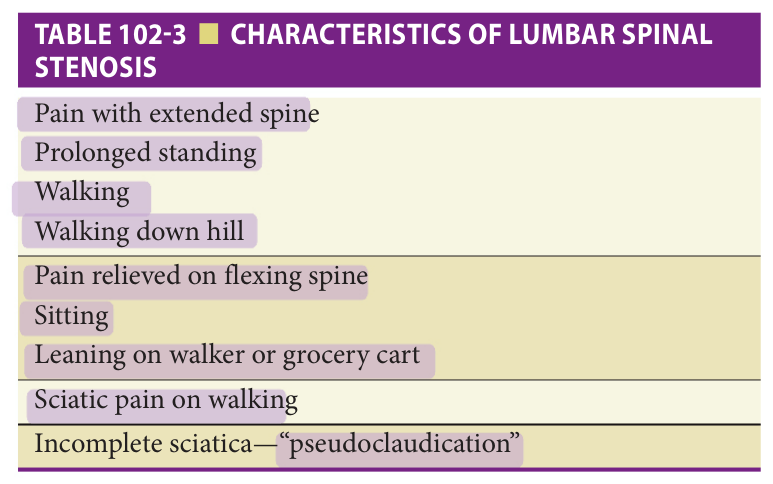
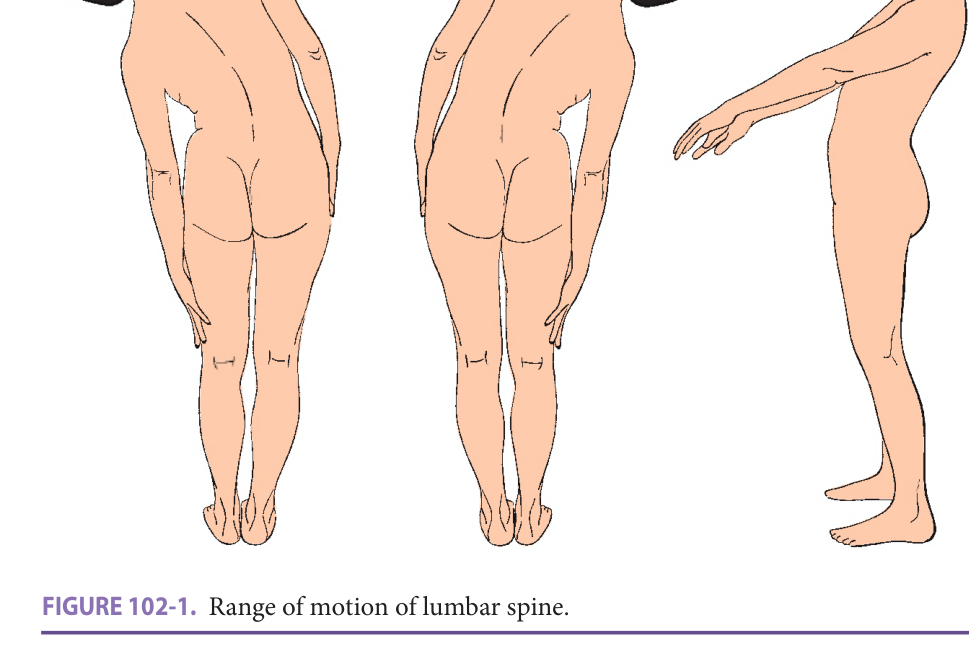
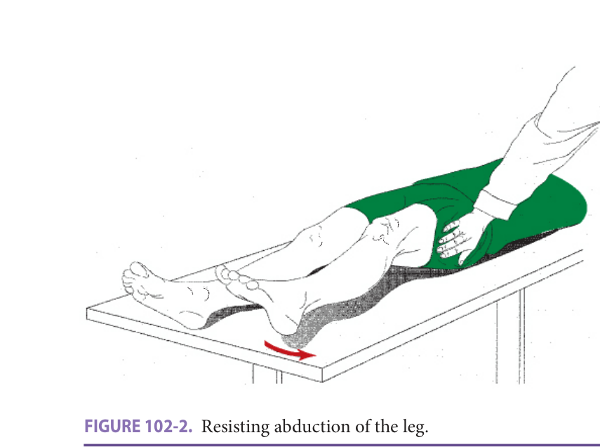
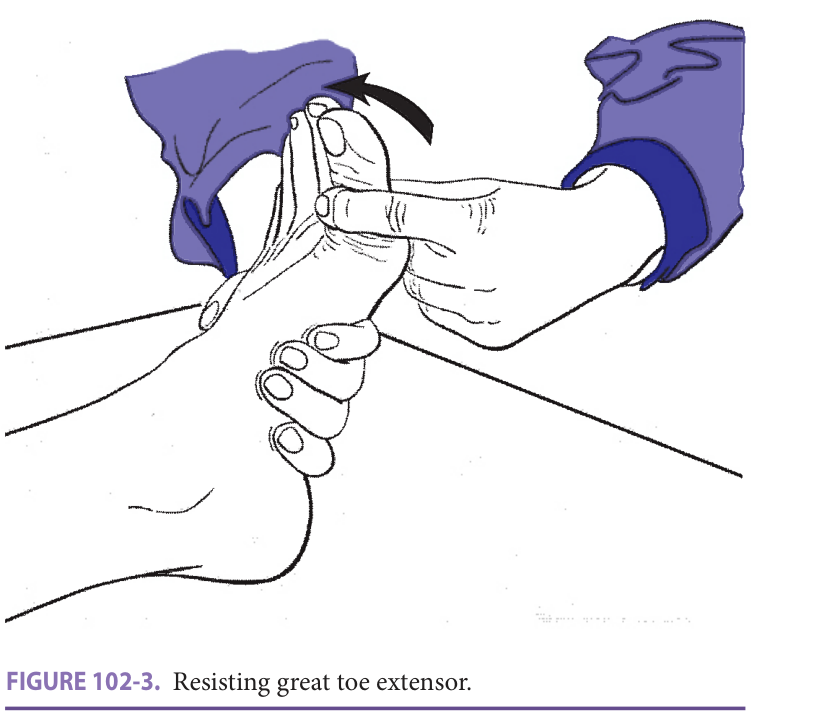
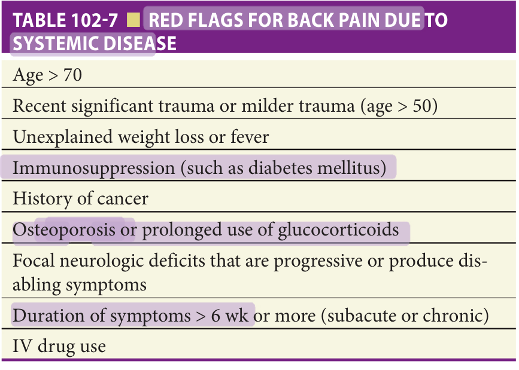

# Hazzard's Geriatric Medicine and Gerontology, 8e — Chapter 102: Back Pain and Spinal Stenosis

Owoicho Adogwa, Una E. Makris, M. Carrington Reid

> **Lane-reviewed against the book, 25 Sep 2026.**

**[p. 1629]**

#### Learning Objectives

- Review the epidemiology of back pain in older adults, including associated psychosocial factors.
- Understand how back pain is classified and review its clinical course.
- Recognize the broad differential of back pain etiology in older adults.
- Understand the value of history, physical examination, and observation when evaluating an older adult with back pain and the indications for imaging in this population.
- Learn how to select age-appropriate methods to manage back pain in older adults that combine pharmacologic and nonpharmacologic (including behavioral, activity-based) modalities, as well as surgical interventions as appropriate.

#### Key Clinical Points

1. Back pain is one of the most common complaints among older adults leading to considerable morbidity and cost.
2. Diagnostic and therapeutic costs have increased; however, outcomes have not improved.
3. Back pain must be assessed in the context of comorbid conditions (including mental health conditions and potentially other sites of pain) as multimorbidity impacts management.
4. Psychosocial factors (such as depression and pain-related fear avoidance and/or pain catastrophizing) play an important role in the experience of back pain and potentially mediate the relationship with subsequent outcomes (such as disability).
5. Infection, malignancy, and compression fractures must be ruled out prior to characterizing nonspecific mechanical back pain.
6. Imaging of the spine often demonstrates anatomic abnormalities in asymptomatic older adults and should only be ordered when red flags are present.
7. A combination of pharmacologic, nonpharmacologic, and rehabilitative approaches (including physical therapy, occupational therapy, and/or spinal manipulation) in addition to a strong therapeutic alliance between the patient and physician is essential in setting, adjusting, and achieving realistic goals of therapy.
8. Multimodal management programs for back pain should be tailored to the older adult’s preferences and abilities.
9. Surgery may be indicated in patients with symptomatic compression of neural structures, progressive deformity, or mechanical low back pain, who fail conservative measures.

## Epidemiology

Low back pain in older adults is a major public health problem with significant consequences. Prevalence estimates range from 27% to 86% depending on the population evaluated, the study design, and criteria employed to identify back pain. One study conducted in Israel found that 44% of 70-year-olds and 58% of 77-year-olds reported back pain. In the Framingham Heart Study cohort (ages 68–100), 22% of participants reported back pain on most days. As the second most common reason for visiting a physician, annual all-cause medical costs related to back pain exceeded $350 billion and are expected to rise as the population continues to age. Over the past decade, health care–related spending on low back pain diagnostic and “therapeutic” procedures has skyrocketed, yet patient outcomes (in all age groups) have not improved.

A longitudinal study demonstrated that older adults are more likely to develop recurrent episodes of back pain if they are female, suffer from depressive symptoms, have two or more chronic conditions, or self-report arthritis. Back pain in older adults is associated with dependence in activities of daily living, mobility impairment, and poor self-reported health. The association of back pain and physical function has been quantified; the number of months with back pain (resulting in restricted activity) is associated with such markers of frailty as gait speed, chair stands, and foot tap performance. In a study of Medicare beneficiaries 65 years and older, back pain was second only to shortness of breath while climbing stairs in its association with impaired general physical health status. Cross-sectional data from the Framingham Heart Study have shown that back symptoms account for a large percentage of functional limitations in older adults, especially in women. Psychosocial factors, including comorbid depression or anxiety as well as pain-related fear avoidance and pain catastrophizing, play an important role in the experience/reporting of back pain and potentially mediate the relationship with subsequent disability.

While low back pain is a common problem in older adults, its etiology, natural history, and methods for effective management are not fully understood nor well defined.

**[p. 1630]**

## Classification

Back pain is often categorized as acute (lasts < 4 weeks), subacute (lasts between 4 and 12 weeks), or chronic (lasting > 3 months; some definitions require > 6 months). While much of the literature evaluates chronic symptoms, research shows that low back pain is _not_ likely constant, but rather, recurrent or episodic. Understanding the various patterns of back pain in older adults, including what precipitates recurrent episodes, is important as prevention and treatment planning may differ.

## Etiology/presentation Of Back Pain

A number of discrete conditions manifest as back pain in older adults ( **Table 102-1** ). These conditions include mechanical causes, lumbar spinal stenosis, sciatica, osteoarthritis of the hip, vertebral compression fractures, osteoporotic sacral fractures, tumors, and infections. Systemic conditions such as malignancy and infections, although rarely the cause of back pain, are more common in older compared to younger age groups. One of the most challenging aspects of assessing and managing back pain is identifying the source(s) of pain in the older adult who often has multiple musculoskeletal comorbidities (eg, trochanteric bursitis, hip osteoarthritis, multilevel lumbar degenerative changes and lumbar stenosis). These conditions rarely occur in isolation, and pinpointing which one contributes most to the patient’s pain may be difficult but is vital.

The vast majority of low back pain seen in primary care settings is labeled “nonspecific low back pain” as there is no specific attributable disease or spinal pathology. The natural history, associated features, and etiology of back pain in older adults remain poorly characterized. Assessment of back pain in older adults includes evaluation of the historical, physical, and diagnostic imaging features of the affected patients for the conditions listed below, and then to make a diagnosis of nonspecific low back pain after these conditions have been ruled out.

**Table 102-1 — Differential diagnoses for back pain in older adults**

*Nonsystemic/mechanical causes of back pain*
- Lumbar strain (muscle)
- Spinal stenosis
- Degenerative disease: spondylosis (discs and facet joints), osteoarthritis of hip (referred)
- Spondylolisthesis
- Spondylolysis
- Sciatica
- Piriformis syndrome
- Herniated disc
- Osteoporotic vertebral or sacral compression fractures
- Diffuse idiopathic skeletal hyperostosis (DISH)
- Congenital disease: kyphosis, scoliosis

*Systemic causes of back pain*
- Malignancy: multiple myeloma, metastatic disease, lymphoma, spinal cord tumors, retroperitoneal tumors
- Infection: osteomyelitis, septic discitis, paraspinous abscess, or septic emboli (sometimes related to bacterial endocarditis)
- Inflammatory arthritis: ankylosing spondylitis, psoriatic arthritis, reactive arthritis, inflammatory bowel disease
- Osteochondrosis
- Paget disease
- Visceral: aortic aneurysm, prostatitis, nephrolithiasis, pyelonephritis, perinephric abscess, pancreatitis, cholecystitis, penetrating ulcer, fat herniation of lumbar space

## Tumor

The clinician must always be alert to nonmechanical, either referred or systemic, causes of low back pain. Visceral causes of back pain, such as abdominal aortic aneurysms or pancreatic cancer, are usually nonpositional, progressive, and associated with a normal examination of the lumbar spine and hip. Older adults with spinal column tumors often believe that their pain is temporally related to an event or trauma in the recent past. This usually indicates a pathological fracture which occurs as a result of minor trauma. However, acute onset of pain that starts in the absence of recent trauma should also be considered a possible pathological fracture. Tumors usually present with a gradual onset and progressive course, usually worse at night with persistent worsening of the pain over weeks and months. Additionally, tumor pain is often nonpositional,

**[p. 1631]**

lasts longer than 4 weeks, and is associated with systemic/ constitutional symptoms. The pain associated with spinal column tumors can occur for several reasons. Vertebral column tumors cause bone remodeling, thinning of the cortical rim which leads to pathological fractures. In the early stages of the disease, the stretched periosteum is the cause of pain; however, after development of the pathological fracture, pain secondary to neural compression, radiculopathy, and instability (micromotion) predominates.

## Infection

Although a rare cause of back pain, vertebral and disc infections can be difficult to distinguish from a mechanical cause of back pain; disc infections can cause the same abrupt onset, positional changes, and L4, L5 and L5, S1 neurologic abnormalities seen in mechanical disc disease. Unremitting back pain not relieved by rest is the most common presenting complaint. Back pain is the most common musculoskeletal complaint reported by patients with endocarditis, due to metastatic infection (abscess or septic emboli). Because the disc is often involved in this condition, the signs and symptoms can mimic mechanical disc disease. Pain may be accompanied by other constitutional symptoms, such as weight loss, fever or poor appetite; fever can be absent in older patients with infection. The clinician must be alert to a possible infectious cause of back pain for patients with a high risk of endovascular infection (artificial heart valves, indwelling venous catheters, intravenous drug abuse, etc) and in patients with systemic symptoms and signs of inflammation. When osteomyelitis or discitis is discovered, it is imperative to image the entire neural axis with a magnetic resonance imaging (MRI) scan with and without contrast of the cervical, thoracic, and lumbar spine, to rule out tandem, noncontiguous areas of infection.

## Vertebral Compression Fractures

The abrupt onset of severe back pain, especially in a patient with risk factors for osteoporosis, with or without a history of falls, should always call for a spinal x-ray to rule out a vertebral compression fracture ( **Table 102-2** ). Vertebral compression fracture is the most common type of osteoporotic fracture. Those that occur slowly (especially in the mid and upper thoracic spine) are often asymptomatic. Only approximately 30% to 40% of all vertebral compression fractures are symptomatic. Most symptomatic fractures are in the lower thoracic and lumbar spine. Height loss and kyphosis should heighten suspicion for the presence of a vertebral fracture.

**Table 102-2 — Characteristics of vertebral compression fracture**

- Severe mechanical pain with lower thoracic and lumbar fracture
- High and mid-thoracic fracture often asymptomatic
- Pain resolves in 4–6 weeks
- Increased risk for subsequent fracture

At times, the initial x-ray is normal and the changes of vertebral collapse appear several days to weeks after the onset of pain. As there is no dislocation with osteoporotic vertebral fractures, neurological signs and symptoms are rare. Pain is usually localized to the midline spine but may be referred, however, into the chest, abdomen, or leg. Any movement, including rolling in bed, bending, coughing, or lifting, usually exacerbates the pain. Pain, and muscle spasm if present, then gradually improves over the next several weeks and typically resolves in 4 to 6 weeks. Persistent severe pain (symptoms that continue despite the expected normal period of healing) may suggest additional fractures or an alternative diagnosis.

The presence of a vertebral fracture increases the risk of a subsequent vertebral and nonvertebral (ie, hip) fractures. Studies suggest that over 20% of patients who sustain a fracture will have another fracture within 5 years. The relationship between osteoporosis and vertebral fracture and chronic back pain and disability is still under investigation. Osteoporotic compression fractures that develop slowly over time are often asymptomatic and may not lead to deleterious sequelae. While some studies have shown increased disability in patients with vertebral fractures, a British population–based study found no correlation between minor vertebral deformities and back pain. Functional impairment from vertebral compression fracture appears to be comparable to that related to hip fracture.

## Osteoporotic Sacral Fractures

There have been a number of reports of “sacral/pelvic insufficiency fractures” as a cause of back pain. Older patients, usually women, may report persistent pain in the low back, groin, or buttock area, occasionally lasting weeks to months. The application of pressure to the sacrum is very painful. Associated neurologic sequelae are rare; however, if present, they often manifest as a sacral radiculopathy. Leg length discrepancy, abnormal positioning of the leg, focal tenderness around the hip/pelvis, or limited range of motion of the leg should raise suspicion for pelvic injury. The pain usually resolves spontaneously in 4 to 6 weeks. Approximately 50% of these patients had a preceding fall, and the majority of patients have old pelvic and vertebral compression fractures on x-ray.

A sacral insufficiency fracture should be considered especially in older adults with risk factors for fracture (ie, osteoporosis, low body weight, glucocorticoid therapy) and with sudden pain in the low back and buttock with sacral tenderness. Plain radiographs of the pelvis, despite low sensitivity for small fractures, should be obtained to evaluate for the possibility of a hip, pelvic, or lumbosacral spine fracture. If plain films are negative but clinical suspicion is high, MRI or CT scan may be useful to document minor pelvic fractures. Some advocate for treating patients symptomatically without advanced imaging so long as other important diagnoses have been ruled out and appropriate follow-up has been arranged.

**[p. 1632]**

## Sciatica

Sciatica is usually defined as pain radiating down one leg below the gluteal fold. It is often felt in the buttock area, radiating into the posterior aspect of the leg down to the ankle. It may, however, be incomplete, as in the calf pain seen in the “pseudoclaudication” syndrome with lumbar spinal stenosis. The natural history of this condition is well defined in younger adults. Fifty percent of these patients have full resolution of symptoms within 6 weeks. Sciatica in older adults, which develops abruptly and occurs in all positions, usually has a good natural history, similar to that seen in younger individuals. Patients who develop sciatica as part of the lumbar spinal stenosis syndrome, with gradual progression of pain with shorter and shorter periods of standing and walking, may have a more prolonged and persistent natural history.

## Lumbar Spinal Stenosis

Lumbar spinal stenosis can be acquired or congenital. Congenital stenosis results from congenitally shortened pedicles and affects patients in their 30s to 50s. Acquired stenosis is more common and typically seen in patients 50 years and older. A good understanding of the normal anatomy of the lumbar spine is necessary to understand how spinal stenosis causes symptoms. The anterior border of the spinal canal is formed by the vertebral body, the disc, and posterior longitudinal ligament. The pedicle, lateral ligamentum flavum, and neural foraminal comprise the lateral border. The posterior border is formed by the facet joints, laminar, and ligamentum flavum. The shape of the spinal canal can be trefoil or oval, with the trefoil having the smallest cross-sectional area. Narrowing of the intraspinal (central) vertebral canal, lateral recess, and/or neural foramina is frequently seen on diagnostic imaging causing compression of the thecal sac and nerve roots. These abnormalities, often caused by spondylosis or degenerative arthritis affecting the spine, have clinical significance only if the typical history of lumbar spinal stenosis is present ( **Table 102-3** ). Spinal stenosis is associated with increased vascular disturbance, neuroinflammation, and electrophysiologic alteration, all of which contribute to the lower extremity pain experienced by patients. In addition to the aforementioned static factors, the degenerative cascade can lead to translational and rotational abnormalities, which contribute to segmental instability and pain. Changes in spinal dynamics with movement explain some of the clinical features of lumbar spinal stenosis. Flexion of the lumbar spine decreases the intraspinal protrusion of the disc, decreases the bulge of the yellow ligaments within the canal, and stretches and decreases the cross-sectional area of nerve roots, resulting in an increase in spinal canal volume in relation to nerve root bulk. Extension of the lumbar spine causes bulging of the disc into the canal, enfolding and protrusion of the yellow ligaments into the spinal canal, and a relaxation and increase of the cross-sectional diameter of nerve roots. Extension of the canal thus produces a decreased volume of the spinal canal in relation to nerve root bulk.

> *Table 102-3 reproduced as a page image (printed p. 1632) — the grid did not extract reliably as text for this fast build.*

> Highlighting is the owner's annotation, not the book's.

These changes in dynamics explain the clinical picture of lumbar spinal stenosis. Positions that extend the spine (standing, walking down hill, prone lying, and extending the back) worsen symptoms, while positions that flex the spine (sitting, bending forward, placing weight on a walker or cart, and lying in a flex position) relieve the symptoms.

Patients with lumbar spinal stenosis most commonly present with leg pain. The leg pain presents either as neurogenic claudication or radicular leg pain. With neurogenic claudication, patients report a feeling of lower extremity heaviness, numbness, cramping, burning, and infrequently weakness. Both legs are typically involved, although not infrequently one leg may be worse than the other. Rarely do lower extremity symptoms follow a dermatomal distribution, and are usually exacerbated by prolonged standing and walking. These symptoms are usually worse with extension, hence individuals with this condition often lean forward (lumbar flexion) with ambulation to minimize discomfort and maximize function (ie, shopping cart sign). Lying supine, flexion, or squatting helps ameliorate symptoms. In contrast to neurogenic claudication, which arises from compression of the thecal sac, radiculopathy occurs as a result of lateral recess or foraminal compression. Since lumbar stenosis is most commonly observed at L4-L5, followed by L3-L4 and L5-S1, the L5 nerve root is most commonly involved from lateral recess stenosis causing an L5 radiculopathy.

Lumbar spinal stenosis should not produce pain when going from lying to sitting and should not produce severe pain with bending, stooping, or lifting objects. New back pain/leg symptoms in an older patient and/or neurologic deficits usually warrant imaging to determine structural narrowing of the lumbosacral spine. Plain radiographs, MRI, and CT scans are important to fully characterize the degree of stenosis/spondylosis.

Severe neurological symptoms, such as profound lower extremity weakness, and bowel or bladder changes, are uncommon but when present mandate that a careful history is performed to exclude other nonspinal causes. Neurogenic bladder dysfunction is usually associated with

**[p. 1633]**

perianal sensory disturbance, longer duration of symptoms, and higher postvoid residual volumes.

**Table 102-4 — Characteristics of mechanical low back pain**

- Intermittent sharp back pain
- Pain comes on and subsides rapidly
- Pain going from supine to sitting or upright positions and with bending
- Weakness of L4, L5, and S1 innervated muscles from dynamic instability and compression

## Mechanical Low Back Pain

The majority of older adults with low back pain do not have tumors, infections, vertebral compression fractures, or lumbar spinal stenosis ( **Table 102-4** ). They are best described as patients with mechanical back pain of uncertain etiology.

A good deal of back pain in younger individuals is probably caused by displacement of the outer annulus fibrosis or inner nucleus pulposus of the intervertebral disc. The disc does not contain pain fibers: the perivertebral structures with the most sensitive pain fibers are the posterior longitudinal ligament and the dura mater, which lie posterior to the vertebrae and discs. The sinuvertebral nerve innervates these structures. Irritation of this nerve causes reflex spasms of the paravertebral muscles of the lumbar spine. It is, thus, logical to assume that soft-tissue displacement in this area will cause pain and limitation of some, but not all, of the planes of movement of the lumbar spine, spasm of the paravertebral muscles, and subtle weakness of the muscles innervated by the appropriate nerve roots (L4, L5, and S1—in most cases).

In a young adult’s lumbar spine, the central nucleus pulposus often herniates outside the annulus fibrosis and indents the pain-sensitive posterior longitudinal ligament and dura mater, producing pain that often lasts for several weeks and occasionally causing sciatica owing to nerve root irritation. Because the nucleus pulposus loses water content with aging, herniation of this structure is less common beyond the age of 55.

Older patients often have a syndrome of sharp pain in the lumbar area, worsened with bending movements, which comes on and subsides rapidly but recurs frequently. On physical examination, these patients often have asymmetric loss of range of motion in the lumbar spine, paravertebral muscle spasm, weakness of the L4-, L5-, and S1-innervated muscles, and pain going from the flexed to the erect position. Clinicians often use the term “unstable lumbar spine” to describe this syndrome, although the evidence for specific mechanical instability is lacking. Patients with this condition often have one intervertebral disc space narrowed and sclerotic changes out of proportion to other disc spaces, and anterior displacement of one vertebra on another (spondylolisthesis). Maneuvers such as going from lying to sitting and bending forward often produce pain. Before considering major interventions, it is important to distinguish this condition, in which pain results from movement of the lumbar spine (eg, lying to sitting), from lumbar spinal stenosis, in which pain results from prolonged extension of the spine (standing and walking).

## Diffuse Idiopathic Skeletal Hyperostosis

Diffuse idiopathic skeletal hyperostosis (DISH) is characterized by calcification of prevertebral and peripheral ligaments. Ossification of spinal ligaments is often confused with osteophytes, and the condition is frequently mislabeled as disc degeneration or osteoarthritis. Spinal involvement is characterized by the following: (1) the presence of flowing calcification and ossification along the anterolateral aspect of at least four contiguous vertebral bodies, (2) relative preservation of intervertebral disc height in the involved area, and (3) the absence of apophyseal joint bony ankylosis or other features of ankylosing spondylitis.

Most studies have not found any association with DISH and back pain, while other studies have noted an increase in ligamentous tenderness, stiffness, and immobility of the cervical, thoracic, and lumbar spine in individuals with this condition. The condition should be distinguished from disc disease with vertebral osteophytes and is a cause of significant spinal immobility in older individuals.

## Evaluation

The evaluation of the older adult with back pain should rely heavily on the history, physical examination, and direct observation. The history and physical examination remain the most helpful tools in the assessment of back pain in older adults, particularly because of the high false-positive rate of spinal diagnostic imaging tests in this age group. Laboratory tests and diagnostic imaging studies have a secondary role in the assessment of these patients. The clinician must verify that the clinical presentation of the patient fits the results of the diagnostic imaging tests before proceeding with interventions.

The role of the clinician in assessing and managing back pain in older individuals focuses on (1) identifying those conditions that require immediate attention (eg, infections and tumors), (2) recognizing the usual patterns of pain for defined causes of back pain, (3) assisting the patient to engage in therapy that mitigates pain and associated symptoms, (4) educating the patient on the natural history, precipitating events, and therapeutic approaches to nonspecific mechanical low back pain, and (5) establishing realistic expectations, identifying goals of management, and assessing progress toward these goals over time.

## History

Patients with a mechanical cause for pain usually have intermittent, positional pain, often with the peak intensity of pain at the episode onset ( **Table 102-5** ).

Pain that is worse on going from lying to sitting and with bending, that occurs when one suddenly changes

**[p. 1634]**

position, and that resolves quickly but recurs frequently, suggests mechanical disease of the lumbar spine as a result of soft-tissue displacement. Severe pain in any position, which comes on abruptly and is aggravated by even rolling over in bed, suggests a vertebral compression fracture. A woman with sacral and buttock pain, sacral tenderness, and osteoporosis should be evaluated for a sacral insufficiency fracture. Gradually worsening progressive pain, lasting more than a month, which is nonpositional and associated with systemic symptoms and signs, might suggest the possibility of a tumor as a cause of the pain. Hip disease can often mimic back problems. Pain that is worse when going from sitting to standing, that causes a limp, or that radiates into the groin indicates possible hip disease.

**Table 102-5 — History items that help differentiate causes of back pain**

- *Abrupt onset of pain*: intervertebral disc herniation, muscle strain, vertebral compression fractures, mechanical low back pain
- *Insidious onset, progressive course, nonpositional pain*: tumor, infection, nonspinal visceral pain, degenerative disc disease, osteoarthritis
- *Positional attributes* — pain when lying to sitting or bending: mechanical low back pain; pain when standing and walking, relieved with sitting: lumbar spinal stenosis; nonpositional: tumor, infection

## Physical Examination

A good physical examination of patients with lumbar pathologies should start with observation. It is important to note whether patients are sitting flexed forward on a chair or laying down on the examination table. This provides clues on the possible etiology of the patient’s complaints. In patients where the supine position is preferred, mechanical back pain may be the predominant complaint. Next, the clinician must determine whether the problem is in the hip or back. It can be difficult to distinguish these conditions, as both can present with buttock and low back pain. Pain that occurs when going from the supine to sitting position is more apt to be from the back, while groin pain, worsened with weight bearing, favors the hip as the cause of the pain. A complete examination of the passive range of motion of the hip, done with the patient in the supine position, should reveal 40 degrees of hip abduction, more than 100 degrees of flexion, 50 to 60 degrees of external rotation, and 20 degrees of internal rotation. In addition, a manual muscle examination of the lower extremities, which demonstrates mild weakness of the L4, L5 (hip abductor and great toe extensor) and L5, S1 (hip extensors) innervated muscles of the lower extremities, favors the back as the cause of pain. One study demonstrated that the presence of groin pain, a limp, and limited internal rotation of the hip all favored the hip as the cause of pain.

**Table 102-6 — Physical examination findings that help differentiate causes of back pain**

- *Paravertebral muscle spasm*: mechanical low back pain, vertebral compression fracture
- *Asymmetric loss of range of motion of lumbar spine*: mechanical low back pain
- *Weakness of great toe extensor and hip abductor (L4, L5) and hip extensors (L5, S1)*: mechanical low back pain, lumbar spinal stenosis

Several findings on physical examination can be useful in determining discrete causes of back pain ( **Table 102-6** ).

The physical examination of the lumbar spine is an essential component of the assessment of a patient with back pain ( **Figure 102-1** ). This is best done while standing. The examiner observes the patient for kyphosis or scoliosis and then palpates for paravertebral muscle spasm. The patient is then brought through the four ranges of motion of the lumbar spine, side flexion to the right, side flexion to the left, forward flexion, and extension, observing for asymmetric limitation of motion or reproduction of the patient’s pain by these maneuvers (see **Figure 102-1** ). In the supine position, straight leg raise tests can indicate nerve root irritation if positive, but a negative test does not exclude any condition. The hips should be examined by testing the passive range of motion. The examiner should be able to abduct the leg to 40 degrees before the pelvis tilts. There should be 60 degrees of external rotation (heel toward the midline) and 20 degrees of internal rotation (heel away from the midline) of each hip ( **Figure 102-2** ).

Manual muscle testing of the lower extremity gives much useful information, as subtle L4, L5 and L5, S1 weakness is common in patients with mechanical back pain. L4, L5 is tested by resisting the patient’s abducted leg at the lateral upper thigh (gluteus medius muscle) (see **Figure 102-2** ), by resisting the patient’s ability to dorsiflex the foot (tibialis anterior muscle), and by resisting the great toe extensor (extensor hallucis longus) ( **Figure 102-3** ). L5, S1 (gluteus maximus muscle) is tested by trying to overcome hip extension (trying to pull the leg off the examining table, when the patient has been instructed to hold the leg firmly on the table). One can also test L5, S1 by resisting the patient’s ability to evert the foot (peroneus longus and peroneus brevis).

**[p. 1635]**

> *FIGURE 102-1. Range of motion of lumbar spine.*

> Highlighting is the owner's annotation, not the book's.

> *FIGURE 102-2. Resisting abduction of the leg.*

> Highlighting is the owner's annotation, not the book's.

> *FIGURE 102-3. Resisting great toe extensor.*

> Highlighting is the owner's annotation, not the book's.

Most patients with lumbar disc disease or lumbar spinal stenosis will have some abnormalities of the examination of the lumbar spine or of the muscles innervated by L4, L5 or L5, S1. Patients with vertebral compression fractures may have a good deal of tenderness in the lumbar spine but should have no neurologic abnormalities. Patients with osteoporotic sacral fractures will have sacral tenderness, but a normal lumbar spine examination and no lower extremity muscle weakness. Those with sciatica almost always have L4, L5 and L5, S1 weakness. A patient with persistent, severe back pain, but with a normal examination of the lumbar spine, sacrum, and hips and no evidence of L4, L5 or L5, S1 muscle weakness, should be evaluated thoroughly for a possible neoplasm or infection.

New neurologic abnormalities (dermatomal sensory deficits, focal weakness, clonus) associated with abrupt onset back pain may suggest retropulsed bone fragments in the spinal canal or foraminae which should be further evaluated with urgent MRI or CT scan and urgent consultation with a spine surgeon.

## Laboratory Tests And Imaging

The interpretation of diagnostic tests in older patients with back pain is a challenge, given the high rate of abnormal tests in asymptomatic individuals in this age group. A complete blood count and erythrocyte sedimentation rate/C-reactive protein are reasonable screening tests if the patient’s history and physical examination suggest a tumor or infection. While routine imaging for low back pain in younger

**[p. 1636]**

populations is not recommended, plain films of the spine may be appropriate in older adults with back pain. A plain x-ray of the lumbar spine is more helpful in the evaluation of older patients than younger ones, as it may demonstrate a vertebral compression fracture, DISH, or spondylolisthesis.

> *Table 102-7 reproduced as a page image (printed p. 1636) — the grid did not extract reliably as text for this fast build.*

> Highlighting is the owner's annotation, not the book's.

According to the American College of Radiology, the criteria listed in **Table 102-7** should be used to determine who is at higher risk for systemic disease-related back pain and when imaging is appropriate.

The clinician must be aware that changes in the lumbar spine are ubiquitous in older individuals and not well correlated with back pain. Kellgren and Lawrence’s classic epidemiological study in Leigh, England, found that 89% of the men and 57% of the women aged 55 to 64 had disc degeneration of the lumbar spine. Proper radiographic evaluation of the lumbar spine includes obtaining static and dynamic views. Anterior-posterior, lateral and flexion-extension views should be obtained. Specific findings notable on plain films include narrow interpedicular distance, sagittal canal diameter, and evidence of spondylotic changes such as facet hypertrophy, osteophytosis, disc collapse, or deformity. Additionally, vacuum disc phenomenon “air in disc space” can be noted on plain radiographs, and is a sign of advanced degeneration and instability. A study of lumbar sacral spine x-rays found no association between back pain and Schmorl nodes, the disc vacuum sign, traction spurs, and disc space narrowing between the third and fourth lumbar vertebrae, or between the fifth lumbar and first sacral vertebrae. There was an association between acute low back pain and disc space narrowing, and traction spurs between the fourth and fifth lumbar vertebra. Another study found no correlation between vertebral osteophytes and low back pain but did find increased back pain in individuals with spondylolisthesis (pars interarticularis defect and frontal slippage of one vertebra on an adjacent vertebra).

MRI is considered the standard imaging modality for patients with lumbar spinal stenosis. It is used to identify central and lateral recess stenosis, annular tears, facet degeneration, and diastasis, because it provides excellent contrast between fat, neural tissue, and epineural vessels.

A disadvantage of MRI is its ability to detect degenerative changes that may not be associated with symptoms. MRIs of the lumbar spine often demonstrate anatomic abnormalities in asymptomatic individuals, especially in older adults. In one study of MRIs of the lumbar spine in patients without back pain, only 36% had a normal examination; 52% of these individuals had a disc bulge in at least one level, and 27% had disc protrusions. In another study of asymptomatic individuals, 36% of subjects older than 60 years had a herniated nucleus pulposus, 21% had spinal stenosis, and 93% had degenerative disc disease. Another study found that 56% of asymptomatic individuals had tears of the annulus fibrosis of the lumbar disc. In a study of 198 veterans who had had no back pain for at least 4 months, 83% had moderate-to-severe degeneration of the disc, 64% had at least one bulging disc, and 32% had at least one disc protrusion. In individuals older than 65 years, 100% had disc degeneration and desiccation, 83% had a disc bulge, and 38% had facet joint degeneration.

CT scans are also useful for evaluation of lumbar stenosis. CT offers greater detail than plain films, with ability to obtain images in various planes—axial, coronal, and sagittal. Other potential causes of back pain such as pars interarticular defects and spondylosis can be easily identified with CT scans. In stenotic patients, hypertrophy of the facet joints and articular processes contribute to the trefoil shape of the central canal. Because a significant portion of the stenosis comes from soft tissue pathology, visualization of the soft tissues is a top priority. A CT scan is a poor modality for detailed analysis of soft tissue. The diagnostic utility of CT scan can be improved by combining it with myelography. CT myelography is infrequently used for routine evaluation of spinal stenosis; however, this modality can be useful in patients with lumbar deformity, such as scoliosis or those unable to tolerate an MRI. Central stenosis presents as a hourglass constriction of the thecal sac. Areas of complete contrast block represent severe central or foraminal stenosis. While CT myelography provides useful information on areas of central or foraminal stenosis, invasiveness of the myelogram and radiation associated with the CT scans are the two biggest drawbacks of this diagnostic modality.

Bicycle and treadmill tests help to differentiate between neurogenic claudication and vascular claudication. Patients with neurogenic claudication present with symptoms including pain, cramping, and lower extremity paresthesias, which are also common in older patients with underlying vascular claudication. With neurogenic claudication, patients have worse symptoms during the treadmill test that is relieved during the bicycle test. This is because the flexion of the spine that occurs during the bicycle test increases the diameter of the central canal. In contrast, patients with vascular claudication have persistent difficulty with both treadmill and bicycle test.

Electromyography (EMG) and nerve conduction velocity (NCV) can be helpful when evaluating patients

**[p. 1637]**

with a history that is not classic for neurogenic claudication or radiculopathy. EMG identifies lower motor neuron dysfunction and can be useful in differentiating chronic changes from active ongoing denervation.

The above findings indicate that the clinician cannot depend on imaging studies alone to diagnose the cause of back pain in older adults. These studies are used to confirm a diagnosis, indicated by the history, physical examination, and the clinician’s knowledge of applied anatomy.

## Management

Back pain in older adults is often inadequately treated for several reasons including: a limited evidence base to guide management, lack of physician education, physician concerns about the potential for treatment-related harm, and older adults’ beliefs about pain and pain treatments. Other treatment barriers specific to geriatric populations include _age-related_ physiologic changes resulting in altered drug absorption and decreased renal excretion; sensory impairments; polypharmacy; and multimorbidity. Additional attitudinal, access, and system-level barriers have been identified that also contribute to undertreated pain in vulnerable populations, including older adults.

Management of back pain should begin with a combination of nonpharmacologic and rehabilitative approaches, as described below, along with pharmacologic and then more invasive management strategies if indicated, depending on the circumstance (listed by specific etiology).

## Nonpharmacologic Approaches (General Principles)

Interest in nonpharmacologic approaches for managing back pain in older adults is increasing. Nonpharmacologic approaches include cognitive behavioral therapy for chronic pain, acupuncture, mindfulness, massage, self-management programs and/or behavioral (eg, goal setting, exercise, tai chi, yoga) techniques that constitute well-established methods for treating pain (in general). Existing evidence suggests that these therapies are safe, can reduce pain, and in many cases improve patient function. Nearly all studies of nonpharmacologic interventions conducted to date, however, have been for short term (< 6 months). The long-term efficacy and ability of older adults to sustain their use over time remain inadequately defined. Despite this, temporary relief from back pain may offer an opportunity to develop positive expectations and commitments from the patient and provider.

It is important to communicate to older patients that using both nondrug and drug therapies is the standard of care and can be productive, particularly with individuals who may hesitate to engage in nonpharmacologic treatments. Recommending a specific nonpharmacologic modality will depend upon its availability, affordability (eg, Medicare does not cover many of the approaches listed, however), patient preferences, and the physician’s ability to accurately describe its benefits and risks. As there are no head-to-head comparisons evaluating the nonpharmacologic approaches, recommending a modality that is accessible and affordable is essential.

## Rehabilitative Approaches

Addressing function and fall risk is critically important for all older patients, particularly in those with persistent pain, including chronic back pain. Rehabilitative therapies, including physical therapy (PT) and occupational therapy (OT), can help maintain and possibly enhance functional independence. Geriatric pain management guidelines recommend that all older patients with persistent pain (including back pain) adopt physical activity regimens that include strengthening, flexibility, balance, and endurance exercises. PTs/OTs can help older adults implement individualized home-based treatment programs. Home-based services directed at improving safety and mobility could potentially facilitate involvement in out-of-home activities; these services might indirectly yield dividends such as more time spent socializing with family and friends. Physical therapists can play an important role in developing “function-enhancing interventions” in older adults with mobility limitations.

In addition, PTs can conduct an inventory of existing equipment (eg, does the patient have a functional walker?) and make recommendations about new assistive/mobility devices. OTs can directly observe a patient’s ADL functioning in the home and make recommendations about assistive devices that may help to improve ADL functioning. Both paid and family caregivers, especially of older adults with cognitive impairment, can reinforce patients’ ongoing use of rehabilitative techniques and should be engaged and empowered to do so. Finally, PTs/OTs can also train caregivers to reinforce concepts learned during treatment sessions, including coaching on fall risk, safety, body mechanics, and pacing.

Rehabilitation health care specialists often use various modalities including both therapeutic exercise and spinal manipulation. There is growing popularity and interest in spinal manipulation (often defined as [low to] high velocity and low amplitude thrust and/or manual mobilization of vertebral joints and/or soft tissue manipulation, performed by either a chiropractor, physiotherapist, or other manual health care practitioner) for both acute and chronic back pain. As of yet, there are no studies proving the mechanism underlying the benefit of spinal manipulation. There are strongest data for patients with acute low back pain (without radiculopathy); however, this population has a favorable prognosis even without manipulation. Most studies have focused on chronic back pain, and often exclude subjects with spinal stenosis, spondylolisthesis (second degree or more), lumbar scoliosis (> 20 degrees or more), osteoporosis and previous vertebral fractures (seen more often in older adults), systemic causes of chronic back pain (including ankylosing spondylitis, infection, or

**[p. 1638]**

metastatic disease), or psychiatric or cognitive comorbidities. In the general population (including younger adults), spinal manipulative therapy and spinal stabilization have shown improvements in both pain and function as compared to various treatments (back school—education, relaxation techniques, postural and tailored back exercises, individual physiotherapy—mobilization, active exercise, massage, education, or general exercise), especially in the short term. While data suggest there is a statistically significant improvement with spinal manipulation, its clinical importance remains uncertain.

## Etiology-Specific Management

Therapy of tumors and infectious causes of low back pain is straightforward albeit often difficult. Appropriate management of vertebral compression fractures, lumbar spinal stenosis, and mechanical low back pain is less clear.

## Vertebral Compression Fractures

The traditional treatment for vertebral compression fractures is activity modification and pain control at the onset of symptoms. Oral analgesics are usually needed for acute pain relief. These include acetaminophen, nonsteroidal anti-inflammatory drugs (NSAIDs), mild opioids combined with acetaminophen, tramadol, or medications that block serotonin or norepinephrine reuptake. Calcitonin (2- to 4-week course) does have some additional analgesic effect in the acute stage. The choice of first-line agent depends on severity of symptoms and the patient’s comorbidities. Muscle relaxants have not been rigorously evaluated in this setting and given the high rate of adverse effects in older adults should be used cautiously, if at all. Opioids, when necessary, should be used cautiously given known side effects particularly in older adults (sedation/altered mental status, constipation, nausea). For severe pain, hospitalization for pain management may be warranted.

Complete bed rest is not recommended, patients should resume physical activity as soon as possible (as pain permits). Physical therapy should focus on gait and core strengthening. Aquatic therapy has been shown to accelerate pain relief and physical activities. In several studies, exercise programs have reduced analgesic use and improved quality of life in older adults with vertebral fractures. Education including management of expectations (eg, that it can take several months for the pain to improve) is essential. Bracing is not usually needed for pain management from osteoporotic compression fractures, although it has been shown to be helpful in acute management of patients with traumatic vertebral compression fractures. Long-term use of bracing should be avoided as its use may lead to immobility of the spine, weakening of paraspinal and core muscles, as well as potential for disuse osteoporosis.

Long-term management of vertebral compression fractures, related to osteoporosis, focuses on improving low bone density (ie, antiresorptive therapy). Underlying conditions that are present and may contribute to development of vertebral compression fractures (hyperthyroidism, granulomatous diseases, infections) require further, specific management beyond the scope of this chapter. Lifestyle modification, namely, smoking cessation and reducing alcohol use, are important. Fall prevention education is effective and essential especially in older adults who have already experienced a traumatic fall or at risk for falls.

There is much interest in vertebral augmentation (the techniques of vertebroplasty and kyphoplasty) in the management of vertebral compression fractures. In a vertebroplasty, extension positioning opens the cleft within a fractured vertebral body, and bone cement is injected into the vertebral body and stabilizes the fracture in this position. In a kyphoplasty, an inflated bone balloon displaces vertebral trabelate and elevates the superior end plate, allowing some restoration of the height of the vertebral body. The balloon is then removed and bone cement is injected into the vertebral space.

The indications and timing for the use of these augmentation procedures remain controversial. Current evidence supporting use of these procedures is of low quality. In the acute setting, although uncontrolled studies show encouraging relief of pain with vertebroplasty, the favorable natural history of the pain from compression fractures, and the potential complications and expense of this procedure, should lend caution to its use. In one nonrandomized trial, the control patients were those who elected not to have the procedure. The pain score was significantly decreased in the vertebroplasty group as compared to the conservative therapy group in the first few days, but there were no significant differences in clinical outcomes at 6 weeks or 6 to 12 months. In a study of patients who had pain for greater than 1 year associated with compression fractures, kyphoplasty was performed on 40 patients, with 20 control patients who elected not to have the procedure. At 1 year, the patients with kyphoplasty had fewer new fractures, fewer back pain–related physicians’ visits, and greater improvement in pain scores. Again, neither of these studies were randomized controlled trials. Most experts in this field suggest analgesics, calcitonin, and exercise in the acute phase, and moving on to vertebroplasty or kyphoplasty only if patients have persistent severe pain despite conservative management (and the pain is thought to arise from the fracture).

## Lumbar Spinal Stenosis

Conservative nonsurgical therapies, alone and in combination, are warranted prior to attempting surgical treatment. Physical therapy is advocated for this condition, but there is little evidence to justify advocating one treatment regimen over another. The goal of therapy is to increase muscular stabilization (often via strengthening of abdominal muscles) and correction of posture (reduce or prevent lumbar lordosis). In general, stretching, strengthening, and aerobic fitness are advocated. Along with physical therapy, analgesic

**[p. 1639]**

and anti-inflammatory medications (as monotherapy or in combination) are often used.

The choice of nonsurgical treatment is difficult, as there are few randomized controlled trials of these therapies. Epidural steroid injections have been used for more than 50 years for sciatica. While there are a number of uncontrolled studies suggesting a good outcome with these injections for lumbar spinal stenosis, randomized controlled trials have produced inconsistent results. A randomized trial of 400 older adults with lumbar spinal stenosis and moderate-to-severe leg pain and disability showed minimal or no short-term benefit in outcomes (disability and leg pain intensity) between the group who received epidural steroid injections of glucocorticoids plus lidocaine versus injection with lidocaine alone. A placebo group was not included in this study.

The decision to proceed with spine surgery in an older patient is always a difficult one. An increasing number of studies support surgical decompression for symptomatic lumbar stenosis. Evidence-based guidelines now recommend surgery for patients with moderate to severe spinal stenosis. The Spine Patient Outcomes Research Trial (SPORT), a multicenter randomized control trial (with younger patients, average age in the 40s), one of the largest and well-known studies to date, demonstrated significant advantages associated with surgery compared to nonoperative treatment at 3 months that remained significant and durable through the 2-year duration of the study. It is unclear how results would differ among older adults with comparable spine pathology. At 8-year follow-up, 52% of patients randomized to nonoperative treatment had undergone surgery. A Cochrane review of surgery for degenerative lumbar spondylosis found that “there is still insufficient evidence of the effectiveness of surgery to draw any firm conclusions.” On the other hand, the Maine Lumbar Spinal study did show that spinal surgery can be effective. This study is an observational analysis of patients treated by orthopedic surgeons and neurosurgeons in community-based practices throughout Maine. This study followed patients treated surgically or medically, at the choice of the patient and surgeon. In this cohort, patients initially treated surgically demonstrated better outcomes in all measures than those treated nonsurgically. After 10 years, however, the relative difference between surgery and conservative therapy was no longer significant. A randomized controlled multicenter trial of an interspinous process decompression system did find that patients who underwent this procedure had a statistically significant improvement in neurogenic intermittent claudication versus controls.

For patients who have failed maximum nonsurgical management (physical therapy, pharmacotherapy, activity modification, injections) and require surgery, patient selection is critical to optimize the likelihood of a successful outcome. Patients with symptomatic neurogenic claudication, with primary complaints of lower extremity pain, numbness, and paresthesias with prolonged ambulation are ideal candidates for surgery. An observational study from four surgical centers found that the most powerful predictors of good outcomes of greater walking capacity, milder symptoms, and greater satisfaction were the patient’s report of good or excellent health before surgery, as well as low cardiovascular comorbidity. A variety of surgical options exist including decompressive laminectomy with or without fusion, laminotomy, or placement of interspinous devices. Surgical decompression can be performed through traditional open techniques or newer minimally invasive approaches. The majority of these procedures are performed on an outpatient basis with patients usually discharged home on the day of surgery. Prior to surgical intervention, a thorough review of the static and dynamic radiographs, MRI, and CT scans is important. Preoperative identification of spinal instability, preferably by flexion-extension radiographs, is critical to avoid procedures that further destabilize the spine.

Surgery in older adults is associated with higher adverse events rates, which should be discussed with the patient along with the understanding of long-term outcomes from surgery. Complication rates of lumbar decompressive surgeries range from 1.8% to 18% and include wound infection, durotomy, nerve root injury, vascular complications, epidural hematoma, implant failures, adjacent segment degeneration, and nonunion.

In summary, lumbar spinal stenosis should be treated first with a conservative approach including physical therapy, perhaps manipulative therapy, analgesics, and possibly epidural steroid injections. If this approach does not give relief in a reasonable period of time, then a surgical approach, decompressing the stenotic canal space, should be considered. Those patients with high self-reported health and low cardiovascular morbidity seem to achieve the best surgical results.

## Mechanical Low Back Pain

The management of back pain in older persons requires a logical, if not yet evidence-based, approach based on both an anatomical understanding of the most likely cause and precipitants of the older adult’s pain. For pain that is exacerbated by spinal movement (lying to sitting, bending, etc), spinal instability is the most likely explanation, and thus attempts to stabilize the spine make the most sense. Stabilization may be achieved by isometric abdominal strengthening exercises, lumbar sacral corsets (avoid using for extended periods of time due to muscle disuse/deconditioning), and back protection maneuvers (lifting with one’s knees with the back straight, etc). Spinal fusion is reserved for intractable cases of severe low back pain where there is radiographic evidence of progressive deformity, dynamic instability, or pars interarticularis defects.

There is no therapy needed or indicated for DISH. The pain from sacral insufficiency fractures resolves in 4 to 6 weeks, and analgesics should suffice. Antiresorptive therapy for osteoporosis should be initiated to prevent future fractures.

**[p. 1640]**

Spontaneous sciatica usually improves without therapy in most older adults. Epidural steroids may be helpful in the management of sciatica. Surgery should be considered only if the pain persists despite trials of conservative therapy.

Prolonged bed rest should be avoided in older adults, given the complications of this intervention in this age group. Patients should, however, avoid those activities that appear to precipitate their pain. Firm corsets may be considered to allow patients to stay mobile and active.

Analgesics should be used, though cautiously, in the management of pain, especially if used chronically. There is little evidence that anti-inflammatory drugs are any better than simple analgesics, and these are associated with a high incidence of complications in this age group. Pain that occurs only with movement often does not respond well to analgesics. While opioid medications may be very helpful with severe pain, the older patient should be watched closely for confusion and constipation. Adjunctive pain therapy, with such agents as tricyclic antidepressants with limited anticholinergic side effects (nortriptyline and disimpramine) and anticonvulsants (gabapentin, pregabalin), may also be helpful but can produce unwanted side effects that limit therapeutic benefit in older adults. The use of combinations of multiple analgesic classes (at the lowest effective dose) may be effective at reducing pain while keeping side effects to a minimum.

## Prevention

Since back pain in older adults is often recurrent and, while chronic back pain is often reported in the literature, the symptoms often wax and wane. The older adult can usually identify a precipitating event or certain activities or movements that make the back pain worse or prompt a recurrent episode. Once aware of these movements, the clinician can work with the patient to modify behavior and activity to minimize or avoid such movements. Further, it is important to recognize certain risk factors for developing more disabling back pain: being female, having multiple comorbid conditions (including arthritis), reporting depressive symptoms, and having poor grip strength (this may serve as a marker for global muscle weakness) or hip weakness. Obesity is also considered a risk factor for back pain. Several of these risk factors, namely depressive symptoms, muscle weakness, and body mass index are potentially modifiable and amenable to intervention via primary care interventions. Back pain is also associated with psychosocial repercussion, including anxiety, depression, and social isolation. Expanding the evaluation and management of back pain from physical to include psychosocial aspects of daily life may provide benefits for older adults who suffer from these conditions.

## Special Issues

While back pain in older adults is prevalent, costly, and leads to considerable morbidity, much of the literature has focused on younger populations with this condition. Few trials comparing efficacy and safety of different treatments have included older adults with back pain. Pain management and treatment are particularly challenging because clinical guidelines do not currently exist for back pain in older adults; moreover, guidelines for back pain in younger populations fail to account for decision-making complexities that occur commonly in older populations, such as multiple comorbid conditions, polypharmacy, frailty, and fragmented social support systems.

## Therapeutic Alliance And Patient Preference

The patient-physician relationship lies at the center of treatment for older adults with (chronic) back pain. Therapeutic alliance is defined as a constructive collaboration between the patient and provider. Although few studies have addressed the specific contribution of the therapeutic alliance to treatment outcomes in patients with back pain, a positive patient-physician relationship has been associated with improved treatment outcomes among patients receiving general and rehabilitative medical care. Devoting the time to establish mutually agreed-upon treatment goals is an important step in building a therapeutic alliance. Other core elements of the therapeutic alliance include (1) setting realistic expectations about what can and cannot be accomplished, taking into account such immutable factors as patient age, etiology, and duration of the pain; (2) availability of the physician for advice, reassurance, and support during back pain flares; (3) tenacity and commitment on the part of both provider and patient; (4) mutual respect; and finally, (5) a reciprocal bond of warmth generated by both parties having an emotional investment in the outcomes of treatment.

Discussing and listening to patient preferences regarding management and goals of care are essential. Management programs can be tailored to the older adult’s preferences and abilities; preferably, the patient has identified aspects of the program that are most desirable, realistic, and feasible, thus increasing likelihood of adherence. To motivate older adults to engage with a management program, the environment in which the older patient completes therapeutic activity should be appropriate and accessible. In order to reinforce treatment initiation and maintenance, the physician can leverage social supports, for example, family members, home attendants, and community-based agencies.

**Comorbidity** As noted above, multimorbidity and medical complexity often seen in older adults make management decisions more difficult and sometimes limit treatment options. Further, it is important to recognize that older adults often have multiple sites of pain. Clinicians should inquire about different concomitant locations of pain (eg, spine, knee, hand, hip, peripheral neuropathy) as this may impact management options, patient priorities, treatment expectations, and ultimately achieving outcomes of interest. Mental illness (eg, depression and anxiety) often co-occurs with chronic (back) pain and must be acknowledged and

**[p. 1641]**

managed optimally (and simultaneously) for pain outcomes to also improve.

**Care settings** Multiple resources exist to help both clinicians and patients manage back pain. We advocate for clinicians to seek out/learn about resources that exist within their respective communities by contacting the local Area Agency on Aging (AoA) to find out if they have lists of relevant programs. Also, for example, many continuing care retirement communities offer wellness/exercise programs that are run by trained staff.

## Acknowledgment

Leo Cooney, Jr., MD, authored this chapter in the sixth edition, and some material from that chapter has been retained here.

## Further Reading

- Abdulla A, Adams N, Bone M, et al. Guidance on the management of pain in older people. _Age Ageing_ . 2013;42(suppl 1):i1–i57.

- Adogwa O, Carr RK, Kudyba K, et al. Revision lumbar surgery in elderly patients with symptomatic pseudarthrosis, adjacent-segment disease, or same-level recurrent stenosis. Part 1. Two-year outcomes and clinical efficacy: clinical article. _J Neurosurg Spine._ 2013;18(2):139–146.

- Adogwa O, Rubio DR, Buchowski JM, D’Souza A, Shlykov MA, Jennings JW. Spine-specific skeletal related events and mortality in non-small cell lung cancer patients: a single-institution analysis. _J Neurosurg Spine._ 2020:1–8.

- AGS Panel on Persistent Pain in Older Persons. Pharmacological management of persistent pain in older persons. _J Am Geriatr Soc_ . 2009;57(8):1331–1346.

- Anderson DB, Luca K, Jensen RK, et al. A critical appraisal of clinical practice guidelines for the treatment of lumbar spinal stenosis. _Spine J._ 2021;21(3):455–464.

- Brown CJ, Flood KL. Mobility limitation in the older patient: a clinical review. _JAMA_ . 2013;310(11):1168–1177.

- Carley JA, Karp JF, Gentili A, et al. Deconstructing chronic low back pain in the older adult: step by step evidence and expert-based recommendations for evaluation and treatment: part IV: depression. _Pain Med_ . 2015;16(11):2098–2108.

- Chou R, Deyo R, Friedly J, et al. Nonpharmacologic therapies for low back pain: a systematic review for an American College of Physicians Clinical Practice Guideline. _Ann Intern Med_ . 2017;166(7):493–505.

- Deyo RA, Dworkin SF, Amtmann D, et al. Report of the NIH task force on research standards for chronic low back pain. _Spine J_ . 2014;14:1375–1391.

- Ebeling PR, Akesson K, Bauer DC, et al. The efficacy and safety of vertebral augmentation: a second ASBMR Task Force Report. _J Bone Miner Res._ 2019;34(1):3–21.

- Ferreira PH, Ferreira ML, Maher CG, Refshauge KM, Latimer J, Adams RD. The therapeutic alliance between clinicians and patients predicts outcome in chronic low back pain. _Phys Ther_ . 2013;93(4):470–478.

- Freburger JK, Holmes GM, Agans RP, et al. The rising prevalence of chronic low back pain. _Arch Intern Med_ . 2009;169:251–258.

- Fridley J, Gokaslan ZL. The evolution of surgical management for vertebral column tumors. _J Neurosurg Spine._ 2019;30(4):417–423.

- Gregori F, Grasso G, Iaiani G, Marotta N, Torregrossa F, Landi A. Treatment algorithm for spontaneous spinal infections: a review of the literature. _J Craniovertebr Junction Spine._ 2019;10(1):3–9.

- Hartvigsen J, Hancock MJ, Kongsted A, et al. What low back pain is and why we need to pay attention. _Lancet._ 2018;391(10137):2356–2367.

- Institute of Medicine. _Relieving Pain in America: A Blueprint for Transforming Prevention, Care, Education, and Research_ . Institute of Medicine (US) Committee on Advancing Pain Research, Care, and Education. Washington, DC: National Academies Press; 2011.

- Kanda Y, Kakutani K, Sakai Y, et al. Prospective cohort study of surgical outcome for spinal metastases in patients aged 70 years or older. _Bone Joint J._ 2020;102-B(12):1709–1716.

- Lai MKL, Cheung PWH, Cheung JPY. A systematic review of developmental lumbar spinal stenosis. _Eur Spine J._ 2020;29(9):2173–2187.

- Leveille SG, Jones RN, Kiely DK, et al. Chronic musculoskeletal pain and the occurrence of falls in an older population. _JAMA_ . 2009;302(20):2214–2221.

- Lisi AJ, Breuer P, Gallagher RM, et al. Deconstructing chronic low back pain in the older adult—step by step evidence and expert-based recommendations for evaluation and treatment: part II: myofascial pain. _Pain Med_ . 2015;16:1282–1289.

- Lo J, Chan L, Flynn S. A systematic review of the incidence, prevalence, costs, and activity and work limitations of amputation, osteoarthritis, rheumatoid arthritis, back pain, multiple sclerosis, spinal cord injury, stroke, and traumatic brain injury in the United States: a 2019 update. _Arch Phys Med Rehabil._ 2021;102(1):115–131.

- Makris UE, Abrams RC, Gurland B, Reid M. Management of persistent pain in the older patient: a clinical review. _JAMA_ . 2014;312(8):825–837.

- Makris UE, Fraenkel L, Han L, Leo-Summers L, Gill TM. Restricting back pain and subsequent mobility disability in community-living older persons. _J Am Geriatr Soc_ . 2014:62:2142–2147.

**[p. 1642]**

- Makris UE, Fraenkel L, Han L, Leo-Summers L, Gill TM. Risk factors for restricting back pain in older persons. _J Am Med Dir_ . 2014;15:62–67.

   - Makris UE, Higashi RT, Marks EG, et al. Physical, emotional, and social impacts of restricting back pain in older adults: a qualitative study. _Pain Med_ . 2017;18:1225–1235.

   - Martin BI, Deyo RA, Mirza SK, et al. Expenditures and health status among adults with back and neck problems. _JAMA_ . 2008;299:656–664.

   - Morone NE, Lynch CS, Greco CM, Tindle HA, Weiner DK. “I felt like a new person.” The effects of mindfulness meditation on older adults with chronic pain: qualitative narrative analysis of diary entries. _J Pain_ . 2008;9(9):841–848.

   - Nordin C, Gard G, Fjellman-Wiklund A. Being in an exchange process: experiences of patient participation in multimodal pain rehabilitation. _J Rehabil Med_ . 2013;45(6):580–586.

   - Park J, Hughes AK. Nonpharmacological approaches to the management of chronic pain in community-dwelling older adults: a review of empirical evidence. _J Am Geriatr Soc_ . 2012;60(3):555–568.

   - Qaseem A, Wilt TJ, McLean RM, Forciea MA; Clinical Guidelines Committee of the American College of Physicians. Noninvasive treatments for acute, subacute, and chronic low back pain: a clinical practice guideline

from the American College of Physicians. _Ann Intern Med_ . 2017;166(7):514–530.

- Reid MC, Bennett DA, Chen WG, et al. Improving the pharmacologic management of pain in older adults: identifying the research gaps and methods to address them. _Pain Med_ . 2011;12(9):1336–1357.

- Spitz A, Moore AA, Papaleontiou M, Granieri E, Turner BJ, Reid MC. Primary care providers’ perspective on prescribing opioids to older adults with chronic non-cancer pain: a qualitative study. _BMC Geriatr_ . 2011;11:35.

- Thielke S, Sale J, Reid MC. Aging: are these 4 pain myths complicating care? _J Fam Pract_ . 2012;61(11):666–670.

- Weiner DK. Introduction to special series: deconstructing chronic low back pain in the older adult: shifting the paradigm from the spine to the person. _Pain Med_ . 2015;16:881–885.

- Weiner DK, Fang M, Gentili A, et al. Deconstructing chronic low back pain in the older adult—step by step evidence and expert-based recommendations for evaluation and treatment: part I: hip osteoarthritis. _Pain Med_ . 2015;16:886–897.

- Whitney SL, Marchetti GF, Ellis JL, Otis L. Improvements in balance in older adults engaged in a specialized home care falls prevention program. _J Geriatr Phys Ther_ . 2013;36(1):3–12.

