# Hazzard's Geriatric Medicine and Gerontology, 8e - Chapter 103: Fibromyalgia and Myofascial Pain Syndromes

Cheryl D. Bernstein, Simge Yonter, Aishwarya Pradeep, Jay P. Shah, Debra K. Weiner

> **Status.** Fast build from the book; not lane-reviewed.

> **Source and method.** Printed pages 1643-1666, from the marked 8th-edition copy (PDF page = printed page + 34). Prose follows its text layer; tables and figures are source-page crops. The book is canonical.

**[p. 1643]**

Fibromyalgia and myofascial pain syndromes (MPSs) are among the most common musculoskeletal disorders from which older adults suffer. Clinically, these disorders represent opposite ends of the pain spectrum with the discrete character of MPS at one extreme and the widespread symptoms of fibromyalgia at the other. Health care professionals have been poorly educated about these common and treatable conditions, and they are often confused with each other. We discuss them in the same chapter to highlight their distinct characteristics. Because MPSs are so commonplace, patients with fibromyalgia often have coexisting MPS. MPS may be acute or chronic and is associated with regional pain syndromes, taut muscle bands, and hypersensitive areas called trigger points. Fibromyalgia syndrome includes symptoms of sleep disruption, fatigue, and psychological distress in addition to widespread pain. Both fibromyalgia and MPS may result in significant functional impairment and cause suffering and disability comparable to that of rheumatoid arthritis and osteoarthritis. Diagnosis of these disorders is grounded in appropriately targeted history and physical examination; these are the tools required to avoid unnecessary ordering of “diagnostic” tests and foster implementation of appropriate management strategies.

#### Learning Objectives

- Know the distinguishing elements of the history and physical examination for older adults with fibromyalgia as compared with myofascial pain.

- Describe the three-pronged approach to treating myofascial pain syndromes.

- List the nonpharmacologic and pharmacologic treatments for fibromyalgia that are supported by strong evidence and have an acceptable safety profile for older adults.

#### Key Clinical Points

1. Fibromyalgia and myofascial pain are distinct syndromes that may occur independently or coexist.

2. Myofascial pain syndromes are diagnosed by eliciting a characteristic history coupled with identification of active trigger points on physical examination.

3. Myofascial pain syndromes may present with neuropathic symptoms such as paresthesias and burning sensations and can mimic radiculopathy. As they are treated best using nonpharmacologic strategies, their diagnosis can prevent exposing frail older adults to multiple potential adverse drug effects and unnecessary procedures.

4. Older adults presenting with widespread pain should undergo a comprehensive history and physical examination including careful review of their medications. If a potential cause is not elicited fibromyalgia screening should ensue. Revised criteria allow for disease screening without the need for a tender point examination.

## FIBROMYALGIA SYNDROME

Fibromyalgia Criteria: Historical Perspective The gold standard for diagnosing fibromyalgia (FM) is clinical evaluation by a specialist. In 1990, the American College of Rheumatology (ACR) developed criteria to help distinguish FM from other rheumatologic disorders associated with widespread pain (eg, systemic lupus erythematosus, rheumatoid arthritis), and these criteria require the performance of a physical examination to identify tender points. In 2010, Wolfe and colleagues put forth new criteria that did not require a tender point exam and queried symptoms other than pain. These criteria were revised in 2011, then converted into a self-report questionnaire useful for epidemiological research (Figure 103-1). Scoring instructions are found in the legend of Figure 103-1 and scores of greater than or equal to 13 are 96.6% sensitive and 91.8%

**[p. 1644]**

5. Fibromyalgia syndrome (FMS) is common in older adults and may be the sole cause of pain or a key pain comorbidity. Axial pain is common in FMS, and in older adults with neck, upper, or low back pain, FMS should be screened routinely.

6. FMS is associated with a number of nonpharmacologic and pharmacologic treatments with strong efficacy evidence. Older adults should be encouraged about the wide range of available effective treatments.

specific, compared with the 1990 ACR criteria, which are 81% sensitive and 88% specific. In 2016, Wolfe et al. further modified their survey to include a generalized pain requirement and eliminate wording on “absence of another disorder to explain pain.” The authors suggest these changes will reduce misdiagnosis of regional pain syndromes and allow for both clinical and research application.

In 2019, an international working group of experts published new fibromyalgia criteria as part of a novel pain diagnostic system. Known as the ACTTION-APS Pain Taxonomy (AAPT), this screen requires pain in 6 of 9 body regions and the presence of moderate fatigue and/or sleep disturbances. Table 103-1 compares the various fibromyalgia criteria.

Despite good sensitivity, specificity, and concordance between 1990, 2010, and 2011 criteria, the authors do not recommend using screening methods to diagnose fibromyalgia. The practitioner must evaluate for other causes of widespread pain and obtain a careful history and physical examination to that end.

## EPIDEMIOLOGY

Estimates of fibromyalgia prevalence vary widely from 1.7% using the 1990 ACR criteria to 5.4% in studies using the modified 2011 scale. According to these original criteria, women are four to seven times as likely to have fibromyalgia compared to men, with the greatest prevalence in those 60 to 79 years of age. When using the 2011 survey, the female-to-male ratio drops to 1.8:1 overall and 3.4:1 in those aged 60 and older. Experts suggest that elimination of the tender point examination and addition of the somatic symptoms scale improves the identification of fibromyalgia in men. Patients with fibromyalgia are estimated to have a two- to sevenfold greater risk of suffering from depression, anxiety, headache, irritable bowel syndrome, chronic fatigue syndrome, systemic lupus erythematosus, and rheumatoid arthritis compared to healthy individuals. Fibromyalgia patients display comorbid pain disorders, known as

chronic overlapping pain conditions, which are listed in Table 103-2. This heterogeneous group of pain conditions tend to occur more frequently in women and are associated with sleep disturbances, anxiety, depression, and poor physical function.

## PATHOGENESIS

While recent studies have added to our understanding of fibromyalgia’s pathogenesis, the exact cause is still unknown and considered to be multifactorial. Most experts believe that abnormal pain regulation, known as central sensitization, plays a crucial role in fibromyalgia pathogenesis. Sensitization likely stems from a variety of neuroendocrine and biochemical abnormalities. Potential environmental triggers include acute pain and trauma, viral infections (Epstein-Barr virus, Lyme disease, Q fever, viral hepatitis), and psychological stress. Studies also suggest a “central pain-prone phenotype,” which includes factors such as female sex, early life trauma, and family history of pain or mood disorders. The various proposed mechanisms of fibromyalgia pathogenesis and their supportive findings are summarized in Table 103-3.

## CLINICAL PRESENTATION

Patient history Fibromyalgia patients often report that they feel pain “all over.” Pain diagrams, on which patients are asked to shade painful areas of a human figure, help make the diagnosis. For fibromyalgia patients, these diagrams show diffuse shading on the right and left sides of the body as well as above and below the waist. We observe that some fibromyalgia patients shade, circle, or put an X through the entire figure. Patients generally rate their pain as moderate to severe in intensity. Over time, pain will fluctuate in severity but typically does not resolve completely. Pain descriptions vary widely from deep and aching to mildly tender or sharp. Symptoms are generally constant throughout the day but often are worse in the morning and the evening. Triggers, including stress, cold weather, illness, and unaccustomed exertion, will likely increase pain. In addition to pain, 75% of patients report stiffness, and over 50% report a sensation of swelling. Low back pain and chronic whiplash are relatively common and affect 20% to 30% of fibromyalgia patients.

Fibromyalgia patients are likely to describe a wide variety of nonmusculoskeletal symptoms, most commonly fatigue and difficulty sleeping. Sixty percent of patients report psychological and neuropsychological symptoms, including anxiety, mental distress, and cognitive dysfunction. Thirty percent of patients report current depression, with over 50% of patients reporting a history of depression. Headaches are also common. Uncommon symptoms (< 20% prevalence) include tinnitus, dizziness,

**[p. 1645]**

*Figure 103-1 — printed p. 1645.*

**[p. 1646]**

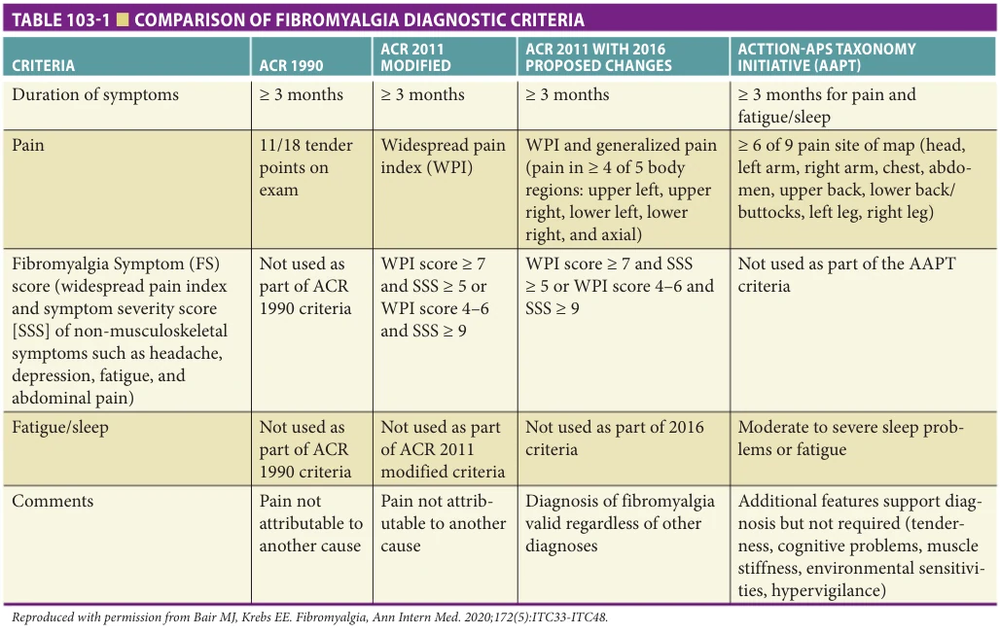

*Table 103-1 — printed p. 1646.*

vertigo, and Raynaud phenomenon. Studies demonstrate that fibromyalgia may coexist in 17% of patients with osteoarthritis, 21% of patients with rheumatoid arthritis, and 37% of patients with systemic lupus erythematosus. Table 103-2 lists the symptoms and syndromes commonly associated with fibromyalgia.

Up to 80% of fibromyalgia patients report debilitating fatigue. This complaint encompasses mental fatigue and impaired concentration, commonly referred to as “fibro fog,” physical fatigue after exertion, and general sleepiness. In fibromyalgia patients, these symptoms most often occur in the absence of other medical illnesses. Neuropsychological performance testing demonstrates objective deficits in patients with fibromyalgia, most notably inhibitory control and short-/long-term memory. It is important, therefore, that neuropsychological performance testing results in the older adult with fibromyalgia are interpreted in the context of typical neuropsychological performance deficits related to fibromyalgia.

Poor sleep quality seen in fibromyalgia patients is known as nonrestorative sleep. A number of sleep abnormalities have been documented in fibromyalgia patients and are listed in Table 103-4. A recent large epidemiologic study found that improvements in restorative sleep correlate with the resolution of chronic widespread pain.

## CLINICAL ASSESSMENT

When evaluating the older adult with widespread chronic pain, the practitioner should be mindful of fibromyalgia-associated rheumatologic disorders such as generalized osteoarthritis, pseudogout, gout, rheumatoid arthritis, systemic lupus erythematosus, and polymyalgia rheumatica, as summarized in Table 103-5. A careful history and thorough physical examination for synovial and extrasynovial findings can help differentiate these conditions from fibromyalgia. Table 103-5 lists many key features on history and physical examination that help diagnose fibromyalgia. Other diagnostic considerations include hypothyroidism, vitamin D deficiency, demyelinating polyneuropathies, and paraneoplastic syndromes. A targeted laboratory panel may help tease out these differential diagnostic considerations.

The practitioner should review all medications when assessing the older adult with widespread pain. Toxic myopathy is a well-documented and dose-related side effect of HMG-CoA reductase inhibitors and high-dose corticosteroids (30 mg of prednisone equivalents per day). The antiretroviral agent zidovudine, the antifungal agent voriconazole, and several immunosuppressant medications, including interferon, cyclosporin, and tacrolimus, may cause painful myopathies. Commonly abused drugs, including cocaine, heroin, amphetamines, and alcohol, also cause painful myopathies. Symptoms typically begin

**[p. 1647]**

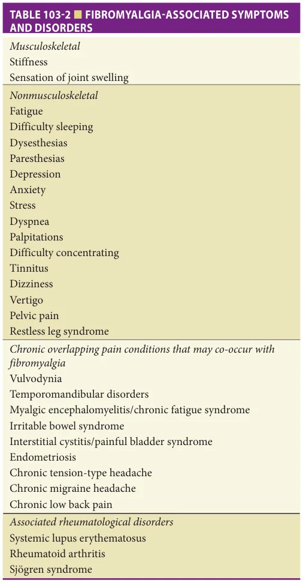

*Table 103-2 — printed p. 1647.*

within weeks to months of drug exposure and resolve with discontinuation.

## TREATMENT

A variety of pharmacologic and nonpharmacologic interventions are available for the treatment of fibromyalgia. There are not first-line fibromyalgia treatments, and evidence-based guidelines vary. Most experts agree that effective treatment starts with patient education and integrates both pharmacologic and nonpharmacologic therapies, as illustrated in Figure 103-2. Although the response is likely to be modest, we have successfully employed a number of management approaches in our older adult patients with fibromyalgia. Patients may benefit from treatment

with antidepressants and some antiseizure medications, especially if they report associated symptoms such as disrupted sleep, depression, and/or anxiety (Table 103-6). Experts recommend a tailored treatment approach that addresses the patient’s most bothersome symptoms.

## Medications

Antidepressants Antidepressants are among the most widely studied medications for the treatment of fibromyalgia. The analgesic effect of antidepressants may result from increased central nervous system serotonin and norepinephrine, which block pain signals from the periphery. In addition to reducing pain, antidepressants may improve sleep and emotional well-being. Those used most commonly are the tricyclic antidepressants (TCAs) and serotonin norepinephrine reuptake inhibitors (SNRIs). Selective serotonin reuptake inhibitors (SSRI) may be less effective than the SNRIs for treating chronic pain. However, some practitioners find SSRIs more effective for treating depression. Fibromyalgia treatment guidelines recommend TCAs in doses ranging from 10 to 50 mg at night. A comparative review of amitriptyline versus other FDA-approved fibromyalgia medications found similar improvements in pain and fatigue. Cyclobenzaprine, a muscle relaxant with structural similarity to the tricyclics, has shown efficacy in several short-term clinical trials.

Even in low doses, TCAs have significant side effects that limit use. This class’s anticholinergic effects are responsible for most of the adverse effects, including sedation, confusion, constipation, and palpitations. TCAs may contribute to impaired mobility and cause falls in older adults. TCAs may also prolong the QT interval, which results in torsade de pointes and death. Practitioners should obtain a baseline electrocardogram to assess cardiac rhythm prior to starting TCAs and monitor periodically during use. According to FDA guidelines for QTc prolongation with antidepressant use, QTc increases of greater than 10 ms over baseline are of “increasing concern” and greater than 20 ms are of “definite concern.” FDA guidelines caution against prescribing/ continuing TCAs when QTc intervals are greater than 500 ms or have increased 60 ms or more over baseline. Secondary tricyclic amines, desipramine, and nortriptyline have fewer side effects but are not as well studied.

Practitioners may favor SNRIs compared to TCAs for fibromyalgia as they have fewer adverse effects. Duloxetine (60 mg daily) and milnacipran (100–200 mg daily) are FDA-approved for fibromyalgia. Both duloxetine and milnacipran improve pain, depression, and quality of life. Compared to duloxetine, milnacipran is a more potent inhibitor of norepinephrine reuptake and may be more effective for patients with fatigue and cognitive symptoms. SNRIs may elevate blood pressure in some patients, and vital signs should be monitored routinely. Common side effects are nausea and orthostatic hypotension and may be reduced by taking the medication with food and using slow titration.

**[p. 1648]**

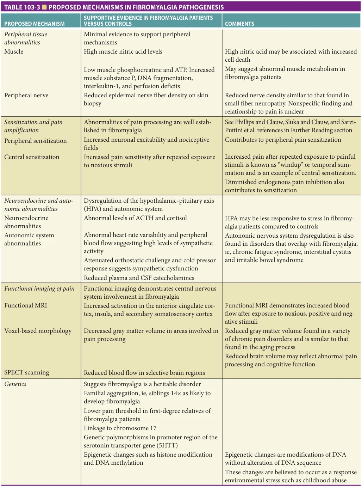

*Table 103-3 — printed p. 1648.*

**[p. 1649]**

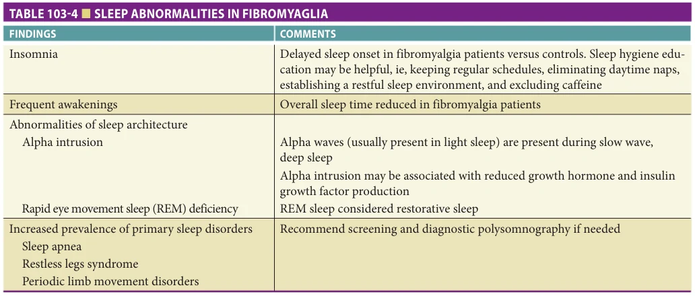

*Table 103-4 — printed p. 1649.*

We recommend starting duloxetine at 20 mg daily and increasing to 60 mg slowly over at least several weeks. If the practitioner decides to discontinue the drug, this also must be done slowly to avoid SNRI withdrawal syndrome. We recommend slowly decreasing the dose by no more than 50% at 1 to 2 weeks intervals. Standard recommendations for milnacipran are to start with 12.5 mg daily and slowly titrate to 50 mg bid. The authors of this chapter do not prescribe milnacipran for older adults because of lack of data in this age group.

Antiepileptics Aside from the antidepressants, very few drug classes have evidence for efficacy in the treatment of fibromyalgia. Some studies support using the antiepileptic drugs gabapentin (currently available in generic form) and pregabalin. Research suggests that antiepileptic drugs reduce neuronal excitability, decrease ectopic neuronal discharge, and modulate various neurotransmitter levels. A large study of pregabalin, which binds to the alpha(2)- delta subunit of the voltage-gated calcium channel, found that fibromyalgia patients experienced significant improvement in pain, fatigue, social functioning, vitality, and general health perception compared to controls. Pregabalin, in doses ranging from 300 to 450 mg daily, was the first medication approved for fibromyalgia syndrome. A recent meta-analysis of anticonvulsants for fibromyalgia found mild improvements with pregabalin in pain, sleep, and fatigue compared to placebo. Despite the lack of conclusive evidence to support gabapentin for fibromyalgia, our clinical experience suggests that low doses (eg, 100–600 mg/day) may help reduce pain and improve sleep. Sedation and dizziness are common side effects of both medications and may contribute to falls in older adults. These are minimized by starting with low bedtime doses and slowly titrating upward. Table 103-7 compares the benefits and side effects of the three FDA-approved fibromyalgia medications.

Analgesics Except for tramadol, there are no data to support the efficacy of analgesics for fibromyalgia treatment. Tramadol, a weak mu receptor agonist with dual serotonin and norepinephrine reuptake inhibition, is unique in its mechanism and was effective for fibromyalgia symptoms in three randomized controlled trials.

Hormonal supplements and other agents Studies of hormonal supplements for patients with fibromyalgia have had mixed results. Randomized growth hormone studies demonstrate some improvement in pain and fatigue but do not support routine use. Several other hormonal supplements, including thyroid hormone, dehydroepiandrosterone, and calcitonin, have been tried anecdotally but are not widely accepted for fibromyalgia treatment. Similarly, rigorous data do not support the use of nutritional supplements, herbal medications, guaifenesin, or vitamin therapy. In a few small uncontrolled studies, low-dose naltrexone demonstrated improved inflammation, pain, and function in patients with fibromyalgia.

For patients with fibromyalgia and vitamin D deficiency, repletion of vitamin D may reduce pain and improve function. Given the other risks associated with vitamin D deficiency in older adults (eg, falls, osteoporosis), 25-OH vitamin D levels should be checked routinely, not just in those with chronic pain.

There is growing interest in the use of cannabinoid molecules for the treatment of chronic pain. Because data from rigorous randomized controlled trials are lacking, treatment recommendations related to medical cannabis are currently informed by clinical experience and uncontrolled studies (see Table 103-6).

Nonpharmacologic Therapies Nonpharmacologic therapies for fibromyalgia include cognitive-behavioral techniques, exercise, acupuncture, balneotherapy (ie, bathing), and massage. Systematic review

**[p. 1650]**

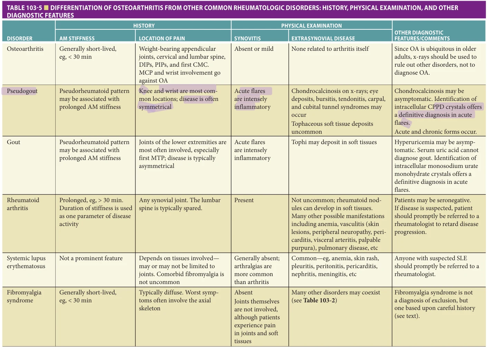

*Table 103-5 — printed p. 1650.*

**[p. 1651]**

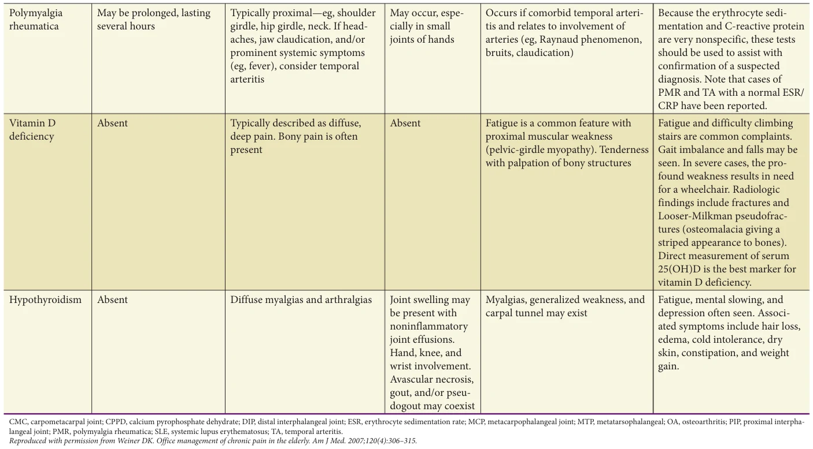

*Table 103-5 continued — printed p. 1651.*

**[p. 1652]**

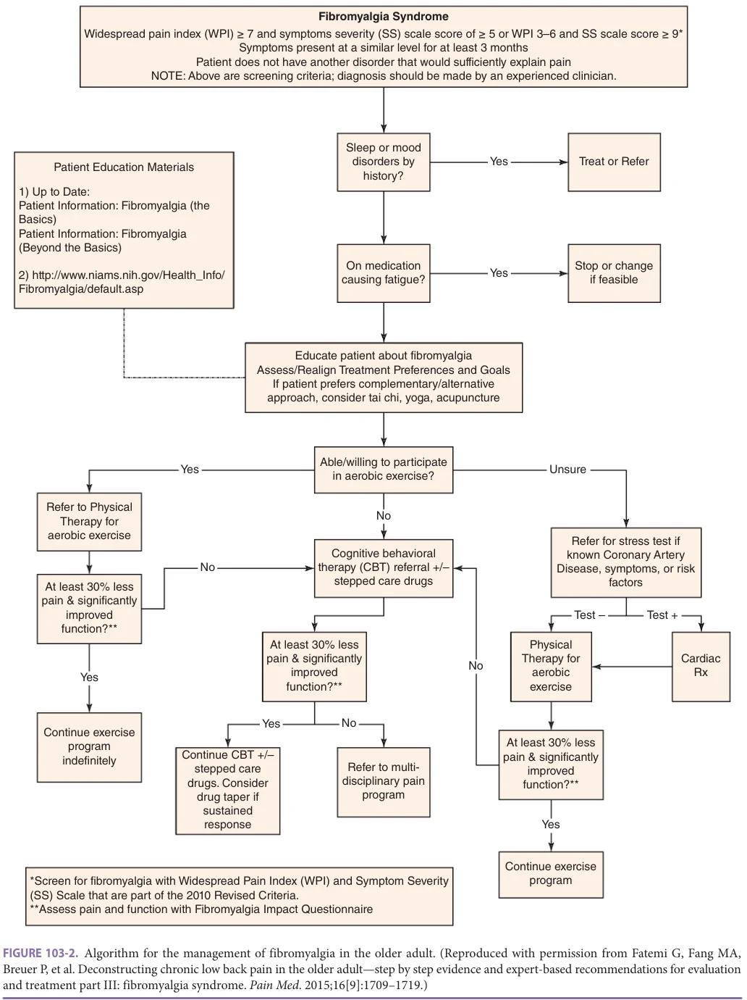

*Figure 103-2 — printed p. 1652.*

**[p. 1653]**

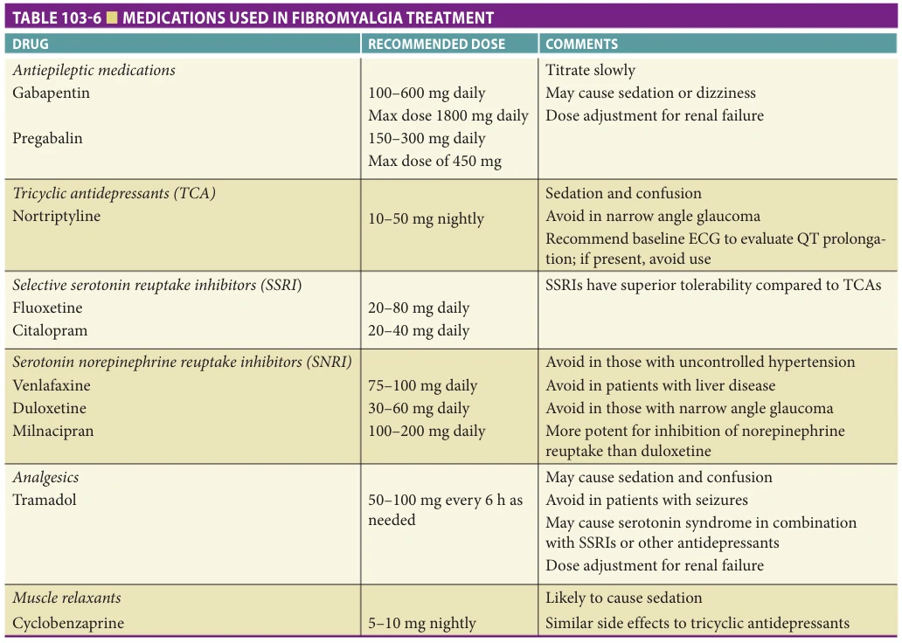

*Table 103-6 — printed p. 1653.*

of regular aerobic exercise for fibromyalgia (20 minutes daily, 2–3 times a week) demonstrated improvements in pain, function, aerobic capacity, and well-being. Most therapists recommend individualizing programs based on patient abilities and symptoms. During pain flares, which may occur after physical exertion, exercise and daily routines should be modified but not ceased. Water aerobics may benefit those who have difficulty with

traditional physical therapy. The evidence supporting strength training is not as robust as that for aerobic exercise. Strength training is beneficial for fibromyalgia patients who may be deconditioned and up to 30% weaker than control subjects.

Data support the benefits of coupling exercise programs with educational sessions and cognitive-behavioral techniques. Lectures on fibromyalgia and the benefits of

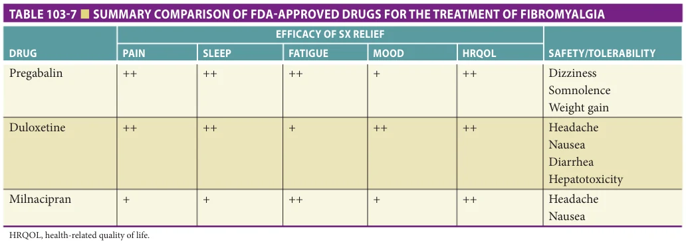

*Table 103-7 — printed p. 1653.*

**[p. 1654]**

exercise improve treatment outcomes. Cognitive-behavioral therapy (CBT) is useful for fibromyalgia patients who tend to catastrophize their painful symptoms. We have found that CBT performed via telemedicine is an effective option for those who have trouble traveling or wish to avoid in-person appointments. Studies of internet-based CBT for fibromyalgia demonstrate improvements in pain, depression, and patient satisfaction. Mindfulness-based therapy, such as meditation, may improve sleep, symptom severity, and stress. Cognitive approaches to pain management are most useful as part of an interdisciplinary program that includes education and exercise.

Complementary medicine treatments for fibromyalgia may be beneficial. Several randomized controlled trials of acupuncture have shown effectiveness for relieving fibromyalgia symptoms, although none have been performed exclusively in older adults. These data are encouraging, however, given the overall safety of this treatment modality. Mindbody movement techniques such as yoga, qigong, and tai chi are promising as fibromyalgia therapies. Two controlled trials of tai chi for fibromyalgia showed improvements in pain, sleep, and function. Fibromyalgia patients participating in an 8-week yoga program had similar symptomatic improvements compared to those receiving standard care. Weak evidence supports chiropractic treatment, massage therapy, interferential current, and ultrasound to treat fibromyalgia syndrome. Further studies are needed to determine the potential impact of all these modalities and identify potential long-term treatment benefits.

Treatment for Refractory Cases Several factors limit the effectiveness of fibromyalgia treatment, including medication under-prescribing, underdosing, and/or patient noncompliance. One fibromyalgia study demonstrated that only 31% of patients received at least one medication listed on the ACR treatment guidelines. Those patients treated with appropriate medicines did not necessarily achieve the recommended dose or adhere to the prescribed regimen. Optimal treatment may require combining several medications, which increases the risk of severe side effects. Patients with refractory pain may benefit from consultation with a specialist for medication adjustment, multidisciplinary rehabilitation, or interventional procedures for comorbid pain conditions. Patients with severe mood disorders are prone to fail traditional treatments and may benefit from psychiatric comanagement.

Assessing Response to Treatment Several standardized questionnaires are available to assess response to treatment. One of the most efficient and useful is the 20-question Fibromyalgia Impact Questionnaire (FIQ), which takes only a few minutes to complete and quantifies physical function, painful symptoms, and emotional well-being specifically in fibromyalgia patients (Figure 103-3).

## MYOFASCIAL PAIN SYNDROME

Background and Epidemiology Myofascial pain syndrome (MPS) arises from muscle as well as surrounding fascia and is characterized by the presence of taut bands of skeletal muscle, which may contain palpable nodules (myofascial trigger points [MTrPs]; Figure 103-4). MPS can be an acute or chronic condition, and the pain is often regional, compared to widespread pain characteristic of fibromyalgia.

MPS is prevalent in older adults with one study demonstrating a 95.5% prevalence in those older than 60 years with chronic low back pain. MPS may exist alone or in combination with other pain conditions, such as temporomandibular joint dysfunction, visceral pain syndromes, radiculopathy, and fibromyalgia.

## PATHOPHYSIOLOGY

While substantial advances have been made, a full understanding of the etiology and pathophysiology of MPS and the role of MTrPs in this is still lacking. Several hypotheses have prevailed in providing an explanation for gaps in knowledge of MPS pathophysiology, two of which include the integrated hypothesis and neurogenic hypothesis. According to the integrated hypothesis, MPS arises from direct (eg, whiplash, muscle injury) or indirect (eg, through muscle overuse or misuse) muscle trauma. This leads to a release of proinflammatory substances that maintain the perception of pain, as well as a dysfunctional motor endplate that ultimately leads to a group of contraction knots in the muscle, forming an MTrP. A traumatic event itself can additionally open ion channels along the membranes of free nerve endings, resulting in cation influx and subsequent excessive, persistent nociceptor depolarization. The neurogenic hypothesis accounts for the occurrence of MPS and MTrPs in patients with no signs of muscle trauma but suffer from visceral or somatic diseases such as irritable bowel syndrome, chronic pelvic pain, and osteoarthritis, deemed as the primary pathology. The primary pathology leads to the constant activation of afferent nociceptors, which connect to the thinly myelinated (group III) and unmyelinated (group IV) nerve fibers that synapse onto dorsal horn neurons in the spinal cord, thereby initiating the process of persistent nociceptive bombardment, leading to central and peripheral sensitization. Central sensitization, a core concept of the neurogenic hypothesis, involves neuroplastic changes in the dorsal horn, resulting in sensitized dorsal horn neurons, apoptosis of inhibitory neurons, operation of previously ineffective synapses, and the expansion of receptive fields to nearby segments in the spinal cord. Several biochemicals such as calcitonin generelated peptide and substance P are released antidromically by dorsal root ganglion via the activated nociceptors in the periphery, leading to neurogenically mediated inflammation. Surrounding alpha motor neurons in the spinal cord

**[p. 1655]**

*Figure 103-3 — printed p. 1655.*

**[p. 1656]**

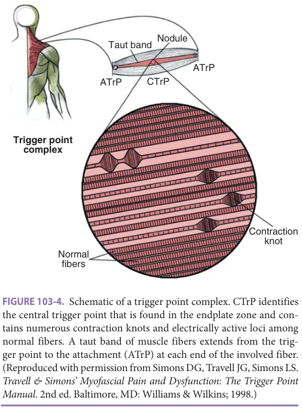

*Figure 103-4 — printed p. 1656.*

are also excited, leading to the formation of an MTrP. Other hypotheses that emphasize dysfunctional recruitment of muscle fibers, such as prolonged contraction periods of small fibers due to submaximal loads (Cinderella hypothesis) or decreased relaxation times for postural muscles working in “shifts” (Shift hypothesis), have been proposed as well. Table 103-8 expands on the underlying mechanisms elucidated by the prevailing hypotheses on MPS pathogenesis.

Despite being distinct conditions, both chronic MPS and fibromyalgia share the process of central sensitization as part of their underlying pathophysiology. Many researchers have proposed a role for MTrPs in initiating and maintaining the chronic, widespread pain found in patients with fibromyalgia. However, several studies have shown that not all patients with fibromyalgia present with MTrPs, casting doubt upon the need for active MTrPs to drive both syndromes. Further, most patients presenting with active MTrPs report regional pain that may or may not refer to other areas, but they do not report widespread pain characteristic of fibromyalgia. Nevertheless, deactivation of MTrPs should be incorporated as part of the treatment plan for the patients with fibromyalgia that also have MTrPs.

## CLINICAL PRESENTATION AND EVALUATION

MPS may occur in virtually any body location, and the accompanying pain may be relatively discrete or cover a large area, spreading from the MTrP. MPS can present

abruptly due to acute overload, exercise (overexercise, improper body mechanics that can cause muscle sprain and strain), direct trauma, and chilling (exposure to cold temperatures especially when the muscle is fatigued). MPS also can present gradually due to chronic overload from poor posture, stress, and overuse of muscles while performing work activities using improper body mechanics that can lead to muscle fatigue, sustained muscular contraction in a shortened position, and repetitive stress injuries. It can also manifest secondary to visceral, viral, metabolic, and endocrine diseases, arthritic joints, nutritional deficiencies, anxiety, and emotional distress. We commonly treat older adults with myofascial low back pain that is perpetuated by multiple coexisting factors such as anxiety, leg length inequality, axial spondylosis, and spinal malalignment.

Taking the History Patients with MPS may use a variety of pain descriptors— dull, aching, sharp, stabbing, burning, etc. Factors that commonly exacerbate pain in these patients are: (1) excessive physical activity, (2) firm pressure over the painful muscle, (3) cold exposure, (4) psychological stress, and (5) acute illness (eg, viral infection). Those that tend to alleviate pain include: (1) mild activity, (2) gentle stretching, (3) gentle pressure (eg, massage), (4) moist heat, and (5) a brief rest period following activity. Common accompanying neurologic and motor signs and symptoms include weakness, paresthesias, changes in gait, limitations in range of motion, and autonomic phenomena, such as piloerection, sweating, and temperature changes. As with other chronic pain disorders, changes in appetite, mood, sleep, and cognitive function can occur.

Diagnosing Myofascial Pain: Performing the Physical Examination Diagnosing MPS requires an accurate physical examination that relies on palpation and identification of (1) taut bands—groups of taut muscle fibers extending from MTrPs to the muscle attachments, (2) exquisitely tender, hyperirritable nodules (MTrP) in taut bands (note that taut bands may not always contain MTrPs), and (3) reproduction of the patient’s spontaneous pain with sustained pressure that may radiate distal to the MTrP (Figure 103-5). MTrPs may be latent (ie, painful only upon compression) or active (ie, spontaneously painful). Latent MTrPs may occur in a muscle group contralateral to the site of pain because of a compensatory response. Active MTrPs are those that are responsible for clinical symptoms. In addition to pain with compression of MTrPs, a “jump sign” may be elicited—a pain behavior response that may include verbal as well as nonverbal expression (eg, crying out, grimacing, withdrawing). The examiner may also appreciate a local twitch response (LTR), which is an involuntary, transient contraction of a taut band that traverses a MTrP and occurs in response to stimulation of the MTrP (eg, with needling or snapping palpation).

**[p. 1657]**

*Table 103-8 — printed p. 1657.*

Accurate diagnosis of MPS requires the use of precise physical examination technique, summarized in Table 103-9. Before examining the painful muscles, a general physical examination including comprehensive musculoskeletal, neurologic, and mobility examinations must be performed. These examinations must be carried out with an eye toward identifying abnormalities that create muscular dysfunction. Examples in the musculoskeletal examination include decreased motor strength, abnormal muscle tone, decreased range of motion of the hips, knees, cervical spine, and shoulders; congenital or acquired deformities such as scoliosis; kyphosis; and functional or actual leg length discrepancy. Inspection of the patient’s gait allows for an integrated assessment of body mechanics.

Prior to palpating the musculature, the examiner should assess the movement of the skin over the subcutaneous tissues using very light palpation and simply gliding the skin in a direction that is perpendicular to the orientation of the involved muscle fibers. Patients with chronic MPS commonly have reduced skin movement over the involved region. After palpating the skin, the muscles should be examined. MTrPs are associated with the finding of a “nodule.” The MTrP may be large and easily palpable or small and difficult to identify; regardless, the muscle should be palpated thoroughly to search for the area of greatest tenderness. Sweeping hand motion is needed to appreciate taut bands and better elicits the radiating pain that is a pathognomonic feature of MTrPs.

**[p. 1658]**

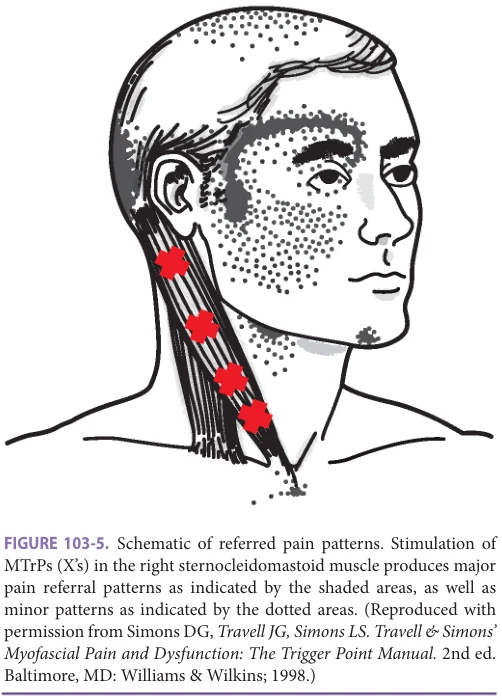

*Figure 103-5 — printed p. 1658.*

While physical examination remains the procedure of choice for diagnosing MPS, it is difficult to standardize, and a number of other techniques have been evaluated. Intramuscular needling, surface electromyography-guided assessment, infrared thermography, ultrasound imaging, elastography, color Doppler, and laser Doppler flowmetry have been examined but all have drawbacks, and none is routinely used in clinical practice for the diagnosis of MPS.

## COMMON MYOFASCIAL PAIN SYNDROMES IN ADULTS

Common presentations of MPS include cervicogenic headaches, piriformis MPS, trapezius MPS (sometimes associated with “tension neckache”), pseudotrochanteric bursitis, upper and lower back pain, and postherpetic pain. These syndromes are discussed below.

Cervicogenic Headache Cervicogenic headaches are characterized by neck and pericranial pain and are often associated with structural abnormalities of the cervical spine, including osteoarthritis and facet arthrosis. Typically, cervicogenic headaches are unilateral in location and range from moderate to severe in intensity. While cervicogenic headaches lack the pulsating quality of migraine headaches, they may have migraineassociated features such as photophobia, phonophobia,

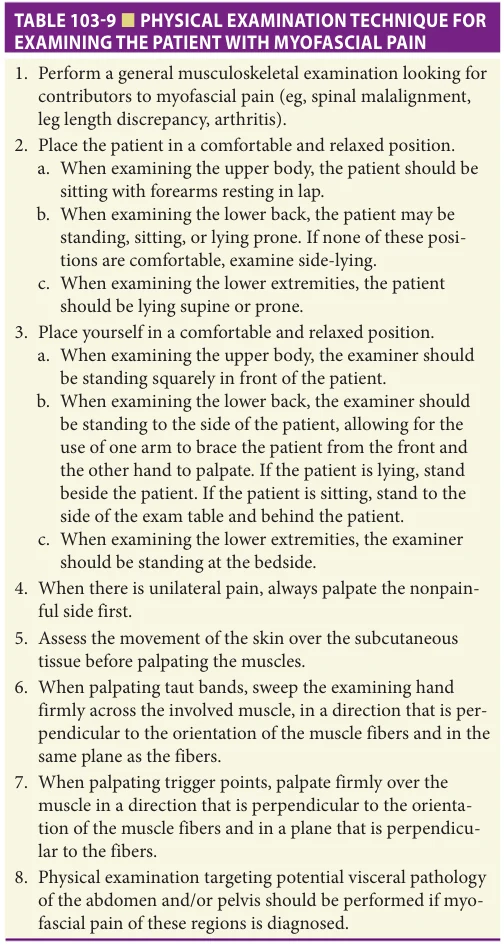

*Table 103-9 — printed p. 1658.*

nausea, vomiting, and dizziness. Triggers include specific neck postures and movements especially in extension, extension with rotation toward the side of pain, on applying digital pressure to the involved facet regions, over the ipsilateral greater occipital nerve, or pressure applied to the cervical spine. Palpation of these neck muscles including paraspinal muscles, suboccipital muscles, and trapezius also may produce pain, which usually radiates through the head and may extend to the ipsilateral shoulder. MTrPs are usually found in the suboccipital, cervical, and shoulder musculature, and can also refer pain to the head when manually or physically stimulated. There are no neurologic findings of cervical radiculopathy, though the patient might report scalp paresthesia or dysesthesia.

Making the diagnosis for cervicogenic headaches may be difficult especially if structural lesions of the cervical spine are not present. A careful history and examination

**[p. 1659]**

that clearly implicate the cervical spine and its musculature as the sources of the pain are essential for diagnosis. Diagnostic imaging such as radiography, MRI, and computed tomography (CT) myelography can be used as supportive diagnostic tools. Zygapophyseal joint, cervical nerve, or medial branch blockades are used to confirm the diagnosis of cervicogenic headache and may predict effective treatment modalities.

Deep Gluteal Pain Syndrome When MPS occurs in the pelvic and buttock regions, the resulting pain and associated limitations in muscle function may mimic that of sciatica. The piriformis muscle originates from the pelvic surface of the sacrum, passes through the greater sciatic foramen, and inserts into the medial side of the upper end of the greater trochanter. The fibers of the sciatic nerve course through the piriformis. Piriformis syndrome describes the occurrence of sciatica in association with piriformis MPS that results from nerve entrapment by the myofascial taut bands in the piriformis. Patients with piriformis MPS describe intense gluteal discomfort. Because the piriformis acts to externally rotate the thigh at the hip joint, patients with piriformis MPS sometimes demonstrate external rotation of the leg when standing or laying supine. Palpation of the piriformis can be performed with the patient standing or laying supine. The technique recommended for examining the patient in the supine position is described in Table 103-10. Piriformis MPS may involve the lower back, buttock, and posterior thigh. Typically, this form of MPS is increased by sitting, standing, and walking.

The gluteus minimus is another muscle in which MPS symptoms may mimic sciatica, and, therefore, this muscle should be carefully examined. The fibers of this fan-shaped muscle extend from the outer surface of the pelvis and converge onto a tendon, which is attached to the anterior surface of the greater trochanter. The gluteus minimus fibers work with the gluteus medius to abduct the thigh during extension and stabilize the pelvis during ambulation. Patients with MPS arising from the gluteus minimus typically complain of hip pain during ambulation, often present with a limp, and may also have trouble rising from a sitting position. Because the gluteus minimus is the deepest of the gluteal muscles, it may be difficult for the examiner to palpate taut bands. However, if the patient lays in the supine position or on their side and relaxes the gluteal muscles, MTrPs may be located by identifying the areas of greatest localized tenderness. Palpation of MTrPs in the gluteus minimus may also induce a thigh jerk.

Trapezius MPS The trapezius is a large muscle; as a result, associated MPS can have a number of presentations. The fibers originate from the occiput, the ligamentum nuchae, and the vertebral spinous processes of the seventh cervical vertebra and all of the 12 thoracic vertebrae. They insert onto the distal third

of the clavicle, the acromion, and the length of the spine of the scapula. The upper fibers elevate the scapula, the middle fibers pull the scapula medially, and the lower fibers pull the medial border of the scapula downward. The upper and lower fibers also assist the serratus anterior muscle in rotating the scapula when the arm is raised above the head.

Patients with trapezius MPS typically do not complain of limitations in movement, but full rotation of the head and neck to the opposite side is often painful, and lateral bending contralaterally may be restricted. Radiating pain patterns vary according to the trapezius fibers that contain MTrPs (ie, upper, middle, or lower). MTrPs that occur in the upper trapezius may cause pain that radiates up the posterolateral part of the neck to the mastoid process, causing so-called “tension neckache.” Sometimes this pain may radiate to the angle of the jaw and/or the temple and back of the orbit. Dizziness also may occur. MTrPs of the middle fibers of the trapezius may be associated with a superficial burning pain very close to the spinous processes of the seventh cervical and the third thoracic vertebrae or with aching on the top of the shoulder or acromion process. MTrPs of the lower fibers of the trapezius, typically located along the lower border of the muscle, may refer pain to the high paracervical spinal musculature, the mastoid and the acromion, as well as aching and tenderness of the suprascapular region. Perpetuating factors include anything that causes abnormal biomechanics of the upper body such as a whiplash injury or prolonged computer work in an ergonomically unfriendly workspace.

Levator Scapulae MPS The levator scapulae muscle extends from the upper medial border of the scapula to the transverse processes of the first four cervical vertebrae. The levator scapulae muscle, in conjunction with the other shoulder muscles, has an important action in stabilizing and moving the scapula and is associated with movement of the shoulder. Levator scapulae pain could be at the angle of the neck, the medial border of the scapula, or out to the posterior aspect of the shoulder joint. It causes restriction of neck movements and pain on stretching the levator scapulae muscle, such as with contralateral bending and rotation of neck. Tenderness is maximal over the angle of the neck along the line of the muscle and most prominent close to attachment at medial border of scapula. It is often precipitated by a prolonged abnormal position and with neck rotation.

Upper and Lower Back Pain These syndromes may be caused by MPS in the thoracolumbar paraspinal musculature. Numerous muscles constitute the paraspinal group, including superficial and deep muscles. The superficial group is collectively referred to as the erector spinae and is the largest muscular mass of the back. It originates from the sacrum, the iliac crest, and the spinous processes of most of the lumbar and the last two thoracic vertebrae, and inserts into the ribs, the transverse

**[p. 1660]**

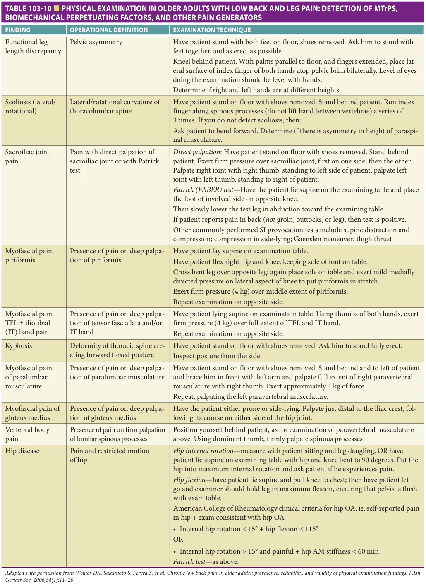

*Table 103-10 — printed p. 1660.*

**[p. 1661]**

processes of the cervical vertebrae, thoracic vertebrae, and mastoid process. The deep group comprises the semispinalis, multifidus, and rotatores. The primary function of the paraspinal musculature is spinal extension. Patients with parathoracic MPS may experience pain that radiates to the region of the scapula or more medially, and sometimes to the anterior lower chest; patients with paralumbar MPS may experience pain that radiates to the buttocks or lower abdomen. Precipitation of MPS may be caused by sudden muscular overload (eg, when lifting objects using poor body mechanics) or associated with a vertebral compression fracture. Multiple vertebral compression fractures may also accumulate to cause hyperkyphosis and associated muscular strain. Physical examination typically reveals diminished spinal range of motion.

Upper and lower back pain in older adults often relates to the presence of axial spondylosis. This spondylosis causes aberrant neuronal input by injuring spinal nerves, disrupting generation of neurotrophic factors, and resulting in muscle shortening and pain. This condition, formally described by Chan Gunn et al., is referred to as neuropathic MPS. Axial spondylosis is ubiquitous in older adults; thus, it is not surprising that MPS commonly occurs in older adults with axial arthritis, even in the absence of frank radiculopathy (eg, MPS of the sternocleidomastoid and trapezius in patients with cervical spondylosis).

Techniques used to examine the lower back to identify MTrPs and associated perpetuating factors are described in Table 103-10. Treatment of postural abnormalities is an important component of treating paraspinal MP. Physical therapy geared toward strengthening of core muscles is a key component of treatment, not only for the pain itself, but also for reducing the risk of future vertebral compression fractures.

Pseudotrochanteric bursitis This syndrome is caused by MPS that involves the tensor fasciae latae (TFL) muscle. The TFL originates from the outer edge of the iliac crest between the anterior superior iliac spine and iliac tubercle and inserts into the iliotibial tract. It assists the gluteus maximus in maintaining the knee in extension when a person stands and also flexes the hip. Patients with TFL MPS experience pain in the region of the hip and lateral thigh, sometimes extending to the knee along the iliotibial band. The pattern of pain radiation is sometimes confused with trochanteric bursitis and is referred to as pseudotrochanteric bursitis. Patients may also complain of poor sitting tolerance, difficulty walking rapidly, and laying on the involved side. They may also have difficulty laying on the opposite side unless a pillow is placed between the knees because of the tight iliotibial band. Physical examination may reveal restricted hip extension and adduction and TFL MTrPs. When standing, patients with TFL MPS tend to maintain the hip in slight flexion. Other disorders that should be considered in the differential diagnosis include L4 radiculopathy and meralgia paresthetica.

Postherpetic MPS This is likely caused by a combination of axial spondylosis and the varicella-zoster virus (VZV) mainly in older adults. Both VZV and spondylosis-related MPS sensitize dorsal horn neurons and contribute to postherpetic neuralgia. We hypothesize that a spinal nerve already vulnerable from spondylosis that has caused muscle shortening may be particularly prone to the generation of MPS following an acute insult such as VZV. The myofascial pathology may then further exacerbate neuropathic pain by entrapping the spinal nerves as they course through the taut bands of the muscles. This results in a feedback loop.

MPS pathology may also develop in the setting of postherpetic neuralgia as a result of guarding behavior. The pain associated with reactivation of VZV can cause patients to move their body in ways to protect the painful area. When this type of behavior occurs over a prolonged period of time, muscles may develop contraction knots that are characteristic of MPS. The mechanism by which postherpetic neuralgia occurs may be complicated by the development of MPS pathology. Treatment of both the MPS pathology and the neuropathy may be needed to afford optimal pain relief. Other Myofascial Pain and Dysfunction Syndromes Since muscles cover virtually the entire body, any region may be affected by MPS. Thus, MPS should always be included in the practitioner’s list of differential diagnoses for regional pain syndromes. Furthermore, the practitioner must be aware that MPS may occur in response to visceral disease; when myofascial dysfunction is identified in the abdomen and pelvis, the possibility of underlying visceral pathology must be kept in mind. Sometimes, even after the visceral pathology has been eradicated, MPS may persist, which further complicates evaluation and treatment.

Some less common causes of MPS include pelvic floor myofascial dysfunction causing chronic pelvic pain in both men and women, pelvic myofascial dysfunction causing urologic pain (eg, interstitial cystitis and the urgencyfrequency syndrome), masticatory myofascial dysfunction causing toothache, abdominal wall myofascial dysfunction causing chronic abdominal pain (eg, following abdominal surgery or a gastrointestinal illness), intercostal myofascial dysfunction causing postthoracotomy pain, and TMJ dislocation/arthritis causing jaw locking and severe pain.

As noted earlier in this chapter, myofascial dysfunction is not always associated with complaints of pain (ie, in the case of latent MTrPs). For example, masticatory myofascial dysfunction has been associated with tinnitus and myofascial dysfunction of the trapezius with dizziness. Cervical myofascial dysfunction may also be associated with dizziness, a sense of imbalance and tinnitus, and treatment (as outlined below) may alleviate these symptoms. For a more extensive discussion of these and other MPS and dysfunction syndromes, as well as diagrams of common MTrPs and their radiating pain patterns, the reader is referred to

**[p. 1662]**

Travell and Simons’ Myofascial Pain and Dysfunction: The Trigger Point Manual. Another less detailed but very useful introductory text that practitioners may want to consider is Trigger Point Therapy for Myofascial Pain: The Practice of Informed Touch, 2005, edited by Finando and Finando; www.InnerTraditions.com.

## TREATMENT

An overview of MPS treatment is provided in Table 103-11 and Figure 103-6. Effective treatment of MPS involves a three-pronged approach. First, it is important to identify

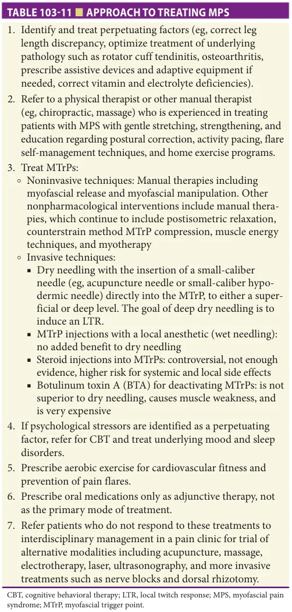

*Table 103-11 — printed p. 1662.*

and address perpetuating factors that maintain the pain/ muscle dysfunction, and precipitating factors that initiate the syndrome. In the older adult, these may lie along a continuum. Second, the MTrPs should be treated. Third, muscle resilience should be addressed through a home exercise program. Treatments should focus not only on resolving the MTrP but also on the health of the surrounding environment (eg, fascia, connective tissue) that may contribute to MPS. In addition, the presence of biochemical markers of pain are very important. This thinking has led clinicians to try to reduce the size of the MTrP, correct underlying contributors to the pain, and restore the normal working relationship between the muscles and surrounding connective tissues of the affected functional units. There are two phases for effective treatment: a pain-control phase and a deep conditioning phase. During the pain-control phase, MTrPs are deactivated, improving blood circulation, decreasing pathological nociceptive activity, and eliminating the abnormal biomechanical force patterns. During the deep conditioning phase, the intra- and inter-tissue mobility of the functional unit is improved, which may include specific muscle stretches, neurodynamic mobilizations, joint mobilizations, orthotics, and strengthening muscle.

Addressing Precipitating and Perpetuating Factors The factors that perpetuate MPS are typically multiple and develop over a long period of time, and each should be addressed to afford an optimal treatment. Lower back pain, for example, could be perpetuated by lumbar spondylosis, degenerative scoliosis, and hip arthritis. The physical factors that precipitate MPS may be overt such as a fall with direct trauma to the piriformis that causes piriformis syndrome or may be more subtle, such as a flare of knee osteoarthritis that alters gait and initiates TFL pain. Psychological stressors may also precipitate flares of MPS or act as perpetuating factors.

The correction of perpetuating factors is arguably one of the most important aspects of MPS treatment. Even if precipitating factors are addressed, the presence of perpetuating factors may reactivate the patient’s original MPS complaint, preventing resolution of pain and dysfunction. Perpetuating factors typically persist over time, and often require behavioral and lifestyle adjustments. As part of the search for perpetuating factors, the practitioner should identify any contributing vitamin deficiencies (eg, B1, B6, B12, C, D, folic acid) or hormonal imbalances. Repetitive movements that contribute to muscular dysfunction, such as those in wheelchair users and computer operators, also should be identified. Proper body mechanics during sitting, standing, walking, and sleeping should be taught by an occupational or physical therapist and efforts to modify repetitive movements and/or other mechanical stressors should be instituted.

Patients who spend prolonged periods resting in static positions (eg, sitting, reclining) may perpetuate their MPS through inactivity. Efforts should be made to incorporate

**[p. 1663]**

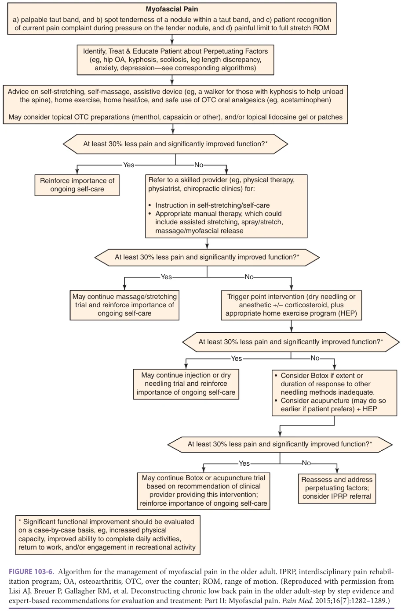

*Figure 103-6 — printed p. 1663.*

**[p. 1664]**

intervals of light movement or stretching if the patient is able to tolerate such activities in order to minimize overuse of small muscle fibers (ie, the Cinderella hypothesis).

Direct or indirect acute trauma should also be identified. For example, if a patient has a sudden leg length discrepancy following total hip replacement, prescription of a shoe lift may be helpful. For patients with long-standing leg length discrepancy, a shoe lift may disrupt the patient’s established compensatory strategies and lead to mobility dysfunction and falls. In these patients, the muscle dysfunction of the pelvis and lower extremities should be first addressed before considering an orthotic device.

Abnormal posture should be corrected. For instance, in older adults with severe kyphosis related to multiple vertebral compression fractures, restoration of normal posture may not be possible and prescription of a walker to unload the spine (ie, alleviate strain on the lower back musculature) should be considered.

To the extent that psychological stressors such as anxiety and depression are playing a role in perpetuating MPS, cognitive behavioral therapy and/or other nonpharmacological and pharmacological treatments may be useful. Vitamin D deficiency also should be identified and treated given its association with musculoskeletal pain, although randomized controlled clinical trials evaluating its efficacy in patients with MPS have not been performed. For patients who do not respond to these approaches in combination with MTrP treatment, referral to an interdisciplinary pain clinic can be considered.

Treating MTrPs The second prong of MPS treatment is to directly treat MTrPs. The goal of treating MTrPs is to deactivate them, and this can be accomplished using noninvasive and/or invasive approaches, listed in Table 103-11.

Oral medications are often considered as potential supplements to the aforementioned treatments for MPS, such as nonsteroidal anti-inflammatory drugs (NSAIDs), benzodiazepines, TCAs, and thiocolchicoside, but these generally should be avoided in older adults because of their risk profile. We have had some success with low-dose gabapentin (eg, 300 mg twice a day) for the treatment of neuropathic MPS in patients with cervical spondylosis and MPS in the paracervical musculature. Topical medications such as diclofenac and lidocaine patches as well as capsaicin and EMLA cream also may have limited efficacy. Medications that target perpetuating factors such as anxiety and insomnia should be considered routinely.

Home Exercise Program The third prong of MPS treatment is maintaining muscular health through a home exercise program. Many factors that contribute to MPS in older adults cannot be eliminated (eg, axial spondylosis, scoliosis); therefore, active pain selfmanagement is key to sustaining improvement. Patients

should be encouraged to maintain an active lifestyle and incorporate a cardiovascular and aerobic fitness program into their routine. Aerobic exercise such as water aerobics may reduce generalized pain and the number of MTrPs, whereas isometric strengthening can increase pain tolerance by providing additional sustenance to affected muscle groups. Pain flares can be prevented by educating patients regarding exercise that includes targeted muscular stretching and eliminating movements that may perpetuate or precipitate myofascial dysfunction. Self-massage also is effective for MPS self-management that involves applying pressure in a rolling motion through the MTrPs. These methods initially should be performed under the supervision of a qualified (ie, one with specific expertise in MPS management) physical therapist, chiropractor, or massage therapist before transitioning into a home exercise program.

Other Treatments A number of other treatments have been tried for MPS such as repetitive magnetic stimulation, transcutaneous electrical nerve stimulation (TENS), biofeedback, massage, ultrasound, hydrocortisone/diclofenac phonophoresis, laser therapy, traditional Chinese and Japanese acupuncture, nerve blocks, and cervical spine dorsal root rhizotomy for the treatment of cervicogenic headaches. The quality of evidence at the present time cannot recommend for or against any of these treatments.

## CONCLUSION

Fibromyalgia and MPS are common causes of chronic pain in older adults. Fibromyalgia is a central sensitivity syndrome with patients demonstrating increased sensitivity to a variety of stimuli, especially pain. While the pathogenesis of fibromyalgia needs further study, there seems to be a genetic predisposition and a clear familial aggregation. Lower levels of central neurotransmitters and nociceptive chemicals are believed to be involved with fibromyalgia pathogenesis. Data on the pathophysiology of MPS support both central and peripheral sensitization. The biochemical milieu of muscles affected by MPS is distinct from that of normal musculature.

For both fibromyalgia and MPS, individualized approaches to treatment are recommended. Medications alone do not typically improve function, but may improve mood, sleep, and pain. Stretching and local modalities as well as identification and treatment of perpetuating factors should be considered first line for MPS and aerobic exercise is a key component of the approach to treating fibromyalgia. Interdisciplinary treatment programs that include education, cognitive behavioral therapy, and exercise may be effective for both fibromyalgia and MPS. Further studies are needed to advance treatment for older adult patients with these disorders, reduce the associated risk of functional compromise and unnecessary health care expenditure, and improve overall quality of life.

**[p. 1665]**

## FURTHER READING

Bell T, Trost Z, Buelow MT, et al. Meta-analysis of cognitive

performance in fibromyalgia. J Clin Exp Neuropsychol. 2018;40(7):698–714. Borg-Stein J, Iaccarion MA. Myofascial pain syndrome treat-

ments. Phys Med Rehabil Clin N Am. 2014;25:357–374. Clauw, DJ. Fibromyalgia: a clinical review. JAMA. 2014;

311(15):1547–1555. Dommerholt J, Bron C, Franssen J. Myofascial trigger

points: an evidence-informed review. J Man Manip Ther. 2006;14(4):203–221. Fernández-de-las-Peñas C, Dommerholt J. International

consensus on diagnostic criteria and clinical considerations of myofascial trigger points: a Delphi study. Pain Medicine. 2018;19:142–150. Gerwin RD. Classification, epidemiology, and natural his-

tory of myofascial pain syndrome. Curr Pain Headache Rep. 2001;5(5):412–420. Gerwin RD. Diagnosis of myofascial pain syndrome. Phys

Med Rehabil Clin N Am. 2014;25:341–355. Giamberardino MA, Affaitati G, Fabrizio A, Costantini R.

Myofascial pain syndromes and their evaluation. Best Pract Res Clin Rheumatol. 2011;25(2):185–198. Gunn CC. Neuropathic myofascial pain syndromes. In:

Loeser JD, Butler SH, Chapman CR, Turk DC, eds. Bonica’s Management of Pain. Philadelphia: Lippincott Williams & Wilkins; 2001. Hauser W, Walitt B, Fitzcharles M, Sommer C. Review of

pharmacological therapies in fibromyalgia syndrome. Arthritis Res Ther. 2014;16(1):201. Jones GT, Atzeni F, Beasley M, et al. The prevalence of

fibromyalgia in the general population: a comparison of

the American College of Rheumatology 1990, 2010, and modified 2010 classification criteria. Arthritis Rheumatol. 2015;67(2):568–575. Macfarlane GJ, Kronisch C, Dean LE, et al. EULAR revised

recommendations for the management of fibromyalgia. Ann Rheum Dis. 2017;76(2):318–328. Nuesch E, Hauser W, Bernardy K. Comparative efficacy

of pharmacological and non-pharmacological interventions in fibromyalgia: network meta-analysis. Ann Rheum Dis. 2013;12:955–962. Phillips K, Clauw DJ. Central pain mechanisms in the

rheumatic diseases: future directions. Arthritis Rheum. 2013;65(2):291–302. Sarzi-Puttini P, Giorgi V, Marotto D, et al. Fibromyalgia:

an update on clinical characteristics, aetiopathogenesis and treatment. Nat Rev Rheumatol. 2020;16(11): 645–660. Shah JP, Thaker N, Heimur J, Aredo JV, Sikdar S, Gerber

LH. Myofascial trigger points then and now: a historical and scientific perspective. PM R 7. 2015;746–761. Simons DG, Travell JG, Simons LS. Travell & Simons’

Myofascial Pain and Dysfunction: The Trigger Point Manual, 2nd ed. Baltimore: Williams & Wilkins; 1999. Sluka KA, Clauw DJ. Neurobiology of fibromyalgia and

chronic widespread pain. Neuroscience. 2016;338: 114–129. Srbely JZ. New trends in the treatment and management

of myofascial pain syndrome. Curr Pain Headache Rep. 2010;14:346–352. Weiner DK. Office management of chronic pain in the

elderly. Am J Med. 2007;120(4):306–315.

**[p. 1666]**
