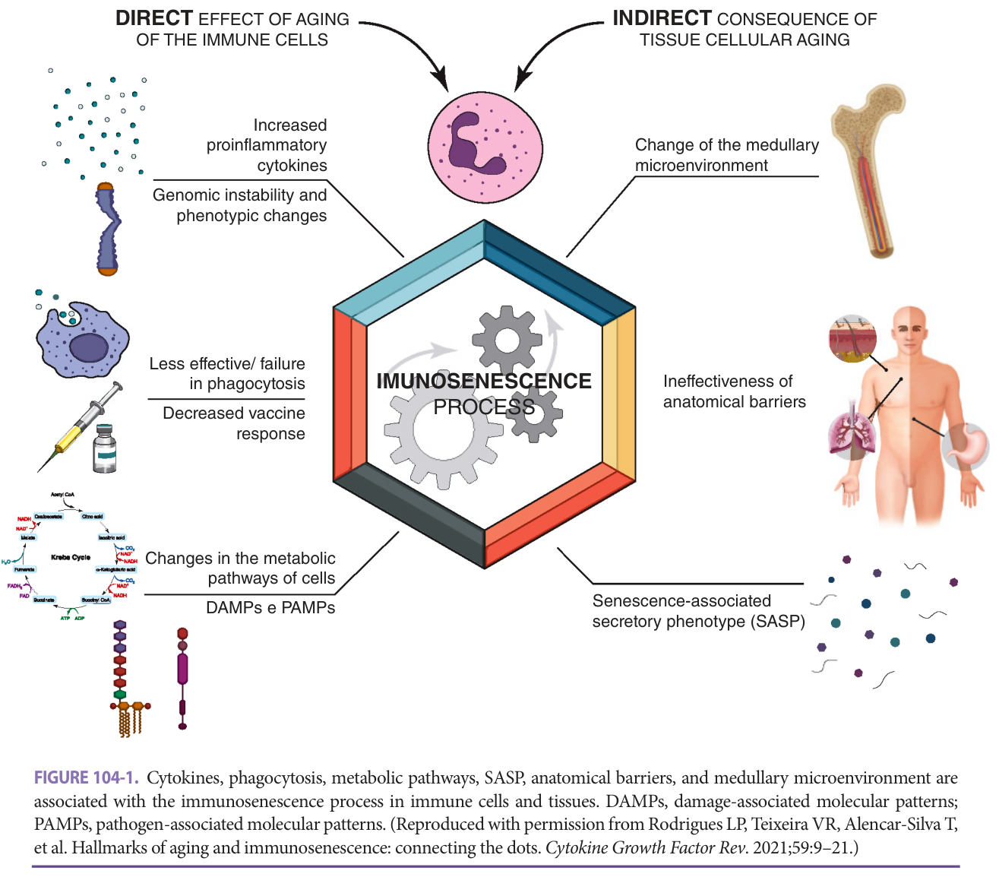
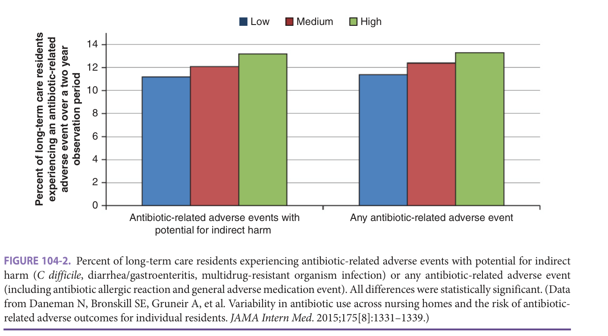
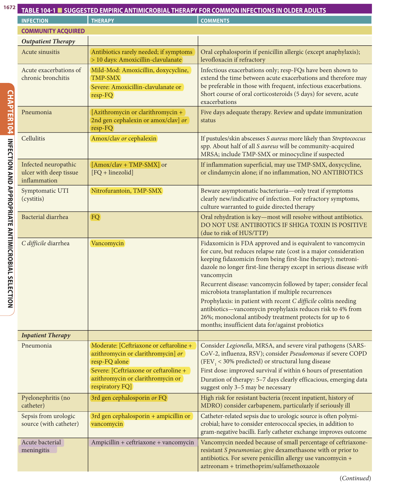
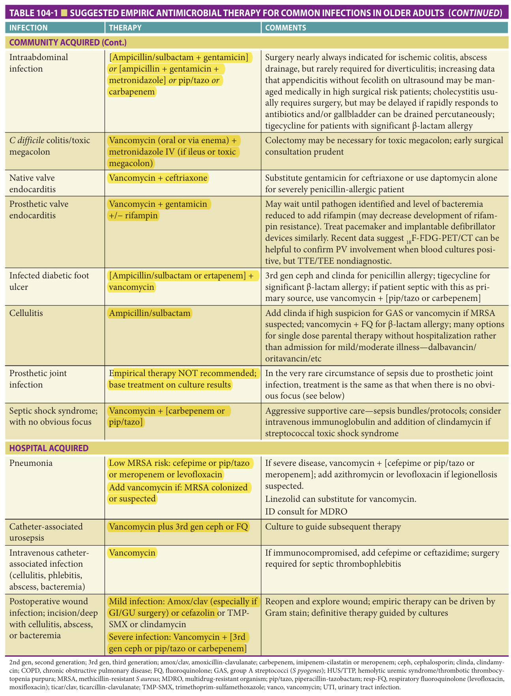
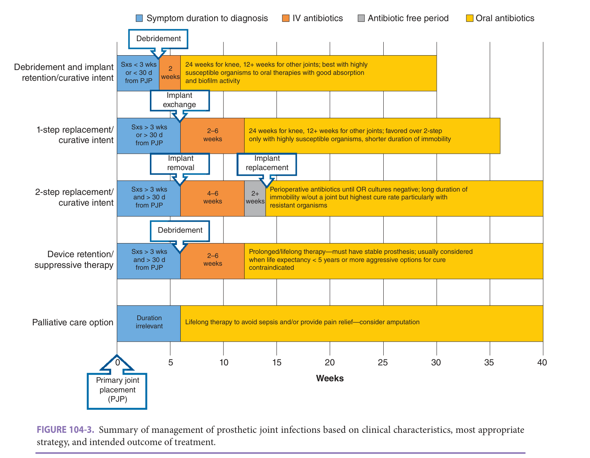

# Hazzard's Geriatric Medicine and Gerontology, 8e — Chapter 104: Infection and Appropriate Antimicrobial Selection

Kevin P. High

> **Lane-reviewed against the book, 25 Sep 2026.**

**[p. 1667]**

#### Learning Objectives

- Identify and address modifiable risk factors for infection in older adults.
- Appropriately order and use culture data in older adults, including knowing when NOT to order cultures of urine and skin.
- Distinguish function-based options for management of prosthetic joint (PJ) infections and link the appropriate risk factors that influence option selection.
- Recognize the most common causes of fever of unknown origin (FUO) and modify the work-up as appropriate for the differential diagnosis of FUO in older adults.

#### Key Clinical Points

1. Multiple risk factors including comorbidity, malnutrition, immune senescence, and social determinants of health (eg, nursing home residence, poor access to care) increase the risk of infection in older adults versus young adults.
2. The adage of “start low, go slow” should NOT be used to guide initial antibiotic dosing for serious infections in older adults—time to therapeutic antibiotic blood levels is a major determinant of outcome. Full initial dosing of antibiotics is critical with subsequent doses adjusted accordingly for renal or hepatic function and drug interactions.
3. Because colonization in the absence of infection (eg, asymptomatic bacteruria) is common in seniors, it is prudent to adopt a practice of “culture stewardship” (ie, limiting the collection of samples to only those clinical conditions where culture data are of clear benefit, greatly reducing inappropriate antibiotic use). Almost universally, cultures should NOT be obtained from skin surface swabs or urine in the presence of a long-term indwelling catheter; cultures in these settings are more often misleading than helpful and should NOT guide antibiotic selection.
4. Baseline and anticipated long-term functional outcomes drive the management of seniors with prosthetic device infections, particularly PJ infections. In those with limited function, control of initial infection followed by long-term antibiotic suppression with the device in place may be a prudent alternative to attempting cure through device removal. Specific risk factors of stability of the prosthesis, susceptibility of the organism, and the presence of comorbid conditions help guide clinical decision making.
5. The causes of FUO differ in old versus young adults; giant cell arteritis (GCA) accounts for nearly one in every six cases of FUO in those 60 years and older, but is absent in published FUO series of adults younger than 50 years.
6. Specific strategies for novel vaccines are beginning to overcome immune senescence; recent examples include the high-dose influenza vaccine, novel adjuvants in influenza and recombinant zoster protein vaccines, and mRNA-based strategies for SARS-CoV-2. These strategies result in greater efficacy even in frail, older adults.

## Predisposition Of Older Adults To Infection

Risk factors for infection in older adults are both intrinsic to the host due to aging itself and comorbid illness, as well as extrinsic due to medications, availability of proper nutrition, and living conditions.

### Intrinsic Changes

The older adult host is a very different being than a healthy, young adult. The most important risk factor for infection in seniors is the accumulation of comorbid disease with age (eg, diabetes, chronic pulmonary disease, vascular disease, heart failure, functional decline, and immobility). These conditions alter immune response, reduce blood flow, impair mucociliary clearance mechanisms, and alter drug distribution and metabolism. Cognitive decline and comorbid illness can alter presentation of illness, delay diagnosis, or reduce adherence to medical regimens. Comorbid disease also reduces physiologic reserve and thus is an important predictor for adverse outcomes when infection occurs.

While comorbidities substantially influence the risk and outcome of infection, the immune response itself—both innate and adaptive immunity—changes with advancing age (detailed in **Figure 104-1** and Chapter 3). These changes are collectively termed _immune senescence_ and are not simply a universal reduction in response; on the contrary, some responses are actually overactive or prolonged and can lead to tissue destruction or aggravated symptoms.

The components of innate immunity that are frequently impaired include physical barriers (skin integrity, cough/gag reflex, mucociliary clearance, and gastric acid) and polymorphonuclear neutrophil (PMN) functions—migration to the site of infection and ingestion/killing **[p. 1668]** of organisms. The slower PMN response leads to more prolonged inflammatory phase in many infections, slower microbial clearance, enhanced tissue damage, and often worse disease outcomes. There are even more profound changes in adaptive immunity. Decreases in naïve T-cell subsets with accumulation of memory T cells substantially reduce the diversity of the T-cell pool and impair responses to specific antigen. These changes are linked to the risk of tuberculosis, zoster, and impaired vaccine responses in older adults.

The overall clinical impact of immune senescence is an area of intense study. While it is clear that age itself is associated with reduced responses to vaccines as early as the third or fouth decade (eg, human papillomavirus vaccine, hepatitis B vaccine), the most critical deficits appear later in life. Disability-adjusted life-years lost due to vaccine preventable illness shows a major inflection point at about age 70. Specific vaccine formulations and strategies developed to overcome immune senescence include higher antigen concentration (eg, high-dose influenza vaccine), adding specific adjuvant to a protein subunit vaccine (eg, zoster subunit vaccine), and most recently the mRNA and viral carrier strategies employed to produce the SARS-CoV-2 vaccines. The adjuvanted zoster and mRNA-based SARS-CoV-2 vaccine strategies resulted in remarkably enhanced efficacy, greater than or equal to 90% for most seniors and even more than 80% in frail older adults, with tolerable increases in reactogenicity/side effects.

### Extrinsic Factors

Major external dynamics impact infection risk and outcomes in older adults. Physiologic and medication-induced effects on appetite, taste, and absorption/clearance, as well as inconsistent access to nutritious food sources, can result in protein–energy malnutrition (PEM). Thirty to sixty percent of adults older than 65 years admitted to the hospital have PEM, which is linked to delayed wound healing, pressure ulcer formation, risk of pneumonia and other nosocomial infections, longer hospital stays and increased mortality. In the outpatient setting, even mild PEM (ie, seniors with a serum albumin of 3.0–3.5 g/dL) has reduced vaccine responses. Despite this, high protein/high calorie nutritional supplements have not consistently shown benefit for preventing infection or boosting immune responses. Specific micronutrient deficiencies in older adults are also linked to infection risk (eg, vitamin D deficiency and risk for tuberculosis (TB), _Clostridiodes difficile_ and SARS-CoV-2 infection). Patients identified with true micronutrient deficiencies should receive supplementation to reverse the deficiency. However, in otherwise healthy adults with normal or even “insufficient” (low but not to the level of true deficiency) vitamin levels, very thin data support supplementation.

Additional “social determinants of health” combine to influence infection risk in seniors. Lower socioeconomic status (SES) is associated with higher rates of community-acquired pneumonia (CAP) and invasive pneumococcal infections in older adults, perhaps due to reduced access to care, but other factors are in play as well. Low SES is associated with increased exposure to pollution and tobacco exposure, infectious agents (eg, grandparents raising young children more often), and poor nutrition, as well as an increased rates of comorbid disease (eg, asthma, diabetes).

Living condition/setting also plays a major role for many seniors. Long-term care (ie, nursing home) residents have a particularly high incidence of respiratory, **[p. 1669]** genitourinary, gastrointestinal (GI), and skin infections, and unique infection control challenges exist in the long-term care setting. Close contact between residents and staff plays a key role in the spread of respiratory infections (eg, influenza, RSV) or infections transmitted by contact (eg, _Streptococcus pyogenes_ , _C difficile_ ). The setting of frail older adults in a confined space can lead to severe outbreaks with high mortality rates; never was this more evident than in the recent COVID-19 pandemic in which long-term care facilities were a major site of transmission and mortality.

> *FIGURE 104-1. Cytokines, phagocytosis, metabolic pathways, SASP, anatomical barriers, and medullary microenvironment are associated with the immunosenescence process in immune cells and tissues. DAMPs, damage-associated molecular patterns; PAMPs, pathogen-associated molecular patterns. (Reproduced with permission from Rodrigues LP, Teixeira VR, Alencar-Silva T, et al. Hallmarks of aging and immunosenescence: connecting the dots. _Cytokine Growth Factor Rev_ . 2021;59:9–21.)*

> Highlighting is the owner's annotation, not the book's.

## Presentation Of Infection In Seniors

Even serious, life-threatening infection often presents atypically in older adults. Exacerbations of underlying illness or nonspecific declines in function or mentation may lead older adult patients to seek medical attention for symptoms related to comorbidity rather than infection. The predominant indicator of infection, fever, is absent in up to one-third of older adults with serious infection. Older adults, particularly frail older adults, have lower baseline body temperatures than the “normal” 98.6°F (37°C). Further, temperature increases in response to inflammatory stimuli are dampened with advanced age, and the combination of lower basal temperature and a blunted response makes it less likely that an older adult will reach the definition of fever (≥ 100.4°F/38°C) delaying diagnosis and treatment.

Cognitive impairment may also contribute to the difficulty of diagnosing infection in older adults. While a high index of suspicion for infection is warranted in such patients, clinicians should be cautioned to thoughtfully order tests and interpret results carefully. For example, subtle symptoms often lead to overdiagnosis when ill-advised cultures identify colonization (eg, asymptomatic bacteriuria) rather than true infection. Those positive cultures are assumed to be causing the nonspecific symptoms, when dehydration, medication changes, and other factors may truly be the cause. Further, the utility of culture data in some situations is very poor (eg, swab cultures of skin surface wounds or urine cultures when catheters are present), leading to overdiagnosis and overtreatment (see specific syndromes below).

**[p. 1670]**

## Principles Of Antibiotic Management In Seniors

### Antimicrobial Treatment

Drug distribution, metabolism, excretion, and interactions change with age and comorbid illness. Antibiotic dose adjustments are needed commonly in seniors due to reduced renal function or increased sensitivity to side effects. Polypharmacy can make antibiotic selection and dosing particularly challenging due to drug interactions. These factors often lead clinicians to the maxim of “start low, go slow” when treating geriatric patients. However, for antibiotics, this is _not_ an appropriate strategy. Early, therapeutic antibiotic levels are particularly important in older adults—much more important than in young adults—perhaps due to the slower initial innate immune response previously discussed and poor physiologic reserve. Outcomes of serious infection in seniors depend on reaching adequate drug levels quickly, particularly for antibiotics with a concentration-dependent mechanism of action (eg, fluoroquinolones), so aggressive first-dose strategies are appropriate (eg, loading doses) in serious infection. Slowed gastric motility, decreased absorption, increased adipose tissue, and coadministration of other drugs can also decrease blood levels of antimicrobials in older adults. Adherence may be limited by poor cognitive function, inadequate understanding of the drug regimen, impaired hearing or vision, and polypharmacy. Studies suggest that any regimen requiring greater than twice daily dosing is associated with reduced adherence rates. Finally, antibiotics can only reach tissues that are well-perfused; poor blood flow due to macro- or microvascular disease can impair drug delivery and lead to clinical failures even when the organism is susceptible.

### Outpatient Parenteral Antibiotic Therapy

Outpatient parenteral antibiotic therapy (OPAT) is commonly used for infections that occur in older adults (eg, endocarditis, osteomyelitis, PJ infection), but this modality is underused in older adults in the United States. Instead, patients are often admitted to nursing homes to achieve insurance/Medicare “coverage.” Medicare Part D, however, does cover OPAT at home, although navigating the system to obtain reimbursement for both the antibiotic and the necessary supplies/home health assistance for drug administration takes considerable skill. OPAT is safe and effective therapy in seniors that have adequate support and monitoring and can often avoid long-term care admission. In addition, oral regimens with high bioavailability and reliable pharmacokinetics can be used in specific situations—an infectious disease consultation may help avoid the need for long-term IV therapy.

### Antibiotic And Culture Stewardship

Older adults, particularly long-term care residents, have some of the highest rates of multidrug resistant organism (MDRO) colonization and infection. Patients with indwelling devices (eg, urinary catheters, G-tubes) and those with marked functional impairment are at highest risk. Widespread antibiotic use in long-term care is sometimes viewed as inevitable, but it can be studied and unnecessary use greatly reduced. Residents in long-term care facilities with higher rates of antibiotic use are more susceptible to antibiotic-related adverse events _even if the individual resident doesn’t receive antibiotics._ Just being in a high-risk environment increases the risk of adverse consequences ( _C difficile_ infection [CDI], non-CDI diarrhea, MDRO colonization and infection, allergic reactions, or general medication adverse events) ( **Figure 104-2** ).

> *FIGURE 104-2. Percent of long-term care residents experiencing antibiotic-related adverse events with potential for indirect harm ( _C difficile_ , diarrhea/gastroenteritis, multidrug-resistant organism infection) or any antibiotic-related adverse event (including antibiotic allergic reaction and general adverse medication event). All differences were statistically significant. (Data from Daneman N, Bronskill SE, Gruneir A, et al. Variability in antibiotic use across nursing homes and the risk of antibiotic-related adverse outcomes for individual residents. _JAMA Intern Med_ . 2015;175[8]:1331–1339.)*

> Highlighting is the owner's annotation, not the book's.

**[p. 1671]**

Though comprehensive educational programs and in-nursing home consultation by infectious diseases specialists reduce antibiotic use, system approaches are likely to be most effective. The Centers for Disease Control and Prevention (CDC) has an excellent resource center on antibiotic stewardship in long-term care facilities (https://www.cdc.gov/longtermcare/prevention/antibiotic-stewardship.html). One of the most effective approaches is culture stewardship—limiting unnecessary cultures (eg, swab cultures of pressure ulcers, urine cultures with indwelling catheters). Cultures from pressure ulcers and urine in the presence of an indwelling catheter will _always_ be positive, but the information does not correlate with infection. Culture stewardship, using preset criteria to obtain cultures, can markedly reduce antibiotic use in this setting.

### Antibiotics At The End Of Life

Since 1998, the American Medical Association Council of Ethical and Judicial Affairs has included antibiotics as “life-sustaining” treatment to be discussed as part of advanced directive and end-of-life care. Many clinicians, however, feel antibiotics are not sufficiently “invasive” to warrant discussion in scope of care orders. While every clinical situation is unique, and no comprehensive recommendation made for withholding antibiotics in the terminally ill, it seems prudent to include antibiotic administration in advanced directives just as one would for any medical intervention such as surgery, mechanical ventilation, or administration of food/fluids. Antibiotics may be palliative in some situations (vs prolongation of life) when symptoms are due to infection itself and readily reversible with treatment—an excellent example is severe, painful oral or esophageal candidiasis. Otherwise, limiting diagnostic testing for infection in palliative care situations is prudent when it will not alter longer-term outcomes or provide symptom relief that cannot be achieved with other measures (eg, antipyretics).

## Specific Clinical Syndromes

A complete review of all the clinical infectious syndromes experienced by older adults is beyond the scope of this chapter, and several chapters in this textbook cover individual conditions in detail. **Table 104-1** provides a summary of treatment for common infections in older adults. Key aspects of prevalent syndromes not discussed in other chapters are discussed below. Older adults were the most common patient group affected by COVID-19, and this viral illness had devastating effects in US nursing homes that are likely to result in changes in the way institutional care is provided over the next several decades. COVID-19 is discussed in Chapter 16.

### Bacteremia And Sepsis

Early sepsis mortality (within 30 day) is 50% higher for adults older than 65 years versus younger adults primarily due to poor physiologic reserve and multimorbidity in the former. In addition, gram-negative bacilli—usually from GI or genitourinary (GU) sources—are more common in seniors and antibiotic management should emphasize the importance of initially broad coverage. This is particularly true when MDRO risk is high (eg, indwelling device present in a nursing home patient, known MDRO colonization). Early sepsis is very challenging to identify and manage in the nursing home setting because of the nonspecificity of its presentation and lack of resources such as stat labs, intravenous antibiotics, and pharmacy services.

When older adults survive sepsis they are more likely than young adults to suffer long-term impairment of physical or cognitive function. In one study, seniors surviving sepsis had a risk of moderate to severe cognitive impairment of 6% prehospitalization, but nearly 17% after hospitalization. Those same patients also experienced a decrease in activities of daily living (ADLs) and instrumental ADLs (IADLs), and about 40% of those older than 65 years require admission to a long-term care facility versus only 15% in those younger than 65 years.

### Infective Endocarditis

Fever and leukocytosis in infective endocarditis (IE) are less common (55% and 25%, respectively, in those 65 years and older versus 80% and 60%, respectively, in younger adults). Transthoracic echocardiography (TTE) sensitivity is lower in older adults due to calcified valves, more turbulent blood flow, and shadows off prosthetic valves (when present). Transesophageal echocardiography (TEE) is more sensitive and improves the diagnostic yield by 45% in seniors over that of TTE. Native valve IE is typically caused by streptococci and staphylococci in both young and older adults. However, as noted for bacteremia above, GI and GU organisms such as enterococci and gram-negative rods become more common with increasing age, and initial antibiotic treatment may need to be broader until a specific organism is isolated. IE prophylaxis recommendations do not differ based on age.

### Prosthetic Device Infections

Infection of implanted prosthetic devices (joints, cardiac pacemakers/heart valves, intraocular lens implants, vascular grafts, etc) is common in older adults. Foreign material creates an environment for bacterial biofilms, and bacteria embedded in these biofilms are often more difficult for antibiotics or immune mechanisms to clear. Skin flora—coagulase-negative staphylococci, _S aureus_ and diphtheroids—are the predominate causative organisms for early (< 60 days after implantation) infections. The source is presumably due to contamination of the surgical site or occult bacteremia with skin organisms from incision sites/IV sites. Gram-negative bacilli, fungi, and polymicrobial infection are rare causes of early infection, but can be seen in some situations that increase the risk of occult bacteremia (eg, GU instrumentation). Late (beyond day 60 postimplantation) infections are more likely due to asymptomatic **[p. 1672]** **[p. 1673]** **[p. 1674]** episodes of bacteremia seeding the implant and subject to a wider array of organisms, including GI and GU sources of bacteremia as noted previously, but skin organisms (staphylococci) still predominate. Empirical therapy of prosthetic device infections is NOT recommended unless there is an overt clinical justification (eg, sepsis). In clinically stable patients, there is almost always time to safely obtain cultures without antibiotics—for example in PJ infection—to base treatment on culture data.

> *Table 104-1 reproduced as a page image (printed p. 1672) — the grid did not extract reliably as text for this fast build.*

> Highlighting is the owner's annotation, not the book's.

> *Table 104-1 reproduced as a page image (printed p. 1673) — the grid did not extract reliably as text for this fast build.*

> Highlighting is the owner's annotation, not the book's.

2nd gen, second generation; 3rd gen, third generation; amox/clav, amoxicillin-clavulanate; carbepenem, imipenem-cilastatin or meropenem; ceph, cephalosporin; clinda, clindamycin; COPD, chronic obstructive pulmonary disease; FQ, fluoroquinolone; GAS, group A streptococci ( _S pyogenes_ ); HUS/TTP, hemolytic uremic syndrome/thrombotic thrombocytopenia purpura; MRSA, methicillin-resistant _S aureus_ ; MDRO, multidrug-resistant organism; pip/tazo, piperacillin-tazobactam; resp-FQ, respiratory fluoroquinolone (levofloxacin, moxifloxacin); ticar/clav, ticarcillin-clavulanate; TMP-SMX, trimethoprim-sulfamethoxazole; vanco, vancomycin; UTI, urinary tract infection.

Anticipated functional outcomes and patient/infection characteristics determine the approach to prosthetic device infection—particularly PJ infection ( **Figure 104-3** ). Cure may be difficult with the device in place, but in some instances—short duration of symptoms or early after primary implantation—aggressive surgical debridement and antibiotic therapy may result in cure with the device in situ. The highest cure rates are achieved with removal/replacement of the infected implant either in a one- or two-step procedure particularly if the device is unstable or the organism is not highly susceptible to well-absorbed oral antibiotics. However, cure using these methods requires an extended period of very limited mobility that may lead to further functional decline. When future ambulation is not likely even if the infection is cured or life expectancy is relatively short and surgical risk high, it may be reasonable to control the infection initially with joint aspiration and IV antibiotics followed by long-term antibiotic suppression. Thus, clinical judgment is critical in devising a comprehensive plan for therapy. Although many factors may mitigate enthusiasm to attempt cure, age alone should _not_ be a reason to withhold curative therapy—function at baseline and the likely long-term outcome should drive the decision, not age.

> *FIGURE 104-3. Summary of management of prosthetic joint infections based on clinical characteristics, most appropriate strategy, and intended outcome of treatment.*

> Highlighting is the owner's annotation, not the book's.

Antimicrobial prophylaxis to reduce the risk of device infection around dental, GI, and GU procedures is hotly debated. While recommended for prosthetic heart valves, and by extrapolation vascular grafts, particularly within the first 12 to 24 months after placement, supportive evidence for prophylaxis is thin even in these clinical situations. There is even weaker evidence for prophylaxis in patients with PJs, intracoronary artery stents, and many other less-commonly implanted prostheses. Despite this, the American Dental Association (ADA) recommends “considering” antibiotic prophylaxis for patients with a PJ **[p. 1675]** at “high risk”—defined as PJs placed within 2 years or in immunosuppressed patients (including those with diabetes mellitus, rheumatoid arthritis, or malnourishment), or in patients with a history of prior joint infection.

### Gastrointestinal Infections

Altered transit time, achlorhydria, diverticular disease, immune senescence, altered GI microbiota, and comorbid diseases predispose seniors to GI infection. Diagnosis and management of most GI infections are similar regardless of age; however, a number of aspects deserve further comment.

Viral GI pathogens (eg, norovirus) are common causes of gastroenteritis in older adults and can lead to marked dehydration and/or exacerbation of underlying comorbid disease. Further, such pathogens are commonly the cause of gastroenteritis outbreaks in long-term care facilities—even one or two cases in residents or staff should prompt rapid infection control interventions in such settings.

CDI disproportionately affects older adults and results in greater morbidity and mortality. Asymptomatic carriage of _C difficile_ is not relatively common in seniors; 2% in the community, 10% in community dwellers with outpatient health care exposure, and 20% to 50% in hospital or long-term care settings. Symptomatic CDI occurs in about 15% of asymptomatic carriers after antibiotics. Older adults with CDI are more likely to develop severe sequelae (sepsis, hypotension, renal failure, toxic megacolon), but even mild-moderate CDI can have major consequences in advanced age. The need to use the bathroom six to eight times daily is not trivial for mobility-limited, visually impaired, or demented older adults, and even mild-moderate CDI may result in loss of independence for such seniors.

Guideline-driven therapy for CDI does not differ specifically by age, but the risk of relapse after treatment is much greater in older adults than in those yonger than age 65. Prolonged taper of vancomycin is commonly used in patients who relapse with high rates of success. However, refractory relapse may require fecal microbiota transplantation (FMT) that has become standard in recent years. FMT using donated stool or oral capsules of commercially available preparations is safe and effective with success rates of 80% to 90%. Prevention of CDI in high risk, older adults who require another course of antibiotics benefit from passive antibody administration prior to receiving antibiotics. Vancomycin prophylaxis is also be effective.

### Tuberculosis

Advanced age is a long-established, major risk factor for clinical tuberculosis. Fever, night sweats, cough, and hemoptysis are less likely to be present than in young adults; older adults are more likely to present with nonspecific symptoms of dizziness, generalized pain, or mental “dullness.” Older adults are more likely to have widespread lung infiltrates, whereas young adults are more likely to have isolated upper lobe infiltrates/cavities, and older adults are more likely to have evidence of malnutrition (ie, reduced serum albumin).

Tuberculin skin test (TST) sensitivity to detect latent infection declines with age. Newer diagnostic tests for tuberculosis (eg, interferon-γ release assay [IFGRA] from blood measured after ex vivo _Mycobacterium tuberculosis_ antigen exposure) are minimally more sensitive (∼ 70% for TST vs ∼ 75% for IFGRAs). However, IFGRA requires a single blood draw (rather than a second visit 48 to 72 hours later to assess a TST), does not require two-step testing in nursing home residents, and has greater interrater reliability and specificity than TST. Therefore, most latent tuberculosis testing is now done by IFGRA. The treatment of tuberculosis in older adults does not differ from that of young adults, but drug side effects are more common than in young adults.

### Fever Of Unknown Origin

FUO is classically defined as temperature more than 101°F (38.3°C) for at least 3 weeks and undiagnosed after 1 week of medical evaluation. The cause of FUO can be determined in about 90% of cases and approximately one-third will have treatable infections, most often intraabdominal abscess, bacterial endocarditis, tuberculosis, or occult osteomyelitis (see **Table 104-2** ). In contrast to young adults, autoimmune disease is a more frequent cause of FUO in adults older than 60 years accounting for nearly one of every four FUOs. Systemic lupus erythematosus (SLE), the most common autoimmune cause of FUO in young adults, is essentially absent in published cohorts of FUO in older adults, and replaced by GCA and polyarteritis nodosa (PAN). Neoplastic disease accounts for another 20%, most often a result of hematopoietic malignancies (eg, lymphoma and leukemia). Drug fever is a common cause in older adults **[p. 1676]** and deep venous thrombosis with or without recurrent pulmonary emboli occasionally causes the syndrome.

**Table 104-2 — Fever of unknown origin (FUO) in older patients**

| Major causes | % of casesa |
|---|---|
| Infections | 35 |
| — Intraabdominal abscess | 12 |
| — Tuberculosis | 6 |
| — Infective endocarditis | 10 |
| — Other | 7 |
| Inflammatory disorders | 28 |
| — Temporal arteritis/polymyalgia rheumatica | 19 |
| — Polyarteritis nodosa | 6 |
| — Other | 3 |
| Malignancy | 19 |
| — Lymphoma/other hematologic | 10 |
| — Solid tumors | 9 |
| Other (pulmonary emboli, drug fever) | 5 |
| No diagnosis | 13 |

*aPercentages represent pooled data from multiple studies of FUO in the older patient.*

The diagnostic algorithm for older adults is influenced by the age-varied differential diagnosis in FUO. A thorough history and physical examination; basic laboratory evaluations of complete blood counts with differential, serum chemistries and hepatic enzymes, thyroid function studies, erythrocyte sedimentation rate (ESR), C-reactive protein (CRP), IFGRA for TB, HIV serology, creatinine kinase, antinuclear antibodies (ANAs), serum protein electrophoresis (SPEP), urinalysis, chest x-ray, and blood (x3) and urine cultures should begin the search. If initial work-up does not provide a clearer direction, chest/abdominal/pelvic computed tomography (CT) is most likely to provide assistance and is the next suggested test. However, if the ESR is elevated, temporal artery biopsy even in the absence of typical history or objective physical findings should be considered in older adults.

Another potentially valuable modality, 18F-FDG-PET/CT is superior to tagged WBC scans or gallium scans in FUO and its earlier use in the work-up can be cost-effective when one considers the avoidance of other tests. This is particularly important in older adults—several small studies estimate 18F-FDG uptake in the temporal, maxillary, or vertebral arteries occurs in 64% to 82% of patients with GCA with very high specificity. This has led some authors to conclude that temporal artery biopsy may be avoided in patients with absent 18F-FDG uptake in the cranial arteries. In both 18F-FDG-PET/CT and temporal artery biopsy corticosteroid administration for more than a few days can markedly reduce sensitivity.

## Immunization And Travel Recommendations For Older Adults

The most widely used vaccines in seniors for influenza, pneumococcus and zoster are covered in those specific chapters. Comprehensive immunization recommendations for adults are provided by the CDC by age or comorbid illness category and updated annually (https://www.cdc.gov/vaccines/ for the most recent updates).

Immune senescence has presented a major obstacle to effective vaccinations in seniors. However, three recently approved vaccines (high-dose influenza vaccine, adjuvanted recombinant zoster vaccine, and the SARS-CoV-2 mRNA-based vaccines) provide higher protection rates than earlier, standard vaccines—even in frail older adults—outlining future strategies to advance future vaccine development. Another strategy to address immune senescence is to “cocoon” older adults from exposure by immunizing family members, caregivers, and others who regularly come into contact with seniors. This has been demonstrated in many settings (eg, immunizing nursing home staff to protect residents, conjugate pneumococcal vaccines in children reduce pneumonia risk in older adults).

Active, older adults travel frequently raising additional vaccine issues. Many countries require yellow fever vaccine; however, the live, yellow fever vaccine requires great caution in seniors. Older adults are six times more likely than young adults to experience a serious adverse events after yellow fever vaccine and adults 60 years and older are cautioned to discuss risk/benefit carefully prior to vaccination (https://www.cdc.gov/vaccines/hcp/vis/vis-statements/yf.html). Yellow fever risk in travelers is very low, particularly when travel is limited to urban areas, and a physician’s letter of exemption is often acceptable for countries that require proof of yellow fever vaccination for entry.

Other major issues in traveling seniors include malaria chemoprophylaxis. Side effects are more common for many agents (eg, mefloquine may produce dizziness, change in mental status, and bradycardia or prolonged QT intervals), and coadministration may be difficult in those taking cardiac medications or with significant heart disease. Alternative regimens are available, but recognition of current resistance patterns is critical (see CDC website [www.cdc.gov/travel] for up-to-date information). Diarrhea occurs in 25% to 50% of travelers to developing countries. Primary treatment consists of fluid and electrolyte replacement, but antimicrobial therapy with a quinolone is indicated when diarrhea is accompanied by fever or bloody stools or is prolonged. Antimotility agents are safe in this situation when coadministered with antibiotics.

## Further Reading

- Baghban A, Juthani-Mehta M. Antimicrobial use at the end of life. _Infect Dis Clin North Am_ . 2017;31(4):639–647.

- Benson JM. Antimicrobial pharmacokinetics and pharmacodynamics in older adults. _Infect Dis Clin North Am_ . 2017;31(4):609–617.

- Cassone M, Mody L. Colonization with multi-drug resistant organisms in nursing homes: scope, importance, and management. _Curr Geriatr Rep_ . 2015;4(1):87–95.

- Chakhtoura NEG, Bonomo RA, Jump RLP. Influence of aging and environment on presentation of infection in older adults. _Infect Dis Clin N Am_ . 2017:31(4): 593–608.

- Connors J, Bell MR, Marcy J, Kutzler M, Haddad EK. The impact of immuno-aging on SARS-CoV-2 vaccine development. _Geroscience_ . 2021;43(1):31–51.

- Cunningham AL, Lal H, Kovac M, et al. Efficacy of the herpes zoster subunit vaccine in adults 70 years of age or older. _N Engl J Med_ . 2016;375(11):1019–1032.

- Cunningham AL, McIntyre P, Subbarao K, Booy R, Levin MJ. Vaccines for older adults. _BMJ_ . 2021;372:n188.

- Daneman N, Bronskill SE, Gruneir A, et al. Variability in antibiotic use across nursing homes and the risk of antibiotic-related adverse outcomes for individual residents. _JAMA Intern Med_ . 2015;175(8):1331–1339.

- DiazGranados CA, Dunning AJ, Kimmel M, et al. Efficacy of high-dose versus standard-dose influenza vaccine in older adults. _N Engl J Med_ . 2014;371(7):635–645.

- Donskey CJ. _Clostridium difficile_ in older adults. _Infect Dis Clin North Am_ . 2017;31(4):743–756.

- Dumyati G, Stone ND, Nace DA, Crnich CJ, Jump RL. Challenges and strategies for prevention of multidrug-resistant organism transmission in nursing homes. _Curr Infect Dis Rep_ . 2017;19(4):18.

- Jump RLP, Crnich CJ, Mody L, Bradley SF, Nicolle LE, Yoshikawa TT. Infectious diseases in older adults of long-term care facilities: update on approach to diagnosis and management. _J Am Geriatr Soc_ . 2018;66:789–803.

- Marion C, High KP. Tuberculosis in older adults in infectious disease in the aging. In: Yoshikawa TT, Norman DC, eds. _Infections in aging: a clinical handbook_ . Totoway, NJ: Humana Press; 2010:97–110.

- McDonald LC, Gerding DN, Johnson S, et al. Clinical practice guidelines for _Clostridium difficile_ infection in adults and children: 2017 update by the Infectious Diseases Society of America (IDSA) and Society for Healthcare Epidemiology of America (SHEA). _Clin Infect Dis._ 2018;66(7):e1–e48.

- McElligott M, Welham G, Pop-Vicas A, Taylor L, Crnich CJ. Antibiotic stewardship in nursing facilities. _Infect Dis Clin North Am_ . 2017;31(4):619–638.

- Nair R, Schweizer ML, Singh N. Septic arthritis and prosthetic joint infections in older adults. _Infect Dis Clin North Am_ . 2017;31(4):715–729.

- Nikolich-Žugich J. The twilight of immunity: emerging concepts in aging of the immune system. _Nat Immunol_ . 2018;19(1):10–19.

- Olsho LE, Bertrand RM, Edwards AS, et al. Does adherence to the Loeb minimum criteria reduce antibiotic prescribing rates in nursing homes? _J Am Med Dir Assoc_ . 2013;14(4):309.e1–7.

- Rodrigues LP, Teixeira VR, Alencar-Silva T, et al. Hallmarks of aging and immunosenescence: connecting the dots. _Cytokine Growth Factor Rev_ . 2021;59:9–21.

- Schrank G, Branch-Elliman W. Breaking the chain of infection in older adults: a review of risk factors and strategies for preventing device-related infections. _Infect Dis Clin North Am_ . 2017;31(4):649–671.

**[p. 1677]**

- Tal S, Guller V, Gurevich A, et al. Fever of unknown origin in the older adults. _Clin Geriatr Med_ . 2007;23: 649–668.

- Talbird SE, La EM, Carrico J, et al. Impact of population aging on the burden of vaccine-preventable diseases among older adults in the United States. _Hum Vaccines Immunother._ 2021;17(2):332–343.

- Tinelli M, Tiseo G, Falcone M for the ESCMID Study Group for Infections in the Elderly. Prevention of the spread of multidrug-resistant organisms in nursing homes. _Aging Clin Exp Res_ . 2021;33(3):679–687.

- Wilcox MH, Gerding DN, Poxton IR, et al. Bezlotoxumab for prevention of recurrent _Clostridium difficile_ infection. _N Engl J Med_ . 2017;376:305–317.

- Youngster I, Russell GH, Pindar C, et al. Oral, capsulized, frozen fecal microbiota transplantation for relapsing _Clostridium difficile_ infection. _JAMA._ 2014;312: 1772–1778.

