# Hazzard's Geriatric Medicine and Gerontology, 8e — Chapter 105: Bacterial Pneumonia and Tuberculosis

Juan Gonzalez del Castillo, Francisco Javier Martin Sanchez

> **Lane-reviewed against the book, 25 Sep 2026.**

**[p. 1679]**

#### Learning Objectives

- Identify the critical differences in presentation, etiology, and management of pneumonia in older adults versus young adults.
- Determine risk factors for infection due to antibiotic-resistant organisms.
- Integrate pneumonia prevention measures into routine care of older adults.

#### Key Clinical Points

1. The diagnosis of pneumonia in older adults may be more complex due to the physiologic changes that occur with age and accumulation of comorbidity. Both promote subtle and/or atypical clinical presentations with fever, productive cough, and other classic signs being less common in older adults.
2. It is important to categorize older patients with pneumonia based on functional status, which predicts severity of illness and changes the likelihood of specific pathogens, including multidrug-resistant organisms.
3. Known risk factors for infection due to resistant pathogens include functional impairment, recent hospitalization, previous antibiotic treatment, the presence of indwelling devices, and severe illness. It is important to know local resistance rates to adapt antibiotic treatment choices.
4. An interdisciplinary approach to management is critical with a goal of preserving and/or recovering function. Shorter courses of therapy (5–7 days) have demonstrated effectiveness similar to longer courses for most patients with pneumonia including older adults.
5. Prevention measures, which diminish the incidence and severity of pneumonia in older adults, should be employed; these include immunization versus influenza and pneumococcal disease and optimized management of comorbidities.

## Introduction

In developed countries, pneumonia is a major cause of mortality and the most frequent cause of infectious death, as well as the leading cause of severe sepsis and septic shock. The incidence of pneumonia increases with age and is associated with high morbidity, mortality, and health care costs. Pneumonia in older adults affects a heterogeneous spectrum of patients; the assessment of clinical, cognitive, functional, and social issues is key to achieving correct ascertainment of most likely pathogens and thus initial antibiotic management, clinical decision making, and subsequent care planning.

## Definition

Pneumonia can be defined from three different points of view: the clinician, researcher, and pathologist. Pneumonia is clinically defined as the combination of symptoms (fever, chills, cough, pleuritic chest pain) and signs (hyper- or hypothermia, increased respiratory rate, dullness upon percussion, crackles, wheezing, pleural rub) associated with an opacity (or opacities) on a chest x-ray. In epidemiological or clinical trials, the presence of two or more of these symptoms, one or more of the physical signs, and a new opacity on the chest x-ray not due to other conditions (such as congestive heart failure, vasculitis, pulmonary infarction, drug reactions or atelectasis) is typically required for a diagnosis of pneumonia. From the pathologist point of view, pneumonia is an acute inflammatory process of the lung parenchyma in response to an infectious agent that affects the structures of the distal airways. The pneumonic process can predominantly develop in the alveoli (alveolar pneumonia), the interstitial space (interstitial pneumonia), or both (mixed pneumonia or diffuse alveolar damage). Alveolar pneumonia is predominantly exudative inflammation. Interstitial pneumonia is normally referred to as proliferative or productive, with inflammation in the stromal space and production of fibrous tissue, respectively. The histology of pneumonia depends on the state of progression, etiological agent, and host conditions, such as immune deficiency.

Pneumonia can also be defined in terms of the characteristics of the host, place of acquisition, and severity. As these circumstances are related to the etiology, we will address them in the etiology section.

**[p. 1680]**

## Epidemiology

The epidemiology of pneumonia is difficult to determine and even more so in older population; data differ across continents, states, and hospitals. It is estimated that pneumonia has an incidence of 2 to 10 cases per 1000 inhabitants per year. The risk is higher in males, and in both sexes increases dramatically with age. According to European and American registries, the incidence of pneumonia is 25 to 40 cases per 1000 inhabitants per year with a mortality rate of 7% to 35% in patients older than 65 years. This increased vulnerability associated with age is presumed to be due to physiologic changes in the immune response that occur during aging and a higher burden of associated chronic diseases that are cumulative with age.

Pneumonia causes more than 4 million annual outpatient visits in the United States. There are more than 1 million hospitalizations due to pneumonia each year and 600,000 occur in adults older than 65 years. Between 10% and 20% of hospitalized patients require admission to the intensive care unit (ICU). The mean length of stay in the hospital is 5 days, and the overall 30-day mortality rate is 23%. Mortality depends on the severity of the pneumonic episode, as well as age and associated risk factors. This ranges from 1% to 2% in young patients without comorbidity, to 25% to 50% in older adults with a severe comorbidity. The 30-day mortality rate is three times higher among those older than 85 years, compared to the group of patients aged 65 to 74. In the United States, more than 50,000 deaths per year are attributed to pneumonia and 85% occur in patients older than 65 years. The 30-day readmission rate is approximately 20%. Total cost of care for patients with pneumonia is over 17 billion dollars a year in the United States. The cost of treatment is mainly in seniors as total cost is primarily driven by hospitalization—responsible for 80% of economic resources devoted to this disease.

The presence of indwelling devices (nasogastric tube, urinary catheter), comorbidity (chronic obstructive pulmonary disease [COPD], diabetes, cancers, liver disease, heart disease, renal disease), tobacco use, malnutrition, splenectomy, and age extremes (older patients or children < 5 years) is associated with an increased risk of pneumonia. In older adults, other risk factors have also been described, such as swallowing disorders, use of sedatives, and the presence of disability and baseline functional status. Vaccination and the use of angiotensin-converting enzyme inhibitors (which may protect by stimulating cough mechanisms) are protective factors.

Summarizing briefly, when compared to young adults, pneumonia in older adults is associated with increased risk of morbidity, mortality, and functional impairment, with a higher percentage of admissions, more often to the ICU, a longer length of hospital stay, and increased use of health resources.

## Pathophysiology

Pneumonia is most frequently produced by the microaspiration of flora that colonizes the oropharynx and sinuses. A high percentage of silent oropharyngeal microaspiration has been demonstrated in older adults with community-acquired pneumonia (CAP). This microaspiration occurs in up to half of older patients hospitalized for pneumonia. A systematic review showed microaspiration risk factors include male gender, dementia, lung disease (COPD), and administration of certain drugs (antipsychotics, proton pump inhibitors); angiotensin-converting enzyme inhibitor use was protective. Taylor et al. simplified aspiration risk factors as the presence of chronic neurologic disorders, esophageal disease, decreased level of consciousness, and history of vomiting.

Other less common forms of infection are (1) direct inhalation of the infectious agent, as with the tubercle bacillus, influenza, and other respiratory viruses and fungi; (2) hematogenous spread, except in the case of staphylococcal pneumonia after a viral influenza infection; (3) contiguous spread of infection from a subphrenic abscess, esophageal rupture, or other anatomic breach; and (4) iatrogenic contamination (eg, through an endotracheal tube).

The probability of infection depends on the aspiration volume, the virulence of the bacteria and the host’s defense mechanisms. Several factors have been described as causing a higher risk of pneumonia in older adults, such as physiologic changes associated with age, increase and severity of underlying diseases, and an increase in the number of hospitalizations. Age-associated changes in the respiratory system are a decrease in rib cage mobility and respiratory muscle strength, increases in “dead” space and residual volume, a decrease in the sensitivity of the respiratory centers to hypoxemia and hypercapnia, and modifications in the airway receptors. Changes in the immune system associated with aging, or immunosenescence, consist of a progressive reduction in the immune response that affects all components of both the innate and adaptive immune system (see Chapter 3). The most significant changes are alterations in mucosal barriers, favoring invasion by microorganisms; reduction of native T cells and the differentiation and proliferation of T cells; alteration of T-cell subtypes (↓CD4+/↑CD8+); B-lymphocyte deficiency and impaired production of specific antibodies; and cytokine imbalance (↓ IL-2, IL-1, and IFN and ↑ IL-4, IL-6, IL-8, IL-10, and TNF). These modifications involve a greater risk for infection and rapid progression of infection, a poor response to vaccines, a lesser subjective sensation of shortness of breath, and increased susceptibility to bronchial and respiratory failure.

## Etiology

A microbiologic diagnosis is generally difficult to establish, even when complex and invasive diagnostic methods are employed. The etiology is usually monomicrobial and,

**[p. 1681]**

overall, the most common agent is _Streptococcus pneumoniae_ (20%–65%) and should always be taken into account when choosing initial antibiotic coverage. With an increase in age, there is a reduction in the frequency of microorganisms conventionally known as _atypical_ ( _Legionella pneumophila, Mycoplasma pneumoniae,_ and _Chlamydophila pneumoniae_ ), and there is a relative increase in the incidence of pneumonia due to _Haemophilus influenzae_ and gram-negative bacilli (GNB). In a smaller percentage of cases, it appears that viruses are involved (12%–18%), and the strongest causative associations have been drawn with particularly influenza virus, respiratory syncytial virus (RSV), and human metapneumovirus (HPV); these three organisms may account for 8% to 14% of pneumonias in older adults—particularly during seasonal outbreaks.

Pneumonias are often classified by the etiologic agent (pneumococcal pneumonia, staphylococcal pneumonia, etc), but this approach is not very practical from a clinical point of view, as the causative pathogen is generally unknown at the time of diagnosis and is often never established. Therefore, initial treatment must be established empirically and may not be modifiable based on a microbiologic diagnosis. In clinical practice, it is more useful to consider other aspects to select initial therapy such as the immunocompetence of the host, the place of acquisition, the presence of risk factors for resistant microorganisms, and the severity of the acute episode.

Differentiation depending on the immunocompetence of the host is essential, as this frequently points to a totally different etiologic spectrum. The type of immunosuppression, intensity, and duration influence the etiology, management, and prognosis. Neutropenia favors pneumonia due to _Staphylococcus aureus_ (SA), enteric GNB such as _Pseudomonas aeruginosa_ (Ps), and fungi (especially _Aspergillus_ spp, _Mucor_ , or _Candida_ ). Cellular immunodeficiency, as in an advanced HIV infection, transplant patients, or those receiving immunosuppressive therapy, predisposes to bacterial pneumonia with a much larger spectrum than in immunocompetent patients, including Ps, SA, _L pneumophila_ , tuberculosis, invasive fungal infections, _Pneumocystis jiroveci_ , viral pneumonia due to _cytomegalovirus_ or RSV, helminths, or protozoa.

Depending on the place of acquisition, pneumonia is classified as either CAP or hospital-acquired pneumonia (HAP). CAP is pneumonia that presents outside the hospital setting (and may be further differentiated into health care–associated pneumonia [HCAP]—see commentary below). HAP occurs after more than 48 hours of hospital stay or during 10 to 14 days after a hospital discharge. This differentiation is important due to the spectrum in microbial etiology. The microorganisms most frequently isolated in HAP are enteric GNB ( _Klebsiella pneumoniae_ , _Escherichia coli_ , Ps, _Serratia marcescens_ , and _Enterobacter_ spp), followed by gram-positive cocci (SA). In severe HAP, Ps and _Acinetobacter_ spp are the most common among gram-negative bacteria. Viruses and fungi are isolated less frequently, but must be taken into account in immunocompromised patients. The etiology may vary depending on the period of time pneumonia develops. In early HAP (within 5 days), the most common etiology is enteric GNB ( _E coli_ , _K pneumoniae_ , _Proteus,_ and _Serratia_ ), _H influenzae_ , SA, and _S pneumoniae_ . In late HAP (more than 5 days), _Acinetobacter_ spp, Ps, and methicillin-resistant SA (MRSA) increase in frequency. There are additional, specific risk factors associated with certain microorganisms that can guide the clinician toward a specific diagnosis in HAP. These risk factors can be useful when deciding the antibiotic treatment to establish ( **Table 105-1** ).

**Table 105-1 — Specific risk factors for hospital-acquired pneumonia**

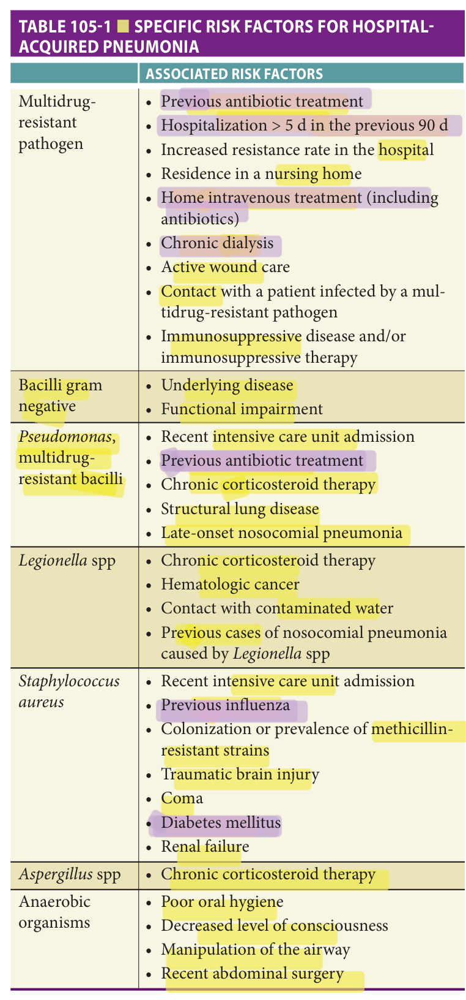

> *Table 105-1 reproduced as a page image (printed p. 1681) — the grid did not extract reliably as text for this fast build.*

> Highlighting is the owner's annotation, not the book's.

**[p. 1682]**

Health care–associated pneumonia (HCAP) can be defined as pneumonia that occurs in patients who meet one of the following criteria: (1) hospitalization for 2 days or more in the preceding 90 days; (2) residence in a nursing home or extended care facility; (3) home infusion therapy (including antibiotics); (4) chronic dialysis within 30 days; (5) home wound care; or (6) family member with multidrug-resistant pathogen. However, this concept is currently under some scrutiny. Evidence provided by two large retrospective observational studies that included patients from the United States showed that those who met one of these criteria had a higher prevalence of pneumonia caused by MRSA or resistant GNB, such as Ps. These results have not been confirmed in studies carried out in European countries. Further, it has been documented that up to 50% of patients with pneumonia attending the emergency department may met criteria for HCAP and only 10% to 30% of these patients have infections caused by resistant bacteria. Therefore, the use of such criteria with high sensitivity and limited specificity may lead to excessive utilization of broad spectrum antimicrobials, unnecessary costs and an increased prevalence of resistant bacteria. Finally, the concept of HCAP does not take into account the severity of the disease, and it is well known that resistant bacteria appear most frequently in patients with severe disease. In conclusion, though widely employed and specifically identified in many guidelines, the HCAP concept lacks the necessary precision to identify a profile of patients at risk of infection by resistant organisms, and therefore an etiologic approach is recommended by many authors based on individual risk factors for infection caused by resistant organisms and severity of disease.

The etiology of CAP is influenced by comorbidities, basal functional status, severity of the acute episode, antimicrobial treatment received and contact with the hospital setting or place of residence. Therefore, an etiologic approach can also be recommended according to risk factors for resistant microorganisms and severity of disease. Several scales have been developed to rule out infection by multidrug-resistant microorganisms (MDRO). Shorr et al. proposed a scale that includes four items: recent hospitalization (4 points), admission from long-term care (3 points), hemodialysis (2 points), and critical illness (1 point). When the total score is zero, there is a high negative predictive value (84%) for MDRO. Aliberti et al. documented that independent MDRO risk factors were living in a nursing home and previous hospitalization in the last 90 days. Another study found that patients with clinical signs of severe pneumonia and presence of two risk factors (immunosuppression, hospitalization in the previous 90 days, severe dependence quantified with a Barthel index less than 50, and taking antibiotics within the previous 6 months) were associated with a higher frequency of MDRO (2% vs 27%).

It has been published that the probability of Ps or MRSA infection is increased in severe CAP, defined as a pneumonia that requires admission to an ICU or has a risk class V according to the Pneumonia Severity Index (PSI). If we consider the approach proposed by Ewig in Europe and by Brito and Niederman in the United States, when making an empirical treatment decision, the key would be the initial clinical severity status and the prior functional status. Thus, when there are at least two factors for multidrug resistance (severe pneumonia, hospitalization in the previous 90 days, residence in a nursing home, severe basal dependence for daily living activities, immunosuppression, or taking antibiotics during the previous 6 months), empiric coverage of MDRO is warranted.

## Risk Factors For Uncommon Microorganisms

Colonization of the oropharynx may favor pneumonia due to unusual microorganisms through microaspiration. This is more common in older adults compared to younger patients. Risk factors for less common pathogens are shown in **Table 105-2** .

**Table 105-2 — Risk factors for infection by less common pathogens**

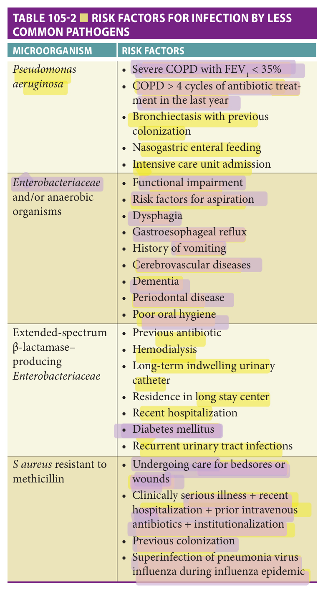

> *Table 105-2 reproduced as a page image (printed p. 1682) — the grid did not extract reliably as text for this fast build.*

> Highlighting is the owner's annotation, not the book's.

**[p. 1683]**

Bacterial colonization depends on multiple factors such as age, comorbidity, basal functional status, bacterial load, antimicrobial use, presence of devices, indwelling devices, and prior contact with health centers or nursing homes. Etiologic studies show an increased incidence of pneumonia due to _Enterobacteriaceae_ in relation to age.

El-Solh et al. identified _Enterobacteriaceae_ and anaerobes as the most frequently isolated pathogens in institutionalized patients with aspiration pneumonia with the basal functional status as main determining factor. This study concluded that functional impairment is associated with more frequent colonization by GNB, especially _Enterobacteriaceae_ . Another important aspect to consider in suspected infection by _Enterobacteriaceae_ is whether they may produce extended-spectrum β-lactamase (ESBL). A recent study with the aim to determine the sensitivity of strains isolated from patients hospitalized with pneumonia, in both the United States and Europe, showed that 20% and 35% of isolated _Klebsiella_ spp (the main _Enterobacteriaceae_ involved in pneumonia) were ESBL-producing in each geographical area.

Despite recognized classical risk factors for anaerobic infection, the role of anaerobes in pneumonia in seniors is not well known because anaerobic cultures or other detection methods are rarely used in studies.

The frequency of Ps in older adults is low (1%–2%). Chronic respiratory disease and nasogastric tube use stand out as the main risk factors. This microorganism should be suspected in severe COPD (FEV1 < 35% predicted), multiple previous antibiotic treatments, admission to ICU and/ or presence of bronchiectasis, and prior colonization with this organism.

Finally, it is known that colonization by SA is more frequent when there has been a prior episode of influenza. The probability of MRSA is more frequent in patients admitted in the ICU, with a history of intravenous antibiotic treatment at home or undergoing ulcer care. Shorr et al. proposed a scale to predict MRSA infections with low risk if the score is less than or equal to 1 (2 points: recent hospitalization or ICU admission; 1 point for each of the following: < 30 or > 79 years of age, prior exposure to intravenous antibiotics, dementia, cerebrovascular disease, being a female with diabetes, coming from a residential care home). MRSA infection should be suspected with the presence of pneumonia with bilateral radiological infiltrates with cavitation or in the presence of risk factors, and primarily in patients with severe disease. If the older patient has been living in a nursing home during the previous year, it is important to know the prevalence of MRSA in that institution.

Viral etiologies are increasingly recognized with wider utilization of PCR-based respiratory virus panels. In particular, influenza and RSV cause substantial morbidity and mortality in older adults. In the context of outbreaks in institutionalized patients, pneumonia can be caused either by primary viral agents or by a bacterial superinfection from _S pneumoniae_ , SA, and _H influenzae_ . Other respiratory viruses, such as parainfluenza, metapneumovirus, adenovirus, rhinovirus, and coronavirus (except for SARS-CoV-2), usually cause less severe respiratory infections in immunocompetent adults.

**Table 105-3 — Clinical and epidemiologic conditions related to specific pathogens**

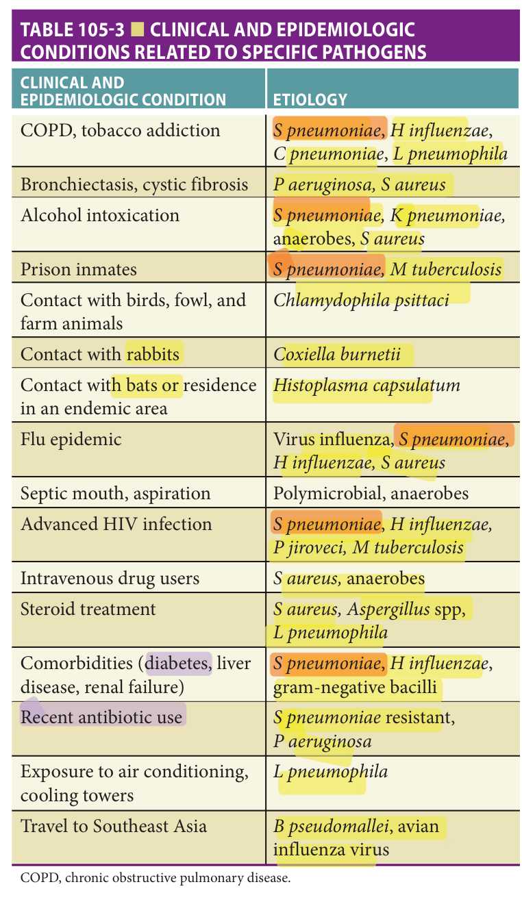

> *Table 105-3 reproduced as a page image (printed p. 1683) — the grid did not extract reliably as text for this fast build.*

> Highlighting is the owner's annotation, not the book's.

COPD, chronic obstructive pulmonary disease.

Finally, there are a number of epidemiologic factors that predispose patients to CAP caused by certain specific agents ( **Table 105-3** ). **Figure 105-1** depicts an etiologic approach for older patients based on severity of illness, risk factors, and basal functional status to help guide the most appropriate empiric selection of antibiotic coverage.

## Presentation

Clinical diagnosis of pneumonia in older adults is complex and may be subtle. Symptoms and signs of infection in older adults differ from younger patients. Asymptomatic or atypical clinical presentations such as exacerbation of chronic diseases are more frequent presenting manifestations in older adults. Absence of fever, hypoxemia, or respiratory

**[p. 1684]**

symptoms do not rule out a pneumonia diagnosis. The most common atypical manifestations are altered mental status or behavior, acute functional impairment, falls, dizziness, loss of consciousness, generalized weakness, anorexia, dehydration, or incontinence. Such presenting symptoms are most frequently associated with the presence of cognitive impairment.

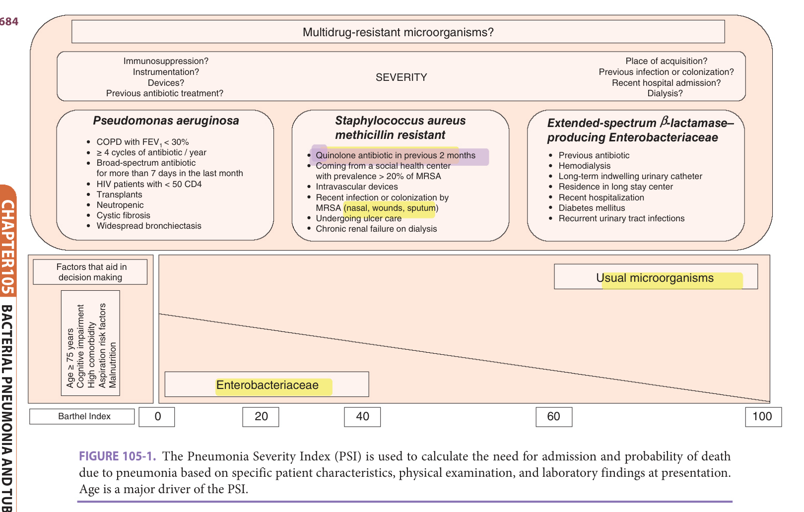

> *FIGURE 105-1. The Pneumonia Severity Index (PSI) is used to calculate the need for admission and probability of death due to pneumonia based on specific patient characteristics, physical examination, and laboratory findings at presentation. Age is a major driver of the PSI.*

> Highlighting is the owner's annotation, not the book's.

## Evaluation

## Initial Evaluation

At the time of initial assessment of the older patient with pneumonia stratification by severity of illness should be performed based on the level of consciousness, respiratory, and hemodynamic parameters, taking into account medical, functional, and/or cognitive situations. Nonspecific complaints or atypical clinical presentation are associated with a lower level of acuity and therefore a delay in the initial assessment and early antibiotic administration in the emergency department. Older adults less frequently have fever, tachycardia, and/or elevation of leukocytes compared with younger patients. These changes may hinder an appropriate diagnosis of sepsis and impact adequate early therapeutic treatment. A recent study has shown that the undisturbed vital signs such as normal heart rate and temperature in older patients with suspected infection delay antibiotic administration and increase the likelihood of hospitalization with the need for intensive care. Therefore, respiratory rate and altered level of consciousness may be the only initial signs of severity in older patients with suspected infection and should trigger evaluation for pneumonia.

## Diagnostic Evaluation

After the initial stratification of severity status, tests should be performed to diagnose pneumonia and its etiology. The diagnosis of pneumonia based on physical examination has poor sensitivity and specificity; therefore, the diagnosis should be confirmed by performing a chest x-ray.

The diagnostic tests performed in older adults should not differ from those in younger patients. In daily clinical practice, the chest x-ray is usually enough to rule in the diagnosis of pneumonia in most older patients. However, radiologic signs may not be obvious in up to 30% of the cases and this is more frequent in patients with dehydration and neutropenia. Therefore, in patients with suspected pneumonia and first chest x-ray without pathologic signs, a second study is recommended after 24 to 48 hours. Computed tomography (CT) is very accurate for the diagnosis of pneumonia, although it is usually reserved either for patients with atypical chest x-ray patterns or as a second step in those cases without response to initial treatment. The role of other imaging tests is evolving. Bedside ultrasound can support suspicion of pneumonia and allows evaluation of suspected pleural effusion as well as guidance for a possible thoracentesis. Other procedures, such as bronchoscopy, CT-guided biopsy, biopsy by thoracotomy,

**[p. 1685]**

or videothoracoscopy, do not differ from indications in younger adults, except for the logical consideration of the patient’s life expectancy, desires, and the risks and contraindications related to comorbidities.

Regarding laboratory tests, C-reactive protein and white blood cell counts are not helpful for assessing the severity of illness in older patients with pneumonia. The inflammatory response may be impaired as a consequence of immune senescence and thus may underestimate the severity of the process. Procalcitonin (PCT) has not shown good sensitivity in older populations for the diagnosis of acute bacterial infection, although it may be useful for severity assessment.

Serum lactate value greater than or equal to 2 mmol/L is a predictor of 30-day mortality in older adults. MR-proADM is a peptide produced by the endothelium, derived from proadrenomedullin, which is released in a state of physiologic stress. It has been evaluated in observational studies and seems to perform well as a prognostic marker in respiratory infection.

A microbiologic diagnosis should be sought in older adults with pneumonia via blood cultures, Gram stain and culture of respiratory samples, and the detection of bacterial antigens in urine (pneumococcal and _Legionella_ immunochromatographic test). European guidelines recommend the performance of blood cultures in all hospitalized patients. US guidelines reserve blood cultures for the most severe patients, such as those with cavitary infiltrates, leukopenia, alcoholism, severe liver disease, asplenia, positive antigenuria test for pneumococcus, or pleural effusion. Blood cultures have low clinical impact when performed in unselected patients with CAP. However, given the high frequency of atypical clinical presentation in older patients, blood cultures may contribute both to the confirmation of diagnostic suspicions, when potential pulmonary pathogens are isolated, and to the reconsideration of the patient’s primary causative agent and therefore it is the opinion of this author that blood cultures should be obtained in all older adults with pneumonia. Adequate sputum cultures can be obtained in about a third of patients, even higher when performed by invasive methods. The importance of Gram stain and sputum culture is reflected in its influence in the modification of the initial antibiotic treatment. The presence of SA, _Klebsiella pneumoniae_ , or Ps in Gram stain of the purulent sputum requires consideration when choosing the antibiotic treatment. Likewise, absence of organisms with the morphology of these agents in high-quality respiratory samples has a high negative predictive value, allowing the narrowing of antimicrobial therapy. In older patients with significant functional impairment, it is often difficult to obtain quality sputum specimens, and an increase in frequency of oropharyngeal colonization by GNB, SA, and MDRO suggests there may be lower specificity of Gram stain and culture of respiratory specimens from such patients.

Detecting pneumococcal and _L pneumophila_ bacterial antigens in urine by immunochromatographic techniques has been an important advance in the identification of these two microorganisms. The sensitivity of pneumococcal antigen is estimated at over 60%, with a specificity greater than 90% in adult patients, including patients with chronic bronchitis and pneumococcal colonization. It also has diagnostic value in the pleural fluid and test performance is not altered by prior antibiotic treatment or pneumococcal vaccination. However, the test remains positive until 3 months after the resolution of pneumonia, which limits the utility in patients with recurrences or in the assessment of treatment response. The urinary antigen test for legionellosis only detects _L pneumophila_ serogroup I, with a sensitivity greater than 90%. This is recommended in all patients with suspected clinical or epidemiologic concern for legionellosis or in the case of severe pneumonia without another clear etiology.

Test for viral detection in nasopharyngeal aspirates should be used in epidemiologic studies and in those patients diagnosed with influenza who are candidates for antiviral treatment. The best use of these tests has not been defined as many viruses that can cause illness are not represented on widely used viral panels (decreasing sensitivity) and a positive test may not provide sufficient evidence of an alternate diagnosis to allow the clinician to stop antibacterial therapy (limited specificity).

## Risk Stratification

The assessment of severity status is essential to designing an individualized care plan for older patients with pneumonia; age, comorbidity, microbial etiology, and early administration of appropriate antibiotic therapy all influence mortality. Previous studies have showed that older pneumonia patients with moderate-severe basal functional dependence have an increased risk of mortality in the short- and long-term compared to those who are independent.

Several short-term prognostic scales have been published that are helpful for assessing severity status and therefore the decision making for hospital admission. The PSI ( **Figure 105-2** ) and CURB-65 ( **Table 105-4** ) are risk stratification scales with similar predictive power for 30-day mortality, although they have certain limitations. The PSI gives excessive weight to age and relative to hypoxemia and it does not take into account other factors associated with adverse outcomes such as COPD, functional status, social factors, proper oral intake of the patient, or the capacity for good adherence. CURB-65 has the limitation of not including the evaluation of hypoxemia and functional status. In fact, studies have suggested oxygenation as the best prognostic indicator in older adults. Neither of these two scales is very useful in assessing the need for ICU admission.

In clinical decision making related to ICU admission, other scales have been developed, such as Severity of Community-Acquired Pneumonia (SCAP), SMART-COP, or the American Thoracic Society/Infectious Diseases Society of America (ATS/IDSA) scale ( **Tables 105-5** to **105-7** ). SCAP identifies patients who require monitoring and more aggressive treatment and it is very useful for

**[p. 1686]**

predicting hospital mortality and/or the need for mechanical ventilation or inotropic support. SMART-COP is useful to decide on a more aggressive treatment, without necessarily predicting ICU admission.

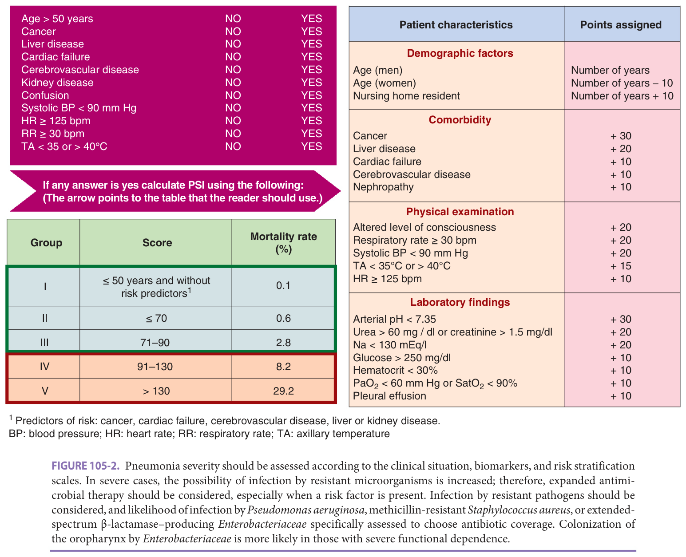

> *FIGURE 105-2. Pneumonia severity should be assessed according to the clinical situation, biomarkers, and risk stratification scales. In severe cases, the possibility of infection by resistant microorganisms is increased; therefore, expanded antimicrobial therapy should be considered, especially when a risk factor is present. Infection by resistant pathogens should be considered, and likelihood of infection by _Pseudomonas aeruginosa_ , methicillin-resistant _Staphylococcus aureus_ , or extendedspectrum β-lactamase–producing _Enterobacteriaceae_ specifically assessed to choose antibiotic coverage. Colonization of the oropharynx by _Enterobacteriaceae_ is more likely in those with severe functional dependence.*

> Highlighting is the owner's annotation, not the book's.

**Table 105-4 — Prognostic scales: CURB-65**

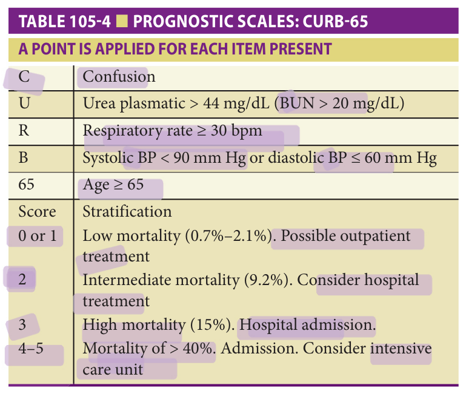

> *Table 105-4 reproduced as a page image (printed p. 1686) — the grid did not extract reliably as text for this fast build.*

> Highlighting is the owner's annotation, not the book's.

The detection of frailty and vulnerability by screening scales, such as Identification of Seniors at Risk (ISAR) or Triage Risk Screening Tool (TRST), or comprehensive geriatric assessment is particularly valuable to predict short-term adverse outcomes and decision making about diagnostic and therapeutic procedures and the most appropriate site of care.

**Table 105-5 — Prognostic scales: severity of community-acquired pneumonia (SCAP)**

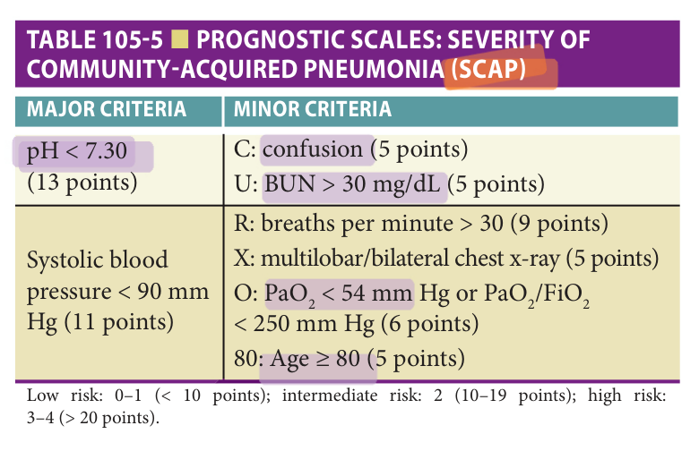

> *Table 105-5 reproduced as a page image (printed p. 1686) — the grid did not extract reliably as text for this fast build.*

> Highlighting is the owner's annotation, not the book's.

There are other independent and dynamic factors that influence prognosis regarding the infection itself and

**[p. 1687]**

the systemic inflammatory response. Therefore, the probability of bacteremia, the presence of sepsis, severe sepsis or septic shock, and the inclusion of biomarkers should be taken into account in the decision-making process. As discussed previously, sepsis may be underdiagnosed in older adults due to physiologic changes with aging.

**Table 105-6 — Prognostic scales: SMART-COP**

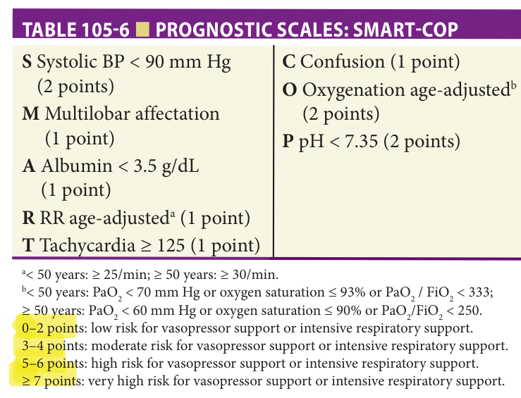

> *Table 105-6 reproduced as a page image (printed p. 1687) — the grid did not extract reliably as text for this fast build.*

> Highlighting is the owner's annotation, not the book's.

## Site Of Care

Clinical guidelines recommend the use of prognostic scales, mainly PSI and CURB-65, for admission decision making. Patients with PSI greater than or equal to III or CURB-65 greater than or equal to 2 meet criteria for hospital admission. The SCAP, SMART-COP, or ATS/IDSA scales can be helpful when deciding on ICU admission. In addition, other issues should be considered regarding site of care such as functional, cognitive, and social factors that may affect the final location.

**Table 105-7 — Prognostic scales: ATS/IDSA**

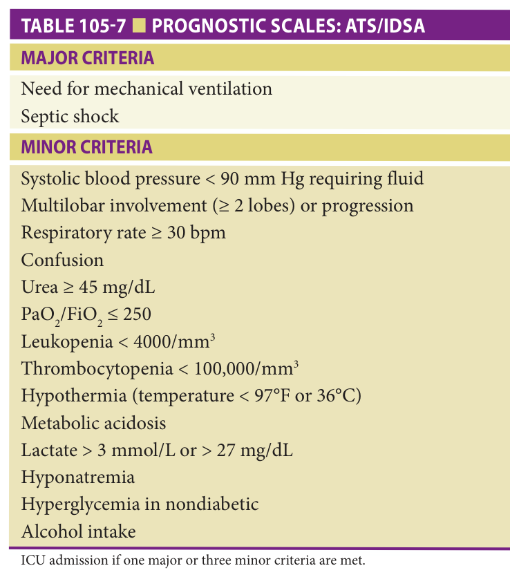

> *Table 105-7 reproduced as a page image (printed p. 1687) — the grid did not extract reliably as text for this fast build.*

> Highlighting is the owner's annotation, not the book's.

## Alternatives To Conventional Hospitalization

There are different units that can treat patients with CAP. A short stay unit (SSU) is a safe and cost-effective alternative to conventional hospitalization for patients with CURB-65 of 2 or PSI of III. In those seniors living in a nursing home, site of care depends on the characteristics of the center, but if appropriate care can be rendered without moving the patient, it is preferable. Several studies have shown the same mortality, adjusted by functional status, among patients treated in the hospital or in nursing home. Transfer to hospital should be under the following circumstances: worsening of underlying disease, immunosuppression, clinical signs of severe pneumonia, oral intolerance, difficulties in completing the treatment in the facility, complications evident on radiography, or individual assessment (eg, need for specific isolation or high risk of morbidity and mortality without advanced directive).

## Considerations For Discharge

Clinical stabilization is considered present when vital signs have normalized, mental status is baseline, and oxygen requirements have improved. The criteria that should be met to discharge the patient include heart rate less than 100 bpm, respiratory rate less than 24 breaths per minute, axillary temperature less than 37.2°C (< 98.96°F), systolic blood pressure greater than 90 mm Hg, oxygen saturation greater than 90%, good awareness, and tolerance of oral therapy. Most patients with pneumonia usually stabilize between the third and fourth hospital day. However, this period of time may increase up to 7 days in the frail older adults.

## Specific Recommendations For Antibiotic Selection In Older Adults

**Table 105-8** outlines empirical treatment recommendations according to site of care, functional status, and severity. **Table 105-9** reflects the treatment of choice depending on the suspected etiology. Regarding HAP, treatment depends on start time (early or late) and the patient’s individual risk factors ( **Table 105-10** ). **Table 105-11** shows the dosing information for the main antimicrobials used to treat pneumonia.

Given the heterogeneity of older patients and individual risk factors for specific microorganisms, two questions should drive antibiotic treatment choice. First, does the patient have a severe pneumonia or risk factors for unusual microorganisms? And second, does the patient meet the definition of frailty? If the answer to both questions is “no,” therapeutic regimens commonly used in younger adults apply; if the patient has severe pneumonia and/or risk factors for less common pathogens, resistant microorganisms are more likely, and broadening antimicrobial treatment should be considered.

The issue of frailty is more complex. Mildly frail seniors (ie, independent or nearly independent for all basic ADLs) at baseline may suffer acute functional and/ or cognitive impairment with pneumonia. In this case,

**[p. 1688]**

monitoring of clinical, functional, and cognitive areas and interventions to restore function to the previous baseline should be paramount and part of the overall treatment plan. The same antibiotic choices as those used for independent patients suffice.

**Table 105-8 — Treatment of community-acquired pneumonia in older adults**

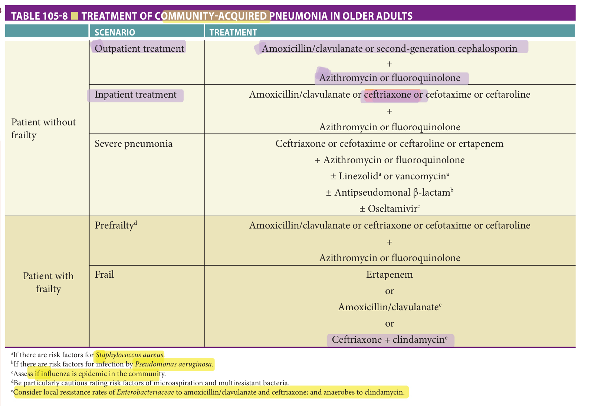

> *Table 105-8 reproduced as a page image (printed p. 1688) — the grid did not extract reliably as text for this fast build.*

> Highlighting is the owner's annotation, not the book's.

**Table 105-9 — Directed antibiotic treatment in pneumonia for specific pathogens**

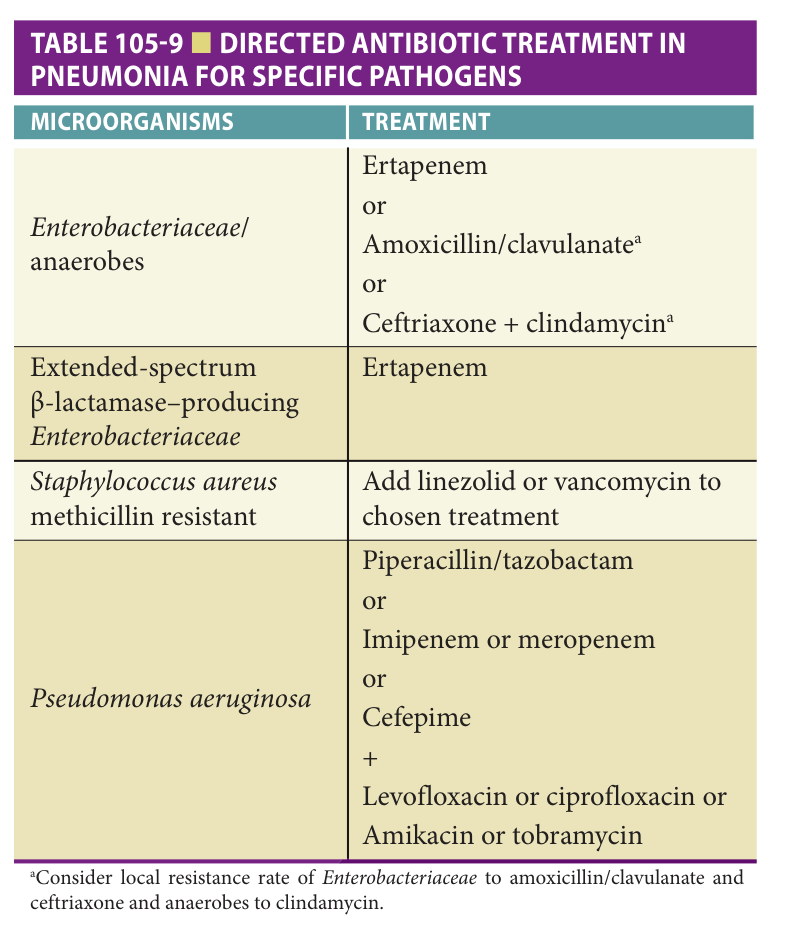

> *Table 105-9 reproduced as a page image (printed p. 1688) — the grid did not extract reliably as text for this fast build.*

> Highlighting is the owner's annotation, not the book's.

**Table 105-10 — Empirical antibiotic treatment for hospital-acquired pneumonia (HAP)**

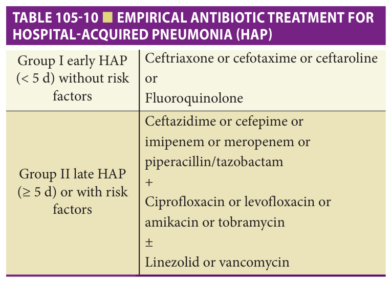

> *Table 105-10 reproduced as a page image (printed p. 1688) — the grid did not extract reliably as text for this fast build.*

> Highlighting is the owner's annotation, not the book's.

In moderate-severe frailty, the invasive diagnostic and therapeutic procedures depend on individual goals and the site of care. Furthermore, these patients usually have severe

**[p. 1689]**

comorbidity and polypharmacy, making them more vulnerable to the occurrence of adverse drug reactions. In addition, there may be important risk factors that determine specific etiologic risk (MDRO or MRSA colonization, aspiration risk, etc). Antibiotic choices in such patients must include broader coverage in addition to routine pathogens.

**Table 105-11 — Dosage of the main antibiotics used in pneumonia**

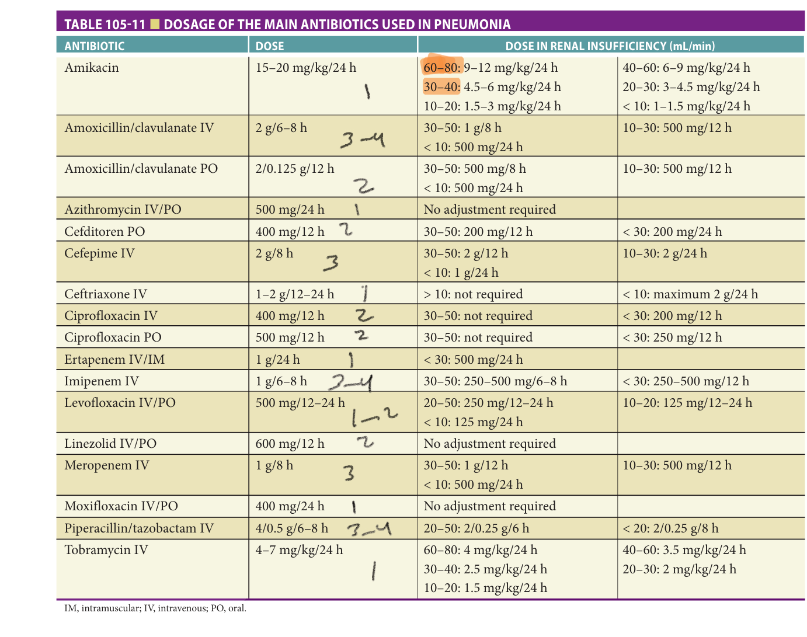

> *Table 105-11 reproduced as a page image (printed p. 1689) — the grid did not extract reliably as text for this fast build.*

> Highlighting is the owner's annotation, not the book's.

IM, intramuscular; IV, intravenous; PO, oral.

The first antibiotic dose should be administered as soon as possible because a shorter interval to effective therapy is associated with decreased length of hospital stay and mortality, both in nonsevere patients and in those who present with severe sepsis or septic shock. Combination therapy is indicated in patients that meet criteria for ICU admission; β-lactam and a macrolide or fluoroquinolone are superior to fluoroquinolone monotherapy. If influenza is circulating in the community, oseltamivir should be added, even if more than 48 hours have passed since symptom onset, and treatment against _S aureus_ provided until cultures suggest otherwise. In patients with risk factors, empiric MRSA treatment is advisable while awaiting conventional cultures and nasopharyngeal swabs—specific treatment against MRSA should be suspended if these are negative.

Intracellular pathogens are less common in older patients compared to younger patients, and the need for coverage of atypical pathogens is currently a point of discussion. In some studies, the incidence of “atypical pneumonia” can reach 50% and mixed infections may represent 10% to 15% of cases. There is some controversy, except for _L pneumophila_ , regarding the benefit of atypical pathogen coverage; American guidelines recommend adequate coverage of atypical pathogens in all cases, while the British guidelines limit it to patients requiring hospitalization. For _L pneumophila_ , recent studies show similar rates of causality in nonsevere pneumonia and those requiring hospitalization. Therefore, if it is not possible to rule out infection due to _Legionella_ , a macrolide or respiratory quinolone should be given with a β-lactam. In case of suspected pulmonary tuberculosis, quinolones should not be prescribed due to their tuberculostatic activity and the possibility of delaying the diagnosis of pulmonary tuberculosis.

**[p. 1690]**

Finally, it should be emphasized that aging produces certain pharmacokinetic and pharmacodynamic modifications of drugs. Doses and intervals must be adapted to the older patient’s body weight (or body mass index) and renal function, and modified by drug interactions. Underdosing antibiotics have severe consequences and should be avoided as vigorously as overdosing to ensure the best outcome and reduce the risk of emergence of antibiotic-resistant pathogens.

## Switch From Intravenous To Oral Antibiotics And Duration Of Therapy

After reaching clinical stability, a switch from intravenous to oral antibiotic formulations is safe and reduces length of hospital stay with equivalent outcomes. The presence of bacteremia does not extend the required duration of intravenous antibiotic therapy. Isolation of a causative organism should prompt de-escalation to specific, narrowed coverage, but when no organism is isolated, it is advisable to complete therapy using and oral equivalent with respect to the spectrum of activity.

Meta-analyses suggest 5 to 7 days of antibiotic treatment is sufficient to cure pneumonia even in older adults. However, there are exceptions, and treatment should be extended in cases of infection by _Legionella_ , resistant GNB, or MRSA. In addition, there are clinical situations that may also involve an extension of the duration, such as persistent fever over 72 hours, persistence of more than one criterion of clinical instability, inadequate initial coverage, or the occurrence of complications.

## Treatment Failure

Treatment failure is defined as the absence of clinical stability after 3 to 4 days of antibiotic treatment or the occurrence of clinical deterioration, respiratory failure, or septic shock in the first 72 hours. This situation is associated with a fivefold increase in mortality. However, reaching clinical stability may take longer without implying a therapeutic failure in older patients with severe pneumonia or concomitant serious comorbidity such as severe COPD or untreated heart failure.

Possible causes of treatment failure include resistant microorganisms, involvement of unusual pathogens, lack of optimized treatment for comorbidity, or the existence of an undiagnosed concomitant process (eg, pulmonary embolism, neoplasm).

When treatment failure is suspected antibiotics should be changed if culture data suggest a pathogen resistant to antibiotics being given, comorbidity treatment optimized, and new imaging studies may be of value. Broadening the antimicrobial spectrum should follow, and risk factors for unusual pathogens reevaluated or the possibility of infection by fungi, mycobacteria, _Nocardia_ , and other unusual pathogens reconsidered.

## Concomitant Treatment

In conjunction with antibiotic treatment, other therapeutic measures should be carried out such as proper oxygenation (including initial appraisal of noninvasive mechanical ventilation, especially in patients with respiratory failure), fluid balance, and the correction of electrolyte disturbances, glycemic control, management of associated comorbidities, nutritional support if needed, and the prevention of thromboembolic events. Early physical and cognitive stimulation is very important, even for inpatients; early mobilization is recommended, if possible from the first day of admission, seating the patient out of bed for a minimum of 20 minutes and subsequent progressive mobilization recommended.

## Palliative Treatment

Pneumonia is a common complication in older patients with advanced dementia and limited life prognosis, often being the final cause of death. The identification of these patients is very important in order to provide adequate palliative treatment, since in this patient profile clear benefits of intravenous antibiotic therapy have not been proven. Withholding antibiotics may be very appropriate for some patients and palliative treatment only considered individually.

## Prevention

Given the high incidence, morbidity, and mortality of pneumonia in older adults, preventive measures, especially vaccination, are critical. This becomes even more important in institutionalized older adults, where “herd” immunity plays a major role in reducing risk. Vaccination against influenza and pneumococcus is recommended for all patients aged 65 and older. Despite the existence of a reduced response to vaccination, particularly in frail seniors, risk of infection, mortality, and associated complications is lower in patients vaccinated against influenza and pneumococcus compared with those unvaccinated. Recently, conjugate vaccine (PCV13) has been recommended in addition to polysaccharide for all adults aged 65 and older. According to the Advisory Committee for Immunization Practices (ACIP), PCV13 should be given first with PPS given at least 8 weeks later.

In older adults at risk of aspiration pneumonia, oral care may reduce pneumonia, though efficacy in the highest risk groups (eg, nursing home residents) was not demonstrated in a high-quality, randomized study. Oral hygiene should be performed daily by mechanical cleaning (brushing and sponging of the mucosa and lips twice a day and floss once a day), rinsing with chlorhexidine gluconate in cases of gingivitis, saliva substitutes if there is xerostomia, and weekly oral evaluation. If partial or full dental prostheses are present, they should be brushed and left in a cleaning solution for 10 minutes and rinsed using the same procedure as in patients with teeth. Postural measures for feeding (elevation of the head of the bed and remaining in that position until 2 hours after completion of the intake) make sense, but have not been proven to reduce risk in rigorous trials.

**[p. 1691]**

There is increasing data on pharmacological interventions that act on the swallowing reflex such as those involved in the thermoregulatory centers and the cough reflex. It is important to avoid all medications that could potentiate aspirations, such as sedatives, and especially antipsychotics. The use of proton pump inhibitors that produce achlorhydria and stomach bacteria is an issue of debate, but should be clearly justified if given. Treatment of hypertension and heart failure may include the use of angiotensin-converting enzyme inhibitors, and in seniors at risk for pneumonia, the stimulated cough reflex may reduce risk. Other preventive measures that can reduce infections in seniors include optimizing treatment of comorbidities (eg, diabetes mellitus, heart failure) and improving nutritional status.

## Pulmonary Tuberculosis

## Epidemiology

_Mycobacterium tuberculosis_ causes tuberculosis (TB) and is a leading infectious cause of death in adults worldwide. More than 1.7 billion people (about 25% of the world population) are estimated to be infected with _M tuberculosis_ . The highest rates (100 per 100,000 or higher) are observed in sub-Saharan Africa, India, the islands of Southeast Asia, and Micronesia. Low rates (< 25 cases per 100,000 inhabitants) occur in the United States, Western Europe, Canada, Japan, and Australia. TB continues to be an important social and health problem in our environment today, given that the geriatric contingent represents a considerable part of the population, doubly exposed to suffering from the disease, either due to the reactivation of an old form, or due to exogenous disease, and their forms of presentation seem to differ from those usually seen. The disease has two waves of higher incidence, one between 15 and 35 years old and another after 65 years of age. TB can be activated during the course of life, especially as a consequence of the alterations in immune response in old age. Long-term facilities, especially those related to geriatric care, represent an increase in bacillary transmission.

## Etiology

Mycobacteria are slow-growing aerobic bacilli. Their distinctive characteristic is a complex cell envelope rich in lipids, responsible for their classification as acid-alcohol resistant, and their relative resistance to Gram staining. Tuberculosis really only designates the disease caused by _M tuberculosis_ , the main reservoir of which is humans. A similar disease can occasionally be found due to infection with closely related mycobacteria, such as _M bovis_ , _M africanum_ , and _M microti_ , which, in conjunction with _M tuberculosis_ , are known as the _Mycobacterium tuberculosis_ complex.

## Pathophysiology And Immunological Aspects

With age there is a decline in immunological protection both in the production of high-affinity antibodies as well as a decrease in immune memory in response to vaccination and delayed hypersensitivity. In senescence, in addition to the response of T cells, which contribute to defense against infections with the production of specific cytokine patterns, other frequent and negative extrinsic factors associated with age and tuberculosis must be taken into account, such as inappropriate diet, poor nutritional status, low physical activity, and comorbidity. In the immune system, by displaying antigens, macrophages, give rise to clonal proliferation of T lymphocytes that differentiate into memory T lymphocytes, cytotoxic and suppressor T helper lymphocytes (CD4+), and T lymphocytes (CD8+). When suppressor CD8+ T lymphocytes show high activity with little response to CD4+, as can occur with age, large numbers of bacilli are released and severe forms of the disease appear.

Asymptomatic parasitic infections have been described that, when associated with TB and other immunosuppressive states, can lead to genetic activation of type 2 cytokines, instead of type 1 cytokine response, which would be adequate against TB, and could explain cases with extensive TB disease. In the same way, a decrease in previously elevated cytokine levels may be indicative of good response to treatment.

Older adults are at greater risk of suffering therapeutic failure and adverse drug reactions due to pharmacokinetic and pharmacodynamic alterations produced by physiologic changes secondary to aging, associated chronic diseases and drug interactions as a consequence of polypharmacy.

TB can occur in three stages: primary infection, latent infection, and active infection. Initially, the _M tuberculosis_ bacillus causes a primary infection that does not usually lead to acute disease. Most primary infections (about 95%) do not produce symptoms and in the end enter a latent phase. A variable percentage of latent infections are reactivated with signs and symptoms of the disease. The infection is not usually transmitted during the primary stage and is not contagious in the latent phase.

**Primary infection** TB infection requires the inhalation of particles small enough to pass through the upper respiratory defenses and settle in the deep regions of the lungs, usually in the subpleural air spaces of the middle or lower lobes. Larger droplets tend to lodge in the more proximal airways and do not cause infection. To initiate infection, alveolar macrophages must ingest _M tuberculosis_ bacilli. Then, bacilli not destroyed by macrophages replicate within and ultimately kill the macrophages that host them (with the cooperation of CD8 lymphocytes); inflammatory cells are attracted to the area, where they cause localized pneumonitis that coalesces to form the characteristic tubercles observed on histological examination. During the first weeks of infection, some infected macrophages migrate to regional lymph nodes (eg, hilar, mediastinal), where they enter the bloodstream. The microorganisms then spread hematogenously to any part of the body, especially the

**[p. 1692]**

apicoposterior portion of the lungs, the epiphyses of long bones, the kidneys, the vertebral bodies, and the meninges. Hematogenous spread is less likely in patients with partial immunity due to vaccination or previous natural infection with _M tuberculosis_ or environmental mycobacteria.

**Latent infection** Latent infection occurs after most primary infections. After about 3 weeks of unlimited growth, in about 95% of cases, the immune system inhibits bacillary replication, usually before the appearance of signs or symptoms. Bacilli foci in the lungs or other sites develop into epithelioid cell granulomas, which may have caseous and necrotic centers. Tubercle bacilli can survive in this material for years, and the balance between host resistance and virulence of the organism determines the possibility that the infection will resolve without treatment, remain latent, or become active. Infectious foci can leave fibronodular scars on the apices of one or both lungs (foci of Simon, which generally occur as a result of hematogenous arrival from another site of infection) or small areas of consolidation (foci of Ghon). A Ghon focus with lymph node involvement is a Ghon complex, which, if calcified, is called a Ranke complex. The tuberculin test and interferon-γ release assays (IGRAs) are positive during the latent phase of infection. Latent infection sites are dynamic processes, not entirely inactive as previously believed.

Less commonly, the primary focus progresses immediately and causes acute illness with pneumonia (often cavitary), pleural effusion, and significant enlargement of the mediastinum or hilar lymph nodes (which, in children, can compress the bronchi). Small pleural effusions are primarily lymphocytic, typically contain few organisms, and resolve within a few weeks. This sequence is more frequently seen in young children and in recently infected or reinfected immunocompromised patients.

Extrapulmonary TB can appear anywhere and manifest without evidence of pulmonary involvement. Tuberculous lymphadenopathy is the most common extrapulmonary presentation; however, meningitis is the most feared due to its high mortality rate at the extremes of life.

**Active disease** Healthy people who are infected with TB have a 5% to 10% risk of developing active disease during their lifetime, although the percentage varies significantly based on age and other risk factors. In 50% to 80% of people with active disease, TB reactivates within the first 2 years, but it can also manifest several decades later. Any organ seeded by the primary infection can host a focus of reactivation, although these foci are most frequently identified in the pulmonary apexes, which may be due to more favorable conditions, such as elevated oxygen tension. Foci of Ghon and involved hilar lymph nodes are less likely to reactivate. Pathologies that impair cellular immunity (which is essential for defense against TB) significantly facilitate reactivation. Therefore, HIV coinfected patients who do not receive appropriate antiretroviral treatment have a 10% annual risk of developing active disease, diabetes, head and neck cancer, gastrectomy, jejunoileal bypass surgery, dialysis-dependent chronic kidney disease, and significant weight loss, which are conditions that facilitate reactivation. Patients who require immunosuppression after solid organ transplantation are at increased risk, but other immunosuppressants, such as corticosteroids and tumor necrosis factor (TNF) inhibitors, can also cause reactivation. Smoking is also a risk factor.

In some patients, active disease develops when they are reinfected, rather than when latent disease reactivates. Reinfection is more likely to be the mechanism in areas where TB is prevalent and patients are exposed to a large inoculum of bacilli. Reactivation of latent infection predominates in low prevalence areas. In a given patient, it is difficult to determine whether active disease is the result of reinfection or reactivation.

## Clinical Characteristics

In the immunocompetent population, the usual form of presentation of TB is pulmonary. However, TB in older patients acquires a series of special characteristics with respect to other age groups. Thus, there is a high risk of disseminated forms, or less radiological evidence of cavitation in its pulmonary presentation. Consequently, this can lead to a high morbidity and mortality in this group, perhaps derived from a delay in diagnosis and the frequent association with other intercurrent diseases in this population group.

From a clinical point of view, if TB has been defined as the great simulator, this is particularly true in immunosuppressed patients and in those older than 65 years. In patients older than 65 years with pulmonary disease, the forms of radiological presentation are different from those described in individuals younger than 65 years, but the most prominent is the presentation of extrapulmonary disease, as well as infrequent, cryptic, or disseminated forms. All of this, together with the high comorbidity of this population, can lead to diagnostic delays with high morbidity and mortality, and it is not uncommon for the final diagnosis to be given in the autopsy report.

TB damages tissues through a delayed hypersensitivity reaction (DHT), which causes typical granulomatous necrosis with the histological appearance of caseous necrosis. Pulmonary lesions are usually cavitary, especially in immunocompromised patients with compromised delayed hypersensitivity. Pleural effusion is found less frequently than in primary progressive TB, but it can appear as a result of direct spread of infection or hematogenous spread. The rupture of a large tuberculous lesion in the pleural space can cause an empyema with or without a bronchopleural fistula, and sometimes pneumothorax. In the prechemotherapy era, tuberculous empyema could complicate the treatment of a drug-induced pneumothorax and lead to rapid death, and so could massive sudden hemoptysis secondary to erosion of the pulmonary artery by a proliferating cavity. The course of TB varies greatly depending on

**[p. 1693]**

the virulence of the microorganism and the defenses of the host. Evolution can be rapid in members of isolated populations who, unlike many Europeans and their American descendants, have not experienced centuries of selective pressure to develop innate or natural immunity to disease. In European and American populations, evolution is more silent and slower.

Sometimes an acute respiratory distress syndrome appears due to the development of hypersensitivity to antigens of the tubercle bacillus and occurs after rapid hematogenous spread or rupture of a large cavity with intrapulmonary bleeding.

Reactivation of the disease in older adults can involve all organs, although those most frequently affected are the lungs, brain, kidneys, long bones, vertebrae, or lymph nodes. Reactivation may cause few symptoms and go unnoticed for weeks to months, delaying proper evaluation. The frequent finding of other diseases in older adults further complicates the diagnosis. Regardless of their age, nursing home residents are at risk of contracting the disease due to recent transmission, which can cause apical, middle lobe, or lower lobe pneumonia, as well as pleural effusion. Pneumonia may not be recognized as TB and may persist and also spread to others, while being erroneously treated with ineffective broad-spectrum antibiotics. In the United States, miliary TB and tuberculous meningitis, which in the past were believed to mainly affect young children, are more common in older adults.

## Diagnosis

TB is a frequently overlooked diagnosis in older patients. A high index of suspicion is crucial for the identification of infected individuals.

**Tuberculin skin test** The Mantoux method of the tuberculin skin test (TST) remains the diagnosis modality of choice despite its potential for fast negative results. In older patients, there is an increase in anergy to cutaneous antigens. Therefore, the two-step tuberculin test is suggested for initial geriatric assessment in order to avoid potential false negative reactions. This means that after a negative response to the TST (induration of < 10 mm) other tests must be performed after 2 weeks. A positive TST reaction is a skin test of 10 mm or more and an increase of 6 mm or more over the first skin test reaction.

Conversion must not be confused with the previously described booster phenomenon. Conversion occurs in persons previously uninfected but with a true negative TST who become infected within 2 years as demonstrated by a positive TST. Decreased skin test reactivity is associated with waning delayed-type hypersensitivity over time, disseminated TB, corticosteroids, and other drugs, and the elimination of TB infections. A false positive TST occurs with cross-reactions with nontuberculous mycobacteria and in persons receiving the bacillus Calmette-Guerin (BCG) vaccine.

**Chest radiography** Chest x-ray is indicated in all individuals with suspected TB infection. Although reactivation of tuberculosis disease characteristically involves the apical and posterior segments of the upper lobes of the lungs, many older patients manifest the pulmonary infection in either the middle or lower lobes of the pleura, and also present with interstitial, patchy, or cavitary infiltrates that may be bilateral. Primary TB can involve any lung segment but more often tends to involve the middle or lower lobs, as well as mediastinal or hilar lymph nodes.

**Laboratory diagnosis** Sputum samples must be collected from all patients with pulmonary symptoms or chest radiography changes compatible with TB disease. Other diagnostic techniques, such as sputum induction or bronchoscopy, should be considered in patients unable to expectorate sputum. Flexible bronchoscopy to obtain bronchial washings and to perform bronchial biopsies has diagnostic value in older adults. However, in frail and very old patients, the risk of such a procedure must be carefully balanced against the potential benefit of making a definite diagnosis of TB.

Sputum samples must initially be examined by smear before and after concentrations and then cultured for _M tuberculosis_ . Smear tests for _M tuberculosis_ are designed to detect acid-fast bacilli (AFB) and require a minimum of 104-5 AFB per mm to be seen by light microscopy. Culture methods may require up to 6 weeks for growth, and therefore, many laboratories use radiometric procedures for the isolation and susceptibility testing of _M tuberculosis_ . Radiometric systems can identify the organisms in as few as 8 days.

Histologic examination of tissue from various sites, such as the liver, lymph nodes, bone marrow, pleura, or synovium, can show the characteristic tissue reaction (caseous necrosis with granuloma formation) with or without AFB, which also strongly supports the diagnosis of TB.

The IGRA test (interferon-γ release assay) was designed to improve latent TB infection diagnosis and increase the sensitivity and specificity by means of quantifying interferon-γ produced by sensitized T lymphocytes in response to contact with specific _M tuberculosis_ antigens. The specificity of IGRA test for mycobacterium complex diagnosis  is much higher than that of the tuberculin skin tests, maintaining the same sensitivity, with the exception of the immunosuppressed patients and those under 5 years in which is lower. Gamma interferon is an important molecule for the control of TB infection, and its participation is essential in the protective immune response against this microorganism. This cytokine is produced by CD4+, CD8+, and NK T lymphocytes and activates infected macrophages, with the consequent release of IL-1 and TNF-γ, which limit the growth and multiplication of mycobacteria.

However, the IGRA test is still incapable of discriminating either previous from current _M tuberculosis_ infection or differentiating between latent and active TB. A positive IGRA test result indicates infection with TB bacteria. However, more tests are needed to determine if a person has

**[p. 1694]**

latent TB infection or TB disease. A negative IGRA test result indicates little likelihood of having latent TB infection or disease. Clinical efficacy is affected in immunocompromised individuals owing to a reduced and fluctuant interferon-γ synthesis in these patients. Factors such as immunosuppression contribute to obtaining indeterminate results, which must be taken into account when interpreting the test.

## Treatment

The treatment of TB in older adults does not differ from that in the adult population, although it must be taken into account that adverse effects increase with age. The goals of TB treatment include eradication of _M tuberculosis_ infection, and prevention of transmission, disease relapse, and the development of drug resistance.

The risks and benefits of preventive treatment must be carefully evaluated before treating the older adult. Isoniazid causes hepatotoxicity in up to 4% to 5% of patients older than 65 years (compared to < 1% in those < 65 years old).

Risk factors for treatment failure and relapse include inadequate adherence to treatment, high burden of clinical disease (presence of cavitary disease, bilateral disease, and/ or extrapulmonary disease), drug resistance, malabsorption, malnourishment, and mistakes in diagnosis.

## Chemoprophylaxis

Due to the possible appearance of adverse events in older adult, chemoprophylaxis is generally administered only if the induration of the Mantoux TST increases by ≥ 15 mm following a previous negative reaction. In close contacts of patients with active TB and other individuals at high risk with negative TST or interferon-γ release tests, preventive treatment should also be considered, unless contraindicated.

## Intensive Phase

First-line drugs include isoniazid, rifampin, pyrazinamide, and ethambutol. Drug doses are summarized in **Table 105-12** . The drugs should be administered on an empty stomach if tolerated, but dosing with food is acceptable to ameliorate gastrointestinal upset and is preferable to dividing doses or changing to second-line agents.

The intensive phase usually consists of four drugs (isoniazid, rifampin, pyrazinamide, and ethambutol) administered for 2 months. The use of this regimen is intended to minimize the likelihood of developing secondary resistance to rifampin in regions with a high rate of primary resistance to isoniazid (≥ 4%). If susceptibility data become available before the end of the intensive phase and demonstrate that the isolate is sensitive to isoniazid, rifampin, and pyrazinamide, ethambutol may be discontinued.

If pyrazinamide must be excluded from the intensive phase of treatment (due to hepatotoxicity, gout, or pregnancy), the intensive phase should consist of isoniazid, rifampin, and ethambutol administered daily for 2 months, and the continuation phase should be extended to 7 months (total duration of treatment extended to 9 months).

## Continuation Phase

The continuation phase usually consists of two drugs (isoniazid and rifampin) administered for at least 4 additional months for a total of 6 months. The continuation phase should be extended to 7 months (total duration of treatment 9 months) for patients in the following circumstances:

- a. Patients with both cavitary pulmonary TB on initial chest radiograph and positive sputum culture after the 2-month intensive-phase treatment. The decision to prolong the continuation phase for patients with either cavitation or positive cultures (but not both) should be made on an individual basis.

- b. Patients in whom the intensive treatment phase did not include 2 months of pyrazinamide.

## Drug-Resistant Tb

Drug-resistant TB varies according to the pattern of resistance. In general, multidrug-resistant TB requires treatment for 18 to 24 months with a regimen containing four or five active drugs. The presumed activity is based on the results of susceptibility tests, previous exposure to antituberculosis drugs, or patterns of drug susceptibility in the community. The regimen should include all remaining active first-line drugs, including pyrazinamide if the strain is susceptible, plus second-line drugs. Fluoroquinolones are alternative antituberculous agents that should only be used with other second-line drugs as needed to achieve a four-dose regimen or five drugs in patients with drug intolerance or resistance to first-line agents. Designing a treatment regimen for super-resistant TB is even more challenging, often requiring the use of highly toxic and unproven drugs such as clofazimine and linezolid.

## Treatment Of Latent Tb

Treatment of latent TB is primarily indicated in people with a negative TST result, which became positive in the previous 2 years, and people with radiological changes compatible with previous TB but without evidence of active TB. Other indications for preventive treatment are people who, if infected, would be at high risk of developing active TB (HIV-infected, drug-induced immunodeficiency) and all children older than 5 years who are in close contact with a person with a positive TB smear, regardless of whether they present TST conversion. Other individuals with an incidental positive TST or IGRA test but without these risk factors are usually treated with the drugs indicated for latent TB. However, clinicians must consider the individual risks of drug toxicity and compare these with the benefits of treatment.

Treatment is usually based on the administration of isoniazid for 9 months, unless resistance is suspected. An alternative for isoniazid-resistant or intolerant patients is rifampin for 4 months. Therapy with isoniazid plus rifapentine for 12 weeks was also shown to be effective.

**[p. 1695]**

**Table 105-12 — Treatment of pulmonary tuberculosis**

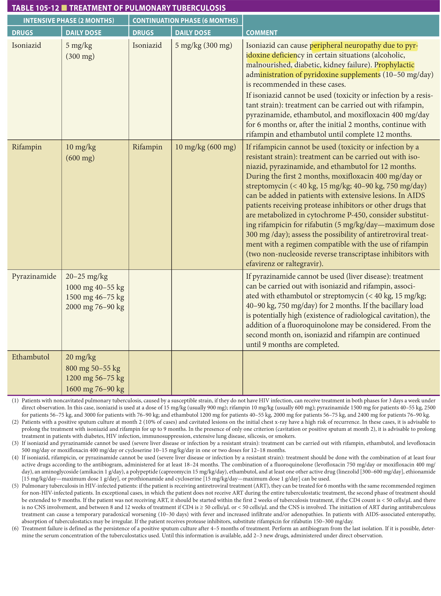

> *Table 105-12 reproduced as a page image (printed p. 1695) — the grid did not extract reliably as text for this fast build.*

> Highlighting is the owner's annotation, not the book's.

(1)  Patients with noncavitated pulmonary tuberculosis, caused by a susceptible strain, if they do not have HIV infection, can receive treatment in both phases for 3 days a week under direct observation. In this case, isoniazid is used at a dose of 15 mg/kg (usually 900 mg); rifampin 10 mg/kg (usually 600 mg); pyrazinamide 1500 mg for patients 40–55 kg, 2500 for patients 56–75 kg, and 3000 for patients with 76–90 kg; and ethambutol 1200 mg for patients 40–55 kg, 2000 mg for patients 56–75 kg, and 2400 mg for patients 76–90 kg.

(2)  Patients with a positive sputum culture at month 2 (10% of cases) and cavitated lesions on the initial chest x-ray have a high risk of recurrence. In these cases, it is advisable to prolong the treatment with isoniazid and rifampin for up to 9 months. In the presence of only one criterion (cavitation or positive sputum at month 2), it is advisable to prolong treatment in patients with diabetes, HIV infection, immunosuppression, extensive lung disease, silicosis, or smokers.

(3)  If isoniazid and pyrazinamide cannot be used (severe liver disease or infection by a resistant strain): treatment can be carried out with rifampin, ethambutol, and levofloxacin 500 mg/day or moxifloxacin 400 mg/day or cycloserine 10–15 mg/kg/day in one or two doses for 12–18 months.

(4)  If isoniazid, rifampicin, or pyrazinamide cannot be used (severe liver disease or infection by a resistant strain): treatment should be done with the combination of at least four active drugs according to the antibiogram, administered for at least 18–24 months. The combination of a fluoroquinolone (levofloxacin 750 mg/day or moxifloxacin 400 mg/ day), an aminoglycoside (amikacin 1 g/day), a polypeptide (capreomycin 15 mg/kg/day), ethambutol, and at least one other active drug (linezolid [300–600 mg/day], ethionamide [15 mg/kg/day—maximum dose 1 g/day], or prothionamide and cycloserine [15 mg/kg/day—maximum dose 1 g/day] can be used.

(5)  Pulmonary tuberculosis in HIV-infected patients: if the patient is receiving antiretroviral treatment (ART), they can be treated for 6 months with the same recommended regimen for non-HIV-infected patients. In exceptional cases, in which the patient does not receive ART during the entire tuberculostatic treatment, the second phase of treatment should be extended to 9 months. If the patient was not receiving ART, it should be started within the first 2 weeks of tuberculosis treatment, if the CD4 count is < 50 cells/μL and there is no CNS involvement, and between 8 and 12 weeks of treatment if CD4 is ≥ 50 cells/μL or < 50 cells/μL and the CNS is involved. The initiation of ART during antituberculous treatment can cause a temporary paradoxical worsening (10–30 days) with fever and increased infiltrate and/or adenopathies. In patients with AIDS-associated enteropathy, absorption of tuberculostatics may be irregular. If the patient receives protease inhibitors, substitute rifampicin for rifabutin 150–300 mg/day.

(6)  Treatment failure is defined as the persistence of a positive sputum culture after 4–5 months of treatment. Perform an antibiogram from the last isolation. If it is possible, determine the serum concentration of the tuberculostatics used. Until this information is available, add 2–3 new drugs, administered under direct observation.

**[p. 1696]**

Patients under treatment for a latent infection should be advised to stop taking the drug if they develop new symptoms, particularly unexplained tiredness, loss of appetite, or nausea. Monitoring the onset of symptoms and encouraging patients to complete treatment are considered to be part of appropriate standard clinical and public health practice.

## Adverse Events

Antituberculous drugs are associated with a broad array of adverse effects. Hepatotoxicity is an important adverse effect that warrants careful clinical care. In both curative and preventive treatments, the possible development of isoniazid-induced hepatitis increases with age, with no differences between men and women. Despite this and other adverse effects, the benefits versus harm of the treatment have been clearly demonstrated. More than one antituberculous drug in a treatment regimen may be associated with hepatotoxicity, and in some cases the most significant contributor may be identified and eliminated without loss of the other drugs in the regimen. Among the first-line antituberculous drugs, hepatotoxicity may be caused by isoniazid, rifampin, and pyrazinamide.

Patients receiving antituberculous therapy should undergo baseline measurement of liver function tests (serum bilirubin, alkaline phosphatase, and transaminases). An asymptomatic increase in aspartate transaminase concentrations occurs in approximately 20% of patients treated with the standard four-drug regimen. In most patients, asymptomatic aminotransferase elevations resolve spontaneously over days to weeks.

In general, hepatitis attributed to antituberculous drugs should prompt discontinuation of all hepatotoxic drugs if serum bilirubin values are ≥ 3 mg/dL or serum transaminases are more than five times the upper limit of normal (or, in individuals with symptoms of hepatitis, serum transaminases more than three times the upper limit of normal). Thereafter, once liver function tests return to baseline (or fall to less than twice normal), potentially hepatotoxic drugs can be restarted one at a time with careful monitoring between resumption of each agent.

Alternative regimens for the treatment of TB disease due to susceptible strains in the setting of drug intolerance include the following:

- a. For patients who cannot tolerate isoniazid, a regimen of rifampin, pyrazinamide, and ethambutol may be administered for 6 months. Alternatively, rifampin and ethambutol may be given for 12 months, preferably with pyrazinamide during at least the initial 2 months.

- b. For patients who cannot tolerate rifampin, isoniazid, and ethambutol may be given for 12 to 18 months, with pyrazinamide during at least the first 2 months. An agent may be added for the first 2 to 3 months in individuals with extensive disease or to shorten the overall treatment duration to 12 months.

- c. For patients who cannot tolerate pyrazinamide, isoniazid, and rifampin should be administered for 9 months (supplemented by ethambutol until isoniazid and rifampin susceptibility is demonstrated).

- d. For patients who require a regimen with no hepatotoxic agents, potential agents include ethambutol, levofloxacin, or moxifloxacin, an agent, and other second-line oral drugs. The optimal choice of agents and duration of treatment (at least 18 to 24 months) are uncertain.

## Further Reading

- Aliberti S, Di Pasquale M, Zanaboni AM, et al. Stratifying risk factors for multidrug-resistant pathogens in hospitalized patients coming from the community with pneumonia. _Clin Infect Dis_ . 2012;54:470–478.

- Arias Guillén M. Advances in the diagnosis of tuberculosis infection. _Arch Bronconeumol_ . 2011;47(10):521–530.

- Brito V, Niederman MS. Healthcare-associated pneumonia is a heterogeneous disease, and all patients do not need the same broad-spectrum antibiotic therapy as complex nosocomial pneumonia. _Curr Opin Infect Dis_ . 2009;22:316–325.

- Cabré P, Serra-Prat M, Palomera E, Almirall J, Pallares R, Clavé P. Prevalence and prognostic implications of dysphagia in elderly patients with pneumonia. _Age Aging_ . 2010;39:39–45.

- Chalmers J, Taylor JK, Singanayagam A, et al. Epidemiología, antibiotic therapy and clinical outcomes in health care-associated pneumonia: a UK cohort study. _Clin Infect Dis_ . 2011;53:107–113.

- El-Solh A, Pietrantoni C, Bhat A, et al. Microbiology of severe aspiration pneumonia in institutionalized elderly. _Am J Respir Crit Care Med_ . 2003;167:1650–1654.

- Ewig S, Welte T, Chastre J, Torres A. Rethinking the concepts of community-acquired and health-care-associated pneumonia. _Lancet Infect Dis_ . 2010;10:279–287.

- González-Castillo J, Martín-Sánchez FJ, Llinares P, et al. Guidelines for the management of community-acquired pneumonia in the elderly patient. _Rev Esp Quimioter_ . 2014;27:69–86.

- Jung YEG, Schluger NW. Advances in the diagnosis and treatment of latent tuberculosis infection. _Curr Opin Infect Dis_ . 2020;33(2):166–172.

- Kikuchi R, Watabe N, Konno T, Mishina N, Sekizawa K, Sasaki H. High incidence of silent aspiration in elderly

**[p. 1697]**

patients with community-acquired pneumonia. _Am J Respir Crit Care Med_ . 1994;150:251–253.

- Kollef MH, Shorr A, Tabak YP, Gupta V, Liu LZ, Johannes RS. Epidemiology and outcomes of health-care-associated pneumonia: results from a large US database of culture-positive pneumonia. _Chest_ . 2005;128:3854–3862.

- Lim WS, Baudouin SV, George RC, et al; Pneumonia Guidelines Committee of the BTS Standards of Care Committee. BTS guidelines for the management of community acquired pneumonia in adults: update 2009. _Thorax_ . 2009;64:S1–S55.

- Metlay JP, Waterer GW, Long AC, et al. Diagnosis and treatment of adults with community-acquired pneumonia. An Official Clinical Practice Guideline of the American Thoracic Society and Infectious Diseases Society of America. _Am J Respir Crit Care Med._ 2019;200(7): e45–e67.

- Musher DM, Thorner AR. Community-acquired pneumonia. _N Engl J Med_ . 2014;371:1619–1628.

- Sader HS, Farrell DJ, Flamm RK, Jones RN. Antimicrobial susceptibility of Gram-negative organisms isolated from patients hospitalised with pneumonia in US and European hospitals: results from the SENTRY Antimicrobial Surveillance Program, 2009-2012. _Int J Antimicrob Agents_ . 2014;43:328–334.

- Salgueiro Rodríguez M. Tuberculosis en pacientes ancianos [Tuberculosis in elderly patients]. _An Med Interna._ 2002; 19(3):107–110.

- Self WH, Courtney DM, McNaughton CD, Wunderink RG, Kline JA. High discordance of chest x-ray and computed tomography for detection of pulmonary opacities in ED patients: implications for diagnosing pneumonia. _Am J_ _Emerg Med_ . 2013;31:401–405.

- Shorr AF, Myers DE, Huang DB, Nathanson BH, Emons MF, Kollef MH. A risk score for identifying methicillin-resistant _S. aureus_ in patients presenting to the hospital with pneumonia. _BMC Infect Dis_ . 2013;13:268.

- Shorr AF, Zilberberg MD, Reichley R et al. Validation of a clinical score for assessing the risk of resistant pathogens in patients with pneumonia presenting to emergency department. _Clin Infect Dis_ . 2012;54:193–198.

- Stucker F, Herrmann F, Graf JD, Michel JP, Krause KH, Gavazzi G. Procalcitonin and infection in elderly patients. _J Am Geriatr Soc_ . 2005;53:1392–1395.

- Taylor JK, Flemming GB, Singanayagam A, Hill AT, Chalmers J. Risk factors for aspiration in community-acquired pneumonia: analysis of hospitalized UK cohort. _Am J Med_ . 2013;126:995–1001.

- van der Maarel-Wierink CD, Vanobbergen JN, Bronkhorst EM, Schols JM, de Baat C. Risk factors for aspiration pneumonia in frail patient. _J Am Med Dir Assoc_ . 2011;12:244–254.

- von Baum H, Welte T, Marre R, Suttorp N, Ewig S. Community-acquired pneumonia through _Enterobacteriaceae_ and _Pseudomonas aeruginosa_ : diagnosis, incidence and predictors. _Eur Respir J_ . 2010;35:598–605.

- UpToDate. https://www-uptodate-com.m-husc.a17.csinet. es/contents/treatment-of-drug-resistant-pulmonarytuberculosis-in-adults?search=tuberculosis&source= search_result&selectedTitle=8~150&usage_type= default&display_rank=8.

**[p. 1698]**

