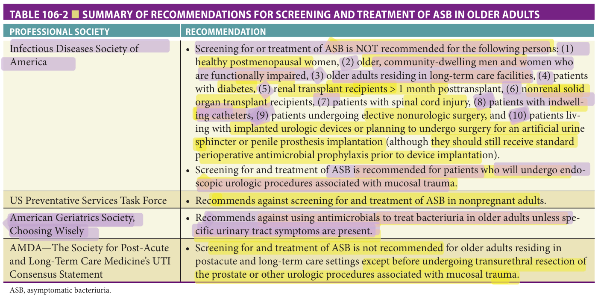

Study summary of Chapter 106; the book is the reference.

# Chapter 106 Study: Urinary Tract Infections

**Full chapter available: [Read Chapter 106](?chapter=106).**

Fast build from the book; not lane-reviewed.

## Summary

### Definition & epidemiology
- ASB is bacteriuria, with or without pyuria, without localizing genitourinary symptoms; bacteriuria in older adults is usually asymptomatic colonization. (p. 1699)

- Simple cystitis stays within the bladder; complicated UTI extends beyond it and includes pyelonephritis. Recurrent UTI: **≥3 in 12 months** or **≥2 in 6 months**, after clinical resolution of each treated episode. (p. 1700)

### Diagnosis & management

- Do not screen/treat ASB routinely; the exception discussed for older adults is endoscopic urologic procedures associated with mucosal trauma. (p. 1703)

- Urine-character changes alone do not establish UTI. McGeer criteria serve surveillance; Loeb criteria guide antibiotic decisions. (p. 1705)
- With nonspecific symptoms but no UTI criteria or warning signs, use active monitoring, hydration and alternative-diagnosis assessment. Fever, rigors, unstable vitals or clear-cut delirium require evaluation. (p. 1712)

### Drugs — acute simple cystitis
- Nitrofurantoin monohydrate/macrocrystals **100 mg twice daily for 5 days**; avoid with CrCl **<30 mL/min** or long-term suppression. (p. 1708)
- TMP/SMX **160/800 mg twice daily for 3 days**; avoid empiric use when local uropathogen resistance exceeds **20%**. (p. 1708)

- TMP/SMX interacts with warfarin and sulfonylureas; monitor increased INR/hypoglycemia risk. (p. 1709)
- Fosfomycin **3 g once orally**: generally reserved for resistant pathogens or inability to use other first-line drugs; not for complicated UTI. (p. 1709)

- Most older men with simple cystitis: **7 days** if response is prompt, within **72 hours**; assess for extension beyond the bladder. (p. 1711)

### Exam traps & prevention
- Male sex alone does not make every UTI complicated. (p. 1710)
- Nitrofurantoin/fosfomycin lack adequate renal penetration for complicated UTI. (p. 1711)
- Avoid unnecessary catheters and remove promptly when no longer indicated; routine fixed-interval replacement is not recommended. (p. 1714)

## Recall

**3. How is recurrent UTI defined?**

Answer
At least <strong>3 symptomatic UTIs in 12 months</strong> or <strong>2 in 6 months</strong>, following clinical resolution of each episode with treatment. (p. 1700)

**7. What are the different purposes of McGeer and Loeb criteria?**

Answer
Original/revised McGeer criteria support nursing-home surveillance; Loeb minimum criteria support clinical antibiotic decisions. (p. 1705)

**8. What belongs in active monitoring for nonspecific symptoms?**

Answer
Frequent vital-sign, hydration and symptom checks; hydration support; alternative-diagnosis assessment; and explicit criteria for notifying the physician about deterioration or persistence. (p. 1705)

**9. What nitrofurantoin regimen and renal limit does the chapter give for simple cystitis?**

Answer
Monohydrate/macrocrystals <strong>100 mg twice daily for 5 days</strong>; avoid if CrCl is <strong>&lt;30 mL/min</strong>, and avoid long-term suppression. (p. 1708)

**10. What TMP/SMX regimen and local-resistance cutoff are given?**

Answer
<strong>160/800 mg twice daily for 3 days</strong> for simple cystitis; avoid empiric use if local uropathogen resistance exceeds <strong>20%</strong>. (p. 1708)

**11. Which important TMP/SMX interactions should be recognized?**

Answer
Warfarin, with increased INR, and sulfonylureas, with increased hypoglycemia risk. (p. 1709)

**12. What is the fosfomycin dose and its usual place in simple-cystitis treatment?**

Answer
<strong>3 g as a single oral dose</strong>; generally reserved for highly resistant pathogens or inability to use other first-line agents. It is not recommended for complicated UTI. (p. 1709)

**15. What warning signs prevent a nonspecific presentation from being treated as routine observation alone?**

Answer
Fever, rigors/chills, unstable vital signs or new clear-cut delirium warrant evaluation for infection and noninfectious causes; assess whether the presentation is consistent with UTI. (p. 1712)

## Past-paper questions on this chapter

- [2023-Jun Q55 — mcq-526291ef04bcef123eab45db](?chapter=bank&q=mcq-526291ef04bcef123eab45db)
- [2024-May Q19 — mcq-81abf0ac32298245ce5a44eb](?chapter=bank&q=mcq-81abf0ac32298245ce5a44eb)
- [2026-Jun Q84 — mcq-f7b82a0ad50cab63832650a2](?chapter=bank&q=mcq-f7b82a0ad50cab63832650a2)
- [2025-Jun Q12 — mcq-60d358f39722f9df5a3990cc](?chapter=bank&q=mcq-60d358f39722f9df5a3990cc)

## Table 106-2 — book image

[2023-Jun Q55](?chapter=bank&q=mcq-526291ef04bcef123eab45db)
