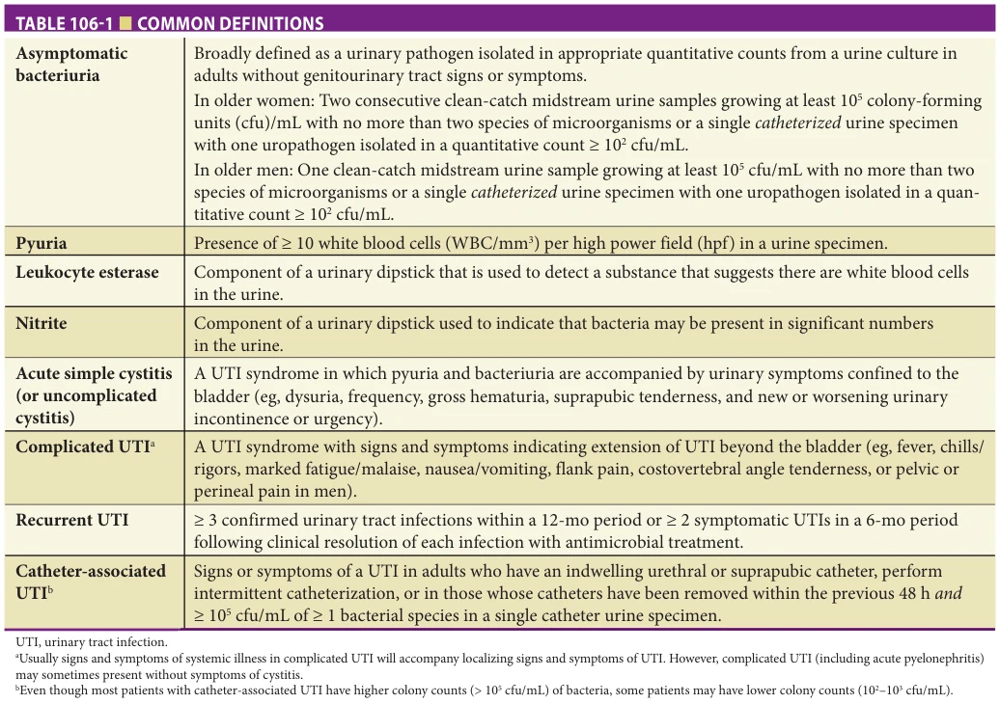
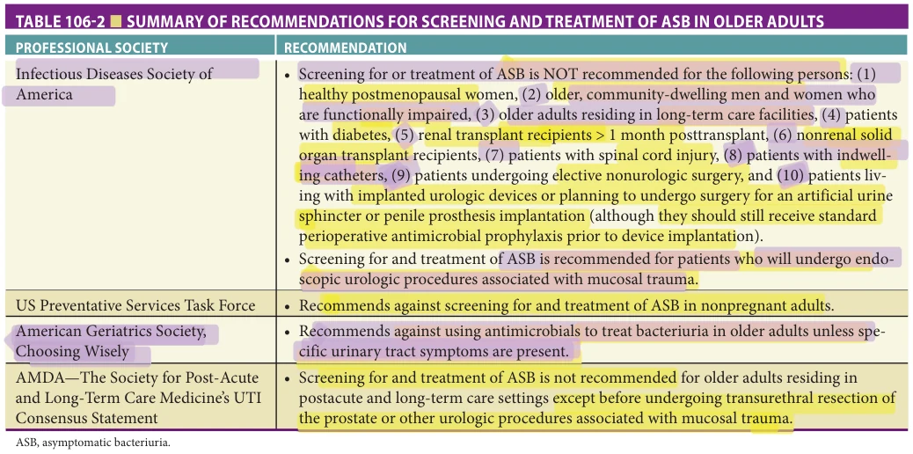
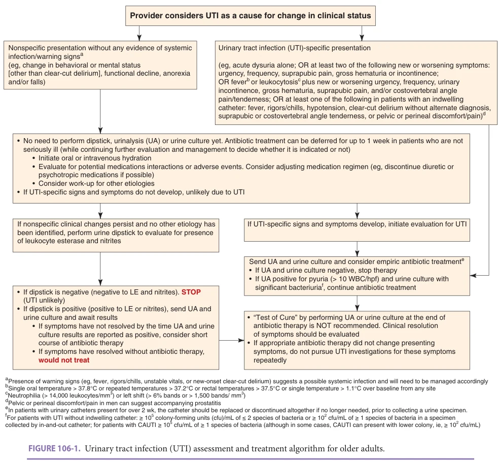
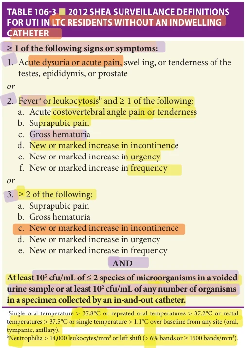
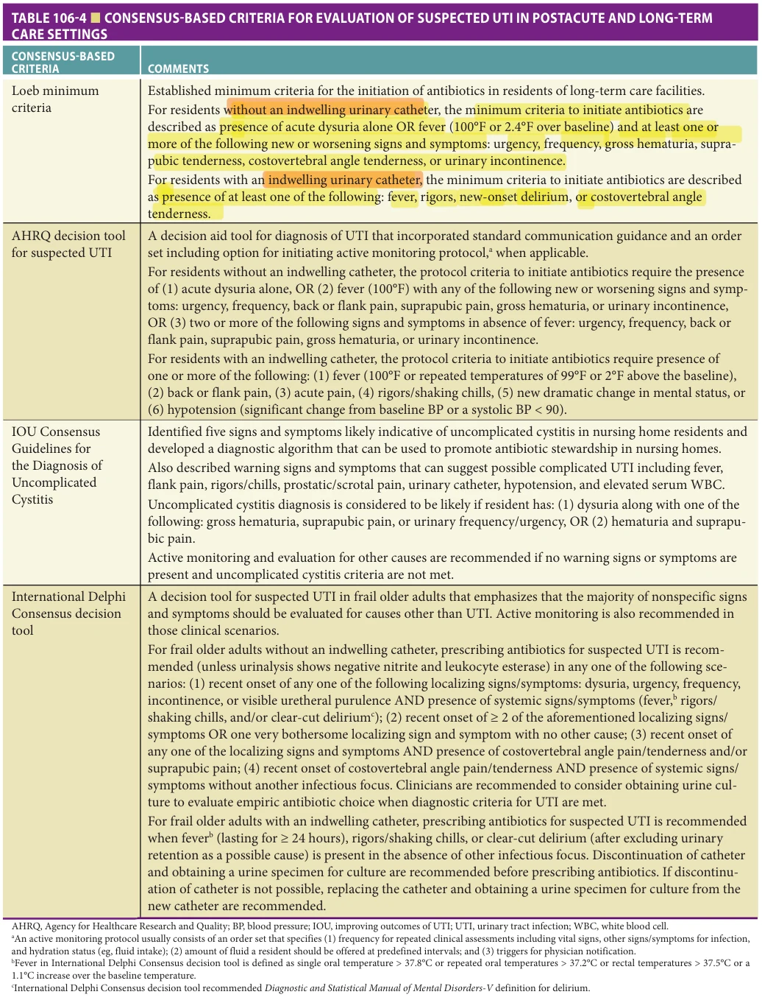
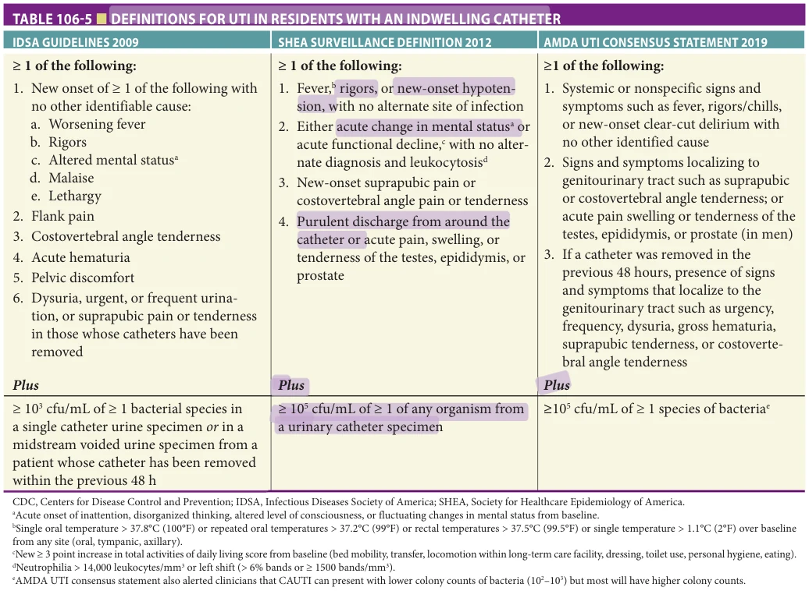
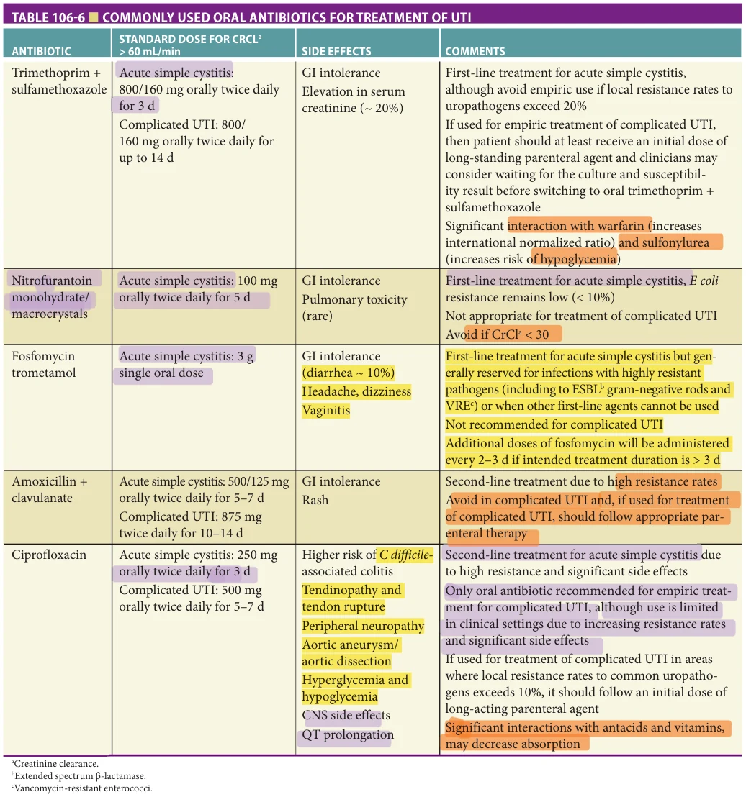
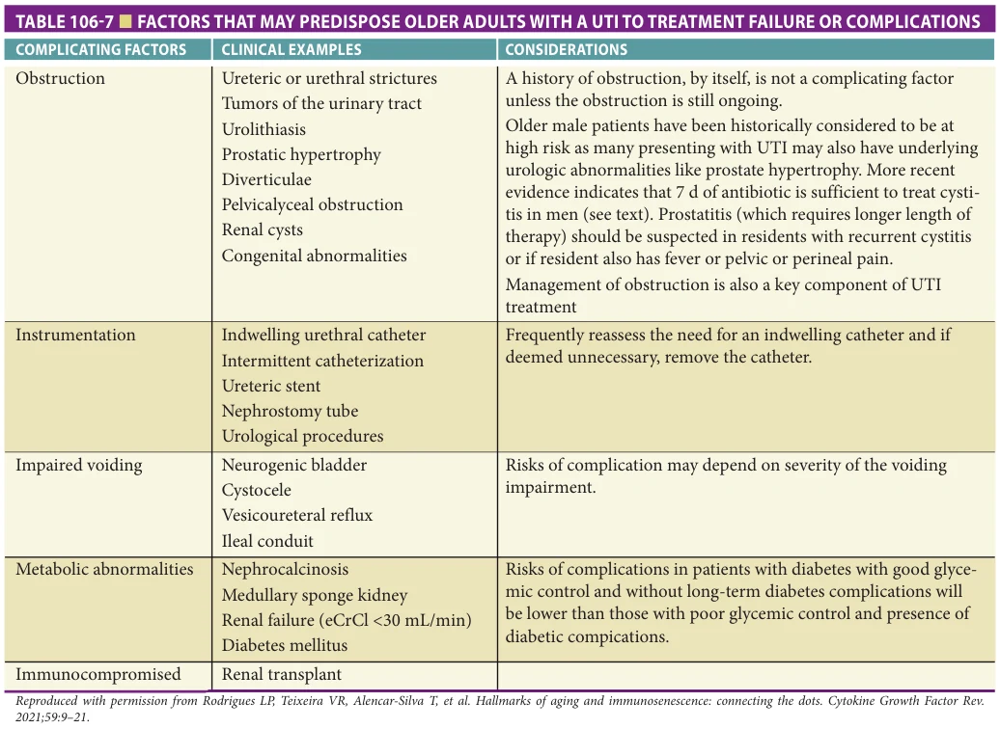
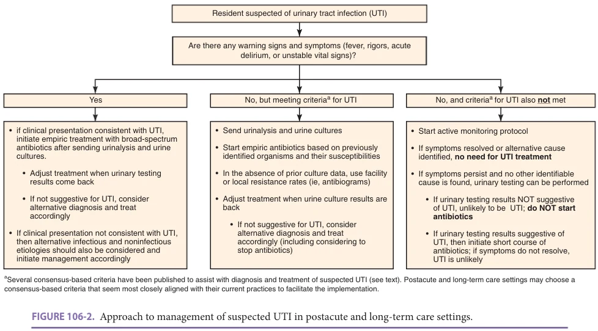
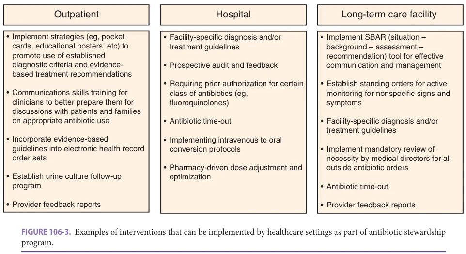

# Hazzard's Geriatric Medicine and Gerontology, 8e - Chapter 106: Urinary Tract Infections

Muhammad S. Ashraf, Mandy L. Byers

> **Status.** Fast build from the book; not lane-reviewed.

> **Source and method.** Printed pages 1699-1718, from the marked 8th-edition copy (PDF page = printed page + 34). Prose follows its text layer; tables and figures are source-page crops. The book is canonical.

**[p. 1699]**

## INTRODUCTION

Urinary tract infection (UTI) is the most frequently encountered bacterial infection in older adults. While the presence of bacteria in the urine in older adults is usually asymptomatic and considered a colonization state, symptomatic infection is associated with morbidity and, rarely, mortality. Optimal management of UTI in this population is challenging in the face of diagnostic uncertainty, concerns with excess antimicrobial use, and increasing antimicrobial resistance in the community and postacute/ long-term care (PALTC) settings. In addition, the heterogeneity of the older adult population means approaches may vary for different groups. The impact and management of urinary infection differs for older adults in the community and in those residing in PALTC settings. There are also unique considerations for the subgroup of older adults with chronic indwelling catheters and those who are in hospice care toward the end of their life. The discussion in this chapter is relevant to individuals without long-term indwelling catheters, unless otherwise stated.

#### Learning Objectives

- Differentiate asymptomatic bacteriuria (ASB) and symptomatic urinary tract infection (UTI) in older adults.

- Apply specific considerations and guidelines for evaluation of UTI in older adults residing in postacute/long-term care (PALTC) settings.

- Recognize the recommendations and limitations of current guidelines for diagnosis and treatment of UTI in both community-dwelling older adults and residents of PALTC settings.

- Utilize strategies to limit unnecessary antibiotic use in older adults with suspected UTI.

- Understand antimicrobial stewardship principles and how to apply those in management of UTI both in outpatient and PALTC settings.

#### Key Clinical Points

1. ASB and UTI are the most common reasons antibiotics are prescribed for older adults in both the community and health care settings.

2. Distinguishing ASB and symptomatic UTI is problematic. Many older adults do not present with localized genitourinary symptoms required by guidelines to diagnose a symptomatic infection, and the baseline prevalence of bacteriuria is high. a. Clinicians should NOT screen older adults for ASB and those with ASB should NOT be treated with antibiotics; the only exception being older adults undergoing invasive urologic procedures. b. In older adults with vague, nonspecific symptoms in either communitydwelling or PALTC settings (eg, behavioral changes exclusive of delirium, functional decline, falls, anorexia), a short period (Continued)

## DEFINITIONS

UTI is both one of the most commonly diagnosed infections in older adults and one of the most difficult infections to accurately diagnose. The uncertainty surrounding the definition of UTI, particularly in older adults, poses significant diagnostic challenges for providers caring for this population. Definitions of bacteriuria, pyuria, and ASB are more universally agreed upon. Bacteriuria implies the presence of bacteria in the urine. Pyuria is generally defined by the presence of 10 or more white blood cells (WBC/mm3) per high-power field (hpf) in a urine sample, suggesting inflammation of the genitourinary tract. ASB is broadly defined as the presence of bacteria in the urine, with or without pyuria, in the absence of localizing (genitourinary) signs or symptoms. In asymptomatic women, the accepted definition for ASB is defined as two consecutive voided urine specimens with isolation of the same uropathogen in quantitative counts greater than or equal to 105 colony forming units/milliliter (cfu/mL). In asymptomatic men, ASB is defined as a single clean-catch voided urine specimen with one uropathogen isolated in quantitative counts

**[p. 1700]**

of observation for the evolution of symptoms along with hydration and evaluation for alternative diagnoses should be the first management strategy as it does NOT lead to worse outcomes in those eventually proven to have UTI when compared to empiric, immediate antibiotic therapy.

3. Clinicians in outpatient and inpatient settings often do not use guidelines aimed at reducing unnecessary antibiotic prescriptions.

4. Use (and overuse) of antibiotics to treat UTI is associated with the development of uropathogens with higher rates of resistance to commonly used antibiotics.

5. Implementing culture and antibiotic stewardship programs (ASPs) to reduce inappropriate cultures and promote appropriate antibiotic prescribing in PALTC settings for UTI decreases inappropriate antibiotic use for UTI and rates of Clostridioides difficile infection without increasing hospitalizations or deaths.

greater than or equal to 105 cfu/mL. A single catheterized urine specimen with one uropathogen isolated in a quantitative count greater than or equal to 102 cfu/mL defines ASB in both asymptomatic women and men.

Symptomatic UTI refers to an infection anywhere in the genitourinary tract. It can be further divided into acute simple cystitis (or uncomplicated cystitis), complicated UTI and catheter-associated UTIs. Acute simple cystitis is most commonly encountered UTI syndrome which is diagnosed when pyuria and bacteriuria are accompanied by urinary symptoms confined to the bladder. These symptoms include dysuria, frequency, gross hematuria, suprapubic pain, and new or worsening urinary incontinence or urgency. Complicated UTI is diagnosed when pyuria and bacteriuria are accompanied by signs and symptoms that indicate that infection has extended beyond the bladder. Acute pyelonephritis refers to infection involving renal parenchyma; therefore, it is also considered a complicated UTI. The signs and symptoms that usually suggest infection is extending beyond the bladder include fever, chills/rigors, marked fatigue/malaise, nausea/vomiting, flank pain, costovertebral angle tenderness, or pelvic or perineal pain in men (that may suggest accompanying prostatitis). Usually signs and symptoms of systemic illness in complicated UTI will accompany localizing signs and symptoms of UTI. However, complicated UTI (including acute pyelonephritis) may sometimes present without symptoms of cystitis.

Catheter-associated UTI (CAUTI) refers to patients with an indwelling urethral, suprapubic, or intermittent catheterization with signs or symptoms compatible with UTI (ie, fever, rigors/chills, clear-cut delirium with no other identified cause, suprapubic tenderness, flank pain/costovertebral angle tenderness, pelvic or perineal discomfort/pain); OR signs or symptoms localizing to genitourinary tract (eg, dysuria, urgency, frequency, gross hematuria, suprapubic tenderness, or flank pain/ costovertebral angle tenderness) in patients whose catheters have been removed within the previous 48 hours with no other identified source of infection, ALONG WITH greater than or equal to 105 cfu/mL of one or more bacterial species in a single catheter urine specimen. It is important to note that even though most patients with CAUTI have higher colony counts (≥ 105 cfu/mL), some patients may have lower colony counts (≥ 102 cfu/mL). Recurrent UTI is defined as three or more symptomatic UTIs within a 12-month period or two or more symptomatic UTIs in a 6-month period following clinical resolution of each UTI with antimicrobial treatment (Table 106-1).

## EPIDEMIOLOGY

UTIs are both common and costly in the United States. They account for more than 8 million outpatient and emergency department visits, and are responsible for over 100,000 hospitalizations with cost of $1.6 billion annually. It is one of the most frequently listed diagnoses among hospitalized patients 50 years or older in the United States, and the incidence of hospital admissions for UTIs has increased dramatically since the late 1990s. UTIs are also the most commonly diagnosed infections in the PALTC settings. A 1-day point prevalence survey of antimicrobial use performed between April and October 2017 involving 161 nursing homes found that one in 38 residents was receiving an antibiotic for UTI and a quarter of antibiotic use was for UTI prophylaxis.

ASB in Older Adults The prevalence of ASB increases with age and is more prevalent in those residing in PALTC settings. In healthy, older adult women, ASB ranges from approximately 5% to 20% in women aged 65 to 90, but increases to nearly 45% in women older than 90 years. Bacteriuria is uncommon in younger men, but increases significantly with age, especially in men with prostatic hypertrophy. The rate of ASB is approximately 5% in men living in the community, but increases to 20% in men older than 80 years. ASB is highly prevalent in long-term care (LTC) settings, with multiple studies documenting rates for men and women to be approximately 15% to 50%. The rate of ASB in this population is likely to be higher than current estimates, as adults with urinary incontinence and dementia are more likely to have ASB, but also more likely not to be included in research studies given the difficulty of obtaining a urine specimen. Essentially 100%

**[p. 1701]**

*Table 106-1, printed p. 1701.*

of chronically catheterized older adults develop bacteriuria within 1 month of catheterization.

ASB often resolves spontaneously, without antibiotic treatment. A large cohort study evaluating the prevalence of ASB in older men and women living in the community reported that almost 30% of individuals with ASB at baseline had negative urine cultures at 6 months, whereas among those adults that were negative for ASB at baseline, 6% developed bacteriuria at 6 months.

UTI in Older Adults The incidence of UTI in postmenopausal women is 0.07 per person-year according to a large population-based study. Irrespective of gender, the incidence of clinically diagnosed UTI increases with age. Accurately estimating the prevalence of UTI, however, is challenging, as the definition of UTI varies significantly across the literature. For example, a prospective population-based study of healthy older adult women in Brazil described the prevalence of UTI to be approximately 17% over a 2-year period; however, “foul-smelling urine” was included as a symptom in their definition of UTI, even though recent guidelines do not consider it as a diagnostic criterion for UTI. In residents of PALTC settings, the rate of UTI appears to remain high with an estimated rate of 0.15 per patient-year for

older women and 0.11 per patient-year for older men. One study of nursing home residents with advanced dementia reported that 27% of older adults were diagnosed with UTI over a 2-year period.

## PATHOPHYSIOLOGY

The urinary tract (ie, urethra, bladder, ureters, and kidneys) is presumed to be sterile in a normal host. However, this premise particularly changes in older adults as those with increasing disability tend to become colonized, therefore leading to the high rates of ASB. In most adults, a variety of host factors prevent contamination of the urinary tract from pathogenic organisms. The process of urination is the most effective defense mechanism for preventing bacterial invasion of the urinary tract from gastrointestinal microorganisms. Other mechanisms include acidity of urine, peristaltic activity of ureters, a competent vesicoureteral valve, and a variety of other mucosa and immunologic barriers. UTI most often occurs by an ascending route. Organisms colonize the periurethral area and ascend the urethra into the bladder, and sometimes kidneys. Renal infection is determined by virulence characteristics of the infecting organism or the presence of genitourinary abnormalities, such as obstruction or reflux in the host. Rarely, infection

**[p. 1702]**

may be hematogenous rather than ascending, with urinary infection secondary to bacteremia from a nonurinary source (this is particularly a consideration when Staphylococcus aureus is isolated in patients without an indwelling catheter).

Risk Factors in Older Adults for UTI Older adults may be at higher risk for development of UTI due to a variety of host factors associated with aging, such as a decline in B- and T-cell function. Environmental factors play a large role, as older adults are more likely to have been exposed to the health care system, either through hospitalization or residence in a LTC facility (LTCF), increasing their exposure to virulent nosocomial organisms. Hospitalization often leads to genitourinary instrumentation, and placement of an indwelling catheter has consistently been shown to be a strong risk factor for development of symptomatic UTI in both men and women. Older adults are more likely to have structural or functional abnormalities (eg, benign prostatic hypertrophy in men and cystoceles in women), which lead to urinary stasis by impairing normal voiding and, thus, inhibit the host from “flushing” pathogenic organisms. However, having a high postvoid residual (PVR) has not consistently been shown to increase the risk of developing a symptomatic UTI in either ambulatory women or in PALTC residents. A case-control study in an outpatient setting comparing 149 postmenopausal women who had a history of recurrent UTI with 53 age-matched women without a history of UTI identified three urologic risk factors for recurrent UTI including incontinence (41% vs 9.0%, p < 0.001), presence of a cystocele (19% vs 0%; p < 0.001), and postvoiding residual urine (28% vs 2.0%; p < 0.001). However, a large prospective cohort study of ambulatory women aged 55 to 75 did not find PVR greater than 200 mL to be significantly associated with developing UTI compared to women with residuals less than 50 mL. Another prospective surveillance study in both male and female residents of six Norwegian nursing homes did not find a significant difference in mean PVR between residents who developed UTI compared to those that did not (79 vs 97 mL, p = 0.26). They also concluded that having a PVR of 100 mL or greater was not associated with an increasing risk of developing UTI.

The most common risk factor associated with developing UTI in older adults is having a history of UTI. A case-controlled study of postmenopausal women found over a fourfold increase in developing UTI in those women with at least one infection before menopause compared to those with no prior history (odds ratio [OR] 4.20; 95% confidence interval [CI], 3.25–5.42). In postmenopausal women, sexual activity, urinary incontinence, and estrogen deficiency have all been associated with developing UTI, although the extent to which they increase the risk is debated, as studies have demonstrated conflicting results. Declining estrogen levels is associated with increased colonization of the vagina with potential uropathogens.

Postmenopausal women are less likely to have lactobacilli colonizing the vagina, and more likely to have Escherichia coli and Enterococci spp. These changes in vaginal flora, together with the higher pH in the absence of lactobacilli, are similar to changes observed in younger women with recurrent UTI, and have been suggested to facilitate urinary infection in older women. Certain comorbidities have been linked to developing UTI in older adults. Diabetes mellitus appears to have the strongest association across all age groups. In a cohort of postmenopausal women, those with a diagnosis of diabetes mellitus were almost three times as likely to develop UTI compared to women without diabetes (OR, 2.78; 95% CI, 1.78–4.35). Older adults with diabetes are also at an increased risk for having UTI from a more uncommon uropathogen (eg, Pseudomonas spp, Proteus spp) and more likely to develop upper tract disease (eg, pyelonephritis). In a cohort of outpatient male veterans with UTI, the most common comorbidities were diabetes mellitus (35%), prostate hypertrophy (33%), and history of prior UTI (31%). Other comorbidities that have been associated with UTI include cerebrovascular disease, Alzheimer disease, and Parkinson disease.

## PRESENTATION AND EVALUATION

Asymptomatic Bacteriuria It has been well documented that clinicians should not screen older adults for ASB and those with ASB should not be treated with antibiotics. Four prospective randomized studies evaluating treatment of ASB in older adults demonstrated no differences in morbidity or mortality in those treated with antibiotics compared to those who did not receive treatment. Furthermore, persistent asymptomatic colonization of the urinary tract is not associated with an increased risk of development of renal failure or hypertension. Thus, the US Preventative Services Task Force (USPSTF), Society for Healthcare Epidemiology of America (SHEA), Infectious Diseases Society of America (IDSA), AMDA—the Society for Post-Acute and Long-Term Care Medicine’s UTI consensus statement, and the American Geriatrics Society’s Choosing Wisely campaign all recommend against screening and treating for ASB in this population. Only in older adults undergoing invasive urologic procedures should ASB screening and treatment be considered (Table 106-2).

Presentation and Evaluation of Symptomatic UTI The presentation of UTI varies significantly in the older population and is particularly dependent on a person’s age, medical comorbidities (eg, diabetes, cerebrovascular disease, Parkinson disease, etc), structural or functional urinary tract abnormalities, demographics (ie, PALTC settings or community-dwelling), and presence of a urinary catheter (eg, urethral or suprapubic). The wide variety of presentations and uncertainty in the definition of what constitutes a symptomatic UTI make it one of the most challenging infections to accurately diagnose and effectively treat.

**[p. 1703]**

*Table 106-2, printed p. 1703.*

## Community-Dwelling Older Adults

Presentation In older, cognitively intact adults, the presentation of a symptomatic UTI is similar to that of younger adults and generally begins with the presence of new or worsening genitourinary symptoms. Acute simple cystitis is the most common presentation of symptomatic UTI, and usually manifests as dysuria with or without frequency, urgency, suprapubic pain, or hematuria. Older adults are often suspected for having a UTI when they manifest nonspecific signs and symptoms (eg, confusion, falls, anorexia, functional decline). However, evidence is building that unless more specific localizing signs and symptoms for UTI are present, clinicians should NOT initiate UTI treatment for these symptoms. A prospective cohort study studied older adults who were admitted to the hospital with delirium to determine the association of treating asymptomatic UTI (defined as suspected UTI without concurrent infectious or urinary symptoms) with functional recovery. They defined poor functional recovery as either death, new permanent long-term institutionalization, or decreased ability to perform activities of daily living. Treatment for asymptomatic UTI was associated with poor functional recovery compared to other older inpatients with delirium (RR 1.30; 95% CI, 1.14–1.48 overall). It is important to carefully evaluate the etiology for various nonspecific symptoms as they may have noninfectious etiologies. Patients with upper tract disease (eg, pyelonephritis) typically have additional symptoms such as fever, chills, nausea/vomiting, and flank pain. Presence of warning signs (such as fever, rigors, acute delirium, or unstable vital signs) should also alert clinicians to evaluate a resident for possible infection. Delirium should be carefully distinguished from other behavioral changes. In addition, alternative etiologies for delirium should also

be considered before attributing it to UTI, especially in the absence of additional signs and symptoms of UTI.

Evaluation and diagnosis In younger women, the diagnosis and treatment of UTI is usually based on urinary symptoms alone, without the need for confirmation with laboratory testing. Use of a urinary dipstick (to evaluate for leukocyte esterase and nitrite), urinalysis, and urine culture is not routinely recommended in patients with reliable histories. In older adults, this is problematic because of the high prevalence of chronic urinary symptoms (eg, incontinence, urgency, nocturia), which may complicate the diagnosis. Diagnosing and treating UTI with antibiotics without further evaluation for bacteriuria and pyuria in this age group often lead to overtreatment with antimicrobials, especially in those with known chronic urinary symptoms.

A study evaluated five different management strategies for evaluation and treatment of UTI in adult women aged 18 to 70 including empirical antibiotics, empirical delayed (by 48 hours) antibiotics, targeted antibiotics based on a symptom score, performing dipstick and offering antibiotics based on result and prescribing symptomatic treatment until microbiology results became available followed by targeted antibiotics. The investigators found that all management strategies achieve similar symptom control. In another prospective cohort study, which included women up to the age of 89, outpatient adult women presenting with a possible UTI were asked to delay antibiotic treatment for as long as possible. Over half of women who delayed antibiotic treatment did not ultimately require antibiotic therapy, and 71% of them reported clinical improvement or cure without any antibiotic therapy. No adults in this study developed worsening disease (pyelonephritis or bacteremia) as a consequence of delaying antibiotic treatment. An older

**[p. 1704]**

meta-analysis of five randomized controlled trials (RCTs) involving nonpregnant, nonimmunocompromised adult women with clinically and microbiologically documented acute uncomplicated cystitis concluded that antibiotics are superior to placebo in achieving symptom resolution but also reported no difference in development of pyelonephritis. More recent meta-analysis evaluated four RCTs comparing the use of nonsteroidal anti-inflammatory drugs (NSAIDs) with antibiotic treatment of uncomplicated UTI in nonpregnant women 18 years or older. Antibiotic treatment was found to be more effective than NSAIDs in achieving symptom resolution. The odds of developing upper UTI complications with use of NSAIDs were significantly higher according to this study. However, it has been postulated that the reason for higher upper UTI complications compared to what have been seen in placebo-controlled studies may be related to NSAIDs causing interference with the inflammatory element of the host’s defenses.

Based on above-mentioned evidence, it is reasonable to delay empiric antibiotics in women whose diagnosis of UTI is unclear while continuing further evaluation. On the other hand, it is recommended to initiate empiric antibiotics in patients with UTI-specific presentation without further delay after obtaining urine specimens for urinalysis and culture. When UTI is suspected in older adults due to nonspecific clinical presentation without evidence of systemic infection, routine urinary testing should not be performed. Instead, providers should encourage hydration, review medications for potential side effects (eg, diuretics, antipsychotics), and consider other etiologies. If nonspecific clinical symptoms persist, a urinary dipstick can then be performed. If urinary dipstick is positive, and further testing with a urinalysis and urine culture reveals bacteriuria plus pyuria, treatment with antimicrobials for symptomatic UTI may be indicated (Figure 106-1). In all cases, a clean catch voided urine specimen collected to minimize

*Figure 106-1, printed p. 1704.*

**[p. 1705]**

contamination is preferred. Women should use an antiseptic cloth to first clean the inner folds of the labia, wiping from front to back. A second wipe should then be used to clean the opening of the urethra. Attempts should be made to collect a midstream urine sample, if possible. Although uncommon, symptomatic sexually active women who present with dysuria without pyuria and/or bacteriuria should be evaluated for a sexually transmitted infection (STI). If history is suggestive of a possible STI, screening for chlamydia, gonorrhea, trichomoniasis, HSV, and HIV is warranted.

## Postacute and Long-Term Care Residents

Presentation The presentation of symptomatic UTI in PALTC residents is much more elusive. Residents in these settings often do not present with typical signs or symptoms of a genitourinary tract infection (eg, dysuria, frequency, flank pain) and, similar to community-dwelling older adults, many have chronic urinary symptoms such as urinary incontinence, frequency, nocturia, and urgency making it difficult for providers to distinguish which patients have a symptomatic UTI that would benefit from treatment. Furthermore, residents in PALTC settings often suffer from advance cognitive impairment and are unable to verbally communicate genitourinary symptoms suggestive of a symptomatic UTI. It is recommended that in the absence of specific urinary signs or symptoms, behavioral change (exclusive of delirium), decline in functional status, falls, or anorexia should NOT prompt further evaluation for UTI. Furthermore, change in character of the urine is not sufficient to indicate a UTI and may instead reflect mild dehydration or changes to diet or medication.

Evaluation and diagnosis The absence of an agreed-upon definition for symptomatic UTI in PALTC residents makes the diagnosis particularly challenging. Several consensus-based criteria have been published in attempts to help clinicians appropriately prescribe antibiotics for UTI in this population. The McGeer and Loeb criteria, published in 1996 and 2001, respectively, recognized the differences in establishing a diagnosis of infection in LTCFs compared to other settings. The McGeer criteria identified criteria for infection surveillance purposes and the Loeb criteria were developed to help clinicians identify patients that would benefit from empiric antimicrobial therapy. In 2012, an expert consensus panel for SHEA proposed revised guidelines for infection surveillance definitions in LTCFs. The new guidelines (revised McGeer criteria) expanded the definition of UTI and included a new requirement for microbiologic confirmation with urine culture (Table 106-3).

Both original McGeer and revised McGeer criteria were developed to perform surveillance in nursing homes and therefore are not recommended for clinical decisionmaking. Loeb minimum criteria were specifically developed for clinical decision-making and require presence of localizing signs and symptoms making these challenging for clinicians to proceed with decision-making when nonspecific signs and symptoms are present. As in community-dwelling

*Table 106-3, printed p. 1705.*

older adults, LTC residents with vague, nonspecific symptoms should first be observed for the evolution of symptoms, hydration should be optimized, and alternative diagnoses should be considered. Providers should consider holding medications such as antipsychotics and/or diuretics, if possible, to see if symptoms improve. In PALTC settings, these observation, evaluation, and intervention measures can be combined in an order set which is usually referred to as “active monitoring” protocol. An active monitoring protocol usually consists of an order set that specifies frequent monitoring intervals for vital signs, hydration status (eg, fluid intake), and clinical signs and symptoms. This helps nursing home staff to identify any further change in condition. The protocol also includes orders on how to maintain hydration status of the resident (eg, by specifying the amount of fluid the resident should be offered at predefined intervals). Finally, the protocol outlines when a physician should be notified (eg, if signs and symptoms worsen or do not resolve, if new signs and symptoms arise, or if fluid intake is less than a certain predefined amount).

More recent consensus-based criteria incorporate the use of active monitoring protocol. These consensus-based criteria/guidance include the Agency for Healthcare Research and Quality (AHRQ) decision tool, Improving Outcomes of UTI (IOU) Consensus Guideline, and International Delphi Consensus decision tool (Table 106-4).

**[p. 1706]**

*Table 106-4, printed p. 1706.*

**[p. 1707]**

If upon active monitoring symptoms persist and no other identifiable cause is found, further evaluation is required. A urinary dipstick testing for the presence of leukocyte esterase and nitrite may be performed in that scenario. In patients with nonspecific symptoms and a negative dipstick for leukocyte esterase and nitrites, clinicians should consider other potential etiologies and suspend further evaluation of UTI. If either leukocyte esterase or nitrites are positive, additional testing in with urinalysis and urine culture may be appropriate (see Figure 106-1). Every attempt to obtain a clean catch urine is recommended. In patients with severe dementia or urinary incontinence, and whom clinicians determine have a high probability of UTI, in-and-out catheterization for urine collection should be performed if a voided specimen cannot be obtained.

## Older Adults With Indwelling Urinary Catheters

Presentation CAUTI is the most common health care– associated infection. CAUTI is difficult to accurately diagnose in older adults, as older adults with catheters often present with nonspecific symptoms such as fever (33%) and mental status changes (13%). Furthermore, almost all adults with a chronic catheter will have bacteriuria and pyuria making it difficult to distinguish between catheterassociated asymptomatic bacteriuria (CA-ASB) and CAUTI in patients with nonspecific symptoms.

Evaluation and diagnosis In 2009, the IDSA updated its current guidelines for diagnosis, treatment, and prevention of CAUTI in adults in an effort to reduce the amount of unnecessary antibiotic treatment in this population. These guidelines include patients with indwelling urethral catheters, indwelling suprapubic catheters, or intermittent catheterization. According to the guidelines, CAUTI is defined as patients with a catheter who develop symptoms or signs compatible with UTI, such as new onset or worsening of fever, rigors, altered mental status, malaise, or lethargy with no other identifiable cause; flank pain; costovertebral angle tenderness; acute hematuria; pelvic discomfort; OR dysuria, urgency, or frequency in patients whose catheters have been removed in the previous 48 hours with no other identified source of infection, along with greater than or equal to 103 cfu/mL of one or more bacterial species in a single catheter urine specimen or in a midstream voided urine specimen from a patient whose catheter has been removed in the previous 48 hours. AMDA UTI consensus statement describes some of the same signs and symptoms but recommends using greater than or equal to 105 cfu/mL threshold while making clinicians aware that even though most persons with CAUTI will have the higher colony counts, CAUTI can be present with lower colony counts of bacteria (≥ 102 cfu/mL). The 2012 SHEA surveillance definitions for CAUTI also require the presence of a urinary catheter specimen culture with at least 105 cfu/mL of any organism(s). Similar to residents without a catheter, CA-ASB should not be screened for, except in patients undergoing urologic

instrumentation or procedures. The presence or absence of odorous or cloudy urine should not be used to differentiate CA-ASB from CAUTI (Table 106-5).

## MANAGEMENT

Microbiology of UTI The most frequent organism isolated from urinary cultures in both asymptomatic and symptomatic ambulatory elderly women is E coli, accounting for 75% to 95% of infections. Other organisms occasionally isolated from this population include other Enterobacteriaceae (eg, Klebsiella pneumoniae, Proteus mirabilis) and Enterococcus spp. Rarely, Pseudomonas aeruginosa or group B and D streptococci will be isolated. Common skin flora in this group usually signify contamination, especially if multiple organisms are present. In uncomplicated UTI, over 95% of infections are due to a single organism. Risk factors for non-E coli UTIs in community-dwelling older adults include male gender, severe clinical presentation (eg, symptoms more than 7 days, documented or reported fever, nausea or vomiting, flank pain), those with a history of UTI in the past 12 months, history of diabetes mellitus, previous failure of trimethoprimsulfamethoxazole (TMP/SMX) for treatment of UTI, or patients with functional or anatomical abnormalities. Similar to community-dwelling older adults, E coli remains the most frequent organism isolated from urine specimens in residents of LTCFs followed by Proteus spp, Klebsiella spp, Enterococcus spp, Staphylococcus spp and Pseudomonas spp. Less common causes of UTI in this group include Acinetobacter, Candida spp, and methicillin-resistant S aureus (MRSA). In older adults with MRSA detected in urine culture, staphylococcal bacteremia as a potential source should be considered. LTC residents, especially those with a chronic urinary catheter, are also more likely to have polymicrobial bacteriuria, with more than one organism isolated in 10% to 25% of bacteriuric subjects. More recently published data described antibiotic resistance in pathogens causing UTI reported by 243 nursing homes to the National Healthcare Safety Network (NHSN) between January 2013 and December 2017. The three most frequently identified pathogens in this dataset are similar to previous reports (E coli, 41%; Proteus species, 14%; and K pneumoniae/oxytoca, 13%). More than a third (36%) of the UTIs were associated with a resistant pathogen. Among E coli, fluoroquinolone (FQs) and extended-spectrum cephalosporin resistances were most prevalent (50% and 20%, respectively).

## Treatment for UTI

Pharmacologic therapy for ASB in older adults In general, ASB does not require treatment in older adults. However, screening for ASB along with short course of antibiotic treatment (one or two doses) is recommended prior to endoscopic urologic procedures associated

**[p. 1708]**

*Table 106-5, printed p. 1708.*

with mucosal trauma. The antibiotic course should be targeted based on the organism identified from the screening urine culture. The therapy should be initiated 30 to 60 minutes before the procedure.

Pharmacologic therapies for community-dwelling older adults Treatment of UTI for community-dwelling older adults generally follows the same diagnostic algorithm used in younger adults. However, a urine culture should be obtained to guide treatment, as older adults are at higher risk for harboring multidrug-resistant organisms (MDROs). For acute simple cystitis, the International Clinical Practice Guidelines issued by the European Society for Microbiology and Infectious Diseases and the IDSA recommend as first-line treatment either nitrofurantoin monohydrate/macrocrystals, 100 mg twice daily for 5 days, OR TMP/SMX, 160/800 mg twice daily for 3 days. Fosfomycin (3 g as a single dose) is an acceptable alternative, although few studies have demonstrated inferior efficacy compared to nitrofurantoin or TMP/SMX for treatment of uncomplicated UTI. Fosfomycin continues to have activity against many multidrug-resistant isolates. However, there are concerns that overuse of fosfomycin may result in increasing rates of resistance. Therefore, current recommendations are to use fosfomycin when

suspecting infection with multidrug-resistant pathogens or when other first-line agents cannot be used (Table 106-6).

It is important to consider prior culture data (if available) or local resistance pattern when choosing antibiotics empirically. In one study, three-quarters of empiric antibiotics provided adequate coverage for the current UTI when clinicians chose the regimen based on susceptibility results from the urine cultures in the preceding 6 to 24 months. In contrast, when the chosen antibiotics were not effective against previously identified pathogens, only one-third of empiric antibiotics provided adequate coverage for UTI. When previous culture results are not available, clinicians should consider looking at local resistance pattern before prescribing the antibiotics. The 2010 guidelines recommend avoiding using TMP/SMX for acute simple cystitis if local resistance rates of uropathogens exceed 20%. Nitrofurantoin is listed on the American Geriatric Society’s Beers Criteria for potentially inappropriate medication use in older adults due to potential for pulmonary toxicity, hepatotoxicity, and peripheral neuropathy, especially with long-term use. It recommends avoiding using nitrofurantoin in individuals with creatinine clearance less than 30/mL/min or for long-term suppression. However, nitrofurantoin has consistently lower rates of resistance to

**[p. 1709]**

*Table 106-6, printed p. 1709.*

E coli (the most commonly identified pathogen in urine cultures), and when given for 5 to 7 days has been shown to have similar effectiveness as other antimicrobials for treatment of acute simple cystitis. Therefore, nitrofurantoin remains a good option for treatment of acute simple cystitis in older adults with creatinine clearance greater than or equal to 30 mL/min.

Second-line antibiotics for empiric treatment of acute simple cystitis or for patients whose organisms are sensitive to the following antibiotics include (1) amoxicillin/clavulanate 500/125 mg orally twice daily for 5 to 7 days; (2)

cefpodoxime 100 mg orally twice daily for 5 to 7 days; or (3) cefixime 400 mg orally for 5 to 7 days. FQs are no longer considered first-line treatment of acute simple cystitis because of increasing resistance against gram-negative pathogens and serious side effects associated with its use. These side effects include prolongation of the QT interval, tendon rupture, hypoglycemia, rupture of an aortic aneurysm, peripheral neuropathy, and other central nervous system side effects.

In general, evidence supports that for older adults with acute simple cystitis a shorter course of antibiotics

**[p. 1710]**

(< 7 days) has similar efficacy as compared to a longer course (≥ 7 days). Further, longer antibiotic course may be associated with more side effects. One of the double blinded RCT compared 3-day course of ciprofloxacin to 7-day course in older women with uncomplicated UTI. They found similar cure rates (98% vs 83%, p = 0.16) 2 days after the course, along with similar reinfection (14% vs 18%, p = 0.54) and relapse (15% vs 13%, p = 0.83) rates at 6 weeks posttreatment in both groups. However, adverse events were significantly less in the 3-day versus 7-day group both at day 5 (0.9 vs 1.6, p = 0.001) and day 9 (1.2 vs 2.1, p = 0.001) of treatment. There are several underlying factors that may increase the risk of complications in patients who are being treated for acute simple cystitis (Table 106-7). These factors include obstructions, instrumentation, impaired voiding, metabolic abnormalities, and immunocompromised status. In past, acute simple cystitis in patients who may have some of these underlying conditions have been treated for longer (10- to 14-day) duration. However, it has been shown that shorter duration of treatment may also be sufficient in patients who are at high risk of recurrence or complications. A retrospective study evaluated the relationship between antibiotic regimen and the cure rate of febrile UTI among patients with neurogenic bladder. The patients were

divided into less than 10 days, 10 to 15 days and greater than 15 days groups. One month after the end of treatment, there were no significant differences in the cure rates (71%, 54%, and 57%, p = 0.34). Treatment decision for acute simple cystitis in patients who are at higher risk for recurrence or complications should be based on response to the treatment. For most of these patients, 7 days of antibiotic treatment should be adequate if they respond promptly to antibiotic (within 72 hours). Longer (10- to 14-day) durations are reasonable for those patients who have delayed response to treatment or were found to have more complicated infections (eg, bacteremia).

In men, all UTI episodes have been considered as complicated in the past. However, it is not the best way to classify UTI episodes since men can also have acute simple cystitis. The first-line antimicrobial agents for treatment of acute simple cystitis in men are the same as for women (TMP/SMX, nitrofurantoin, and fosfomycin). However, older men with urologic abnormalities or other immunocompromising conditions are more likely to be at higher risk for complicated infection. Therefore, careful evaluation is always needed to rule out any signs and symptoms indicating extension of infection beyond the bladder before treating acute simple cystitis. In general, men with UTI

*Table 106-7, printed p. 1710.*

**[p. 1711]**

are usually treated with a 7- to 14-day antibiotic course. A study conducted in male veterans found shorter-course treatments for UTI (< 7 days) to be as effective compared to longer duration of treatment (> 7 days). Another study compared 7- and 14-day courses for patients with febrile UTI. In men, 7 days of antibiotics was inferior to 14 days in achieving short-term (10–18 days posttreatment) clinical cure. However, the long-term clinical cure rates were similar indicating no difference in outcomes at 70 to 84 days posttreatment. Therefore, for most older men with acute simple cystitis 7 days of antibiotic treatment should be adequate if they respond promptly to antibiotics (within 72 hours).

Management of complicated UTI (infection extending beyond the bladder including pyelonephritis) varies depend on the severity of the illness. Although age more than 60 years has been described to be a relative indication for hospitalization in patients with acute pyelonephritis, outpatient management in those with mild to moderate illness, adequate social support, and clinical stability is likely to be as safe and as effective compared to hospitalization. Older adults with complicated UTI (including pyelonephritis) who present with severe symptoms (eg, persistent vomiting), suspected sepsis, uncertain diagnosis, evidence of urinary tract obstruction, and have significant frailty should be hospitalized. FQs are the only oral antibiotic recommended for empiric treatment of complicated UTI. However, increasing resistance of FQ and concerns of side effects limit the use of this drug in many clinical settings. Experts do not recommend empiric FQ use in areas with local resistance noted to be higher than 10%. Similarly, FQ use should also be avoided if patient at high risk for infection with MDROs or adverse events are secondary to its use. If FQ is being used for treatment of complicated UTI in areas with more than 10% resistance, then the patient should receive an initial dose of long-acting parenteral agent (eg, ceftriaxone, ertapenem, etc) before starting FQ. Similarly, if using any other oral antibiotic (eg, TMP-SMX) for empiric treatment of complicated UTI, patients should receive one dose of long-acting parenteral agent before starting the oral antibiotic. Clinicians may consider continuing parenteral treatment and wait for the culture and susceptibility results before switching to oral antibiotics especially if the patient is at higher risk of infection secondary to MDROs or severe illness. Oral beta-lactam agents are usually less effective than FQ and TMP-SMX for treatment of complicated UTI including acute pyelonephritis and should be avoided when other treatment options are available. Nitrofurantoin and fosfomycin should not be used for complicated UTI because of inadequate renal penetration. When choosing parenteral agent for the initial dose, aminoglycosides (such as gentamicin or tobramycin) are usually avoided because they are more toxic than other available parenteral antibiotics (eg, ceftriaxone, ertapenem, etc), although the risk of ototoxicity and nephrotoxicity with aminoglycoside therapy is very low when therapy duration is limited to 48 to 72 hours (see Table 106-6).

Pharmacologic therapies for postacute and LTC residents In general, pharmacologic therapies for postacute and LTC residents are usually similar to what have been described above for community-dwelling older adults. Some of the factors that usually influence decision-making for treatment of UTI may need additional attention in postacute and LTC settings. First, antibiotic resistance is generally much higher in these settings compared to the community population. Thus, it is imperative that clinicians become familiar with local resistance rates and guide empiric antibiotic regimens based on resistance patterns. Urine culture results should always help adjust antibiotic choices. Second, alterations in antimicrobial pharmacokinetics such as increased volume of distribution and decreased renal clearance are often observed in older adults; thus, providers should be cognizant of a patient’s glomerular filtration rate (GFR) when dosing antimicrobials. Third, older adults in these settings often must manage polypharmacy and drug–drug interactions should always be evaluated. For instance, TMP/SMX, along with many other antibiotics, has significant interactions with anticoagulants and thus, close international normalized ratio (INR) monitoring is recommended in patients receiving warfarin. In most cases, warfarin dosages will need to be decreased by at least 50% through the entire duration of antimicrobial therapy. Finally, establishing a diagnosis of UTI is very challenging in frail and medically complex residents of postacute and long-term settings, some of whom may not be able to verbalize any symptoms. In order to avoid initiating unnecessary antibiotic treatment, AMDA’s consensus statement recommends that clinicians in PALTC setting use standard clinical algorithms to guide the diagnosis and decision to initiate antibiotics for residents with suspected UTI.

Several consensus-based criteria have been published to assist with diagnosis and treatment of suspected UTI in residents of PALTC settings (see Table 106-4). Loeb minimum criteria describe the clinical signs and symptoms that should be present prior to initiating antibiotics in nursing home residents suspected of having infection. AHRQ also developed a set of criteria, which were incorporated into a standard communication and decision aid tool. The UTI SBAR tool developed by AHRQ aims to assist in better assessment of resident signs and symptoms by the nursing home staff, effective communication of those findings with prescribing clinicians, and differentiating between when a resident needs to be started on antibiotic versus on an active monitoring protocol. International Delphi Consensus decision tool consists of separate clinical algorithms for management of suspected UTI in frail older adults with and without indwelling catheters. The decision tool describes which specific and nonspecific signs and symptoms are associated with UTI and when the antibiotic prescribing is justified. The IOU consensus statement also used the Delphi procedure to provide guidance on which clinical signs and symptoms to consider when making decision on empiric treatment of uncomplicated cystitis. There has

**[p. 1712]**

been no head-to-head comparison for the clinical impact of the above-mentioned consensus-based criteria. Therefore, the AMDA UTI consensus statement has suggested that PALTC settings should choose one of the consensus-based criteria that seems most closely aligned with their current practices to facilitate the implementation.

Older adults including residents of postacute and LTC settings may manifest acute illness with atypical signs and symptoms that can also be nonlocalizing. Clinicians should perform careful evaluation to differentiate between infectious and noninfectious etiologies for change of condition in residents of PALTC settings. SHEA has published an expert guidance that outlines those signs and symptoms that should and should not prompt further evaluation for infection in these settings. According to this guidance, clinicians should evaluate residents with fever, hypothermia, hypotension, hyperglycemia, and/or unequivocal delirium for an infection while considering the possibility of noninfectious causes for these symptoms. The guidance recommends against further evaluation for infection in residents who present with a fall, functional decline, or anorexia. Furthermore, it recommends using Confusion Assessment Method (CAM) to identify the presence of delirium in a resident of a nursing home with behavioral/mental status changes. Delirium in residents of PALTC settings may be precipitated by a number of infectious and noninfectious conditions, including medications and metabolic disorders. If delirium has been excluded, further evaluation for infection is not necessary unless additional, more specific signs and symptoms are present. The AMDA UTI consensus statement also

recommends against initiating empiric treatment for UTI when clinical criteria for UTI are not met and there are no warning signs (ie, evidence of systemic infection, such as fever, rigors/chills, unstable vitals, or new-onset, clearcut delirium). In those situations, if clinicians are still concerned for UTI, the AMDA consensus statement recommends responding to this diagnostic uncertainty with an “active monitoring” protocol. If the resident condition improves with the supportive care (including hydration), that will obviate the need for treating suspected UTI. The approach to management of suspected UTI in PALTC settings is summarized in Figure 106-2.

Shorter length of therapy, similar to what is described for community-dwelling older adult, is also sufficient for treatment of UTI in residents of PALTC settings. The recently published AMDA consensus statement recommended fewer than 7-day antibiotic course to PALTC residents with acute simple cystitis who are not severely ill and not at high risk for developing complications. For those residents who are at higher risk of treatment failure or who have complicated UTI, the length of antibiotic is recommended to be based on the severity of the illness and response to treatment. For most of these residents, 7 days of antibiotic treatment should be adequate if they respond promptly to antibiotics (within 72 hours). Longer (10–14 days) durations are reasonable for residents with severe illness, such as bacteremia, or a delayed response to treatment. The choice of antibiotics also impacts the duration of treatment. For example, when treating complicated UTI, FQs are usually prescribed for 5 to 7 days, TMP-SMX for 7 to 14 days, and oral beta-lactams for 10 to 14 days.

*Figure 106-2, printed p. 1712.*

**[p. 1713]**

## PREVENTION

Cranberry Formulations Cranberry juice has been used as a home remedy for prevention and treatment of UTI for decades, although the evidence to support this intervention as a prevention strategy is still debated. Cranberry proanthocyanidin (PAC) is the active ingredient in cranberry that is thought to inhibit adherence of P-fimbriated E coli to uroepithelial cell receptors. However, a Cochrane review evaluating use of cranberry containing products (ie, juice, tablets, or capsules) did not find significant evidence that any of these products prevented UTI in women compared to placebo, water, or no treatment. Another study examining cranberry capsules containing 36 to 108 mg of PAC found a trend toward a decrease in bacteriuria plus pyuria in LTC residents, suggesting formulations with higher doses of PAC may be beneficial. A systematic review and meta-analysis of only RCTs did conclude that cranberry products reduced UTI recurrence in women with at least three UTIs in a 1-year period (risk ratio [RR] 0.53; 95% CI, 0.33–0.83). However, because of the substantial heterogeneity across trials, the authors mention that this conclusion should be interpreted with great caution. A more recent systematic review and meta-analysis of seven randomized trials came to similar conclusion. They found cranberry reduced the risk of UTI by 26% (pooled RR: 0.74; 95% CI, 0.55–0.98; I2 = 54%) in healthy women at risk for UTI. However, most of the studies had small sample size and there were significant limitations due to which the authors noted that larger high-quality studies are needed to confirm these findings. Given the issues of volume and glucose load for a cranberry juice supplement and size and cost of cranberry capsules, further investigation of cranberry supplements in older adults is warranted prior to recommending either product as a prevention strategy. Even though more recent urology guidelines stated that clinicians may offer cranberry prophylaxis for recurrent UTI (while acknowledging the limitations), AMDA UTI consensus statement for PALTC setting concluded that current evidence does not support the use of cranberry products for the prevention of UTI.

Vaginal Estrogen In older adults, declining estrogen levels are thought to lead to declining levels of lactobacilli in the vaginal tract and thus, increase colonization of the perineal area with organisms such as E coli. Topical estrogen appears to be a safe and potentially effective method for prevention of UTI in postmenopausal women. A systematic review and meta-analysis evaluated the evidence regarding use of vaginal estrogens as a prevention strategy for recurrent UTI in postmenopausal women. Both RCTs included in this study found that vaginal estrogen (vaginal cream containing 0.5 mg of estriol or vaginal ring with 2 mg estradiol) significantly reduced the risk of UTI in postmenopausal women (RR 0.25; 95% CI, 0.13–0.50; and RR 0.64; 95% CI,

0.47–0.86, respectively). However, their pooled effect was not significant (RR 0.42; 95% CI, 0.16–1.10). In one of the study that described significant decrease in incidence of UTI in the vaginal estriol group as compared to placebo group (0.5 vs 5.9 episodes per-patient year, p < 0.001), reported side effects of vaginal estrogen use included vaginal irritation, burning or itching. However, the side effects were described as mild and self-limited. As benefits of vaginal estrogens appear to outweigh potential minor side effect concerns most experts including recent urology guidelines and AMDA UTI consensus statement for PALTC settings recommend considering vaginal estrogen therapy for prevention of recurrent UTI in older women. Vaginal estrogen has not been demonstrated to increase the risk of estrogen-dependent cancer (eg, breast cancer). However, clinicians are recommended to coordinate with patients’ oncologists when considering vaginal estrogen therapy for those who either have personal history or are at high risk for estrogen-dependent cancer.

Suppressive Antibiotics In general, prolonged suppressive antimicrobial therapy for prevention of UTI in older adults should be avoided. It may be considered when there is persistent or recurrent morbidity attributable to UTI. Such circumstances are uncommon, but might include recurrent invasive infection in the presence of an underlying genitourinary abnormality that cannot be corrected, persistent infected stones where suppressive therapy may prevent further stone enlargement, frequent symptomatic recurrences from a prostatic source, or with chronic renal failure. Antimicrobial selection for suppressive therapy is individualized, based on susceptibilities of the infecting organism and tolerance. Deciding whether to use antibiotic prophylaxis must be determined based on the frequency of UTI, severity of symptoms, and possibility of adverse effects of chronic antimicrobial use such as development of Clostridioides difficile colitis, selection of multidrug-resistant organisms and various other adverse drug reactions. Patients should also be made aware of the risks and benefits for choosing suppressive antibiotics for prevention of UTI. For many older adults, these risks are likely to outweigh any benefit and suppressive therapy is seldom indicated. More recently, a matched cohort study compared older adults with UTI receiving antibiotic prophylaxis (defined as antibiotic treatment for at least 30 days) that was started within 30 days after a positive urine culture to those who did not receive prophylaxis (but received the treatment). Antibiotic prophylaxis recipients were at higher risk of emergency department visits or hospitalizations for UTI, sepsis or bloodstream infection (HR, 1.33; 95% CI, 1.12–1.57), acquisition of antibiotic resistance to any urinary antibiotics (HR, 1.31; 95% CI, 1.18–1.44), developing C difficile infections (HR, 1.56; 95% CI, 1.05–2.23), and experiencing general medical adverse events (HR, 1.62; 95% CI, 1.11–2.29). Recent urology guidelines state that clinicians may prescribe antibiotic prophylaxis to decrease

**[p. 1714]**

the risk of future UTI but emphasize that all antibiotics have potential risk and the decision to prescribe should follow the discussion of the risks, benefits, and alternatives with the patients. Recent AMDA UTI consensus statement acknowledges that antibiotic prophylaxis may reduce the risk of recurrent uncomplicated cystitis but points out that the potential harms associated with long-term use, coupled with the prevalence of multidrug-resistant organisms among PALTC residents, argue against long-term antibiotic prophylaxis in these settings.

Other Antimicrobial Sparing Agents In addition to the cranberry products and vaginal estrogens, several other agents have been used in clinical practice for prevention of UTI but their benefits remain uncertain. These agents include methenamine salts, probiotics, ascorbic acid, and D-Mannose. A structured review published in 2019 evaluated the available evidence for the use of several nonantibiotic agents to prevent UTI in women 45 years or older concluded that there is a lack of evidence to make recommendations for or against the use of ascorbic acid, cranberry juice, cranberry capsules with high proanthocyanidin content, D-mannose, Lactobacillus, and methenamine hippurate. Further studies are needed to clarify the roles of these antimicrobial sparing agents in prevention of UTI among older adults.

Prevention of Catheter-Associated UTI The most effective strategies for prevention of CAUTI are to avoid catheterization and, when an indwelling catheter is indicated, to discontinue the catheter as soon as possible. The Healthcare Infection Control Practices Advisory Committee as part of the Centers for Disease Control (CDC), issued guidelines in 2009, aimed to help providers with the prevention, diagnosis, and management of persons with CAUTI, particularly hospitalized patients and residents of LTCFs. In older adults that require catheter placement, recommendations include insertion of catheters aseptically by trained personnel, use of the smallest diameter catheter as possible, hand washing before and after catheter manipulation, maintenance of a closed catheter system, avoiding irrigation unless anticipating obstruction (eg, after prostatic or bladder surgery), keeping the collecting bag below the bladder, and maintaining good hydration in residents. The guidelines also recommend against changing indwelling catheters or drainage bags at routine, fixed intervals. Instead, it is suggested to change catheters and drainage bags based on clinical indications such as infection, obstruction, or when the closed system is compromised. The catheter should only be replaced if still indicated. Use of antimicrobial-coated catheters has been shown to delay bacterial colonization and thus reduce the incidence of bacteriuria. However, an RCT evaluating the use of two antibiotic-coated catheters did not find significant benefit in prevention of CAUTI. These catheters are more expensive and thus are likely not beneficial in most clinical settings. Use of a computerized clinical decision

support intervention for reducing the duration of catheter use has been shown to be effective in limiting the duration of catheters and CAUTIs in hospitalized patients, although this intervention may be more difficult to implement in LTCFs.

As CAUTIs are the most common health care– associated infection, there have been regulatory changes directed toward incentivizing CAUTI reduction in both hospitals and nursing homes. PALTC settings are paying special attention to incorporating strategies for CAUTI prevention including making sure that residents have an indwelling catheter only when indicated. In one of the observational cohort studies including 228 long-stay residents with an indwelling catheter, 86% had a documented indication for the catheter. Of those 193 residents with a documented indication, 99% had one or more indications deemed appropriate, including urinary retention (83%), pressure ulcer (21%), hospice care (10%), and need for accurate measurement of input and output (6%). Evidence suggest that implementing intervention bundles that incorporate technical strategies (focusing on aseptic insertion, catheter maintenance, regular assessments, prompt removal when no longer indicated, and incontinence care planning) and socioadaptive strategies (focusing on effective communication and engaging nursing home leadership, staff, residents and their families in CAUTI prevention efforts) can result in significant reductions in CAUTI especially in those facilities struggling with higher CAUTI rates. When such intervention was implemented in 404 community nursing homes, their adjusted CAUTI rates decreased from 6.42 to 3.33 infections per 1000 catheter days (incidence rate ratio, 0.46; 95% CI, 0.36–0.58; p < .001). However, a similar intervention in Veterans Affairs nursing homes did not result in significant change (2.26–3.19 infections per 1000 catheter days; incidence rate ratio, 0.99; 95% CI, 0.67– 1.44). The lack of success in further reduction of CAUTI rate was thought to be secondary to lower baseline CAUTI rate in this setting. Therefore, it is important for the nursing home leaders to evaluate their baseline CAUTI rates before dedicating resources specifically to a CAUTI-reduction bundle. Another study evaluated the impact of a multimodal targeted infection prevention program implementation in 12 community nursing homes. The program included active surveillance for infections, ongoing educational programs for staff, hand hygiene promotion, and preemptive barrier precautions for all residents with indwelling devices. This intervention resulted in both decreased MDRO prevalence density and CAUTIs. It provides evidence that CAUTI reduction effort can also be incorporated into more comprehensive infection prevention and control bundle in PALTC settings.

## SPECIAL ISSUES

Outcomes Most healthy older adults with symptomatic UTI respond well to antibiotic therapy. However, bacteriuria is associated with significant morbidity, often related to antibiotic use,

**[p. 1715]**

which promotes the development of multidrug-resistant bacteria and overgrowth of organisms such as C difficile. Presence of an indwelling catheter, age, and medical comorbidities influence outcomes. CAUTI was associated with a significantly higher mortality in hospitalized adults aged 65 or older compared to UTI in noncatheterized patients (19% vs 11%, p < 0.05). In a retrospective cohort study of residents with UTI in LTCFs in the United States, risk factors that appeared to increase the risk of hospitalization included advancing age, Hispanic or African-American race/ethnicity, diabetes mellitus, Parkinson disease, dementia, and stroke. Factors that decreased the risk of hospitalization in this same cohort included the ability to walk, physician visit at the time of admission to a LTCF, and maintaining or improving mobility in those with severe mobility problems. One of the most serious complications of UTI is the development of bacteremia as a consequence of persistent infection causing hematologic spread. Older adults are more likely than younger adults to develop gram-negative bacteremia as a consequence of UTI. The mortality in patients with bacteremic UTI has been described to be between 14% and 33%. However, adults with bacteremia as a result of UTI compared to bacteremia from other etiologies tend to have better outcomes.

Antibiotic Resistance Antibiotic resistance is a large problem in all health care settings including outpatient, PALTC and acute hospital settings. UTI remains the most common reason antibiotics are prescribed in older adults, despite increased awareness of emerging resistance as a result of overtreatment. A substantial proportion of antibiotics are prescribed for asymptomatic infection or presentations without localizing urinary symptoms, fostering the development of increasingly resistant organisms.

Antibiotic resistance in the community Antibiotic resistance is no longer limited to the hospital setting. Primary care providers are responsible for a significant number of antimicrobial prescriptions in community-dwelling older adults and recent antibiotic use in the primary care setting has been shown to be the most important risk factor for development of an infection with a resistant organism. Adults who receive an antibiotic for UTI are over four times more likely to develop a resistant organism within 1 month compared to adults not prescribed an antimicrobial agent. Although the risk is greatest at 1 month, resistance persists for up to 12 months in many patients. A population-based cohort study in Minnesota found the incidence of resistant E coli urinary isolates to FQ plus TMP/SMX in adults aged 80 or older to nearly double over a 4-year period (274–512 per 100,000 person-years, p < 0.05). Despite the increasing awareness of drug-resistant pathogens in the community, overuse with antimicrobials for treatment of UTI remains. Community-dwelling older adults may believe that antibiotic resistance is a hospital-acquired condition and may not fully understand the risks associated with each antibiotic prescription. Primary care providers may feel that

increasing resistance to antibiotics is largely out of their control. Further studies assessing patient and community physician understanding of antibiotic resistance, particularly as it relates to UTI, are needed.

Antibiotic resistance in PALTC settings Over the past several years, increased awareness has been placed on infection control practices and ASPs in LTCFs, although inappropriate use of antibiotics remains high in this setting. Prevalence rates of colonization with antibiotic-resistant bacteria have been reported to be higher than 50% in some LTCFs. Among all urinary isolates of residents in five nursing homes in Connecticut, 26% were resistant to TMP/SMX, 40% were resistant to FQs, and 25% were resistant to cefazolin. The resistance rates to FQ in only E coli isolates were much higher at nearly 60%. E coli isolates were highly sensitive to nitrofurantoin (93%), although its sensitivity to all organisms was much lower at 68%. Similar to the community setting, high antibiotic prescriptions driving increasing resistance rates continue to be prevalent despite increased awareness. Qualitative studies have characterized some variables, which drive inappropriate antimicrobial use in this setting. When antimicrobial therapy is prescribed, often, nursing personnel are evaluating patients and communicating their findings to physicians. Physicians may not assess patients directly. Nursing personnel (ie, nurses and nurses’ aides) are critical to identifying patients that are suspected of having UTI, requesting urine studies to be sent, and suggesting that antibiotic therapy may be warranted. Interventions focused on educating nursing staff to perform detailed assessment of a resident when a UTI is suspected and improving communication with physicians after assessment have resulted in decreased antibiotic use for the UTI in PALTC settings.

Antimicrobial Stewardship Programs UTIs are major driver of antibiotic use and inappropriate antibiotic prescribing related to UTI is common in various health care (including acute-care, outpatient, and PALTC) settings. ASPs are designed to promote appropriate antibiotic prescribing while reducing the adverse events associated with antibiotic use. CDC has published core elements of antibiotic stewardship programs for different health care settings. For hospitals and nursing homes, there are seven recommended core elements including (1) leadership commitment, (2) accountability, (3) pharmacy expertise (for hospitals)/drug expertise (for nursing homes), (4) action, (5) tracking, (6) reporting, and (7) education. For outpatient antibiotic stewardship, they outlined four core elements including (1) commitment, (2) action for policy and practice, (3) tracking and reporting, and (4) education and expertise. CDC’s core elements of antibiotic stewardship provide a framework that clinicians and health care facilities can use to put in place comprehensive set of interventions that involves reviewing antimicrobial stewardship related data (eg, antibiotic use and outcome data),

**[p. 1716]**

identifying opportunities for improvement, implementing action plan for improvement in antibiotic prescribing practices, and providing periodic updates and feedback to health care workers on the progress. If the initial evaluation of the data points toward UTI as the major driver of the inappropriate antibiotic prescribing in the facility, then ASP should consider focusing its attention on interventions that can promote appropriate antibiotic use for UTIs. The exact intervention needed may depend on underlying reason for inappropriate prescribing. For example, if antibiotics are being initiated for UTI in scenarios where the patients are not meeting the clinical criteria for the diagnosis of UTI, then introducing an assessment or decision-aid tool prompting clinicians to look for those criteria during initial evaluation will be a good intervention. If the reason for inappropriateness is unnecessary use of broad-spectrum antibiotics or use for longer than recommended duration, then introducing facility-specific guidance for clinicians outlining the preferred empiric regimen and duration will be helpful. Figure 106-3 highlights some examples of UTI-focused interventions that can be implemented in various health care settings. Depending on the identified challenges, a combination of interventions might be necessary for reducing inappropriate antibiotic prescribing and improving patient outcomes. One of the recent studies conducted in 25 nursing homes (12 intervention and 13 control) implemented a multifaceted antimicrobial stewardship program focused on reducing unnecessary antibiotic use for uncomplicated cystitis. Intervention nursing homes were randomized to receive a 1-hour introductory webinar, posters and pocket-sized educational cards with the diagnostic and treatment guidelines,

tools for system change (eg, standardized physician order set forms; and an active monitoring sheet), and educational clinical vignettes addressing the diagnosis and treatment of suspected uncomplicated cystitis. Monthly web-based coaching calls were held for staff of intervention nursing homes and the facilities received quarterly feedback reports regarding management of uncomplicated cystitis. Overall antibiotic use was lower and fewer unlikely cystitis cases were treated in the intervention group without any increase in all-cause hospitalizations or death. Furthermore C difficile infection rates were also lower in the intervention as compared to the control nursing homes.

Evaluation and Management of UTI Near End of Life Antimicrobials are usually overused at end-of-life and in the setting of advanced dementia, often without a known source of infection. That being said, UTIs can carry a heavy symptom burden. Thus, the decision to evaluate symptoms and subsequent management of a confirmed UTI are influenced greatly by the goals of care and life expectancy of the individual. If a patient is able to reliably report symptoms, and is expected to survive long enough to benefit from antimicrobial treatment, it would be appropriate to consider routine care. Enrollment in hospice alone should not be a barrier to receiving work-up and treatment of UTIs. However, antibiotic therapy has risks along with the potential benefits for a patient and should not be presented as a benign treatment plan. A discussion of potential side effects, risk for infection with resistant organisms, and any medical monitoring that is required for the selected antibiotic

*Figure 106-3, printed p. 1716.*

**[p. 1717]**

should be presented so patients can make a well-informed decision.

Advanced dementia, aphasia, or any disease process which interferes with a patient’s ability to provide a reliable history can confound efforts to assess symptoms of infection, such as dysuria. If a UTI is suspected, it is important for clinicians to have a good understanding of the patient’s wishes for their care prior to further investigation. Patients or their surrogate decision-makers may have set limits on what treatments they would want in such circumstances. If the goal is comfort, then it may be most appropriate to defer a work-up and focus on palliation of symptoms alone. If no limits have been set, or there is confusion about what a patient may or may not have wanted in this clinical setting, factors such as evidence of the seriousness of the infection, overall life expectancy and likelihood of survival benefit from antimicrobial treatment should be discussed with the medical decisionmakers. When deciding against additional work-up and antibiotic treatment for a suspected UTI, focus can be directed toward symptom management strategies.

## FURTHER READING

Arinzon Z, Shabat S, Peisakh A, Bemer Y. Clinical presen-

tation of urinary tract infection (UTI) differs with aging in women. Arch Gerontol Geriatr. 2012;55(1):145–147. Ashraf MS, Gaur S, Bushen OY, et al. Diagnosis, treatment,

and prevention of urinary tract infections in post-acute and long-term care settings: a consensus statement from AMDA’s Infection Advisory Subcommittee. J Am Med Dir Assoc. 2020;21(1):12–24.e2. Centers for Disease Control and Prevention. Core Ele-

ments of Antibiotic Stewardship. https://www.cdc.gov/ antibiotic-use/core-elements/index.html. Accessed August 29, 2021. D’Agata E, Loeb MB, Mitchell SL. Challenges in assessing

nursing home residents with advanced dementia for suspected urinary tract infections. J Am Geriatr Soc. 2013;61(1):62–66. Drekonja DM, Rector TS, Cutting A, Johnson JR. Urinary

tract infection in male veterans: treatment patterns and outcomes. JAMA Intern Med. 2013;173(1):62–68. Eure TR, Stone ND, Mungai EA, Bell JM, Thompson ND.

Antibiotic-resistant pathogens associated with urinary tract infections in nursing homes: summary of data reported to the National Healthcare Safety Network Long-Term Care Facility Component, 2013–2017. Infect Control Hosp Epidemiol. 2021;42(1):31–36. Falagas ME, Kotsantis IK, Vouloumanou EK, Rafailidis PI.

Antibiotics versus placebo in the treatment of women with uncomplicated cystitis: a meta-analysis of randomized controlled trials. J Infect. 2009;58(2):91–102.

## CONCLUSION

UTI is the most common infection occurring in older populations. The management of UTI for older ambulatory individuals is similar to younger populations, and determined by the presentation as either acute simple cystitis, complicated UTI or CAUTI. Treatment of symptomatic UTI requires optimal use of urine culture for diagnosis, appropriate antimicrobial selection, and appropriate duration of therapy. In PALTC settings, the very high prevalence of ASB interferes with ascertainment of symptomatic infection, especially in residents without localizing genitourinary symptoms. Bacteriuric older individuals who present with clinical decline without localizing findings should not be assumed to have a urinary source, despite a positive urine culture. A critical approach to diagnosis, investigation, and treatment is necessary. Further characterization of symptomatic presentations of urinary infection in the functionally disabled older population, together with evaluation of management approaches such as nontreatment with observation compared with empiric antimicrobial treatment, is needed.

Gordon LB, Waxman MJ, Ragsdale L, Mermel LA. Over-

treatment of presumed urinary tract infection in older women presenting to the emergency department. J Am Geriatr Soc. 2013;61(5):788–792. Gould CV, Umscheid CA, Agarwal RK, Kuntz G, Pegues

DA; Healthcare Infection Control Practices Advisory Committee. Guideline for prevention of catheterassociated urinary tract infections 2009. Infect Control Hosp Epidemiol. 2010;31(4):319–326. Gupta K, Hooton TM, Naber KG, et al. International

clinical practice guidelines for the treatment of acute uncomplicated cystitis and pyelonephritis in women: a 2010 update by the Infectious Diseases Society of America and the European Society for Microbiology and Infectious Diseases. Clin Infect Dis. 2011;52(5): e103–e120. High KP, Bradley SF, Gravenstein S, et al. Clinical prac-

tice guideline for the evaluation of fever and infection in older adult residents of long-term care facilities: 2008 update by the Infectious Diseases Society of America. Clin Infect Dis. 2009;48(2):149–171. Hooton TM, Bradley SF, Cardenas DD, et al. Diagnosis,

prevention, and treatment of catheter-associated urinary tract infection in adults: 2009 International Clinical Practice Guidelines from the Infectious Diseases Society of America. Clin Infect Dis. 2010;50(5):625–663. Huang AJ, Brown JS, Boyko EJ, et al. Clinical significance of

postvoid residual volume in older ambulatory women. J Am Geriatr Soc. 2011;59(8):1452–1458.

**[p. 1718]**

Juthani-Mehta M, Malani PN, Mitchell SL. Antimicro-

bials at the end of life: an opportunity to improve palliative care and infection management. JAMA. 2015; 314(19):2017–2018. Juthani-Mehta M, Quagliarello V, Perrelli E, Towle V,

Van Ness PH, Tinetti M. Clinical features to identify urinary tract infection in nursing home residents: a cohort study. J Am Geriatr Soc. 2009;57(6):963–970. Juthani-Mehta M, Tinetti M, Perrelli E, Towle V, Van Ness

PH, Quagliarello V. Diagnostic accuracy of criteria for urinary tract infection in a cohort of nursing home residents. J Am Geriatr Soc. 2007;55(7):1072–1077. Knottnerus BJ, Geerlings SE, Moll van Charante EP, ter Riet

G. Women with symptoms of uncomplicated urinary tract infection are often willing to delay antibiotic treatment: a prospective cohort study. BMC Fam Pract. 2013;14:71. Krein SL, Greene MT, King B, et al. Assessing a National

Collaborative Program to Prevent Catheter-Associated Urinary Tract Infection in a Veterans Health Administration Nursing Home Cohort. Infect Control Hosp Epidemiol. 2018;39(7):820–825. Little P, Moore MV, Turner S, et al. Effectiveness of five dif-

ferent approaches in management of urinary tract infection: randomised controlled trial. BMJ. 2010;340:c199. Loeb M, Bentley DW, Bradley S, et al. Development of

minimum criteria for the initiation of antibiotics in residents of long-term-care facilities: results of a consensus conference. Infection Control Hosp Epidemiol. 2001; 22(2):120–124. Mody L, Greene MT, Meddings J, et al. A national imple-

mentation project to prevent catheter-associated urinary tract infection in nursing home residents. JAMA Intern Med. 2017;177(8):1154–1162. Nace DA, Hanlon JT, Crnich CJ, et al. A multifaceted anti-

microbial stewardship program for the treatment of uncomplicated cystitis in nursing home residents. JAMA Intern Med. 2020;180(7):944–951. Nace DA, Perera SK, Hanlon JT, et al. The Improving Out-

comes of UTI Management in Long-Term Care Project (IOU) Consensus Guidelines for the Diagnosis of Uncomplicated Cystitis in Nursing Home Residents. J Am Med Dir Assoc. 2018;19(9):765–769.e3.

Nicolle LE, Gupta K, Bradley SF, et al. Clinical Practice

Guideline for the Management of Asymptomatic Bacteriuria: 2019 Update by the Infectious Diseases Society of America. Clin Infect Dis. 2019;68(10):e83–e110. Ong Lopez AMC, Tan CJL, Yabon AS 2nd, Masbang AN.

Symptomatic treatment (using NSAIDS) versus antibiotics in uncomplicated lower urinary tract infection: a meta-analysis and systematic review of randomized controlled trials. BMC Infect Dis. 2021;21(1):619. Perrotta C, Aznar M, Mejia R, Albert X, Ng CW. Oestro-

gens for preventing recurrent urinary tract infection in postmenopausal women. Cochrane Database Syst Rev. 2008(2):CD005131. Rogers MA, Fries BE, Kaufman SR, Mody L, McMahon

LF Jr, Saint S. Mobility and other predictors of hospitalization for urinary tract infection: a retrospective cohort study. BMC Geriatr. 2008;8:31. Rowe TA, Jump RLP, Andersen BM, et al. Reliability of

nonlocalizing signs and symptoms as indicators of the presence of infection in nursing-home residents. Infect Control Hosp Epidemiol. 2020;1–10. Stone ND, Ashraf MS, Calder J, et al. Surveillance defi-

nitions of infections in long-term care facilities: revisiting the McGeer criteria. Infect Cont Hosp Ep. 2012; 33(10):965–977. Thompson ND, Penna A, Eure TR, et al. Epidemiology

of antibiotic use for urinary tract infection in nursing home residents. J Am Med Dir Assoc. 2020;21(1):91–96. Thompson ND, Stone ND, Brown CJ, et al. Antimicro-

bial use in a cohort of us nursing homes, 2017. JAMA. 2021;325(13):1286–1295. Toolkit 1. Start an Antimicrobial Stewardship Program.

Agency for Healthcare Research and Quality. Available at: https://www.ahrq.gov/nhguide/toolkits/implementmonitor-sustain-program/toolkit1-start-program.html. Accessed August 29, 2021. van Buul LW, Vreeken HL, Bradley SF, et al. The devel-

opment of a decision tool for the empiric treatment of suspected urinary tract infection in frail older adults: a Delphi consensus procedure. J Am Med Dir Assoc. 2018;19(9):757–764.
