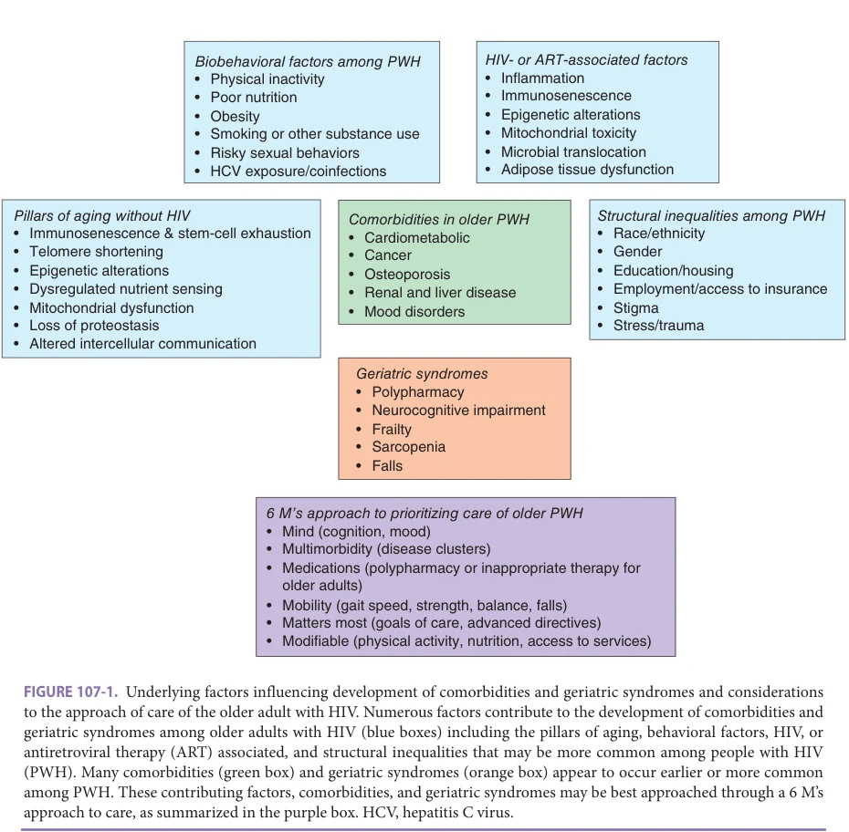
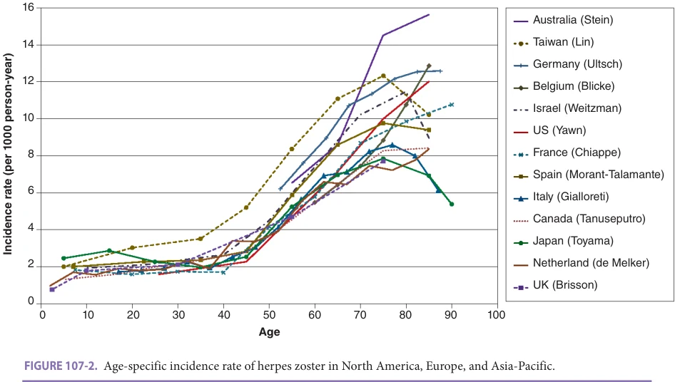
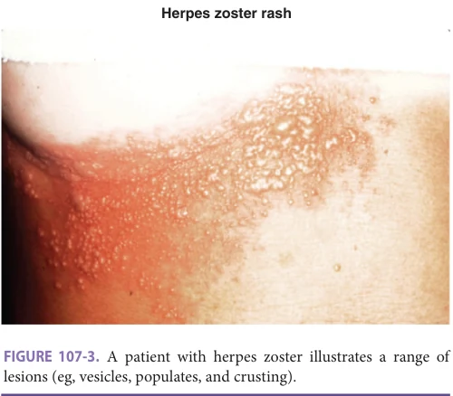
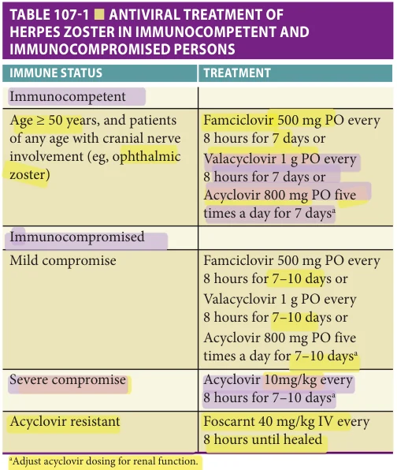
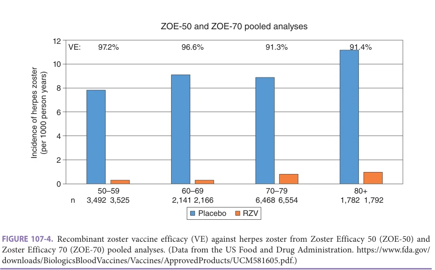
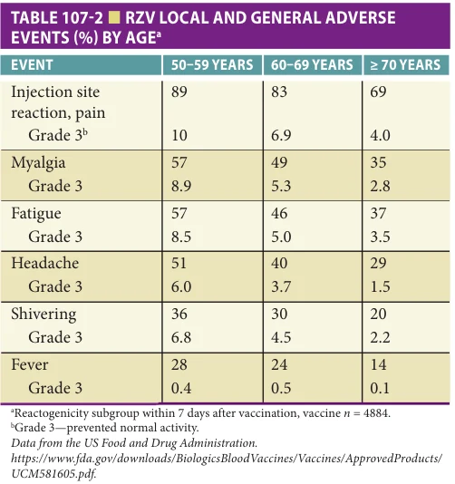

# Hazzard's Geriatric Medicine and Gerontology, 8e - Chapter 107: Other Viruses: Human Immunodeficiency Virus Infection and Herpes Zoster

Kristine M. Erlandson, Kenneth Schmader

> **Status.** Fast build from the book; not lane-reviewed.

> **Source and method.** Printed pages 1719-1732, from the marked 8th-edition copy (PDF page = printed page + 34). Prose follows its text layer; tables and figures are source-page crops. The book is canonical.

**[p. 1719]**

## HUMAN IMMUNODEFICIENCY VIRUS INFECTION

## DEFINITION

HIV is the virus that causes acquired immunodeficiency syndrome (AIDS). HIV destroys CD4+ T cells vital to defense of infections, and when untreated, leads to a progressively immunocompromised state with an increased risk for opportunistic infections, cancers, and other complications.

#### Learning Objectives

- Recognize the shift in the epidemiology of human immunodeficiency virus (HIV) over the last three decades.

- Identify older adults at risk for HIV infection and include HIV testing in routine care.

- Recognize that some comorbidities may present earlier or have a higher prevalence among older adults with HIV.

- Integrate the principles of geriatrics (eg, management of multimorbidity and polypharmacy) into the care of older adults with HIV.

#### Key Clinical Points

1. Antiretroviral therapy (ART) has turned HIV into a chronic disease that one ages with over many decades. More than 50% of all people living with HIV in the United States are age 50 or older.

2. HIV is often unrecognized in older adults because of subtle or nonspecific presentation (anemia, fatigue, weight loss, pneumonia) and provider bias that older adults are not at risk.

3. While AIDS-associated conditions have declined markedly, comorbid illnesses occur more frequently than in age-matched, HIV-uninfected control populations leading to early multimorbidity, polypharmacy, and functional decline even in those with HIV controlled by ART.

## EPIDEMIOLOGY

One of the most amazing success stories of our lifetime is the transformation of HIV infection from a rapidly fatal disease that manifested in the first AIDS cases in early 1980s to a chronic health condition, with this shift driven in part by the tremendous advocacy of the HIV community. With early initiation of effective ART, HIV-1 RNA can now be quickly reduced to undetectable levels. Not only does this decrease the risk of immune suppression and associated comorbidities, but effective ART essentially eradicates between person transmission of HIV. This discovery that Undetectable = Untransmittable (or U = U) has resulted in a transformative experience for many people living with HIV, as they can now live without the fear of transmitting HIV to partners or close contacts. Unfortunately, despite early initiation of ART, we have yet to fully eradicate HIV, with rare exceptions occurring in the setting of bone marrow transplantation. As a result, a growing number of people are now living, and aging, with HIV. In the United States and Europe, as of 2018, over 50% of people living with HIV are age 50 or older, with approximately 20% age 65 or older.

In addition to aging with HIV, many older adults continue to become newly infected with HIV: more than 15% of new HIV diagnoses in the United States are in adults aged 50 or older. Those aging with HIV are more likely than other aging individuals to use psychoactive substances including alcohol, marijuana, and opioids, which can both interfere with antiretroviral adherence and increase higher-risk

**[p. 1720]**

sexual encounters. Use of medications to treat erectile dysfunction and enhance sexual performance may also increase sexual risk behavior. Additionally, older men are less likely to use condoms and postmenopausal women may be less likely to request barrier protection without the risk of pregnancy. Age-associated erectile changes may make condom use difficult, and age-associated declines in immunity and changes in mucosal barriers may place older individuals at higher risk of transmission with each exposure. Finally, older individuals often present later in the course of HIV disease, extending the period of highest infectivity due to unsuppressed HIV-1 RNA.

While uptake of pre-exposure prophylaxis (PrEP) is less common among older versus younger adults, PrEP is an extremely effective tool for prevention of HIV transmission among patients at risk of HIV acquisition. Efficacy is presumed to be similar among older adults; however, few studies have included older adults, and the risk of adverse events and toxicity may be higher. A combination of strategies (barrier protection, ensuring viral suppression among people with diagnosed HIV, and providing PrEP to people at risk for HIV) has decreased and can continue to decrease transmission of new cases of HIV.

## EVALUATION

Screening No one is immune to HIV infection, and nearly 15% of people with HIV (PWH) in the United States and approximately 45% of persons worldwide are unaware of their diagnosis, presenting the greatest transmission risk. The nonspecific or asymptomatic presentation of new HIV may lead to a missed diagnosis for months or even years, as physicians and their patients are both likely to underestimate the risk of HIV infection among older adults. Prompt diagnosis and treatment of HIV decreases transmission and improves outcomes across the age spectrum. U = U has also led to a greater emphasis on the HIV care continuum: ensuring that each person living with HIV is diagnosed, linked to and receives care, is retained in care overtime, and achieves viral suppression.

The Centers for Disease Control and Prevention and the US Preventive Services Task Force (USPSTF) currently recommend that adolescents and adults aged 13 to 64 (CDC) or 15 to 65 (USPSTF) and all pregnant women should have HIV screening at least once; other expert panels (including the American College of Physicians) recommend screening up to age 75. More frequent annual testing is recommended for adults with higher risk, including persons who use injection drugs; have sex with a partner who has HIV or unknown HIV status, or uses injection drugs; and men who have sex with men. An individual in a monogamous relationship may present with a sexually transmitted disease because their partner

has more than one partner; any patient with a sexually transmitted disease (gonorrhea, syphilis, chlamydia, or trichomonas) should be screened (or rescreened) for HIV. Older patients may not spontaneously report sexual or drug use behaviors, and physicians seldom ask. Notably, some older patients may assume that HIV testing is part of routine blood work, thus incorrectly believe they are regularly tested. Annual wellness visits or hospitalizations are opportunities to ensure that HIV testing is up-to-date and repeated if indicated. Specific signed consent is no longer required for HIV testing though verbal consent may be required in some states.

In addition to routine testing, HIV testing should be conducted as part of a diagnostic work-up in any patient with unexplained laboratory results (anemia, leukopenia, pancytopenia, transaminitis, hyperproteinemia); new diagnoses of peripheral neuropathy, oral candidiasis, herpes zoster, recurrent bacterial pneumonia, anal cancer; or any AIDS-associated conditions (Pneumocystis jiroveci pneumonia, Kaposi sarcoma, atypical mycobacterial infection, tuberculosis, non-Hodgkin lymphoma). Finally, any patient presenting with debilitating fatigue, weight loss, or cognitive changes should be tested for HIV.

HIV Testing In most clinical settings, the prior two-step ELISA (antibody) and Western blot testing strategy has been replaced by a fourth-generation combination HIV-1/2 immunoassay that tests for both HIV-1 and HIV-2 antibodies and the HIV p24 antigen. If positive, a confirmatory immunoassay will distinguish between HIV-1 and HIV-2 (primarily found in Africa). If there is any concern for recently acquired HIV infection, based on recent exposure or symptoms (fever, malaise, lymphadenopathy), the immunoassay should be combined with a PCR test for HIV-1 viral load as the p24 antigen will not turn positive until approximately 5 to 7 days after the HIV-1 viral load is detectable. Both false-negative and false-positive tests are now extremely rare with the combined antibody/ antigen test. Rapid screening tests (including home kits) detect antibody only and have a higher rate of false negative results.

## MANAGEMENT

Selection and Initiation of Antiretroviral Treatment Patients with a new HIV diagnosis should be connected to HIV care as quickly as possible. ART is recommended for any patient regardless of CD4+ T-cell count, with greatest benefit on long-term prognosis seen if the CD4+ count remains more than 500 cells/μL. Rapid treatment of HIV offers immediate benefit by preventing declines in CD4+ count and decreasing HIV transmission. Indeed, some HIV programs have instituted rapid start programs with initiation of ART on the same day of HIV testing. Data also

**[p. 1721]**

suggest that rapid initiation of ART with lower peak HIV-1 viral loads may decrease the “reservoir” of HIV that is difficult to eradicate and may have added benefits on long-term inflammation and immune alterations with aging. Older adults appear to adhere more effectively to ART and are quite successful at achieving HIV-1 RNA suppression, but experience a slower improvement in CD4+ cell count, thus even more emphasis is placed on early initiation. Without treatment, the natural history of HIV infection is usually one of progressive immunodeficiency, with development of symptomatic AIDS approximately 8 to 12 years after infection. Prognosis is poorer among those who present late for care, fail to adhere to their treatment regimen, and/or develop widely resistant virus.

Standard ART regimens require medications from at least two different classes, most commonly an integrase strand transferase inhibitor (INSTI) combined with one or two nucleoside reverse transcriptase inhibitors (NRTIs). Compared to older antiretrovirals, contemporary regimens have less adverse effects, fewer drug–drug interactions, rapid viral suppression, and are generally tolerant of minor variations in adherence. Furthermore, many of the regimens are available in a single coformulated tablet once a day. Long-acting injectable drugs also have promising data on adherence and acceptability, though with very limited data among older populations. Notably, while ART appears safe in older populations and is essential in the prevention of disease progression, very few adults older than age 60 were included in clinical trials.

There are many antiretrovirals from which to choose, and this selection should be informed by consultation with an experienced HIV care provider. Selection of a regimen incorporates likelihood of resistance (and HIV-1 genotyping if available), cost, patient preference, comorbidities, preexisting organ system injury and anticipated toxicity, and concomitant medications. Patients are followed closely for the first several months of therapy to ensure tolerability, safety, and HIV-1 viral load suppression. After the first 6 to 12 months of therapy, if viral suppression is achieved and the patient has a CD4+ count above 350 to 500 cells/mL, HIV-1 viral load monitoring can occur approximately every 6 months and CD4+ count annually or less. While selection of antiretroviral regimens should be informed by an experienced HIV provider, once patients have achieved HIV-1 viral load suppression, care could be managed by a primary care provider or geriatrician with consultation as needed.

Many toxicities with ART are predictable. Weight gain is common with any regimen, but appears to be more common and significant with newer antiretroviral regimens. While some weight gain may be beneficial among those who are underweight, in many, weight gain is associated with incident hypertension, hyperlipidemia, diabetes, and hepatic steatosis. Thus, all patients initiating ART should be provided general nutrition and physical activity

recommendations to avoid excess weight gain. Physical activity prescriptions specific for adults with HIV have been developed and can be given at the time of ART to provide strategies to maintain adequate levels of physical activity.

General Care Considerations for the Older Adult With HIV After antiretroviral initiation, the incidence of AIDS conditions drops dramatically, but ongoing and consistent therapy is imperative. The Strategies for Management of Antiretroviral Therapy (SMART) trial demonstrated that continued viral suppression decreases incident non-AIDS conditions including liver disease, kidney disease, lung disease, and cardiovascular disease. Even with early initiation of ART, PWH experience some comorbidities many years before their uninfected peers (accelerated), or with a much higher prevalence than their uninfected peers (accentuated). This concept of accelerated versus accentuated aging is particularly important for diseases that might occur earlier and require a change in screening recommendations (eg, low bone density, falls, frailty, some cancers), and for diseases that occur more frequently and may require particular vigilance for monitoring and aggressive management (eg, cardiovascular disease and certain cancers). With the earlier manifestation of many diseases, a threshold of 50 years has been used for characterizing “aging” with HIV. As the population of people older than 60 or 65 years continues to grow, it will be important to also study effects of HIV among those of more advanced age.

Potential mechanisms underlying accelerated or accentuated aging in PWH include immune dysfunction, dysregulation, and suppression; chronic inflammatory stimulation due to reservoirs of HIV-1 RNA replication and chronic microbial translocation; hypercoagulability; and direct effects of viral proteins, modifiable lifestyle factors, and social or structural determinants of health. Many of the immune system changes of senescence in aging mirror the changes seen with HIV. Furthermore, markers of aging such as DNA methylation patterns and shortened telomere length indicate that PWH are approximately 5 years older, biologically, than their HIV-uninfected peers. Those who acquire HIV infection often have had years of struggle with structural inequalities (homelessness; biases due to race, ethnic, and gender minority populations; employment; insurance), contributing to additional stress-related immune responses.

While these mechanistic changes may occur to some extent among almost all PWH, the disease process, immune system alterations, and comorbidities of someone who has lived with HIV for over 30 years may be much different than someone diagnosed more recently and started on therapy immediately. The “legacy” effect of immune suppression, opportunistic infections, and exposure to older, toxic ART may be long-lasting. In contrast, those

**[p. 1722]**

that survived the early years of HIV, while experiencing the stress and trauma of the AIDS epidemic, may also have a unique “survivor” effect. Individuals who are diagnosed early in their disease process, achieve and maintain excellent HIV-1 RNA suppression, do not gain excess weight after ART initiation, and avoid ongoing substance use are likely to experience a very different aging trajectory from those who do not.

Models of Geriatric HIV Care Accompanying an increasing number of older adults with HIV is, unfortunately, a shortage of both HIV and geriatric medicine clinic providers. In addition to routine clinicbased care, people aging with HIV are substantially more likely to be hospitalized than their HIV-uninfected peers. How these patients and their many transitions between inpatient and outpatient care, general medical care and specialty care, and skilled nursing facility care will best be managed in the future remains to be seen. Incorporation of telehealth or telephone consultation for geriatric, HIV, or other subspecialty care may be an important component of care in the future. Similarly, HIV providers should have appropriate training in geriatric medicine, and geriatric care providers in HIV medicine. What is nearly certain is that older PWH will place new demands on parts of the health care system, including short- and long-term nursing facilities that have previously not managed those with HIV infection in any substantial numbers.

While the management of most diseases will be the same among older PWH, providers should be cognizant of diseases that occur more frequently or manifest differently in HIV. As in other geriatric populations, consideration of the 5 M’s approach to care can prioritize key clinical issues among many PWH, with a focus on Mind, Multimorbidity, Medications, Mobility, and (what) Matters most. We have proposed adding a sixth M for modifiable, emphasizing the importance of addressing the still modifiable factors in a population that might be younger than the typical geriatric population.

Mind incorporates cognitive impairment, mood disorders, the impact of substance use, and the added impact of stressors such as HIV stigma, loneliness, and depression. PWH have almost a fivefold risk for developing cognitive impairment independent of age, and may experience both HIV-related impairments and age-associated cognitive disorders such as Alzheimer disease, mild cognitive impairment, and vascular dementia. Up to 50% of PWH (of any age) will have evidence of HIV-associated neurocognitive impairment on neuropsychiatric testing, and approximately one-quarter experience an impact on daily function. Importantly, the Mini-Mental State Examination may miss the executive function impairment most common in HIV-associated neurocognitive disorders; the Montreal Cognitive Assessment is a more sensitive screening tool, though

formal neuropsychiatric testing is generally recommended. Although HIV disease severity (low CD4+ count, high HIV-1 RNA) is strongly linked to HIVassociated neurocognitive disorder, the impairments have changed minimally despite early and consistent ART; comorbidities, medication toxicity, psychiatric disease, and substance use also play an important role. Depression, anxiety, and severe mental illnesses such as psychosis and posttraumatic stress disorder are more common among older PWH infection than among the general population, with depression occurring in over 50% of PWH in some cohorts. Mood disorders can overlap with and confound the diagnosis of cognitive impairment, thus teasing out the diagnosis of both can be challenging. PWH who are aged 50 or older are also more likely than uninfected demographic counterparts to consume hazardous amounts of alcohol, use illicit drugs (especially marijuana, cocaine, and opioids), and smoke cigarettes. Lastly, social isolation, loneliness, and HIV-related stigma are highly prevalent among older PWH and may contribute to both poor cognition and mental health.

PWH experience a greater burden of multimorbidity at a given age than other populations, particularly in regard to clusters of cardiovascular and metabolic diseases, including diabetes, hypertension, hyperlipidemia, and nonalcoholic fatty liver disease. These disease clusters may be linked to toxicities of older ART, weight gain associated with newer therapy, and chronic inflammation. Kidney disease and loss of bone density are particularly common with some ART regimens and may occur as a consequence of coinfection with hepatitis B or C. The risk of some cancers is heightened due to coinfection with oncogenic viruses (human papilloma virus and anal cancer), exposure to carcinogens (lung cancer and smoking), or immunosuppression (some lymphomas). When referring to specialists, it is important to recognize that many older PWH continue to experience stigma related to HIV, gender, sexual preference, and age, and may be resistant to evaluation in a new clinic with a new provider.

With the initiation of ART, multiple medications or polypharmacy becomes the “norm” among PWH, often at least a decade before those without HIV experience polypharmacy. In addition to the burden of daily medications and pill fatigue, many antiretroviral agents are associated with significant drug–drug interactions. The protease inhibitors are particularly problematic, increasing levels of some concomitant medications (such atorvastatin) by over 800%. With the introduction of newer ART, treatment guidelines have emphasized a shift away from certain medication classes, particularly among older PWH, to avoid these often dangerous drug interactions. Interactions with food, vitamins, and both prescription and nonprescription medications can still occur with almost any of the HIV medications and careful attention to possible drug interactions should be considered with any new

**[p. 1723]**

prescription or change in dose. Further, due to preexisting organ system injury among those with HIV, those with HIV infection may be particularly susceptible to the harms associated with polypharmacy. These harms include decreased medication adherence and increased serious adverse drug events including organ system injury, hospitalization, geriatric syndromes (falls, fractures, and cognitive decline), and all-cause mortality. Utilizing pharmacists and drug– drug interactions programs (eg, HIV-druginteractions.org) can be extremely helpful.

Mobility tends to decline at a faster rate among PWH compared to uninfected controls, with differences apparent as early as age 50. Even among those with early initiation of ART, impairments in measures of grip strength, lower extremity function (repeat chair stands), and balance are common. The effects of ART on mitochondria, inflammation, neuropathy, obesity, and sarcopenia are heightened further by the impact of comorbidities, socioeconomic factors, and physical inactivity. Importantly, mobility impairments in middle-aged and older PWH are linked strongly to poor outcomes, including increased morbidity, mortality, and risk of falls. Indeed, people aged 45 to 65 with HIV experience fall rates similar to populations aged 65 and older without HIV. Many of the mobility impairments can be attenuated with cardiovascular and strength training. Thus physical activity counseling and fall risk reduction should be an important component of the care of PWH, regardless of age.

Ultimately, care should address what Matters Most to the patient. Recommendations should be informed by prognosis and the added risk/benefit ratio. Greater comorbid burden, frailty, and cognitive impairment among a relatively younger PWH may limit the added benefit of a screening procedure or intervention; other older adults with HIV may have robust health with few comorbidities. For example, patients need to live at least 5 to 7 years after screening for the benefit of the screening (decreased mortality) from colon cancer to outweigh the risk of perforation and the pain and discomfort of the procedure. Conversely, more aggressive screening for anal cancer may be indicated, particularly among those with good health, because of the increased incidence of this condition among those with HIV infection. Thus, “age appropriate” primary care guidelines for those without HIV may differ among PWH—careful consideration for the individual’s prognosis, preferences for care, and personal

risk of these conditions should be incorporated in the conversation. What matters most in the care of an older PWH may be impacted considerably by loss, trauma, and stigma. Importantly, these conversations and designated decision makers should be carefully documented. Less than half of patients in most HIV clinics have completed any form of advanced care planning. Many PWH in the United States have estranged relationships with family and have same sex partners or close friends that they would prefer to designate as a medical power of attorney. As the recognition of these decision makers can differ by state, addressing advanced directives and designating medical power of attorney among older PWH is even more important to ensure the right person can help to make the right choices at the end of life.

Lastly, modifiable risk factors should be a key component of the care of PWH throughout the lifespan. Some older PWH may continue to engage high-risk sexual behaviors and have frequent exposures to sexually transmitted infections (STIs); safer sex and decreasing long-acting consequences of STIs, including syphilis, hepatitis B, and hepatitis C. Food insecurity is up to six times more common in older adults with HIV, and loneliness occurs in nearly 60% of older adults with HIV: ensuring access to nutritious food and connecting with social resources may improve multiple domains of health. As previously mentioned, consistent ART adherence and adequate levels of physical activity remain key components of care for all PWH.

In summary, people aged 50 or older now account for a majority of PWH as a consequence of improved lifespan of those with HIV and increased acquisition of HIV at older ages. Older adults should be screened for HIV at least once, and more often if sexual risk is unknown or the patient has nonspecific symptoms. As a consequence of biobehavioral factors, HIV or ART-associated factors, structural inequalities, and the impact of aging-related factors, PWH experience a greater burden of comorbidities and develop geriatric syndromes, often at a much earlier age than their HIV-uninfected peers. A 6 M’s approach to the older PWH may guide providers in prioritizing care components (Figure 107-1). Importantly, the study of HIV infection among aging individuals may provide a template for improving the management of complex chronic disease more generally, especially among special populations of aging individuals—people of color, sexual minorities, and those with limited socioeconomic resources.

**[p. 1724]**

*FIGURE 107-1. Underlying factors influencing development of comorbidities and geriatric syndromes and considerations to the approach of care of the older adult with HIV. Numerous factors contribute to the development of comorbidities and geriatric syndromes among older adults with HIV (blue boxes) including the pillars of aging, behavioral factors, HIV, or antiretroviral therapy (ART) associated, and structural inequalities that may be more common among people with HIV (PWH). Many comorbidities (green box) and geriatric syndromes (orange box) appear to occur earlier or more common among PWH. These contributing factors, comorbidities, and geriatric syndromes may be best approached through a 6 M’s approach to care, as summarized in the purple box. HCV, hepatitis C virus.*

## HERPES ZOSTER

## Learning Objectives

- Understand the impact of aging on the incidence of herpes

zoster.

- Recognize typical and atypical presentations of herpes

zoster in older adults.

- Know when to order microbiological testing for the diagno-

sis of herpes zoster and what tests to order.

- Employ the appropriate use of different treatments for the

management of herpes zoster.

- Summarize Advisory Committee on Immunization Practices

(ACIP), Centers for Disease Control and Prevention (CDC), recommendations for the use of the recombinant zoster vaccine.

1. All cases of herpes zoster are caused by the reactivation of endogenous varicella-zoster virus (VZV) from latent infection of dorsal sensory or cranial nerve ganglia and not by exogenous transmission of VZV from an individual with herpes zoster or varicella.

2. Increasing age and impaired cellular immunity are the strongest risk factors for herpes zoster.

3. Although the diagnosis can be made on clinical grounds in the majority of cases with a typical dermatomal vesicular rash and pain, laboratory diagnostic testing is indicated when differentiating herpes zoster from

**[p. 1725]**

HSV, for suspected organ involvement, and for atypical presentations, particularly in the immunocompromised host; polymerase chain reaction (PCR) of vesicular fluid is the preferred diagnostic test.

4. The goal of the treatment of herpes zoster in older adults is to decrease the length of the acute attack and to reduce pain by the use of early antiviral therapy (acyclovir, famciclovir, valacyclovir), scheduled analgesia, and if the pain is not adequately controlled, adjunctive agents.

5. The recombinant zoster vaccine is recommended for all immunocompetent adults 50 years and older by ACIP for the prevention of herpes zoster.

## DEFINITION

Herpes zoster is a neurocutaneous disease that is caused by the reactivation of VZV from a latent infection of dorsal sensory or cranial nerve ganglia following primary infection with VZV earlier in life. Herpes zoster is characterized by unilateral, dermatomal pain and rash. Postherpetic neuralgia (PHN) is pain 90 or more days after rash onset.

## EPIDEMIOLOGY

VZV Transmission VZV is a double-stranded DNA herpesvirus that is transmitted from person to person via direct contact or airborne

or droplet nuclei when a virus-naive individual is exposed to the vesicular rash of varicella or herpes zoster. These exposed individuals may then develop varicella. Health care workers and staff in nursing homes and hospitals and children who have not received the varicella vaccine may not have had VZV primary infection and are potentially at risk for varicella. However, nearly all older adults are seropositive and latently infected with VZV. The exposure of a latently infected individual to herpes zoster does not cause herpes zoster or varicella. All cases of herpes zoster are caused by the reactivation of endogenous VZV.

Herpes Zoster Incidence and Risk Factors In general population studies from North America and Europe, the estimated incidence of herpes zoster in persons older than age 65 varies from approximately 10 to 14 cases per 1000 per year. The lifetime incidence of herpes zoster is estimated to be about 30% in the general population and may be as high as 50% among those surviving to 85 years or older. Current population figures and herpes zoster incidence data yield estimates of about 1 million new cases of herpes zoster each year in the United States.

The cardinal epidemiological feature of herpes zoster is its increase in incidence with aging and with diseases and drugs that impair cellular immunity. The increase in the likelihood of herpes zoster with aging starts around 50 to 60 years of age and increases into late life in individuals older than 80 years (Figure 107-2). Immunocompromised patients at risk for herpes zoster include persons with HIV infection, Hodgkin disease, non-Hodgkin lymphomas, leukemia, hematopoietic stem cell or solid organ transplant, systemic lupus erythematosus, and those taking immunosuppressive medications. Other risk factors

*FIGURE 107-2. Age-specific incidence rate of herpes zoster in North America, Europe, and Asia-Pacific.*

**[p. 1726]**

include White race, female sex, psychological stress, and physical trauma.

## PRESENTATION

VZV reactivates in the affected sensory ganglion and spreads in the peripheral sensory nerve, causing prodromal symptoms that frequently precede the rash by several days. These prodromal symptoms are located in the involved dermatome and range from a superficial itching, tingling, or burning to severe, deep, boring, or lancinating pain, paresthesia, or hyperesthesia. The pain can be constant or intermittent. The prodrome may be mistaken for many other conditions in older adults, including pleurisy, a myocardial infarction, cholecystitis, appendicitis, renal colic, a collapsed intervertebral disk, glaucoma, trigeminal neuralgia, or unappreciated trauma. The prodromal symptoms usually last a few days, although they have been reported to last more than a week. Zoster sine herpete is a condition when patients experience acute dermatomal neuralgia without ever developing a skin eruption.

When VZV reaches the dermis and epidermis, the initial cutaneous presentation of herpes zoster occurs as a unilateral, dermatomal, red, maculopapular eruption. Vesicles generally form within 24 hours and evolve into pustules, which dry and crust in 7 to 10 days. The rash usually heals over in 2 to 4 weeks. In normal individuals, new lesions may continue to appear for 1 to 4 days and occasionally for as long as 7 days. The T1 to L2 or V1 dermatomes are most commonly involved (Figure 107-3). Atypical rashes may occur in older persons. The atypical rash may be limited to a small patch located within a dermatome or may remain maculopapular without ever developing vesicles.

Herpes zoster–associated acute neuritis produces dermatomal neuralgic pain in many older adults. Some older patients never develop pain, while others may

*FIGURE 107-3. A patient with herpes zoster illustrates a range of lesions (eg, vesicles, populates, and crusting).*

experience the delayed onset of pain days or weeks after rash onset. The neuritis is described as burning, deep aching, tingling, itching, or stabbing. A subset of patients may develop severe pain, especially those with trigeminal nerve involvement. Acute herpes zoster pain can interfere with all activities of daily living (ADLs), but interference is greatest for instrumental ADLs, as well as sleep, general physical activity, and leisure activities. As overall pain burden increases, patients experience poorer physical, role, and emotional functioning.

The most feared complication of herpes zoster among older adults is PHN. PHN patients describe the quality of their pain as burning, throbbing, stabbing, shooting, sharp, aching, gnawing, tiring, or tender. The pain may be spontaneous and/or stimulus-evoked. Spontaneous pain may be constant aching or burning and/or brief, intermittent shock-like sensations. Stimulus-evoked pain consists of allodynia or hyperpathia. Allodynia is pain elicited by an innocuous stimulus and is particularly problematic. A cold wind, clothes, or bed sheets against the allodynic skin may cause debilitating pain. Hyperpathia is an exaggerated pain after a mildly painful stimulus. A minor bump of the affected dermatome against an object can cause severe pain that lasts for hours. Patients may experience discomfort that is not described as pain such as numbness or itching. Postherpetic itch can be maddening and appears to be mediated by damage and dysfunction of peripheral and central itch-specific neurons.

PHN greatly interferes with the functional status and quality of life of older adults. Patients can suffer from a variety of constitutional symptoms including chronic fatigue, anorexia, weight loss, and insomnia. PHN is associated with depression and social isolation in older adults. Reduced quality of life and interference with ADLs increase significantly as pain severity increases. Instrumental and basic ADLs are all compromised by PHN. For example, the patient with allodynic skin may be forced to avoid bathing or clothing around the affected area. Instrumental ADLs commonly affected include traveling, shopping, cooking, and housework. Studies using standardized pain scales and measures of function and quality of life such as the SF-36, SF-12, EuroQol, and Nottingham Health Profile have shown that PHN significantly interferes with multiple ADLs, reduces health-related quality of life (HRQL), and impairs mental and physical health.

Other complications include ocular inflammation in the setting of ophthalmic herpes zoster, cranial neuropathies, myelitis, visceral involvement, and motor paralysis. VZV-induced damage to the cornea and uvea and other eye structures can cause corneal anesthesia and ulceration, glaucoma, optic neuritis, eyelid scarring and retraction, visual impairment, and blindness in patients who did not receive antiviral therapy. Ophthalmic herpes zoster is also associated with stroke occurring weeks to months after the onset of the rash. Involvement of the third division of cranial nerve V can produce lesions and pain in the mandibular

**[p. 1727]**

area of the face and in the mouth. Cranial nerve VII and VIII involvement, or Ramsey Hunt syndrome, is characterized by facial palsy in combination with herpes zoster lesions of the ipsilateral external ear, ear canal, tympanic membrane, or hard palate. Symptoms include tinnitus, vertigo, deafness, problems with balance, and facial paresis. Involvement of cranial nerves IX and X may produce pharyngeal or laryngeal lesions and resulting pharyngitis or laryngitis. Motor paralysis, from VZV-induced destruction of motor neurons in the anterior spinal horn or motor radiculitis corresponding to the extension of VZV infection from the involved sensory ganglion, involves muscle groups with innervation that is contiguous with that of the affected dermatome. Painful Bell palsy in an older adult strongly suggests herpes zoster.

## EVALUATION

In patients who present with prodromal pain and no rash, herpes zoster is often confused with other causes of unilateral, localized pain in older adults. One diagnostic clue to the presence of prodromal pain is localized cutaneous sensory abnormalities (eg, hyperesthesia, dysesthesia) in the affected dermatome. Herpes zoster is easily diagnosed when an older adult patient presents with the typical dermatomal vesicular rash and pain. During the rash phase, herpes simplex has the most similar presentation to herpes zoster. Evidence supporting herpes simplex includes a presentation in a younger population, multiple reoccurrences of lesions, and the absence of chronic pain. The lesions themselves are more difficult to distinguish, particularly when herpes zoster occurs in areas commonly affected by simplex (eg, oral, genital, buttock lesions). The differential diagnosis also includes contact dermatitis, burns, and vesicular lesions associated with fungal infections, but the history and examination usually make the distinction clear.

The diagnosis of herpes zoster may need laboratory diagnostic testing when differentiating herpes zoster from HSV infection is necessary, for suspected organ involvement, and for atypical presentations, particularly in the immunocompromised host. The preferred diagnostic test is PCR because it is highly sensitive and specific, and results are available within hours of specimen receipt. The best specimen is vesicle fluid, which contains abundant VZV. Lacking vesicle fluid, acceptable specimens include lesion scrapings, crusts, tissue biopsy, or cerebrospinal fluid.

## MANAGEMENT

Acute Herpes Zoster The principal goal of the treatment of herpes zoster in older adults is to decrease the length of the acute attack and to reduce or eliminate pain. Patients should be instructed to keep the rash clean and dry to decrease

the chances of developing bacterial superinfection. Cool compresses, calamine lotion, cornstarch, or baking soda may help to reduce local symptoms and speed the drying of the vesicles.

Antiviral Therapy The guanosine analogs acyclovir, famciclovir, and valacyclovir are phosphorylated by viral thymidine kinase to a triphosphate form that inhibits VZV DNA polymerase and VZV replication (Table 107-1). Valaciclovir and famciclovir are prodrugs, which have greater bioavailability, resulting in higher blood levels and a less frequent dosing schedule. Randomized controlled trials indicate that oral acyclovir (800 mg five times a day for 7 days), famciclovir (500 mg every 8 hours for 7 days), and valaciclovir (1 g three times a day for 7 days) reduce acute pain and the duration of chronic pain in older patients with herpes zoster who are treated within 72 hours of rash onset. The most common adverse effects are nausea, vomiting, diarrhea, and headache. The effectiveness of antiviral agents has not been evaluated for treatment after 72 hours have elapsed since the onset of rash. An exception to the 72-hour threshold for treatment is made for patients who have ophthalmic zoster or patients that continue to have new vesicle formation. Topical antiviral therapy is not an effective treatment regardless of when started.

Analgesics Acute herpes zoster pain requires the use of standardized pain measures, scheduled analgesia, and close monitoring

*TABLE 107-1 ■ ANTIVIRAL TREATMENT OF HERPES ZOSTER IN IMMUNOCOMPETENT AND IMMUNOCOMPROMISED PERSONS*

**[p. 1728]**

to adjust dosing and detect adverse effects. Opioid and nonopioid analgesia are a standard of care for the acute pain syndrome. The choice of treatment will depend on the patient’s pain intensity, comorbidities, and preferences. Patients with mild pain may be managed with acetaminophen or nonsteroidal agents. Patients with moderate to severe pain usually require treatment with an opioid analgesic (eg, oxycodone).

Corticosteroids The anti-inflammatory effects of corticosteroids have been postulated to reduce herpes zoster symptoms but there remains controversy over their use. Randomized, controlled clinical trials demonstrated that corticosteroids do not prevent PHN when compared to placebo or acyclovir. These findings, the risk of VZV dissemination, and the adverse effects of corticosteroids in older adults argue against the routine use of these agents in herpes zoster. However, clinical trials have shown reductions in acute pain and one randomized controlled trial showed benefits in improvement in time to uninterrupted sleep, return to routine activities, and cessation of analgesic medications among patients with no relative contraindications to corticosteroids. In the trial, prednisone was administered orally at 60 mg/day for days 1 to 7, 30 mg/day for days 8 to 14, and 15 mg/day for days 15 to 21. Therefore, corticosteroids may be useful in reducing moderate to severe acute pain unrelieved by antiviral agents and analgesics. Corticosteroids are used to treat VZV-induced facial paralysis and cranial polyneuritis to improve motor outcomes and provide pain relief. If prescribed, corticosteroids should always be used in conjunction with antiviral agents.

Adjuvant Agents If moderate-to-severe herpes zoster pain is inadequately relieved by antiviral agents in combination with oral analgesic medications and/or corticosteroids, then other therapies to consider include gabapentin or pregabalin or neural blockade. The use of these anticonvulsant agents must be balanced against adverse effects of sedation, dizziness, ataxia, and peripheral edema. A randomized controlled trial of antiviral therapy, oral analgesics, and a single epidural block with bupivacaine and methylprednisolone compared to antiviral therapy and oral analgesics alone showed that neural blockade reduces acute pain but does not prevent PHN.

Ophthalmic zoster with ocular involvement requires ophthalmological consultation. Oral antiviral and analgesic therapy is the mainstay of treatment as it is for herpes zoster presenting on the rest of the body but other ocular therapies may be necessary. These treatments are best managed by an ophthalmologist and include antibiotic ophthalmic ointment to prevent bacterial infection of the ocular surface, topical steroids to reduce ocular inflammation, mydriatics as needed for iritis, and ocular pressure-lowering drugs as needed for glaucoma.

## PREVENTION

Recombinant Zoster Vaccine The adjuvanted recombinant zoster vaccine (RZV; Shingrix©) is a powerful tool to prevent herpes zoster and PHN in older adults. It contains two components: recombinant VZV surface glycoprotein E (gE) antigen and the AS01B adjuvant system. AS01B adjuvant contains monophosphoryl lipid A (MPL) and QS-21, a saponin, combined in a liposomal formulation. VZV gE elicits an immune response against VZV, while the adjuvant strongly potentiates the immune response by enhancing the innate immune response to the antigen.

Efficacy The efficacy of RZV was demonstrated in over 30,000 immunocompetent community-dwelling elders in the randomized, blinded, placebo-controlled Zoster Efficacy Study in Adults 50 Years of Age or Older (ZOE-50) and Zoster Efficacy Study in Adults 70 Years of Age or Older (ZOE-70) (Figure 107-4). The intervention was two doses of RZV at a 2-month interval. The median follow-up time was 3.2 years in the ZOE-50 study and 3.7 years in the ZOE-70 study. The vaccine efficacy (VE) for the prevention of herpes zoster was 97% (95% confidence interval [CI] = 89.6–99.3) in persons aged 50–59 and 97% (95% CI = 90.1–99.7) in persons aged 60–69 (see Figure 107-3). The VE against herpes zoster was 91% (95% CI = 86.8–94.5) in participants aged 70 years or older using pooled data from the ZOE-50 and ZOE-70 studies.

VE in the first year after vaccination was 98% (95% CI = 90.9–99.8). It was 85% (95% CI = 69.0–93.4) or higher for the remaining 3 years of the study in persons aged 70 or older.

Safety and Reactogenicity The only contraindication to RZV is a history of a severe allergic reaction to any component of the vaccine or after a previous dose of RZV. Serious adverse events, potential immune mediated diseases, and deaths were reported at similar rates in vaccine and placebo groups in the clinical trials.

Using pooled data from the ZOE-50 and ZOE-70 trial from all participants, the most common solicited adverse reactions after RZV administration were injection site pain (78%), myalgia (45%), fatigue (45%), headache (38%), shivering (27%), fever (21%), and gastrointestinal symptoms (17%). Table 107-2 shows the frequency of adverse reactions by age group. The frequency of adverse reactions decreased with increasing age. Grade 3 reactions are defined as those that prevented normal activity. Table 107-2 shows the frequency of grade 3 reactions by age group, which also decreased with increasing age. About 16% of participants 50 years and older experienced any grade 3 reaction.

To better characterize the impact of reactogenicity on functional status and quality of life in older adults, a separate study of 401 adults age 50 and older who received RZV

**[p. 1729]**

*FIGURE 107-4. Recombinant zoster vaccine efficacy (VE) against herpes zoster from Zoster Efficacy 50 (ZOE-50) and Zoster Efficacy 70 (ZOE-70) pooled analyses. (Data from the US Food and Drug Administration. https://www.fda.gov/ downloads/BiologicsBloodVaccines/Vaccines/ApprovedProducts/UCM581605.pdf.)*

found that overall the physical functioning and quality of life of older adult were not affected by the first or second dose of RZV over 7 days postvaccination. However, participants who experienced a grade 3 reaction after either dose had a transient clinically important decrease in physical functioning and quality of life, affecting activities such as walking distances, carrying groceries, climbing stairs, lifting items, and moderate to vigorous activities. The impact was noted on days 1 to 2 post vaccination and resolved by day 3.

Given that frailty is strongly associated with adverse health outcomes, investigators studied how frailty impacts

*TABLE 107-2 ■ RZV LOCAL AND GENERAL ADVERSE EVENTS (%) BY AGEa*

RZV VE, immunogenicity, reactogenicity, and safety. In secondary analyses of ZOE-50 and ZOE-70 studies, a baseline frailty index (FI) was created retrospectively following previously validated methods using preexisting comorbidities and patient reported outcomes. Participants were categorized as nonfrail (FI ≤ 0.08), prefrail (FI = 0.08–0.25), or frail (FI ≥ 0.25) for stratified analyses. RZV VE against HZ was consistently above 90% for all frailty categories (nonfrail: 96% [95% CI: 91.6–98.2], prefrail: 90% [84.4– 94.4], frail: 90% [75.4–97.0]). The RZV group demonstrated robust antibody responses postdose 2 across frailty categories. In the RZV group, the percentage of participants reporting postvaccination reactions decreased with increasing frailty.

Clinical Guidance The Advisory Committee on Immunization Practices (ACIP) at the CDC recommends RZV for the prevention of herpes zoster and related complications in immunocompetent adults aged 50 or older including individuals who previously received zoster vaccine live (ZVL; Zostavax©). RZV is included in the routine adult immunization schedule for older adults.

The lyophilized VZV gE antigen is reconstituted with the liquid adjuvant to comprise the vaccine and administered as a 0.5 mL intramuscular (IM) injection. RZV is administered in a 2-dose series. Screening for a prior history of varicella or herpes zoster before administration of the first dose is not necessary. After the first dose, the second dose should be administered 2 to 6 months later. If the patient does not return within that time window, then the second dose should be administered at the next available opportunity. It is not necessary to restart the series. RZV may be coadministered with influenza, pneumococcal, and Tdap vaccines.

**[p. 1730]**

It is essential to counsel the patient about potential injection site and systemic reactions before administering both doses of RZV. They may feel pain, redness swelling at the injection site or muscle pain, tiredness, headache, chills, fever or nausea. About one in six persons have reactions that transiently prevent them from doing normal activities. Most symptoms resolve in 1 to 3 days. Patients should be counseled to avoid strenuous activities for a few days after vaccination. Reactions to the first dose do not strongly predict reactions to the second dose.

The ACIP provides no recommendation, either for or against, the use of RZV in immunocompromised populations. The FDA label does not list immunocompromised as a contraindication or precaution so administering RZV to immunocompromised individuals is not off-label

## FURTHER READING

HIV American Academy of HIV Medicine: HIV & Aging Clin-

ical Recommendations. Available at: https://aahivmeducation.org/hiv-age/contents. Updated May 13, 2020. Accessed December 1, 2020. Back D, Marzolini C. The challenge of HIV treatment in an

era of polypharmacy. J Int AIDS Soc. 2020;23(2):e25449. CD4+ Count-Guided Interruption of Antiretroviral Treat-

ment. N Engl J Med. 2006;355(22):2283–2296. Centers for Disease Control and Prevention. HIV and

Older Americans. Available at: https://www.cdc.gov/ hiv/group/age/olderamericans/index.html. Updated September 14, 2020. Accessed January 6, 2021. Costagliola D. Demographics of HIV and aging. Curr Opin

HIV AIDS. 2014;9(4):294–301. Deeks SG. HIV infection, inflammation, immunosenes-

cence, and aging. Annu Rev Med. 2011;62:141–155. Deeks SG, Lewin SR, Havlir DV. The end of AIDS: HIV

infection as a chronic disease. Lancet. 2013;382(9903): 1525–1533. Erlandson KM, Karris MY. HIV and aging: reconsidering

the approach to management of comorbidities. Infect Dis Clin North Am. 2019;33(3):769–786. Freiberg MS, Chang CC, Kuller LH, et al. HIV infection

and the risk of acute myocardial infarction. JAMA Intern Med. 2013;173(8):614–622. Greene M, Covinsky KE, Valcour V, et al. Geriatric syn-

dromes in older HIV-infected adults. J Acquir Immune Defic Syndr. 2015;69(2):161–167. Hasse B, Ledergerber B, Furrer H, et al. Morbidity and

aging in HIV-infected persons: the Swiss HIV cohort study. Clin Infect Dis. 2011;53(11):1130–1139. High KP, Brennan M, Clifford DB, et al. HIV and aging:

state of knowledge and areas of critical need for research.

prescribing to persons 50 years and older; it is off-label for persons younger than 50 years. Currently, best practice is to allow for RZV use in immunocompromised persons on a case-by-case basis if potential benefit is judged to outweigh the risk, using shared decision. Current information from randomized controlled trials indicate that RZV was immunogenic and had no safety concerns in small numbers (100–1000) of different immunocompromised populations including hematopoietic stem cell transplant (HSCT), kidney transplant, hematologic malignancies, solid cancers on chemotherapy, HIV, and immune-mediated disease. RZV VE was demonstrated prospectively in HSCT (VE = 68%) and in post-hoc analyses in hematologic malignancies (VE = 87%) and immune-mediated diseases (VE = 91%).

A report to the NIH Office of AIDS Research by the HIV and Aging Working Group. J Acquir Immune Defic Syndr. 2012;60(suppl 1):S1–18. Jones A, Cremin I, Abdullah F, et al. Transformation of

HIV from pandemic to low-endemic levels: a public health approach to combination prevention. Lancet. 2014;384(9939):272. Mahale P, Engels EA, Coghill AE, Kahn AR, Shiels MS.

Cancer risk in older persons living with human immunodeficiency virus infection in the United States. Clin Infect Dis. 2018;67(1):50–57. Montoya JL, Jankowski CM, O’Brien KK, et al. Evidence-

informed practical recommendations for increasing physical activity among persons living with HIV. AIDS. 2019;33(6):931–939. Pahwa S, Deeks S, Zou S, et al. NIH Workshop on HIV-

Associated Comorbidities, Coinfections, and Complications: Summary and Recommendation for Future Research. J Acquir Immune Defic Syndr. 2021;86(1):11–18. Pathai S, Bajillan H, Landay AL, High KP. Is HIV a model

of accelerated or accentuated aging? J Gerontol A Biol Sci Med Sci. 2014;69(7):833–842. Panel on Antiretroviral Guidelines for Adults and Adoles-

cents. Guidelines for the Use of Antiretroviral Agents in Adults and Adolescents with HIV. Department of Health and Human Services. Available at https://clinicalinfo. hiv.gov/sites/default/files/inline-files/AdultandAdolescentGL.pdf. Accessed December 20, 2020. Piggott DA, Erlandson KM, Yarasheski KE. Frailty in

HIV: epidemiology, biology, measurement, interventions, and research needs. Curr HIV/AIDS Rep. 2016; 13(6):340–348. Sangarlangkarn A, Merlin JS, Tucker RO, Kelley AS.

Advance care planning and HIV infection in the era

**[p. 1731]**

of antiretroviral therapy: a review. Top Antivir Med. 2017;23(5):174–180. Schouten J, Wit FW, Stolte IG, et al. AGEhIV Cohort Study

Group. Cross-sectional comparison of the prevalence of age-associated comorbidities and their risk factors between HIV-infected and uninfected individuals: the AGEhIV cohort study. Clin Infect Dis. 2014;59(12):1787–1797. Siegler EL, Brennan-Ing M. Adapting systems of care

for people aging with HIV. J Assoc Nurses AIDS Care. 2017;28(5):698–707. Singh HK, Del Carmen T, Freeman R, Glesby MJ, Siegler EL.

From one syndrome to many: incorporating geriatric consultation into HIV care. Clin Infect Dis. 2017;65(3):501–506. Smit M, Brinkman K, Geerlings S, et al. Future challenges for

clinical care of an ageing population infected with HIV: a modelling study. Lancet Infect Dis. 2015;15(7):810–808.

HERPES ZOSTER Cohen JI. Herpes zoster. N Engl J Med. 2013;369:255–263. Cunningham AL, Lal H, Kovac M, et al. ZOE-70 Study Group.

Efficacy of the herpes zoster subunit vaccine in adults 70 years of age or older. N Engl J Med. 2016;375: 1019–1032. Curran D, Kim JH, Matthews S, et al. Recombinant zoster

vaccine is efficacious and safe in frail individuals. J Am Geriatr Soc. 2021;69(3):744–752.

Dooling KL, Guo A, Patel M, et al. Recommendations of

the advisory committee on immunization practices for use of herpes zoster vaccines. MMWR Morb Mortal Wkly Rep. 2018;67:103–108. Forbes HJ, Bhaskaran K, Thomas SL, et al. Quantification

of risk factors for postherpetic neuralgia in herpes zoster patients: a cohort study. Neurology. 2016;87(1):94–102. Johnson RW, Rice ASC. Postherpetic neuralgia. N Engl J

Med. 2014;371:1526–1533. Kawai K, Gebremeskel BG, Acosta CJ. Systemic review of

incidence and complications of herpes zoster: towards a global perspective. BMJ Open. 2014;4(6):e004833. Lal H, Cunningham AL, Godeaux O, et al. ZOE-

50 Study Group. Efficacy of an adjuvanted herpes zoster subunit vaccine in older adults. N Engl J Med. 2015;372:2087–2096. Schmader KE, Levin MJ, Grupping K, et al. The impact of

reactogenicity after the first dose of recombinant zoster vaccine upon the physical functioning and quality of life of older adults: an open phase III trial. J Gerontol A Biol Sci Med Sci. 2019;74:1212–1224. Yawn BP, Saddier P, Wollan PC, St Sauver JL, Kurland MJ,

Sy LS. A population-based study of the incidence and complication rates of herpes zoster before zoster vaccine introduction. Mayo Clin Proc. 2007;82:1341–1349.

**[p. 1732]**
