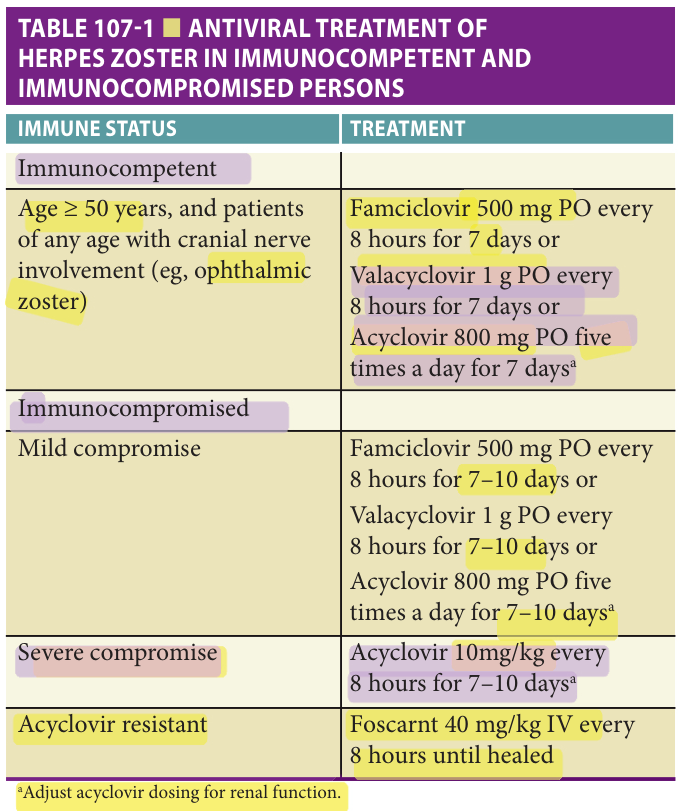

Study summary of Chapter 107 - Other Viruses: Human Immunodeficiency Virus Infection and Herpes Zoster; the book and the full chapter are the reference.

# Chapter 107 Study: Other Viruses: Human Immunodeficiency Virus Infection and Herpes Zoster

## Summary

**HIV in older adults**
- More than **50%** of people living with HIV in the United States are at least **50**; treatment has transformed HIV into a chronic disease of aging (p1719).
- Consider HIV with unexplained anemia, fatigue, weight loss or pneumonia; nonspecific symptoms and assumptions about age can delay diagnosis (p1719–1720).
- Link newly diagnosed patients rapidly to HIV care. ART is recommended regardless of CD4 count, with greatest long-term benefit when counts remain above **500 cells/μL** (p1720).
- Viral suppression reduces transmission, but does not generally eradicate HIV. Multimorbidity, polypharmacy and functional decline remain concerns even with controlled infection (p1719).

**Zoster: diagnosis**
- Reactivation of latent varicella-zoster virus causes unilateral dermatomal pain and rash; postherpetic neuralgia is pain at least **90 days** after rash onset (p1725).
- Pain, burning or hyperesthesia can precede rash by days and mimic visceral or neurologic disease. Zoster sine herpete can cause dermatomal neuralgia without rash (p1726).
- Typical dermatomal vesicles with pain support the clinical diagnosis; recurrent localized lesions also raise herpes simplex in the differential (p1727).

**Antiviral treatment**
- Acyclovir **800 mg five times daily for 7 days**, famciclovir **500 mg every 8 hours for 7 days**, or valacyclovir **1 g three times daily for 7 days** reduced pain in trials treating within **72 hours** (p1727).
- Common adverse effects include nausea, vomiting, diarrhea and headache. Famciclovir and valacyclovir allow less frequent dosing than acyclovir (p1727).
- The chapter makes exceptions to the **72-hour** treatment threshold for ophthalmic zoster or continuing new vesicle formation; topical antivirals are ineffective (p1727).

**Pain, prevention & exam traps**
- Keep lesions clean and dry; treatment aims to shorten the acute attack and relieve pain (p1727).
- Corticosteroids do not prevent postherpetic neuralgia and are not for routine use; selected patients may obtain acute pain benefit, but steroids must accompany antivirals (p1728).
- Recombinant zoster vaccine combines viral glycoprotein antigen with an adjuvant and helps prevent zoster and postherpetic neuralgia (p1728).
- Do not equate absence of rash with absence of zoster, or viral suppression with cure of HIV (p1719, p1726).

## Exam-cited book images

Book images cited by past exams. Tap an image to zoom.

## Table 107-1 — book image

[2023-Jun Q12](?chapter=bank&q=mcq-ac1abd6998b64fa59be16762)

## Exam questions

Past-exam questions linked to this chapter (2):

- [2023-Jun Q12](?chapter=bank&q=mcq-ac1abd6998b64fa59be16762)
- [2026-Jun Q22](?chapter=bank&q=mcq-20ec42c28a8afefb8a0ba9b1)
