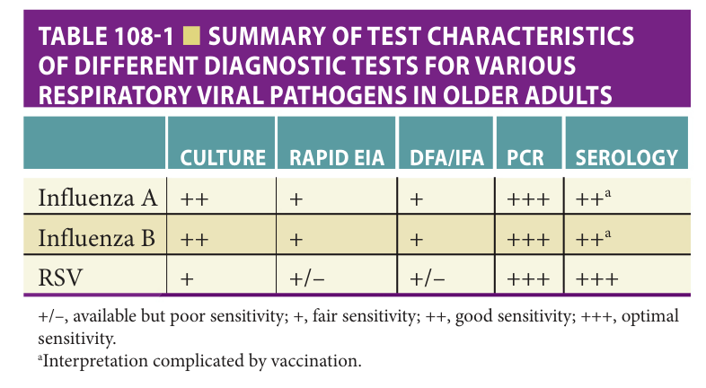

# Hazzard's Geriatric Medicine and Gerontology, 8e — Chapter 108: Influenza, COVID-19, and Other Respiratory Viruses

Lauren Hartman, H. Keipp Talbot

> **Fast build from the book, 22 Sep; not lane-reviewed.**

**[p. 1733]**

#### Learning Objectives

- Understand the biology of influenza virus that leads to “drift” and “shift” in surface protein structure and their impact on vaccine formulation and the emergence of influenza pandemics.
- Recognize clinical situations where there is a need for diagnostic testing to confirm a specific viral etiology in symptomatic older adults and recommend the specific tests appropriate in different clinical scenarios.
- Identify appropriate interventions to control outbreaks of influenza, respiratory syncytial virus (RSV), and severe acute respiratory syndrome coronavirus-2 (SARS-CoV-2) in a nursing home.
- Recognize the appropriate use of antiviral therapies for influenza in seniors.
- Review the biological and other features of SARS-CoV-2 infection that contribute to pandemic spread.

#### Key Clinical Points

1. The influenza virus has a segmented RNA core that encodes key proteins on the viral surface including hemagglutinin and neuraminidase. Annual mutations in the RNA lead to “drift” in these proteins requiring annual reformulation and administration of the vaccine.
2. When entire segments of the influenza RNA recombine in animals, it can lead to an antigenic “shift” and may result in a pandemic as there may be little or no immunity in the population.
3. Detection of influenza virus by direct antigen testing is insensitive in older adults, and a negative test does not rule out influenza infection. Reverse transcriptase polymerase chain reaction (RT-PCR) is more than 90% sensitive. Similarly, RSV is best detected by RT-PCR.
4. RSV is clinically indistinguishable from influenza in older adults—both may present subtly or primarily as an exacerbation of underlying chronic illnesses.
5. Antiviral therapy with neuraminidase inhibitors is indicated for treatment of influenza and as chemoprophylaxis for nursing home outbreaks. Supportive care is currently the only treatment for RSV.
6. Influenza immunization is recommended for all older adults. Enhanced influenza vaccines are more effective than a standard-dose vaccine in seniors.
7. Immunization of staff reduces influenza mortality for nursing home residents.
8. Transmission of SARS-CoV-2 is highest at the beginning of infection, often prior to the onset of symptoms.
9. Symptomatic cases of SARS-CoV-2 present with fever, cough, fatigue, and dyspnea, though older adults may have atypical presentations.
10. Older adults, particularly those residing in nursing homes, are at high risk of complications, hospitalization, and death as a result of influenza, RSV, and SARS-CoV-2 infections.

## Influenza

Viruses are an important threat to the health of older adults. Each year, it is estimated that influenza alone is associated with the death of 36,000 older adults in the United States. Despite immunization, outbreaks of influenza occur regularly in nursing homes and other long-term care facilities. This section of the chapter summarizes the biological, epidemiological, and clinical features of influenza that are relevant to older adults, with a particular emphasis on prevention.

## Clinically Relevant Biological Characteristics Of Influenza Virus

To understand the impact of influenza in older adults, it is important to be familiar with several key characteristics of the virus. The structure of influenza consists of an envelope with a central nucleic acid core composed of single-stranded RNA that encodes key structural proteins of the virus including hemagglutinin and neuraminidase. There are three types of influenza viruses: A, B, and C. However, only A and B are clinically relevant. Influenza A viruses are characterized by the structure of the hemagglutinin, a surface protein that binds glycoprotein on the surface of respiratory epithelial cells, allowing the virus to enter by forming an endosome and then using the protein-making machinery of the cell to replicate itself. Each year, new mutations occur resulting in small changes in the hemagglutinin (“antigenic drift”) hence the reason why influenza vaccine needs to be reformulated and given annually. The other surface projection, neuraminidase, cleaves terminal sialic acid residues from carbohydrate moieties on surfaces of infected cells, promoting the release of virions that go on to infect other cells. As discussed below, this is a key target for neuraminidase inhibitors, thus preventing the influenza virus from replicating.

An important feature of influenza is the segmented structure of the RNA at the core of the virus, with each of eight segments coding for a structural or enzymatic component of the virus. This gives the virus the potential to recombine with influenza viruses of animal origin, forming a virus with a novel genotype and hemagglutinin to which there is no preexisting immunity. This is known as “antigenic shift” and was responsible for pandemics in

**[p. 1734]**

1957–1958, 1968–1969, and 2009. Of note, the highest mortality rates occurring in the 1918–1919 and the 2009 pandemics were not in older adults but in younger adults, perhaps due to cross protection from the many influenza strains to which older adults were exposed over a lifetime. However, mortality in interpandemic periods is highest in those at the extremes of age. At present, there are only three hemagglutinins (H1, H2, and H3) and two neuraminidases (N1 and N2) that have developed a stable lineage in humans.

## General Epidemiology Of Influenza

Epidemics of influenza occur annually between November and April in the Northern Hemisphere. In any given season, there may be several strains circulating, hence the annual influenza vaccine contains multiple influenza strains.

## Important Host Considerations In Older Adults

During the interpandemic period, older adults and particularly residents of long-term care facilities are equally likely to contract influenza as young, healthy adults, but are among those at highest risk for complications of influenza. Rates of hospitalization for influenza in older persons range from 136 to 508 per 100,000 persons versus 10 to

25 for those 5 to 49 years of age. The presence of chronic conditions, such as chronic lung disease, congestive heart failure, conditions that predispose to aspiration, and metabolic disease, increases the risk for complications following infection with influenza. Many of these conditions occur predominately in older age groups. Moreover, studies that have assessed complications have found that age older than 65 is independently associated with increased risk for influenza complications.

Based on our current understanding, the causes of death as a result of influenza in older adults in the interpandemic period include viral pneumonia, a bacterial infection complicating the influenza infection, myocardial infarction, stroke, and exacerbation of underlying comorbid conditions. Infection with influenza virus predisposes to _Streptococcus pneumoniae_ or _Staphylococcus aureus_ infection, which most often results in bacterial pneumonia. Deficits in innate immunity (phagocytes, natural killer cells) and acquired immunity (T-cell function, cytokine activity, antibody response) are all felt to play a role, as discussed in Chapter 3.

## Clinical Presentation

Young, healthy individuals with influenza characteristically present with a sudden onset of fever, cough, myalgia, sore throat, and headache. Fever and cough have been shown in a systematic review to be the best predictors of influenza in the general population. In older adults, however, the presentation may be more subtle with cough and change in baseline temperature predominating. Often, older adults present with worsening of comorbid conditions such as a chronic obstructive pulmonary disease or congestive heart failure exacerbation. One of the most important factors in making the diagnosis of influenza, whether on clinical grounds or through diagnostic testing, is the local influenza activity. That is, if a community is experiencing an outbreak of influenza, particularly if the incidence of influenza is at its peak, fever and cough in an older person increase the likelihood of infection with influenza. In the nursing home setting, it is essential to obtain prompt diagnostic testing because the clinical presentation is nonspecific. Even when there are peaks of influenza in the community, RSV or other respiratory viruses can circulate. Additionally, an outbreak of influenza in a nursing home warrants chemoprophylaxis (see further discussion) as well as immunization of nonimmunized residents in whom it is safe to do so.

## Specific Diagnostic Tests

The traditional method to detect influenza has been viral culture, which is limited by moderate diagnostic accuracy and delay in obtaining results ( **Table 108-1** ). Rapid tests include direct fluorescent antigen (DFA), or direct immunofluorescence, where monoclonal antibodies labeled with fluorescent material are directed to influenza cell coat antigens. A result can be reported within hours. Rapid enzyme-linked immunosorbent assay (ELISA) tests are

**[p. 1735]**

> *Table 108-1 reproduced as a page image (printed p. 1735) — the grid did not extract reliably as text for this fast build.*

> Highlighting is the owner's annotation, not the book's.

+/–, available but poor sensitivity; +, fair sensitivity; ++, good sensitivity; +++, optimal sensitivity.

aInterpretation complicated by vaccination.

commercially available but are very insensitive in older adults, with sensitivities as low as 20%. Nucleic acid amplification testing, such as RT-PCR, is the most promising test since it is over 95% sensitive and specific and the turnaround time can be rapid. The drawback, however, is that not all laboratories are capable of performing PCR daily.

## Infection Control Aspects

The incubation period of influenza, the period of time from initial infection to development of symptoms, is typically 2 days but can range from 1 to 4 days. An infected individual becomes contagious 1 day prior to the onset of symptoms. In adults, viral shedding at levels high enough to cause transmission occurs over 5 or 6 days. The majority of spread of influenza is large droplet caused by coughing and sneezing and hence medical workers should wear a mask to prevent infection and spread. In terms of practical implications, use of “respiratory etiquette,” coughing, and sneezing into tissues, for example, may help prevent spread to older adults who are susceptible to complications, although supporting epidemiologic evidence is limited.

## Immunization

Many influenza vaccine formulations are now available in the United States. The most well-known influenza vaccine is the standard-dose quadrivalent inactivated vaccine, abbreviated as SD-IIV4, which contains components of an H1N1, an H3N2, and two B strains.

For the same reasons that older adults are more likely to have complications due to influenza infection, older adults respond less well to influenza immunizations. A 2014 systematic review summarized 35 influenza vaccine effectiveness studies performed in 15 countries. Cases were influenza positive; controls were patients who also had an acute respiratory illness but who tested negative for influenza. Vaccine effectiveness for the prevention of medically attended acute respiratory illness was found to be 38% to 70% during seasons of vaccine and circulating strain match and 15% to 59% during seasons of mismatch. These data show that influenza immunization plays an important but modest role in prevention.

Due to decreased immune responses and poorer clinical responses when SD-IIV4 is administered in seniors (compared with young adults), enhanced influenza vaccines have been developed and approved for use. A high

dose vaccine quadrivalent formulation (HD-IIV4) has four times the dose of each component versus the standard dose. This high dose formulation has been shown to generate higher antibody levels in older adults than SD-IIV4 and is more effective for the prevention of illness and hospitalization due to influenza. The MF59 adjuvanted influenza vaccine, abbreviated aIIV4, also demonstrates increased immunogenicity and effectiveness in older adults compared to the SD-IIV4. Observational studies show MF59 adjuvanted influenza vaccines are associated with reduced hospitalization risk for not only influenza, but also pneumonia and cardiovascular diagnoses—common complications of influenza infection. The quadrivalent, recombinant influenza vaccine (RIV4) also shows promise in preventing intensive lifestyle intervention in older adults. At this time, the Advisory Committee on Immunization Practices recommends the use of any of these vaccines in older adults.

## Influenza And Long-Term Care

Residents of nursing homes and other long-term care facilities are at high risk for complications of influenza, including pneumonia, hospitalization, and death. This is likely because there is close contact between residents and staff in these facilities, increasing the exposure to and transmission of influenza, and because the majority of residents have comorbidities, including cognitive impairment, chronic lung disease, and stroke. Outbreaks of influenza are well characterized in nursing homes, often described as “explosive” in that the onset is relatively abrupt. Such outbreaks are usually first detected by nursing home staff who notice a higher incidence of respiratory symptoms than usual on specific units, although at least one surveillance study has shown that such outbreaks are commonly missed even when active surveillance by trained nurses is performed. Such outbreaks are best managed using a multifaceted approach that includes the following: cohorting residents, increasing adherence to hand hygiene, chemoprophylaxis with antiviral agents, and immunization of those not previously vaccinated. It should be noted that because of space and staffing limitations, it is usually not feasible to cohort ill residents together as a means of separating them from noninfected residents in long-term care facilities. Administering neuraminidase inhibitors as chemoprophylaxis to noninfected residents helps to reduce further spread. In one randomized controlled trial where long-term units were randomized to zanamivir or to rimantadine, the risk of influenza was 3% in the zanamivir arm versus 8% in the rimantadine arm ( _p_ = 0.038). More recent data suggest that immunizing nursing home staff against influenza benefits residents. There have been four cluster-randomized controlled trials showing that immunizing health care workers against influenza reduces mortality in residents of long-term care facilities. Vaccinating nursing home staff against influenza may prevent influenza-like illness, use of health services, and deaths in nursing home residents, even more so than immunizing residents.

**[p. 1736]**

## Use of Antivirals to Prevent and Treat Influenza in Older Adults in the Community

There are six antivirals that are approved for treating influenza: amantadine (oral), rimantadine (oral), zanamivir (inhaled), oseltamivir (oral), peramivir (IV), and baloxavir marboxil (oral). Amantadine and rimantadine are only active against influenza A, and currently circulating influenza A strains are predominantly resistant to both; their use is no longer recommended. The neuraminidase inhibitors, zanamivir and oseltamivir, are active against influenza A and B. They are 70% to 90% effective for prophylaxis in preventing influenza and when used as treatment to reduce clinical severity if given within 48 hours of symptom onset. However, the feasibility of using these agents for treatment is reduced since the majority of patients in the community present over 48 hours following symptom onset. It is important to note that the doses of treatment and prophylaxis are different; hence, it is important to use treatment doses if a patient is symptomatic. Zanamivir and oseltamivir are associated with few adverse effects. Zanamivir may worsen or provoke respiratory distress in those with underlying obstructive disease. Oseltamivir should be dosed based on renal function. In early 2015, the Food and Drug Administration (FDA) approved a third neuraminidase inhibitor, peramivir, for the treatment of influenza that is only available in an IV formulation. Baloxavir marboxil, a polymerase inhibitor, was approved in 2018 for treatment of uncomplicated cases of both influenza A and B. Similar to the neuraminidase inhibitors, it must be used within 48 hours of symptom onset. Unfortunately, viruses develop resistance to baloxavir very quickly, limiting its use.

## Indirect Benefit Of Immunization In Children To Protect Older Adults

There is observational data to suggest that children play an important role in the spread of influenza in the community. For example, data from a 3-year longitudinal surveillance study of children and adults in New York State demonstrated that children were about twice as likely to acquire and shed influenza compared to adults. In a longitudinal study conducted in Seattle from 1968 to 1974, elementary and junior high school students had the highest rates of influenza during epidemics, reaching 54%. In the Tecumseh, Michigan, studies from 1976 to 1981, over one-third of children between the ages of 5 and 14 had influenza virus isolated from specimens, and the highest rate was among persons with febrile respiratory illness. Serological data revealed similar results; from 1977 to 1978, children in 5 to 9, 10 to 14, and 15 to 19 age groups had an approximately 30% infection rate with H3N2. This was over twice the rate seen in adults. There were similar infection rates with influenza B in children aged 5 to 14, rates 14-fold higher than those in adults older than 20 years.

Given that school-aged children appear to play an important role in introducing and transmitting influenza

into households and hence into the community, immunizing these children may interrupt spread to older adults who are at high risk for complications. In the Tecumseh studies, selectively immunizing 86% of children in this 7500-person community with inactivated influenza vaccine reduced influenza in adults by a third when compared to an adjacent community where children were not immunized. More evidence for the potential benefit of immunizing children with inactivated vaccine has been derived from an analysis of the effect of influenza vaccination in Japan. Japan began a program of immunizing school-aged children in 1962 and continued this policy until 1994. The effect of this policy was to dramatically reduce excess mortality rates to values similar to those in the United States. The fact that there was a rapid increase in excess deaths after 1994, the year in which mass immunization formally ended, supports the conclusion that the effects observed in earlier years were because of vaccine-induced herd immunity, although it is possible that social factors may have amplified the effects of this program. The authors explain their findings by hypothesizing that the high levels of vaccination in school children protected transmission of influenza to their grandparents. There have been several more recent observational studies where children have been immunized showing a reduced attack rate of influenza in adults. However, randomized clinical trial evidence of immunizing children to prevent influenza in older adults is limited.

## Respiratory Syncytial Virus

RSV has been long recognized as a major cause of bronchiolitis in children. Since the 1970s, there have been numerous reports about the burden of RSV in older adults, particularly those residing in nursing homes. RSV is now recognized as an important contributor to morbidity in both community-dwelling older adults as well as in residents of long-term care facilities. This section will describe the epidemiology of RSV in both settings including clinical, diagnostic, and management issues.

## Characteristics Of Respiratory Syncytial Virus

RSV is an enveloped RNA virus that can be classified into two major groups, A and B, based on antigenic and genetic properties. An important feature of RSV is that reinfections occur frequently throughout life and into older age. Because RSV infection does not produce robust immunity, developing a vaccine has been a major challenge. In addition, RSV is a very labile virus, meaning it can be difficult to grow if it is not transported carefully, making traditional diagnostic methods such as culture and antigen less sensitive outside of the hospital setting.

## General Epidemiology

Like influenza, RSV circulates during winter months in temperate climates roughly beginning in October and lasting until early spring. Often, clinical cases precede

**[p. 1737]**

influenza epidemics. The incubation period of RSV is 3 to 5 days. The majority of those who are infected show respiratory symptoms. In contrast to infants who shed higher titers (105–6 plaque-forming units/mL of secretion) for longer time periods (10–14 days), adults tend to shed lower titers of the virus (102–3 plaque-forming units/mL of secretion for 3–6 days). RSV is spread primarily by large droplets and fomites.

## Community-Dwelling Older Adults And Respiratory Syncytial Virus

The best data about RSV in older persons living in the community are derived from a cohort study conducted in Rochester, New York, from 1999 to 2003. This cohort was composed of 608 healthy people aged 65 and older. Forty-six (8%) of the 608 participants developed RSV, compared to 56 (10%) of high-risk older participants (defined as having congestive heart failure or chronic pulmonary disease). The impact of RSV infection was important in both the healthy older adults group and in the high-risk group: 17% and 23%, respectively, of these groups made physician office visits. Morbidity was greater in the high-risk group, where 16% required hospitalization. The study was also useful because it allowed for a comparison to influenza: 42% of healthy older participants and 60% of high-risk participants required office visits for influenza, rates statistically significantly higher than for RSV. Since then, RSV has been shown in other studies to cause similar if not higher hospitalization rates than influenza in older adults.

## Epidemiology Of Respiratory Syncytial Virus In Long-Term Care Facilities

RSV attack rates during nursing home outbreaks have been reported to be variable, ranging from 2% to 90%. However, most involved relatively small numbers of residents and included the use of diagnostic assays with varying levels of sensitivity. In one prospective study conducted in Rochester, where a sensitive enzyme immunoassay was used, the overall attack rate was 7% and the virus was identified as a cause of 27% of illness. One retrospective cohort study estimated the burden of illness in nursing homes in Tennessee by linking cardiopulmonary hospitalization, medical utilization, and death to viral activity in the general community during a period of 88,581 person-years. According to these data, RSV accounted for 15 hospitalizations and 17 deaths per 1000 residents.

## Clinical Features Of Respiratory Syncytial Virus In Older Adults

The clinical features of RSV cannot definitively be distinguished from those of other viruses, though fever is typically less pronounced than for influenza and wheezing more pronounced. The nonspecific nature of the clinical presentation indicates the need for diagnostic testing. Signs and symptoms include rhinorrhea, nasal congestion, sore

throat, cough, and dyspnea. Similar to patients infected with influenza, patients with RSV may present with exacerbation of underlying conditions.

## Diagnosis

This can be done by viral culture, antigen detection in respiratory secretions, nucleic acid amplification, or serology. For diagnosis in real time, only the first three tests are appropriate. It is important to note that viral culture is only 50% sensitive. Similarly, detection of RSV antigens using immunofluorescence is very insensitive in older adults. In contrast, RT-PCR is relatively sensitive and specific. As the use of multiplex PCR systems increases, RSV will likely be recognized more often as the causative agent in the clinical setting.

## Therapy

Care is mainly supportive in the older adult with RSV infection. The only licensed antiviral with activity versus RSV is ribavirin, but there are sparse data on which to base treatment recommendations in adults. Practical considerations surrounding ribavirin include that the administration of this aerosolized drug to older adults using face masks may be difficult, and that ribavirin is teratogenic, which is important for the health care provider who is delivering care and the family that is entering the patient’s room.

## Prevention

Transmission of RSV is believed to be caused by large droplets and fomites. Strategies such as increasing hand hygiene, particularly in nursing homes, may help to reduce spread. Isolation practices for RSV include gowning and gloving when taking care of a patient with RSV. At the present time, there are no licensed RSV vaccines.

## SARS-CoV-2 And Other Coronaviruses

Coronaviruses are a large family of enveloped, positive-strand RNA viruses that are endemic in animals and typically cause mild upper respiratory symptoms in humans, known as “the common cold.” In the past two decades, however, three novel coronaviruses have transitioned from their animal hosts to cause severe disease in humans: SARS-CoV in 2002, Middle East respiratory syndrome (MERS-CoV) in 2012, and SARS-CoV-2 in 2019, the cause of pandemic coronavirus disease known as COVID-19. The COVID-19 pandemic has had global impact unparalleled in this generation, and like influenza, disproportionately impacts older adults. This section will review SARS-CoV-2 transmission, clinical manifestations, diagnosis, and infection control measures.

## Characteristics Of Coronaviruses And SARS-CoV-2

Coronaviruses were named for their spike-like surface projections that resemble a crown. Bats are an important

**[p. 1738]**

ecological host of coronaviruses and likely serve as reservoirs. Zoonotic transmission—the spread of pathogens from animals to humans—leads to human disease. The virus must first acquire mutations that allow it to begin replicating in human cells. These mutations typically arise randomly in the natural reservoir. Transmission of the virus to a human host can occur directly, via saliva, bites, or through the air, or by way of an intermediate species. Intermediate hosts—palm civets for SARS-CoV and dromedary camels for MERS-CoV—contributed to zoonotic transmission of these viruses. There is no conclusive evidence regarding when and where SARS-CoV-2 transitioned to humans. Bats and pangolins have been linked to SARS-CoV-2 as possible zoonotic reservoirs, and it is not known whether an intermediate host was involved. Adaptation to a human host is necessary but not sufficient to cause disease outbreak; human-to-human transmission must also occur.

## Transmission Of SARS-CoV-2

Similar to SARS-CoV, SARS-CoV-2 binds to the angiotensin-converting enzyme 2 receptor to enter human respiratory epithelial cells and replicates rapidly throughout the respiratory tract. While SARS-CoV and MERS largely reproduce in the lower respiratory tract, high viral loads of SARS-CoV-2 are found in the upper respiratory tract. Though SARS-CoV and influenza transmission occur largely after symptoms begin and peak with severity of disease, pharyngeal shedding of SARS-CoV-2 is highest at the beginning of infection. This means transmission may occur prior to the onset of symptoms and before a person knows they are infected. Transmission through asymptomatic or presymptomatic cases is thought to be a major contributor to pandemic spread, estimated in one study as accounting for up to 79% of documented cases. Its tropism for the upper respiratory tract and asymptomatic spread makes SARS-CoV-2 a highly transmissible pathogen. Case detection is challenging and spread difficult to prevent without widespread public health measures.

The main mechanism of transmission is via respiratory droplets and airborne particles that are directly inhaled while in close contact with an infected person. It is hypothesized that some people, deemed “super spreaders,” shed more infectious particles in speech and respiratory droplets than others, leading to high numbers of new infections related to large gatherings. Evidence for transmission via droplet contact with the conjunctiva has led to the recommendation for eye protection for all those caring for patients infected with SARS-CoV-2.

Coronaviruses have higher stability than the enveloped influenza virus, including stability on surfaces, and fomite transmission of SARS-CoV-2 is possible. Viable virus has been demonstrated to persist on inanimate surfaces for several days; however, the inoculum required to spread from touching surfaces is not known. Fomites are thus thought to be a possible, though not major source of viral transmission. Though prolonged viral shedding in

fecal samples has been demonstrated, there is no evidence for fecal-oral spread of disease at this time.

## Clinical Features Of SARS-CoV-2

Coronaviruses have a longer incubation period—time from infection to symptom onset—compared to influenza. Various estimates of the incubation period of SARS-CoV-2 have been proposed. Most recent data estimates symptom onset at around 5 days after infection, with most people demonstrating symptoms within 12 days. There is evidence that older adults experience a longer incubation period, with symptoms typically occurring at 7 days after infection.

Clinical manifestations of COVID-19 disease range from asymptomatic or mild symptoms in the majority of cases, to severe respiratory failure and multiorgan dysfunction, which occur in a small proportion of infections. For those who develop symptoms, fever, cough, fatigue, and dyspnea are most common. However, atypical presentations are also common, particularly in older adults. One study found that 40% of patients with a mean age of 81 presented with atypical symptoms such as falls, generalized weakness, and delirium. A wide variety of symptoms, including myalgias, headache, diarrhea, nausea, vomiting, sore throat, and loss of sense of smell and/or taste have been associated with SARS-CoV-2 infection. Other notable clinical features include lymphopenia and other cytopenias, elevated inflammatory markers, and groundglass opacities on chest imaging in those who develop respiratory symptoms.

Though the majority of cases are mild, the proportion of cases requiring respiratory support is higher than that of 2009 pandemic influenza. It is hypothesized that the rapid replication of SARS-CoV-2 in the respiratory tract can lead to recruitment of inappropriately high levels of proinflammatory cytokines and cells, referred to as a “cytokine storm.” This excessive inflammatory response is thought to underlie more severe cases of SARS-CoV-2 infection.

## Epidemiology Of SARS-CoV-2

All ages are susceptible to SARS-CoV-2 infection. While early in the pandemic COVID-19 incidence was highest in adults age 50 and older, the median age of SARS-CoV-2 infection has decreased as testing has become more available to those with asymptomatic or mild cases of infection, who tend to be younger. While all ages are susceptible, severity of disease increases with increasing age. Severe illness occurs in a minority of patients, with the highest rate in those older than 70 years, and is rare in children. Variable case fatality rates have been reported, largely due to differences in testing; however, fatal illness occurs primarily in those older than 50 years, and up to 80% of deaths from SARS-CoV-2 have been in adults 65 years and older.

Frailty has been proposed as a means to capture the heterogeneity of older adults with SARS-CoV-2 infection and guide decisions regarding prognosis and treatment. One observational cohort study demonstrated an

**[p. 1739]**

association between frailty, measured using the clinical frailty scale, and 7-day mortality in adults hospitalized with SARS-CoV-2 infection. In this study, frailty was a better predictor of disease outcome than age or comorbidity alone. In addition to frailty, many common comorbidities are associated with increased risk of severe illness, progression to acute respiratory distress syndrome, and death, including type 2 diabetes, chronic obstructive pulmonary disease, heart failure, chronic kidney disease, obesity, cancer, and solid organ transplant.

SARS-CoV-2 is notable for its ability to cause outbreaks in congregate settings. Early outbreaks were reported on several cruise chips and later affected institutions like meat-packing plants, where employees work in close quarters, and college dormitories. Nursing homes, however, have been most critically affected by the COVID-19 pandemic. The combination of the close quarters of congregate living, a frail population with high personal care needs, and the conditions leading to chronic understaffing and lack of resources for nursing homes created a setting ripe for uncontrolled spread of infection and high mortality. Over a quarter of deaths have occurred in the postacute and long-term care sector, despite accounting for only 2% of the total confirmed cases as of November 2020.

The impact of physical distancing, loneliness, and social isolation on behavioral health and mortality, particularly for older adults and those who reside in nursing homes, has yet to be fully expounded. In one pre-pandemic study, social isolation, loneliness, and living alone corresponded to an average of 29%, 26%, and 32% increased likelihood of mortality, respectively, in older adults. This is comparable to the risk of unhealthy diet, physical inactivity, alcohol misuse, and smoking. The loss of social interaction may have particular negative consequences for those with dementia.

Though a smaller proportion of people infected with SARS-CoV-2 require hospitalization compared to those with SARS-CoV, as well as to those infected with 2009 pandemic influenza, the overall number of people infected is much higher. This has placed strain on health system resources, at times exceeding hospital and ICU capacity and leading to higher mortality in many areas of the world.

## Diagnosis

RT-PCR for detection of viral RNA in a sample from the nasopharynx is the cornerstone of testing for active SARS-CoV-2 infection. Compared to other diagnostic tests, it has the highest sensitivity at early stages of infection, and specificity is also high; however, appropriate sample collection is vital. Turnaround time ranges from 15 minutes to several days. RT-PCR is time- and labor-intensive and requires a well-equipped laboratory, which also impacts turnaround time, particularly for facilities like nursing homes and rural hospitals that must send tests to a central laboratory.

Development of point-of-care (POC) testing has been a priority during the pandemic in order to provide

rapid results that can guide clinical management, allocation of personal protective equipment (PPE), and activation of isolation protocols. Currently available POC devices automate multiple steps of lab-based immunoassay methods to detect viral antigens in nasal specimens in under an hour. Sensitivity is lower than RT-PCR, particularly early in the course of infection, with high specificity; however, these devices have been tested and received authorization for use on symptomatic persons only, and test characteristics for screening and testing asymptomatic persons are unknown.

While there is no role for serologic testing for antibodies to SARS-CoV-2 in diagnosing active infection, the immunology of SARS-CoV-2, including the course of antibody production and protection against future infection, is an active area of study.

## Treatment

The global impact of the COVID-19 pandemic has stimulated an exceptional period of research and development of not only diagnostics but also a myriad of potential therapeutics. Several medications have shown benefit in specific populations—for example, the steroid dexamethasone reduces mortality in hospitalized patients requiring oxygen or mechanical ventilation, though confers no benefit in those not requiring respiratory support. Though several have been approved for emergency use in the United States, antivirals and monoclonal antibodies, as well as convalescent plasma, have yet to be evaluated in phase 3 trials; availability is also limited, and expense high, for these treatments. Hundreds of drugs continue in development or clinical trials; however, no treatment has demonstrated general prophylactic or therapeutic benefit against SARS-CoV-2.

## Infection Control Aspects Of The COVID-19 Pandemic

Without broadly effective therapeutics, infection control measures are paramount in mitigating the adverse health outcomes of the pandemic. Basic measures including hand hygiene and masks to reduce the spread of respiratory droplets, identical to those recommended for other respiratory viruses including influenza, have been demonstrated to reduce transmission. Cities and states across the United States also implemented restrictions on public gatherings to encourage social distancing and limit the spread of infection.

As discussed in a previous section, rapid, accurate, and readily available diagnostic tests are essential to identifying cases and isolating infected patients. SARS-CoV was mitigated in part due to rigorous contact tracing and case isolation measures, and countries able to implement similarly robust public health measures were able to rapidly control the spread of SARS-CoV-2. Gaps in diagnostics exist, most notably accurate tests for screening asymptomatic persons to identify those in the incubation phase of infection. Detection of these cases is critical to control asymptomatic and presymptomatic transmission.

**[p. 1740]**

Nursing home best practices have developed to include regular testing of staff and residents along with appropriate PPE and hand hygiene. Increases in nursing home cases and deaths are associated with increases of cases in the community, and staff testing frequencies are based on community positivity rates. Contract tracing and isolation of positive residents, as well as cohorting staff so that different groups care for positive and negative residents, are ideal but often unattainable due to staffing and resource limitations in this setting.

In addition to limiting spread of infection, a crucial approach to pandemic mitigation is to reduce the number of susceptible people via immunization. Promising vaccine candidates have demonstrated more than 90% effectiveness

in preventing infection, and immunization can also have a role in reducing transmission and attenuating illness. Large-scale production and global vaccine deployment remain an ongoing challenge in combating the COVID-19 pandemic.

Concerns about emerging coronaviruses have been growing even prior to the COVID-19 pandemic. The global experience of encountering a novel virus with pandemic spread and an impact far beyond health care has highlighted the need for ongoing research into emerging infectious diseases. The need for coordinated international response and cooperation, not only in combating the COVID-19 pandemic but also in preparing for future pandemics, has become more evident than ever.

## Further Reading

- Darvishian M, Bijlsma MF, Hak E, van den Heuvel ER. Effectiveness of seasonal influenza vaccine in communitydwelling elderly people: a meta-analysis of test-negative design case-control studies. _Lancet Infect Dis_ . 2014;14: 1228–1239.

- Elis SE, Coffey CS, Mitchel EF Jr, et al. Influenza and respiratory syncytial virus-associated morbidity and mortality in the nursing home population. _J Am Geriatr Soc_ . 2003;51:761–767.

- Falsey AR, Hennessey PA, Formica MA, Cox C, Walsh E. Respiratory syncytial virus infection in elderly and high-risk adults. _N Engl J Med_ . 2005;352:1749–1759.

- Falsey AR, Walsh EW. Respiratory syncytial virus infection in adults. _Clin Microbiol Rev_ . 2000;13:371–384.

- Fox JP, Hall CE, Cooney MK, Foy HM. Influenza virus infections in Seattle families, 1975–1979. Study design, methods and the occurrence of infections by time and age. _Am J Epidemiol_ . 1982;116:212–227.

- Glezen WP, Keitel WA, Taber LH, Piedra PA, Clover RD, Couch RB. Age distribution of patients with medically-attended illnesses caused by sequential variants of influenza A/H1N1: comparison to age-specific infection rates, 1978–1989. _Am J Epidemiol_ . 1991;133:296–304.

- Hall CB. Respiratory syncytial virus and parainfluenza virus. _N Engl J Med_ . 2001;344:1917–1928.

- Hayward AC, Harling R, Wetten S, et al. Effectiveness of an influenza vaccine programme for care home staff to prevent death, morbidity, and health service use among residents: cluster randomised controlled trial. _BMJ_ . 2006;333:1241.

- Hewitt J, Carter B, Vilches-Moraga A, et al. The effect of frailty on survival in patients with COVID-19 (COPE): a multicentre, European, observational cohort study. _Lancet Public Health._ 2020;5(8):e444–e451.

- Hu B, Guo H, Zhou P, Shi ZL. Characteristics of SARS-CoV-2 and COVID-19. _Nat Rev Microbiol._ 2020;6:1–14.

- Jackson LA, Jackson ML, Nelson JC, Neuzil KM, Weiss NS. Evidence of bias in estimates of influenza vaccine effectiveness in seniors. _Int J Epidemiol_ . 2006;35;337–344.

- Long CE, Hall CB, Cunningham CK, et al. Influenza surveillance in community-dwelling elderly compared with children. _Arch Fam Med_ . 1997;6:459–465.

- Martines RB, Ritter JM, Matkovic E, et al. Pathology and pathogenesis of SARS-CoV-2 associated with fatal coronavirus disease, United States. _Emerg Infect Dis_ . 2020;26(9):2005–2015.

- Monto A, Davenport FM, Napier JA, Francis T. Modification of an outbreak of influenza in Tecumseh, Michigan by vaccination of schoolchildren. _J Infect Dis_ . 1970; 122:16–25.

- Monto AS, Koopman JS, Longini IM Jr. Tecumseh study of illness. XIII. Influenza infection and disease, 1976–1981. _Am J Epidemiol_ . 1985;121:811–822.

- Palese P. Influenza: old and new threats [review]. _Nat Med_ . 2004;10(12 suppl):S82–S87.

- Petersen E, Koopmans M, Go U, et al. Comparing SARS-CoV-2 with SARS-CoV and influenza pandemics. _Lancet Infect Dis_ . 2020;20(9):e238–e244.

- Petric M, Comanor L, Petti CA. Role of the laboratory in diagnosis of influenza during seasonal epidemics and potential pandemics [review]. _J Infect Dis_ . 2006;194(suppl 2):S98–S110.

- Reichert TA, Sugaya N, Fedson DS, et al. The Japanese experience with vaccinating school children against influenza. _N Engl J Med_ . 2001;344:889–896.

- Talbot HK, Falsey AR. The diagnosis of viral respiratory disease in older adults. _Clin Infect Dis_ . 2010;50:747–751.

