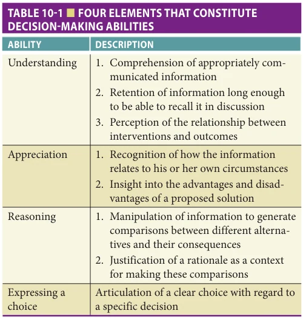

# Hazzard's Geriatric Medicine and Gerontology, 8e - Chapter 10: Assessment of Decisional Capacity and Competencies

Margaret A. Drickamer, Sarah Stoneking

> **Status.** Fast build from the book; not lane-reviewed.

> Not cited in the 2020-2026 past papers.

> **Source and method.** Printed pages 151-156, from the marked 8th-edition copy (PDF page = printed page + 34). Prose follows its text layer; tables and figures are source-page crops. The book is canonical.

**[p. 151]**

## INTRODUCTION

All clinicians should be sufficiently familiar with the principles and processes to manage common situations requiring a judgement of decisional capacity that arise in their practice. The purpose of this chapter is to explain some of the ethical underpinnings to this responsibility, to highlight the strengths and weaknesses of approaches to assess decisional capacity, and to describe the role of the clinician in decision making.

#### Learning Objectives

- To review the elements of decisional capacity.

- To describe ways to determine capacity.

- To understand special instances where knowledge of decisional capacity should be applied.

#### Key Clinical Points

1. There are four necessary elements to making a capable decision: understanding, appreciation, reasoning, and expressing a choice.

2. Critical cortical functions involved in decision making include immediate memory, language, and executive function.

3. Decisional incapacity is task-specific and may be time-limited. Therefore, decisionmaking capacity may fall along a spectrum and the ability of an individual to make decisions often needs to be thought of in flexible terms.

4. An assent-consent model of surrogate decision making is key to decision making in patients who retain the ability to participate in decisions but do not have full decision-making capacity.

Autonomy is defined as self-determination (see also Chapter 72). Respect for individual autonomy is understood to be an elemental principle of western society. Nonetheless, there are limitations on how autonomous each of us is, including, but not limited to, limitation of resources and opportunity, societal and legal prohibitions, and the limits imposed by the rights of others not to have their autonomy infringed upon. We are not just independent rational creatures devoid of context; decision making encompasses emotion, relationships (individual and community), as well as other enriched interpretations of autonomy that will be discussed further in this chapter.

Paternalism is defined as limiting an individual’s autonomy in order either to prevent that individual from doing harm to themselves (or others) or to prevent the person from missing a substantial benefit. The circumstances under which paternalism is acceptable are not defined by the action the individual may wish to undertake, or by the probable untoward consequences of an action, but rather by the individual’s ability to make decisions. In other words, our wish to protect an individual from doing themselves harm does not justify paternalism; we cannot prevent an individual from doing things that may cause them harm (ie, drinking alcohol in excess, hang gliding). We can only justify intervention if we judge that an individual lacks the capacity to make decisions. In such a case, we are responsible for protecting the person and society from the possible harm of a decision made by an individual who lacks the ability to understand the consequences.

This chapter will focus on those individuals who have cognitive impairment or a clouded sensorium (fixed brain lesions, dementia, or delirium) and will not discuss the competence of individuals whose decisional capacity may be impaired by psychiatric illness. When patients

are cognitively impaired, clinicians have an obligation to respect their rights, to protect their persons, and to consider the safety of the public. This often requires careful balancing of conflicting imperatives.

## ELEMENTS OF DECISIONAL CAPACITY

In the broadest sense of the word, for an individual to be competent, that individual must be well qualified to do whatever task they are doing. For decision making,

**[p. 152]**

competence is often viewed as a legal term, that is, a judge’s ruling as to whether an individual has been deemed competent to make their own decisions. An individual adjudicated to be incompetent must have a guardian appointed to make the decisions for the area (or areas) in which the person has been found to be incompetent. Although guidelines vary from state to state, it is generally accepted that a ruling of incompetence cannot be made solely on the basis of a medical diagnosis, age, level of education, or personal eccentricity. An adjudication of competence or incompetence is based on an assessment of the individual’s decisional capacity and that individual’s demonstrated ability or inability to carry out a plan. Therefore, the assessment of decisional capacity should include not just the patient’s cognitive ability, but other factors that may be influencing the process of making a capable decision.

The four elements of making a capable decision are understanding, appreciation, reasoning, and expressing a choice (Table 10-1). First, the individual must be able to comprehend the information being considered sufficiently well to understand the relevant facts. That information must have been presented in a clear and concise manner with special attention taken to ensure that barriers such as hearing impairment, illiteracy, or language difference do not constitute the sole reasons that the person is unable to understand the information. Other issues, such as aphasia, delirium, or depression, may also interfere with the individual’s ability to comprehend and retain information.

Second, the individual must have the conceptual ability to appreciate the consequences of the decision that he or she is making. This includes both an appreciation of the risks and benefits of options and the ability to identify the consequences the decision will have on his or her life.

*TABLE 10-1 ■ FOUR ELEMENTS THAT CONSTITUTE DECISION-MAKING ABILITIES*

*Owner annotations/highlights are from the marked source copy, not the book.*

Beginning and ending a discussion by asking the individual what their understanding of the situation is and what the consequences are of the choice that they have made is an important method of assuring that they were able to comprehend the information and that they appreciate the consequences of the decision they are making.

Individuals must be able to reason, within their own frame of reference, why they are choosing a course of action. This is different from saying that a decision seems “reasonable” or “rational,” but rather it refers to the cognitive processing of values and beliefs in view of the information provided. Even if we feel—and even if most of society would feel—that an individual’s decision is irrational, it does not give us grounds to negate the person’s right to self-determination. Nonetheless, an individual’s ability to give a plausible rationale for his or her decision is sometimes used as secondary evidence of decisional capacity. That is, demonstrating justification for one’s choices (eg, religious belief, personal value, etc.) provides another level of assurance that the patient’s decision rests on intact reasoning, rather than a set of delusional or incoherent beliefs that may exist in the setting of cognitive impairment or psychiatric illness.

Finally, the person must be able to make a choice and communicate the decision. This is the lowest bar for decision-making capacity but one that may be impaired by specific damage in language or frontal lobe function as well as in severe global cognitive impairment.

The inconsistency of an individual’s decision with past decisions made by that person provides a red flag to possible underlying cognitive or psychiatric problems that deserve exploration. But, in and of itself, inconsistency does not negate the person’s right to make decisions. Inconsistency of a specific decision over time may indicate that the individual has had difficulty with remembering or understanding the information provided.

Individuals may choose to forego making their own decision and delegate that responsibility to someone else even though they retain decisional capacity (waiver of informed consent). Their wish to forego hearing medical information or participating in making a choice (the right to delegate informed consent) may rest on individual, family, societal or cultural difference in decision making.

## LEGAL AND PRACTICAL ASPECTS IN DETERMINING DECISIONAL CAPACITY

In protecting an individual who is incapable of making decisions, one action that may become necessary is the application to a local probate court to ask that the individual be adjudicated to be incompetent and to have someone else appointed to make decisions. Although specifics of probate statutes vary among states, most follow a general pattern articulated in the Uniform Probate Code. Once an individual has been adjudicated incompetent, another person is appointed to represent his or her interests. This person is variably referred to as a guardian, conservator,

**[p. 153]**

or legal surrogate. Although there are movements toward “limited guardianship” that restrict the powers of the guardian to decision making in more specific areas where a person has been shown to be incapable, there are two broad categories of guardianship that are commonly used, those of finance and of person. Guardianship of finance is a self-evident term. Guardianship of person grants a more global responsibility for assuring that the individual is kept safe and that decisions are made either as substituted judgment or based on the individual’s best interests (see Chapter 72). These decisions may involve medical care, where a person will live or what help the person will receive to maintain himself or herself.

It should be emphasized that not all incapacitated individuals need to be conserved. There are no statistics available to say how many incapacitated individuals have informal care management by relatives and never require probate action. Personal experience would lead us to believe that most adults with cognitive deficits fall into this category. Probate adjudication of a conservator may not be needed if financial management has been allocated to a family member by a Power of Attorney (POA) prior to the individual becoming incapacitated, and if there is a general agreement among concerned and interested parties that decisions should be made either by a specific individual or group consensus. If the individual involved has granted someone a durable POA for health affairs (see Chapter 26), there may not be a need for court action.

Even when the court has been asked to act, 75% to 85% of the time the court appoints a family member as conservator. The ability of an appointed conservator to act as an appropriate surrogate varies considerably. One advantage of having a court-appointed conservator is that the probate court has some oversight responsibilities for the management of the individual’s affairs. If the need for complex medical decision making does not arise, then the ability of an individual to make those types of decisions is not questioned. If the individual is in a situation where others are managing household affairs and looking out for the person’s needs, then the person’s ability to care for self may not be examined. It is only when a problem arises that the individual’s ability to make these types of decisions becomes an issue.

## PROCESS OF DETERMINING CAPACITY

The clinician’s assessment of an individual’s ability to make decisions is conducted in two different ways; specific testing can measure cognitive dysfunction and observing the person’s decision-making process can demonstrate his or her inability to complete the decision-making task capably. The clinician needs to first understand the cognitive processes involved in decisional capacity. These processes can be understood both as discrete neuropsychiatric functions and as contributors to the holistic process of making decisions.

Cortical functions involved in decision making include immediate memory and language. Immediate

memory is defined as the ability to remember rehearsed or consolidated materials. Language abilities are those that affect comprehension and the ability to produce the intended words when expressing one’s thoughts in both spoken and written communication. The ability to understand language is highly correlated with an individual’s ability to comprehend the information needed to make a decision. Problems with expressive language ability from cortical lesions can lead to statements by the individual that misrepresent his or her thoughts (ie, through misuse of words, word substitutions, or paraphasic errors).

Frontal lobe functions involved in the process of making capable decisions include the abilities to concentrate, express oneself, use abstract reasoning, initiate actions, solve problems, monitor one’s behavior, and use judgment. The frontal lobe is responsible for filtering out both internal and external stimuli that interfere with the individual’s ability to concentrate and to understand instructions or explanations. It helps the individual organize information, apply it to themselves and initiate action as well as to selfmonitor. Frontal lobe problems can interfere with all four steps in decision making; understanding, applying reasoning, and the ability to make a decision.

### Traditional Mental Status Tools

Tools commonly used for the assessment of cognition in patients serve as important triggers to further investigation of the individual’s decisional capacity, but no single cut off score can determine capacity. Looking at performance on individual items and extrapolating to predict how performance will affect the processes necessary for decision making helps the clinician to evaluate a patient. Looking at individual items on these tests and having knowledge of how the cognitive function tested may influence the individual’s ability to make decisions is useful. We recommend tests that look at cortical and frontal lobe function, such as the St Louis University Mental Status (SLUMS) or the Montreal Cognitive Assessment (MoCA). Evaluating the elements of decision making while discussing a decision with the patient and documenting their ability in one’s note will enhance clinician comfort and skill in assessing and addressing decision making. There are more complex neuropsychological tests that can be done to test the same areas of function in more detail that are applied by neuropsychologists or in research.

### Voluntarism, Coercion, and the Context of the Decision Making

The Nuremberg Code of Ethics states that individuals involved “should [have] the power of choice without the intervention of any element of force, fraud, deceit, duress, overreaching, or other ulterior form of constraint or coercion.”

The legal definition of voluntarism is when there is no evidence that the individual was “unduly” influenced by shared values, inducements, persuasion, or force. Clinicians may be required to judge whether they feel that there

**[p. 154]**

is coercion Asking an individual why they are making the decision that they can help to clarify inducements, but the problem of “undue” influence is still a judgement.

Psychologically based influences on decision making include emotional distress, life history, pain and suffering, genuineness, coherence with other life decisions, and experiences of power relationships. Any of these may influence a person in the moment of decision making in ways that can change their decision. Their choice might be different if these issues were to be directly addressed.

Of profound importance is the context of and quality of the interaction during the decision-making process. Components of this interaction include trust, cultural competence, information quality, provider competence, and the quality of communication. These influence the individual’s ability to understand and appreciate the personal impact of information before they can incorporate their own personal and cultural context and come to a decision. For medical decision making there is often a feeling of subtle or sometimes blatant coercion for a specific decision felt to be most appropriate by the medical personnel. There can be feelings of mistrust and poor-quality communication that lead to misunderstandings. Taking a lesson from narrative ethics, clinicians ought to help the patient answer the how and why of where they are with a particular decision and aid the patient in making a decision that resonates with their context and values.

## CAPACITY TO MAKE SPECIFIC DECISIONS

Decisional incapacity is task-specific and may be timelimited. Although one may be adjudicated to be either incompetent or competent in the two broad legal categories of person and finance, the ability of an individual to participate in decisions needs to be thought of in more flexible terms. We will discuss incapacity in matters of person (medical decisions and ability for self-care), finance, wills, advance directives, and research.

### Medical Decisions

Because patients have the right to decline medical interventions and they have the right to be informed before consenting to medical treatments, the need to make a medical decision frequently prompts the first assessment of decisional capacity.

Documentation of a formal cognitive test score is not necessary in most cases; a thoughtful interview with the patient and a written description of the areas in which the patient is unable to function is usually sufficient. It may be helpful to specifically comment on the individual’s ability to understand the condition, the treatment alternatives (including no treatment), and their possible outcomes; demonstrate their appreciation of how they apply this information to their current situation; explain how their reasoning and values have helped them form their thinking; and document their choice.

### Problems of Self-Care

Geriatricians are often confronted with situations where a patient demonstrates an inability to care for self or to accept the help needed to remain be safe in their present environment. To differentiate issues of cognitive impairment versus denial, a formal assessment of decision-making ability may be necessary. A person’s tendency to be “eccentric” is not always easily distinguishable from dangerous behaviors stemming from increasing cognitive impairment and an inability to make decisions around self-care. Gross impairment of cortical function, especially short-term memory, can pose problems for day-to-day function. More subtle, but of high impact, is frontal lobe dysfunction. The inability to plan, initiate action, monitor one’s behavior, and self-correct are essential to being able to care for oneself. A combination of findings on frontal lobe testing and demonstrated inability to care for oneself is often sufficient evidence for action, especially in combination with an inability to accept a level of care that would keep them safe. Patients who demonstrate an inability to perform functions such as organizing their medications or safely preparing meals (IADL functions) and have the need for the help that will obviate these problems (eg, home care, Meals-on-Wheels) may be regarded as having intact decision making with respect to resolving these issues.

A reasonable approach in this scenario would involve a structured assessment where the patient must demonstrate an ability to understand and appreciate a known functional problem; understand and appreciate the practicality, risks, and benefits of potential options; choose an option; and explain how this choice is preferable to the other options not chosen.

### Problems of Finances

There are times when an individual remains able to make medical decisions and decisions related to self-care but is no longer capable of managing finances. When bills are going unpaid or gross mistakes are made in handling money, someone else will need to take over financial management. A demonstrated problem with finances is usually sufficient to warrant supervision, but an occupational therapist or a neuropsychologist can also assess this function. If the individual has enough insight to understand the problem and a reliable person is available to help, granting that person a POA for finances is sufficient. If the incapacitated person is reluctant to relinquish control, or court monitoring is deemed advisable, then the family or other concerned party should seek a guardian of finance.

## OTHER ISSUES OF DECISIONAL CAPACITY AND CONSENT

### Legal Documents

The ability to make a last will and testament is felt to be retained even after the ability to handle finances and make decisions has been lost. An individual’s ability to remember

**[p. 155]**

what he or she is doing with the estate and to express some logic behind choices is usually sufficient evidence of capability.

The ability to grant someone durable POA for health is similar, in that a patient can indicate who they would be best for this and why they have chosen that person. A Living Will, on the other hand, deals with hypothetical situations that can often be hard even for cognitively intact individuals to fully understand and conceptualize. The clinician must also recognize that even very cognitively impaired individuals may still be able to portray wishes and desires (see “Consent Versus Assent”)

### Temporary Loss of Decisional Capacity

Individuals may be transiently incapacitated for decision making or their ability to recover their cognition may not be known, such as when a patient is delirious or has had a recent stroke. In these situations, the clinician should seek an interim solution. An informal surrogate, the person granted durable POA for health affairs, or a temporary guardian can make decisions while the clinician clarifies the prognosis for decisional capacity. The decisions needed during a time of uncertainty should follow the individual’s prior wishes unless they are unknown and then treatment should fall on the side of aggressive protection of the individual’s life or continued function until the person can make his or her wishes known, or the permanence and extent of the impairment becomes clear.

### Consent Versus Assent

Even when an individual is no longer able to give informed consent to a procedure or a change in living situation, he or she should still participate in the decision-making process.

## FURTHER READING

Applebaum PS. Assessment of patient’s competence to

consent to treatment. N Engl J Med. 2007;357:1834–1840. Dunn LB, Nowrangi MA, Palmer BW, Jeste DV, Saks ER. Assess-

ing decisional capacity for clinical research or treatment: a review of instruments. Am J Psychiatry. 2006;163:1323–1334. Dy SM, Tanjala SP. Key concepts relevant to quality of

complex and shared decision-making in health care: a literature review. Soc Sci Med. 2012;74:582–587. Edwards A, Elwyn G, Covey J, Matthews E, Pill R.

Presenting risk information—a review of the effects of “framing” and other manipulations on patient outcomes. J Health Comm. 2001;6:61–82. Holzer JC, Gansler DA, Moczynski NP, et al. Cognitive

functions in the informed consent evaluation process: a pilot study. J Am Acad Psychiatry Law. 1997;25:531–540. Marson DC. Loss of competency in Alzheimer’s disease:

conceptual and psychometric approaches. Int J Law Psychiatry. 2001;24:267–283.

Substituted judgment is the process that a surrogate (legally appointed or informal) is supposed to apply as the basis for a decision. Substituted judgment enjoins one to consider the patient’s prior wishes and long-held beliefs as the basis for one’s decision, “deciding as they would have decided” (see Chapter 72). Assent refers to the impaired individual’s willingness to cooperate with a plan of care. It is, in essence, a way to take into consideration the individual’s present desires when making a decision. In cognitively impaired adults, there is a continuum of incapacity. An individual who is incapable of understanding the complexities of a situation or decision may retain high levels of understanding around specific aspects of the process and be able to express their opinions. Even very cognitively impaired patients can give indications of what brings them pleasure and what gives them pain.

Clinicians obtaining consent for medical treatment or research protocols may wish to use a combination of surrogate consent and patient assent (shared decision making). This may be essential in some cases where the patient’s ability to cooperate will be necessary in order to carry out the treatment or procedure.

### Informed Consent in Research

An individual’s ability to consent to participate in research is complex. Because the risks and benefits of being in a research study are more abstract, decisional capacity must be even greater than that for accepting or declining an established medical treatment. This is an important time for dual decision making as outlined in the earlier section. It is also important to establish the voluntarism of the consent. Asking why an individual is volunteering (or a surrogate is volunteering the individual) for a research protocol is vital.

Montello M. Narrative ethics. Hastings Cent Rep. 2014;44:

S2–S6. O’Connor D, Hall MI, Donnelly M. Assessing capacity

within a context of abuse or neglect. J Elder Abuse Negl. 2009;21:156–159. Peisah C, Sorinmade OA, Mitchell L, Hertogh CM.

Decisional capacity: toward an inclusionary approach. Int Psychogeriatr. 2013;25:1571–1579. Pennington C, Davey K, ter Meulen R, Coulthard E, Kehoe

PG. Tools for testing decision-making capacity in dementia. Age Ageing. 2018;47(6):778–784. Roberts LW. Informed consent and the capacity for volun-

tarism. Am J Psy. 2002;159:705–712. Wendler D, Prasad K. Core safeguards for clinical research

with adults who are unable to consent. Ann Int Med. 2001;135:514–523.

**[p. 156]**
