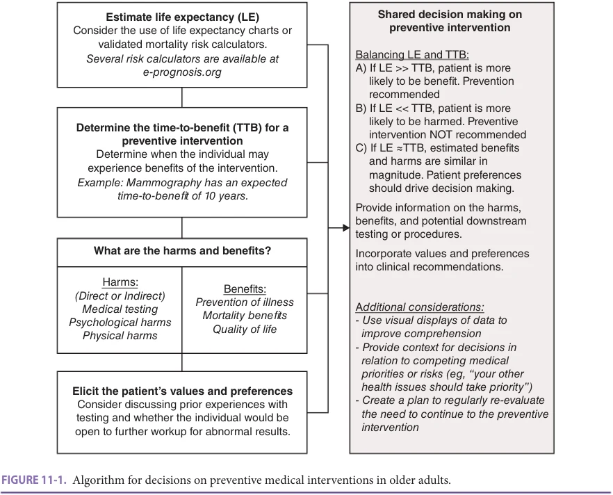
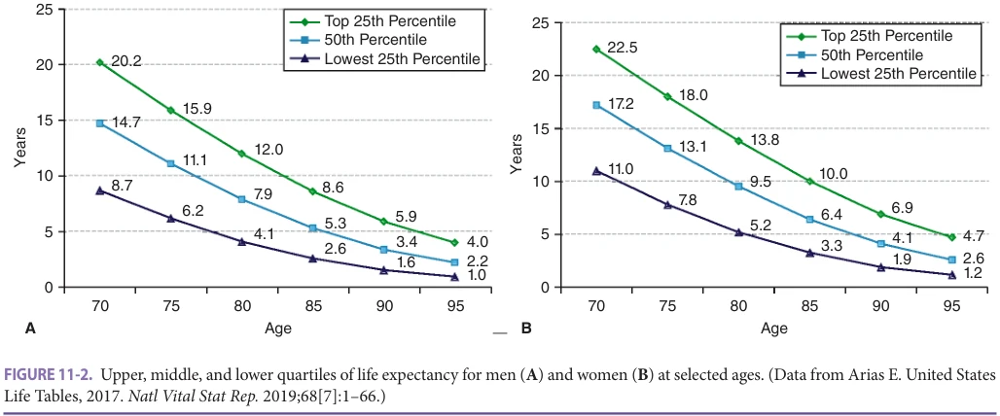
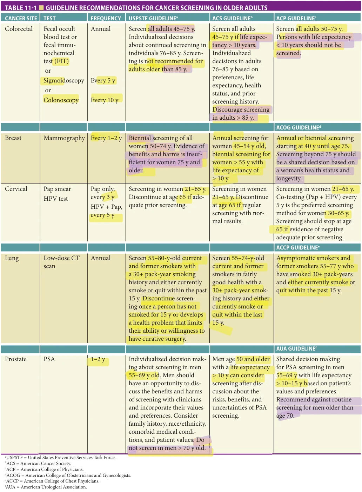
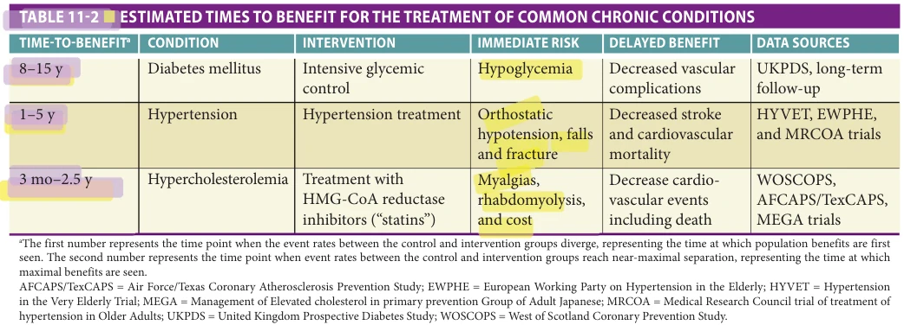
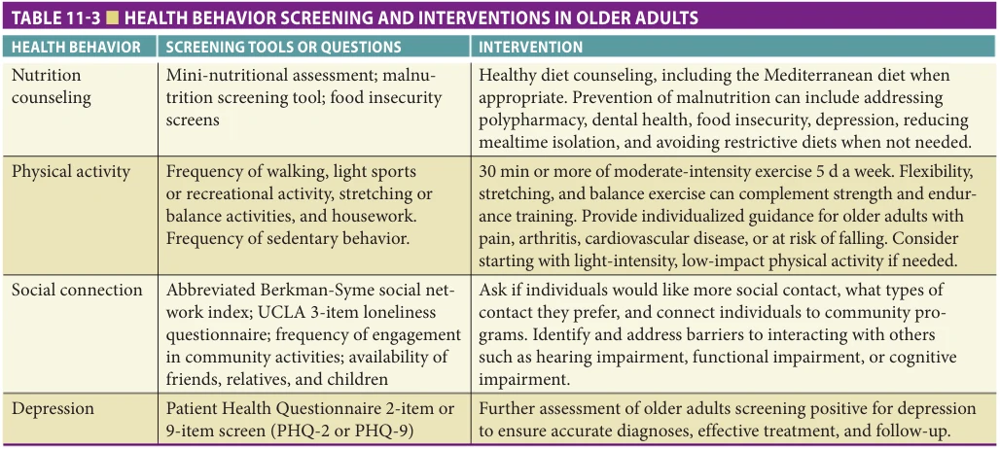

# Hazzard's Geriatric Medicine and Gerontology, 8e - Chapter 11: Prevention and Screening

Ashwin A. Kotwal, Sei J. Lee

> **Status.** Fast build from the book; not lane-reviewed.

> **Source and method.** Printed pages 157-170, from the marked 8th-edition copy (PDF page = printed page + 34). Prose follows its text layer; tables and figures are source-page crops. The book is canonical.

**[p. 157]**

## INTRODUCTION

Prevention and screening hold the promise of maintaining health by intervening before an illness can cause symptoms. Some preventive interventions, such as influenza vaccination, have truly minimal risks and clear public health benefits. However, many other interventions, such as cancer-screening tests, impose risks and burdens on patients, complicating the decision on who should (and should not) receive the intervention. For interventions with minimal risks, targeting is less important since many patients will benefit and few (or none) will be harmed. In contrast, for interventions with some risks or burdens, targeting is critical since some patients may be more likely to be harmed than helped by the preventive intervention.

#### Learning Objectives

- To understand and apply a framework for individualized decision making to preventive medical interventions among older adults, including those with serious illness or residing in skilled nursing facilities.

- To understand the time-to-benefit, overall benefit, and potential harms of breast, prostate, lung, cervical, and colon cancer screening among older adults in the context of current national guidelines.

- To review recommendations for screening for asymptomatic chronic conditions, age-appropriate vaccinations, encouraging healthy behaviors, and counseling against behaviors with adverse health consequences.

#### Key Clinical Points

1. A framework for individualized decision making for preventive medical interventions should include an understanding of patient values and preferences, overall health and life expectancy, the potential harms of the intervention, and the expected time-to-benefit of the intervention.

2. The benefits of cancer screening are uncertain in older adults due to lack of inclusion of adults older than 75 years in the majority of randomized controlled trials. Cancer screening should be primarily considered in older adults with more than 10-year life expectancy after considering the risks and benefits of each test.

3. Treatments for many asymptomatic chronic medical conditions such as hypertension, diabetes, and hyperlipidemia impose immediate risks and burdens on patients with the promise of delayed benefits, and so should only be considered in patients whose life expectancy exceeds the expected time-to-benefit.

In this chapter, the authors will present the evidence for several preventive interventions in older patients. First, the authors will focus on preventive interventions that impose some risks and burdens on patients, starting with a framework for targeting these preventive interventions and then focusing on the benefits and risks for each preventive intervention in greater detail. These interventions include cancer screening as well as treatment for asymptomatic chronic conditions such as hypertension or diabetes. Second, the authors will review the evidence for interventions with minimal risks. These interventions include behavioral and lifestyle modification as well as immunizations.

Screening for geriatric syndromes such as falls and incontinence are discussed in detail in their respective chapters.

## FRAMEWORK FOR INDIVIDUALIZING PREVENTION

One challenge of appropriately targeting prevention in older adults is that few studies of preventive interventions have enrolled persons older than 75 years. The absence of age-specific data requires clinicians to extrapolate data about the benefits and harms of preventive interventions in younger persons and apply it to older persons. Furthermore, even if trials suggest that the effectiveness of a preventive intervention is similar in younger and older populations, challenges remain about how to apply data from trials to an individual older person. Trials show the

**[p. 158]**

4. The risks associated with immunizations, healthy behavior counseling, and counseling against unhealthy behaviors are much lower than the benefits. Thus, targeting is less important and nearly all older adults should receive these preventive medical interventions.

5. Older adults with serious illness, advanced dementia, or those who are residing in skilled nursing facilities have limited life expectancy and are more likely to experience adverse effects from interventions, decreasing the likelihood of net benefit for many preventive interventions. Eliciting patient and family values and preferences can help clinicians align available preventive interventions with the goals of individual patients.

average effectiveness of an intervention, but they generally do not address individual patient characteristics, such as comorbid conditions or functional status, which may change the likelihood of receiving benefit or harm from a

preventive intervention. Given these challenges, the need to individualize prevention and screening decisions is especially important for older people, because individuals become increasingly heterogeneous in their particular combination of health, function, remaining life expectancy, and values with advancing age.

The following framework can help individualize prevention and screening decisions so that patients who are most likely to benefit receive the intervention while patients who are more likely to be harmed avoid the intervention and avoid being harmed, and is summarized in Figure 11-1.

First, estimate life expectancy. By definition, prevention involves an intervention in the present to avoid illness in the future. Many preventive interventions expose patients to risks and burdens immediately for the promise of improved health later. However, older patients with a limited life expectancy may be unlikely to survive to benefit from prevention. For example, finding an asymptomatic cancer in a person who will die of something else before the cancer would become symptomatic does not benefit the person and may cause considerable harm. Thus, the first step in determining whether a preventive intervention may help an older person is to determine their overall life expectancy.

In estimating life expectancy, it is useful to have a general idea of the distribution of life expectancies at

*Figure 11-1. Algorithm for decisions on preventive medical interventions in older adults. Printed p. 158.*

**[p. 159]**

*Figure 11-2. Upper, middle, and lower quartiles of life expectancy for men (A) and women (B) at selected ages. Printed p. 159.*

various ages. For example, when estimating the life expectancy of an 80-year-old woman, it is useful to know that approximately 25% of 80-year-old women will live more than 13 years, 50% will live at least 9 years, and 25% will live 5 years or less. Figure 11-2 presents the upper, middle, and lower quartiles of life expectancy for the US population according to age and sex, and illustrates the substantial variability in life expectancy that exists at each age. Although it is impossible for clinicians to predict the exact life expectancy of an individual person, it is possible to use clinical judgment to make reasonable estimates of whether a person is likely to live substantially longer or shorter than an average person in his/her age cohort. Such estimates, while not perfect, would allow for better estimations of potential benefits and harms of screening than focusing on age alone.

In addition, validated mortality risk calculators may help clinicians estimate the life expectancy of individuals better than clinical judgment alone. A systematic review found 16 general mortality risk calculators that have been developed and validated for older adults, and there are numerous risk calculators specific to life-limiting conditions (eg, cancer, dementia, or severe heart or lung disease). These mortality risk calculators have been gathered at https://eprognosis.ucsf.edu/index.php, allowing users to input a given patient’s data such as age, comorbidities, and functional limitations to obtain an evidence-based estimate of mortality risk and life expectancy.

Second, determine the time-to-benefit for a preventive intervention. For preventive interventions that expose patients to immediate risks or burdens with delayed benefits, the time-to-benefit can be defined as the time between the intervention (when harms are most likely) to the time when improved health outcomes are seen. Just as different interventions have different magnitudes of benefit, different preventive interventions have different times to benefit. Unfortunately, although there are numerous widely

accepted measures of the magnitude of benefit (eg, relative risk, odds ratio, and absolute risk reduction) there are no standardized measures of the time-to-benefit. Studies have focused on answering the questions, “Does it help?” (ie, p < 0.05?) and “How much does it help?” (ie, what is the relative risk reduction), generally ignoring the question, “When does it help?”

Because studies have generally focused on the magnitude of benefit, the time-to-benefit for many preventive interventions is unclear. Survival meta-analyses of screening trials have estimated the time-to-benefit for a few cancer-screening interventions. For preventive interventions where survival meta-analyses have not been conducted, the time-to-benefit can be estimated by reviewing Kaplan-Meier survival curves for the intervention and control groups. The point at which the curves last clearly separate provides a reasonable estimate of the time-to-benefit for a preventive intervention.

Third, review the most likely benefits of prevention. If a patient is likely to live long enough to benefit from a preventive intervention, the next step is to consider the potential benefits. For example, the main benefit of cancer screening is the reduction in cancer mortality experienced by a few people whose early-stage disease is detected and treated, which otherwise would have been lethal during their remaining lifetime. While the impact of cancer screening on quality of life or functional decline has not been studied, there is good evidence that mammography, fecal occult blood testing (FOBT), and Papanicolaou (Pap) smears are effective in reducing cancer-specific mortality. However, the strength of the evidence that these tests are effective in older adults is limited by the small number of older patients included in screening trials. In addition, even screening tests likely to be effective in older populations may not provide survival benefit to individuals with life expectancies that are shorter than the time-to-benefit from screening.

**[p. 160]**

Fourth, review the most likely harms of prevention. Since many preventive tests pose both direct and indirect harms, the potential benefits of interventions, such as cancer screening, must be weighed against the potential harms of screening. Harms that would be accepted to treat a symptomatic person with known disease are less acceptable when they are caused by screening tests, which benefit only a few individuals but expose all screened individuals to the potential harms.

Individuals who are found not to have cancer after work-up of an abnormal screening result (false-positive result) clearly have experienced harm from screening, as they were subjected to physical and psychological distress from additional testing and procedures that would not have been necessary had they not been screened. However, what is often forgotten is that in older persons some of the greatest harms from screening occur by finding and treating cancers that would never have become clinically significant. The risk of identifying an inconsequential cancer (ie, overdiagnosis) increases with decreasing life expectancy as well as with the increasing likelihood that screening will detect certain neoplasms that are unlikely to progress to symptoms in older persons, such as ductal carcinoma in situ (DCIS). Fewer than 25% of DCIS lesions progress to invasive cancer within 5 to 10 years, yet because of the inability to distinguish which lesions will progress, many older women with DCIS will undergo surgery. Women who have surgery for DCIS that would never have become symptomatic in their lifetime have suffered serious harm from screening.

In addition to physical harms, the psychological distress caused by preventive interventions should be considered. For cancer screening, the potential psychological harms range from the emotional pain of a diagnosis of cancer in persons whose lives were not extended by screening, through the alarm of false-positive results to the stress of undergoing the screening test itself. Many older persons may have cognitive, physical, or sensory problems that make screening tests and further work-up particularly difficult, painful, or frightening. Considering factors that increase the likelihood of harm is vital to making appropriate preventive decisions.

Finally, review benefits and harms with each patient, integrating the patient’s values and preferences into the decision. The final step of the framework for individualizing preventive decisions is to assess how individuals value the potential harms and benefits of a preventive intervention and to integrate their preferences into the decision. Because many cancer-screening decisions in older persons will not be answered solely by quantitative assessments of benefits and harms, talking to older persons about their values and preferences is especially important. The value placed on different health outcomes will vary among older people, as will preferences for screening. For example, some women undergoing screening mammography value “peace of mind” after a negative screening result, whereas women with dementia likely receive no such comfort.

In considering the benefits versus harm of screening, clinicians must elicit how individuals value the tradeoffs among longer survival, comfort, and functional status.

Clinicians should consider a person’s usual approach to medical decision making to decide how to approach the discussion of preventive interventions. In some cases, clinicians will need to learn a person’s values, apply them to the known benefits and harms of a preventive intervention, and make a formal recommendation. For other people, the clinician will want to discuss the benefits and harms with the person and allow the person to apply his/her values to the outcomes and come to a decision together. For people with dementia, discussion about preferences should be held with an involved caregiver. However, it should be remembered that despite being unable to articulate consent, many persons with dementia can still effectively communicate refusal. Assent from a person with dementia is essential if invasive or potentially harmful testing or treatments are being considered. If a person with dementia is likely to be frightened or agitated by a preventive test, the caregiver and clinician should forgo the test. Also, for screening tests there should be a general discussion prior to screening about the possible procedures and treatments that may be required after an abnormal screening result. Persons who would not want further workup or treatment of an abnormal result should not be screened.

In summary, the authors recommend estimating patient’s life expectancy and then comparing that life expectancy to the time-to-benefit for a specific preventive intervention. The benefits and harms of prevention, such as cancer screening, should be reviewed to determine whether specific patient factors are present (such as excellent health or cognitive impairment) which suggest that a patient is more likely to benefit or be harmed by screening than the average patient. The benefits and harms should be incorporated into a discussion with the patient regarding his/her values and preferences. If the life expectancy is more than the time-to-benefit, the patient has a substantial chance of benefit and thus a preventive intervention should be encouraged. If the life expectancy is less than the time-to-benefit, the patient is more likely to be harmed than helped by a preventive intervention and thus should not be offered. If the life expectancy approximates the time-to-benefit, a patient’s values and preferences are especially important and should play the dominant role in the decision whether to perform a preventive intervention or not.

## APPLICATION OF SCREENING PRINCIPLES TO SPECIFIC CANCERS

## Breast Cancer

Time-to-benefit for screening mammography A survival meta-analysis of randomized trials of screening mammography suggested that it takes 11 years to prevent 1 breast cancer death after screening 1000 women. Since the rate

**[p. 161]**

of serious complications after screening mammography appears to be approximately 1 in 1000, screening mammography may be most appropriate for women with a life expectancy greater than 10 years. Further, modeling studies suggest it is cost-effective to conduct biennial screening mammography as long as an older woman has a life expectancy of at least 9.5 years.

Benefits of breast cancer screening Mammography is the only screening modality that has been shown in randomized controlled trials to decrease breast cancer mortality. Mammography may detect cancers more frequently and accurately in older women. A pooled meta-analysis of trials demonstrated an overall relative risk reduction in breast cancer-related mortality of 27% for women between the ages of 50 and 69. Only one randomized trial examining mammography included a small number of women age 70 to 74 and found no breast cancer-specific mortality reduction in this age group, and no trials have included women older than 75 years. Consequently, data from trials in younger people must be extrapolated to older people.

Harms of breast cancer screening Among women aged 75 and older who undergo biennial screening mammography, the cumulative probability of a false-positive mammogram over 10 years ranges from 14% to 27% and this risk nearly doubles if women are screened annually. False-positives can cause anxiety and uncomfortable downstream testing such as breast biopsies, which can be distressing to older women with cognitive impairment who do not understand what is being done to them. The risk for overdiagnosis (finding a malignancy in a patient who would never have been affected clinically by the malignancy in the absence of screening) increases with age because life expectancy decreases and there is a higher proportion of slower growing cancers in older women. One study estimated the rates of overdiagnosis to be 12% to 29% for women who stop biennial screening at 74 years, 17% to 41% for women who stop at 80 years, and 32% to 48% for women who stop screening at 90 years. Frail older women are at increased risk for experiencing harms from screening. One study of frail community-living women found that 17% experienced burden from screening mammography as a result of work-up refusals, false-positive results, or overdiagnosis. Women with multiple comorbid conditions are also likely to experience adverse effects from surgery, radiation, and chemotherapy.

Recommendations The US Preventive Services Task Force (USPSTF) recommends mammography every 2 years for women age 50 to 74, stating that the evidence is insufficient to assess the additional benefits and harms of screening in women 75 years and older (Table 11-1). The American Cancer Society recommends annual screening among women 45 to 54 years old, and biennial screening among women 55 years or older and a life expectancy of greater than 10 years. The authors do not recommend screening

for breast cancer if a woman has an estimated life expectancy of less than 10 years. For women who have a life expectancy around 10 years the decision to screen is a close call, and patient preferences should play a major role in the decision to screen. For healthy older women who have a life expectancy greater than 10 years, biennial screening mammography, regardless of age, is a reasonable recommendation based on the data available. Publicly available decision aids and the ePrognosis Cancer Screening guide (http://cancerscreening.eprognosis.org/) compares a patient’s life expectancy with the time-to-benefit for screening mammography to help clinicians determine whether mammography is likely to help a patient.

## Colorectal Cancer

Time-to-benefit for colorectal cancer screening A survival meta-analysis of randomized trials of screening fecal occult blood testing for colorectal cancer suggested that it takes 10 years to prevent 1 colorectal cancer death after screening 1000 persons. Since the rates of serious complications after colorectal cancer screening also appear to be approximately 1 in 1000, colorectal cancer screening may be most appropriate for persons with a life expectancy greater than 10 years. Randomized trials of screening flexible sigmoidoscopy show similar times to benefit. Ongoing trials of screening colonoscopy will provide additional information about whether time to mortality benefit with screening colonoscopy is similar to screening fecal occult blood testing and screening sigmoidoscopy.

Benefits of colorectal cancer screening Methods for screening for colorectal cancer include FOBT, fecal immunochemical testing, flexible sigmoidoscopy, and colonoscopy. Guaiac-based fecal occult blood testing has the strongest evidence for screening efficacy based on three European randomized controlled trials showing reductions in colorectal cancer-specific mortality of 11% to 16%, and a large US trial showing reductions of 22% to 32% overall, and a 53% reduction among adults 70 to 80 years old. Randomized trials of screening sigmoidoscopies every 3 to 5 years suggest similar mortality benefits. Polypectomy during colonoscopies can prevent colorectal cancer in addition to early detection of colorectal cancers.

Harms of colorectal cancer screening Approximately 1 of 10 older adults who submit a screening guaiac-based fecal occult blood testing will have a false-positive result. Colonoscopy is the standard work-up following a positive fecal occult blood testing and may have serious complications, such as perforation (1/1000), serious bleeding (3/1000), cardiorespiratory events (12/1000), and death (1/1000). Complications may be higher if polypectomy is performed or if persons are in poor health. Discomfort from flexible sigmoidoscopy or colonoscopy may occur, and many older persons may experience substantial distress from the bowel preparation, including dizziness, nausea, and fecal incontinence.

**[p. 162]**

*Table 11-1. Guideline recommendations for cancer screening in older adults. Printed p. 162.*

**[p. 163]**

Recommendations The USPSTF recommends colorectal cancer screening for all older adults age 45 to 75 and that screening decisions should be selectively offered to persons 76 to 85 years based on overall health and prior screening history. The American Cancer Society recommends screening begin at age 45, continue until age 75 for individuals with greater than a 10-year life expectancy, individualized decisions for adults age 76 to 85, and screening be discouraged if older than 85. Most guidelines recommend annual screening fecal occult blood testing or fecal immunochemical testing and/or flexible sigmoidoscopy every 5 years or colonoscopy every 10 years for average risk (see Table 11-1). There is no evidence available to determine which screening method is preferable or when screening should stop. However, prior to FOBT or FIT testing, it is important to discuss the risk of false positives and whether individuals would be willing to undergo a colonoscopy if the test returns positive. In addition, individuals should receive information on procedural risks of colonoscopies, sedation, and the need to arrange transportation. The authors recommend against screening for colorectal cancer if a person has an estimated life expectancy of less than 10 years. For persons with life expectancies around 10 years, the decision to screen is a close call, and patient preferences should play a major role in the decision to screen. Notably, colorectal screening may have a larger benefit among older adults if they have never been screened before. For healthy older people who have a life expectancy greater than 10 years, colorectal cancer screening regardless of age, is a reasonable recommendation based on available data. The ePrognosis Cancer Screening guide (http://cancerscreening .eprognosis.org/) compares a patient’s life expectancy with the time-to-benefit for colorectal cancer screening to help clinicians determine whether colorectal cancer screening is likely to help a patient.

## Cervical Cancer

Time-to-benefit for cervical cancer screening A cluster randomized trial of younger women (age 30–59) suggests that cervical cancer screening with HPV testing leads to mortality reductions in 2 to 3 years. In contrast, screening with cervical cytology appears to lead to mortality benefits in 6 to 7 years. There are no data about the time-to-benefit for cervical cancer screening in women 65 years and older. The main consideration for cervical cancer screening is whether an older woman has received screening during her reproductive years because the likelihood an older woman will die of cervical cancer is remote if she has had normal screens in the past. Routine vaccination for human papilloma virus (HPV) strains related to cervical cancer occurrence in younger adults is expected to lower the incidence of cervical cancer in future generations.

Benefits of cervical cancer screening The principal method for screening for cervical cancer is through the use of cervical cytology. Since screening with Pap smears was initiated,

population studies in the United States show a 20% to 60% decline in mortality rates from cervical cancer. Decision models suggest that older women who have had repeated normal Pap smears during their reproductive years do not benefit from continued Pap testing beyond age 65 or 70. However, these models make variable recommendations about the number of normal Pap smears required prior to stopping screening.

Harms of cervical cancer screening False positives are common among older postmenopausal women. In one study of 2561 older women with a normal prior Pap smear, 110 women had an abnormal pap smear within the subsequent 2 years and only 1 was a true positive; the positive predictive value of an abnormal cervical smear is less than 1%. Harms of false-positive results include needless patient concern and invasive procedures, such as colposcopy or biopsy. Discomfort and anxiety during Pap smears also occurs as does the identification and treatment of clinically unimportant cervical lesions given the slow growing nature of cervical cancers and the possibility of regression of lowgrade cervical lesions.

Recommendations Guidelines recommend cervical cancer screening with cytology every 3 years for women age 21 to 65. Combining cytology testing with HPV testing every 5 years may provide added benefit (see Table 11-1). Guidelines recommend that Pap smears be discontinued in women older than age 65 who have had adequate prior screening, defined as three consecutive negative cytology results or two consecutive negative HPV co-tests within 10 years of stopping screening, with the most recent test occurring within 5 years of stopping. The authors recommend cervical cancer screening in women older than age 65 who have not had adequate prior screening and are healthy enough to undergo cervical cancer treatment if cancer is found.

## Lung Cancer Screening

Time-to-benefit for lung cancer screening Two large trials of low-dose lung CT scans show reductions in lung cancerspecific mortality after 6 years. For chest x-rays, one large trial found no lung cancer mortality benefit.

Potential benefits The National Lung Screening Trial (NLST) found that among current and former heavy smokers age 55 to 74, low-dose lung CT scans decreased lung cancer mortality by 20%. Specifically, for 1000 persons screened, 4 lung cancer deaths would be avoided in 6 years. The Dutch-Belgian Lung Cancer Screening (NELSON) Trial of low-dose lung CT scans among current and former heavy smokers found a 24% reduction in lung cancer– specific mortality at 10-year follow-up, and 3.3 lung cancer deaths avoided per 1000 participants.

Potential harms False positives are common with lowdose CT scans of the lung; in one trial 39% of people who received a CT scan had at least 1 positive test result and 96% of positive results were false positives. False positives

**[p. 164]**

may lead to unnecessary invasive testing, including surgical procedures and biopsies. Complications after invasive lung procedures may occur in 1 in 5 older adults, and rates may be higher for older adults in worse health compared to those who are younger or healthier. Reported rates of overdiagnosis range from 3% to 9%, although this is an active area of study. Additional harms include anxiety from false-positive results, frequent need for follow-up and repeat imaging, financial strain, and radiation exposure.

Recommendations The American Cancer Society and USPSTF recommend annual low-dose CT scans for lung cancer screening in adults 55 to 74 years old (or up to 80 in USPSTF guidelines) who have a 30-pack-year history and currently smoke or quit within the last 15 years. Guidelines suggest avoiding screening in older adults with a short life expectancy (< 10 years) or comorbidities that would make curative surgery or cancer-directed therapies not a reasonable option (see Table 11-1). The authors recommend lowdose CT scans when older adults are at high risk of lung cancer, are current or former heavy smokers, and have a low risk of a competing cause of death. Older adults considering screening should be counseled on the possibility of false positive results (including in the thyroid and other organs), potential downstream interventions, and the need for frequent follow-up for nodule tracking.

Prostate Cancer Screening Although prostate-specific antigen (PSA) testing is frequently performed, there is conflicting evidence and guidelines regarding the benefits and harms of PSA testing. The mortality benefit is small and takes over 10 years to be realized. In contrast the harms from testing can include anxiety, unneeded prostate biopsies (associated with hematuria, pain, and infections), and overdiagnosis and unnecessary treatments of screen-detected cancers (associated with urinary incontinence, sexual dysfunction, and premature death). The USPSTF and American Cancer Society recommend that men age 55 to 69 make an individualized decision about PSA screening after discussion with a clinician

and consideration of life expectancy (typically greater than 10–15 years), and recommend against screening in men older than 70 years old (see Table 11-1). The authors do not recommend routine screening for prostate cancer in older men based on the available evidence.

## TARGETING TREATMENT FOR ASYMPTOMATIC CHRONIC CONDITIONS

Treatment of asymptomatic chronic conditions such as hypertension and diabetes also impose immediate risks and burdens on patients for the promise of delayed benefits. More intensive glycemic control appears to decrease the risk of microvascular complications many years later. However, more intensive glycemic control clearly increases the risk for serious hypoglycemia immediately. Similarly, improved blood pressure control appears to decrease the risk of heart failure and stroke. However, initiating antihypertensive medications appears to increase the risk of hip fracture in the first 45 days. Thus, for asymptomatic chronic conditions, the risks and burdens of treatment often occur immediately while the benefits are not observed for years. This suggests that treatment for asymptomatic conditions can also be viewed as prevention, and should be targeted toward patients with an extended life expectancy who have a reasonable chance of benefiting from the delayed benefits.

Unfortunately, there is tremendous uncertainty surrounding the time-to-benefit for various interventions. Long-term follow up studies of more intensive glycemic control suggests that it take 8 to 15 years for the clinical benefits to be seen (Table 11-2). Studies of more intensive blood pressure control suggests that it take 1 to 3 years for clinical benefits to be seen. For HMG-CoA Reductase inhibitors (“statins”), the time-to-benefit appears to be dependent on clinical situation, with nearly immediate (< 3 months) benefit in patients with recent myocardial infarction and increasing to several years for primary prevention of major adverse cardiovascular events (see Table 11-2).

*Table 11-2. Estimated times to benefit for the treatment of common chronic conditions. Printed p. 164.*

**[p. 165]**

In summary, treatments for many asymptomatic chronic medical conditions impose immediate risks and burdens on patients with the promise of delayed benefits. Thus, the framework of individualizing prevention also applies to the treatment of these asymptomatic conditions, and treatment of these asymptomatic conditions should be targeted to those older adults whose life expectancy exceeds the time-to-benefit.

## IMMUNIZATIONS

In contrast to screening interventions, the risks associated with immunizations are much lower than the benefits. Thus, targeting is less important and nearly all older adults should receive the pneumococcal vaccination, annual influenza vaccination, and zoster vaccination.

Pneumococcal Vaccination Pneumococcal infections represent a major cause of morbidity and mortality in older adults. The US Advisory Council on Immunization Practices (ACIP) recommends all adults older than age 65 sequentially receive both the Pneumococcal Conjugate Vaccine (PCV13) followed in 6 to 12 months by the Pneumococcal Polysaccharide Vaccine (PPSV23). Minor local reactions such as pain or erythema are common with both vaccines; more serious side effects are rare. The ACIP also recommends pneumococcal vaccination for adults younger than 65 who have certain risk factors such as cigarette smoking, diabetes mellitus, or chronic lung disease.

Influenza Vaccination The influenza virus causes annual epidemics of acute respiratory illnesses every winter that disproportionately affects older adults. Vaccination has been shown to decrease the morbidity and mortality associated with influenza and is recommended for all persons older than 6 months. There is some evidence that a high-dose influenza vaccine may be more effective in eliciting immunogenic response in adults older than age 65. The most common adverse events include local soreness. The risk of Guillain-Barre syndrome after influenza vaccination appears small, with estimates of 1 to 2 excess cases per 1 million persons vaccinated.

Tetanus/Diphtheria/Pertussis Tetanus is cause by the neurotoxin expressed by Clostridium tetani when the ubiquitous bacteria spores are inoculated into tissues with trauma or deep puncture wounds. Tetanus toxoid vaccine is effective, but waning immunity has led to the large proportion of cases to occur in adults older than 60 years. Diphtheria is a rare, acute respiratory illness caused by a toxin expressed by Corynebacterium diphtheria. National serosurvey between 1988 to 1994 suggested that only 30% of adults age 60 to 69 had appropriate diphtheria antitoxin concentrations. ACIP recommends tetanus/diphtheria (Td) or Tdap revaccination every 10 years for all older adults.

Pertussis or whooping cough is a highly contagious respiratory illness that is underdiagnosed and underreported, especially in older adults. Studies suggest that acellular pertussis vaccination is equally effective among older adults as younger adults with similar low rates of adverse events and high rates of pertussis antibodies. ACIP recommends a onetime booster dose of pertussis vaccination after age 65.

In summary, the ACIP recommends that all adults receive Td (tetanus/diphtheria) or Tdap booster every 10 years. In addition, adults older than age 65 should receive a one-time dose of Tdap (tetanus/diphtheria/acellular pertussis) if they have not received pertussis revaccination after age 19 in lieu of Td vaccination.

Zoster Vaccination Reactivation of herpes zoster is common (30% lifetime risk) and can result in significant morbidity from complications such as postherpetic neuralgia and ophthalmic zoster. The two-dose recombinant zoster vaccination (RZV) appears to be quite effective in persons 70 years or older, with an efficacy for prevention of herpes zoster of 91% and prevention of postherpetic neuralgia of 91%. In comparison, the one-dose live zoster vaccine (ZVL) has an efficacy of 38% among adults 70 years or older and prevention of postherpetic neuralgia of 67% (0.1% vaccine vs 0.4% control). The most common adverse reactions to zoster vaccinations are local injection site reactions (9% in RZV and 1% in ZVL); serious adverse reactions are rare. The ACIP recommends the two-dose RZV vaccination for adults age 50 and older, including those who have previously received the ZVL vaccination. The ZVL remains a recommended vaccine in adults age 60 or older.

## BEHAVIORS TO MAINTAIN HEALTH

Like immunization, healthy behaviors have few, if any, adverse outcomes, meaning that they can be recommended to nearly all older adults. However, unlike immunizations which are initiated and provided by the health care system, healthy behaviors require a personal commitment from individual patients. While the advice and encouragement from health care professionals are important, the effectiveness of any behavioral modification requires the individual patient to accept primary responsibility for initiating and maintaining healthy behaviors. A summary of recommendations in healthy behavior counseling for older adults is included in Table 11-3.

Nutrition A healthy diet can contribute to an increase in life expectancy, better health, and quality of life as meals can be a source of pleasure and social engagement. Healthy diets have shown the potential to lower blood pressure and blood cholesterol. Optimal diets have also been associated with lower risk of chronic diseases, notably CAD, diabetes, obesity, and some forms of cancer. National Health and

**[p. 166]**

*Table 11-3. Health behavior screening and interventions in older adults. Printed p. 166.*

Nutrition Examination Survey (NHANES) III data show potentially important decreases with age in median protein and zinc intakes as well as intakes of calcium, vitamin E, and other nutrients. Malnutrition can often be undetected and subclinical nutrient deficiencies can adversely affect health and physical functioning. Screening for nutritional status should therefore occur routinely and include measuring body weight, weight loss, and considering screening tools such as the Mini Nutritional Assessment (MNA) or Malnutrition Screening Tool (MST).

Older adults can be counseled on the traditional Mediterranean diet, dominated by consumption of olive oil, vegetables, nuts, and fruits, which meets criteria for a healthy diet and is associated with prevention of progression of cardiovascular disease and reversal of the metabolic syndrome. Either antioxidants or fiber may affect a reduction in the transient oxidative stress associated with macronutrient intake. Prevention of malnutrition may require addressing polypharmacy or medications that can contribute to changes in taste or anorexia, monitoring dental health, addressing food insecurity, addressing depression, reducing isolation at mealtimes, and avoiding unnecessarily restricted diets (limiting salt, fat, or sugar), which can contribute to inadequate eating. The latest edition of Nutrition and Your Health: Dietary Guidelines for Americans, available online at http://www.health.gov/dietaryguidelines/, can serve as a reference for providers in counseling adults about healthful eating patterns.

Physical Activity Physical activity and physical fitness can help prevent or delay the onset of chronic illnesses such as CAD, type II diabetes, osteoporosis, obesity, and cognitive impairment; protect against the development of functional decline; improve mood; reduce stress; and, perhaps, increase life expectancy. Physical activities that improve endurance,

strength, and flexibility will delay impairments in mobility and may preserve the ability to perform tasks of daily living. Regular, moderate-intensity physical activity increases muscle mass and oxidative capacity, improves immune function, increases antioxidant defense against oxygen free radicals, and reduces oxidative stress. The current recommendation that every American exercise at least 30 minutes on most, and preferably all days, derives from evidence that even moderate physical activity is associated with a substantial drop in all-cause mortality. The cumulative, lifetime activity pattern may be the most influential factor in terms of providing protection from most diseases, especially those with a long developmental period, as well as mediating secondary disease complications associated with CAD, diabetes, and hypertension. The benefits of physical activity appears to outweigh the risks for nearly all older adults, including older adults at high risk for falling. For older adults with joint pain, arthritis, or cardiovascular disease, individualized guidance from clinicians may help patients to safely start a physical activity regimen.

Despite an enormous amount of information about the positive effects of exercise in preventing disease and increasing life expectancy, the majority of adults do not engage in regular, sufficient physical activity. Furthermore, aging appears to be associated with a rise in the prevalence of inactivity, especially among women, such that by age 75, one in three men and one in two women engage in no regular physical activity. Societal changes over the past 50 years, including increased dependence on cars for transportation, the advent of television and computers, and rise in number of desk jobs, have virtually engineered physical activity out of the daily routines of many Americans. Thus, encouraging and prescribing physical activity for adults of all ages is imperative and can be viewed as a central tenet of preventive gerontology.

**[p. 167]**

Individualized activity plans should be considered in all older adults. Regular participation in activities of moderate intensity (such as brisk walking, climbing stairs, scrubbing floors, yard work), which increase caloric expenditure and maintain muscle strength, is recommended, as it is activity of moderate intensity that appears to allow health benefits to accrue. Current national guidelines suggest at least 30 minutes of moderate-intensity exercise on 5 or more days per week (Centers for Disease Control and Prevention [CDC]) or vigorous-intensity exercise (such as swimming laps, bicycling more than 10 miles per hour, jogging, or running) for 20 or more minutes on 3 or more days per week. The CDC, American College of Sports Medicine, and Surgeon General further state that daily physical activity requirements may be accumulated over the course of the day in short bouts of 10 to 15 minutes. The authors recommend that older adults who are unable to participate in moderate-intensity exercise should be started on light-intensity, low-impact exercise (eg, 5–10 minutes) with gradual progression over time. Flexibility, stretching, and balance exercise should be additionally considered to complement strength and endurance training. Helpful, patientcentered information about how to become more active can be found at the CDC’s Physical Activity for Everyone (http://www.cdc.gov/physicalactivity/).

Several psychological and environmental factors determine physical activity behavior throughout the life span. Self-efficacy, or confidence in one’s ability to perform a particular behavior (in this case, regular exercise), is strongly associated with both adoption of and adherence to physical activity among adolescents, young adults, and older adults. Strategies suggested to enhance self-efficacy, such as assessing readiness for exercise using a behavior change philosophy, using motivational interviewing techniques, weekly action planning and feedback, collaborative problemsolving, and addressing barriers to exercise may all enhance self-efficacy for exercise. These techniques can be learned and implemented by health care providers. Affective disorders such as depression and anxiety are inversely associated with physical activity participation at any age. Thus, evaluation for the presence of these conditions and institution of treatment may be necessary before adoption of an exercise program can occur. Social influences on physical activity appear to be strong throughout the life span. Peer reinforcement is particularly important in youth, while social support from spouses, friends, and community organizations (eg, Silver Sneakers program) is correlated with vigorous activity in younger and older adult populations. Finally, environmental factors, particularly safety and accessibility, influence activity participation across the age span. These latter factors are increasingly becoming a focus of community intervention efforts.

Social Connection Ongoing involvement in a social network permits social contact (integration), the provision of social support, and

the opportunity for social influence, and is associated with positive health outcomes and self-assessed well-being. Through opportunities for social engagement, such as attending social functions, getting together with friends and family, and going to church, meaningful social roles are defined and reinforced, creating a sense of belonging and identity. Measures of social integration or “connectedness” are powerful predictors of mortality likely because ties give meaning to an individual’s life by enabling and obligating them to be fully involved in their community and thereby to feel attached to it. Social connections have been further linked to reduced risks of cognitive impairment.

There are several pathways by which social networks are thought to influence health: (1) a health behavioral pathway; (2) a psychological pathway; and (3) a physiologic pathway. Regarding the health behavioral pathway, social ties have been shown to influence the likelihood that certain behaviors will be adopted and that behavior will change (see also Chapters 4 and 25). For example, marriage and friendship ties have been shown in several studies to promote a healthier diet, more regular exercise, less smoking and drinking, and more cancer screening. Notably, not all social ties are positive, and some can negatively impact health, for example, the presence of a smoker in one’s social network has been associated with greater relapse in efforts to quit and family members can be involved in emotional, physical, or financial elder mistreatment. A second mechanism by which social networks influence health is via psychological pathways. Loneliness is the emotional distress that arises from a perception that one’s social relationships are inadequate. Loneliness has been independently linked to psychological distress, physical symptoms such as pain, and mortality. In addition, social ties can provide emotional support to protect against depression or anxiety, moral support in a crisis, or reduce day-to-day stress through social connection (eg, calling a friend about an odd symptom to get advice). Just knowing one has support to call on in times of need can reduce stress. A third mechanism by which social networks influence health is via physiologic pathways. Social relationships may influence health via effects on the hypothalamic–pituitary–adrenal axis, altering immune responses and cardiovascular reactivity. For example, a low number of contacts with acquaintances is associated with high resting plasma levels of epinephrine, and people with low social support have been found to have higher levels of urinary norepinephrine, regardless of their level of stress.

The authors recommend that clinicians should ask individuals about their social connections and if they feel lonely. Clinicians can directly address social needs by asking if individuals would like more social contact, what types of contact they prefer, and connecting individuals to programs to enhance social connections or support. Clinicians can facilitate social connections by identifying and addressing barriers to interacting with others such as hearing impairment, functional impairment, or cognitive impairment. Preventive strategies that encourage maintaining or

**[p. 168]**

enhancing existing relationships may in certain cases be more effective than trying to develop new relationships when an individual is already isolated or lonely.

Depression Depression in older adults is common, underdiagnosed, and often inadequately treated. Rates of depression vary according to the diagnostic criteria used, but 2% of adults older than age 55 meet criteria for major depression while 14% report depressive symptoms. Most depression is recognized and treated in primary care; however, studies suggest that depression is often undiagnosed. Further, depression treatment has been shown to improve outcomes. The USPSTF recommends screening adults for depression in clinical practices that have systems in place to ensure accurate diagnosis, effective treatment, and follow-up.

## BEHAVIORS WITH ADVERSE HEALTH CONSEQUENCES

Tobacco Use Tobacco use is the largest single preventable cause of illness and premature deaths in the United States. Illnesses related to tobacco use (coronary artery disease [CAD]; cancers of the lung, larynx, oral cavity, esophagus, pancreas, and urinary bladder; stroke and chronic obstructive pulmonary disease) account for one in every five deaths in the United States. Evidence from NHANES indicates that tobacco use predicts shorter survival time for middle-aged (45–54 years) and older (65–74 years) men. Tobacco use can also multiply the risk associated with other carcinogenic agents; for example, heavy alcohol consumption, associated with esophageal cancer, carries an even greater risk when combined with cigarette smoking.

Tobacco dependence should be viewed as a chronic condition requiring ongoing assessment and repeated intervention. However, effective treatments are available that can lead to long-term, and in some cases, permanent abstinence. Studies have shown that individuals at any age can benefit from quitting the tobacco habit. Benefits include reduction in the risk of CAD, malignancy, stroke, and even hearing loss, along with improved pulmonary function, arterial circulation, and pulmonary perfusion.

Studies have found that only about 35% of adults are routinely asked about their tobacco habits or counseled to quit if they use tobacco. If providers do advise patients not to use tobacco, as many as 25% will quit or reduce the amount they use. Thus, providers should ask all patients at each clinic visit about tobacco use and advise all tobacco users about the importance of quitting, emphasizing factors that have been found to contribute most to successful attempts to quit: health concerns (symptoms); a desire to set an example for children; the expense of the habit; odor of breath, home, and clothing; and loss of taste for food. Providers should then assess a patient’s willingness to attempt to quit. Patients who are unwilling to attempt to

quit should be provided with a brief intervention designed to increase their motivation to quit.

Patients who are willing to quit should be provided with treatments that have been identified as effective. Firstline pharmacotherapies that have been shown to increase smoking cessation include nicotine replacement (gum, inhaler, nasal spray, or patch), varenicline, and bupropion. Varenicline and bupropion appear to lead to increased rates of neuropsychiatric side effects including suicidal ideation. Thus, patients started on either medication should be monitored for neuropsychiatric symptoms including changes in behavior, agitation, depressed mood, hostility, and suicidal ideation.

Alcohol Epidemiological studies support a survival benefit associated with moderate (up to two 8-ounce drinks per day) alcohol consumption, primarily through reduction of cardiovascular risk, including elevation of high-density lipoprotein (HDL) cholesterol. Although initial studies suggested that red wine may be especially beneficial, more recent studies suggest that the type of alcohol is not as important as the amount of alcohol intake and the pattern of use.

However, consumption of alcohol beyond a moderate level can induce adverse effects on every organ system, including increased risk of hypertension; breast, colon, esophageal, liver, and head and neck cancer; cirrhosis; gastrointestinal bleeding; pancreatitis; cardiomyopathy; seizures; cerebellar degeneration; peripheral neuropathy; cognitive dysfunction; insomnia; depression; and suicide. Nearly 15% of adults older than age 65 drink more than the recommended moderate level (> 7 drinks/week or binge-drinking). Counseling about problem drinking following a few screening questions is a high-impact, cost-effective intervention. Screening can be accomplished by taking a careful history of alcohol use or by using a standardized screening questionnaire. All adults should be counseled on the health risks associated with excess alcohol consumption as well as the risk of injury (ie, motor vehicle crashes or other equipment-related injury) after drinking alcohol. Nondependent heavy drinkers as well as those with alcoholism (a chronic illness involving a state of dependency) should be counseled about the benefits of decreasing alcohol intake. Brief counseling by primary care providers can result in a significant reduction in alcohol use. Dependent drinkers should be referred to formal alcohol treatment programs and considered for a trial of naltrexone, an opioid antagonist that reduces the pleasurable effects of alcohol and may reduce relapse to heavy drinking.

Obesity In adults, obesity is defined as a body mass index (BMI) of 30 kg/m2 or more; overweight is a BMI of 25 to 30 kg/m2 or more. Research suggests that although obesity and underweight are associated with increased mortality, being overweight (BMI 25–30) is not associated with increased mortality at any age. Further, increasing evidence suggests

**[p. 169]**

that being obese may not be as dangerous for older adults as younger adults. NHANES data suggest that for adults age 25 to 59, BMI more than 35 compared to BMI 19 to 25 nearly doubles the risk of all-cause mortality with a relative risk of 1.8. In contrast, for adults older than age 70, the all-cause mortality risk with BMI more than 35 is not statistically different from BMI 19 to 25 with a relative risk of 1.2. In fact, for adults older than age 70, being underweight (BMI < 19) was associated with higher mortality than being obese (BMI > 35). Thus, the optimal BMI for older adults appears to be slightly higher than the optimal BMI for younger adults.

For older adults, obesity is also a risk factor for impaired mobility and other functional limitations, disabling conditions such as osteoarthritis; sleep apnea; gallbladder disease; nonalcoholic fatty liver disease; and cancers of the breast, endometrium, and colon. Moreover, those who are obese may suffer from social stigmatization, impaired social interaction, depression, and low self-esteem. Thus, regardless of the relationship between obesity and mortality in older adults, counseling obese patients to lose weight is likely to be beneficial.

Because treatment and reversal of obesity is challenging, primary prevention is warranted. Efforts to maintain a healthy weight should start early in life and continue throughout adulthood, as this is likely to be more successful than efforts to lose substantial amounts of weight and maintain weight loss once obesity has developed. Data from NHANES I suggest that getting adequate rest may be important in obesity prevention. Sleeping less than 7 hours a night was shown to be a risk factor for subsequent obesity. This may be related to altered levels of leptin and ghrelin, two appetite-regulating hormones. Leptin is associated with appetite suppression and ghrelin is an appetite stimulant that is thought to play a role in long-term regulation of body weight. During sleep deprivation, leptin levels fall and ghrelin levels rise.

Adults who are trying to maintain a healthy weight after weight loss are advised to get even more physical activity than the 30 min/d (described above) that is currently recommended; the US Department of Agriculture has recommended at least 60 min/d to manage weight. Weight management leading to a slow, steady weight loss is more beneficial that a pattern of weight cycling, which actually contributes to an elevated risk of mortality. The basal metabolic rate decreases with age, in parallel with a decline in lean body mass, and body fat increases proportionally. Thus, in order to most readily achieve normalization of body weight and body composition, an energy-sufficient (but not excessive) diet should be combined with a program of regular physical activity to permit maintenance of basal metabolic rate.

Recreational Drugs The prevalence of injection drug use among older adults is unknown. Injection drug users typically initiate injection drug use during late adolescence (younger than age 21);

however, a sizable subgroup begins injecting during early and late adulthood. Persons with a history of recreational drug use on only one or a few occasions are unlikely to self-identify; thus, clinicians should probe for such a pattern of usage.

Noninjection drug use (crack smokers, methamphetamine, intranasal heroin, or cocaine, etc.) contributes to development of gastroduodenal ulcers, chest pain and myocardial infarction, and increased risk of death. Higher levels of drug involvement also were associated with increased age-adjusted mortality. The normalization of recreation drug use through marijuana legalization laws and the aging of the baby boomer generation, which has had greater experience with recreational drugs, are widely expected to increase the rates of recreational drug use in older adults.

Prescription Drug Misuse Prescription drug misuse is poorly described in the medical literature but is currently a more prevalent problem than illicit drug use among older adults. Misuse of prescription medications may be related to insomnia, chronic pain, depression, and anxiety. The potential misuse of benzodiazepines is well recognized and has led to prescribing recommendations that suggest only short-term use and use only for intended indications. Amphetamine-like stimulants have abuse potential, but addiction to these drugs is seldom documented. Other medications that are often misused are sedative hypnotics, opioid analgesics, and barbiturates. Chronic use of such agents may lead to physical dependency and the development of withdrawal symptoms with attempts to discontinue use. Treatment may require detoxification followed by rehabilitation.

## PREVENTION AMONG NURSING HOME OR SERIOUSLY ILL POPULATIONS

The majority of older adults residing in nursing homes have significant physical impairments, with over half requiring assistance in toileting, bathing, and/or transferring. Nearly half have a diagnosis of Alzheimer disease or other dementias, and more than half receive 9 or more routine medications. Consequently, preventive medical interventions should carefully consider (1) the time-to-benefit of each intervention as life expectancy may be limited, (2) shortterm harms, and (3) how to prioritize competing medical needs. In this respect, the framework for preventive care in most nursing home residents is analogous to the framework for preventive care for palliative care patients with serious, life-limiting illness (eg, cancer, end-organ failure, or neurodegenerative diseases).

In these populations, clinicians should consider early on whether screening tests might require downstream invasive testing for positive tests, and if individuals would be willing and able to undergo such testing. Seemingly simple testing or additional clinical visits may be overly

**[p. 170]**

burdensome to patients already managing multiple medical conditions. Moreover, individuals with dementia and their family members require careful counseling and consent prior to testing. Medications for asymptomatic conditions should be regularly reevaluated to determine if deprescribing is appropriate (eg, de-intensifying glycemic control). Behavioral counseling might involve managing expectations about reasonable goals, for example, with maintaining moderate physical activity or community engagement. Moreover,

## FURTHER READING

Advisory Committee on Immunization Practices. Vaccine

recommendations of the ACIP. http://www.cdc.gov/ vaccines/hcp/acip-recs/index.html. Accessed Feb 15, 2021. American Cancer Society. Guidelines for the early

detection of cancer. https://www.cancer.org/healthy/ find-cancer-early/cancer-screening-guidelines/americancancer-society-guidelines-for-the-early-detection-ofcancer.html. Accessed Feb 15, 2021. Artaud F, Dugravot A, Sabia S, Singh-Manoux A,

Tzourio C, Elbaz A. Unhealthy behaviours and disability in older adults: three-city Dijon cohort study. BMJ. 2013; 347:f4240. Berkman LF, Kawachi I. Social Epidemiology. New York,

NY: Oxford University Press; 2000. Burns DM. Cigarette smoking among the elderly: disease

consequences and the benefits of cessation. Am J Health Promot. 2000;14(6):357–361. de Koning HJ, van der Aalst CM, de Jong PA, et al. Reduced

lung-cancer mortality with volume CT screening in a randomized trial. N Engl J Med. 2020;382(6):503–513. DiPietro L. Physical activity in aging: changes in patterns

and their relationship to health and function. J Gerontol A Biol Sci Med Sci. 2001;56 Spec No 2:13–22. Flegal KM, Graubard BI, Williamson DF, Gail MH. Excess

deaths associated with underweight, overweight and obesity. JAMA. 2005;293(15):1861–1867. King AC, Guralnik JM. Maximizing the potential of an

aging population. JAMA. 2010;304(17):1944–1945. Lee SJ, Boscardin WJ, Stijacic-Cenzer I, Conell-Price J,

O’Brien S, Walter LC. Time lag to benefit after screening for breast and colorectal cancer: meta-analysis of survival data from the United States, Sweden, United Kingdom and Denmark. BMJ. 2013;346:e8441. Nelson ME, Rejeski WJ, Blair SN, et al. Physical activity and

public health in older adults: Recommendations from the American College of Sports Medicine and American Heart Association. Circulation. 2007;116(9):1094–1105. Nichol KL, Nordin JD, Nelson DB, Mullooly JP, Hak E. Effec-

tiveness of influenza vaccine in the community-dwelling elderly. N Engl J Med. 2007;357(14):1373–1381.

serious illness and multimorbidity may themselves lead to unavoidable changes in health behaviors. For example, dementia can lead to the loss of interest in eating and malnutrition, and so families should be provided anticipatory guidance on what can be “prevented” and what may be expected as part of the disease trajectory. In general, eliciting patient and family values and preferences can help clinicians align available preventive interventions with the goals of individual patients.

Rollnick S, Mason P, Butler C. Health Behavior

Change: A Guide for Practitioners. Philadelphia, PA: Churchill Livingstone; 1999. Schoen RE, Pinsky PF, Weissfeld JL, et al. Colorectal-cancer

incidence and mortality with screening flexible sigmoidoscopy. N Engl J Med. 2012;366(25):2345–2357. Schonberg MA, Hamel MB, Davis RB, et al. Development

and evaluation of a decision aid on mammography screening for women 75 years and older. JAMA Intern Med. 2014;174(3):417–424. Shaukat A, Mongin SJ, Geisser MS, et al. Long-term

mortality after screening for colorectal cancer. N Engl J Med. 2013;369(12):1106–1114. US Preventive Services Task Force. Recommendations

for Primary Care Practice. October 2014. http://www .uspreventiveservicestaskforce.org/Page/Name/ recommendations. Accessed Jan 27, 2015. Van Ravesteyn NT, Stout NK, Schechter CB, et al. Benefits

and harms of mammography screening after age 74 years: model estimates of overdiagnosis. J Natl Cancer Inst. 2015;107(7):djv103. Walter LC, Covinsky KE. Cancer screening in elderly

patients: a framework for individualized decision making. JAMA. 2001;285(21):2750–2756. Walter LC, Lewis CL, Barton MB. Screening for colorectal,

breast and cervical cancer in the elderly: a review of the evidence. Am J Med. 2005;118(10):1078–1086. Welch HG. Should I be Tested for Cancer? Maybe Not and Here’s

Why. Berkeley, CA: University of California Press; 2004. Wiener RS, Schwartz LM, Woloshin S, Welch HG.

Population-based risk for complications after transthoracic needle lung biopsy of a pulmonary nodule: an analysis of discharge records. Ann Intern Med. 2011;155(3): 137–144. Wilson SR, Knowles SB, Huang Q, Fink A. The prevalence

of harmful and hazardous alcohol consumption in older U.S. adults. JGIM. 2014;29(2):312–319. Zauber AG, Winawer SJ, O’Brien MJ, et al. Colonoscopic

polypectomy and long-term prevention of colorectalcancer deaths. N Engl J Med. 2012;366:687–696.
