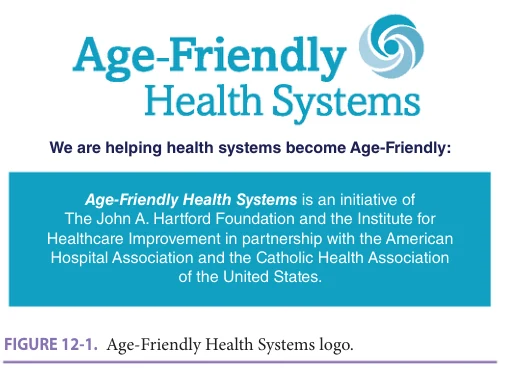
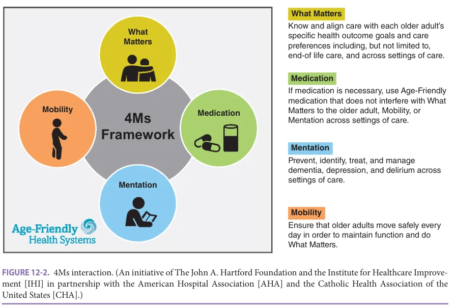
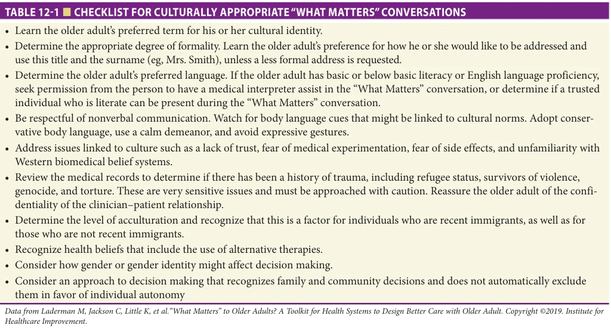
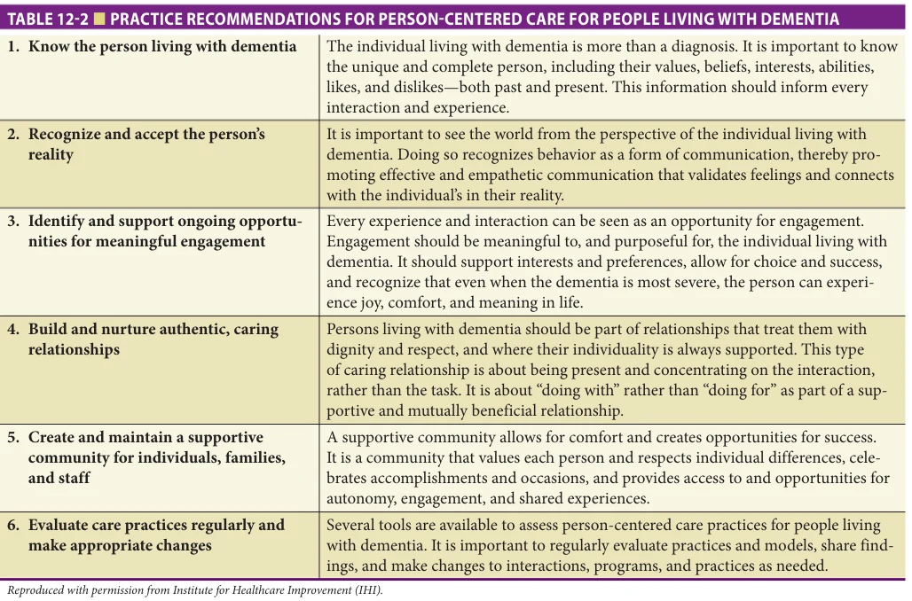
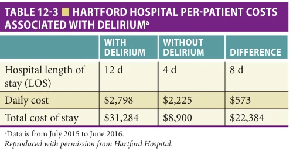

# Hazzard's Geriatric Medicine and Gerontology, 8e - Chapter 12: Age-Friendly Care

Terry Fulmer, Maryama Diaw, Chaoli Zhang, Jinghan Zhang, Wendy Huang, Amy Berman, Tara Asokan, Kedar S. Mate, Leslie Pelton

> **Status.** Fast build from the book; not lane-reviewed.

> Not cited in the 2020-2026 past papers.

> **Source and method.** Printed pages 171-178, from the marked 8th-edition copy (PDF page = printed page + 34). Prose follows its text layer; tables and figures are source-page crops. The book is canonical.

**[p. 171]**

## INTRODUCTION

With an unprecedented acceleration of the population living successfully into old age, the reimagining of the health care system is an imminent and compelling responsibility. There is an urgency to reform the fragmented delivery of health care to improve continuity across care systems as well as to adopt a unifying framework that is readily understood and implemented universally by providers and patients alike. Patients and families want respect and compassion, to learn about what to expect about their health and health care, and to be able to have a strong sense of trust in their caregivers and institutions.

#### Learning Objectives

- Articulate the importance of the 4Ms in health care for older adults.

- Discuss the evidence and approaches for acting on each of the 4Ms: What Matters, Medication, Mentation, and Mobility.

- Understand the intersection of team care required in the 4Ms approach.

#### Key Clinical Points

1. Team-based geriatric care is critical to the delivery of comprehensive, coordinated health care to older adults, their families, and caregivers.

2. The Age-Friendly Health Systems movement is an evidence-based approach to care that when implemented reliably, improves quality, improves health, and reduces costs.

3. The 4Ms set, What Matters, Mentation, Medications, and Mobility, provides a framework that addresses the multiple intersections of each of the 4Ms.

Reliable team approaches are essential, given the complexity of our systems. Interprofessional team (IPT) care is essential to providing effective care for older adults with multiple conditions and functional decline. Research has demonstrated that IPT care is associated with enhanced functional and cognitive status, reduced depression, and improved subjective well-being. IPT care has also been shown to reduce hospital readmissions and outpatient service use. Specialized IPTs focusing on specific conditions such as congestive heart failure, stroke, myocardial infarction, or dementia have also demonstrated improved patient outcomes in older adults.

The current and projected health care workforce shortage, coupled with the aging of the population, mandate that care models be measurably efficient and effective. The increasing number of frail older adults with complex needs demands widespread adoption of geriatric IPTs. In this chapter, the Age-Friendly Health Systems (AFHS) movement, coupled with the essential elements of teambased care, are discussed as a way forward and new standard of care.

### High-Functioning Teams as a Prerequisite to AFHS and 4Ms Care

Through the collaborative efforts of The John A. Hartford Foundation (JAHF) and the Institute for Healthcare Improvement (IHI), in partnership with the American

**[p. 172]**

*FIGURE 12-1. Age-Friendly Health Systems logo.*

*Owner annotations/highlights are from the marked source copy, not the book.*

Hospital Association (AHA) and the Catholic Health Association of the United States, the AFHS initiative has had strong momentum (Figure 12-1). Already established in over 2,600 sites of care across the country, this progress indicates a willingness to adopt the 4Ms model and study the impact. The AFHS movement has the goal of reaching 25% of hospitals and primary care settings by 2025.

The IHI Triple Aim is the basis for the AFHS approach that focuses on improving the patient experience of care (including quality and satisfaction), improving the health of populations; and reducing the per capita cost of health care. The four evidence-based facets of care known as the 4Ms (What Matters, Medication, Mentation, and Mobility) have evolved from the tenets of the Triple Aim.

However, achieving specific health outcomes of at-risk populations also requires the combined skills of a wide range of professionals operating as a team. Team members possess extensive professional knowledge of their individual discipline but often have limited knowledge of other disciplines on the team. Beyond varied technical knowledge among team members, teams may be characterized by different values across professional disciplines. These differences are becoming less pronounced with the evolution of IPTs in most health care settings and with many populations. The 4Ms set, described in this chapter, provides every team member with the same elements of care that each member will see through their own clinical lens, which helps ensure a holistic approach to the care plan. The Veterans Health Administration characterizes high-functioning teams as those that excel in both function (effectiveness) and relationships (engagement). Effectiveness refers to the team’s purpose and methods, role clarity, communication, awareness, and responsiveness (eg, how the team uses and shares information). Engagement is a function of the level of civility, respect, psychological safety, and cohesiveness of the team. There is a balance in the nature and function of relationships on the team. Limited attention to developing professional relationships may impede the development of trust and collaboration, which can impair team function.

However, excess focus on cohesion and collaboration may limit communication and prevent different opinions from being openly discussed.

Professional disciplines vary significantly in how they characterize problems and their etiology. For instance, more medically oriented disciplines may focus on conducting diagnostic tests and explaining findings in biological terms, whereas the social sciences (eg, psychology, social work) may emphasize psychosocial issues and consequences. In addition to differences in understanding and formulating plans of care, team members of different disciplines vary substantially in the nature of treatments they typically prescribe and in the length and frequency of patient visits. These differences in perspectives and approaches can be overcome when a 4Ms approach is used and all team member input is recognized and respected. While teams work toward a patient-centered outcome, individual team member competency remains essential. Teamwork requires discipline-specific clinical knowledge and skills and methods that allow all members to be heard—involving processes to communicate clearly, meet routinely, and understand the individual clinician’s role in the care plan. Older adults with multiple chronic conditions or advanced illnesses stand to benefit most from a shift from a disease-centered care delivery system to the AFHS model of care.

### The 4Ms Framework

An AFHS means being able to reliably provide a set of four elements of evidence-based, high-quality care, known as the 4Ms: What Matters, Medication, Mentation, and Mobility, shown in Figure 12-2. When the four elements are consistently implemented together as a set, they allow for a shift in focus from disease to function that accelerates the ability to better serve the needs and preferences of older adults. The 4Ms make the care of older adults more manageable and reduce the cognitive burden on care teams that is often felt in the delivery of complex clinical care. Focus is placed on the overall wellness and capabilities of older patients rather than siloed diagnostic assessments that often overlap and can create contradictions in care planning.

This approach guides the care of older adults irrespective of the location of care, and the 4Ms approach is most impactful when the team communicates progress in the 4Ms at every handoff. There is a strong evidence base for each of the 4Ms that is leading to improvement in health systems and creating sustainable change.

### What Matters

What Matters is what truly drives patient-centered care and is essential to addressing the unique needs of older adults, eliminating harm, and maximizing the efficiency of health care delivery. What Matters supports the values and activities that each person wishes to prioritize. The AFHS initiative defines What Matters as knowing and aligning care with each older adult’s specific health outcome goals and

**[p. 173]**

*FIGURE 12-2. 4Ms interaction. (An initiative of The John A. Hartford Foundation and the Institute for Healthcare Improvement [IHI] in partnership with the American Hospital Association [AHA] and the Catholic Health Association of the United States [CHA].)*

*Owner annotations/highlights are from the marked source copy, not the book.*

care preferences, including, but not limited to, end-of-life care, across settings of care.

Beyond the scope of disease-specific outcomes and survival statistics, an age-friendly infrastructure considers What Matters and consistently documents the same care priorities among health care providers, families, and patients. Shared decision-making, which directly involves the patient in the care conversation, has been shown to increase trust and satisfaction within health care systems and with care delivery, while also reducing fragmentation among clinicians and supernumerary demands on clinicians. A network-wide clinical trial conducted by a team of researchers at Yale has shown this through the utilization and analyses of patient preference data collected from three surveys, including the Treatment Burden Questionnaire (TBQ). Older patients who were given the opportunity to express what mattered to them, compared to those who received usual, unprioritized care, were more likely to have unnecessary medications deprescribed and had fewer diagnostic tests, referrals, and procedures. After being explicitly asked to identify their values-based health priorities and speaking to their primary care physicians concerning these priorities, TBQ measurements collectively demonstrated a 5-point decrease in treatment burden score after a 6-month follow-up period, compared to baseline. As connoted in the 4Ms framework, health care that prioritizes older patients’ health preferences can significantly decrease clinical harm and simultaneously have a positive impact on patient satisfaction. Table 12-1 provides a checklist for culturally appropriate “What Matters” conversations.

The topic most sensitive to older adults’ wishes and priorities is decision making related to end-of-life care and serious illness. In efforts to honor the bioethical principles of autonomy and informed consent, the development of advance care planning (ACP) has been a critical aspect of What Matters in the 4Ms framework. ACP is the process of intentional solicitation of decisions from patients and families regarding their preferences for health care. If nurses, physicians, and other health care professionals ask and document decisions based on older patients’ health priorities, goals, and preferences, health systems can honor What Matters to older adults and avert potentially unwanted care. In a randomized controlled trial (RCT) conducted at a large university hospital, patients receiving formal, coordinated ACP from trained facilitators were found to have their end-of-life wishes known and respected significantly more than the control group, indicating increased patient and family satisfaction with the care provided in discharge questionnaires. Patients saw the benefits of ACP to include the informal communication of future wishes, preparation for end-of-life care and death, avoidance of prolongation of dying, strengthening of personal relationships, and relieving burdens placed on family.

Documenting and incorporating What Matters information is a reliable, timely nonpharmacologic intervention that, when deployed, benefits the older adult involved and participating health systems. It enables the leveraging of interdisciplinary team resources and serves to stand as a quantifiable process measure. Beneficial care in congruence with reductions in the incidence and duration of

**[p. 174]**

*TABLE 12-1 ■ CHECKLIST FOR CULTURALLY APPROPRIATE “WHAT MATTERS” CONVERSATIONS*

*Owner annotations/highlights are from the marked source copy, not the book.*

unwanted and avoidable hospital stays, procedures, emergency department visits, medications, etc., stand to improve quality and efficiency across the board for older adults and health systems alike.

### Medication

Managing medications to ensure that they are only prescribed when necessary, are financially accessible, and well-understood and safely adhered to is central to the health of older adults who need them. Deprescribing may be even more important. In 2015, an estimated 29% of Medicare beneficiaries filled a prescription for at least one medication included in the 2015 American Geriatrics Society Beers Criteria list of drugs to avoid in older adults. The risk of dangerous side effects in older adults is high. The 4Ms framework, and medication management specifically, includes attention to age-friendly medications that do not interfere with What Matters to an older adult, Mobility, or Mentation across settings of care.

IHI’s Guide to Using the 4Ms in the Care of Older Adults emphasizes the importance of proper prescription protocol for older adults. Clinicians need to be alert to inappropriate medications and polypharmacy (multiple medications). In research assessing polypharmacy’s impact on delirium, polypharmacy was found to be a risk factor for delirium in older patients after emergency admission. One measure that health systems must prioritize is safely deprescribing or abstaining from prescribing high-risk medications.

An evidence-based approach to limiting the overprescription of high-risk medications and reducing the

negative impacts of polypharmacy is the use of computerized decision support (CDS) systems. The Screening Tool of Older Person’s potentially inappropriate Prescriptions (STOPP) and the Screening Tool of Alert doctors to the Right Treatment (START) have been used across systems to alert providers of potential problems with medications. Risks associated with prescribing a medication may outweigh the potential benefits. STOPP/START has been found to be beneficial in addressing inappropriate prescribing in older adults. When used, the criteria significantly improved prescribing methods, resulting in a lower prevalence of falls and all-cause mortality.

The impact of CDS systems on potentially inappropriate prescriptions (PIP) and potential drug-drug interactions has been positive. Avoiding drug-drug interactions is a critical aspect of providing medication services to older populations due to increased comorbidities in older adults.

The 4Ms framework ensures that medications are continuously reviewed, that high-risk medications are avoided, dose adjusted, or deprescribed when clinically appropriate, to improve the probability that medications are safe, appropriate, and well understood by the older adult and their caregivers. It should be noted that primary care physicians express a lack of time, poor awareness of the harms of medications, and fear of withdrawal symptoms or patient criticism as barriers to deprescribing. A team approach, where all members are empowered to do a medication assessment can help alleviate these concerns on the part of any one team member. Clinicians across the board must be proactive in deprescribing and improving medication management for older adults.

**[p. 175]**

In a study designed to showcase the role of all health care settings in decreasing the negative impacts of polypharmacy through deprescribing, pharmacists were placed at the forefront of providing patients a role in the decision-making process to deprescribe. Pharmacists in the intervention arm were given educational brochures to distribute to both patients and prescribers, while those in the control group provided the usual standard of care. Those in the intervention arm experienced a discontinuation of medication in almost half the cases, compared to 39% of cases for those in the control group.

The benefits of desprescribing are also evident when complex medication plans contribute to poor medication adherence. The primary barriers affecting medication adherence have been characterized as patient factors, medication factors, prescriber factors, system-based factors, and other factors. Each play a key role in either enhancing or complicating the medication protocols/schedules found to negatively affect medication adherence. In alignment with the 4Ms framework, medication plans need to be personcentered and simplified whenever possible for all involved. Cost-related medication nonadherence in older adults is also a serious problem and can lead to skipped or reduced doses due to costs, as noted by an analysis of the 2017 National Health Interview Survey (NHIS). Knowing that approximately 20% of older adults take 10 drugs or more, eliminating medication overload can improve the outcomes of care.

### Mentation

Assessment and care planning for optimal mentation, which includes mood and memory, helps prevent, identify, treat, and manage dementia, delirium, and depression across all settings of care. Dementia, delirium, and depression are covered in detail in other chapters in this text (see Chapters 58, 59, and 65, respectively). When health care providers reliably assess and create appropriate care plans for these three common conditions, qualitative and quantitative gains are evident for patients and health systems alike.

Dementia is more prevalent with advanced age but should not be conflated with normal aging. It is a neurodegenerative syndrome characterized by accelerated cognitive decline that interferes with activities of daily living. Dementia can compromise the independence of older adults and increase caregiving needs. Person-centered care (PCC) for older adults with dementia is a sociopsychological intervention that has been proven to significantly improve the overall quality of life and neuropsychiatric symptoms (NPS) when applied directly to clinical practice and care settings. Table 12-2 highlights the philosophy of PCC, which revolves around six fundamentals in line with the Alzheimer’s Association Dementia Care Practice Recommendations. A meta-analysis and systematic review drawing results from several RCTs favored PCC interventions by reducing agitation and decreasing the severity.

*TABLE 12-2 ■ PRACTICE RECOMMENDATIONS FOR PERSON-CENTERED CARE FOR PEOPLE LIVING WITH DEMENTIA*

*Owner annotations/highlights are from the marked source copy, not the book.*

**[p. 176]**

In the fifth edition of the American Psychological Association’s Diagnostic and Statistical Manual of Mental Disorders (DSM-5), delirium is clinically classified as a “disturbance in attention (ie, reduced ability to direct, focus, sustain, and shift attention) and awareness (reduced orientation to the environment)...[that] develops over a short period of time (usually hours to a few days), represents an acute change from baseline attention and awareness, and tends to fluctuate in severity during the course of the day.” It is especially important to note that mental status change in delirium appears as a direct psychological consequence of another etiology, especially preexisting medical conditions (excluding dementia) and medication toxicity. While its underlying pathophysiologic mechanisms can be elusive, delirium is a dangerous clinical condition. In hospitalized patients, an episode of delirium leads to detrimental sequelae, including major complications after surgeries, prolonged length-of-stay, loss of functional autonomy, decreased cognitive abilities, and increased mortality. These effects contribute to rising costs for health systems. In all settings of care including care by family members in the home, delirium poses a frightening and dangerous situation. With advanced education and assessment skills appropriate to the setting, every care provider can detect potential signs and symptoms of delirium and get the requisite care for the older adult in a timely manner.

The Tailored, Family-Involved Hospital Elder Life Program (t-HELP), which centers on family involvement for those older adults at risk for experiencing delirium, has been shown to improve detection and prompt early treatment. Postoperative delirium (POD) is associated with increased morbidity and mortality, and can be reduced or prevented. The improved mental and physical recovery after surgery and shorter hospitalizations are indicative of t-HELP’s efficacy, which harbors the potential to save health care systems untold millions of dollars. In AFHS, the use of evidence-based protocols to assess and attend to modifiable risk factors of delirium (eg, mobilization, orientation, sensory adaptation, social interaction, assistance with meals and hydration, etc.) help ensure Triple Aim care. Hartford Hospital is an example of an organization that has made a commitment to rigorous delirium screening in the context of 4Ms care and is discussed in a later case study.

Depression is a potentially life-threatening condition for older adults and is encompassed in the 4Ms framework as a part of the Mentation assessment. Prevalence of depression is estimated to range from 10% to 30% (see Chapter 65). There are several types of depression, and the most common include: major depression with severe symptoms that interfere with the ability to work, sleep, concentrate, eat, and enjoy life; persistent depressive disorder, also known as dysthymia with symptoms that are less severe than those of major depression, but last a long time (at least 2 years); and minor depression with symptoms that are less

severe and shorter in length than those of major depression and dysthymia. In a 4Ms assessment of Mentation, depression screens are important to determine if depression is present and if so, making an appropriate referral to a provider who can follow up with a treatment plan. The older adult may also describe a grief event that is at the root of the depression and here as well, follow-up is important for the well-being of the older adult. Screening for depression is recommended annually or when symptoms arise. Evidence supports using one of the following four screening tools: Patient Health Questionnaire-2 (PHQ-2), Patient Health Questionnaire-9 (PHQ-9), Geriatric Depression Scale (GDS), and Geriatric Depression Scale - short form (GDS - short form).

### Mobility

The positive effects of physical activity on mobility from improved muscle strength and balance as well as the protective effects against falling are well-documented. As older adults age, having the ability to move independently and safely plays an increasingly important role in how an older adult’s quality of life is defined. Living with any disease puts additional burden on an older person’s mobility. For example, diabetes mellitus increases the risk of falls in older adults, and clinicians must be attentive to the likelihood of older adults with diabetes needing education related to this risk and offer a mobility program that can be guided by physical therapy. Most chronic conditions play a role in reducing physical, cognitive, and social functioning. The 4Ms approach is especially effective in addressing function in a holistic manner that is readily understood by older adults and their families.

Medication, visual deficits, cognitive and mood impairment, and environmental hazards can all limit mobility. For instance, use of benzodiazepines, which are hypnotic sedatives prescribed to treat conditions such as anxiety and insomnia, correlates to an increased risk of falls in older adults and should be avoided. Preventative measures for maintaining mobility include regular vision and hearing examinations, continuous assessment of medications and provision of exercise protocols to increase balance, gait, and strength are recommended. Encouraging exercise in older adults is a recognized method for increasing the mobility of older adults and is recommended to be incorporated in their care. The role of exercise in decreasing the risks of falls is well-documented (see Chapter 43). However, as with any age group, motivation for maintaining exercise regimens can be a challenge. AFHS approaches strive to create person-centered, context-dependent care plans such as group exercise classes for some or caregiver education and strategies to ensure Mobility for others.

### The Value of the 4Ms Approach

The value of becoming an AFHS and implementing the 4Ms framework (also referred to as financial benefits) is

**[p. 177]**

detailed in IHI’s “The Business Case for Becoming an AgeFriendly Health System.” When implemented properly, AFHS can ultimately lead to reduced hospital length of stay and fewer hospital readmissions.

Annual Wellness Visits (AWV), covered by Medicare Part B since 2016, are designed to engage older adults in What Matters conversations as a part of the annual benefit. An AFHS approach can improve value by systematically using the AWV to review the 4Ms. In fact, fee-for-service claims data from 2013 to 2018 demonstrated that AWV users had a reduction in Medicare spending over 12 months. St. Vincent Medical Group (Indianapolis, IN), an institution in the Ascension system, which represents one of the five pioneering health systems that spearheaded the AFHS initiative, also demonstrated value. When revenue from ACP and associated gross benefits from AWV are considered, St. Vincent showed an annual net income of nearly $3.6 million. When asking What Matters, clinical teams enhance value for patients and families.

Nonfatal falls account for almost 99% of the estimated health care costs for fatal and nonfatal falls, which amounted to a total of $50 billion in 2018. This number for just nonfatal falls was estimated at $38 billion in 2013. Beyond the key purpose of leveraging the 4Ms framework to improve quality of care, creating AFHS and ensuring that older adults can afford their medications and avoid medication overload can result in long-term savings that will benefit all sectors.

Case Studies At Hartford Hospital in Connecticut, agefriendly initiatives have led to resounding impacts in value and care. The ADAPT (Actions to enhance Delirium Assessment Prevention and Treatment) program was started in 2012 as an interprofessional team effort across various disciplines and departments, with support from the hospital administration and vital resource allocation for positive reinforcement and opportunities for improvement. A delirium care pathway was developed to ensure that delirium prevention, treatment, and management remained an interprofessional priority throughout the length of an older patient’s stay and transitions. This included the implementation of delirium screenings three times a day, in addition to an initial screen. Adjunct support was provided through various means, from volunteer programs to therapeutic activities focusing on mobilization, nutrition, sleep/rest, and cognitive connection. A registry was also created for gathering data and analyzing quality outcome measures.

As seen in Table 12-3, delirium was shown to have serious consequences leading to poorer health outcomes, with the length of hospital stay averaging 4 days and $8,900 for those without delirium, and 12 days and $31,284 for those with delirium. Seventy percent of those without delirium were discharged home, compared to only 30% for those with delirium. And while mortality was less than 1% for patients without delirium, it was 10% for patients with

*TABLE 12-3 ■ HARTFORD HOSPITAL PER-PATIENT COSTS ASSOCIATED WITH DELIRIUMa*

*Owner annotations/highlights are from the marked source copy, not the book.*

delirium. The implementation of the ADAPT program led to decreased hospital stays for delirium patients (16–10.6 days) and reduced delirium attributable days. This resulted in annual savings averaging $6.5 million from 2012 to 2019. Hartford Health care has now taken steps to scale up the program, with potential expansion to other care settings (post-acute and home care) and a focus on population health in primary care clinics for underserved communitydwelling older adults.

Another example that has exhibited beneficial results has been Providence St. Joseph Health in Oregon, one of the original five locations chosen to take place in the development of AFHS. Beginning in 2017, changes in care included coordinating fall-risk screening and management, developing an outpatient mobility program, creating a dementia care pathway, educating clinical staff on polypharmacy and high-risk medication, and utilizing a What Matters Discussion Guide to direct communication. To implement these changes on a greater scale, Providence St. Joseph Health formed the Geriatric Mini-Fellowship in 2018, training providers at 12 primary care clinics.

The training resulted in a myriad of improved outcomes at these clinics. In terms of mobility, the move toward more comprehensive and coordinated preventative measures and care led to a doubling in screening for fall risk and cognitive impairment and quadrupling of fall-risk interventions being administered. Older patients were also more likely to engage in What Matters conversations with their providers, and the prescribing of highrisk medication decreased by 3% when seen by a fellow. Finally, these clinics where providers received training on AFHS experienced a reduction of 2% to 7% in hospitalizations for patients.

## SUMMARY

In a world where populations are aging more rapidly than ever before, the need to shape health systems to deliver quality care to older adults becomes an increasingly pressing health priority. The Triple Aim clearly points to the need for AFHS and 4Ms care, which improves the health and well-being of older adults through ensuring that families, caregivers, and health care provider teams all work synergistically. The 4Ms framework is driven by patient-centered

**[p. 178]**

care and prioritizes the older adult’s preferences to simultaneously include medication management, prevention and treatment of dementia, delirium, and depression, and safe physical activity. The cost-effective practices and teaming of this approach can guide a higher quality of care for an

aging population and significantly reduce unnecessary hospitalizations, saving health systems billions in health care spending. The evidence-based benefits of 4Ms care are clear and thus, emphasize the need for AFHS across health care settings.

## FURTHER READING

American Hospital Association: The Value Initiative

Issue Brief: Creating Value with Age-Friendly Health Systems; 2020. https://www.aha.org/system/files/media/ file/2020/08/value-initiative-issue-brief-10-creatingvalue-with-age-friendly-health-systems.pdf [aha.org]. Accessed February 7, 2022 Chung GC, Marottoli RA, Cooney LM Jr, Rhee TG.

Cost-related medication nonadherence among older adults: findings from a nationally representative sample. J Am Geriatr Soc. 2019;67(12):2463–2473. Diaz-Gutierrez MJ, Martinez-Cengotitabengoa M, Saez de

Adana E, et al. Relationship between the use of benzodiazepines and falls in older adults: a systematic review. Maturitas. 2017;101:17–22. Fazio S, Pace D, Maslow K, Zimmerman S, Kallmyer B.

Alzheimer’s Association dementia care practice recommendations. Gerontologist. 2018;58(suppl_1):S1–S9. Ganz DA, Latham NK. Prevention of falls in community-

dwelling older adults. N Engl J Med. 2020;382(8): 734–743. Hill-Taylor B, Sketris I, Hayden J, Byrne S, O’Sullivan D,

Christie R. Application of the STOPP/START criteria: a systematic review of the prevalence of potentially inappropriate prescribing in older adults, and evidence of clinical, humanistic and economic impact. J Clin Pharm Ther. 2013;38(5):360–372. Hshieh TT, Yang T, Gartaganis SL, Yue J, Inouye SK.

Hospital elder life program: systematic review and meta-analysis of effectiveness. Am J Geriatr Psychiatry. 2018;26(10):1015–1033. Institute for Healthcare Improvement: Age-Friendly Health

Systems: Guide to Using the 4Ms in the Care of Older Adults; 2019. http://www.ihi.org/Engage/Initiatives/ Age-Friendly-Health-Systems/Documents/IHIAgeFriendlyHealthSystems_GuidetoUsing4MsCare.pdf. Accessed February 7, 2022 Kim SK, Park M. Effectiveness of person-centered care

on people with dementia: a systematic review and meta-analysis. Clin Interv Aging. 2017;12:381–397.

Lown Institute: Medication Overload and Older Americans;

2020. https://lowninstitute.org/projects/medicationoverload-how-the-drive-to-prescribe-is-harming-olderamericans/ [lowninstitute.org]. Accessed February 7, 2022 Martin P, Tamblyn R, Benedetti A, Ahmed S, Tannenbaum

C. Effect of a pharmacist-led educational intervention on inappropriate medication prescriptions in older adults: the D-PRESCRIBE randomized clinical trial. JAMA. 2018;320(18):1889–1898. Misra A, Lloyd JT. Hospital utilization and expenditures

among a nationally representative sample of Medicare fee-for-service beneficiaries 2 years after receipt of an Annual Wellness Visit. Prev Med. 2019;129:105850. Monteiro L, Maricoto T, Solha I, Ribeiro-Vaz I, Martins C,

Monteiro-Soares M. Reducing potentially inappropriate prescriptions for older patients using computerized decision support tools: systematic review. J Med Internet Res. 2019;21(11):e15385. Shah RC, Supiano MA, Greenland P. Aligning the 4Ms of

age-friendly health systems with statin use for primary prevention. J Am Geriatr Soc. 2020;68(3):463–464. Stacey D, Legare F, Col NF, et al. Decision aids for people

facing health treatment or screening decisions. Cochrane Database Syst Rev. 2014(1):Cd001431. Tinetti ME, Naik AD, Dindo L, et al. Association of

patient priorities-aligned decision-making with patient outcomes and ambulatory health care burden among older adults with multiple chronic conditions: a nonrandomized clinical trial. JAMA Intern Med. 2019:1688–1697. Wang YY, Yue JR, Xie DM, et al. Effect of the tailored,

family-involved hospital elder life program on postoperative delirium and function in older adults: a randomized clinical trial. JAMA Intern Med. 2020;180(1):17–25. Yang Y, Hu X, Zhang Q, Zou R. Diabetes mellitus and

risk of falls in older adults: a systematic review and meta-analysis. Age Ageing. 2016;45(6):761–767.
