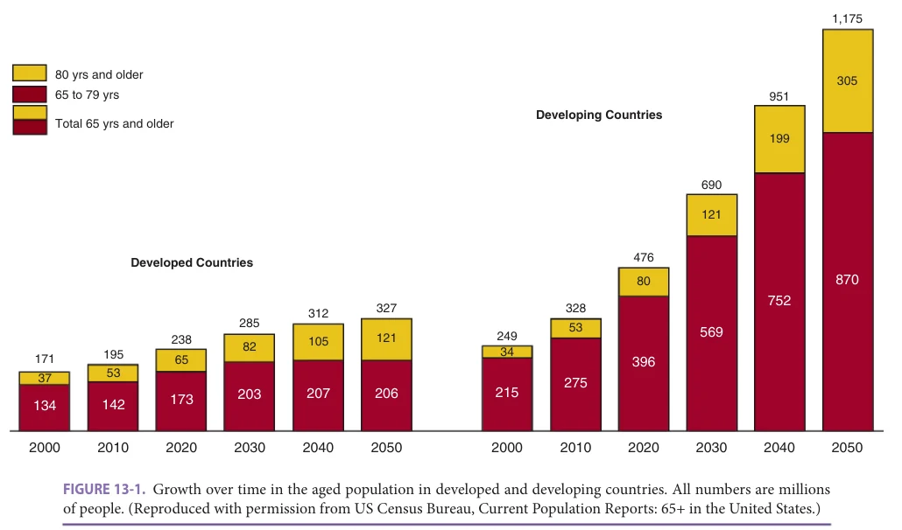
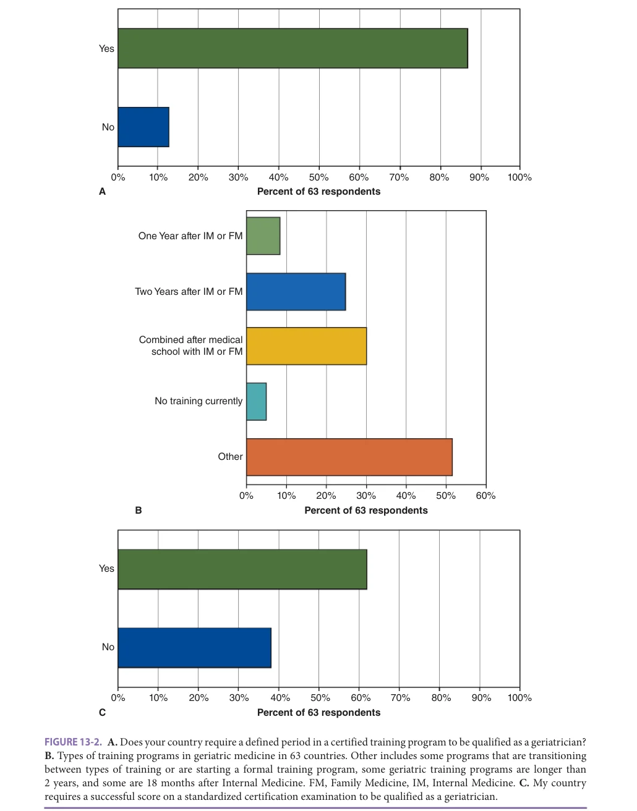
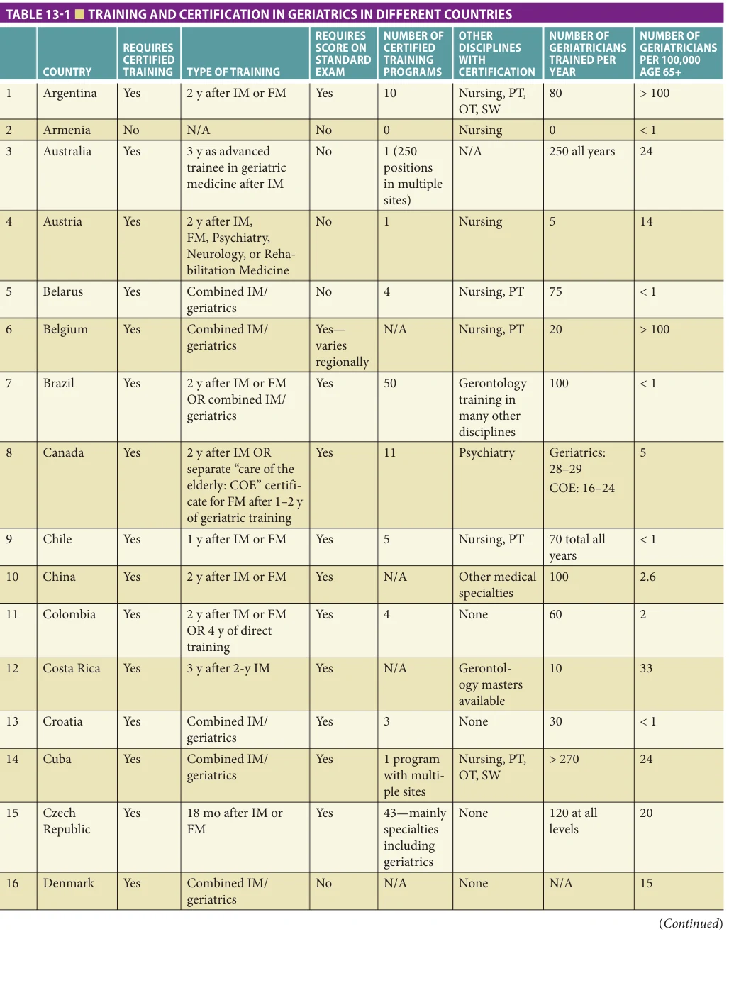
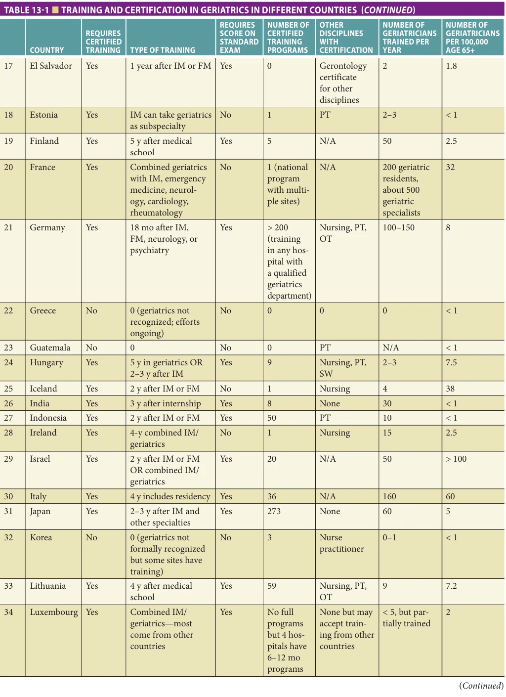
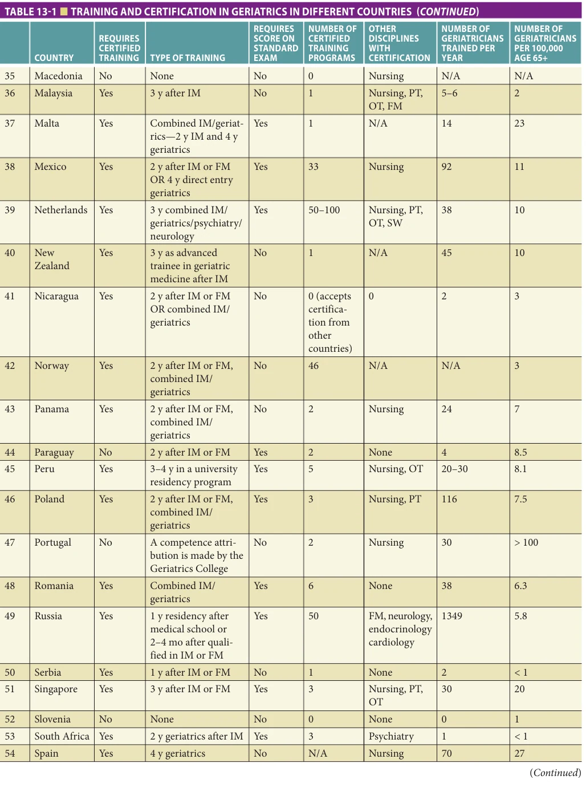
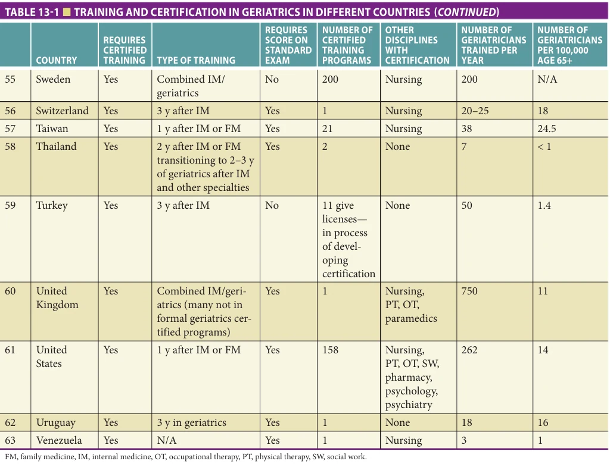
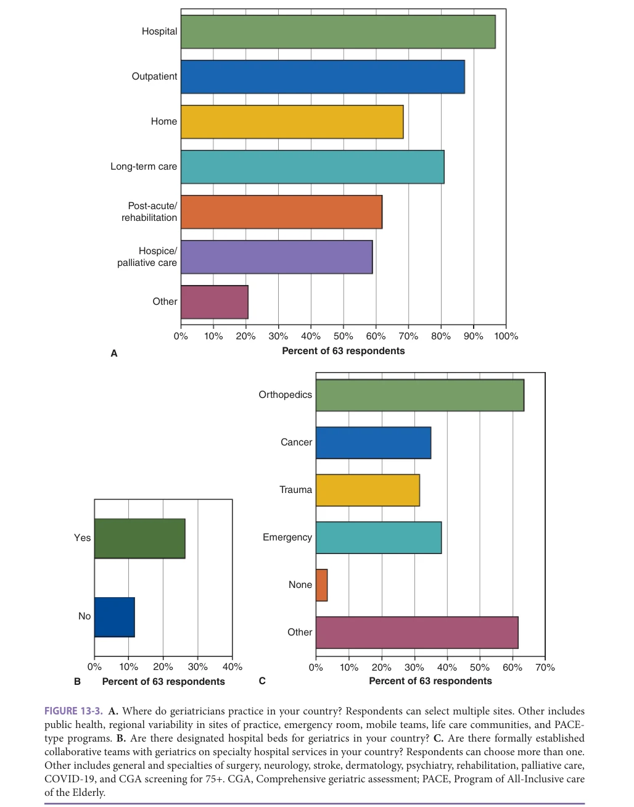
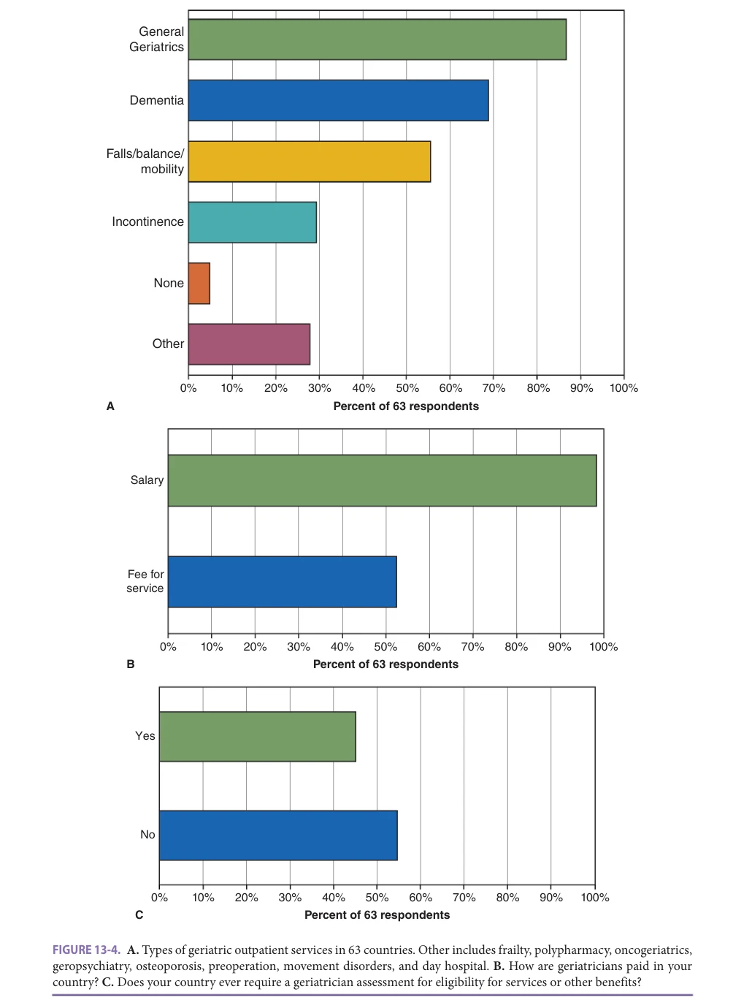

# Hazzard's Geriatric Medicine and Gerontology, 8e - Chapter 13: Geriatrics Around the World

Hidenori Arai, Jacqueline C. T. Close, Len Gray, Finbarr C. Martin, Luis Miguel Gutierrez Robledo, Stephanie Studenski

> **Status.** Fast build from the book; not lane-reviewed.

> Not cited in the 2020-2026 past papers.

> **Source and method.** Printed pages 179-190, from the marked 8th-edition copy (PDF page = printed page + 34). Prose follows its text layer; tables and figures are source-page crops. The book is canonical.

**[p. 179]**

## INTRODUCTION

Throughout the world, the aged proportion of the population is increasing. The number of older persons has tripled over the past 50 years and will more than triple again over the next 50 years. In contrast with the slow process of population aging experienced by the more developed countries, population aging in most of the less developed countries is taking place in a much shorter time period and is occurring in a larger population. Such rapid growth will require far-reaching economic and social adjustments in most countries. Effective and efficient health care for the chronic health problems facing this growing population of older adults will be a daunting challenge for all countries.

#### Learning Objectives

- Become familiar with similarities and differences in postgraduate (or post basic medical qualification) geriatrics training and clinical practice around the world.

- Learn about age-related health care policy initiatives in different nations.

#### Key Clinical Points

1. Since the backgrounds and training of geriatricians vary widely, so do skillsets and professional roles.

2. In most countries, there are still not enough geriatricians to serve the special needs of vulnerable older people.

## INCREASING LIFE EXPECTANCY

Notwithstanding some heterogeneity, life expectancy is increasing across the globe. In most industrialized countries, this increase in life expectancy has mostly occurred over the past century. However, in the most recent decades, its pace has progressed at an unprecedented speed, reaching estimates far beyond those predicted by most international organizations such as the United Nations. The increase in life expectancy has resulted in an increased proportion of individuals reaching the eighth and ninth decades of life. Aged individuals are consistently found to be the fastest growing segment of the population, and the rate of growth is more rapid in developing compared to developed countries (Figure 13-1). As life expectancy increases, there has been a wide decline in fertility rates, resulting in a decreasing dependency ratio: a smaller number of working age adults for each aged person. This trend has great and challenging implications for national approaches to support services for older adults. Since wealth and resources vary greatly across countries, priorities for health and social services vary as well. Many developing countries previously focused on infectious diseases and maternal-child health, but as they too face rapidly aging populations, they are now confronting the same challenges to health care as have developed countries in recent decades.

## DECLINE OF THE DISEASE MODEL

As age increases, there is a progressive, exponential increase in the occurrence of most chronic, degenerative, and progressive diseases, including cardiovascular disease, cancer, chronic obstructive pulmonary disease, dementia, and other degenerative conditions (see Chapter 2). Furthermore, there is an increase in the co-occurrence of these diseases, resulting in multimorbidity (see Chapter 41).

Health care systems around the world have been based on a disease model. Diagnosis and treatment focuses on eliminating or ameliorating the underlying pathology; health outcomes are determined by the disease. Also, functional impairment and quality of life are assumed to be improved by treating the “causative” disease. The disease model resulted in the creation of health systems centered on acute care hospitals and disease (or organ)-based specialists. This model informed the way we developed and accrued knowledge. Consequently, physicians and health

**[p. 180]**

*FIGURE 13-1. Growth over time in the aged population in developed and developing countries. All numbers are millions of people. (Reproduced with permission from US Census Bureau, Current Population Reports: 65+ in the United States.)*

*Owner annotations/highlights are from the marked source copy, not the book.*

personnel are now facing a “new” and less familiar type of patient who presents with an array of concomitant clinical conditions. These combinations of conditions result in varying degrees of functional deficits, cognitive deterioration, nutritional problems, and geriatric syndromes (delirium, falls, incontinence), often in the face of inadequate social support and financial resources.

This “new” older patient presents a degree of complexity not previously considered by the traditional understanding of medicine and its role. The traditionally envisioned health care system, whether operating under universal coverage or private mechanisms, is challenged by this complex patient.

The response to the challenge of the complex older patient has been heterogeneous around the world; differences in resource availability and economic and cultural issues resulted in different organizations of health care systems. In addition, the methodological approaches adopted by systems to evaluate the needs of such complex patients have been highly variable and not standardized. In particular, the organization of services to care for geriatric patients, including geriatric assessment and management, remains highly variable. This variation is seen among nurses, physicians, therapists, nursing homes, home care services, and health systems.

## EMERGENCE OF GERIATRIC MEDICINE

Geriatric Medicine emerged as a medical specialty in the mid-twentieth century—somewhat later than the majority of organ- and procedure-oriented specialties. This

emergence was initially inspired by the realization that among older people living in institutions, there was a substantial prevalence of diagnoses and functional impairments that could be resolved by careful diagnostic review and implementation of rehabilitation techniques. However, ultimately Geriatric Medicine approaches were found relevant to all older people, regardless of the care setting. In addition, there was a growing body of evidence that disease presentations and responses to treatment may differ among very old people compared to middle-aged adults. As this awareness was applied to hospitalized patients and older people living in the community, there was an appreciation that the social and physical context of older people also influences functional status and outcomes.

Despite a growing body of knowledge pertaining to illness in old age and a strong evidence base for its practice, the specialty has not been uniformly adopted across, or even within, nations. Moreover, even where it is established, practice is often restricted to particular settings— hospitals, nursing homes, or ambulatory clinics. This may be a product of the overall configuration of specialty practice, funding and financial incentives, lack of leadership, or perceived lack of need at professional or government levels. In many jurisdictions, geriatric medical specialists are only present in large academic or metropolitan settings. In some developing nations, the discipline may not exist at all.

Within hospitals, a variety of practice models have emerged. Acute geriatric units, supervised by geriatricians, may admit acutely ill patients directly from the emergency department or community. Alternatively (or in addition),

**[p. 181]**

Geriatric Medicine may be restricted to post-acute units, where patients are transferred after initial assessment and triaging in an acute unit. These post-acute services may be based on a separate subacute ward within an acute hospital, or co-located within a long-term care facility.

Outside of hospitals, Geriatric Medicine may have a presence in long-term care, where geriatricians might act as the primary physician workforce. In other jurisdictions, they may act primarily as specialists, consulting for patients who are referred by primary care practitioners, with or without any special training in care of older people.

In most jurisdictions, a shortage of geriatricians is perceived. Even where the specialty is firmly entrenched and available in a particular setting, there may be inadequate availability in other care settings. Situations where a geriatrician is available to consult about patients across the entire care spectrum are probably relatively rare.

Geriatric medical practice and its availability should reflect the needs of the oldest members of a society. As such, with near-universal population aging, it would be reasonable to anticipate that Geriatric Medicine should emerge progressively throughout the present century.

## STANDARDIZED ASSESSMENT

Consistent assessments can provide a mechanism to draw comparisons among like services in different nations and, if configured appropriately, even across care settings within and among nations. The interRAI suite of assessment systems was designed to meet this requirement. It has been used to draw comparisons across nations and jurisdictions within them. Two important multination research projects in Europe in home care and long-term care have been influential in identifying different patterns of service use, clinical outcomes, medication use, and quality issues which, in turn, influenced policy in several nations. Data extracted from large databases (in some cases millions of assessments) enabled similar examinations among nations and jurisdictions and organizations within them. These systems have been adopted at an organizational level (eg, a nursing home) or by state or nations (eg, the interRAI Home Care and Long-Term Care systems in New Zealand). Several nations and states adopted multiple suite instruments (eg, Belgium and Ontario, Canada). These early suite adopters are exploring the utility of multiple compatible instruments to facilitate cross-setting continuity of care (a clinical benefit) and comparisons of caseloads across settings (a policy benefit).

In this chapter, we provide an overview of geriatrics training and certification, clinical practice, and institutional support in 63 countries. While many countries have active aging research programs, this chapter does not address those. We are exceptionally grateful for the information provided by national leaders from each country through an online

survey. Among the 63 countries, based on the current classification of countries by the World Bank, 42 were high income (national income per capita >US$ 12,536 in 2019) of a total of 59, 17 were upper middle income (of a total of 55), and 4 were lower middle income, of a total of 44. There were no respondents from low-income countries, of a total of 28. There are a few countries, mainly very small, that were not classified by WHO.

Please see the Acknowledgment section for a list of survey respondents. All respondents provided their best estimates about geriatrics in their countries; however, given the great variability in how health care is organized and geriatrics is defined, some of the information is likely to be inexact. We regret that we were not able to identify national leaders for every country and hope to include others in future versions of the chapter.

## TRAINING AND CERTIFICATION OF GERIATRIC SPECIALISTS

Geriatrics training and certification vary among responding countries. Some countries with early emerging roles for geriatrics specialists largely import trained geriatric professionals from other countries. Nearly 90% of the countries surveyed reported the presence of formal training programs in geriatrics (Figure 13-2A). However, the timing and requirements vary considerably. For example, many countries train physicians in geriatrics through individual certified training programs offering 1 to 4 years of advanced geriatrics training after residency in Internal Medicine or Family Medicine, or combined Internal Medicine and geriatrics training lasting 4 to 5 years after medical school (Figure 13-2B). Many of these programs are operated independently by hospitals and academic health systems. Other countries have a single national training program which has been implemented in multiple health care systems. Many countries offer a national certification examination, while others provide certification through national societies using a range of metrics (Figure 13-2C). Some countries do not offer a formal path to certification, so the definition of a geriatrician can depend on national or regional standards. Many countries offer educational programs regarding care of older people to a wide range of trainees: some occur during professional training while others are designed for practicing health care providers. For the most part, this chapter focuses on formally trained geriatrics specialists.

In some countries, formal training and certification is offered to health professionals other than physicians. Most common is geriatrics specialization for nurses, followed by physical and occupational therapists and social workers.

While definitions vary for who is a geriatrician, our national respondents reported a very wide range of numbers of geriatricians per 100,000 persons age 65 or older (Table 13-1). A proposed criterion from the Royal College of Physicians (RCP) is that there should be 2 geriatricians for every 100,000 persons age 75 or older. This estimate is based on a consultative, not primary care, model of medical

**[p. 182]**

*FIGURE 13-2. A. Does your country require a defined period in a certified training program to be qualified as a geriatrician? B. Types of training programs in geriatric medicine in 63 countries. Other includes some programs that are transitioning between types of training or are starting a formal training program, some geriatric training programs are longer than 2 years, and some are 18 months after Internal Medicine. FM, Family Medicine, IM, Internal Medicine. C. My country requires a successful score on a standardized certification examination to be qualified as a geriatrician.*

*Owner annotations/highlights are from the marked source copy, not the book.*

**[p. 183]**

*TABLE 13-1 ■ TRAINING AND CERTIFICATION IN GERIATRICS IN DIFFERENT COUNTRIES*

*Owner annotations/highlights are from the marked source copy, not the book.*

**[p. 184]**

*TABLE 13-1 ■ TRAINING AND CERTIFICATION IN GERIATRICS IN DIFFERENT COUNTRIES*

*Owner annotations/highlights are from the marked source copy, not the book.*

**[p. 185]**

*TABLE 13-1 ■ TRAINING AND CERTIFICATION IN GERIATRICS IN DIFFERENT COUNTRIES*

*Owner annotations/highlights are from the marked source copy, not the book.*

**[p. 186]**

*TABLE 13-1 ■ TRAINING AND CERTIFICATION IN GERIATRICS IN DIFFERENT COUNTRIES*

*Owner annotations/highlights are from the marked source copy, not the book.*

care, so it is difficult to relate the RCP estimate to the findings of our survey. Some countries report national efforts to increase the number of trained geriatricians, but others do not.

## GERIATRICS PRACTICE

Geriatricians practice in many settings (Figure 13-3A). The most common setting is the hospital, followed by outpatient clinics. Geriatricians tend to work in larger hospitals, academic centers, and cities. In many countries, medical aspects of long-term care are managed by general practitioners, not geriatricians. Practice varies widely within countries; many only have special geriatric services in a few health care settings, while other countries have somewhat greater geographical spread of services. Geriatricians practicing in hospitals usually work on dedicated geriatrics wards (Figure 13-3B), but also in collaboration and consultation with many other services, most commonly orthopedics, oncology, and emergency wards (Figure 13-3C). Similarly, general geriatrics is the most common outpatient service, but many other specific services are offered, including treatment for dementia, falls/balance/mobility,

and incontinence (Figure 13-4A). Over half of respondents reported that geriatricians in their country provide home services such as home visits or home care coordination. Similarly, over half of respondents reported that geriatricians worked in rehabilitation settings, more often in acute hospital compared to long-term care settings.

## SUPPORT FOR GERIATRICS

Some geriatricians are salaried in almost all participating countries, while about half of countries report that geriatricians also receive individual payment for services (Figure 13-4B). Salaries come from governments, hospitals, and other institutions. Payments for services come from health insurance and directly from private payers. Somewhat less than half of countries report that geriatrician assessment is sometimes required for paid services such as long-term or home care (Figure 13-4C).

Quite a few countries have evolving policies and practices related to geriatrics. For example, in Israel, geriatricians can be paid by the Social Security System to assess people age 90 or older for eligibility for home services for those with functional impairment. The United Kingdom has

**[p. 187]**

*FIGURE 13-3. A. Where do geriatricians practice in your country? Respondents can select multiple sites. Other includes public health, regional variability in sites of practice, emergency room, mobile teams, life care communities, and PACEtype programs. B. Are there designated hospital beds for geriatrics in your country? C. Are there formally established collaborative teams with geriatrics on specialty hospital services in your country? Respondents can choose more than one. Other includes general and specialties of surgery, neurology, stroke, dermatology, psychiatry, rehabilitation, palliative care, COVID-19, and CGA screening for 75+. CGA, Comprehensive geriatric assessment; PACE, Program of All-Inclusive care of the Elderly.*

*Owner annotations/highlights are from the marked source copy, not the book.*

**[p. 188]**

*FIGURE 13-4. A. Types of geriatric outpatient services in 63 countries. Other includes frailty, polypharmacy, oncogeriatrics, geropsychiatry, osteoporosis, preoperation, movement disorders, and day hospital. B. How are geriatricians paid in your country? C. Does your country ever require a geriatrician assessment for eligibility for services or other benefits?*

*Owner annotations/highlights are from the marked source copy, not the book.*

**[p. 189]**

had a National Health Service framework for aging services and requires specialist geriatricians to participate in care for all hip fracture patients. Japan provides incentives for comprehensive geriatric assessment on hospital admission and for evaluating and deprescribing for polypharmacy. In Germany, geriatricians are obligatory providers in the care of hip fracture patients age 70 or older. In Australia, the Royal Commission is requesting an increased role for geriatricians in long-term care. Australia is also working to increase availability of geriatricians for indigenous older people and those in correctional settings. In Norway, there is an expectation that all large acute care hospitals have geriatricians. In Malta, geriatricians mostly work outside acute care, particularly in specialized post-acute/rehabilitation settings; they assess acute care patients for eligibility for transfer to the post-acute setting. In Turkey, there is an aim to increase the number of geriatricians, who have an obligatory service requirement to work in areas determined to have an unmet need. In France, nursing home care is provided by general physicians with specific training in geriatrics. North Macedonia is in the process of organizing a geriatrics specialty.

More broadly, several countries report other developments in the coordination and management of care for older people. New Zealand uses a national approach for assessment based on the interRAI tool. Taiwan is using an Integrated Care for Older People (ICOPE) assessment for screening older people. The government of Thailand has set a national agenda on aging and created the Association of Southeast Asian Nations Center on Active Aging and Innovation. Nicaragua has created a program Todos con Vos for persons age 60 or older. Nicaragua also has a program in collaboration with Social Security for retired people that partners with Public Health to provide health care, rehabilitation, and other services. Peru has created laws addressing issues of dementia. Singapore organizes health care among four Regional Healthcare Systems with a population health focus and efforts to address aging issues. Panama offers a home care system coordinated between the Health and Social Security Systems. Serbia has a national program for health care of older people, and Luxembourg is developing such a national plan. China offers special geriatrics services in certain hospitals, but is working to extend these services to geriatric wards more widely. Ireland is directing more care to community settings via the Sláintecare program. Belgium is expecting to implement the bel-RAI soon and offers comprehensive assessment through a day clinic. Costa Rica has laws addressing integrated care for older persons. Mexico has a National Institute of Geriatrics which is developing a national action plan for older adults in conjunction with the Ministry of Health. It is promoting the development of Departments of Geriatrics nationwide.

## SUMMARY

Despite global aging, geriatrics remains a small field almost everywhere, although it is more advanced in developed countries compared to developing ones. There are clear

signs that some nations are working to increase the training and availability of geriatricians and geriatric services in their countries. Some countries have integrated geriatricians into program eligibility standards or oversight. Most clearly, there exists a worldwide community of dedicated geriatricians working to improve care for older people in their countries.

## ACKNOWLEDGMENTS

We especially recognize the exemplary support provided by Leah Carton of McGraw Hill who developed and managed the web-based survey. Survey participants: Edgar Aguilera Gaona, MD, Paraguay; Vidmantas Alekna, MD, PhD, Lithuania; Hidenori Arai, MD, PhD, Japan; Prasert Assantachai, MD, Thailand; Gülistan Bahat, MD, Prof, Turkey; Melba de la Cruz Barrantes Monge, MD, MsC, Nicaragua; Sylvie Bonin-Guillaume, MD, PhD, France; Carlos Cano, MD, Colombia; Liang-Kung Chen, MD, PhD, Taiwan; A. Mark Clarfield, MD, FRCPC, Israel; Jacqueline Close, MBBS, MD, Australia; Jacqueline Close, MBBS, MD, FRCP, New Zealand; Luis Manuel Cornejo MD, MSc, Panama; A.B. Dey, MD, India; Rebecca Dreher, Medical Doctor, Switzerland; John Ellul, MD, DM, Greece; Predrag Erceg, MD, PhD, Serbia; Helga Eyjólfsdóttir, MD, PhD, Iceland; Alberto Ferrari, MD, Italy; Pablo Garcia Aguilar, MSc, MD, Guatemala; Deon Greyling, MBChB, M Fam Med, M Med, South Africa; Luis Miguel Gutierrez Robledo, MD, PhD, México; Margarita Henriquez, MD, El Salvador; Susanne Hernes, MD, PhD, Norway; Andrei Ilnitski, MD, PhD, Belarus; José Jauregui, MD, PhD, Argentina; Peter Johnson, MD, Sweden; Shahrul Kamaruzzaman, MBBCh, PhD, Malaysia; Lin Kang, MD, China; Ana Kmaid Riccetto, MD, Uruguay; Helgi Kolk, MD, PhD, Estonia; Yulia Kotovskaya, MD, PhD, DMs, Russia; Adam Lelbach, MD, PhD, Hungary; Jean-Claude Leners, MD, Luxembourg; Wee-Shiong Lim, MBBS, MRCP (UK), MMed (Int Med), MHPEd, AGSF, FAMS, Singapore; Roberto Lourenço, MD, MPH, PhD, Brazil; Lia Marques, MD, Portugal; Nicolás Martínez-Velilla, MD, PhD, Span; Francesco Mattace- Raso, MD, PhD, Netherlands; Jesús Menéndez Jiménez, MD, MPH, Cuba; Manuel Montero Odasso, MD, PhD, Canada; Fernando Morales-Martínez, MD, Costa Rica; Hanna Öhman, MD, PhD, Finland; Shane O’Hanlon, MB, BCh, BAO, MRCPI, Ireland; Jose F. Parodi, PhD, Perú; Tajana Pavic, MD, PhD, Croatia; Biljana PetreskaZovic, MD, Macedonia; Karolina Piotrowicz, MD, PhD, Poland; Gabriel-Ioan Prada, MD, PhD, Romania; Rupert Puellen, MD, Germany; Regina Roller-Wirnsberger, MD, MME, Austria; Irma Ruslina Defi, Sp.KFRs(K), Indonesia; Jesper Ryg, MD, PhD, Denmark; Dra. Juana Silva, Medical Doctor, Geriatrician, Chile; Stephanie Studenski, MD, MPH, United States; Artur Torosyan, MD, Armenia; Milagros Torres, MD, Venezuela; Nele Van Den Noortgate, MD, PhD, Belgium; Hana Vankova, MD, PhD, Czech Republic; Mark Anthony Vassallo MD(Melit.) DGM(Lond.) MA(Melit.) in Bioethics FRCP(Edin.) FRCP(Lond.), Malta; Michael Vassallo, FRCP, PhD, England; Gregor Veninšek, MD, Slovenia; Sol-Ji Yoon, MD, MPH, Korea.

**[p. 190]**

## FURTHER READING

Bates T, Kottek A, Spetz J. Geriatrician Roles and the Value

of Geriatrics in an Evolving Health Care System. San Francisco, CA: UCSF Health Systems Workforce Center on Long-Term Care; 2019. Fisher JM, Garside M, Hunt K, Lo N. Geriatric medicine

workforce planning: a giant geriatric problem or has the tide turned? Clin Med (Lond). 2014;14(2):102–106. Habot B, Tsin S. Geriatrics in the new millennium,

Israel. Isr Med Assoc J. 2003;5:319–321. InterRAI. https://www.interrai.org. Accessed May 17, 2021. Lester PE, Dharmarajan TS, Weinstein E. The looming ger-

iatrician shortage: ramifications and solutions. J Aging Health. 2020;32(9):1052–1062. Pitkälä KH, Martin FC, Maggi S, Jyväkorpi SK, Strandberg

TE. Status of geriatrics in 22 countries. J Nutr Health Aging. 2018;22(5):627–631. Royal College of Physicians. Consultant physicians work-

ing with patients: the duties, responsibilities and practice of physicians in medicine. London: RCP, 2013. https://

www.rcplondon.ac.uk/projects/outputs/consultantphysicians-working-patients-revised-5th-edition. Accessed May 5, 2012. Saka S, Oosthuizen F, Nlooto M. National policies and

older people’s healthcare in Sub-Saharan Africa: a scoping review. Ann Glob Health. 2019;85(1):91. Tan MP, Kamaruzzaman SP, Poi PJH. An analysis of geri-

atric medicine in Malaysia-riding the wave of political change. Geriatrics (Basel). 2018;3(4):80. Ungureanu M, Brînzac MG, Paina AFL, Avram L, Crișan

DA, Donca V. The geriatric workforce in Romania: the need to improve data and management. Eur J Public Health. 2020;30(Suppl 4):iv28–iv31. Won CW, Kim S, Swagerty D. Why geriatric medicine is

important for Korea: lessons learned in the United States. J Korean Med Sci. 2018;33(26):e175. World Health Organization. https://www.who.int/publica-

tions/i/item/WHO-FWC-ALC-19.1. Accessed January 18, 2022.
