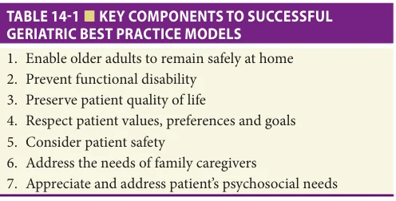
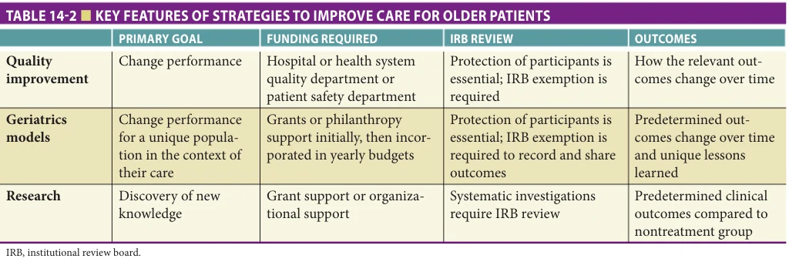
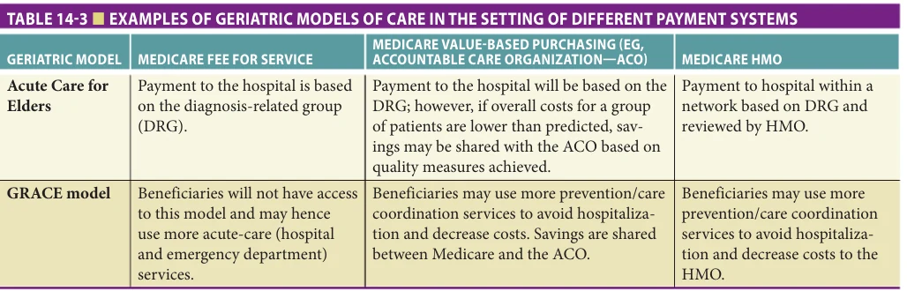
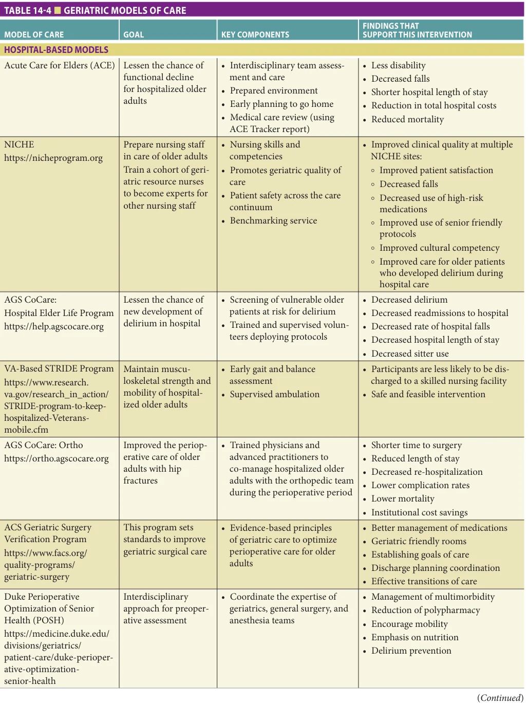
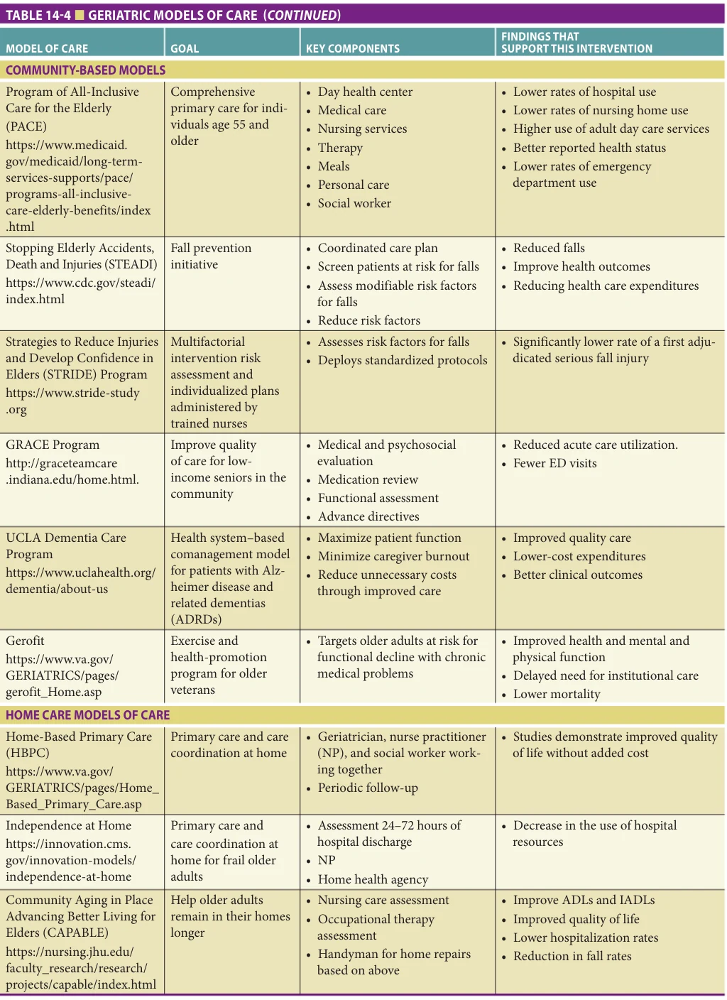
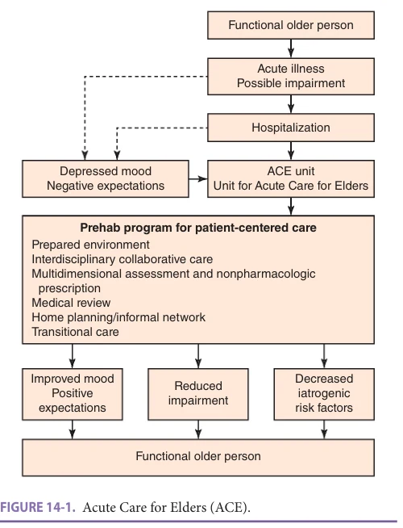
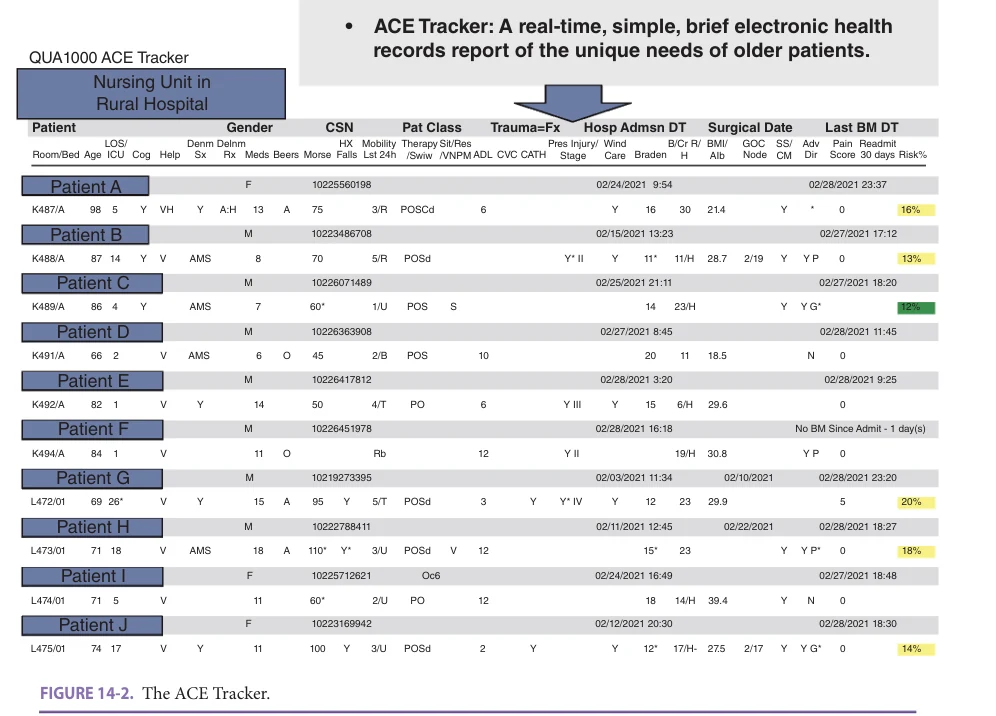
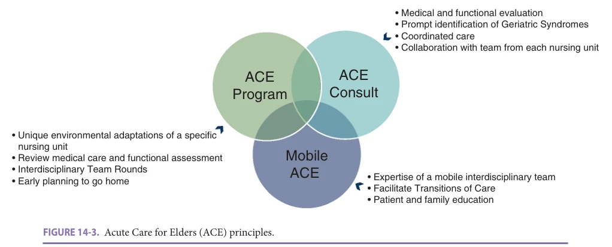
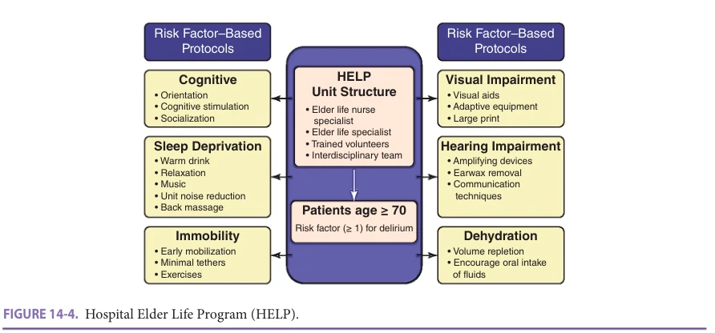

# Hazzard's Geriatric Medicine and Gerontology, 8e - Chapter 14: Models of Hospital and Outpatient Care

Jonny Macias Tejada, Michael L. Malone

> **Status.** Fast build from the book; not lane-reviewed.

> Not cited in the 2020-2026 past papers.

> **Source and method.** Printed pages 191-206, from the marked 8th-edition copy (PDF page = printed page + 34). Prose follows its text layer; tables and figures are source-page crops. The book is canonical.

**[p. 191]**

## INTRODUCTION

Over the past four decades, geriatrics models of care have emerged to address the unique needs of older adults. These models deliver evidence-based practices to this growing segment of our population. Some of these programs have been evaluated in randomized clinical trials. Other models have been evaluated as quality improvement projects. Identifying the needs of vulnerable older adults as they receive health care will allow geriatrics leaders the opportunity to respond to our patients’ needs with programs that improve care. Geriatrics models of care use interdisciplinary approaches to address the needs of patients with multiple comorbid conditions. This chapter with describe models based in the hospital setting and in the outpatient setting. Approaches and models related to transitions in care are discussed in Chapter 18, Transitions of Care.

#### Learning Objectives

- Describe the common goals of geriatrics models of care in the hospital and outpatient setting.

- Understand how to prepare for a geriatrics practice model.

- Describe how geriatrics models fit into the context of various payment mechanisms.

- Describe the key components of hospital-based models and outpatient models of care.

- Outline key strategies in sustaining and disseminating geriatrics models of care.

#### Key Clinical Points

1. Multiple, evidence-based practice models are available to help interdisciplinary teams to improve care for populations of vulnerable older individuals.

2. Choosing the geriatrics model that best fits into your practice setting depends on the challenges that your team is trying to address, your ability to make the case for a change, and your skills to lead an interdisciplinary team toward improved care.

3. Measuring key outcomes at baseline and over time can assist the team in efforts to improve care.

4. Assessing the fidelity of the key components of the model intervention is important to implementing and sustaining geriatrics models of care.

5. Disseminating geriatrics models may require novel strategies to incorporate the key components of geriatrics models into the workflow and processes of routine care of older patients.

Common goals of these geriatrics models of care include engaging patients and families in their plan of care, enabling patients to remain safely in the least restrictive site of care, and focusing on prevention strategies that optimize patients’ functional status and quality of life.

Geriatrics models of care commonly address a specific population of older patients. Models can exemplify how hospitals and health systems fulfill their mission within their community. Geriatrics leaders commonly need to build a case for geriatrics models of care to fit with the hospital/health system priorities, emphasizing efforts to continuously improve care. Working with key stakeholders in health care organizations, geriatrics leaders seek to identify the resources that are available to support a new model, define where the model fits within other programs, and create a strategy to implement the model.

### A Background to Geriatric “Best Practice” Models

Table 14-1 provides several key components to geriatrics models of care. This chapter will help guide the reader to approach the framework of models of care and understand the key aspects of the design of various models. Further, the reader will appreciate how to choose a model to deploy in their hospital or outpatient setting.

Geriatrics models of care are standard approaches to the care of older adults. They are often deployed by geriatric medicine and gerontological nursing leaders in efforts to

**[p. 192]**

*TABLE 14-1 ■ KEY COMPONENTS TO SUCCESSFUL GERIATRIC BEST PRACTICE MODELS*

*Owner annotations/highlights are from the marked source copy, not the book.*

address the needs of populations of vulnerable older adults. Many were developed in response to common challenges of older patients (eg, functional decline or new onset of delirium during an acute illness). Most models are set within a single context of care (eg, the hospital or the clinic setting). Some models continue care beyond a single setting. Most models provide key screens and assessments for patients, as well as appropriate interventions in response to the unique needs of each individual. Models of care require interdisciplinary team members who work together as opposed to health professionals who work independently. Models are commonly targeted to address a vulnerable patient population during a specific context of care.

We will highlight a few important aspects to choosing a geriatrics model. First is to clearly define the local problem or challenge which you are trying to solve. This will require you to tell the story of the challenge in care and the implications for individuals. You likewise will need to describe the scope of the problem and implications for older adults and the costs. Second is to get support from key leaders and stakeholders because they are critical in efforts to improve care. Third in choosing a model is finding one that has good evidence that it will work. We will describe the outcomes of various models later in this chapter. Next is knowing if the model is feasible in your setting. This means that you have the team and the resources to implement and sustain the program. Fourth is getting input from older adults and their family caregivers to guide choosing the model. Lastly is the ability to measure if the model will make a difference.

Additional details on implementing, sustaining, and dissemination models of care will be highlighted later in this chapter.

Over the past decade, new concepts and strategies have emerged globally and nationally to incorporate the unique needs of our aging population. The World Health Organization (WHO), introduced the “age-friendly systems and communities,” a policy framework designed to address outdoor spaces and public building, transportation, housing, social participation, respect and social inclusion, civic participation and employment, communication and information, community support, and health services.

The John A. Hartford Foundation, in partnership with the Institute for Healthcare Improvement conceptualized the idea of “Age-Friendly Health Systems” (AFHS) (see Chapter 12 on Age-Friendly Care). The AFHS uses existing geriatrics evidence-based models of care to lessen iatrogenic adverse events to older adults, deliver the best care conceivable to older adults across all care settings (emergency departments, inpatient, post-acute, in home, and ambulatory), and effectively optimize value for all involved stakeholders. This concept was summarized as the 4Ms: (1) What Matters to the older person; (2) Medication; (3) Mentation; and (4) Mobility. Integrating the 4Ms into the design of geriatric models will help teams be more effective in addressing the needs of older patients. The AFHS approach uses regular meetings of key stakeholders toward implementing practice changes to improve care. National leaders help local teams to measure their care and improve outcomes. Geriatrics models of care can be the framework of these practice improvement activities.

### Geriatrics Models of Care and Quality Improvement Projects

Some geriatrics models of care have been evaluated in clinical trials while others have been described as rigorous quality improvement projects (Table 14-2).

Quality improvement projects and geriatrics practice models each identify a clinical challenge. In both strategies, an institutional review board (IRB) waiver is required, a specific intervention is deployed, and outcomes are measured

*TABLE 14-2 ■ KEY FEATURES OF STRATEGIES TO IMPROVE CARE FOR OLDER PATIENTS*

*Owner annotations/highlights are from the marked source copy, not the book.*

**[p. 193]**

to see if it has worked. In each approach there is no new science defined. Usually the results are never made available in peer-reviewed journals. The work is often limited to one practice site. Both strategies are intended to improve the quality, safety, and value of health care. Both are unlikely to be disseminated, unless the model represents a unique improvement to health care. In summary, both geriatrics models and quality improvement programs use systematic efforts to improve care.

We would like to highlight some differences between geriatrics models and quality improvement. First, geriatrics models target specific interventions for older patients. They usually replicate prior work (eg, Acute Care for Elders [ACE] or Hospital Elder Life Program [HELP]), striving to get the same outcomes of the original model. Quality improvement projects, on the other hand, define the needs that fit their unique problems. Quality improvement projects allow the team to design their own approach to the problem commonly using “Plan-Do-Study-Act” cycles. These projects use experiential learning strategies. Second, quality improvement programs often have a shorter time frame whereas geriatrics models of care are commonly deployed over long periods of time. In summary, geriatrics models deploy a specific intervention to address a problem, while quality improvement projects allow more freedom to develop and implement an intervention.

Some geriatrics models integrate quality improvement strategies to improve their outcomes. An example of this is in the HELP program. The leaders who implemented the HELP program in a local community noted that the outcomes for their program fell short of the original model. The leaders used simple quality improvement strategies to assess and manage the fidelity of the key ingredients of the model to eventually improve the outcomes. Hence, geriatrics models of care may integrate quality improvement techniques into their project.

### Geriatric Models of Care in the Context of Different Payment Mechanisms

The financial incentive of the health system is a critical part of the environment in which models are developed and deployed (Table 14-3).

Most geriatrics models have been developed over the past 20 years in the Medicare fee for service payment system. The fee for service payment system provides reimbursement based on the use of services, hence more care provided results in additional payment to providers and health systems. Models that work in these systems may rely on increasing downstream revenues to the health system from the care of patients. The fee for service payment system provides reimbursement to the hospital through diagnosis-related groups. In short, the Medicare fee for service payment system pays for services provided for the beneficiary.

The value-based purchase payment system provides reimbursement that spans unique episodes of care (see Chapter 19 on Value-Based Care). This payment system promotes optimal health outcomes with more efficient use of resources. An example of a value-based purchase systems are in accountable care organizations (ACOs), where optimal quality of care is rewarded along with the efficient use of resources. Examples of models that could be beneficial to the patients and to the health system in the context of value-based purchasing payment models include Geriatric Resources for Assessment and Care of Elders (GRACE), ACE, and the HELP program. Models that could work better in these ACO systems would avoid hospitalization, readmission, and emergency department visits, and improve patients’ coordination of care.

Models deployed in a Medicare Advantage program provide care for the beneficiary and attempt to optimally use resources. The cost savings help keep the insurance premiums lower and may improve benefits offered to the beneficiaries. Models deployed in this payment system focus on avoiding hospitalizations. The economic benefit may result in lower total costs of care. Models that could be deployed in this payment system include GRACE and Hospital at Home. Some Medicare Advantage plans create an opportunity for geriatric leaders and health care leaders to implement geriatric models that would not have been possible in standard Medicare fee for service reimbursement care.

Trying to deploy a model that could save money in a fee for service payment system may not be endorsed by the health system, because such a model would not make

*TABLE 14-3 ■ EXAMPLES OF GERIATRIC MODELS OF CARE IN THE SETTING OF DIFFERENT PAYMENT SYSTEMS*

*Owner annotations/highlights are from the marked source copy, not the book.*

**[p. 194]**

enough money to be sustainable. Geriatrics leaders need to work with their health system leaders to review models that provide excellent clinical care and fit in a payment system that rewards such care. To prepare for value-based purchasing (while in the fee for service payment model), systems may need pilot programs which assess both quality outcomes and costs of care. Piloting these models can allow the hospital to study the economic benefit, while the clinicians assess the patient outcomes (Table 14-4).

## HOSPITAL-BASED MODELS

### Acute Care for Elders

The ACE model is designed to prevent functional decline and to restore independent physical functioning in hospitalized, medically ill patients. The intervention merges principles of geriatric assessment with continuous quality improvement to prevent dysfunctional syndrome that results from hostile physical environments and processes of care and negative expectations of caregivers and patients (Figure 14-1).

Essential components of the ACE program include a prepared environment to enhance patient safety and independent functioning; patient-centered guidelines for patient assessment and management by nurses; medical care review to assure appropriate and safe medical care; and interdisciplinary team (IDT)-based care, which includes planning the patient’s transition to home or post-acute care setting. Daily IDT rounds briefly review each admission, with attention to the patient’s functional status, principal diagnoses and treatments, anticipated hospital length of stay, and post-acute care needs and expectations. The original model’s intervention was targeted at patients admitted to an ACE unit for any general medical illness.

The ACE program also pays attention to patients’ needs throughout their hospitalization and coordinates transitions of care based on function, cognition, and social situation. The IDT includes a geriatrician as medical director, geriatrics clinical nurse specialist (CNS), trained registered nurses, social worker, dietitian, and physical and occupational therapists. In the initial ACE unit model, attending physicians and internal medicine residents were welcomed to participate in IDT rounds or, if unable, to review their plan of care with the bedside nurses. In select situations, the team arranges for family/patient conferences to review diagnoses, therapies, advanced directives, and anticipated date of transition from hospital to home. Later iterations of the ACE unit include clinical pharmacists, chaplains, hospitalists, and case managers in the IDT. Geriatricians who participate in this model are paid by the sponsoring hospital administration through legal contracts.

The ACE model was initially studied on a medicalsurgical nursing unit (the ACE unit). Three randomized clinical trials confirm the benefits of the ACE unit compared to usual care. Compared to patients receiving usual care those admitted to the ACE units were discharged with

less disability and a shorter hospital length of stay. They were also less likely to transition to a skilled nursing facility. Total costs of hospitalization were slightly lower on the ACE unit. Trends toward less hospital-associated disability at discharge were shown in one study, with lower rates of disability or nursing home placement 1 year later. Caregivers, nurses, and physicians report higher satisfaction with patient care on the ACE unit compared to usual care. Other benefits of ACE demonstrated in the clinical trials and programs with elements similar to ACE included fewer patients falls and use of physical restraints, better performance-based mobility, and reduced 30-day hospital readmissions. The most consistent outcomes of trials of ACE are significant reductions in length of hospital stay and costs. These findings provide compelling evidence that ACE units present health care systems an opportunity to realign the goals of improving the patient experience, providing high-quality care, reducing costs, and avoiding hospitalacquired conditions (consistent with the “triple aim”).

The strength of ACE units is their scalability in a health care system or large hospital. Clinicians have found it most feasible to define which older adults should not be admitted to the ACE unit (eg, those who need intensive care or those with unstable vital signs). Patient care is more efficient than usual care and additional costs for startup of the unit are modest compared to usual care once a unit is mature and necessary environmental alterations have been completed.

The major limitations of an ACE unit include the limited number of older patients who can be admitted to a small unit; the costs of initial model rollout, including training of nurse and team members; assembly and maintenance of the IDT; and the need to capture important metrics that demonstrate the “value proposition.”

Where an ACE unit is not feasible or unable to meet the needs of many older patients, the ACE program is modifiable as a “virtual ACE unit,” ACE without walls, or a mobile ACE program. The concept of an ACE unit is preserved, despite loss of unique environmental adaptations, as long as these programs attempt to maintain fidelity to the four core components: safe environment, patient-centered care, interdisciplinary team rounds to review medical care, and preparing for transitions.

The Mobile Acute Care of the Elderly (MACE) model consists of a mobile interdisciplinary team that includes a geriatrician, social workers, and clinical nurse specialists who consult on and provide care for older adult patients on medical-surgical units. The physical therapist, occupational therapist, and dietitian often are consulted to collaborate and coordinate care with the MACE team. The MACE team goals are to decrease the hazards of hospitalization, facilitate transitions of care, and provide patient and family education. In a clinical trial the MACE model was associated with lower rates of adverse events, shorter hospital stays, and improved satisfaction with transitions of care. Where a geriatrician is not available in a hospital, a quality

**[p. 195]**

*TABLE 14-4 ■ GERIATRIC MODELS OF CARE*

*Owner annotations/highlights are from the marked source copy, not the book.*

**[p. 196]**

*TABLE 14-4 ■ GERIATRIC MODELS OF CARE*

*Owner annotations/highlights are from the marked source copy, not the book.*

**[p. 197]**

*FIGURE 14-1. Acute Care for Elders (ACE).*

*Owner annotations/highlights are from the marked source copy, not the book.*

improvement approach is the e-geriatrician consultation and an automated electronic medical record spreadsheet of relevant items, called the ACE Tracker (Figure 14-2). Consultation can be offered off campus and the ACE Tracker provides a spreadsheet of quality measures, geriatric conditions, and risk factors for adverse outcomes, such as falls and pressure ulcers. The ACE Tracker is a tool that can guide the development of the care plan and has been helpful in disseminating the principles of geriatrics to remote and rural hospitals.

### ACE Consult Service

In the ACE consult service, the consultation model applies the same core principles as ACE without the unique environment. Consultation is performed by a geriatrician who often utilizes the expertise of the interdisciplinary team to comprehensively assess the patient’s overall medical and functional status and post-discharge care needs. Inpatient geriatric consultations focus on clarifying diagnoses, identifying goals of care, and addressing polypharmacy, delirium, dementia, cognitive impairment, frailty, elder abuse, neglect, malnutrition, dementia with behavioral and psychological symptoms, falls, functional decline, and depression. Through a detailed review of the medical record and by obtaining key information from caregivers and family,

*FIGURE 14-2. The ACE Tracker.*

*Owner annotations/highlights are from the marked source copy, not the book.*

**[p. 198]**

*FIGURE 14-3. Acute Care for Elders (ACE) principles.*

*Owner annotations/highlights are from the marked source copy, not the book.*

geriatric consultations provide recommendations to the primary team. Geriatric consultation can be performed in multiple clinical settings in the hospital (Figure 14-3). Geriatricians and nurse practitioners who see patients in this model bill Medicare Part B for their services. In some sites, the consultation is performed by nurse practitioners under the supervision of a geriatrician.

### AGS CoCare: HELP

The HELP is a multicomponent intervention designed to prevent incidents of delirium in hospitalized older patients. The intervention consists of six standardized protocols for reducing specific risk factors for delirium: cognitive impairment, sleep deprivation, immobility, visual impairment, hearing impairment, and dehydration. The intervention (Figure 14-4) is targeted at patients aged 70 and older with at least one risk factor for delirium.

The HELP intervention is conducted by an interdisciplinary HELP team. The team includes an advanced

practice or geriatric-trained nurse, the Elder Life specialist, a geriatrician, and a program coordinator—the Elder Life Nurse specialist. The Elder Life Nurse specialist trains volunteers and oversees the interventions. The delirium prevention strategies are carried out by highly trained and supervised volunteers. The HELP team collaborates with a unit-based interdisciplinary team that includes nursing, medicine, physical therapy, occupational therapy, pharmacy, nutrition, and chaplaincy care. The HELP team assesses and enrolls patients who meet specific criteria and designate the delirium prevention strategies based on each patient’s needs. The HELP prevention strategies include a daily visitor program, therapeutic activities, an early mobilization program, nonpharmacologic sleep protocol, oral volume repletion, and a feeding assistance program.

The effectiveness of HELP was demonstrated in a prospective, individual-matching strategy, the Delirium Prevention Trial. The incidence of delirium was reduced by 40% among patients receiving the HELP intervention

*FIGURE 14-4. Hospital Elder Life Program (HELP).*

*Owner annotations/highlights are from the marked source copy, not the book.*

**[p. 199]**

compared to the control group receiving usual care. The days spent delirious and the total episodes of delirium were significantly lower in the intervention group, although the severity of delirium and delirium recurrence rates were not lower. The individual attention given to each patient by the volunteers and HELP team results in improved quality of care and reduced risks of hospital-associated conditions. The HELP program has been widely disseminated and integrated with other models, such as ACE units and Nurses Improving Care for Health System Elders (NICHE). The HELP model allows some flexibility in fidelity to the original model design. The national HELP program assists individuals to launch HELP by gaining support of hospital administration and staff. Hospitals that register for HELP assistance gain access to HELP manuals, training videos, handouts for families and caregivers, and information about national and local conferences.

HELP can be replicated and successfully implemented in medical units, surgical units, telemetry units, intensive care units, emergency departments, nursing home settings, and home care. HELP has been demonstrated to be both effective and cost-effective for patients at moderate risk of delirium. HELP has also shown to improve quality of care of hospitalized older patients and patient and family satisfaction with care.

In multiple studies, HELP has been consistently associated with lower rates of delirium, functional decline, and cognitive decline, and decreased hospital length of stay and decreased rate of hospital falls. The effectiveness of HELP is directly related to adherence to the interventions and protocols. Limitations of the original HELP program include the need for trained volunteers. Recent adaptations of HELP give hospitals the option of using non-volunteers.

The most successful HELP programs have seen expansion of the program to many medical-surgical units and have documented substantial cost savings to their hospital. Geriatricians in HELP programs are paid through legal contracts with the sponsoring hospital for their time in completing specific job functions. HELP offers geriatricians superb opportunities: (1) to transform quality and safety of patient care at their hospital, (2) to be an expert consultant to the HELP team, and (3) to be a leader in interdisciplinary team care.

### Nurses Improving Care for Health System Elders

NICHE is a nursing care model designed to help hospitals and other health care organizations to improve quality of care for older adult patients and nurse competence in geriatric practice. NICHE principles and resources are consistent with professional nursing practice models. The program has several approaches to infuse evidence-based geriatric best practices into hospital care. At the foundation of NICHE is the model of the Geriatric Resource Nurse (GRN). The GRN prepares staff nurses to serve as the clinical resource on geriatric issues to other nurses on a medical-surgical unit. Through education and modeling

by a NICHE coordinator, educational protocols and tools enable nurses to implement best practices. NICHE focuses on improving nursing skills and knowledge when caring for older adults by providing training tools to hospitals and health care organizations. NICHE promotes the use of interdisciplinary teams and helps nursing staff to apply evidence-based concepts to care for older adults. NICHE provides tools for best practices to manage pain and prevent pressure ulcers, adverse medication events, delirium, falls, and the management of urinary incontinence. At a system level NICHE provides a structure for nurses to collaborate with other disciplines and coordinate geriatrics models of care. Hospitals can achieve NICHE designation to demonstrate the hospital’s commitment to improving quality and enhancing the patient experience. Nearly 500 hospitals in the United Sates and several other countries are NICHE-designated. Many ACE units and HELP programs are based in hospitals with NICHE designation.

NICHE can be implemented in hospitals, long-term care facilities, and home health care practices. The NICHE program provides geriatricians the opportunity to collaborate with GRNs to promote geriatric quality of care and patient safety across the care continuum. Hospitals pay an annual fee to the NICHE program to receive all components of this model and educational resources.

### STRIDE Programs

There are two geriatric models called “STRIDE.” One is hospital-based and was studied in Veterans Affairs Medical Centers. The second is a falls prevention intervention that was deployed in outpatient primary care practices. The latter program is described in the section on CommunityBased Models.

### VA-Based STRIDE Program

STRIDE (Assisted Early Mobility for Hospitalized Older Veterans) is a supervised walking program for hospitalized older adults focused on maintaining musculoskeletal strength and mobility during hospitalization. STRIDE’s main features include: early assessment within 24 hours of admission, supervised ambulation, and education for the patient and their families that highlight the importance of daily ambulation. Patients admitted from a nursing home, planned surgery, bed rest order, chest pain, angina pectoris, new neurologic deficit, unable to follow a one-step command or cannot walk are excluded from the intervention. Patients are referred to this program by their treating physician.

The STRIDE intervention includes gait and balance assessment by a physical therapist, followed by supervised daily walks by a therapy assistant. The walk assistant follows specific protocols to ensure safety and monitoring of patient’s vital signs.

Initial studies have demonstrated that this supervised walking program for hospitalized older adults is feasible

**[p. 200]**

and safe, and program participants were less likely to be discharged to a skilled nursing facility than a demographically and clinically similar comparison group. A key aspect of this model is the emphasis on early mobility of hospitalized older adults. The premise that a nurse or physical therapist is not required makes this model compelling. Some sites have used physical therapy aides to implement this program.

### American Geriatrics Society CoCare: Ortho

Older adults with hip fractures generally have other comorbidities and geriatric syndromes that make them more vulnerable to experience complications when hospitalized.

Preexisting conditions and the risk of these patients to experience a complication postoperatively have generated the need to create geriatrics models of care that address the unique needs of older adults with hip fractures and multimorbidity.

AGS CoCare: Ortho is a Geriatrics-Orthopedics Co-Management model in which a geriatrician or specially trained clinicians work with orthopedic surgeons to coordinate and improve the perioperative care of older adults with hip fractures. This unique model of care focuses on training physicians, advanced practitioners such as nurse practitioners, and physician assistants to co-manage hospitalized older adults with the orthopedic team during the perioperative period. The training provided by this model covers a variety of topics relevant to older adults recovering from hip fractures. AGS CoCare: Ortho optimizes perioperative care in older adults. This model has demonstrated improved outcomes, such as shorter time to surgery, reduced length of stay and 30-day re-hospitalization, lower complication rates, lower mortality, and institutional cost savings. Hospitals pay a fee to the AGS for access to this model. Geriatricians who work in this model bill Medicare when they consult on individual patients.

### American College of Surgeons Geriatric Surgery Verification Program

The American College of Surgeons (ACS) Geriatric Surgery Verification (GSV) Program is designed to take into account the surgical needs of older adults. The program establishes standards to improve geriatric surgical care and better outcomes. The GSV Program provides a foundation for hospitals to take an interdisciplinary approach to augment perioperative care for older adults.

The standards set by the GSV Program are the result of the combination of rigorous evidence-based principles of geriatric care and empowering the interdisciplinary team to participate, coordinate, and monitor the quality of surgical care of this vulnerable population.

This program outlines standards in multiple areas with the ultimate goal to improve the quality of care for older surgical patients. These standards include, but are not limited to: improving communications with patients before surgical procedures to focus on outcomes that matter most

to the patient, screening for geriatric vulnerabilities, better management of medications, providing geriatric-friendly rooms, revisiting goals of care for patients admitted to the intensive care unit, discharge planning coordination, and effective transitions of care.

### Duke Perioperative Optimization of Senior Health

The Perioperative Optimization of Senior Health (POSH) program was developed at Duke Health as a quality improvement initiative to coordinate the expertise of geriatrics, general surgery, and anesthesia teams. The POSH program provides integrated care coordination for older adults undergoing elective surgeries.

Patients are referred by the surgical team to an interdisciplinary team for preoperative assessment. The POSH preoperative team includes a geriatrician, geriatric resource nurse, social worker, program administrator, and nurse practitioner. This team focuses on targeted interventions such as management of multimorbidity, reduction of polypharmacy, improvement of mobility and nutrition, and delirium prevention. POSH team physicians are also available as consultants to ensure the implementation of recommendations made preoperatively. The POSH team collaborates with the surgical team, assisting with the optimizing medications, pain control, treatment and management of chronic medical conditions, and postoperative complications.

The main objective of the POSH program is to improve postoperative outcomes for high-risk population. Studies have demonstrated that patients who participate in this interdisciplinary perioperative care intervention had shorter hospitals stays, lower readmission rates, and a greater likelihood of discharge home without a nursing home stay or need for home health care. Patients in the POSH program also had overall fewer complications during their hospitalization.

## COMMUNITY-BASED MODELS

### Geriatric Resources for Assessment and Care of Elders

The GRACE model of care of primary care was developed specifically to improve the quality of care for low-income seniors. The model integrates geriatric and primary care services across the continuum of care in expectation that patients will receive the recommended care. In the original model, eligible patients for the GRACE program are aged 65 or older, have an established primary care physician, are patients in the community-based health centers of a large health system, and have an income less than 200% of the federal poverty level. The intervention includes a support team of advanced practice nurse and social worker who help provide care for seniors in collaboration with the patient’s primary care provider and a geriatrics interdisciplinary team led by a geriatrician. The nurse practitioner and social worker support team performs an initial

**[p. 201]**

and annual in-home comprehensive geriatric assessment. The assessment includes medical and psychosocial history, medication review, functional assessment, and review of social supports and advanced directives. Their findings and recommendations are reviewed by the interdisciplinary team and discussed with the primary care physician. The interdisciplinary team also includes a pharmacist, physical therapist, mental health social worker, and communitybased services liaison from the primary care practice. Based on the assessment and interdisciplinary team meeting, one or more of 12 GRACE protocols are recommended. The protocols target common geriatric conditions: advance care planning, health maintenance, medication management, difficulty walking/falls, chronic pain, urinary incontinence, depression, hearing loss, visual impairment, malnutrition or weight loss, dementia, and caregiver burden. Relevant features of the intervention also include use of an integrated electronic medical record and a web-based care management tracking tool. GRACE collaborates with an affiliated pharmacy, mental and home health services, and communitybased and inpatient geriatric care services.

A randomized controlled trial of the GRACE intervention was conducted with patients who met eligibility criteria and were assigned to either usual care by their primary care physician or to the support team and geriatrics interdisciplinary team in collaboration with the primary care physician. High-risk patients enrolled in GRACE had fewer visits to emergency departments, fewer hospitalizations and readmissions, and reduced hospital costs compared to the control group. The 2-year program significantly reduced costs per enrolled high-risk patient by the second year. In addition, GRACE was rated highly by primary care physicians compared to usual care. GRACE-enrolled patients also reported higher quality of life compared to those in the control group for general health, vitality, social function, and mental health. The interdisciplinary team meeting occurred within 30 days of enrollment for 85% of patients, an average of 5.3 GRACE protocols were activated for each patient, and adherence to GRACE interdisciplinary team suggestions was very high.

The GRACE model of care appears to be cost-effective for low income patients who are at high risk for hospital readmission, and who receive medical care in a health care system that provides a wide array of supportive services. A barrier to greater implementation of the GRACE model is that only 10% of its costs are covered by fee for service Medicare. However, it appears to be ideal for managed-care practices and for ACOs who care for similar populations.

Several other hospitals, academic medical centers, and Department of Veterans Affairs Medical Centers have adopted the GRACE model of care. The GRACE model has been expanded to chronically ill homebound older patients as a home visitation program that includes physicians, nurse practitioners, and social workers. GRACE has been used successfully as a care transitions program for older adults who are discharged home from a hospital or

skilled nursing facility. GRACE has the potential to provide coordinated care management of enrolled patients across the care continuum with shared responsibility between patients, medical care providers, and the core team. It provides geriatricians an opportunity to serve in a consultative role to the interdisciplinary team and to be the primary care physician in various settings. The geriatrician’s expertise in chronic care management, interdisciplinary team care, knowledge of geriatric conditions, and training in systembased practice brings value to the health care system and insurance plans.

### Program of All-Inclusive Care for the Elderly

The Program of All-Inclusive Care for the Elderly (PACE) provides comprehensive primary care for participants who are aged 55 or older, certified by their state to be eligible for nursing home care, able to safely continue living in the community with services, and living in a PACE service area. The goal of PACE programs is to enable the participants to remain living in the community for as long as it is safe and feasible. Each PACE site receives capitated payments from Medicare and Medicaid, with funds covering health-related services required by participants. The services are primarily provided at a day health center, which in addition to medical care, provides nursing services, physical and occupational therapy, recreational therapies, meals, nutrition services, social work, and personal care. In addition, comprehensive services are provided at each PACE site ranging from primary care, specialty consultation, hospital and emergency services, and long-term nursing home care. PACE also covers home health and personal care costs, necessary prescription drugs, social services, respite care, and specific medical services, primarily at the day health center. An interdisciplinary team of professional and nonprofessional staff review goals of care with participants and family members; and meet frequently to review health status of participants to identify additional services or equipment that could enable the enrollees to remain living at home and to support caregivers’ needs. As a capitated program that is financially responsible for all Medicare and Medicaid-related services, the PACE site is incented to provide services that enable the enrollees to remain living in the community and to avoid unnecessary hospitalizations or medical interventions and therapies. PACE and the interdisciplinary team have flexibility for deciding how to pay for a participant’s medical and nonmedical expenses that enable them to remain living at home. This flexibility enables PACE programs to provide services or durable medical equipment under the capitation model that are not typically covered by either Medicare or Medicaid. Nationally, most participants are older and have multiple morbidities and deficits in activities of daily living (ADLs), and about 50% have dementia.

As of 2021, 131 PACE programs were operational in 31 states. Although PACE programs serve primarily to dual-eligible participants, the Patient Protection and

**[p. 202]**

Affordable Care Act created an optional long-term care insurance plan that could be used to pay for community services such as PACE, creating the potential for an increasing enrollment in programs. More than 54,000 Medicare beneficiaries are enrolled in the PACE program. Current barriers to enrollment in PACE programs include delays in enrollment of participants, limited number of sites in rural communities, lack of awareness of the program, and the requirement that enrollees transfer primary care to the PACE program.

Cross-sectional and cohort studies generally demonstrate that PACE programs enable enrollees to remain living in the community. Especially in mature programs, health care costs, hospitalization and readmission rates, and survival are better among enrollees in PACE compared to usual medical care settings that include case management and local community services. With its focus on chronic disease management, interdisciplinary care, and system-based practice, PACE is an attractive model of care for geriatricians.

### Fall Prevention Programs: STEADI and STRIDE

Stopping elderly accidents, death and injuries Stopping Elderly Accidents, Death and Injuries (STEADI) is a fall prevention initiative for health care providers designed by the Centers for Disease Control and Prevention (CDC). This is a coordinated care plan that focuses on older adults at risk for falls or those who already have a history of multiple falls. This model has three core elements: (1) screen patients at risk for falls, (2) assess modifiable risk factors, and (3) intervene to reduce risk factors. The intervention creates strategies to address gait, balance, and strengthening, optimize medications, and discontinue medications that increase fall risk. These strategies also include collaboration with other disciplines to evaluate sensory impairment (ophthalmologist), footwear issues (podiatrist), and home safety evaluations.

This coordinated approach has been demonstrated to reduce falls, improve health outcomes, and reduce health care expenditures.

Strategies to reduce injuries and develop confidence in elders program Strategies to Reduce Injuries and Develop Confidence in Elders (STRIDE) is a multifactorial intervention to prevent serious fall injuries. The STRIDE program is a patient-centered intervention delivered by nurses that partner with patient’s primary care physicians. (Note there is another program for older people named STRIDE [assiSTed eaRly mobIlity for hospitalizeD older vEterans].) This intervention assesses risk factors for fall injuries such as gait impairment, postural hypotension, vitamin D deficiency, home safety hazards, sensory impairment, and high-risk medications. This program deploys standardized protocols for management of specific risk factors. The care plans are individualized and reviewed by primary care physicians. Follow-up care conducted by phone or in person

and a review of care plans are other essential components of this intervention. A recent pragmatic, cluster-randomized trial that evaluated the effectiveness of this intervention did not show a significant lower rate of a first adjudicated serious fall injury. Nevertheless, clinicians can use these interventions to care for community-dwelling older adults, understanding the limitations of the evidence.

## HOME CARE MODELS OF CARE

### Home-Based Primary Care

Home-Based Primary Care (HBPC) focuses on the frailest subset of older adults, those with severe and disabling chronic illnesses who receive primary care in their homes. The model is implemented in over 150 sites of the Veterans Affairs Medical Centers. Common conditions or illnesses of HBPC recipients include dementia, congestive heart failure, diabetes mellitus, chronic obstructive pulmonary disease (COPD), stroke, and severe arthritis. The program delivers care coordination at home with a team of geriatricians, nurse practitioners, social workers, licensed practical nurses, and office coordinators. Periodic follow-up by members of the team is complemented by on-call telephone coverage. Studies demonstrate improved quality of life of enrolled patients.

### Independence at Home

A Center for Medicare and Medicaid Innovation program, with similarities to HBPC, Independence at Home (IAH) is currently being implemented at multiple sites. IAH involves a mobility interdisciplinary team that rests on three pillars: targeting the highest-risk high-cost beneficiaries with limited mobility, longitudinal HBPC with accountability for care received across all settings, and aligned quality metrics and payment incentives.

The IAH model has potential value for frail older patients who may be unable to make follow-up visits with a primary care physician in office due to disease complexity or frailty. To be eligible, beneficiaries must be enrolled in Fee for Service Medicare, have two or more chronic medical conditions, need assistance with two or more basic ADLs, and have had a nonelective hospitalization and received acute or subacute rehabilitation services within the preceding 12 months. The patient is seen for a first home visit within 24 to 72 hours of hospital discharge. A comprehensive evaluation of their physical, medical, and functional needs, and of their caregiver’s needs, is included in this first visit. Follow-up visits involve close contact between the nurse practitioner and home health agency. Analysis of administrative data demonstrates that the model is associated with a decrease in the use of hospital resources and cost reduction. In a case-controlled study of Medicare patients enrolled in a home care intervention, total costs were 17% lower over a mean of 2 years of follow-up. With the aging of the very old population and financial incentives favoring

**[p. 203]**

home care versus hospital or institutional treatment of frail patients, IAH offers opportunities for geriatricians to become both directors of programs and providers of home care.

### Community Aging in Place—Advancing Better Living for Elders (CAPABLE)

CAPABLE is a program developed for low-income seniors to safely age in place and improve physical function. This interprofessional program includes an occupational therapist, a registered nurse, and a handyman.

The CAPABLE interdisciplinary team focuses on identifying daily activity goals in a community dwelling for older adults (eg, taking a shower and walking to the bathroom), evaluating barriers to achieving those goals, and monitoring outcomes collaboratively. The occupational therapist assesses patient’s ADLs and instrumental ADLs (IADLs), and pays attention to activities that are challenging at home, such as functional mobility, meal preparation, bathing, and dressing. The registered nurse targets underlying issues that can potentially affect ADLs or IADLs, such as pain and mood. A registered nurse will also address fall prevention, medication review, incontinence management, sexual health, and smoking cessation. She communicates concerns to the primary care physician. The main goals of CAPABLE are to increase mobility, functionality, and ability for older adults to age in place, using their strengths to maximize safety and independence. CAPABLE has been demonstrated to improve ADLs and IADLs and quality of life, lower hospitalization rates, and reduce fall rates.

### UCLA Dementia Care Program

The UCLA Alzheimer’s and Dementia Care (ADC) Program is designed to assist patients with Alzheimer disease and related dementias (ADRDs). This program is a health system-based co-management model that uses a nurse practitioner supervised by a physician dementia specialist who works with primary care and specialty physicians to ensure the care of these patients is comprehensive and coordinated. The goals of this program are to maximize patient function, minimize caregiver burnout, and reduce unnecessary costs through improved care.

Patients are referred to the UCLA ADC Program by primary care physicians or specialty physicians. Key components of this program include structured needs assessment of patients and their caregivers; creation and implementation of individualized dementia care plans; ongoing dementia care management (caregiver education and training, coordination of care with neurology, geriatric psychiatry, psychology, or geriatrics, caregiver support groups, referral to community-based organizations for services); and access to a geriatrician for assistance and advice. The UCLA ADC Program monitors and revises care plans, as needed, including active monitoring via phone call or in person visit (a minimum of a telephone interaction every 4 months). The UCLA ADC Program has demonstrated

outcomes of improved quality care, lower-cost expenditures, and better clinical outcomes.

### Gerofit

Gerofit is an exercise and health-promotion program for older veterans. Gerofit program targets deconditioned older adults with chronic medical problems who use assistive devices and are at risk for functional decline. Patients are referred to this program by their primary care provider. Individuals eligible for this program must be aged 65 and older and able to function independently in a group setting. Patients with inability to perform basic activities of daily living, inability to transfer, oxygen dependence, unstable cardiac disease, and moderate to severe cognitive impairment are excluded from the program.

Participants enrolled in the program have demonstrated improved health, mental health, physical function, and well-being. A recent dissemination study showed that Gerofit has better long-term outcomes, such as a delayed need for institutional care, sustained improved functional abilities, improved well-being, and lower mortality, than usual care.

## MODELS OF CARE: LESSONS LEARNED

### Lessons Learned in Implementing Models of Care

There are several important lessons to share as the field moves from studying a geriatrics model of care to the actual implementation of the model. Some leaders describe multiple efforts to propose different models over a period of several years without getting hospital “buy in” for their ideas. Other models are championed by the health system as a priority in fulfilling a key aspect of their mission. The implementation of a geriatrics practice model can be an exciting and fulfilling aspect of a geriatrician’s career. An understanding of implementation science and the ability to work with teams are two important principles in leading geriatric practice models.

First, geriatrics models must be deployed to address the local problems in the health care delivery system. An example would be if the nursing staff is struggling with a high rate of delirium among their older patients. Describing the problem with a patient story can help communicate the need for the program. In this context, the geriatrics leader could propose the development of a structured intervention (eg, the HELP program) with the engagement of the nursing administration. Identifying and addressing the contextual issues will increase the chance of successfully launching the model of care. The context further includes the culture of your organization and the economics of payment for health care at your site.

Second, to start a geriatrics model, the leaders will need to study their practice and measure their current performance as compared to other sites. This assessment defines the scope of the problem and the need for the new

**[p. 204]**

model of care. The Institute for Healthcare Improvement has multiple tools and strategies to measure outcomes, http://www.ihi.org. Consider partnering with your hospital administration to measure outcomes. Such a partnership with the administration provides a good working relationship and increases the validity of the information.

Third, your planning team needs to develop a business plan and a communication plan with the hospital administration, to get approval to proceed with model implementation. This plan outlines the costs and the potential savings of the geriatrics model. The philanthropy (or development) office can assist in launching your model by reaching out to prospective donors and securing grant funds to cover startup costs. Often the geriatrics leaders present a description of the new model and the business plan to an administrative executive team to get input and buy-in. The geriatrics leaders should make sure that the administration has agreed to the model before moving forward with full implementation. Once the planning team has gotten the agreement from the administration, one needs to define the roles of each team member and determine what the exact intervention entails. Finally, your team will need a communication plan to make sure that all stakeholders understand the model and their roles. In summary, there are key steps to the implementation of a geriatric model that can assure that the program has been successfully launched.

### Lessons Learned in Efforts to Sustain and Manage Models of Care

While it is exciting to launch a geriatrics model, it is difficult to sustain that model over a long period of time. Six key points deserve some attention in this regard. First, your geriatrics model “planning team” can be converted to an “advisory committee” charged with reviewing outcomes and guiding the project over time. This group can identify challenges and find resources to address the identified needs. The advisory committee is not charged with personnel decisions or day-to-day management of the model. A patient should serve on this committee to help keep the team patient-centered. An annual report should be provided from the advisory committee to the hospital or funding organization to describe key outcomes and number of lives touched by the program.

Second, geriatric models may not initially improve outcomes. The hospital leadership should be able to define the key outcome measures benchmarked over time and explain if the program worked. If it appears that the outcomes are not being achieved according to the benchmarks, the leadership team will need to assess the fidelity of the model and the reliability of the measures. Leaders may be able to use baseline outcome measures prior to the implementation of the interventions in making these determinations. The post-intervention measures can help explain if the model is improving outcomes. Validated and endorsed quality measures should be used whenever appropriate to benchmark against national performance. The leadership

and the advisory team can guide the program, even if initial improvement is not achieved. In advising how to move forward, we have learned to pay careful attention to (1) the communication of the model to key stakeholders, (2) the training of the professionals who are key personnel in the model, and (3) the assessment/ maintenance of the fidelity of the models.

Third, yearly personnel goals should be used to align individual employee goals with the goals for your geriatrics model. As an example, the Elder Life Specialist of the HELP model could have as his/her annual goal with the consistent use of all six of the delirium prevention protocols. This effort of using yearly personnel goals helps keep the leaders and the employees focused on achieving full implementation of the geriatrics model. This effort further rewards the employees for their contributions.

The fourth point in sustaining a geriatrics model is to make sure that model leaders continue to communicate with key stakeholders. Physicians and nurses who are providing clinical care will need to understand the importance of excellent care of older individuals in their community. Likewise, other health care professionals will need to understand the program and their role in the geriatrics model. Further, community leaders from the department on aging and the local Alzheimer’s Association will need to understand the geriatrics model and how they can partner with your programs.

Fifth, careful attention to the funding of your geriatrics model is critical. The costs and savings of the geriatrics model will be important to sustaining the hospital support for the model. Billing and reimbursement from Medicare and other insurers should be carefully tracked, as should compliance with billing requirements. By following these outcomes, your team can responsibly manage resources. You can determine the direct variable costs per patient in your model and compare these costs with those of a matched cohort of patients receiving standard care. This effort can help make the case for further expansion of your program. Partnering with administrative colleagues who can help prepare these reports and can assist with program budgets will result in accurate and trusted reports.

Sixth and finally, compare your outcomes with other sites to try to find “best practices.” This assessment may help your team to define what exactly is being done at each site and adjust processes to further improve outcomes. Again, using standardized outcome measures is essential in order to compare outcomes across sites.

### Lessons Learned in Disseminating Models of Care

A few key points are important for “scaling up” geriatrics practice models. We have learned that the geriatrics leaders must articulate a clear message about how the model will be implemented broadly into practice. Your team must get agreement that the goal of spreading the geriatrics model broadly in the hospital or health system is consistent with the organization’s mission. The geriatrics team

**[p. 205]**

must mobilize across a wide area to communicate the new model to “early adopters,” so that the effort is implemented at new sites. The message will need to address: Exactly what will be done? Who is eligible for the model and who is not? What outcomes will be measured to know we have made a difference? The practice model must be communicated to the opinion leaders in the field, so that their input is considered as the model is rolled out. The University of New Mexico Project ECHO has developed effective methods to disseminate best practice. The four key

components of Project ECHO include: (1) using technology to leverage scarce resources, (2) sharing best practices to reduce disparity, (3) deploying case-based learning to master complexity, and (4) monitoring outcomes using a web-based database. In summary, one of the most challenging aspects of implementing geriatrics models is the broad dissemination of that model into standard practice. The role of the geriatrician in this work is to lead a broad coalition of health providers toward a common goal of better care for older patients.

## FURTHER READING

Allen K, Hazelett S, Martin M, et al. An innovation center

model to transform health systems to improve care of older adults. J Am Geriatr Soc. 2020;68:15–22. American College of Surgeons. Geriatric Surgery Verifica-

tion Program. https://www.facs.org/Quality-Programs/ geriatric-surgery. American Geriatrics Society. CoCare: HELP. https://help.

agscocare.org. American Geriatrics Society. CoCare: Ortho. https://ortho.

agscocare.org. Bhasin S, Gill TM, Reuben DB, et al. A randomized trial of

a multifactorial strategy to prevent serious fall injuries. N Engl J Med. 2020;383(2):129-140. Boltz M, Capezuti E, Bower-Ferres S, et al. Changes in

the geriatric care environment associated with NICHE. Geriatr Nurs. 2008;29(3):176–185. De Jonge KE, Jamshed N, Gilden D, et al. Effects of home-

based primary care on Medicare costs in high-risk elders. J Am Geriatr Soc. 2014;62:1825–1831. Flood KL, Booth K, Vickers J, et al. Acute Care for Elders

(ACE) team model of care: a clinical overview. Geriatrics (Basel). 2018;3(3):50. Friedman SM, Mendelson DA, Kates SL, et al. Geriatric

co-management of proximal femur fractures: total quality management and protocol-driven care result in better outcomes for a frail patient population. J Am Geriatr Soc. 2008;56:1349–1356. Fulmer T, Mate KS, Berman A. The age-friendly health sys-

tem imperative. J Am Geriatr Soc. 2018;66:22–24. Fulmer T, Patel P, Levy N, et al. Moving toward a global

age-friendly ecosystem. J Am Geriatr Soc. 2020;68: 1936–1940. Ganz DA, Latham NK. Prevention of falls in community-

dwelling older adults. N Engl J Med. 2020;382(8): 734–743. Gill TM, McGloin JM, Shelton A, et al. Optimizing reten-

tion in a pragmatic trial of community-living older persons: the STRIDE Study. J Am Geriatr Soc. 2020;68: 1242–1249.

GRACE. http://graceteamcare.indiana.edu/home.html. Hastings N, Sloane R, Morey MC, et al. Assisted early

mobility for hospitalized older veterans: preliminary data from the STRIDE Program. J Am Geriatr Soc. 2014; 62:2180–2184. Hastings SN, Choate AL, Mahanna EP, et al. Early mobil-

ity in the hospital: lessons learned from the STRIDE Program. Geriatrics 2018;3:61. Hospital at Home. http://www.hospitalathome.org/about-

us/history.php. Hung WW, Macias Tejada, Soryal S, et al. The Acute Care

for Elders Consult Program. In: Malone ML, Capezuti EA, Palmer RM, eds. Geriatric Models of Care: Bringing ‘Best Practice’ to an Aging America. Switzerland: Springer International Publishing; 2015:39-49. Hung WW, Ross JS, Farber J, Siu AL. Evaluation of the

mobile acute care of the elderly (MACE) service. JAMA. 2013;173:990–996. Independence at Home. http://innovation.cms.gov/ initiatives/independence-at-home/. Jennings LA, Laffan AM, Schlissel AC, et al. Health care uti-

lization and cost outcomes of a comprehensive dementia care program for Medicare beneficiaries. JAMA Intern Med. 2019;179(2):161–166. Jennings LA, Tan Z, Wengner NS, et al. Quality of care pro-

vided by a comprehensive dementia care comanagement program. J Am Geriatr Soc. 2016;64:1724-1730. Landefeld CS, Palmer RM, Kresevic DM, et al. Randomized

trial of care in a hospital medical unit especially designed to improve the functional outcomes of acutely ill older patients. N Engl J Med. 1995;332:1338–1344. Leff B, Burton L, Mader SL, et al. Hospital at Home:

feasibility and outcomes of a program to provide hospital-level care at home for acutely ill older patients. Ann Intern Med. 2005;143:798–808. Malone ML, Vollbrecht M, Stephenson J, et al. Acute care

for elders (ACE) tracker and e-geriatrician: methods to disseminate ACE concepts to hospitals with no geriatricians on staff. J Am Geriatr Soc. 2000;58:161–167.

**[p. 206]**

McDonald SR, Heflin MT, Whitson HE, et al. Associa-

tion of integrated care coordination with postsurgical outcomes in high-risk older adults: The Perioperative Optimization of Senior Health (POSH) Initiative. JAMA Surg. 2018;153(5):454–462. Morey MC, Lee CC, Castle S, et al. Should structured exer-

cise be promoted as a model of care? Dissemination of the Department of Veterans Affairs Gerofit Program. J Am Geriatr Soc. 2018;66:1009–1016. Naylor MD, Brooten D, Campbell R, et al. Compre-

hensive discharge planning and home follow-up of hospitalized elders: a randomized clinical trial. JAMA. 1999;281:613–620. PACE. http://www.npaonline.org/website/article.asp?id= 12&title=Who,_What_and_Where_Is_PACE? Reuben DB, Ganz DA, Roth CP, et al. Effect of a nurse prac-

titioner comanagement on the care of geriatric conditions. J Am Geriatr Soc. 2013;61:857–867. Reuben DB, Tan ZS, Romero T, et al. Patient and care-

giver benefit from a comprehensive dementia care program: 1-year results from the UCLA Alzheimer’s and Dementia Care Program. J Am Geriatr Soc. 2019;67: 2267–2273. Rotenberg J, Kinosian B, Boling P, et al. Home-based

primary care: beyond extension of the independence at home demonstration. J Am Geriatr Soc. 2018;66: 812–817. Rubin FH, Bellon J, Bilderback A, et al. Effect of the Hospital

Elder Life Program on risk of 30-day readmission. J Am Geriatr Soc. 2018;66:145–149.

Schubert CC, Parks R, Coffing JM, et al. Lessons and out-

comes of mobile acute care for elders consultation in a Veterans Affairs Medical Center. J Am Geriatr Soc. 2019;67:818–824. Simpson M, Macias Tejada J, Driscoll A, et al. The Bun-

dled Hospital Elder Life Program—HELP and HELP in Home Care—and its association with clinical outcomes among older adults discharged to home healthcare. J Am Geriatr Soc. 2019;67:1730–1736. Sinvani L, Goldin M, Roofeh R, et al. Implementation of

hip fracture co-management program (AGS CoCare: Ortho®) in a large health system. J Am Geriatr Soc. 2020; 68:1706–1713. Smith PD, Boyd C, Bellantoni J, et al. Communication

between office-based primary care providers and nurses working within patients’ homes: an analysis of process data from CAPABLE. J Clin Nurs. 2016;25(3–4):454–462. Spoelstra SL, Sikorskii A, Gitlin LN, et al. Dissemination

of the CAPABLE Model of Care in a Medicaid Waiver program to improve physical function. J Am Geriatr Soc. 2019;67: 363–370. Summary of the Updated American Geriatrics Society/

British Geriatrics Society Clinical Practice Guideline for Prevention of Falls in Older Persons. J Am Geriatr Soc. 2011;59:148–157. Szanton SL, Thorpe RJ, Boyd C, et al. Community

aging in place, advancing better living for elders: a bio-behavioral-environmental intervention to improve function and health-related quality of life in disabled older adults. J Am Geriatr Soc. 2011;59:2314–2320.
