# Hazzard's Geriatric Medicine and Gerontology, 8e - Chapter 15: Emergency Department Care

Christopher R. Carpenter, Ula Hwang

> **Status.** Fast build from the book; not lane-reviewed.

> **Source and method.** Printed pages 207-220, from the marked 8th-edition copy (PDF page = printed page + 34). Prose follows its text layer; tables and figures are source-page crops. The book is canonical.

**[p. 207]**

As populations worldwide age, older adults seek emergency care with increasing frequency. Based on current population projections in the United States, the number of individuals over age 65 will more than double while those over age 85 will triple by 2060. Emergency departments (EDs) already functioning as society’s health care safety net will evaluate and disposition more complex older adults than in prior decades, often serving as the front porch of the hospital with expectations to cost-effectively manage admission rates and maintain patient flow. Unfortunately, the rapid evaluation model of emergency medicine that generally serves younger populations efficiently (Figure 15-1A), is an ineffective model for geriatric emergency care (Figure 15-1B). Recognizing this demographic shift, emergency medicine and geriatric professional societies responded over the past decade with core competencies for emergency medicine residency trainees, clinical practice guidelines, and pragmatic quality indicators.

#### Learning Objectives

- Geriatric emergency medicine has emerged internationally as a subspecialty with fellowship training, resident core competencies, guidelines, and research priorities for patient-centered transdisciplinary care.

- Resources such as the Geriatric Emergency Department Collaborative exist to share innovations around older adultappropriate health care during times of emergency.

- The components of age-friendly emergency care include infrastructural modifications and protocols focused on geriatric syndromes such as delirium, dementia, and falls.

- While some geriatric screening such as vulnerability assessment currently lacks acceptable accuracy or obvious actionable next steps, a pragmatic approach emphasizes continued assessment for common older adult syndromes while concurrently ongoing research strives to improve prognostic accuracy and efficacy.

#### Key Clinical Points

1. Delirium, predominantly hypoactive delirium, is frequently encountered in geriatric emergency care, and multiple screening instruments for this cognitive disorder have been validated in emergency department (ED) settings.

2. Possible dementia frequently coexists with delirium, but is also identified without delirium in up to one-third of older adults when evaluated in the ED using valid screening instruments.

3. Elder abuse is a hidden epidemic impacting up to 10% of older adults in the ED—but usually unrecognized without coordinated communication between social work, nursing, physicians, and law enforcement.

4. Falls and injurious falls are a threat to many older adults following an episode (Continued)

The aforementioned Geriatric Emergency Department Guidelines, endorsed by the American College of Emergency Physicians (ACEP), American Geriatrics Society, and Society for Academic Emergency Medicine in 2013, provided the requisite framework for ACEP’s Geriatric Emergency Department Accreditation (GEDA) program that launched in 2018 and has accredited nearly 300 EDs worldwide (https://www.acep.org/geda/). In order to attain accreditation, hospitals (not just EDs) must demonstrate a commitment to focused geriatric care processes via quality improvement efforts and their associated metrics that often require transdisciplinary coordination between geriatrics, emergency medicine, physiotherapy, nutrition services, hospitalists, primary care teams, and outpatient services. In addition, the Geriatric Emergency Department Collaborative (GEDC) arose to provide a transdisciplinary learning network of geriatric ED teams to share innovative ideas, solutions, and common lessons around the costeffective improvement of older adult emergency care (https://gedcollaborative.com/). Internationally, the Silver Book II synthesizes best practices for the acute care of frail older adults from a multidisciplinary perspective. This chapter will review components of the Geriatric Emergency Department Guidelines and Silver Book II, as well as facilitators and barriers to widespread implementation of these guidelines.

**[p. 208]**

of emergency care, and effective fall prevention requires coordination between emergency medicine, physiotherapy, pharmacology, home health, and primary care.

5. Multiple measures exist to predict post-ED vulnerability to adverse outcomes, such as preventable returns or functional decline, but currently lack sufficient accuracy to identify either high-risk or low-risk subsets.

## INFRASTRUCTURE, STAFFING, AND TRAINING

The concept of an ED specializing in older adult processes and outcomes of care was first broached in 2007. Adapting the physical environment to a more geriatric-friendly space was noted at that time (Table 15-1). Improving the ED infrastructure alone, however, is inadequate to optimize older adult health care delivery and outcomes. Geriatric-focused continuing medical education, appropriate staffing, and protocols aligned with local resource availability are more important than the physical space in

which emergency care occurs. Education and protocols should focus on the detection, prevention, or management of geriatric syndromes that frequently present to the ED (Table 15-2). Continuing medical education that uses the case of an octogenarian acute myocardial infarction or cerebrovascular accident to highlight the latest pharmaceutical or biomedical device is not considered geriatric in this context. Essential components of older adult-relevant medical education in the Geriatric Emergency Department Guidelines should incorporate the identification and management of aging-related syndromes such as delirium, falls, frailty, or polypharmacy in the setting of emergency care. Similarly, for ACEP’s GEDA program, a general hospital-wide policy to reduce unnecessary urinary catheters regardless of age would not necessarily be considered a geriatric-emergency medicine focused protocol unless adapted to evaluate measures in Table 15-2. GEDA emphasizes an interdisciplinary staffing approach corresponding to the specific quality improvement efforts. If those efforts include reducing polypharmacy to promote medication safety then including a pharmacist in the ED (or readily available to the ED round-the-clock) with geriatric medication safety expertise or interest is encouraged. Because the ED will continue to be a societal safety net for all populations, geriatric-centered care, design, staffing, and continuing medical education may differ from that used in clinic settings or hospital wards.

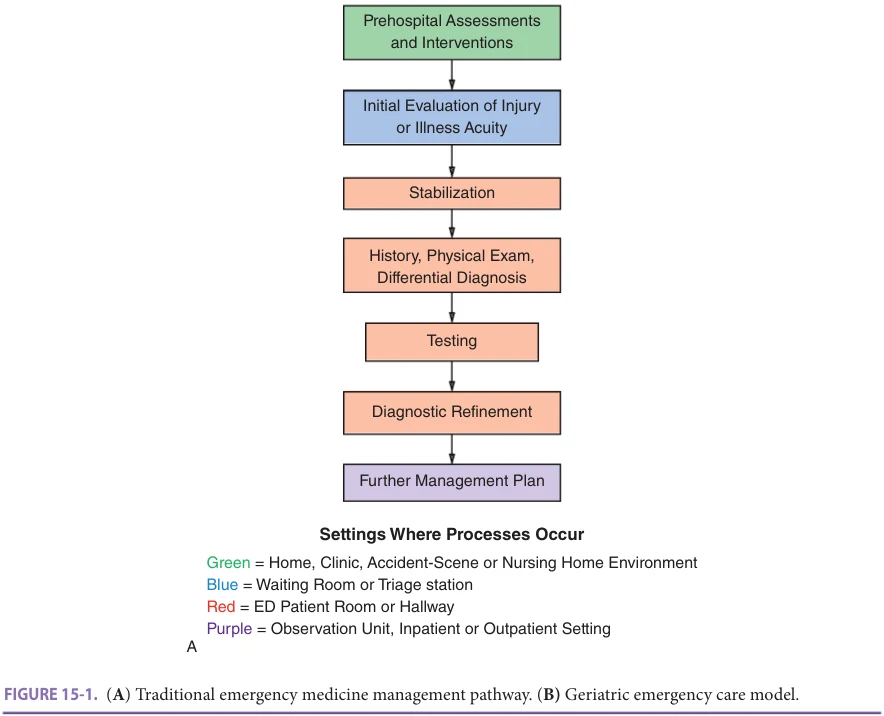

*Figure 15-1, printed p. 208.*

**[p. 209]**

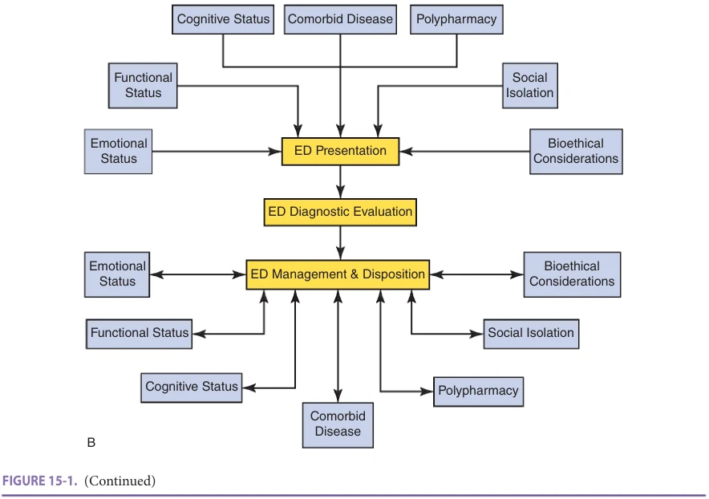

*Figure 15-1 continued, printed p. 209.*

## DELIRIUM

A range of 6% to 38% of ED adults over age 65 present with (prevalent delirium) or develop (incident delirium) delirium. Hypoactive delirium is more common than hyperactive delirium, yet has been identified by ED nurses and physicians far less frequently. Delirium is a transient symptom precipitated by an acute stressor or physiological insult, but is associated with an increased hospital length of stay, cognitive and functional decline, and post-hospital depression. Common

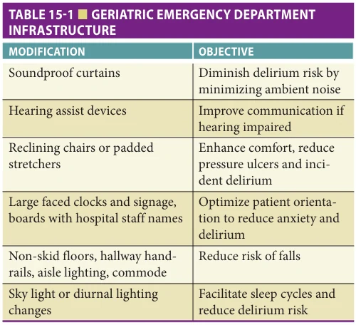

*Table 15-1, printed p. 209.*

precipitating factors are summarized in Table 15-3. ED nurse or physician judgment alone is inadequate to identify delirium accurately, so over 20 delirium screening instruments have been evaluated in this setting. Although the Confusion Assessment Method has been studied more frequently, the brief Confusion Assessment Method (bCAM), Richmond Agitation Sedation Scale, and the 4AT more favorably balance brevity, accuracy, and emergency provider acceptability (Figure 15-2). Since delirium is a symptom of an underlying physiological stressor, geriatric emergency care should

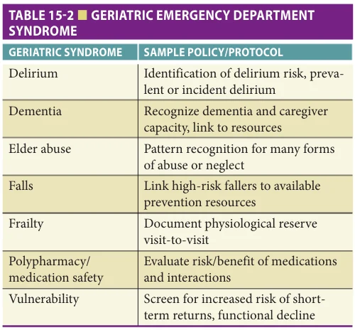

*Table 15-2, printed p. 209.*

**[p. 210]**

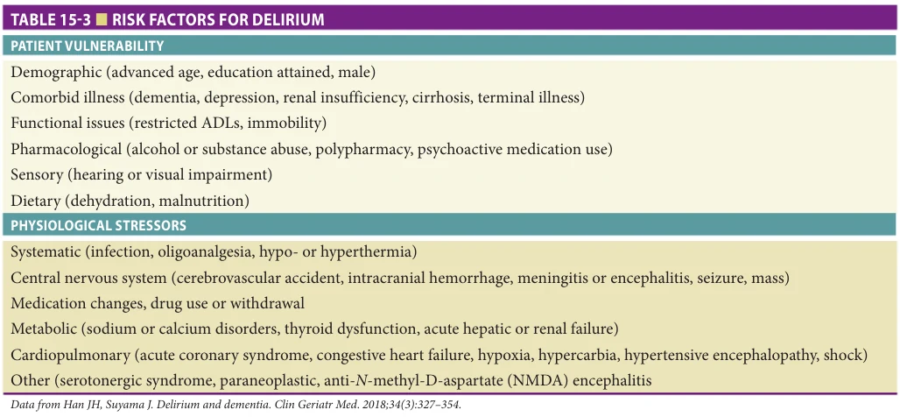

*Table 15-3, printed p. 210.*

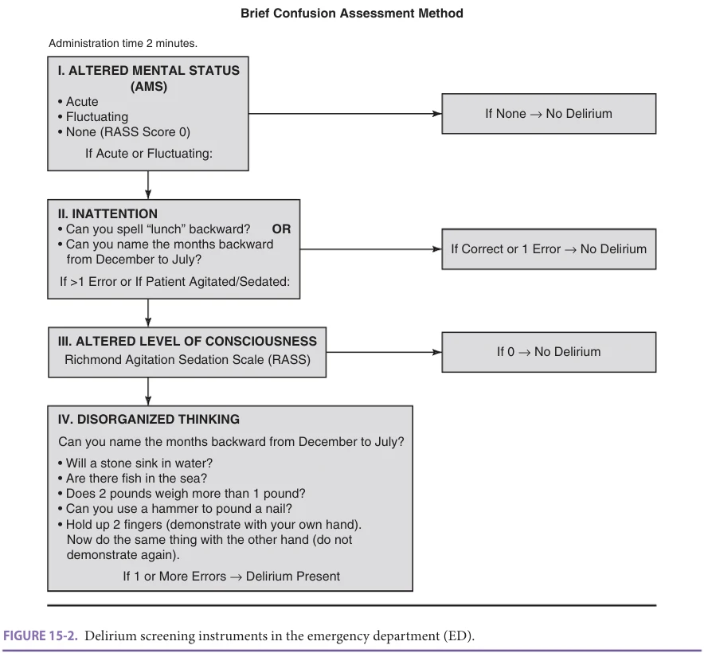

*Figure 15-2, printed p. 210.*

**[p. 211]**

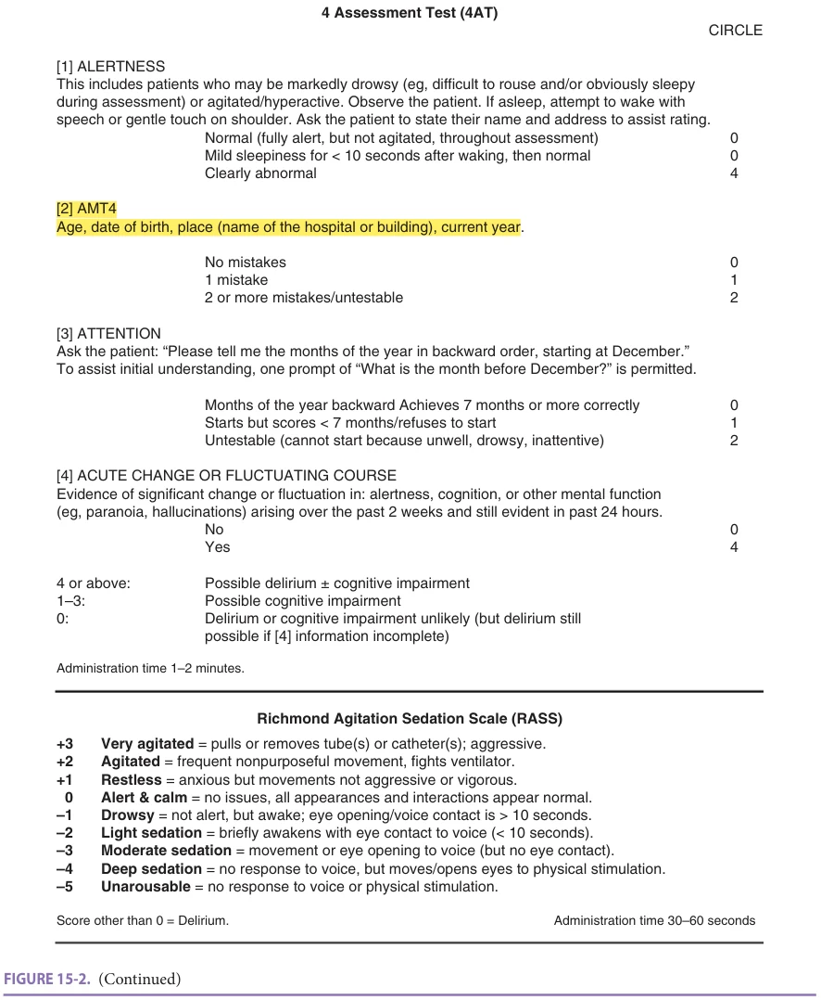

*Figure 15-2 continued, printed p. 211.*

try to identify the precipitant(s) of delirium (Table 15-3). Accurately identifying and treating the cause of delirium will require collaboration with inpatient services because patients with delirium who are discharged home without treating the delirium will return to the ED.

At least three pragmatic barriers exist to improving the detection, prevention, and management of delirium in the ED. First, simply publishing research or synthesizing recommendations into guidelines will not modify clinician behavior. Implementation Science or local quality improvement efforts are required, which is the rationale for GEDA and GEDC to

catalyze uptake of these principles. Second, even if ED teams incorporate one or more of the delirium screening instruments into routine practice, hospital providers often use different delirium detection tools and are unfamiliar with those used in emergency settings. Unfamiliarity breeds skepticism, which impedes efficient communication and harmonization of efforts to align diagnostic testing priorities, disposition decisions, and immediate management steps. Incorporating instruments used in non-emergency medicine settings may reduce reliability and/or accuracy. While awaiting research to harmonize dissimilar screening tools, clinicians should

**[p. 212]**

proactively communicate about delirium concerns and management with other health care teams and settings. Third and perhaps the most challenging scant proof-of-concept currently exists to guide actionable next steps for the prevention or treatment of delirium in the ED. While diurnal lighting and frequent reorientation described in Table 15-2 seem appropriate, these strategies remain untested in ED or geriatric ED settings. Whether pharmacologic or nonpharmacologic strategies can reduce the incidence, duration, or severity of delirium remains to be proven.

## DEMENTIA

Delirium and dementia frequently overlap in older adults in ED settings. When delirium is excluded as the cause of cognitive dysfunction in older ED patients, approximately 31% of all patients over age 65 still have a concern

for cognitive dysfunction, specifically dementia. Whether recognized or not, ED patients with dementia (or possible dementia as many lack additional neuropsychiatric evaluation in the weeks to months after an episode of emergency care), this non-delirium cognitive dysfunction is associated with prolonged length of stay, fall risk, admission rates, return visits and readmissions, and patient/care partner dissatisfaction with the care provided. When features concerning for dementia are missed in ED settings, inpatient services also frequently miss subtle findings and opportunities to improve care transitions are neglected.

While eight dementia screening instruments have been evaluated in ED settings, those that balance brevity and accuracy are favored by clinicians, including the Abbreviated Mental Test (AMT-4), Ottawa 3DY (O3DY), and caregiver-administered Alzheimer’s Disease-8 (cAD8) summarized in Figure 15-3. The cAD8 has the advantage

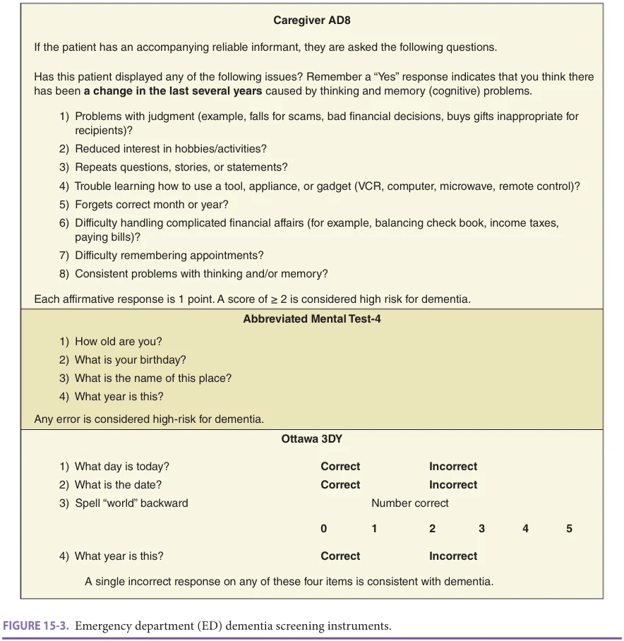

*Figure 15-3, printed p. 212.*

**[p. 213]**

of not relying upon an available, communicative, or cooperative patient in the ED where patients are often undergoing various tests and consultant evaluations. In addition, whereas AMT-4, O3DY, and most other dementia screening instruments often yield false-negative findings for more highly educated individuals, the cAD8 does not because it employs a knowledgeable care partner to report a cognitive change from baseline rather than a memory or performance test of the patient.

The recognition of possible dementia in an older ED patient affects clinical decision-making. While dementia may not be viewed as a medical emergency, the psychosocial model depicted in Figure 15-1B necessitates that effective geriatric emergency care contemplate cognitive capacity. If otherwise medically stabilized, is this patient safe to be discharged? Does the patient understand the discharge instructions, medications prescribed or deprescribed, and follow-up plan? Will the patient remember those factors after discharge? Although reflexive hospital admission is probably not the appropriate management option, transitions of care must be adapted for patients with suspected cognitive dysfunction.

Pragmatic and unanswered barriers exist to widespread dementia screening for older adults in the ED. First, these screening tools are not diagnostic for dementia. Most have positive likelihood ratios ranging from 1 to 4 and negative likelihood ratios from 0.17 to 0.39 when defining “dementia” using imperfect criterion standards such as the Mini Mental Status Exam. Clinicians and diagnosticians need to balance the theoretical value of non-delirium cognitive dysfunction screening against the possible harm of eliciting preventable anxiety for patients and families around the diagnosis of dementia. Second, inpatient and outpatient providers may be unfamiliar with ED dementia screening instruments, which can impede efficient between-clinician communication. Third and similar to delirium screening, the “so what?” implications of dementia screening remain poorly defined. Since dementia is incurable, screening has no direct therapeutic response for ED teams and dementia screening alone does not identify a cohort more likely to benefit from admission. Additionally, the impact of dementia screening on patient and family satisfaction ratings is uncertain and the cost of training/maintaining ED staff to evaluate for dementia and provide follow-up resources to higher risk individuals remains undefined.

## ELDER ABUSE

Abuse of the older adult can take many forms, including physical or psychological harms, financial exploitation, or neglect. Although up to 10% of older adults in the United States experience some form of abuse each year, as few as 1 in 14 cases are reported. Screening for elder abuse in ED settings is frequently fraught with challenges, including a paucity of research to guide screening protocols and

effective interventions as well as the ethical quandary of patient denial motivated by fear of retribution by the perpetrator. Nonetheless, the clinical and forensic science of detecting and preventing elder abuse continues to evolve. The Senior Aid Tool (Figure 15-4) is a sensitive and reasonably specific screening instrument for elder abuse, but awaits external validation, feasibility assessment, and impact analysis demonstrating benefits beyond improved detection rates.

Preventing elder abuse requires a team-based approach that begins in the pre-hospital environment and continues through the ED into the post-ED setting with coordinated communication between social work, nursing, physicians, and law enforcement. Some hospitals have established “Vulnerable Elder Protection Teams” to standardize and coordinate the detection, comprehensive evaluation, and treatment for potential victims of elder abuse. ED elder abuse experts recommend simplifying data collection forms that include photographic evidence of visible injuries as well as documented and coordinated communication with radiologists when common injury patterns appear.

## FALLS

Individuals over age 65 comprise one-fourth of trauma admissions with ground-level falls becoming an increasing proportion of those cases as populations age. Among community-dwelling older adults over age 65, one-third experience a fall each year, which increases, to 50% for those over age 80. An ED evaluation for a fall is often the only medical contact these patients have and an opportunity to prevent future fall injuries. Yet 36% to 50% of these patients experience a recurrent fall, ED revisit, or death within 1 year of an initial fall.

ED nurses and physicians acknowledge a role in proactively preventing future fall injuries for frail older adults, but cite pragmatic barriers to routine fall prevention secondary to inadequate training around risk stratification, insufficient emergency medicine-specific fall assessment tools, and uncertain access to downstream fall prevention resources. Part of the problem is that falls are often complex and multifactorial with predisposing fall risks (Figure 15-5A), diminished physiological factors to avoid fall injuries (Figure 15-5B), and an increased risk of injuries from ground-level falls (Figure 15-5C). Furthermore, there is no widely accepted post-ED fall risk assessment instrument. Another barrier to routine fall prevention initiatives is the perception of therapeutic nihilism since complex and individualized interventions often fail to reduce fall-related injuries. For example, the Strategies to Reduce Injuries and Develop Confidence in Elders pragmatic randomized controlled trial utilized risk assessments to formulate individualized fall prevention interventions, yet failed to effectively prevent the first injurious fall. Similarly, an ED-based randomized controlled trial to deprescribe

**[p. 214]**

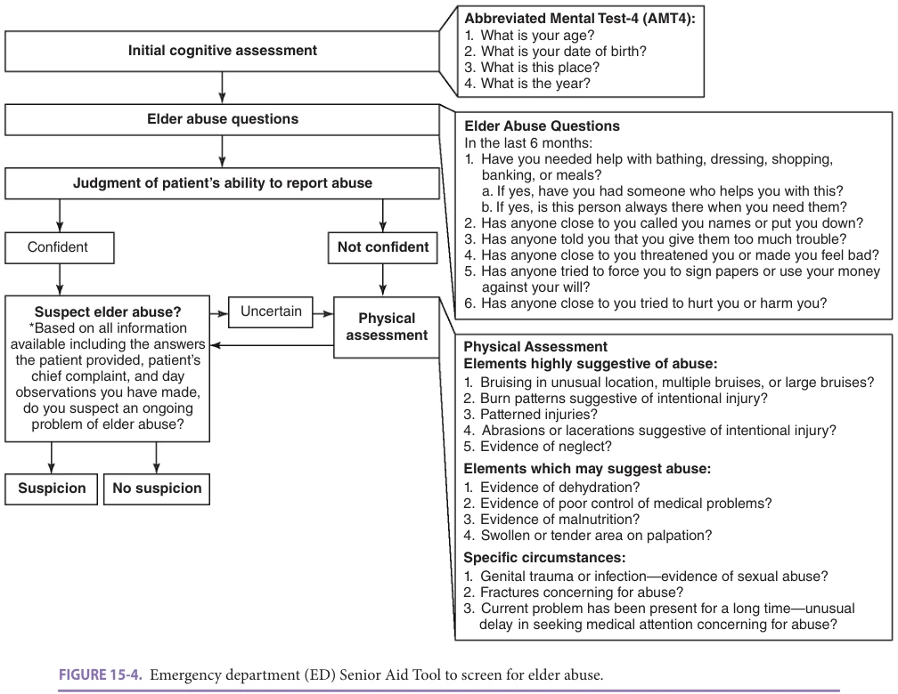

*Figure 15-4, printed p. 214.*

medications associated with increased fall risk did not reduce falls at 1 year. However, another academic ED protocol that incorporated physical therapy and pharmacy to formulate a brief and individualized intervention during a visit for a fall reduced both overall and fall-related revisits at 6 months. Feasible approaches for ED initiated secondary falls prevention undoubtedly require a local champion, transdisciplinary coordination, and accessible resources to promote patient cooperation (Figure 15-6).

Figure 15-6 illustrates the real-world settings of falls prevention research moving forward: the outpatient clinic, the ED, the homes of older patients, the practice sites of nurse case managers and physical therapists, and the community. Identifying effective falls prevention strategies in post-STRIDE research necessitates a multipronged approach incorporating Implementation Science principles and an evolving understanding of impactful shared decision-making. Transdisciplinary alignment and harmonization of fallrelated definitions, screening instruments, and outcome measures while catalyzing impactful change can promote healthy skepticism while avoiding therapeutic nihilism and advance patient-centric falls prevention. Rapidly learning

health systems can integrate incremental improvements from multiple settings to improve their research and clinical practice.

## VULNERABILITY AND FRAILTY

As the proportion of older adults presenting to EDs increases in coming decades, health care systems will seek screening processes to identify subsets more or less likely to experience preventable short-term adverse outcomes, such as return visits, functional decline, institutionalization, or death. Many instruments exist to quantify such “vulnerability” (Table 15-4), but currently none accurately identifies either a high-risk or low-risk subset. Reasons underlying inadequate accuracy of these instruments include between-study variability in processes, definitions, interventions, outcomes, and objectives. One approach to align finite resources with populations most likely to benefit is depicted in Figure 15-7. Researchers continue efforts to derive more accurate instruments, while clinicians focus low intensity and widely available interventions on commonly harmful scenarios such as falls and delirium as previously discussed.

**[p. 215]**

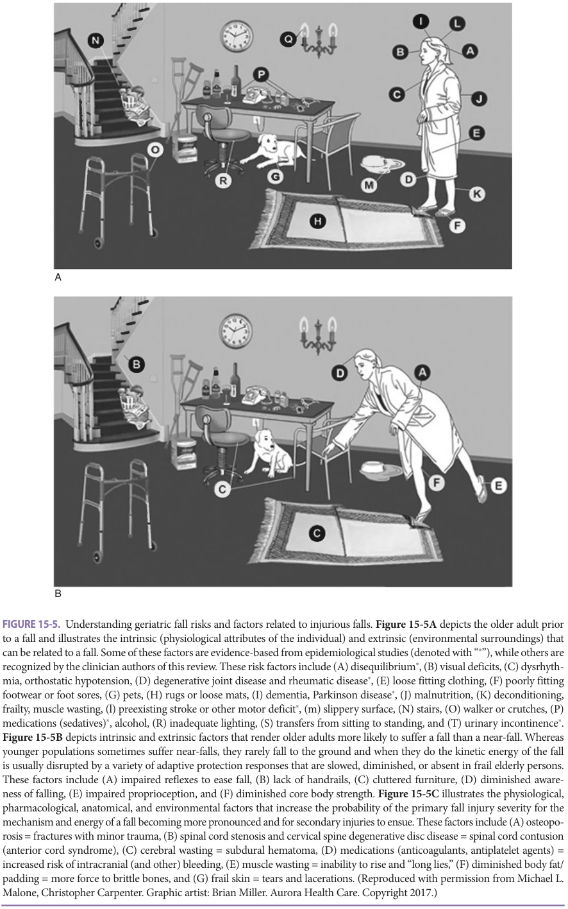

*Figure 15-5, printed p. 215.*

**[p. 216]**

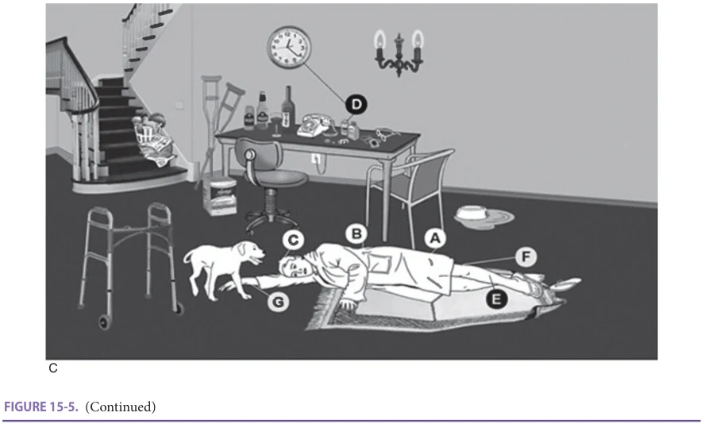

*Figure 15-5 continued, printed p. 216.*

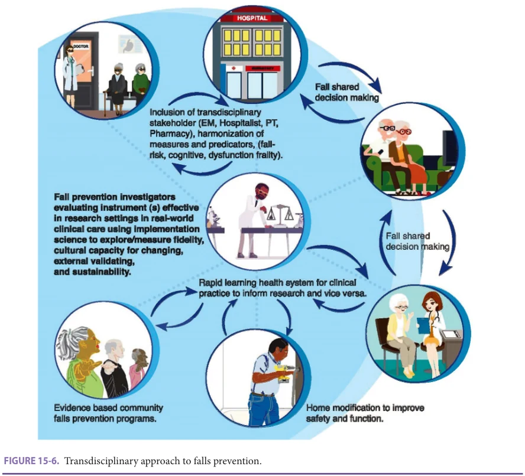

*Figure 15-6, printed p. 216.*

**[p. 217]**

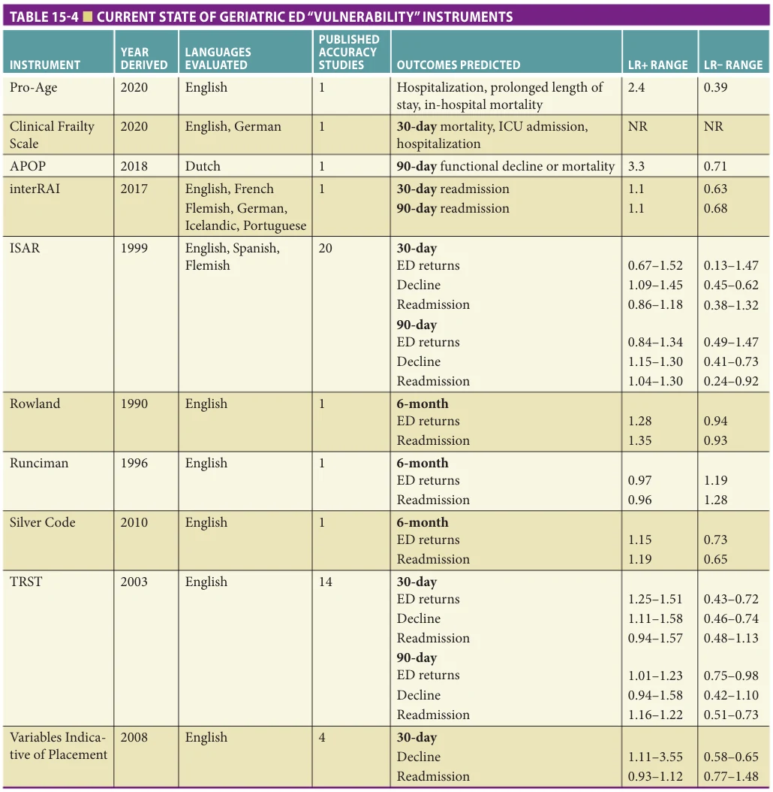

*Table 15-4, printed p. 217.*

Frailty is an increased vulnerability to incomplete homeostasis after a physiological stressor. While early constructs of frailty failed to identify ED older adults at increased risk of preventable short-term adverse outcomes to the same extent as the instruments described in Table 15-4, the Clinical Frailty Scale appears to be a feasible, accurate, and reliable instrument to predict 30-day mortality. Whether the Clinical Frailty Scale can stratify older adults into higher or lower risk of return visits or functional decline, or if such identification can be linked to interventions that alter that trajectory, remains to be determined.

## MEDICATION SAFETY

The ACEP Geriatric Emergency Department Guidelines and emergency medicine resident core curriculum both emphasize the importance of identifying and deprescribing high-risk medications primarily guided by Beers Criteria. However, Beers Criteria generally apply to the longer duration prescriptions provided in long-term care or outpatient clinic settings. The short time frame prescriptions commonly provided in the ED may represent a unique risk–benefit profile that remains relatively untested. Therefore, Beers Criteria are not unquestionably accepted

**[p. 218]**

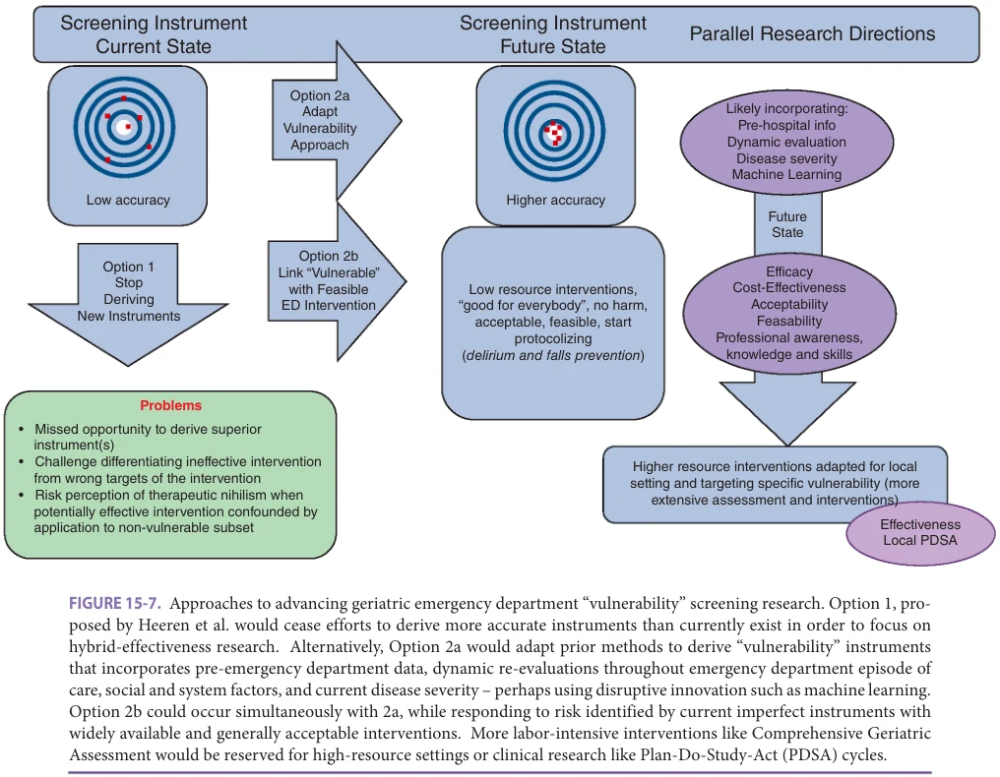

*Figure 15-7, printed p. 218.*

as an indication of high-risk medications by ED teams. Nonetheless, Beers Criteria are frequently used in research and guidelines as one component of inappropriate medication prescribing for older adults. The Enhancing Quality of Provider Practices for Older Adults in the Emergency Department (EQUiPPED) protocol combines education with personal provider feedback and electronic clinical decision support to improve medication safety. Across four Veteran’s Affairs hospitals, EQUiPPED demonstrated a significant and sustained reduction of potentially inappropriate medication prescribing at 1 year. EQUiPPED implementation kits for accelerated uptake of this medication safety initiative have also been developed in nonVeterans Affairs EDs.

Apart from these protocols, ED clinicians should be continuously aware of the potential of drugs to cause or exacerbate symptoms and interact with each other or with underlying diseases. In addition, many older adults are overtreated with hypoglycemic and antihypertensive medicine, which can result in ED visits. In these circumstances ED clinicians should initiate a deprescribing effort and communicate their findings and recommendations to the patient’s physicians either through the patient or directly.

## GERIATRIC EMERGENCY MEDICINE: THE NEAR FUTURE

As clinical researchers unravel the science of efficacious and cost-effective geriatric emergency care, others continue to expand the realm of possibilities with disruptive innovation. The original vision to enhance the process, experience, and outcomes of older adult emergency medicine depicted a dedicated location in the department distinct from sites where care for other populations occurred. Improving older adult emergency care need not rely upon a localized geriatric ED because many hospitals will lack the resources for this investment. Instead, alternative approaches include a geriatric observation unit, a focused practitioner model, or simply a site opinion leader to facilitate continuing medical education and local quality improvement initiatives. Adults over age 65 already represent over 30% of observation unit admissions, which is disproportionate to their overall ED volume. The observation unit can serve as another option to hospital admission by providing time to evaluate therapeutic response, obtain additional testing or consultations, and facilitate care transitions. The focused practitioner model can include a physician-led, trained

**[p. 219]**

geriatric emergency medicine (GEM) nurse or transitional care nurse, as well as lesser-trained personnel such as a “geriatric technician”–based volunteer model. In two observational studies across three academic hospitals, transitional care nurses reduced admission and readmission rates, but increased 72-hour returns. The GEM nurse model requires a significant investment in extra training and appears to increase geriatric syndrome screening rates. Establishing a qualified volunteer-based program in the ED requires an institutional commitment, continual onboarding and quality control processes, and a health care provider leader, but has been successfully implemented at two large academic centers with reasonable acceptance by nurses and physicians.

The twenty-first century technology revolution will inevitably affect geriatric emergency medicine as well. During the COVID-19 global pandemic when patients shunned EDs for fear of exposure to the life-threatening virus, telemedicine emerged as a viable alternative for acute care. Potential (and untested) applications of telemedicine for geriatric emergency care include evaluation of stable long-term care facility, rehabilitation unit, homebound, or rural patients who have a change in condition prior to transfer to an ED. This can be done in collaboration with the patient’s primary care providers and/or paramedics. In addition, more resourced geriatric EDs

## FURTHER READING

Beach SR, Carpenter CR, Rosen T, Sharps P, Gelles R.

Screening and detection of elder abuse: research opportunities and lessons learned from emergency geriatric care, intimate partner violence, and child abuse. J Elder Abuse Negl. 2016;28(4-5):185–216. Berning MJ, Silva LOJE, Espinoza-Suarez N, et al. Interven-

tions to improve older adults’ emergency department patient experience: a systematic review. Am J Emerg Med. 2020;38(6):1257–1269. Carpenter CR, Avidan MS, Wildes T, Stark S, Fowler SA,

Lo AX. Predicting geriatric falls following an episode of emergency department care: a systematic review. Acad Emerg Med. 2014;21(10):1069–1082. Carpenter CR, Banerjee J, Keyes D, et al. Accuracy of

dementia screening instruments in emergency medicine: a diagnostic meta-analysis. Acad Emerg Med. 2019; 26(2):226–245. Carpenter CR, Cameron A, Ganz DA, Liu S. Older adult

falls in emergency medicine: 2019 update. Clin Geriatr Med. 2019;35(2):205–219. Carpenter CR, Émond M. Pragmatic barriers to assess-

ing post-emergency department vulnerability for poor outcomes in an ageing society. Neth J Med. 2016;74(8): 327–329.

with personnel available to screen for geriatric syndromes described in Table 15-2 could remotely assess patients via telemedicine. Other emerging technologies that can catalyze improved geriatric emergency care without adding work for ED staff include pad-based screening for delirium and machine learning approaches to detect individuals at risk for dementia, delirium, falls, or other geriatric syndromes.

## CONCLUSION

Sustainable and measurable geriatric emergency medicine advancement requires a village that extends beyond one specialty, discipline, or hospital locale. It must incorporate collaborative, transdisciplinary personnel and adapt around the infrastructure of the local ED to be successful. Ultimately, widely implementable improvements in the process, experience, or outcomes of geriatric emergency care must be cost-neutral and patient-centered. As clinical research expands around geriatric emergency medicine assessment accuracy and intervention effectiveness, guidelines and accreditation will continue to catalyze health care systems to engage in process redesign. Emergency care must become more adept at addressing the needs of an aging population and not allow perfection to impede necessary but incremental improvements.

Carpenter CR, Hammouda N, Linton EA, et al. Delirium

prevention, detection, and treatment in emergency medicine settings: A Geriatric Emergency Care Applied Research (GEAR) Network Scoping Review and Consensus Statement. Acad Emerg Med. 2021;28(1):19–35. Carpenter CR, Malone ML. Avoiding therapeutic nihilism for

complex geriatric intervention ‘negative’ trials: STRIDE lessons. J Am Geriatr Soc. 2020;68(12): 2752–2756. Carpenter CR, Mooijaart SP. Geriatric Screeners 2.0:

time for a paradigm shift in emergency department vulnerability research. J Am Geratr Soc. 2020;68(7): 1402–1405. Carpenter CR, Shelton E, Fowler S, Suffoletto B, Platts-

Mills TF, Rothman RE, et al. Risk factors and screening instruments to predict adverse outcomes for undifferentiated older emergency department patients: a systematic review and meta-analysis. Acad Emerg Med. 2015;22(1):1–21. Conroy S, Carpenter C, Banerjee J. Silver Book II: Quality

Urgent Care for Older People, British Geriatrics Society, 2021. Available at https://www.bgs.org.uk/resources/ resource-series/silver-book-ii. Dresden SM, Hwang U, Garrido MM, et al. Geriatric emer-

gency department innovations: the impact of transitional

**[p. 220]**

care nurses on 30-day readmissions for older adults. Acad Emerg Med. 2020;27(1):43–53. Goldberg EM, Marks SJ, Resnik LJ, Long S, Mellott H,

Merchant RC. Can an emergency department-initiated intervention prevent subsequent falls and health care use in older adults? A randomized controlled trial Ann Emerg Med. 2020;76(6):739–750. Hwang U, Dresden SM, Rosenberg MS, et al. Geriatric emer-

gency department innovations: transitional care nurses and hospital use. J Am Geratr Soc. 2018;66(3):459–466. Hwang U, Dresden SM, Vargas-Torres C, et al. Association

of a Geriatric Emergency Department Innovation Program with cost outcomes among Medicare beneficiaries. JAMA Netw Open. 2021;4(3):e2037334. Hwang U, Morrison RS. The geriatric emergency depart-

ment. J Am Geriatr Soc. 2007;55(11):1873–1876. Kaeppeli T, Rueegg M, Dreher-Hummel T, et al. Validation

of the Clinical Frailty Scale for prediction of thirty-day mortality in the emergency department. Ann Emerg Med. 2020;76(3):291–300. Lee JS, Tong T, Tierney MC, Kiss A, Chignell M. Predic-

tive ability of a serious game to identify emergency patients with unrecognized delirium. J Am Geriatr. Soc 2019;67(11):2370–2375. Lo AX, Carpenter CR. Balancing evidence and economics

while adapting emergency medicine to the 21st century’s

geriatric demographic imperative. Acad Emerg Med. 2020;27(10):1070-1073. Rosen T, LoFaso VM, Bloemen EM, et al. Identifying

injury patterns associated with physical elder abuse: analysis of legally adjudicated cases. Ann Emerg Med. 2020;76:266–276. Rosenberg M, Carpenter CR, Bromley M, et al. Geriatric

emergency department guidelines. Ann Emerg Med. 2014;63(5):e7–e25. Sanon M, Baumlin KM, Kaplan SS, Grudzen CR. Care

and Respect for Elders in Emergencies program: a preliminary report of a volunteer approach to enhance care in the emergency department. J Am Geratr Soc. 2014;62(2):365–370. Southerland LT, Hunold KM, Carpenter CR, Caterino JM,

Mion LC. A National dataset analysis of older adults in emergency department observation units. Am J Emerg Med. 2019;37(9):1686–1690. Southerland LT, Lo AX, Biese K, et al. Concepts in prac-

tice: geriatric emergency departments. Ann Emerg Med. 2020;75(2):162–170. Stevens M, Hastings SN, Markland AD, et al. Enhancing

Quality of Provider Practices for Older Adults in the Emergency Department (EQUiPPED). J Am Geratr Soc. 2017;65(7):1609–1614.
