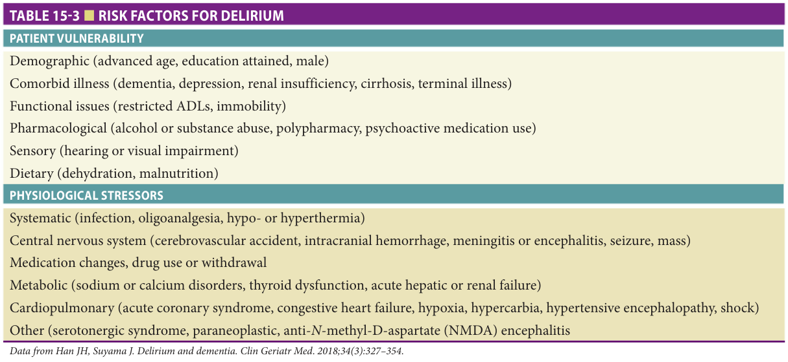
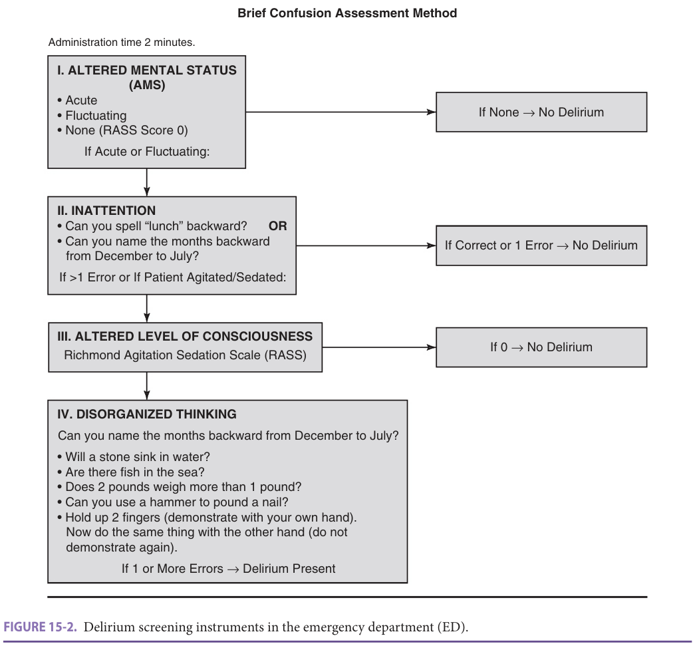
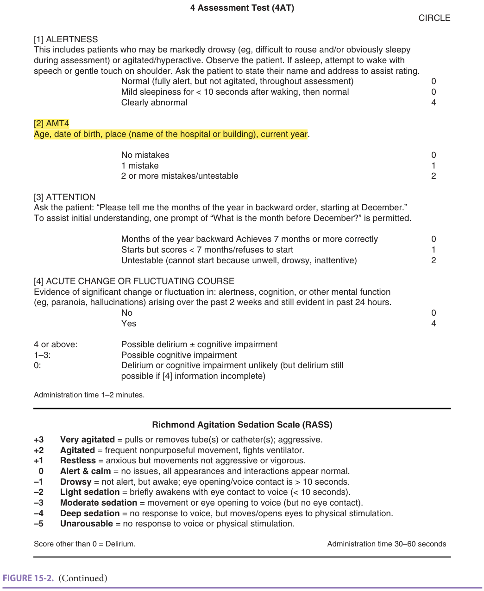
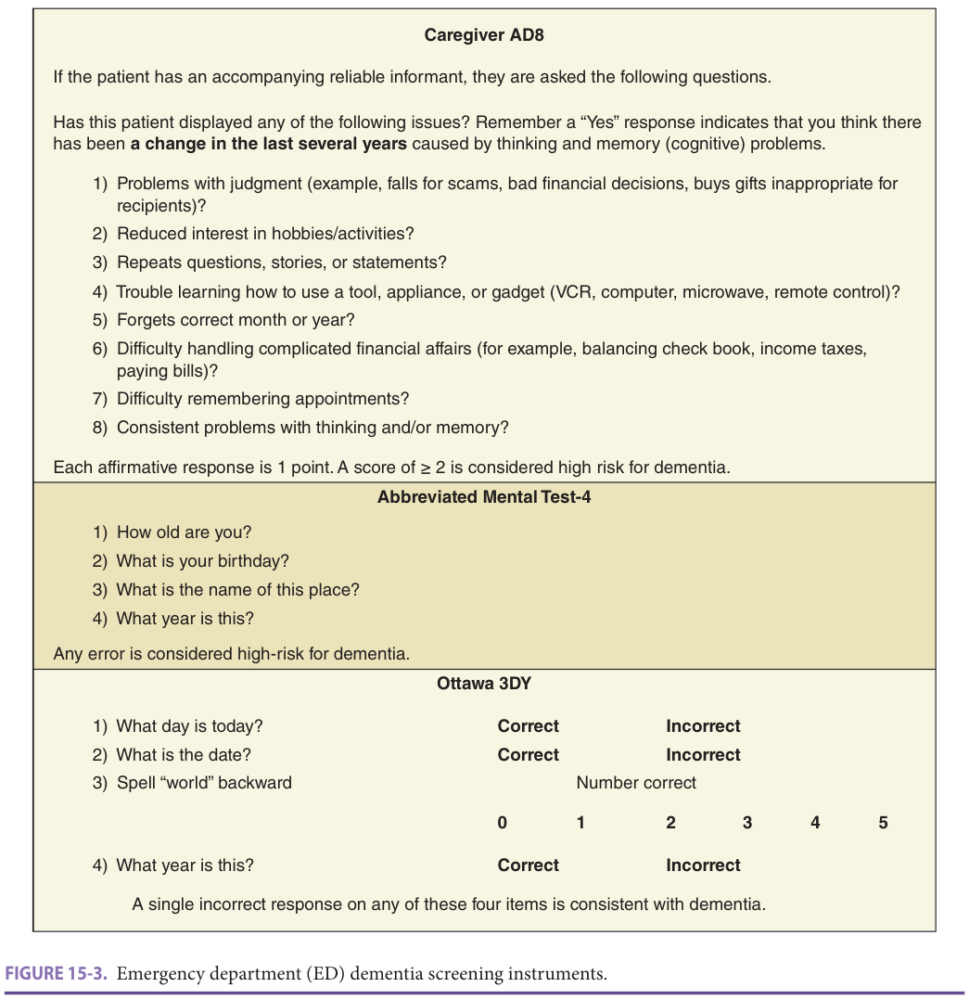
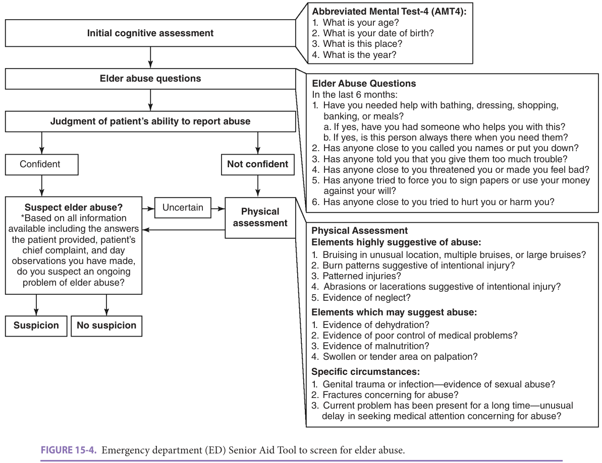

# Emergency Department Care — Study

Study summary of Chapter 15, Hazzard's Geriatric Medicine and Gerontology, 8e.

**Study page only - full chapter not in the reader.** Summary and recall drill from the book; the book remains the reference. Fast build from the book; not lane-reviewed.

## Summary

### The geriatric emergency-care model

**[p. 207]**

- Rapid evaluation of an isolated acute complaint is insufficient for many older adults. Geriatric emergency care coordinates emergency medicine, geriatrics, therapy, nutrition, inpatient teams, primary care, and community services. Accreditation and shared learning networks support measurable process improvement (p207).

**[p. 208]**

- A geriatric-friendly room alone is insufficient: staffing, continuing education, syndrome-specific protocols, and local resources matter more. A general hospital policy becomes geriatric ED work when adapted to relevant geriatric processes and outcomes. Medication-safety work benefits from pharmacy expertise (p208).

### Delirium: presentation, consequences, and vulnerability

**[p. 209]**

- **6–38%** of ED adults older than **65** present with or develop delirium. **Hypoactive** delirium is more common than hyperactive delirium and is recognized less often. Associations include longer admission, cognitive and functional decline, and **post-hospital depression** (p209).
- Delirium signals an acute physiological insult. Clinician judgment alone is inadequate for identification. The chapter favors the balance of brevity, accuracy, and ED acceptability of bCAM, RASS, and the 4AT; identifying the precipitating illness remains essential (p209).
- Environmental modifications: soundproof curtains reduce ambient noise; hearing assistance improves communication; reclining/padded seating improves comfort and limits pressure injury; clocks, signs, and staff-name boards support orientation; nonslip floors, rails, lighting, and commodes address falls; diurnal light supports sleep. Protocols address delirium, dementia/caregiver capacity, abuse, falls, frailty, medication safety, and vulnerability (Tables 15-1/15-2, p209).

**[p. 210]**

- **Predisposing vulnerabilities:** advanced age, educational attainment and male sex; dementia, depression, renal insufficiency, cirrhosis or terminal illness; restricted ADLs/immobility; substance/alcohol misuse, polypharmacy or psychoactive drugs; impaired hearing/vision; dehydration or malnutrition (Table 15-3, p210).
- **Precipitants:** infection, undertreated pain and temperature disturbance; stroke, intracranial bleeding, CNS infection, seizure or mass; medication changes, drug use or withdrawal; sodium/calcium or thyroid disorders and acute hepatic/renal failure; acute coronary syndrome, heart failure, hypoxia, hypercarbia, hypertensive encephalopathy or shock; serotonergic, paraneoplastic or anti-NMDA syndromes (Table 15-3, p210).
- bCAM probes acute/fluctuating mental status, attention, level of consciousness and disorganized thinking. The source diagram uses backward spelling/months, simple reasoning questions and a hand command (Figure 15-2, p210). The AMT4 items tested by the official question citing this page are printed on the next page: [p211](#p211).

Book table: all delirium vulnerabilities and precipitants (p210)

*Highlighting is the owner's annotation, not the book's.*

Book figure: bCAM panel as printed (p210)

*Highlighting is the owner's annotation, not the book's.*

**Book inconsistency:** this panel's arrow from normal RASS to “No Delirium” conflicts with the book's CAM/bCAM rule in Table 58-3, p884: acute change plus inattention and either altered consciousness or disorganized thinking. Normal alertness alone does not exclude that combination. [See the book's delirium chapter](?chapter=58#p884).

### 4AT and AMT4: complete scoring from the source

**[p. 211]**

| 4AT component | Finding | Points |
| --- | --- | --- |
| Alertness | Normal throughout, or mild sleepiness lasting <10 seconds after waking then normal | 0 |
| Alertness | Clearly abnormal | 4 |
| AMT4: age, date of birth, place/building, current year | No errors | 0 |
| AMT4 | One error | 1 |
| AMT4 | Two or more errors, or untestable | 2 |
| Attention: months backward from December | At least 7 correct months | 0 |
| Attention | Starts but fewer than 7 correct, or refuses to start | 1 |
| Attention | Cannot start because unwell, drowsy or inattentive | 2 |
| Acute change/fluctuation in alertness, cognition or other mental function, arising in past 2 weeks and still evident in past 24 hours | Absent / present | 0 / 4 |

All scoring and time windows above: Figure 15-2, p211. A single introductory prompt asking the month before December is permitted. Asking name/address assists **alertness** assessment; **name is not an AMT4 item** (p211).

- **≥4:** possible delirium with or without cognitive impairment; **1–3:** possible cognitive impairment; **0:** either unlikely, but delirium remains possible if acute-change information is incomplete. Administration takes **1–2 minutes**. These are screening interpretations, not proof of etiology (Figure 15-2, p211).
- The figure's abbreviated **RASS** panel prints: **+3** very agitated, removing tubes/catheters or aggressive; **+2** frequent nonpurposeful movement/fighting ventilator; **+1** restless/anxious without vigorous aggression; **0** alert/calm; **−1** drowsy with voice contact >**10 seconds**; **−2** briefly awake with voice eye contact <**10 seconds**; **−3** movement/eye opening to voice without eye contact; **−4** movement/eye opening only to physical stimulation; **−5** no response to either. It gives **30–60 seconds** for administration (p211).
- **As printed:** the RASS panel says a nonzero score equals delirium. Treat this as the figure's screening shorthand, not a stand-alone diagnosis; the book's delirium chapter requires assessment of attention, acuity and cognitive change (Chapter 58, pp879–880). The abbreviated panel above is the book's displayed panel, not a claim to reproduce every RASS category.
- Treat the precipitant and communicate with inpatient teams. Discharging a patient with untreated delirium invites return visits. Implementation, differing tools across services and limited ED intervention evidence impede improvement (p211).

Book figure: 4AT scoring and abbreviated RASS panel (p211)

*Highlighting is the owner's annotation, not the book's.*

### Non-delirium cognitive impairment and safe transitions

**[p. 212]**

- After delirium is excluded, approximately **31%** of ED patients over **65** still have concern for cognitive dysfunction. This is associated with longer stays, falls, admissions, returns/readmissions and dissatisfaction. The chapter stresses that proof of ED delirium-prevention/treatment benefit remains limited, even for plausible orientation and lighting strategies (p212).
- **Caregiver AD8:** a reliable informant identifies change over the preceding years in judgment, hobbies/interest, repetitive statements, learning appliances/tools, remembering month/year, complex finances, appointments and consistent thinking/memory problems. Each affirmative response scores **1**; **≥2** indicates high dementia risk (Figure 15-3, p212).
- **AMT4:** age, birthday, place and year. **Any error** indicates high dementia risk in this dementia-screening use. This differs from the graded AMT4 subscore within the 4AT (Figure 15-3, p212; Figure 15-2, p211).
- **Ottawa 3DY:** day, date, spelling “world” backward and year. Any incorrect item is screen-positive in the printed figure. The label describes the instrument; it does not mean there are only three questions (Figure 15-3, p212).

Book figure: complete ED dementia screening instruments (p212)

*Highlighting is the owner's annotation, not the book's.*

**[p. 213]**

- Informant cAD8 can be used when the patient is unavailable or uncooperative and assesses **change from baseline**. It avoids the education-related false negatives seen with some performance-based instruments. These tests **do not diagnose dementia**: reported positive likelihood ratios are mostly **1–4**, negative ratios **0.17–0.39**, against imperfect reference standards (p213).
- Before discharge assess whether the patient can understand and remember instructions, medication changes and follow-up, and whether the setting is safe. Suspected dementia does not automatically justify admission. Communicate limitations and adapt transitions; screening alone has no established direct therapeutic response or demonstrated ability to select those benefiting from admission (p213).
- **Elder abuse:** physical/psychological harm, financial exploitation and neglect. Up to **10%** of older US adults experience abuse annually; as few as **1 in 14** cases are reported. Fear of retaliation can suppress disclosure. The chapter describes Senior Aid as sensitive and reasonably specific, while still requiring external validation, feasibility and outcome-impact assessment (p213).
- Evaluation and protection require coordinated social work, nursing, physicians and law enforcement; some centers use vulnerable-elder protection teams. Simplified documentation, injury photographs and coordinated radiology communication support evaluation (p213).
- **Falls:** among community-dwelling adults over **65**, about **one-third** fall yearly, increasing to **50%** after **80**. Following an initial fall, **36–50%** experience recurrent fall, ED revisit or death within **1 year**. These are a composite adverse outcome, not a recurrent-fall rate alone. Risk is multifactorial, and no widely accepted post-ED risk instrument exists (p213).

### Senior Aid: why AMT4 also appears in an abuse screen

**[p. 214]**

- Begin with **AMT4 cognitive assessment**, ask abuse questions, then judge whether the patient can reliably report abuse. If confident, integrate the answers, chief complaint and observations; if uncertain or not confident, perform the physical assessment before forming suspicion (Figure 15-4, p214).
- Abuse questions cover the preceding **6 months**: need for bathing/dressing/shopping/banking/meal help and whether needed assistance is reliably available; insulting or belittling language; being told one causes too much trouble; threats or emotional harm; coercion to sign papers or misuse money; and attempted physical harm (p214).
- Findings **highly suggestive** of abuse: unusual/multiple/large bruises, intentional-pattern burns, patterned injuries, suspicious abrasions/lacerations and neglect. Findings that **may suggest** abuse: dehydration, poorly controlled illness, malnutrition and tender/swollen areas. Specific circumstances: genital trauma/infection suggesting sexual abuse, concerning fractures, and an unusual delay in seeking help (p214).
- **Exam distinction:** the same AMT4 orientation questions appear within **4AT delirium screening**, **ED dementia screening**, and **Senior Aid abuse screening**; this chapter does not place AMT4 in an inpatient depression/suicide screen (Figures 15-2/15-3/15-4, pp211–214).
- Fall interventions show mixed results: ED medication deprescribing alone did not reduce falls at **1 year**, whereas a brief individualized PT/pharmacy intervention reduced overall and fall-related returns at **6 months**. Local champions, coordination and accessible follow-up matter. Existing vulnerability instruments do not accurately identify both high- and low-risk subsets for the broad short-term outcomes under discussion (p214).

Book figure: complete Senior Aid Tool and assessment items (p214)

*Highlighting is the owner's annotation, not the book's.* The official references cite pages; the figures here supply the tested instruments, without converting a page citation into an explicit figure citation.

### Rest of the chapter: falls, frailty, medication safety and delivery models

**[p. 215]**

- Distinguish factors causing a fall from impaired protective responses and factors worsening injury. Examples: balance/vision/mobility deficits, sedating drugs and environmental hazards cause falls; poor reflexes, proprioception and core strength impair recovery; osteoporosis, cervical degeneration, cerebral atrophy, antithrombotics, reduced muscle/padding and fragile skin increase injury or the consequences of prolonged time on the floor (Figure 15-5, p215).

**[p. 216]**

- Fall prevention links emergency and inpatient care, PT/pharmacy, community programs, home modification and shared decision-making. Implementation must be assessed in real-world settings (Figure 15-6, p216).

**[p. 217]**

- Frailty denotes vulnerability to incomplete restoration of homeostasis after a stressor. The Clinical Frailty Scale appears feasible and useful for **30-day mortality** prediction, but prediction of returns/functional decline and benefit from acting on its result remain unestablished here. Table 15-4 compares Pro-Age, CFS, APOP, interRAI, ISAR, Rowland, Runciman, Silver Code, TRST and Variables Indicative of Placement; their outcomes and accuracy vary (p217).
- Beers criteria inform ED medication safety, but the chapter cautions that brief ED prescriptions can have a different, relatively untested risk–benefit profile from chronic prescribing (p217).

**[p. 218]**

- EQUiPPED combines clinician education, individual feedback and electronic decision support; potentially inappropriate prescribing fell sustainably at **1 year** across **four** VA hospitals. Consider adverse drug effects/interactions and hypoglycemic/antihypertensive overtreatment; start appropriate deprescribing and communicate with the usual prescriber (p218).
- Geriatric care can use observation units, focused practitioners or local clinical leaders instead of a dedicated physical ED. Observation allows response assessment, tests/consults and transition planning (p218).

**[p. 219]**

- Transitional-care nursing can reduce admission/readmission while increasing early returns; specialized nurses and volunteer models require training, leadership and quality control. Telemedicine and technology-assisted screening are emerging approaches whose proposed uses still require evaluation. Sustainable care depends on local, collaborative and patient-centered improvement (p219). Further-reading bibliography continues on p220; it is not additional clinical teaching.

## Drill

**1. Which delirium motor subtype is more common in the ED, and which later mood outcome is associated with delirium?**

Answer

Hypoactive delirium is more common and more often missed. Delirium is associated with post-hospital depression as well as cognitive/functional decline and longer admission (p209).

**2. What prevalence/incidence range does the chapter give for delirium in older ED patients?**

Answer

6–38% of ED adults over 65 present with or develop delirium; the range includes prevalent and incident cases (p209).

**3. Which sex is listed among delirium vulnerabilities, and what reversible nutritional factors are listed?**

Answer

Male sex; dehydration and malnutrition. The table separates baseline vulnerability from acute physiological precipitants (Table 15-3, p210).

**4. What are the AMT4 questions? Is the patient's name one of them?**

Answer

Age, date of birth, place/building and current year. Name is not an AMT4 item; name/address help assess alertness in the 4AT instructions (p211).

**5. How are AMT4 errors scored within the 4AT?**

Answer

No errors = 0; one error = 1; two or more errors or untestable = 2 (p211).

**6. How is backward-month attention scored in the 4AT?**

Answer

At least 7 correct months = 0; fewer than 7 or refusal = 1; unable to start because unwell, drowsy or inattentive = 2. Start at December; one initial explanatory prompt is allowed (p211).

**7. What acute-change window does the 4AT use, and how many points does it contribute?**

Answer

Significant change/fluctuation arising within 2 weeks and still evident in the past 24 hours: 4 points if present, 0 if absent (p211).

**8. What do the 4AT total-score bands mean?**

Answer

≥4 suggests possible delirium with or without cognitive impairment; 1–3 possible cognitive impairment; 0 makes either unlikely, though incomplete acute-change information can still miss delirium (p211).

**9. How does the AMT4 threshold in dementia screening differ from its 4AT subscore?**

Answer

For ED dementia screening, any AMT4 error flags high risk (p212). Within 4AT it contributes a graded subscore, not a stand-alone delirium diagnosis (p211).

**10. Why might caregiver AD8 help when a highly educated patient passes brief performance testing?**

Answer

It asks a reliable informant about cognitive change from baseline and avoids the education-related false negatives described for several patient performance screens (p213). Its positive threshold is at least 2 affirmative changes (p212).

**11. Which three screening contexts in this chapter include AMT4?**

Answer

4AT delirium screening (p211), ED dementia screening (p212), and initial cognitive assessment in the Senior Aid elder-abuse tool (p214).

**12. What follows uncertain confidence in a patient's ability to report abuse?**

Answer

A physical assessment for suggestive injury/neglect and other concerning findings, integrated with the complaint, answers and observations. AMT4 helps judge reporting ability; it does not establish or exclude abuse (Figure 15-4, p214).

**13. Does a positive brief ED cognitive screen diagnose dementia or mandate admission?**

Answer

No. These are screening instruments with imperfect accuracy. Assess discharge safety, comprehension, recall, medication changes and follow-up support; reflex admission is not necessarily appropriate (p213).

**14. Can generic post-ED vulnerability scores reliably separate all high- and low-risk patients?**

Answer

Not in the evidence reviewed here (p214). The Clinical Frailty Scale is promising for 30-day mortality, but benefit for identifying and altering return-visit or functional-decline risk remains uncertain (p217).

**15. What are the components of EQUiPPED?**

Answer

Education, individual provider feedback and electronic clinical decision support to improve prescribing safety. ED deprescribing findings should be communicated to the patient's usual clinicians (p218).

