# Hazzard's Geriatric Medicine and Gerontology, 8e - Chapter 16: Institutional Long-Term and Post-Acute Care

Joseph G. Ouslander, Alice F. Bonner

> **Status.** Fast build from the book; not lane-reviewed.

> **Source and method.** Printed pages 221-236, from the marked 8th-edition copy (PDF page = printed page + 34). Prose follows its text layer; tables and figures are source-page crops. The book is canonical.

**[p. 221]**

The focus of this chapter is the clinical care and support of nursing home (NH) residents. In this chapter we use the term “nursing home.” However many terms are used in the US to describe the same types of facility, including “nursing facility,” “skilled nursing facility or SNF,” long-term care facility or LTCF, and “rehab facility.” In the US there are approximately 15,500 NHs with approximately 1.5 million beds. The vast majority are certified as SNFs (approximately 90%) and provide both short and long-term care, and the rest provide long-term care only (see Figure 16–1).

#### Learning Objectives

- List two or more goals of nursing home (NH) care.

- Understand the complexity of caring for residents/patients in NHs, including differences between short and long stayers.

- Identify the roles and responsibilities of different professionals and workers in NH care.

- Describe strategies to improve nursing care.

- Summarize key ethical issues in NH care.

#### Key Clinical Points

1. The goals of NH care include addressing social determinants of health and are different than traditional medical care in other settings.

2. NH care is provided by a team of health professionals and direct care workers such as certified nursing assistants (CNAs), all of whom provide critical input to the resident/ patient’s care plan.

3. Screening and preventive practices are relevant for many NH residents, but may be irrelevant for those with life-limiting illness who are near the end of life.

4. Several strategies, including collaborative practice among physicians and nurse practitioners (or physician assistants) and innovative use of health information technology, can help improve NH care.

5. Determination of decision-making capacity, appropriate use of advance directives, and proxy decision makers are critical aspects of NH care.

Many older people who previously would have been in NHs now reside in assisted living residences or in their own homes. Support for older people with multiple chronic conditions in the NH setting is challenging for a number of reasons. Although many NHs provide excellent care, the poor quality of care provided in some NHs has been recognized for decades. Since the Institute of Medicine issued its critical report in 1986 and the Resident Assessment Instrument (RAI) was mandated in 1987, the overall quality of care has improved. The Centers for Medicare and Medicaid Services (CMS) has instituted several strategies that are designed to improve the quality of NH care. These include: the NH Compare website (http://www.medicare .gov/nhcompare/home.asp), which shows consumers (and NHs) how individual homes perform on surveys and specific quality indicators; a revised federal survey process (https:// www.cms.gov/files/document/qso-19-03-nh.pdf ); the CMS Five-Star Quality Rating System (https:// www.cms.gov/Medicare/Provider-Enrollmentand-Certification/CertificationandComplianc/FSQRS); and the requirement in the Affordable Care Act that all NHs must have a Quality Assurance and Performance Improvement (QAPI) program (https://www.cms.gov/ Medicare/Provider-Enrollment-and-Certification/QAPI/ qapidefinition). Despite all of these efforts, the US Office of Inspector General issued a report documenting the high frequency of adverse events among NH residents during the first 1 to 2 months after admission (https:// oig.hhs.gov/oei/reports/oei-06-11-00370.asp). The report documented that about one in three residents suffer an adverse event (including medication-related side effects; conditions such as falls or electrolyte disturbances; and infections). Thus, much remains to be done to improve NH care in the United States.

As older NH residents suffer from multiple underlying conditions, high quality clinical care is especially important. [Note: in this chapter we use the term “residents.” However, many short-stay individuals are termed “patients” by many providers of NH care.] Despite the logistical and economic

**[p. 222]**

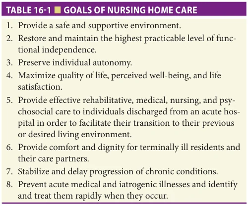

*TABLE 16-1 ■ GOALS OF NURSING HOME CARE*

barriers that can foster inadequate care in NHs, many basic principles and strategies can improve the quality of care for NH residents. Fundamental to achieving these improvements is a clear perspective on the goals of NH care, which differ in some respects from the goals of medical care in other settings and populations.

## GOALS OF NURSING HOME CARE AND SUPPORT

The modern NH supports residents in multiple ways. Table 16-1 lists the key goals of NH care and support. While the prevention, identification, and treatment of chronic, subacute, and acute conditions are important, these goals are undergirded by a focus on functional independence, autonomy, quality of life, comfort, and dignity of residents. Physicians, nurse practitioners, physician’s assistants, and other clinicians must consider these comprehensive, person-centered goals and at the same time address the more traditional goals of medical care.

The heterogeneity of the NH population results in diverse goals set by or with NH residents. There are five

basic categories of NH residents (Figure 16-1). Subgrouping NH residents in this manner will help clinicians and the interdisciplinary team focus the care-planning process on the most critical and realistic goals that matter most to individual residents. The “short-stay” population is largely in the NH for post-acute care after a hospitalization and requires a combination of skilled nursing care, rehabilitation therapy, adequate nutrition and hydration, and careful medical management in order to achieve a higher level of function and discharge home or to a less intensive care setting.

The underlying social contract implied by NH admission is quite different for each of the five groups of NH resident goals illustrated in the figure. Ideally, a NH should be able to provide what the name implies: high-quality nursing (and medical) care, in a home-like environment. In some cases, access to treatment takes precedence over the living environment; in other circumstances, the environment may be the most critical element of care. Those admitted to a NH with the intent of active treatment and discharge home may be willing to accept a living situation akin to that of a hospital with the expectation that the benefit they receive from treatment will offset any discomfort or inconvenience. For terminally ill residents receiving palliative or hospice care, the living environment should be as flexible and supportive as possible. Efforts are directed toward supporting these residents to be comfortable and permitting them to enjoy, to the extent possible, their last days. For the other groups in the middle of this distribution, attention to making their living situation comfortable and providing active primary care are important. There is in fact considerable overlap in the clinical characteristics of the short and long-stay populations in terms of multimorbidity, complexity, medication issues, among others. Some short-term patients become long-term residents because they do not have access to family or other caregiver support, limited availability of home-based service programs in their community, and the inability to pay for needed services and supports in the home versud spending down to qualify for Medicaid (which does cover the costs of institutional long-term care).

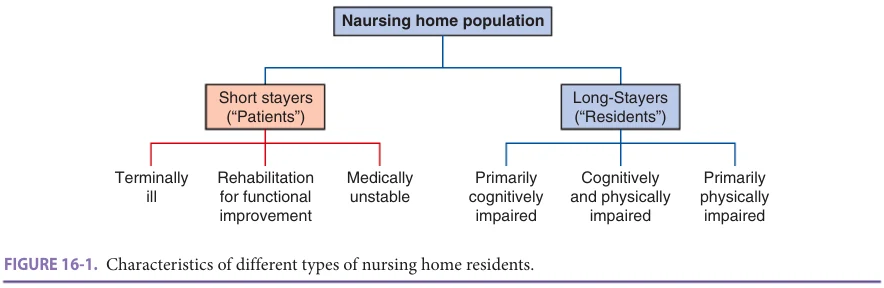

*FIGURE 16-1. Characteristics of different types of nursing home residents.*

**[p. 223]**

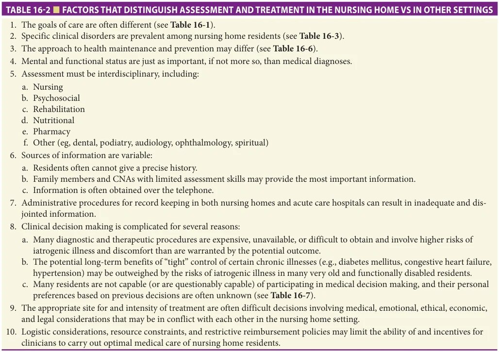

*TABLE 16-2 ■ FACTORS THAT DISTINGUISH ASSESSMENT AND TREATMENT IN THE NURSING HOME VS IN OTHER SETTINGS*

## CLINICAL ASPECTS OF CARE FOR NURSING HOME RESIDENTS

In addition to the different goals for care in the NH, several factors make the assessment and treatment of NH residents different from those in other settings (Table 16-2). Many of these factors relate to the process of care (see the following section). A fundamental difference in NH care compared to care in other settings is that medical evaluation and treatment is one component of an assessment and care-planning process involving staff from multiple disciplines. The integral involvement of certified nursing assistants (CNAs) in the development and implementation of care plans is crucial to high-quality NH care. Data on clinical conditions and their treatment are integrated with assessments of the functional, mental, nutritional, and behavioral status of the resident in order to develop a comprehensive database and individualized plan of care.

Medical evaluation and clinical decision making for NH residents are complicated for several reasons. Unless the clinician has cared for the resident before NH admission, it may be difficult to access a comprehensive medical database that provides the background and context for their current status. Residents may be unable to relate their medical histories

accurately or to describe their symptoms, and medical records are frequently unavailable or incomplete, especially for residents transferred between NHs and acute care hospitals. When acute changes in a condition occur, initial assessments are often performed by NH staff with limited skills and are communicated to clinicians (physicians, nurse practitioners, physician assistants) by telephone. Even when the diagnoses are known or strongly suspected, many diagnostic procedures and treatments among NH residents are associated with an unacceptably high risk–benefit ratio. For example, an imaging study may require sedation with its attendant risks; nitrates and other cardiovascular drugs may precipitate syncope or disabling falls in frail ambulatory residents with baseline postural hypotension; and adequate control of blood sugar may be extremely difficult to achieve among diabetic residents with marginal or fluctuating nutritional intake. Further compounding these challenges is the inability of many NH residents to participate effectively in important decisions regarding their medical care. Their previously expressed wishes are often not known, and an appropriate or legal surrogate decision maker has often not been appointed. These issues are further discussed in Chapters 7, 10, 26, and 72.

Table 16-3 lists the most commonly encountered clinical disorders in the NH population. They represent a

**[p. 224]**

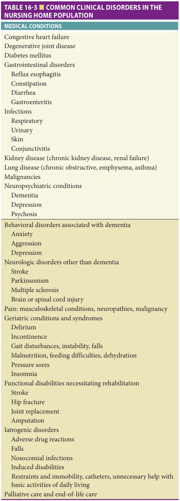

*TABLE 16-3 ■ COMMON CLINICAL DISORDERS IN THE NURSING HOME POPULATION*

broad spectrum of chronic illnesses; neurologic, psychiatric, and behavioral disorders; and problems that are especially prevalent in frail older adults (eg, incontinence, falls, nutritional disorders, chronic pain syndromes). The management of many of the conditions listed in Table 16-3 is discussed in some detail in other chapters of this book.

## PROCESS OF CARE IN THE NURSING HOME

The process of care in NHs is strongly influenced by numerous state and federal regulations, the highly interdisciplinary nature of NH residents’ clinical issues, and the training and skills of the staff that delivers most of the hands-on care. Federal rules and regulations contained in the Omnibus Budget Reconciliation Act of 1987 (OBRA, 1987) and implemented in 1991 place heavy emphasis on assessment through use of the Resident Assessment Instrument (RAI) and care planning as a means of achieving the highest practicable level of functioning for each resident. The minimum data set (MDS) 3.0, is the foundation of clinical assessment and care planning for individual residents. In addition to the MDS, each resident or responsible health care proxy should be assisted in articulating the goals for their NH care (ie, short-term rehabilitation and/or medical and nursing management of unstable clinical conditions with the goal of returning home; long-term care of chronic conditions; or palliative or hospice care). Detailed guidance for state and federal surveyors is available for several clinical care areas, such as unnecessary drugs and urinary incontinence. Failure to adhere to the clinical recommendations contained in the regulations and related surveyor guidance can result in citations and, in some instances, financial penalties or other enforcement actions. In addition, failure to manage clinical conditions appropriately puts the NH and clinicians at risk for legal action.

Physician involvement in NH care and the nature of medical assessment and treatment offered to NH residents may be limited by logistic and economic factors. Few physicians have offices based either inside the NH or in close proximity to it. Many physicians who do visit NHs care for relatively small numbers of residents, often in several different NHs. Many NHs, therefore, have numerous physicians who make rounds once or twice per month, who are not generally present to evaluate acute changes in resident status, and who attempt to assess these changes over the telephone. Practice patterns are shifting to a model of physician-nurse practitioner practices caring for large numbers of residents in several NHs. Such physician-nurse practitioner teams have been shown to improve care, increase resident and family satisfaction, and reduce hospitalization rates. Value-based care programs such as intensive special needs plans (iSNPs) and bundled payments financially incentivize this approach to care. (iSNPs and other value-based programs are discussed in Chapter 19.)

**[p. 225]**

Many NHs do not have ready availability of laboratory, radiologic, and pharmacy services with the capability of rapid response, further compounding the logistics of evaluating and treating acute changes in medical status. Thus, NH residents are often sent to hospital emergency rooms, where they are evaluated by personnel who are generally not familiar with their baseline status and who frequently lack training in the care of older adults.

Medicare and Medicaid reimbursement policies also dictate certain patterns of NH care. While physicians are required to visit NH residents only every 30 to 60 days, many residents require more frequent evaluation and monitoring of treatment, especially with the shorter acute care hospital stays brought about by the prospective payment system (PPS). While Medicare reimbursement for physician visits in NHs has improved, reimbursement for a routine visit is sometimes inadequate for the time that is required to provide good medical care in the NH, including travel to and from the NH; assessment and treatment planning for residents with multiple problems; communication with the resident, members of the interdisciplinary team and the resident’s family; and proper documentation in the medical record. Activities often essential to good care in the NH, such as attendance at interdisciplinary conferences, family meetings, complex assessments of decision-making capacity, and counseling residents and proxy decision makers on treatment plans, are often not reimbursable. The coronavirus pandemic has led to increased use of telehealth, which may facilitate accomplishing some of this direct care more efficiently (see below). Medicare intermediaries sometimes restrict reimbursement for rehabilitative services for residents not covered under Part A skilled care, thus limiting treatment options for many residents. Although Medicaid programs vary considerably, many provide minimal coverage for ancillary services that are critical for optimal care and may restrict reimbursement for certain types of drugs that may be especially helpful for NH residents.

Amid these logistic and economic constraints, expectations for the care of NH residents are high. Table 16-4 outlines the various types of assessment generally recommended for the optimal care of NH residents. Physicians are responsible for completing an initial assessment within 72 hours of admission and for monthly visits thereafter for the next 90 days. More frequent visits are often necessary for residents admitted on a Medicare Part A skilled nursing benefit. Licensed nurses assess new residents when they are admitted, on a daily basis, and summarize the status of each resident weekly. The nationally mandated MDS must be completed within 14 days of admission and updated when a major change in status occurs. Several sections of the MDS must be updated on a quarterly basis. The MDS is intended to assist NH staff in identifying important clinical problems that need care plans that include further evaluation, management, and monitoring. The MDS is also used as the basis for calculating daily reimbursement rates for

residents on the Medicare Part A skilled benefit and as the basis for calculating various quality measures, including those on the NH Compare website and those used for the CMS Five-Star Quality Rating System.

The extent of involvement of other disciplines in the assessment and care-planning process varies depending on the residents’ conditions, the availability of various professionals, and state regulations. Representatives from nursing, social services, dietary, therapeutic recreation (activities), and rehabilitation therapy (physical, occupational, speech) participate in an interdisciplinary care-planning meeting. Residents are generally discussed at this meeting within 2 weeks of admission and quarterly thereafter. Residents and family members or care partners are usually invited to participate in this initial care planning meeting. The product of these meetings is an interdisciplinary care plan that lists physical and psychosocial or behavioral conditions (eg, restricted mobility, incontinence, unstable gait, diminished food intake, poor social interaction, depression), goals set by or with the resident, approaches to achieving those goals, target dates for achieving the goals, and responsibilities for working toward the goals among the various disciplines. These care plans are important in supporting what matters to each resident and should be reviewed by the primary provider.

## STRATEGIES TO IMPROVE CARE IN NURSING HOMES

Better medical care of NH residents should lead to fewer exacerbations of chronic illnesses, iatrogenic conditions, and other adverse events, and hence lower use of emergency rooms and hospitals. Several strategies might improve the process of medical care delivered to NH residents. Four strategies are briefly described: (1) improved documentation practices; (2) a systematic approach to screening, health maintenance, and preventive practices; (3) collaborative care with nurse practitioners or physician assistants; and (4) practice guidelines and related quality improvement activities.

In addition to these strategies, strong leadership of a medical director (and in some cases associate medical director) who is appropriately trained and dedicated to improving the NH’s quality of medical care is essential in order to develop, implement, and monitor policies and procedures for medical services. Certification through the American Medical Directors Association (AMDA)–The Society for Post-Acute and Long-Term Care Medicine should be encouraged (https://paltc.org/). The medical director should set standards for medical care and serve as an example to the medical staff by caring for some of the residents in the NH. He/she should also be involved in various committees (eg, quality, infection control), and should try to involve interested medical staff in these committees, as well as in educational efforts through formal

**[p. 226]**

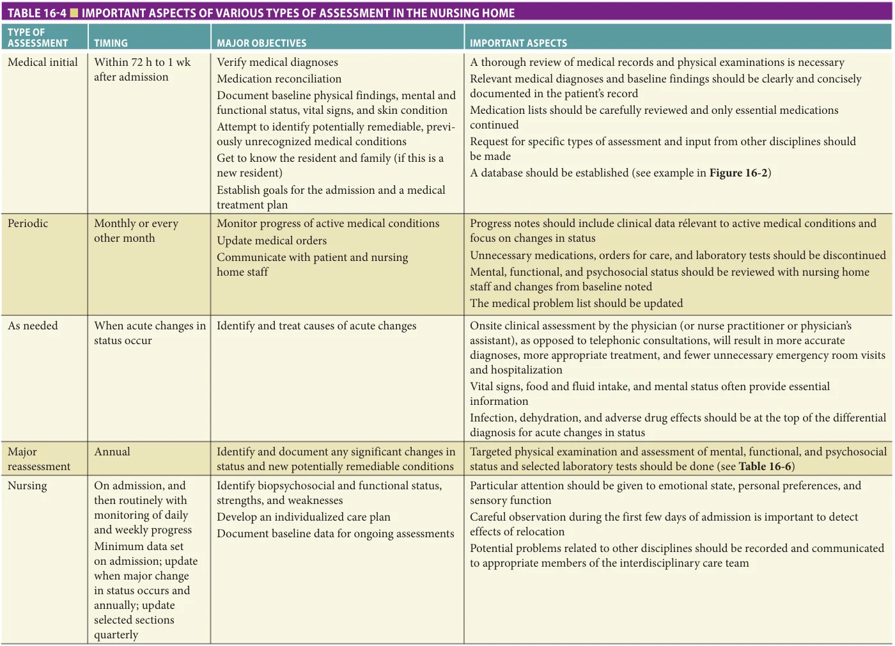

*TABLE 16-4 ■ IMPORTANT ASPECTS OF VARIOUS TYPES OF ASSESSMENT IN THE NURSING HOME*

**[p. 227]**

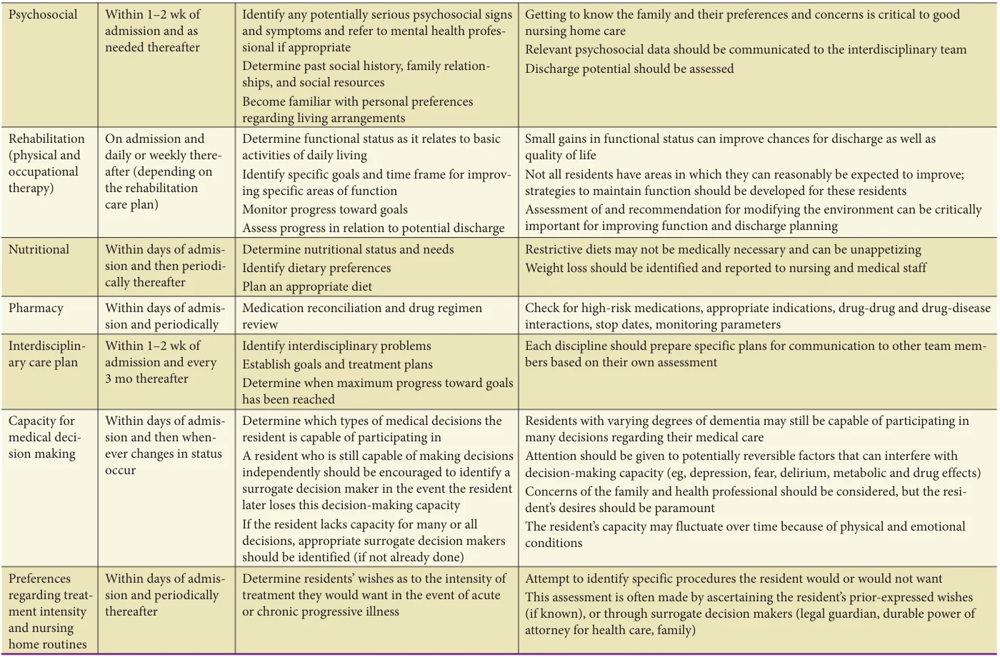

*Table 16-4 continued*

**[p. 228]**

presentations, teaching rounds, and appropriate documentation procedures. Federal quality measures, as well as other quality indicators, developed through literature review and expert consensus should be used to track improvements in overall care in the NH setting. Medical directors should use these indicators and other approaches in their quality improvement programs and assisting the NH with meeting CMS requirements for Quality Assurance and Performance Improvement (“QAPI”).

Documentation Practices Electronic health records (EHRs) specific for NHs are now widely available, and when used properly can greatly improve clinical documentation. Critical aspects of a NH resident’s health status should be recorded on a clinical “face sheet” of the medical record. Figure 16-2 shows an example of the elements of and a format for such documentation. Additional standardized documentation should contain social information, such as individuals to contact at critical times (health care proxy, durable power of attorney for health care, legal guardian) and information about the resident’s treatment status in the event of acute illness (advance directives). These data are essential to the care of the resident and should be readily available in one place in the record, so that when emergencies arise, when medical consultants see the resident, or when members of the interdisciplinary team need an overall perspective, they are easy to locate. The face sheet should be sent to the hospital or other health care facilities when the resident is transferred. Time and effort are required in order to keep the face sheet updated. EHRs can facilitate incorporating the face sheet into a database and updating it periodically.

Many NHs currently use blended records with nursing and administrative documentation in the EHR. Handwritten medical documentation in progress notes for routine visits and assessments of acute changes is frequently scanty, uninformative, and/or illegible. Statements such as “stable” or “no change” are frequently the only documentation for routine visits. While time constraints may preclude extensive notes, certain standard information should be documented. The SOAP (subjective, objective, assessment, plan) format for charting routine notes is especially appropriate for NH residents (Table 16-5). Simple forms, flow sheets, or databases with word-processing capabilities can be used to enable physicians to efficiently produce legible, concise, comprehensive progress notes. Some EHRs include these capabilities.

Another area where medical documentation is often inadequate relates to the residents’ decision-making capacity and treatment preferences. These issues are discussed briefly at the end of this chapter as well as in Chapters 7,10, 26, and 72. In addition to placing critical information in a standardized format in readily accessible locations, it is essential that physicians thoroughly and legibly document all discussions they have had with the resident, designated family member, legal guardian, or durable power of

attorney for health care about these issues. Failure to do so may result not only in poor communication and inappropriate treatment, but also in substantial legal liability. Notes about these issues should not be removed from the EHR or the paper medical record and are ideally kept in a separate advance care planning section.

As NHs increasingly use health information technology, these recommendations for improved documentation can eventually be incorporated into the NH EHR. AMDA (https://paltc.org/) and the Interventions to Reduce Acute Care Transfers (INTERACT) quality improvement program (https://pathway-interact.com/) have examples of tools that can help improve documentation of clinical care in the NH and that can be integrated into EHRs. Documentation in the EHR using discrete items will facilitate using them in a relational database that can be used for quality improvement and research.

Screening, Health Maintenance, and Preventive Practices A second approach to improving medical care in NHs is developing and implementing selected screening, health maintenance, and preventive practices in order to delay or prevent exacerbations of chronic conditions. Table 16-6 lists examples of such practices. With few exceptions, the efficacy of these practices has not been well studied in the NH setting. In addition, not all the practices listed in this table are relevant for every NH resident. For example, some of the annual screening examinations are inappropriate for short-stay residents or for many long-stay residents with end-stage dementia or other life-limiting illness in which the time to benefit from the screening exceeds life expectancy. Thus, the practices outlined in Table 16-6 must be tailored to individual residents and must be creatively incorporated into routine care procedures as much as possible in order to be time-efficient, cost-effective, and reimbursable by Medicare. The Annual Wellness Visit is now supported by Medicare and can include individualized plans for screening and preventive health.

Advanced Practitioners (Nurse Practitioners, Clinical Specialists, and Physician Assistants) A third strategy that may help improve care in NHs is partnering with or employing nurse practitioners and physician assistants. This approach appears to be cost-effective in both managed care and fee-for-service settings. These health professionals may be especially helpful in providing comprehensive care in the NH setting. Physician assistants and nurse practitioners can bill for services under feefor-service Medicare and NHs and/or physician groups can hire them on a salaried basis. Nurse practitioners may have an especially helpful perspective in interacting with nursing staff about the non-medical aspects of care for NH residents. Nurse practitioners and physician’s assistants can be very helpful in implementing some of the screening, monitoring, and preventive practices outlined

**[p. 229]**

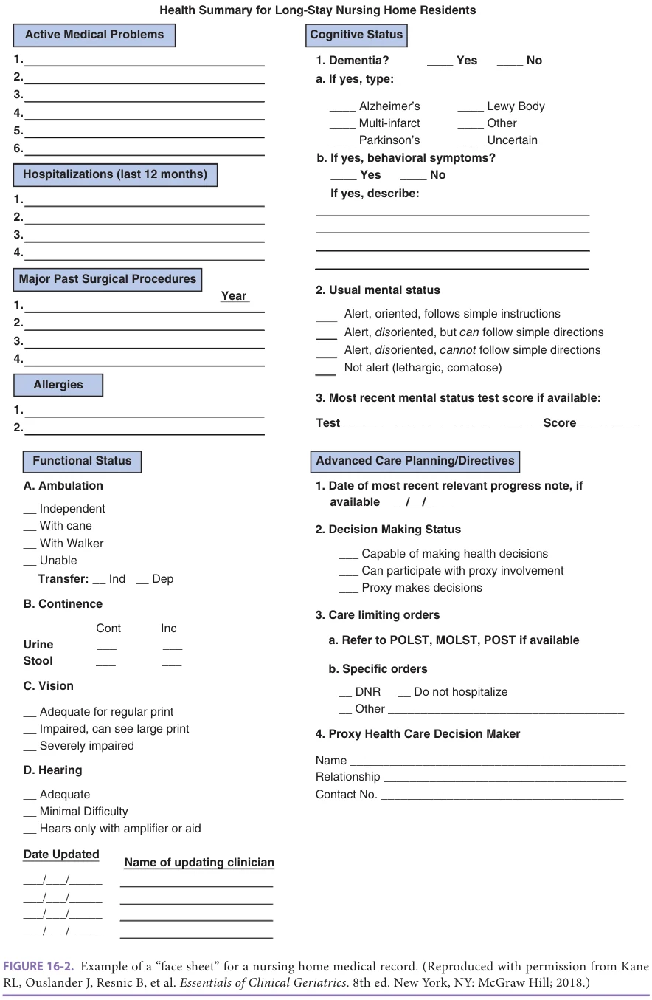

*FIGURE 16-2. Example of a “face sheet” for a nursing home medical record. (Reproduced with permission from Kane RL, Ouslander J, Resnic B, et al. Essentials of Clinical Geriatrics. 8th ed. New York, NY: McGraw Hill; 2018.)*

**[p. 230]**

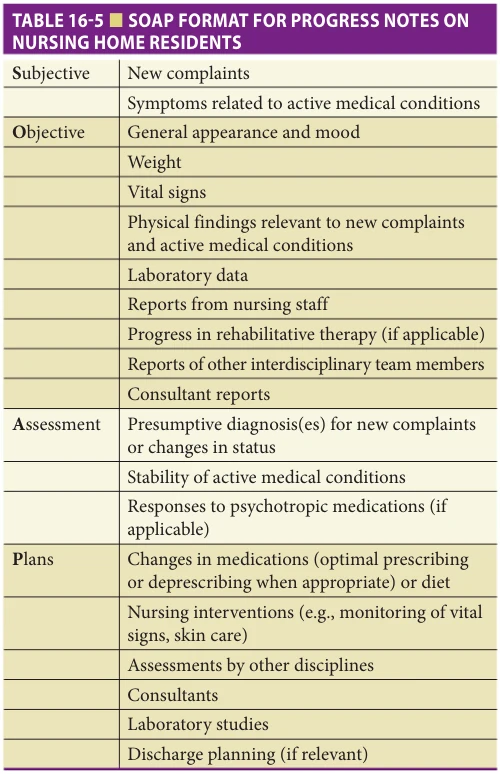

*TABLE 16-5 ■ SOAP FORMAT FOR PROGRESS NOTES ON NURSING HOME RESIDENTS*

in Table 16-6, and in communicating with interdisciplinary staff, residents, and family members or care partners at times when the physician is not available. One of the most appropriate roles for nurse practitioners and physician assistants is in the initial assessment of acute or subacute changes in resident condition. They can perform a focused history and physical examination and can order appropriate diagnostic studies. The INTERACT quality improvement program has several care paths for this purpose that address 10 of the most common conditions associated with hospital transfers, one of which is shown in Figure 16-3. Use of such care paths and other tools available through the INTERACT website (https://pathway-interact.com/), as well as through AMDA, enables onsite assessment of acute change, detection and treatment of new problems early in their course, more appropriate utilization of acute care hospital emergency rooms, and rapid identification of residents who need to be hospitalized.

Clinical Practice Guidelines and Quality Improvement Activities Several clinical practice guidelines relevant to NH care have been developed by AMDA (https://paltc.org/). In

addition, quality indicators for a number of conditions have been developed. While these guidelines and quality indicators are largely based on expert opinion rather than on controlled clinical trials, they are helpful as a basis for standards of practice that will improve care. Implementation and maintenance of clinical practice guidelines can be challenging in NHs, as it is in other practice settings. NHs are required to have an ongoing quality assessment and assurance (QAA) committee, and as mentioned above, federal regulations now require an active Quality Assurance Performance Improvement (QAPI) program. Principles of continuous quality improvement (CQI) and rapid-cycle performance improvement projects (PIPs) engage direct care staff to monitor objective outcomes (such as the frequency of falls, severity of incontinence, adverse drug reactions, and skin problems) and to identify work processes that can be modified to continuously improve these outcomes. NH administrators, directors of nursing, and medical directors must create an environment that provides incentives for ongoing quality activities in order to maintain these programs over time. The Medicare Quality Improvement Organization/Quality Innovation Network (QIO/QIN) program as well as AMDA and its journal have substantial free or low-cost resources for assisting NH providers with quality improvement initiatives. In addition, CMS provides educational resources and tools for NHs to help them meet QAPI requirements (https://www.cms.gov/ Medicare/Provider-Enrollment-and-Certification/QAPI/ qapidefinition).

## POSTACUTE CARE AND THE NURSING HOME–ACUTE CARE HOSPITAL INTERFACE

As a result of the increasing acuity and clinical complexity of the NH resident population, transfer back and forth between the NH and one or more acute care hospitals is common. About one in five NH residents admitted from a hospital are readmitted to the hospital within 30 days. Transfer to an acute care hospital is often a disruptive process for a NH resident, and is especially hazardous for NH residents with dementia. In addition to the effects of the acute illness, NH residents are subject to acute mental status changes and a myriad of potential iatrogenic problems. The most prevalent of these iatrogenic problems are related to immobility, including deconditioning with resulting difficulty regaining ambulation and/or transfer capabilities, hospital-acquired infections, incontinence and catheter use, polypharmacy and adverse drug effects, delirium, and the development of pressure ulcers.

Because of the risks of acute care hospitalization, the decision to transfer a resident to the emergency room or hospitalize a resident must carefully balance a number of factors. A variety of medical, administrative, logistic, economic, and ethical issues can influence decisions to hospitalize NH residents. Decisions regarding hospitalization often boil down to the capabilities of medical care providers

**[p. 231]**

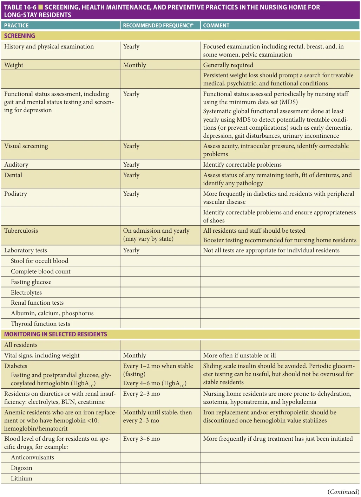

*TABLE 16-6 ■ SCREENING, HEALTH MAINTENANCE, AND PREVENTIVE PRACTICES IN THE NURSING HOME FOR LONG-STAY RESIDENTS*

**[p. 232]**

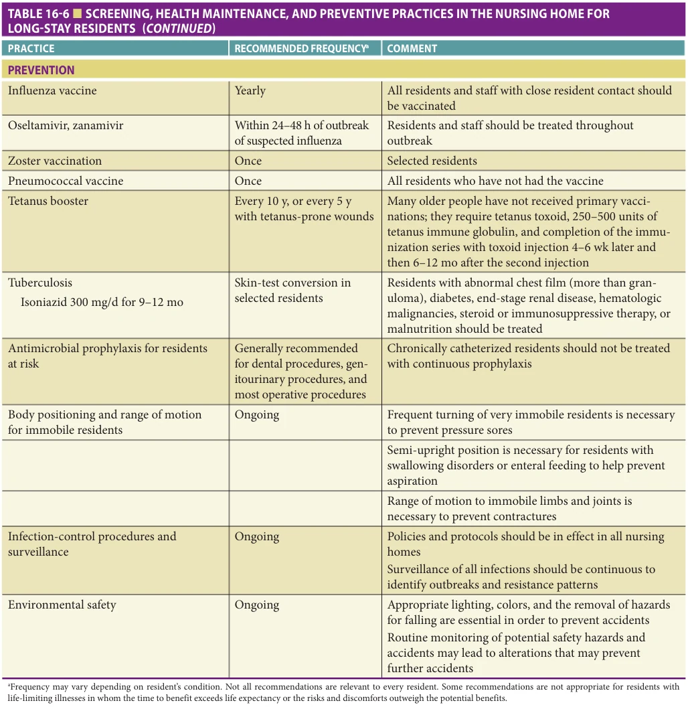

*TABLE 16-6 ■ SCREENING, HEALTH MAINTENANCE, AND PREVENTIVE PRACTICES IN THE NURSING HOME FOR LONG-STAY RESIDENTS*

and the NH staff to provide services in the NH, the preferences of the resident and, when indicated, the family, and the logistic and administrative arrangements for hospital care. If, for example, the NH staff has been trained and has the personnel to institute intravenous therapy without detracting from the care of other residents, or if it has arranged for an outside agency to oversee intravenous therapy and there is a nurse practitioner or physician’s assistant to perform follow-up assessments, the resident with an acute infection who is otherwise stable may best be managed in the NH. Better advance care planning and advance

directive use can also help to avoid unnecessary hospitalization of NH residents when the palliative or hospice care may be more appropriate than hospital transfer.

AMDA has developed a clinical practice guideline and related tools on care transitions (https://paltc. org/topic/transitions-care). The INTERACT program includes educational resources and tools that have been developed and have shown promise in reducing unnecessary hospital transfers. The INTERACT program uses several basic strategies to improve the management of acute changes in condition and prevent unnecessary

**[p. 233]**

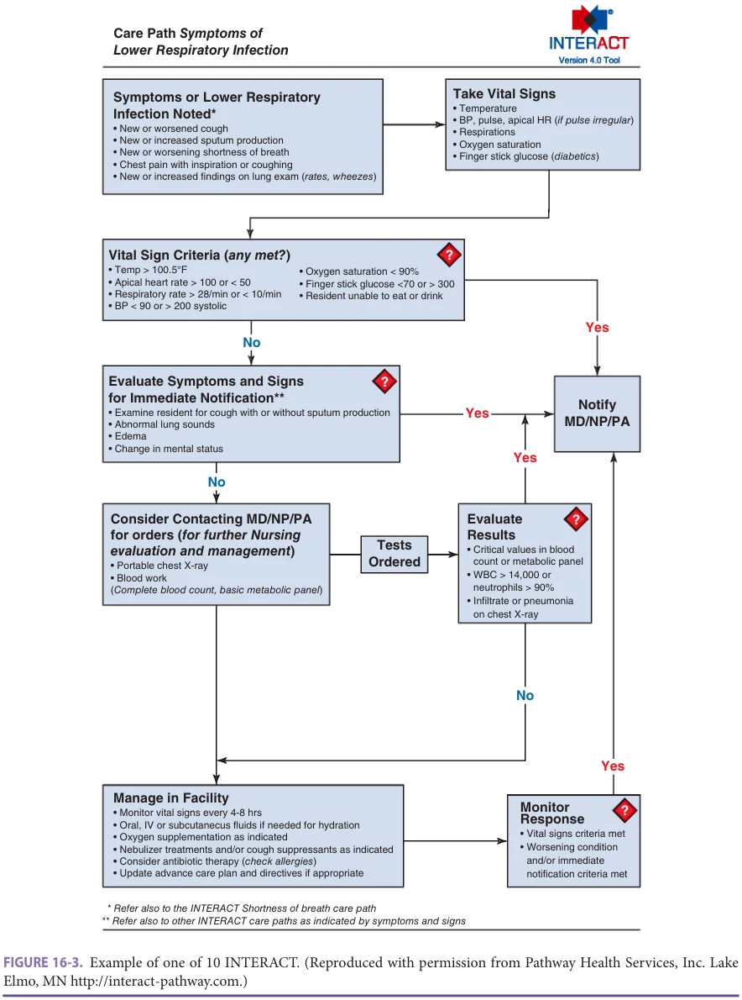

*FIGURE 16-3. Example of one of 10 INTERACT. (Reproduced with permission from Pathway Health Services, Inc. Lake Elmo, MN http://interact-pathway.com.)*

hospital transfers including: (1) proactive identification of conditions before they become severe enough to require hospital care (eg, dehydration, delirium); (2) management of some conditions (eg, pneumonia, congestive heart failure) without transfer when safe and feasible; (3) improving advance care planning in order to consider palliative

or comfort care as an alternative when the risks of hospitalization may outweigh the benefits; (4) improved documentation practices; (5) improved communication within the NH and between the NH and the hospital; and (6) embedding these strategies within everyday care, including within EHRs.

**[p. 234]**

## ETHICAL ISSUES IN NURSING HOME CARE

Ethical issues arise as much or more in the day-to-day care of NH residents as in care in any other setting. These issues are discussed in Chapter 72. Table 16-7 outlines several common ethical dilemmas that occur in the NH. Although most attention has been directed toward those with limited ability to express their preferences, important daily ethical dilemmas also face those who are capable of decisionmaking. These more subtle problems are easily overlooked. Physicians, nurse practitioners, and physician assistants providing primary care must serve as strong advocates for the autonomy and quality of life for NH residents.

NHs care for a high concentration of individuals who are unable or are questionably capable of participating in decisions concerning their current and future health care. Among these same individuals, functional disabilities and terminal illnesses are prevalent. Thus, questions regarding individual autonomy, decision-making capacity, surrogate decision makers, and the intensity of treatment arise on

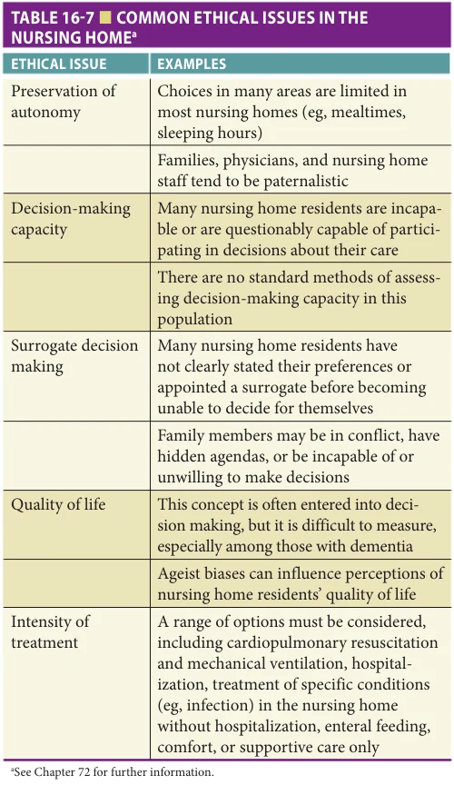

*TABLE 16-7 ■ COMMON ETHICAL ISSUES IN THE NURSING HOMEa*

a daily basis. These questions are both troublesome and complex and must be managed in a straightforward and systematic manner in order to provide optimal care to NH residents within the context of ethical principles and state and federal laws. NHs should be encouraged to develop their own ethics committees or to participate in a local existing committee within another organization. Ethics committees can be helpful in educating staff; developing, implementing, and monitoring policies and procedures; and providing consultation in difficult cases.

## IMPACT OF THE CORONOVIRUS-19 (COVID-19) PANDEMIC IN NURSING HOMES

The COVID-19 pandemic has had profound effects on NHs in the United States that have already and continue to work toward major changes over the coming years. In addition to exposing the fact that NHs were for the most part unprepared to deal with a pandemic of this nature, it has shed light on the need to restructure NH care and its financing to meet the needs of a growing vulnerable population that will require short-term or long-term care over the next several decades. Many NHs have suffered devastating COVID-19 outbreaks that led to high mortality rates among NH residents and staff as well. Many NHs did not have adequate personal protective equipment (PPE) and testing capability throughout the first months of the pandemic, and some still do not, especially in the face of increasing viral positivity rates and influenza season. Staffing shortages have been severe in many NHs because a substantial number of staff have had positive viral tests and/or close exposure to an infected individual and have to undergo a minimum 14-day quarantine period off work. The federal government has promulgated waivers, guidance, and new regulations that have been helpful. It has also provided considerable financial relief for NHs, but it was not enough to support all the PPE and viral testing essential for care.

Some of the key issues that may have an enduring impact on NH care in the United States include:

1. Intensive development of education and oversight of infection control programs, including the requirement for an infection preventionist in each NH. 2. Rapid increase in the use of telemedicine for routine visits as well for evaluating acute changes in condition. If the federal government continues to reimburse providers for this method of care, it could greatly increase the ability to provide efficient care coordination among disciplines and interactions with residents’ families and/or other proxy decision makers. 3. Further efforts to reduce unnecessary emergency department visits, hospitalizations, and hospital readmissions because of the risk of viral infection. These efforts can pay strong dividends in the future as value-based programs further penetrate NH care.

**[p. 235]**

4. Renewed focus on polypharmacy and deprescribing of unnecessary medications has been recommended to not only decrease adverse effects and costs, but to avoid unnecessary contacts between staff and residents, as well as the time of administration and documentation for these medications. 5. More proactive discussions of advance directives, beyond “Do Not Resuscitate” to include “Do Not Hospitalize” orders have been recommended because of the potential for very rapid deterioration of residents with life-limiting illnesses among whom the discomforts and risks of hospitalization outweigh the potential benefits. Several organizations produced advance care planning tools with specific language about the pandemic which were useful and will continue to be in the future. The INTERACT website has examples of such tools and links to several other organizations that have developed imilar tools. 6. The need for health systems to evolve so that organizations providing post-acute and long-term care are more closely aligned with local hospitals and home health agencies in order to share learnings, trained staff, and other resources. 7. Continuing evolution of NHs into smaller more homelike facilities, and consideration of separating some types of short vs. long-stayers with appropriate reimbursement, staffing, and education for the different populations. 8. The need for the development of NH research networks with the capability to carry out robust clinical trials, quality improvement research, educational

## FURTHER READING

American Medical Directors Association. Transitions of

Care in the Long-Term Care Continuum Clinical Practice Guideline. Columbia, MD: AMDA; 2010. American Medical Directors Association. Health Main-

tenance in the Long-Term Care Setting Clinical Practice Guideline. Columbia, MD: AMDA; 2012. Department of Health and Human Services Office of the

Inspector General. Adverse Events in Skilled Nursing Facilities: National Incidence among Medicare Beneficiaries. February, 2014. OEI-06-11-00370. Institute of Medicine. Improving the Quality of Nursing Home

Care. Washington, DC: National Academy Press; 2000. Jump RLP, Crnich CJ, Mody L, et al. Infectious diseases

in older adults in long-term care facilities: update on approach to diagnosis and management. J Am Geriatr Soc. 2018;66:789–803. Kane RL. Assuring quality in nursing homes care. J Am

Geriatr Soc. 1998;46:232–237. Mor V. Defining and measuring quality outcomes in long-

term care. J Am Med Dir Assoc. 2006;7:532–540.

interventions, and epidemiological studies to continue to develop the evidence base for improving NH care with respect to pandemics as well as other areas of care and support.

## ACKNOWLEDGMENTS

This chapter is based on and adapted from Chapter 16 of the eighth edition of Essentials of Clinical Geriatrics (McGraw Hill, 2018).

Dr. Ouslander is a full-time FAU employee and has received support through FAU to conduct research evaluating the INTERACT program from the National Institutes of Health, the Centers for Medicare and Medicaid Services, the Commonwealth Fund, the Retirement Research Foundation, PointClickCare, Medline Industries, and PatientOrderSets (now Think Research). Dr. Ouslander is a paid medical advisor to Pathway Health which holds the exclusive license from FAU for training and sublicensing of INTERACT, and he and his wife receive royalties related to INTERACT. Works on projects related to INTERACT are subject to terms of Conflicts of Interest Management plans developed and approved by the FAU Division of Research Financial Conflict of Interest Committee.

Alice Bonner is an Adjunct Faculty at the Johns Hopkins University School of Nursing and Director of Strategic Partnerships for the CAPABLE Program. She is also Senior Advisor for Aging at the Institute for Healthcare Improvement (IHI). From 2011 to 2013, Bonner was the Director of the CMS Division of Nursing Homes.

Morley J, Tolson D, Ouslander J, Vellas B. Nursing Home

Care: A Core Curriculum for the International Association for Gerontology and Geriatrics. New York, NY: McGraw Hill; 2013. Ouslander JG, Berenson RA. Reducing unnecessary hos-

pitalizations of NH residents. N Engl J Med. 2011;365: 1165–1167. Ouslander JG, Bonner A, Herndon L, Shutes J. The INTER-

ACT quality improvement program: an overview for medical directors and primary care clinicians in longterm care. J Am Med Dir Assoc. 2014;15:162–170. Ouslander JG, Naharci I, Engstrom G, et al. Root

cause analyses of transfers of skilled nursing facility patients to acute hospitals: lessons learned for reducing unnecessary hospitalizations. J Am Med Dir Assn. 2016;17:256–262. Ouslander JG, Grabowski DC. Rehabbed to death reframed:

in response to “rehabbed to death: breaking the cycle”. J Am Geriatr Soc. 2019;67:2225–2228.

**[p. 236]**

Ouslander JG, Grabowski DC. COVID-19 in nursing

homes: calming the perfect storm. J Am Geriatr Soc. 2019;68:2153–2162. Saliba D, Schnelle JF. Indicators of the quality of nurs-

ing home residential care. J Am Geriatr Soc. 2002;50: 1421–1430. Saliba D, Solomon D, Rubenstein L, et al. Feasibility of

quality indicators for the management of geriatric

## SELECTED WEBSITES

Interventions to Reduce Acute Care Transfers (INTERACT).

https://pathway-interact.com/. Accessed June 1, 2021. Long-Term Care Focus. http://ltcfocus.org. Accessed June 1,

syndromes in nursing home residents. J Am Med Dir Assoc. 2005;6:S50–S59. Saliba D, Solomon D, Rubenstein L, et al. Quality indicators

for the management of medical conditions in nursing home residents. J Am Med Dir Assoc. 2004;5: 297–309. Zarowitz B, Resnick B, Ouslander JG. Quality clinical

care in nursing facilities. J Am Med Dir Assn. 2018;19: 833–839.

The Society for Post-Acute and Long-Term Care Medicine/

American Medical Directors Association. https://paltc. org/. Accessed June 1, 2021.
