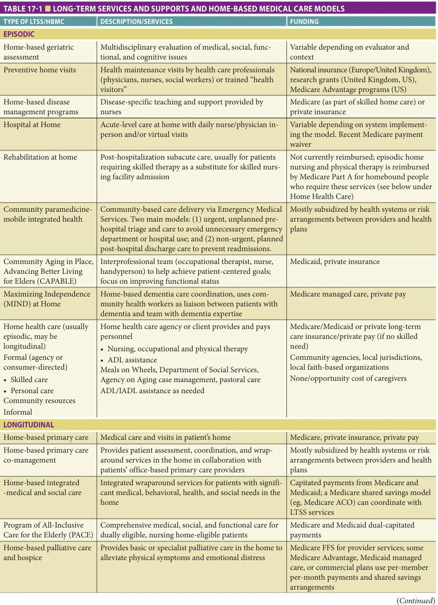
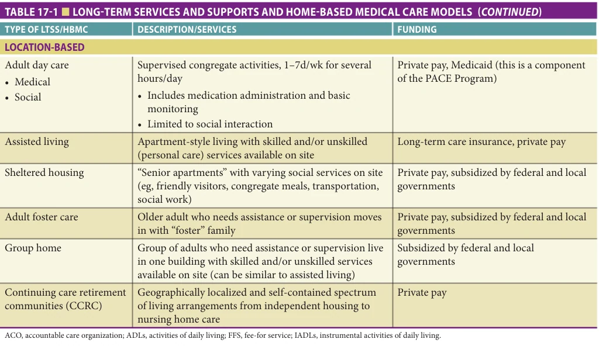
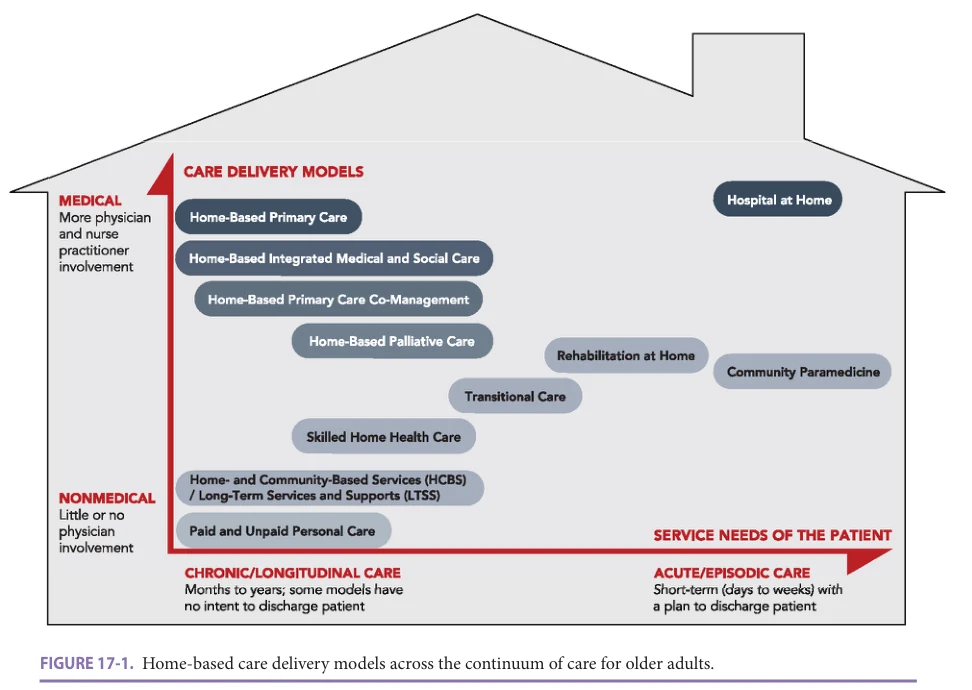
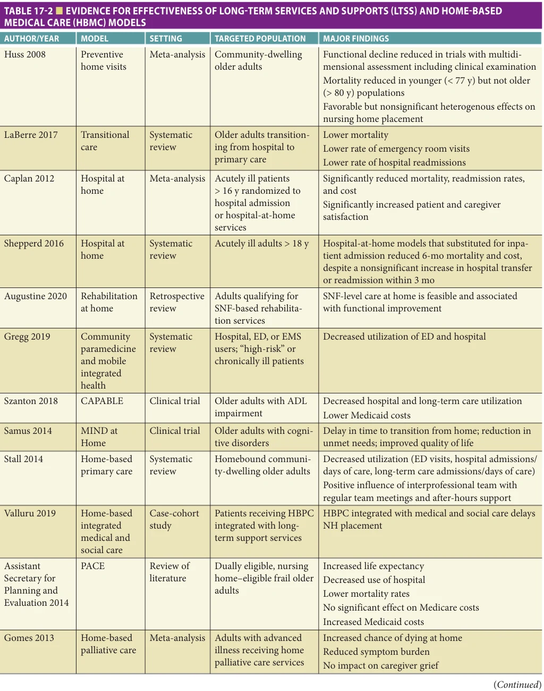
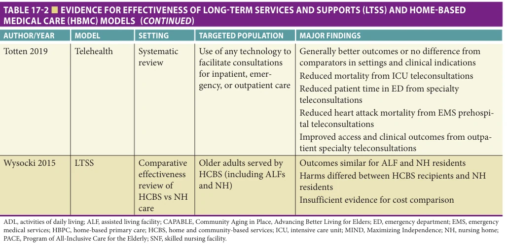

# Hazzard's Geriatric Medicine and Gerontology, 8e - Chapter 17: Community-Based Long-Term Services and Support, and Home-Based Medical Care

Jessica Colburn, Jennifer Hayashi, Bruce Leff

> **Status.** Fast build from the book; not lane-reviewed.

> Not cited in the 2020-2026 past papers.

> **Source and method.** Printed pages 237-248, from the marked 8th-edition copy (PDF page = printed page + 34). Prose follows its text layer; tables and figures are source-page crops. The book is canonical.

**[p. 237]**

## INTRODUCTION

Seventy percent of people turning age 65 will need some type of long-term care (LTC) services in their lifetime. While some of those people will be cared for in a nursing home, the majority will choose to remain in the community and require services to help them stay in their homes. These home-based care services come in the form of two general categories—community-based long-term services and support (LTSS) and home-based medical care services. Unfortunately, no coherent national policy drives LTSS in the United States, which leaves a “system” that is difficult to access, bewildering to navigate, unable to fully meet the needs of many patients, and exacerbates health disparities. Much of what is done to meet these needs is provided by unpaid family caregivers at great personal and economic cost. Among the many longterm sequelae of the COVID-19 pandemic, one that is most likely to persist is the preference for non-facility-based health care delivery. This preference, as well as the COVID-19induced acceleration of telehealth approaches, is likely to create even greater demand for home-based services of all types in the future. This chapter addresses LTSS and home-based medical care for older adults in the United States. We outline the semantic challenges in understanding the scope and nature of LTSS and the heterogeneity of LTSS and home-based medical care models that comprise it; describe who receives, provides, and pays for it; and review the evidence for its effectiveness. We also discuss important public policy issues and identify emerging innovations and trends in this arena.

#### Learning Objectives

- Recognize the semantic challenges, scope, nature, and heterogeneity of community-based long-term services and support (LTSS) and home-based medical care in the United States.

- Identify the common models of LTSS and home-based medical care.

- Describe the evidence base and reimbursement mechanisms for common models of LTSS and home-based medical care.

#### Key Clinical Points

1. The vast majority of care for older people at home is provided by friends and family as unpaid informal caregivers, at enormous indirect cost to society in the form of lost wages, lost productivity, and future social insurance costs.

2. There is a substantial body of evidence suggesting that various models of LTSS and home-based medical care are effective; cost-effectiveness and outcomes associated with these models depend on targeting of services to appropriate populations.

3. Innovative home-based care delivery models hold promise for aligning payment incentives with health outcomes to improve care for older adults.

## SPECTRUM OF CARE OF LTSS AND HOME-BASED MEDICAL CARE

Community-based long-term services and support (LTSS) and home-based medical care cover the spectrum of homebased care that exists to support and care for older adults living at home. The term “community-based long-term services and support” overlaps with several other terms in the medical and social sciences literature, including home care, personal care services, home- and community-based services, home visits, and others. In general, these terms refer to non-physician, nursing, personal care, or social services provided to older persons with an explicit goal of filling unmet needs or maintaining them in the community.

Unpaid family members or friends provide a majority of this care, sometimes with support from a variety of paid formal caregivers. Home-based medical care includes models that involve direct care by a physician or advanced practice provider (nurse practitioner or physician assistant). These may include longitudinal care models, such as home-based primary care, or may include episodic care, such as preventive home-based geriatric assessment visits, home-based rehabilitation, and hospital at home (HaH). LTSS and

**[p. 238]**

home-based medical care often overlap to such an extent that important aspects of a given intervention are not accurately reflected in a single label. For example, a program in which an interdisciplinary team provides comprehensive geriatric assessment followed by home-based primary care, inpatient management as needed, and continuing longitudinal care after hospital discharge does not fit neatly into any one category. Several forms of LTSS integrate housing arrangements with personal care and home-based medical care, further blurring the distinction between communitybased and institutional LTSS. Table 17-1 depicts the heterogeneity and scope of services and settings that fall under the rubric of LTSS.

Home health care encompasses a spectrum of care including long-term social services, informal and formal paid care in the home, and skilled home health care. Home and community-based services usually refers to LTSS provided under the Medicaid program. Informal care refers to services provided by unpaid caregivers, most commonly female family members. The estimated 48 million informal caregivers in the United States provide the majority of all home care and LTSS at an estimated economic value of $470 billion. Formal paid care includes paid home health aides for personal care services in the home (bathing, dressing, etc) and typically is covered via private pay by the patient, though also may be covered through state Medicaid waiver programs or Department of Aging Social Services programs. Paid care in assisted living facilities (ALFs), sheltered housing, and group homes is variable and may include medication administration and monitoring of vital signs as well as access to physicians when needed, such as domiciliary care visits or a clinic housed within a senior apartment building. Skilled home health care refers to formal services delivered by professional providers, such as nurses or physical, occupational, or speech therapists. Medicare certifies and reimburses home health care agencies (HHAs) to provide this type of care when a patient is homebound and has a skilled need (see “Who Provides and Pays for LTSS and Home-Based Medical Care” later in the chapter). HHAs may also provide formal personal care services (bathing, dressing, etc) under the Medicare home health care benefit while a patient is receiving skilled care. Referrals for Medicare skilled home health care are placed for patients who have a skilled need, such as physical therapy or nursing care, and may originate from the hospital, rehabilitation setting, or from outpatient or home-based primary care. For example, an older patient who suffers an acute exacerbation of chronic obstructive pulmonary disease may spend several days in bed (at home or in the hospital), and may need nursing to monitor her respiratory status and physical therapy to help her regain her baseline functional mobility. It is important to note that the effectiveness of skilled home care often relies on services provided by an informal caregiver who, if available, can help implement a home exercise program, clean and dress pressure ulcers, or bathe, dress, and toilet a dependent patient.

Models of home-based medical care include a spectrum of options, including both longitudinal and episodic care options: home-based primary care, home-based primary care co-management, home-based integrated medical and social care, home-based palliative care and hospice care, preventive home-based geriatric assessment, rehabilitation at home, and HaH. Home-based primary care, in which physicians, nurse practitioners, and physician assistants provide ongoing longitudinal medical care at home, can play an important role in providing access to routine and urgent care for older adults who have difficulty getting to a medical office. Home-based primary care programs have been increasing in prevalence in recent years and have been shown to be effective (see Table 17-2 later in this chapter). In 2013, approximately 5000 individual health care providers made 1.7 million home visits in the United States, accounting for 70% of home-based medical visits. Some models include home-based primary care as part of their continuum of care, such as the Program of All-Inclusive Care for the Elderly (PACE), which relies heavily on a “day health center” in which dually eligible (ie, Medicare and Medicaid eligible) nursing home–eligible participants receive comprehensive medical, hygienic, social, and rehabilitative care. Home-based primary care co-management models involve the use of an interdisciplinary care team to help care for patients with complex needs in collaboration with a patient’s primary care provider. Home-based integrated medical and social care models provide integrated medical and social services for patients with significant medical, behavioral health, and social needs with an interdisciplinary team that typically includes behavioral health specialists. Home-based palliative care may be embedded within home-based primary care models, or may be provided by hospice agencies as a continuum of care prior to home hospice care. Home hospice care provides end-of-life care to patients within the last 6 months of life, with home-based support focused on comfort care. Hospital-at-home is a care model that provides hospital-level care in a patient’s home as a substitute for an acute hospital admission that has been shown to be associated with better care quality and lower costs than typical hospital care. Rehabilitation-at-home provides subacute rehabilitation at home posthospitalization.

Other home-based approaches offer one-time visits or assessments or care focused on specific diseases or conditions. Preventive home visits and home-based geriatric assessment typically aim to identify older adults in the community who have hidden risks for developing illness or functional decline, and modify those risks to prevent poor outcomes. These visits may be provided as part of Medicare Advantage programs, such as through Medicare Annual Wellness Visits provided at home, or may be done by community health workers as a geriatric assessment visit to assess risk. Home-based disease management programs target patients known to have specific diseases or conditions that require significant care coordination, such as diabetes or heart failure, for formal support in managing

**[p. 239]**

*TABLE 17-1 ■ LONG-TERM SERVICES AND SUPPORTS AND HOME-BASED MEDICAL CARE MODELS*

*Owner annotations/highlights are from the marked source copy, not the book.*

**[p. 240]**

*TABLE 17-1 ■ LONG-TERM SERVICES AND SUPPORTS AND HOME-BASED MEDICAL CARE MODELS*

*Owner annotations/highlights are from the marked source copy, not the book.*

those conditions, with the goal of delaying disease progression and avoiding hospitalization. Community paramedicine programs use emergency medical services to deliver hospital triage or assessment. They typically target high utilizers of emergency department or hospital services, or may work collaboratively with home-based primary care programs. Home-based urgent care programs provide urgent care options, sometimes through apps that help locate a local home-based care provider or to connect via telemedicine; these are typically urgent, one-time visits and not longitudinal, ongoing care. Additional short-term home-based interventions have been shown more recently to support older adults who continue to live in their homes. Community Aging in Place, Advancing Better Living for Elders (CAPABLE) is an intervention that involves an interprofessional team (occupational therapist, nurse, and handyperson) to help patients achieve goals they set and has been shown to reduce disability as well as costs for inpatient care and long-term support services. Maximizing Independence (MIND) at Home is a home-based dementia care coordination program that uses community health workers as a liaison between patients with dementia and a team with dementia expertise, and also has been shown to reduce costs of inpatient care and LTSS.

Still other forms of LTSS provide care outside the home or may require older adults to relocate to a new living situation. Adult day care generally includes transportation to a day care center, and can provide both structured social activities and basic medical monitoring and treatment. For patients who cannot continue to live in their own homes, assisted living, sheltered housing (also known as senior

apartments), adult foster care, and group homes all provide varying levels of functional assistance and access to some medical services. Continuing care retirement communities (CCRCs), as the name suggests, are self-contained organizations that allow people to move within the community to increasing levels of care as their needs dictate. At one end of the continuing care spectrum, a fully independent older adult lives in a single-family home or apartment, but over time may transition first to an assisted-living apartment, then to the skilled nursing facility within the same CCRC. There are several variations of this model, but most charge an entrance and monthly fee that provides lifelong care in the event that the participant develops some kind of functional impairment.

This array of models can be framed as a quasicontinuum of care services for older adults, as shown in Figure 17-1. While some forms of home-based care are designed to address the needs of older adults through a variety of health or disease states, such as home health care, CCRCs, or post-acute disease management programs, others are targeted to specific populations based on levels of impairment or disability, such as home-based primary care or PACE. Again, many patients and programs do not fit neatly into a single category and patients do not usually move across the continuum in a straight line, as the use of services depends not only on the fit between the needs of an older adult and the care model, but also on the preferences of older adults and local availability of care models. For example, skilled home health care may be used by a healthy older adult after elective joint replacement surgery or a frail chronically ill patient recovering from a recent episode of community-acquired pneumonia treated at home by a

**[p. 241]**

*FIGURE 17-1. Home-based care delivery models across the continuum of care for older adults.*

*Owner annotations/highlights are from the marked source copy, not the book.*

home-based primary care program. However, the concept of a continuum is a useful construct for organizing categories of LTSS and home-based medical care.

## WHO RECEIVES LTSS AND HOME-BASED MEDICAL CARE?

Health maintenance strategies such as preventive home visits and geriatric assessment tend to target patients who are relatively robust and functionally independent, while PACE and home-based primary care address the needs of patients who are more frail and impaired. CCRCs explicitly transition patients from the robust state through functional decline. Post-acute home health care, homebased primary care, rehabilitation at home and HaH may be used by both robust and frail older adults in specific circumstances, but the primary intended users of most LTSS and home-based medical care remain those who have chronic and complex medical illness accompanied by some level of functional disability, and thus require care for a prolonged or even indefinite time. The likelihood of receiving formal care is generally lower for men, people of color, married individuals, those with lower socioeconomic status, and those who are less dependent for assistance with activities and instrumental activities of daily living (ADLs), but one particular diagnosis profoundly affects these demographics. In the

2015 National Health and Aging Trends Study (NHATS), 25% of patients with dementia and 48% of patient with advanced dementia received paid care, and the likelihood of paid care increased for men, unmarried patients, those on Medicaid (lower socioeconomic status), and those with more functional impairment. The racial disparities documented in outpatient offices and hospitals are also present in LTSS, with a 2017 systematic review demonstrating that minority of patients consistently had more adverse events, less functional improvement, and worse patient experiences than White patients.

## WHO PROVIDES AND PAYS FOR LTSS AND HOME-BASED MEDICAL CARE?

The role of unpaid informal caregivers cannot be overemphasized. The work they perform is not directly reimbursed or financially rewarded by the health care system. The indirect costs are enormous when lost wages, lost productivity, health care costs related to caregiver burden, and future social insurance losses are calculated for caregivers who may sacrifice paid employment to provide informal care for a parent or other relative. For formal care, the provider varies with the type of care. In the most common model of skilled home health care, an HHA certified to provide care under Medicare reimbursement rules employs nurses, therapists, aides, and social workers, and assigns them to

**[p. 242]**

individual patient cases. A physician must certify that the patient is homebound and has a skilled need in order for a Medicare-certified HHA to provide care for a 60-day “certification period.” This certification must be based on a face-to-face encounter by the physician or associated nurse practitioner within 90 days before or 30 days after the start date of home health services. By definition, a skilled need requires care that is part-time, intermittent, and must be provided by a person with special training (eg, a nurse or therapist). Personal care assistance with ADLs such as bathing and dressing is covered during the certification period, but Medicare does not pay for it in the absence of a skilled need. In 2021, Medicare implemented the Patient Driven Groupings Model (PDGM) to pay for home health care. Under this model, reimbursements are based on a combination of four categories: the patient’s location in the 14 days before the start of home care (“admission source”), the admitting diagnosis (“clinical grouping”), the patient’s comorbidities (“comorbidity adjustment”), and the patient’s functional level. Functional level is determined using the Outcome and Assessment Information Set (OASIS). These four categories are then used to assign the patient to one of 432 “payment groups” that determine the PDGM reimbursement the agency will receive for the 60-day certification period. The certification period is divided into two 30-day payment units, and each 30-day period has a separate admission source determination, based on the patient’s health care setting in the 14 days before the start of that period. Periods with “institutional” admission sources, when the patient has been in an acute or post-acute facility within the 14 days prior to the start of care, are reimbursed at a higher rate than periods with “community” admission sources, when there is no acute or post-acute stay in the preceding 14 days. A patient can be “recertified” for multiple 60-day periods as long as a skilled need exists. The settlement of the Jimmo v Sebelius case, in 2013, clarified that Medicare reimbursement for skilled home health services is allowed for people whose potential to improve may be limited, as long as there is a skilled need focused on preventing further deterioration or maintaining current level of function. LTSS can also be privately purchased by the care recipients. Additionally, a “consumer-directed” or “cash and counseling” model allows selected patients to choose, train, and pay their personal care providers directly with designated state funds (usually from Medicaid programs), instead of using an agency as an intermediary. In these programs, care providers can be family members or other previously unpaid caregivers. This model has had positive results, showing increased patient empowerment and satisfaction, and fewer unmet needs, although unmet needs persist, and new needs emerge as patients are required to function as employers.

Interdisciplinary teams are critical in coordinating and delivering care in home-based medical care, including skilled home health care ordered by physicians, home-based geriatric assessment, PACE, home-based primary care, and HaH

(see Chapter 14). Such teams typically include physicians or advanced practice providers, although the provider’s role may vary in different settings depending on the medical complexity of the patient and the setting. For example, in PACE, the provider delivers primary care services, manages acute illness during hospitalization, and coordinates the activities of the interdisciplinary team, often in the patient’s home. In rehabilitation at home, the interdisciplinary team drives most of the management with a focus on restoring function and following up medical issues. In hospital-at-home interventions, the provider actively manages acute illness at home, so that medical house calls (in-person and/or virtual) complemented by close coordination of the interdisciplinary team are crucial in this setting. Improvements in Medicare reimbursement for home-based primary care and demonstrations of cost savings with targeted home-based services have contributed to a recent growth in academic and private sector home-based medical care programs. Emerging co-management models, in which companies provide coordinated and comprehensive telemedicine services, in-person assessments from medical providers, and/or social services, may reduce unnecessary hospitalization, lower costs, and improve health outcomes and patient satisfaction. Commercial insurers, managed care organizations, and health systems at risk for total costs for their populations are currently the main drivers developing these models.

Other forms of home-based care rely less on medical providers and more on specialized nurses or trained lay visitors. Disease management, post-acute home health care, and medical day care are often based on protocols driven by nurses. In transitional care interventions, specially trained registered nurses (RNs) provide a combination of telephone or video support, remote in-home monitoring of parameters such as weight, blood pressure, and pulse oximetry, and communication with primary care providers to reduce the risk of hospital readmission during the transition from acute care to home. Home-based geriatric assessment is usually performed by geriatric nurses or nurse practitioners and then discussed as needed with physicians, while preventive home visits have been successful in using “health visitors,” or specially trained community health workers, in screening for health risks. The CAPABLE program is a time-limited intervention of nurse, occupational therapist, and handypersons targeted at community-dwelling older adults with functional impairment with the goal of improving their functional status. A small number of older adults carry privately funded long-term care (LTC) insurance, and in recent years, some businesses have added this option to their employees’ benefit packages. Older adults with higher LTSS needs have higher Medicare and outof-pocket costs, increased credit card debt attributable to health care expenses, and more difficulty paying for food, rent, utilities, medications, and medical care. Ultimately, many of these people exhaust their retirement savings and home equity to pay for LTSS, becoming eligible for Medicaid through this “spend-down” process.

**[p. 243]**

## IS HOME-BASED CARE EFFECTIVE?

Studies of home-based care can be challenging to interpret because of the semantic difficulties outlined above, the heterogeneity of home care interventions, difficulties in controlling for severity of disability or morbidity burden of patients, patient attrition issues, changes in regulation over time, and examination of a disparate range of outcome measures.

However, it is clear that the evidence base for homebased care has becoming increasing robust over the recent years. Key studies and their findings are summarized in Table 17-2. We discuss the current evidence by separating home-based medical care models into two broad categories by the time frames over which they provide care: (1) longitudinal models that provide care and follow patients over an extended period of time, and (2) episodic models that provide care that is limited to a single incidence or time-limited episode of care. Figure 17-1 arrays the services and models along the axes of care from nonmedical (little or no physician involvement) to medical (more physician and nurse practitioner involvement) and from chronic/ longitudinal models (those that may follow patients for months to years with no intent to discharge a patient) to models that are acute/episodic (short-term with a plan to discharge the patient).

### Longitudinal Models

As described above, home-based primary care provides longitudinal primary care to homebound older adults with multiple chronic conditions and functional impairments who commonly face socioeconomic challenges. Medical care is a core component and interdisciplinary care is commonly provided. Systematic reviews demonstrate reductions in emergency department visits, hospitalizations, LTC admissions, and costs of care, and improvements in patient and caregiver quality of life and satisfaction with care. Home-based primary care co-management models have emerged in the recent years and provide wraparound care to high-need, high-cost populations often in risk arrangements between providers of such care and payers who seek to provide value-based care to this population. In collaboration with the primary care provider an interdisciplinary team addresses the patient’s complex care needs. Randomized controlled trials of some models show reduced health care utilization and increased care coordination and patient/caregiver satisfaction. Home-based integrated medical/social care models provide multifaceted, longitudinal, wraparound medical and social services for highneed high-cost patients with complex medical, behavioral health, and social needs within interdisciplinary care team that often includes behavioral health specialists. Reimbursement is usually through shared savings mechanisms. Observational and case-control studies demonstrate lower health care utilization and institutionalization and higher patient satisfaction. Home-based palliative care provides

interdisciplinary, longitudinal or episodic, specialist palliative care in the home to patients with serious illnesses. Providers usually focus on clarifying goals of care, symptom management of patients and families. There is evidence for improved quality of life and reduction in health care utilization and costs. The comprehensive management strategies of the PACE programs are effective at reducing institutionalization of at-risk patients.

### Episodic Models

Transitional care focuses on patients at high risk of poor outcomes during the transitions from hospital back to home. Transitional care focuses on care coordination, education, follow-up, and medication management. Meta-analyses and systematic reviews demonstrate improved outcomes including reductions in mortality and reductions in emergency department visits and hospital readmissions in the 30 days after hospital discharge. Mobile Integrated Health– Community Paramedicine is an episodic care delivery model that has emerged recently. The model targets high utilizers of emergency department and hospital services via two main models: (1) urgent, unplanned pre-hospital triage and care to avoid unnecessary emergency department or hospital use; and (2) non-urgent, planned posthospital discharge care to prevent readmissions. Early evidence demonstrates reduced utilization and improved patient satisfaction. HaH provides hospital-level care in a patient’s home as a substitute for care provided in the traditional acute care hospital. Substitution HaH admits patients to their home directly from the emergency department. Transfer HaH admits patients who require ongoing hospital-level care from the traditional hospital to their home. Reimbursement exists mainly through Medicare Advantage and Veterans Affairs health systems currently. During the COVID-19 pandemic, the Centers for Medicare and Medicaid Services provided a waiver to pay hospital-level reimbursement for HaH care for fee-for-service Medicare beneficiaries. HaH care has been demonstrated in multiple randomized controlled trials, systematic reviews, and meta-analyses to be associated with lower costs, lower complications and mortality, and improved patient/caregiver satisfaction and experience. Rehabilitation at Home is an emerging care delivery model that provides episodic care delivered at home to people requiring care at time of hospital discharge that would otherwise would be provided in a skilled nursing facility. Care is provided by an interdisciplinary care team with skilled therapists supported by doctor, nurse, social worker, and other team members as needed. Early evidence suggests good functional outcomes and lower costs of care. CAPABLE, described earlier, has demonstrated improvements in ability to perform ADLs and to reduce hospital utilization and costs of care with decreased annual health care costs to Medicaid by about $10,000 per patient, with a 5-month intervention at a cost of $2,825 per patient. It has been adopted by several state Medicaid plans.

**[p. 244]**

*TABLE 17-2 ■ EVIDENCE FOR EFFECTIVENESS OF LONG-TERM SERVICES AND SUPPORTS (LTSS) AND HOME-BASED MEDICAL CARE (HBMC) MODELS*

*Owner annotations/highlights are from the marked source copy, not the book.*

**[p. 245]**

*TABLE 17-2 ■ EVIDENCE FOR EFFECTIVENESS OF LONG-TERM SERVICES AND SUPPORTS (LTSS) AND HOME-BASED MEDICAL CARE (HBMC) MODELS*

*Owner annotations/highlights are from the marked source copy, not the book.*

As Table 17-2 indicates, an extensive home care literature includes a wide variety of interventions and target populations. While this heterogeneity creates significant difficulty in drawing conclusions about the effectiveness and cost-effectiveness of home care, the overall body of evidence suggests that specific models when appropriately targeted are probably effective.

This issue of targeting care to appropriate patient populations is a major determinant of the cost-effectiveness of specific interventions. A related factor that complicates discussions of cost-effectiveness is the notion of paid care inappropriately substituting for informal care at a cost to society, or the “moral hazard” or “woodwork” effect. In theory, if LTSS are made widely available, functionally impaired patients will “come out of the woodwork” to utilize them, even though most of these patients would never enter an institution even without using LTSS. Thus, the cost of providing care will overwhelm the potential savings of avoiding institutionalization. Targeting services to patients who are at high risk for LTC placement is generally accepted as an important way to optimize cost-effectiveness, but no practical, precise, and accurate targeting tools have been developed and tested. This is because the need for LTC placement is multifactorial, and a highly person-centered decision. Greater state expenditures on LTSS are associated with lower rates of LTC placement of older adults who do not have significant impairment in “late-loss” ADLs (bed mobility, toileting, transferring, and eating). Cost-effectiveness also depends on the economic features of the health systems in which various forms of LTSS have been studied; findings from European programs in which the government is the payer for LTSS, institutional LTC, and acute care are difficult to apply to the United States fee-for-service environment with

multiple public and private payers and complex cost-shifting pressures. The evidence base for home-based medical care models more clearly demonstrates effectiveness.

### Innovations

Telemedicine and virtual care, accelerated by the COVID-19 pandemic, has emerged as a major innovation in health service delivery and has the potential to accelerate the development of home-based care for older adults and for the general population. Until the COVID-19 pandemic, telemedicine was used at some scale mostly in rural populations or in systems with particular needs for it such as the Veterans Affairs health system for certain types of specialized care. Use cases such as dermatology, ophthalmology, and wound care have been widely studied in small clinical trials and appear to allow accurate diagnosis and management through both real-time interactions and “store-and-forward” applications in which clinical data including video images are collected and stored for later review by a clinician. In addition, they have been used in disease management interventions to enhance communication between patients and providers and facilitate closer monitoring of overall health when conducted in settings with specialized equipment and dedicated staff. Although the evidence is limited by methodologic variability, lack of comparison with in-person evaluation, and absence of clinical outcome measures, a 2019 systematic review by the Agency for Healthcare Research and Quality (AHRQ) concluded that in some situations, the results of telemedicine vary by setting and condition and that remote consultations for outpatient care likely improve access and clinical outcomes.

In the early phases of the COVID-19 pandemic, ambulatory care came to a grinding halt. The Centers

**[p. 246]**

for Medicare and Medicaid Services (CMS) provided regulatory relief in their “Hospital Without Walls” regulatory guidance that allowed for reimbursement of nonin-person outpatient visits to help patients maintain care with their outpatient and home-based primary care and specialty physicians. Health systems, ambulatory, and home-based medical care practices implemented virtual visits at a scale and speed thought impossible. In addition, the CMS provided a hospital-based waiver to provide a hospital diagnosis-related group payment for fee-for-service Medicare beneficiaries for hospital at home care.

Point-of-care diagnostic and therapeutic technology including electrocardiography, ultrasound, blood analysis, and intravenous treatment holds promise for health care delivery in home care and house calls. Wireless telephone and Internet applications that allow secure, high-speed broadband connections between portable electronic medical records (EMR) systems and acute care or office information systems can provide safe and seamless continuity of care with immediate data access and entry for providers caring for complex older patients with multiple medical issues, medications, sites of care, and consultants.

Remote patient monitoring on intermittent and continuous basis is now feasible. It has been used in multiple contexts including hospital discharges, specific disease management programs for conditions such as heart failure, COPD, home-based dialysis, Parkinson disease, postoperative care, diabetes, blood pressure management, and others. Few randomized controlled trials have been conducted. Wireless and smartphone applications are the most commonly used strategies. Models also commonly employ teleconsultation approaches.

### Trends and the Future

Several emerging trends in health care and the growing recognition of home-based care and the population it serves are driving innovation in health service delivery that will expand significantly for years to come. There is a growing recognition of the role of social, cognitive, and functional risk factors, as well as that a significant portion of health care spending on frail older adult populations are preventable. Further, there is recognition that home-based care can address these issues, as well as provide acute on primary geriatric medical care, in ways that facilitybased care cannot.

The Affordable Care Act established the Medicare Shared Savings Program to promote the formation of accountable care organizations (ACOs). ACOs can be hospital or clinician group led and work to coordinate care for the defined population of Medicare beneficiaries they serve. ACOs emphasize value-based care over volume-driven care and reward or penalize clinicians based on their performance on cost and quality measures. The Medicare Shared Savings Program (MSSP) for ACOs was associated with modest cost savings while maintaining or improving patient quality of care. There are examples of home-based primary

care-only-focused ACOs that have been among the ACOs that have saved the most money for the Medicare program.

In addition, the recognition of the importance of assessing and addressing social determinants of health has accelerated home-based care in the context of other financially at-risk delivery models. Several home-based medical co-management commercial entities that contract with Medicare Advantage plans to provide co-management services in collaboration with patients’ primary care physician have emerged in the health care marketplace. These entities seek to improve patient engagement in care, address social determinants of health, improve care transitions, and care coordination, often with an underlying shared-savings model as the financial engine. Similarly, home-based palliative care has emerged as a specialized service utilized by Medicare Advantage plans and other financially at-risk health systems to address the needs of patients with palliative care needs and functional impairments with the goal of reducing hospital utilization.

Interdisciplinary team-based models of care providing medical care, nursing, and social work at home for older adults with multiple chronic illnesses, once seen only in academic medical centers, are being adopted more widely by health care delivery systems. These teams focus not on single-disease management, but on coordination of care, integration of patient goals and preferences, and improvement of patient outcomes relevant to this particularly frail and vulnerable group.

Over the past several decades, multiple home-based care models as described above have been developed and evaluated, often with clear advantages over traditional care approaches. The opportunity to start to align these models into a true and full continuum of home and communit-based care that also integrates social supports now exists. In the coming years, this continuum will be realized.

## CONCLUSION

LTSS and home-based medical care are a varied collection of services and models aimed at allowing functionally impaired older adults to age in place and receive care in the home setting. Overall, these models are effective when appropriately targeted; older adults continue to prefer living in the community to living in institutions, and social pressures from an aging generation will only increase demand for such care in the future. The current fragmented system of LTSS will be untenable in the coming years as the number of older adults with complex multimorbidity and functional disability increases. Emerging models of homebased medical care including home-based primary care, hospital at home, and others hold promise for improving health care for these patients, although systematic barriers exist to their widespread implementation. Creative economic, technological, and clinical solutions that focus on quality and cost-effectiveness will be critical in reforming the system to affirm and fulfill the public trust.

**[p. 247]**

## FURTHER READING

Augustine MR, Davenport C, Ornstein KA, et al. Imple-

mentation of post-acute rehabilitation at home: a skilled nursing facility-substitutive model. J Am Geriatr Soc. 2020;68(7):1584–1593. Caplan GA, Sulaiman NS, Mangin DA, Aimonino

Ricauda N, Wilson AD, Barclay L. A meta-analysis of “hospital in the home.” Med J Aust. 2012;197(9):512–519. Counsell SR, Callahan CM, Clark DO, et al. Geriatric care

management for low-income seniors: a randomized controlled trial. JAMA. 2007;298(22):2623–2633. Evaluating PACE: A review of the literature. Office of

the Assistant Secretary for Planning and Evaluation (ASPE). https://aspe.hhs.gov/sites/default/files/private/ pdf/76976/PACELitRev.pdf. Accessed December 14, 2021. Farias FAC, Dagostini CM, Bicca YA, Falavigna VF,

Falavigna A. Remote patient monitoring: a systematic review. Telemed J E Health. 2020;26(5):576–583. Gomes B, Calanzani N, Curiale V, McCrone P, Higginson

IJ. Effectiveness and cost-effectiveness of home palliative care services for adults with advanced illness and their caregivers. Cochrane Database Syst Rev. 2013;(6):CD007760. Gregg A, Tutek J, Leatherwood MD, et al. Systematic review

of community paramedicine and EMS mobile integrated health care interventions in the United States. Popul Health Manag. 2019;22(3):213–222. Hughes SL, Weaver FM, Giobbie-Hurder A, et al. Effectiveness

of team-managed home-based primary care: a randomized multicenter trial. JAMA. 2000; 284(22): 2877–2885. Huss A, Stuck AE, Rubenstein LZ, Egger M, Clough-Gorr

KM. Multidimensional preventive home visit programs for community-dwelling older adults: a systematic review and meta-analysis of randomized controlled trials. J Gerontol A Biol Sci Med Sci. 2008;63(3):298–307. Le Berre M, Maimon G, Sourial N, Guériton M, Vedel I.

Impact of transitional care services for chronically ill older patients: a systematic evidence review. J Am Geriatr Soc. 2017;65(7):1597–1608. Long-Term Services and Supports Expenditures on Home

and Community-Based Services. https://www.medicaid. gov/state-overviews/scorecard/ltss-expenditures-onhcbs/index.html. Accessed December 14, 2021. Narayan MC, Scafide KN. systematic review of racial/

ethnic outcome disparities in home health care. J Transcult Nurs. 2017;28(6):598–607. Ornstein KA, Leff B, Covinsky KE, et al. Epidemiology of

the homebound population in the United States. JAMA Intern Med. 2015;175(7):1180–1186.

Reckrey JM, Morrison RS, Boerner K, et al. Living in the

community with dementia: who receives paid care? J Am Geriatr Soc. 2020;68(1):186–191. Samus Q, Johnston D, Black B, et al. A multidimensional

home-based care coordination intervention for elders with memory disorders: the Maximizing Independence at Home (MIND) Pilot Randomized Trial. Am J Geriatr Psychiatry. 2014;22(4):398–414. Shepperd S, Iliffe S, Doll HA, et al. Admission avoid-

ance hospital at home. Cochrane Database Syst Rev. 2016;9(9):CD007491. Stall N, Nowaczynski M, Sinha SK. Systematic review

of outcomes from home-based primary care programs for homebound older adults. J Am Geriatr Soc. 2014;62(12):2243–2251. Szanton SL, Alfonso YN, Leff B, et al. Medicaid cost savings

of a preventive home visit program for disabled older adults. J Am Geriatr Soc. 2018;66(3):614–620. Totten AM, Hansen RN, Wagner J, et al. Telehealth for acute

and chronic care consultations. Comparative Effectiveness Review No. 216. (Prepared by Pacific Northwest Evidence-based Practice Center under Contract No. 2902015-00009-I.) AHRQ Publication No. 19-EHC012-EF. Rockville, MD: Agency for Healthcare Research and Quality; April 2019. Posted final reports are located on the Effective Health Care Program search page. https://doi.org/10.23970/AHRQEPCCER216. Accessed December 14, 2021. Valluru G, Yudin J, Patterson C, et al. Integrated home-

and community-based services improve community survival among independence at home Medicare beneficiaries without increasing Medicaid costs. J Am Geriatr Soc. 2019;67(7):1495–1501. Willink A, Kasper J, Skehan ME, Wolff JL, Mulcahy J, Davis

K. Are older americans getting the long-term services and supports they need? Issue Brief (Commonw Fund). 2019;2019:1–9. Wysocki A, Butler M, Kane RL, Kane RA, Shippee T,

Sainfort F. Long-term services and supports for older adults: a review of home and community-based services versus institutional care. J Aging Soc Policy. 2015;27(3): 255–279. Zimbroff RM, Ritchie CS, Leff B, Sheehan OC. Home-based

primary and palliative care in the medicaid program: systematic review of the literature. J Am Geriatr Soc. 2021;69(1):245–254.

**[p. 248]**
