# Hazzard's Geriatric Medicine and Gerontology, 8e - Chapter 18: Transitions of Care

Elizabeth N. Chapman, Andrea Gilmore-Bykovskyi, Amy J. H. Kind

> **Status.** Fast build from the book; not lane-reviewed.

> Not cited in the 2020-2026 past papers.

> **Source and method.** Printed pages 249-262, from the marked 8th-edition copy (PDF page = printed page + 34). Prose follows its text layer; tables and figures are source-page crops. The book is canonical.

**[p. 249]**

## INTRODUCTION

Older adults regularly experience changes in health status that contribute to frequent transitions between different levels and settings of care. These movements within and across care settings are commonly referred to as “transitions of care,” and typically involve the management of a patient’s care passing from one team of providers to another. Transitions of care are widely recognized as a point of heightened vulnerability for lapses in patient safety, as patients are at risk of “falling through the cracks” due to inadequate care coordination, preparation, and support prior to, during, and after the transition period. Inadequate care coordination and management of transitions of care contribute to $25 to $45 billion in unnecessary care costs resulting from hospital readmissions and other avoidable complications. Poor-quality transitions of care also contribute to substantial patient and caregiver stress and dissatisfaction. For these reasons, there is a sense of urgency in the United States to improve care management and coordination during transitions of care.

#### Learning Objectives

- Describe what a care transition is and identify different types of transitions of care commonly experienced by older adults.

- Understand how health system fragmentation and communication failures lead to poor-quality transitions of care.

- Identify outcomes of poor-quality transitions of care and how these outcomes affect patients, caregivers, and the health delivery system.

- Describe features of effective transitional care and transitional care interventions.

#### Key Clinical Points

1. Older adults are at increased risk for experiencing adverse outcomes following poor-quality transitions of care.

2. Effective communication lies at the core of safe transitions, especially for vulnerable older adults including those with cognitive impairment.

3. Providers managing transitions of care should actively engage both the patient and their identified caregiver in decision making about and in preparing for transitions of care.

4. High-quality transitional care programs can improve posthospital outcomes.

Older adults are at particularly high risk for experiencing adverse events during transitions of care. This is likely due to a number of factors, including their disproportionately higher rates of utilization of a range of different acute and postacute health services, increasing rates of multiple chronic conditions, and greater burden of conditions resulting in cognitive impairments, which may limit their ability to recognize or communicate important care needs.

This chapter provides an overview of transitions of care commonly experienced by older adults in the United States and discusses “transitional care,” which is defined as a set of actions designed to ensure the coordination and continuity of health care as patients transfer between different locations or different levels of care in the same location. Transitional care is increasingly recognized as fundamental to ensuring safe and effective management of both chronic and acute illness in older adults. It also necessitates the involvement of all members of the interdisciplinary team working together across care settings. This chapter will provide an understanding of effective approaches to improving the management of transitions of care for older adult populations.

## OVERVIEW ON TRANSITIONS OF CARE

### Care System Fragmentation

Numerous factors pose barriers to the provision of high-quality transitional care, but one of the most important is health system fragmentation. The higher rates of acute and chronic illness in older adults predispose them to require care across multiple settings or fragments within the US health system, yet the health system fragmentation

**[p. 250]**

they experience is a newer phenomenon that has emerged and evolved over the past half-century.

Decades ago, most health care was provided within just a few settings by a small provider team that accompanied the patient across all settings. However, following the implementation of US payment structures that incentivized services, settings, and practices that reduced acute care utilization and length of stay, there was substantial growth in subacute, postacute, hospice, and rehabilitative services. Concurrently, providers became more specialized, with clinical practice increasingly restricted to specific settings (eg, hospitalist, skilled nursing facility specialist, emergency medicine physician, etc). While this ideally enabled more cost-effective use of resources at different stages in care, the rapid growth of single-site physician specialists and new service settings represented a fundamental change in the nature of care delivery in the United States.

In the mid-twentieth century, physicians commonly followed their patients across settings of care and specialist services were more often delivered following close communication with a patient’s primary provider. It is now common for patients to travel between different settings of care and specialty providers without accompaniment of a consistent provider. For patients, this shift in care delivery has led to large gaps in care during the time after discharge from one setting and prior to being seen in the next, where it is unclear who is responsible for the patient’s care.

With a shift away from acute care delivery, patients discharge from hospital settings sooner and generally more ill, yet they are often not adequately prepared to follow increasingly complex posthospital care plans. Minimal and often inadequate communication between care teams across settings compound these gaps, leading to confusion and delays in necessary follow-up care. Additionally, systems have been slow to develop infrastructures capable of meeting patients’ needs in this new fragmented care delivery model. However, the need for high-quality transitional care to support patients during these system gaps is increasingly recognized.

### Consequences of Poor-Quality Transitions of Care

Adverse consequences associated with poor-quality transitions have been well documented and include a range of undesirable outcomes for patients as well as their caregivers. Communication failures during the posthospital period are common and may involve the omission of vital elements of a care plan, such as information regarding mobility restrictions, medications, or diet orders. This may lead to inappropriate, disjointed, and/or harmful care in the next setting. For example, approximately one-third of patients discharge with pending laboratory tests that are not communicated to the next setting of care, and at least 10% of these could have led to actionable changes in patient care plans. Medication errors and/or discrepancies, which may be the result of poor-quality medication reconciliation or insufficient patient/caregiver education or support, occur in 30% to 50% of patients in the posthospital

period. When serious, they can lead to a number of adverse events, including avoidable rehospitalization, emergency department utilization, and death. Rehospitalization within 30 days of discharge occurs in 20% to 25% of Medicare beneficiaries and is more likely among certain vulnerable populations, such as older adults with functional or cognitive impairments. Research suggests that nearly half of these rehospitalizations could be avoided if better care were provided during transition periods.

### Policies Surrounding Transitions of Care

Policy makers in the United States have long recognized poor-quality transitions of care as a dangerous and costly health delivery problem. The 2001 Institute of Medicine (IOM) report, Crossing the Quality Chasm, described the US health delivery system as complicated, poorly organized, and decentralized, resulting in “layers of processes and handoffs that patients and families find bewildering.” The 2010 Patient Protection and Affordable Care Act includes multiple provisions aimed at improving transitions of care, including financial penalties for hospitals with higher than projected rehospitalization rates. The legislation also includes financial incentives for the development of care models that enhance coordination, such as the Medicare Shared Savings Program for accountable care organizations (ACOs). ACOs consist of a group of providers who are responsible for providing care for a group of patients across settings. The law authorizes financial incentives for ACOs that successfully keep patients out of acute care while maintaining high-quality care. The legislation also permits payment for care transition services to providers operating as medical home practices, which aim to manage and coordinate care for patients with chronic conditions. Following these policy changes, health systems have shown increased interest in adopting programs, policies, and interventions that improve transitions of care and decrease health system fragmentation.

More recently, policy changes from the Improving Medicare Post-Acute Care Transformation (IMPACT) Act of 2014 have sought to improve transitions by standardizing patient assessment data in postacute settings and better matching patients’ clinical needs with the right postacute care environment (Table 18-1), which may have implications for discharge planning. Historically, provision of rehabilitation services drove Centers for Medicare and Medicaid Services reimbursement of skilled nursing facilities (SNFs) and home health agencies (HHAs), but documentation of patients’ progress varied from setting to setting and focused on amount of service provided rather than the outcomes of those services on patients’ function. Beginning in 2019, the Patient-Driven Payment Model (PDPM) for SNFs and Patient-Driven Grouping Model (PDGM) for HHAs adjust payment based on patients’ clinical needs and utilize a single, standardized system for assessment and documentation. This shift in data collection has stewarded new opportunities to create a clinically meaningful record of a patient’s longitudinal progress through the postacute setting.

**[p. 251]**

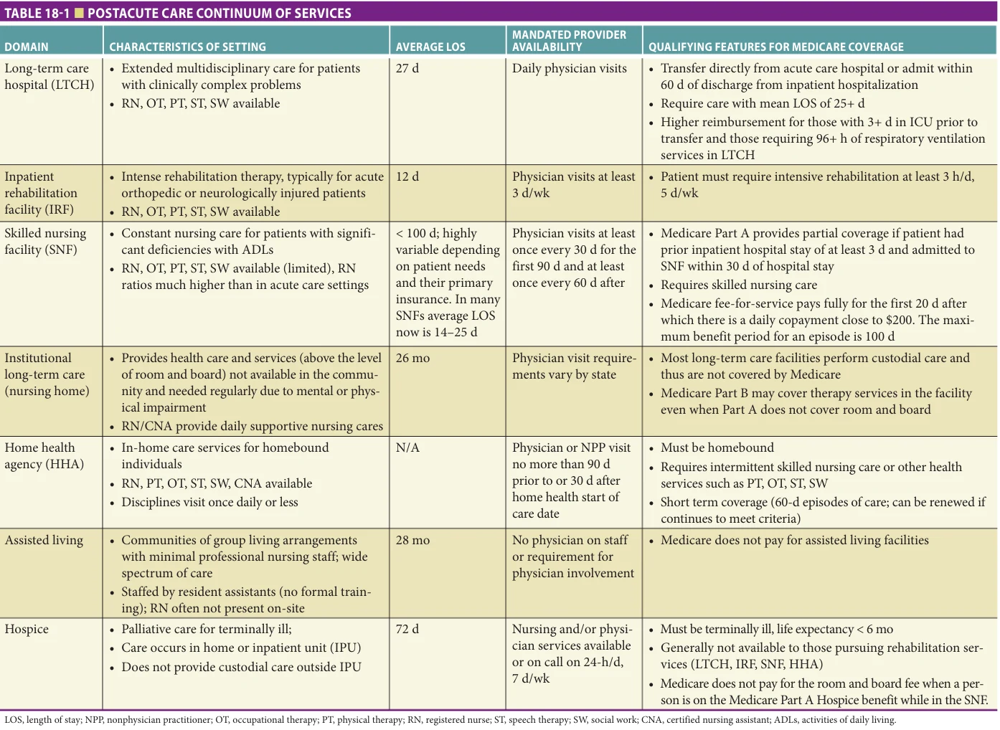

*TABLE 18-1 ■ POSTACUTE CARE CONTINUUM OF SERVICES*

*Owner annotations/highlights are from the marked source copy, not the book.*

**[p. 252]**

### Other Factors That Contribute to Gaps in Care

Limited clinician training in transitional care The subfield of transitional care continues to grow, yet it remains a relatively new concept that has not been emphasized in clinical training programs until recently. As a result, many clinicians are unprepared to manage transitions of care successfully or even to recognize the consequences of health system fragmentation. Additionally, clinical training often takes place primarily in acute care settings. Many clinicians may have little to no exposure to other settings of care such as postacute care or home-based services. Postacute care services vary substantially in available resources, level of physician contact, and acuity of patient populations. Table 18-1 provides an overview of the continuum of postacute care settings. A lack of exposure to these various settings may contribute to a limited understanding of the unique needs/resources outside of hospital settings, leading to communication failures between hospital-based and postacute providers and inappropriate care plans. As a result, patients may receive inadequate services in the postacute period, causing distress for the patient/caregiver and potentially avoidable rehospitalizations. In some cases, rehospitalizations may arise from clinical deterioration, but in others, patients/families may lose confidence in the setting’s ability to provide care and choose to return to the hospital. Even when patients discharge to a more intensive level of care than necessary, they may face risks for rehospitalization. In addition to occupying beds better utilized by others, they may quickly discharge to a lower acuity setting, facing the attendant risks of yet another handoff.

Patient/caregiver underprepared for transitions Limited or inadequate preparation of patients and caregivers regarding what to expect at the next setting of care is also a common problem. Patients and their caregivers are often unaware of what to expect following hospital discharge or transitions of care. They often are not empowered to take part in their plan of care sufficiently. Patients’ and caregivers’ sense of underpreparation may not necessarily be due to a lack of discharge information, but more so due to the complexity and amount of information communicated are overwhelming. These vast quantities of information would be challenging for anyone to encode and retain in the short time frame for discharge teaching that is typically provided. It is also common for patients and their caregivers not to recognize that they are unprepared to succeed in their next setting of care until they arrive and experience a care failure in that setting.

Poor-quality communication among provider teams Highquality communication between care teams at points of patient transition across settings is essential to patient safety, particularly at hospital discharge. More than half of all avoidable events following hospital discharge relate to poor communication among providers. Physicians have traditionally played the key role in communicating a patient’s care plan to the next setting provider at hospital

discharge, typically in the format of a discharge summary. The discharge summary is the only form of communication at hospital discharge mandated by The Joint Commission (TJC) and must be completed within 30 days of discharge, according to TJC standards. In this new era of health system fragmentation, most experts believe that this 30-day time frame is much too long. While TJC has minimal standards for the content of discharge summaries, these are widely considered by experts to be insufficient. Despite the importance of discharge summaries in facilitating coordinated care, physicians receive little to no training in discharge summary creation, and there is no mandated standard format for these documents. Perhaps unsurprisingly, research examining the quality and content of discharge summaries has found that they routinely omit the most important care plan components, such as code status, diet, warfarin instructions, and pending laboratory tests.

While a physician has historically been the recipient of hospital discharge summaries, patients now discharge to a range of postacute care facilities with varying multidisciplinary clinician teams who may require different information than what has been traditionally included within discharge summaries. Poor-quality discharge communication is particularly problematic for transitions to SNFs. SNF staff rely heavily on written discharge communication, which may serve as the only source informing a patient’s care plan for up to 30 days postdischarge. In focus groups, SNF nurses have reported regularly receiving discharge information that is untimely, incomplete, inaccurate, or conflicting. Because discharge summaries often dictate a patient’s plan of care for a significant period of time postdischarge and clarifying the confusing information in discharge summaries often takes several days, nurses in SNF settings have identified a list of discharge summary components that they require to safely transition patients to posthospitalization care (Table 18-2).

### Special Considerations for Transitions of Care among Older Adults

Older adults are heavy users of a range of health care services, including acute care stays, postacute care, subacute care, and home health care services. Those with one or more chronic conditions see an average of eight different physicians annually. Figure 18-1 depicts the experience of an older adult receiving care in a series of fragmented systems, where the patient often serves as the only link between providers, and communication and integration between providers are commonly infrequent.

Older adults experience a variety of transitions of care. Hospital discharge is a particularly vulnerable care transition for older adults and results in an adverse event for approximately one in five adult medical patients within 3 weeks of discharge. Furthermore, nearly 20% of Medicare beneficiaries age 65 and older experience rehospitalization within 30 days of discharge, accounting for over $17 billion in health care spending annually. Patients increasingly discharge to a range of settings following hospitalization,

**[p. 253]**

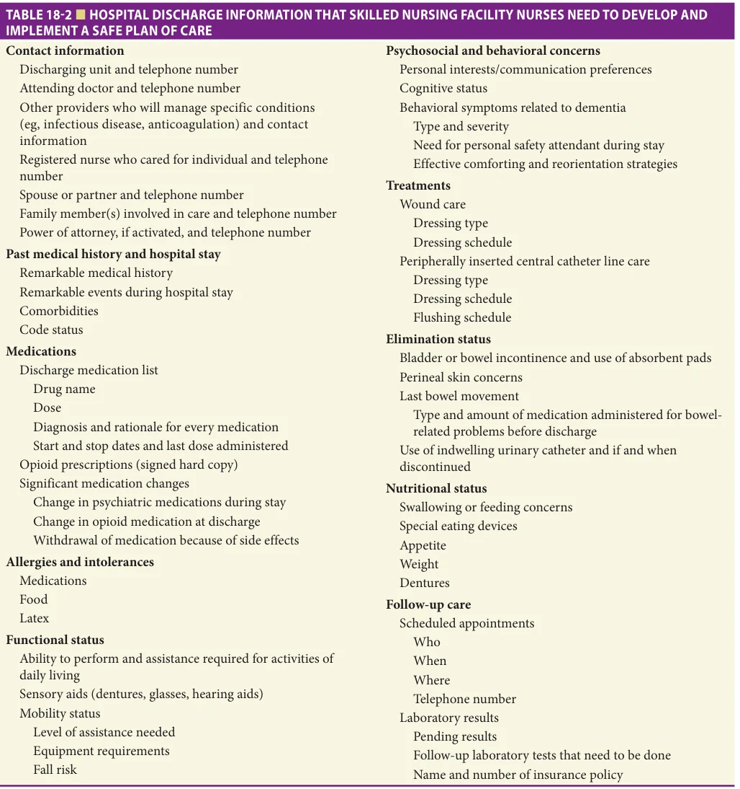

*TABLE 18-2 ■ HOSPITAL DISCHARGE INFORMATION THAT SKILLED NURSING FACILITY NURSES NEED TO DEVELOP AND IMPLEMENT A SAFE PLAN OF CARE*

*Owner annotations/highlights are from the marked source copy, not the book.*

with approximately 25% of older adults being discharged to a different institution and 12% being discharged to their homes with home health care services. Table 18-3 includes examples of different types of transitions in the level of care or setting that older adults may experience. Older adults who may be at increased risk for rehospitalization include those with difficulty with activities of daily living (ADLs), socioeconomic disadvantage, depression, substance abuse disorders, a history of previous hospitalization, difficulty with treatment adherence or medication compliance, or cognitive impairment.

While patients do not always transition between institutional settings, transitions to community settings may still include a range of other care provider teams who may manage medical needs following hospitalization, including home health teams and primary care providers.

### Patient and Caregiver Perspective on Transitions of Care

High levels of stress and dissatisfaction often characterize experiences of transitions for patients and families. In addition to poor communication between hospital providers,

**[p. 254]**

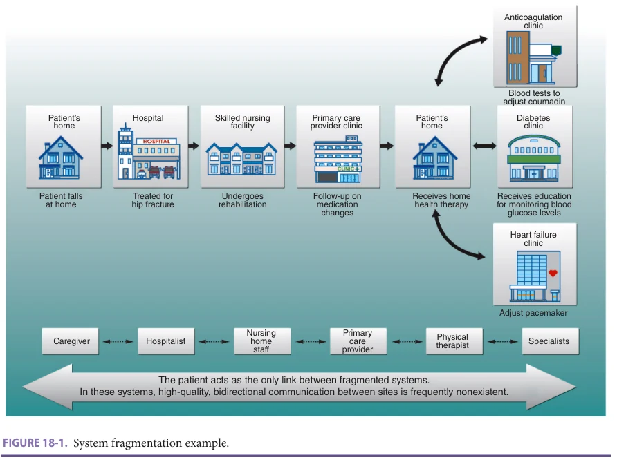

*FIGURE 18-1. System fragmentation example.*

*Owner annotations/highlights are from the marked source copy, not the book.*

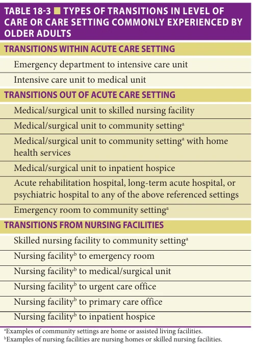

*TABLE 18-3 ■ TYPES OF TRANSITIONS IN LEVEL OF CARE OR CARE SETTING COMMONLY EXPERIENCED BY OLDER ADULTS*

*Owner annotations/highlights are from the marked source copy, not the book.*

postacute providers, and primary care physicians (PCPs), ineffective physician-patient communication likely contributes to patients’ underpreparation for managing their care following transitions, particularly after hospitalization. Various communication failures involving and surrounding patients during transitions also lead to the lack of appropriate follow-up care (eg, visit with PCP following hospitalization), which likely increases risk for rehospitalization. Failure to receive follow-up care and the resulting subsequent negative sequelae may incorrectly be attributed to the patient’s noncompliance rather than other factors, such as inadequate preparation or education prior to discharge, leading patients and their caregivers to feel frustrated and unsupported.

Little research has examined patients’ and caregivers’ preferences surrounding transitional care. Some qualitative research has found that patients and caregivers struggle with hospital discharges. Patients report feeling anxious and reluctant to ask clarifying questions about posthospital care needs when hospital discharge occurs quickly or with little notice, leading to patients discharging without a clear understanding of their posthospital care needs. Patients and caregivers also expressed insecurities about their ability to ask questions of the care team. Table 18-4 includes quotations provided by patients and caregivers in research studies that illustrate their experiences surrounding transitions of care.

**[p. 255]**

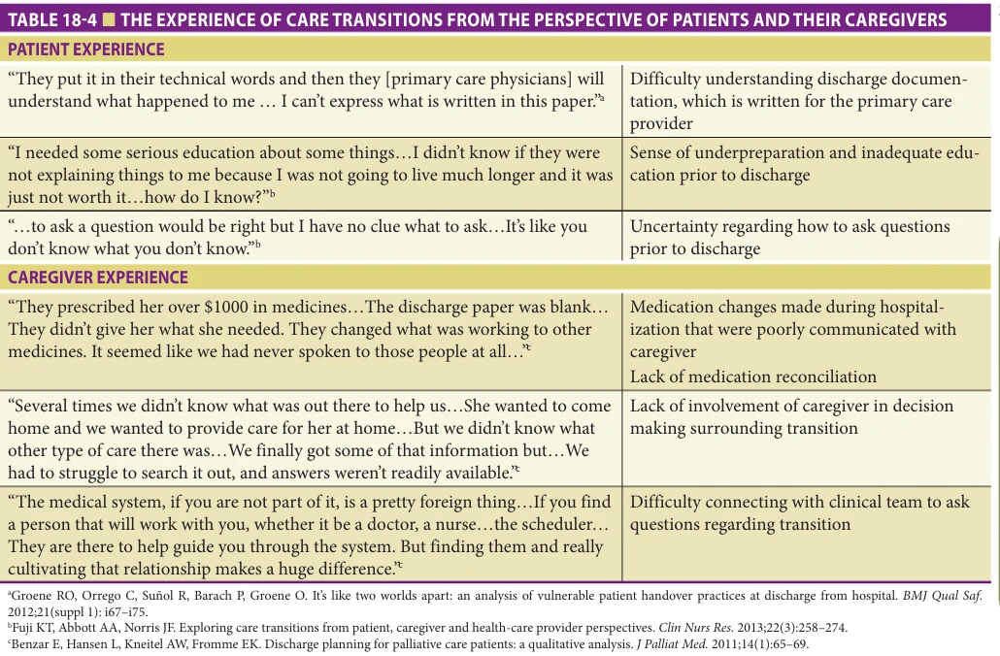

*TABLE 18-4 ■ THE EXPERIENCE OF CARE TRANSITIONS FROM THE PERSPECTIVE OF PATIENTS AND THEIR CAREGIVERS*

*Owner annotations/highlights are from the marked source copy, not the book.*

## HIGH-QUALITY TRANSITIONAL CARE

High-quality transitional care can combat system fragmentation to better support patients in bridging the gaps during transitions of care. One central component of effective transitional care is identifying and engaging caregivers for patients whenever possible. This is particularly important during hospitalization. Prior to experiencing a transition, such as hospital discharge, patients are often overwhelmed and acutely ill. Furthermore, navigating care needs following transitions often places patients in situations where they must rely on social supports and resources beyond themselves. These social supports (eg, caregivers) are more likely to be effective if they are engaged in and prepared for the posthospital period along with patients. This is critical for patients with cognitive impairments, such as dementia or delirium, who may struggle to retain information about the transition period. Effective transitional care also merits the involvement of the entire interdisciplinary team.

While most transitional care programs have focused on transitions from hospital to community settings, the common elements of these programs are applicable to supporting patients across any range of transitions. Multicomponent interventions, which address more facets of a transition, have the ability to tailor their care responses to an individual patient’s needs and fully integrate with both the sending and receiving setting and are likely the

most effective. Some specific elements of effective and high-quality transitional care include, but are not limited to: (1) involvement of the patient/caregiver in care plan decisions prior to and during the transition to ensure that their goals are addressed and that the plan is feasible, (2) patient and caregiver empowerment and preparation for necessary care in the posttransition period that is reinforced through a series of contacts before, during, and after the transition, (3) timely, complete, and accurate communication with the next care team with mechanisms for the receiving team to ask questions and obtain clarifications, and (4) high-quality medication reconciliation. Examples of activities that fulfill the definition of high-quality transitional care are provided in Table 18-5 and are contrasted with typical, less-optimal care activities that may facilitate a discharge but do not necessarily support a high-quality, coordinated transition.

### Patient/Caregiver Involvement in Decision Making

Involving patients and their caregivers in decisions about care plans prior to transitions addresses several important barriers to effective transitions. First, it enables patients to gain an idea of what to expect at the next setting of care, which may ultimately help them prepare for their needs. Early involvement in decision making also provides patients with the opportunity to express their goals and values, which may impact placement decisions.

**[p. 256]**

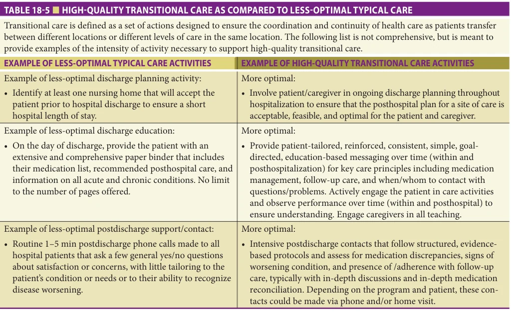

*TABLE 18-5 ■ HIGH-QUALITY TRANSITIONAL CARE AS COMPARED TO LESS-OPTIMAL TYPICAL CARE*

*Owner annotations/highlights are from the marked source copy, not the book.*

### Patient/Caregiver Empowerment, Preparation, and Support

Providing patients and their caregivers with the necessary empowerment, preparation, and support to manage their needs in the next setting of care successfully is critical. In successful transitional care programs, this preparation generally includes the following components: (1) education and empowerment in medication management, ideally using either in-person assessments or patient-/ caregiver-led medication reconciliation techniques, (2) ensuring adequate follow-up care is in place and that the patient/caregiver is prepared to actively participate in that follow-up, (3) education of the patient/caregiver about signs of a worsening condition (often referred to as “red flags”) and empowerment to act upon those signs, and (4) ensuring that patient/caregiver understands who to contact with follow-up questions and how to make these contacts. These core areas should be reinforced in the early discharge period through a series of contacts over time to adhere to standard principles of adult learning.

### High-Quality Communication Between Sending and Receiving Care Teams

High-quality communication is central to achieving safe transitions. While ongoing, bidirectional communication between the sending and receiving health care team would be ideal, typically, most communication between

care settings occurs in a written format at one point in time.

Written discharge communication, primarily the discharge summary, is the primary and often only form of communication that accompanies a patient following hospitalization. For patients discharged to nursing homes, the orders received concurrently with or contained in the discharge summary can dictate a patient’s care for up to 30 days, so high-quality written communication is especially a key for these patients. Yet, as noted earlier in this chapter, the quality of written communication tends to be poor.

Several strategies can improve the quality of written discharge communication. First, whenever possible, a provider who is familiar with the patient should create, complete, and sign the discharge summary. In current practice, discharge summaries are sometimes iteratively modified by multiple rotating providers until the time of discharge. In such cases, the posthospital care setting may receive several versions of discharge summaries with conflicting information. It is important to recognize that many of these settings, such as SNFs, are not capable of implementing last-minute changes in orders and may face long delays in responding to medication changes or special equipment orders due to the lack of on-site pharmacies and central supply services. Consequently, last-minute changes in discharge orders should be minimized and, when they do occur, should be communicated to the admitting facility using another

**[p. 257]**

method (eg, via phone) prior to patient transport. Because many postacute care settings require information about care plan elements that are not immediately available to the physician, engaging the interdisciplinary team in creating certain components of the document or providing recommendations for the document in the electronic medical record (EMR) may be advantageous. Some examples of these care plan elements may include information about behavioral symptoms in patients with dementia such as agitation, that are critical for staff in the next setting of care to be aware of in order to arrange appropriate staffing and supportive care. A care system can use a standard format for discharge summary creation to reduce omission of key information. A list of recommended discharge summary components required by nurses in SNF settings can be found in Table 18-2.

While written discharge communication is the primary form of communication for physician providers, other members of the care team should also consider verbal handoffs with providers in the next setting of care. Nurses in SNFs have identified high-quality verbal handoff with hospital nurses to be very helpful in preparing for patient transitions. This contact also provides an opportunity for both the sending and receiving end of the transition to identify and resolve relevant questions that may not have been recognized until patient transfer.

### High-Quality Medication Reconciliation

Medication reconciliation is an essential component of transitional care programs in which the patient, members of the health care team, and other caregivers can collaborate to improve medication safety as the patient transitions between health care settings (eg, hospital admission or discharge) or other care units. Medication reconciliation is the formal process recognized by TJC of creating the most accurate medication list by comparing, or reconciling, the patient’s current list of medications with the medications ordered by providers upon admission, transfer, and discharge. TJC recommends five steps in the medication reconciliation process (Table 18-6). This process is intended to identify and resolve any medication discrepancies or errors, such as omissions, additions, duplications, and frequency or dosing errors, with the goal of preventing adverse drug events (ADEs) and subsequent patient harm. Since medication discrepancies are a major contributor to ADEs,

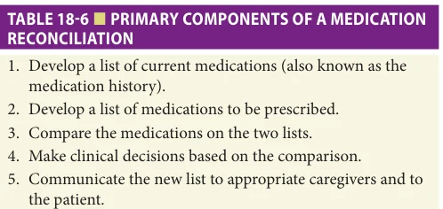

*TABLE 18-6 ■ PRIMARY COMPONENTS OF A MEDICATION RECONCILIATION*

*Owner annotations/highlights are from the marked source copy, not the book.*

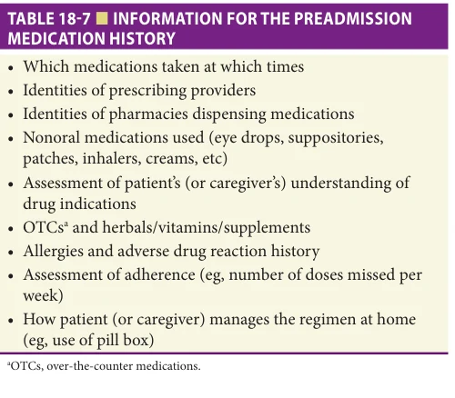

*TABLE 18-7 ■ INFORMATION FOR THE PREADMISSION MEDICATION HISTORY*

*Owner annotations/highlights are from the marked source copy, not the book.*

TJC has made medication reconciliation a National Patient Safety Goal and requires all of its accredited institutions to have a process implemented at their site for reconciling medications. Despite these efforts, however, medication reconciliation processes have been challenging to perform effectively and consistently as evidenced by a continuing high prevalence of medication discrepancies for patients transitioning between health care settings and levels of care.

The medication reconciliation process starts by obtaining the patient’s medication history. Often, a physician, pharmacist, or nurse will obtain the patient’s medication history by (1) interviewing the patient and their caregivers, (2) accessing the patient’s past medical records, and (3) contacting other providers involved in the patient’s care and the patient’s community pharmacy for recently dispensed medications (Table 18-7). When creating the patient’s list of current medications, it is important to identify all medications the patient is taking, including prescription drugs, over-the-counter medications, herbal remedies, and supplements. The patient’s medication histories are then reconciled with medications to be ordered to ensure that the new medications and doses are appropriate for the patient. Changes to the patient’s medication regimen are documented in their medical chart, and a complete medication list is communicated to the patient, caregiver, and next provider/team. Reconciling medications applies to all health care settings, including ambulatory care, inpatient services, emergency and urgent care, long-term care, and home care.

## EXAMPLES OF HIGH-QUALITY TRANSITIONAL CARE INTERVENTIONS

Transitional care interventions support patients as they move between different settings of care and generally emphasize medication management, empowerment/ support with self-care management, and posthospital contact with a care provider. Many of these interventions

**[p. 258]**

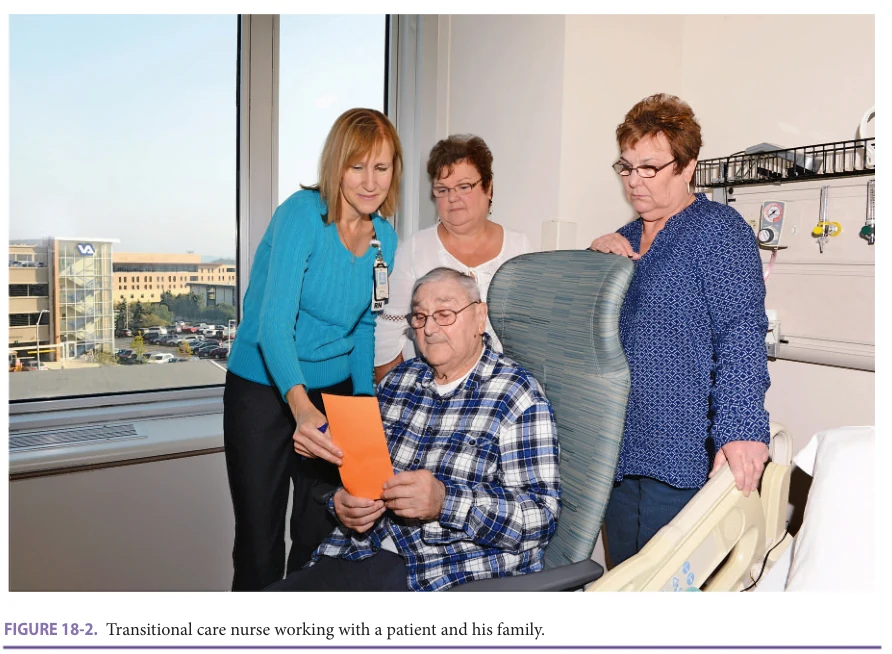

*FIGURE 18-2. Transitional care nurse working with a patient and his family.*

*Owner annotations/highlights are from the marked source copy, not the book.*

recognize nurses as clinical leaders for supporting patients and their families as they navigate transitions (Figure 18-2). They engage nurses as well as other members of the interdisciplinary team in developing care plans, performing medication reconciliation, and supporting medication adherence and self-care in the early discharge period. Most transitional care interventions focus on transitions from hospital to community settings; however, emerging care models continue to be developed to support patients during a range of unique transitions. Some examples of specific transitional care interventions are noted below.

### Interventions to Improve Hospital-to-Community Transitional Care Quality

Home visit–based transitional care interventions that have been tested in randomized controlled trials include Coleman’s Transitions of Care Intervention (CTI) and Naylor’s Transitional Care Model (TCM). These interventions reduce rehospitalizations by about one-third. Both programs utilize posthospital in-home visits with a nurse practitioner to educate high-risk patients about their medications, medical follow-up, signs of condition worsening, and provider’s contact information. While contact with patients in these programs only lasts for a few weeks, the effect on rehospitalization has been shown to last up to 180 days—likely due to improved self-management. Both of these interventions, however, are limited to patients who

agree to in-home supports and live within geographic reach of a home visit.

Transitional care interventions utilizing similar steps as CTI and TCM have recently emerged to target vulnerable patients, including those with cognitive impairment, and those who refuse home visits or live too far from discharging hospitals to receive home visits. One of these, the Coordinated-Transitional Care (C-TraC) program, developed within the US Department of Veterans Affairs, is a low-cost, telephone-based program. It uses a nurse case manager to coordinate the patient’s transition via a series of protocol-driven in-hospital visits, intensive posthospital phone calls, and integration with in-hospital and posthospital clinical teams. In preliminary testing, the C-TraC intervention reduced 30-day rehospitalizations by onethird among enrollees, leading to a substantial cost avoidance. However, more rigorous testing is needed to better understand its impact.

Project Re-Engineered Discharge (RED) is an intervention based within the acute care setting that involves enhanced in-hospital discharge processes and education. A randomized controlled trial of Project RED showed a decrease in 30-day emergency room visits but no significant effect on rehospitalizations. The average age of the population tested in the study was 50 years, much younger than the typical older adult population at most risk for rehospitalization. Given this and the limited posthospital support available within this program,

**[p. 259]**

its role in high-risk and older patient populations remains unclear.

The success of a care transition relies not only on adequate preparation of patients/caregivers and effective communication between health care teams but also on the selection of the most appropriate setting for subsequent care. Development of clinical decision support tools could assist in directing clinicians to the best postacute setting for patients’ needs. Such tools have shown promise in identifying patients in need of postacute care and, when used to develop the discharge plan, may reduce inpatient rehospitalizations. More investigation is necessary to determine whether these tools could be incorporated broadly into routine practice and whether the reductions in rehospitalization can be replicated.

### Interventions to Improve Nursing Home–to– Hospital Transition Quality

Nursing home patients experience a high degree of costly transfers to the hospital setting that may be avoidable through earlier recognition of changes in condition by nursing home staff. These transfers are burdensome for nursing home residents, many of whom may be physically frail and have some degree of cognitive impairment. Interventions to Reduce Acute Care Transfers (INTERACT) is a program that was developed to reduce the frequency of transfers to acute care for nursing home patients by supporting nursing home staff’s ability to identify, assess, and communicate changes in condition. The program consists of a toolkit composed of: (1) a Situation-Background-AssessmentRecommendation (SBAR) tool to support effective communication between nurses and physicians, (2) an early warning tool designed to promote early recognition changes in condition, (3) a hospital transfer review tool to support review of hospitalizations and potentially avoidable causes, and (4) a standardized patient transfer form to communicate key patient information during transfer. INTERACT tools are available for no cost for clinical and educational use at www.interact-pathway.com and consist of a toolkit that supports both education for nursing home staff as well as implementation and data collection support. Data suggest that INTERACT tools can decrease rehospitalizations in engaged facilities that implement the interventions fully.

Several other resources and programs are also available. The Society for Post-Acute and Long-Term Care Medicine/American Medical Directors Association has several relevant tools on its website. A CMS demonstration program involving 7 sites and over 140 nursing homes demonstrated significant reductions in all-cause hospitalizations among long-stay nursing home residents. All of the interventions involved components of the INTERACT program and provided additional on-site personnel to help implement the interventions. Examples of additional interventions included a focus on advance care planning, medication reconciliation, oral health

care, and telemedicine. One site that provided on-site nurse practitioners to implement core components of the INTERACT program showed a 30% reduction in allcause hospitalizations.

## SPECIAL POPULATIONS

### Patients with Cognitive Impairment and/or Nearing End of Life

Older adults with cognitive impairments, such as dementia, are at increased risk for experiencing negative outcomes associated with transitions. Research suggests that dementia may increase care rehospitalization risk by an alarming 40%. While little research has examined reasons for this increased risk, it is apparent that the limited capacity to learn, recall, and effectively communicate elements of their care plan among those with dementia may result in an inability to compensate for poor communication across clinical teams and may play a role in subsequent rehospitalizations. Persons with dementia also have difficulty adapting to stressors and responding to change. They generally benefit from consistency in caregiver teams and environment, making transitions across care settings particularly burdensome. Considerable changes in surroundings (eg, transitioning from nursing home to the hospital) for a person with dementia may result in increased behavioral symptoms, such as agitation or increased depressive symptoms.

While most people with dementia spend most of their life in community settings, they also experience transitions into permanent care (eg, placement in a nursing home) more often than non-cognitively impaired older adults. Transitions into permanent care represent considerable changes for both the individual with dementia and their family/caregivers. Persons with dementia have expressed a desire to be involved in the transition process and to have their family members engaged to offer support. However, research also suggests that persons with dementia may be excluded from the decision-making surrounding transitions of care. The lack of inclusion of people with dementia of care decisions may result from the incorrect assumption that people with dementia are unable to contribute to decision-making conversations or that these conversations will result in distress due to a lack of comprehension. Though some individuals with more advanced cognitive impairment may be unable to participate in their care at this level, many individuals with mild to moderate impairment could benefit from this opportunity, as providing input into the decision to transition into a nursing home for permanent care has been shown to lead to a greater sense of acceptance with the decision. Developing a longitudinal care plan may help incorporate the wishes and values of people with dementia into transitions of care more effectively. Early discussion about preferences regarding settings of care and whether the benefits of seeking acute care for an illness outweigh the harms of the transition to an unfamiliar

**[p. 260]**

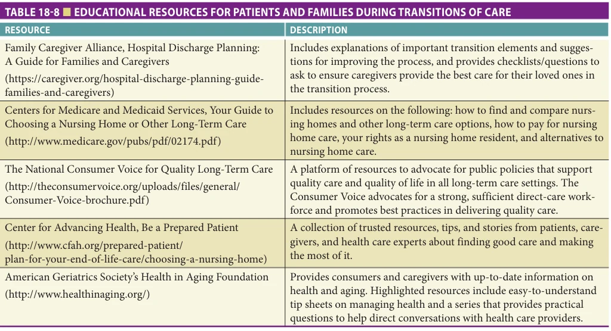

*TABLE 18-8 ■ EDUCATIONAL RESOURCES FOR PATIENTS AND FAMILIES DURING TRANSITIONS OF CARE*

*Owner annotations/highlights are from the marked source copy, not the book.*

environment can guide surrogates’ choices in later stages of dementia. Dementia-specific advance directives have been suggested as one means of conveying these wishes.

Transitions near the end of life are common in those with and without dementia. Such end-of-life transitions may not improve quality of life, instead adding to suffering and burden, and may be preventable. More than 80% of individuals experience at least one transition between health care settings in the past 6 months of life, with about one-third experiencing four or more transitions. Despite

the substantial burden associated with transitions for persons with dementia, they experience more transitions within the past 3 months of life than those without dementia. Advance care planning may reduce the likelihood of burdensome transitions, particularly when completed earlier in the course of illness.

Patients with dementia also benefit from inclusion in transitional care interventions that emphasize empowerment and preparation of caregiver and adapt patient education strategies to meet the needs of individuals with

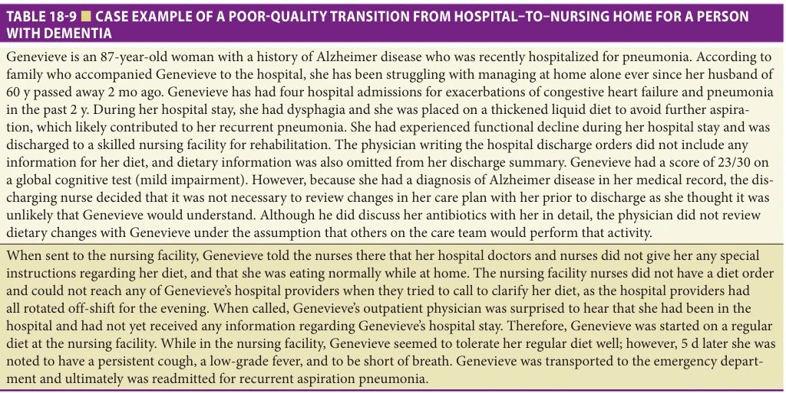

*TABLE 18-9 ■ CASE EXAMPLE OF A POOR-QUALITY TRANSITION FROM HOSPITAL–TO–NURSING HOME FOR A PERSON WITH DEMENTIA*

*Owner annotations/highlights are from the marked source copy, not the book.*

**[p. 261]**

cognitive impairment. The C-TraC program previously described is one example of a transitional care program that actively engages caregivers and uses methods of spaced retrieval to aid in information retention in persons with dementia.

Most community-dwelling older adults with dementia live with or receive frequent support from informal caregivers, who are often but not always family members. Because caregivers of people with dementia experience considerable burden and negative health outcomes related to the caregiving role, it behooves clinicians overseeing transitions of care for persons with dementia also to be responsive to the needs of their family/caregivers. Caregivers often experience guilt and frustration surrounding transitions into nursing home settings and are rarely prepared to manage these emotional conflicts and sense of bereavement during placement. Caregivers also generally express a desire

to continue to participate in care following the transition. Enhanced support and counseling surrounding transitions to nursing home placement have been shown to have both short- and long-term benefits for caregivers. Providers may wish to refer caregivers to these or similar programs and may also refer caregivers to website resources provided at end of this chapter (Table 18-8). Table 18-9 illustrates a case example of the experience of transitional care for an older adult with dementia that illustrates a life-threatening complication and hospital readmission because of poor communication between the hospital and the SNF.

## ACKNOWLEDGMENTS

The authors would like to acknowledge Jacquelyn Mirr, Brian Mirr, and Michael Gehring for assistance with formatting/graphics.

## FURTHER READING

Aaltonen M, Rissanen P, Forma L, et al. The impact of

dementia on transitions in care during the last two years of life. Age Ageing. 2012;41:52–57. Callahan CM, Arling G, Tu W, et al. Transitions in care for

older adults with and without dementia. J Am Geriatr Soc. 2012;60:813–820. Coleman EA. Falling through the cracks: challenges and

opportunities for improving transitional care for persons with continuous complex care needs. J Am Geriatr Soc. 2003;51:549–555. Coleman EA, Berenson RA. Lost in transition: challenges

and opportunities for improving the quality of transitional care. Ann Intern Med. 2004;141:533–536. Coleman EA, Mahoney E, Parry C. Assessing the quality

of preparation for post-hospital care from the patient’s perspective: the transitions in care measure. Med Care. 2005;43:246–255. Coleman EA, Parry C, Chalmers S, Min SJ. The transitions

in care intervention results of a randomized control trial. Arch Intern Med. 2006;166(17):1822–1828. Dimant J. Roles and responsibilities of attending physi-

cians in skilled nursing facilities. J Am Med Dir Assoc. 2003;4:231–243. Fakha A, Groenvynck L, de Boer B, van Achterberg T,

Harners J, Verbeek H. A myriad of factors influencing the implementation of transitional care innovations: a scoping review. Implement Sci. 2021;16:21–44. Forster AJ, Murff HJ, Peterson JF, et al. The incidence

and severity of adverse events affecting patients after discharge from the hospital. Ann Intern Med. 2003;138:161–167.

Fuji KT, Abbott AA, Norris JF. Exploring transitions in care

from patient, caregiver, and health-care provider perspectives. Clin Nurs Res. 2013;22(3):258–274. Gleason KM, Brake H, Agramonte V, Perfetti C. Medica-

tions at Transitions and Clinical Handoffs (MATCH) Toolkit for Medication Reconciliation. http://www .ahrq.gov/professionals/quality-patient-safety/patientsafety-resources/resources/match/match.pdf. Accessed March 31, 2015. Gozalo P, Teno JM, Mitchell SL, et al. End-of-life transitions

among nursing home residents with cognitive issues. N Engl J Med. 2011;365:1212–1221. Jencks SF, Williams MV, Coleman EA. Rehospitalizations

among patients in the Medicare fee-for-service program. N Engl J Med. 2009;360:1418–1428. Joint Commission. Improving America’s Hospitals: A Report

on Quality and Safety. Oakbrook Terrace, IL: Joint Commission; 2006. Kind AJ, Jensen L, Barczi S, et al. Low-cost transitional care

with nurse managers making mostly phone contact with patients cut rehospitalization at a VA hospital. Health Aff (Millwood). 2012;31:2659–2668. King BD, Gilmore-Bykovskyi A, Roiland R, et al.

The consequences of poor communication during hospital-to-skilled nursing facility transitions: a qualitative study. J Am Geriatr Soc. 2013;61(7):1095–1102. Moore C, McGinn T, Halm E. Tying up loose ends: dis-

charging patients with unresolved medical issues. Arch Intern Med. 2007;167:1305–1311. Moore C, Wisnivesky J, Williams S, et al. Medical errors

related to discontinuity of care from an inpatient to

**[p. 262]**

an outpatient setting. J Gen Intern Med. 2003;18: 646–651. Naylor MD, Brooten DA, Campbell RL, et al. Transitional care

of older adults hospitalized with heart failure: a randomized, controlled trial. J Am Geriatr Soc. 2004;52:675–684. Ouslander JG, Bonner A, Herndon L, Shutes J. The Inter-

ventions to Reduce Acute Care Transfers (INTERACT) quality improvement program: an overview for medical directors and primary care clinicians in long term care. J Am Med Dir Assoc. 2014;15(3):162–170.

Rantz MJ, Popejoy L, Vogelsmeier A, et al. Successfully

reducing hospitalizations of nursing home residents: results of the Missouri Quality Initiative. J Am Med Dir Assoc. 2017;18:960–966. Tena-Nelson R, Santos K, Weingast E, Amrhein S,

Ouslander J, Boockvar K. Reducing potentially preventable hospital transfers: results from a thirty nursing home collaborative. J Am Med Dir Assoc. 2012;13(7):651–656.
