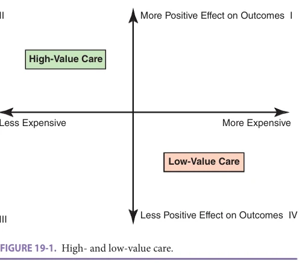
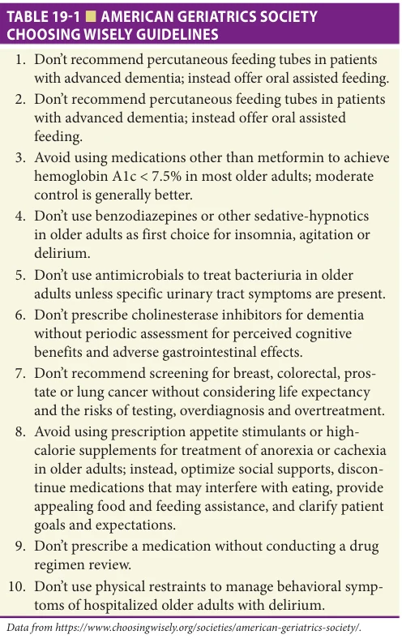
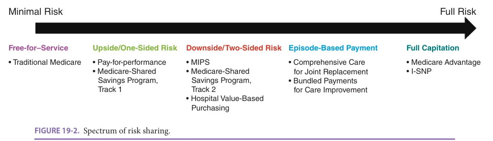
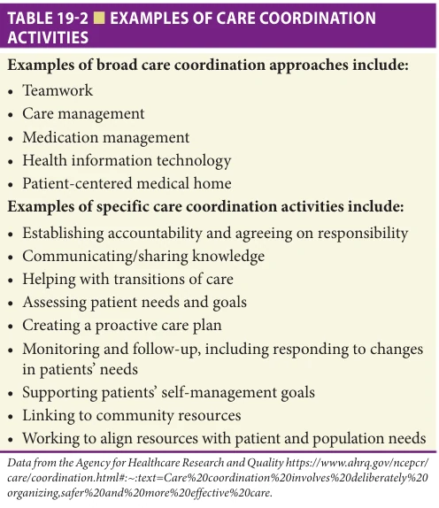
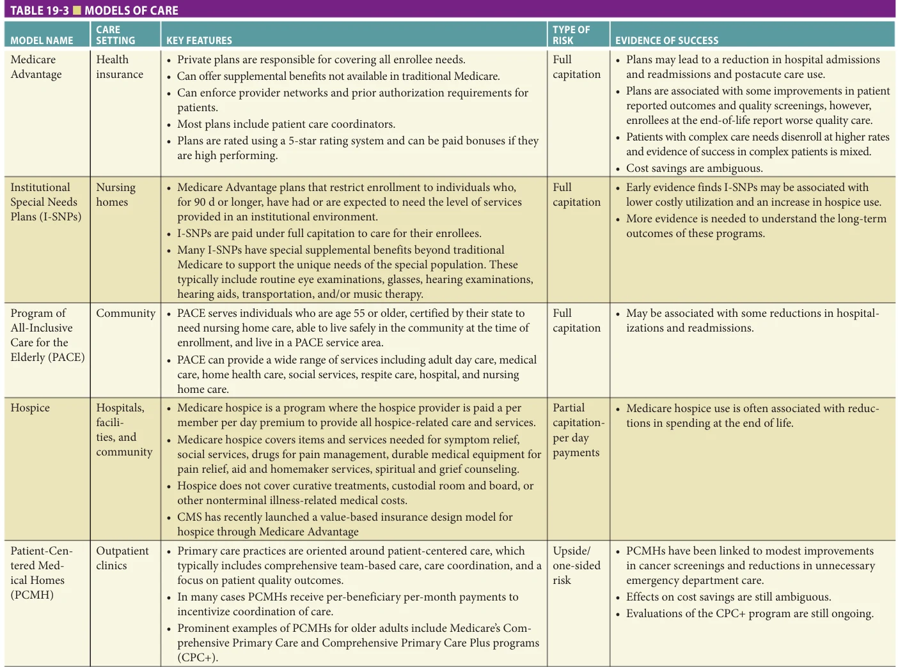
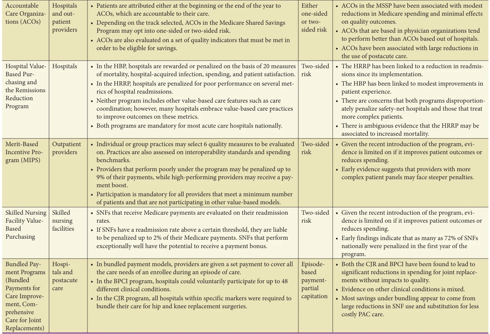
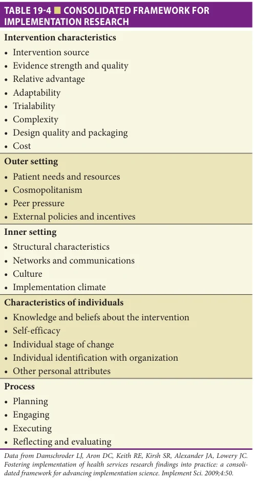
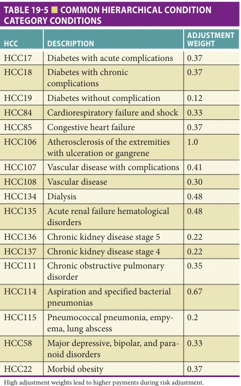

# Hazzard's Geriatric Medicine and Gerontology, 8e - Chapter 19: Value-Based Care

David J. Meyers, Heidi Wold, Joseph G. Ouslander

> **Status.** Fast build from the book; not lane-reviewed.

> Not cited in the 2020-2026 past papers.

> **Source and method.** Printed pages 263-276, from the marked 8th-edition copy (PDF page = printed page + 34). Prose follows its text layer; tables and figures are source-page crops. The book is canonical.

**[p. 263]**

The purpose of this chapter is to provide an overview of value-based care as it currently exists in the United States, and to highlight aspects of common value-based care models that are most relevant to the care of older adults. In many respects, geriatricians and other geriatric health professionals are in a position to make these value-based care models successful and to assume leadership roles in them. Value-based care requires health professionals to work as interprofessional teams and participate in care coordination across settings of care, to understand evidence-based care and as well as its limitations in older adults, and to practice personcentered care in the context of evidence and many other factors important to patients—all skills that geriatricians and other geriatric health professionals have developed.

#### Learning Objectives

- Understand the basic definitions of value-based care

- Explain the key elements of value-based care models

- Discuss the value-based care issues particular to older adults

- Identify different value-based care and alternative payment models

#### Key Clinical Points

1. There are substantial efforts in process to shift toward value-based care models and these types of arrangements are likely to become more common in the future.

2. Several alternative payment models are relevant to care for older adults. Examples include the Medicare Advantage (MA) program, accountable care organizations (ACOs), Programs of All-Inclusive for the Elderly (PACE), Institutional Special Needs Plans (ISNPs), the Merit-Based Incentive Payment System, and the Skilled Nursing Facility Value-Based Purchasing Program (SNF VBP).

3. There is no silver bullet in achieving valuebased care. Rather, each initiative has strengths and drawbacks and forms a part of the greater whole.

At the same time, older adults with multiple comorbidities and related health care needs are likely to benefit from being in one or more value-based care models when implemented effectively. These individuals are especially susceptible to the potential for excess diagnostic testing, therapeutic intervention, and related complications and costs that are common in the Medicare fee-for-service system. Value-based care mitigates the incentives that create this situation and can therefore result in better outcomes and lower costs for the vulnerable older population.

## DEFINING VALUE-BASED CARE

In most industries, value can be defined as the output achieved relative to the cost incurred. In health care, the most common definition of value is the patient health outcomes achieved per dollar spent. Central to the concept is that the value should be to the patient. Importantly, value is defined by both the quality of outcomes and the costs incurred. Costcontainment efforts without a focus on improving value may negatively impact patient health outcomes. Efforts devoted to improving quality metrics alone may not be sustainable or may not meet the needs or preferences of patients.

In the Porter model of value-based care, the outcomes that a patient experiences can be considered the numerator, while the cost of providing those outcomes can be considered the denominator. To improve the value of care, a provider can try to address either factor. However, in practice, addressing both simultaneously is often necessary. Value-based care can be seen as a direct response

to more traditional models of fee-for-service medicine. In fee-for-service, providers are simply paid a set amount for each unit of care they provide. Under fee-for-service, there is no incentive to improve on patient outcomes and there is a strong incentive to provide more care than is necessary. Engaging in value-based care should be an aspirational goal of many health systems as it puts the care of the patient first and the profit or provider second. A well-designed value-based care system will ideally maximize value for patients while at the same time providing value and potential cost savings for providers and payers as well.

**[p. 264]**

*FIGURE 19-1. High- and low-value care.*

*Owner annotations/highlights are from the marked source copy, not the book.*

### Low-Value Care

In a simple model, we can consider care on two axes (Figure 19-1). On the x-axis we can consider a spectrum from the least expensive to the most expensive care. On the y-axis we can consider treatments that provide minimal benefits to patients to treatments that provide a large benefit for outcomes. If the upper left quadrant can be considered high-value care—delivering positive outcomes for low cost, then its inverse is in the lower right quadrant: low-value care. Low-value care is often defined as “services that provide little or no benefit to patients, have potential to cause harm, incur unnecessary cost to patients, or waste limited healthcare resources.” Prior work has found that as much as $300 billion is spent annually on services that can be considered low value. As health systems and providers try to embrace concepts of value-based care, finding ways to maximize the use of high-value care and minimize the use of low-value care are often both necessary.

While there are many initiatives underway that aim to reduce the use of low-value care in clinical practice, one initiative that has grown in prominence is Choosing Wisely. Originally a project of the American Board of Internal Medicine, over 90 medical societies now publish lists of services that are deemed to be low value that clinicians should seek to avoid. The American Geriatrics Society published a list of 10 treatments that should be avoided (Table 19-1). While some work has found that the introduction of these lists are an important first step in addressing low-value care, they are a single component of a larger constellation of interventions that can help move delivery closer to value-based care.

## KEY FEATURES OF VALUE-BASED CARE MODELS

While models of value-based care are variable and there are no one-size-fits-all approaches, there are several features that tend to be included as a component of most models.

*TABLE 19-1 ■ AMERICAN GERIATRICS SOCIETY CHOOSING WISELY GUIDELINES*

*Owner annotations/highlights are from the marked source copy, not the book.*

First, they tend to feature some type of financial risk sharing between the payer (eg, a health plan) and the provider (eg, a hospital). Second, there is almost always effort devoted to quality measurement. Third, there is often increased care coordination than might be traditionally included in a feefor-service model. Fourth, many models also embrace concepts of population health management.

### Financial Risk Sharing

Financial risk sharing can take many forms and exists along a spectrum (Figure 19-2). Risk can be understood as the possibility of losing or gaining money on an investment. In health care, there can be substantial heterogeneity in the patients’ experiences and care needs. When a provider assumes more risk, they are making themselves more responsible for that variation. In traditional fee-for-service health care, a provider does not bear any risk financially. A provider is paid a fixed amount for providing patient services, and is not liable to losing financially if the patient requires more care or does not achieve desired outcomes. In fee-for-service there is an incentive for providing excess care that may not be beneficial to patients or the US health care system as a whole. In value-based care, providers take

**[p. 265]**

*FIGURE 19-2. Spectrum of risk sharing.*

*Owner annotations/highlights are from the marked source copy, not the book.*

on more risk, which incentivizes the provision of higher quality services.

When a provider takes on risk, it can take the form of upside risk or downside risk. Upside risk is the ability to benefit financially for delivering high value care and is also sometimes called one-sided risk. In the most basic iteration of upside risk, a provider may be “paid for performance”; receiving financial bonuses for delivering certain levels of quality. Another example of upside risk is in the early Medicare shared savings accountable care organization (ACO) models. If providers were able to meet quality standards and provide care under a financial benchmark, they could “share” some of those savings with the Medicare program. The upside risk models provide the least uncertainty to providers as they are not liable to repay any financial loses, however the ability to benefit in these models are typically more limited.

In downside risk models, a provider who does not meet a financial benchmark for their patients may be liable to refund a payer for the losses they incur. Downside risk may provide a stronger financial incentive to deliver on high value care. An example of downside risk is payment penalties under the hospital value-based purchasing program. If a hospital does not meet specific quality benchmarks, the Medicare program may withhold payments by 2%. Models that include both upside and downside risk are called two-sided risk models.

The next level of risk is episode-based payments. Under episode-based payment models, a provider may be paid a lump sum to cover all services a patient may need related to a specific condition. The Medicare program has launched several episode-based payment models, such as the Comprehensive Care for Joint Replacement (CJR) model. In the CJR model, providers are paid a single amount to cover all the care a patient needs for a lower extremity joint replacement, for up to 90 days postdischarge. If, for instance, a patient is readmitted to the hospital unnecessarily, the provider stands to lose financially; however, if care is delivered in an efficient matter, then they may benefit financially.

The highest level of risk a provider may take on is full capitation. Under full capitation, a provider or health

plan may be paid “per capita” or per person. These payments are typically “risk-adjusted,” paying a higher amount for patients who have more complex care needs. The most prominent example of full capitation in the US health care system is the Medicare Advantage (MA) program, where private plans are paid per capita for their enrollees. If a plan is successful in reducing unnecessary care and preventing adverse events such as hospitalizations, they may benefit substantially; however, if patients are repetitively hospitalized, the plan may lose substantially on that patient. While under full capitation, the payer or provider assumes the highest level of risk, they also stand the benefit the most if they provide high value care.

### Quality Measurement

Quality measurement is vital in value-based care for two primary reasons. First, if value-based aims to deliver maximal outcomes for minimal costs, it is imperative to measure quality to ensure that patients experience beneficial outcomes. Second, in the presence of a risk-sharing model, without quality thresholds there would be an incentive for providers to “stint” on care or to save money by cutting back on services to the detriment of a patient. In a fully capitated model, without the assurance of a baseline level of quality, a provider could deny all services to a patient in order to retain all of the payment they received for that patient. We describe quality measurement in value-based care in greater detail later in this chapter.

### Care Coordination

Care coordination is defined by the Agency for Healthcare Research and Quality as the “deliberate organizing of patient-care activities and sharing information among all of the participants concerned with a patient’s care to achieve safer and more effective care.” While this definition focuses on clinical care processes, other definitions also include a focus on the coordination of social and community-based services that might be beneficial to patients with advanced care needs. Despite varying definitions, care coordination can be an important tool for achieving value-based care. Table 19-2 lists common care coordination activities. If the two primary inputs into value-based care are reduced costs

**[p. 266]**

*TABLE 19-2 ■ EXAMPLES OF CARE COORDINATION ACTIVITIES*

*Owner annotations/highlights are from the marked source copy, not the book.*

and improved patient outcomes, care coordination has the potential to address both.

On the efficiency and cost side of the equation, care coordination can play an important role in organizing a patient’s care and preventing unnecessary additional visits and complications. After a hospitalization some patients, particularly those with advanced care needs, may have difficulties in making it to follow-up appointments. A provider who successfully coordinates a patient’s care, perhaps through the use of a patient navigator or community health worker, may be able to aid patients in receiving all of their necessary follow-up care, thus reducing the risks of an adverse event and a preventable hospital readmission. Other patients may see providers from different health systems and receive duplicative care across sites such as extra blood tests or imaging. These studies can result in false-positive or abnormal, but clinically insignificant findings that often result in repeat or follow-up testing. A system that is able to coordinate a patient’s care across providers, potentially through the use of electronic health records, may be able to prevent unnecessary services and invasive procedures by communicating results between providers rather than duplicating them.

Care coordination approaches can also be used to potentially improve upon patient outcomes. Some patients may have challenges in understanding and successfully taking their medications. Inappropriate medications and poor adherence to necessary medications may have downstream negative health effects. Successful care coordination could include regular medication reviews and reconciliation by the patient’s care team to ensure that the patient has access and is taking the

medication that they need. In other instances, a patient may benefit by being connected to social services in their communities such as meal services or transportation to their specialty visits, which may both lead to improved patient outcomes.

### Population Health Management

Population health can be defined as the health outcomes of groups of individuals including the distribution of such outcomes within the group. Population medicine acknowledges that many of the outcomes that patients face are driven in part by what occurs in the community. As such, population health management has become a key feature of value-based care. If providers are going to be held accountable for the outcomes their patients experience, there can be a strong incentive to promote positive outcomes through community-wide interventions and public health efforts. Examples of population health interventions for older adults include those targeted toward lifestyle behavior change, fall risk, polypharmacy, psychosocial interventions, and disease management programs. Common population health problems that lead to adverse health for older adults can include physical inactivity, unhealthy diets, and smoking. To address these concerns, patient-centered medical homes (PCMHs) often provide nutritionist services for patients and many MA plans cover smoking cessation services. To address concerns around fall risk, MA plans have recently started covering the costs of in-home safety modifications, such as the installation of handles in showers and hallways, exercise, and other fall prevention interventions. To address concerns of loneliness and depression among older adults, some hospitals and Program of All-Inclusive Care for the Elderly (PACE) programs have invested in friendly visitor services to ensure that older adults living in the community are able to socialize. Many ACOs and health plans also provide patients with disease management tools, such as remote glucose monitors, in order to ensure that the needs of their patients are being met. While each of these value-based models may need to cover the upfront costs of these services for their patients, over time, they may be beneficial in improving patient outcomes and reducing the risk of costly events such as hospitalizations.

Population health strategies can also be helpful to value-based practices to identify patients at highest risk for complications and health care costs. In heterogeneous populations of older adults, some will be relatively healthy and others will have multiple comorbidities requiring considerable medical care. We know that in such populations, a relatively small proportion of patients can account for the majority of costs. Various models, such as for hospitalizations, readmissions, injurious falls, and other expensive events, can assist in identifying those at highest risk and developing targeted and tailored interventions that can improve care and reduce morbidity and related costs.

**[p. 267]**

## VALUE-BASED CARE MODELS RELEVANT TO THE CARE OF OLDER ADULTS

In recent years there has been a dramatic shift toward embracing different models of value-based care in the US health care system. Many of these new models have been developed by the Centers for Medicare and Medicaid Services Innovation Center (CMS CMMI) and focus on addressing the needs of older adults. Below and in Table 19-3 we present an overview of several of these new value-based care models.

## MEDICARE ADVANTAGE

Medicare Advantage (MA) or Medicare Part C is a privately run segment of the Medicare program. While in traditional Medicare, the federal government is the primary payer for patient services; in the MA program private insurance plans are paid by the government to cover the needs of their enrollees. MA is a fully capitated program—plans are paid a single risk-adjusted amount by CMS to cover all enrollee needs each year. While MA plans need to cover at least the same benefits available in traditional Medicare, they may also provide additional supplemental benefits such as fitness programs, meal delivery services, and dental coverage, which are not available in traditional Medicare. Plans also have flexibility in the premiums and other cost-sharing that they require, and can limit patients to specific provider networks and require prior authorization for services. Enrollment in MA is rapidly growing and, as of 2019, included over 22 million enrollees representing 34% of all Medicare beneficiaries.

### Institutional Special Needs Plans

Institutional Special Needs Plans (I-SNPs) are MA Special Needs Plans that restrict enrollment to individuals who, for 90 days or longer, have had or are expected to need the level of services provided in an institutional environment (skilled nursing facility [SNF], long-term care nursing facility [NF], a SNF/NF, intermediate care facility for individuals with intellectual disabilities [ICF/IDD], or an inpatient psychiatric facility). There is strict enrollment marketing guidance from CMS, and the I-SNP does not have direct access to institutionalized long-term residents unless they express an interest to be contacted by the I-SNP sales team.

### Institutional Equivalent Special Needs Plans

Institutional Equivalent Special Needs Plans (Ie-SNPs) care for individuals who are living in the community, but qualify for an institutional level of care (LOC). For an I-SNP to enroll MA eligible individuals living in the community, but requiring an institutional LOC, the following two conditions must be met:

1. A determination of institutional LOC that is based on the use of a state assessment tool. The assessment tool used for persons living in the community must be the

same as that used for individuals residing in an institution. In states and territories without a specific tool, I-SNPs must use the same LOC determination methodology used in the respective state or territory in which the I-SNP is authorized to enroll eligible individuals. 2. The I-SNP must arrange to have the LOC assessment administered by an independent, impartial party (ie, an entity other than the respective I-SNP) with the requisite professional knowledge to identify accurately the institutional LOC needs. Importantly, the I-SNP cannot own or control the entity.

I-SNPs/Ie-SNPs are full risk-bearing value payment models. The I-SNP/Ie-SNP health plans must submit bids that demonstrate the ability to perform within CMS FFS established benchmarks each year to continue its contract with CMS. All Medicare premiums paid to these health plans are based on the hierarchical condition category (HCC) payment model, which adjusts payments for the presence of specific chronic conditions. All medical, behavioral, special supplemental benefits and prescription drug costs are paid out of the plan premium amounts on a per member per month basis. I-SNPs must manage member costs of care within the plan premium payments amounts.

Each I-SNP/Ie-SNP health plan must submit an SNP Model of Care document along with their CMS application. This document is reviewed and approved by the National Committee for Quality Assurance (NCQA) on behalf of CMS. The SNP Model of Care describes the specific targeted population, provider network, care coordination, quality program, and quality metrics and targets to be achieved. In most instances each member of an I-SNP has an assigned care coordinator (mostly nurse practitioners or physician assistants) supported by an interdisciplinary care team that coordinates members’ care and services and delivers all the specific activities outlined in the I-SNP Model of Care. These include annual comprehensive evaluation, individualized plan of care with advanced care planning, interdisciplinary care team meetings, transitions of care, closing quality gaps in care, use of evidenced-based care guidelines, and accurate clinical documentation.

Many I-SNPs have special supplemental benefits beyond traditional Medicare to support the unique needs of the special population. These typically include routine eye examinations, glasses, hearing examinations, hearing aids, transportation, and/or music therapy.

Providers have a variety of payment options in an I-SNP. These include fee for service, a value-based payment model, or a combination. In the value-based payment model, a monthly per member per month capitation is granted where the provider can earn a performance and quality bonus in addition to the capitation payment.

### Program of All-Inclusive Care for the Elderly

The PACE model serves nursing home eligible seniors’ chronic care needs and their families in the community

**[p. 268]**

*TABLE 19-3 ■ MODELS OF CARE*

*Owner annotations/highlights are from the marked source copy, not the book.*

**[p. 269]**

*TABLE 19-3 MODELS OF CARE (CONTINUED)*

*Owner annotations/highlights are from the marked source copy, not the book.*

**[p. 270]**

whenever possible. Members enrolled in PACE receive both Medicare services and Medicaid home and longterm care support services. PACE serves individuals who are age 55 or older, certified by their state to need nursing home care, able to live safely in the community at the time of enrollment, and live in a PACE service area. While all PACE participants must be certified to need nursing home care to enroll in PACE, only about 7% of PACE participants nationally reside in a nursing home. If a PACE enrollee needs nursing home care, the PACE program pays for it and continues to coordinate the enrollee’s care.

The PACE model of care can be traced to the early 1970s, when the Chinatown-North Beach community of San Francisco saw the pressing needs for long-term care services by families whose elders had immigrated from Italy, China, and the Philippines. William Gee, DDS, a public health dentist, headed the committee that hired Marie-Louise Ansak in 1971 to investigate solutions. Along with other community leaders, they formed a nonprofit corporation called On Lok Senior Health Services to create a community-based system of care. On Lok is a Cantonese term for “peaceful, happy abode.”

The PACE program is able to provide the entire continuum of care and services to seniors with chronic care needs, while maintaining their independence in their homes for as long as possible. Services include:

• Adult day care that offers nursing; physical, occupational, and recreational therapies; meals; nutritional counseling; social work and personal care; • Medical care provided by a PACE physician familiar with the history, needs, and preferences of each participant; • Home health care and personal care; • All necessary prescription drugs; • Social services; • Medical specialties, such as audiology, dentistry, optometry, podiatry, and speech therapy; • Respite care; and • Hospital and nursing home care when necessary

Similar to an Ie-SNP, the PACE model is a full risk-bearing program that receives premium payments for both Medicare and Medicaid services rendered to members using the HCC model by CMS blended with Medicaid waiver program funding by the states. These services are typically provided in a defined geographical location and are paid for through the full risk-reimbursement model.

Like I-SNPs/Ie-SNPs, PACE programs are also required to define a Model of Care and execute the activities outline in the Model of Care. Providers working in PACE programs are reimbursed in either a fee-for-service model of value-based capitation model.

### Hospice Services Under Medicare

Medicare hospice is a program where the hospice provider is paid per member per day premium to provide all

hospice-related care and services. In this context it is a form of a value-based program. Hospice services covered under the daily payment include:

• All items and services needed for pain relief and symptom management • Medical, nursing, and social services • Drugs for pain management • Durable medical equipment for pain relief and symptom management • Aide and homemaker services • Other covered services needed to manage pain and other symptoms, as well as spiritual and grief counseling

Other related medical services are paid for under the original Medicare fee-for-service program. Medicare beneficiaries become eligible for hospice services after being certified by a provider as terminally ill (life expectancy 6 months or less), if they choose to participate in a comfort care not curative care, AND only if they sign a hospice election form with the selected hospice organization.

Typically, patients on Medicare hospice do not access acute care services and have a hospice plan of care. Original Medicare will still pay for covered benefits for any health problems that are not part of the patient’s terminal illness and related conditions, but this is unusual. Hospice does not cover curative treatments, custodial room and board, or other nonterminal illness-related medical costs.

While Medicare pays hospice agencies a daily rate for each day a beneficiary is enrolled in the hospice benefit, regardless of the amount of services provided on a given day and on days when no services are provided. The daily payment rates are intended to cover costs that hospices incur in furnishing services identified in patients’ care plans. Payments are made according to a fee schedule that has four different levels of care: routine home care (RHC), continuous home care (CHC), inpatient respite care (IRC), and general inpatient care (GIC). The payment rates are updated annually based on the hospital market index.

The four levels of care are distinguished by the location and intensity of the services provided. Currently, when an enrollee in an MA plan elects hospice, Fee-for-Service (FFS) Medicare becomes financially responsible for most services, while the MA plan retains responsibility for certain services (eg, supplemental benefits).

Primary care providers are reimbursed for approved hospice services typically as fee for service. Medicare is shifting hospice services to full value-based payment models by testing the administration of those services in 2021 through the Primary Cares Initiatives program, one of which focuses on those with serious illness.

Through the MA Value-Based Insurance Design (VBID) Model, CMS is testing a broad array of complementary MA health plan innovations designed to reduce Medicare program expenditures, enhance the quality of care for Medicare beneficiaries, including those with low incomes

**[p. 271]**

such as those dual-eligible, and improve the coordination and efficiency of health care service delivery. Overall, the VBID Model contributes to the modernization of MA and tests whether these model components improve health outcomes and lower expenditures for MA enrollees. For plan year 2021, 19 Medicare Advantage Organizations (MAOs) offering MA benefits to plan benefit packages (PBPs) with 4.6 million projected enrollees will provide tailored model benefits and rewards and incentives to over 1.6 million projected enrollees in 45 states, the District of Columbia, and Puerto Rico. Out of the 19 MAOs, 9 are participating in the Hospice Benefit Component.

Under the Hospice Benefit Component of the VBID Model, participating MAOs retain responsibility for all original Medicare services, including hospice care. The Hospice Benefit Component of the Model implements a set of changes recommended by the Medicare Payment Advisory Commission (MedPAC), the Health and Human Services (HHS) Office of Inspector General (OIG), and other stakeholders.

Patient-centered medical homes PCMH is a model of primary care where a patient engages in a relationship with a provider who seeks to center the patient’s need through the whole care process. While there is no one model that constitutes a PCMH, the common functions and attributes of a PCMH include comprehensive care, patient-centeredness, coordinated care, accessible services, and a focus on quality and safety. Comprehensive care typically involves including a team of care providers across disciplines such as mental health professionals, social workers, and nutritionists to come together to create a care plan for a patient that addresses all of their needs. Patient-centeredness includes a focus on ensuring that patients or their caregivers are directly involved in the processes of care. Coordinated care includes ensuring that patients have smooth transitions between sites of care. Accessible services typically include longer in-person hours, and the creation of different channels the patient can use to communicate with providers. Quality and safety includes the use of registries to track disease and pay-for-performance in an effort to improve patient outcomes.

An example of a PCMH in the Medicare program is the Comprehensive Primary Care (CPC), and Comprehensive Primary Care Plus (CPC+) models. In the CPC programs, participating provider groups are paid a care management fee, which is per patient per month payment to incentivize care coordination activities. Practices that perform well on quality metrics may receive bonus payments. Otherwise, most other payment follows the fee-forservice risk schedule.

Accountable care organizations Accountable care organizations (ACOs) are groups of doctors, hospitals, and other healthcare providers that come together in an effort to coordinate care and share risk. ACOs differ from PCMHs in that PCMHs typically focus on single outpatient clinics,

while ACOs encompass a wider range of providers. In an ACO there is typically some degree of coordination and integration between different provider types, often facilitated by a shared electronic health record. While most ACOs still operate under a fee-for-service pay schedule, there is typically some degree of either upside or two-sided risk.

The primary example of ACOs that care for older adults is the Medicare Shared Savings Program (MSSP). Under the MSSP, organizations voluntarily come together as ACOs to care for the needs of Traditional Medicare beneficiaries. While there are different tracks within the MSSP, they typically include several key features. First, patients are attributed to specific ACOs that are accountable for their care through the year. Attribution can either be retrospective, when patients are assigned after seeing which ACO provided for the majority of their care at the end of the year, or prospective, when patients are assigned to an ACO for the upcoming year based on prior year care use. ACOs may also decide whether to take on one-sided risk, receiving payment bonuses for hitting quality and efficiency benchmarks, or two-sided risk, which provides a greater opportunity to save money, but also exposes the ACO to a greater potential for financial loss. ACOs also must typically meet certain scores on a set of quality metrics if they are to be eligible for shared savings. Despite the voluntary nature of the program, participation in ACOs are steadily increasing over time, although most ACOs still prefer to engage in the one-sided risk track.

Hospital value-based purchasing and the readmissions reduction program After the Affordable Care Act, CMS implemented two new value-based programs for acute care hospitals nationally: the Hospital Value-Based Purchasing Program (VBP) and the Hospital Readmissions Reduction Program (HRRP). Under the VBP, hospitals are evaluated on a number of quality metrics including preventable hospital acquired infections, mortality rates for acute myocardial infarction (AMI), heart failure, and pneumonia, spending per beneficiary, and patient rating of care experience. If a hospital performs well on these metrics, they may receive a bonus payment from CMS at the end of the year. If a hospital performs poorly, then it may receive a financial penalty up to 2% of payments. Similarly, in the HRRP, hospitals are evaluated on readmissions rates for select health conditions. If a hospital has readmission rates higher than a benchmark, they may be penalized up to 3% of Medicare payments. Neither of these models includes a stated care coordination or population health component, but are intended to reduce adverse events through strong financial incentives. Outside of the payment adjustments, hospitals subject to these programs are paid using the feefor-service fee schedule.

Merit-based incentive program The Merit-Based Incentive Program (MIPS) was implemented by CMS in 2017 to add a value-based care focus to most outpatient providers who

**[p. 272]**

see Medicare patients. Under MIPS, individual providers or group practices select from a set of possible quality measures that they would like to be evaluated on. The MIPS program also evaluates whether providers meet certain interoperability standards for their health records as well as certain spending benchmarks. Each of these metrics is combined together into an overall score. Very low performing providers may be subject to a 9% payment reduction; however, most penalties that have occurred in the program so far have been around 1%. Very high performing practices may also receive a small increase to their payments. All provider groups that meet a minimum number of patients are subject to MIPS unless they participate in an Alternative Payment Model (APM), such as the MSSP or the CPC. As a result, virtually all providers that receive Medicare payments are subject to at least some form of value-based care.

Skilled nursing facility value-based purchasing In 2018, CMS implemented the Skilled Nursing Facility ValueBased Purchasing (SNF VBP) program. All SNFs that receive Medicare payments were required to participate in the program, which evaluates SNF performance on hospital readmissions. SNFs that performed poorly on the readmission’s metric could be subject to a 2% reduction in Medicare payments, while top performing SNFs could receive bonus payments of up to 2% of Medicare payments. In 2019, SNFs with readmission rates above 18% were penalized. Similar to the hospital VPB programs, there are no other structural components that facilities subject to this model needed to implement, but the strong financial incentive is designed to encourage SNFs to change their practices to reduce adverse outcomes.

Bundled payment programs The Bundled Payments for Care Improvement (BPCI) and the Comprehensive Care for Joint Replacement (CJR) programs are two examples of episode-based payment models. In bundled payments, providers or a group of providers are paid a single set amount to cover all of the care needs a patient requires during a specific procedure and typically 90 days post procedure. The Medicare prospective payment system, which pays hospitals for patient care on the basis of an assigned Diagnosis-Related Group (DRG), is in essence a bundled payment for the hospital care a patient requires. The newer episode-based bundle models expand on that concept and cover all costs related to the episode of care which may include postacute care use following a procedure and rehabilitation services. If a patient has an unnecessary readmission following a procedure, the bundle would need to cover that care as well. If a provider is efficient in delivering care, bundles present an opportunity for them to save substantially; however, if a provider is not efficient, then they may lose money on a patient’s episode. Bundled payment programs typically involve substantial care coordination and partnerships between hospitals and postacute care providers in order to deliver patients the most efficient care possible.

The BPCI program is a voluntary bundled payment program that providers can choose to participate in for up to 48 different clinical conditions, the most common of which was lower joint replacement. Under the program, depending on the selected tracks, a spending benchmark was set for each condition and adjusted for patient complexity. If the hospital performed under the benchmark, they were permitted to keep all the savings during an endof-year adjustment. If they performed above the threshold, their payments would be reduced at the end of the year. Given the voluntary nature of the program, the providers who tended to participate already performed well for those episodes of care. In 2016, CMS launched the CJR program for hip or knee replacement. While the program operates similarly to the BPCI, it was a mandatory program for providers who operated in randomly assigned service areas.

## QUALITY MEASUREMENT FOR VALUE-BASED CARE

Achieving high-quality outcomes for patients is central to the goals of value-based care. The traditional framework for understanding how quality of care can be measured is one proposed by Donabedian. The underpinning of this framework is that high-quality medical care is defined as care that is expected to achieve the best balance of health benefits and risks, in other words, medical care that does the best job at improving health or preventing health decline. Within this framework, quality is conceptualized as pertaining to technical and interpersonal care, each of which may influence the other. Technical care can be measured in three domains: structure, process, and outcomes. Structure refers to the relatively stable characteristics of the providers, the tools and resources available to them, and the physical environment and organizational characteristics of the health system. Examples of structural measures of quality include board certification of physicians and accreditation of health organizations such as hospitals and health plans; the use of electronic health records or computerized provider order entry; and designation as a level 1 trauma center, which requires several structural requirements be met, including but not limited to, 24-hour in-house coverage by general surgeons, a minimal annual volume of severely injured patients and a comprehensive quality assessment program. The validity of structural measures depends on the evidence to support a relationship between the structure and a health outcome. An advantage of structural measures is that they are relatively easy to measure. However, given the stability of most health care structures, structural measures are generally not suitable for continuous quality assessment/improvement activities, but rather for periodic assessment.

Process refers to what health care providers do for patients. Examples of process measures include the prescription of β-blocker medications to patients following an AMI, the offering of annual influenza vaccinations for

**[p. 273]**

certain classes of patients, screening for colorectal cancer with a fecal occult blood test or colonoscopy, and providing yearly examinations of the feet in patients with diabetes. As with structural measures, the validity of process measures depends on demonstrated evidence that the process is associated with a favorable health outcome. For example, there is good evidence that β-blockers given after a myocardial infarction will reduce future myocardial infarctions, cardiac arrhythmias including sudden death, and mortality. An advantage of process measures is that they can be used in real time, or over relatively short periods of time, to identify and correct process of care gaps that can be closed to improve health outcomes. While data for some process measures can be collected with relative ease from health plan administrative data, many process measures require detailed clinical data available only from medical record abstraction or clinical registries designed specifically to capture those data.

Outcome refers to a person’s health state and is commonly divided into two categories: indirect (or intermediate or proxy) outcomes, and patient health outcomes (or sometimes patient-centered outcomes). Patient health outcomes include specific clinical events that are ascertained or diagnosed by clinicians such as myocardial infarction, stroke, or death. Patient health outcomes also include “patient-reported outcomes” or “PROs,” which are things patients can feel or observe for themselves such as pain, function, or urinary incontinence. Indirect outcomes refer to outcomes that lead to, or act as a proxy for, patient health outcomes that are otherwise difficult to measure. Indirect outcomes include measures of clinical parameters such as blood pressure, blood sugar, and lipid levels, and of utilization such as hospital admissions, readmissions, and emergency room visits. Blood pressure is one of the most well-known clinical parameters used as an indirect outcome. The vast majority of patients with elevated blood pressure have no symptoms attributable to it, but the presence of persistent high blood pressure is known to be a contributing cause to many patient health outcomes, such as stroke, myocardial infarction, and kidney failure. It takes many years for these outcomes to develop, and it is proven that lowering elevated blood pressure can reduce the risk of stroke, myocardial infarction, etc. Thus, we accept that the control of blood pressure—a condition most patients can’t feel—is a valid indirect measure of patient outcome. Other examples of commonly used indirect clinical measures of patient outcome include the value of hemoglobin A1c in patients with diabetes and various lipid measurements in patients with (or at risk for) cardiovascular disease. Similarly, certain types of health care utilization are used as proxies for poor or worsened health. For example, it is presumed that the health of a patient with asthma had declined if the patient visited an emergency room (ER). Likewise, it is presumed that the health of patient is poor if the patient requires a readmission to a hospital within 30 days of discharge.

Outcome measures are often considered the “gold standard” of quality measures as they directly measure the health that the medical system is intended to improve. However, many other factors outside the control of the health system may also impact health outcomes. Additionally, underlying patient health status may impact achievable outcomes. Hence, outcome measures must be risk-adjusted as appropriate for factors beyond the health system that may impact the outcome.

Quality measures operationalize the concepts of interpersonal and technical care quality for measurement in different settings. Quality measures specify in great detail the specific structures, processes, outcomes, or consumer experiences to be measured, the specific population in which these should be measured, and the time frame over which measurement should occur. Types of data (eg, patient report, medical records, administrative data from health plans or other sources) are also explicitly defined for a quality measure. Quality measures in the United States are developed by a number of different types of entities with interest in the health care quality including accreditation organizations, government, provider organizations, health delivery systems, specialty societies, and academic institutions. The same quality concept could be developed into several different measures, generally in order to measure quality at different levels within the health care system.

Measuring the quality of care in older adults has many similarities, but also some important differences, to measuring quality of care in younger adults that make quality measurement challenging in the older population. Many health conditions—pneumonia, myocardial infarction, stroke, diabetes, etc—occur with equal or greater frequency in older adults, and have similar or identical process and outcome measures that are relevant to assessing quality of care. However, there are a number of health care conditions that are far more common in older adults than in younger adults, and for which (in the past) many existing quality measurement schemes had few or no measures. Dementia, falls, urinary incontinency, hearing impairment, and endof-life care are a few such conditions. In addition, even for conditions such as hypertension, AMI, stroke, and diabetes, the goals of care may not be the same in older adults as in younger adults. One of the best examples of this is in tight control of glucose in patients with diabetes. The benefits of tight control only manifest themselves after many years of treatment, and while this may make sense for a patient aged 50, with 25 years or more of life expectancy, it may make less sense for patient age 75, for whom the benefits of tight control in terms of fewer complications in 5 to 10 years may be offset by the immediate risks of hypoglycemia as a result of tight control. Moreover, younger adults have fewer health care conditions than do older adults, and multimorbidity is the rule in older adults. Determining what constitutes quality care may be very different when it occurs as a single condition, such as diabetes or heart failure, than when it occurs in a patient who also has many other health

**[p. 274]**

conditions such as osteoporosis, osteoarthritis, ischemic heart disease, and mild cognitive impairment. Attention has to be given to interactions between drugs and diseases, drug-drug interactions, and the potential for recommending multiple nonpharmacologic interventions that may be impractical in a vulnerable older person.

Improving quality and safety for older adults Robust methods for improving quality and safety remain an elusive goal. There is no cookbook that can be followed that will produce consistent results in all settings. Quality improvement interventions depend on implementation and are frequently context-sensitive, meaning that their success depends on a host of local factors, such as leadership support and other factors both internal and external to the organization. The Consolidated Framework for Implementation Research lists five major domains important to an understanding of quality improvement interventions: intervention characteristics, the outer setting, the inner setting, characteristics of the individuals involved, and the process of implementation. Various constructs for each major domain are listed in Table 19-4.

## CURRENT CHALLENGES IN VALUE-BASED CARE

As the health care delivery moves toward value-based care approaches, it is inevitable that challenges with these approaches will continue to arise. Two of the more pressing issues facing value-based care today are the burdens that measurement may have and how to best risk-adjust performance measures.

Burdens and challenges of measurement One potential concern that has arisen in value-based payment models is the number of different measurement schemes that a single provider may be subject to. A single hospital for instance may be subject to the value-based purchasing, may be organized as an ACO, and may participate in bundled payment programs. Each of these programs brings its own success metrics, spending targets, and quality measures. As such providers may need to spend considerable amounts of time devoted to meeting each of these different administrative requirements. One study of four common specialties estimates that physicians in the United States may spend more than $15 billion a year in quality reporting. Another study found that CMS itself may have spent $1.3 billion alone in the development of quality measures for value-based care models. Despite these burdens, value-based care may have the potential to substantially impact patient care positively; however, this challenge may call for a greater harmonization of success metrics across models of care. In addition, measures that are appropriate, and not counterproductive, for older adults with multiple comorbidities and those with life-limiting illness are essential to improving the quality of care for this population. For example, tightly controlling diabetes or hypertension in these patients is not evidence-based. Quality measures that do not consider

*TABLE 19-4 ■ CONSOLIDATED FRAMEWORK FOR IMPLEMENTATION RESEARCH*

*Owner annotations/highlights are from the marked source copy, not the book.*

the many patient-centered factors related to treatment decisions in vulnerable older patients could result in more harm than good in terms of driving episodes of hypoglycemia and their consequences, and hypotension and near syncope and falls.

Risk adjustment The issue of risk adjustment is central to the success of value-based care. Risk adjustment is a statistical process that considers the underlying health status and spending of enrollees when setting quality and spending benchmarks. In a value-based model that takes quality and spending into consideration, without risk adjustment there may be an incentive not to provide care for patients with more complex care needs. Under capitation for instance, a patient with advanced needs will almost definitely cost more money to take care of than a healthy patient, so a health plan or a hospital would have a strong incentive to

**[p. 275]**

*TABLE 19-5 ■ COMMON HIERARCHICAL CONDITION CATEGORY CONDITIONS*

*Owner annotations/highlights are from the marked source copy, not the book.*

“cherry-pick” healthier patients who will save them money. Risk adjustment takes account of a patient’s underlying risk of adverse outcomes and high spending, and will lead to higher payments for their care than a healthier patient. One example of risk adjustment that the Medicare program uses is Hierarchical Condition Categories, which assign risk scores to patients on the basis of specific chronic conditions and are used to adjust payments in MA. A list of common HCC codes and the adjustment factor attributed to each is in Table 19-5.

If perfectly implemented, risk adjustment will make it no more expensive to care for complex patients and ensure that the outcomes of complex patients are taken account of when evaluating quality. In practice however, risk adjustment is unlikely to be perfect. There are several studies that find that despite the use of risk-adjustment methods across all CMS value-based payment models, in many cases the providers who treat more complex patients are still disproportionately penalized, meaning the risk adjustment did not adequately account for their higher care needs. Other studies have found benefits from incorporating social risk factors into risk adjustment as well. While traditional risk-adjustment approaches adjust for age, sex, and chronic conditions, there is growing evidence that these algorithms may benefit by also adjusting for factors such as socioeconomic status. An additional concern with current risk-adjustment efforts is the potential for upcoding, or administratively making a patient appear more ill in an effort to boost payments or performance on quality scores. As value-based care continues to evolve, risk adjustment will continue to be a key area of focus.

## SUMMARY

The shift from fee-for-service toward value-based care models is likely to continue for the next several years in the United States. Value-based care programs mitigate the financial incentives in the Medicare fee-for-service system to perform tests and procedures that may cause more harm than good in vulnerable older patients with multiple comorbidities, as well as those near the end of life. There are many current value-based payment models relevant to the care of older adults, including the MA program, ACOs, bundled payments, the PACE, and I-SNPs, among others. Robust and clinically valid quality measures are critical to the success of these programs, so that financial considerations do not result in less care than is appropriate and lower quality. While the specific names and structures of value-based models of care are likely to evolve over time, the underlying principles will provide substantial benefit for the older population. Geriatricians and other geriatric health professionals have the training and experience to help make these programs successful and to assume leadership roles in them.

## FURTHER READING

Agency for Health Care Policy and Research. (2014). Care

Coordination Measures Atlas. https://www.ahrq.gov/ ncepcr/care/coordination/atlas.html. Accessed December 14, 2021. Barnett ML, Wilcock A, McWilliams JM, et al. Two-year

evaluation of mandatory bundled payments for joint replacement. N Engl J Med. 2019;380(3):252–262.

Centers for Medicare and Medicaid Services. (n.d.).

CMS Innovation Center. https://www.cms.gov/ Medicare/Health-Plans/SpecialNeedsPlans/I-SNPs. Accessed December 14, 2021. Centers for Medicare and Medicaid Services. (n.d.).

Institutional Special Needs Plans (I-SNPs). Retrieved

**[p. 276]**

January 13, 2021. https://www.cms.gov/Medicare/ Health-Plans/SpecialNeedsPlans/I-SNPs. Choosing Wisely. (2019). American Geriatrics Society:

Ten Things Clinicians and Patients Should Question. https://www.choosingwisely.org/societies/americangeriatrics-society/. Accessed December 14, 2021. Daras LC, Vadnais A, Pogue YZ, et al. Nearly one in five

skilled nursing facilities awarded positive incentives under value-based purchasing. Health Aff. 2021;40(1): 146–155. Dhingra L, Lipson K, Dieckmann NF, Chen J, Bookbinder M,

Portenoy R. Institutional special needs plans and hospice enrollment in nursing homes: a national analysis. J Am Geriatr Soc. 2019;67(12):2537–2544. McGarry BE, Grabowski DC. Managed care for long-

stay nursing home residents: an evaluation of institutional special needs plans. Am J Manag Care. 2019; 25(9):438–443. McWilliams JM, Hatfield LA, Chernew ME, Landon

BE, Schwartz AL. Early performance of Accountable Care Organizations in Medicare. N Engl J Med. 2016;374(24):2357–2366. National PACE Association. (n.d.). The History of PACE.

Retrieved January 13, 2021. https://www.npaonline.org/ policy-advocacy/value-pace. Neuman P, Jacobson GA. Medicare Advantage checkup.

N Engl J Med. 2018;379(22):2163–2172.

Peikes D, Dale S, Ghosh A, et al. The comprehensive primary

care initiative: effects on spending, quality, patients, and physicians. Health Aff. 2018;37(6):890–899. Porter ME. What is value in health care? N Engl J Med.

2010;363(26):2477–2481. Rosenthal MB. Beyond pay for performance—emerging

models of provider-payment reform. N Engl J Med. 2008;359(12):1197–1200. Segelman M, Szydlowski J, Kinosian B, et al. Hospital-

izations in the Program of All-Inclusive Care for the Elderly. J Am Geriatr Soc. 2014;62(2):320–324. Sinaiko AD, Landrum MB, Meyers DJ, et al. Synthesis of

research on patient-centered medical homes brings systematic differences into relief. Health Aff (Project Hope). 2017;36(3):500–508. Teisberg E, Wallace S, O’Hara S. Defining and implement-

ing value-based health care: a strategic framework. Acad Med. 2020;95(5):682–685. Tkatch R, Musich S, MacLeod S, Alsgaard K, Hawkins K,

Yeh CS. Population health management for older adults: review of interventions for promoting successful aging across the health continuum. Gerontol Geriatr Med. 2016;2:1-13. Zuckerman RB, Stearns SC, Sheingold SH. Hospice use,

hospitalization, and Medicare spending at the end of life. J Gerontol B Psychol Sci Soc Sci. 2016;71(3): 569–580.
