# Hazzard's Geriatric Medicine and Gerontology, 8e - Chapter 1: Biology of Aging and Longevity

David B. Lombard, Richard A. Miller, Scott D. Pletcher

> **Status.** Fast build from the book; not lane-reviewed.

> Cited in the 2020-22 past papers (Hazzard 7e, linked by chapter).

> **Source and method.** Printed pages 3-22, from the marked 8th-edition copy (PDF page = printed page + 34). Prose follows its text layer; tables and figures are source-page crops. The book is canonical.

**[p. 3]**

Aging is the process that converts young adults, most of them healthy and in no need of assistance, into older adults whose deteriorating physiologic fitness leads to progressively increasing risks of illness and death. The effects of aging are so familiar to health professionals and aging adults that they are viewed as immutable, taken for granted, an arena in which diseases and their treatments take place, but not subject to intervention or modulation. The major discovery in biogerontology is that this old-fashioned viewpoint is wrong, and that the aging process can be delayed or decelerated in mammals like us by simple manipulations of nutritional signals and genetic circuits similar to those already well-documented in people. It is now routine to extend lifespan, in rats and mice, by about 40%. This effect is, remarkably, 10 times greater than the increase in active life expectancy that would ensue from elimination of all neoplastic illnesses, or all heart attacks, in a human population. As importantly, genetic and pharmacologic interventions that increase longevity typically delay or even prevent many classes of age-associated diseases, such as cancer, metabolic decline, and neurodegeneration. It thus seems likely that a more detailed understanding of the factors that determine aging and the processes by which aging increases the risk of such a wide range of lethal and nonlethal illnesses and disabilities could, in the foreseeable future, have a profound impact on human health and preventive medicine.

#### Learning Objectives

- Describe how biological aging induces progressive functional decline and loss of homeostatic capacity.

- Understand how diet, genetics, and pharmacologic intervention can affect the rate of aging.

- Explain how genetic or pharmacologic interventions affect intracellular signaling pathways such as insulin/insulin-like growth factor (IGF), mammalian target of rapamycin (mTOR), and sirtuins to extend mammalian lifespan.

#### Key Clinical Points

1. Biological aging predisposes older individuals to disease and increased mortality risk.

2. Dietary restriction (DR) extends lifespan and promotes late life health in diverse taxa, including mammals.

3. Interventions that slow the aging rate also delay or even prevent multiple age-associated pathologies simultaneously, such as cancer, neurodegeneration, metabolic syndrome, renal dysfunction, and many others.

Aging is a mystery, in the same sense that infectious disease was once a mystery, and consciousness still is an area of investigation in which well-informed researchers cannot be certain that they have selected a line of investigation bound to be productive. For a long time, most published papers in biogerontology journals consisted of descriptions of the ways in which young mice, rats, or people differed from older ones. This descriptive era has been superseded by one focused on specific molecular hypotheses about the key factors that regulate aging and on specific genes, drugs, and nutritional manipulations that could delay aging.

## WHAT IS AGING?

This question—what is aging?—is posed not as an invitation to semantic quibbling, but to initiate reexamination of facts so familiar that they are seldom examined. A case

history of an individual who has mild arthritis, some loss of hearing acuity, some evidence of incipient cataract, loss of muscle mass and strength, a progressive decline in capacity for aerobic exercise, troubles with learning and remembering, and an increased vulnerability to infectious illness would lead any physician to assume that the individual described is a man or woman age 60 or older. But the list of signs and symptoms refers with equal accuracy to a 20-year-old horse, a 10-year-old dog, or a 2-year-old mouse. The specific list of deficits and impairments shifts a bit from person to person, and from species to species, but it is extremely rare to find an 80-year-old person, a 3-yearold mouse, or a 14-year-old dog that has avoided all of these age-associated problems. The aging process is synchronized, in that it is common to see all of these difficulties in older people, horses, dogs, and mice, but rare to encounter

**[p. 4]**

any of them in young adults just past puberty. This synchrony is the central challenge in biological gerontology: How is it that such a process affects so many cells, tissues, organs, and systems at a rate that varies, even among mammals, over a 100-fold range from the shortest-lived shrews to the longest-lived whales? Structural features of shrews, mice, dogs, and people are remarkably similar at scales from the arrangement of DNA and histones in the nucleus, to the architecture of most tissues, to the role of the central nervous system (CNS) and endocrine systems in regulating responses to heat and cold, hunger and thirst, infection, and predators. Why, then, in molecular terms, will the eye, kidney, immune system, brain, and joints of a mouse last only 2 to 3 years under optimal conditions, while the same cells and organs and systems persevere for 50 or more years in people, and longer still in some species of whales?

The definition proposed at the beginning of this chapter—aging as a process for turning young adults into distinctly less healthy old ones—is straightforward enough to appear simple-minded, but in practice draws some prominent distinctions. In this view, aging is not a disease. Diseases are certainly among the most salient consequences of aging, but aging produces many changes not classified as diseases, and many diseases also affect young people. Similarly, lifespan and mortality risks are influenced by many factors besides aging. Thus, evidence that a gene or diet or public health measure has altered life expectancy, upwards or downwards, does not imply that the effects have been achieved by an effect on aging. In the context of the whole organism definition of aging used in this chapter, the sequence of changes that affect the quality of a fine burgundy wine or mature cheddar cheese, or changes that cell lines undergo in culture, do not qualify as aging.

From a biological standpoint, it is critical to see the distinction between aging and development. Development creates a healthy young adult from a fertilized egg and is strongly molded by natural selection. Genetic mutations that impair development, creating a clumsy falcon, a nearsighted chipmunk, or a chimpanzee uninterested in social cues, are rapidly weeded from the gene pool. But the force of natural selection diminishes dramatically at ages beyond those typically reached by members of a given species. Mice, for example, typically live only 6 months or so in the wild, before they succumb to predation, hypothermia, starvation, or other natural hazard. There is therefore strong selective pressure against mutations that cause cataracts in the first few months of mouse life, but little or no pressure against genotypes that postpone cataract formation for 2 years, an age seldom reached by mice in their natural environment. Mice protected, in a laboratory setting, against predation, starvation, and other risks typically do develop cataracts in their second or third year. In wolves, however, a genotype that delayed cataracts for only 2 years would be a disaster; natural selection favors wolf genes that preserve lens transparency for a decade or more. A similar process, working on our ancestors in environments where survival to 15 was

common, but survival to 55 distinctly uncommon, has filled our own genome with alleles that postpone cancer, osteoarthritis, coronary disease, Alzheimer disease, presbycusis, cataracts, sarcopenia, immune senescence, and many other familiar maladies, for about 50 to 60 years. Thus, although aging and development seem, superficially, to be similar processes in that both lead to changes in form and function, they are different in a fundamental and critical way: Development is molded directly by the forces of Darwinian selection, and the changes of aging are the consequence of the failure of these selective processes to preserve function at ages seldom reached by individuals in any given species.

### Aging as a Coordinated, Malleable Process

The definition of aging as a process that turns young adults into old ones conflicts with a view of aging as instead a collection of processes, some that lead to arterial disease, some that affect endocrine function, some that impair cognition or cause neoplastic transformation, etc. Each of these ailments is itself the outcome of a complex interaction among many factors, including genes, diet, accidents, viruses, toxins, and the environment. Furthermore, each of these diseases, and many others, seems an inextricable part of aging. As a result, it originally seemed implausible to regard aging as less complex than its (apparent) constituents. Considering aging as a unitary process, potentially susceptible to modulation, rather than as a collection of complex processes, has thus seemed, to some, to be an oversimplification.

However, two lines of evidence support the merits of the view of aging as a unitary process, with its own (still incompletely defined) physiologic and molecular basis, which underlies and tends to synchronize the multiple changes seen in older individuals. The first of these discoveries was caloric restriction (CR): The observation that rodents allowed to eat only 60% of the amount of food they would voluntarily consume live 40% longer than controls permitted free access to food, discussed in greater depth subsequently. This observation, first made in the 1930s, has been repeated in more than a dozen species in scores of laboratories. Studies in rhesus monkeys have produced suggestive evidence that similar benefits may accrue in our own order of mammals. The key point is not merely that lifespan is extended, but that nearly all of the consequences of aging are coordinately delayed. CR delays changes in cells that proliferate continuously (such as gut epithelial cells), cells that can be triggered to proliferate when called upon (such as lymphocytes), and those that never proliferate (such as most neurons), as well as on tissues that are extracellular or acellular (such as lens tissue and extracellular collagen fibrils). CR delays aspects of aging characterized by excess proliferation, such as neoplasia, and also those characterized by failure to proliferate (such as immune senescence). It delays or decelerates age change at the tissue level (such as degradation of articular cartilage) and those involving

**[p. 5]**

complex interplay among multiple cells and tissues (such as loss of cognitive function and endocrine control circuits). Because CR alters, in parallel, so vast an array of age-associated changes, it seems inescapable that these many changes, distinct as they are, must be in some measure coordinately timed, that is, synchronized or delayed by a mechanism altered by caloric intake. This synchrony does not reflect a “clock” that turns on molecular and cellular damage at a set time, producing programmed changes of the sort common in development. Synchrony reflects, instead, processes that can, through unknown links, delay and decelerate age-associated damage in multiple cells and tissues in parallel, to an extent that varies widely across species.

A second, more recent, set of experiments leads to the same inference. In 1996, Bartke and his colleagues reported that Ames dwarf mice, in which a developmental defect in the pituitary impairs production of growth hormone (GH), thyrotropin, and prolactin, show an increase of more than 40% in both mean and maximal lifespan compared to littermates with the normal allele at the same locus. Since then, studies of this mutant, and the closely similar Snell dwarf mouse, have documented delay in kidney pathology, arthritis, cancer, immune senescence, collagen cross-linking, cataracts, and cognitive decline, making a strong case that these genetic changes in endocrine levels do indeed modulate the aging process as a whole, with consequent delay in a very wide range of age-synchronized pathology. Since 1996, mouse researchers have documented increased lifespan in dozens of other genetically altered mouse strains, some of which show lower levels of or responses to GH, and/or its downstream mediator IGF-1.

Studies such as these justify a paradigm shift in thinking about aging and its relationship to disease. The new framework includes three key tenets: (1) the aging process, despite the complexity of its many effects, can be postponed by a single, coordinating mechanism; (2) the rate at which aging progresses can be decelerated in mammals as well as in other taxa; and (3) the time of onset and pace of many age-associated diseases are closely linked to the aging rate. From this perspective, a fundamental challenge to biogerontologists is to develop and test models of how age-dependent changes can be delayed, during middle age, to maintain relatively healthy people or mice or worms. Studies of aged individuals, as opposed to studies of aging, are relevant to this challenge only insofar as they are exploited to generate or test ideas about coregulation and synchrony, rather than disease-specific pathogenesis. The key resource for meeting the challenge is not comparisons between young and old donors, but rather comparisons between young or middle-aged adults who are known to be aging at different rates because of genetic differences or exposure to dietary or pharmacologic intervention. Fortunately, the same experiments that have documented the malleability of aging rate have produced sets of animals that do indeed age at slower-than-normal paces. With luck, future studies may produce at least tentative answers to the

two key questions in biogerontology: How does aging produce the signs and symptoms of aging, and what controls the rate of this process in mammals?

## MODERN STUDIES OF AGING USING ANIMAL MODELS

Modern aging biology might be considered to begin in the early 1990s, when studies of genetically tractable invertebrate models, principally the budding yeast Saccharomyces cerevisiae, the nematode roundworm Caenorhabditis elegans, and the fruit fly Drosophila melanogaster, began to identify ways in which the lifespan of these simple organisms can be extended. Two decades of work in these systems have led to a set of guiding principles: (1) single-gene mutations—lots of them—can extend lifespan, (2) groups of genes with related functions often influence lifespan through common mechanisms, thereby revealing defined biological pathways that modulate aging, (3) many biological processes regulate aging in a conserved manner, in diverse phyla separated by billions of years of evolutionary time, and (4) consequently, aging studies in simple model organisms—with all of their advantages in terms of facile genetics and rapid experimental turnaround—are a valuable “breeding ground” for directed studies of similar processes in vertebrate animals such as mice.

### Diet

One of the earliest manipulations to prolong healthy lifespan involved diet. Mice or rats fed approximately 30% or 40% less food than they would ordinarily consume typically live up to 40% longer than freely fed animals. Fruit flies intermittently starved are also long-lived. Remarkably, rodents and flies exposed to CR stay healthy and active, with intact physical, sensory, and cognitive function, at ages at which most of the controls have already died. In mice, CR extends lifespan if initiated at very young ages (eg, at weaning), or when started early in adulthood (eg, at 6 months, in a species where puberty occurs at 2 months and median survival is normally about 28 months). Whether CR diets extend lifespan when initiated in animals already older than half the median lifespan is controversial, with some early studies suggesting little or no response, and some more recent experiments showing a beneficial effect. Lifespan extension by dietary manipulations appears to represent an evolutionarily conserved effect, and it occurs in taxa as diverse as daphnia, worms, flies, spiders, and rodents.

Historically, the beneficial effects of dietary manipulations have been attributed to a reduction in the caloric content of the food. Indeed, most of the early rodent and fly studies were performed by reducing availability of all dietary components (eg, protein, carbohydrates, and lipids). More recently, however, comprehensive experiments in flies and mice that cover a broad dietary landscape suggest that individual macronutrients do not act independently,

**[p. 6]**

nor is caloric value the primary predictor of dietary effects on lifespan. Nutrients interact, and it is their balance that appears to be critical (Figure 1-1). A diet containing relatively low protein (in relation to other macronutrients) commonly results in the longest lifespan. This broader view of dietary composition as a major determinant of health and lifespan had led to the term “dietary restriction” largely replacing the traditional term “caloric restriction.”

While comprehensive analysis of the dietary landscape is prohibitively expensive in primates, diminished food intake in rhesus monkeys can delay many indices of aging and age-related disease. Results on lifespan extension have been inconsistent between studies, perhaps due to subtle differences in diet composition, food intake by control animals, and the intensity of veterinary intervention. In humans, DR leads to dramatic improvements in lipid profile, blood pressure, and other cardiovascular parameters. Whether or not DR without malnutrition would extend longevity in humans is unknown, though population studies hint that the answer is likely to be yes.

How DR promotes longevity mechanistically remains uncertain and so is the subject of active investigation. Invertebrate models have revealed that the health and lifespan benefits associated with DR require coordinated changes in specific signaling pathways and in gene expression. Biological processes that have been implicated in the response include stress resistance, mitochondrial respiration, and protein synthesis. Some of the effects of DR

also appear to be in part independent of actual nutrient consumption, suggesting that animals may respond to the perception of nutrient availability in a way that promotes survival.

Some of the candidate mechanisms of DR identified in invertebrates may also be active in mammals. The effects of severe DR on rodent lifespan do not depend solely on avoidance of obesity. Although DR rodents have far lower adiposity than control animals, this is not due simply to a global reduction in the overall metabolic rate. In fact, in some tissues, mitochondrial respiration actually increases in response to DR. DR does, however, increase the efficiency of the mitochondrial electron transport chain, and reduces levels of damage attributable to reactive oxygen species (ROS) in certain tissues such as the liver. Possible mechanisms of DR effects in rodents, which are not mutually exclusive, include alterations in nutrient-responsive signaling pathways, increases in stress-resistance pathways including resistance to oxidative injury, diminished inflammatory responses, changes in stem cell self-renewal, alterations in the ratio of visceral to subcutaneous fat, alterations in cellular properties related to protein metabolism, and many others, each plausible, but none of them proven at this point.

The benefits of specific nutrient manipulations have been highlighted by experiments that alter the availability of individual amino acids, either acutely or throughout the lifespan. Rats fed a diet containing much reduced levels of

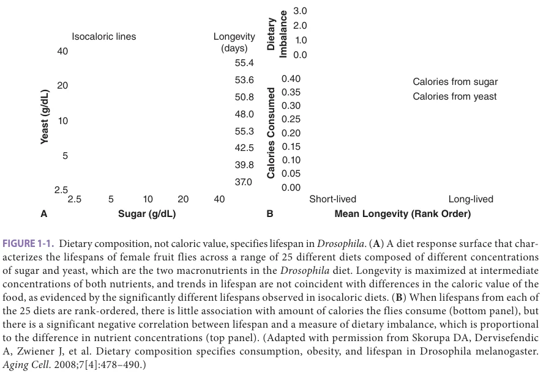

*FIGURE 1-1. Dietary composition, not caloric value, specifies lifespan in Drosophila. (A) A diet response surface that characterizes the lifespans of female fruit flies across a range of 25 different diets composed of different concentrations of sugar and yeast, which are the two macronutrients in the Drosophila diet. Longevity is maximized at intermediate concentrations of both nutrients, and trends in lifespan are not coincident with differences in the caloric value of the food, as evidenced by the significantly different lifespans observed in isocaloric diets. (B) When lifespans from each of the 25 diets are rank-ordered, there is little association with amount of calories the flies consume (bottom panel), but there is a significant negative correlation between lifespan and a measure of dietary imbalance, which is proportional to the difference in nutrient concentrations (top panel). (Adapted with permission from Skorupa DA, Dervisefendic A, Zwiener J, et al. Dietary composition specifies consumption, obesity, and lifespan in Drosophila melanogaster. Aging Cell. 2008;7[4]:478–490.)*

*Owner annotations/highlights are from the marked source copy, not the book.*

**[p. 7]**

the essential amino acid methionine live 40% longer than rats on a standard diet, and there is a similar, though smaller, effect in mice. The lifespan effect in mice is seen even when methionine restriction (MR) is not begun until the mice are well into adulthood, roughly the equivalent of a 35-year-old person. These animals are not calorically restricted—they eat more calories, per gram of lean body mass, than control rats, and rats pair-fed normal food to match the total caloric intake of an MR rat show a much smaller degree of lifespan extension. Diets in which amino acids are restricted could, in principle, affect tissue health and organism aging by causing changes in protein translation or rate of protein turnover, by changes in DNA methylation (which depends on metabolites of methionine), by alterations in levels or distribution of the antioxidant glutathione (also a metabolite of methionine), by changes in hormone levels (MR mice show low levels of insulin, glucose, and IGF-1), by changes in hydrogen sulfide production, and/or by induction, through hormesis, of augmented stress response pathways at the cellular level. Work in flies suggests that methionine might be more influential than other amino acids in this context, though parallel studies in mammals have not been attempted. Comparisons of similarities and differences between amino acid restriction and full DR in rodents are likely to prove highly informative. Restriction of food, or of protein alone, for a period of several days prior to ischemic or surgical injury, or prior to chemotherapy, leads to better outcomes in rodents, but the extent to which such benefits reflect the same pathways through which long-term DR extends lifespan is not yet clear.

Broadly speaking, mice and rats on DR diets show delay or deceleration in a very wide range of age-dependent processes, including neoplastic and nonneoplastic diseases, changes in structure and function of nearly all tissues and organs evaluated, endocrine and neural control circuits, and ability to adapt to metabolic, infectious, and cardiovascular challenges. Mouse stocks that have been engineered for vulnerability to specific lethal diseases, such as models of lupus or early neoplasia, also tend to live longer when placed on DR.

### Insulin/IGF Signaling

In the 1990s, the Kenyon and Ruvkun laboratories led research showing that loss of function in key components of the nematode C elegans insulin/IGF receptor homolog signaling pathway, including insulin-like receptor daf-2, results in large increases in lifespan in this organism, and that this benefit is dependent on a FoxO transcription factor. Conserved elements of this pathway were soon shown to have similar effects on lifespan in the fly, in brewer’s yeast, and eventually in mice (Figure 1-2). FoxO proteins regulate expression of genes involved in stress resistance, DNA repair, cell cycle arrest, apoptosis, metabolism, and other processes, in a cell- and tissue-specific manner. Over subsequent decades, dozens of studies in worms and flies have revealed that signaling

by invertebrate insulins play a major, evolutionarily conserved role in limiting longevity.

The observation that longevity in mice could be improved by reduction of hormones in the insulin/IGF family provided a key foundation for exploiting comparative cell biology in biogerontology research. Subsequent work then showed that the lifespan benefit seen in Ames dwarf mice is also present in Snell dwarf mice, whose endocrine defects are very similar to those of Ames dwarfs, and in mice that lack the GH receptor (GHR-KO mice). This last observation, together with documented lifespan extension in mice producing low levels of GH-releasing hormone (GHRH), the hypothalamic factor that stimulates GH secretion by the pituitary, and in mice lacking the receptor for GHRH, suggests that longevity of the Snell and Ames dwarf mice is due mainly to loss of GH and/or IGF-1 signals. Studies of Snell and Ames dwarf mice, and of GHR-KO mice, have shown that the exceptional longevity of these mice is accompanied by a delay or deceleration of age-dependent changes in T lymphocytes, skin collagen, renal pathology, lens opacity, cognitive function, and neoplastic progression. Taken with the lifespan data, these observations suggest strongly that these mutations, like DR, act to slow the aging process itself (Figure 1-3). These mutations increase healthy lifespan in both male and female mice, with some evidence for stronger effects in females.

It is uncertain whether longevity in these mutant or engineered mice reflects loss of GH signals per se, or a decline in levels of IGF-1, whose production by the liver is GH-dependent. Mice with lower levels of the receptor for IGF-1 have inconsistent findings, ranging from a lifespan benefit in female mice, to little or no benefit in either sex.

Perhaps the strongest evidence for a direct role of IGF-1 comes from reports of increased lifespan in mice lacking the protease pregnancy-associated plasma protein A (PAPP-A). PAPP-A is thought to increase levels of free, active IGF-1 in many tissues by removal of binding proteins that ordinarily sequester IGF-1 and inhibit its activity. Thus genetic deletion of PAPP-A would be expected to diminish IGF-1 action in some tissues, without an effect on circulating or local GH levels. Clarifying details of local control of GH and IGF-1 action could have important implications for human applications, if it proves possible to target inhibition of GH or IGF-1 signals specifically to cell types that modulate aging rate, and thus avoid side effects that might occur if GH or IGF-1 signals were blocked throughout the body. Suppression of IGF-1 signaling in female mice using a neutralizing antibody can extend lifespan in older animals, highlighting the therapeutic potential of targeting this pathway.

Some of the longevity effects in Ames and Snell dwarf mice appear to reflect adjustments to limits in GH levels in the first few weeks of life, between birth and weaning 3 weeks later. Ames dwarf mice injected daily with GH, starting at 2 weeks, fail to show the increased lifespan characteristic of

**[p. 8]**

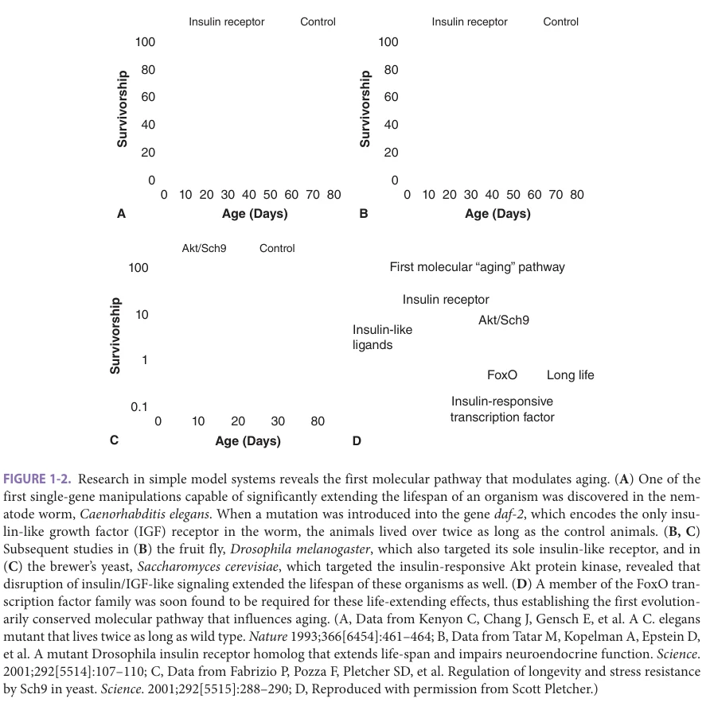

*FIGURE 1-2. Research in simple model systems reveals the first molecular pathway that modulates aging. (A) One of the first single-gene manipulations capable of significantly extending the lifespan of an organism was discovered in the nematode worm, Caenorhabditis elegans. When a mutation was introduced into the gene daf-2, which encodes the only insulin-like growth factor (IGF) receptor in the worm, the animals lived over twice as long as the control animals. (B, C) Subsequent studies in (B) the fruit fly, Drosophila melanogaster, which also targeted its sole insulin-like receptor, and in (C) the brewer’s yeast, Saccharomyces cerevisiae, which targeted the insulin-responsive Akt protein kinase, revealed that disruption of insulin/IGF-like signaling extended the lifespan of these organisms as well. (D) A member of the FoxO transcription factor family was soon found to be required for these life-extending effects, thus establishing the first evolutionarily conserved molecular pathway that influences aging. (A, Data from Kenyon C, Chang J, Gensch E, et al. A C. elegans mutant that lives twice as long as wild type. Nature 1993;366[6454]:461–464; B, Data from Tatar M, Kopelman A, Epstein D, et al. A mutant Drosophila insulin receptor homolog that extends life-span and impairs neuroendocrine function. Science. 2001;292[5514]:107–110; C, Data from Fabrizio P, Pozza F, Pletcher SD, et al. Regulation of longevity and stress resistance by Sch9 in yeast. Science. 2001;292[5515]:288–290; D, Reproduced with permission from Scott Pletcher.)*

*Owner annotations/highlights are from the marked source copy, not the book.*

this mutation and also resemble nonmutant control mice in other ways, including lowered cellular stress resistance and diminished hypothalamic inflammation. GH injections started at 4 weeks, however, do not produce such an effect. Conversely, restricting the amount of milk available to normal mice, in their first 3 weeks of life, can lead to a 10% to 20% increase of lifespan; such mice show lower than normal levels of IGF-1 at the end of the nursing period. Thus it appears that the availability of nutrients, perhaps reflected as higher levels of circulating GH and IGF-1 in the first few weeks of life, may produce long-lasting changes in cellular and hormonal properties that persist throughout adult life and affect mortality risks in old age (Figure 1-4).

### Target of Rapamycin (TOR)/Proteostasis

A second nutrient-sensing pathway, the amino acid–sensing TOR pathway, interacts extensively with insulin and IGF signaling in complex ways, some of which are diagrammed in Figure 1-5. TOR plays a major role in regulating protein

translation rates and other key target pathways in response to both external cellular stress, the available supply of amino acids and carbohydrate fuels, and hormonal signals. Downregulation of TOR signaling was initially shown to extend lifespan in flies, with evolutionary conservation later demonstrated in nematode worms and then in yeast. It is likely that many dietary interventions that extend lifespan recruit TOR-related mechanisms to affect aging, and inhibition of TOR function by the drug rapamycin can extend longevity in rodents and invertebrates (as discussed subsequently). TOR exists in two distinct molecular complexes, called mTORC1 and mTORC2, which have a wide range of effects on cell size and shape, responses to stress and nutrient levels, as well as protein synthesis and responses to glucose and insulin. Experimental work to distinguish the distinct, but interacting, effects of mTORC1 and mTORC2 activation in specific cell and tissue types is now under way. Signals mediated by the TOR complexes interact with those generated through insulin action.

**[p. 9]**

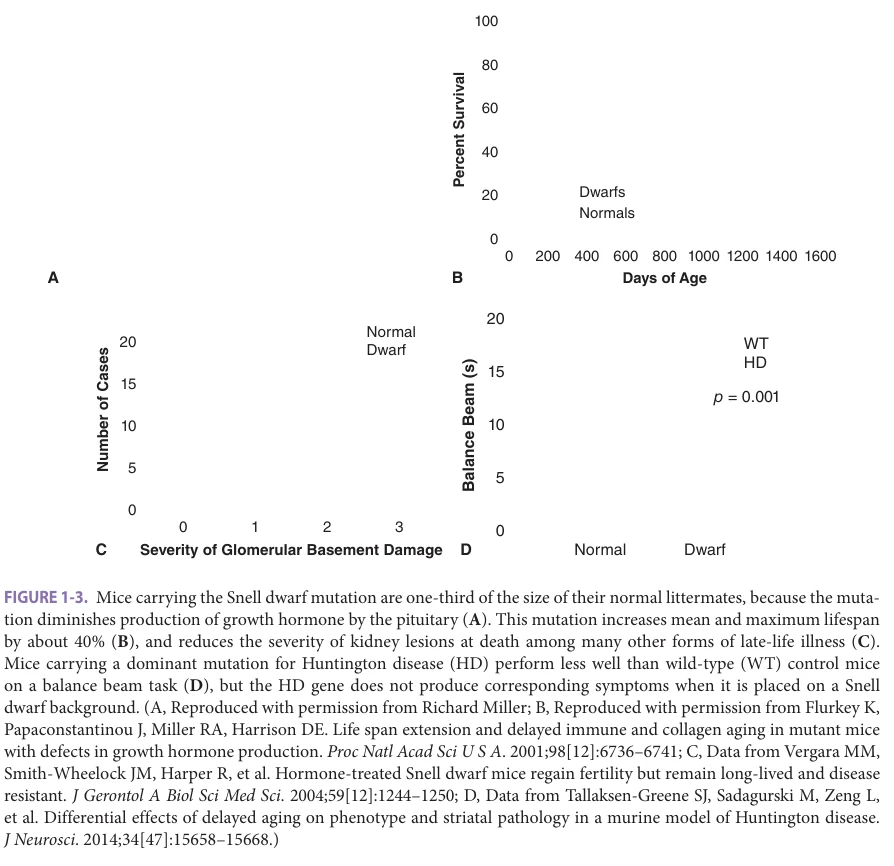

*FIGURE 1-3. Mice carrying the Snell dwarf mutation are one-third of the size of their normal littermates, because the mutation diminishes production of growth hormone by the pituitary (A). This mutation increases mean and maximum lifespan by about 40% (B), and reduces the severity of kidney lesions at death among many other forms of late-life illness (C). Mice carrying a dominant mutation for Huntington disease (HD) perform less well than wild-type (WT) control mice on a balance beam task (D), but the HD gene does not produce corresponding symptoms when it is placed on a Snell dwarf background. (A, Reproduced with permission from Richard Miller; B, Reproduced with permission from Flurkey K, Papaconstantinou J, Miller RA, Harrison DE. Life span extension and delayed immune and collagen aging in mutant mice with defects in growth hormone production. Proc Natl Acad Sci U S A. 2001;98[12]:6736–6741; C, Data from Vergara MM, Smith-Wheelock JM, Harper R, et al. Hormone-treated Snell dwarf mice regain fertility but remain long-lived and disease resistant. J Gerontol A Biol Sci Med Sci. 2004;59[12]:1244–1250; D, Data from Tallaksen-Greene SJ, Sadagurski M, Zeng L, et al. Differential effects of delayed aging on phenotype and striatal pathology in a murine model of Huntington disease. J Neurosci. 2014;34[47]:15658–15668.)*

*Owner annotations/highlights are from the marked source copy, not the book.*

Building on interest in TOR signaling and its effects on protein translation, work in invertebrates and increasingly in mammals has revealed fundamental links between the maintenance of proteostasis and longevity. Proteostasis refers globally to the processes that improve the quality and function of cellular proteins, collectively termed the proteome. It includes regulation of protein translation, folding, damage repair, and degradation. Autophagy is a process by which damaged cellular proteins and even whole organelles such as mitochondria are degraded in lysosomes. In invertebrates, intact autophagy systems are required for longevity extension by essentially all interventions that increase lifespan. Increased expression of the autophagy protein ATG5 extends mouse lifespan and improves neuromuscular function and glucose tolerance in old mice. Rapamycin, which extends lifespan in many different organisms, decreases translation of many cellular proteins, while promoting increased autophagic function. Snell and GHR-KO mice show augmented levels of a specific form of autophagy, “chaperone-mediated autophagy,”

which can affect levels of proteins involved in cell cycling, fat synthesis, and mRNA translation. Collectively, these findings indicate that maintenance of proteostasis is a key requirement of longevity.

### Sirtuins

Sirtuin proteins, which play a major role in aging in yeast, have captured the public interest and sparked robust debate in aging circles. The sirtuins are a family of protein deacylases that consume the metabolic cofactor NAD+ during catalysis. Cellular NAD+ levels increase under conditions of fasting or DR, in a tissue-type specific manner. In light of their NAD+ requirement, sirtuins have been implicated as energy sensors and potentially as mediators of some of the benefits of DR. In yeast, worms, and flies, sirtuin overexpression extends longevity, albeit more modestly in worms and flies than initial reports suggested. Mammals possess seven distinct sirtuins; these are a diverse protein family, from the standpoint of biochemical activity, protein targets, and localization. Mammalian sirtuins target their protein

**[p. 10]**

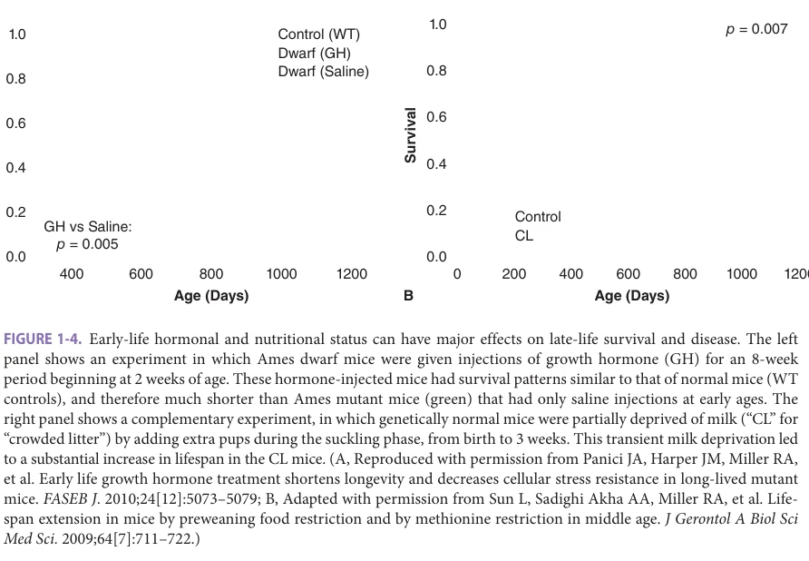

*FIGURE 1-4. Early-life hormonal and nutritional status can have major effects on late-life survival and disease. The left panel shows an experiment in which Ames dwarf mice were given injections of growth hormone (GH) for an 8-week period beginning at 2 weeks of age. These hormone-injected mice had survival patterns similar to that of normal mice (WT controls), and therefore much shorter than Ames mutant mice (green) that had only saline injections at early ages. The right panel shows a complementary experiment, in which genetically normal mice were partially deprived of milk (“CL” for “crowded litter”) by adding extra pups during the suckling phase, from birth to 3 weeks. This transient milk deprivation led to a substantial increase in lifespan in the CL mice. (A, Reproduced with permission from Panici JA, Harper JM, Miller RA, et al. Early life growth hormone treatment shortens longevity and decreases cellular stress resistance in long-lived mutant mice. FASEB J. 2010;24[12]:5073–5079; B, Adapted with permission from Sun L, Sadighi Akha AA, Miller RA, et al. Lifespan extension in mice by preweaning food restriction and by methionine restriction in middle age. J Gerontol A Biol Sci Med Sci. 2009;64[7]:711–722.)*

*Owner annotations/highlights are from the marked source copy, not the book.*

A

substrates via deacetylation, or removal of other posttranslational modifications, to regulate a wide range of proteins involved in gene expression, DNA repair, metabolism, and many other processes. Three sirtuins are present in the mitochondrial matrix, where they regulate intermediary metabolism and other aspects of mitochondrial function.

In mammals, most studies have focused on SIRT1, the closest homolog of the yeast SIR2 protein. Whole-body overexpression of SIRT1 does not increase overall lifespan in mice, although it is protective against age-associated metabolic dysfunction and certain forms of neoplasia. Overexpression of SIRT1 in the brain only, however, does extend mouse lifespan. Overexpression of the sirtuin SIRT6 throughout the body also extends lifespan in male mice. SIRT6 promotes metabolic homeostasis and enhances genomic stability; it will be important to elucidate which of SIRT6’s many functions are most important in its prolongevity role. For example, sequence variations among SIRT6 homologs across different mammalian species may contribute to altered DNA repair efficiencies, and even to differences in lifespan.

Beginning with resveratrol, a series of small molecule activators of SIRT1 have been developed. In mice, these drugs show some beneficial effects, particularly in the context of dietary challenge such as high-fat feeding. There are continued controversies regarding these agents, particularly focused on the extent to which they target SIRT1 directly, versus exerting indirect effects through other signaling molecules, such as AMPK. Nevertheless, these or

similar agents could conceivably find utility in treating age-associated metabolic dysfunction in humans.

### Stress Response

Mutations that extend lifespan in invertebrates typically render the animals resistant to multiple forms of lethal injury, whether the threat comes from oxidative agents, heat, heavy metals, or irradiation. Genetic dissection of the relevant pathways— which must have evolved very early in the evolutionary tree, that is, prior to the common ancestor shared by worms, flies, and humans—has shown, surprisingly, that in normal, nonmutant worms, the levels of stress resistance, and thus resistance to aging, are actively diminished by inhibition of specific DNA-binding transcription factors, members of the FoxO family (see Figure 1-5). These pathways are retained by evolutionary pressures because they provide reproductive advantages in the natural environment, in which animals must be able to quickly take advantage of transient access to nutrients. Activation of FoxO proteins in the laboratory produces mutant animals that are not ideally suited for natural conditions, but which are resistant to many kinds of stress and which age more slowly than normal. Studies of gene expression patterns in the long-lived mutant worms have shown that the FoxO proteins can regulate transcription of over 100 genes that together protect against many different forms of cellular damage. The list includes enzymes that destroy free radicals, heat shock proteins, and other chaperones that guard against misfolded proteins, proteins that protect against infection, and chelating agents that bind toxic metal ions, among others.

**[p. 11]**

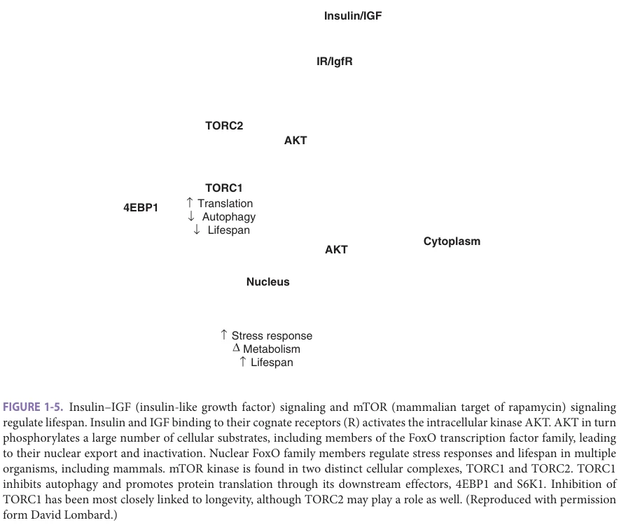

*FIGURE 1-5. Insulin–IGF (insulin-like growth factor) signaling and mTOR (mammalian target of rapamycin) signaling regulate lifespan. Insulin and IGF binding to their cognate receptors (R) activates the intracellular kinase AKT. AKT in turn phosphorylates a large number of cellular substrates, including members of the FoxO transcription factor family, leading to their nuclear export and inactivation. Nuclear FoxO family members regulate stress responses and lifespan in multiple organisms, including mammals. mTOR kinase is found in two distinct cellular complexes, TORC1 and TORC2. TORC1 inhibits autophagy and promotes protein translation through its downstream effectors, 4EBP1 and S6K1. Inhibition of TORC1 has been most closely linked to longevity, although TORC2 may play a role as well. (Reproduced with permission form David Lombard.)*

*Owner annotations/highlights are from the marked source copy, not the book.*

Induction of these stress-resistance pathways may be linked to late-life diseases. For example, worms with genetic variants leading to protein aggregation and neurodegeneration, as in human Huntington disease, show neurological dysfunction that can be delayed, and in some cases prevented entirely, by augmentation of the FoxO-dependent stressresistance pathways. Similarly, age-dependent increases in susceptibility to stress-induced cardiac arrhythmias in Drosophila can be significantly postponed by activation of FoxO-dependent protective pathways.

Figure 1-6 shows some of the evidence linking stress resistance to lifespan in worms, mice, and cells from longer-lived mammalian species. DR and at least some of the long-lived endocrine mutant stocks show elevated levels of enzymes with antioxidant action, heavy metal chelators, and intracellular chaperone proteins, and also have lower levels of oxidative damage to DNA, proteins, and lipids. Cells grown in tissue culture from long-lived Snell and Ames dwarf mutant mice, or from mice lacking GH receptor, are resistant to lethal injury caused by cadmium, peroxide, heat, a DNA alkylating agent, ultraviolet light, and paraquat (which induces mitochondrial damage by free radical generation). Mice prepared by CR or MR diets are resistant to liver damage induced by the oxidative

hepatotoxin acetaminophen, and long-lived mutant mice are somewhat more resistant to death induced by paraquat injection. Stress resistance also seems to play a role in evolution of long-lived species. For example, cells from long-lived rodents and other mammals are resistant in culture to several forms of oxidative and nonoxidative damage, have high levels of an enzyme that protects mitochondria from oxidative injury, and high levels of molecular complexes that degrade damaged proteins. Cells from longer-lived species also employ a range of approaches, some involving control of telomere length and some unrelated to telomere biology, to diminish the likelihood of neoplastic transformation. This work suggests that variations in aging rate may be due in part to differences in stress-resistance pathways, but many questions remain unanswered.

### Genome Maintenance and Reactive Oxygen Species (ROS)

A long-standing model posits that chronic accumulation of unrepaired damage to nuclear and/or mitochondrial DNA contributes to the effects of aging. ROS, generated via normal cellular metabolism, have been hypothesized to represent a major source of this damage. In support of this

**[p. 12]**

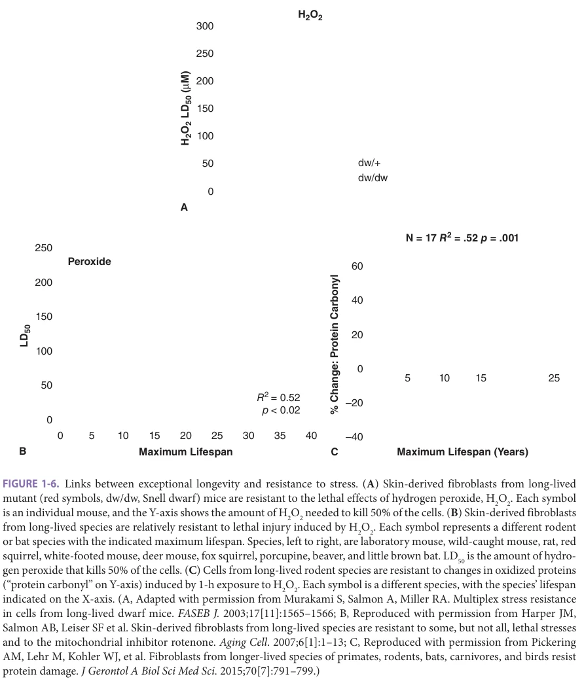

*FIGURE 1-6. Links between exceptional longevity and resistance to stress. (A) Skin-derived fibroblasts from long-lived mutant (red symbols, dw/dw, Snell dwarf) mice are resistant to the lethal effects of hydrogen peroxide, H2O2. Each symbol is an individual mouse, and the Y-axis shows the amount of H2O2 needed to kill 50% of the cells. (B) Skin-derived fibroblasts from long-lived species are relatively resistant to lethal injury induced by H2O2. Each symbol represents a different rodent or bat species with the indicated maximum lifespan. Species, left to right, are laboratory mouse, wild-caught mouse, rat, red squirrel, white-footed mouse, deer mouse, fox squirrel, porcupine, beaver, and little brown bat. LD50 is the amount of hydrogen peroxide that kills 50% of the cells. (C) Cells from long-lived rodent species are resistant to changes in oxidized proteins (“protein carbonyl” on Y-axis) induced by 1-h exposure to H2O2. Each symbol is a different species, with the species’ lifespan indicated on the X-axis. (A, Adapted with permission from Murakami S, Salmon A, Miller RA. Multiplex stress resistance in cells from long-lived dwarf mice. FASEB J. 2003;17[11]:1565–1566; B, Reproduced with permission from Harper JM, Salmon AB, Leiser SF et al. Skin-derived fibroblasts from long-lived species are resistant to some, but not all, lethal stresses and to the mitochondrial inhibitor rotenone. Aging Cell. 2007;6[1]:1–13; C, Reproduced with permission from Pickering AM, Lehr M, Kohler WJ, et al. Fibroblasts from longer-lived species of primates, rodents, bats, carnivores, and birds resist protein damage. J Gerontol A Biol Sci Med Sci. 2015;70[7]:791–799.)*

*Owner annotations/highlights are from the marked source copy, not the book.*

idea, DNA lesions, mutations, and aneuploid cells (cells with incorrect chromosomal number or rearranged chromosomes) accumulate with age in mammalian tissues. Because such events occur stochastically on a cell-by-cell basis, it has proven difficult to rigorously identify and quantitate such events. Aging leads, in mice and humans, to increased incidence of aneuploidy. Although evidence that accumulation of DNA damage contributes to aspects of aging other than neoplasia is currently modest, elevated levels of a protein involved in repair of DNA damage, SIRT6, can increase mouse lifespan in males and delay cancer and metabolic dysfunction. Further work in

this and similar models may help to clarify the possible role of genome maintenance in aging and nonneoplastic diseases.

The role of ROS in inducing age-associated genetic damage, or in aging more generally, remains controversial. Resistance to many forms of stress, including oxidative injury, is a common feature of long-lived mutants, as described above. However, many mouse mutations that impair resistance to ROS damage have no detectable effect on lifespan and show no obvious acceleration of agerelated pathology. Furthermore, administration of antioxidants to mice or people does not extend lifespan and

**[p. 13]**

may under some circumstances actually increase mortality. Conversely, for the most part mouse strains with increased activity of ROS defense systems show protection from specific toxins that cause oxidative injury, but do not show extended lifespan. The only current exception is a mouse strain overexpressing the antioxidant enzyme catalase in mitochondria. These animals show increased lifespan, and, by some measures, improved health in old age.

### Cellular Senescence, Telomeres, and Cancer

The famous observation of Hayflick that human diploid fibroblasts cease to grow in culture after a limited number of population doublings sparked a line of experimentation that continues to yield important insights into the molecular control of cell growth, differentiation, and neoplastic transformation. Human fibroblasts placed in tissue culture will divide until approximately 50 cell doublings have occurred, after which the remaining cells survive indefinitely in a healthy but nondividing state. In the 1970s and 1980s, this “clonal senescence” model seemed to be an attractive approach to study the genetics and cell biology of aging. It is now clear that growth cessation of continuously passaged human fibroblasts is caused principally by the progressive loss of telomeric DNA at the ends of each chromosome at each mitosis, which occurs in cells that lack a specialized enzyme complex called telomerase. Critically shortened telomeres induce a DNA damage response in the cell, leading to senescence or cell death. Short telomeres can influence intracellular signaling to hamper mitochondrial function, thereby impairing cellular metabolism, suggesting that damaged telomeres might exert effects even in tissues such as the liver that are largely postmitotic.

Telomeres and cancer (also see Chapter 82) Telomeredependent clonal senescence clearly plays a critical role in the protection of humans from many forms of cancer. Telomerase is turned on, and telomere attrition prevented, in approximately 90% of malignant tumors in humans. Genomic sequencing efforts have revealed that individuals with mutations that chronically elevate telomerase activity, or increase the accessibility of telomeres to telomerase, are at increased risk for a variety of cancers.

Studies of the role of telomeres and telomerase in the biology of aging in mice have produced controversial findings. Mice have much longer telomeres than humans, but live much shorter lives. The rate at which telomeres shorten, however, is more rapid in mice than in humans, and mouse strains engineered to have elevated telomerase show increased cancer rates, consistent with a role for telomere length as a contributor to malignancy in mice, as in humans. Paradoxically, elevated telomerase function may improve some aspects of health in mice carrying other alleles that block many forms of neoplasia, though with no effect on maximum lifespan, a provocative observation worth further exploration. As indicated in Figure 1-7,

telomere erosion can, in different settings, lead to cellular senescence, or to changes in cell properties related to DNA damage, genomic instability, or neoplastic transformation. The potential role of these changes in late-life human disease is an area of active investigation. Genetic disruption of telomerase can also produce lines of mice with shortened telomeres. These mice are short-lived, but the spectrum of pathology, featuring skin ulceration, infertility, increased frequencies of specific forms of neoplasia, and frequently lethal gastrointestinal lesions, does not closely resemble the pattern of illnesses seen in normal aging mice or humans. Thus telomere attrition, except for its major role in oncogenesis, does not seem likely to represent a major contributor to aging in rodents.

Senescent Cells Early work based on histologic assays suggested that senescent cells were rare (< 0.1%), even in biopsies from very old donors, although new methods for detecting other aspects of the senescent phenotype have led to upward revisions of this estimate. Senescent cells in vitro express a suite of secreted enzymes and inflammatory cytokines (not produced by dividing fibroblasts), which may facilitate the growth of cancer cells and could in principle contribute to other aspects of aging at the tissue or organ level. The p16/INK4a protein serves to maintain a balance between senescence and oncogenic transformation. P16 is induced as part of the process during which cellular senescence halts cell proliferation. An increase in levels of P16 is observed in many tissues of aging mice, but particularly in stem cells, suggesting that senescent stem cells may indeed accumulate as a consequence of normal aging and may represent an evolved mechanism to prevent early-life neoplasia. P16 accumulation leads to diminished stem cell function in the aging bone marrow, brain, and pancreas. Mice engineered to have reduced levels of p16 retain stem cell activities at ages at which these cells proliferate poorly in normal animals, though these mice are somewhat more cancer-prone than normal controls. In humans, genetic polymorphisms near the p16/INK4a gene have been linked to age-associated conditions such as type 2 diabetes, coronary artery disease, and frailty. Interventions that prevent age-related induction of p16 might be an attractive approach to diminishing many forms of late-life illness in parallel, if the intervention did not simultaneously increase cancer risk.

Several research groups have developed genetic methods to delete senescent cells from adult mice, and there is current interest in the possible therapeutic potential of pharmacologically targeting senescent cells. However, thus far there is little evidence for beneficial effects of these drugs, termed senolytics, in humans and little data on possible negative effects of such treatment. A series of ongoing clinical trials will evaluate the possible efficacy of senolytic drugs in the context of many age-associated diseases in humans, including osteoarthritis, Alzheimer disease, and others.

**[p. 14]**

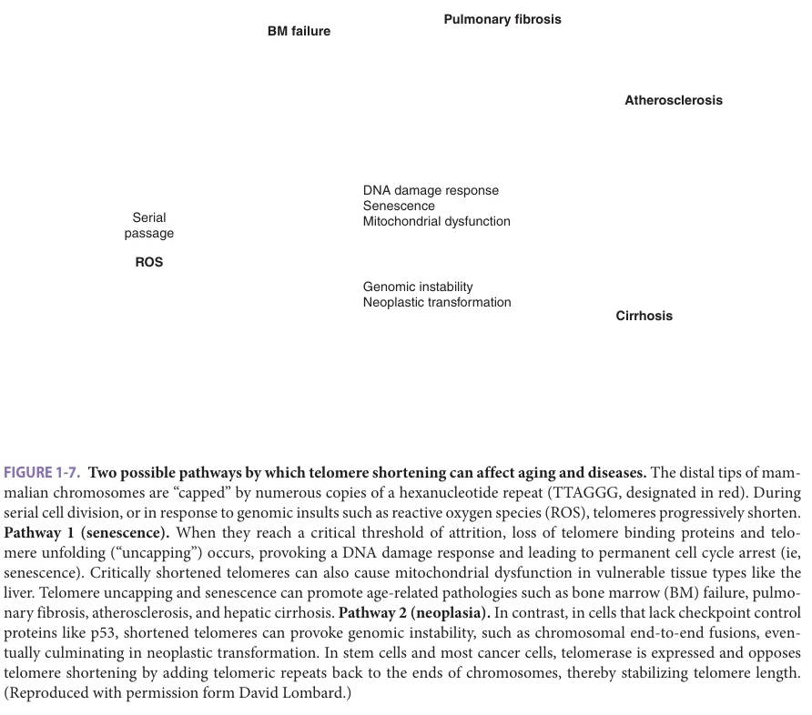

*FIGURE 1-7. Two possible pathways by which telomere shortening can affect aging and diseases. The distal tips of mammalian chromosomes are “capped” by numerous copies of a hexanucleotide repeat (TTAGGG, designated in red). During serial cell division, or in response to genomic insults such as reactive oxygen species (ROS), telomeres progressively shorten. Pathway 1 (senescence). When they reach a critical threshold of attrition, loss of telomere binding proteins and telomere unfolding (“uncapping”) occurs, provoking a DNA damage response and leading to permanent cell cycle arrest (ie, senescence). Critically shortened telomeres can also cause mitochondrial dysfunction in vulnerable tissue types like the liver. Telomere uncapping and senescence can promote age-related pathologies such as bone marrow (BM) failure, pulmonary fibrosis, atherosclerosis, and hepatic cirrhosis. Pathway 2 (neoplasia). In contrast, in cells that lack checkpoint control proteins like p53, shortened telomeres can provoke genomic instability, such as chromosomal end-to-end fusions, eventually culminating in neoplastic transformation. In stem cells and most cancer cells, telomerase is expressed and opposes telomere shortening by adding telomeric repeats back to the ends of chromosomes, thereby stabilizing telomere length. (Reproduced with permission form David Lombard.)*

*Owner annotations/highlights are from the marked source copy, not the book.*

### Other Genes and Processes That Influence Mouse Aging

Complementing the mechanisms of aging discussed earlier, there are many more engineered mouse strains for which increased longevity has been reported in at least one laboratory. For some mutants, lifespan extension is sex-specific, as with SIRT6 overexpression, which increases male longevity specifically. In other cases, for example, the Ames and Snell dwarf strains, extended lifespan is observed in both sexes. Long-lived mouse mutants often show protection against important classes of age-associated pathologies, such as cancer, kidney disease, cataracts, immune failure, and glucose intolerance. This finding underscores the close connection between aging and age-associated disease. As noted previously, several of these long-lived mutants show reduced GH signaling, typically with lower IGF-1 levels, and some also feature increased insulin sensitivity or alterations in insulin responses by specific cell types. Other mutants show impaired mTOR function or reduced activity of TOR’s downstream effectors, although these changes are often seen in one sex only, and typically produce less increase in lifespan than alterations in GH

and IGF-1 signals. Other long-lived genetically engineered mouse strains highlight particular cellular functions that are important for longevity, such as genome integrity. For example, mice overexpressing the BUBR1 mitotic checkpoint protein show improved maintenance of the proper chromosomal number (euploidy) during age, along with protection from cancer, and extended longevity. Similarly, mice overexpressing the ATG5 protein show increased levels of autophagy, a cellular process for recycling damaged proteins and organelles, and increased lifespan. As a cautionary note, the majority of these studies have been performed in one laboratory, mostly in a single mouse strain. It will be important to replicate such studies in different genetic backgrounds and in multiple laboratories, to see whether the findings are reproducible and robust. Mutations that produce a specific form of pathology on one mouse strain often have no effect, or even the opposite effect, on other backgrounds, highlighting the dangers of forming general conclusions from work on a single inbred stock.

More work is needed to determine to what extent these mutations influence common pathways, to see whether they do or do not influence aging through the

**[p. 15]**

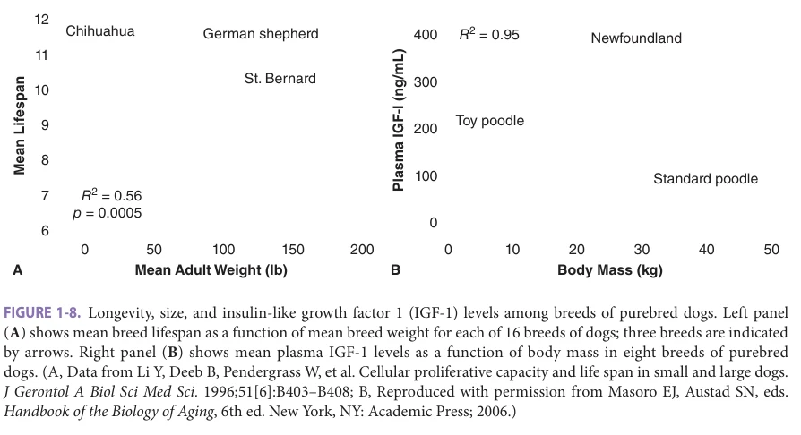

*FIGURE 1-8. Longevity, size, and insulin-like growth factor 1 (IGF-1) levels among breeds of purebred dogs. Left panel (A) shows mean breed lifespan as a function of mean breed weight for each of 16 breeds of dogs; three breeds are indicated by arrows. Right panel (B) shows mean plasma IGF-1 levels as a function of body mass in eight breeds of purebred dogs. (A, Data from Li Y, Deeb B, Pendergrass W, et al. Cellular proliferative capacity and life span in small and large dogs. J Gerontol A Biol Sci Med Sci. 1996;51[6]:B403–B408; B, Reproduced with permission from Masoro EJ, Austad SN, eds. Handbook of the Biology of Aging, 6th ed. New York, NY: Academic Press; 2006.)*

*Owner annotations/highlights are from the marked source copy, not the book.*

same mechanism. It is possible, for example, that some of these mutations diminish risk of cancer, a common cause of death in many inbred mouse strains, without effect on any other age-dependent trait, while others may modulate the effects of aging on multiple organ systems, thus diminishing both neoplastic and nonneoplastic diseases, lethal and nonlethal. In this regard, it will be useful to determine how these pathways may intersect with the DR response. In invertebrates, genetic studies have revealed that reduced mTOR signaling appears to overlap mechanistically with the response to DR. Analogous studies of DR have given ambiguous results: DR enhances lifespan effects in the Ames dwarf mouse, but has no such effect when administered to long-lived GHR KO mice. Some proteins may be required only for specific aspects of the response to DR, but dispensable for others. For example, in mice, SIRT1 is required for the increased skeletal muscle insulin sensitivity that occurs during DR, but dispensable for many other DR-associated effects.

As mentioned earlier, diminution of GH or IGF-1 levels can create mice that are long-lived compared to controls. Similarly, mouse stocks bred by selection for slow early-life growth trajectory are smaller than controls and also longer-lived. There is also highly suggestive evidence for a similar relationship between IGF-1, body size, and lifespan in dogs and horses. For dogs, small-size breeds have greater longevity than large breeds, and there is a strong relationship between body size and life expectancy among mixed-breed dogs as well (Figure 1-8). Pony breeds of horses are also substantially longer-lived than horses of full-sized breeds. The relationship between body size and life expectancy in humans is complicated by the strong effects of socioeconomic status on both endpoints; wealthier people tend to be both taller and longer-lived than poor people. On the whole, tall stature is associated

with lower mortality risks from cardiovascular diseases, which are a major cause of mortality in developed countries. In contrast, a remarkably consistent set of studies (Table 1-1) show that tall stature is associated with higher

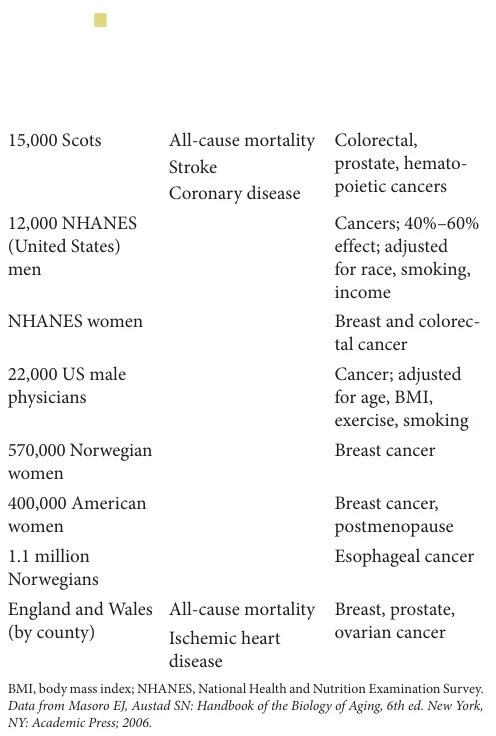

*TABLE 1-1 ■ POPULATION-BASED ASSOCIATION BETWEEN SHORT STATURE AND LOWER MORTALITY RISK FOR MULTIPLE NEOPLASTIC DISEASES*

*Owner annotations/highlights are from the marked source copy, not the book.*

**[p. 16]**

mortality risk from a wide range of neoplastic diseases. There is also limited data that centenarians, on average, were shorter as mature adults than those who do not attain centenarian status. Testing the idea that short midlife stature is associated with delayed or decelerated aging in humans will depend on measuring a wide range of age-dependent traits, rather than merely lifespan, on large populations of middle-aged people. Individuals with a genetic abnormality in GH receptor (“Laron dwarf mutation”) in an Ecuadorian community had very low serum levels of IGF-1 and IGF-2, and were much less likely than control subjects to die of cancer or to be diagnosed with adult-onset diabetes, findings consistent with the low age-adjusted cancer incidence and excellent insulin sensitivity of the corresponding long-lived, mutant mouse stock.

### Connections to Molecular Pathobiology

Integration of findings from invertebrates (including yeast cells), rodents, and cultured human cells has substantially enhanced understanding of the molecular pathogenesis of many diseases and continues to provide the driving engine for experimental therapeutics leading to clinical trials. A similar strategy focusing on pathways that regulate the aging process, and through altered rates of aging, could lead to the coordinated postponement of the wide array of age-dependent diseases. Thus, pathways that clearly deserve deeper scrutiny have been delineated, usually because investigations in invertebrates, or, more rarely, mice, have revealed that genetic or chemical alteration of the target molecules can slow aging, preserve health, and extend maximal lifespan. Elucidation of the links between these biochemical pathways and hormonal signals, neoplastic transformation, stem cell homeostasis, and the balance between cell growth and cell death is likely to provide both rationale and direction for translational work aimed at slowing the aging process and retarding age-related disease and dysfunction.

Many of these pathways are interconnected, either within cells or through neuroendocrine connections, often making it difficult to draw simple, unidirectional maps discriminating causes from effects. Making the leap from convenient invertebrate organisms to the added physiologic complexity of rodents and humans also poses major challenges. Figure 1-5 illustrates connections among many of the molecular targets and intercellular pathways, potentially involved in the control of aging rate in mammals, which have attracted experimental attention and continue to be sources of controversy and new ideas. None of these has yet been proven to be a central regulator of aging and multiple age-related illnesses; none of those shown has yet been ruled out. Research in the coming decade should expand the list of interesting candidates, refine our knowledge of how these molecules control one another within the cell, and start to delineate the specific cell types, and tissues, through which these pathways influence aging rate and age-related diseases in mammals.

### Looking to the Future

Seminal discoveries of aging regulatory mechanisms in simple model systems repeatedly turn out to be evolutionarily conserved and applicable to mammals. Because of the time required to create mutant mice and their significantly longer lifespan, it normally takes 5 to 10 years for initial discoveries to be repeated in vertebrate systems. Nevertheless, it is worth pondering the importance and potential impact of ideas that are currently in the “pipeline,” two of which are mentioned here:

1. Sensory systems strongly modulate aging in nematodes and fruit flies, and this modulation is evolutionarily conserved. Exposure of worms or flies to food-based odorants is sufficient to reduce lifespan and limit the beneficial effects of dietary restriction, while mutations that largely abolish olfactory function result in long life. It has become clear that some sensory neurons enhance longevity while others suppress it and that even the well-known relationship between body temperature and lifespan may have a sensory component. All organisms share similar goals: the need for food and mates, and the desire to avoid danger. While the specific smells, tastes, etc., that are associated with these goals are different among species, the biological responses to what those cues represent are much the same. Flies and humans both produce insulin-like peptides when they smell food, for example, suggesting deeper biological responses to sensory input should be targets for studies of aging in mammals. Encouragingly, the first instance of sensory modulation of lifespan in mice, involving a pain-sensing TRP channel, has been described. Similarly, alterations in pain nerve sensitivity have been noted in an exceptionally long-lived (and cancer-resistant) rodent species, the naked mole rat. 2. Interactions among tissues. In worms and flies there is mounting evidence that the aging process of the entire organism is coordinated nonautonomously by ongoing communication among specific tissues. Signaling from the germline controls aging of nonmitotic tissues. A few sensory neurons that detect food, danger, or mates can increase or decrease a fly’s lifespan, and a similar number control the DR response in worms. Similar results are emerging from rodent studies where the hypothalamus has become a focus point through its influence on global energy homeostasis and inflammation. Long-lived mice, produced by mutation or drug treatment, have lower hypothalamic inflammation, and conversely interventions that diminish hypothalamic inflammation can extend mouse lifespan. Surgical removal of visceral fat, though not of subcutaneous fat, extends lifespan in rats, suggesting that some adipose tissue depots may modulate aging rate through metabolic or endocrine factors. Similarly, mutations

**[p. 17]**

that extend mouse lifespan by lowered GH/IGF-1 signals lead to reduced levels of visceral fat, with relative sparing of subcutaneous fat depots. Inducible genetic recombination systems can now knock out genes in specific tissues and at specific times. These tools, together with the ability to activate or inhibit specific neurons with light (optogenetics), will likely permit delineation of cell- and tissue-specific control of aging as a major focus of mammalian studies in the coming years.

## DRUGS THAT EXTEND LIFESPAN IN MODEL SYSTEMS

Characterizing genetic mutants with increased lifespan is one means to elucidate pathways important in regulating longevity. A different, complementary strategy is to identify small molecules that extend lifespan. Work in this direction is being carried out by a consortium of three laboratories, funded by the US National Institute on Aging as the Interventions Testing Program (ITP). The ITP consortium evaluates three to six new drugs or nutritional supplements each year for possible benefits to mouse lifespan, using a genetically heterogeneous mouse stock to diminish the chances of detecting, or missing, results that would apply only in mice carrying a single, potentially idiosyncratic, genotype. There is now evidence that at least four drugs—rapamycin, canagliflozin, acarbose, and 17-α-estradiol—can improve survival and increase maximal longevity in mice. Rapamycin, an inhibitor of the intracellular enzyme mTOR, increases lifespan in both males and females, with increases as high as 26% at the highest dose so far tested. Acarbose, which slows the intestinal digestion of starches to sugars and thus blunts postprandial surges in blood glucose, increases male lifespan by 22%, and has smaller, though still significant, effects in females. Similarly, canagliflozin, a widely prescribed drug for diabetes that primarily inhibits glucose reabsorption by the kidney, extends the median lifespan of male mice by 14%, but had no benefit in females. 17-α-Estradiol, a nonfeminizing isoform of estrogen (17-β-estradiol), increases lifespan of male mice by 19%, but does not extend lifespan in females. Another agent, nordihydroguaiaretic acid (NDGA), which has both antioxidant and anti-inflammatory actions, improves lifespan of male mice only, and a significant survival benefit was also reported for male and female mice given food supplemented with high levels of the amino acid glycine. Figure 1-9 illustrates lifespan extension in mice given rapamycin or acarbose, and shows the delay in several forms of midlife pathology in rapamycin-treated mice.

Studies of this kind can establish, as proof of principle, that drugs added to food can increase mammalian lifespan. From this perspective they help support the evidence from studies of diets and single-gene mutations that the aging process in mammals can be delayed or decelerated

sufficiently to have an important effect on survival, and overall health, at older ages. Figure 1-10 compares the extent of lifespan extension achieved, so far, in drug-treated mice, in parallel to effects produced by single-gene mutations, both spontaneous and targeted.

These studies point to specific drugs, and classes of drugs, that might deserve further, more intensive analysis, as tools to learn more about the biology of aging and latelife diseases. The benefits of rapamycin on lifespan seem to be equivalent whether the drug is initiated in young adult mice or in mice already more than half the age of median survival, suggesting that inhibition of TOR function may be beneficial even if started at relatively late ages. Moreover, this result hints that mTOR signaling may increase in older individuals and contribute to the degenerative effects of aging. Strikingly, pharmacologic mTOR inhibition in older adult humans improves responses to influenza vaccination, hinting that drugs identified as having beneficial effects on lifespan and late-life health in rodents may have similar effects in humans.

The striking acarbose and canagliflozin results should prompt additional studies of the role of transient glucose surges in the control of aging rate. Although the effects of both drugs on peak glucose levels make them useful for the treatment of diabetes in humans, it is noteworthy that diabetes is quite rare in the mouse stock used by the ITP, and that most of the ITP mice die because of some form of neoplasia. More work will be needed to discover how acarbose and canagliflozin slow cancer progression, whether they slow the pace of other age-related changes, such as cataracts, sarcopenia, immunosenescence, and cognitive decline, and why the lifespan benefit is so much stronger in male than in female mice. The male-specific benefits of 17-α-estradiol will prompt new work on the routes by which steroids can modulate cancer and other late-life diseases. Both acarbose and 17-α-estradiol produce significant lifespan and functional benefits even when started in midlife; parallel studies on canagliflozin are now under way. Obstacles related to translation of these experimental results into clinical trials are discussed later.

## GENETIC APPROACHES TO ANALYSIS OF AGING IN HUMANS

Attempts to find genetic variations that influence aging in humans have been plagued with practical and conceptual problems. For one thing, heritability calculations show that only 15% to 20% of the variation in lifespan among humans can be attributed to genetic factors. However, the magnitude of the influence of genetics on longevity may rise with increasing age. Furthermore, an unknown but potentially large fraction of this genetic variation probably reflects genetic variants that influence susceptibility to diseases of childhood, infectious agents, and specific common illnesses of old age. For example, genetic variants that cause Huntington disease or type 1 diabetes or that triple

**[p. 18]**

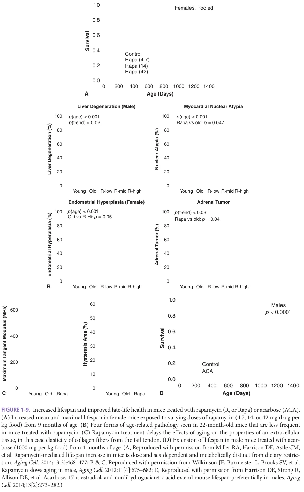

*FIGURE 1-9. Increased lifespan and improved late-life health in mice treated with rapamycin (R, or Rapa) or acarbose (ACA). (A) Increased mean and maximal lifespan in female mice exposed to varying doses of rapamycin (4.7, 14, or 42 mg drug per kg food) from 9 months of age. (B) Four forms of age-related pathology seen in 22-month-old mice that are less frequent in mice treated with rapamycin. (C) Rapamycin treatment delays the effects of aging on the properties of an extracellular tissue, in this case elasticity of collagen fibers from the tail tendon. (D) Extension of lifespan in male mice treated with acarbose (1000 mg per kg food) from 4 months of age. (A, Reproduced with permission from Miller RA, Harrison DE, Astle CM, et al. Rapamycin-mediated lifespan increase in mice is dose and sex dependent and metabolically distinct from dietary restriction. Aging Cell. 2014;13[3]:468–477; B & C, Reproduced with permission from Wilkinson JE, Burmeister L, Brooks SV, et al. Rapamycin slows aging in mice, Aging Cell. 2012;11[4]:675–682; D, Reproduced with permission from Harrison DE, Strong R, Allison DB, et al. Acarbose, 17-α-estradiol, and nordihydroguaiaretic acid extend mouse lifespan preferentially in males. Aging Cell. 2014;13[2]:273–282.)*

*Owner annotations/highlights are from the marked source copy, not the book.*

**[p. 19]**

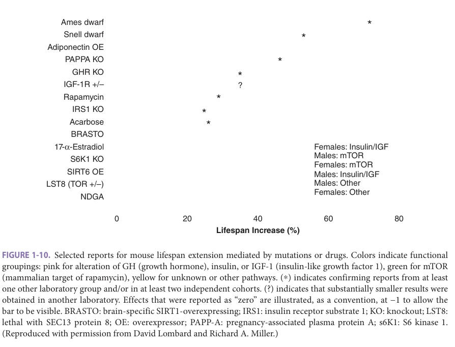

*FIGURE 1-10. Selected reports for mouse lifespan extension mediated by mutations or drugs. Colors indicate functional groupings: pink for alteration of GH (growth hormone), insulin, or IGF-1 (insulin-like growth factor 1), green for mTOR (mammalian target of rapamycin), yellow for unknown or other pathways. (*) indicates confirming reports from at least one other laboratory group and/or in at least two independent cohorts. (?) indicates that substantially smaller results were obtained in another laboratory. Effects that were reported as “zero” are illustrated, as a convention, at −1 to allow the bar to be visible. BRASTO: brain-specific SIRT1-overexpressing; IRS1: insulin receptor substrate 1; KO: knockout; LST8: lethal with SEC13 protein 8; OE: overexpressor; PAPP-A: pregnancy-associated plasma protein A; s6K1: S6 kinase 1. (Reproduced with permission from David Lombard and Richard A. Miller.)*

*Owner annotations/highlights are from the marked source copy, not the book.*

the normal risk of myocardial infarction by the age of 50 would all contribute to the measured heritability of lifespan but do so by altering mortality risks from a specific form of illness rather than by alteration of aging with its effects on multiple late-life traits. Thus, genetic variants that mold lifespan by effects on aging per se, if they exist at all, are likely to influence only a small fraction of variation in how long people live.

Formal analyses of the genetics of human aging have so far relied mostly on candidate gene approaches, in which long-lived and control populations are evaluated for variations at one or a small number of genetic loci selected on theoretical grounds as most likely to be involved in aging or disease processes. In such studies, polymorphisms near the FOXO3A, APOE, and SIRT3 genes have been identified as enriched in long-lived individuals. The FOXO3A transcription factor is a FoxO protein, modulated by insulin and IGFs. Apolipoprotein E (APOE) polymorphisms are well-known to affect the risk of developing cardiovascular disease and Alzheimer dementia. SIRT3 is a sirtuin family member; this protein resides in mitochondria, where it regulates multiple metabolic processes. An alternative approach is whole genome screening of large populations for association of longevity with hundreds of thousands of genetic variants. Thus far, only APOE polymorphisms have been identified in multiple studies, while other potential genetic associations have proven difficult to replicate. There are several possible explanations for these

discrepancies, including lack of a consistent definition of longevity between studies, different ethnic backgrounds of study populations, inadequate sample sizes leading to insufficient statistical power, differing living conditions, lack of ideal control populations, and other confounding factors.

A major problem with all these approaches, from the perspective of biological gerontology, is the lack of a defensible phenotype: a measure of aging better than lifespan. There are now several dozen reports of candidate loci at which particular alleles are overrepresented among centenarians or near-centenarians, and advocates of this strategy hope that among this collection are some loci that control aging rate. But skeptics note that alleles that increase risk of cardiac disease, Alzheimer disease, stroke, various common forms of cancer, or severe osteoporosis are likely to have contributed to disease and death before the age of 90 or 100, and thus to have been eliminated or greatly reduced among very old people. Thus, it should be assumed that a collection of genetic loci whose frequency discriminates very old people from others of the same birth cohort will include many genes with influence over common forms of lethal illnesses rather than genes that modulate aging per se. This problem is not one that can be solved by technological innovation or larger numbers of tested subjects; it requires development of a phenotype that provides more information about health in old age than merely a record of the age at death. For example, a genetic allele that identified, among 70-year-old people, those most likely to have

**[p. 20]**

excellent eyesight and hearing, no history of cancer, angina, diabetes, or arthritis, above-average responses to vaccination, and retention of baseline levels of cognition and muscle strength would be a much stronger candidate for an authentic “antiaging” gene than one that predicted survival to the age of 100.

## MODELS OF ACCELERATED AGING

There are a small number of rare inherited diseases, of which Werner syndrome (WS) and Hutchinson-Gilford syndrome (HGPS) are the most celebrated, that have been mooted as possible examples of “accelerated” aging. Some of the physical features and symptoms of these diseases do resemble, at least superficially, some of the changes that typically affect older people, including changes in skin, connective tissues, and the vasculature. HGPS, sometimes called “progeria,” is now known to be caused in most patients by mutations in the gene encoding Lamin A, a component of the nuclear membrane. WS patients usually have mutations in an enzyme (WRN) that functions as a DNA helicase (unwinding coiled DNA) and as an endonuclease.

It is debatable whether either of these diseases provides strong clues about the molecular or cellular basis for age-related changes in normal individuals. WS patients do resemble older people in some ways: They frequently suffer from cataracts and premature graying of the hair, and by their early thirties often develop osteoporosis, diabetes, and atherosclerosis. On the other hand, many features of normal aging are not seen in WS patients and many features of WS are not seen in normal old individuals. WS patients, for example, do not show signs of Alzheimer disease or other

amyloidoses, hypertension, or immune failure. Mesenchymal tumors, which are rare in normal people, are about 100fold more frequent in WS patients, but the epithelial and hematopoietic tumors characteristic of normal aging are far less common in these individuals than in normal old people. Furthermore, WS patients exhibit many features that are not seen in normal aging, including subcutaneous calcifications, altered fat distribution, vocal changes, flat feet, malleolar ulcerations, high levels of urinary hyaluronic acid, and a number of other phenotypes not seen commonly in older adults. It seems plausible that the loss of the WRN mutation, perhaps through alteration of cells responsible for connective tissue maintenance, induces multiorgan failure through processes distinct from the changes that impair some of the same organs in normal aging.

## AGING RESEARCH AND PREVENTIVE MEDICINE

The central rationale for biological gerontology is the hope that discoveries in this field will lead to innovations in preventive medicine. Mice subject to DR, or with genetic manipulations that increase lifespan, show protection from a wide array of diverse age-associated pathologies, and there is growing evidence that multiple signs of aging occur more slowly in mice treated with rapamycin. An authentic antiaging drug that produced the same demographic changes in humans seen in rodents on DR or MR diets would yield about 10-fold greater improvement in mean life expectancy than would the complete elimination of cancer or of myocardial infarction (Figure 1-11). A detailed understanding

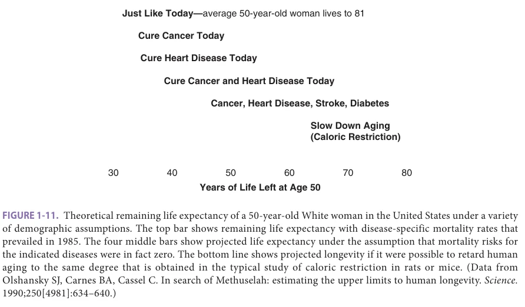

*FIGURE 1-11. Theoretical remaining life expectancy of a 50-year-old White woman in the United States under a variety of demographic assumptions. The top bar shows remaining life expectancy with disease-specific mortality rates that prevailed in 1985. The four middle bars show projected life expectancy under the assumption that mortality risks for the indicated diseases were in fact zero. The bottom line shows projected longevity if it were possible to retard human aging to the same degree that is obtained in the typical study of caloric restriction in rats or mice. (Data from Olshansky SJ, Carnes BA, Cassel C. In search of Methuselah: estimating the upper limits to human longevity. Science. 1990;250[4981]:634–640.)*

*Owner annotations/highlights are from the marked source copy, not the book.*

**[p. 21]**

of the molecular pathways that lead to coordinated stress resistance in cells of dwarf mice, or of the adjustments that render DR rats resistant to autoimmune, neoplastic, and degenerative diseases, or of the evolutionary changes that permit large animals to survive cancer-free and cataractfree for many decades should in principle suggest avenues to preventive medical care that could dramatically postpone disability and lethal illnesses.

But the pathway connecting discovery in this area of basic science to intervention is strewn with obstacles, some scientific, and others political, economic, and legal. Testing directly whether an agent that dramatically increases healthy longevity in other species is able to safely extend human lifespan would require vast resources and treatment of young or middle-aged adult subjects for many decades. Neither pharmaceutical firms nor governmental agencies are likely to be able to support such an ambitious long-term undertaking. Nor are many scientists eager to devote their careers to an experiment whose conclusions are unlikely to emerge until the time of their own retirement. A hypothetical agent that is active in those already old could, in principle, be tested with a relative short follow-up, that is, over a period of 5 to 10 years. Such agents might be evaluated in the context of discrete age-associated pathologies or well-defined markers of the rate of aging, rather than in lifespan extension. In this regard, the demonstration that an mTOR inhibitor enhances the response to the influenza vaccine in older individuals represents a significant step forward. Many of the interventions tested so far in mice, including rapamycin, acarbose, 17-α-estradiol, and a diet low in methionine, lead to lifespan extension even when initiated in mice already well into the second third of their lifespan, and they provide some hope that interventions that slow aging could in principle be effective when administered to middle-aged people as well. A current clinical trial will test the ability of metformin to inhibit development of multiple age-associated diseases (Alzheimer or other dementias, cancer, heart disease, and diabetes) in healthy older individuals.

Introduction of authentic antiaging compounds into the practice of health care may involve relatively unconventional pathways. Some people appear willing to consume compounds and mixtures, labeled as “nutritional supplements” to render them exempt from laws that govern prescription and nonprescription drugs, which are purported to oppose the effects of aging. Thus far, there is no evidence that any of the agents so touted, including melatonin, dehydroepiandrosterone, resveratrol, homeopathic remedies, and many others, can retard, delay, or reverse aging in humans. Intervention studies in pet dogs that provide evidence that a drug extended healthy lifespan could help to shape the discussion about ways to introduce such interventions into human preventive medicine, and one such study, using rapamycin, has already been initiated. If a promising agent can be shown through typical short-term clinical tests to be useful for the treatment or prevention

of a specific disease or condition, further study of broader disease prevention and enhanced survival may ensue.

## ANTIAGING RESEARCH: SOCIAL OBSTACLES AND ETHICAL CONCERNS

Serious research into the basic biology of aging and proposed translational research to turn gerontological discoveries into antiaging medicines have long been hobbled by pessimism, specifically the assumption that aging is immutable, and by stigma, arising from claims made for allegedly effective antiaging potions promoted unscrupulously for commercial gain. For these reasons, many political and scientific leaders have been understandably shy of lending support for research efforts whose goal is to develop antiaging interventions for human use. Journalists, who are often aware of promising discoveries in biological gerontology, are nonetheless often drawn ineluctably toward promotion of extreme claims, which, while entertaining, go well beyond scientific evidence and thus further impair the credibility of the antiaging research enterprise. Although several decades of evidence has now clearly refuted the commonly held assumption that the aging process is too complex or too stable to be altered, the attitudes and expectations of opinion leaders and the lay public greatly undermine and complicate efforts to attract support for this area of research.

A related concern is often posed as a question of ethics: If the goal of antiaging research is to help keep people alive and healthy for several decades beyond their current “natural” lifespan, would not realization of this goal greatly complicate efforts to solve the current set of Malthusian dilemmas? In a world where resource depletion, food and water shortages, and environmental degradation already consign billions to great suffering, would not methods that delay aging and death lead to unacceptable exacerbations of these and related problems? Arguments along these lines are often influenced by the unstated assumption that old people are typically ill, unhappy, and unproductive, and by a desire to avoid creating a society in which an ever-increasing proportion of the population has the problems that can afflict people at the very end of life.

The concern that development of antiaging medicines would be unethical is easy to refute. Most of modern medical research is designed to help prevent or treat diseases with a high risk of mortality and thus to increase the likelihood that patients will enjoy additional years or decades of good health. Efforts to develop vaccines for COVID-19, or to eradicate residual tumor burden by adjuvant chemotherapy, or to correct arrhythmias, or to alleviate the symptoms of diabetes or gallstones are all designed to allow patients to remain healthy and active as long as possible. These research efforts are appropriately considered ethical and indeed heroic, even though patients so treated are quite likely to encounter additional illnesses, often associated with suffering, at later ages. A similar motivation and

**[p. 22]**

justification underlies translational research in biological gerontology. Clearly, there is no pressing need for agents that merely prolong life in people who are in the final stages of a dementing illness or nearing death in great pain, and developing drugs that extend lifespan without improvements in health would not be an attractive goal. Fortunately, each of the dietary, pharmacological, and genetic manipulations shown in rodent models to extend longevity does so by an increase in the length of healthy lifespan; postponement of death goes hand in hand (and is almost certainly caused by) postponement of a very wide range of diseases and forms of disabilities.

A society in which many people remain active and productive at ages of 80 to 100 or so would indeed require economic adjustments and alterations of assumptions about retirement ages and family structure, just as adjustments of this kind have been required as societies have experienced reductions in infant and childhood mortality that greatly

increase the proportion of newborns that reach the ages of 20 to 50. Such adjustments are not trivial, but such fears have not raised concerns about the ethical merit of insulin therapy, vaccination programs, smoking cessation clinics, or adjuvant chemotherapy. Thus, success in antiaging research should be considered highly desirable rather than pernicious.

## ACKNOWLEDGMENTS

Preparation of this chapter was supported by NIH grants AG022303, AG023122, and AG024824 (RAM), R01GM101171 and R21ES032305 (DL), and R01AG030593, R01AG043972, and R01AG023166 (SP), and by a grant from the Glenn Foundation for Medical Research. We appreciate the willingness of several colleagues, mentioned in the figure legends, to share with us some of their own data for inclusion in this chapter.

## FURTHER READING

Austad SN. Why We Age: What Science Is Discovering About

the Body’s Journey Through Life. Chichester, UK: Wiley; 1999. Bartke A, Wright JC, Mattison JA, Ingram DK, Miller RA,

Roth GS. Extending the lifespan of long-lived mice. Nature. 2001;414:412. Brooks-Wilson AR. Genetics of healthy aging and longev-

ity. Hum Genet. 2013;132:1323–1338. Harper JM, Salmon AB, Leiser SF, Galecki AT, Miller RA.

Skin-derived fibroblasts from long-lived species are resistant to some, but not all, lethal stresses and to the mitochondrial inhibitor rotenone. Aging Cell. 2007;6: 1–13. Harrison DE, Strong R, Sharp ZD, et al. Rapamycin fed

late in life extends lifespan in genetically heterogeneous mice. Nature. 2009;460(7253):392–395. Kapahi P, Boulton ME, Kirkwood TB. Positive correlation

between mammalian life span and cellular resistance to stress. Free Radic Biol Med. 1999;26(5–6):495–500. Kenyon C, Chang J, Gensch E, Rudner A, Tabtiang R.

A C. elegans mutant that lives twice as long as wild type. Nature. 1993;366(6454):461–464. Kirkwood T. Time of Our Lives: The Science of Human

Aging. Chichester, UK: Oxford University Press; 2000. Lombard DB, Miller RA. Aging, disease, and longevity in

mice. In: Sprott Richard L, ed. Annual Review of Gerontology and Geriatrics. Vol. 34. New York, NY: Springer Publishing Company; 2014.

Lopez-Otin C, Blasco MA, Partridge L, Serrano M, Kroemer G.

The hallmarks of aging. Cell. 2013;153:1194–1217. Miller RA. Cell stress and aging: new emphasis on multi-

plex resistance mechanisms. J Gerontol A Biol Sci Med Sci. 2009;64(2):179–182. Miller RA. “Dividends” from research on aging—can bio-

gerontologists, at long last, find something useful to do? J Gerontol A Biol Sci Med Sci. 2009;64(2):157–160. Miller RA. Extending life: scientific prospects and political

obstacles. Milbank Quart. 2002;80:155–174. Miller RA. Genes against aging. J Gerontol A Biol Sci Med

Sci. 2012;67(5):495–502. Morimoto RI. Stress, aging, and neurodegenerative disease.

N Engl J Med. 2006;355:2254–2255. Olshansky SJ, Hayflick L, Perls TT. Anti-aging medicine:

the hype and the reality. J Gerontol Ser A Biol Sci Med Sci. 2004;59:B513–B514. Olshansky SJ, Perry D, Miller RA, Butler RN. In pursuit of

the longevity dividend: what should we be doing to prepare for the unprecedented aging of humanity? Scientist. 2006;20:28–36. Stipp D. The Youth Pill: Scientists at the Brink of an Anti-Aging

Revolution. New York, NY: Penguin Books; 2010. Tatar M, Bartke A, Antebi A. The endocrine regulation

of aging by insulin-like signals. Science. 2003;299: 1346–1351. Weindruch R, Sohal RS. Caloric intake and aging. N Engl J

Med. 1997;337:986–994.
