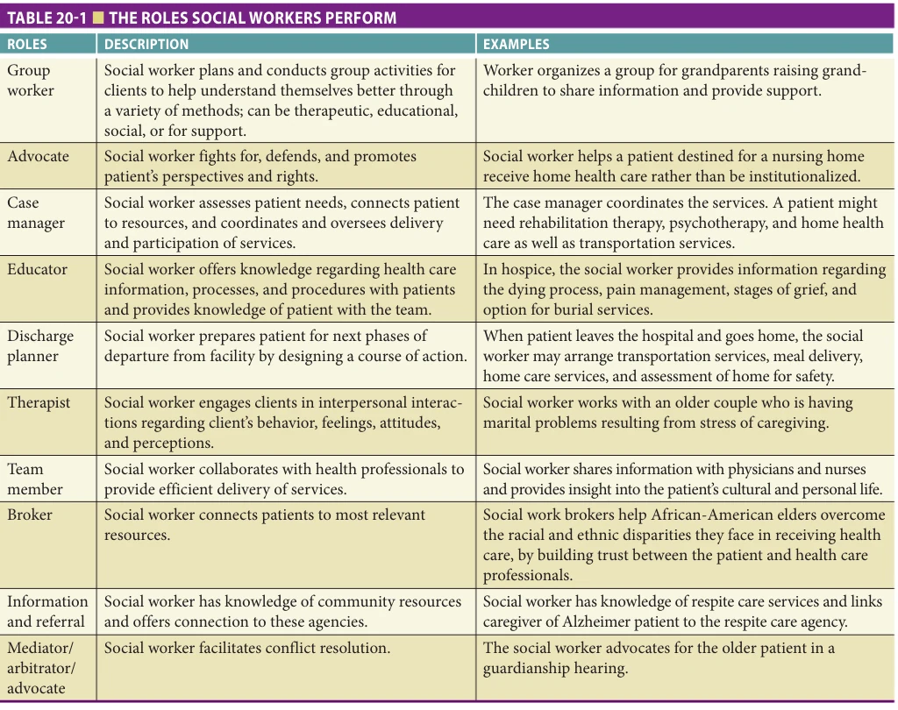
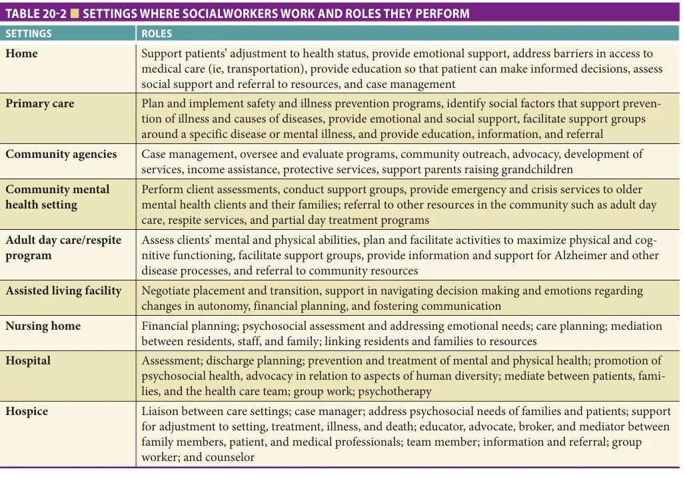
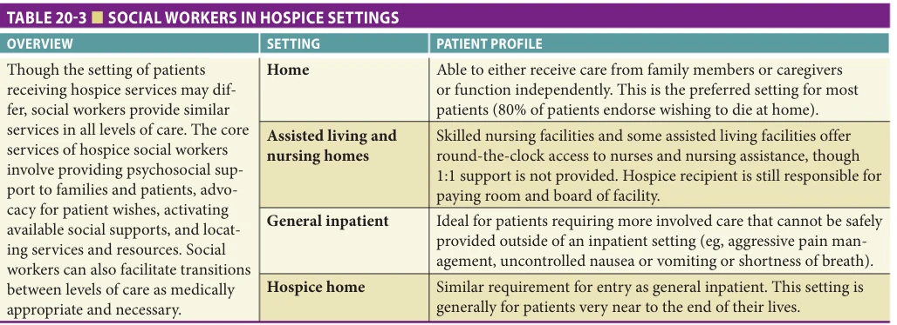
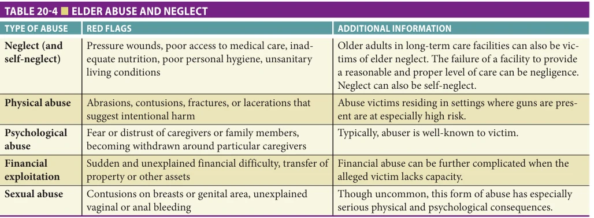
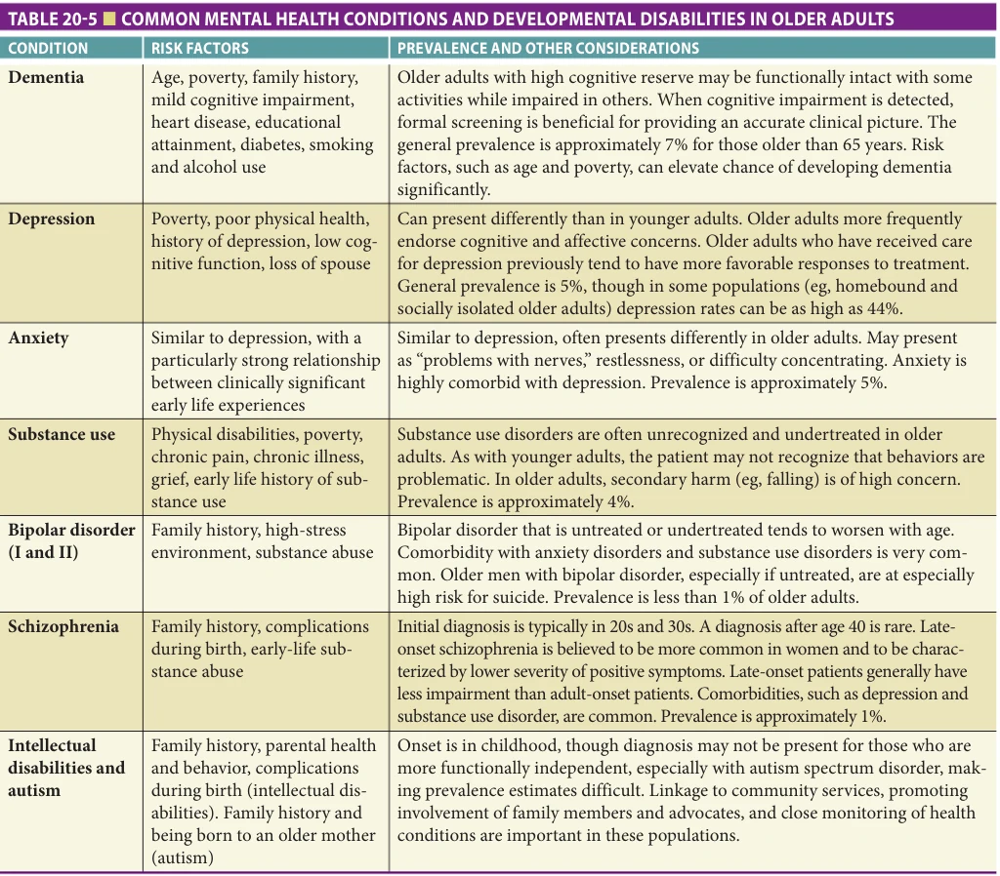

# Hazzard's Geriatric Medicine and Gerontology, 8e - Chapter 20: The Role of Social Workers

Ruth E. Dunkle, Jay Kayser, Angela K. Perone

> **Status.** Fast build from the book; not lane-reviewed.

> Not cited in the 2020-2026 past papers.

> **Source and method.** Printed pages 277-286, from the marked 8th-edition copy (PDF page = printed page + 34). Prose follows its text layer; tables and figures are source-page crops. The book is canonical.

**[p. 277]**

Social workers provide services to older patients across a continuum of care needs that range from supporting community living to providing palliative care services at the end of life. This occurs in many different health care arenas including institutional settings, such as acute care hospitals, nursing homes, and other long-term institutional settings, as well as in patients’ homes in the community. Given the multiple settings that social workers function within, the way that they refer to those they work with can vary. In more formal and medical settings (eg, hospitals) the term “patient” is most frequently used. In long-term settings (eg, nursing homes and assisted-living facilities), the term “resident” is often used. In community settings, the terms “client” or “consumer” are favored as they emphasize agency and autonomy. Social workers support and enhance the adaptive capacities of patients within their living environments and are knowledgeable about interviewing, assessment, and intervention in social problems faced by individuals, couples, families, and groups. Using negotiating skills, social workers also mediate conflicts and obtain resources for clients and their families. Knowledge of group process makes social workers effective in forming natural helping networks and serving as members of interdisciplinary teams. Their expertise in coordinating services within a single organization or across different agencies or settings helps to ensure appropriate and adequate care for older patients. Social workers often work on interdisciplinary teams in health care settings benefiting physicians, nurses, and other health care workers as well as the patients they serve.

#### Learning Objectives

- Understand the roles that social workers play in various health care settings, including direct service work, linkage roles, and support services.

- Determine health care settings where social workers practice and some of the issues they may face in nursing homes, community mental health facilities, hospitals and health care facilities, hospice and palliative care, and home care.

- Identify key populations that social workers serve and some of the practice issues that arise with older adults in these groups.

#### Key Clinical Points

1. There are unique practice issues and considerations in older populations that face particular vulnerability because of oppression and/or poverty due to race, ethnicity, immigration status, sexual orientation, gender identity, or HIV/AIDS diagnosis.

2. Several core issues emerge when working with people who face abuse, neglect, mental health concerns, cognitive impairment, and substance or alcohol misuse.

While 76% of social workers in health care settings work with older patients, not all social workers have specialized training in geriatrics. Proper care provided by gerontologically trained professionals including social workers can reduce the cost of care by 10% each year in hospitals, nursing homes, and patients’ homes as well as improve psychosocial outcomes and reduce mortality.

This chapter describes the key roles for geriatric social workers, the practice issues they face, and the settings in which they work.

## KEY ROLES FOR GERIATRIC SOCIAL WORKERS

The roles social workers play vary within health care settings (Tables 20-1 and 20-2). Social workers provide direct service to older adults and facilitate linkages between service workers and agencies.

### Direct Service Provision

Social workers meet face to face with patients and consumer groups to provide services as caseworkers, therapists, group workers, or educators. Individual casework and counseling services help older adults who have mental health problems or need help with resolving issues in areas such as housing,

**[p. 278]**

*TABLE 20-1 ■ THE ROLES SOCIAL WORKERS PERFORM*

*Owner annotations/highlights are from the marked source copy, not the book.*

finances, or interpersonal problems. Therapy includes meeting with individual older adults, with partners, as well as with groups of older adults who are experiencing concerns related to their families. Such therapies could involve helping grandparents with resources and tools for raising grandchildren, aiding families in coping with an aging parent with dementia, or supporting older couples as they struggle with debilitating health problems that can create emotional and financial strain on the relationship. Group work services include support groups for older adults with a variety of health concerns, such as cancer, low vision, or early-stage dementia. Support groups have been particularly helpful to caregivers of patients with such diseases as Alzheimer, diabetes, and Parkinson. These groups, run by social workers, help caregivers better understand the disease process and provide information that helps them cope with problems of caregiving more effectively and thus improve the disease outcome. Groups can also focus on self-help issues, where older adults learn to deal with such problems as alcoholism, obesity, or smoking. Psychotherapy groups work to resolve such concerns as abuse (as victim or perpetrator), depression, and marital problems. Social workers also work directly

with older adults and their families as educators and disseminators of information. For example, social workers provide educational sessions on caregiving, stress management, and various aspects of mental and physical health care.

### Linkage Roles

Social workers link older adults to the services they need. This may be necessary because agencies fail to meet older persons’ needs, because older adults lack knowledge of available resources or ability to access those resources, or because older adults and their families need help in overcoming fears and concerns about using services. For example, family members struggling to provide home care to a mother with Alzheimer disease may be reluctant to participate in a support or educational group used by other family members in similar circumstances due to fear of revealing personal problems they and their mother face. Social workers can help overcome these fears by assisting family members in realizing that families coping with dementia face similar problems and have similar reactions to their circumstances. Social workers also work as case managers to help older adults receive services in a timely fashion. In

**[p. 279]**

*TABLE 20-2 ■ SETTINGS WHERE SOCIALWORKERS WORK AND ROLES THEY PERFORM*

*Owner annotations/highlights are from the marked source copy, not the book.*

general, case management involves screening, assessment, care planning, implementation, monitoring, and reassessment to evaluate ongoing service needs. Case management meets a variety of goals in numerous settings. The social worker assesses problems and needs to determine eligibility for services and financial resources. The social worker also links older adults to needed services. Family and friends may provide collateral information to help the social worker determine their capacity for support. Goals for a care plan are determined by discussing older adults’ perceptions of their needs. Social workers then identify interventions and resources designed to meet these goals. Subsequently, the social worker monitors the delivery of the services. When an older adult requires care over a longer period of time, a social worker will reevaluate needs and necessary interventions and resources. Ultimately, a social worker will conduct an outcome evaluation to determine if the patient’s goals were achieved.

Social workers also work as mediators and advocate for their clients/patients. As mediators, social workers determine the issues behind a conflict. Social workers facilitate family discussion of issues identified by the family and older adults as important. For example, adult guardianship mediation can inform how the family can best help older adults preserve autonomy (or to maximize one’s greatest level of independent functioning).

## WHERE SOCIAL WORKERS PRACTICE

Medical social workers serve important roles across the care continuum, from in-home services to acute care. Medical social workers perform roles such as patient advocate and counselors, providing psychosocial assessments, referring patients and families to medical resources, and providing patient and family assistance in obtaining financial and legal help. They provide education and support to link clients to resources. Table 20-2 lists a broader range of practice settings. Several of the central practice arenas are reviewed below.

### Home Care

Home care is a term that encompasses a variety of services, including home health agencies, homemakers, home health aides and assistance, medical equipment and supplies, visiting nurses, caregiver respite, and other medical services provided in the home. One agency may provide one or several of these services to older adults. Social workers in home care address a wide range of issues including adaptation to illnesses and chronic conditions, decisions regarding end of life, dementia and behavior management, caregiving, issues of abuse and neglect, prescription drug misuse, and family discord. In addition, they provide financial management, address unsafe living conditions, connect to resources to

**[p. 280]**

provide safe living quarters, address social support, mental health, and legal issues, and support compliance with medical treatments.

### Community Health and Mental Health Agencies

Social workers work in direct practice and leadership roles in community health and mental health agencies. They work in nonprofit settings (eg, Alzheimer Association) as well as state and federal agencies (eg, Administration on Aging, Centers for Medicare and Medicaid Services). Aside from issues related to psychosocial support and education, social workers can also develop policy and practice standards. Social workers who work in community mental health agencies are part of a team of mental health practitioners, which includes nurses, psychologists, and psychiatrists. Social workers conduct client assessments, run support groups, provide emergency and crisis services to older mental health clients and their families, and refer these people to other resources in the community such as adult day care, respite services, and partial day treatment programs. They often provide therapeutic interventions in the form of brief psychotherapy and behavior modification to individuals or groups and provide indirect services through community education and consultations in long-term care facilities. Social workers assist with supportive housing, daily living skills, transitional employment, and counseling needs.

### Nursing Homes and Assisted-Living Facilities

Social workers in nursing homes and assisted-living facilities have diverse responsibilities to residents and their families, facility staff, and the overall institutional environment. Their assistance begins when residents move into the facility. Adjustment to a new living environment is faced by not only the older person, but their family as well. The social worker provides direct services to residents and their families as part of an interdisciplinary team. They assess the psychosocial needs of the resident and aid in the development of a care plan, guided by federal requirements of maintaining a minimum data set (MDS). The MDS is part of the US federally mandated process for clinical assessment of all residents in Medicare or Medicaid-certified nursing homes. This process provides a comprehensive assessment of each resident’s functional capability that helps nursing home staff (physicians, social workers, and nurses) identify health problems and develop strategies to address them. Social workers also facilitate psychosocial well-being among residents and their families, linking the resident and family members to services inside and outside the facility, helping with discharge planning, and serving as advocates for appropriate care and treatment for all patients and their families. Because social workers are often the only staff members focused on the psychosocial needs of residents and their families, they are well positioned to identify and address mental health issues. Often, they complete the cognitive, mood, behavioral, and psychosocial portion of the

MDS along with the resident assessment protocol, which can identify the mental health needs of residents. Assistedliving facilities are not required to have a social worker on staff and the roles of social workers in these facilities are less uniform when compared to skilled nursing facilities.

### Hospitals and Health Care Facilities

Social workers practice in all areas of hospitals, from the emergency departments to intensive care units. Social work practice with older adults in health care settings is focused on adaptation and coping with chronic illness, crisis management, adjustment to disability and physical limitation, decisions about end-of-life care, compliance with medical regimens, wellness, long-term care, quality of life, and discharge planning. Social workers also provide mental health services that address depression, substance abuse, management of long-term mental health issues, cognitive deficits, suicide prevention, and adjustment to changes in life by patients and families. Medical social workers take on many roles such as patient advocate and counselor and perform psychological assessments, refer patients and families to medical resources, and provide patient and family assistance in obtaining financial and legal assistance.

In hospital settings, social workers are members of an interdisciplinary team, providing services to patients and families regarding assessments of a patient’s cognitive, emotional, and behavioral status, and connection to social support networks. Social workers counsel patients and families, assisting them in adjustment to illness and providing crisis intervention and connection to community resources. Additionally, social workers identify interpersonal aspects of patients’ lives that contribute to positive outcomes in relation to their illnesses. They also address obstacles to medical compliance and financial concerns. Social workers advocate and affirm the cultural, linguistic, sexual, ethnic, religious, and other aspects of diversity present in their patients’ lives and advocate on behalf of patients with the health care team when patients face barriers to receiving care. For example, social workers can aid in the care of abused and neglected older adults by documenting and reporting instances of abuse and neglect and testifying in court with regard to these matters.

In acute care settings, where patient stays are very short, social workers focus on high-risk screening, brief counseling, bereavement services, discharge planning, collaboration, information, referral, follow-up, and emergency services on-call programs. Social workers are typically assigned to specific medical or psychiatric departments in hospitals where patients are screened to determine whether they need social work services. Need for services is also conveyed to other health care professionals by having social workers attend team meetings and discharge planning conferences, by referrals from nurses or physicians, or by requests from patients and families. A social worker’s presence, when a diagnosis, death, or other unpleasant news is communicated, can ease shock and help individuals

**[p. 281]**

*TABLE 20-3 ■ SOCIAL WORKERS IN HOSPICE SETTINGS*

*Owner annotations/highlights are from the marked source copy, not the book.*

address the emotional loss and face forthcoming decisions. Additionally, the social worker can provide information regarding aspects of diseases, care options, and assistance in meeting patient and family needs.

Discharge planning is particularly important for older adults who are transitioning from the hospital to other facilities or their homes. Addressing older adults’ needs during discharge is necessary in order to allow the older adult the best possible scenario for recovery from illness. Social workers assess caregiving needs, the availability of social supports, family support, financial barriers, and home and community environment in facilitating the discharge.

### Hospice and Palliative Care

Hospice social workers practice in a variety of endof-life care settings, such as hospitals, nursing homes, assisted-living facilities, outpatient practices, residential hospice facilities, and in residential homes. Please review Table 20-3 for an overview of these settings. Palliative care requires an interdisciplinary team, where the social worker is a crucial member providing psychosocial support and referral to resources, easing transitions between settings, and addressing issues of loss for patients and families.

Social workers help those who are approaching death. Their work begins when patients enter into hospice or palliative care and continues with families and loved ones after death. Social workers provide a variety of services to address the needs of patients, families, and caregivers serving in a variety of roles such as liaison, educator, mediator, advocate, broker, and counselor. As patients face debilitating illness in palliative care, social workers help with the transition between care facilities, assessing readiness for palliative care and beginning to address the emotional and psychological aspects of nearing death. Social workers are pivotal in assessing and supporting patients, families, and caregivers in their psychological, spiritual, social, financial, and cultural needs at the end of life. Addressing loss is essential, as individuals and families may have difficulty

communicating and accepting their feelings regarding the losses they face. Identifying social support for patients and families is important, as discord can arise when families come together at the end of life, and social workers can assist families to communicate and understand decisions, emotions expressed, and relationships.

Social workers act as brokers for resources and services to address the needs of patients who are dying and their families. They arrange services, facilitate communication among family members, provide services to fulfill last wishes, and provide assistance with funeral plan arrangements. As an advocate, the social worker supports and represents patients’ and families’ needs, wishes, and desires to the health care team and recognizes the dying person as a social person during the end-of-life stages. As a counselor, the social worker addresses the psychological, emotional, and spiritual needs of the family in addressing losses and illness and reconciling relationships. Grief support to families, friends, and caregivers is also provided after death through individual counseling sessions with family members, support groups, grief camps for children, and formal ceremonies and services for families who have lost loved ones. Social workers help patients and families understand their options, identify services they need, and fill out the necessary paperwork to secure these services. They also help them fill out other important forms like advance directives.

## PRACTICE ISSUES WITH POPULATIONS SERVED

Geriatric social workers strive to meet the basic human needs of all older adults, with a particular emphasis on those who are vulnerable due to discrimination, oppression and poverty. With health care provided in a myriad of public and private settings, the social worker acts as a broker, a mediator, and an advocate for clients.

This section reviews key populations served by social workers and some of the practice issues that come into play

**[p. 282]**

with older adults in these groups. Social workers identify barriers to seeking help, such as stigma, denial, and financial and access barriers resulting from service fragmentation and gaps in health care. For some older racial, ethnic, and cultural minorities, health problems are rooted in historic experiences of discrimination that prevent access to the social service system. Therefore, culturally specific interventions should consider the unique background, context, and resources of the individual.

### Racial, Ethnic, and Cultural Diversity

Social workers are uniquely situated to respond to the needs of older adults across racial and ethnic groups because of their skills in training and cultural awareness in service delivery. Attention to cultural diversity includes sensitivity to differences in cultural history, language, values, religion, ethnicity, nationality, and regionality, as well as recognition of within-group variation. For example, social workers use cultural assessment strategies to understand clients’ definition of a problem. During the assessment process, social workers working with culturally diverse groups evaluate attitudes toward health care and the clients’ belief about the causes of illness and benefits of health care services. As social workers attempt to understand clients’ problems, they evaluate the language skills, educational level, and degree of acculturation of the older person. In addition, determining the surrogate decision maker who has the authority to make care decisions is important for the health care team to know. For females, in some cultures, a male decides how care proceeds. In some Native American cultures, generational standing predominates in care decision making. The patient’s use of language to label and categorize a problem, the availability and use of indigenous community resources, the decision making involved in problem intervention strategies, and the patient’s cultural criteria for determining problem resolution are important issues for the social worker and other health care workers to consider in working effectively with older adults and their families.

While there are common themes that are relevant to people of color and other minority groups, each group has its own cultural history relevant to care. This cultural history often contributes to health disparities that social workers must address. For example, racial and ethnic minorities have poorer access to care than the White population, and research suggests that this gap is not narrowing. Despite these collective findings, it is important to remember that racial, ethnic, and cultural groups are not homogenous. Individuals and families have their own themes, caregiving patterns, and stories of access to and discrimination in social service and health care delivery.

### Poverty

While government programs such as Social Security, Medicare, unemployment insurance, and welfare have reduced the extent of poverty in the older population, poverty remains a significant problem. This results, in part, from

the cumulative effects of lifelong discrimination, particularly for older adults of color, LGBT older adults, adults older than the age of 75, older adults residing in rural areas, and women. Underutilization of health and mental health services by older adults in poverty makes these groups a target for social work intervention. One significant barrier to meeting the needs of older adults in poverty is lack of knowledge about their problems and needs. Another barrier is that some older adults in poverty may lack resources, such as transportation, to access to care. Social workers aim to understand and eradicate these barriers that impede the development and delivery of appropriate services and connect older adults to formal and informal resources to aid impoverished older adults in rural communities, women, LGBT older adults, and racial/ethnic minorities.

### Immigration and Refugee Status

Since the early twentieth century, rising numbers of older adults have arrived to the United States from Mexico, Cuba, and various countries in South America and Asia. As of 2018, one out of seven US residents is foreign born representing 14% of the population. Half of older immigrants have limited English proficiency with more than 40% of these older adults speaking Spanish. Older immigrants are also more likely to have lower incomes than nonimmigrants.

Older immigrants are more likely to live in households with extended family, children, and nonbiological family than are nonimmigrants. Families are often central to caregiving for aging relatives. However, demand for family caregiving often occurs in the context of limited coping resources, limited knowledge of services, misperceptions of eligibility requirements of government programs, and beliefs that children must provide caregiving. Unfortunately, multiple roles may result in greater caregiving strain and increased neglect and abuse of older family members.

Older immigrants also encounter cultural and linguistic barriers to service use. Immigrants who migrated after age 60 face additional challenges, including little or no US work experience, limited ties to social institutions, and potentially limited English proficiency. Older immigrants comprise a diverse population, reflected in race and ethnicity, as well as age, length of residence in the United States, English language proficiency, and reasons for immigration.

### Sexual Orientation and Gender Identity

LGBT older adults often comprise an invisible population that has special needs and face social service barriers based on individual and collective experiences of discrimination. Many LGBT older adults came of age at a time when failure to conform to gender or sexual norms resulted in job termination, involuntary hospitalization, cessation of parental rights, and criminal punishment. A fear of discrimination by health providers prompts many older LGBT adults who were once open about their sexual orientation and/ or gender identity to return to the “closet” when entering

**[p. 283]**

long-term care facilities; and, some LGBT older adults fail to disclose their sexual orientation and gender identity to health care providers who have treated them throughout their life. Fear of differential or discriminatory treatment also precludes LGBT older adults from seeking health care and social services at all, unless absolutely necessary. Discrimination and delays in accessing care lead to higher rates of disability, mental distress, excessive drinking, and poorer physical health outcomes for LGBT older adults. Intersections of various identities (eg, race, ethnicity, sexual orientation, and gender identity) can create even higher health risks for particular communities. For example, one study found that African-American LGBT older adults had higher lifetime LGBT-related discrimination compared to Whites, which was linked to a decrease in their physical and psychological health-related quality of life (ie, vitality, mobility, pain, dependence on medical treatment, satisfaction with sleep, daily living activities, and work capacity). Transgender older adults have a higher risk of poor physical health, disability, depressive symptoms, and stress than cisgender (non-transgender) peers.

While the legal landscape for LGBT older adults is rapidly changing, ambiguity in state and federal laws often limits access to services and rights for LGBT older adults. LGBT older adults continue to experience discrimination from health care providers, and recent court battles about whether the Affordable Care Act protects LGBT people from discrimination have not helped. After courts affirmed marriage equality for same-sex couples, some health care providers began refusing care to LGBT older adults based on religious and moral reasons. Transgender older adults have reported particularly high rates of discrimination in health care. Many transgender older adults seeking medical services to affirm their gender identity also encounter obstacles in insurance coverage, which means many medical services are financially inaccessible.

Despite social, health care, and legal barriers for service delivery, many LGBT older adults have extensive support networks through partners and friends of similar

age and rely on them for informal caregiving. Social workers can directly provide or connect LGBT clients to inclusive services and service providers and provide LGBT-friendly resources, such as physicians, living facilities, and attorneys to assist with health care documents.

### HIV/AIDS

Older adults can encounter HIV/AIDS either as patients with the disease or as caretakers for loved ones with HIV/ AIDS. More than 50% of all Americans living with HIV are age 50 or older, facing the same risk factors as younger people. Many newly diagnosed older people are “late testers,” meaning that they likely had HIV for years before their diagnosis and may face more immediate challenges than someone who is diagnosed early. LGBT older adults and transgender people of color have particularly high rates of HIV/AIDS. Although older adults visit doctors more often than younger people, they are less likely to discuss sexual behavior with their physicians. Social workers can help to identify older HIV/AIDS patients and improve access to services and informal care that is necessary for successful treatment. Social workers offer educational information and coordinate services such as caregiver respite services, home health care and hospice care, individual and group supportive counseling, and financial assistance.

### Abuse and Neglect

The abuse or neglect of older adults often surfaces in a health care setting. Many types of maltreatment, such as physical abuse, sexual abuse, and neglect (including self-neglect), result in injury, pain, and physical and psychological harm. Please review Table 20-4 for an overview. Other types of abuse such as financial and identity theft are more difficult to detect in health care settings. The assessment of mistreatment, which may require several contacts, involves an interview with the older adult to better understand risk. Cognitively impaired older adults who present with concerning complaints or who express concern for abuse and neglect should be taken especially seriously.

*TABLE 20-4 ■ ELDER ABUSE AND NEGLECT*

*Owner annotations/highlights are from the marked source copy, not the book.*

**[p. 284]**

While all states have mandatory or voluntary reporting laws, the older adult’s willingness to receive help, provided they have capacity, is voluntary. When a report of elder abuse is made to local authorities, additional personnel may be involved in safety planning. Social workers can be instrumental in helping older adults recognize the power imbalance in abusive relationships and devise strategies for protection. One of the biggest challenges that health professionals face consists of identifying and helping abused or neglected older adults who do not realize that they are victims of mistreatment. All forms of elder abuse can also occur when an older adult is residing in an institutional setting. Further details regarding elder abuse and neglect can be found in Chapter 48.

### Cognitive Impairment

Social workers are involved with assessing older adults with dementia and their caregivers. These assessments consider the client’s social and medical history, including a physical

and mental status examination, an evaluation of the individual’s living environment, functional ability including both instrumental activities of daily living (IADLs) and activities of daily living (ADLs), social service needs and family dynamics, service and resource needs, and legal issues such as power of attorney and health care proxy, advance care planning, and end-of-life planning. Social workers also play a variety of roles on the interdisciplinary team used when an older adult and his/her family experience dementia. In the early stages of dementia, social workers can support the older adult with dementia and provide cognitively stimulating programs. In some cases, the older adult is able to plan for his/her own future physical and financial needs, which the social worker can facilitate. Social workers also help family members struggling with the physical and emotional changes in their loved one with dementia as it progresses. Social workers assist family members in navigating multiple caregiving responsibilities through therapy, resources, and support groups and

*TABLE 20-5 ■ COMMON MENTAL HEALTH CONDITIONS AND DEVELOPMENTAL DISABILITIES IN OLDER ADULTS*

*Owner annotations/highlights are from the marked source copy, not the book.*

**[p. 285]**

can function as case managers for individuals experiencing cognitive impairment.

### Mental Illness

The Centers for Disease Control and Prevention (CDC) reports estimate that nearly 20% of people 55 years or older experience a mental health problem. The most common forms of mental health conditions include anxiety and depression. Table 20-5 provides an overview of common conditions. Older White men have the highest suicide rate of any age group. Individuals with severe and persistent mental health conditions (a longstanding diagnosis that is disabling) require specialized attention, especially if their mental health condition interferes with their ability to function independently. Care planning for these individuals typically involves an interdisciplinary team that includes a social worker. Stigma toward mental illness leaves many older adults suffering in silence and too fearful or ashamed to seek help. Language barriers and the lack of racial, ethnic, or culturally appropriate services also hinder older adults from seeking assistance. Social workers collaborate with a health care team to assess mental health issues and identify appropriate treatment and services. They can provide structured cognitive-behavioral, interpersonal, and problem-solving treatments that are effective mental health approaches, often in conjunction with prescribed medication. Pharmacologic interventions and psychosocial treatments are effective for older adults.

### Substance and Alcohol Misuse

Substance and alcohol misuse often remain unrecognized by health care professionals who sometimes mistake symptoms for other age-related problems such as depression and dementia. Risk factors for substance and alcohol misuse include social isolation, living alone, chronic pain, and a variety of losses such as retirement, widowhood, and impaired mobility. Research suggests that a growing number of older adults misuse alcohol and other substances, including prescription medication and at a higher rate than previous generations. The National Survey on Drug Use and Health found that among individuals age 50 and older, over 12% were heavy drinkers, over 3% were binge drinkers, and nearly 2% used illicit drugs. Men older than age 65 had even higher rates of binge drinking at 14%. While misuse of individual substances or alcohol remains an

important concern, another growing trend among older adults consists of mixing alcohol with psychoactive medications, which can have dangerous impacts for many older adults. Because older adults frequently suffer from chronic pain, and serious adverse effects of nonsteroidal antiinflammatory drugs are common, older adults frequently use opioids on a chronic basis. There is a fine balance between appropriate use and transitioning into opioid use disorder. Moreover, a substantial number of older adults simultaneously use opioids and benzodiazepines, increasing the risk of serious adverse events such as falls and car crashes. Social workers aid other health care professionals in assessing substance and alcohol misuse and providing the necessary treatment. Social workers also provide successful educational interventions with older adults who are unaware that they are consuming too much alcohol or misusing medications.

## SUMMARY

Social workers with training and experience in geriatrics and gerontology are integral members of the health care team serving older patients. Their wide range of skills, as well as their knowledge of available services in a variety of settings, makes social workers highly valuable members of the inter-professional team serving older patients by identifying, evaluating, prioritizing and providing or arranging for the support services they need.

With ongoing efforts to further cost containment and effectively deal with treatment, models of health care delivery will continue to evolve (see Chapters 19 and 14). Innovations such as the patient-centered medical home, accountable care organizations (ACOs), and other forms of value-based care population health management, which combine new payment arrangements that reward for health outcomes achieved rather than paying a fee for each service rendered will further highlight the critical role of social workers in the care of older adults. Social workers are integral to these service delivery models. In team-based care, social workers play an important role in recognizing and addressing social determinants of health that drive both health care needs and costs. As health care delivery models evolve, social workers will continue to play a critical role in assisting older patients, their families, and other caregivers in navigating the complexities involved in receiving care.

**[p. 286]**

## FURTHER READING

Administration on Aging. A Profile of Older Americans.

Washington, DC: Administration on Aging; 2019. https:// acl.gov/sites/default/files/Aging%20and%20Disability%20in%20America/2019ProfileOlderAmericans508. pdf. Accessed December 10, 2020. Anthony S, Traub A, Lewis S, et al. Strengthening Medic-

aid Long-Term Services and Supports in an Evolving Policy Environment: A Toolkit for States. Center for Health Care Strategies, Inc. March 2019. http://allh.us/ x3mK. Barry KL, Blow FC. Drinking over the lifespan: focus on

older adults. Alcohol Res. 2016;38(1):115–120. Beaulieu EM. A Guide for Nursing Home Social Workers.

New York, NY: Springer; 2013. Berkman B, ed. Handbook of Social Work in Health and

Aging. New York, NY: Oxford Press; 2015. Buch ED. Inequalities of Aging: Paradoxes of Independence

in American Home Care. New York, NY: New York University Press; 2018. Fredriksen-Goldsen KI, Hoy-Ellis CP, Goldsen J, Emlet CA,

Hooyman NR. Creating a vision for the future: key competencies and strategies for culturally competent practice with lesbian, gay, bisexual, and transgender (LGBT) older adults in the health and human services. J Gerontol Social Work. 2014;57(2–4):80–107. Gehlert S. Handbook of Health Social Work. 3rd ed.

New York, NY: John Wiley & Sons, Inc; 2019. Han BH, Moore AA, Sherman S, Keyes KM, Palamar JJ.

Demographic trends of binge alcohol use and alcohol use disorders among older adults in the United States, 2005–2014. Drug Alcohol Depend. 2017;170:198–207. HIV Among People Aged 50 and Over, Centers for

Disease Prevention and Control. https://www.cdc .gov/hiv/group/age/olderamericans/index.html. Accessed December 6, 2021.

Kadushin G, Egan M. Gerontological Home Health Care: A

Guide for the Social Work Practitioner. New York, NY: Columbia University Press; 2008. Kcomt L. Profound health-care discrimination experienced

by transgender people: rapid systematic review. Soc Work Health Care. 2019;58(2):201–219. Kim H-J, Jen S, Fredriksen-Goldsen K. Race/ethnicity and

health-related quality of life among LGBT older adults. Gerontologist. 2017;57(Suppl 1):S30–S39. Mpondo BCT. HIV infection in the elderly: arising chal-

lenges. J Aging Res. 2016;2016:2404857. National Association of Social Workers. NASW standards

for palliative and end of life care (2015). https://www .socialworkers.org/Practice/Practice-Standards-Guidelines. Accessed December 6, 2021. National Association of Social Workers. NASW guidelines

for social work practice in healthcare settings (2016). www.socialworkers.org/practice/standards/NASW HealthCareStandards.pdf. Rodriguez J. Labors of Love: Nursing Homes and the Struc-

ture of Care Work. New York, NY: New York University Press; 2014. Standards and Indicators for Cultural Competence in Social

Work Practice, NASW, 2015. https://www.socialworkers. org/LinkClick.aspx?fileticket= 7dVckZAYUmk%3D&- portalid=0. Accessed December 6, 2021. Weaver RH, Roberto KA. Home and community-based

service use by vulnerable older adults. Gerontologist. 2017;57(3):540–551. World Health Organization. Suicide in the world, 2019.

https://www.who.int/publications/i/item/suicide-inthe-world. Accessed January 5, 2022. Zerden L, Lombardi B, Jones A. Social workers in inte-

grated health care: improving care throughout the life course. Soc Work Health Care. 2019;58(1):142–149.
