# Hazzard's Geriatric Medicine and Gerontology, 8e - Chapter 21: The Patient Perspective

Preeti N. Malani, Erica S. Solway, Jeffrey T. Kullgren

> **Status.** Fast build from the book; not lane-reviewed.

> Not cited in the 2020-2026 past papers.

> **Source and method.** Printed pages 287-300, from the marked 8th-edition copy (PDF page = printed page + 34). Prose follows its text layer; tables and figures are source-page crops. The book is canonical.

**[p. 287]**

## INTRODUCTION

One often talks about wanting to hear the perspectives of everyday people, to inform gaps in knowledge that cannot be addressed through traditional research methods. The University of Michigan National Poll on Healthy Aging (NPHA) grew out of a desire to identify and fill some of those gaps through learning about issues that affect the day-to-day lives and experiences of older adults in the United States to improve their health and health care.

#### Learning Objectives

- Describe older adults’ knowledge and attitudes about healthy aging through a selection of past reports from the National Poll on Healthy Aging.

- Highlight specific interventions that can help improve health and well-being among older adults.

- Examine the impact of the COVID-19 pandemic on the health and well-being of older adults.

#### Key Clinical Points

1. Primary care providers are trusted sources of information and guidance for older adults.

2. The poll results highlight topics that are important to many patients but not always discussed by health care providers, such as sexual health, emergency preparedness, and the cost of prescription medications.

Launched in 2017, the NPHA examines older adults’ knowledge and attitudes on timely topics related to healthy aging through a recurring nationally representative household survey. Surveys are fielded two to three times per year with a sample of approximately 2000 individuals aged 50 to 80, and completion rates are typically 60% to 80% (Table 21-1). The NPHA is directed by the University of Michigan Institute for Healthcare Policy & Innovation and sponsored by AARP and Michigan Medicine, the University of Michigan’s academic medical center.

As of June 2021, the NPHA has released nearly 40 reports on a wide range of topics related to healthy aging, including the impact of the COVID-19 pandemic on the health and well-being of older adults. While these reports reach diverse audiences including the public, policymakers, and advocates, they offer unique insights into the perspectives and experiences of older adults that can be particularly helpful for geriatricians and other clinicians caring for patients in this age range. In this chapter, key findings and messages for clinicians are highlighted from a selection of past NPHA reports that can be organized into three broad categories: (1) health and health care (2) health care-related access and decision making, and (3) social aspects of health and well-being.

## HEALTH AND HEALTH CARE

### Brain Health

As the number of older adults in the United States increases, so does interest in strategies to promote “brain health” and ways to reduce the risk or slow the progression of dementia. In October 2018, the NPHA asked adults aged 50 to 64 about their memory, their concerns about developing dementia, and whether they would participate in dementia research.

Being worried about developing dementia was more pronounced among adults aged 50 to 64 with a family history of dementia compared to those without (66% vs 28%). Likewise, the 18% who had been a caregiver of a person with dementia were more likely to worry about developing dementia than those who had not been caregivers (65% vs 39%).

More than half of respondents (55%) reported doing crossword puzzles or other brain games, and 48% reported taking some type of vitamin or supplement to help their memory. About one in three (32%) said they took fish oil or omega-3 supplements. Overall, 73% of adults aged 50 to 64 reported engaging in at least one of these strategies to help maintain or improve their memory. About half of adults aged 50 to 64 reported being open to participating in research related to dementia, and those with a family history of dementia were more likely to participate in research.

Despite widespread concerns about developing dementia and engagement in strategies aimed at preventing

**[p. 288]**

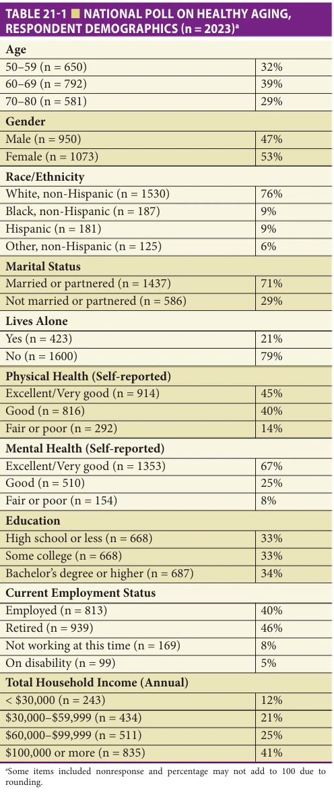

*TABLE 21-1 ■ NATIONAL POLL ON HEALTHY AGING, RESPONDENT DEMOGRAPHICS (n = 2023)a*

*Owner annotations/highlights are from the marked source copy, not the book.*

it, just 5% of all adults aged 50 to 64, and 10% among those with a family history of dementia, reported having ever discussed dementia prevention with their physician. Such conversations could be vital opportunities for older adults to have their concerns addressed by using more evidence-based approaches to preventing or delaying cognitive decline. For example, there is such evidence for regular

physical activity, controlling diabetes, quitting smoking, managing hypertension, and addressing hearing loss. In contrast, no major research studies support the effectiveness of supplements to enhance memory. The poll findings suggest that many adults aged 50 to 64 could benefit from discussing these strategies with their doctors to address their concerns about future memory loss.

### Medication Review

Older adults often have complex medication regimens involving multiple prescription and nonprescription medications. An NPHA poll from April 2017 found that 69% of older adults had seen two or more doctors in the past year and 21% of older adults had used more than one pharmacy over the past 2 years. Both findings suggest that their doctors and pharmacists may not be aware of all the medications the person is taking. In addition, 27% of adults aged 50 to 80 reported that the cost of their prescription drugs was a burden for them. One way to maximize the benefits and minimize the harms of medications is through a comprehensive medication review (CMR). A CMR is an in-person, telephone, or video appointment, often with a pharmacist and a patient or caregiver, at which medications are reviewed, including how they are taken, their indications, side effects, potential for interactions, and costs. In December 2019, the NPHA asked adults aged 50 to 80 about their medication use and experiences having CMRs with pharmacists.

Two in five adults aged 50 to 80 (41%) reported taking two to four prescription medications, and 23% said they take five or more in addition to any nonprescription medications or supplements they may also take. Among those taking two or more prescription medications, 24% had ever had a CMR. A similar proportion of older adults who were enrolled in Medicare Part D prescription drug plans, which cover CMRs for eligible members, reported ever having a CMR (25%). Among adults aged 50 to 80 who had not had a CMR, the majority (86%) were unaware that their insurance might cover one, including 85% of those enrolled in a Medicare Part D prescription drug plan.

This poll shows that CMRs are an underutilized opportunity to help ensure medication regimens are as effective, safe, and affordable as possible. Clinicians can increase awareness about the benefits and availability of CMRs among older adults, including as a potential opportunity to address high health care costs, particularly those enrolled in Medicare Part D plans for whom such services may be covered.

### Antibiotics

As a treatment for bacterial infections, antibiotics can save lives. However, inappropriate use can reduce their effectiveness and lead to other harms. In May 2019, the NPHA asked adults aged 50 to 80 about their experiences with and

**[p. 289]**

opinions about antibiotics. Nearly half of adults aged 50 to 80 (48%) reported filling a prescription for antibiotics in the last 2 years. Among those who filled a prescription for an antibiotic in the last 2 years, 13% reported having leftover medication.

Among those who kept leftover antibiotics, 60% said they did so in case they got another infection. A smaller proportion (6%) kept leftover antibiotics in case a family member got an infection, 4% were not sure how to dispose of the leftovers, and 2% forgot to dispose of them. In addition, among all respondents, 19% reported ever taking antibiotics without talking to a health care professional (17% took their own leftover medication and 3% took someone else’s medication).

While patients should be counseled to take all the antibiotics that are prescribed in order to appropriately treat their infection and minimize the emergence of resistance, some stop taking them. Across the population, this represents several million doses of leftover antibiotics. Use of these leftover antibiotics without medical supervision could result in serious drug interactions and other side effects, and could also contribute to increased antibiotic resistance.

To help ensure that antibiotic use is appropriate, safe, and effective, clinicians should give careful consideration to the number of pills given, so that excess medication does not contribute to misuse. Patients should be counseled about the risks of taking antibiotics without consulting a health care professional, and patients and family members should be encouraged to bring leftover antibiotics to community “take back” events or follow other guidelines for disposal.

### Opioids

Health conditions and procedures that result in pain are more common as people age. In March 2018, the NPHA asked adults aged 50 to 80 about their use of opioids for pain management, the education they received, how they disposed of unused medications, and perceptions of current and proposed policies related to opioid disposal and prescribing.

Overall, 29% of respondents said they filled a prescription for an opioid pain medication for themselves within the past 2 years. As summarized in Figure 21-1, 90% said they talked with the prescribing health care provider about how often to take the pain medication. However, fewer said they talked about side effects, when to reduce the amount of medication, risk of addiction, risk of overdose, and what to do with leftover pills. Among those who were prescribed an opioid, half said they had medication left over (49%). When asked what they did with extra pain medication, 86% said they kept it in case they had pain again.

Health care providers who prescribe and dispense medications should discuss how and why to safely use and dispose of medications in language that patients understand. In addition to providing recommendations for safe storage and disposal, they should help patients in identifying where and how they will dispose of extra medication.

A quarter of older adults did not try to take less pain medication and half did not switch to a non-opioid medication as soon as possible, illustrating missed opportunities to reduce opioid use that should be addressed. Therefore, it is critically important that clinicians work with patients to identify pain management strategies that will address pain

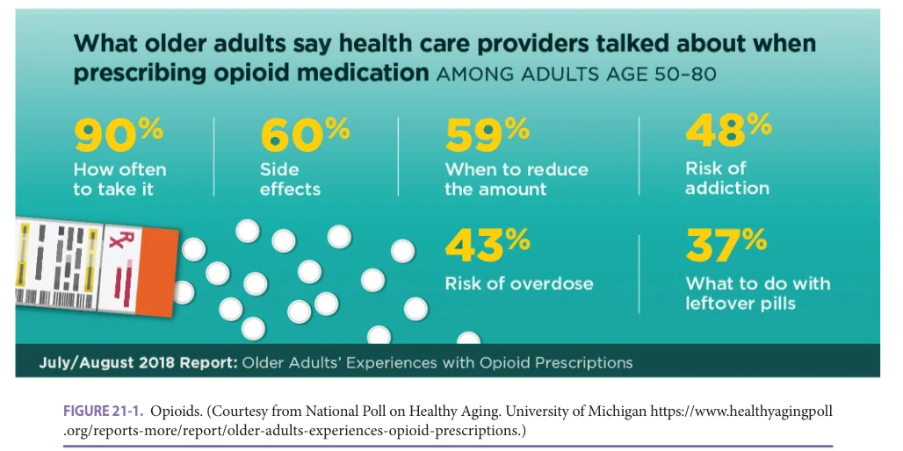

*FIGURE 21-1. Opioids. (Courtesy from National Poll on Healthy Aging. University of Michigan https://www.healthyagingpoll .org/reports-more/report/older-adults-experiences-opioid-prescriptions.)*

*Owner annotations/highlights are from the marked source copy, not the book.*

**[p. 290]**

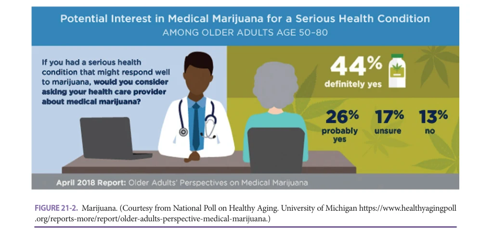

*FIGURE 21-2. Marijuana. (Courtesy from National Poll on Healthy Aging. University of Michigan https://www.healthyagingpoll .org/reports-more/report/older-adults-perspective-medical-marijuana.)*

*Owner annotations/highlights are from the marked source copy, not the book.*

while minimizing the risks of opioid medications. Since there are effective nonopioid medication and nonmedication strategies to treat pain for a variety of conditions, the opioids should not be the first-line treatment for most pain conditions.

### Medical Marijuana

As an increasing number of US states have legalized marijuana, there has been an upward trend in marijuana use among older adults. In October 2017, the NPHA asked adults aged 50 to 80 about marijuana use for medical purposes, its perceived benefits, perception of how marijuana compares to prescription pain medicine, and support for marijuana-related policies. Overall, 6% of poll respondents reported using marijuana for medical purposes and 18% indicated they know someone personally who uses marijuana for medical purposes.

One in five older adults (21%) reported that their primary health care provider has asked whether they use marijuana. As shown in Figure 21-2, 70% of respondents expressed an interest in speaking to their provider about uses of marijuana for medical purposes and only 13% expressed no interest in doing so.

When asked about the benefits of medical marijuana, 31% felt that marijuana definitely provides pain relief, another 38% believed it probably does, 27% were unsure, while 4% said they believed marijuana does not provide pain relief. When comparing marijuana with prescription medications for treating pain, 48% indicated that they felt prescription pain medication was more effective than marijuana, 14% thought marijuana was more effective, and 38% said they considered marijuana and prescription pain medication to have about the same effectiveness. About half of respondents (53%) thought the government should develop rules to standardize medical marijuana dosing and

64% felt the government should fund research to study the health effects of marijuana.

These findings suggest that more screening as well as rigorous studies on the health effects and safety of marijuana use may be needed, especially in older adults.

### Sexual Health

Romantic relationships are important to well-being and quality of life at any age. While sex is an integral part of the lives of many older adults, this topic remains understudied and infrequently discussed. In October 2017, the NPHA asked adults aged 65 to 80 about their perspectives on relationships and sex and their experiences related to sexual health.

Two in five (40%) adults aged 65 to 80 indicated that they are currently sexually active, and 54% of those are in a romantic relationship (Figure 21-3). Sexual activity decreased with age (46% age 65–70, 39% age 71–75, and 25% age 76–80). Most older adults (76%) agreed that sex is an important part of a romantic relationship at any age (see Figure 21-3). Yet only 17% reported speaking with their health care provider about their sexual health in the past 2 years. Of those who had talked with their health care provider, 60% initiated the conversation themselves.

Clinicians should inquire about and offer opportunities to discuss sexual health with their older patients, regardless of age or health status. Raising the topic can help older adults to better understand and address issues related to this important component of overall health and quality of life. A more detailed discussion of this topic is provided in Chapter 35 (women’s sexuality) and Chapter 37 (men’s sexuality).

### Urinary Incontinence in Women

Although urinary incontinence is common among older women, embarrassment about urine leakage or the belief

**[p. 291]**

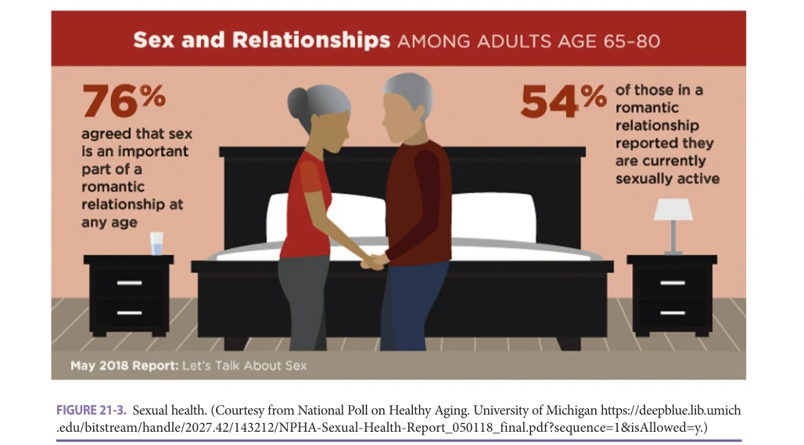

*FIGURE 21-3. Sexual health. (Courtesy from National Poll on Healthy Aging. University of Michigan https://deepblue.lib.umich .edu/bitstream/handle/2027.42/143212/NPHA-Sexual-Health-Report_050118_final.pdf?sequence=1&isAllowed=y.)*

*Owner annotations/highlights are from the marked source copy, not the book.*

that incontinence is a normal part of aging may prevent women from seeking treatment. In March 2018, the NPHA asked women aged 50 to 80 about their experiences with urinary incontinence and related discussions with their doctors.

Nearly half of older women (46%) reported urinary incontinence in the past year. Of women reporting urinary

incontinence, 41% described leakage as a problem, and 31% had leakage episodes almost daily. The most common strategies used to manage urinary incontinence are summarized in Figure 21-4. Overall, 34% of older women who experienced incontinence said they spoke to their doctor about urinary leakage (28% for those aged 50–64 and 44% among those aged 65–80). Women who viewed incontinence as a

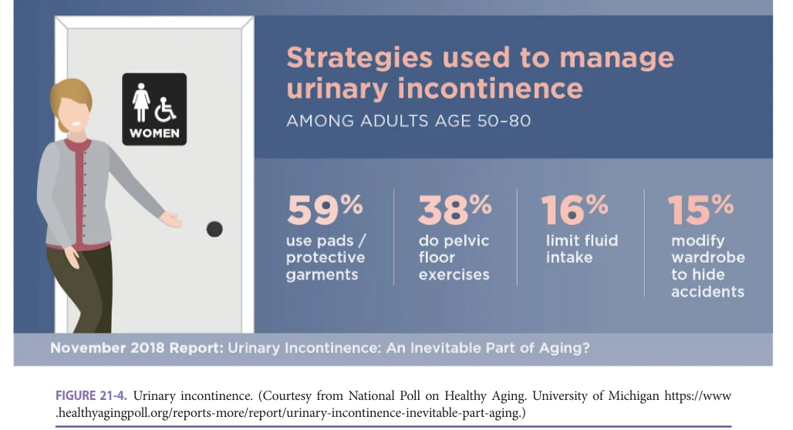

*FIGURE 21-4. Urinary incontinence. (Courtesy from National Poll on Healthy Aging. University of Michigan https://www .healthyagingpoll.org/reports-more/report/urinary-incontinence-inevitable-part-aging.)*

*Owner annotations/highlights are from the marked source copy, not the book.*

**[p. 292]**

problem or felt embarrassed by it were more likely to have sought medical advice.

What prevented women from seeking medical treatment for urinary incontinence? Among women with incontinence, 66% said they had not spoken to their doctor because they felt the problem was not that bad, 23% said they had other things to discuss, and 22% did not see urinary incontinence as a health problem. Another 15% of women said their doctor had not asked about urinary incontinence, 10% were uncomfortable discussing urinary leakage, and 4% did not think the doctor could help.

These poll results suggest that while urinary incontinence is experienced by nearly half of older women, most manage their symptoms without support or input from their health care providers and many do not seek treatment because they prioritize other medical issues or they do not consider urinary incontinence to be a health problem. Yet, any urine leakage can diminish quality of life, and incontinence that prevents women from participating in health-promoting behaviors such as exercise can have a negative impact on overall health. Screening for urinary incontinence can help to identify patients who may benefit from education or services to address their urinary incontinence which can have important implications for health and quality of life.

### Dental Care and Oral Health

Oral health is an integral part of overall health. Keeping teeth healthy involves a combination of good oral hygiene and routine preventive dental care with prompt attention to dental problems before they become severe. In April 2017, the NPHA explored oral health and experiences with dental care and coverage among adults aged 50 to 64.

More than one in four adults (28%) reported that their oral health was fair or poor. One in three (34%) said they were embarrassed about the condition of their teeth, and a similar percentage reported that they have experienced dental pain or problems in the past 2 years. One in five (19%) said it had been more than 5 years since their last preventive dental visit. More than one in four respondents (27%) reported that they needed dental care in the past 2 years but either delayed or did not get care. Among those with unmet dental needs, 69% cited cost as a major factor. Being afraid of the dentist (20%), finding time to go (18%), and finding a dentist (14%) also contributed to unmet dental needs.

Overall, 28% of adults aged 50 to 64 indicated they did not currently have dental coverage. Many respondents expressed uncertainty about their insurance coverage for dental care when they turn 65: 51% did not know how they will get dental insurance when they turn age 65 and 13% thought that traditional Medicare would provide their dental coverage even though traditional Medicare’s coverage of dental services is limited to narrowly defined medically necessary dental services only.

Recognizing that oral health is integral to good health at every age and that adults in older age groups can have unique oral health needs and barriers to accessing dental care, in December 2019, the NPHA asked adults aged 65 to 80 about oral health, dental care utilization and access, dental coverage, and their perspectives on proposed changes to Medicare to cover dental care.

Overall, 25% of adults aged 65 to 80 rated their oral health as fair or poor and 24% reported having dentures. In addition, 46% of those age 65 to 80 said they were missing teeth for which they did not have dentures or implants, and 27% said they were embarrassed by the condition of their teeth. In the past 2 years, 20% said they had experienced dental pain and the same percentage reported problems with eating and chewing. Nearly half (47%) of respondents reported that they do not have dental coverage.

The condition of one’s teeth can affect self-esteem, social relationships, job seeking and retention, ability to maintain good nutrition, and overall health. Both polls found poorer oral health status and lower use of dental services among those with self-reported fair or poor physical or mental health. People with chronic health conditions and disabilities may face challenges maintaining oral hygiene and getting dental care, and medications can contribute to dry mouth which can negatively affect oral health. Oral health problems can also negatively affect physical and mental health. For example, dental pain or problems with eating and chewing may lead to difficulty maintaining a healthy diet. Clinicians should encourage patients to prioritize their oral health and be aware of accessible, lower cost options for dental care in their communities.

### Overuse of Health Care Services

“Low value” health care services, including medications, tests, and procedures that are unlikely to improve health outcomes, are not only unnecessary and wasteful, but may also create potential harms for patients. In October 2017, the NPHA asked adults aged 50 to 80 about their perspectives on health care services that may not be needed.

Only 14% of older adults agreed that “when it comes to medical treatment, more is usually better.” However, older adults’ own experiences suggest overuse is common: 25% agreed that their own health care provider often recommends medications, tests, or procedures that they do not think they really need. More than half (54%) agreed that health care providers in general often recommend medications, tests, or procedures that patients do not really need.

Conventional wisdom has suggested that patients’ preferences drive overuse of low-value health care services. Results of this poll suggest that health care providers may be making incorrect assumptions about their patients’ desire for services that have limited clinical value.

**[p. 293]**

## HEALTH CARE-RELATED ACCESS AND DECISION MAKING

### Telehealth

As COVID-19 began to spread across the United States in early 2020, health systems made rapid and sweeping changes to how care was delivered. These changes and the risk of COVID-19 required many older adults to have appointments with their health care providers through telehealth rather than in-person visits. In May 2019 and June 2020, the NPHA asked adults aged 50 to 80 about their use of and perspectives on telehealth.

In May 2019, 14% of older adults said that their health care providers offered telehealth visits, compared to 62% in June 2020. Similarly, the percentage of older adults who had ever participated in a telehealth visit rose dramatically from 4% in May 2019 to 30% in June 2020. In June 2020, 30% of older adults with a telehealth visit said that video or phone visits were the only options available when scheduling their appointment. Nearly half (46%) indicated that in-person visits were canceled or rescheduled to telehealth visits by their health care provider. Fear of COVID-19 led 15% to request or reschedule an in-person appointment as a telehealth visit.

Poll results demonstrate that the availability, use, and interest all increased substantially over 1 year, as did the personal use of and comfort with video-conferencing technologies commonly used in telehealth visits. As more older adults experienced telehealth visits, some

perceived concerns, including privacy and communication with health care providers, diminished. Perceptions about the overall convenience of telehealth visits also increased.

As use of telehealth continues to increase, clinicians should be aware of the challenges and concerns some older patients have with virtual visits, as summarized in Figure 21-5. Importantly, while the vast majority of older adults who had a telehealth visit reported that the technology was easy to use, some older adults have limited experience and comfort with technology and may need additional support. Furthermore, some older adults were concerned about the quality of care compared to in-person visits and about not being able to get a physical examination. Until these concerns are addressed, some older adults may be hesitant to seek health care in this format.

### Patient Portals

Patient portals have become the preferred form of communication with patients for many health care practices. In March 2018, the NPHA asked older adults aged 50 to 80 about their experiences with patient portals. About half of older adults (51%) reported they have set up a patient portal. There were demographic differences, with higher proportions setting up a patient portal among women versus men (56% vs 45%), among adults with some college versus high school only (59% vs 40%), and among those with higher versus lower annual household income (59% for ≥ $60,000 vs 42% for < $60,000).

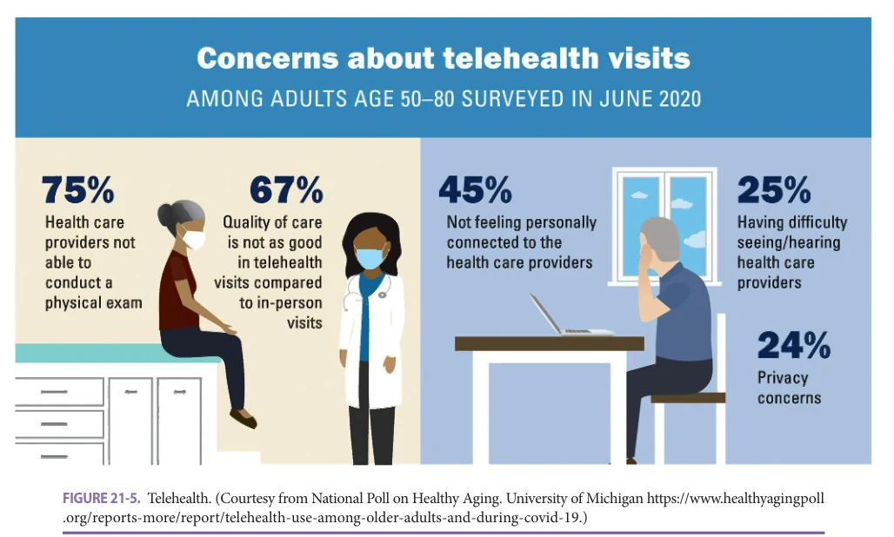

*FIGURE 21-5. Telehealth. (Courtesy from National Poll on Healthy Aging. University of Michigan https://www.healthyagingpoll .org/reports-more/report/telehealth-use-among-older-adults-and-during-covid-19.)*

*Owner annotations/highlights are from the marked source copy, not the book.*

**[p. 294]**

Interestingly, there were similar rates of portal use for those aged 50 to 64 (52%) and 65 to 80 (49%). Older adults aged 65 to 80 identified technology barriers and lack of comfort as key reasons for not setting up a portal. In contrast, adults aged 50 to 64 report few specific barriers, but simply reported not taking the time to set one up. Eliminating barriers to setup and use of patient portals, while maintaining the option to continue telephone communication, may be the appropriate strategy to meet the varied needs of older adults.

### Emergency Department Use

Each year in the United States, adults aged 50 and older make more than 40 million visits to an emergency department (ED). In June 2020, the NPHA asked adults aged 50 to 80 about their ED experiences. Overall, 26% of adults aged 50 to 80 reported having an ED visit in the past 2 years (32% for respondents aged 65–80 and 23% for those aged 50–64). Almost half of adults with self-reported fair or poor mental (46%) or physical (45%) health had an ED visit in the past 2 years.

When deciding whether to go to the ED, most aged 50 to 80 reported that they would be concerned about wait times (91%), exposure to COVID-19 (86%), out-of-pocket costs (79%), and being admitted to the hospital (77%); 37% said they would be concerned about transportation home. Nearly two in three older adults (63%) said they would first ask their health care provider or office staff before going to the ED. One in eight (13%) said they went to the ED because they could not get a timely primary care or specialty care appointment.

When considering where to go for ED care, older adults reported that their insurance coverage (86%), the reputation of the ED (69%), location (68%), and a recommendation by a health care provider (61%) were very important factors. Overall, 80% of adults aged 50 to 80 were concerned about the costs of a future ED visit and 18% were not confident about being able to afford out-of-pocket costs for a future ED visit. Seven percent of older adults reported that they did not go to the ED when they thought they needed to due to concerns about their out-of-pocket costs.

These poll results could help hospitals, emergency and other health care providers, and insurers improve the ways they advise older adults on seeking emergency care, treat them once they arrive at the ED, address their costrelated concerns, and assist them in receiving follow-up care.

### Health Insurance Decision-Making Near Retirement

As Americans approach retirement age and eligibility for Medicare coverage, many face difficult decisions about their health insurance and its associated costs. In October 2018, the NPHA asked adults aged 50 to 64 about their current and future plans for their health insurance coverage, medical care, and employment.

Overall, 27% had little or no confidence in being able to afford the cost of their health insurance over the next year and 45% had little or no confidence in being able to afford the cost of their health insurance when they retire.

In the previous year, 11% of adults aged 50 to 64 reported thinking about going without health insurance, and an additional 5% decided to go without health insurance. In the previous year, 13% of adults aged 50 to 64 did not get medical care because of its high cost.

Adults aged 50 to 64 also reported making decisions about the timing of their retirement based on health insurance–related considerations. In the past year, 14% reported keeping a job specifically to have health insurance through their employer and 11% delayed or considered delaying retirement specifically to have employer-sponsored health insurance. Overall, 19% either kept a job, considered delaying retirement, or delayed retirement to keep their employer-sponsored health insurance.

Clinicians and patients should discuss the outof-pocket costs of health care which can help to inform decisions about health insurance options and the timing, choice, and appropriateness of health care services.

### Advance Care Planning

Advance care planning, which often includes legal documentation of a medical durable power of attorney and an advance directive, helps ensure people receive medical care that is consistent with their values, goals, and preferences. In June 2020, the NPHA asked adults aged 50 to 80 about their advance care planning before and during the early months of the COVID-19 pandemic.

Overall, 59% said they have talked to someone (ie, a spouse, adult children, other family, or friends) about the types of medical care they want or do not want if they become seriously ill (Figure 21-6). People aged 65 to 80 were more likely than those aged 50 to 64 (70% vs 51%) and women were more likely than men (62% vs 55%) to have talked to someone about their care preferences.

Also shown in Figure 21-6, nearly half of older adults (46%) reported they had completed at least one advance care planning legal document (ie, a medical durable power of attorney or advance directive). Among the 54% of older adults who had not completed an advance care legal document, 62% said they had not gotten around to it, 15% did not know how, 13% said they do not like talking about these things, 13% did not think it necessary, 9% said no one asked them to, and 7% were deterred by cost.

Clinicians can help to encourage and facilitate these vital discussions about and documentation of preferences for medical care in the event of serious illness, as well as remind patients of the importance of regularly reviewing previous advance care plans to confirm they remain accurate.

## SOCIAL ASPECTS OF HEALTH AND WELL-BEING

### Ageism

Ageism is prevalent, and older adults may experience ageism in their day-to-day lives. In December 2019, the NPHA asked adults aged 50 to 80 about their experiences with

**[p. 295]**

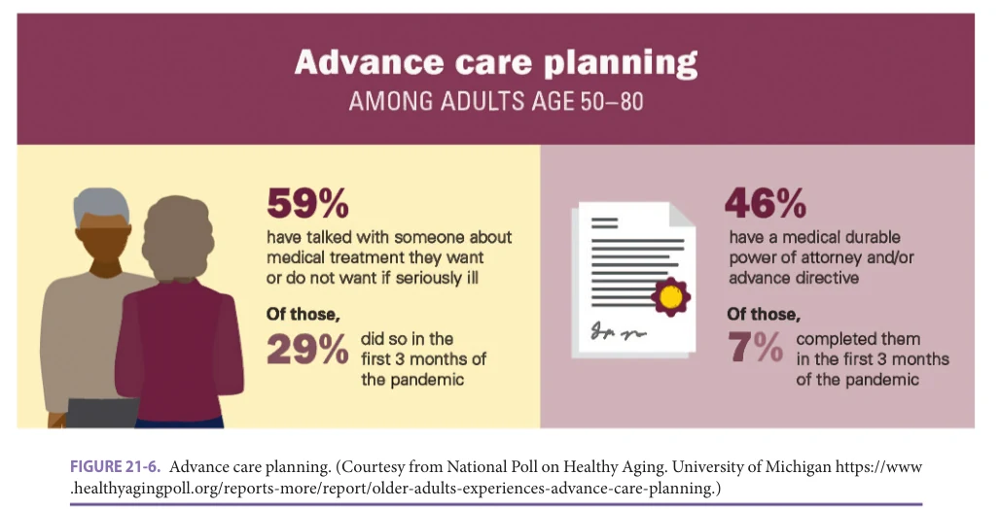

*FIGURE 21-6. Advance care planning. (Courtesy from National Poll on Healthy Aging. University of Michigan https://www .healthyagingpoll.org/reports-more/report/older-adults-experiences-advance-care-planning.)*

*Owner annotations/highlights are from the marked source copy, not the book.*

different forms of everyday ageism, positive views on aging, and health. The nine forms of ageism explored through this poll were organized into three categories: (1) exposure to ageist messages, (2) ageism in interpersonal interactions, and (3) internalized ageism (personally held beliefs about aging and older people), as summarized in Table 21-2.

Two in five older adults (40%) reported often or sometimes experiencing three or more (out of the nine) forms of everyday ageism. Experiencing three or more forms was more common among those aged 65 to 80 as compared to those aged 50 to 64 (49% vs 35%), women compared to men (43% vs 38%), and those with annual household incomes below $60,000 compared to those with higher incomes (50% vs 33%). Being retired and living in a rural area were also associated with experiencing more forms of ageism.

Older adults who reported experiencing three or more forms of everyday ageism in their day-to-day lives had worse physical and mental health than those who reported fewer forms of ageism. For example, older adults who reported three or more forms of ageism were less likely to rate their overall physical health as excellent or very good compared to those reporting fewer forms (34% vs 49%). Older adults who experienced more forms of ageism were also more likely to have a chronic health condition such as diabetes or heart disease than those reporting fewer forms (71% vs 60%). Those who regularly experienced three or more forms of ageism were less likely than people who reported fewer forms to rate their mental health as excellent or very good (61% vs 80%) and more likely to report symptoms of depression (49% vs 22%).

Notably, older adults with positive views on aging reported experiencing fewer forms of everyday ageism and

better physical and mental health. Clinicians should be aware of how negative stereotypes, prejudice, and discrimination toward older people affect health and wellbeing and be part of efforts to challenge it and highlight

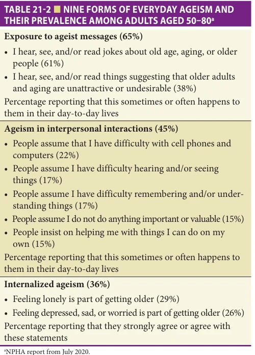

*TABLE 21-2 ■ NINE FORMS OF EVERYDAY AGEISM AND THEIR PREVALENCE AMONG ADULTS AGED 50–80a*

*Owner annotations/highlights are from the marked source copy, not the book.*

**[p. 296]**

positive views. Addressing everyday ageism may have far-reaching benefits for the health and well-being of older adults.

### Food Security

Food insecurity, defined as difficulty in acquiring or accessing food due to a lack of money, affected an estimated one in nine US households in 2018. Although trends in food insecurity are tracked through surveys of the general US population, few surveys specifically focus on food insecurity among older adults. In December 2019 (prior to the COVID-19 pandemic), the NPHA surveyed adults aged 50 to 80 about household food insecurity and participation in food-assistance programs.

As summarized in Figure 21-7, 14% of respondents reported experiencing household food insecurity in the past year. Among older adults who experienced household food insecurity in the past year, 42% reported severe food insecurity, meaning individuals in their household reduced the quality or quantity of foods they consumed due to limited resources. Household food insecurity was higher among adults aged 50 to 64 (17%) than adults aged 65 to 80 (10%), and higher among non-Hispanic Black adults (22%) and Hispanic adults (22%) compared to non-Hispanic White adults (12%). It was also more common among older adults with lower levels of education and lower household income.

As shown in Figure 21-7, household food insecurity was associated with lower self-reported physical and mental health. Nearly half of adults ages 50 to 80 who were food insecure rated their physical health as fair or poor (45%), compared to 14% of those who were food secure. Almost a quarter of those who were food insecure reported fair or poor mental health (24%) compared to 5% of those who were food secure.

During the past year, 10% of respondents aged 50 to 80 reported receiving Supplemental Nutrition Assistance Program (SNAP) benefits. Adults aged 60 and older are eligible to receive home-delivered or congregate meals (eg, meals delivered in community or group settings) through the Older Americans Act. Yet among adults 60 and older, only 2% reported participating in meal programs through a community or senior center, and 1% received meals delivered to their home from a program like Meals on Wheels in the past year.

These poll results suggest that some older adults experiencing food insecurity may not be benefitting from programs designed to support them. Barriers to participating in SNAP or other community programs can include lack of knowledge or misinformation about services or eligibility, complex application procedures, waitlists, inadequate transportation, stigma, and other factors.

Improved communication about the benefits of participating in SNAP and community meal programs, as well as increased screening in clinical settings and referrals to community resources, may help to improve participation rates in nutrition programs and help alleviate food insecurity among older adults.

### Emergency Planning

When natural disasters and other emergencies occur, some older adults, including those with chronic health conditions and impaired mobility, may be particularly vulnerable to adverse effects. In May 2019, the NPHA asked adults aged 50 to 80 about their experiences with disasters, emergency planning, and their preparedness for such events.

More than one in five of older adults (22%) had experienced an emergency or disaster such as a power outage lasting more than a day, severe weather, evacuation from their home, or a lockdown in the past year, while 73%

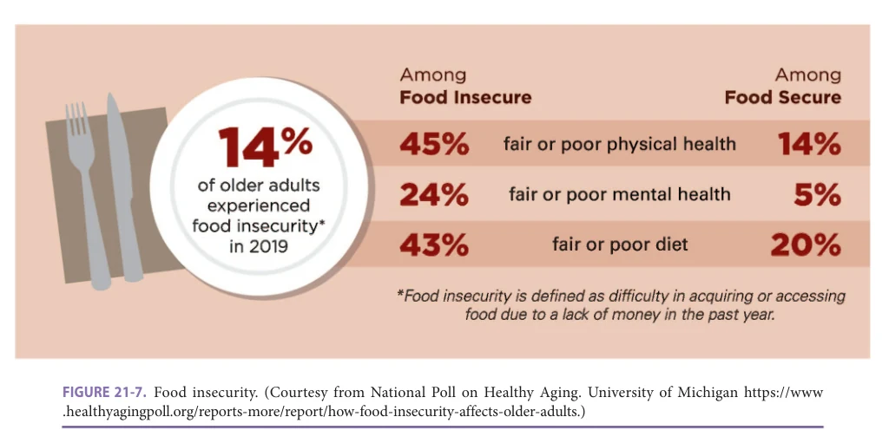

*FIGURE 21-7. Food insecurity. (Courtesy from National Poll on Healthy Aging. University of Michigan https://www .healthyagingpoll.org/reports-more/report/how-food-insecurity-affects-older-adults.)*

*Owner annotations/highlights are from the marked source copy, not the book.*

**[p. 297]**

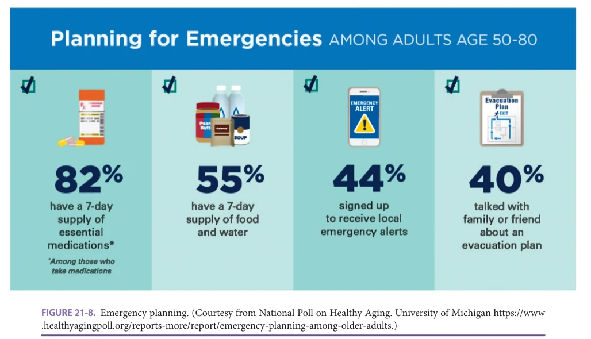

*FIGURE 21-8. Emergency planning. (Courtesy from National Poll on Healthy Aging. University of Michigan https://www .healthyagingpoll.org/reports-more/report/emergency-planning-among-older-adults.)*

*Owner annotations/highlights are from the marked source copy, not the book.*

reported experiencing at least one such event during their lifetime. As shown in Figure 21-8, among older adults who required essential medications or health supplies, 82% had a 7-day supply of medication and 72% had a 7-day supply of health supplies, but only half reported having a 7-day supply of food and water. Among the 9% of respondents who used essential medical equipment that requires electricity, 25% had an alternative power source. Less than half had signed up for emergency alerts or had spoken to family or friends about an evacuation plan (see Figure 21-8).

More than half of older adults believed they will likely experience some type of natural disaster or emergency in the coming year and the majority generally felt confident in their ability to manage through them, yet these poll results suggest that many older adults have not taken key steps recommended by disaster preparedness agencies. Clinicians should discuss disaster preparedness with their older patients, particularly in areas that routinely face natural disasters.

### Pets

Many older Americans live with pets and consider them part of the family. Pets can offer companionship and have a positive impact on health and well-being. In October 2018, the NPHA asked adults aged 50 to 80 about their pets and the benefits and challenges of owning a pet.

More than half of older adults (55%) reported having a pet. Among pet owners, the majority (68%) had dogs, 48% had cats, and 16% had a small pet such as a bird, fish, or hamster. More than half of pet owners (55%) reported having multiple pets.

Some possible health benefits of pets are included in Figure 21-9. Pet owners said that their pets help them enjoy life (88%), make them feel loved (86%), reduce stress (79%), provide a sense of purpose (73%), and help them stick to a routine (62%). Respondents also reported that their pets connect them with other people (65%), help them be physically active (64% overall and 78% among dog owners), and help them cope with physical and emotional symptoms (60%), including taking their mind off pain (34%). Among those who lived alone and/or reported fair or poor physical health, 72% said pets help them cope with physical or emotional symptoms.

While most pet owners reported positive experiences with their pets, some noted challenges. About one in five (18%) indicated that pet care puts a strain on their budget. One in six (15%) said that their pet’s health takes priority over their own health, and 6% reported that their pets caused them to fall or otherwise injure themselves.

These results suggest that pets can provide a myriad of benefits for older adults, including boosts to emotional and physical health while also potentially contributing to challenges for some people. Health care professionals should be aware of the important role that pets play in the lives of many older adults, as pets have the potential to help, or hinder, self-care and adherence to treatment plans.

### Caregiving

Family caregivers play a vital role in providing support to older adults living with dementia and other cognitive impairments. In April 2017, the NPHA asked adults aged 50 to 80 who identified as caregivers about their experiences caring for a person with dementia.

**[p. 298]**

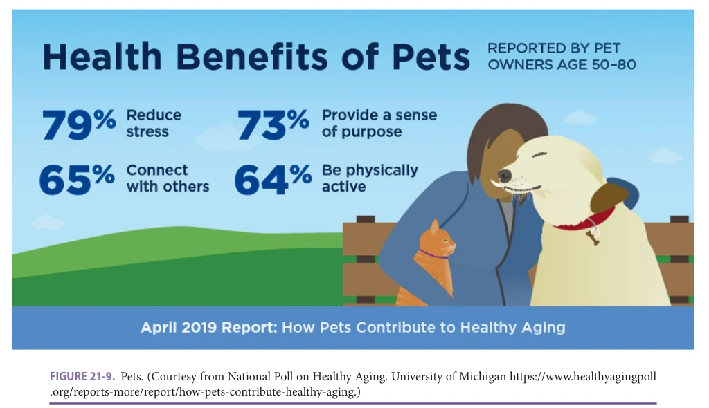

*FIGURE 21-9. Pets. (Courtesy from National Poll on Healthy Aging. University of Michigan https://www.healthyagingpoll .org/reports-more/report/how-pets-contribute-healthy-aging.)*

*Owner annotations/highlights are from the marked source copy, not the book.*

Overall, 7% of poll respondents (n = 148) identified as a caregiver of a person age 65 or older with dementia, Alzheimer disease, or another cognitive impairment. The majority of caregivers (62%) were women; 60% provided care to a parent, 19% to a spouse, and 21% to another relative, friend, or neighbor. Most caregivers (60%) have been providing care for 1 to 5 years and 29% have been doing so for 5 years or more. Nearly half of caregivers (45%) were employed in addition to having caregiving responsibilities.

Most caregivers (85%) reported they find caregiving rewarding (45% very rewarding and 40% somewhat rewarding). A slightly lower percentage (78%) said they find caregiving to be stressful (19% very stressful and 59% somewhat stressful) and 62% reported they find caregiving both stressful and rewarding. Overall, 27% of caregivers had used caregiving resources in the past year such as self-help resources, family therapy, classes or trainings, support groups, and/or respite care; 41% of those who had not used any caregiving resources indicated an interest in using them.

More than a quarter of caregivers (27%) reported delaying or not doing things they should do for their health; 66% said caregiving interferes with their ability to take good care of themselves, go to the doctor when they have a health problem, spend time with family and friends, take care of everyday responsibilities, and/or keep up with work duties. Nearly three in four dementia caregivers (73%) had not used caregiving resources in the past year, and among those, 41% expressed an interest in using them.

These findings suggest that there are opportunities to provide more support to dementia caregivers. A first step in

meeting their needs is that health care providers should ask about caregiving responsibilities as a routine part of clinical care. As the population ages and the number of available caregivers is unlikely to keep pace, it is critically important to ensure that resources to support dementia caregivers are readily available and accessible.

### Loneliness

Chronic loneliness can adversely affect memory, mental and physical health, and longevity. The NPHA asked adults aged 50 to 80 about their feelings of lack of companionship and isolation (loneliness), social interactions, and health behaviors in June 2020 as a follow-up to a similar NPHA survey conducted in October 2018 among a different national sample. The follow-up survey showed a substantial increase in loneliness among older adults from before the COVID-19 pandemic to the early months of the pandemic (March–June 2020).

As shown in Figure 21-10, two in five adults aged 50 to 80 reported feeling a lack of companionship (32% some of the time, 9% often) during the early months of the pandemic, compared to one-third (26% some of the time, 8% often) in 2018. In June 2020, 35% of older adults said they felt less companionship compared to before March 2020, 12% felt more, and 53% felt the same amount of companionship.

As shown in Figure 21-10, in June 2020, more than half of older adults reported feeling isolated from others (43% some of the time, 13% often) compared to one-quarter (22% some of the time, 5% often) in 2018. Nearly half of older adults in June 2020 reported infrequent social contact

**[p. 299]**

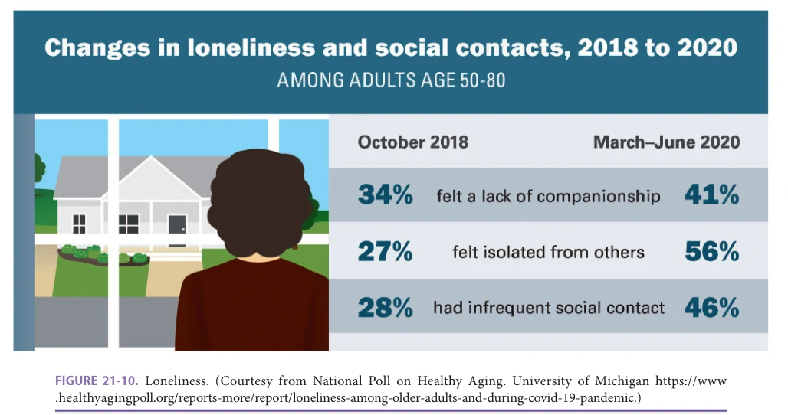

*FIGURE 21-10. Loneliness. (Courtesy from National Poll on Healthy Aging. University of Michigan https://www .healthyagingpoll.org/reports-more/report/loneliness-among-older-adults-and-during-covid-19-pandemic.)*

*Owner annotations/highlights are from the marked source copy, not the book.*

(once a week or less) with family, friends, or neighbors from outside the home, compared to one-quarter in 2018. When comparing their feelings in June 2020 to before the pandemic, about half of adults age 50 to 80 (48%) felt more isolated, 8% felt less isolated, and 44% reported feeling the same level of isolation.

Feeling a lack of companionship some of the time or often during the first 3 months of the pandemic was more common among women (47% vs 35% of men), people who lived alone (50% vs 39% who lived with others), and those who were unemployed, disabled, or not working (52% vs 39% of those employed or retired). Others more likely to report a lack of companionship included those from households with annual incomes less than $60,000 (46% vs 38% of those with higher incomes) and caregivers (48% vs 40% of non-caregivers). In addition, feeling a lack of companionship was more common for those who reported fair or poor physical health (52% vs 39% of those reporting excellent, very good, or good physical health) or fair or poor mental health (68% vs 39% of those reporting excellent, very good, or good physical health), and more common for those reporting more symptoms of depression (84% vs 36% among those with fewer symptoms).

This poll demonstrates that a greater proportion of adults aged 50 to 80 felt a lack of companionship, felt socially isolated, and had infrequent contact with others from outside their home during the early months of the pandemic than in 2018 when those numbers were already worrisomely high. Loneliness and limited social contact during the pandemic were strongly associated with depressive symptoms and overall mental health among older adults. In addition, these results suggest that those who engage in healthy

behaviors less frequently experience more loneliness than those who have a healthier lifestyle (eg, get regular exercise and enough sleep). Supporting patients in maintaining connections and initiating or maintaining healthy behaviors can have wide ranging health benefits and can be protective during times of stress and uncertainty.

### Built Environment

Recommendations to slow the spread of COVID-19 included staying home when possible, isolating from others if symptoms develop, and getting outdoors to safely connect with other people and exercise. Yet where a person lives, their home and neighborhood, could influence peoples’ ability to follow these recommendations. In June 2020, the NPHA asked adults aged 50 to 80 about their living environments and behaviors during the pandemic.

Nearly one in five older adults who lived with others (18%) reported they do not have a place where they live to safely isolate if they were to contract COVID-19. Most adults ages 50 to 80 (85%) reported having an outdoor space (such as a balcony, patio, porch, or yard) to safely engage with their neighbors and community during the pandemic. Three in four older adults (72%) said they have a view of nature from inside their home. Two in three (68%) noted they have a greenspace (such as a garden, park, or woods) within walking distance of their home.

Older adults who had access to an outdoor space to engage with their neighbors and community, a view of nature, or nearby greenspaces were more likely to engage in outdoor activities. In addition, older adults who did not have access to outdoor spaces, a view of nature, or nearby greenspaces were more likely to report feelings of

**[p. 300]**

loneliness, including a lack of companionship and feeling isolated from others, than those who had access to these features in their environment.

The characteristics of homes and neighborhoods can affect an individual’s ability to carry out public health recommendations to reduce the spread of COVID-19, contributing to disparities in infection rates. There are notable disparities by race and ethnicity, income, dwelling type, and health status. Some older adults are less likely to have access to outdoor spaces to engage with neighbors, views of nature, and nearby greenspaces, all of which are related to health-promoting activities beyond COVID-19. As a result, clinicians should take patient circumstances into consideration when providing recommendations.

## CONCLUSION

Since 2017, the University of Michigan NPHA has provided a unique vehicle to amplify the voices of US adults aged 50 to 80 and identify and share opportunities to improve their health and health care. The findings summarized in this chapter come from a selection of prior NPHA reports. Several common themes emerge from these reports, such as the vital importance of older adults’ primary care providers as trusted sources of information and guidance. While there are many existing time constraints during

clinical encounters, particularly in geriatric medicine, the poll results highlight topics that are important to many patients but not always discussed by health care providers, such as sexual health, emergency preparedness, and the cost of prescription medications. Additionally, a number of factors outside of the walls of the health care system, such as social connections and the built environment, influence older adults’ day-to-day well-being and are important for clinicians to consider during encounters with older patients. In these and other contexts, there remain persistent disparities by education, income, and race/ethnicity, and recent trends in technology use (eg, patient portals and telehealth) have the potential to increase health inequities. Taken together, the findings of the NPHA highlight critically important and timely opportunities for clinicians and policymakers to improve health care delivery, support health care access and decision making, and address social aspects of health for older US adults to optimize their overall well-being.

## ACKNOWLEDGMENTS

We acknowledge the support of Dianne Singer, MPH (production manager), and Matthias Kirch, MA (lead data analyst), of the University of Michigan National Poll on Healthy Aging. We also acknowledge Emily Smith, MA (multimedia designer).

## FURTHER READING

Agochukwu-Mmonu N, Malani PN, Wittmann D, et al.

Interest in sex and conversations about sexual health with health care providers among older U.S. adults. Clin Gerontol. 2021;44(3):299–306. Bell SA, Singer D, Solway E, Kirch M, Kullgren J,

Malani P. Predictors of emergency preparedness among older adults in the United States. Disaster Med Public Health Prep. 2020;1:1–7. Chen J, Malani P, Kullgren J. Patient Portals: Improving the

health of older adults by increasing use and access. Health Affairs Blog. Electronically published September 6, 2018. Feldman SJ, Solway E, Kirch M, Malani P, Singer D,

Roberts JS. Correlates of formal support service use among dementia caregivers. J Gerontol Soc Work. 2021; 64(2):135–150. Harbaugh CM, Malani P, Solway E, et al. Self-reported dis-

posal of leftover opioids among US adults 50-80. Reg Anesth Pain Med. 2020;45(12):949–954. Institute for Healthcare Policy & Innovation. https://ihpi.

umich.edu/. Accessed June 23, 2021. Kullgren JT, Malani P, Kirch M, et al. Older adults’ percep-

tions of overuse. J Gen Intern Med 2020;35:365–367.

Leung CW, Kullgren JT, Malani PN, et al. Food insecurity

is associated with multiple chronic conditions and physical health status among older US adults. Prev Med Rep. 2020;20:101211. Malani P, Solway E, Kirch M, Singer D, Kullgren J. Use and

perceptions of antibiotics among US adults aged 50–80 years. Infect Control Hosp Epidemiol. 2021;42(5):628–629. Maust DT, Solway E, Langa KM, et al. Perception of demen-

tia risk and preventive actions among US adults aged 50 to 64 years. JAMA Neurol. 2020;77(2):259–262. National Poll on Healthy Aging. https://www.healthyaging-

poll.org/. Accessed June 23, 2021. Scherer AM, Solway E, Malani PM, et al. Factors associated

with health insurance affordability concerns among U.S. adults age 50–64: a cross-sectional, nationally representative study. J Gen Intern Med. 2021;36:546–548. Tipirneni R, Solway E, Malani P, et al. Health insurance

affordability concerns and health care avoidance among US adults approaching retirement. JAMA Netw Open. 2020;3(2):e1920647.
