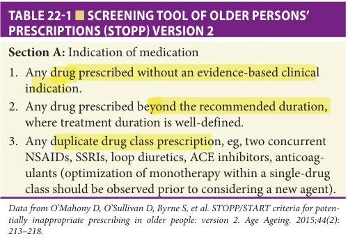
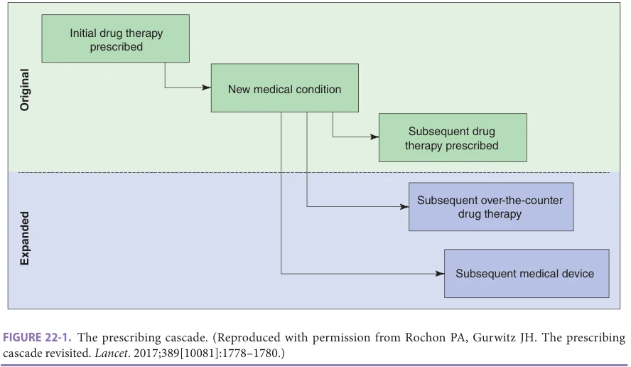
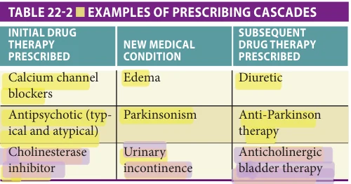
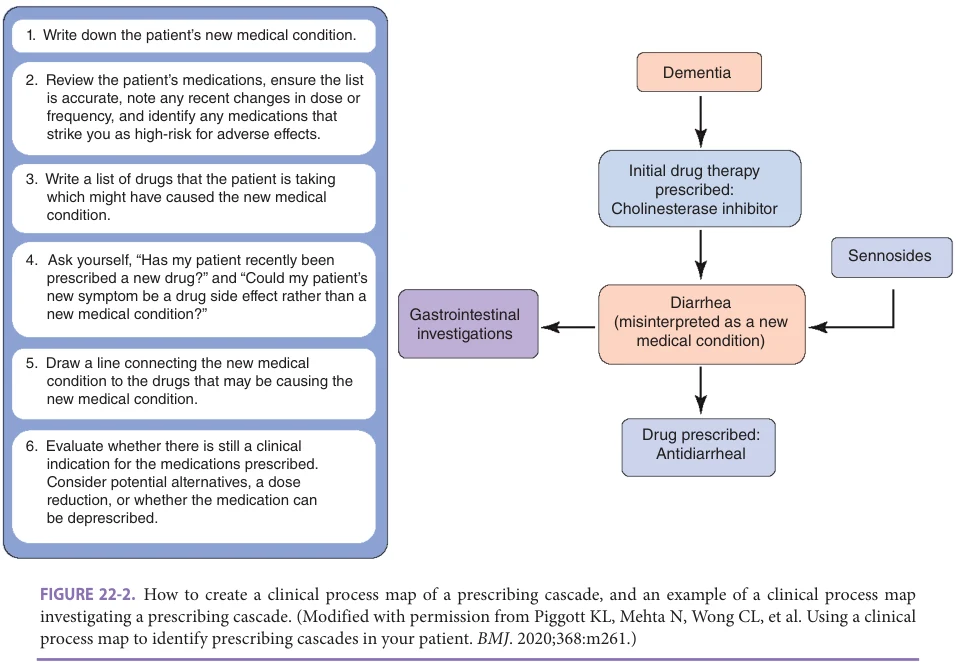
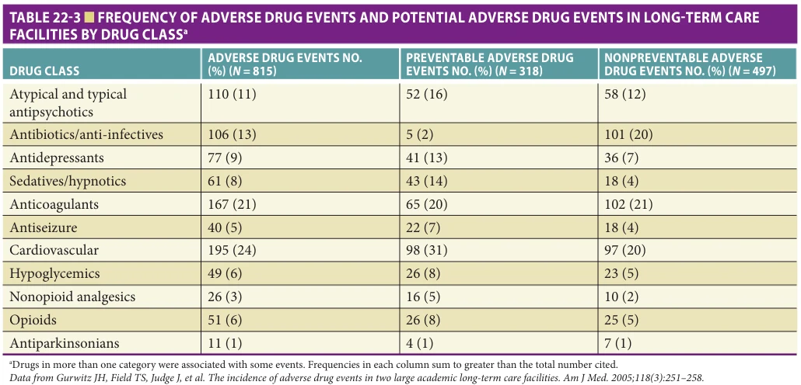
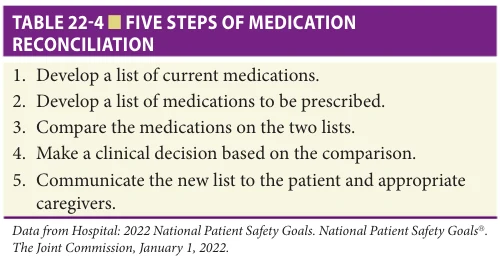
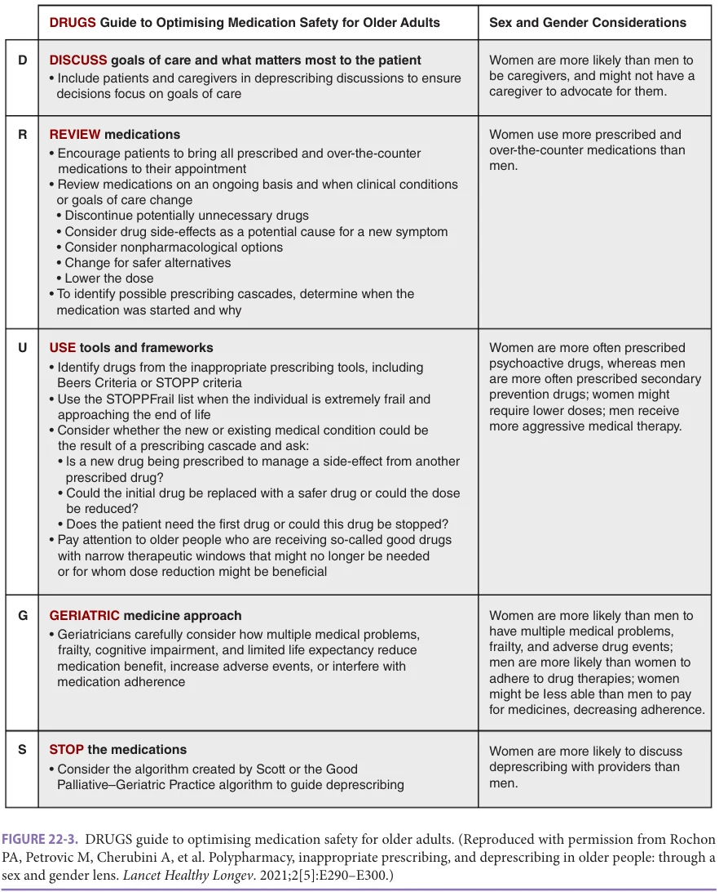

# Hazzard's Geriatric Medicine and Gerontology, 8e - Chapter 22: Medication Prescribing and De-Prescribing

Paula A. Rochon, Sudeep S. Gill, Christina Reppas-Rindlisbacher, Nathan M. Stall, Jerry H. Gurwitz

> **Status.** Fast build from the book; not lane-reviewed.

> **Source and method.** Printed pages 301-316, from the marked 8th-edition copy (PDF page = printed page + 34). Prose follows its text layer; tables and figures are source-page crops. The book is canonical.

**[p. 301]**

## INTRODUCTION

Prescribing for older adults presents special challenges. Older people take about three times as many prescription medications as do younger people, mainly because of an increased prevalence of chronic medical conditions among the older population. Taking several drugs together substantially increases the risk of drug interactions and adverse events, and older women are more likely than men to experience an adverse drug event (ADE).

#### Learning Objectives

- Understand the current problems with drug prescribing in older adults.

- Recognize the importance of applying a sex and gender lens to drug prescribing.

- Consider the importance of polypharmacy.

- Describe approaches to identifying inappropriate prescribing.

- Understand the importance of the deprescribing process, including utilizing tools such as the DRUGS guide to optimizing medication safety for older adults.

#### Key Clinical Points

1. Prescribing for older adults presents unique challenges as they are at higher risk for drug-related adverse events.

2. When prescribing medications to older adults, consider the pharmacokinetic and pharmacodynamic changes that are observed with aging and differences by sex.

3. Criteria and frameworks, developed by experts internationally to assess the quality of drug prescribing in older adults, can be applied in clinical practice.

4. Prescribing cascades are common and important to consider in older adults with multiple chronic conditions who are likely to be prescribed multiple drug therapies.

While a provider can usually do little to alter the characteristics of individual older adults to affect the kinetics or dynamics of drugs, the decision whether to prescribe any drug, the choice of drug, and the manner in which it is to be used (eg, dose and duration of therapy) are all factors that are largely under the control of the provider. This chapter discusses ways to optimize prescribing of drug therapy for older women and men.

## EPIDEMIOLOGY OF DRUG THERAPY

Writing a prescription is the most frequently employed medical intervention. Yet, creating optimal drug regimens that meet the complex needs of older adults requires careful thought and planning. Multiple factors contribute to inappropriate drug prescribing, including lack of adequate training of providers in safe prescribing practices, and in prescribing for older adults. Further, a lack of routine use of safe medication prescribing practices, such as checking drug allergies, confirming appropriate drug doses, adjusting doses for renal impairment, and potential drug–drug interactions and medication reconciliation, also contribute to prescribing errors. Avoidable ADEs are the most serious consequences of inappropriate and unsafe drug prescribing. The possibility of an ADE should always be borne in mind

**[p. 302]**

5. Incorporating an individual’s goals of care is critical to optimizing prescribing for older adults. It is essential that the risks are balanced against the benefits of each medication. An important tension exists between avoiding inappropriate medications and avoiding underuse of potentially beneficial drugs.

6. Special considerations are needed when prescribing for long-term care residents, the majority of whom are older women and live with dementia.

7. Assessing medication safety in older adults using real-world data is critical. This process encompasses the evaluation of the safety and effectiveness of medications in large populations of older adults who may have been excluded from randomized trials. These studies also provide the opportunity to explore important sex, gender, and agebased considerations.

8. Considerations in drug prescribing in older adults range from cost-related barriers to adherence, medication review and reconciliation, the use of nonpharmacologic approaches, and the risks and benefits of deprescribing.

9. The DRUGS guide to optimize medication safety for older adults outlines steps to follow in order to optimize drug prescribing for older adults and incorporates sex and gender considerations into each step. These steps include:

### • DISCUSS goals of care • REVIEW medications • USE tools and frameworks to guide decision making • GERIATRIC medicine approach • STOP the medication where appropriate

when evaluating an older individual. A valuable maxim in geriatric medicine posits that when evaluating virtually any new symptom in an older patient, the possibility of an ADE should be considered in the differential diagnosis. Female sex, advanced age, frailty, cognitive impairment, and increased drug utilization are all factors that contribute to an individual patient’s risk for developing a drug-related problem. US data indicate that older adults in the community are up to three times more likely to have an ADE that requires evaluation in an outpatient setting or in an emergency department and are seven times more likely

to require a hospital admission. In the inpatient setting, older adults account for more than 50% of hospitalizations complicated by an ADE. In the nursing home setting, the incidence of ADEs approaches 10 per 100 resident-months, of which over half may be preventable. These estimates are probably conservative because preventable ADEs were strictly defined and it was assumed that, in many cases, the prescription of the offending drug was indicated, and the ADE was therefore not preventable.

Herbal medicines are frequently used by older adults, and physicians often do not question patients about such use. An estimated 22% of the US adult population takes an herbal medicine or supplement such as ginseng, ginkgo biloba extract, and glucosamine. In one survey, almost 75% of patients did not inform their physician that they were using unconventional treatments including herbal medicines. Herbal medicines may interact with prescribed drug therapies leading to adverse events, underscoring the importance of routinely questioning patients about their use of these therapies. Examples of herbal–drug therapy interactions include warfarin in combination with ginkgo biloba extract leading to an increased risk for bleeding and serotonin-reuptake inhibitors in combination with St. John’s Wort leading to serotonin syndrome.

## PHARMACOKINETICS AND PHARMOCYNAMICS

When prescribing medications to older adults, it is important to consider pharmacokinetic and pharmacodynamic changes observed with aging and differing by sex. Age-related pharmacologic changes combined with sex related changes, and medical conditions that are more common in older adults can impact the pharmacokinetics of drug therapies. Understanding these issues can help to guide prescribing decisions.

Pharmacokinetics relates to the way the body handles a drug. Traditionally, pharmacokinetics involves consideration of drug absorption, distribution across body compartments, metabolism, and elimination. Drug absorption is largely unchanged with aging. Changes in drug distribution, metabolism, and excretion can impact the clearance of a medication from the body in older adults. Age-related changes in body composition can affect the volume of distribution of a drug. With advancing age, older people have less lean body mass and greater fat stores relative to younger people. These age-related changes may affect women more than men. As such, drug therapies such as benzodiazepines which are highly lipid-soluble have an increased volume of distribution in older people relative to those who are younger.

Much of the literature on age-related changes in drug metabolism has focused attention on reduced oxidative metabolism by the family of cytochrome P450 (CYP450) isoenzymes in the liver. The activity of various CYP450 isoenzymes can be inhibited or induced by a wide range

**[p. 303]**

of medications, which contributes to numerous drug-drug interactions. In addition, elimination of many drug therapies occurs through renal clearance, and renal function declines with age. Taken together, these age-related changes in pharmacokinetics have substantial impact on the clearance of many medications commonly used in older adults. Conventional wisdom and prudent prescribing practice warrants that special care be taken in drug dosing for older patients, particularly in the case of highly lipid soluble drugs, medications metabolized via reactions catalyzed by CYP enzymes, and renally excreted drugs. It is important to consider both age- and sex-related issues.

In contrast to pharmacokinetics, pharmacodynamics relates to the effect that a drug has on the body. Age and female sex are associated with enhanced sensitivity to a number of drug therapies. For example, older people may be more sensitive to the effects of benzodiazepines, opioids, and warfarin, exclusive of age-related pharmacokinetic changes that might exist. Older women may be even more sensitive to men to some drug therapies. This highlights the importance of integrating sex and age information when exploring pharmacodynamics and pharmacokinetics and making prescribing decisions for older women and men.

The science of geriatric pharmacology remains to be fully elucidated. A dogmatic approach to applying currently accepted principles of geriatric pharmacology in prescribing medications to older adults is not ideal. For example, the risk of fall-related injuries in older adults prescribed short half-life benzodiazepines and so-called “Z-drugs” (eg, zolpidem) may actually be similar to that of long-halflife benzodiazepines. These observations are clearly at odds with what would be expected based on the pharmacologic changes that occur with aging. Schwartz has written that “clinical factors such as disease, concomitant medications, lifestyle, diet, and nutraceutical intake may have greater effects and lead to greater variability in drug clearance and effects than would be estimated based on investigations of pure aging or sex effects in animal or human studies.”

Various strategies may assist in formulating the most appropriate and individualized drug dose for older patients. These approaches may include weight-based and renal-based dosing. Individualized dosing of renally cleared medications, particularly those with a narrow therapeutic index, is facilitated by the provision of estimates of glomerular filtration rates now routinely added to the results of laboratory panels. In addition, clinical decision support tools are commonly incorporated into electronic health records to assist in the choice of medication dose when ordering for patients with reduced renal function. Finally, while controversy remains concerning the clinical utility and practicality of applying pharmacogenetic data to the direct care of older patients (eg, to guide warfarin dosing), pharmacogenetic-dosing holds both the promise and potential for enhancing the safety and effectiveness of geriatric pharmacotherapy in the future.

## MEASURING THE QUALITY OF DRUG PRESCRIBING IN OLDER ADULTS

Various criteria and frameworks have been developed by experts internationally to assess the quality of medication use in older populations. These criteria generally comprise a list of drugs that are potentially inappropriate for use in older adults or highlight medications that should be considered in older people with certain indications. Criteria such as Beers and STOPP/START are designed to assist with clinical decision making and should be applied while considering patient preferences and using other tools such as clinical pharmacy interventions and computerized alerts.

One of the most widely employed approaches for the assessment of inappropriate prescribing are the Beers Criteria. These criteria, initially developed in 1991 by a consensus panel of experts in geriatric medicine, geriatric psychiatry, and pharmacology, have been updated and revised a number of times over the years and most recently in 2019. Use of drug therapies considered inappropriate according to the Beers Criteria has been identified as an ongoing issue of widespread concern across all clinical settings. The 2019 Beers Criteria update was sponsored by the American Geriatrics Society and involved a panel of 13 experts in geriatric care and pharmacology following an evidence-based approach. The aim of the 2019 update was to use a comprehensive, systematic review and grading of the evidence on drug-related problems and adverse events in older adults. The 2019 update retained each of the five criteria from 2015: (1) medications that are potentially inappropriate in most older adults, (2) those that should typically be avoided in older adults with certain conditions, (3) drugs to use with caution, (4) drug-drug interactions, and (5) drug dose adjustment based on kidney function.

A different approach to facilitating medication review in older adults is the STOPP (Screening Tool of Older Persons potentially inappropriate Prescriptions) and START (Screening Tool to Alert to Right Treatment) criteria. The STOPP criteria were initially developed in 2008 in Ireland using a Delphi consensus method with experts in geriatric medicine, clinical pharmacology, clinical pharmacy, geriatric psychiatry, and primary care. These criteria identify common instances of potentially inappropriate prescribing including drug-drug and drug-disease interactions, drugs that adversely affect those at risk for falls and duplicate drug class prescriptions. The criteria are organized by organ system, and the reason for each of the prescribing concerns is explained. The prevalence of older patients with at least one potentially inappropriate prescription identified using the STOPP criteria ranges from 21% to 39% in the primary care setting, from 26% to 77% in the hospital setting, and from 23% to 70% in nursing homes. The STOPP criteria’s potentially inappropriate medications have been associated with avoidable ADEs in older people that contributed to acute care hospitalization. Version 2 of the STOPP

**[p. 304]**

*Table 22-1, printed p. 304.*

criteria was published in 2015 and provides guidance on prescribing indicators (Table 22-1) along with a list of 80 evidence-based potentially inappropriate prescriptions for older adults, categorized by body system.

It is important to consider the cumulative burden of prescribing a combination of drugs with anticholinergic effects rather than view them individually. Drugs with anticholinergic effects are commonly prescribed to patients with conditions ranging from depression to urinary incontinence to neuropathic pain and migraine headaches. These therapies raise concerns for older patients because they are associated with serious adverse events including confusion, urinary retention, and constipation. The cumulative burden of anticholinergic agents may more accurately reflect the risk for development of these adverse events. A number of scales have been identified to measure anticholinergic burden. These scales assign points to commonly prescribed anticholinergic drug therapies based on the risk for developing anticholinergic adverse events. In a recent review of these scales, the Drug Burden Index was the most commonly used scale or tool in community and database studies, while the Anticholinergic Risk Scale was used more frequently in care homes and hospital settings. In a study of geriatric evaluation and management in the primary care setting, it was found that higher Anticholinergic Risk Scores were associated with an increased risk for anticholinergic-related adverse events including falls, confusion, dry mouth, and constipation.

A concern with using a limited list of “inappropriate” drug therapies like the Beers Criteria relates to the extent that such a list fully captures the spectrum of drug-related problems likely to befall older patients. For example, studies of older patients presenting to US emergency departments for ADEs or of ADEs in older patients recently discharged from the hospital have suggested that the Beers Criteria drugs capture only a very small fraction of the medications implicated in these events. The majority of these agents are not included among Beers Criteria medications. Furthermore, only a minority of Beers Criteria and STOPP/START criteria

recommendations are based on high-quality evidence, attesting to the dearth of pharmacologic and drug safety and effectiveness research that directly focuses on the older population. A 2013 report issued by the US Department of Health and Human Services on the creation of a national action plan for ADEs prevention highlighted the need to explore strategies to improve medication prescribing more broadly. This report identified older adults as one of the most vulnerable groups for the development of ADEs. The action plan identified three classes of drug therapies that were associated with the highest risk for the development of ADEs. These were anticoagulants leading to bleeding, opioids leading to delirium and mental status changes, and insulin leading to hypoglycemia.

Ultimately, many different factors contribute to making the best prescribing decisions for the individual patient. In order to remain clinically valid, prescribing appropriateness criteria must be regularly updated to keep up with the evolving clinical evidence and ever-increasing number of new medications. Appropriate prescribing also needs to consider time-to-benefit, which takes into account a patient’s life stage and frailty and goes well beyond simply knowing the patient’s chronologic age. What remains essential is the need for ongoing assessment of the medication regimen in light of the individual’s clinical status, goals of care, and balancing of the risks and benefits of each medication.

## PRESCRIBING CASCADES

A particularly concerning aspect of suboptimal medication use in older adults relates to the occurrence of prescribing cascades. The prescribing cascade concept was created by Rochon and Gurwitz in 1997 and updated in 2017. A prescribing cascade begins when a drug side effect is misinterpreted as a new medical condition. An additional drug therapy is prescribed, and the patient is placed at risk for the development of additional side effects relating to this potentially unnecessary treatment (Figure 22-1). Prescribing cascades and other risks associated with drug therapy are particularly important for older adults with multiple chronic conditions who are likely to be prescribed multiple drug therapies. Prescribing cascades are now part of the definition of potentially inappropriate prescribing and have been included in numerous deprescribing processes.

Selected examples of prescribing cascades are described below and summarized in Table 22-2.

Calcium Channel Blockers, Edema, and Diuretic Initiation There has been concern that calcium channel blockers (CCB) used for the management of hypertension may lead to the development of edema. This drug-related side effect may in turn be misdiagnosed as a new medical condition and treated with a further drug therapy.

**[p. 305]**

*Figure 22-1, printed p. 305.*

This association was explored in a cohort of more than 41,000 older adults with hypertension who were 66 years or older in a population-based study in Canada’s most populous province of Ontario. The population-based association between the initiation of a CCB and the initiation of a diuretic therapy was demonstrated. Those who were newly dispensed a CCB had an increased risk for being dispensed a loop diuretic compared to those who were newly dispensed other antihypertensive medications or an unrelated drug therapy. This is an important prescribing cascade given that CCBs are so widely prescribed, and it highlights the importance of raising awareness of this prescribing cascade to clinicians.

Antipsychotics, Parkinsonism, and Anti-Parkinson Therapy Initiation Antidopaminergic-related adverse effects associated with antipsychotic agents have long been recognized, including the development of extrapyramidal signs and symptoms. This drug-related symptom may be potentially misdiagnosed as a new medical condition (ie, Parkinson disease).

*Table 22-2, printed p. 305.*

The association between antipsychotic drug exposure and subsequent treatment of parkinsonism was identified among 3512 adults aged 65 to 99 who were enrolled in a Medicaid program and initiated on a drug therapy for the treatment of parkinsonian symptoms. Patients dispensed a typical antipsychotic therapy or clozapine in the 90 days prior to the initiation of anti-Parkinson therapy were more than five times more likely to begin anti-Parkinson therapy relative to control patients who were not dispensed antipsychotic therapy. Furthermore, a dose–response relationship was demonstrated.

Antipsychotic therapy is widely used in older adults for the management of the behavioral and psychological symptoms of dementia. One of the initial studies to explore the association between atypical antipsychotic drug therapy and the development of parkinsonism demonstrated that these newer agents were also associated with parkinsonism and that this was in a dose-related fashion. Patients who are placed on anti-parkinsonian therapy then become vulnerable to the adverse events associated with this added therapy, including orthostatic hypotension and delirium. A better approach may be to discontinue or reduce the dose of the antipsychotic therapy. If an antipsychotic is deemed essential, it may be prudent to try to select a therapy with less potent anti-dopaminergic blockade and to use this therapy at the lowest possible dose.

Drug-induced parkinsonism has also been reported with other anti-dopaminergic therapies, including metoclopramide. Such drug-induced symptoms in an older adult can be misinterpreted as indicating the presence of a new disease or be attributed to the aging process rather than to the drug therapy. This misinterpretation is particularly likely when the symptoms are indistinguishable from an illness, such as Parkinson disease, which has a greater prevalence in older adults.

**[p. 306]**

Cholinesterase Inhibitors, Urinary Incontinence, and Anticholinergic Therapy Initiation Cholinesterase inhibitors (such as donepezil, rivastigmine, and galantamine) are often prescribed to manage the symptoms of Alzheimer disease and related dementias. Through their effects on the autonomic nervous system, cholinesterase inhibitors can sometimes precipitate urge urinary incontinence. However, new-onset or worsening urge incontinence is also commonly seen as part of the natural history of dementia. Thus, clinicians may misinterpret incontinence in patients with dementia as an unavoidable progression of their underlying disease, when it may in fact represent a potentially reversible drug-related adverse event. A population-based cohort study demonstrated that cholinesterase inhibitor use was associated with an increased risk for receiving anticholinergic medications to manage urinary incontinence, suggesting that the use of anticholinergic drugs in patients with dementia may sometimes represent an unrecognized ADE related to cholinesterase inhibitor use. In addition, the use of anticholinergic drugs by older adults with dementia may expose them to anticholinergic adverse effects (such as urinary retention and postural hypotension) and may also counter the potential neurocognitive benefits of cholinesterase inhibitor treatment.

Other prescribing cascade scenarios, such as the association between the use of hydrochlorothiazide therapy and the initiation of anti-gout therapy or the use of NSAID

therapy and antihypertensives, have been identified. Prescribing cascades only become apparent and preventable when health care providers carefully consider the relationship between the initiation of a new drug therapy, the adverse event profile of that therapy, and the development of a new symptom.

Given the risk and harms of prescribing cascades, process maps have been identified as a practical way to unravel complex relationships and assist with identifying prescribing cascades in order to optimize prescribing. A process flow map (Figure 22-2) is a workflow diagram that shows the flow of clinical events. Its purpose is to provide insights into aspects of the patient’s care that may have gone wrong and areas where improvements can be made. These process maps have been used at the bedside and in the ambulatory setting to explore complex prescribing cascades and to improve health and well-being.

## UNDERUSE OF POTENTIALLY BENEFICIAL THERAPY

Appropriate prescribing is also a highly dynamic process that changes with time, incorporating considerations of age-related physiological changes (eg, changes in renal and hepatic function), disease-related factors, and shifts in the older individual’s goals of care. An important tension also exists between avoiding inappropriate medications (“errors of commission”) and avoiding the underuse of potentially

*Figure 22-2, printed p. 306.*

**[p. 307]**

beneficial drugs (“errors of omission”). As a result of these many influences, appropriate prescribing for older adults represents a complex and ever-shifting balancing act for clinicians.

Polypharmacy may be necessary and appropriate in some patients to permit the optimal management of their multiple chronic conditions. Underuse of beneficial therapy must be carefully balanced against inappropriate overprescribing. The tension between these two aspects of prescribing is complex. Interestingly, overprescribing of inappropriate medications and underprescribing of beneficial medications are correlated, with both simultaneously present in more than 40% of older adults in some studies.

Conceptual Definition of Underuse Underuse of medications is conceptually defined as the absence of initiation of an effective treatment in an individual with a condition for which there exists one or more medications with a favorable benefit-to-risk ratio. Frail older adults are often underrepresented in pivotal clinical trials evaluating medications and the true benefit-to-risk ratio may be different from that observed in younger and healthier study participants. Thus, determinations of underuse require a careful assessment of whether randomized clinical trial results are truly generalizable to the older adult being cared for in real-world settings of care. Analyses focusing on older participants and post-marketing pharmacosurveillance studies can provide a more complete picture of the likely benefits and risks of medications that may not be initially apparent.

Operational Definition of Underuse Attempts have been made to operationally define medication underuse in older adults. Analogous to the development of tools designed to define potentially inappropriate prescribing or “errors of commission”; there are now tools available to assist with the operational definition of underuse of potentially beneficial medications.

The START criteria represent an explicit tool to identify underuse of potentially beneficial medications. The START criteria include 34 evidence-based prescribing indications for older adults and also categorize medications according to organ system. The prevalence of potential prescription omissions, according to START criteria, was 23% among older adults in primary care, from 42% to 66% in hospitalized older adults, and from 42% to 44% among nursing home residents.

Assessing Underuse: Implications of Clinical Practice Guideline Recommendations Different approaches to profiling underuse of potentially beneficial medications have been applied. A common approach to characterizing underprescribing is to assess the use of medications that clinical practice guidelines suggest should be prescribed to treat or prevent a condition in the absence of contraindications. This approach has been

used in a number of studies to demonstrate underuse of specific drug therapies in the care of patients with heart failure, myocardial infarction, osteoporotic fractures, atrial fibrillation, and depression. Unfortunately, most clinical guidelines do not incorporate considerations such as life expectancy and time needed to derive clinical benefit as legitimate justifications to forego prescribing a “beneficial” medication to a patient. In addition, several studies have emphasized that caution should be exercised when applying disease-specific clinical practice guidelines to older adults with multiple chronic diseases.

Striking the Right Balance in Prescribing Incorporating an individual’s goals of care and preferences is critical to making optimal prescribing decisions relating to older patients. Holmes and colleagues have proposed a practical strategy whereby life expectancy, time to realization of treatment benefit, primary goals of care (eg, prevention, cure, or palliation), and validity of specific treatment targets (eg, blood pressure) are integrated to decide on appropriate treatments for older individuals with the aim of minimizing unwarranted polypharmacy. Information about estimating remaining life expectancy in older adults can inform decision making around prescribing a new medication, as an understanding of the lag time until benefit is achieved for a specific medication under consideration. In individuals with advanced dementia for whom the primary goal is focused on quality of life, there may be opportunities to deprescribe medications that were previously considered essential (eg, lipid-lowering therapy with statins) to help reduce the overall pill burden, cost, and the potential for drug-drug interactions and ADEs.

An important example of striking the right balance is the case of antihypertensive treatment regimens in older adults. In 2015, a landmark trial titled SPRINT evaluated the benefits of intensive versus standard blood pressure control and concluded that among patients at high risk of cardiovascular disease (eg, > 75 years), a systolic blood pressure target of less than 120 mmHg resulted in decreased death from any cause. However, applying this intensive target to all adults over the age of 75 without considering comorbidities, the risk of falls and frailty status may have unintended harmful results. Prescribers should be cognizant of the potential for increased harm from a systolic blood pressure target of less than 140 mmHg in the following patient groups: older than 80 years, moderate to severe frailty, cognitive impairment or functional limitations, history of orthostatic hypotension or labile blood pressure, syncope and falls. Intensifying blood pressure medications in hospitalized older adults is particularly problematic and can lead to adverse outcomes such as syncope and falls. Maximizing the net benefit of blood pressure treatment in older patients requires applying the guidelines in an individualized manner while considering the setting, patient values and preferences, and level of comorbidity and frailty.

**[p. 308]**

## SPECIAL CONSIDERATIONS REGARDING DRUG THERAPY IN LONG-TERM CARE SETTINGS

Long-term care residents include a disproportionate number of women, people of advanced age, and those with multiple chronic conditions including dementia. Medications are the most commonly used therapeutic intervention in the nursing home setting. Nearly half of all nursing home residents take nine or more medications every day, placing this group at particularly high risk for ADEs.

Antipsychotic Therapy in the Long-Term Care Setting In long-term care homes, excess use of antipsychotic therapy for the management of the behavioral and psychological symptoms of dementia continues to be a focus of great concern. Atypical antipsychotic medications are among the drugs most frequently associated with adverse events in long-term care homes. While recent data suggest that use of antipsychotic therapy has declined in US nursing homes over recent years, nearly one in five long-stay nursing home residents continue to be prescribed antipsychotic medications. Further, there is substantial variation in the use of antipsychotic therapy by geographic region and between nursing homes in the same region. A study of antipsychotic therapy in provincially regulated Canadian nursing homes found that antipsychotic prescribing rates were more than double in those with the highest rates of antipsychotic prescribing compared to those with the lowest rates of antipsychotic prescribing. Compared with individuals residing in nursing homes with the lowest mean antipsychotic prescribing rates, those residing in homes with the highest rates were three times more likely to be dispensed an antipsychotic therapy irrespective of their potential clinical indication. There is accumulating evidence that the benefit from atypical antipsychotics for the management of behavioral and psychological symptoms in Alzheimer-type dementia may be offset by the increased risk for ADEs. There is also evidence that antipsychotic use is associated with an increased risk of death with both conventional and atypical antipsychotic drug therapy in older adults with dementia-related behavioral disorders. Health Canada and the US Food and Drug Administration (FDA) have issued strong warnings about their use. Given these important safety concerns, the use of antipsychotic therapy should generally be reserved for situations where the benefit clearly outweighs the risk, such as in situations where the behavior poses a risk to the resident or others. Additionally, antipsychotic therapy should be frequently reassessed, with consideration for lower the dose or discontinuing the therapy altogether in favor of superior nonpharmacological approaches.

Risk of Adverse Drug Events in the Long-Term Care Setting The occurrence of preventable ADEs is among the most serious concerns regarding suboptimal medication use in the nursing home setting. Few studies have systematically examined the incidence of ADEs in the nursing home population. In a study conducted in two academic long-term care homes in Ontario and Connecticut over a 9-month period, drug-related incidents were detected by computergenerated signals from a computerized physician order entry system, clinical pharmacist investigators, and periodic review of medical record.

In this study, residents using anticoagulants, atypical antipsychotics, diuretics, anti-infectives, and anticonvulsants were at greatest risk for ADEs. Psychoactive drugs (ie, antipsychotics, antidepressants, and sedatives/hypnotics), cardiovascular and anticoagulants were the most commonly implicated drug categories associated with the occurrence of preventable ADEs (Table 22-3). Confusion, oversedation, delirium, and hemorrhagic events were the most commonly identified preventable ADEs. Errors resulting in preventable ADEs occurred most often at the stages of ordering and monitoring. Among the prescribing errors, the most common were wrong dose, wrong drug choice, and known drug interaction. Dispensing and administration errors were less commonly identified. Independent risk factors for experiencing a preventable ADE included using medications in several drug categories, such as antipsychotic agents, anticoagulants, diuretics, and antiepileptics. Extrapolating from the results of this research, 1.9 million ADEs per year may occur among the 1.6 million US nursing home residents and more than 40% may be preventable. There are almost 86,000 fatal or life-threatening ADEs per year, of which 70% may be preventable. Drug-related morbidity and mortality is one of the most important areas to target in efforts to both improve the quality of medical care for older adults and reduce the costs of health care for this population.

Failures in the design of systems of care are considered the most important contributor to the occurrence of medical errors, as well as the injuries that result from some of those errors. Enhanced surveillance and reporting systems for ADEs occurring in the nursing home setting are required as are continued educational efforts relating to the optimal use of drug therapies in the frail older patient population. However, as Leape et al. concluded in regard to the occurrence of serious medication errors, “preventive efforts that focus solely on the individual provider or which rely on inspection alone have limited impact. Analysis and the correction of underlying systems faults is much more likely to result in enduring changes and significant error reduction.” Ordering and monitoring errors in the nursing home setting may be particularly amenable to prevention strategies that use systems-based approaches. The benefits

**[p. 309]**

*Table 22-3, printed p. 309.*

of these approaches to error reduction have been reported in the hospital setting with computerized order entry. A computer-based decision aid reduced in-hospital inappropriate dosing of psychotropic medications for geriatric inpatients. Successes in the hospital setting pave the way for similar efforts in long-term care. For instance, clinical decision support at the time of medication ordering has been shown to improve the quality of prescribing to long-term care home residents with renal insufficiency.

## DEFICIENCIES IN INFORMATION ABOUT DRUG THERAPY IN OLDER ADULTS

Selecting the right medication and the right dose to prescribe for an older adult is difficult because so little evidence is available to guide choices. Decision making often has to draw on information obtained from study participants who are different from those encountered in real world settings, where patients often have several medical conditions and are taking more than one drug. The results of clinical trials of treatments for conditions commonly affecting older people often cannot be directly extrapolated to individual patients, as older adults, particularly women, frail persons and those with multiple illnesses, have often been excluded from participation in clinical trials. This poses challenges to the adoption of clinical practice guidelines developed to improve the quality of health care for many chronic conditions. A review of clinical practice guidelines for nine common chronic diseases promulgated by national and international medical organizations found that they did not modify or discuss the applicability of their recommendations for older patients with multiple comorbidities. Most did not comment on medication burden, short- and

long-term goals, and the quality of the underlying scientific evidence, nor give guidance for incorporating patient preferences into treatment plans. Boyd and colleagues have reported that if relevant guidelines were followed, a hypothetical 79-year-old patient with osteoporosis, osteoarthritis, type 2 diabetes mellitus, hypertension, and chronic obstructive pulmonary disease would be prescribed 12 medications. The doses of those drugs may be inappropriately high, particularly for older women who are commonly underrepresented in clinical trials. There are several ways in which the quality and availability of information about the use of drugs in older adults might be improved. These include enhancing the inclusion of older adults in drug trials, and using observational studies and systematic reviews to provide information to guide clinical decision making.

Inclusion of Older Adults in Clinical Trials In 1989, the US FDA published “Guidelines for the Study of Drugs Likely to be Used in the Elderly.” The guideline was intended to encourage routine and thorough evaluation in older populations of the effects of new drugs being proposed for federal approval so that physicians would have sufficient information to use such drugs properly. The guidelines state “there is no good basis for the exclusion of patients on the basis of advanced age alone, or because of the presence of any concomitant illness or medication, unless there is a reason to believe that the concomitant illness or medication will endanger the patient or lead to confusion in interpreting the results of the study.” It was not until 1993 the US National Institutes of Health (NIH) created guidelines for the inclusion of women and minority groups in the studies that they funded. Further, it was only in 2019 that the NIH Inclusion Across the Lifespan policy was put in place

**[p. 310]**

to address the underrepresentation of older adults in their studies. The concern is that when policies focus separately on sex and age, the intersection required to identify older women who are most at risk for drug-related adverse events will be missed. Drug trials should include study subjects that reflect the group that would eventually be prescribed the therapy, but this is often not what happens.

A case in point are trials in cardiovascular disease, which is overwhelmingly a disease of old age. A recent study of NIH-funded trials before and after the introduction of the new Inclusion Across the Lifespan policy showed that despite the implementation of new safeguards, older adults continue to be underrepresented where 30% of trials had explicit age limits and 70% excluded participants due to factors which disproportionally impact older adults (functional status, cognitive impairment, or decreased life expectancy). Meanwhile, outcomes relevant to geriatric populations, such as measures of function, mobility, or quality of life, were usually lacking. Another study examining NIH-funded phase III clinical trials since the introduction of the policy found that 67% of studies reported mean or median ages that skewed younger than expected for the disease or condition of interest. As with the cardiovascular trials, older adults were often implicitly excluded based on polypharmacy/concomitant medication (37%) or cardiac issues (30%). Ongoing evaluation of enrollment by age group and reasons for exclusions will be critical to monitoring the success of the policy and improving the collection of evidence for drug therapies in older adults.

The underrepresentation of older individuals in clinical trials can be considered from a variety of perspectives. Even in the absence of explicit age limits or criteria that preclude eligibility based on clinical or functional grounds, older adults may be excluded. Often large numbers of older patients need to be screened to enroll just one eligible study participant, with an adverse impact on costs and the ability to meet study timelines. In addition, participation in a clinical trial by an older adult may never even be considered, relating to a confluence of factors, including bias, value judgments, and rationalization. The dynamics of the patient-physician relationship may confuse legitimate clinical concerns with subjective feelings regarding what is best for the older adult.

## ASSESSING MEDICATION SAFETY IN OLDER ADULTS

Pharmacoepidemiology uses the science of clinical epidemiology to measure patterns of medication use and outcomes in large populations. Pharmacoepidemiology allows assessment of the safety and efficacy of medications in large populations, which are often more diverse than the participants in randomized trials, over long periods of time.

Advantages of Pharmacoepidemiologic Studies The advantages of pharmacoepidemiology over randomized controlled trials include (1) detection of adverse

events that are too rare or too delayed to be detected in randomized trials; (2) assessment of efficacy over longer periods in a broader population; (3) correlation of medication use with outcomes that may not have been assessed in randomized trials; (4) assessment of safety and efficacy of medications beyond the stringent monitoring of a randomized trial.

Pharmacoepidemiology is a particularly useful tool to assess medications in older adults. Older adults are often excluded from randomized trials, either on the basis of age alone, or because of comorbidities, co-medications, or functional impairment. Observational pharmacoepidemiologic studies can assess patterns of medication use, safety, and efficacy in frail individuals. It is particularly important to understand safety and efficacy over many years when deciding whether to continue or cease medications in older adults who have often been taking their medicines for decades. Many randomized trials only assess disease and mortality outcomes, and pharmacoepidemiologic studies can correlate medication exposure with functional and quality-of-life measures that may be more relevant to older adults. Pharmacoepidemiology assesses the effects of medications in the presence of medication management issues that occur in real clinical settings, for example, limited adherence and monitoring.

Limitations of Pharmacoepidemiologic Studies Pharmacoepidemiologic studies can be limited by confounding and bias. Interpretation of studies is limited by variable prescribing patterns, variable comorbidities, confounding by indication, severity and prognosis, and controlling for the time dependency of drug use. Studies that rely on large epidemiologic databases often contain very limited clinical information, including the exact indication for prescribing a given medication. There are several emerging approaches to manage confounders, including restricting study populations to more homogeneous groups, creating a propensity score to predict the probability of receiving a drug based on baseline covariates, and examining within-patient variability of drug exposure using crossover designs.

Sex and Gender-Based Considerations Age-based exclusions may also have important secondary effects on the participation of women in clinical trials. A number of studies have demonstrated a strong association between the average age of participants in a clinical trial and the enrollment of women, because women account for a substantially greater proportion of the older adult population than do men. Many of the ongoing concerns regarding the enrollment of women in clinical trials are intimately related to the exclusion of older participants.

The underrepresentation of older women and lack of sex and age disaggregated data in clinical research are concerning. The case of zolpidem dosing is just one example where increased harms for women were not discovered

**[p. 311]**

until post-marketing surveillance. A growing body of research highlights the influence of sex on drug-related adverse events and other clinically relevant health outcomes. Sex and gender factors are still largely neglected in research, and this has become starkly evident in the case of COVID-19 related studies, where less than 5% of investigators had planned for sex disaggregated data analysis in their studies. In the case of SGLT-2 inhibitors for diabetes, current guidelines do not reflect the fact that these drugs appear to be less effective in reducing major adverse cardiac events in women compared to men. Funding agencies must set analysis guidelines for drug trials to report sex disaggregated adverse events and outcomes for all therapeutics including vaccines and devices. Understanding the sex and gender factors that influence efficacy and adverse events will help regulatory bodies and providers provide safe, evidence-based, and equitable care.

## ADDITIONAL ISSUES RELATED TO DRUG THERAPY IN OLDER ADULTS

Cost-Related Non-Adherence A prescription may be written but not dispensed, or dispensed but not taken regularly. A common barrier to appropriate medication use relates to financial considerations. The use of drug therapy has been shown to be directly related to coverage of drug costs. It is estimated that more than 40% of all Medicare enrollees in the United States had no coverage for outpatient drug expenditures prior to the implementation of the 2003 Medicare Modernization Act. In the United States, cost has been identified as an important reason that patients do not take medication that are prescribed by their health care provider. Specifically, among older adults and prior to the implementation of Medicare Part D, 13% of a national sample of 13,869 noninstitutionalized Medicare enrollees reported cost-related underuse of medications. Those in fair to poor health, with multiple comorbidities, and without coverage were most at risk.

Following the implementation of Medicare Part D, there were incremental improvements in medication affordability for older Americans. Recent concerns have been raised that these trends, especially for Medicare beneficiaries with multiple chronic conditions, have plateaued or even reversed, indicating that high drug costs remain a persistent barrier for this vulnerable population. Practical strategies available to optimize pre- and post-discharge medication management have been reviewed and can aid in improving outcomes in vulnerable older patients.

Limited Manufacturing of Low-Dose Formulations of Recommended Drug Therapy Limited manufacturing of low-dose formulations of drug therapy may make it more difficult or expensive for patients to take their prescribed drug therapy. Low-dose therapy is often recommended for older adults but may not

be manufactured or available from publicly funded drug programs in the prescribed low dose. For example, there is considerable evidence supporting the efficacy and greater safety of low doses of thiazide diuretic therapy in the treatment of hypertension in the older patient population. The Joint National Committee on Detection, Evaluation, and Treatment of High Blood Pressure Guidelines suggest starting antihypertensive therapy at low doses. Specifically, these guidelines suggest that therapy could be initiated with a thiazide diuretic. Low doses of thiazide diuretics often produce as large an antihypertensive effect as larger doses, with a reduced risk for metabolic abnormalities.

Women are more likely than men to require a lower dose of drug therapies. Despite this there are only a very few drug therapies used by women that are manufactured with a dose for women and another for men. Zolpidem, a widely used sleep aid, was on the market for more than 20 years before data became available showing that next morning drowsiness interfering with the ability to drive was greater in women than men. As a result, the dose for women is now half of the dose that is recommended for men.

Medication Review and Reconciliation Medication review is required on a regular basis to determine if the medications prescribed to an older adult are appropriate for them. Randomized controlled trials examining the effect of medication reviews report mixed results. All studies have reported that medication review leads to recommendations for different types of changes, including elimination of drugs, increasing the number of drugs, therapeutic substitutions, or better dosing. There are few reported statistically significant changes in patient drug use and drug expenditures. Studies that involved direct contact between the consulting pharmacist and the patient appeared to be more effective than interventions aimed at recommending drug changes to the patient’s physician. One intervention study found that patients were resistant to reducing medications to recommended levels, particularly psychoactive drugs.

Medication reconciliation determines if the prescribed drugs are taken as they have been prescribed and intended. In the United States, the Joint Commission has required accredited facilities to implement a system of medication reconciliation to reduce medication errors at transitions of care. Medication reconciliation is defined as the process of identifying the most accurate list of all medications that the patient is taking, including name, dosage, frequency, and route, by comparing the medical record to an external list of medications obtained from a patient, hospital, or other provider (Table 22-4). Patients and responsible physicians, nurses, and pharmacists should be involved in the medication reconciliation process. This reconciliation is done to avoid medication errors such as omissions, duplications, dosing errors, or drug interactions. Changes in medication (different dose, discontinued therapies, additional therapies), common during care transitions,

**[p. 312]**

*Table 22-4, printed p. 312.*

are a frequent source of medication errors and confusion. ADEs attributed to medication changes occurred in 20% of patients on transfer from hospital to a nursing home, happening most commonly for patients on readmission to the nursing home. One study found that discharged patients understood the potential side effects of their medications less frequently than their attending physicians believed. One Canadian multisite study found that 25% of 325 older adults experienced an ADE after discharge home from the hospital; half of these events were considered preventable. Medication reconciliation systems and processes have successfully reduced medication errors in many health care organizations. Pharmacy technicians at one hospital reduced potential ADEs by 80% within 3 months by obtaining medication histories of patients scheduled for surgery.

In the United States, policy efforts to promote the use of new health care information technology serve to encourage medication reconciliation as patients transition from one setting of care (eg, hospital, ambulatory primary care, ambulatory specialty care, nursing home, home health, rehabilitation) to another or from one health care provider to another. For example, the Health Information Technology for Economic and Clinical Health (HITECH) Act and Meaningful Use criteria (stage 1) require that health professionals who receive a patient from another setting of care or provider of care should perform medication reconciliation.

Medication reconciliation has been recognized as a key component of patient safety, but there remains a lack of consensus and evidence about the most effective methods of implementing reconciliation. Reviews suggest that this lack of consensus stems in part from the low certainty of the evidence. Targeting specific vulnerable patient populations for medication reconciliation may be more effective than widescale nontargeted reconciliation efforts.

Consider Nonpharmacologic Approaches Physicians should limit prescribing a new drug therapy to situations in which benefits clearly outweigh risks and to use drug therapy only after potentially safer alternatives have been attempted. For example, the use of NSAIDs to manage pain in older adults with osteoarthritis may be inappropriate because safer options are available. Epidemiologic and clinical studies have characterized the adverse consequences of NSAID use in older adults, particularly

the association between NSAID use and gastrointestinal bleeds and renal impairment. Thus, alternative approaches should be considered before NSAIDs are prescribed for indications such as osteoarthritis. Possible nonpharmacologic approaches, such as gentle exercise and weight reduction, may be beneficial alternatives to treatment with NSAIDs. When pharmacologic therapy is required, a drug therapy with a more favorable adverse event profile, such as acetaminophen, should be tried first.

Another example is the use of nonpharmacologic approaches to manage behavioral and psychological symptoms of dementia. Behavioral symptoms such as wandering and agitation are common and represent a major source of disability and caregiver distress. These symptoms frequently result in prescriptions for psychotropic medications such as antipsychotic drugs, but these drugs are on average only modestly effective and can provoke serious adverse effects. Thus, nonpharmacologic strategies are increasing emphasized to manage behavioral symptoms in dementia, and are usually recommended as first-line treatments. The evidence base has grown recently to support a wide variety of nonpharmacologic treatments for the behavioral and psychological symptoms of dementia. Examples of effective nonpharmacologic treatment strategies include caregiver education and support, training in problem solving, and targeted interventions directed at the underlying causes for specific behaviors (eg, introduction of structured nighttime routines to reduce sleep disturbances). Nonpharmacologic management can improve both patient and caregiver quality of life and can help to reduce the inappropriate use of potential harmful psychotropic medications such as antipsychotic drugs.

Deprescribing Deprescribing has been defined by Scott as the process of “identifying and discontinuing drugs in instances in which existing or potential harms outweigh existing or potential benefits within the context of an individual patient’s care goal, current level of functioning, life expectancy, values, and preferences.” Medication review and reconciliation may indicate the need for changes to currently prescribed drug therapies, especially if new evidence has emerged about the benefits and risks of these drug therapies. These changes may include discontinuation of a therapy prescribed for an indication that no longer exists or reduction in dosage of a drug that the patient still needs to take.

Physicians are often reluctant to deprescribe, for example, reduce or stop medications, especially if they did not initiate the treatment and the patient seems to be tolerating the therapy. Sometimes, medications only expose the patient to the risks for an adverse event with limited or no therapeutic benefit. The use of chronic digoxin therapy among older adults with normal systolic function is one such example. Use of digoxin therapy by older adults is not without risk. Renal impairment that progresses over time or dehydration associated with a gastrointestinal or

**[p. 313]**

respiratory illness or a urinary tract infection may predispose older adults to digoxin toxicity. Often, digoxin therapy has been prescribed for years for reasons that were not welldocumented. In a small study of 23 nursing home residents with normal sinus rhythm, normal ejection fraction, and no clinical evidence of heart failure, digoxin was discontinued in 14 residents. One patient developed a decreased ejection fraction (from 60% to 50%) and digoxin therapy was restarted even though the patient remained clinically asymptomatic. At 2 months following the discontinuation of digoxin therapy, all patients with digoxin therapy discontinued remained clinically stable. These findings suggest that digoxin can be safely discontinued in select nursing home residents. Other investigators, however, have found that discontinuation of digoxin therapy in patients with impaired systolic function can have a detrimental effect.

Scott and colleagues have commented on the dangers of therapeutic inertia—whereby drugs continue to be prescribed in the absence of periodic review of net benefit— and therapeutic momentum, where more drugs are added in response to new but questionable indications, including unrecognized side effects arising from preexisting medications, potentially resulting in a prescribing cascade. Therapeutic inertia can also be avoided by periodically repeating the process of comprehensive medication review, with this process triggered in particular at times when the patient experiences an important health transition (eg, development of a new medical condition and/or changes in their preferences or overall goals of care).

## PRACTICAL APPROACH TO OPTIMIZING MEDICATIONS IN OLDER ADULTS

The DRUGS guide to optimize medication safety for older adults was created by an international group of eight geriatricians from six countries. This guide outlines steps for prescribers to follow to optimize drug prescribing for older adults (Figure 22-3). These steps are DISCUSS goals of care, REVIEW medications, USE tools and frameworks to guide decision making, follow a GERIATRIC medicine approach, and STOP medications where appropriate, all while integrating critical sex and gender considerations.

DISCUSS goals of care and what matters most to the patient. It is essential to tailor the prescribing approach to the individual patient and emphasize the importance of taking primary goals of care (eg, prevention, cure, or palliation) into consideration, an approach described by Holmes and colleagues. Others have also emphasized the importance of incorporating patient preferences and what represents meaningful health outcomes for the individual and their family. For example, the Canadian Geriatrics Society 5M model highlights “Matters Most” as one of the pillars to optimizing geriatric care. Taking into consideration the health goals and care preferences of the patient and their family is a critical component of comprehensive care. With the patient’s overall goals of care in mind, it becomes easier to

balance potential tensions between clinical practice guideline recommendations and the inappropriate generation of problematic polypharmacy.

REVIEW medications. To conduct a medication review, the prescriber should ask the patient to bring all the bottles of pills, dosettes, and/or blister packs that they are using to their visit. For example, patients may not consider over-thecounter (OTC) products, ointments, vitamins, ophthalmic preparations, or herbal medicines to be drug therapies and thus, need to be specifically told to bring these therapies to the visit. In addition, patients should be instructed to keep a complete, accurate, and up-to-date medication list including over-the-counter medications and herbal preparations. A patient-generated list is particularly important as they are frequently prescribed medications from several physicians and patients may receive their medications from several pharmacies.

A periodic comprehensive review of the drug regimen that a patient is taking is an essential component of the medical care of an older adult; this process is referred to as medication reconciliation with the development of the best possible medication history, including OTC and herbal/ nutraceutical products as detailed earlier. In addition to an accurate and complete medication list, details regarding the patient’s medical history and the clinical indications for each medication, sociodemographic information (ie, gender considerations) previous ADEs including drug sensitivities and allergies should also be obtained and documented.

Although there are an increasing number of effective medications for preventing or controlling a range of illnesses and for alleviating many symptoms, several studies show that adherence decreases, and adverse medication effects increase, with the complexity of the medication regimen. The goal should thus be to implement the simplest regimen that controls the patient’s symptoms and illnesses, and optimizes disease prevention. A medication grid, which displays each medication with dosage and frequency, has been found effective at facilitating the reduction in medication complexity. Where appropriate, nonpharmacologic approaches should be considered as first-line treatment.

It is important to emphasize that prescribing is a dynamic and iterative process and thus, the determination of appropriate prescribing needs should be periodically repeated, especially when the patient experiences an important health transition. Assessment for changes to a patient’s medication regimen should be conducted as the patient’s health evolves and also as newer evidence emerges about the benefits and harms of existing drug therapies and the introduction of newer treatments.

USE tools and frameworks. When reviewing medications, it is important to utilize available tools and frameworks to help guide decision making. Well-known tools used to identify potentially inappropriate prescribing include the Beers Criteria and the STOPP criteria. To identify drugs with strong anticholinergic effects, consider consulting the

**[p. 314]**

*Figure 22-3, printed p. 314.*

Drug Burden Index and the Anticholinergic Risk Scale. Frameworks that can guide medication reviews are the prescribing cascade and the US National Action Plan for Adverse Drug Event Prevention, which provides helpful guidance to inform prescribing. These tools do not consider sex and gender. It will be important for clinicians to consider how sex and gender may impact their prescribing.

GERIATRIC medicine approach. When considering medication change, one approach described by Steinman and Hanlon is to match the patient’s conditions to each of the medications. Through this process, areas where there is a

mismatch can be identified. For example, situations where a drug is used with no indication, conditions that may benefit from a therapy where a therapy is not currently being offered, and drugs that are being given for an appropriate indication but where there is room for improvement (eg, dose adjustment or substitution with a drug therapy with a better risk-to-benefit profile). Further, the match between the medical condition and the medications should be directed not only by clinical guidelines but should also take into consideration the patient’s goals of care and sociodemographic/sociocultural factors.

**[p. 315]**

STOP medications. In some cases, there will be a need to deprescribe drug therapy by reducing the dose or stopping the medication entirely. The CEASE deprescribing protocol outlined by Scott provides excellent guidance of the factors to evaluate when considering discontinuing or reducing the dose of a medication.

Many ADEs are dose related, so it is critical to prescribe the minimal dose required to obtain clinical benefit. A classic example of a dose-related adverse event is the association between use of long elimination half-life hypnotic-anxiolytics, antipsychotics, and tricyclic antidepressants and the development of hip fractures. A dose-related association has been found for each class of drug.

Another clinically important example of the benefit of reducing the dose involves the intensity of diabetes treatment. The doses of oral hypoglycemic agents and insulin therapy should not result in overly tight glycemic control, as there is little evidence that using medications to achieve tight glycemic control in older adults with type 2 diabetes is beneficial. Tight glycemic control has been consistently shown to produce higher rates of hypoglycemia in older adults. Realizing this point, the American Geriatrics Society (AGS) has recommended in the Choosing Wisely campaign (an initiative of the ABIM) that physicians should generally avoid using medications to achieve hemoglobin A1c less than 7.5% in most older adults. The AGS suggests hemoglobin A1c targets should reflect the individual older

## FURTHER READING

Abrahamsen B, Hansen RN, Rossing C. For which patient

subgroups are there positive outcomes from a medication review? A systematic review. Pharm Pract (Granada). 2020; 18(4):1976. Boyd CM, Darer J, Boult C, Fried LP, Boult L, Wu AW.

Clinical practice guidelines and quality of care for older patients with multiple comorbid diseases: implications for pay for performance. JAMA. 2005;294(6):716–724. Budnitz DS, Lovegrove MC, Shehab N, Richards CL. Emer-

gency hospitalizations for adverse drug events in older Americans. N Engl J Med. 2011;365(21):2002–2012. By the 2019 American Geriatrics Society Beers Criteria®

Update Expert Panel. American Geriatrics Society 2019 Updated AGS Beers Criteria® for Potentially Inappropriate Medication Use in Older Adults. J Am Geriatr Soc. 2019;67(4):674–694. Christensen M, Lundh A. Medication review in hospitalised

patients to reduce morbidity and mortality. Cochrane Database Syst Rev. 2013;2:CD008986. DeJong C, Covinsky K. Inclusion across the lifespan in car-

diovascular trials-a long road ahead. JAMA Intern Med. 2020;180(11):1533–1534.

adult’s treatment goals, health status, and remaining life expectancy. The AGS suggests that reasonable glycemic targets would be 7% to 7.5% in healthy older adults with long life expectancy, 7.5% to 8% in those with moderate comorbidity and a life expectancy less than 10 years, and 8% to 9% in those with multiple comorbid conditions and a shorter life expectancy.

## SUMMARY

Optimizing use of drug therapy is a critical priority for older adults and involves achieving the balance between overuse (over prescribing of inappropriate therapy), underuse (under prescribing of beneficial therapy), and misuse (eg, inappropriate dose or duration of therapy). Sex, gender, age, and frailty considerations are important to inform optimal prescribing decisions for all older adults. There are additional considerations that are needed when making prescribing decisions for older adults living in long-term care settings or with limited life expectancy. Prescribing cascades should be avoided and managed by deprescribing when noticed. Particular attention should be given to using all drug therapies only when required and at the minimum effective dose. Practical approaches that integrate patient’s values and preferences should be followed to ensure that older adults are receiving optimal drug therapy.

Duerden M, Avery T, Payne R. Polypharmacy and medicines

optimisation—Making it safe and sound. The King’s Fund. 2013. https://www.kingsfund.org.uk/sites/files/kf/field/ field_publication_file/polypharmacy-and-medicinesoptimisation-kingsfund-nov13.pdf. Gurwitz JH, Field TS, Judge J, et al. The incidence of adverse

drug events in two large academic long-term care facilities. Am J Med. 2005;118(3):251–258. Holmes HM, Hayley DC, Alexander GC, Sachs GA. Recon-

sidering medication appropriateness for patients late in life. Arch Intern Med. 2006;166(6):605–609. Molnar F, Frank CC. Optimizing geriatric care with the

GERIATRIC 5Ms. Can Fam Physician. 2019; 65(1):39. O’Mahony D, O’Sullivan D, Byrne S, O’Connor MN,

Ryan C, Gallagher P. STOPP/START criteria for potentially inappropriate prescribing in older people: version 2. Age Ageing. 2015;44(2):213–218. Piggott KL, Mehta N, Wong CL, Rochon PA. Using a clini-

cal process map to identify prescribing cascades in your patient. BMJ. 2020;368:m261. Rochon PA, Gurwitz JH. The prescribing cascade revisited.

Lancet. 2017;389(10081):1778–1780.

**[p. 316]**

Rochon PA, Petrovic M, Cherubini A, et al. Polypharmacy,

inappropriate prescribing, and deprescribing in older people: through a sex and gender lens. Lancet Healthy Longevity. 2021;2(5):E290–E300. Rudolph JL, Salow MJ, Angelini MC, McGlinchey RE. The

anticholinergic risk scale and anticholinergic adverse effects in older persons. Arch Intern Med. 2008;168(5): 508–513. Schwartz JB. The current state of knowledge on age, sex,

and their interactions on clinical pharmacology. Clin Pharmacol Ther. 2007;82(1):87–96. Scott IA, Hilmer SN, Reeve E, et al. Reducing inappropri-

ate polypharmacy: the process of deprescribing. JAMA Intern Med. 2015;175(5):827–834.

Tinetti ME, Bogardus ST Jr, Agostini JV. Potential pitfalls

of disease-specific guidelines for patients with multiple conditions. N Engl J Med. 2004;351(27):2870–2874. US Department of Health and Human Services, Office

of Disease Prevention and Health Promotion. (2014). National Action Plan for Adverse Drug Event Prevention. Washington, DC: Author. US Food and Drug Administration. Risk of next-morning

impairment after use of insomnia drugs; FDA requires lower recommended doses for certain drugs containing zolpidem (Ambien, Ambien CR, Edluar, and Zolpimist). 2013. https://www.fda.gov/media/84992/download.
