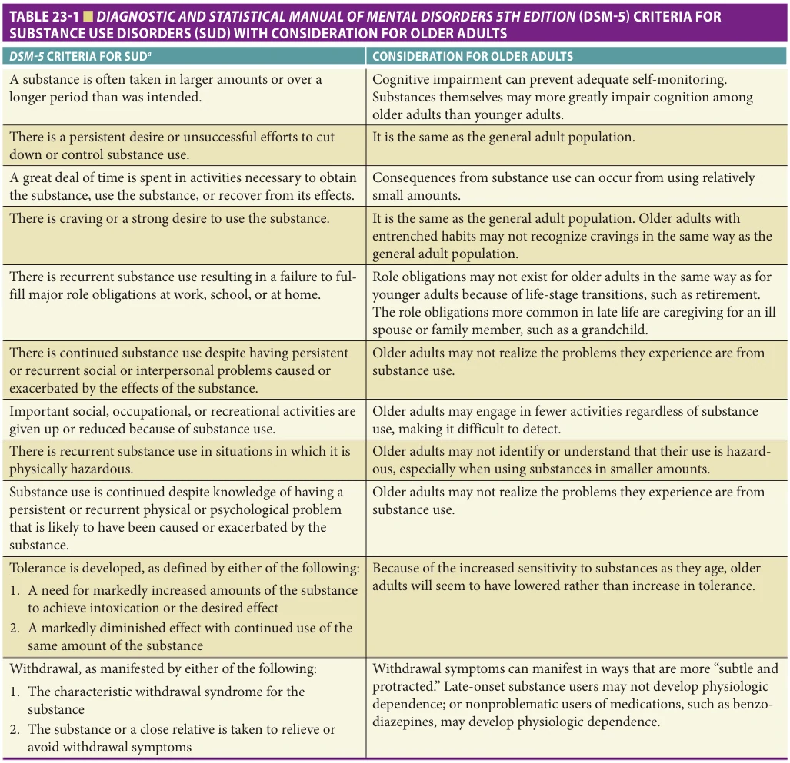
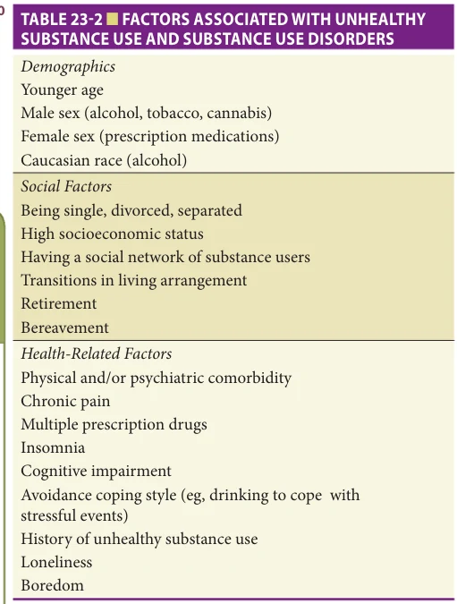
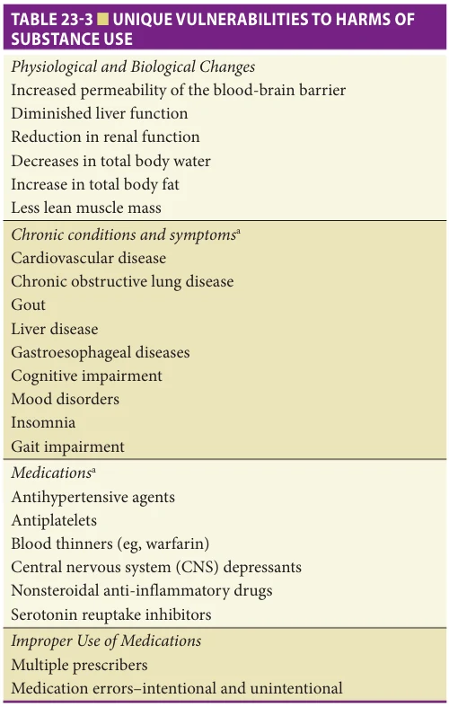
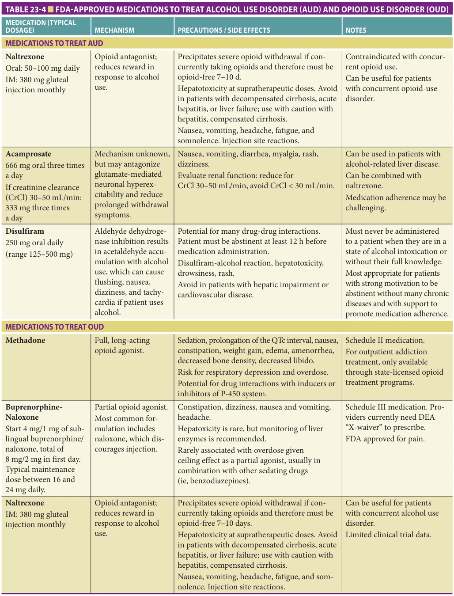

# Hazzard's Geriatric Medicine and Gerontology, 8e - Chapter 23: Substance Use and Disorders

Benjamin H. Han, Alexis Kuerbis, Alison A. Moore

> **Status.** Fast build from the book; not lane-reviewed.

> Not cited in the 2020-2026 past papers.

> **Source and method.** Printed pages 317-328, from the marked 8th-edition copy (PDF page = printed page + 34). Prose follows its text layer; tables and figures are source-page crops. The book is canonical.

**[p. 317]**

## INTRODUCTION

In the United States there is an increasing prevalence of substance use (eg, alcohol, tobacco products, cannabis, illegal drugs, and nonmedical use of prescription drugs) among older adults. The combination of population aging and increasing use of substances has created a growing public health problem; rising numbers of older adults are at risk for and experiencing unhealthy use, including SUDs. This public health problem is serious because older adults are more susceptible to the harms of substance use due to age-associated biological changes, social factors, increases in comorbidity, and the use of medications that may interact with substances. Therefore, it is critical to understand the age-related epidemiology, risk factors, unique vulnerabilities, and approaches to addressing and managing the spectrum of unhealthy substance use, including at-risk use and SUDs.

#### Learning Objectives

- Understand the definitions and epidemiology of substance use and substance use disorder (SUD) among older adults.

- Recognize that substance use and addiction treatment is highly stigmatized in the United States and learn what stigmatizing language to avoid when discussing drug and alcohol use with patients.

- Learn about the unique vulnerabilities to the harms of substance use among older adults.

- Understand how to approach and screen older adults for unhealthy substance use.

- Recognize how identifying SUDs in older adults can be challenging.

- Learn about treatment approaches including evidencebased pharmacological treatments for older adults with SUDs.

#### Key Clinical Points

1. Substance use among older adults is increasing nationally.

2. Unhealthy substance use is often unrecognized in older adults due to lower rates of screening by health care providers and challenges in diagnosing SUDs in older populations.

3. Due to the presence of age-associated biological changes, social factors, increases in comorbidity, and the use of medications that may interact with substances, older adults are at higher risk for harm from psychoactive substances.

4. There are several screening tools to assess substance use and unhealthy substance use; tools focused on alcohol specifically for older adults are available.

5. Evidence-based pharmacologic treatments should be offered to older adults for the treatment of alcohol use disorder (AUD) and opioid use disorder (OUD).

## DEFINITIONS

Unhealthy substance use is typically defined as use that increases the risk for health consequences (hazardous or at-risk use) or has already led to adverse health or social consequences (harmful use and SUDs). For alcohol, at-risk use is typically defined as the use of alcohol at more than low-risk levels. In the United States, a standard drink contains 14 g or about 0.6 fluid ounces of pure ethanol (12 oz of beer, 5 oz of table wine, 1.5 oz of distilled spirits, 86 proof). The National Institute on Alcohol Abuse and Alcoholism (NIAAA) previously recommended that adults age 65 or older who are healthy and do not take medications should not have more than three drinks on a given day or seven drinks per week. This recommendation is now replaced by the US Department of Health and Human Services and US Department of Agriculture’s 2020–2025 Dietary Guidelines that recommend all adults limit alcohol use to two drinks or less in a day for men and one drink or less in a day for women, on days when alcohol is consumed. The guidelines also recommend that older adults avoid drinking alcohol entirely if planning to drive or operate machinery, take certain medications, have certain medical conditions, or are recovering from AUD or cannot control the amount they drink. While the

**[p. 318]**

amount of cannabis use considered at-risk among adults is not clear in light of increasing legalization, cannabis potency, social acceptability, and subsequent increasing use among adult populations, any use could be considered at-risk for older adults. The Diagnostic and Statistical Manual of Mental Disorders 5th Edition (DSM-5) outlines criteria for diagnosing SUDs, which are medical illnesses causes by repeated misuse of a substance or substances. According to DSM-5, SUDs are characterized by clinically significant impairments in health and social function and impaired control over substance use (Table 23-1).

### Prevalence Rates

Alcohol Alcohol continues to be the most commonly used substance among older adults in the United States. While generally, older adults reduce alcohol use as they age, alcohol use is increasing within this population in the past decade. Data from the National Survey on Drug Use and Health (NSDUH) estimate that the past-year use of alcohol increased among adults age 65 and older nationally from 52% in 2010 to 56% in 2019. For adults age 65 and older, the prevalence of binge drinking in the past 30 days (defined

*TABLE 23-1 ■ DIAGNOSTIC AND STATISTICAL MANUAL OF MENTAL DISORDERS 5TH EDITION (DSM-5) CRITERIA FOR SUBSTANCE USE DISORDERS (SUD) WITH CONSIDERATION FOR OLDER ADULTS*

*Owner annotations/highlights are from the marked source copy, not the book.*

aSUD is defined as a medical disorder in which two or more of the aforementioned listed symptoms are occurring in the last 12 months. The severity of the SUD diagnosis is defined by the number of the criteria met: mild 2–3, moderate 4–5, and severe 6 or more. Data from Barry KL, Blow FC, Oslin DW. Substance abuse in older adults: review and recommendations for education and practice in medical settings. Subst Abus. 2002;23(Suppl 3): 105–131 and American Psychiatric Association. Diagnostic and Statistical Manual of Mental Disorders. 5th ed. Arlington (VA): American Psychiatric Publishing; 2013.

**[p. 319]**

as five or more drinks on the same occasion for men and four or more for women) was estimated nationally in 2019 at 11%, with the prevalence of meeting DSM-5 criteria for AUD at 2%. However, the prevalence of AUD may be underestimated as the DSM diagnostic criteria for AUD are not ideal for older adults (see Table 23-1).

Tobacco Tobacco is the second most commonly used substance among older adults and is used primarily via smoking cigarettes. While over the last decade, cigarette smoking rates have gone down in the general adult population, they have remained stable in older adults. Data from NSDUH show the past-year use of tobacco has remained stable over the past 10 years among adults age 65 and older, with the past-year prevalence estimated to be 13% in 2019.

Cannabis While cannabis is federally illegal and remains a Schedule I drug under federal law, there has been a marked increase in the number of states that have legalized cannabis for medical and recreational use. Reflecting the changing laws and attitudes regarding cannabis, data from NSDUH indicate past-year use of cannabis increased from a national prevalence of 0.3% among adults age 65 and older in 2007 to 5% in 2019 and is likely to rise further as more states legalize cannabis. With the overall increase in cannabis use, there has also been an increase in cannabis use among older adults who also use alcohol. In 2015, 2.9% of adults age 65 and older who use alcohol also used cannabis, while in 2018, this prevalence increased to 6.3%.

Other substances Data from the 2019 NSDUH reveal that the prevalence of other illegal drug use such as cocaine, methamphetamine, heroin, and hallucinogens remains low (< 1%) among older adults, but such use may be hazardous for older adults, especially among those with comorbid conditions. The prevalence of SUDs as defined by DSM-5 criteria also remains low among older adults, with a 2019 national prevalence of 0.5% for all SUDs, not including AUD. While SUDs and AUDs both have a low prevalence among older adults nationally in the general population, it is crucial to recognize that several subpopulations of older people experience SUDs at much higher rates. Due to longstanding discrimination and vulnerabilities, older criminal justice-involved adults, older adults experiencing homelessness, and older persons living with HIV have a higher prevalence of SUDs than national populations.

Non-medical use of prescription drugs Because of increases in comorbidities, older adults take more prescribed and over-the-counter medications than younger adults and are therefore at increased risk for harmful drug interactions and misuse. Nonmedical or misuse is typically defined as use in a way a prescriber did not direct, including use without a prescription, taking the medication for longer or in higher amounts than intended, or taking the medication for reasons other than prescribed. Misuse of psychoactive prescription medications, including opioids, benzodiazepines,

hypnotics, and stimulants, are of particular concern and may indicate undertreated symptoms. Among adults age 65 and older, the national prevalence of past-year prescription psychotherapeutic misuse was 2.1% in 2019, with prescription opioids being the most commonly misused with a prevalence of 1.6%. The prevalence of misuse is likely higher than these reported rates as older adults prescribed these psychoactive medications may not view any use, even if for longer or in higher amounts or for reasons other than intended, as being misuse. Further, older adults who misuse psychoactive medications are much more likely to rely on physician sources for the medications compared to younger adults.

Despite contraindications for older adults, benzodiazepines are disproportionately prescribed to older adults. The estimated prevalence of benzodiazepine use among older adults is 13%, with up to a third using them long term. Therefore, prescription drug misuse is complicated in older adults as it is affected by overprescription, misdiagnosis (ie, symptoms of misuse being mistaken for other conditions like depression and dementia), accidentally taking more a prescribed medication than intended, mixing up of medications (eg, not knowing what medication is prescribed for or combining prescription and nonprescription drugs and dietary supplements), and potentially inappropriate prescribing, rather than intentional misuse.

### Factors Associated With Unhealthy Substance Use and Substance Use Disorders

The data on risk factors for unhealthy substance use in later life are most robust for alcohol use. While it is reasonable to extrapolate factors related to unhealthy alcohol use among older adults to other substances, the unique characteristics that may contribute to substance use and SUDs for specific drugs other than alcohol are not as well studied (Table 23-2).

Demographic factors Several demographic characteristics are associated with unhealthy drinking among older adults. Male gender and Caucasian race are those most strongly associated with late-life drinking. It is important to note that unhealthy alcohol use has increased sharply among older women over the past decade. In addition, adults age 65 to 74 are more likely to engage in unhealthy alcohol use compared to adults age 75 and older. For other substances, female gender is consistently associated with misuse of prescription benzodiazepines, while male gender is associated with tobacco and cannabis use among older adults.

Social factors Generally, divorce, separation from a spouse, or being single are associated with increased drinking in late life, particularly among men. Affluence is associated with alcohol use. Within a retirement community, having a more active social life with friends and family may increase one’s risk of unhealthy drinking in later life. Having sustained or increased social interactions from midlife into older age, mainly postretirement, tends to increase alcohol use.

**[p. 320]**

*TABLE 23-2 ■ FACTORS ASSOCIATED WITH UNHEALTHY SUBSTANCE USE AND SUBSTANCE USE DISORDERS*

*Owner annotations/highlights are from the marked source copy, not the book.*

Late-life transitions and events may also increase an older adult’s vulnerability to unhealthy substance use. Loss in many forms is associated with unhealthy substance use among older adults. Loss can take the form of bereavement, living arrangement transitions, declining overall health, and loss of function. Caregiving for a chronically or terminally ill loved one may increase the stress and subsequent vulnerability to unhealthy substance use. Preretirement job satisfaction, involuntary retirement, and workplace stress can negatively impact how the older adult copes with retirement and has been shown to increase alcohol use in general and drinking problems.

### Health-Related Factors

In general, as the population ages, hospitalizations, disabilities, and physical and mental comorbidities increase, as substance use decreases. Among older drinkers, heavy drinkers have worse physical and mental health compared to moderate drinkers. Further, in most observational studies among adults, including older adults, being a drinker is associated with having fewer comorbidities and overall better health. This association of alcohol use and better health is likely due to selection biases common in observational studies of alcohol use as people with illness tend to stop drinking. This is referred to as the “sick quitter” hypothesis. Because of this selection

bias, a population of healthy older drinkers is compared to unhealthy older nondrinkers.

Though data are sparse, those who continue to use substances other than alcohol in older age (eg, tobacco, opioids, cannabis, and methamphetamine) are more likely to have physical and psychiatric comorbidities. Specific conditions that older adults commonly use psychoactive substances to treat include chronic pain and insomnia. Alcohol, benzodiazepines, and cannabis are used as sleep aids. Alcohol, cannabis, and opioids are also used to treat chronic pain. Prior history of SUDs, cognitive impairment, an avoidance coping style, loneliness, and boredom are also risk factors for unhealthy substance use. Undertreated insomnia and anxiety symptoms are risk factors for prescription tranquilizer or sedative misuse among older adults. For prescription opioid misuse, the motive for misuse is overwhelmingly for pain relief. Loneliness is a risk factor for cannabis, alcohol, and prescription drug misuse among older adults.

### Unique Vulnerabilities to Harms of Substance Use

Even with low amounts of substance use, there is potential for harm due to physiologic and biological aging (Table 23-3). However, the nature and severity of many health risks may vary by type, amount, and frequency of the substances used, medical and psychiatric comorbidities, medications used, and functional status. Our understanding of potential harms among older adults is strongest for alcohol and sedating medications (eg, opioids and benzodiazepines), and what we do know about the health impacts of other substances is primarily from data in younger age groups.

Aging affects drug and alcohol metabolism and distribution in the body. The liver and kidneys’ ability to metabolize alcohol, other substances, and medications decreases. Cognitive function also evolves, including changes in the dopaminergic, glutaminergic, and serotoninergic systems. Changes in brain structure and function (eg, diminished white matter and increased permeability of the blood-brain barrier) can increase sensitivity to the psychoactive effects of substances. Body composition also changes; lean body mass and total body water decrease while total body fat increases. Because alcohol is water-soluble, older adults who drink a given amount of alcohol have a higher blood alcohol level compared to younger adults who drink the same amount. Drugs that are fat-soluble, such as benzodiazepines, have a longer duration of action in older adults compared to younger adults. Therefore, substances with long half-lives, such as diazepam, can be excessively sedating. All these factors result in older adults who consume a variety of substances having more significant impairment, lower tolerance, and less awareness of their impairment than younger adults. This contributes to an increased risk of harm including confusion or delirium,

**[p. 321]**

*TABLE 23-3 ■ UNIQUE VULNERABILITIES TO HARMS OF SUBSTANCE USE*

*Owner annotations/highlights are from the marked source copy, not the book.*

aPartial list.

falls, intoxicated driving, injuries or accidents, impaired functioning, and an increased risk for substance use– related emergency visits, hospitalizations, and nursing home admissions.

Older adults are also vulnerable to the harms of substance use as even low levels of substances may exacerbate existing comorbidities (eg, alcohol worsens gout) and cause other conditions (eg, tobacco worsens chronic obstructive lung disease). Substances can worsen symptoms of insomnia (eg, alcohol, stimulants) and memory impairment (eg, benzodiazepines, cannabis). They can also interact with many medications, increase medication side effects, or lessen their efficacy. For example, alcohol and niacin can cause flushing and itching, alcohol and nitrates increase risk of hypotension, and opioids and other sedating medications can cause excessive sedation. These interactions are magnified when multiple substances are used. For example, concurrent use of alcohol and benzodiazepines increases further the risk for injury and cognitive impairment.

Other factors that increase risks for harm among older adults are the common practice of seeing multiple prescribers, each of whom may prescribe medications without full knowledge of other prescribed and over-the-counter medications, and nonmedication substances used by the older adult. Older adults may borrow medications from other household members, use medications for reasons other than intended, unintentionally take the wrong medication, take more than intended, and stockpile medications. Older adults may not be aware that their use of the substance exceeds recommended limits or is risky when combined with other substances.

### Addressing Unhealthy Substance Use and Substance Use Disorders

Avoiding stigmatizing language In the United States, drug use and addiction treatment are heavily stigmatized. Stigma and stigmatizing language can adversely affect the quality of medical care and prevent patients from receiving the care they need. Earlier cohorts of older adults, those born before or during World War II and those who grew up during Prohibition and the Temperance Movement, are more likely to consider substance use as a moral failure. This group will need a particularly sensitive approach to substance use screening. The Baby Boomers, born between 1946 and 1964, grew up when substance use was more acceptable and may have more permissive attitudes about substance use. They also may be more willing to engage in substance use screening and assessment. Health care providers often address alcohol and drug use differently from other health risks, contributing to continued stigma. The American Society of Addiction Medicine, along with other national organizations, have published policy statements on terminology and advise against using potentially stigmatizing terms, including “abuse or abuser,” “user,” “addict,” “junkie,” or the terms “clean versus dirty.” Instead, language should place substance use in a health context and focus on the medical nature of SUDs and its treatment. The National Institute on Drug Abuse (NIDA) emphasizes that SUDs are a chronic brain disease, often with periods of recurrence, and a strong genetic component that can produce profound brain structure and function changes. Thus, providers must talk with patients about substance use in the same way they discuss other chronic medical conditions such as cardiovascular disease or diabetes. Therefore, the discussion surrounding alcohol and other substance use should occur in the context of an older adult’s overall health with the goals of optimizing health, function, independence, and quality of life.

### Screening

Unique issues Despite the increasing prevalence of substance use among older adults, this population is less likely to be screened for unhealthy substance use than

**[p. 322]**

younger adults. The US Preventive Services Task Force (USPSTF) recommends screening all persons age 18 and older for unhealthy alcohol, tobacco, and drug use. The Substance Abuse and Mental Health Services Administration (SAMSHA) recommends screening all older persons at least annually. Screening for substance use faces many barriers, including lack of time, competing health issues, and the challenges of integrating screening into regular clinical care. Patients, their families, and providers may be uncomfortable discussing and reporting stigmatized behavior such as substance use, especially among older adults. Further, signs and symptoms of unhealthy substance use may be mistaken for manifestations of other chronic diseases (eg, weight loss, depression, insomnia, cognitive impairment). A common perception among older adults is that symptoms of unhealthy substance use are due to aging or other diseases and not to the substance itself. Regardless of its difficulties, universal screening helps identify patients at risk or who are currently engaging in unhealthy substance use behaviors.

Approaches to screening When assessing individuals of any age regarding substance use, it is vital to understand that stigma is a significant barrier for people with SUDs from seeking and receiving help. Therefore, as discussed earlier, it is imperative that the language used when discussing issues of substance use with patients is not stigmatizing. As part of overall health promotion, one can reduce stigma by asking questions about quantity and frequency of drinking, medications (prescription and over-the-counter), and other drugs, including various forms of cannabis and illegal drugs, in a nonconfrontational and supportive manner.

Diagnostic challenges for SUDs When screening older adults for unhealthy substance use, it is also important to recognize that specific physiologic, biological, and social factors unique to older adults may pose challenges in the accurate diagnosis of SUDs. Table 23-1 presents several DSM-5 criteria for SUDs and lists special considerations for older adults. Due to the physiologic and biological changes of aging that may increase the effects of substances, older adults generally experience a reduction of tolerance as they age—eliminating one of the hallmarks of DSM-5’s criteria for SUDs. Additionally, changes in social and vocational roles, such as retirement or loss of peers, may mask problems related to substance use. Another challenge is the criterion of continued use despite persistent or recurrent problems may not apply to older adults who may mistake their problems related to substance use for normal aging. Therefore, given the diagnostic challenges, many older adults are “diagnostic orphans,” individuals who qualify for only one diagnostic criterion for SUD and are therefore subthreshold.

Screening instruments Several screening instruments for unhealthy substance use are available for various substances (alcohol, tobacco, illegal drugs, and prescription drugs), but only a handful, focused on alcohol, were explicitly designed for and validated in older adults. The USPSTF and SAMSHA recommend the AUDIT-C and AUDIT for screening

for unhealthy alcohol use. Interviewer-administered oneitem and two-item screening tests for unhealthy alcohol and other drug use have been validated in the general population and may be a way to start asking about substance use. An alternative are self-administered screening tools, which may help patients feel more comfortable reporting stigmatized behavior. It is important to note that many of the available screening tools use higher unhealthy alcohol use thresholds than what is recommended for older adults.

## SELECTED SCREENING INSTRUMENTS

### Alcohol

The Alcohol Use Disorders Identification Test (AUDIT) and AUDIT-C The World Health Organization (WHO) developed the AUDIT as a screening tool to assess excessive drinking. The AUDIT has been used in a variety of settings and diverse populations, including older adults. The AUDIT contains 10 items that assess alcohol consumption, drinking behaviors, and alcohol-related problems in the past year. Scoring on the AUDIT ranges from 0 to 40, with each item assigned 0 to 4 points. The cut-off for a potential AUD beginning with a score of eight. However, studies have shown a lower score of five is more accurate in identifying older adults with potential unhealthy drinking. The AUDIT-C is a shorter version of the AUDIT and consists of the first three questions of the AUDIT: How often do you have six or more drinks on one occasion? How often did you have a drink containing alcohol in the past year? How many drinks containing alcohol did you have on a typical day when you were drinking in the past year? A score of three or more is indicative of potential unhealthy drinking. These measures have high sensitivity and specificity in adult populations.

The Michigan Alcohol Screening Test-Geriatric Version The Michigan Alcohol Screening Test-Geriatric Version (MAST-G) was the first instrument designed to identify drinking problems among older adults. The MAST-G has 24 yes/no questions with five or more positive responses indicating problematic alcohol use. The questions focus more on potential stressors and behaviors that are common among older adults. The MAST-G has high sensitivity (95%) and specificity (78%) and generally has strong psychometric properties. The Short MAST-G or SMAST is a 10-item version; two or more positive responses indicate potential unhealthy alcohol use.

The Comorbidity Alcohol Risk Evaluation Tool (CARET) The CARET is a more comprehensive screening and assessment instrument for unhealthy alcohol use developed for older adults that assesses risk based on alcohol use behaviors, health-related conditions, and symptoms that may be caused or worsened by alcohol (ie, liver disease, gout, hypertension, stomach pain, memory issues), medications that may interact with alcohol or whose efficacy may be diminished by alcohol (eg, pain and sedating medications),

**[p. 323]**

and risky behaviors (ie, drinking and driving). It is scored using an algorithm that considers alcohol amount with the other factors to indicate potentially unhealthy alcohol use. It has a sensitivity of 91% and sensitivity of 68% in identifying older unhealthy drinkers.

The CAGE and CAGE-AID The CAGE questionnaire is one of the most commonly used screening tools for unhealthy alcohol use. It has four questions, and scoring ranges from 0–4 with a cut-off of 1 as the suggested threshold to identify unhealthy drinking in older adults and women. It has been studied in older adults with a sensitivity of 86% and a specificity of 78% to detect lifetime AUDs. The limitations of the CAGE are that it does poorly in identifying binge drinkers and does not distinguish between lifetime versus current use. The CAGE-AID consists of the CAGE questions that have been altered by expanding the scope of the questions to include drug use but has not been studied in older adults.

NIDA Quick Screen V1.0 This interviewer-administered brief screener asks about past year use of alcohol, tobacco, prescription drugs (nonmedical use), and illegal drugs. If respondents answer more than never, the interviewer is directed to substance-specific follow-up questions or resources to continue screening and assessment.

Tobacco, Alcohol, Prescription Medication, and Other Substance Use (TAPS) tool The TAPS tool combines screening and brief assessment. It consists of four-item screening questions about past-year frequency of use for tobacco, alcohol, illegal drugs, and nonmedical use of prescription drugs (similar to the NIDA Quick Screen), followed by a substance-specific assessment of risk level for individuals who screen positive. Scores on these questions generate a risk level per substance endorsed based on a range of possible scores per substance. The TAPS tool has the flexibility to be administered face-to-face or self-administered using a tablet computer. TAPS has been validated in a diverse population of adult primary care patients, but not specifically for older adults.

The Alcohol, Smoking, and Substance Involvement Screening Test (ASSIST) The ASSIST is another screening instrument developed by the WHO that screens for tobacco, alcohol, and illegal drug use. An interview is administered with eight questions that help assess the risk level and guide treatment decisions. The ASSIST, while widely used in research and clinical practice, has not yet been validated in older adults.

## ASSESSMENT

If screening indicates unhealthy substance use, then an assessment for a SUD should occur using the DSM-5 criteria (see Table 23-1). Also, to guide advice given for both those with and without SUDs, older adults should be questioned about the circumstances of their substance use (eg, when and with whom they use substances, why they use substances), their medical and psychiatric history, prior and current substance use history, medications, symptoms

that may be caused or exacerbated by substances, symptoms that are often treated by substances (eg, chronic pain, insomnia, anxiety, depression, loneliness), social support, and functional status. These assessments should be complemented by a physical examination that includes a cognitive assessment and fall-risk assessment.

## INTERVENTIONS

Interventions to reduce substance use may include psychosocial interventions or medications. Screening for substance use, brief intervention, and referral to treatment (the SBIRT model) have been promoted to facilitate getting people into treatment. Brief interventions can be performed in almost any clinical setting and by nearly any trained medical staff. They are an approach best used for unhealthy substance users who do not meet the criteria for a SUD. For those with a suspected SUD, referral to more extensive treatment that includes more intensive psychosocial interventions and medical treatment may be warranted.

### Psychosocial Interventions

Brief interventions Brief interventions, which range from 15 minutes of brief advice to up to four 1-hour long sessions of psychotherapy, are usually conducted in person. Common counseling techniques used in SBIRT programs are borrowed from motivational interviewing (MI) and cognitive-behavioral therapy (CBT). Brief interventions provide the older adult with information about potential harms and consequences of substance use, enhance motivation to change, identify goals, and, where needed, refer to more intensive services. Many older patients are unaware of lowrisk drinking limits or that substances may worsen existing chronic diseases, contribute to symptoms, or interact with medications. Brief interventions that focus on alcohol and prescription medication misuse are effective for older adults.

### Brief Advice

Brief advice by clinicians is recommended by NIAAA and NIDA when the initial screening of an older individual indicates they are engaging in unhealthy substance use. Similar recommendations are made by the USPSTF for tobacco users. Specifically, it is recommended that clinicians share the screening results and make clear recommendations. As an example, a provider might say: “Based on your responses to the screening questions, your current use is more than is medically safe.” It is essential to relate the advice about substance use to the context of a patient’s health and use nonjudgmental, non-stigmatizing language. This is an opportunity for providers to deliver a brief intervention that engages the patient in education about the substance, its potential health-related consequences, provides feedback and advice. It is also an opportunity to share how guidelines specifically relate to older adults and how substances may adversely impact other chronic diseases and function.

**[p. 324]**

### Brief Counseling

MI focuses on enhancing motivation and self-efficacy utilizing a shared decision-making approach. It can be implemented as part of a brief stand-alone intervention or a supplement to longer term or more intensive treatment of SUDs. It is a patient-centered intervention that encourages a nonconfrontational, supportive approach to promote healthy changes by eliciting and exploring the person’s reasons for change. The focus is to reduce ambivalence to change. While older adults may have uniquely strong motivations related to their life stage to reduce unhealthy substance use, such as optimizing health and preserving function, such an intervention may be less influential on behavior than in younger counterparts. Substance use may be viewed as “one last pleasure,” reducing the urgency among both older adults and their families for potential change. Additionally, low self-efficacy is associated with fewer health promotion behaviors among older adults due to perceiving the consequences of aging as nonmodifiable. Therefore, MI may be more challenging to implement with older adults compared to younger adults.

CBT helps individuals identify and correct unhealthy behaviors by applying a range of skills (eg, coping strategies, exploring positive and negative consequences of continued substance use) that can be used to stop unhealthy substance use. Ways to make CBT more beneficial for older adults are encouraging them to take notes, implementing sessions at a slower pace, and summarizing and repeating information. Other counseling strategies include problem-solving therapy (PST), which identifies the person’s view of the problem, defines the problem, brainstorms possible solutions, reviews them, selects the best possible solution, uses the solution, and tracks and adjusts it as needed over time.

Referral to treatment for those with a suspected SUD Older adults identified as needing more treatment (eg, than brief interventions can deliver) should be referred for specialized SUD treatment focused on SUDs. Some studies suggest that older adults do better in specialized SUD treatment than do younger persons, especially those that have services are tailored to their age group. Due to various factors, including lower rates of SUDs, issues with diagnosis, screening, and stigma, there are many fewer older adults who seek treatment. The website, https://findtreatment.gov/, is useful to locate SUD treatment programs. It is important to develop a plan for seamless transitions between services and patient handoffs. During treatment, it is important to keep in touch with the older adult and the treatment program. Twelve-step recovery support groups such as Alcoholic Anonymous (A.A.) and Narcotics Anonymous (N.A.), typically in conjunction with other treatments for a SUD, help maintain abstinence, improve psychosocial functioning, and improve self-efficacy.

Medications Medications can be used in conjunction with or without psychosocial interventions to treat SUDs.

Despite the significant and robust evidence base for the benefit of several pharmacological treatments for SUDs, such treatments are severely underutilized, especially among older adults. Due to the higher risks for complications, older adults require inpatient or closely monitored specialty care for alcohol or benzodiazepine withdrawal or detoxification. However, as geriatric medicine providers care for patients across the clinical spectrum of care in various care settings, including long-term care, they should be comfortable initiating or maintaining medications for SUD treatment.

### Alcohol Use Disorder

There are three FDA-approved medications for treating moderate to severe AUD: naltrexone, acamprosate, and disulfiram (Table 23-4). None of them have been studied in long-term randomized controlled trials (RCTs) of older populations, which limits understanding of their actual benefits and challenges to older persons.

Naltrexone is the only medication for AUD that has been tested in short-term RCTs among older adults. It reduces craving and the pleasurable effects of alcohol, is usually well tolerated by older adults, and can be started while a patient is still using alcohol. It is considered firstline therapy for many patients and can be safely given with medications for HIV; however, it is contraindicated in patients with acute hepatitis, liver failure, or patients taking prescribed opioid medications since it is an opioid antagonist and will precipitate opioid withdrawal. Naltrexone is given orally in daily dosing or a monthly injection.

Acamprosate reduces symptoms of protracted withdrawal from alcohol, such as sleep and mood problems. Like naltrexone, it can also reduce craving and the pleasurable effects of alcohol. In clinical trials in younger adults, it is most effective for patients after initial abstinence from alcohol. Acamprosate does require three times a day oral dosing and requires dose reduction for renal insufficiency, but can be used for patients with liver disease or patients needing opioid medications.

Disulfiram triggers an acute physical reaction to alcohol, including flushing, tachycardia, nausea, chest pain, dizziness, and changes in blood pressure. These adverse effects, when used with alcohol, are negatively reinforcing. Because these effects can be harmful to older people, disulfiram is generally not recommended for use in older adults and, if used, is done so only with great caution.

### Opioid Use Disorder

While studies focused on older adults with opioid use disorder are limited, a large body of evidence demonstrates that medications for opioid use disorder (MOUD) decrease mortality. MOUD is often improved when combined with psychosocial treatment (counseling, mutual help groups), but MOUD should be the first-line treatment for opioid use disorder rather than psychosocial treatment alone. The number of adults age 55 and older who are on MOUD

**[p. 325]**

*TABLE 23-4 ■ FDA-APPROVED MEDICATIONS TO TREAT ALCOHOL USE DISORDER (AUD) AND OPIOID USE DISORDER (OUD)*

*Owner annotations/highlights are from the marked source copy, not the book.*

**[p. 326]**

sharply increased nationally over the past decade, and geriatric medicine providers will increasingly care for patients on MOUD.

Currently, there are three FDA-approved MOUD, including methadone (scheduled II), buprenorphine (scheduled III), and naltrexone (see Table 23-4). Like medications for AUD, those for OUD have not been tested in long-term RCTs among older adults.

Methadone, a full opioid agonist, is highly regulated in the United States and dispensed through licensed opioid treatment programs. It can prevent opioid withdrawal symptoms and reduce drug cravings. Methadone decreases opioid use and reduces all-cause mortality among people with OUD.

Buprenorphine is a partial opioid agonist. Like methadone, buprenorphine decreases opioid use and reduces all-cause mortality among people with OUD. Studies comparing the two medications suggest that methadone may be slightly more effective than buprenorphine for retaining patients in treatment. However, in the absence of studies focused on older adults, several factors suggest buprenorphine may be a safer choice for older adults initiating MOUD. The risk of overdose with buprenorphine is significantly lower than methadone since it is a partial opioid agonist with a lower potential risk for respiratory depression given its ceiling effect. Buprenorphine also has a shorter half-life and is likely safer for patients with ventricular arrhythmias compared to methadone. No dose adjustment is needed for renal impairment or dialysis, and while hepatoxicity is rare, dose reduction may be required for severe hepatic impairment.

Naltrexone is a full opioid antagonist and will block any euphoric effect of opioids and does not cause physiologic dependence or withdrawal when stopped, unlike opioid agonists. However, initiating naltrexone requires that patients are not taking opioids as it can precipitate withdrawal if opioids are present. Naltrexone, especially the long-acting injectable form, has been found to be more effective than placebo for OUD; comparisons with methadone or buprenorphine are limited. As described above, naltrexone is usually well tolerated by older adults and can be used for patients with both AUD and OUD. However, it is contraindicated for patients who require prescribed opioids for pain.

Reversal of opioid overdose Naloxone does not treat OUD, but it can reverse potentially fatal opioid overdoses, and low-dose naloxone is safe and effective in older adults. Intranasal naloxone kits and overdose prevention education should be prescribed to patients at increased risk for

overdose, such as those taking daily doses of 50 morphine milligram equivalents per day or more, or concurrently with a benzodiazepine. Those with chronic obstructive pulmonary disease, obstructive sleep apnea, other SUDs, and mental health disorders are at increased risk for opioidrelated death. Friends, family members, and caregivers may also receive prescriptions and training in naloxone use.

### Tobacco

All smokers without contraindications should receive at least one of seven FDA-approved treatments for tobacco use disorder. Though none have been explicitly tested in older adults, in adult populations, varenicline is more efficacious than other treatments, and varenicline combined with nicotine replacement is the most effective therapy. Combining more than one type of nicotine replacement therapy (short-acting and long-acting) is more effective than a single treatment. Initiation of varenicline before smoking is stopped may increase quitting success rates.

### Follow-Up

After patients with unhealthy substance use receive intervention and/or referral to specialty treatment, it is essential to maintain support and monitor progress by regularly checking in with patients and asking about substance use. For those older adults who are not ready to make a change, it is important to continue to be supportive and make it clear you are prepared to help if and when they are ready to make a change. For those who are making change, it is important to support their progress. Return to use is common, just as exacerbations occur for other chronic diseases that require changes in behavior to manage like congestive heart failure or diabetes. The focus should be on using nonjudgmental language and assisting patients in re-engaging with interventions to address unhealthy use.

## CONCLUSION

Substance use and SUDs continue to increase among older adults and may present challenges for clinicians managing patients with multiple chronic diseases. Understanding that substance use and its treatment are highly stigmatized mandates that geriatric medicine providers use patient-centered and nonstigmatizing language when talking to their older patients. Screening for substance use can be challenging for older adults, and providers must consider unique aspects of aging to detect unhealthy use. Older adults with unhealthy substance use and SUDs must be offered evidence-based treatment and regularly monitored to support them.

**[p. 327]**

## FURTHER READING

Broyles LM, Binswanger IA, Jenkins JA, et al. Confronting

inadvertent stigma and pejorative language in addiction scholarship: a recognition and response. Subst Abus. 2014;35(3):217–221. Grant BF, Chou SP, Saha TD, et al. Prevalence of 12-month

alcohol use, high-risk drinking, and DSM-IV alcohol use disorder in the United States, 2001-2002 to 20122013: Results from the National Epidemiologic Survey on Alcohol and Related Conditions. JAMA Psychiatry. 2017;74(9):911–923. Han BH, Moore AA, Ferris R, Palamar JJ. Binge drinking

among older adults in the United States, 2015 to 2017. J Am Geriatr Soc. 2019;67(10):2139–2144. Han BH, Moore AA, Sherman S, Keyes KM, Palamar JJ.

Demographic trends of binge alcohol use and alcohol use disorders among older adults in the United States, 2005 to 2014. Drug Alcohol Depend. 2017;170:198–207. Han BH, Palamar JJ. Trends in cannabis use among older

adults in the United States, 2015 to 2018. JAMA Intern Med. 2020;180(4):609–611. Jonas DE, Amick HR, Feltner C, et al. Pharmacotherapy

for adults with alcohol use disorders in outpatient settings: a systematic review and meta-analysis. JAMA. 2014;311(18):1889–1900. Kuerbis A. Substance use among older adults: an update

on prevalence, etiology, assessment, and intervention. Gerontology. 2020;66(3):249–258. Kuerbis A, Sacco P, Blazer DG, Moore AA. Substance abuse

among older adults. Clin Geriatr Med. 2014;30(3):629–654. Lehrmann SW, Fingerhood M. Substance-use disorders in

later life. N Engl J Med. 2018;379(24):2351–2360. McNeely J, Saitz R. Appropriate screening for substance use

vs disorder. JAMA Intern Med. 2015;175(12):1997–1998. McNeely J, Wu LT, Subramaniam G, et al. Performance of the

tobacco, alcohol, prescription medication, and other substance use (TAPS) tool for substance use screening in primary care patients. Ann Intern Med. 2016;165(10):690–699.

Qato DM, Manzoor BS, Lee TA. Drug-alcohol interactions

in older US adults. J Am Geriatr Soc. 2015 63:2324–2331. Saitz R, Brady KT, Levin FR, Galanter M, Kleber HD. The

American Psychiatric Press Textbook of Substance Use Disorders. Screening and Brief Intervention. American Psychiatric Press, 2020. Saitz R, Miller SC, Fiellin DA, Rosenthal RN. Recom-

mended use of terminology in addiction medicine. J Addict Med. 2021;15(1):3–7. Schepis TS, McCabe SE, Teter CJ. Sources of opioid medi-

cation for misuse in older adults: results from a nationally representative survey. Pain. 2018;159(8):1543–1549. Schepis TS, Wastila L, Ammerman B, McCabe VV, McCabe

SE. Prescription opioid misuse motives in US older adults. Pain Med. 2020;21(10):2237–2243. Schepis TS, Wastila L, McCabe SE. Prescription tranquil-

izer/sedative misuse motives across the US population. J Addict Med. 2021;15(3):191–200. Sordo L, Barrio G, Bravo MJ, et al. Mortality risk during

and after opioid substitution treatment: systematic review and meta-analysis of cohort studies. BMJ. 2017; 357:j1550. Substance Abuse and Mental Health Services Administra-

tion. Key substance use and mental health indicators in the United States: Results from the 2019 National Survey on Drug Use and Health (HHS Publication No. PEP2007-01-001, NSDUH Series H-55). Rockville, MD: Center for Behavioral Health Statistics and Quality, Substance Abuse and Mental Health Services 185 Administration. https://www.samhsa.gov/data. Accessed November 15, 2020. Substance Abuse and Mental Health Services Administra-

tion. Treating Substance Use Disorder in Older Adults. Treatment Improvement Protocol (TIP) Series No. 26, SAMHSA Publication No. PEP20-02-01-011. Rockville, MD: Substance Abuse and Mental Health Services Administration, 2020.

**[p. 328]**
