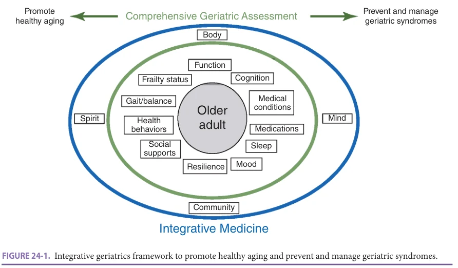
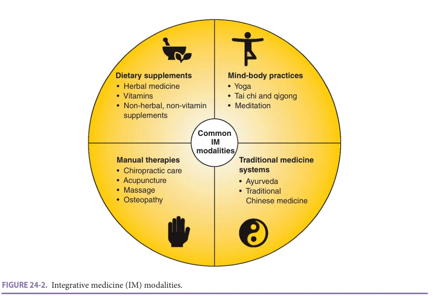
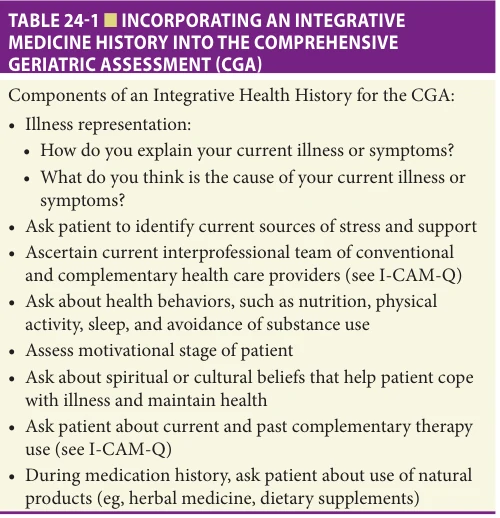
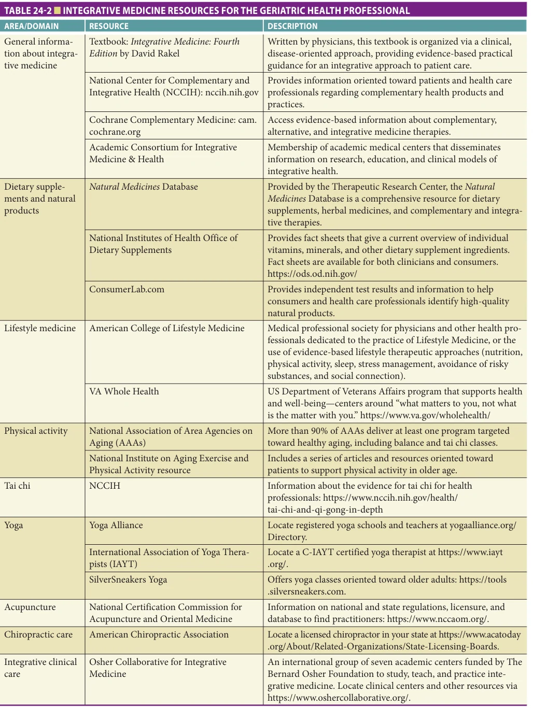
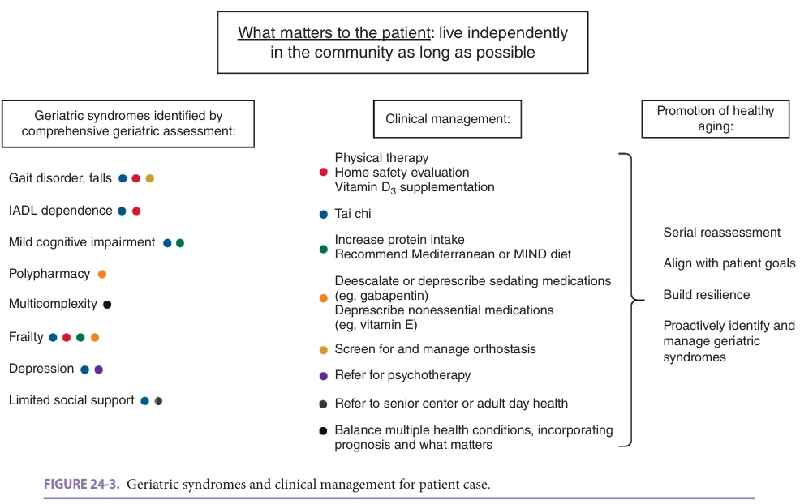

# Hazzard's Geriatric Medicine and Gerontology, 8e - Chapter 24: Integrative Medicine and Health

Julia Loewenthal, Gloria Y. Yeh, Darshan H. Mehta, Peter M. Wayne

> **Status.** Fast build from the book; not lane-reviewed.

> Not cited in the 2020-2026 past papers.

> **Source and method.** Printed pages 329-344, from the marked 8th-edition copy (PDF page = printed page + 34). Prose follows its text layer; tables and figures are source-page crops. The book is canonical.

**[p. 329]**

## INTRODUCTION

The National Center for Complementary and Integrative Health (NCCIH) defines complementary approaches as those that may have originated outside of conventional medicine. Integrative health care brings together both conventional and complementary approaches in a safe, coordinated way. Integrative health emphasizes a holistic, patientfocused approach to health care and wellness. These practices encompass dietary, psychological, and physical approaches, often in multimodal systems. In the past, the NCCIH was known as the National Center for Complementary and Alternative Medicine (NCCAM), but there has been a movement toward integrating complementary therapies with conventional care rather than using them as an alternative, so the term “alternative” has been deemphasized.

#### Learning Objectives

- Define integrative and complementary health approaches and describe current patterns of use among older adults.

- Apply the integrative health history to the comprehensive geriatric assessment.

- Describe integrative modalities (dietary supplements, mindbody practices, manual therapies, and traditional medicine systems), current evidence regarding clinical efficacy, and potential adverse effects.

#### Key Clinical Points

1. Approximately 30% of adults age 65 and over report use of a complementary health approach.

2. Of patients who use a complementary health approach, approximately half do not disclose use to their clinician, though this may be ameliorated by incorporating an integrative health history.

3. Older adults tend to be the highest consumers of herbal and dietary supplements, with nearly 70% taking a supplement in the past 30 days.

4. Mind-body practices encompass a diverse range of practices such as tai chi, yoga, seated meditation, and others; their multimodal nature may explain effectiveness in treating geriatric syndromes (eg, tai chi and fall prevention).

5. Manual therapies, such as acupuncture and chiropractic treatment, are effective in several prevalent conditions among older adults (eg, back pain).

Both integrative and geriatric medicine aim to maximize health across an individual’s life span, including those living with chronic conditions, disabilities, cognitive impairment, and/or frailty. In addition, both fields emphasize the importance of a larger biopsychosocial framework in the provision of clinical care. A common thread between integrative and geriatric medicine is the concept of whole person health. While medical specialization has resulted in the development of life-saving pharmaceuticals and procedures, this reductionist framework can overlook the rich interdependence of systems and factors contributing to whole person health. It is well recognized that social determinants of health and lifestyle behaviors can contribute to disease among multiple organ systems, such as cardiovascular disease and diabetes mellitus. However, there has been less progress made in the development of effective interventions to catalyze recovery from chronic, multisystem diseases, nor strategies that promote resilience and prevent their occurrence. Integrative medicine, by incorporating multimodal conventional and complementary health approaches, is well-situated to maximize whole-person care with the goal of promoting and restoring resilience.

The 2018 American Geriatrics Society White Paper on Healthy Aging stated: “Promotion of a realistic, dynamic, multidimensional view of healthy aging is an important goal obtainable through traditional and innovative models of health promotion and prevention.” Integrative medicine, by

incorporating nonpharmacologic, multimodal approaches, is poised to serve in both the promotion of healthy aging and prevention and management of geriatric syndromes (Figure 24-1). Furthermore, the inherent multimodal

**[p. 330]**

*FIGURE 24-1. Integrative geriatrics framework to promote healthy aging and prevent and manage geriatric syndromes.*

*Owner annotations/highlights are from the marked source copy, not the book.*

approach is well-suited to preventing and managing complex geriatric syndromes, which extend beyond single organ systems and a traditional disease-based approach.

## CURRENT PATTERNS OF USE

For the purposes of this chapter, complementary and integrative modalities are grouped into four major categories (Figure 24-2):

1. Dietary supplements, including herbal medicine, vitamins, and non-herbal, non-vitamin supplements.

2. Mind-body practices, including yoga, tai chi, qigong, and meditation. 3. Manual therapies, including chiropractic care, acupuncture, massage, and osteopathy. 4. Traditional medicine systems, including Ayurveda and Traditional Chinese Medicine (TCM).

The latest data regarding trends in the use of complementary health approaches among US adults comes from the 2012 and 2017 National Health Interview Surveys (NHIS). Approximately 30% of adults age 65 and over

*FIGURE 24-2. Integrative medicine (IM) modalities.*

*Owner annotations/highlights are from the marked source copy, not the book.*

**[p. 331]**

reported use of any complementary health approach in 2012. Older adults tended to use complementary health approaches less often than those aged 18 to 44 or 45 to 64, but consistent increases in use have been observed over time. In 2017, yoga was the most popular approach among all adults, but meditation use was more common among older adults as compared to yoga and chiropractic manipulation. In general, non-Hispanic White adults reported use of complementary health approaches more often than Hispanic and non-Hispanic Black adults.

Reasons for use of complementary health approaches are varied. US adults reported using these approaches most commonly for back and neck pain, joint pain or stiffness, colds, depression, and anxiety. Over half of adults believed complementary health approaches would help when combined with conventional medical approaches. Approximately half of patients who use complementary health approaches did not disclose this to clinicians involved in their care. Reasons for this include clinicians not asking about complementary and integrative health approaches and concerns about clinician knowledge regarding these approaches. Cost is another important factor in use of complementary health approaches, with many adults reporting high out-of-pocket expenditure. This has improved over time for certain modalities: in 2012 60% of adults who saw a chiropractor had some insurance coverage, versus 25% for acupuncture and 15% for massage therapy, but coverage was more likely to be partial than complete. Most recently in 2020, the Centers for Medicare and Medicaid Services finalized a decision to cover acupuncture for low back pain.

### The Integrative Health History

There are several ways clinicians can improve disclosure of complementary therapy use to better care for their patients. An important strategy is to incorporate elements of the integrative health history into the comprehensive geriatric assessment (CGA) including: illness representation, patients’ perceived sources of stress and support, complementary and integrative modality use and history, current health behaviors, and dietary supplement use in the medication history (Table 24-1).

## CLINICAL CASE

Ms. S is an 81-year-old female with history of cerebrovascular accident (CVA) complicated by residual left-sided weakness, atrial fibrillation, heart failure (HF) with preserved ejection fraction, gout, lumbar spinal stenosis, mild cognitive impairment, falls, and depression who presents to the outpatient geriatrics consult clinic. Her goal is to live independently as long as possible. Since her stroke 1 year prior, she has struggled with her gait and ambulates with a rolling walker. She had one fall in the past 6 months and is afraid of falling. She is interested in integrative therapies she could use to improve her health and well-being.

Ms. S reports some fatigue but no other current symptoms. She lives alone in the community. Ms. S is

*TABLE 24-1 ■ INCORPORATING AN INTEGRATIVE MEDICINE HISTORY INTO THE COMPREHENSIVE GERIATRIC ASSESSMENT (CGA)*

*Owner annotations/highlights are from the marked source copy, not the book.*

independent with activities of daily living (ADLs), but requires some assistance for instrumental activities of daily living (IADLs) such as shopping, heavy housework, and driving given physical limitations. She hired a homemaker to assist with cleaning and shopping; she relies on her daughter for transportation. She denies loneliness and reports receiving limited social support from her church group. Her medications include allopurinol, apixaban, atorvastatin, fluoxetine, furosemide, gabapentin, senna, and vitamin E. She drinks one glass of wine on holidays, but otherwise denies substance use. She completed the Timed Up and Go (TUG) test in 15 seconds (≥ 12 seconds suggests increased risk of falls). Gait examination revealed decreased gait speed with uneven stride length and step height, but a normal base and no bradykinesia. Cognitive testing was notable for Montreal Cognitive Assessment (MoCA) score of 24 out of 30. She scored a 7 on the Patient Health Questionnaire-9 (PHQ-9), consistent with mild depression. A frailty screen was consistent with mild frailty.

In addition to tools from conventional medicine, what approaches might you recommend in the clinical care of this patient? How would you make this decision?

## DIETARY SUPPLEMENTS

According to the World Health Organization, the use of herbal and dietary supplements (HDS) in the United States has increased significantly over the past two decades. Older adults tend to be the highest consumers of HDS, with nearly 70% taking an HDS in the past 30 days. Studies consistently show that women use HDS more than men, and family households with greater wealth also use more.

The Dietary Supplement and Health Education Act (DSHEA) was passed in 1994; it defined a dietary supplement as a product (other than tobacco) that is intended

**[p. 332]**

to supplement the diet; that contains one or more dietary ingredients (including vitamins, minerals, herbs or other botanicals, amino acids, and other substances) or their constituents; is intended to be taken by mouth as a pill, capsule, tablet, or liquid; and is labeled on the front panel as being a dietary supplement. Under this law, supplements can be marketed without proof of safety or efficacy if no claim is made for their use in the diagnosis, treatment, cure, or prevention of disease. Manufacturers can, however, make “structure and function” claims that a product enhances a normal body function or state. For example, saw palmetto can be marketed to support urinary tract health but not to treat benign prostatic hyperplasia. In contrast to prescription medications, which must be proven safe, the US Food and Drug Administration (FDA) must first prove that an HDS is unsafe before a product is taken off the market. In 2006, DSHEA was updated so that dietary supplement producers were responsible for reporting serious adverse events related to their products. In 2007, the FDA published current good manufacturing practice guidelines, including requirements for manufacturers to test products to ensure product quality, confirm the absence of some contaminants, verify accuracy of labeling, maintain minimum standards for manufacturing and packing, monitor adverse event reports, and make all records available for FDA inspection. However, these guidelines are nonbinding on the manufacturer. Since 2007, the FDA has increased inspections of HDS manufacturers and enforcement of regulations. In 2019, the FDA reported that they will be updating the regulation of HDS to continue to promote safety, quality, and efficacy.

When approaching the use of HDS in older adults, the clinician should carefully weigh the anticipated benefit of the dietary supplement with the risk of polypharmacy. Approximately half of prescription medication users also use dietary supplements on a regular basis. The number of drugs taken by a patient has been shown to be the single most important predictor of harm, and both drug-drug and drug-supplement interactions must be considered. Therefore, an integrative approach in the older patient should incorporate an assessment of polypharmacy and the practice of deprescribing to prevent harm and maximize health and well-being. Table 24-2 includes resources for clinicians regarding HDS safety.

### Multivitamins

For a discussion of multivitamins, please refer to Chapters 30, Nutrition Disorders, Obesity, and Enteral/Parenteral Alimentation and Chapter 46, Pressure Injuries.

### Vitamin D

Vitamin D is a fat-soluble vitamin that has numerous roles in the body, including bone health, the maintenance of normal serum calcium and phosphate concentrations, reduction of inflammation, and others. Older adults are at risk of vitamin D deficiency because of increased time spent

indoors, reduced synthesis in the skin, and inadequate dietary intake. There is evidence that vitamin D supplements increase bone mineral density and reduce fracture rates in institutionalized older adults. For further information about vitamin D status and falls, please refer to Chapter 43, Falls.

Studies of vitamin D supplements and muscle strength have had inconsistent results. There is mixed evidence regarding vitamin D supplements and cancer prevention. Vitamin D supplements do not appear to help prevent or treat mild depression, but there have not been any studies to date in older adults with vitamin D deficiency who are taking antidepressants. Observational studies have shown an association between vitamin D deficiency and poorer cognition, but it is not clear if there is cognitive benefit from vitamin D supplementation.

### Magnesium

Magnesium is a mineral that is a cofactor in numerous enzyme systems in the body. Supplements are available in many forms, such as magnesium citrate, oxide, and chloride. Older adults are at risk for magnesium deficiency given lower dietary intake and reduced gut absorption with age. However, it is difficult to assess magnesium stores since serum magnesium levels do not necessarily correlate with intracellular or bone stores, which is where most magnesium is stored.

Low magnesium intake is strongly correlated with hypertension, but clinical intervention studies have not demonstrated a consistent benefit. Magnesium supplementation appears to be beneficial in the prevention of migraine. Though magnesium deficiency may be a risk factor for osteoporosis, it is not clear that magnesium supplementation is effective for the prevention and management of osteoporosis. There is some evidence that magnesium is effective for insomnia, stress, and constipation. For a more complete discussion of magnesium for constipation, please refer to the Chapter 87, Constipation.

### Fish Oil

Eicosapentaenoic (EPA) and docosahexaenoic (DHA) acids are the two main omega-3 long-chain polyunsaturated fatty acids that have been extensively studied in the prevention and treatment of cardiovascular diseases. Dietary sources of EPA and DHA include fatty fish, such as salmon, anchovies, and sardines. Despite the large number of studies, the research has produced inconsistent results. The reasons for this are several, including differences in who is being treated, whether or not they are on statins, the formulation used (EPA+DHA or EPA alone), the dose or duration of treatment, the placebo arm (eg, olive oil versus mineral oil), and the end point measured. The recent Omega-3 Fatty Acids in Elderly Patients With Acute Myocardial Infarction (OMEMI) trial found no reduction in clinical events in older patients with recent acute myocardial infarction who were treated with 1.8 g EPA/DHA daily for 2 years.

**[p. 333]**

*TABLE 24-2 ■ INTEGRATIVE MEDICINE RESOURCES FOR THE GERIATRIC HEALTH PROFESSIONAL*

*Owner annotations/highlights are from the marked source copy, not the book.*

**[p. 334]**

In addition, the VITAL trial found that older individuals treated with 840 mg omega-3 fatty acids did not experience a lower incidence of major cardiovascular events or cancer than those treated with placebo in a 5-year follow-up. Two recent meta-analyses and reviews found fish oil slightly reduces risk of cardiovascular disease mortality and events (myocardial infarction, angina, stroke, HF, peripheral arterial disease, sudden death, and nonscheduled cardiovascular surgical interventions) and reduces serum triglycerides. However, with higher doses of EPA+DHA, there may be a reduction in myocardial infarction and coronary heart disease events. Fish oil supplements are relatively low cost and have benign side effect profiles. In addition, given the low drug-drug interactions with other standard therapies used in primary and secondary cardiovascular disease prevention, it is prudent to consider the potential benefits of omega-3 (EPA/DHA) supplementation, especially using 1000 to 2000 mg/d dosages. These levels are rarely obtained in most diets, even those including some routine fish consumption.

Fish oil has been extensively studied in the treatment of depression. Meta-analyses suggest that fish oil may be helpful, although there is quite a bit of debate. There is variability between doses, ratios of EPA to DHA, and other study design issues. The most effective preparations appear to have at least 60% EPA relative to DHA. In older adult populations, a 2018 meta-analysis found mixed findings in studies of fish oil for depression. It appears that doses greater than 1.5 g of EPA/DHA may have benefit. Current large-scale studies are underway and will hopefully inform future guidelines. There is no convincing evidence for the efficacy of fish oil supplements in the treatment of mild to moderate Alzheimer dementia, as well as age-related macular degeneration.

### Coenzyme Q10

Coenzyme Q10, also known as ubiquinone or CoQ10, is endogenously produced and found throughout the body. It functions as a critical cofactor in the production of adenosine triphosphate (ATP), and its reduced form, ubiquinol, acts as an antioxidant. The majority of CoQ10 is in mitochondria where it serves as a critical cofactor in the electron transport chain and thus ATP production. CoQ10 can also be obtained through the diet or as a dietary supplement. Primary dietary sources of CoQ10 include oily fish (such as salmon and tuna), organ meats (such as liver), and whole grains. Most individuals obtain sufficient amounts of CoQ10 through a balanced diet.

As a dietary supplement, it is most well-known for its role in managing statin-associated muscle symptoms. While statins affect cholesterol biosynthesis, they also decrease the biosynthesis of CoQ10. Decreased circulating levels of CoQ10 are hypothesized to cause mitochondrial dysfunction, resulting in muscle pain, weakness, cramps, and tiredness. A 2018 meta-analysis of 12 RCTs found that CoQ10 supplementation decreased statin-associated

muscle symptoms. This finding was independent of administration doses of CoQ10 (100–600 mg/d) or CoQ10 supplementation time (30 days to 3 months). Future studies will need to determine both optimal dose as well as duration of treatment.

CoQ10 supplementation may be beneficial for patients with HF, as HF is believed to be a low energy, reduced functional state due to metabolic alterations that affect both skeletal and cardiac muscle. The 2014 Q-SYMBIO study was one of the largest prospective RCTs of CoQ10 in the management of HF. Patients with moderate to severe HF (with reduced ejection fraction) were randomly assigned to receive either CoQ10 100 mg three times daily or placebo, in addition to standard therapy. At 2 years, there were significant reductions in major adverse cardiac events (ie, death, hospitalization) in patients receiving CoQ10. It was safe and well-tolerated.

CoQ10 has been purported to be beneficial in the treatment and management of numerous other conditions. This includes hypertension, diabetes, obesity, migraines, Parkinson disease, and kidney disease. In general, the data are limited due to heterogeneity in dosage, duration, and trial design.

### Supplements for Memory

Gingko biloba The dried leaf of the ginkgo tree has been used medicinally for thousands of years. Multiple pharmacologically active compounds have been isolated, including flavonoids and terpene lactones, which increase the production of nitric oxide and activate certain central neurotransmitters, which may contribute to gingko’s beneficial effects on memory and cognition. EGb761, the formulation that has been studied most extensively, is standardized to contain 24% flavonoid glycosides and 6% terpene lactones; it is approved by the German Commission E for the treatment of cognitive impairment and intermittent claudication. This was supported by a 2018 meta-analysis of randomized controlled trials studying EGb761 in the treatment of dementia; this study found that 22- to 24-week treatment with a standardized 240 mg EGb761 dose may lead to improvements in behavioral and psychological symptoms of dementia, as well as significant decreases in caregiver distress. In addition, another 2018 review found that this standardized extract also may alleviate tinnitus and dizziness that are often seen as concomitant symptoms in patients with dementia. A 2020 updated review noted that while ginkgo biloba may be able to improve the cognitive function in patients suffering from mild dementia/cognitive decline when given for more than 24 weeks and at appropriate dosage (240 mg per day), there is very little data on the long-term administration. In summary, there are conflicting data on the effect of ginkgo on cognition; however, with the paucity of options in the treatment of mild cognitive decline, ginkgo may be considered an option.

**[p. 335]**

There are theoretical concerns about a risk of increased bleeding because higher antiplatelet activating factor activity has been demonstrated in vitro. Cases of increased bleeding in patients taking ginkgo have been reported, but establishing a causal relationship is challenging because many of these patients had other risk factors including age and medications such as aspirin, NSAIDs, or warfarin. Of note, there have been no reports of bleeding complications in clinical trials. Ginkgo should still be used cautiously in patients with bleeding disorders or who are taking aspirin, NSAIDs, warfarin or other anticoagulants, or other botanicals that may increase the risk of bleeding. Allergic skin reactions, gastrointestinal disturbances, and headaches occur in less than 2% of patients.

Vitamin E Vitamin E is a family of eight different lipidsoluble substances, namely α-, β-, γ-, and δ-tocopherol, and -tocotrienol. Vitamin E acts as a chain-breaking antioxidant, terminating lipid peroxidation. α-Tocopherol is the main vitamin E form found in the human body. It has important roles, including diminishing the rate of oxidative stress—an important component in the pathogenesis of atherosclerosis and nonalcoholic fatty liver disease. Although studies have suggested possible cardiovascular disease benefits, meta-analyses have not substantiated the protective effects of vitamin E. Furthermore, some meta-analyses have suggested increase in all-cause mortality when high doses are used. One reason for this has been the various forms and blends of vitamin E that have been studied. For example, it has been suggested that γ-tocopherol exerts a much more potent antioxidant, anti-inflammatory, and cardioprotective effect than α-tocopherol, the one present in most formulations. In cancer populations, including bladder, prostate, colorectal, and lung cancer, the benefits are inconclusive. Most meta-analyses of individuals with these cancers have found no benefit with vitamin E supplementation. A recent finding from the Women’s Genome Health Study (WGHS, N = 23,294) in which participants received 10-years of alpha-tocopherol in a placebo-controlled trial reported a highly significant gene (COMT) by alpha-tocopherol interaction, such that alpha-tocopherol was beneficial for cancer prevention among rs4680 metallele (28%), but not val-allele (23%) homozygotes. This and other studies suggest the full benefit of HDSs may not be understood until they are evaluated within a precision medicine framework. Studies of the α-tocopherol form of vitamin E in individuals with mild cognitive impairment found that it does not prevent progression to dementia, nor improve cognitive function in people with mild cognitive impairment or dementia due to Alzheimer disease. With the caveat that more research is needed, a 2017 Cochrane review concluded there is some evidence that it may slow functional decline in Alzheimer disease. There appears to be a benefit of α-tocopherol supplementation in nonalcoholic fatty liver disease, in that it improves hepatic steatosis and hepatic inflammation; however, there are inconsistent findings in its ability to improve liver fibrosis. The 2018

practice guidelines of the American Association of Liver Disease recommend 800 IU/d of α-tocopherol for the treatment of biopsy-proven, nondiabetic patients with nonalcoholic steatohepatitis.

### Glucosamine and Chondroitin

Glucosamine and chondroitin are naturally occurring compounds in the body functioning as the principal substrates in the biosynthesis of proteoglycan. They are believed to relieve joint pain and slow the rate of joint destruction and cartilage loss by serving as chondroprotective agents and disease-modifying osteoarthritis drugs. However, the biology of both compounds is poorly understood. Results have been conflicting in clinical trials. This is largely due to differences in study designs and populations of patients, investigator bias, or the use of different drug formulations (eg, glucosamine sulphate vs glucosamine hydrochloride). Despite it being a commonly used dietary supplement, the American College of Rheumatology and the Arthritis Foundation (ACR/AF) do not recommend the use of glucosamine, chondroitin, or a combination product in hand, hip, or knee osteoarthritis. The one exception is chondroitin in the management of hand osteoarthritis, where the ACR/AF has provided a conditional recommendation. This is due to a single trial of chondroitin sulfate, which found improvements in pain in hand osteoarthritis with a daily dose of 800 mg. Glucosamine and chondroitin have been found to have low potential toxicity.

### S-Adenosylmethionine (SAM-e)

S-Adenosyl-L-Methionine (commonly known as SAM-e) is a naturally occurring molecule that owns a chemically reactive methyl group, responsible for several physiological transmethylation reactions. It is ubiquitously present in cells, where it is involved in many cellular functions and takes part in several metabolic pathways—including synthesis of proteoglycans for cartilage along with myelination and synthesis of endogenous anti-inflammatory, neurotrophic, and antioxidant molecules. In addition, it has potential epigenetic effects involving synthesis, repair, and recombination of DNA.

SAM-e has been marketed for the treatment of depression and for other medical conditions such as osteoarthritis, fibromyalgia, liver disease, and migraine headaches. In general, the data are limited in interpretation with reference to high-quality randomized controlled trials. With that being said, there are encouraging results for SAM-e as a monotherapy or as an adjunctive therapy. Moreover, there appears to be clinical consensus that SAM-e may be useful in treatment-resistant depression, especially as an adjunctive therapy. Similarly, SAM-e has been shown to have promise in the treatment of osteoarthritis, with respect to function and pain management; data are sparse, and further studies are needed.

Recommended daily doses of SAM-e range from 200 mg to 1600 mg taken in divided doses, depending upon

**[p. 336]**

the condition for which it is being taken and its severity, and upon the route of administration. Most commonly, SAM-e is administered orally; it has a short half-life, undergoing first-pass effects and rapid metabolism. Oral doses of SAM-e at 1600 mg/d are significantly bioavailable and nontoxic. Because SAM-e is best absorbed on an empty stomach, it should be administered 30 to 60 minutes before meals or 2 hours after meals. One reported but uncommon adverse effect of SAM-e is that it may induce mania in some cases. However, this should be interpreted with caution as individuals may be misdiagnosed with major depressive disorder, when they in fact have bipolar disorder.

### Supplements for Sleep

Melatonin Melatonin is a lipophilic hormone that is an important regulator of circadian and seasonal rhythms. In humans, its primary physiological function is to control sleep-wake cycles and reinforce sleep behavior. Endogenous melatonin is produced by the pineal gland and regulated tightly by visual light cues in the hypothalamic suprachiasmatic nucleus. Production is inhibited during the day and disinhibited at night. In a healthy, normal individual, serum levels start to rise in the evening hours, reaching peak concentration around 2 to 4 am, after which levels decline again until reaching low daytime levels.

Melatonin levels decline with age due to altered hormone regulation and secretion, changes in renal and hepatic clearance, and other neuroanatomical degeneration. The lower peak levels of endogenous serum melatonin may be due to decreased pineal gland melatonin synthesis or pineal gland calcification. Endogenous melatonin synthesis may be further reduced by drugs (eg, benzodiazepines, NSAIDs, and calcium channel blockers). Mean levels of excretion have been shown to be particularly low in multiple, chronic disease states, so that older adults with chronic comorbidities might be especially vulnerable to inadequate melatonin levels and impaired sleep. Studies suggest older adults are prone to disorders related to an altered circadian rhythm, including disorders of cognitive function, delirium, and sleep.

Exogeneous melatonin has been studied in various primary and secondary sleep disorders. It has been shown to induce phase shifts in the circadian pacemaker, synchronizing the sleep–wake cycle and restoring the circadian secretion pattern to normalize levels of melatonin. When administered acutely, it reduces core body temperature and lowers alertness, encouraging sleep propensity. Melatonin may have potential in treating disorders of sleep initiation, sleep maintenance, as well as circadian phase disturbance. In a recent meta-analysis of 12 randomized controlled trials the most convincing evidence was in reducing sleep-onset latency in primary insomnia, delayed sleep-phase syndrome, and regulating the sleep-wake patterns in blind patients compared with placebo. Much of the literature includes patients aged 55 to 80. Ramelteon is a selective melatonin receptor agonist used in the treatment of insomnia. Studies show that ramelteon is effective in improving

sleep latency, sleep efficiency, and subjective total sleep time for individuals with insomnia.

Dose, formula (extended release or fast acting), and timing of administration appear to be important, although not well-studied. There may be decreased effectiveness in patients with neurological deterioration or comorbid clinical disorders such as Alzheimer disease. Other studies report efficacy of melatonin in improving sleep quality in older adults with underlying neurodegenerative disorders. Two studies investigated the treatment of primary insomnia of older people (aged 55+) with melatonin (2 mg 1–2 hours before bedtime orally) and concluded long-term use of melatonin (for 13–24 weeks) is well-tolerated. Initial recommended starting doses of melatonin in older adults are 0.3 to 2 mg of immediate-release formulation melatonin, taken 1 hour before bedtime to best mimic the normal physiological circadian rhythm of melatonin and to avoid prolonged, supra-physiological blood levels; a maximum dose is 9 to 10 mg. Little evidence is available regarding the potential adverse effects of long-term melatonin use. Uncommon side effects potentially include headaches, dizziness, vomiting, and nausea.

Valerian Historically, the therapeutic use of valerian is thought to date back to classical antiquity and the herb is touted as an anxiolytic and sleep aid. It was described by Hippocrates and prescribed by Galen in the second century for insomnia. While there are over 200 valerian species worldwide, Valeriana officinalis L. is the most well-known in Europe and North America. Valerian preparations are available in aqueous or dry hydroalcoholic extracts, or as whole or communitive herbal roots and stems.

Potential mechanisms and sites of action include modulation of GABA receptors and increasing the amount of GABA available in the synaptic cleft. Other sites of action include adenosine A1 receptor activation and serotonin (5-HT5a) receptor signaling. The active ingredient of valerian is not agreed upon, and different constituents including volatile oils like valerenic acid (giving a characteristically unpleasant odor), sesquiterpenes, or valepotriates have been used to standardize valerian extracts. Combination herb preparations have been studied such as valerian-Humulus lupulus (hops), valerian-Melissa officinalis (lemon balm), and valerian-Passiflora incarnata (passion flower).

Several reviews and meta-analyses have been published with inconsistent results and criticism regarding methodological quality. Most recently in 2020, a systematic review of 60 studies of valerian for sleep problems and associated disorders was conducted, with a subgroup meta-analysis on subjective sleep quality (10 randomized controlled trials). This analysis concluded that valerian could be a safe and effective herb to promote sleep and associated disorders. However, inconsistent outcomes may be due to variable quality of herbal extracts and that more reliable effects might be expected from the whole root/rhizome. The safety profile of valerian is good, although some note caution in severe liver disease. Importantly, valerian requires use for

**[p. 337]**

several weeks for effect. In contrast to prescription sedative hypnotics, valerian does not cause psychomotor retardation or impair cognitive performance and is non-habit forming with no reported withdrawal symptoms on discontinuation. A common dose is 300 to 900 mg of standardized extract (0.8% valerenic acid) or 2 to 3 g dried root taken as a tea 30 minutes to 2 hours before bedtime.

### Black Cohosh

Black cohosh (Cimicifuga racemosa or Actaea racemosa), also known as bugbane, black snakeroot, or rattleweed, is a perennial plant from the buttercup family native to Canada and eastern US with a characteristic dark-colored rhizome. The rhizome extracts were traditionally used by Native Americans to treat multiple ailments including menstrual irregularity. Over the past 2 decades, there has been steady interest in black cohosh for the treatment of menopausal symptoms.

The rhizome of black cohosh contains several potential, biologically active constituents (including the triterpene glycosides actein and cimicifugoside, as well as fatty acids, resins, caffeic acids, isoferulic acids, and isoflavones). Black cohosh was originally thought to be a phytoestrogen with its isoflavone component exerting estrogenic effects selectively on the LH receptor; however, recent studies have not consistently demonstrated this. Instead, central neuromodulation through the triterpene glycosides may be the mechanism of action, including dopaminergic effects that oppose prolactin (possibly affecting libido and bone metabolism), serotonergic effects (much like SSRIs widening the thermoregulatory zone for vasomotor symptoms and mood), and GABAergic effects.

While popular among women seeking nonhormonal options, the literature has been inconsistent. A Cochrane review in 2012 reviewed 16 RCTS of peri-/ postmenopausal women using oral mono preparations of black cohosh at a median daily dose of 40 mg for a mean duration of 23 weeks concluded that there was insufficient high-quality evidence to recommend black cohosh in improving frequency or intensity of vasomotor hot flashes, vulvovaginal symptoms, or overall menopause symptoms score (including insomnia, headache, paresthesia, and anxiety). Since then, higher-quality studies have reported improvements in composite menopausal symptoms with black cohosh over placebo. There is significant heterogeneity in studies with regard to herb preparation, but many have standardized to 27-deoxyactein (triterpene glycoside). The most studied commercial product is Remifemin® (contains 1 mg of 27-deoxyactein in one 20-mg tablet, to be taken 1–2 times daily). The herb appears relatively safe with no known medication interactions. The most commonly reported side effects are mild and transient gastrointestinal upset and rashes. Most studies have examined black cohosh use for 6 months or less, so long-term safety is not known. Due to theoretical estrogenic effects, caution should be used in any patient (eg, with history of breast cancer) for which

estrogen therapy would be contraindicated. There has also been a concern raised regarding hepatotoxicity; however, there is little evidence to support an adverse effect on liver function.

### Saw Palmetto

Saw palmetto (Serenoa repens), from the berries of the American dwarf palm tree, is used for symptomatic benign prostatic hypertrophy. Available in multiple formulations including liquid extracts, tablets, capsules, and tea, the active components of palmetto extracts are not well understood but may include phytosterols, volatile oils, and free fatty acids. Purported mechanisms of action include weak inhibition of 5-alpha-reductase and the conversion of testosterone to dihydrotestosterone (DHT), inhibition of DHT binding in prostatic cells, anti-inflammatory effects, and inhibition of fibroblast and epithelial growth factors and induction of apoptosis.

Many earlier, smaller studies showed benefit of saw palmetto for mild to moderate lower urinary tract symptoms such as urinary frequency, nocturia, and dysuria as compared to placebo. Some studies suggested similar effects to finasteride or tamsulosin. Studies were unclear regarding an effect on urinary flow rate, but there is likely no effect of saw palmetto on prostate size or serum prostate specific antigen. The literature overall has been mixed. A 2011 multicenter RCT evaluated escalating doses beyond the standard dose (320 mg per day) up to 960 mg per day did not find that saw palmetto extract was better than placebo in ameliorating lower urinary tract symptoms of BPH. There was, however, also no difference in adverse effects suggesting overall safety. A 2012 Cochrane Review of 32 RCTs also concluded there was no difference between saw palmetto and placebo for BPH symptoms. Most recently, however, a 2018 meta-analysis which evaluated a particular European product of saw palmetto (hexanic extract Permixon®) at the standard dose (320 mg per day) concluded that saw palmetto reduced nocturia and improved flow rate compared with placebo with a similar efficacy to tamsulosin and short-term 5-alpha reductase inhibitors in relieving lower urinary tract symptoms. Other studies have suggested that the efficacy of saw palmetto is enhanced with selenium and lycopene (a common commercial formulation) or may be useful as an adjunct to conventional medication and safe to use in combination.

The usual dosing is 160 mg twice a day with an allowance of 8 weeks therapy to evaluate effects. Side effects are uncommon and mild and may include dizziness, headache, nausea, vomiting, constipation, and diarrhea. Rare case reports of liver enzyme elevations have occurred resembling viral hepatitis with resolution within 1 to 3 months.

## MIND-BODY PRACTICES

Mind-body practices encompass a diversity of interventions including movement-based practices (eg, tai chi, yoga, contemplative dance, Pilates, Feldenkrais) and less

**[p. 338]**

physically oriented practices such as seated meditation. The multimodal nature of these practices, and especially movement-based ones, which coordinate motor, cognitive, and breath training, reflects, their inherent integrative nature, and may explain their effectiveness in treating complex geriatric syndromes such as falls, chronic pain, cognitive decline, and affective disorders, which often involve multiple physiological systems. Here we highlight three of the most evidence-based mind body practices—yoga, tai chi, and meditation—with a focus on application to geriatric conditions.

### Yoga

Yoga is a multicomponent mind-body practice that incorporates physical postures, breath regulation, relaxation practices, and meditative techniques. Yoga has increased in popularity among US adults in recent years, from 9.5% reporting practice in 2012 to 14.3% in 2017. Most of this group were adults age 18 to 44, but interest and practice among older adults are expected to grow given baby boomers’ increased knowledge, acceptance, and access to mind-body practices.

Yoga practice seems to positively impact aging on multiple levels, from cellular stress to improvements in overall physical and mental health. Some small studies have suggested that yogic meditative practice may reduce telomerase activity in dementia care partners. Yoga practices are thought to reduce inflammation by downregulating the sympathetic nervous system response and hypothalamicpituitary adrenal axis, thereby decreasing cytokine release. There have been several studies of the impact of yoga on cardiovascular function, suggesting improved heart rate variability, improved baroreflex responsiveness, and slowing of age-related changes in cardiovascular function. In addition, yoga may increase respiratory muscle strength. However, data are incomplete and variable in these areas.

Beyond the cellular and organ systems levels, yoga positively impacts multiple aspects of physical function in older adults. There are several randomized controlled trials demonstrating improvements in measures such as the timed up and go test, gait speed, chair stand test, 6-minute walk test, functional reach, tests of standing balance, range of motion, flexibility, and muscle strength. These trials were conducted in a variety of populations, including the community, assisted-living facilities, and nursing homes. Interventions consisted of a variety of styles of yoga generally taught one to three times per week over 8 to 24 weeks. There are a few studies that showed improvements in higher level functional outcomes, such as ADLs or the ability to carry heavier objects. In one study yoga practice reduced the number of falls, but this was only seen in within-group analysis and was not significant in the yoga group as compared to an exercise control. In multiple studies yoga practices seem to improve fear of falling.

In terms of cognition, yoga likely has a positive impact, though the evidence is less robust than other areas. In a systematic review and meta-analysis of 12 studies including 912 older adults, about 70% of whom had preexisting

cognitive impairment, yoga was beneficial for memory, executive function, attention, and processing speed. Neuroimaging of long-term versus naïve yoga practitioners has shown thicker gray matter in brains of long-term practitioners, including the hippocampus and those associated with attention, interoception, and sensory processing.

Yoga improves mood and quality of life in older adult populations. There are many randomized controlled trials demonstrating reduced depression and anxiety in older adults after a yoga intervention, and also many that demonstrate benefit for fatigue, quality of life, stress, and emotional well-being. Yoga interventions seem to improve social support, with at least one study demonstrating reduced loneliness.

There is consistent evidence to support the use of yoga for chronic low back pain—a 2017 Cochrane review found low- to moderate-certainty evidence that yoga resulted in small to moderate improvements in back-related function at 3 and 6 months. Many studies also suggest benefit for low back pain in addition to function. The American College of Physicians issued clinical practice guidelines in 2017 recommending yoga as one of many nonpharmacologic treatments to utilize as an initial approach in chronic low back pain (strong recommendation; low-quality evidence).

Adverse effects have been reported from yoga practice, though high-quality data are limited. In one study of approximately 2500 yoga class attendees with a mean age of 58 years, 27% of attendees reported an adverse event. These were mostly muscle and joint pain, followed by dizziness. People over age 70 reported fewer adverse events, but orthostasis was more common in this group as compared to younger participants. There have been case reports of vertebral compression fracture, particularly in postures with flexion or forward folding. There are some postures that should be avoided in certain medical conditions, such as inversions in participants with hypertension or glaucoma.

Clinicians who work with older adults should be aware of some basics of the yoga profession when referring patients. There are many styles and schools of yoga; all typically include an initial focus on physical posture (asana), breath control (pranayama), and sensory withdrawal (pratyhara), then moving to incorporate principles of ethics (yamas and niyamas) and meditation (dharana, dhyana, samadhi). Commonly utilized approaches for older adult populations, with focus on alignment and slower movements, include Iyengar yoga, chair yoga, and restorative yoga. However, most yoga styles can be suitably adapted for the needs of older adults under the guidance of an experienced teacher or therapist.

The majority of yoga teachers have a minimum of 200 hours of yoga teacher training and are typically certified by the Yoga Alliance. However, there is a large range of experience, with some teachers conducting classes right out of training and others having apprenticed with another teacher for many years. Yoga teachers may have additional expertise with specific populations, such as pregnant

**[p. 339]**

women or older adults. Yoga therapists are trained yoga teachers with a minimum of 800 additional hours of yoga therapy school through the International Association of Yoga Therapists. They are trained to work with people with medical conditions in a safe and effective way. A yoga therapy prescription typically looks more like a physical or occupational therapy referral. Older adults who are experiencing more medical complexity and/or geriatric syndromes may benefit from one-on-one work with a trained yoga therapist rather than engaging in a general yoga class conducted by a yoga teacher. Physical and occupational therapists are often knowledgeable about yoga resources in the area and can help guide the patient and clinician in selecting an appropriate path for referral.

### Tai Chi

Tai chi is a multimodal mind-body exercise that originated in Asia, and is growing in popularity in the West, especially among older adults. Data from the 2012 and 2017 NHIS report prevalence of tai chi practice in the United States in the general population at less than 5%, substantially lower than yoga. However, it is thought that these numbers under-report growing use among older adults. Originally developed as a martial art, tai chi integrates training in balance, flexibility, and neuromuscular coordination with multiple cognitive components including heightened body awareness, focused attention, imagery, multi-tasking, and goal-oriented training. This may underlie its benefits to balance, cognition, gait health, and chronic pain, as compared to conventional unimodal exercise. High-quality meta-analyses support that tai chi reduces falls by 20% to 45%, and a Cochrane review concludes it is among the best available exercise options for fall prevention in ambulatory older adults. A recent study reported that a 24-week program of twice a week group tai chi led to a 58% reduction in falls among those at high risk for falls, as compared to a stretching exercise control. There is also sound evidence that tai chi can effectively reduce falls in people with Parkinson disease. Experimental research supports that tai chi reduces falls by positively impacting multiple fall-related risk factors including: reduced lower extremity strength and flexibility, reduced proprioception and postural awareness, poor neuromuscular coordination, impaired executive function, and fear of falling.

In addition to fall prevention, a growing body of evidence supports benefits of tai chi for a range of cardiopulmonary and metabolic issues including chronic HF, hypertension, hyperlipidemia, and COPD. Mixed evidence suggests tai chi training may reduce the risk of stroke. Meta-analyses also support potential cognitive benefits, including improved executive and global cognitive function in older adults that are cognitively intact as well as those with mild cognitive impairment. Evidence for pain conditions including knee osteoarthritis and chronic neck and back pain is also promising, and recent studies have begun to specifically evaluate the benefits of tai chi for

chronic and multisite pain conditions specific to older and frail adults.

Tai chi is a safe and adaptable exercise, including for frail older adults. A 2014 systematic review including 153 RCTs concluded tai chi is unlikely to result in serious AEs, but it may be associated with minor musculoskeletal aches and pains. However, poor and inconsistent reporting of AEs limits the conclusions that can be drawn regarding the safety of tai chi. A 2019 review (256 RCTs) with an embedded meta-analysis (24 RCTs) also reported higher levels of minor AEs typical of any exercise program. Subgroup analyses in HF patients reported significantly more serious AEs for inactive control interventions compared with tai chi.

Community-based tai chi programs for fall prevention have been shown to be scalable, effectively implementable, and cost-effective. The majority of successful programs have included group based classes that meet 2 times per week over a period of 3 to 6 months. There are no national standards for tai chi instructor certification, and programs can vary considerably. Similar to yoga, there are many styles and forms of tai chi available. However, they all share common principles and typically include core elements of body awareness and mindful movement. A common approach for older adults is Yang style tai chi, although most programs can be adapted for older adults who are deconditioned or have other physical limitations. Practical considerations when looking for a class include: experience of instructors, program focus (health vs martial applications), and accessibility. For individuals with significant health concerns, choosing teachers with experience teaching in a health care setting or formal training (eg, physical therapists, nurses, physicians) is suggested. Observing a single class and talking with others already enrolled in any given program before formally enrolling is advisable.

Tai chi has reportedly been associated with improved exercise self-efficacy. In combination with its safety and adaptability to many conditions, it has been proposed as an excellent “gateway exercise” for sedentary or deconditioned adults wanting to become more physically active.

### Meditation

Meditation is a broad term that incorporates features of self-regulation, awareness, attention, and presence that is typically cultivated through an intentional practice. It has increased tremendously in popularity. Compared to the 2012 NHIS, the 2017 NHIS survey noted that there was nearly a fourfold increase in the use of meditation (4.1%– 14.2%). Meditation practices can be broadly categorized as focused attention and open monitoring practices. Focused attention practices, which improve concentration abilities, involve focusing one’s full attention on a designated object of meditation, such as one’s breath. When it is noticed that the mind has wandered from this object, attention is returned to the object. Training the mind, beginning with this basic exercise, has many effects including relaxation, metacognition, cognitive flexibility, uncoupling of painful physical sensations from maladaptive cognitive patterns,

**[p. 340]**

and revelation of previously subconscious content. In open monitoring practices, the individual improves the ability to monitor the contents of experience without any reactions or judgments. This can include other aspects of human experience, such as physical sensations (eg, pain) or mental and emotional states (eg, anxiety). In lay contexts, the word “mindfulness” is often interchanged with or joined to “meditation.” This reflects the ambiguity in the interpretation of these words as well as their cultural origins.

There have been extensive cardiac, respiratory, metabolic, endocrine, and neurological studies of individuals during meditation. Though much remains unknown, it is clear that meditation involves modulation of the autonomic nervous system as well as the hypothalamic-pituitary-adrenal axis, as originally demonstrated in the late 1960s and early 1970s by Dr. Herbert Benson. At the physiologic level, studies of meditation have found effects on the immune system (reduction in pro-inflammatory cytokines), nervous system (enhanced cortical thickness in specific brain regions; neuroplastic changes in the anterior cingulate cortex, insula, temporo-parietal junction, and fronto-limbic network), and endocrine system (reduced cortisol levels). There are also epigenetic changes seen including telomere length and gene expression. From a psychological perspective, it is thought that meditation enables a stable field of awareness around one’s emotions, thoughts, and physical sensations, without reactivity.

In health care settings, one popular application of mindfulness meditation is the mindfulness-based stress reduction (MBSR) program. Originally developed by Jon Kabat-Zinn, this program and its derivatives have been extensively studied in patient populations. It is an 8-week program that introduces mindfulness practice (with Buddhist origins) in a secular, practical form to participants in the context of their life circumstances. This program is intended to create a deliberate, sustained, nonjudgmental way of paying attention to one’s experience in order to enhance self-awareness, change maladaptive thinking, increase the capacity for skillful response to challenges, and reduce suffering. There are now thousands of MBSR programs in the United States and other countries. A close derivative of MBSR, mindfulness-based cognitive therapy (MBCT), was developed exclusively for people with recurrent major depression and has been widely applied to other psychiatric populations.

Meditation-based interventions (MBI) have been found to be useful in the comprehensive treatment of anxiety and depression, along with stress-related conditions. A recent meta-review of meta-analyses supports the notion that MBIs hold promise as evidence-based adjunctive treatments in a wide range of mental disorders. MBIs show efficacy in treating common cancer-related side effects, including nausea and vomiting, pain, fatigue, anxiety, and depressive symptoms, and improving overall quality of life. A 2020 meta-analysis found that mindfulness-based interventions were associated with reductions in anxiety

for at least 6 months after the intervention in adults with a cancer diagnosis. Finally, in individuals with hypertension, meta-analyses have found that meditation can significantly reduce systolic and diastolic blood pressures by 7 mmHg and 4 mmHg, respectively. In subgroup analyses, these findings are particularly striking in patients over age 70. There is a fair amount of heterogeneity in the results; however, they continue to be statistically significant and clinically relevant. Many studies are limited by small numbers, heterogeneous design, and varied clinical outcomes. In addition, it is often unclear as to how adherent individuals are to the prescribed protocols. In meta-analyses very few adverse events have been reported. In summary, meditation can be thought of as a safe intervention, that can be used in a variety of medical conditions that have a stress-related component. While it may not be a primary treatment option in isolation, it can be used effectively as an adjunctive treatment as a part of an overall multidimensional treatment in any chronic medical condition.

## MANUAL THERAPIES

### Chiropractic Care

Chiropractic is a nationally licensed health care profession that focuses on the relationship between spinal function and general health. The profession was first recognized for its use of manually applied spinal manipulative therapy (SMT) in the treatment of musculoskeletal, as well as many nonmusculoskeletal, disorders. In fact, the word “chiropractic” comes from the Greek words cheir (meaning “hand”) and praktos (meaning “done”), ie, done by hand. In addition to manually applied therapies, chiropractors administer soft tissue manipulation, recommend lifestyle changes, engage their patients in rehabilitation and fitness coaching, and provide nutritional counseling. The 2017 NHIS survey reported that 9.5% of adults in the United States over age 65 used chiropractic in the prior 12 months. Back and neck pain were the most prevalent conditions treated by chiropractors.

A significant body of research has focused on one component of chiropractic treatment, spinal manipulation, for a number of conditions ranging from back, neck, and shoulder pain to carpal tunnel syndrome, fibromyalgia, and headaches. Low back pain has received the most research attention and spinal manipulation appears to benefit some people with this condition. The 2017 clinical practice guidelines issued by the American College of Physicians strongly recommended spinal manipulation, based on low-quality evidence, as initial treatment for patients with chronic lowback pain. A systematic review supporting the 2017 clinical practice guidelines for low back pain evaluated 32 randomized controlled trials involving more than 6000 participants and found modest, short-term effects on pain.

The benefit of chiropractic for chronic neck pain is less clear. A 2015 Cochrane review of 51 randomized controlled trials involving a total of 2920 participants concluded

**[p. 341]**

that there is some evidence to support the use of thoracic manipulation versus another active control for neck pain, function, and quality of life; however, results for cervical manipulation and mobilization are few and diverse. There is some evidence to suggest that multiple cervical manipulation sessions may provide better relief of pain and improvement in function than certain medications at immediate-, intermediate-, and long-term follow-up. Because there is risk of rare but serious adverse events for cervical manipulation, more rigorous research is needed on manually applied therapies, and comparing mobilization and manipulation versus other treatment options. There are no high-quality studies that investigate the full scope of chiropractic care for neck pain and the aforementioned studies focus only on one component of chiropractic treatment.

Data on the benefits of chiropractic care for back and neck pain in older adults specifically is more limited. One trial in older adults over age 65 with chronic mechanical neck pain found that SMT combined with home exercise (HE) resulted in greater pain reduction after 12 weeks of treatment compared with both supervised rehabilitative plus HE and HE alone. A follow-up study including older adults with back and/or neck pain that compared a short (12 weeks) versus long (36 weeks) course of combined SMT and supervised rehabilitative exercise (SRE) concluded that extending management with SMT and SRE from 12 to 36 weeks did not result in any additional important reduction in disability; however, long-term management led to greater improvement in neck pain, self-efficacy, and functional ability and balance. Systematic adverse event monitoring in both studies revealed that no serious adverse events related to interventions occurred. However, nonserious musculoskeletal adverse effects were commonly related to SMT and exercise interventions. The authors concluded that these adverse effects may be regarded as normal reactions to SMT and exercise and should be anticipated and discussed by care providers with their patients. With respect to cervical manipulation, some studies have reported associations between chiropractic care and cervical artery dissection, a rare but serious event. However, the causal nature of this relationship has not been established and is questioned by other studies, which have reported associations between cervical artery dissection and primary care practitioner visits and biomechanical studies which demonstrated that cervical manipulation causes significantly less arterial strain than normal range of motion.

### Acupuncture

Acupuncture is a therapy in which practitioners stimulate specific points on the body, usually by inserting thin needles through the skin. Acupuncture has origins in TCM, a holistic healing system that includes diet, herbal remedies, mind-body therapies (tai chi and qigong), massage, and acupuncture. From a traditional perspective, acupuncture is based on a system of acupoints, channels and meridians, and flow of vital energy (qi). Within biomedicine, clinical

efficacy of acupuncture as well as biological basis and mechanisms of acupuncture have been studied extensively. In terms of acupuncture mechanism, there is no unified theory, although the neural model, most salient for acupuncture analgesia, is most common. Basic science research first reported that acupuncture stimulates the secretion of the endogenous opioid endorphin. Since that first discovery in the 1970s, a multitude of studies have continued to elucidate central and peripheral networks engaged with acupuncture, including those that affect serotonergic and dopaminergic systems, and influence nociceptive pathways and release of interleukins, adenosine, and substance P. For musculoskeletal pain, myofascial stretch, microinjury, increased local blood flow, and facilitated healing may be involved.

Acupuncture has modest evidence of efficacy for treatment or rehabilitation in a wide range of conditions; however much of the literature is inconsistent and has been limited by methodological challenges, including appropriate controls and acupoint specificity. For example, acupuncture may be a useful adjunct to stroke rehabilitation. Preclinical studies have suggested neurogenesis as a mechanism of acupuncture in ischemic stroke. Systematic reviews and meta-analyses of randomized controlled trials have reported that when added to standard stroke rehabilitation, acupuncture may impact balance function, reduce spasticity, increase muscle strength, and general well-being.

The most robust evidence base has been in acupuncture for pain management. From 1991 to 2009, there were almost 4000 studies of acupuncture, 41% of these for pain conditions. With the opioid epidemic and interest in nonpharmacological approaches to chronic pain, the number of studies has continued to grow. In an individual participant data meta-analysis in 2018 (N = 20,827 patients from 39 trials), investigators concluded that acupuncture is effective for the treatment of chronic musculoskeletal, headache, and osteoarthritis pain. Treatment effects of acupuncture persist over time and have effects above what is seen with placebo. Referral for a course of acupuncture treatment is a reasonable option for a patient with chronic pain. Several other reviews support the use of acupuncture for chronic low back pain. In 2020, the Centers for Medicare and Medicaid Services began coverage for acupuncture services for chronic low back pain.

Most states require a license, certification, or registration to practice acupuncture, and the vast majority of practitioners receive diplomas from the National Certification Commission for Acupuncture and Oriental Medicine for licensing. Some conventional medical practitioners— including physicians and dentists—also practice acupuncture. Practitioners can be identified through national acupuncture organizations, or through referral from physicians and allied health providers. A growing number of hospitals and medical centers now offer acupuncture services, often integrated within pain clinics and oncology programs. The typical course of treatment can vary with conditions, but for common pain conditions, can include 12 to 15 treatments over a 6 to 8 week period.

**[p. 342]**

## TRADITIONAL MEDICINE SYSTEMS

### Ayurvedic Medicine

Ayurveda is the traditional medical system originating from the Indian subcontinent. The practice and education around Ayurvedic medicine were based upon ancient writings that promoted integration between diet, lifestyle, and stress reduction (including meditation and yoga). It is one of the world’s oldest medical systems. In India, the practice of Ayurvedic medicine is considered part of the health system, and the education and practice of Ayurvedic medicine regulated is under the Ministry of AYUSH. Diagnoses and evaluation in Ayurvedic medicine are made using a systems-based interpretation through an intrinsic understanding of many factors involved in disease manifestation. This includes a constitutional evaluation as well as pathogenic factors, season, and a patient’s entire course of action (diet, drug, and regimen compatible with the constitution) for the expression of the disease. An Ayurvedic clinical examination includes diagnostic methods through inspection, interrogation, and palpation. Ayurvedic treatment combines products (mainly derived from plants, but may also include animal, metal, and mineral), diet, exercise, and lifestyle. In the United States, there are practitioners of Ayurvedic medicine, along with schools and training programs; however, it is presently not an independently licensed profession.

Research in Ayurvedic medicine is limited to studies of individual herbs (eg, turmeric, ashwagandha); there are very few studies looking at it from a systems perspective. Of specific note, some Ayurvedic preparations include metals, minerals, or gems. Previous studies have shown that about one in four supplements tested had high levels of lead and almost half of them had high levels of mercury. The US Food and Drug Administration warns that the presence of these metals in some Ayurvedic products makes them potentially harmful.

### Traditional Chinese Medicine

Traditional Chinese medicine (TCM) approaches include acupuncture, herbal medicine, moxibustion, and tai chi/ qigong. Acupuncture and herbal medicine are two of the most commonly used integrative medicine therapies. While these therapies are covered elsewhere (ie, acupuncture, tai chi), TCM is a systems-based theory that integrates relationships between symptoms, as well as the human body’s relationship with the natural environment. TCM practitioners will discern overall physiological and/ or pathological patterns of the human body in response to a given internal and external condition. This is usually a pronouncement of internal disharmony defined by a comprehensive analysis of the clinical symptoms and signs gathered by a practitioner using inspection, auscultation, olfaction, interrogation, and palpation of the pulses.

In the United States, the National Certification Commission for Acupuncture and Oriental Medicine is the

certification body that many states use to credential TCM practitioners. Often times, these may be individuals who are also licensed acupuncturists. In many states, the scope of practice for an acupuncturist can include the disbursement of herbal medicines.

Research for herbal medicines used in TCM is increasing. There is promise in TCM in part due to its theoretical framework around holism. Similar to Ayurveda, patient treatments are individualized through reinforcement of the body’s immunity, elimination of pathogenic factors, and improvements in innate healing capacities. However, there have been TCM preparations that have been found to be adulterated as well as mislabeled. That is, they contain genetic material from animals or plants that were not listed on the packaging. Certain herbs have had serious health consequences. The most notable ones have been ma huang, or ephedra, and Aristolochia, or birthwort. Ephedra, which was marketed as a weight loss medication, was banned by the FDA, as it was associated with sudden cardiac death. Aristolochia plants contain aristolochic acid, which is a powerful nephrotoxin and human carcinogen associated with chronic kidney disease and bladder cancer.

Traditional Chinese Medicine has shown some promise in the treatment of temporomandibular disorders. In one study women ages 25–55 with temporomandibular disorders were randomized to receive TCM versus specialty care. Those who received TCM experienced greater reductions in facial pain, an effect that was sustained at 3 months.

## CONCLUSION

Integrative medicine utilizes both complementary and conventional health approaches to optimize care of the whole person. In the case of Ms. S, several geriatric syndromes or issues were identified: gait disorder and falls, functional dependence, mild cognitive impairment, polypharmacy, multicomplexity, frailty, depression, and limited social support. Figure 24-3 summarizes the approach to management by the interdisciplinary geriatrics team where each of the eight recommended management approaches is linked via the colored dots to the syndrome it addresses. A mindbody movement-based practice could be considered. In this case, the integrative modality tai chi was recommended given potential benefits for multiple geriatric syndromes, including gait disorder and falls, functional dependence, mild cognitive impairment, frailty, depression, and social support. In addition, the evidence regarding vitamin E was discussed and the patient decided to discontinue her supplement. Omega-3 fatty acid supplements were discussed as an option, but since the patient met criteria for polypharmacy, she elected not to start taking them at this time. By incorporating multimodal and noninvasive approaches, integrative medicine is poised to play a major role in the promotion of healthy aging and prevention and management of geriatric syndromes.

**[p. 343]**

*FIGURE 24-3. Geriatric syndromes and clinical management for patient case.*

*Owner annotations/highlights are from the marked source copy, not the book.*

## FURTHER READING

Abdelhamid AS, Brown TJ, Brainard JS, et al. Omega-3

fatty acids for the primary and secondary prevention of cardiovascular disease. Cochrane Database Syst Rev. 2020;3(2):CD003177. Clarke TC, Barnes PM, Black LI, Stussman BJ, Nahin RL.

Use of yoga, meditation, and chiropractors among U.S. adults aged 18 and over. NCHS Data Brief, no 325. Hyattsville, MD: National Center for Health Statistics. 2018. Clarke TC, Black LI, Stussman BJ, Barnes PM, Nahin RL.

Trends in the use of complementary health approaches among adults: United States, 2002–2012. National Health Stat Report; no 79. Hyattsville, MD: National Center for Health Statistics. 2015. Food and Drug Administration. Dietary supplements,

overview of dietary supplements and FDA’s role in regulating them. 2019. Available at: https://www.fda.gov/ food/dietary-supplements. Accessed April 7, 2021. Frank J, Kisters K, Stirban OA, et al. The role of biofactors

in the prevention and treatment of age-related diseases. BioFactors (Oxford, England). 2021;47(4):522–550. Gahche JJ, Bailey RL, Potischman N, Dwyer JT. Dietary

supplement use was very high among older adults in the United States in 2011–2014. J Nutr. 2017;147(10): 1968–1976.

George M, Avila M, Speranger T, Bailey HK, Silvers WS.

AAAAI Work Group Report: Conducting an Integrative Health Interview. J Allergy Clin Immunol Pract. 2018;6(2): 436–439.e3. Jou J, Johnson PJ. Nondisclosure of complementary and

alternative medicine use to primary care physicians: findings from the 2012 National Health Interview Survey. JAMA Intern Med. 2016;176(4):545–546. Khalsa SBS, Cohen L, McCall T, Telles S. The Principles and

Practice of Yoga in Healthcare. New York, NY: Sage. 2016. Kolasinski SL, Neogi T, Hochberg MC, et al. 2019 American

College of Rheumatology/Arthritis Foundation Guideline for the Management of Osteoarthritis of the Hand, Hip, and Knee. Arthritis Care Res. 2020;72(2):149–162. Li F, Harmer P, Fitzgerald K, et al. Effectiveness of a thera-

peutic tai ji quan intervention vs a multimodal exercise intervention to prevent falls among older adults at high risk of falling: a randomized clinical trial. JAMA Intern Med. 2018;178(10):1301–1310. Liu H, Ye M, Guo H. An updated review of randomized

clinical trials testing the improvement of cognitive function of ginkgo biloba extract in healthy people and Alzheimer’s patients. Front Pharmacol. 2020;10: 1688.

**[p. 344]**

Maiers M, Bronfort G, Evans R, et al. Spinal manipulative

therapy and exercise for seniors with chronic neck pain. Spine J. 2014;14(9):1879–1889. Mortensen SA, Rosenfeldt F, Kumar A, et al. The effect of

coenzyme Q10 on morbidity and mortality in chronic heart failure: results from Q-SYMBIO: a randomized double-blind trial. JACC Heart Fail. 2014;2(6):641–649. Okereke OI, Reynolds CF, Mischoulon D, et al. The VITamin

D and OmegA-3 TriaL-Depression Endpoint Prevention (VITAL-DEP): Rationale and design of a largescale ancillary study evaluating vitamin D and marine omega-3 fatty acid supplements for prevention of latelife depression. Contemp Clin Trials. 2018;68:133–145. Quandt SA, Verhoef MJ, Arcury TA, et al. Development

of an international questionnaire to measure use of complementary and alternative medicine (I-CAM-Q). J Altern Complement Med. 2009;15:331–339. Rutjes AWS, Nüesch E, Reichenbach S, Jüni P. S-Ade-

nosylmethionine for osteoarthritis of the knee or hip. Cochrane Database Syst Rev. 2009;2009(4):CD007321.

Scott IA, Hilmer SN, Reeve E, et al. Reducing inappropri-

ate polypharmacy: the process of deprescribing. JAMA Intern Med. 2015;175(5):827–834. Sherrington C, Fairhall NJ, Wallbank GK, et al. Exercise for

preventing falls in older people living in the community. Cochrane Database Syst Rev. 2019;1(1):CD012424. Vancampfort D, Stubbs B, Damme TV, et al. The efficacy of

meditation-based mind-body interventions for mental disorders: A meta-review of 17 meta-analyses of randomized controlled trials. J Psychiatr Res. 2021;134:181–191. Vickers AJ, Cronin AM, Maschino AC, et al. Acupuncture

for chronic pain: Individual patient data meta-analysis. Arch Intern Med. 2012;172:1444–1453. Wieland LS, Skoetz N, Pilkington K, et al. Yoga treatment

for chronic non-specific low back pain. Cochrane Database Syst Rev. 2017;1(1):CD010671. Witt CM, Chiaramonte D, Berman S, et al. Defining health

in a comprehensive context: a new definition of integrative health. Am J Prev Med. 2017;53(1):134–137.
