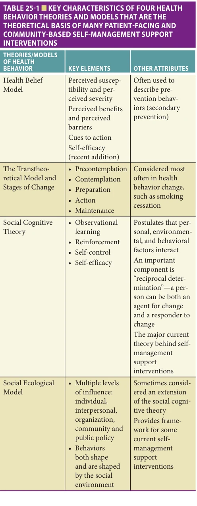
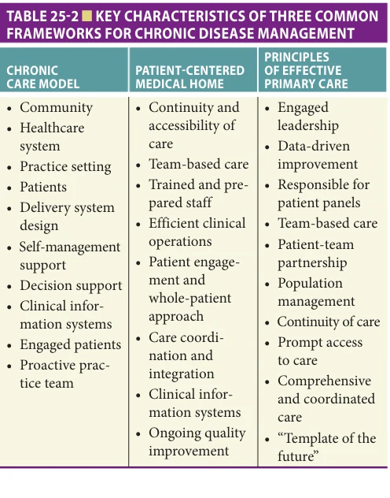
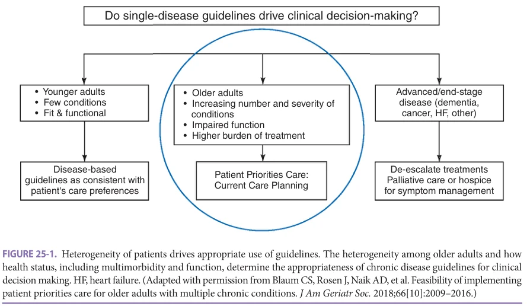
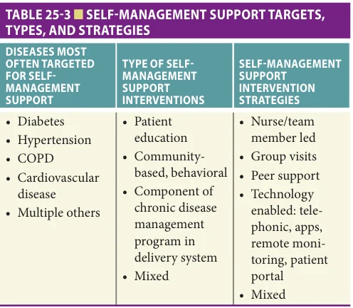
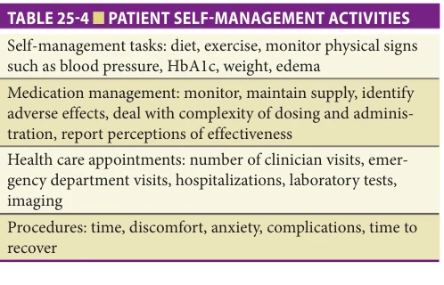
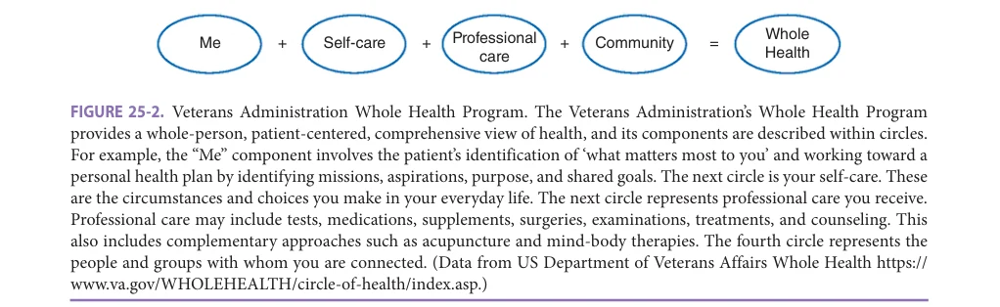
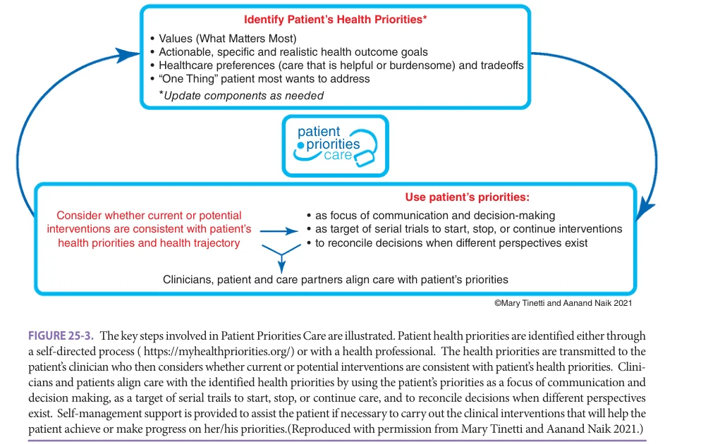

# Hazzard's Geriatric Medicine and Gerontology, 8e - Chapter 25: Patient-Centered Management of Chronic Diseases

Caroline S. Blaum, Aanand D. Naik

> **Status.** Fast build from the book; not lane-reviewed.

> Not cited in the 2020-2026 past papers.

> **Source and method.** Printed pages 345-360, from the marked 8th-edition copy (PDF page = printed page + 34). Prose follows its text layer; tables and figures are source-page crops. The book is canonical.

**[p. 345]**

## INTRODUCTION

Chronic conditions are the major causes of morbidity and mortality among adults in developed countries, as well as the major drivers of health care utilization and cost. In 2020, COVID-19 for a short time was the third leading cause of death in the United States. It affected all-cause death rates and lowered life expectancy. A major risk for severe COVID-19 disease and death, along with advanced age, was the presence of chronic conditions. The management of chronic conditions has been the major focus of health care in the United States for decades, with the goals of preventing the worsening of a chronic disease, decreasing development of related chronic diseases, mitigating associated functional impairment and disability, and decreasing health care utilization and costs. As people age, they confront an increasing number and complexity of chronic conditions and disabilities. Nearly two-thirds (65%) of adults older than age 65 live with MCC, and an estimated 171 million Americans will have MCC by 2030.

#### Learning Objectives

- Understand the heterogeneity of older adults and how chronic disease self-management and self-management support approaches differ depending on patients’ health status and clinical complexity, and why self-management and self-management support based on single-disease clinical practice guidelines have limitations in people with multiple chronic conditions (MCC) and complex health status.

- Acquire a basic foundation in (1) behavioral concepts underlying patient self-management and self-management support interventions; (2) types of self-management support interventions, including newer technology-based strategies; and (3) the evidence base for different models of self-management support.

- Recognize the paradigm shift in the concepts of self-management of multimorbidity for people with MCCs and/or complex health status that involves patients/care partners engaging and partnering in their care and articulating their health outcomes goals and preferences, and clinicians aligning clinical decision making with patients’ goals and preferences.

#### Key Clinical Points

1. People living with chronic diseases must “self-manage” these diseases every day. Self-management support for these patients is a key component of clinical chronic disease management.

2. Behavioral health theories and chronic disease management models are the basis of many self-management support interventions. Much research has investigated self-management support for chronic diseases, especially diabetes, hypertension, COPD, and heart diseases, and there are many high-quality systematic reviews in the literature that demonstrate improvements (Continued)

For people with chronic conditions, the vast majority of their health care management is done by them in their homes. Even when people have MCC and see many clinicians sometimes many times a month, they still spend the vast majority of their time at home, and are implementing recommended clinical interventions by themselves, or with a family member or care partner, in their homes. Clinicians, researchers, and policy makers have long recognized that patients should not be left alone in their self-management efforts. Self-management support is now understood to be an important component of ongoing clinical care and that achieving good outcomes of chronic disease management depends on patients’ engagement and partnership in their care. Clinicians, practices, and the health system have roles in assuring that patients and their care partners can self-manage chronic diseases. Because self-management support was not historically considered clinical care, it is only beginning to be reimbursed by payers. Now because it is understood to be central to the management of chronic diseases care, it is often a component of value-based payment models and some self-management support interventions (eg, diabetes education) are reimbursed.

The basic premise of patient self-management and self-management support is that self-management

**[p. 346]**

in outcomes related to self-management support.

3. However, there is minimal evidence upon which to base chronic disease management among people who have MCC and therefore self-management. People with MCC are not generally included in the studies that provided the evidence. Adherence to disease-specific guidelines may not improve care for patients with MCC and may sometimes cause harm.

4. Self-management support for patients with MCC must be part of a comprehensive approach involving identification of care that matters to these patients and clinical decision making and care plans that provide such care.

5. Patient Priorities Care (PPC) and VA Whole Health are examples of care approaches for older adults with MCC that base care on what matters to patients, and incorporate self-management support within a comprehensive, team-based, whole person approach to care.

is guided by disease-specific guidelines, often based on treatment randomized controlled trials (RCTs) that most often did not include older adults, people with multimorbidity, or people with complex health status. Therefore, clinical management based on these guidelines may not apply to the many older adults with MCC, frailty, or serious, life-limiting conditions. This chapter will explore the complex landscape of chronic disease self-management and self-management support in older adults through the lens of the heterogeneity of the older population. Many older adults are healthy and functional, while some are experiencing severe, life-limiting conditions. There is a big middle group who are accumulating or already have MCC and functional or cognitive impairments and disabilities. Self-management and self-management support interventions, and the clinical paradigms behind them, differ with health status complexity.

This chapter will review foundational behavioral concepts related to self-management of chronic diseases, and how both behavioral theory, and system-based concepts of chronic disease management, have been used to develop, implement, and evaluate disease-specific self-management support interventions.

Finally, it has long been recognized that establishment of a collaborative relationship between clinicians and patients is critical to successful health care. Collaborative and trusting relationships are assuming an even more

central place in clinical care as shared decision making and goal-directed care become more prominent ways to sort out the complexity of clinical decision making in patients with multimorbidity. Longstanding health care disparities and inequities in access and quality of health care, broader social determinants of health, and increasing social isolation of many older people can complicate trusting relationships between clinicians and patients, further impeding chronic disease self-management. This chapter will explore what is known about disparities in self-management and self-management support.

### Self-Management and Self-Management Support—Definitions and Key Concepts

Many definitions of self-management of chronic diseases can be found in the literature. It can be defined as patients having the knowledge and skills to accomplish needed tasks to manage their chronic disease on an ongoing, day to day basis; “day to day management of chronic conditions by individuals over the course of an illness”; or “the practice of activities that individuals initiate and perform on their own behalf in maintaining life, health, and well-being, developing the skills needed to decide, implement, evaluate, and revise an individualized plan for lifestyle change.” Lorig and Holman have described self-management as including six key competencies: (1) problem solving; (2) decision making; (3) resource utilization; (4) development of a patient/provider relationship; (5) self-tailoring; and (6) taking action. In this theoretical model, they described three self-management tasks: medical management, emotional management, and role management. Through competencies in these tasks, patients can address aspects of chronic disease management that require self-care, such as attention to appropriate diet and exercise, monitoring and taking medications, doing physiological and clinical activities to monitor effectiveness of management and progress of disease (eg, self-monitoring of weight or blood pressure), getting laboratory, imaging, or other clinical tests, going to their physician or other clinical appointments, and communicating with family, caregivers, and clinicians. Competency in these tasks can improve self-efficacy, or the confidence a patient has in managing a chronic disease and dealing with any problem or barriers that arise. Embedded in these ideas of self-management and self-management support is a collaborative relationship between clinicians and patients. Old “top down” ideas such as compliance with treatment imply that the patient is a passive participant in their health care. Patients need to be partners in their care for effective chronic disease self-management.

Self-management of chronic diseases is generally distinguished from related concepts that are also quite relevant to the older population such as wellness and self-care. “Wellness” is when a person engages in activities that promote general health such as exercise and healthy nutrition, not necessarily in response to a chronic illness or an identified personal risk of

**[p. 347]**

a chronic illness. Self-care is a term for activities that improve quality of life and well-being, such as taking a vacation, meditating, or seeking social engagement. One way to conceptualize how people’s behaviors interact with health and disease is to use the public health framework of primary, secondary, and tertiary prevention. This framework is well-established, although its relationship to management of chronic conditions can sometimes be interpreted in different ways. A common interpretation is that primary prevention occurs before there are any risks or symptoms and signs of disease. Wellness and self-care behaviors would fit into this category. Secondary prevention addresses risks for chronic diseases, such as smoking cessation, or weight loss to prevent diabetes. Because some conditions (ie, hypertension) can be risks for other diseases, secondary prevention is sometimes invoked in management of these conditions, and patient behaviors addressing secondary prevention are also often termed “self-management.” There are many interventions designed to support people in these activities. Some of the behavioral theories discussed below are also relevant to secondary prevention behaviors. However, this chapter concerns self-management of chronic diseases and will not review the extensive literature related to secondary prevention activities. Self-management of chronic disease(s) generally fits into tertiary prevention, defined as management to alleviate symptoms and prevent complications and/or worsening of chronic diseases that already are clinically evident.

Improving patients’ competencies in chronic disease self-management through self-management support is an important strategy to improve patient outcomes related to chronic diseases, such as improved symptoms, quality of life, and prevention of complications. Self-management support can be considered as a group of tools and techniques that the clinician and/or the health care system can use to support patient self-management. These tools are more than just didactics and education about chronic disease; these tools help patients acquire the competencies and the confidence to handle their condition. Self-management support is sometimes applied to supportive interventions for lifestyle change, such as smoking cessation, weight loss, or increasing physical activity/exercise. The extensive literature on such interventions is beyond the scope of this chapter. Self-management support approaches for substance use are also important interventions and highly relevant to the older population. These are covered in Chapter 23.

### Theoretical Frameworks for Self-Management and Self-Management Support

Ideas around self-management and self-management support interventions are grounded in two major theoretical frameworks, health behavior theories and models, and models for improving chronic disease management quality and outcomes. Self-management of disease is health behavior, and many clinicians and scholars have

considered why people may or may not engage in chronic disease self-management, and how behavioral theory can be applied to enhance patient self-management through self-management support interventions. It is known that self-management of disease is more successful if related to a patient’s goals while it may be less successful if self-management activities are bothersome to the patient and don’t appear to help reach a goal. Patients may also need to cope with barriers (can’t afford medication) or the excessive complexity of some self-management activities. Information and education are needed but not sufficient, and feedback is considered to be helpful.

Behind these familiar ideas are four major theories of health behavior that most often appear in the literature, although there are several others that have been described. The Health Belief Model has been discussed since the 1950s. It is most often discussed in the context of primary prevention. It has four major tenants as shown in Table 25-1, including perceived benefits and barriers related to health behaviors. The model does not account for some key areas of behavior but it has several useful validated components.

The transtheoretical stages of change model, described by Prochaska and DiClemente in 1982, may be the most familiar model. It is often discussed in relationship to smoking cessation interventions, or invoked in exercise program designs. People pass through the “stages of change,” pre-contemplative to maintenance, as they make a change in their behavior. The stages, shown in Table 25-1, are not necessarily linear, and people can go back and forth between stages. The social cognitive theory, is probably the most widely used as the basis for self-management support interventions. It is a complex and comprehensive behavioral theory that stresses the importance of self-efficacy (a person’s confidence in accomplishing and maintaining a change in behavior despite challenges) and reciprocal determinism (a person is both an agent for change and a responder to change). It connects behaviors to personal factors and environmental factors, and emphasizes the importance of observational learning and self-regulatory behavior. The social-ecological model is consistent with social cognitive theory and stresses the importance of the external environment in behavioral change, and that behaviors can also affect the external environment. It considers multiple external levels—interpersonal, organization, community, and public policy—and postulates that creating an environment conducive to behavior change will help such change occur.

Self-management support interventions are recognized as an integral component of chronic disease management, and they are often designed, implemented, and studied in the context of multicomponent interventions designed to improve the quality of chronic disease management. Several models are commonly used to guide such interventions (Table 25-2), which are generally implemented and studied in primary care or ambulatory care practices (pulmonary, diabetes, or cardiology).

**[p. 348]**

*TABLE 25-1 ■ KEY CHARACTERISTICS OF FOUR HEALTH BEHAVIOR THEORIES AND MODELS THAT ARE THE THEORETICAL BASIS OF MANY PATIENT-FACING AND COMMUNITY-BASED SELF-MANAGEMENT SUPPORT INTERVENTIONS*

*Owner annotations/highlights are from the marked source copy, not the book.*

The chronic care model was developed as a framework to describe the effective delivery of care for chronic diseases. It considers how the community, health care system, practice setting, and patients interact through six components of chronic care delivery: delivery system

*TABLE 25-2 ■ KEY CHARACTERISTICS OF THREE COMMON FRAMEWORKS FOR CHRONIC DISEASE MANAGEMENT*

*Owner annotations/highlights are from the marked source copy, not the book.*

design, self-management support, decision support, clinical information systems, leading to a proactive practice team and informed, engaged patients.

The Patient-Centered Medical Home was developed over 15 years ago by the major primary care professional organizations: the American Academy of Pediatrics, the American Academy of Family Physicians, the American College of Physicians, and the American Osteopathic Association. Although it has evolved over the years, it is based on several key principles including continuity and accessibility of care, team-based care, trained and prepared staff and efficient clinical operation, patient engagement, care coordination and integration, effective health information, and ongoing quality improvement. Similarly, the 10 principles of effective primary care were articulated in 2014 by Bodenheimer as including “4 foundational elements— engaged leadership, data-driven improvement, empanelment, and team-based care—that assist the implementation of the other 6 building blocks—patient-team partnership, population management, continuity of care, prompt access to care, comprehensiveness and care coordination, and a template of the future.” These models are completely consistent with ambulatory geriatric practice and have in common team-based and coordinated care, “whole-patient” orientation, access and continuity of care, and recognition of the importance of ongoing quality improvement. Geriatrics care, however, also explicitly recognizes the challenges of multimorbidity, functional impairment, frailty, and serious illness among older adult patients, which adds even more complexity to chronic care delivery for these patients.

**[p. 349]**

The self-management support interventions that have been implemented and evaluated in the past 15 years are generally based on components of both behavioral change theories and chronic disease management models. Some are more purely behavioral and “patient facing,” while some feature substantial health system redesign; many are multicomponent. Evidence suggests that self-management support interventions are more successful if connected to the health care delivery system rather than only being community based.

### Heterogeneity of Older Adults

Supporting patients in self-management of chronic disease is foundational to improving outcomes of chronic disease management. However, the biggest problem faced by a large minority of older adults, about 40% of Medicare patients, is multimorbidity, and self-management strategies for these patients are much less developed. In older adults, MCC are highly prevalent, produce significant morbidity, and contribute to high illness burden. Among the over 5 million active users of the Veterans Health Administration, nearly 1.5 million (29%) have three or more chronic conditions and about 370,000 have five or more chronic conditions. Half of patients with MCC are 65 years or older. The effect of MCC on important and well-studied health and health care utilization outcomes, including decreased quality of life, higher mortality, and increased health care costs are a result of the intrinsically poorer health of persons with MCC.

The premise of self-management and self-management support is different in these multimorbid patients, because most evidence for clinical management is incomplete or absent. A paradigm shift in clinical decision making and chronic disease management is occurring with the recognition that care delivery should be based on the patients’

goals and preferences. Emerging evidence is showing that care that matters to people with complex health care needs is associated with decreased care burden and improved patient satisfaction.

### The Limitations of Clinical Practice Guidelines in Older Adults With Multimorbidity

Figure 25-1 illustrates a framework for understanding self-management approaches and challenges across the heterogeneous older adult population. In the idealized world of evidence-based medicine, clinical decision making for patients that leads to clinical interventions and patients’ self-management, is based on evidence from single-disease clinical practice guidelines. Practice guidelines are typically developed from the best available evidence drawn from narrowly constructed randomized clinical trials. These studies typically focus on a single chronic condition and a target population with tight eligibility criteria. Therefore, most clinical practice guidelines are single-disease guidelines that typically reflect the care of a middle-aged and/or healthy older adult population without significant comorbidities. When understood from this framework (see Figure 25-1, left side), it becomes clear that guidelines optimize outcomes best when applied to functional adults with few chronic conditions who resemble people in the RCTs and other studies that established the guidelines. For this group, interventions typically prevent disease-specific negative outcomes and promote longevity without substantial trade-offs. The implicit goal of health care within the framework of single-disease guidelines is life prolongation through the elimination of disease. It is for this group, and those guidelines, that self-management is defined and self-management support has been developed and investigated. However elegant this perspective appears, it falters

*FIGURE 25-1. Heterogeneity of patients drives appropriate use of guidelines. The heterogeneity among older adults and how health status, including multimorbidity and function, determine the appropriateness of chronic disease guidelines for clinical decision making. HF, heart failure. (Adapted with permission from Blaum CS, Rosen J, Naik AD, et al. Feasibility of implementing patient priorities care for older adults with multiple chronic conditions. J Am Geriatr Soc. 2018;66[10]:2009–2016.)*

*Owner annotations/highlights are from the marked source copy, not the book.*

**[p. 350]**

as persons age and acquire additional chronic conditions. Many trials and studies exclude people with MCC, or with cognitive impairment, or people of advanced age, or with serious illness, or with disability, that is, people with complex health status. For such people the results of the studies cannot be extrapolated.

An alternative approach (see Figure 25-1, right side), focused on symptom management rather than single-disease guidelines, works well in palliative care. Some older people have severe illness, often in the context of multimorbidity, and may be in the last 1 to 2 years of life. For these patients the primary goal is to control urgent symptoms from a serious illness. For these people and their families and care partners, self-management by either the patient or a caregiver must be individualized. There is strong evidence that advance care planning, attention to symptom management, and a palliative care approach are appropriate for this group. However, there is also complexity and heterogeneity among this group. Many people may have advanced cancer or advanced heart failure, where there can be tension between disease-specific management interventions and a palliative approach. The implicit goal of health care shifts in this context to short-term quality of life rather than quantity of life. Guidelines exist for palliative care in people with advanced illness, but they are distinctly different from single-disease guidelines.

Neither of these approaches addresses the decisions faced in the management of older adults with MCC (see Figure 25-1, middle), often with functional impairments, who are not experiencing an imminent, life-limiting illness. Older adults with MCC often describe a broad array of short- and intermediate-term outcome goals. Decision making for their health care often involves trade-offs among conditions and dealing with burdens from managing MCC. Clinical practice guidelines designed for single diseases are simply inadequate in their design and application to be useful for older adults with MCC. These practice guidelines are not adjusted for older adults with MCC, do not consider burden of treatment, and do not factor potential harms from drug-drug, drugdisease, and disease-disease interactions. Furthermore, single-disease guidelines often focus on process measures that are very clinician-centered (eg, lipid screening and HDL control) and often do not target outcomes that matter most (eg, improving mobility and social engagement) to older adults who are self-managing their MCC. While for healthier and highly functional people there are few trade-offs in pursuing disease-specific guidelines, many older adults favor less treatment burden due to possible tradeoffs of harms versus benefits, and risks of treatment impacting competing, personally meaningful outcomes. We cannot rely on health care decisions made on singledisease guidelines applied to older adults with MCC that may create a risk of leading to increased harms and potential injuries.

### Disease-Specific Self-Management and SelfManagement Support Interventions

In middle-aged and healthy older adults who remain functional with few chronic conditions, however, diseasespecific self-management and self-management support interventions are relevant. Important and high-quality clinical and health services research has addressed how to translate evidence-based/guideline-based management of chronic disease into practice and investigated whether this improves important outcomes such as decreased symptoms and complications, prevention of disability, decreased health care utilization, and better health-related quality of life. Patient self-management and self-management support interventions have been described and studied as part of the effort to optimize management of chronic diseases, and many self-management support interventions, as discussed below, have been shown to improve selected patient outcomes and have become an important part of the delivery of care to people who are beginning to develop chronic disease (Table 25-3). Some of the interventions that have been implemented and studied are likely to be applicable as the development and evaluation of self-management support for people with MCC increases. Self-management support interventions for patients with diabetes, hypertension, heart failure, asthma and COPD, and arthritis predominate, but interventions have also addressed stroke, CVD, bipolar disease, depression, rheumatoid arthritis, chronic low back pain, cancer-related fatigue, and use of oral anticoagulants, and many other chronic conditions.

The published literature is extensive and the behavioral and health services information is well established, with best practices available for implementation. There are multiple scoping reviews, systematic reviews, and meta-analyses that summarize evidence for disease-specific self-management support programs and related models of care.

Many of these interventions have been developed for primary care, although for some conditions they could be

*TABLE 25-3 ■ SELF-MANAGEMENT SUPPORT TARGETS, TYPES, AND STRATEGIES*

*Owner annotations/highlights are from the marked source copy, not the book.*

**[p. 351]**

implemented in specialty clinics. Some have been implemented in community settings or use technology, and have variable links to the delivery system. Delivery system interventions are common and include care team member assistance, often a nurse, trained medical assistant, social worker, or pharmacist. Self-management support can occur telephonically, in the clinic, or sometimes in the home. Group visits in the clinical setting especially in diabetes are common self-management support interventions. Other common clinical models use nurse-based interventions, either telephonic/telehealth or in the home (see Table 25-3).

Community-based self-management support programs are common and have been investigated extensively. These are often purely patient facing and may or may not link to the clinical delivery system; multiple intervention types are represented in the literature. These can feature group visits (common in exercise or physical activity programs and weight loss), classes, peer counseling, use of technology such as automatic phone calls, websites or smart phone/tablet apps, videos, or intermittent mailings.

Technology and health IT-based interventions are becoming increasingly used and tested for self-management support and directed toward patients (although they can also be directed toward clinician behavior). Besides those mentioned, increased patient use of the EHR with increasingly interactive patient input, may influence patient self-management through better communication with clinicians. Patient portals are widely available with increasing patient uptake and patients can now read and add to clinical notes. Smart phone or tablet apps have become widely used for self-management support and have been evaluated in multiple systematic reviews and meta-analyses. In some early adopter systems, phone or tablet apps used by both patients and providers can seamlessly connect to EHR workflow and these types of connections will become much more widespread as digital interoperability among different platforms for health data, particularly patient generated data, improves.

Other types of chronic disease management interventions are less commonly used in self-management support interventions, although financial incentives for patients have been implemented and studied (eg, gift cards or money for hypertension control).

### Specific Self-Management Interventions for Single Chronic Diseases

Below is a brief overview of some of the more common self-management interventions that have been tried in specific chronic diseases. There are many more examples in the literature but those below represent self-management support interventions that can often be found now in primary care or other ambulatory practices.

Diabetes Diabetes is the target of many existing self-management support programs and the disease most often targeted in published self-management support interventions. Multiple types of interventions have been studied and many are effective on some relevant outcomes. Diabetes

Self-Management Support (SMS) can be community based, educational, connected to the primary care or diabetes clinic, use technology, or be a combination of methods. Mobile phone and tablet apps are commonly used in diabetes with many descriptions of such programs and reviews in the literature. Diabetes self-management education has been shown to improve outcomes and Certified Diabetes Educators are reimbursed for this activity. Communitybased educational and task competency interventions have been shown to improve patient level outcomes. There has been some attention to self-management support for diverse populations and the CDC has reported that diabetes self-management support is effective in Hispanic patients. Multiple diabetes self-management apps are available for mobile phones, some of which are sponsored by the American Diabetes Association.

Arthritis The first major SMS program based in behavioral theory was the Arthritis Self-Management Program (ASMP) developed by Lorig in 1979. The behavioral foundation of ASMP is social cognitive theory and the development of patient self-efficacy. The program consists of several sessions with trained facilitators and teaches medication management, communication with health care providers, strategies to cope with pain, nutrition, and exercise. It has been evaluated for decades and has been shown to improve patient self-efficacy, self-management behaviors, and possibly general health status, and it has been reported to be associated with cost savings.

The Chronic Disease Self-Management Program (CDSMP) Based on the success of the ASMP, Lorig and colleagues at Stanford applied similar behavioral concepts to self-management support for several diseases, including diabetes, cardiovascular disease, pulmonary diseases, cancer, pain, and HIV, because the skills taught can apply generally to chronic diseases. The different self-management support programs maintain the same format of several sessions with two facilitators and teach similar skills. After many years as part of Stanford University, the Chronic Disease Self-Management Program is now a non-profit called the Self-Management Resource Center (SMRC) that licenses and trains facilitators to implement the program throughout the country. It has relatively broad dissemination.

Hypertension and cardiovascular disease (CVD) CVD continues to be the major cause of death and a significant contributor to morbidity and mortality, and as such has been a major target of SMS interventions. Hypertension is highly prevalent with substantial benefit of treatment. Multiple intervention methods have been used in both, including nurse telephonic support, group visits, and the CDSMP behavioral approach. Mobile apps are thought to be an important tool for hypertension self-management and multiple studies evaluating their use are available. A brief scan of mobile device app stores demonstrates multiple self-management apps for hypertension and CVD.

**[p. 352]**

Heart failure (HF) HF is generally a disease of older adults, whether associated with reduced or preserved ejection fractions. The morbidity, utilization, and mortality associated with heart failure have been a target of disease management programs, self-management support interventions, care delivery redesign, and much clinical and health services research for decades. Despite all this focus, outcomes for HF patients have improved only slightly, and reviews of disease management programs show small to moderate effects on some outcomes. Patients’ self-management in HF is complex, and patients must recognize symptoms, manage diet, physical activity and complex medical regimens, recognize and react to physiological changes, and interact with caregivers and clinicians. SMS has generally been included within a multifaceted disease management program that is connected to clinical care, remote monitoring, telephonic/ telehealth support, and sometimes home visits. A 2017 Cochrane review cataloged a wide variety of HF disease management programs that included self-management support, and reviewed multiple outcomes where some successes were noted. Now, however, it is widely recognized that fewer than 5% of HF patients only have HF and most patients have five to six comorbidities, often including cognitive impairment, complex health status, and limited life expectancy. Many of these HF patients may fit into a different paradigm of self-management related to their multimorbidity, with attention to goals and preferences.

COPD Self-management support interventions for COPD also feature several models. Similar to other chronic diseases, the CDSMP approach, patient education, and telephonic support are used. Patient action plans and technology approaches providing education and digital management support are also available.

Obesity While clinicians and experts in metabolism and nutrition can debate whether obesity is a disease, there are many self-management support interventions that target weight loss. However, the picture in older adults is not always clear and there is evidence that a body mass index (BMI) in the “overweight range” is protective for older adults. There is likely a U-shaped relationship of BMI index in older ages, where very low and very high BMIs are associated with poor outcomes. Body composition changes with age and loss of muscle appears to occur with aging leading to sarcopenia (discussed in Chapter 30). Weight loss can impact both fat and muscle; loss of muscle mass can exacerbate sarcopenia. Fat composition also changes with age, and even at a relatively low BMI an older adult may have excess fat relative to muscle mass. In obese older adults, sarcopenic obesity, where there is low muscle mass in the setting of obesity, and “fat frailty,” where obese older adults meet various criteria defining frailty, have been described and are associated with poor outcomes. The picture may also be confused due to unintentional weight loss that is common in older adults either due to chronic diseases or unmet personal care needs. Studies that have combined weight loss with exercise, in diabetes interventions for

example, have shown improved outcomes related to mobility and metabolic parameters. For the “young” old, where obesity is impacting chronic diseases such as diabetes and hypertension, weight loss programs similar to those for middle aged people are likely appropriate and there is an extensive literature in this area. However, it is incumbent upon the geriatrician and clinicians caring for older adults in general to understand when the picture becomes more complex as people age, accumulate MCC, and demonstrate changes in body composition.

### Do Disease-Specific Self-Management Support Interventions Improve Outcomes?

Because self-management support is an integral component of the management of chronic diseases, major systematic reviews and meta-analyses often include self-management support within a suite of “disease management” interventions, which can be at the delivery system level, community level, clinician level (which can be multidisciplinary—physician, nurse, social worker, pharmacist, etc.), and patient level. There is debate over what outcomes should be considered in these evaluations, and different studies consider different outcomes. Outcomes that are evaluated are generally in three program categories: system level, provider level (such as provider behavior), and patient level. Patient level outcomes are the target of self-management support. Common patient level outcomes include: adherence to treatment, physiological markers of disease, risk behavior, quality of life, mental health status, satisfaction, function, knowledge, medication use, and health services use. Costs are also sometimes evaluated. Systematic and formal meta-analytic reviews usually tackle the entire disease management program, and use a variety of outcomes related to components of the chronic disease model, or Cochrane Organization’s Effective Practice and Organization of Care (EPOC) taxonomy. The EPOC taxonomy considers outcomes related to multiple practice domains and sub-domains including care implementation strategies, service delivery interventions, and financial and governance arrangements. Some reviews, however, drill down to specific components of a self-management support program, evaluating interventions involving apps, telehealth, nurse led, peer led, community based, educational, group visits, home visits, and others.

A recent review of self-management support for chronic diseases, while not focused specifically on older adults, concerns behavioral self-management support, and provides an understandable guide through the evidence for the effectiveness of these interventions. It considers recent Cochrane reviews of self-management support interventions in diabetes, CVD, asthma, and arthritis and has a concise review of the behavioral foundations of self-management support interventions. It concludes that these interventions have a low to moderate effect on important outcomes on health behavior, health status, and health care utilization for selected chronic conditions.

**[p. 353]**

Several systematic reviews focus on self-management support interventions in primary care. One evaluated 58 studies of self-management support in primary care in order to identify effective strategies within the interventions, and the impact of the interventions on multiple patient outcomes. Self-management support was conceptualized as a “portfolio of techniques and tools” that patients and care partners can use as they self-manage chronic disease, as well as a realignment of the patient/clinician relationship so that the patient is fully engaged and a true partner in disease management. The review assessed self-management support interventions that addressed many single conditions—diabetes, COPD, and depression were the most common. Several themes of successful self-management support interventions were identified that emphasize its multicomponent nature. Components of successful interventions include patient goal setting, personalized interventions tailored to patient needs, combinations of strategies to improve patient knowledge of the disease as well as techniques for monitoring symptoms and disease activity, coping and stress management strategies, problem-solving and decision-making skills. Eighteen outcomes were evaluated, and disease-specific and quality of life indicators were most often favorably affected.

Another review of chronic disease management interventions in primary care assessed self-management support as one of the several chronic disease management interventions. This review demonstrated that self-management support was among several interventions for chronic disease management; others include delivery system design changes and clinician decision support. Findings were that self-management support was both the most commonly studied intervention and had the most effect on patient outcomes, particularly for diabetes and hypertension. Self-management support interventions were found to improve patient level outcomes of physiological measures of diseases, risk behavior, satisfaction, and knowledge.

There are also multiple reviews of separate components of self-management support interventions such as nurse led interventions, peer support, and shared medical visits. One systematic review and meta-analysis of nurse led interventions reviewed 29 studies, most from the United States but some from the EU and Australia. It reviewed the effectiveness of a wide range of nurse led interventions including telephonic, in home, in clinic, and involvement by advanced practice nurses and RNs. Content included educational programs, problem solving, and self-management skills development. Most interventions involved hypertension and diabetes, and physiologic markers of disease were the outcomes most often improved (BP, HbA1c). Effects on quality of life and mortality were inconclusive. This review noted that self-management support programs that featured specially trained nurses were more effective. It also noted that nurse led self-management support was not effective in people with multimorbidity.

The literature has many studies and several reviews of peer support interventions. Peer support is generally used

to support self-management of cardiovascular disease risk factors and diabetes. Although the evidence is mixed, peer support shows promise in these areas. Evidence suggests it improves glycemic self-management and systolic blood pressure in diabetes, and decreases cigarette smoking in people with cardiovascular risk factors.

Shared medical visits, often called group visits, are common in many current primary care settings. They have been used for over two decades for several conditions, but in middle aged and older adults they mainly focus on diabetes. A major review by Department of Veterans Affairs researchers in 2012, updated in 2014, found some evidence for effectiveness in glycemic control and diabetes knowledge. However, no evidence was found about subgroups who might benefit more, patient satisfaction was not different in those with shared medical appointments, and there was insufficient evidence to assess the relationship of the intensity of the intervention (length of time, group size, medication changes, follow-up visits) to outcomes. A general systematic review of shared medical visits again noted the predominance of such visits in diabetes and findings were consistent with the earlier VA evaluations.

Technology use is a big part of self-management support interventions in current clinical settings, and evaluations of its effectiveness are ubiquitous in the literature. A 2017 metareview (ie, a systematic review of systematic reviews) of telehealth interventions for diabetes, hypertension, heart failure, COPD, and asthma reviewed 56 systematic reviews and 256 studies. Findings were that the systematic reviews were inconsistent, and some but not all showed improved physiological markers of disease.

In the past few years, mobile phone and tablet apps have been used in and studied clinical settings. These technologies have been used most in diabetes, obesity, COPD, and hypertension. A brief scan of PubMed will yield many systematic reviews and meta-analyses from around the world. Most reviews show acceptability and feasibility, but the studies tend to be short-term and many do not use rigorous methodology. Despite some positive results in some reviews, the general consensus is that the effectiveness remains unclear. Regardless, in the current clinical environment, apps are often used by patients for self-management and, when connected with a clinical program providing feedback, for self-management support. The developing interoperability environment that will digitally connect data from mobile apps to the EHR could potentially improve mobile device supported self-management.

### Self-Management Support for People With MCC

Clinicians and investigators have begun to consider the theoretical foundations and some interventions regarding self-management support for patients with MCC. There are several systematic reviews in the literature related to clinical and community interventions that attempted to improve outcomes for patients with multimorbidity. A broad range of diseases were considered part of multimorbidity interventions, but diabetes, hypertension, depression, CVD, and

**[p. 354]**

COPD were most often included. An example of such reviews is a 2017 Cochrane review, updated in 2021, that considered interventions in primary care and in the community using the EPOC framework. It included both randomized and nonrandomized interventions reported from 1996 to 2015. The self-management support interventions evaluated were similar to those for single diseases. Most studies included either delivery system changes, such as case management by nurses or other care team members, or patient-oriented self-management support such as educational programs. The results of these self-management support interventions included: (1) no effect on clinical outcomes and utilization; (2) mixed effects on medication use, some patient reported outcomes such as quality of life, and health behaviors; and (3) improved mental health outcomes (when depression was one of the included diseases) and clinician behaviors. Confidence in the outcomes found was generally judged as low or moderate, although the impact on depression was high.

Given the modest to small impact of self-management support on improving care for people with multimorbidity, there is broad recognition that clinical management of people with MCC/complex health status, including self-management support, is inadequate and does not improve the quality of care for multimorbidity patients. A recent review presented a thematic analysis of observational and qualitative literature addressing self-management challenges for people with complex health status, defined broadly. Their screening process identified 22 articles from 980 papers screened, from which they identified six themes: need for prioritization; lack of motivation; risk for depression; risk of poor self-efficacy; increased risk of receiving conflicting information; and opportunity to use personal experience. A systematic review and expert consensus by an international and interdisciplinary group reviewed eight international guidelines of clinical principles for management of multimorbidity and polypharmacy and identified 246 recommendations. The consensus panel summarized all this information into four guiding principles, and each guiding principle was associated with a self-management approach. The self-management principles included: establishing the self-management burden in the context of the persons’ capacity and need for support; encouraging patients to clarify goals, values, and priorities; considering use of individualized care plans and medication plans, telehealth use, and care coordinators; and assuring review and follow-up of self-management plans, particularly related to medication-related concerns.

HF, whether with preserved or reduced ejection fraction, is nearly always associated with multimorbidity. A recent systematic review evaluated 14 studies that assessed self-management of HF with reduced ejection fraction in people with cognitive impairment. The involvement of family and care partners was not emphasized. The review found that cognitive impairment predicted poor self-care ability, selfcare maintenance, disease management, and self-confidence. Cognitive impairment contributed to poor engagement in self-care, worse health outcomes, and increased mortality.

The complexity of HF self-management, and the ubiquity of multimorbidity in HF, led leading HF clinical researchers to develop a “pragmatic framework to optimize health outcomes HF and multimorbidity.” They noted that many HF self-management support interventions are directed only toward HF and fail to account for multimorbidity, and that multiple studies have shown disappointing outcomes from that approach. These investigators maintain that five steps to reorganize HF self-management support could potentially improve HF outcomes: “1) acknowledge multimorbidity; 2) profile hospitalized HF patients for multimorbidity; 3) identify priorities and patient-centered goals; 4) support individualized home-based case management to supplement standard HF management; and 5) evaluation of other health outcomes beyond hospitalization.”

### Self-Management and Self-Management Support in Diverse and Underserved Populations

As reviewed above, the effectiveness of self-management interventions for single chronic conditions is modest or, in the case of multimorbidity, generally small, although in some cases there are important favorable patient outcomes. Unfortunately, effectiveness is further diminished among racial and ethnic minorities, lower income groups, and those living in rural areas. Inadequate housing, food insecurity, and financial challenges make self-management of chronic conditions difficult, even assuming health care access. However, health care access is often inadequate in low-income areas, and mistrust of the health care system, and dysfunctional provider/ patient relationships certainly complicate the ability of some Black, indigenous, and people of color and immigrant people with chronic diseases to self-manage chronic conditions, whether they have one or many.

Interventions featuring community support, perhaps designed for community health centers using culturally appropriate self-management support strategies, are needed to improve both access and effectiveness of self-management and self-management support in populations with health disparities. Strategies that use more common health information technology like mobile phones hold potential promise. Telemedicine and telehealth approaches that incorporate health educators and health professionals are more effective because they mirror the structure of other evidence-based management approaches while broadening access. Formal involvement of family and friends in self-management support is another strategy for improving the outcome of self-management among minority populations. An ecological approach that involves social networks and social support (especially group-based interventions) for self-management and health behaviors may improve the outcomes of chronic illnesses in minority populations. Augmentation with technology, such as proactive calls from a nurse educator, may further enhance reach and adoption given the difficulty of attending in-person group visits among all populations.

**[p. 355]**

Evidence for self-management interventions targeting older adults with multiple morbidities from minority populations is minimal. However, a few insights drawn from other studies suggests that a focus on whole-person functional status and symptoms is important. An ecological approach that places a vulnerable older adult within the context of a family and community for self-management support is likely critical. Communities of color and other disadvantaged populations will benefit from the integration of community resources, such as community health centers, into the design and delivery of self-management interventions. The use of widely available technologies that augment reach, access, and adoption hold promise for improving the uptake and outcomes of self-management interventions, especially for older, multimorbid, and minority populations.

### Deficiencies of Current Self-Management and Self-Management Support Interventions in People With MCC

Many clinicians, investigators, and experts, supported by the emerging literature, realize that the current approach to self-management and self-management support for patients with MCC, based on managing chronic conditions by adherence to single-disease clinical practice guidelines, is inadequate to improve outcomes for these patients. Among potential reasons why this may occur, three stand out. First, older adults with MCC are at increased risk of adverse outcomes from the application of multiple clinical practice guidelines, including drug-drug, disease-disease, and drug-disease interactions and the harms of polypharmacy. These adverse outcomes may be of greater importance than the disease-specific outcomes that guidelines often target. Self-management support for all of their conditions based on disease-specific guidelines could well increase adverse events. Second, clinical practice guidelines fail to focus on outcomes most important to older adults, including living independently in one’s home, increasing physical function, and engaging in meaningful social relationships. People may not be engaged in self-management that does not help them achieve the outcomes they care about. Third, older adults, caregivers and clinicians are burdened by the workload of multiple disease-specific interventions, and may wish to decrease this burden, particularly when the workload is not aligned with the goals of the older adult and caregiver. Self-management support interventions may sometimes actually add to this burden.

The presence of MCC exposes an older adult to significant risk for adverse outcomes arising from acute exacerbations from a serious illness and interactions of one or more chronic illnesses. This burden of multimorbid illnesses is defined as the “cumulative impact on the older adult from numerous acute and chronic diseases and general impairments, affecting multiple domains rather than a single organ system or isolated impairment.” High levels of illness burden significantly impact quality of life, daily

*TABLE 25-4 ■ PATIENT SELF-MANAGEMENT ACTIVITIES*

*Owner annotations/highlights are from the marked source copy, not the book.*

functioning, symptom burden, and carry a significant economic impact on personal finances.

In addition to the burden of illness, adults with MCC face an excessive burden of treatment that impacts their daily life, relationships, and well-being. Multimorbidity imposes burdens on older adults and their caregivers related to frequent health system interactions, demands for self-care activities, and medication burdens from polypharmacy and drug interactions (Table 25-4). Burden of treatment consists of the everyday demands arising from interacting with the health system and frequent clinician visits, negotiating conflicting information about symptoms and treatments, adapting recommendations into daily routines, managing medications, and relying on supportive services.

Patients with MCC and their family caregivers spend 2 hours a day on self-care plus an additional 2 hours for every visit to a health care facility (ie, travel time, wait time, and time receiving care). Patients with Medicare typically visit five or more specialists annually. Higher burden is associated with poor medication adherence and morbidity. For older adults with cognitive and functional impairment, the capacity to manage the complexities of treatment is often diminished. Over time, the persistent imbalances between complexity and capacity create stress, fatigue, and inability to perform necessary care tasks, which then results in poorer health outcomes. Burden of treatment for older adults with MCC is not only considered a harm in and of itself, but also impacts health care access, use, self-management, and health outcomes.

### New Approaches to Care for People With MCC

A paradigm shift in clinical decision making that results in the provision of the appropriate amount of care is needed to achieve what matters most for older adults and their families. An approach that focuses care on what matters most for older adults rather than adherence to single-disease guidelines holds more promise for increasing quality of care for patients with multimorbidity, and is likely to increase engagement and partnership with clinicians and reduce self-management burden, allowing patients to achieve health outcomes that matter to them. Several approaches have been described and are diffusing throughout the delivery system where people with multimorbidity receive care. One is the Veterans Administration

**[p. 356]**

*FIGURE 25-2. Veterans Administration Whole Health Program. The Veterans Administration’s Whole Health Program provides a whole-person, patient-centered, comprehensive view of health, and its components are described within circles. For example, the “Me” component involves the patient’s identification of ‘what matters most to you’ and working toward a personal health plan by identifying missions, aspirations, purpose, and shared goals. The next circle is your self-care. These are the circumstances and choices you make in your everyday life. The next circle represents professional care you receive. Professional care may include tests, medications, supplements, surgeries, examinations, treatments, and counseling. This also includes complementary approaches such as acupuncture and mind-body therapies. The fourth circle represents the people and groups with whom you are connected. (Data from US Department of Veterans Affairs Whole Health https:// www.va.gov/WHOLEHEALTH/circle-of-health/index.asp.)*

*Owner annotations/highlights are from the marked source copy, not the book.*

Whole Health Program (Figure 25-2), which focuses on the array of health, social, spiritual, and wellness needs of whole persons rather than a narrow focus on prolonging life and eliminating symptoms.

Investigators have demonstrated that older adults with MCC describe a consistent set of health-related priorities (“what matters most”) that typically include: social and spiritual engagement; function and independence; life enjoyment activities and roles; and managing health that balances quality with quantity of life. Older adults with MCC report wanting their clinicians to know their priorities (and assume they do know them), but few patients describe having specific discussions about their priorities. Outcome goals that help older adults with MCC live according to what matters most to them, within the context

of what treatments they are willing and able to engage in, should be the basis for guiding treatment decisions and subsequent patient self-management efforts. Such an approach is much more consistent with the foundational definition of patient-centered care.

Another prominent approach is Patient Priorities Care (PPC) (Figure 25-3), which also seeks to align clinical decision making for people with MCC with their health outcome goals and care preferences to deliver care that matters to people.

The key premise of such approaches is that people are much more likely to engage in their care, partner with clinicians to achieve the goals that matter to them, and self-manage care that respects and aligns with their preferences, when they are willing and able to achieve

*FIGURE 25-3. The key steps involved in Patient Priorities Care are illustrated. Patient health priorities are identified either through a self-directed process ( https://myhealthpriorities.org/) or with a health professional. The health priorities are transmitted to the patient’s clinician who then considers whether current or potential interventions are consistent with patient’s health priorities. Clinicians and patients align care with the identified health priorities by using the patient’s priorities as a focus of communication and decision making, as a target of serial trails to start, stop, or continue care, and to reconcile decisions when different perspectives exist. Self-management support is provided to assist the patient if necessary to carry out the clinical interventions that will help the patient achieve or make progress on her/his priorities.(Reproduced with permission from Mary Tinetti and Aanand Naik 2021.)*

*Owner annotations/highlights are from the marked source copy, not the book.*

**[p. 357]**

their goals, that is, what matters to them. The PPC and the whole health approach are completely consistent with health behavioral theories for successful patient chronic care self-management: care that stresses goal setting, patient communication and engagement with clinicians, self-efficacy, and removing barriers to care.

The case scenario presented illustrates the problems a patient with MCC can face in self-management, and how a new approach to clinical decision making and care delivery can simplify his treatment burden, and direct self-management and self-management support toward his personal health outcome goals.

Case scenario: Older adult with MCC Mr. T is an 80-year-old man with type 2 diabetes, hypertension, and stable congestive heart failure (ejection fraction of 40%) who is presenting to his primary care physician today for follow-up. Additional comorbidities include osteoarthritis of his knees, benign prostatic hypertrophy, and age-related macular degeneration. His wife accompanies him to the visit. Mr. T is independent in all activities of daily living but has mobility impairment requiring a cane and has trouble with stairs. He needs assistance with some of his instrumental activities of daily living; his wife does the housekeeping, driving, shopping, and cooking. He manages his medications.

Over the past several months Mr. T’s blood pressure has been at goal. His hemoglobin A1c values have been between 7.5% and 7.8%. He saw a podiatrist within 6 months, but he has missed two ophthalmology visits over the past year. He is taking two oral hypoglycemics as well as insulin, five evidence-based medications, and three medications for symptoms. He has six specialists.

Mr. T’s primary complaint over the past few months is that he is weak and tired. He has been skipping church, where he was very active for years, because he can’t climb

MEDICAL CHART FOR MR. T

up steps. A medical evaluation has ruled out acute illnesses or new conditions. Side effects of medications are being considered as contributing to some symptoms. Mr. T has been getting mixed messages from his health care team. His primary care clinician decreased his beta-blocker, but his cardiologist increased the dosage again. The primary care clinician then initiated a trial of decreasing Mr. T’s insulin, but his endocrinologist increased the insulin at a later visit.

Mr. T and wife are frustrated with conflicting recommendations and he states that he does not feel any better. His wife is stressed and angry that his clinicians “can’t get on the same page.” Both Mr. T and his wife say that “we don’t know who to listen to and it scares us—we don’t know the right thing to do.”

The primary care physician is also frustrated with the conflicting recommendations and concerned that the patient has missed several appointments and may start skipping some meds. What Mr. T wants from his health care is to have more energy, go to church, and have less “work of being a patient.” Is this approach to managing Mr. T’s chronic conditions, while guideline-driven and well-intentioned, helping Mr. T and his wife? How do Mr. T and his wife decide upon and implement self-management tasks, given conflicting recommendations, treatment burden, and their realization that the treatments for all his conditions are not helping him do what matters to him.

### Management of MCC Including Self-Management Support for Mr. T

Management of Mr. T’s multimorbidity would be based on delivering care that matters to Mr. T and helping him achieve his health outcome goals while respecting his care preferences. Such support would be connected to his primary care or geriatrics practice, or perhaps the practice where he receives most of his care (eg, cardiology,

Medications Metformin 500 mg twice daily Glyburide 10 mg twice daily Insulin glargine 15 units nightly Aspirin 81 mg daily Furosemide 40 mg twice daily Metoprolol XL 100 mg daily Lisinopril 10 mg twice daily Spironolactone 25 mg daily Atorvastatin 80 mg daily Tamsulosin 0.4 mg nightly Acetaminophen 650 mg twice daily

Diagnoses Diabetes mellitus, type 2 Congestive heart failure Hypertension Hyperlipidemia Osteoarthritis Benign prostatic hyperplasia Age-related macular degeneration

Clinician Visit Schedules Primary care physician every 3 months Cardiology every 6 months Endocrinology every 6 months Podiatry every 3 months Ophthalmology every 6 months Urology every year

Self-Management and Monitoring Tasks

Daily medications as above Check blood sugar twice daily and as needed Check feet daily Daily weight DASH diet daily Physician visits as above Hemoglobin A1c and basic metabolic panel quarterly Prostate-specific antigen and lipid panel annually Echocardiogram and electrocardiogram annually

**[p. 358]**

endocrine). The practice would include team-based care and a member of the care team, perhaps a nurse, social worker, care management professional, or other team member, and would coordinate Mr. T’s self-management. Self-management support activities would be incorporated into several care delivery components that could include:

1. Identifying What Matters to Mr. T (his goals and preferences): A trained member of the care team would work with Mr. T and his wife to find out what he wants from his health care, what matters to him—framed as specific outcome goals—and what he is able and willing to do to achieve his goals. 2. Coordinating with community resources so Mr. T can access those resources that will help him achieve his goals (physical therapy, fall prevention programs, and faith-based activities). 3. Using available evidence for targets of management for his chronic diseases. For example, evidence is available regarding HbA1c and BP targets, and DM management interventions appropriate for his age and health status. 4. Coordinating medications among different clinicians involved in Mr. T’s care, using emerging evidence regarding regimen simplification and de-intensification of medication and other self-management activities, reducing Mr. T’s self-management burden. 5. Using emerging telehealth standards to determine which clinical visits are appropriate for telehealth so Mr. T. can go in-person only to those visits that need to be in-person (ophthalmology). Innovative use of telehealth could allow two to three specialists on the same telehealth visit with patient to coordinate care. Fewer clinical visits would reduce self-management burden. 6. Using technology such as phone or tablet apps, the EHR patient portal, or physiological monitoring, to engage Mr. T in relevant self-management activities and maintain between-visit communication. 7. Communicating the patient’s health outcomes goals and preferences through the EHR/HIE, fully visible to Mr. T and his wife, to drive care integration so his various specialists and community care (PT) clinician can align their clinical interventions to help him achieve the outcomes that matter to him (go to church, be less tired, have less work of being a patient) from his health care.

### Patient Priorities Care

Care for chronically ill older adults would benefit from a personalized, person-centered approach whereby clinicians recommend primarily the care that achieves the outcomes that matter most to an older adult (ie, outcome goals) while being consistent with what the person is willing or able to do to achieve those outcomes (ie, care preferences). PPC is a clinical approach, developed and validated by a multidisciplinary clinical team that identifies the priorities of an older adult and then aligns treatment decisions to achieve

those identified priorities. Patient priorities refer to the specific health outcome goals that individuals most desire from their health care given what they are willing and able to do to achieve these outcome goals within the context of their preferences. Patient priorities encompass: (1) health outcome goals—the health and life outcomes that people desire from their health care, and (2) health care preferences—health care activities (eg, medications, self-management tasks, health care visits, diagnostic testing, procedures) that people are willing and able (or not willing or able) to perform and the care they are willing (or not willing) to receive. To inform decision making, outcome goals should be specific, realistic, and timely and aligned with what matters most to the individual (health-related values).

PPC is a structured process (see Figure 25-3) whereby a health care professional first guides an older adult through a clinical encounter to identify her/his priorities. The health care professional documents the patient priorities within an electronic health record (EHR) and transmits them to the clinician. Second, clinicians review the priorities to decide which current therapies should be changed, enhanced, or stopped, and which new treatments or care options should be considered to better achieve the identified priorities, aligning health care to meet patient priorities rather than disease endpoints. In the third step, the clinical team monitors how management is working to help the patient achieve priorities, and communicates these priorities and the aligned clinical care to all people involved with the patient’s care, including the patient and family/care partner.

The feasibility and effectiveness of the PPC approach has been demonstrated in a nonrandomized clinical trial within a large private practice with primary care providers and cardiologists. Compared to usual care (UC), patients in this study reported greater reductions in treatment burden (β = -5.0; p = .01) and more deprescribing (odds ratio = 2.05 [1.43 − 2.95]). A subsequent pilot study adapted PPC for a VA geriatrics clinic setting, and found similar results. These results suggest PPC is effective at reducing burdensome care (eg, inappropriate medications) and recommending a wider range of care (including home and community services and supports) that aligns with priorities. Furthermore, PPC is innovative by focusing on care that achieves patient priorities rather than clinical practice guidelines.

### Whole Health Approach to Care Expands Care Options

Similar to the PPC approach, the Department of Veterans Affairs cultivated VA Whole Health—an innovative approach to care that supports the health and well-being of veterans. The VA Whole Health approach has gained traction and now exists at all VA facilities across the country. The VA Whole Health approach is not specific to the care of veterans; it is applicable to all patients who desire care that is focused on “what matters to you, not what is the matter with you.” The VA Whole Health approach begins by guiding veterans through the process of developing a

**[p. 359]**

personalized health plan based on what matters most. The process is facilitated by a whole health coach who guides the veteran by first exploring the Circle of Health (https:// www.va.gov/WHOLEHEALTH/images/componentsof-whole-health.svg), which is a structured process for exploring health-related values. Using the circle of health, veterans can complete their personalized health plan which also includes shared goals and health care preferences. The personalized health plan encourages veterans to expand their health care options beyond traditional health care services including alternative and complementary care, yoga and acupuncture, multimodal pain management, exercise, and nutrition. The VA Whole Health program has made tremendous strides in impacting the care of younger and middle-aged veterans. The program is now working with the VA Geriatrics and Extended Care office to address the needs of older veterans, including a partnership with the PPC developers.

An expanded understanding of what older adults would like to achieve from their health care often involves more self-management support than the traditional medical system offers. Community-based self-management support can be provided by community-based services that support multimorbid patients and their families/care partners in self-management of chronic conditions including functional or cognitive impairment. For example, the VA implementation pilot for PPC noted increased use of home and community services and supports as complementary services to align with and achieve patient priorities, generally through supporting self-management of the wanted care. Home and community-based services and supports, including adult day services and home services (skilled nursing, physical therapy, homemaker) are increasingly recommended in VA to help older adults achieve outcomes that matter to them. Personal care support for instrumental and basic activities of daily living are important interventions for helping people achieve goals that matter and

also provide self-management support of chronic diseases. Treatment recommendations that promote the use of home and community based long-term services and supports aligned with patient priorities are not only patient-centered but also beneficial to the health system.

PPC and the Whole Health approach to care provide a conceptual and empiric foundation for moving the focus of care away from strict adherence to clinical practice guidelines and inappropriate care delivery and self-management expectations. The alternative motivation for health care lies in an emphasis on the priorities of older adults, defined concretely as outcome goals and what patients are willing to do to achieve their goals (care preferences). Self-management and self-management support would be directed toward helping the patients achieve their goals, given their care preferences. Adherence to evidence and practice guidelines remains important but only as a means to achieving patient priorities rather than the primary measure of health care quality.

There remain other issues to face regarding how to support people with multimorbidity in their self-management of chronic diseases and conditions in order for them to achieve their goals. Important problems include: how to involve and support families and care partners in helping patients’ goal achievement: how to disseminate new care approaches for multimorbidity management to different clinicians; how to incentivize providers to both deliver care that matters and follow up with clinical decision making and care plans that help patients achieve their goals; and how emerging technological capabilities, especially EHR communication between clinicians and patients, and interoperability among EHR systems and mobile technology, will impact self-management and health outcomes of patients with multimorbidity. Emerging approaches to care of patients with MCC, focused on patient-defined health outcomes, that support patients’ self-management to achieve their own goals hold promise to improve chronic disease management and, most importantly, outcomes that matter to older people.

## FURTHER READING

Allegrante JP, Wells MT, Peterson JC. Interventions to sup-

port behavioral self-management of chronic diseases. Annu Rev Public Health. 2019;40:127–146. Bandura A. Health promotion by social cognitive means.

Health Educ Behav. 2004;31(2):143–164. Blaum C, Rosen J, Naik A, et al. Feasibility of implementing

patient priorities care for older adults with MCC. J Am Geriatr Soc. 2018;66(10):2009. Bodenheimer T, Ghorob A, Willard-Grace R, Grumbach

K. The 10 building blocks of high-performing primary care. Ann Fam Med. 2014;12(2):166–171. Bodenheimer T, Wagner EH, Grumbach K. Improving pri-

mary care for patients with chronic illness: the chronic care model, Part 2. JAMA. 2002;288(15):1909–1914.

Contant É, Loignon C, Bouhali T, Almirall J, Fortin M. A

multidisciplinary self-management intervention among patients with multimorbidity and the impact of socioeconomic factors on results. BMC Fam Pract. 2019;20(1):1–8. Dineen-Griffin S, Garcia-Cardenas V, Williams K,

Benrimoj SI. Helping patients help themselves: a systematic review of self-management support strategies in primary health care practice. PloS One. 2019;14(8):e0220116. Effective Practice and Organisation of Care (EPOC). EPOC

Taxonomy; 2015. epoc.cochrane.org/epoc-taxonomy. Accessed July 6, 2021. Fortin M, Chouinard MC, Dubois MF, et al. Integration of

chronic disease prevention and management services

**[p. 360]**

into primary care: a pragmatic randomized controlled trial (PR1MaC). CMAJ Open. 2016;4(4):E588. Gaudet T, Kligler B. Whole health in the whole system of

the veterans administration: how will we know we have reached this future state? J Altern Complement Med. 2019;25(S1):S7–S11. Gobeil-Lavoie A-P, Chouinard M-C, Danish A, Hudon C.

Characteristics of self-management among patients with complex health needs: a thematic analysis review. BMJ Open. 2019;9(5):e028344. Hanlon P, Daines L, Campbell C, McKinstry B, Weller D,

Pinnock H. Telehealth interventions to support selfmanagement of long-term conditions: a systematic metareview of diabetes, heart failure, asthma, chronic obstructive pulmonary disease, and cancer. J Med Internet Res. 2017;19(5):e172. Hardman R, Begg S, Spelten E. What impact do chronic

disease self-management support interventions have on health inequity gaps related to socioeconomic status: a systematic review. BMC Health Serv Res. 2020;20(1):150. Heitkemper EM, Mamykina L, Travers J, Smaldone A.

Do health information technology self-management interventions improve glycemic control in medically underserved adults with diabetes? A systematic review and meta-analysis. J Am Med Inform Assoc. 2017;24(5):1024–1035. John JR, Jani H, Peters K, Agho K, Tannous WK. The effec-

tiveness of patient-centered medical home-based models of care versus standard primary care in chronic disease management: a systematic review and meta-analysis of randomised and non-randomised controlled trials. Int J Environ Res Public Health. 2020;17(18):6886. Kneipp SM, Horrell L, Gonzales C, et al. Participation of

lower-to-middle wage workers in a study of Chronic Disease Self-Management Program (CDSMP) effectiveness: implications for reducing chronic disease burden among racial and ethnic minority populations. Public Health Nurs Boston Mass. 2019;36(5):591–602. Lorig K, Holman H. Arthritis self-management studies: a

twelve-year review. Health Educ Q. 1993;20:17–28. Lorig KR, Holman HR. Self-management education: his-

tory, definition, outcomes, and mechanisms. Ann Behav Med. 2003;26(1):1–7. Lovell J, Pham T, Noaman SQ, Davis M-C, Johnson M,

Ibrahim JE. Self-management of heart failure in dementia and cognitive impairment: a systematic review. BMC Cardiovasc Disord. 2019;19(1):99. McBrien KA, Ivers N, Barnieh L, et al. Patient navigators

for people with chronic disease: a systematic review. PloS One. 2018;13(2):e0191980. McCabe C, McCann M, Brady AM. Computer and mobile

technology interventions for self-management in

chronic obstructive pulmonary disease. Cochrane Database Syst Rev. 2017;5:CD011425. Muth C, Blom JW, Smith SM, et al. Evidence supporting the

best clinical management of patients with multimorbidity and polypharmacy: a systematic guideline review and expert consensus. J Intern Med. 2019;285(3):272–288. Naik AD, Dindo LN, Liew JR, et al. Development of a clin-

ically feasible process for identifying individual health priorities. J Am Geriatr Soc. 2018;66(10):1872–1879. Naik AD, Hundt NE, Vaughan EM, et al. Effect of tele-

phone-delivered collaborative goal setting and behavioral activation vs enhanced usual care for depression among adults with uncontrolled diabetes: a randomized clinical trial. JAMA Network Open. 2019;2(8):e198634-e. Reynolds R, Dennis S, Hasan I, et al. A systematic review of

chronic disease management interventions in primary care. BMC Fam Pract. 2018;19(1):11. Smith SM, Soubhi H, Fortin M, Hudon C, O’Dowd T. Man-

aging patients with multimorbidity: systematic review of interventions in primary care and community settings. BMJ. 2012;345. Smith SM, Wallace E, O’Dowd T, Fortin M. Interventions

for improving outcomes in patients with multimorbidity in primary care and community settings. Cochrane Database Syst Rev. 2016;3:CD006560. Stewart S, Riegel B, Boyd C, et al. Establishing a pragmatic

framework to optimise health outcomes in heart failure and multimorbidity (ARISE-HF): a multidisciplinary position statement. Int J Cardiol. 2016;212:1–10. Takeda A, Martin N, Taylor RS, Taylor SJ. Disease manage-

ment interventions for heart failure. Cochrane Database Syst Rev. 2019;1:CD002752. Tinetti ME, Esterson J, Ferris R, Posner P, Blaum CS. Patient

priority–directed decision making and care for older adults with MCC. Clin Geriatr Med. 2016;32(2):261–275. Tinetti ME, Naik AD, Dindo L, et al. Association of patient

priorities–aligned decision-making with patient outcomes and ambulatory health care burden among older adults with MCC: a nonrandomized clinical trial. JAMA Intern Med. 2019;179(12):1688–1697. Vaccaro JA, Exebio JC, Zarini GG, Huffman FG. The

role of family/friend social support in diabetes self-management for minorities with type 2 diabetes. J Nutr Health. 2014;2(1):1–9. Wadsworth KH, Archibald TG, Payne AE, Cleary AK,

Haney BL, Hoverman AS. Shared medical appointments and patient-centered experience: a mixed-methods systematic review. BMC Fam Pract. 2019;20(1):97. Whitehead L, Seaton P. The effectiveness of self-management

mobile phone and tablet apps in long-term condition management: a systematic review. J Med Internet Res. 2016;18(5):e97.
