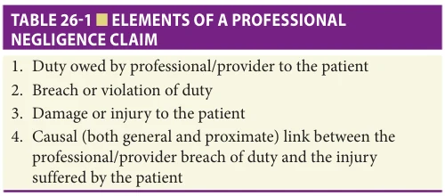
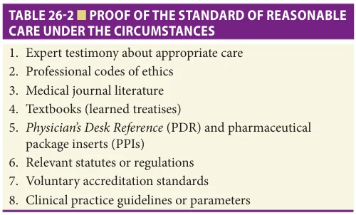
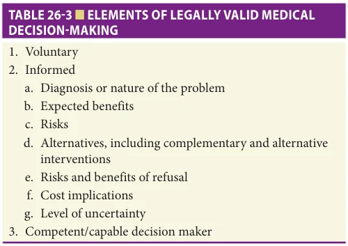
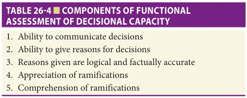
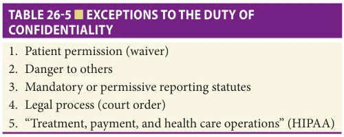

# Hazzard's Geriatric Medicine and Gerontology, 8e - Chapter 26: Legal Issues

Marshall B. Kapp

> **Status.** Fast build from the book; not lane-reviewed.

> Not cited in the 2020-2026 past papers.

> **Source and method.** Printed pages 361-370, from the marked 8th-edition copy (PDF page = printed page + 34). Prose follows its text layer; tables and figures are source-page crops. The book is canonical.

**[p. 361]**

## INTRODUCTION

The law regulates human relationships prospectively and retrospectively in a variety of ways. To a large extent, the legal implications of medical practice are generic, in the sense that they apply to patients of all ages. Rules developed to deal with the care of younger adults apply with full force to older persons, whose rights do not diminish just because of advanced chronological age. However, a patient’s advanced years may raise issues demanding particular attention by involved participants in the professional/patient relationship. This chapter concentrates on selected aspects in which the law influences the delivery of geriatric services through its impact on the recognition and enforcement of respective rights and responsibilities of the parties, within the dynamics of an older patient/health care provider relationship.

#### Learning Objectives

- Appreciate the general legal environment within which physicians and other health care professionals function when providing medical care to older patients.

- Understand the elements of a medical malpractice claim brought against a health care provider.

- Engage in the process of shared decision-making and informed consent with older patients in a legally appropriate manner.

- Advise patients and families about available tools to facilitate advance health care planning.

- Apply in clinical practice the legal requirements for confidentiality of patient information and permissible exceptions to those requirements.

#### Key Clinical Points

1. Maintain and apply in clinical practice an acceptable level of knowledge and skill for your specialty (ie, keep up with your field).

2. Engage in the process of informed and voluntary shared decision-making with your patients or their decision-making surrogates.

3. Discuss the topic of advance health care planning in a timely and supportive manner with patients, ascertaining the patient’s relevant values and treatment preferences in various contingencies and documenting them in the medical record.

4. Respect and safeguard the confidentiality of patients’ medical information, but understand the circumstances under which it is legally permissible or even mandatory to reveal what would otherwise be confidential information.

## OVERVIEW OF HEALTH CARE REGULATION

The U.S. Constitution establishes a federal system of government, under which health care delivery, financing, and other matters are regulated at the national (federal), state, and local levels. Under separation of powers principles, regulation takes the form of (1) constitutional (federal, state, and local) provisions, (2) statutes enacted by elected legislatures, (3) rules or regulations promulgated by executive branch administrative agencies such as health or social service departments on the basis of authority conferred on the agency by the legislature via statute, and (4) common law doctrines created by courts as a matter of public policy and prior case precedent. These various forms of regulation may impose specific or general duties on parties, may authorize but not require parties to act in specific ways, or may prohibit parties from engaging in particular conduct. Health care regulation may be directed at individual health professionals or at health care facilities, agencies, institutions, and other organizations.

### Regulation of Health Professionals

One primary mechanism for regulating health professionals to assure adequate qualifications and acceptable conduct is licensure, which entails the requirement that an individual satisfy—on both an initial and continuing basis—certain enumerated standards to be permitted to

**[p. 362]**

practice a particular profession. Professional licensure ordinarily occurs at the state level through statutes (such as state Medical Practice Acts or Nursing Practice Acts) and regulations promulgated by a state’s licensing body (such as the Medical Board or Nursing Board) to implement the Practice Act. Licensure statutes and regulations limit certain activities to licensed professionals; engaging in those activities without prior state approval is practicing medicine or nursing without a valid license and subjects the wrongdoer to civil fines and potential criminal sanctions.

Many statutory and regulatory requirements or prohibitions imposed on health professionals occur as conditions attached to payment for professional services under government insurance programs, especially Medicare and Medicaid. Professionals who treat patients covered by these government programs must satisfy the positive (eg, “Thou shalt” maintain adequate patient records) or negative (eg, “Thou shalt not” engage in self-referral) strings placed on the payment of public dollars to receive compensation for services rendered.

Another manner of health professional regulation under the civil law is tort liability in private lawsuits claiming malpractice (discussed below). Particularly egregious, intentional misbehavior (such as patient abuse or billing fraud) may subject a health professional to criminal law punishments.

Significant regulatory sanctions imposed on certain health professionals, as well as any monies paid on behalf of a health professional as a result of a professional liability claim, must be reported to the federal Department of Health and Human Services’ National Practitioner Data Bank (NPDB). An individual’s NPDB file is confidential except in circumstances specified in federal regulation.

### Regulation of Health Care Facilities and Agencies

Besides regulating individual health professionals, government regulates provider facilities and agencies through licensure requirements, conditions attached to compensation under public insurance programs including Medicare and Medicaid, criminal prohibitions on specific behaviors such as the filing of false claims, and civil liability for malpractice claims brought by or on behalf of individual patients. For example, Congress enacted the Nursing Home Quality Reform Act, 42 US Code §#1395i-3(a)-(h), as part of the Omnibus Budget Reconciliation Act (OBRA) of 1987, Public Law No. 100-203. This Act contains many of the recommendations proposed in a 1986 Institute of Medicine report that Congress had directed the Department of Health and Human Services to commission. OBRA 1987 amended the Social Security Act, Titles 18 (Medicare) and 19 (Medicaid), to require substantial upgrading in nursing home quality and enforcement. To implement this legislation, the Department of Health and Human Services (DHHS) published regulations in 1989, 42 Code of Federal Regulations Part 483. These regulations were substantially updated on October 4, 2016, at 81 Federal Register 68688-01.

Violation of these regulations subjects nursing homes to a range of sanctions, up to decertification from participation in the Medicare and Medicaid programs.

During the national Public Health Emergency declaration issued in 2020 in response to the COVID-19 pandemic, DHHS temporarily waived a number of regulatory requirements that otherwise would bind nursing homes.

## STANDARDS OF CARE AND PROFESSIONAL LIABILITY

### Overview of Malpractice Liability

In a private civil lawsuit predicated on a theory of professional negligence, the plaintiff is required to establish four distinct elements by a preponderance of the evidence (a more likely than not standard) (Table 26-1). First, the plaintiff has the burden of proving that the professional/provider defendant owed the patient an obligation defined by the appropriate standard of care. The existence of this duty ordinarily is established by showing that there existed, within the relevant timeframe, a professional relationship between the patient and provider; that is, the plaintiff was a patient of the provider for diagnostic and/or therapeutic purposes.

Second, the plaintiff must present sufficient evidence that the professional/provider breached or violated the appropriate standard of care within the professional relationship. The professional/provider does not guarantee particular results, let alone perfection. By the same token, it is not enough for professionals/providers to “do their best” if their conduct does not rise to the applicable level of care, even when the errors or omissions were unintentional (ie, negligent). How the law determines the applicable level of professional care is discussed below.

The third element a medical malpractice plaintiff is required to prove is the occurrence of some financially compensable injury or damage. Besides special or economic (pecuniary) damages that include such quantifiable items as lost income and past and future health care–related costs, plaintiffs may be awarded general or noneconomic (nonpecuniary) damages for such difficult to quantify things as pain and suffering, mental anguish, grief, and other emotional complaints. In the past few decades, some juries have become more willing to award substantial noneconomic damages to older patients claiming medical negligence that

*TABLE 26-1 ■ ELEMENTS OF A PROFESSIONAL NEGLIGENCE CLAIM*

*Owner annotations/highlights are from the marked source copy, not the book.*

**[p. 363]**

has caused, for example, loss of function such as the ability to ambulate, drive, or toilet independently, chronic physical pain, diminution in mental capacity, or loss of ability to engage in sexual relations. In very rare circumstances, punitive or exemplary damages may be awarded over and above compensatory damages, where the defendant’s conduct has been not merely negligent, but reckless or malicious. For example, a jury might award punitive damages when it finds that a patient developed serious pressure ulcers because of a hospital’s or nursing home’s demonstrated ongoing pattern of neglect. Liability insurance policies purchased by health professionals (or purchased for them by their employers) ordinarily do not cover punitive damages.

The final component of proof in a professional malpractice lawsuit is the element of causation. To succeed, the plaintiff must persuade the jury, to a reasonable (not absolute) degree of medical certainty, that the injuries were the result of the defendant’s negligence. The plaintiff must prove not only that the defendant’s negligence was a “substantial factor” in bringing about the injury or that “but for” (sine qua non) the defendant’s negligence the injury would not have happened, but further that there were no intervening, superceding (not reasonably foreseeable) forces that acted to break the chain of proximate or direct causation between the defendant’s negligence and the patient’s injury. For example, a physician might negligently fail to diagnose cancer in an older patient in a timely manner and the patient, on learning that cancer is at a stage that it cannot be treated effectively, commits suicide. Assuming the availability of effective treatment if the cancer had been properly diagnosed in a timely manner, representatives of the deceased patient may argue that “but for” the physician’s negligence the death would not have taken place; however, the physician would respond that the patient’s act of committing suicide was an intervening, superceding (not reasonably foreseeable) factor that disrupted the chain of proximate causation between the physician’s negligence and the patient’s injury.

### Developing and Disseminating Standards of Care

Legal standards of care have been established mainly by the courts as a matter of common law on an incremental, case-by-case basis. State statutes, such as those containing professional licensure requirements, also help to define the required standards of care.

Under the traditional formulation, a professional who is accused of negligent acts or omissions in a medical malpractice claim is held to a standard requiring the professional to have and exercise that level of knowledge and skill ordinarily possessed and exercised by competent, reasonable professional peers (in most states, determined on a national rather than local basis) in similar circumstances. Put differently, under long-standing tort principles of negligence, professionals have been judged legally according to the prevalent practice or custom of peer professionals in clinical circumstances like the situation that

confronted the particular defendant in the case immediately before the court.

There is a significant trend in many states to evolve from the traditional customary professional standard of care in favor of imposing more objective, external standards of “reasonableness” against which the professional’s behavior is to be evaluated by the jury. An objective, evidence-based standard of reasonableness may exceed (ie, require more knowledge and sophistication than) the prevailing customary practice within the professional community at the time in handling a specific clinical challenge presented by a patient. Thus, the state of the art in a particular area of care, required under a reasonableness standard, frequently might not be synonymous with and reflected in the current customary practice within the practitioner community. Courts adopting a reasonableness standard often recite the famous maxim of Judge Learned Hand: “Courts must in the end say what is required; there are precautions so imperative that even their universal disregard will not excuse their omission.”

When a reasonableness standard is imposed on malpractice defendants, expert witnesses may be allowed to testify, and thereby educate the lay jurors, regarding the appropriate professional conduct under the circumstances. To establish reasonable conduct, the parties may also introduce other kinds of evidence to supplement the testimony of the expert witnesses (Table 26-2). Additional forms of evidence introduced for this purpose may include professional codes of ethics, medical journal literature, textbooks (learned treatises), the Physician’s Desk Reference (PDR) and pharmaceutical package inserts (PPIs) pertaining to the correct use and dosage of prescription drugs, pertinent statutes or regulations, voluntary accreditation standards such as those of the Joint Commission, and, of increasing importance, pertinent clinical practice guidelines (CPGs) or parameters.

Leaders in health care delivery and financing acknowledge that a good deal of routine medical practice has long been predicated more on habit and inertia than on solid empirical evidence establishing clinical efficacy. Out of a concern about both wasteful resource usage and the quality of patient care, professional organizations and

*TABLE 26-2 ■ PROOF OF THE STANDARD OF REASONABLE CARE UNDER THE CIRCUMSTANCES*

*Owner annotations/highlights are from the marked source copy, not the book.*

**[p. 364]**

specialty societies, including the American Geriatrics Society and the Society for Post-Acute and Long-Term Care Medicine (AMDA), governmental agencies led by the federal Agency for Healthcare Research and Quality (AHRQ), and the Patient-Centered Outcomes Research Institute (PCORI), independent bodies such as the U.S. Preventive Services Task Force, and individual institutions and agencies in the United States and elsewhere have engaged in a concerted movement to develop, collect, and disseminate to practicing clinicians a variety of evidence-based CPGs or parameters to educate practitioners about whether particular diagnostic or therapeutic interventions have actually been demonstrated to produce desired health benefits for patients. The Institute of Medicine has defined CPGs as “systematically developed statements to assist practitioner and patient decisions about appropriate health care for specific clinical circumstances.” Deviations from relevant CPGs may be permissible in the case of particular patients, but the health professional should document the justification for such deviation.

In a related vein, the American Board of Internal Medicine Foundation and Consumer Reports have partnered in a Choosing Wisely initiative designed to encourage and enable patients and physicians to share in making decisions about medical care that is supported by available evidence, not duplicative of other tests or procedures already received, and necessary for that particular patient. Numerous medical specialty organizations have joined in this initiative, identifying common practices in their respective specialties for which physicians and patients ought to ask questions about the value obtained from routine use.

The legal ramifications of CPGs or parameters continue to evolve. Nevertheless, there is a growing tendency for the courts to admit into evidence, on behalf of either side to a malpractice dispute (ie, for either inculpatory or exculpatory purposes), properly validated, scientifically supported contemporary practice parameters on the issue of the standard of care to be applied under any particular set of circumstances. This development already has consequences, in that informal surveys show that plaintiffs’ attorneys consider health professionals’ compliance with or deviation from relevant practice parameters in making decisions about whether to initiate malpractice litigation at all and how to conduct settlement negotiations for claims that are pursued.

Because of added strains and resource limitations experienced by health care providers due to the COVID-19 pandemic, at least a dozen states enacted legislation providing immunity for providers shielding them against certain kinds of COVID-19-related liability claims. Congress has considered but not passed national legislation in this area.

## INFORMED CONSENT

### Basics of Informed Consent

Informed consent is the legal component of a broad modern shared decision-making approach that puts health care

professionals in the role of decision facilitators or guiders rather than decision makers. The informed consent doctrine originates with the ethical principle of autonomy or self-determination, especially regarding the physical integrity and dignity of one’s own body.

A health professional/provider may be held civilly liable, usually under a negligence theory but in rare cases under a battery or intentional tort theory, for subjecting a person to any diagnostic, therapeutic, or research-related intervention without that person’s effective consent. In their legal formulation, the substantive parts of the informed consent rule have evolved over time as a function of state common (judge-made) law. Moreover, the majority of states have enacted statutes and regulations spelling out a jurisdiction’s specific details regarding informed consent, for clinical care generally and/or within particular settings such as nursing homes or public mental institutions.

For a patient’s decision about whether to accept or reject a suggested medical intervention to be considered legally valid, three separate but interrelated elements must be present (Table 26-3).

First, the patient’s participation in the decision-making process and final decision(s) regarding intervention must be voluntary, not unduly dictated by force, fraud, duress, or any other actual or perceived ulterior form of constraint or coercion. Second, the patient’s agreement or disagreement with recommended interventions must be properly informed. The professional is obligated to disclose sufficient information about the proposed intervention to empower the patient to make a knowledgeable, intelligent consent or refusal. The third essential element of legally effective medical decision-making is adequate capacity on the part of the patient to cognitively and emotionally understand and manipulate pertinent information about medical matters.

In terms of the informed component of informed consent, there are two competing standards for determining how much information about a proposed medical intervention must be shared with the patient in advance. The medical custom or reasonable professional standard

*TABLE 26-3 ■ ELEMENTS OF LEGALLY VALID MEDICAL DECISION-MAKING*

*Owner annotations/highlights are from the marked source copy, not the book.*

**[p. 365]**

requires the disclosure of information that an objective reasonable, prudent professional would disclose under similar circumstances. By comparison, the materiality or patient orientation standard compels the sharing of information that might make a difference or be material in the decisionmaking process of a reasonable patient in similar circumstances. The states are approximately evenly split between these two competing standards of information disclosure.

Under either, the materiality or the reasonable professional standard, the basic components of information disclosure implicated by the professional’s fiduciary or trust obligations include the following: diagnosis or nature of the patient’s medical problem; nature and purposes (expected benefits) of the proposed interventions; reasonably foreseeable risks associated with the intervention, specifically, the likelihood of a risk materializing and the severity if it does occur; reasonable alternative interventions and their anticipated risks and benefits; and the reasonably foreseeable risks and benefits of not undergoing the proposed intervention. Other informational items that a health professional should seriously consider disclosing to the patient are complementary medicine alternatives, which are increasingly popular with older individuals; cost ramifications to the patient of proposed alternatives; professional-specific information pertinent to the particular intervention (eg, the professional’s own track record with the particular intervention or financial incentives the professional has regarding the patient’s course of care); and the level of uncertainty within the medical community concerning the particular intervention.

Informed consent to a medical intervention may be implied or expressed. There are many situations in which a patient’s permission to proceed with a medical intervention does not need to be put into words but, instead, may be implied from the context. This happens when, through demonstrative actions, the patient indicates a wish (or at least willingness) to undergo a specific intervention by voluntarily submitting to it in a manner that the health professional can reasonably rely on to conclude that the intervention has been authorized. Implied consent is appropriate for most routine, noninvasive, non-risky kinds of medical interventions such as taking a patient’s blood pressure or listening to the heart. Implied consent is not an exception to the informed consent requirement, but just a different (created by behavior instead of words) form of permission.

Express consent (put into spoken or written words), by contrast, is more appropriate when the proposed medical intervention is intrusive and/or significantly more risky than ordinary, everyday life. With a small number of exceptions created by particular state statutes for designated kinds of interventions (such as testing for the HIV virus), express consent in the form of spoken rather than written patient words is legally adequate, as long as the consent is voluntarily and competently given on the basis of sufficient information being disclosed. However, for particularly intrusive or risky interventions, the professional/provider

should consider documenting the patient’s decision to consent or refuse by asking the patient to sign a separate written form, in addition to the professional making a progress note in the patient’s medical record. Also, voluntary accreditation standards with which the provider purports to comply, such as those of the Joint Commission, may require the use of separate written consent forms for particular sorts of medical interventions.

### Decisional Capacity Issues

Sometimes, a patient is not cognitively and/or emotionally capable of assimilating pertinent information and engaging in a rational, voluntary decision-making process about proposed and alternative medical interventions. Some older persons with dementia, depression, or other age-related mental disorders are so impaired that they fall into this category. When the patient personally lacks adequate decisional capacity, the health professional is not relieved of the duty to obtain informed consent but, instead, must work with someone else who is willing to act as a surrogate on the patient’s behalf.

Assessing decisional capacity entails a functional inquiry. Among the basic questions to be posed are (Table 26-4): (1) Can the person make and communicate in an understandable form any decisions at all? (2) Is the person able to offer reasons for the choices made, indicating some degree of reflection and consideration? (3) Are the reasons given based on logical reasoning proceeding from factually accurate suppositions? (4) Can the patient appreciate the ramifications (ie, likely risks and benefits) of the options outlined and choices expressed, and the reality that these ramifications apply to that patient? (5) Does the individual comprehend the practical implications of different choices?

A patient’s present cognitive and emotional capacity should be evaluated on a decision-specific, rather than a global or all-or-nothing, basis. A patient may be capable of making some kinds of decisions, but not others; partial or limited capacity, especially with adequate assistance and support by family or friends, is possible even when total capacity is not. Moreover, capacity may fluctuate within a specific patient according to variables such as time of day, day of the week, physical location, acute and transient physical problems, other persons available to support or coerce the patient’s choice, and medication reactions. Older individuals may be especially vulnerable to fluctuations in capacity induced by these factors. Some of these factors

*TABLE 26-4 ■ COMPONENTS OF FUNCTIONAL ASSESSMENT OF DECISIONAL CAPACITY*

*Owner annotations/highlights are from the marked source copy, not the book.*

**[p. 366]**

may be susceptible to manipulation by caregivers (eg, by changing timing of drug administration) so that discussions with the patient (rather than or in addition to the surrogate) about the care plan can take place under the most lucid circumstances possible.

### Advance Health Care Planning as Prospective Decision-Making

There are several legal mechanisms available to maximize a patient’s medical autonomy prospectively. An older person may, while still capable of making health care decisions, execute certain legal instruments to anticipate and prepare for eventual incapacity by voluntarily delegating or directing the exercise of future medical decision-making power. Although oral advance medical directives are theoretically legally valid, patients should be encouraged to execute written versions to maximize the likelihood that the directive ultimately will be respected by family members and health professionals. Organizational providers are required by the federal Patient Self-Determination Act to initiate discussions with competent patients about the availability of advance medical directive opportunities.

The durable power of attorney (DPA) consists of a written document in which an individual (the principal) appoints an agent, or attorney-in-fact, to make various kinds of decisions for the principal. Each state has enacted statutes that explicitly authorize the use of a DPA for health care (DPAHC) to empower an agent (including a nonfamily member) to make medical choices on a patient’s behalf, should the patient later lose decision-making capacity. Examples of DPAHC templates for individual states are available on the internet. A DPAHC may be immediate, meaning that it comes into effect as soon as the agent is named. In a springing DPAHC, on the other hand, the legal authority transfers (springs) from the patient to the agent only on the occurrence of some specified future event, like a declaration of the principal’s incapacity by a designated number of examining physicians. The patient should be informed by attending health professionals when they have decided to act as though decision-making authority has sprung to the designated agent, so that the patient can utter a protest, if desired, to the agent’s exercise of power.

The DPAHC is a proxy directive, and hence distinguishable from a living will or instruction-type directive. In an instruction directive, a competent patient documents his or her wishes regarding future medical treatment (eg, “no extraordinary measures” or “keep me alive forever no matter what pain or expense”) rather than naming an agent to make future treatment decisions in the case of eventual incapacity. The two kinds of legal devices are not mutually exclusive; indeed, patients may be encouraged to execute them in tandem because the living will can help an agent named under a DPAHC to exercise the patient’s substituted judgment (defined below) more accurately.

When a patient is incapable of making their own health care decisions but has not previously executed an

instruction or proxy directive, in most states health professionals may rely on legislation empowering family members and enumerated other persons to make medical decisions for incapacitated persons. In states with such family consent statutes, the approved procedure usually consists of documenting unanimous agreement among the attending physician, specified relatives or others (listed in a stated preference order), and sometimes consultant physicians as well.

When there is no valid proxy or instruction directive, family consent statute, or judicial precedent in one’s jurisdiction authorizing the family to act as patient surrogate, or in those relatively uncommon situations in which family members strongly and irreconcilably disagree about the best course of care for their relative, judicial creation of a guardianship or conservatorship (nomenclature varies by jurisdiction) may be advisable to transfer decision-making power formally from an incapacitated patient to a single, specific surrogate. However, the official legal process (ordinarily entailing significant financial, time consumption, and emotional costs) should not be initiated unless and until less formal approaches, such as mediation or consultation with an institutional ethics committee or ethics consultation service, have been exhausted in an effort to reach a sufficient level of agreement among the interested stakeholders. In a guardianship/conservatorship case, professionals who have evaluated and/or treated the alleged incompetent person usually are called to provide evidence to the court in the form of a written affidavit and/or live sworn testimony. Many jurisdictions have public or volunteer guardianship programs that operate to provide surrogate decision makers for individuals with substantially impaired cognitive and/or emotional capacity who have no suitable family members or other private parties who can serve as guardians for them.

In the past, a surrogate was expected to make decisions consistent with the guardian’s view, as a trust agent, of the patient’s best interests. The modern approach, however, is toward a substituted judgment standard of proxy decision-making, whenever it is realistically feasible. Under this latter approach, the surrogate is obligated to make those decisions that the patient would make, according to the patient’s own preferences and values to the extent these can be accurately ascertained, if the patient were presently able to make and express decisions competently.

Another innovation in advance health care planning is the Physician Orders for Life-Sustaining Treatment (POLST) paradigm (also known as Portable Medical Orders; see https://polst.org/). The precise title for this concept varies among jurisdictions. In some states, it is named Medical Orders for Life-Sustaining Treatment (MOLST; see https://molst.org/) and has also been named Physician Orders for Scope of Treatment (POST; see https:// www.indianapost.org/). POLST is a mechanism to convert a patient’s treatment wishes into the tangible form of a written physician’s order. Because health professionals

**[p. 367]**

are accustomed to carrying out medical orders, there is evidence that when treatment instructions are expressed in the form of a POLST they are substantially more likely to be honored in practice than are wishes expressed only in the form of a patient’s prior expression or a surrogate’s current representation of the patient’s inferred preferences. Unlike an advance directive, a POLST is appropriate only for a patient who is so seriously ill that a physician exercising sound judgment would not be surprised if that patient died within the next year or two. Individual states are at different points concerning the degree of POLST penetration in medical practice and statutory and/or regulatory codification. There are no laws in the United States that prohibit either physicians from writing a POLST today for an appropriate patient or emergency medical services (EMS) or other health professionals from following a POLST.

## CONFIDENTIALITY

While providing care, health professionals routinely are exposed to private information about patients and their families. Professionals owe patients a fiduciary responsibility to hold in confidence all sensitive patient information entrusted to them as a consequence of the professional/ patient relationship. This ethical obligation, predicated on the patient’s important interest in protecting personal privacy and avoiding the social stigma and potential discrimination that breach of one’s medical privacy might entail, is enforceable legally under both state and federal law.

### State Law

Every state, both within its state professional Practice Acts and in separate statutes pertaining to particular health care delivery settings, has enacted provisions pertaining to the confidentiality duties of health care professionals, institutions, and agencies. Often, state agencies publish accompanying regulations to implement these statutes. Moreover, a strong common law health care confidentiality doctrine has been forged by state court decisions rendered over time. Violation of state common law or the relevant statutory or regulatory requirements regarding confidentiality of patient information may subject erring health professionals/providers to civil damage suits, brought by or on behalf of the patient whose privacy was improperly infringed; additionally, violation of state Practice Act provisions may subject the violator to administrative sanctions, including license suspension or even revocation.

However, numerous exceptions to the general confidentiality rule have been recognized by the courts as part of the common law or embedded in state legislation or regulation (Table 26-5). First, the most prominent exception occurs when a patient, expressly or impliedly, voluntarily and knowingly waives, or gives up, the right to assert the confidentiality of particular information. These waivers take place daily to make information available to thirdparty payers (for instance, Medicare claims processors and

*TABLE 26-5 ■ EXCEPTIONS TO THE DUTY OF CONFIDENTIALITY*

*Owner annotations/highlights are from the marked source copy, not the book.*

private health insurers), quality of care auditors (such as Joint Commission surveyors), and other public and private entities like health care surrogates authorized to make medical decisions on behalf of a patient who is not capable of making their own decisions. Because the modern delivery of health care is a team endeavor, each patient implicitly gives permission for the sharing of certain otherwise private pieces of information among the members of the treatment team. Internal information sharing of this nature is essential to optimal care, especially for accomplishing coordination and continuity of long-term care for older patients with disabilities. Indeed, failures in communication among the multiple providers involved in the care of a patient needing such coordination and continuity may form the basis for negligence liability claims when harm results.

Second, the usual confidentiality duty may be outweighed in situations of jeopardy to innocent, at-risk third parties, such as happens when a patient with serious sensory or cognitive impairments insists on continuing to drive an automobile or maintain loaded firearms in the home for protection against intruders. Particular details regarding methods for the health professional to discharge the responsibility to report a credible threat of harm to public health or law enforcement authorities vary on the basis of state statutory and case law.

Third, the patient’s reasonable expectation of privacy must give way when the health professional is mandated by state statute to report to enumerated public health or law enforcement authorities (eg, Adult Protective Services [APS]) the professional’s reasonable suspicion that certain conditions or activities have occurred or are occurring. Such reportable conditions or activities may include elder mistreatment or neglect (in many states including cases of self-neglect is also within that definition), domestic violence, infectious diseases, and births and deaths. Some states that have declined to mandate the reporting of particular situations to public authorities nonetheless encourage voluntary reporting; a few states have pursued this approach regarding cases of suspected elder abuse or neglect. Those states supply an incentive for voluntary reporting by expressly providing legal immunity against civil or administrative liability for covered persons making good faith reports to public authorities. Mandatory and voluntary reporting statutes embody the state’s exercise of either its inherent police power to protect and promote the general health, safety, welfare, and morals of the community or its parens patriae

**[p. 368]**

power to step up and safeguard individuals (such as persons with serious cognitive or emotional disabilities) who are not capable of protecting themselves. Further, a health professional may be compelled to reveal otherwise confidential information about particular patients by the force of legal process, namely, by a judge’s issuance of a court order requiring such release. This is a possibility in any civil or criminal lawsuit involving a factual dispute about a patient’s physical or mental condition. A court order (as opposed to a subpoena or subpoena duces tecum, which is issued simply as an administrative, nondiscretionary matter by the court clerk rather than by a judge) requiring one to produce personally identifiable patient information may override the state’s provider/patient testimonial privilege statute that ordinarily prohibits the provider from testifying in a legal proceeding regarding private patient information. Every state testimonial privilege statute provides for judicially compelled testimony on the part of the health professional when, for example, the patient has placed his or her own health condition and medical treatment in issue in a lawsuit. This could occur when, for instance, the individual challenges the allegations propounded by others about one’s mental impairments made in a guardianship/conservatorship petition.

### Federal Law

Particular health care settings There are a variety of federal statutes and regulations imposing on health providers particular confidentiality obligations when care is provided within specific types of health care settings, including federal penal institutions, Veterans Affairs facilities, military institutions, federal community health centers, and facilities specializing in the treatment of persons having drug and alcohol addiction. Violation of these laws may result in substantial civil fines. Statutes and regulations setting the conditions for receipt of Medicare and Medicaid payments contain confidentiality provisions, set within general patients’ rights standards, applicable specifically to nursing homes and home health agencies. Noncompliance with those provisions could trigger a range of regulatory sanctions, at the extreme including decertification of the facility or agency from participation in federal health care financing programs.

## FURTHER READING

Baker T, Silver C. How liability insurers protect patients and

improve safety. DePaul Law Rev. 2019;68(2):209–237. Blease C, Walker J, DesRoches CM, Delbanco T. New U.S.

law mandates access to clinical notes: implications for patients and clinicians. Ann Intern Med. 2021;174(1): 101–102. Bookman K, Zane RD. Surviving a medical malpractice

lawsuit. Emerg Med Clin N Am. 2020;38(2):539–548.

Health Insurance Portability and Accountability Act Federal regulations at 45 Code of Federal Regulations Parts 160 and 164 implement the Health Insurance Portability and Accountability Act (HIPAA) of 1996 (Public Law No. 104-191, title XI, Part C). These regulations, published as a Privacy Rule and a Security Rule, impose on covered health care entities (defined in part as health providers who transmit identifiable patient information electronically) an extensive set of requirements regarding the handling of personally identifiable medical information contained in patient records. These regulations impose severe criminal and civil sanctions for unauthorized disclosures of personal health information. Substantively, HIPAA and its implementing regulations in essence codify preexisting state statutory and common law protections for patients, with the addition of provisions making it clear that patients have the right to access the information contained in their own medical records. (Previously, state law varied or was unclear regarding the issue of patient access to records.) Patient access to their own electronic medical records was expanded further in 2020, through the 21st Century Cures Act, to include clinical notes.

HIPAA contains provisions authorizing covered entities to transmit personal health information to certain others for purposes of “treatment, payment, and health care operations” such as quality assurance or marketing. These and other exceptions explicitly contained in HIPAA basically track the preexisting state statutory and common law exceptions discussed in the previous section.

## SUMMARY

Individual health professionals and organizational providers serving older patients inevitably and continuously interact with laws and the legal system. This chapter has outlined a handful of the arenas in which this interaction is likely to occur. For advice in particular circumstances, especially pertaining to relevant state law, specialized legal consultation should be sought from knowledgeable attorneys in private practice, counsel and/or risk managers employed or retained by the health provider, the professional’s or provider’s liability insurance carrier, or an institutional ethics committee.

Cohen AB, Costello DM, O’Leary JR, Fried RT. Older adults

without desired surrogates in a nationally representative sample. J Am Geriatr Soc. 2021;69(1):114–121. Comer AR, Slaven JE, Montz A, et al. Nontraditional sur-

rogate decisionmakers for hospitalized older adults. Med Care. 2018;56(4):337–340. Cooke BK, Worsham E, Reisfield GM. The elusive standard

of care. J Am Acad Psychiatry Law. 2017;45(3):358–364.

**[p. 369]**

Dillon E, Chuang J, Gupta A, et al. Provider perspectives on

advance care planning documentation in the electronic health record: the experience of primary care providers and specialists using advance health-care directives and physician orders for life-sustaining treatment. Am J Hosp Palliat Care. 2017;34(10):918–924. Frolik LA, Kaplan RL. Elder Law in a Nutshell. 7th ed. St.

Paul, MN: West Academic Publishing; 2019. Glaser J, Nouri S, Fernandez A, et al. Interventions to

improve patient comprehension in informed consent for medical and surgical procedures: an updated systematic review. Med Decision Making. 2020;40(2):119–143. Grosso S. What is reasonable and what can be proved as

reasonable: reflections on the role of evidence-based medicine and clinical practice guidelines in medical negligence claims. Ann Health Law. 2018;27(1):74–100. Hooper S, Sabatino CP, Sudore RL. Improving medical-

legal advance care planning. J Pain Symptom Manage. 2020;60(2):487–494. Jacobsen J, Blinderman D, Cole CA, Jackson V. “I’d recom-

mend...”—How to incorporate your recommendation into shared decision making for patients with serious illness. J Pain Symptom Manage. 2018;55(4):1224–1230. Jain N, Bernacki RE. Goals of care conversations in

critical illness: a practical guide. Med Clin N Am. 2020;104(3):375–389. Lee RY, Modes ME, Sathitratanacheewin S, et al. Conflict-

ing orders in physician orders for life-sustaining treatment forms. J Am Geriatr Soc. 2020;68(12):2903–2908. Mack DS, Dosa D. Improving advanced care planning

through physician orders for life-sustaining treatment

(POLST) expansion across the United States: lessons learned from state-based developments. Am J Hosp Palliat Care. 2020;37(1):19–26. Oza VM, El-Dika S, Adams MA. Reaching safe harbor:

legal implications of clinical practice guidelines. Clin Gastroenterol Hepatol. 2016;14(2):172–174. Pope TM, Bennett J, Carson SS, et al., on behalf of the

American Thoracic Society and American Geriatrics Society. Making medical treatment decisions for unrepresented patients in the ICU. Am J Respir Crit Care Med. 2020;201(10):1182–1192. Schoenfeld EM, Mader S, Houghton C, et al. The effect of

shared decision-making on patients’ likelihood of filing a complaint or lawsuit: a simulation study. Ann Emerg Med. 2019;74(1):126–136. Shen MJ, Manna R, Banerjee SC, et al. Incorporating shared

decision making into communication with older adults with cancer and their caregivers: development and evaluation of a geriatric shared decision-making communication skills training module. Patient Educ Couns. 2020;103(11):2328–2334. Sulmasy LS, Bledsoe TA, for the ACP Ethics, Professional-

ism and Human Rights Committee. American College of Physicians Ethics Manual, 7th ed. Ann Intern Med. 2019;170 (Suppl.):S1–S32. U.S. Department of Health and Human Services, Health

Resources and Services Administration. NPDB Guidebook. Rockville, MD: U.S. Department of Health and Human Services; 2018. Available at https://www .npdb.hrsa.gov/resources/aboutGuidebooks.jsp. Accessed February 2, 2021.

**[p. 370]**
