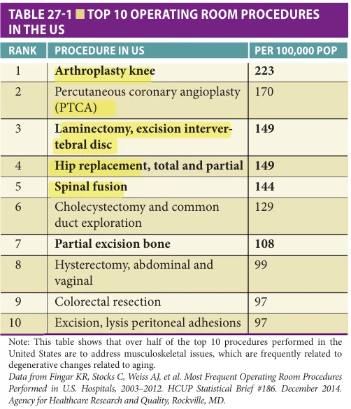
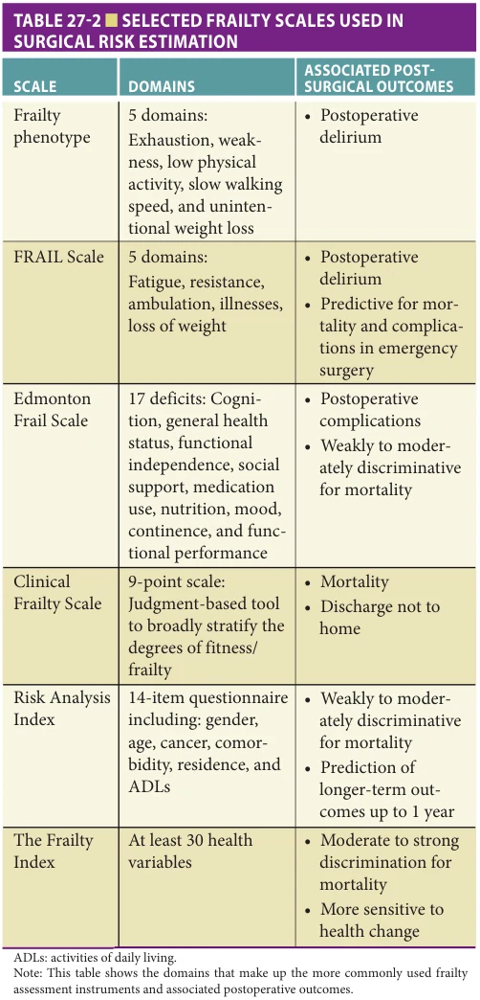
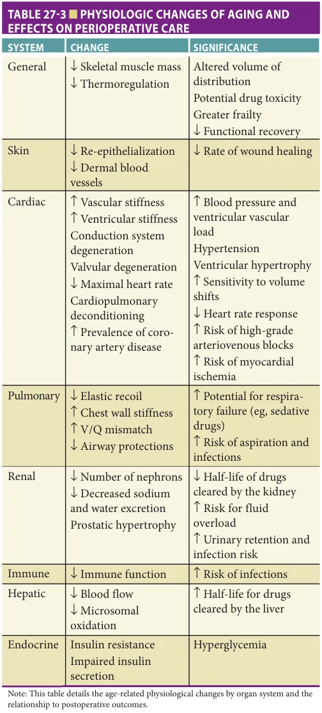
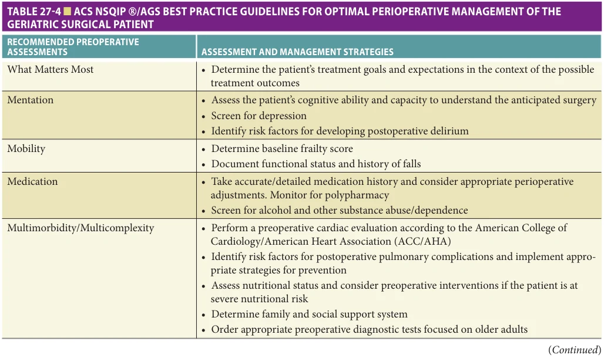
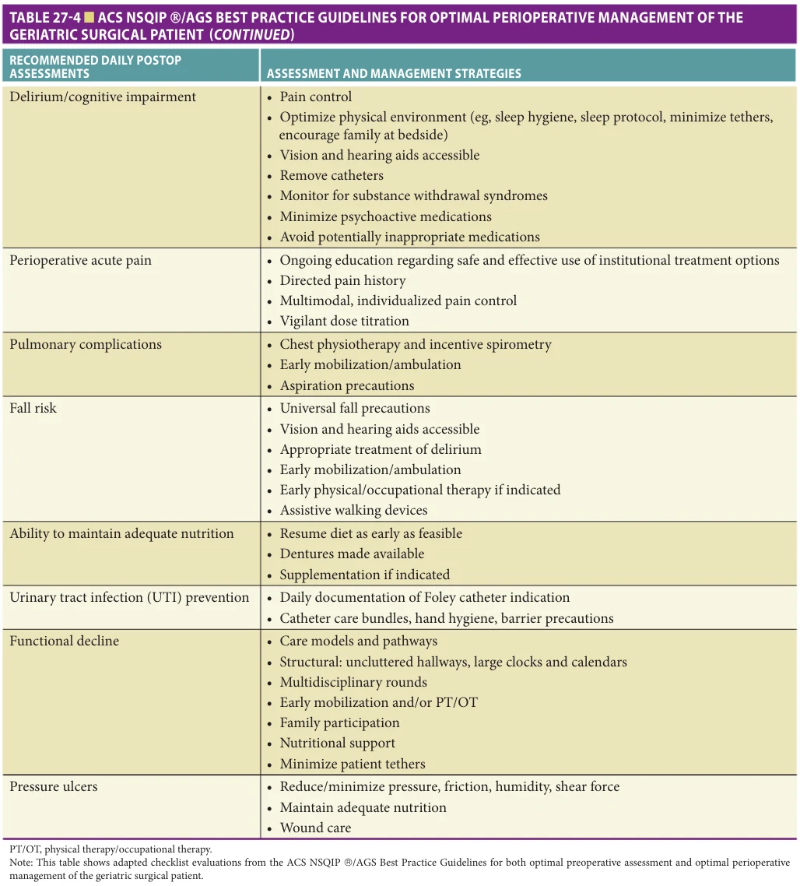

# Hazzard's Geriatric Medicine and Gerontology, 8e - Chapter 27: Perioperative Care: Evaluation and Management

Shelley R. McDonald

> **Status.** Fast build from the book; not lane-reviewed.

> **Source and method.** Printed pages 371-382, from the marked 8th-edition copy (PDF page = printed page + 34). Prose follows its text layer; tables and figures are source-page crops. The book is canonical.

**[p. 371]**

## INCREASED RISK IN THE OLDER SURGICAL PATIENT

Inherent Vulnerabilities with Aging Surgery in the older adult is different because of the increased risks of poor outcomes with seemingly simple or “routine” procedures but also because it can be challenging to identify those risks. Older adults preparing for surgery represent an incredibly diverse group of individuals not only because of the many available types and approaches to delivering surgical therapy but also because of the underlying vulnerabilities. Even though it is widely acknowledged that older adults are a heterogeneous group of patients they are also a distinctly vulnerable group of surgical patients who overall, experience disproportionately higher rates of postoperative complications, morbidity, and mortality. Thus, it is imperative to fully weigh the anticipated benefits of surgical interventions to the risks and explore whether this aligns with each patient’s preferences, their goals for the surgery, and overall health goals.

#### Learning Objectives

- Understand how to identify older adults who are at increased risk of poor surgical outcomes and implement strategies to modify patient-factor vulnerabilities to mitigate risk.

- Describe evidence-based perioperative practices that improve surgical outcomes for older adults that utilize interprofessional teamwork.

#### Key Clinical Points

1. Older adults are a distinctly vulnerable group of surgical patients and need to be evaluated for high-risk characteristics including, advanced age, impaired cognition, dependency in functioning, impaired mobility, malnutrition, dysphagia, and discordance of goals for surgical outcomes.

2. Thoughtful use of screening tools increases discrimination for assessing surgical risk in older adults, but the use can be challenging because predictive validity and feasibility is widely varied with different instruments.

3. Person-centered care for older adults delivered using evidence-based interventions is done more efficiently and effectively using structured processes that include interdisciplinary teams engaged throughout the continuum of surgical care.

Identifying a person’s true baseline before surgery in terms of functional status as well as cognitive abilities can help more accurately assess an older individual’s tolerance of surgical stressors, which in turn allows for more realistic goal setting, permits sufficient time for presurgical optimization and prehabilitation, and enables planning for recovery if additional resources need to be lined up. Examples of this frequently include friends or family traveling from out of town or requesting leave from work, an older adult temporarily moving to a friend or child’s home, or being a participant in choosing a postacute care facility that would be potentially acceptable if they needed more assistance and therapy during recovery.

**[p. 372]**

Over 16% of the US population is older than 65 years and roughly 10,000 adults turn 65 years of age each day. Longitudinal studies show as aging continues so do increases in chronic medical conditions, mobility limitations, widowhood, loneliness, and institutionalization. Older adults are at increased risk of cognitive and functional decline. Those older than 85 years are even more likely to have accumulated age-related physiologic declines, leading to increased comorbidity, decreased functional abilities, decreased cognition, and malnutrition. These conditions create an increased vulnerability or frailty, which is an important predictor of adverse surgical outcomes. The cohort of high-risk older adults being considered for surgical therapy is going to be a sizable because by 2050, 20 million Americans will be 85 years or older. Despite increased physiological vulnerabilities, the demand for surgery will likely remain strong because subjective well-being remains positive over the course of old age and often surgeons use a communication strategy in which the surgical intervention is presented as restoring normalcy known as the “fix-it” model that may not fully explain the value of a planned surgical intervention and how it may impact someone’s lifestyle.

Prevalence of Surgery in Older Adults Nearly 40% of all surgical procedures are performed on older adults. Major surgery is a very common occurrence in the lives of adults older than 65 years. The 5-year cumulative risk for those in the United States is 14% (95% confidence interval [CI], 12.2%–15.5%) and remains relatively high even for those 90 years or older, 12% (95% CI, 9.9%–14.4%). Table 27-1 (data in bold) shows that half of

*Table 27-1, printed p. 372.*

the top 10 procedures performed in the United States are to address musculoskeletal disorders, which are frequently related to degenerative changes of aging. More importantly the deconditioning and decreased mobility from degenerative musculoskeletal disorders and potentially inappropriate medications to treat symptoms are directly related to increased risk of poor postsurgical outcomes, increased postoperative complications, and prolonged recovery after surgery.

## ASSESSING SURGICAL RISK IN COMPLEX OLDER PATIENTS

There are many individual markers or observable characteristics that can be used when assessing an older adult’s fitness for surgery either as discrete or composite measures. Recognizing these as geriatric-specific risk factors for poor surgical outcomes is important so that the risks can be anticipated and thus a plan put into place for appropriate shared decision making and risk mitigation.

Age over 80 years: How do we prognosticate? Advanced age should not be considered as the primary risk factor for predicting poor surgical outcomes because cognitive and physical abilities do not uniformly decline as we age. Physiologic reserve also differs significantly between older adults as well as between major organ systems within individuals. Thus, age alone cannot be used to estimate surgical risk because of the increasing heterogeneity in older age. Despite this variance, older age is associated with a greater burden of chronic diseases and when we assess outcomes for the older cohorts of older adults there is a greater risk for adverse outcomes. When the outcomes for major noncardiac surgery are examined in patients older than 80 years for morbidity and mortality, those with who experienced any postoperative complication had a higher 30-day all-cause mortality than those who did not have any complications (26% vs 4%, p < 0.001). Thirty-day all-cause mortality has also shown to be higher in those older than 80 years after cardiac surgery. Age is the bluntest tool we have for assessing risk in older adults and it can remind us to be more aware of screening for a true baseline in physical and cognitive functioning, but it should not be the sole factor in the decision to proceed or not with surgical therapy.

Frailty: The oldest of old patients are more likely to be frail, which is a clinical syndrome characterized by low physiological reserve leading to increased vulnerability. Frailty can be a thought of as a general descriptive term or a defined geriatric syndrome with measurable traits with many different instruments to assess this in a clinical setting. The features observed with Fried’s phenotypic frailty are unintentional weight loss, weakness, exhaustion, low physical activity, and slow walking speed. Preoperative frailty in older adults is known to be associated with increased incidence of adverse postoperative outcomes, including more postoperative complications, increased length of hospital stay, and greater likelihood of being discharged to a skilled

**[p. 373]**

nursing or assisted-living facility. Because of the many available frailty scales, it is important to understand the strengths and weaknesses of the differing scales used. The phenotypic frailty scale is more often used for research and strongly associated with the development of postoperative delirium, whereas the Edmonton Frail Scale was a better predictor of complications, and the Clinical Frailty Scale tends to be more strongly associated with mortality and for discharge locations other than directly back to home. Acceptability, implementation, and feasibility are potential barriers to the use of frailty scales but selected use of these instruments can improve risk assessment particularly when used in combination with other risk-assessment tools. Table 27-2 reviews

*Table 27-2, printed p. 373.*

some of the more common scales mainly used during assessments preceding elective surgery unless otherwise noted. See Chapter 42 for more discussion of frailty.

Gait speed: Gait speed is a direct or indirect component of many frailty scales, and slower gait speeds are associated with poor health and reduced ability to function. This single measure used during preoperative evaluation before cardiac surgeries is an independent predictor for increased in-hospital mortality, major complications, and discharge to a health care facility. As there are multiple factors that impact walking abilities, gait speed should be used to refine estimates of surgical risk and to identify those who may need more in-depth presurgical evaluation.

Weight and muscle mass: Weight loss is reflective of poor nutrition and/or poor utilization of nutrition, and in older adults is associated with many negative outcomes including loss of lean body and bone mass, development of pressure sores, slow wound healing, increased risk of infection, longer length of hospitalization, greater likelihood of hospital readmission after discharge, and increased mortality. Significant age- and disease-related reductions in skeletal muscle mass (sarcopenia) decrease the capacity of the older patient to make a functional recovery, possibly resulting in a discharge to a subacute or long-term care facility. Furthermore, weight loss preceding surgery increases the likelihood of delirium and postoperative pulmonary complications. All older adults need to be screened for nutritional risk before surgery because approximately onethird of older adults living in the community are at risk of being malnourished or are malnourished. This prevalence increases to a staggering 86% for those hospitalized. When an older adult has lost more than 10% of their body weight in the 6 months leading up to surgery or more than 5% in 1 month prior, further nutritional screening and assessment should be done to develop a nutritional support plan based on the nature, extent, and underlying causes of the malnourishment. The Mini Nutritional Assessment (MNA) is one well-established and validated nutritional screening tool in older persons. Obese older adults should also be screened because they are more likely to experience postsurgical complications. Furthermore, the comorbidities most related to obesity such as diabetes, coronary heart disease (CHD), congestive heart failure (CHF), atrial fibrillation (A-fib), stroke, cancer, and arthritis also increase the risks of postsurgical complications and can contribute to slower recoveries after surgical therapy. See Chapter 49 for more discussion of sarcopenia.

Functional status and falls: Accurate assessment of functional abilities for managing day-to-day affairs of maintaining a household (IADLs) and performing self-care (ADLs) as adults age into advanced age provides important information about cognitive and physical limitations, available social supports, need for adaptive interventions, and the impact of their illness and risks for postoperative complications. Dependency in just one ADL (toileting, feeding,

**[p. 374]**

dressing, grooming, transferring, or bathing) prior to surgery has been shown to be associated with 75% greater odds of postoperative death compared to a matched cohort of functionally independent older adults. When examined in older adults undergoing elective colorectal or cardiac surgery, falling only one time in the 6-month period before surgery is another discrete factor associated with having at least one postoperative complication, an increased 30-day readmission rate, and higher risk of being discharged to an institution. A positive inquiry about falling should trigger further assessment for high-risk medication use, sensory impairments, neuromuscular limitations, cognitive deficits, mood disturbances, or environmental barriers. The ACS NSQIP©/AGS Best Practice Guidelines recommends evaluating function using the four-question Short Simple Screening Test for Functional Assessment:

1. Can you get out of bed or chair yourself? 2. Can you dress and bathe yourself? 3. Can you make your own meals? 4. Can you do your own shopping?

If an older adult being considered for surgery cannot perform any of these activities, then a full inquiry should be performed about ADLs and IADLs to identify areas that need to be addressed both before and after surgery. Please see Chapter 43 for more about falls.

Cognition: Cognitive impairment, dementia, or history of prior delirium are significant risk factors for developing delirium following surgery. When dementia-level cognitive impairment is present before surgery as measured by the Mini-Cog screening tool, older adults are more likely to have increased complications, longer length of stay, higher discharge rates to institutional facilities, and long-term mortality as measured up to 4.5 years after a major elective surgery. Too often patients with cognitive impairment and dementia are excluded from clinical trials, thus there is limited literature on cognitive impairment as an independent risk factor for other postoperative complications. Nevertheless, delirium is the most common postsurgical complications for older adults and results in a sequalae of events that lead to increased likelihood of other complications including falls, aspiration, prolonged hospital stay, functional and cognitive decline, institutionalization, and death. Furthermore, postsurgical outcomes in older adults are worse when delirium occurs compared to postsurgical outcomes without delirium. This leads to an enormous loss of personal independence and financial burden with the 1-year direct cost of delirium in the United States estimated to be $33 billion. Therefore, it is critical to have a screening protocol in place to have a better understanding of an older adult’s cognitive abilities prior to surgery with more in-depth assessment for those who do not do as well as expected on the cognitive screening or for those with previously unrecognized cognitive impairment. When neurocognitive deficits are recognized, it then

becomes important to allow for anticipated surgical risks and benefits to be presented in the most meaningful way for the patient and discussed in context of what is that person’s overall health goals and with the input of any surrogate decision makers. Please see Chapter 9 for more on cognitive assessment.

Depression and mood: Identification of mental health disorders including depression, anxiety, posttraumatic stress disorder (PTSD), and substance abuse disorders should be deliberately explored as part of preoperative geriatric risk screening. Older patients who present with depressive symptoms before surgery have a greater risk of experiencing postoperative delirium and longer postoperative hospital lengths of stay. Anxiety is also associated with increased lengths of stay, and PTSD is associated with risk for emergence delirium (ED), which is defined as fearful, aggressive, and agitated behaviors that occur immediately following surgery upon awakening from anesthetic agents. Alcohol dependence may be overlooked in older adults but should also be screened for because it is associated with increased risk of postoperative complications.

The recognition of any mental health disorder should trigger scrutiny for actual use of prescribed medications including benzodiazepines, opioids, alcohol, illicit substances, and over-the-counter medications. Anticipatory guidance should include education/reassurance for the surgical procedure and plans for anesthesia and hospital and posthospital management of pain. Nonpharmacologic management should include exercise as tolerated, deep breathing, cognitive behavioral techniques for stress reduction, or integrated approaches such as music, aromatherapy, or massage. See Chapter 65 for more on depression and mood disorders.

Cardiopulmonary fitness: Poor cardiorespiratory fitness is the most significant independent predictor for postoperative mortality and length of hospital stay over age alone. Age-associated changes in cardiac physiology illustrate how age increases operative risk. This is primarily a result of a loss of vascular compliance, the left ventricle demonstrates an increase in stiffness, impaired diastolic relaxation, and an increase in filling pressures. These changes subsequently make the ventricle less tolerant of shifts in intravascular volume. An acute increase in volume (eg, from intravenous fluids administered during surgery) leads to a further increase in left ventricular filling pressures and could result in pulmonary congestion as a consequence of the age-related increase in diastolic stiffness. Conversely, an acute loss of intravascular volume, such as the third spacing of fluid or intraoperative blood loss, reduces preload to the stiffened ventricle and could produce a marked reduction in systolic blood pressure. Coronary artery disease (CAD), a common comorbidity, also increases risk; adding the intraoperative burden of myocardial ischemia to the already impaired diastolic relaxation leads to a further worsening of ventricular filling pressures and increases the risk of pulmonary edema.

**[p. 375]**

When cardiac risk measures such as the Society of Thoracic Surgery and EuroScore II cardiac surgery risk models are added to frailty measures, the results are better model discrimination for postoperative outcomes.

Cardiac complications: CAD and heart failure (HF) are highly prevalent in older populations and remain the primary cause of death for the older patient. An estimated 25% to 30% of all perioperative deaths are attributed to cardiac causes. Because older adults are more likely to have significant CAD and HF, patients should be carefully screened for signs and symptoms of occult or overt disease. The left ventricular ejection fraction (LVEF) is an independent risk factor for major adverse cardiac events (MACE) with an increased risk of death when the LVEF falls below 40%. The risk of MACE is also higher among patients with HF with preserved LVEF than those without HF. Two-thirds of older adults with HF have normal left ventricular systolic function, and as previously noted the age-associated increases in vascular and left ventricular stiffness result in a greater sensitivity to volume shifts. Age-related declines in the electrical conduction system place the older patient at a greater risk of drug-induced bradycardia or high-grade atrioventricular blocks. A history of prior myocardial infarction or a low LVEF is associated with a greater risk of ventricular tachycardia. Older age (> 65 years) is also an independent risk factor for perioperative stroke and a history of stroke is a predictor of perioperative MACE.

Review Table 27-3 for age-related physiological changes by organ system and the relationship to postoperative outcomes.

In summary, because normal aging does not account for the bulk of operative risk, the clinician’s task is to identify underlying illnesses in older patients and assess its impact on perioperative risk.

## SPECIFIC CONSIDERATIONS IN OLDER ADULTS

Pulmonary Complications Postoperative pulmonary complications are another important cause of postoperative morbidity and mortality. Besides patient-related risk factors such as cigarette smoking and history of chronic lung disease, advanced age is an important predictor of adverse postoperative pulmonary complications. With increasing age, the respiratory system demonstrates several changes in function, which may include a loss of pulmonary elastic recoil, decreased diffusion capacity, and reduced cough and gag reflexes, as a consequence of either neurologic injury or respiratory muscle weakness. Postoperatively, it is common for older patients to experience atelectasis or aspiration. An estimated 14% of older patients will have a major pulmonary perioperative complication (atelectasis, pneumonia, respiratory failure, exacerbation of chronic lung disease, bronchospasm,

*Table 27-3, printed p. 375.*

pleural effusion, pneumothorax, and airway obstruction), particularly after an abdominal or a cardiothoracic procedure. Postoperative pneumonia in older patients is associated with a 15% to 20% mortality rate. A detailed pulmonary and occupational exposure history prior to surgery can help predict impaired respiratory function. Because neurologic events that may impair airway protection are occasionally subtle, obtaining a history of swallowing difficulties or prior aspiration may prompt postoperative interventions aimed at reducing aspiration risk.

**[p. 376]**

Renal Complications Renal function is reduced as a result of glomerular and tubular senescence. The progressive sclerosis of glomeruli that occurs with increasing age is hastened by comorbid conditions such as hypertension, diabetes mellitus, and CAD. In the older patient, the serum creatinine often does not fully reflect the reduction in renal function. The age-associated reduction in skeletal muscle reduces creatinine production, so a reduced creatinine clearance is not always as apparent, even in the setting of diminished filtration. Baseline renal insufficiency results in greater risk for volume and acidbase disturbances in the perioperative period. Older adults are more susceptible to preoperative dehydration, intraoperative fluid shifts, hypotension, and hypovolemia, factors associated with the development of acute tubular necrosis, the most frequent cause of postoperative renal dysfunction. Certain medications and use of contrast dye can also contribute to renal toxicity. Also, alterations in renal (and hepatic) metabolism place the older patient at a greater risk of perioperative drug toxicities.

Infectious Complications Postoperative infectious complications represent a major source of morbidity and mortality for older adults. In addition, the development of a surgical site infection or other health care–acquired infection can substantially increase length of stay and associated health care costs. The extended use of indwelling devices, prolonged ventilation, and length of stay are important risk factors for postoperative infections. Infections associated with devices and prosthetic material can present unique treatment challenges. The treatment of significant infections often requires extended courses of parenteral and/or oral antimicrobial therapy, which can raise issues related to safety and tolerability of antimicrobial agents, including nephrotoxicity. Prolonged need for antimicrobials can also increase the risk of Clostridium difficile infection. Prevention strategies are evolving and include targeted preoperative decolonization for Staphylococcus aureus.

Emergency Surgeries While emergency surgeries are associated with a higher overall death rate in all age groups, this finding is most apparent among older patients who have the highest mortality rates as a consequence of a greater number of complications. The causes for the increased risk are multifactorial. The identical surgical disease in the older adult may present later in its course, and diagnosis can be delayed because of an atypical presentation. Also, the older patient may undergo surgery later due to efforts to “optimize” comorbidities prior to surgery. In the older patient, a delay in a needed nonemergent surgery may have a greater risk if the delay could result in an emergent procedure. Therefore, clinicians should be aware that if the time needed to optimize the patient for surgery is

extended, an anticipated elective procedure could become a higher-risk emergent procedure.

Other Concerns A neurologic event, such as a stroke, may increase the risk of aspiration by impairing the ability to swallow, to move food through the esophagus, and to control respiratory secretions. Advancing age is also associated with a decrease in esophageal peristaltic wave amplitude, reduced tone of the lower esophageal sphincter, a greater incidence of hiatal hernias, delayed gastric emptying, and increased gastroesophageal reflux, all of which are factors that may increase the perioperative aspiration risk. Impaired glucose regulation and risk for stress hyperglycemia are common in this age group and may increase infection risks. Thus, careful monitoring to control blood sugars perioperatively may have important benefits. Pressure injuries are another important postoperative complication (see Chapter 46 “Pressure Injuries”). Age-related changes in mobility and sensation can contribute to breakdown of skin integrity. Aggressive preventative measures including frequent assessment and pressure unloading are essential aspects of postoperative management.

Taking the time to thoroughly discuss what is involved with a particular surgery with older patients and their families can help promote a clearer understanding of risk and benefits and reduce false expectations. Incorporating regular patient and family conferences can be helpful. In such discussions, it is often apparent that an older patient has a different outlook and acceptance of a specific level of care. Shorter-term goals, such as the quality, not quantity, of life may be most important. Additionally, the overall tolerance of surgery may be different than that of a younger person. The understanding that a longer time to recover may be necessary is often best communicated in this forum. It is also important to inform the patient and family that an intermediate-care program may be needed, such as a subacute care center, a rehabilitation unit, as well as the extended use of home care services.

Period of Risk Anesthesia is generally considered a safe procedure in older patients, with a progressive decline in complication rates being observed in recent years. Preoperative risk factors are a better predictor of 7-day mortality than is the duration of anesthesia or the experience of the anesthesiologist. Once the preoperative risk factors are controlled for, the type of anesthesia (eg, spinal vs general) fails to predict outcomes. The greatest period of risk for complications remains the time immediately after surgery, with half of adverse events occurring within 3 weeks of surgery.

Limited social support is also a risk factor. Among orthopedic patients, those with adequate social support are doing better 6 months after surgery.

Cancer adds a unique challenge for older adults going for surgery because they may require chemotherapy

**[p. 377]**

or radiation therapy before their surgical intervention; they may go into surgery with worse health status compared to prior to cancer diagnosis. Cancer also adds psychological stressors because uncertainties related to their condition add anxiety, increasing the risk for delirium and poor outcomes.

## APPROACHES TO PREOPERATIVE ASSESSMENT AND PLANNING

A systematic way to organize the complex factors that older adult bring to surgical decision making and planning is essential in order to provide care that aligns both with the technical capabilities of the surgery and the goals for the patient in pursing surgical therapy.

Older adults may have very different goals for their surgery, so it is very important to have a shared decisionmaking process during the perioperative assessment and planning for older adults. All available data should be gathered, including clear direction from the surgeon about surgical goals and outcomes, as well as risk related to differing surgical techniques. Planning for a potential ostomy is an example where sometimes patients may not fully understand the chances of this outcome or the required lifestyle modifications unless it is explicitly addressed. It is also recommended to have someone accompany the patient during their clinic visits because their friends and family may want to discuss the surgical goals, overall health goals, preoperative preparation, and planning for recovery in more detail after the clinic visit.

Preoperative clinics should leverage community resources, family members, and an interdisciplinary team to address and optimize perioperative risk factors unique to older adults, in accordance with best practices.

The older patient may be unable to adequately communicate concerns or clinical history to a health care provider. Therefore, maximizing the communication and exchange of data between the surgical team and the medical providers can help ensure the best possible outcome for the older patient. Clinical programs that foster close communication among surgeons and consulting internists or geriatricians have demonstrated improved surgical outcomes and greater functional recoveries. Teamwork and communication between the various services are critical to promoting the best possible understanding of the patient’s clinical situation, helping to mitigate surgical risk.

ACS NSQIP©/AGS Best Practice Guidelines: The American College of Surgeons (ACS) with the American Geriatrics Society (AGS) provided evidence-based guides for best practices approach to identify risk and focus on prevention in preoperative assessment of older adults undergoing surgery (Table 27-4). These best practices create a framework for engaging older patients and their caregivers to create a patient-centered approach that guides every member of the interdisciplinary and interprofessional team caring for the older adult. The integration and coordination of care in the older surgical patient undergoing elective surgery begins when the surgery is scheduled. When this framework is used, patient-centered and collaborative

*Table 27-4, printed p. 377.*

**[p. 378]**

*Table 27-4 continued, printed p. 378.*

patient care is delivered, representing the best chance to improve surgical care for an aging population. Structured perioperative care around evidence-based best practices improves the quality of care, reduces unnecessary hospital admissions, reduces hospital acquired complications, while providing a patient-centered approach by eliciting individual goals and preferences for each patient. If the decision is to pursue surgery, this approach creates the opportunity for collaboration across different settings of

health care delivery during the entire continuum of surgical need, until full recovery.

Geriatric 5 Ms: Age-friendly health systems are recognizing four or five evidence-based elements of high-quality care that organize the complexities of assessing the surgical risks and surgical planning for an older adult into a framework organized by: What Matters Most, Mentation, Mobility, Medication, and Multimorbidity/ Multicomplexity.

**[p. 379]**

Interdisciplinary teams: Preoperative clinics should leverage community resources, family members, and an interdisciplinary team to address and optimize perioperative risk factors unique to older adults, in accordance with best practices. Many of the clinical care points in recognizing and mitigating surgical risk can be acted upon by many members from a variety of professions. Interestingly, the Clinical Frailty Scale is valid for use by health care professionals with a license or registration for example MD, RN, LPN, OT, PT, SW, or psychologist.

Comprehensive geriatric assessment: This would be the “gold standard” means to use multidimensional, interdisciplinary, interprofessional process and teams to fully assess in a complete manner an older adult’s medical, psychological, and functional status within their social and environmental circumstances. This information allows for a patient-centered plan to manage and treat their surgical needs beginning with optimizing targeted areas before surgery and creating an integrated plan for treatment during hospitalization and throughout recovery.

## POSTOPERATIVE MANAGEMENT

Postoperative management includes the appropriate use of medications for pain, increasing mobilization, proper use of urinary catheters, the treatment and prevention of delirium, and anticoagulation use.

Pain control: Pain is often undertreated in older patients because of the concern of using potent analgesics in older patients and a misconception that pain sensations are diminished in such patients. Postoperative patients should be regularly asked about the severity of their discomfort using analog scales, and analgesics should be given according to anticipated needs rather than “as needed.” Simply scheduling pain medications is another useful approach. Comments on the management of persistent pain, medication dosing, and metabolism, as well as associated toxicities, are well summarized by the AGS comprehensive review of this topic. See Chapter 68 for more detail about pain management.

Early mobilization: Prolonged bed rest can adversely affect the older patient. Changes noted with prolonged immobility include a decrease in cardiac output and aerobic capacity, baroreceptor desensitization and orthostatic hypotension, skeletal muscle deconditioning, bone loss, hypercalcemia, joint contractures, constipation, incontinence, pressure sores, sensory deprivation, an increased risk for deep vein thrombosis (DVT), atelectasis, hypoxemia, and pneumonia. Early mobilization from bed is vital, helping to reduce the risk for complications. If the recovery process prevents full mobilization, then a physical therapy referral for range-of-motion exercises and the maintenance of an upright posture (chair) may reduce the frequency and severity of these complications.

Catheters: Postoperative urinary drainage is often managed by an indwelling catheter but this predisposes to

urinary tract infection and associated complications. Catheter use should be short, with a goal of prompt removal by the morning after surgery. If there is a concern for urinary retention or bladder distension, then intermittent catheterization should be considered. The use of a urinary catheter beyond 48 hours should be avoided, except when retention cannot be managed by other means. Patients requiring long-term use of a urinary catheter should not be given prophylactic antimicrobials.

Postoperative delirium: An acute confusional state occurs in 10% to 15% of older patients undergoing general surgery, 30% of cardiac surgery patients, and, in one study, up to 50% of hip fracture repairs. Delirium is also a marker for worse functional recovery, and older patients with in-hospital delirium are at risk of significant longterm reduction in cognitive function (see Chapter 58 on delirium).

Delirium is often subtle and can easily be missed. Clinical factors key to the diagnosis are a rapid onset, a disturbed level of consciousness, decreased attention and environmental awareness, memory deficits, disorientation, perceptual disturbances, and evidence of a condition that contributes to its development. A history of dementia as well as prior delirium, advanced age, and a prior decline in cognitive function are risk factors for perioperative delirium. As a rule, delirium fluctuates and may not be evident during all visits. Nursing staff and family members are often the most reliable source for the serial assessments of an at-risk patient.

Delirium often compromises postoperative care and extends the length of stay. Behaviors can often be controlled with environmental measures, such as a bedside sitter, increased visitations by family, frequent orientation, minimizing abrupt relocations, and permitting patients to return to a more normal day-night cycle. If medically appropriate, the use of a sleep protocol is often helpful. Symptomatic control of agitation to prevent harm is occasionally needed. Unfortunately, no single drug has an accomplished record. High-potency antipsychotics such as risperidone, haloperidol, olanzapine, and quetiapine should be cautiously titrated to improve symptoms. Lower-potency drugs such as chlorpromazine and thioridazine should be avoided because of their associated anticholinergic and arrhythmogenic effects. If delirium is secondary to alcohol withdrawal, short-acting benzodiazepines can be used with close monitoring for excessive sedation. Formal delirium prevention protocols can be helpful, especially in the intensive care unit setting.

Other complications: Postoperative surveillance for myocardial ischemia, infarction, arrhythmias, and DVT should ideally lead to a reduction in mortality. Postoperative myocardial ischemia is the strongest predictor of cardiac morbidity. Anginal pain may be masked by narcotics or may be difficult to verbalize during recovery. Postoperative ST-segment changes on electrocardiogram (ECG) are indicative of myocardial ischemia and are an independent

**[p. 380]**

predictor of events. Such changes are associated with a worse long-term survival. The optimal surveillance strategy for the diagnosis of postoperative ischemia or infarction has not been defined. In patients without documented CAD, surveillance should be restricted to patients who develop signs or symptoms of cardiovascular dysfunction. Cardiac troponin measurements should be part of the diagnostic plan for myocardial infarction detection, but additional research is needed to correlate outcomes to the magnitude of an isolated cardiac troponin elevation. As a rule, postoperative myocardial infarctions have a similar pathology to infarction occurring in a nonsurgical patient, the spontaneous thrombosis of the coronary artery. Therefore, when this complication occurs, appropriate medical management as well as an aggressive attempt at opening the infarct-related artery should be considered in the appropriate postoperative patient.

Postoperative arrhythmias are often caused by correctable noncardiac problems such as infection, hypotension, metabolic abnormalities (hypokalemia and hypomagnesemia), and hypoxia. Ventricular arrhythmias (frequent ventricular ectopic beats or nonsustained ventricular tachycardia) may occur in more than one-third of high-risk patients. Prophylactic use of antiarrhythmics other than β-blockers is not recommended. Sustained ventricular tachycardia with or without hemodynamic complications requires consultation with a cardiologist. Postoperative A-fib is common. Approximately 25% of older patients develop this rhythm. Age and the type of surgery are strong predictors for the development of A-fib. The prophylactic use of a β-blocker and amiodarone has shown some benefit by reducing the frequency of this rhythm, but is not routinely recommended.

Hemoglobin levels often fall after major surgery. Transfusions should be reserved for patients with symptoms and possibly those with levels below 7 g/dL. Small trials have demonstrated that administering intravenous iron infusions in anemic patients prior to hip and knee replacement surgery reduced the need for postoperative blood product transfusions.

Cognitive decline has been noted following a variety of surgeries. The International Study of Postoperative Cognitive Dysfunction found that 26% of patients older than 60 years who had either intra-abdominal or orthopedic procedures had a significant decline in cognitive function 1 week after surgery. Risk factors included older age, greater use of anesthetics, and postoperative respiratory and infectious complications. In coronary artery bypass surgery, where the aorta is often cross-clamped and a bypass pump is used, embolization of both gas and particulates occurs. As a result, central nervous system ischemic damage is often noted after these procedures. Postoperative cerebral infarcts (many subclinical) are the likely cause of cognitive decline noted with cardiac surgery. Off-pump coronary artery bypass surgery seems to have a lower rate of short-term decline in cognitive function (21% vs 29%), but

similar decline is noted at 6 months (31% vs 38%). The risk of further decline in cognitive function should be incorporated into the decision process for patients with underlying dementia who are not undergoing emergent or lifesaving surgery. Finally, postoperative critical pathways involving regimens, including low-dose opiates, early extubation, and an emphasis on accelerated functional recovery, can be safely applied to older patients.

The management of anticoagulants prior to surgery is briefly summarized. For patients on chronic warfarin with an international normalized ratio (INR) goal of 2.0 to 3.0, four scheduled doses should be withheld to allow the INR to normalize to less than 1.5 before surgery. If the INR is typically kept above 3.0, then longer periods without a warfarin dose may be required. The INR should be measured on the day of surgery to ensure that it has reached an acceptable range. If the INR is excessive, a small dose of vitamin K (eg, 1 mg intravenously or 2.5 mg orally) may be given, which will further reverse the INR within 24 hours. If rapid reversal of the INR is required, fresh frozen plasma can be administered. When the INR is less than 2.0, other prophylactic antithrombotic interventions should be considered.

Elective surgery is best avoided for at least 3 months following a DVT or pulmonary embolism (PE) event to ensure adequate duration of anticoagulation treatment. If this is not possible, then anticoagulation bridging with low-molecular-weight heparin (LMWH) should be given before and after the procedure for patients on warfarin while the INR is less than 2.0. LMWH should be stopped 24 hours before surgery; restarting LMWH can be considered 24 to 48 hours after surgery, depending on the type of surgery, bleeding risk, and thrombotic risk of the patient. Patients receiving one of the newer oral anticoagulants (eg, dabigatran, rivaroxaban, or apixaban) do not require perioperative bridging therapy given the relatively short half-life of these agents. These medications can be discontinued 1 to 4 days prior to surgery depending on the patient’s risk of thrombosis, surgical bleeding risk, and renal function.

## SUMMARY

As our society ages, the need for surgical procedures will continue to increase among older adults. Age alone is not a reliable predictor of operative risk and should not be the sole criteria for deciding who should and who should not have surgery. However, age is associated with a higher prevalence of chronic diseases, which, in turn, are strong predictors of operative risk and help determine who might benefit from surgery and preoperative testing. The AHA and ACC have published updated guidelines, which help guide preoperative cardiac risk assessment. Perioperative care requires a careful medical evaluation and comprehensive postoperative observation that anticipates potential complications. Newer techniques related to minimally

**[p. 381]**

invasive surgery appear promising. Besides decreasing recovery time and postoperative pain, there is some suggestion that overall operative risk may be decreased. Future studies examining clinical outcomes of interest in older adults will be an essential component of evaluating the relative risks and benefits of new interventions.

## FURTHER READING

Afilalo J, Kim S, O’Brien S, et al. Gait speed and opera-

tive mortality in older adults following cardiac surgery. JAMA Cardiol. 2016;1(3):314–321. Arteaga AS, Aguilar LT, González JT, et al. Impact of frailty

in surgical emergencies. A comparison of four frailty scales. Eur J Trauma Emerg Surg. 2021;47(5):1613–1619. Aucoin SD, Hao M, Sohi R, et al. Accuracy and feasibility

of clinically applied frailty instruments before surgery: a systematic review and meta-analysis. Anesthesiology. 2020;133(1):78–95. Becher RD, Vander Wyk B, Leo-Summers L, Desai MM, Gill

TM. The incidence and cumulative risk of major surgery in older persons in the United States. Ann Surg. 2021; Epub ahead of print. Centers for Disease Control and Prevention. National Hos-

pital Discharge Survey. Atlanta, GA; 2010. Chow WB, Rosenthal RA, Merkow RP, Ko CY, Esnaola NF.

Optimal preoperative assessment of the geriatric surgical patient: a best practices guideline from the American College of Surgeons National Surgical Quality Improvement Program and the American Geriatrics Society. J Am Coll Surg. 2012;215(4):453–466. Gou RY, Hshieh TT, Marcantonio ER, et al. One-year

Medicare costs associated with delirium in older patients undergoing major elective surgery. JAMA Surg. 2021;156(5):430–442. Hamel MB, Henderson WG, Khuri SF, Daley J. Surgical

outcomes for patients aged 80 and older: morbidity and mortality from major noncardiac surgery. J Am Geriatr Soc. 2005;53(3):424–429. Inouye SK, Westendorp RGJ, Saczynski JS. Delirium in

elderly people. Lancet. 2014;383(9920):911–922.

## ACKNOWLEDGMENT

Many thanks to Satyen S. Nichani, Paul J. Grant, and Preeti N. Malani for their contributions to the Perioperative Evaluation and Management components of this chapter in earlier editions of this book.

Kaiser MJ, Bauer JM, Ramsch C, et al. Frequency of mal-

nutrition in older adults: a multinational perspective using the mini nutritional assessment. J Am Geriatr Soc. 2010;58(9):1734–1738. Katlic MR, Robinson TN. The costs of postoperative delir-

ium. JAMA Surg. 2021;156(5):470–471. Kruser JM, Pecanac KE, Brasel KJ, et al. “And I think that

we can fix it”: mental models used in high-risk surgical decision making. Ann Surg. 2015;261(4):678. Makary MA, Segev DL, Pronovost PJ, et al. Frailty as a pre-

dictor of surgical outcomes in older patients. J Am Coll Surg. 2010;210(6):901–908. Mohanty S, Rosenthal RA, Russell MM, Neuman MD,

Ko CY, Esnaola NF. Optimal perioperative management of the geriatric patient: a best practices guideline from the American College of Surgeons NSQIP and the American Geriatrics Society. J Am Coll Surg. 2016;222(5): 930–947. Passel JS, D’Vera Cohn D. US population projections,

2005–2050. Pew Research Center Washington, DC; 2008. Robinson TN, Wu DS, Pointer L, Dunn CL, Cleveland JC

Jr, Moss M. Simple frailty score predicts postoperative complications across surgical specialties. Am J Surg. 2013;206(4):544–550. Robinson TN, Wu DS, Pointer LF, Dunn CL, Moss M. Pre-

operative cognitive dysfunction is related to adverse postoperative outcomes in the elderly. J Am Coll Surg. 2012;215(1):12–17; discussion 17–18. Scarborough JE, Bennett KM, Englum BR, Pappas TN,

Lagoo-Deenadayalan SA. The impact of functional dependency on outcomes after complex general and vascular surgery. Ann Surg. 2015;261(3):432–437.

**[p. 382]**
