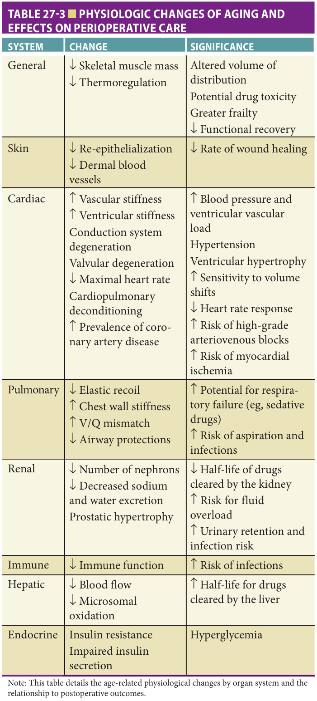

Study summary of Chapter 27 — Perioperative Care: Evaluation and Management; the book is the reference.

# Chapter 27 Study: Perioperative Care

**Study page only - full chapter not in the reader**

*Fast build from the book; not lane-reviewed.*

## Summary

### Establish the patient's baseline and goals

**[p. 371]**

- Older surgical patients are heterogeneous but particularly vulnerable to complications. Assess cognition, function, mobility, nutrition, swallowing, and whether the expected surgical result matches the person's goals. Establishing the true baseline supports realistic expectations, optimization/prehabilitation, and arrangements for recovery or postacute care (p371).
- Screening tools help identify risk but differ in predictive validity and feasibility. Evidence-based care is more effectively delivered through structured interdisciplinary processes across the whole surgical episode (p371).

**[p. 372]**

- **Chronologic age alone should not decide surgical eligibility.** Physiologic reserve differs across patients and across organ systems. Avoid presenting surgery simply as a “fix” without explaining its effect on everyday life (p372).
- Frailty reflects limited reserve and vulnerability. The physical phenotype includes weight loss, weakness, exhaustion, low activity, and slow gait. Preoperative frailty predicts complications, longer admission, and a greater likelihood of discharge to institutional care (p372–373).

**[p. 373]**

- Choose the frailty tool for the outcome and setting: the phenotype is associated with postoperative delirium; Edmonton Frail Scale predicts complications; Clinical Frailty Scale is associated with mortality and discharge away from home. Gait speed refines cardiac-surgery risk and identifies patients needing deeper evaluation (p373).
- Screen all older surgical patients for malnutrition, including those with obesity. Weight loss **>10% in 6 months** or **>5% in 1 month** warrants further nutritional assessment and a support plan. MNA is a validated option. Sarcopenia reduces functional recovery; weight loss also predicts delirium and pulmonary complications (p373).

**[p. 374]**

- Ask whether the patient can get out of bed/chair, dress/bathe, prepare meals, and shop. Any inability should prompt a full ADL/IADL assessment. Even dependency in a single ADL and a recent fall are meaningful risk markers (p373–374).
- Cognitive impairment, dementia, or previous delirium raises postoperative delirium risk. Screen cognition and investigate unexpected deficits; discuss benefits/risks in an understandable way and involve appropriate surrogates. Also assess depression, anxiety, PTSD, alcohol/substance use, and actual psychoactive medication exposure (p374).
- Reduced vascular compliance and a stiff ventricle impair diastolic filling. Fluid loading can cause pulmonary congestion; bleeding or third spacing can markedly reduce pressure through loss of preload. Ischemia further impairs relaxation (p374).

### Cardiac risk and the physiologic changes tested in past papers

**[p. 375]**

- Combining cardiac risk models with frailty measures improves outcome discrimination. CAD and heart failure remain major concerns: an estimated **25–30%** of perioperative deaths are cardiac. Look for occult as well as overt disease (p375).
- **LVEF <40%** is associated with increased death risk. **HF with preserved EF also increases MACE compared with no HF**; normal systolic function does not remove risk. The chapter notes that **two-thirds** of older adults with HF have normal systolic function (p375).
- Conduction-system aging predisposes to **drug-induced bradycardia and high-grade atrioventricular block**. Prior MI or low LVEF increases ventricular-tachycardia risk. Age **>65 years** independently predicts perioperative stroke, and **a history of stroke predicts MACE** (p375).

**Table 27-3: full organ-system relationships** (p375).

| System | Changes with aging | Perioperative implications |
| --- | --- | --- |
| General | Lower skeletal muscle mass and thermoregulation | Altered drug distribution, potential toxicity, greater frailty, reduced functional recovery |
| Skin | Less re-epithelialization and fewer dermal blood vessels | Slower wound healing |
| Cardiac | Increased vascular/ventricular stiffness; conduction and valve degeneration; reduced maximal heart rate; deconditioning; more CAD | Greater pressure and ventricular/vascular load, hypertension, ventricular hypertrophy, sensitivity to volume shifts, reduced heart-rate response, conduction block, ischemia |
| Pulmonary | Reduced elastic recoil, **increased chest-wall stiffness and V/Q mismatch**, reduced airway protection | Respiratory failure, especially with sedating drugs; aspiration and infection |
| Renal | Fewer nephrons, reduced sodium/water excretion, prostatic hypertrophy | Fluid overload, urinary retention/infection; see printed-table caveat below |
| Immune | Reduced immune function | Infection |
| Hepatic | Reduced blood flow and microsomal oxidation | **Longer half-life** of drugs cleared by the liver |
| Endocrine | Insulin resistance and impaired secretion | **Hyperglycemia** |

**Source-table caveats:** the renal row literally prints “↓ Half-life of drugs cleared by the kidney” [sic]; do not use that arrow as a renal dosing rule. The renal prose on [p376](#p376) describes reduced clearance and greater drug-toxicity risk. The cardiac row prints “arteriovenous blocks” [sic], while the same page's prose correctly says **atrioventricular blocks** (p375–376).

- **Pulmonary complications:** aging reduces elastic recoil/diffusing capacity and weakens cough/gag protection; smoking and chronic lung disease add risk. Atelectasis and aspiration are common. An estimated **14%** develop a major pulmonary complication, particularly after abdominal or cardiothoracic procedures. The list includes atelectasis, pneumonia, respiratory failure, chronic-lung-disease exacerbation, bronchospasm, pleural effusion, pneumothorax, and airway obstruction (p375).
- Postoperative pneumonia in older patients carries **15–20% mortality**. Obtain pulmonary and occupational-exposure history, and explicitly ask about swallowing difficulty or prior aspiration because subtle neurologic deficits may compromise airway protection (p375).

Book table: physiologic aging and perioperative effects (p375)

*Highlighting is the owner's annotation, not the book's.*

The physiologic-association questions test this table's content; their official references name the page without an explicit table label. The printed renal arrow and cardiac terminology are preserved in the image and explained above.

### Aspiration, renal and infectious complications, and the period of risk

**[p. 376]**

- **Aspiration risk:** stroke can impair swallowing, esophageal transit, and secretion control. Aging may reduce esophageal peristaltic-wave amplitude and lower-esophageal-sphincter tone, increase **hiatal hernia**, delay gastric emptying, and increase gastroesophageal reflux. These are the mechanisms relevant to the official aspiration question (p376).
- **Renal function:** glomerular/tubular aging reduces function, accelerated by hypertension, diabetes, and CAD. Low muscle mass reduces creatinine production, so a seemingly reassuring serum creatinine can conceal low clearance. Baseline insufficiency raises volume and acid–base risks (p376).
- Dehydration, fluid shifts, hypotension, and hypovolemia predispose to **acute tubular necrosis**, the most frequent postoperative renal-dysfunction cause described here. Drugs and contrast add nephrotoxicity; altered renal/hepatic handling increases drug toxicity (p376).
- **Infection:** prolonged devices, ventilation, and hospital stay are important risks. Infections of prosthetic material/devices complicate treatment; prolonged antimicrobial courses may cause nephrotoxicity and increase *C. difficile* risk. Targeted preoperative *S. aureus* decolonization is among evolving prevention strategies (p376).
- **Emergency surgery:** risk is particularly high in older patients because disease may present late or atypically and complications are more frequent. Excessive delay for “optimization” can convert a needed elective procedure into a higher-risk emergency; balance the delay against its consequences (p376).
- Stress hyperglycemia increases infectious risk and merits monitoring. Reduced mobility/sensation contributes to pressure injury: use repeated skin assessment and pressure unloading. Explain recovery time, realistic functional outcomes, possible rehabilitation/subacute care, and home support needs with the patient and family (p376).
- **Timing:** preoperative factors predict **7-day mortality** better than anesthesia duration or operator experience. After adjusting for baseline risk, spinal versus general anesthesia does not predict outcome in the account presented here. Risk is greatest immediately after surgery; **half of adverse events occur within 3 weeks**. Social support also affects recovery (p376).

### Preoperative planning: make the care plan match the goal

**[p. 377]**

- Cancer treatment can worsen preoperative health and add anxiety, increasing delirium/poor-outcome risk. Gather the surgeon's intended outcome, technique-specific risks, and the patient's health goals. Discuss meaningful possibilities explicitly—such as an ostomy and the lifestyle changes it entails (p377).
- Encourage a companion at visits and coordinate surgeons, medical clinicians, geriatrics, family, and community resources. Communication matters particularly when patients cannot convey history or concerns reliably. Integrated care should begin when surgery is scheduled (p377).
- **ACS NSQIP/AGS preoperative framework, Table 27-4:** assess what matters most (goals/expectations versus possible outcomes); mentation (cognition, capacity, depression, delirium risks); mobility (frailty, baseline function, falls); medication (accurate list, perioperative adjustment, polypharmacy, alcohol/substance dependence); and multimorbidity/multicomplexity (cardiac assessment, pulmonary risks/prevention, nutrition and intervention when severe risk, family/social support, and appropriately targeted diagnostic tests) (p377).

**[p. 378]**

- The postoperative continuation of Table 27-4 addresses delirium/cognition, acute pain, pulmonary complications, falls, nutrition, urinary infection, functional decline, and pressure injury. Repeated practical measures include pain control, a sleep-supportive environment, accessible sensory aids, family participation, early mobilization/PT/OT, minimizing catheters/tethers and inappropriate psychoactive drugs, resuming nutrition/dentures, and pressure/friction/shear reduction (p378).
- Structured interdisciplinary care connects preoperative optimization to hospital care and recovery, organized around what matters most, mentation, mobility, medication, and multimorbidity/multicomplexity (p378).

**[p. 379]**

- Comprehensive geriatric assessment integrates medical, psychological, functional, social, and environmental information into a perioperative plan. Postoperative priorities include anticipatory pain treatment, early mobilization, catheter removal, delirium prevention/recognition, and anticoagulation planning (p379).
- Ask about pain regularly; scheduled or anticipated-needs analgesia can prevent undertreatment. Bed rest promotes deconditioning, orthostasis, respiratory complications, thrombosis, contractures, constipation, and skin injury. If full mobilization is impossible, use upright positioning and physiotherapy (p379).
- Aim to remove urinary catheters by the next morning; consider intermittent catheterization for retention. Avoid use beyond **48 hours** unless retention cannot otherwise be managed, and do not give prophylactic antibiotics solely for a chronic catheter (p379).
- Delirium may be subtle and fluctuating; obtain repeated nursing/family observations. Dementia, prior delirium, older age, and cognitive decline increase risk. Start with environmental measures and orientation; medication may occasionally be needed for agitation threatening harm. The chapter reserves closely monitored benzodiazepines for alcohol-withdrawal delirium (p379).

### Postoperative cardiac/cognitive outcomes and anticoagulant management

**[p. 380]**

- Postoperative ischemic ECG changes predict events and worse long-term survival. The optimal routine surveillance strategy is undefined; without established CAD the chapter limits surveillance to signs/symptoms of dysfunction. Troponin belongs in suspected-MI evaluation; the significance of an isolated elevation requires context. Consider appropriate medical treatment and opening the infarct-related artery in suitable postoperative patients (p379–380).
- **Arrhythmias:** look for infection, hypotension, hypokalemia/hypomagnesemia, and hypoxia. Frequent ventricular ectopy/nonsustained VT may affect **more than one-third** of high-risk patients. Prophylactic antiarrhythmics other than beta-blockers are not recommended. Sustained VT warrants cardiology consultation, with or without hemodynamic compromise (p380).
- Approximately **25%** of older patients develop postoperative AF; age and surgery type predict it. Beta-blocker/amiodarone prophylaxis has shown some benefit but is not routinely recommended in this chapter. Transfusion is reserved for symptoms and possibly Hb **<7 g/dL**; small preoperative IV-iron trials before hip/knee replacement reduced postoperative transfusion requirements (p380).
- **Cognition:** one study found significant decline in **26%** of patients **>60 years**, **1 week** after abdominal/orthopedic surgery. Older age, more anesthetic exposure, and respiratory/infectious complications were risks. Cardiac bypass can introduce gas/particulate emboli and cerebral infarction; off-pump surgery had less short-term decline (**21% versus 29%**) but similar decline at **6 months (31% versus 38%)**. Include cognitive risk in nonemergency decisions for patients with dementia (p380).

**Anticoagulation: the regimen and qualifications printed in this edition** (p380).

- **Warfarin, usual INR goal 2.0–3.0:** withhold **4 scheduled doses** to allow INR **<1.5** before surgery; a usual INR **>3.0** may need longer. Check INR on the surgery day. If excessive, the book describes vitamin K **1 mg IV** or **2.5 mg orally**, with further reversal within **24 hours**; for urgent reversal it names fresh frozen plasma. When INR is **<2.0**, consider other prophylactic antithrombotic interventions (p380).
- **Recent DVT/PE:** elective surgery is best avoided for **at least 3 months** to allow adequate anticoagulation. **If delay is impossible**, the chapter recommends LMWH bridging for warfarin-treated patients before/after surgery while INR is **<2.0**. Stop LMWH **24 hours before** surgery; consider restarting **24–48 hours after**, according to procedure, bleeding risk, and thrombotic risk. This passage is not a blanket bridging rule for everyone taking warfarin (p380).
- **Dabigatran, rivaroxaban, apixaban:** **no perioperative bridging is required** in this account because of their relatively short half-lives. They can be stopped **1–4 days before** surgery according to renal function and the patient's/procedure's thrombotic and bleeding risks. The official rivaroxaban question tests the absence of a bridging requirement, not a universal interruption interval (p380).

**[p. 381]**

- Age alone is an inadequate risk estimate. Individual disease burden, baseline function/cognition, and patient goals guide selection, testing, and recovery planning. Minimally invasive approaches may reduce pain/recovery time and possibly operative risk; outcomes relevant to older adults require further study. The remaining page provides acknowledgments and further reading (p380–381).

## Drill

**1. Which baseline domains matter beyond chronological age?**

Answer

Cognition, functional dependence, mobility/frailty, nutrition, swallowing, comorbidities, social support, and the patient's goals. Age alone should not determine eligibility (p371–374).

**2. What weight-loss thresholds prompt further nutritional evaluation?**

Answer

More than 10% over 6 months or more than 5% over 1 month before surgery; screen even patients with obesity (p373).

**3. Does preserved systolic function eliminate MACE risk, and what historical neurologic event predicts MACE?**

Answer

No: HF with preserved EF increases MACE compared with no HF. A history of stroke predicts perioperative MACE. LVEF below 40% is associated with increased death risk (p375).

**4. How do conduction-system aging and previous MI affect arrhythmia risk differently?**

Answer

Conduction aging increases drug-induced bradycardia/high-grade atrioventricular block. Previous MI or low LVEF increases ventricular-tachycardia risk (p375).

**5. Match dermal perfusion, hepatic blood flow, and pulmonary V/Q changes to their surgical consequences.**

Answer

Fewer dermal vessels/slower re-epithelialization → slower wound healing. Lower hepatic flow/microsomal oxidation → longer drug half-life. Increased V/Q mismatch/chest-wall stiffness and reduced recoil → greater respiratory-failure risk (Table 27-3, p375).

**6. Why can serum creatinine underestimate perioperative renal vulnerability?**

Answer

Low skeletal muscle mass reduces creatinine production despite reduced filtration/clearance. Baseline renal insufficiency increases volume/acid–base risk, and altered drug handling increases toxicity (p376).

**7. Which gastrointestinal changes raise perioperative aspiration risk?**

Answer

Reduced esophageal peristaltic amplitude and lower-sphincter tone, more hiatal hernia, delayed gastric emptying, and reflux. Neurologic disease may also impair swallowing and secretion control. Hiatal hernia is the pertinent official-question answer (p376).

**8. Why might delaying surgery for optimization be harmful?**

Answer

Delayed diagnosis or prolonged optimization may allow a needed elective procedure to become a higher-risk emergency. Balance benefits of optimization against consequences of waiting (p376).

**9. When is postoperative complication risk greatest?**

Answer

Immediately after surgery; half of adverse events occur within 3 weeks. Baseline risk factors predict 7-day mortality better than anesthesia duration or operator experience in the chapter's account (p376).

**10. What belongs in the preoperative ACS/AGS framework?**

Answer

Goals/expectations; cognition/capacity, depression and delirium risk; frailty/function/falls; medication/substance review; and cardiac, pulmonary, nutritional, social-support, and focused diagnostic assessment. Coordinate the patient, family, surgery, and medical teams (p377).

**11. What reversible causes should be sought for a postoperative arrhythmia?**

Answer

Infection, hypotension, hypoxia, hypokalemia, and hypomagnesemia. Sustained VT requires cardiology input even if hemodynamics appear stable (p380).

**12. Does off-pump bypass eliminate later cognitive decline?**

Answer

No. The chapter reports lower short-term decline (21% versus 29%) but similar decline at 6 months (31% versus 38%). Cognitive risk belongs in decisions about nonemergency surgery in patients with dementia (p380).

**13. What warfarin interruption and INR checks are printed in the chapter?**

Answer

For a usual INR goal of 2.0–3.0, withhold 4 scheduled doses, aim for INR <1.5, and measure INR on the surgery day. A usual INR >3.0 may need longer interruption. These are the book's stated parameters (p380).

**14. After DVT/PE, how long should elective surgery ideally wait, and when does the discussed warfarin bridging pathway apply?**

Answer

At least 3 months. If delay is impossible, the book describes LMWH bridging while INR is <2.0, stopped 24 hours before surgery and considered again 24–48 hours afterward according to procedure, bleeding, and thrombotic risks (p380).

**15. Does rivaroxaban require LMWH bridging, and what determines the interruption interval?**

Answer

No; the same statement covers dabigatran and apixaban. The chapter gives 1–4 days before surgery, individualized to renal function, thrombotic risk, and surgical bleeding risk (p380).

### Table 27-3 — existing book image

[Hazzard 8e, Table 27-3, p.375](#p375)

[2025-Jun Q39](?chapter=bank&q=mcq-18b0ad7f9e472a626caf7cbe)
