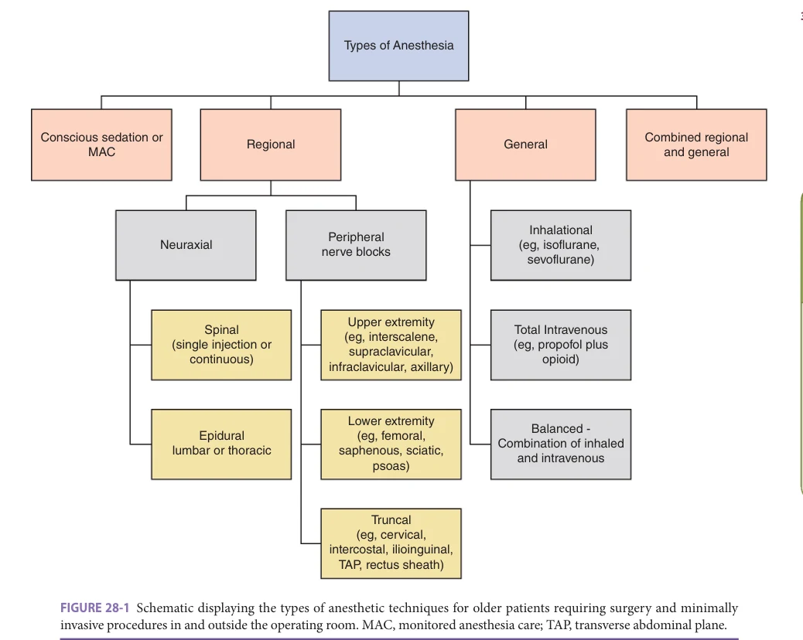
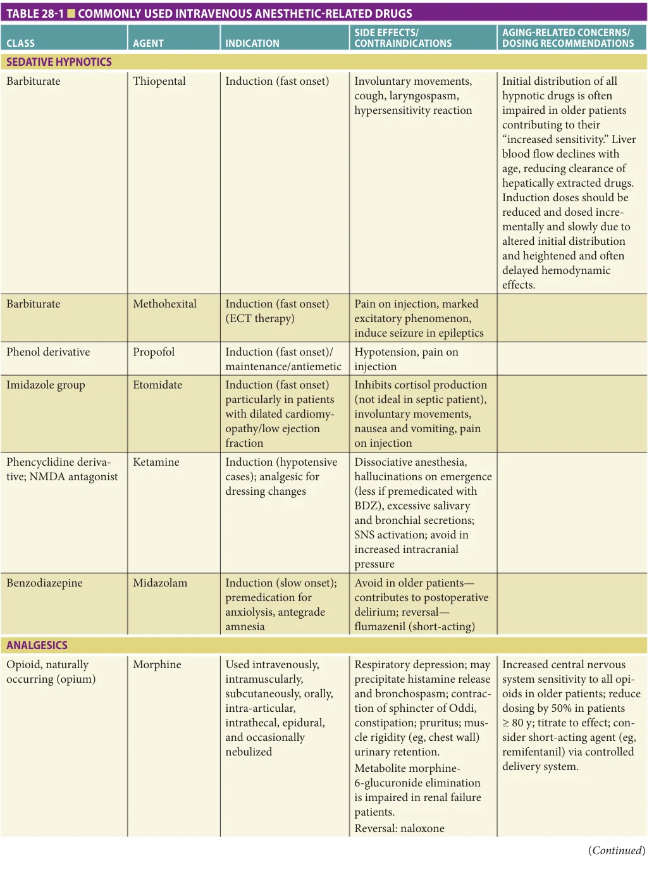
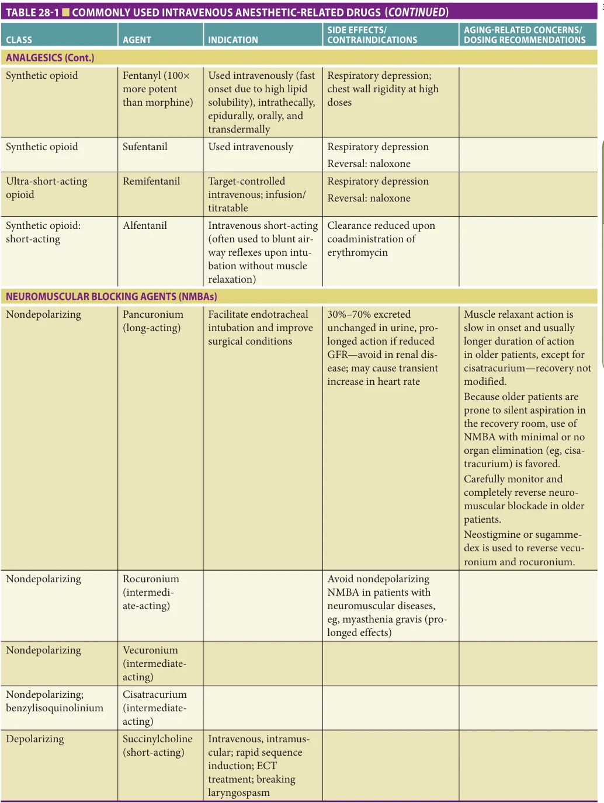
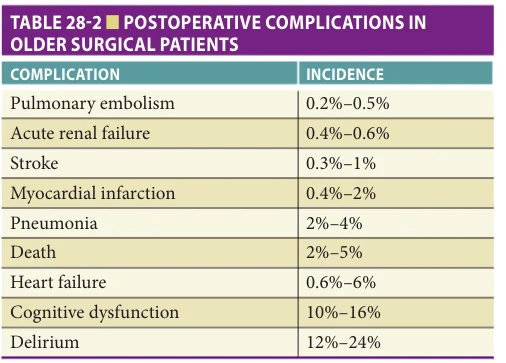
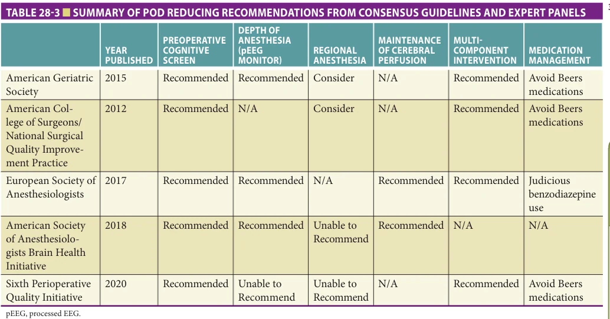
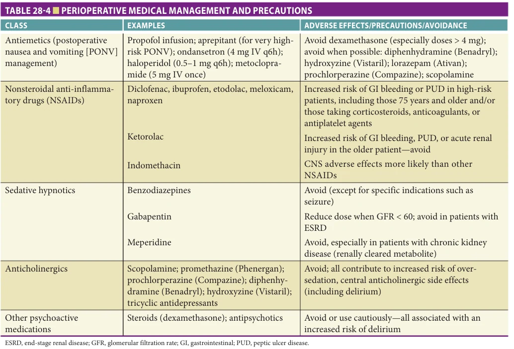

# Hazzard's Geriatric Medicine and Gerontology, 8e - Chapter 28: Anesthesia

Leanne Groban, Chandrika Garner

> **Status.** Fast build from the book; not lane-reviewed.

> Not cited in the 2020-2026 past papers.

> **Source and method.** Printed pages 383-398, from the marked 8th-edition copy (PDF page = printed page + 34). Prose follows its text layer; tables and figures are source-page crops. The book is canonical.

**[p. 383]**

## INTRODUCTION

By the year 2024, people 65 years and older will represent over a quarter of the global population. Soon, there will be more older people than children and more people at the extremes of old age than ever before. This trend in population aging will undoubtedly translate into increasing numbers of older adults in developed countries requiring invasive and minimally invasive procedures for revascularization (joint repair and replacement), urologic, and gynecologic-, gastrointestinal-, and ophthalmologic-related surgeries, and more. In the United States, for example, older adults already account for approximately 40% of all in-patient operations and about one-third of outpatient procedures performed annually. One of the major challenges of treating older patients is the heterogeneity of the geriatric population—and the need to individualize care for each patient to provide the best outcome. As the incidence of comorbidity increases with age, so does the risk for postoperative complications and longer hospital stays which underscores the collaborative roles that geriatricians, anesthesiologists, and surgeons are certain to play, moving forward in the care of the older surgical patient. Indeed, high quality care for older adults undergoing major and even minor surgical procedures requires a well thoughtout and all-inclusive approach to risk stratification, communication, and coordination. Accordingly, in July 2019, the American College of Surgeons initiated the Geriatric Surgery Verification (GSV) Program that provides hospitals with a validated list of 30 evidence-based and patientcentered standards for geriatric surgery, which hospitals can implement to continuously optimize surgical care for this vulnerable population. These standards define the resources and processes that hospitals need to have in place to perform operations effectively, efficiently, and safely in older adults (defined by 75 years and older), while also always prioritizing what matters most to individual patients with regard to their needs and treatment goals. At the time of composing this chapter, one hospital had achieved Level 1 verification of being a Geriatric Surgery Hospital, and 11 other institutions, among seven states, were at the “Commitment Level” of the verification process. Given the aging demographics and expected uptick in the need for surgical services in those 75 years and older, it is likely that all major

#### Learning Objectives

- Recognize the various types of anesthesia and associated drugs used in the intraoperative management of the older surgical patient.

- Review the impact of, and controversy around anesthesia and surgery as a cause of postoperative cognitive morbidity.

- Give general descriptions of the types of surgical approaches and associated anesthetic and monitoring techniques used in the older cardiac patient for treatment of coronary artery disease, aortic valve stenosis, and atrial fibrillation.

- Summarize the plan for the older patient who requires anesthesia for a procedure near the end of life who has an “Allow Natural Death” order in place and/or an implantable cardiac defibrillator.

#### Key Clinical Points

1. To date, there is no conclusive evidence that suggests one anesthetic technique is superior to others in the older surgical patient in terms of limiting postoperative dysfunction, for example, delirium and cognitive dysfunction, the most common postoperative complications in older persons.

2. As older adults are more sensitive to intravenous anesthetics, volatile agents, and opiates due to age-related changes in pharmacokinetics and pharmacodynamics, anesthetic dosing is age-adjusted and anesthetic depth continuously monitored by end-tidal anesthetic concentrations and physical signs. Because many of the assumptions about anesthetic depth might not be as reliable in older patients as they are in younger patients, brain function monitoring with processed electroencephalography (pEEG) or a bispectral index (BIS) monitor is often used. (Continued)

**[p. 384]**

3. While there is no recommended pharmaceutical for preventing postoperative delirium, best practice consensus guidelines advocate nonpharmaceutical interventions (eg, staff education, early mobilization, adequate pain control and assessments, frequent orientation, sleep-wake cycle preservation, early postoperative use of hearing and visual aids, etc) and avoidance of highrisk medications.

4. Limiting excessive anesthetic depth while avoiding awareness and recall after surgery in older patients is important for mitigating neurotoxicity and the potential for perioperative neurocognitive dysfunction, but it also reduces the risk of acute kidney injury, adverse cardiac events (eg, myocardial infarction [MI] or injury), and central nervous system ischemic events as a result of anesthetic-induced intraoperative hypotension.

5. The benefit of off-pump coronary artery bypass (OPCAB), regardless of the surgical approach, is the avoidance of manipulation of the aorta and need for a cardiopulmonary bypass (CPB) circuit and its associated risks. While no evidence supports OPCAB over CABG for reducing all-cause mortality, cardiac complications, or success of revascularization in the general population, subgroup analyses suggest improved outcomes in the geriatric cardiac surgery population.

6. Aortic stenosis is the most common single valve disease, with prevalence between 2% and 10% in patients over age 75. While there may be a benefit to avoiding CPB in the geriatric population, overall complication rates for transcatheter aortic valve replacement (TAVR) are as high as 20%, which includes a stroke rate of 2%.

7. Surgical procedures are common at the end of life. Conversations with the patient and/ or decision maker regarding the perioperative course of action are necessary and should involve both the surgeon and anesthesiologist. Automatic suspension of Allow Natural Death (AND) is not acceptable and any modifications must be discussed with the patient and documented, including verification of the “time” the modification is in place.

medical centers will move in the direction of GSV certification. It is nearly certain that geriatricians will play key roles in the shared decision-making process and interdisciplinary approach to continuously optimize surgical care for older adults. In view of this, this chapter will provide the reader with a general understanding of: (1) intraoperative management strategies (eg, regional vs general anesthesia [GA] vs sedation) aimed to minimize risk of some of the common complications of older patients (eg, postoperative delirium [POD] and cognitive dysfunction); (2) special concerns attached to geriatric cardiac procedures performed within and outside the operating room (eg, hybrid cardiovascular and electrophysiology suites); and (3) perioperative issues that relate to Allow Natural Death (AND) orders.

## TYPES OF INTRAOPERATIVE ANESTHESIA

The decision as to which kind of anesthesia that will be used is dependent on several factors including the patient’s medical history, the surgical procedure that is to be performed, the preference of the surgeon and anesthesiologist, and the patient’s first choice. As the primary goal is to provide the safest anesthetic with the best outcome possible, the anesthesiologist, who is the perioperative medicine expert, will thoroughly explain the options to the patient and surrogate while also discussing the rationale for recommending one over another method. The types of anesthesia that might be used include general anesthesia, regional (peripheral nerve blocks) or neuraxial anesthesia (eg, spinal or epidural), combined general and regional anesthesia, and conscious sedation (Figure 28-1). When either general or neuraxial anesthesia is deemed appropriate for an older adult, for instance in the case of hip fracture repair, neuraxial is often the preferred choice. With all anesthesia modalities, the patient’s breathing, oxygenation, heart rate, blood pressure (BP), and body temperature are closely monitored intraoperatively and in the postanesthesia care unit. To appreciate the latest medical literature on how anesthetic type might influence the most common postoperative complications among older adults undergoing surgery and anesthesia, a basic understanding of the different techniques available and the anesthetic agents used to ensure safe outcomes is warranted.

To begin with, GA is the state produced when a patient receives medications for amnesia, analgesia, muscle relaxation, and sedation. An anesthetized patient is considered being in a state of controlled, reversible unconsciousness. General anesthetics, in the form of inhalational (eg, isoflurane, sevoflurane, desflurane, nitrous oxide, and xenon) and/or intravenous agents (eg, propofol, ketamine, and etomidate) depress the central nervous system to a sufficient degree to permit the performance of surgery and other noxious or unpleasant procedures. To control breathing, the anesthesia care provider inserts either an endotracheal tube or a laryngeal mask airway into the trachea or pharynx,

**[p. 385]**

*FIGURE 28-1 Schematic displaying the types of anesthetic techniques for older patients requiring surgery and minimally invasive procedures in and outside the operating room. MAC, monitored anesthesia care; TAP, transverse abdominal plane.*

*Owner annotations/highlights are from the marked source copy, not the book.*

respectively, after the patient is rendered unconscious following induction of anesthesia. Maintenance anesthesia is commonly provided with volatile or inhalational anesthetics, which offer reliable control over the depth of anesthesia. Short-acting opioids (eg, fentanyl, sufentanil, or alfentanil) are used for analgesia along with the inhalational agent, because the latter has only weak analgesic properties. To facilitate endotracheal intubation and minimize the need for high-dose volatile anesthetics, neuromuscular blocking agents (eg, succinylcholine, rocuronium, vecuronium, or cisatracurium) are often used. Table 28-1 shows the commonly used intravenous drugs, their side effects/contraindications, and dosing concerns/ recommendations for the older patient. Standard monitoring, including pulse oximetry, electrocardiogram (ECG), noninvasive BP device, temperature monitor, measurement of end-tidal carbon dioxide, inspired oxygen concentration, and low oxygen concentration and ventilator disconnect alarms are employed in all older adults undergoing a general anesthetic. A peripheral nerve stimulator is also used to guide dosing of short-acting neuromuscular

blocking agents and to ensure complete reversal of neuromuscular blockade, if extubation is planned at the end of the surgical procedure. Indeed, even a small amount of leftover neuromuscular blockade can have profound effects on pharyngeal muscle function, predisposing the older patient to aspiration pneumonia. As older adults are more sensitive to intravenous anesthetics, volatile agents, and opiates due to age-related changes in pharmacokinetics and pharmacodynamics, anesthetic dosing is age-adjusted and anesthetic depth continuously monitored by end-tidal anesthetic concentrations and physical signs. Because many of the assumptions about anesthetic depth might not be as reliable in the older adult as they are in younger patients, brain function monitoring with processed electroencephalography (pEEG) or a bispectral index (BIS) monitor is often used. Limiting excessive anesthetic depth while avoiding awareness and recall after surgery in older patients, is a key tenet of the American Society of Anesthesiologist’s Brain Health Initiative. Not only is this important for mitigating neurotoxicity and the potential for perioperative neurocognitive dysfunction, but it also reduces the risk of

**[p. 386]**

*TABLE 28-1 ■ COMMONLY USED INTRAVENOUS ANESTHETIC-RELATED DRUGS*

*Owner annotations/highlights are from the marked source copy, not the book.*

**[p. 387]**

*TABLE 28-1 ■ COMMONLY USED INTRAVENOUS ANESTHETIC-RELATED DRUGS*

*Owner annotations/highlights are from the marked source copy, not the book.*

**[p. 388]**

acute kidney injury, adverse cardiac events (eg, myocardial infarction [MI] or injury), and central nervous system ischemic events as a result of anesthetic-induced intraoperative hypotension. In general, BP is maintained within 20% of the patient’s baseline and mean arterial pressure (MAP) is kept at 65 mm Hg or above (and systolic BP ≥ 100 mm Hg). However, in older patients and particularly those with preexisting hypertension, target mean BPs are best kept well above 65 mm Hg. Indeed, increasing evidence in the anesthesia literature shows that even brief periods (eg, ≥ 10 minutes) of perioperative hypotension (defined as systolic BP < 100 mm Hg or MAP < 60–70 mm Hg) associate with adverse cardiac events.

Regional or neuraxial anesthesia is the injection of a local anesthetic around major nerves (eg, axillary, femoral, interscalene, and intercostal nerve blocks) or in the subarachnoid (spinal anesthesia) or epidural spaces (epidural anesthesia), to block a limb and/or a large region of the body (eg, hip fracture repair). Regional anesthesia (RA) provides excellent muscle relaxation in addition to intraoperative and postoperative pain control, given that local anesthesia-induced blockade of sodium channels can last 8 to 12 hours, depending upon the dose, or employment of a catheter for continuous local anesthetic delivery for analgesia (eg, epidural catheter). Upon placement of the regional or neuraxial block, small, incremental doses of intravenous fentanyl or remifentanil might be given to help position the patient. Intraoperatively, low-dose propofol, or dexmedetomidine infusions, is oftentimes administered to provide conscious sedation, as needed. As RA has been linked to improved postoperative pain scores and patient satisfaction, reduced opioid consumption, and opioid-related side effects (eg, nausea, ileus, respiratory depression), it should be considered part of a multimodal pain-reducing approach (eg, surgical field infiltration with local anesthetics, utilization of peripheral nerve blocks, nonsteroidal anti-inflammatory agents, clonidine, and dexmedetomidine) whenever possible in older patients prone to developing postoperative respiratory depression.

It might seem intuitive to care providers that the procedure becomes “less intrusive” by choosing RA, and accordingly, leads to better outcomes. Indeed, seeing patients back in their respective rooms, awake, oriented, eating, and conversing with family members after an orthopedic procedure implies a speedy and favorable recovery. However, the controversy persists as to whether RA is better than GA with respect to patient mortality and morbidity. For hip fracture repair, for example, the International Fragility Fracture Network recently shared no preference for or against general or neuraxial anesthesia, but rather stated that hospitals should follow their own local guidelines. In a 2018 systematic review and meta-analysis, no differences in 30-day mortality or serious events (eg, pneumonia, acute MI, renal failure, or delirium) were found for RA compared to GA for patients undergoing hip fracture surgery. Moreover, a retrospective cohort study by Neuman and colleagues

published in 2014, involving over 56,000 patients 50 years or above undergoing hip repair surgery could not find a difference in 30-day mortality when RA was compared to GA, but did show that RA led to a modestly shorter length of hospital stay. Until the completion of two large-scale, multicenter, randomized controlled trials that are examining the efficacy of RA versus GA for hip fracture surgery in older individuals—the REGAIN trial with a primary endpoint of walking after 60 days and other patients-centered outcomes up to 1 year postop, and the iHOPE trial with an endpoint of all-cause mortality or cardiac or pulmonary events within 30 days postoperatively—anesthesiologists base anesthetic modality choice on patient’s preferences, and the patient’s comorbid conditions and potential for postoperative complications.

Because many older adults are taking anticoagulant and antiplatelet medications for the prevention of stroke and thromboembolism, these patients are at a heightened risk for neuraxial bleeding and the development of an epidural hematoma. While this does not necessarily preclude the use of neuraxial techniques (eg, spinal or epidural), or paravertebral blocks, deep plexus blocks, and deep peripheral nerve blocks (eg, in anatomic locations not amenable to the application of pressure to control hemorrhage), it does require careful planning and communication among members of the patient’s perioperative care team, the patient’s primary physician, and the patient. The American Society of Regional Anesthesia and Pain Medicine 2018 consensus guidelines for patients receiving hemostatic altering medications provide anesthesiologists with information on timing of drug cessation prior to neuraxial techniques, bridging therapy in cases of warfarin usage, maintenance of neuraxial catheters, and timing for starting medications after a neuraxial technique or removal of the neuraxial catheter. For many of the newer medications, recommendations are based on elimination half-lives. The mechanism of drug elimination and clearance is also taken into consideration as many of the antiplatelet drugs are renally metabolized and have prolonged action in those older patients with reduced renal function.

Monitored anesthesia care is the intravenous administration of short-acting sedatives, analgesics, and anxiolytics to help a patient relax during minor procedures (eg, colonoscopy, transesophageal echocardiogram, and interventional radiologic procedures) that do not require GA. This is sometimes referred to as conscious sedation. Because of the increased risk for postoperative neurocognitive dysfunction among older patients, benzodiazepine administration should be avoided and sedation and analgesia be achieved with propofol, ketamine, or dexmedetomidine. Because of the “fine line” between light and deep sedation in older individuals, all dosing of sedatives and analgesics are reduced, and the spontaneously breathing patient receiving supplemental oxygen is continuously monitored for respiratory rate, oxygen saturation, endtidal carbon dioxide, in addition to all other standard

**[p. 389]**

ASA (American Society of Anesthesiologists) monitoring. Changes in capnography values and waveforms often help clinicians understand a patient’s level of comfort, sedation, and respiratory function during procedural sedation. Indeed, if the patient is not communicative or unable to cooperate, reluctant to be awake, and/or if the procedure length is deemed to be longer than usual, GA might be a better choice to achieve the goal of a rapid recovery.

## POSTOPERATIVE COMPLICATIONS IN OLDER ADULTS

It is well accepted that older age is a risk factor for perioperative mortality and morbidity, including cardiovascular, pulmonary, renal, and neurocognitive complications. Of the postoperative complications, cognitive morbidity in the form of POD and persistent cognitive decline are significantly more prevalent when compared to any of the other complications (Table 28-2). Accordingly, this section will provide insight on the impact that anesthesia and surgery might have on the development of perioperative neurocognitive disorders (PND) and strategies that are used to help mitigate its occurrence. See Chapter 27, Perioperative Care: Evaluation and Management, for specifics on risk factor assessment for PND.

In order to unify the neurocognitive disorders seen by anesthesiologists with the cognitive classifications observed in the general population based on the Diagnostic and Statistical Manual for Mental Disorders, fifth edition (DSM-5), the term “perioperative neurocognitive disorders” was established in 2018. This term encompasses patients presenting for surgery with preexisting neurocognitive disorders (eg, mild cognitive impairment and Alzheimer disease), and those with POD, delayed neurocognitive recovery (cognitive decline up to 30 days after surgery), and postoperative neurocognitive disorder (defined as a decline in cognition that persists or is diagnosed up to 12 months after the procedure). Delayed neurocognitive recovery and postoperative neurocognitive disorder align with mild cognitive impairment and dementia. In this chapter,

*TABLE 28-2 ■ POSTOPERATIVE COMPLICATIONS IN OLDER SURGICAL PATIENTS*

*Owner annotations/highlights are from the marked source copy, not the book.*

postoperative cognitive dysfunction (POCD) and postoperative neurocognitive disorder are used interchangeably given that much of the literature to date has used the former term.

### Postoperative Delirium: Impact of Anesthesia

POD is a common and serious complication of anesthesia and surgical care. Unlike emergence delirium, which occurs immediately after emergence from anesthesia and resolves quickly, POD may show up a week after the procedure or even at the time of hospital discharge. It has severe consequences to the patient including increased risk of mortality, need for discharge to an institution, accelerated cognitive and functional decline, and an increased risk of falls. At the medical center level, POD associates with increased length of stay and higher readmission rates—both leading to increased costs. POD not only affects perioperative care, it takes a tremendous psychological toll on caregivers and the patient. While the surgical procedure might have gone flawlessly, the older patient might be referred to by his or her family as “just not the same.” For the patient, this can also be very isolating and contribute to posttraumatic stress disorder.

The occurrence of POD in older patients after noncardiac surgery in past studies has ranged between 5% and 52%. In a 2020 systemic review and meta-analysis involving 17,241 patients (35 studies) undergoing GA for noncardiac surgery, and 15,090 patients (19 studies) for cardiac surgery the pooled incidence of POD was 17% (95% confidence interval [CI]: 14%–9.2%) and 15% (95% CI: 13%–18%), respectively. In another recent study involving over 20,000 surgical inpatients, people 65 years or older, the unadjusted average rate of delirium occurrence across 30 institutions was 12%. By specialty, the highest rates of POD occurred for cardiothoracic (14%), orthopedic (13.0%), and general surgery (13.0%), and the lowest rates were associated with urologic (6.6%) and gynecologic procedures (4.7%). Multivariate analyses further indicate that patients at highest risk of POD are older, have more comorbidities (eg, higher ASA classification), more likely to have undergone emergent surgery, and more likely to have preexisting cognitive impairment. Indeed, many of the same patients who develop POD are also those who are frail. Frailty is common in older elective surgical populations; 38% to 54% of those greater than or equal to age 70 in one study scored as prefrail and 35% to 41% as frail on comprehensive frailty measures. Screening for frailty and cognitive impairment preoperatively using the FRAIL scale and the Animal Verbal Fluency test in older elective spine surgery patients identified those at high risk for the development of postoperative delirium. Accordingly, it is important to inform older patients who screen positively for preoperative frailty or cognitive impairment that their risk for developing POD is increased and their anesthesia care team will take a proactive approach to minimize this risk. Furthermore, educating family and caregivers as to what to look for postoperatively will help identify POD early, if it occurs.

**[p. 390]**

Currently, there is limited evidence in support of one anesthetic modality over another to reduce POD. In a 2018 Cochrane database review, no differences with regard to safety and postoperative delirious symptoms were shown between total intravenous anesthesia (eg, propofol) versus use of volatile agents, including Xenon, in older patients undergoing noncardiac surgery. The effect of RA versus GA on delirium in hip fracture repair patients also remains inconclusive, in part because rigorous and adequately powered studies, to date, are lacking.

Adjunctive pharmacologic therapies have been examined for their benefit in reducing the occurrence of POD. The selective alpha-2 adrenergic receptor agonist dexmedetomidine is one such drug that has shown promise in reducing the risk of POD. In three meta-analyses conducted over the past several years, intraoperative infusions of dexmedetomidine were found to lower the incidence of POD in older non cardiac surgical patients, albeit with a potential increase in bradycardia. Unfortunately, there remains insufficient evidence for dexmedetomidine administration to have the same POD-reducing benefit in older cardiac surgery patients. Other adjuvants have been tested with the goal of improving pain control without excessive need for opioids. Both gabapentin and ketamine have been studied in randomized controlled trials, but no role for these adjuvants in reducing the incidence of POD was reported.

Guiding anesthetic depth with pEEG monitoring has been considered in the armamentarium of anesthesiologists to help limit the risk of delirium in some older patients. As the BIS monitor produces a single number between 0 and 100, it is assumed that the lower the number, the deeper the anesthesia. Titrating the dose of volatile or intravenous anesthesia to a BIS of 40 to 60 or 50 to 60 versus standard monitoring with end-tidal anesthetic concentration has been shown to reduce the rate of POD in four trials involving general anesthesia and in one study that randomized patients into receiving BIS target values of at least 80 (intervention) versus 50 (control) during sedation with propofol in spinal anesthesia. However, a large prospective trial entitled Electroencephalography Guidance of Anesthesia (ENGAGES) that randomized GA in adults (age > 60 years) undergoing major surgery (including cardiac, gastrointestinal, thoracic, gynecologic, hepatobiliary-pancreatic, urologic, and vascular procedures) to pEEG-guided or routine care found no difference in the incidence of delirium between groups (26% in the EEG group and 23% in usual care). Even so, favorable findings for brain depth monitoring for POD reduction in the ADAPT-2 trial (Anesthetic Depth and Postoperative Delirium Trial-2) suggests that cognitively vulnerable older patients may actually benefit from reducing time in burst suppression during the surgical procedure. While the existing data do not support routine use of pEEG monitoring for the prevention of POD in older patients, it remains a practical monitor to consider for those older adults who have preexisting PND, and when the goal is to facilitate rapid emergence and recovery.

In summary, except for possibly dexmedetomidine administration, none of the approaches (eg, intravenous vs inhalational anesthesia, regional vs general anesthesia, incorporation of processed EEG monitoring, use of adjuvants such a gabapentin or ketamine) have sufficient evidence to support their use in the reduction of POD in older patients. What we do have available are “best practice” consensus guidelines from various professional societies and working groups, including the American Geriatric Society (AGS), the American College of Surgeons (ACS) in conjunction with NSQIP, the European Society of Anesthesiology, the International Society Perioperative Neurotoxicity working group, and the American Society for Enhanced Recovery and Perioperative Quality Initiative Joint Consensus. A summary of the recommendations by these expert panels is presented in Table 28-3. Notably, multicomponent, nonpharmaceutical interventions (eg, frequent orientation, reinstitution of dentures, hearing and vision aids, early mobilization, preservation of day/sleep cycles, staff education, adequate and frequent pain assessment, early removal of indwelling catheters, adequate hydration, and early reinstitution of nutrition) and avoidance of high-risk POD medications (eg, Beers Criteria) are recommended by nearly all groups in the management of modifiable risk factors for delirium.

### Postoperative Cognitive Dysfunction: Impact of Anesthesia

Two questions may surface among older patients slated for a surgical procedure—“does POD lead to dementia?” and/ or “will anesthesia and surgery provoke dementia?”—for which geriatricians should have some knowledge. With respect to the first question, findings from several earlier studies (2008–2017) suggest that POD may be a predictor of progression to dementia and cognitive decline years after surgery. For example, Inouye and colleagues in 2016 found nondelirious patients crossing the trajectory of cognitive decline at 36 months when compared to their baseline cognitive status, whereas patients with POD crossed the trajectory to POCD at 12 months after surgery. However, more recent work suggests that delirium and cognitive dysfunction after surgery are independent and distinct entities. In a retrospective cohort study of 560 older noncardiac surgery patients, fewer than half of those who developed delirium (134 of 560 or 24%) went on to develop POCD at 1 month (47%), but this proportion dissipated after 2 (23%) and 6 months (16%), implying that POD and long-term POCD might be different disorders. The second question, “will cognitive function decline after surgery?” is justifiable. The association between exposure to anesthesia and surgery to long-term cognitive trajectory continues to be a topic of debate. Longitudinal data from a cohort of older adults (n = 1819) in the Mayo Clinic Study of Aging demonstrated a small decline in cognition in those who had undergone surgery versus those who had no exposure to anesthesia and surgery in the 20 years prior to their enrollment. Using participants from the Whitnall II cohort study, Krause

**[p. 391]**

*TABLE 28-3 ■ SUMMARY OF POD REDUCING RECOMMENDATIONS FROM CONSENSUS GUIDELINES AND EXPERT PANELS*

*Owner annotations/highlights are from the marked source copy, not the book.*

et al reported modest reductions in cognition coincident with those who were admitted for major surgery, whereas a strong association with cognitive decline was found for those hospital admissions that were for medical only reasons. In a nationwide population-based cohort study from Korea involving nearly 45,000 patients (50 years and older) who required surgery, the hazard ratio for developing dementia over the 12-year study period was 1.28 after adjusting for covariates when compared to 175,000 agematched controls. Taken together, POD is likely not part of a continuum to POCD or long-term dementia, but rather a separate entity. People who experience POCD do not necessarily have POD first. Also, hospital stays for surgery are not linked to higher risks for PND than admissions for medical only reasons.

To ascertain whether the brain is “injured” by anesthesia, the association between exposure to GA versus RA and the risk of developing dementia has been considered. In a population-based propensity study involving 41,700 community-dwelling individuals 66 years or older who underwent one of five elective surgeries by GA or RA, Velkers and colleagues found, after matching 7500 patients in each group, no difference in the onset of dementia up to 5 years after surgery. Going one step further, the effects of sevoflurane GA without surgery, in 59 healthy volunteers between 40 and 80 years, was reported to have no adverse influence on plasma biomarkers of neurological injury or systemic inflammation. In fact, a minimum alveolar concentration (MAC) of sevoflurane actually reduced plasma tau, neurofilament light (NF-L), and glial fibrillary acidic protein (GFAP) 5 hours after anesthesia when compared to respective baseline values.

As anesthesia alone does not appear to be a significant harbinger to the onset of dementia, others found that the extent of surgery has an impact on the development of neurocognitive decline. In a large data set from the Korean National Health Insurance Services, Choi et al identified nearly 64,000 patients with a diagnosis of gastric cancer who underwent curative gastrectomy surgery and compared them to 203,000 age-matched controls for onset of dementia. Interestingly, these investigators found no differences in dementia after surgery in the partial gastrectomy group but a 1.3-fold higher risk of dementia development in the total gastrectomy group when compared to controls. This finding points to the potential for a “dose response” effect of surgery on postoperative neurocognitive disorders, which should be considered when planning surgery in older patients.

Taken together, PNDs are common complications in older adults undergoing anesthesia and surgery which have serious consequences. The etiology underlying postoperative delirium, delayed cognitive recovery and/or postoperative cognitive decline remains poorly understood, and is unlikely a distinctive cause. In those who are at an increased risk for PND, for example, preexisting dementia, minimally invasive or less extensive procedures, or a surgery that might be linked to functional improvement (eg, cataract surgery), or one that associates with dementia risk reduction (eg, carotid endarterectomy, abdominal aortic aneurysm repair) should be considered. To date, no recommended intraoperative anesthetic technique or pharmaceutical PND prevention exists, but rather standardized therapeutic concepts in the perioperative period (eg, staff and patient education, early mobilization, good

**[p. 392]**

*TABLE 28-4 ■ PERIOPERATIVE MEDICAL MANAGEMENT AND PRECAUTIONS*

*Owner annotations/highlights are from the marked source copy, not the book.*

pain control and adequate pain assessments, maintenance of normothermia, avoiding excessive BP fluctuations, and avoiding benzodiazepines and anticholinergic medications) are being incorporated into hospital practice bundles and electronic medical record alert systems to help ensure safe and optimal outcomes in the geriatric surgical population. Table 28-4 lists recommendations for the prevention and management of postoperative nausea and commonly used classes of other perioperative drugs that require caution with use or avoidance in older patients.

## CARDIAC PROCEDURES COMMON TO OLDER ADULTS: ANESTHETIC IMPLICATIONS

Both structural and electrical cardiac diseases are common in patients over the age of 75. Structural cardiac disease includes coronary artery disease (CAD) and valvular pathology—particularly aortic stenosis and mitral regurgitation (MR). Among the electrical cardiac diseases regularly diagnosed in the older adult are atrial fibrillation (AF) and sinus node dysfunction. Procedures to treat these diseases are routinely performed in patients over the age of 75 years. While there is a tendency to prefer less invasive procedures in this patient population, correction

of certain cardiac lesions requires GA with endotracheal intubation, invasive arterial pressure monitoring, and central venous access. The standard anesthetic for cardiac surgery in the older adult provides hemodynamic stability, amnesia, analgesia, end-organ protection, and the ability for rapid emergence postoperatively. Numerous studies have attempted to show advantages of specific anesthetic drugs and adjuvants over others to achieve these goals but results remain equivocal.

Patients with significant cardiac disease, whether or not they are undergoing procedures to address their cardiac disease, often require specific monitoring beyond typical GA monitors described earlier in this chapter. In patients with reduced ventricular function or severe valvular disease, an arterial pressure monitor called an arterial line is often placed in one of the radial arteries prior to, or immediately after, induction of GA. Preinduction placement of an arterial line allows for the anesthesiologist to measure beatto-beat arterial BP variations during anesthetic induction. As discussed earlier, induction of GA can lead to changes in BP because many of the agents used to induce and maintain GA cause peripheral vasodilation and hypotension. Patients with severe cardiac disease may not tolerate long periods of hypotension; while invasive pressure monitoring will not prevent or treat hypotension, it will allow

**[p. 393]**

the anesthesiologist to closely monitor BP and treat small changes more quickly than would be possible with a noninvasive BP monitoring system that measures only every few minutes. Transesophageal echocardiography (TEE) allows for real-time monitoring of cardiac ventricular and valvular function. TEE is commonly performed after induction of GA and endotracheal intubation in patients undergoing cardiac surgery and sometimes in those with reduced systolic function or “tight” aortic stenosis who require noncardiac surgery. TEE is more invasive than transthoracic echocardiography (TTE), but TEE has the advantages of being performed by an anesthesiologist at the head of the bed without interfering with a sterile surgical field, and it provides significantly better image quality than TTE for most patients. Central venous access is typically obtained via the right internal jugular vein. An introducer placed in this vein can allow the anesthesiologist to place a pulmonary artery catheter in selected patients having cardiac surgery with cardiopulmonary bypass. Postprocedure, patients are typically transferred to the intensive care unit (ICU) for continued monitoring and mechanical ventilation. Specific considerations for selected cardiac diseases and associated interventions that require anesthesia are discussed further.

### Anesthesia for Coronary Artery Bypass Grafting and Percutaneous Interventions

As patients age, the incidence of CAD increases. An estimated 30% of patients over the age of 75 have clinically significant coronary disease, compared with 8% of patients younger than 65 years. While many of these patients can be treated by a percutaneous intervention (PCI), certain lesions are best repaired surgically. Benefits of coronary artery bypass graft (CABG) surgery over PCI are less well-defined in patients 75 years and older than in those younger than 75 or middle-aged. Standard CABG surgery is performed under GA with invasive arterial pressure monitoring, endotracheal intubation, central venous line placement with or without a pulmonary arterial catheter. Adverse outcomes associated with CABG surgery include stroke, renal injury, and postoperative neurologic dysfunction. Studies show that older patients are more likely to have more severe disease, such as left main or multivessel CAD with concomitant left ventricular dysfunction. In combination with enhanced cardiac disease severity, decreased functional capacity, frailty, and cognitive impairment may lead to worse outcomes in this patient population when compared to their younger counterparts. Other risk factors widespread in this population, including smoking, obesity, diabetes, and hypertension, further contribute to less favorable outcomes than in younger cardiac surgical patients.

As an alternative to traditional CABG with cardiopulmonary bypass (CPB), certain surgeons will offer off-pump coronary artery bypass (OPCAB) surgery to patients with select lesions. OPCAB can be performed via a conventional sternotomy or a minimally invasive approach via a left thoracotomy. The minimally invasive approach may include

a robotic surgical technique. The incision for minimally invasive OPCAB is smaller than a traditional sternotomy, but the pain score associated with the thoracotomy is often higher than that of a sternotomy. Surgery performed via a thoracotomy requires lung deflation on the surgical side. To achieve this, the anesthesiologist must selectively ventilate one lung while the surgeon is working. This approach may not be appropriate for patients with significant lung disease, as they may not tolerate one-lung ventilation. The benefit of OPCAB, regardless of the surgical approach, is the avoidance of CPB and its associated risks. OPCAB versus CABG has been extensively studied; however, no clear data, to date, demonstrate a significant advantage of one over the other in all-cause mortality, cardiac outcomes, or success of revascularization in the general population. Interestingly, some subgrouping analyses suggest improved outcomes of OPCAB over CABG in the geriatric population. Indeed, OPCAB that avoids manipulation of the ascending aorta (eg, which is usually cross-clamped prior to the initiation of CPB in CABG surgery) may lead to improved neurologic outcomes. Some patients are best served by a hybrid approach that typically combines off-pump surgical revascularization for the left anterior descending artery with a PCI to repair other high-grade lesions. This staged approach allows for complete revascularization while limiting the time under GA.

### Anesthesia for Aortic Valve Replacement

Aortic stenosis is the most common single valve disease, with a prevalence between 2% and 10% in patients over age 75. Because senile calcific aortic stenosis increases with aging, procedures that replace the aortic valve are offered to patients in this age group. Indications for aortic valve replacement include severe aortic stenosis and symptomatic moderate aortic stenosis. Aortic valve replacement can be performed in a variety of ways. The standard approach is via a midline sternotomy with CBP. Minimally invasive aortic valve replacement can be performed on CPB via an upper hemi-sternotomy or anterior thoracotomy. All three surgical approaches have a clinically equivalent 1.2% risk of stroke. As with OPCAB, thoracotomy approaches require lung isolation. An alternative to surgical valve replacement is a transcatheter aortic valve replacement (TAVR). While TAVR tends to be more commonly performed in the “middle- and oldest-old” (mean age of 83 years) age groups, improvements in technology and reductions in associated complication rates have expanded its potential to the “youngest-old” (65–74 years) and to those considered to be at low-risk. TAVR is typically performed in a percutaneous manner via the femoral artery. The valve is delivered retrograde up the descending aorta and deployed without removing the patient’s native aortic valve. At some centers, TAVR is performed with GA and endotracheal intubation; at others, it is performed with a local anesthetic at the femoral puncture site along with varying levels of conscious sedation. Even for cases where sedation is planned,

**[p. 394]**

conversion to GA is not uncommon. Reasons for conversion to GA include the patient’s inability to cooperate by remaining motionless and/or inability to breathe comfortably while lying flat, or the proceduralist has a need for better imaging of the aortic valve—thereby necessitating placement of a transesophageal probe for TEE, or because of a procedural complication. TAVR often is typically performed with invasive BP monitoring and robust intravenous access. In patients who have significant distal aortic, iliac, or femoral arterial disease, transfemoral placement of the valve may not be possible. For these patients, surgical cutdown to one of the major arteries (femoral, axillary, carotid, or aortic) may be required for TAVR placement. Due to the discomfort associated with surgical cutdown, GA with endotracheal intubation is required. Patients who require intubation during the procedure are typically extubated at the end of the procedure, although due to the femoral vessel access, they must remain supine for several hours in order to reduce bleeding risk. Post TAVR, patients may not require ICU admission and are able to leave the hospital after 1 or 2 days, representing a lower level of required postoperative care compared with surgical aortic valve replacement. Even so, overall complication rates for TAVR are still as high as 20%; with stroke rates, significant postprocedure paravalvular leaks, and major bleeding accounting for 2%, 3.6%, and 6%, respectively.

### Anesthesia for Mitral Valve Repair/Replacement

MR is the most frequently acquired valvular heart disease in the United States; this may be due to the many underlying causes of MR. Up to 50% of patients with left ventricular dysfunction have some MR. The mitral valve can be repaired or replaced surgically utilizing CBP with GA, endotracheal intubation, invasive BP monitoring, and TEE. After addressing MR, the left ventricular afterload can be dramatically increased; patient selection for mitral valve intervention is important because some patients will not be able to tolerate this increased afterload. In the hands of an experienced surgeon, operative risks and recurrence of MR are low. Overall, surgical mortality is estimated at less than 2% in patients with an average age of 60 years. Newer technology for addressing MR is constantly being developed. There are several methods for decreasing MR including edge to edge repair techniques, annuloplasty bands to decrease the size of the valve, neochords, and percutaneous mitral valve replacement. The nonsurgical techniques for mitral valve repair are not as well established as those for treating aortic stenosis, and thus are reserved for patients who are a prohibitive surgical risk. As of 2020, only the MitraClip (Abbott) is Food and Drug Administration (FDA) approved in the United States. The MitraClip clasps the edges of the two leaflets together in both phases of the cardiac cycle to decrease regurgitation. This procedure requires GA, invasive arterial pressure monitoring, and TEE guidance. Patients are typically extubated at the end of the procedure, although due to the large caliber venipuncture,

they must remain supine for several hours in order to reduce bleeding risk. Patients who cannot tolerate the flat time, due to dyspnea or poor cooperation, may need to remain intubated with sedation during this recovery period.

### Atrial Fibrillation and Anesthesia for Cardiac Ablation Procedures

AF is a common comorbidity in the geriatric population; the median age of patients with AF is 75 years. Incidence of AF increases with age and is 2.3% in people older than 40 years, 5.9% in those older than 65 years, and 10% in those older than 80. Patients with AF are anticoagulated to decrease the risk of stroke from embolization of left atrial clot; the proportion of strokes due to AF is likely greater than 20%. Due to the high prevalence of AF in this patient population and the increased risk of anticoagulation in older patients who are at increased risk of falls, AF ablation procedures are frequently performed in this group. Recurrence in AF is less than 50% after catheter-based ablation compared with 80% for those treated with antiarrhythmic medicines alone. AF ablation is typically a catheter-based procedure with access via the femoral vein. Anesthetic management includes GA with endotracheal intubation, possible TEE to assess for cardiac muscle paralysis, and arterial access. Arterial access is generally placed after anesthetic induction for monitoring of BP and heparinization. The patient must be heparinized during the procedure because the catheter crosses the interatrial septum into the left atrium to gain access to the pulmonary veins for ablation. As long as the catheter is in the left atrium, the patient must be anticoagulated to an activated clotting time (ACT) of 250 seconds in order to decrease risk of generation of thrombus that can cause harmful emboli. Patients are typically extubated at the end of the procedure, although due to the large caliber venipuncture, they must remain supine for several hours in order to reduce bleeding risk. In patients for whom rhythm control cannot be achieved and anticoagulation is not tolerated, left atrial appendage occluder devices can be placed. Because 90% of left atrial thrombi are located in the left atrial appendage, these devices may decrease stroke risk in patients with AF who cannot tolerate anticoagulation. There are several commercially available devices, with both percutaneous and surgical techniques as options. The anesthetic requirement for these devices is similar to that of AF ablation, including GA, TEE, and often invasive arterial pressure monitoring for frequent blood draws to monitor the level of anticoagulation.

### Anesthesia for Cardiac Implantable Electrical Devices

Implantation of cardiac rhythm devices is another frequently performed procedure in the geriatric population, since the largest risk factor for sinus node dysfunction is aging. Sinus node dysfunction is the most common indication for pacemaker placement, accounting for 50% of all implants in the United States. Anesthetic management is similar for

**[p. 395]**

all device placements. In many cases, device placement can be performed with sedation. In order for this to be successful, the patient must be able to cooperate and there must be adequate pain control. To ensure patient comfort during the procedure, the electrophysiologist performing the procedure must be able to give adequate local anesthetic to numb the insertion site and the pocket where the generator will be implanted. The patient must be able to stay still for the procedure and respond to directions in order to prevent vascular injury associated with patient movement. Some electrophysiologists prefer to perform the procedure under GA in order to avoid the potential discomfort of a sedated patient, both for the patient and the proceduralist. In addition to preference of the proceduralist, some patients may require GA with or without endotracheal intubation due to their inability to tolerate the procedure with sedation. This may be due to patient anxiety, airway obstruction due to sedation (ie, obstructive sleep apnea), or an inability of the patient to tolerate lying still due to pain or dyspnea.

As anesthesia for cardiac procedures and cardiac surgery require that the anesthesiologist possess much of the knowledge typically within the jurisdiction of the cardiologist and cardiac surgeon, in addition to having a proficient skillset in performing and interpreting TEE examinations, a fellowship-trained cardiac anesthesiologist will be leading the intraoperative management, in parallel with the surgical/proceduralist team and perfusionist, particularly when a CPB circuit is needed. There is no doubt that older adults with cardiac disease, and the various clinicians caring for them, are faced with difficult and often multiple reasonable options. Shared decision-making enables both the patient and clinician the ability to contribute their differing but equally important areas of expertise to find the best path toward the patient’s personal care goals. Having general knowledge of the anesthetic techniques involved in many of the more common cardiac surgery procedures will provide the geriatrician with a foundation of information that can aid in their contribution to the shared decision-making process.

### Goals of Care: “Allow Natural Death” and Anesthesia

Given that many people at the end of life have surgical procedures, the impact of Do Not Resuscitate and Allow Natural Death (AND) orders should not be ignored. In a medical beneficiary study from 2008 involving over 1.8 million older individuals, 32% underwent an inpatient surgical procedure during their last year before death, 18% underwent a procedure in their last month of life, and 8% underwent a surgery in their last week of life. In part because of these data, and the fact that it is becoming more common to encounter an older patient scheduled for surgery who has an AND in place, hospitals accredited by The Joint Commission are required to have an AND policy. Indeed, procedures requiring anesthesia can create an ethical dilemma when AND/Do Not Intubate/Limited Resuscitation orders are in place prior to a surgery because “resuscitation” is nearly always ongoing to some degree in

the operating room while a patient is undergoing surgery with anesthesia. In the case of a patient with a documented AND, the four main tenets of health care ethics come to the forefront. First, the patient has the right to be informed and to make decisions regarding his/her care, particularly at the end of life. Automatic suspension of an AND constitutes betrayal of autonomy. Second, the procedure being offered must be of some benefit to the patient in either quantity or quality of life. Also, with respect to beneficence, patients do not have a right to a treatment that is not deemed to have a benefit. Certainly, nonmaleficence or “do no harm” underscores all aspects of medicine. Lastly, the principle of justice comes to play when health care providers offer resources (eg, surgical procedures) that are limited to those who will best benefit from them.

The American Society of Anesthesiologists state that physicians must communicate and document any modifications that are made to the patient’s wishes and advanced directives prior to surgery. This should be done with the patient while in the presence of both the surgeon and anesthesiologist. Most often the patient’s wishes to hold the AND can be met under one of the following three categories: (1) full attempt at resuscitation within the perioperative period, (2) limited attempt at resuscitation defined in regard to specific procedures (eg, chest compression, intubation), and (3) limited attempt at resuscitation defined with respect to the patient’s goals and values. Importantly, automatic suspension of the AND is not acceptable and any modifications must be discussed with the patient and documented. These discussions require time and should be conducted well before the surgical procedure and then readdressed immediately prior to surgery, with the patient and the lead perioperative team members present so that everyone is aligned with the plan and the patient’s wishes. Under the best circumstances these discussions should also include the primary care provider, nursing staff in the operating room/recovery room, and possibly a chaplain. It is important to reassure the patient and his/her family that having an AND order does not mean “do not treat.” In a retrospective analysis using the American College of Surgeons NSQIP database 2007–2013, 5000 patients with AND orders in place had, as expected, an increased incidence of mortality, however, there was no difference in morbidity at 30 days when compared to non-AND matched patients by procedure, and after adjusting for preoperative factors. This tells us that patients received routine treatment for complications after surgery such as wound infection, renal failure, stroke, deep venous thrombosis, and pulmonary embolism but did not necessarily receive advanced cardiac life support. In summary, older patients are having procedures at the end of life. Conversations with the patient and/or decision maker regarding the perioperative course of action are needed. If an AND is modified, it must be documented along with verifying the “time” the modification is in place. Because many geriatricians initiate advanced directives and code status discussions with their patients independent of

**[p. 396]**

surgery, their presence and input are critical in this shared decision-making.

Many older patients with implantable cardioverter defibrillators (ICDs) undergo surgical and minimally invasive procedures. Studies show that 30% to 40% of patients with ICDs might experience depressive and posttraumatic stress symptoms related to their need for the device. It is the role of the anesthesiologist to take these symptom burdens into account when these patients present to the perioperative area and to allay any anxiety by letting them know how their heart function will be continuously monitored (eg, continuous ECG, pulse oximetry, and arterial pressure monitoring to provide beat-to-beat display, if indicated). Other nuances specific to the intraoperative management of ICDs include readily available urgent transcutaneous pacing, defibrillation or cardioversion, careful cautery pad placement so that the current from the electrocautery unit does not interfere with the ICD generator or leads, and the surgeon’s use of bipolar as opposed to monopolar cautery. Importantly, all anesthesiologists, irrespective of their subspeciality, are expected to understand equipment characteristics, troubleshooting, and rescue strategies when patients with ICDs are under their care.

The geriatrician can aid in preoperative assessment of such patients by communicating with the anesthesiologist and/or preoperative physician as to the reason for the pacemaker or an ICD placement as well as whether or not the patient is dependent on the pacemaker function. Patients with severe atrial-ventricular (AV) nodal dysfunction or AV nodal ablation will be pacemaker-dependent. Patients who have biventricular pacemakers, 100% ventricular pacing is a sign of a properly functioning device and is not necessarily indicative of pacemaker dependency. For patients who have ICDs, it is important for the anesthesiologist to know if the device was placed for primary prevention in a patient with risk factors for lethal arrhythmias due to decreased ejection fraction or for secondary prevention in a patient who has a history of lethal arrhythmias. Taken together, it is important for the geriatrician to communicate

with the anesthesiologist as to any information they might have regarding the patient’s ICD, and to also help allay any anxiety relating to the planned procedure, device function, and/or dependency.

## SUMMARY

Based on the current literature, there is unconvincing evidence that one anesthetic technique or cardiac surgical approach is superior to others in the older surgical patient in terms of limiting postoperative dysfunction, for example, delirium and cognitive dysfunction, the most common postoperative complications in the older adult. As older adults are more sensitive to intravenous anesthetics, volatile agents, and opiates due to age-related changes in pharmacokinetics and pharmacodynamics, anesthetic dosing is age-adjusted and anesthetic depth continuously monitored by end-tidal anesthetic concentrations, physical signs and often brain function monitoring with processed EEG. While there is no recommended pharmaceutical for preventing POD after noncardiac and cardiac surgery, best practice consensus guidelines advocate nonpharmaceutical interventions (eg, staff education, early mobilization, adequate multimodal pain control and assessments, frequent orientation, sleep-wake cycle preservation, early postoperative use of hearing and visual aids, etc) and avoidance of high-risk medications such as benzodiazepines. As a member of the interdisciplinary care team, anesthesiologist’s role extends from focusing on comorbidities and initiating preoperative optimization to intra- and postoperative care strategies aimed at analgesia, while maintaining homeostasis and minimizing the risk of PNDs. Given that surgical procedures are common at the end of life, preoperative and then immediately presurgical conversations with the patient and/or decision maker regarding the perioperative course of action should involve the surgeon, anesthesiologist, and the patient’s primary care physician to ensure that the patient’s wishes and goals of care are understood and documented.

## FURTHER READING

Arnold SV, Manandhar P, Vemulapalli S, et al. Impact of

short-term complications of TAVR on longer-term outcomes: Results from the STS/ACC transcatheter valve therapy registry. Eur Heart J Qual Care Clin Outcomes. 2021;7(2):208–213. Berian JR, Zhou L, Russell MM, et al. Postoperative delir-

ium as a target for surgical quality improvement. Ann Surg. 2018;268:93–99. Brignole M. Sick sinus syndrome. Clin Geriatr Med.

2002;18:211–227. Choi YJ, Shin DW, Jang W, et al. Risk of dementia in

gastric cancer survivors who underwent gastrectomy:

a Nationwide Study in Korea. Ann Surg Oncol. 2019;26(13): 4229–4237. Daiello LA, Racine AM, Yun Gou R, et al. Postoperative

delirium and postoperative cognitive dysfunction: overlap and divergence. Anesthesiology. 2019;131:477–491. Evered L, Silbert B, Knopman DS, et al. Recommenda-

tions for the nomenclature of cognitive change associated with anaesthesia and surgery-2018. Br J Anaesth. 2018;121:1005–1012. Ghoreishi M, Thourani VH, Badhwar V, et al. Less-invasive

aortic valve replacement: trends and outcomes from the STS database. Ann Thorac Surg. 2021;111(4):1216–1223.

**[p. 397]**

Hamel MB, Henderson WG, Khuri SF, Daley J. Surgical

outcomes for patients aged 80 and older: morbidity and mortality from major noncardiac surgery. J Am Geriatr Soc. 2005;53:424–429. Krause BM, Sabia S, Manning HJ, Sing Manoux A,

Sanders RD. Association between major surgical admissions and the cognitive trajectory: 19 year follow-up of Whitehall II cohort study. BMJ. 2019;366:l4466. Liu LL, Leung JM. Predicting adverse postoperative out-

comes in patients aged 80 years or older. J Am Geriatr Soc. 2000;48:405–412. O’Donnell CM, Black N, McCourt KC, et al. Develop-

ment of a core outcome set for studies evaluating the effects of anaesthesia on perioperative morbidity and mortality following hip fracture surgery. Br J Anaesth. 2019;122:120–130. Schulte PJ, Roberts RO, Knopman DS, et al. Associa-

tion between exposure to anaesthesia and surgery and long-term cognitive trajectories in older adults: report from the Mayo Clinic Study of Aging. Br J Anaesth. 2018;121:398–405. Sessler DI, Bloomstone JA, Aronson S, et al. Perioperative

Quality Initiative consensus statement on intraoperative blood pressure, risk and outcomes for elective surgery. Br J Anaesth. 2019;122:563–574.

Shaefi S, Mittel A, Loberman D, Ramakrishna H. Off-pump

versus on-pump coronary artery bypass grafting—a systematic review and analysis of clinical outcomes. J Cardiothorac Vasc Anesth. 2019;33:232–244. Susano MJ, Grasfield RH, Friese M, et al. Brief preoperative

screening for frailty and cognitive impairment predicts delirium after spine surgery. Anesthesiology. 2020;133:1184–1191. Tang CJ, Jin Z, Sands LP, et al. ADAPT-2: a randomized

clinical trial to reduce intraoperative EEG suppression in older surgical patients undergoing major noncardiac surgery. Anesth Analg. 2020;131:1228–1236. Velkers C, Berger M, Gill SS, et al. Association between

exposure to general versus regional anesthesia and risk of dementia in older adults. J Am Geriatr Soc. 2021;69:58–67. Vizzardi E, Curnis A, Latini MG, et al. Risk factors for atrial

fibrillation recurrence: a literature review. J Cardiovasc Med (Hagerstown). 2014;15:235–253. Wenk M, Frey S. Elderly hip fracture patients: surgical

timing and factors to consider. Curr Opin Anaesthesiol. 2021;34:33–39. Wildes TS, Mickle AM, Ben Abdallah A, et al. Effect of

electroencephalography-guided anesthetic administration on postoperative delirium among older adults undergoing major surgery: the ENGAGES Randomized Clinical Trial. JAMA. 2019;321:473–483.

**[p. 398]**
