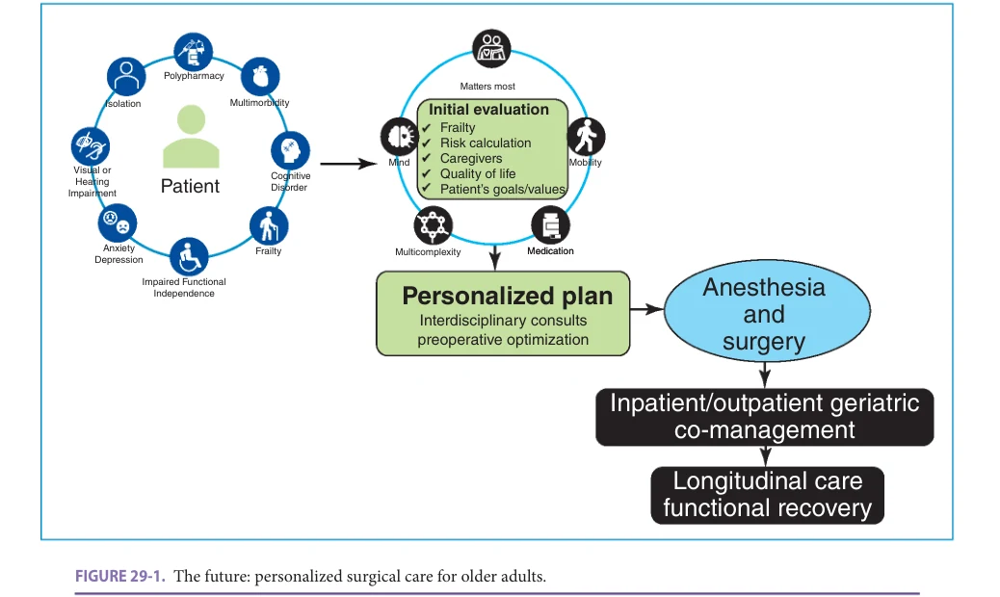

# Hazzard's Geriatric Medicine and Gerontology, 8e - Chapter 29: Surgical Quality and Outcomes

Hiroko Kunitake

> **Status.** Fast build from the book; not lane-reviewed.

> Not cited in the 2020-2026 past papers.

> **Source and method.** Printed pages 399-404, from the marked 8th-edition copy (PDF page = printed page + 34). Prose follows its text layer; tables and figures are source-page crops. The book is canonical.

**[p. 399]**

## INTRODUCTION

The US population is aging and increasing numbers of older adults are undergoing surgery. Adults 65 and older account for more than 40% of all inpatient operations and 33% of outpatient operations performed annually in the United States. With advances in care and surgical technique, it is not uncommon to have surgical patients in their 80s and 90s and beyond. However, operations in older adults are associated with a high risk of prolonged hospitalization, surgical complications, and functional decline. As we place increasing focus on improving these outcomes, we have found that chronological age is not sufficient for predicting surgical risk. Frailty has been shown to be a stronger predictor of perioperative morbidity and mortality than age alone, and we are now working to refine how we assess frailty in surgical patients so that we can have meaningful discussions with patients and their families about the impact and possible outcomes of surgery.

#### Learning Objectives

- To understand what older patients undergoing surgery consider a successful outcome in contrast to the traditional surgical outcomes of length of stay, postoperative complications, and readmission.

- To understand the long-term effects of surgery including associated complications and readmissions on the ability of patients to achieve functional recovery (physical, cognitive, psychological, emotional, social, and economic recovery) after surgery.

- To review the effect of delirium and postoperative cognitive dysfunction on postoperative recovery.

#### Key Clinical Points

1. Many older surgical patients value maintenance of functional independence and quality of life (QOL) as much as or even more than quantity of life and make decisions regarding their surgical care based on these values.

2. Frailty is a stronger predictor of perioperative morbidity and mortality than chronological age alone. A comprehensive and efficient frailty assessment for patients in the preoperative period should be standardized.

3. Hospitalized older adults undergoing surgery are at risk for geriatric events (delirium, dehydration, falls or fractures, failure to thrive, and pressure ulcers), which can contribute to worse outcomes.

4. Geriatric co-management of patients has been associated with improved outcomes including shorter length of stay and lower rates of complications and mortality for older patients.

In contrast to younger patients, many older surgical patients value maintenance of functional independence and quality of life (QOL) as much as or even more than quantity of life. In this context, the long-standing traditional measures of surgical quality and a successful surgical outcome—short hospital stay, few postoperative complications, and avoidance of 30-day readmission must be reconsidered. Functional recovery following surgery is now perhaps the most important measure of surgical success in this older patient population and globally encompasses physical well-being as well as cognitive, psychological, emotional, social, and even economic recovery over a period of a year or more.

This chapter will review traditional surgical outcomes as well as patient-centered outcomes of functional and cognitive recovery and QOL for older patients undergoing surgery.

## TRADITIONAL SURGICAL OUTCOMES

Older patients have more comorbidities, less physiologic reserve, and often a less robust social support network to withstand the physical insult of surgery as well as the stress put on their nutritional, psychological, and emotional well-being. Several studies using the American College of Surgeons National Surgical Quality Improvement Program

**[p. 400]**

(ACS NSQIP) database, which includes patients having a wide range of surgical procedures at academic and community hospitals across the country, showed that older patients, as a group, had significantly higher morbidity (1.2–2 times higher) and 30-day mortality (2.9–6.7 times higher) than younger patients. Additionally, patients older than 75 years were significantly more likely to have a prolonged hospital stay. Approximately 60% of patients older than 75 years remained in the hospital longer than 7 days after a major gastrointestinal tract operation.

In the past, we used patient’s age to guide expectations on postoperative recovery and even to decide whether we would offer surgery to a patient. However, if selected appropriately, older patients undergoing even very high-risk procedures can have good outcomes and benefit from surgery. Frailty, or physiological decline and increased vulnerability to stressors, is a key factor in determining an older patient’s ability to withstand and recover from surgery. Frailty does not correlate with chronological age and may not correlate with the American Society of Anesthesiologists physical status classification score. There are many methods to try to determine frailty in surgical patients but regardless of how frailty is measured, frail patients have been shown in multiple studies to have increased in-hospital, 30-day, 90-day, and 1-year mortality, increased rates of postoperative complications, longer lengths of stay, and increased need for institutionalization at discharge compared to nonfrail geriatric surgery patients.

A 2014 study of 180 patients who underwent surgical treatment for gastric cancer reported that postoperative mortality was 23% among patients who were frail, compared with 5% among patients who were fit. A 2016 systematic review including 23 studies of patients with mean age of 75–87 years undergoing a wide variety of oncologic or nononcologic surgery and using 21 different instruments to measure frailty found that frail patients had increased 30-day mortality (odds ratio [OR] 1.4–8.33), 1-year morality (OR 1.1–4.97), 2-year mortality (OR 4.01), and 5-year mortality (OR 3.6) compared with nonfrail patients. Finally, in a large study of over 14,000 inpatient and outpatient operations, increasing frailty correlated with increased rates of major morbidity, readmission, mortality, and discharge to facility for inpatient procedures as well as increased unplanned admission for outpatient procedures. Not surprisingly, direct costs per patient also increased with increasing frailty in the inpatient cohort (Modified Hopkins Frailty Score: low, $7045; intermediate, $7995; high, $8599).

In addition to postsurgical complications, hospitalized older adults undergoing surgery are at risk for geriatric events (delirium, dehydration, falls or fractures, failure to thrive, and pressure ulcers), which can contribute to worse outcomes. A large study using the National Inpatient Sample including over 800,000 patients undergoing one of the five most common elective procedures in adults 65 years or older (total knee arthroplasty, right hemicolectomy, carotid endarterectomy, aortic valve replacement, and radical prostatectomy) analyzed the rates of perioperative geriatric events. Among admissions for adults 65 years or older,

2.4% experienced a geriatric event. Rates of geriatric events increased with age and varied by procedure, ranging from 1.0% in admissions for radical prostatectomy to 10.3% in admissions for aortic valve replacement. The most common geriatric event in adults 65 years or older was dehydration (1.1%). Among patients 75 years or older, the most common geriatric event was delirium (1.7%).

Looking more specifically at high-risk geriatric surgery (operations associated with a > 1% inpatient mortality in patients ≥ 65 years old), a study including over 500,000 geriatric patients found that the overall inpatient mortality rate was 4.6%. The median postoperative length of stay was 5.4 days and rate of discharge to nursing facility was 28.8%. In this study, mortality, postoperative length of stay, and rate of discharge to nursing facility were influenced by the volume of high-risk geriatric operations performed at the hospital and the proportion of high-risk operations at that center which were performed on geriatric patients. Higher proportion was associated with decreased mortality and shorter length of stay suggesting that these centers may be better equipped to manage the unique health care needs of these older adults undergoing high-risk surgery and provide high-quality geriatric-focused care.

### Geriatric-Focused Care and Co-management to Improve Surgical Outcomes

Surgical outcomes in older patients are improved when these patients are treated in a geriatric-focused health system and several organizations are prioritizing the improvement of geriatric patient care. Some physicians may be fortunate to work in an Age-Friendly Health System, which strives to provide evidence-based high-quality care based on the geriatric 4Ms—What Matters Most, Medication, Mentation, and Mobility—to all adults in their system (Multicomplexity being implicit in this patient population and not a separate M). The Age-Friendly Health System movement began in 2017 and now comprises several hundred hospitals, practices, and postacute long-term care communities who are focused on caring for older adults. Another entity striving to improve the care of older surgical patients is the American College of Surgeons Geriatric Surgery Verification Program, which includes 32 surgical standards designed to systematically improve surgical care and outcomes for this patient population. These standards overlap with the framework of the Age-Friendly Health System and bridge preoperative, postoperative, and transitions of care periods for the patient, but also include recommendations on improving facilities, equipment, data surveillance, and community outreach to build an infrastructure that is focused on the surgical care of older adults.

Geriatric co-management of patients has been associated with improved outcomes including shorter length of stay and lower rates of complications and mortality for older patients. Currently, the most common co-management model is the orthogeriatric care model for the management of hip fractures in older patients. Each hospital has developed their own unique co-management model and

**[p. 401]**

these fall into three categories: Routine Geriatric Consultation (routine geriatrician consultation on older patients in an orthopedic ward); Geriatric Ward (care within a geriatric ward with the orthopedic surgeon acting as consultant); and Shared Care (integrated care model with both orthopedic surgeon and geriatrician sharing responsibility for the care of the patient). Routine Geriatric Consultation is the most common orthogeriatric model. Most studies of this model show that orthopedic geriatric collaboration improves outcomes versus standard of care for older patients although the types of outcomes differ in various studies.

In another retrospective study of over 1800 patients (≥ 75 years old) who underwent elective cancer-related surgery, patients who received geriatric co-managed care were compared with those who did not. Although adverse surgical events were not significantly different, the probability of death within 90 days was 4.3% for the geriatric co-management group versus 8.9% for the surgical service group. Patients in the geriatric co-management group also received more inpatient physical and occupational therapy, speech and swallow rehabilitation, and nutrition services than patients managed by the surgical service alone and this geriatric-focused multidisciplinary care may have contributed to their improved outcomes. Most hospitals now use standardized enhanced recovery after surgery (ERAS) pathways tailored to specific operations that span the preoperative, intraoperative, and postoperative periods. These ERAS pathways have been very successful in decreasing complications and length of stay, but the same pathway is used for young and old surgical patients and patients who are frail or fit. One current area of innovation is in tailoring the ERAS pathway to address the unique needs of older surgical patients and in many cases, this includes automated consults to inpatient support services such as physical therapy and nutrition services based on certain screening criteria.

## PATIENT-CENTERED SURGICAL OUTCOMES

### Functional Recovery

In a 2002 seminal paper exploring the treatment preferences of older adult patients with serious illnesses, patients were more likely to be willing to undergo a treatment if the possible outcome was death than undergo the same treatment if the possible outcome was severe cognitive or functional impairment. This study and many subsequent studies pushed us to realize that our traditional surgical outcomes measures were not appropriate for the unique older surgical patient population. Older patients wanted to know about their expected cognitive and functional recovery after surgery and their ability to remain independent before making a decision about whether to proceed with the surgery. Until recently we did not measure these outcomes, which were difficult to quantify and required a much longer follow-up period of up to a year or longer, compared with traditional outcomes. Several prospective longitudinal cohort studies of older adults have contributed to our understanding of functional recovery after surgery. In most studies, majority

of patients had an initial functional decline, but were able to recover to close to their presurgery level of function over a period of 6 months to a year.

The Precipitating Events Project is a longitudinal study of 754 community-dwelling persons 70 years or older who were initially nondisabled in four basic activities of daily living: bathing, dressing, walking, and transferring. These participants were queried using monthly interviews to evaluate functional status (whether they need assistance for four essential activities [bathing, dressing, walking, and transferring], five instrumental activities [shopping, housework, meal preparation, taking medications, and managing finances], three mobility activities [walk 1⁄4 mile, climb flight of 7 stairs, and lift/carry 10 pounds], and whether they had driven a car in the past month) in addition to comprehensive assessments every 18 months. From 350 admission for major surgery, 69 admissions had no change or improved disability at the first follow-up. The remaining 216 participants undergoing 266 major surgeries had initial increased postoperative disability but by their 6 month follow-up, 174 (65.4%) had recovered to their presurgery level of function, 76 (28.6%) had not reached their presurgery level of function but were alive, and 16 (6%) had died. Two factors significantly associated with an increased likelihood of functional recovery were having an elective operation (hazards ration [HR] 1.72) and being nonfrail (HR 1.60). Additionally, in this cohort, intervening illnesses and injuries leading to hospitalization, emergency department (ED) visit, or restricted activity were common in the year after major surgery and were more closely associated with functional decline than were traditional risk factors such as chronic conditions, obesity, depressive symptoms, or hearing impairment. Ultimately, a quarter of patients did not recover to their premorbid level of function in the year following surgery and the vast majority of patients experienced at least one episode of functional decline during the study period.

In addition to the impact of major surgery, subsequent hospitalizations are also associated with functional decline. The Successful Aging after Elective Surgery (SAGES) study, an ongoing prospective cohort study of 566 adults aged 70 and older undergoing major scheduled noncardiac surgery, showed that readmissions, whether associated with the index surgery or not, were associated with delays in functional recovery. Over an 18-month period, 253 participants (45%) had 503 readmissions (143 patients had one, and 112 had two or more, with a maximum of 12); 203 (36%) participants reported 345 readmissions that were unrelated to the index hospitalization. The degree of functional impairment increased progressively with the number of readmissions, potentially due to the harmful effects of delirium, immobilization, sleep deprivation, malnutrition, and psychological stress experienced during each hospital admission.

Another measurement of functional decline, loss of independence (LOI), is now gaining attention. The definition of LOI varies across studies, but it encompasses a decline in functional status or increased care needs. In a study of patients undergoing inpatient surgery at a hospital

**[p. 402]**

participating in the ACS NSQIP Geriatric Surgery Pilot Project, LOI was measured at discharge and was characterized by one of three changes: a decline in function according to activities of daily living (ADLs), a decline in mobility requiring a new mobility aid, or an increase in care needs, such as a need for new home-care services or discharge to a nonhome destination. At the time of discharge, 26% of patients experienced a decline in functional status and 30% had a decline in mobility. Forty-six percent of patients had increased care needs (27.8% required additional supportive services at home, 18.2% required discharge to a nonhome destination). Overall, 60% of patients experienced at least some degree of LOI. LOI increased significantly with age: 50% of patients between 65 and 74 years, 67% of patients between 75 and 84 years, and 84% of patients 85 years and older.

### Delirium and Postoperative Cognitive Dysfunction

Delirium is the most common surgical complication in older adults, affecting up to half of patients postoperatively, and it is closely linked to poor patient outcomes. Postoperative delirium is associated with a two- to fivefold increased risk of major postoperative complications, a threefold increased risk of institutional placement at discharge, longer hospital stays, and increased rates of readmission and mortality. In addition, Medicare cumulative costs attributable to delirium in older surgical patients were found to be $44,291 per patient over 1 year following surgery and $56,474 per patient with severe delirium over the year following surgery. Despite these significant adverse results, postoperative delirium is significantly underrecognized and therefore undertreated. It is equally important to note that delirium is preventable in up to 40% of patients with relatively simple adjustments in perioperative care. The prevention and management of delirium in surgical patients need as much targeted emphasis in surgical education as other more traditional complications.

An episode of postoperative delirium has as significant an impact on patient outcomes as a major postoperative complication. In a large cohort of patients 70 years or older undergoing major orthopedic, vascular, or abdominal surgery, 8.3% developed a major postoperative complication and 24% developed delirium. Patients who had a major complication such as unstable arrhythmia, respiratory failure, or stroke, but did not have delirium had increased length of stay (relative risk [RR], 2.8; 95% confidence interval [CI] 1.9–4.0). However, patients with delirium but no major complication had prolonged length of stay (RR 1.9; 95% CI 1.4–2.7) as well as increased institutional discharge (RR 1.5; 95% CI 1.3–1.7) and increased 30-day readmission (RR 2.3; 95% CI 1.4–3.7). Patients who had both a major complication and delirium had the highest rates of adverse outcomes with a mean length of stay of 13 (SD 11) days and increased institutional discharge (RR 1.8; 95% CI 1.4–2.5) and 30-day readmission (RR 3.0; 95% CI 1.3–6.8).

A number of studies have looked at the relationship between postoperative delirium and postoperative cognitive

dysfunction. Postoperative delirium and postoperative cognitive dysfunction share risk factors and may co-occur, but their relationship over the postoperative period is unclear. A study looking at the association between postoperative delirium and the risk of postoperative cognitive dysfunction at 1 month, 2 months, and 6 months after major noncardiac surgery showed that postoperative delirium increased the risk of postoperative cognitive dysfunction at 1 month postoperatively, but there was no association between postoperative delirium and cognitive dysfunction at 2 and 6 months after major noncardiac surgery.

The Postoperative Cognitive Dysfunction in Elderly Cancer patients (PICNIC) study was a prospective observational study of patients aged 65 or older who underwent oncologic surgery. Three cognitive domains (memory, executive function, and information processing speed) were evaluated at baseline (approximately 2 weeks before surgery) and 3 months postoperatively. Of the 219 patients included in the analysis, 26 (12%) had cognitive decline 3 months postoperatively, whereas 117 (53%) patients had improved cognitive scores. Advanced age (> 75 years old), lower preoperative Mini-Mental State Examination (MMSE) score, and major surgery (surgery with anesthesia lasting > 210 minutes) were risk factors for cognitive decline at 3 months postoperatively. In patients with advanced age (> 75 years) or those undergoing major surgery, 18% showed cognitive decline and in patients who additionally had a lower preoperative MMSE score, the incidence was 37%. During the study, 10% of patients were diagnosed and treated for postoperative delirium.

### Quality of Life

Quality of life (QOL) is tightly intertwined with functional and cognitive recovery, but studies show that postoperative QOL can exceed the preoperative level even for patients who have postoperative functional decline or suffer a complication. A study of patients age 75 and older undergoing surgery for colorectal or gastric cancer measured activities of daily living (ADLs) and QOL at baseline and then at 1 month, 3 months, and 6 months postoperatively. Twenty-four percent of patients showed a decrease in ADL at 1 month postoperatively, but most patients recovered with only 3% showing a decline at the sixth postoperative month. QOL of the patients similarly fell immediately after surgery but then rapidly recovered to equal or better than their preoperative level, 3 to 6 months after surgery. In another study of patients 70 years or older undergoing elective resection for colon or rectal cancer evaluated with the EORTC-QLQ-C30, emotional function and QOL improved for both frail and nonfrail patients at 3 months. At long-term follow-up (median time 22 months after the operation), emotional function and QOL scores had decreased from the postoperative peak but still remained above baseline.

Another measure of QOL or independence is the amount of time spent at home following oncologic surgery. In a study of over 80,000 people undergoing oncologic

**[p. 403]**

surgery, older adults spent more than 98% of their time at home over the 5 years following surgery. The amount of time at home varied with the type of oncologic surgery. Breast surgery had the highest likelihood of spending time at home and gastrointestinal surgery had the lowest likelihood of spending time at home over the 5 years following surgery. The amount of institutionalized time increased over time. Most patients who survived the surgery were likely to have 14 or less institution days per year for the first four postoperative years. However, in the fifth year, 50% of patients who were still alive were likely to experience more than 14 institution days per year. Advancing age, preoperative frailty, lower socioeconomic standing, rural residency, high-intensity surgical procedure, and gastrointestinal, gynecologic, or oropharyngeal cancers were associated with less time at home.

Minimally invasive surgery is now expected by most patients but the benefits in older patients are not always as clear. QOL was compared between patients undergoing laparoscopic versus open pancreatic resection to determine if minimally invasive surgery improved QOL. In both the minimally invasive and open surgery groups, physical, functional, and QOL scores decreased in the immediate postoperative period but returned to baseline by 6 months postoperatively. Patients who experienced a severe complication had greater declines in QOL than patients who did not have a complication regardless of the surgical approach, emphasizing that a safe operation is the best approach to optimize patient QOL.

### Future Directions

In order to give older patients the best understanding of their anticipated surgical outcomes, we can no longer rely simply on estimates of traditional outcome measures such as morbidity and mortality but must find a way to incorporate geriatric patient-centered outcomes as well. This is a complex and multidimensional risk calculation that is unique to each patient and yet must be determined in a timely manner so that surgical decisions can be made. The ACS NSQIP Surgical Risk Calculator is a decision support tool that provides estimates of risk for 12 30-day outcomes using 21 preoperative risk predictors. Using data collected from 21 ACS NSQIP Geriatric Surgery Pilot Project hospitals, six new geriatric risk factors (living situation, fall history, mobility aid use, cognitive impairment, surrogate-signed consent, and palliative care on admission) were added in order to predict four postoperative geriatric outcomes (pressure ulcer, delirium, new mobility aid use, and functional decline). Using a geriatric-enhanced surgical risk calculator like this is critical to enabling clinicians to better guide patients and their families as they make decisions about their health care and ultimately to improving surgical outcomes for these patients.

Additionally, older patients can benefit from a personalized care plan that incorporates their complex needs and personal goals. At our institution, we are striving to develop and improve this model, which will span the preoperative, intraoperative, and postoperative segments of a patient’s experience and will provide the foundation for improving surgical quality and outcomes for our older patients (Figure 29-1).

*FIGURE 29-1. The future: personalized surgical care for older adults.*

*Owner annotations/highlights are from the marked source copy, not the book.*

**[p. 404]**

## CONCLUSIONS

Older adults as a group become more diverse in their health care conditions and their personal goals as they age. The definition of surgical quality and a good outcome is unique to each patient. As surgeons, perhaps the most important thing we can do is to ask patients: What matters most to you? For some patients, this may be resecting their tumor, regardless of the risks. For others, it may be living

independently for as long as possible. And for others, the best outcome may be focused on symptom relief and palliative care. As surgeons, we are in a unique position to have informed discussions about surgery in the framework of what matters most to the patient and their loved ones and to put patients on the trajectory toward their goals, even if surgery is not desired. In this way, we will be able to help older patients achieve the best outcomes possible.

## FURTHER READING

Amemiya T, Oda K, Ando M, et al. Activities of daily liv-

ing and quality of life of elderly patients after elective surgery for gastric and colorectal cancers. Ann Surg. 2007;246(2):222–228. Becher RD, Murphy TE, Gahbauer EA, Leo-Summers L,

Stabenau HF, Gill TM. Factors associated with functional recovery among older survivors of major surgery. Ann Surg. 2020;272(1):92–98. Bentrem DJ, Cohen ME, Hynes DM, Ko CY, Bilimoria KY.

Identification of specific quality improvement opportunities for the elderly undergoing gastrointestinal surgery. Arch Surg. 2009;144(11):1013–1020. Erratum in: Arch Surg. 2010;145(3):225. Berian JR, Mohanty S, Ko CY, Rosenthal RA, Robinson TN.

Association of loss of independence with readmission and death after discharge in older patients after surgical procedures. JAMA Surg. 2016;151(9):e161689. Centers for Disease Control and Prevention. National

Center for Health Statistics: Number of Discharges from Short-stay Hospitals, by First-listed Diagnosis and Age: United States, 2010. www.cdc.gov/nchs/data/nhds/ 4procedures/2010pro4_numberprocedureage.pdf. Accessed February 28, 2021. Chesney TR, Haas B, Coburn NG, et al. Patient-centered

time-at-home outcomes in older adults after surgical cancer treatment. JAMA Surg. 2020;155(11):e203754. Daiello LA, Racine AM, Yun Gou R, et al. Postoperative

delirium and postoperative cognitive dysfunction: overlap and divergence. Anesthesiology. 2019;131(3):477–491. Dworsky JQ, Childers CP, Gornbein J, Maggard-

Gibbons M, Russell MM. Hospital experience predicts outcomes after high-risk geriatric surgery. Surgery. 2020;167(2):468–474. Dworsky JQ, Shellito AD, Childers CP, et al. Association of

geriatric events with perioperative outcomes after elective inpatient surgery. J Surg Res. 2021;259:192–199. Fried TR, Bradley EH, Towle VR, Allore H. Understanding

the treatment preferences of seriously ill patients. N Engl J Med. 2002;346(14):1061–1066.

Gill TM, Han L, Gahbauer EA, Leo-Summers L, Murphy

TE, Becher RD. Functional effects of intervening illnesses and injuries after hospitalization for major surgery in community-living older persons. Ann Surg. 2021;273(5):834–841. Gou RY, Hshieh TT, Marcantonio ER, et al. One-year

Medicare costs associated with delirium in older patients undergoing major elective surgery. JAMA Surg. 2021; 156(5):430–442. Hall MJ, Schwartzman A, Zhang J, Liu X. Ambulatory

surgery data from hospitals and ambulatory surgery centers: United States, 2010. Natl Health Stat Report. 2017;(102):1–15. Hornor MA, Ma M, Zhou L, et al. Enhancing the American

College of Surgeons NSQIP Surgical Risk Calculator to Predict Geriatric Outcomes. J Am Coll Surg. 2020;230(1): 88–100.e1. Lawrence VA, Hazuda HP, Cornell JE, et al. Functional

independence after major abdominal surgery in the elderly. J Am Coll Surg. 2004;199(5):762–772. Lin HS, Watts JN, Peel NM, Hubbard RE. Frailty and post-

operative outcomes in older surgical patients: a systematic review. BMC Geriatr. 2016;16(1):157. Marcantonio ER. Delirium in hospitalized older adults.

N Engl J Med. 2017;377(15):1456–1466. Pisani MA, Albuquerque A, Marcantonio ER, et al. Associ-

ation between hospital readmission and acute and sustained delays in functional recovery during 18 months after elective surgery: the successful aging after elective surgery study. J Am Geriatr Soc. 2017;65(1):51–58. Tegels JJ, de Maat MF, Hulsewé KW, Hoofwijk AG, Stoot

JH. Value of geriatric frailty and nutritional status assessment in predicting postoperative mortality in gastric cancer surgery. J Gastrointest Surg. 2014;18(3):439–445; discussion 445–446. Turrentine FE, Wang H, Simpson VB, Jones RS. Surgical

risk factors, morbidity, and mortality in elderly patients. J Am Coll Surg. 2006;203(6):865–877.
