# Hazzard's Geriatric Medicine and Gerontology, 8e - Chapter 2: Demography and Epidemiology

Michelle C. Odden, Kendra D. Sims, Anne B. Newman

> **Status.** Fast build from the book; not lane-reviewed.

> Excluded from the IMA required reading list (P005-2026); not cited in the 2020-2026 past papers.

> **Source and method.** Printed pages 23-46, from the marked 8th-edition copy (PDF page = printed page + 34). Prose follows its text layer; tables and figures are source-page crops. The book is canonical.

**[p. 23]**

## INTRODUCTION

The aging of a population reflects the health of the population. The changes in life expectancy over the past century have varied tremendously throughout the world, with losses in some regions due to the epidemic of human immunodeficiency virus (HIV) and war, and gains in life expectancy in politically stable countries with low infant mortality. Improvements in the control of infectious disease, largely through sanitation but also through the development of antimicrobials and vaccines, account for the majority of gain in life expectancy worldwide. As a result, many developing countries have transitioned to having a larger proportion of the population reaching old age within one or two generations. This shift toward greater longevity has been accompanied by higher rates of chronic disease and a need for more chronic health care. The simultaneous decline in birth rates has left a smaller proportion of young to old. This change in the dependency ratio makes the prevention of disability in old age a public health priority.

#### Learning Objectives

- Describe and interpret key demographic features of aging and life expectancy, including birth cohort and secular trends in the United States and globally.

- Identify major conditions leading to death and disability, including patterns of multimorbidity and polypharmacy.

- Understand major biological and social determinants of health, disability, aging, and longevity.

#### Key Clinical Points

1. Improvements in the last century in life expectancy and the increasing proportions of populations reaching old age are threatened by counterpoising trends in obesity, health inequities, and the current COVID-19 pandemic.

2. Most older adults have multiple chronic health conditions, and the co-occurrence of multiple conditions, or multimorbidity, drives increasing disability and mortality in older adults.

3. Prevention of disability is informed by targeting its many contributors including sensory, motor, cognitive, social, and emotional impairments, multimorbidity, and environmental factors.

Older adults develop multiple chronic health conditions that contribute to physical and cognitive decline. Many of these conditions are driven by age itself, with age representing the sum of time-dependent exposures and the biologic response to damage. This damage is both extrinsic, from behavioral and environmental insults, and intrinsic due to imperfect cell maintenance and repair. With time, these processes lead to distinct chronic conditions with hypertension, degenerative arthritis, coronary artery disease, cancer, and dementia among the most common. Though patterns of onset and duration vary widely, multimorbidity drives much of the disability that occurs in late life. Recent epidemiologic research regarding how chronic conditions combine and interact suggests that multimorbidity is an informative outcome for clinical trials of therapies designed to improve overall health in older adults.

In the twentieth and twenty-first centuries, gains in life expectancy have resulted from reductions in infant mortality and prevention of chronic diseases, especially cardiovascular disease and chronic lung disease, which is largely related to a decline in smoking. More recently, gains have been made after age 65, with better survival after the onset of chronic illness. While many projections continue to show continued large increases in the numbers and

proportions of older adults in countries around the world, the current pandemic of COVID-19 is already showing an impact. The earliest outbreaks in China, Italy, and the United States were most prominent in the oldest and frailest, especially those living in congregate setting such as nursing homes. Since longevity projections are based on mortality rates across the lifespan and since children and young adults have not been greatly impacted by COVID-19 mortality, we might anticipate that the gains in life expectancy will be slowed or reversed in the oldest old. However, current threats to education and employment have

**[p. 24]**

the potential to adversely impact health across the lifespan, and particularly in marginalized populations such as racial and ethnic minorities. Therefore, our discussion of trends in the numbers and survival of older adults must be viewed with the changing environment in mind.

In this chapter, we will review the current estimates for population aging and demography including the leading causes of death in older adults and the role of birth cohort and period effects in interpreting aging trends. We will address rates and risk factors for the most common chronic conditions as well as patterns of multimorbidity and shared risk factors. We will also review trends in disability, including physical and cognitive disability and several novel risk factors under study that may tell us about the epidemiology of the biology of aging itself.

## DEMOGRAPHICS

### Aging of the US Population

Table 2-1 summarizes the actual and projected aging population of the United States over 150 years. At the turn of the twentieth century, adults aged 65 and older made up only 4.1% of the population, and this percentage tripled over the following 100 years to 12% at the turn of the millennium. The US Census Bureau projects this number will continue growing to over 20% by the year 2050. The numbers of oldest old adults, aged 85 and older, are growing at an even more dramatic rate. In the twentieth century, the number of adults aged 65 and older grew 11-fold, whereas the number of adults aged 85 and older grew 42-fold. The number of

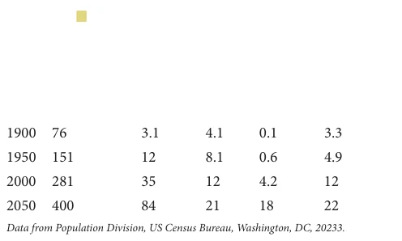

*TABLE 2-1 ■ ACTUAL AND PROJECTED GROWTH OF THE OLDER US POPULATION, 1900 TO 2050 (MILLIONS)*

*Owner annotations/highlights are from the marked source copy, not the book.*

oldest old adults is projected to continue to grow and is projected to comprise over a fifth of the population age 65 and older. This aging of the population has important implications for family structures, the labor market, economy, medicine, and long-term care; moreover, it ensures that older adults will be an increasingly influential segment of our population.

### Global Aging

The aging of the population is a global phenomenon. Figure 2-1 illustrates the increase in the percentage of the population age 65 and older from 2010 to 2050 in all six regions of the world. The highest current and projected percentage of 65 and older adults is in Europe, with North America, Latin America/Caribbean, Asia, and Oceania not far behind. Africa has the lowest percentage of older adults, but this number is expected to nearly double

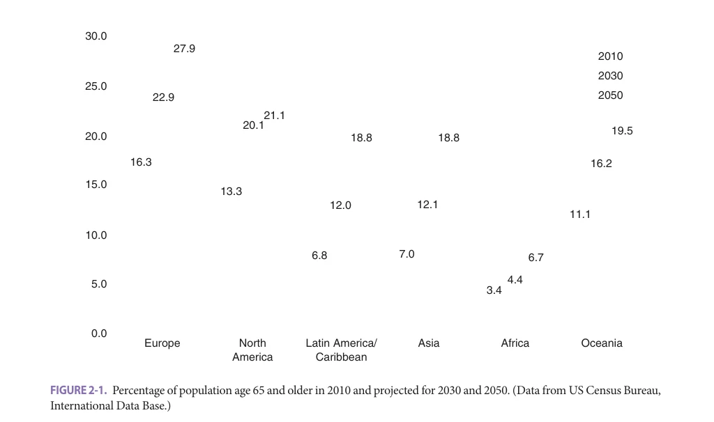

*FIGURE 2-1. Percentage of population age 65 and older in 2010 and projected for 2030 and 2050. (Data from US Census Bureau, International Data Base.)*

*Owner annotations/highlights are from the marked source copy, not the book.*

**[p. 25]**

from 2010 to 2050. Latin America/Caribbean and Asia also have high projected growth in the population age 65 and older; the percentage is expected to double from 2010 to 2050. Nine of the top 10 countries with the oldest populations are in Europe, although Japan tops the list. The percentage of the population that is aged 65 and older depends on both the change in life expectancy as well as the fertility rate. Life expectancy is increasing globally, and fertility rates are falling. Older adults are living longer and thus comprise a larger proportion of the population. Dropping fertility rates can also lead to a relatively greater proportion of older adults by decreasing the number of children entering the population. Europe has the lowest fertility rate of 1.6 children per woman, whereas Africa has the highest fertility rate of 4.7 children per woman.

### Life Expectancy at Different Ages

Survival curves are commonly used to illustrate the proportion of a population that survives to specified ages. Figure 2-2 illustrates the changes in the survival curves in the United States since 1900. In 1900, the steep drop in the survival curve between birth and 5 years demonstrates the high burden of infant and early-childhood mortality. In this era, there was a modest slope of the proportion surviving across adulthood, with less than half of the population reaching age 65. By the mid-twentieth century, there had already been substantial improvements in early life mortality, and survival increased for those in mid-life due to sanitation and availability of antimicrobials and vaccines. Although the greatest gains in the proportion surviving were for those in mid-life, there were gains in the proportion surviving across the age-spectrum. Survival continued to increase for older adults through the latter half of the twentieth century and into the twenty-first century. These gains have been largely due to improved therapies for people with chronic conditions, such as cardiovascular disease and cancer, as well as reductions in some risk factors, such as smoking. Notably, these gains extended even to those above 80 or even 90 years. The change in the shape of the survival curve over the past century is referred to as the rectangularization of the survival curve and some have proposed that this will continue until full rectangularization is achieved. However, some question this outcome. There are adverse temporal trends, such as the increasing obesity

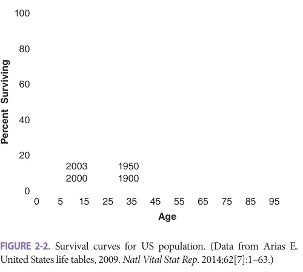

*FIGURE 2-2. Survival curves for US population. (Data from Arias E. United States life tables, 2009. Natl Vital Stat Rep. 2014;62[7]:1–63.)*

*Owner annotations/highlights are from the marked source copy, not the book.*

epidemic, that threaten the gains in life expectancy, as well as emerging risk factors such as the COVID-19 pandemic.

While the above survival curves are based on observed data, life tables project the life expectancy for a given birth cohort. These projections assume that period-specific death rates apply to the future. While there may be deviations from this assumption, this method evaluates the long-range implications of the contemporary death rates. Table 2-2 illustrates the life expectancy projections at birth, 65, 75, and 85 years for men and women, and across race and Hispanic ethnicity. Notably, the older age groups in 2017 have a higher expected age at death compared with those born in 2017. This is because survival to older age represents a selected group of individuals who are more likely to continue to survive. For example, those who are 85 years in 2017 represent a selected group who have already exceeded the median life expectancy for the population, so it is not surprising that this group represent a healthy survivor group with an additional life expectancy of another 5.9 years for men and 7 years for women. In developed countries, women have a greater projected life expectancy than men. At any given age, including preconception, women have lower mortality rates than men. Many explanations for the female survival advantage have been proposed including genetics, hormones, lower rates of smoking and alcohol

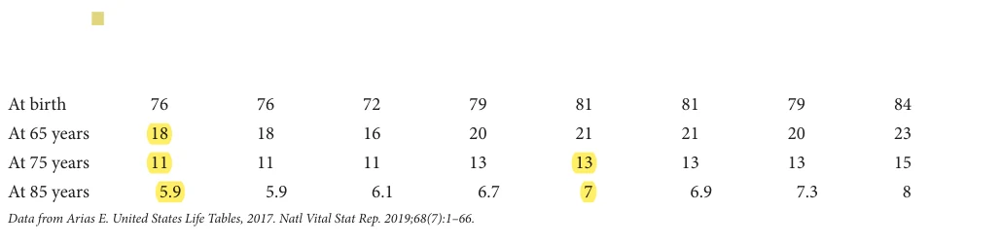

*TABLE 2-2 ■ LIFE EXPECTANCY IN 2017 (YEARS)*

*Owner annotations/highlights are from the marked source copy, not the book.*

**[p. 26]**

use, greater health-seeking behavior, differences in occupational hazards, and others. Also apparent in Table 2-2 are the striking disparities in life expectancy by race; nonHispanic Black men born in 2017 are projected to live 4.5 fewer years than their non-Hispanic White counterparts, and non-Hispanic Black women are projected to live 2.7 fewer years than non-Hispanic White women. These disparities reflect the unequal conditions in which people live, as well as the related racial disparities in chronic conditions. Hispanic adults have a longer life expectancy than non-Hispanic White and non-Hispanic Black populations. Various hypotheses have been proposed to explain this difference, commonly referred to as the Hispanic paradox. The most common potential explanations are (1) the healthy migrant effect, which suggests that Hispanic immigrants are in better health compared with their non-migrating peers; (2) the “salmon effect”, which posits that US residents of Hispanic origin may return to their birth country to die or when ill; and (3) differences in culture, including family structure, lifestyle behaviors, and social networks.

### Extreme Longevity

Exceptional longevity has been of interest in both the scientific and lay communities. Scientists have studied extreme longevity to gain insight into mechanisms of healthy aging and survival. Several centenarian studies have emerged across the world in parallel to a growing prevalence of people living to at least 100. When the New England Centenarian Study began in 1994, the estimated prevalence was one centenarian per 10,000 people; in 2012, this prevalence had doubled to 1 in 5000. This means that most geriatricians will encounter centenarians in their practice. However despite this interest from the popular and scientific communities, little is known about the factors that predict survival to very old age as well as determinants of morbidity, disability, and mortality among the very old.

Scientists have long been interested in areas of the world where people appear to live longer than average, first termed “Blue Zones” by Dan Buettner in a 2005 National Geographic cover story. Some have proposed that a lack of validated birth certificates could play a primary role in apparently longer life expectancy. However, certain regions, such as Sardinia, Italy, have verified records and can confirm that residents live among the longest in the world. Hypotheses behind these concentrated geographic areas of long life expectancy include engagement in moderate physical activity as a part of life, plant-based diet, social engagement, a focus on family, and life purpose. However, there is currently no validated explanation about why centenarians are concentrated in such geographic areas.

There is emerging evidence that genetics influence extreme longevity. The New England Centenarian Study has reported that siblings of centenarians have between 8 and 17 times the likelihood of living to 100 compared with others from the same birth cohort. Based on these estimates the heritability of extreme longevity to 100 years

is expected to be between 0.33 and 0.48. Notably, this is larger than the estimates of survival to the mid-80s. Apolipoprotein E (APOE) and forkhead box O-3 (FOXO3) have polymorphisms that have been consistently shown to have associations with extreme longevity.

In 1980, Jim Fries proposed the “compression of morbidity” hypothesis that posits that as life expectancy increases, the years lived free of morbidity and disability (often termed the health span) will increase. Although there is substantial debate on whether we are observing the compression of morbidity in the general population, the evidence points toward a compression of morbidity as one reaches the limits of the human lifespan. For example, the majority of centenarians do not experience disability until their 90s, although a substantial proportion accumulate one or more chronic condition. However, supercentenarians, those reaching age 105 or older, have a marked decrease in disability and disease compared with those who die at younger ages. Previous studies that found no evidence of compression of morbidity may have been evaluating individuals who did not survive long enough to display this phenomenon.

### Age, Period, and Cohort Effects

The difference in life expectancy based on year of birth, highlights an important epidemiologic phenomenon known as cohort effects, where people have some common experience based on their year of birth, or another shared temporal experience. This is to be distinguished from age effects, which are effects common to people of a given age. Another time effect is known as period effects, in which people share some common effect due to the occurrence of an event defined by chronologic time. These three effects—age, period, and cohort effects—confound one another and can be difficult to disentangle in epidemiologic studies.

Conceptual differences in age, period, and cohort effects are illustrated in Figure 2-3. In this figure, three birth cohorts are illustrated: those born in 1930, 1940, and 1950. The first panel demonstrates pure age effects—the event rate of some disease increases with age. Age effects are familiar to many in health care, as the incidence of many conditions, such as cardiovascular disease, increases with age. The second panel illustrates pure period effect. Each birth cohort has a spike in event rates at the year 2020. An example of a period effect is the 2020 SARSCoV-2 pandemic, which increased the rate of pneumonia across persons in all three birth cohorts. The third panel illustrates pure cohort effects; those born in 1930 have the highest event rate, and the rate decreases with each decade of birth year. An example of a cohort effect is that children born during the Great Depression may have suffered from malnutrition, and be more likely to develop adult-onset diseases compared with those born in more prosperous times. One can observe how this would confound age effects, by evaluating the rate of disease in 2020 (indicated

**[p. 27]**

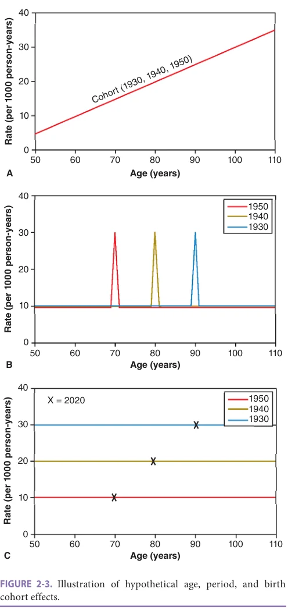

*FIGURE 2-3. Illustration of hypothetical age, period, and birth cohort effects.*

*Owner annotations/highlights are from the marked source copy, not the book.*

by X’s on the figure). The older age groups have higher disease rates in 2020, which could be inappropriately attributed to the aging process. These simplified figures illustrate what can be complex to disentangle with real world data, which generally contain a mix of age, period, and cohort effects.

### Demographic Characteristics of the Aging Population

In the past decade, the 65-and-older population has grown by 34% (14 million people), in large part due to the aging Baby Boomer generation, the first of whom turned 65 in 2011. Older adult women have and will continue

to outnumber similarly aged men, though as shown in Figure 2-4 the sex differences in life expectancy will modestly narrow over the next four decades. For every 100 women aged at least 65, there will be 82 men in 2030 and 86 men in 2060. The sex ratio among centenarians will remain 2:5 (40 to 100) in favor of women for the next 40 years. These sex ratios reflect sex assigned at birth, and not gender identity.

The majority of men, but not women, aged 65 and older are married. Among men aged 65 and older, 70% are married, 12% are divorced, and 12% are widowed. Among women aged 65 and older, 44% are married, 15% are divorced, and 34% are widowed. Women are more likely to outlive their husbands because of the longer life expectancy of women; 72% of women aged 85 and older are widowed. Living situation is determined by health, financial factors, and widowhood. The majority (68%) of adults aged 65 and older live with family, and about a quarter (26%) live alone.

### Minority Aging

The older population is becoming more diverse in the United States. Non-Hispanic White adults made up 77% of those aged at least 65 in 2017, but are expected to make up only 55% of older adults by 2060 as seen in Figure 2-5. All racial/ethnic groups are expected to increase proportional to non-Hispanic White older adults, with the greatest increases projected among Hispanic adults age 65 and older. Black and Hispanic populations tend to shoulder a disproportionate burden of morbidity and disability compared with their White counterparts. For example, among adults aged 65 and older, 46% of Black adults had a disability compared with 33% of Asian and 38% of White adults. Among those who reported Hispanic origin, 42% had a disability compared with 38% of those who were not Hispanic. The higher burden of poor health in these communities reflects the unequal conditions in which Black and Hispanic populations live. Only 7.2% of White adults aged 65 and older live in poverty, compared with 13% of Asian and 16% of Black Americans. Among those who report Hispanic origin, 18% fall below the poverty line. Educational attainment follows similar patterning, with only 73%, 74%, and 52% of Asian, Black, and Hispanic adults age 65 and older reporting a high school education, compared with 89% of White older adults.

### Employment

The growth of the older population has led to an increase in the non-working-age population (0–14 and 65 and older) relative to the working-age population (aged 15–64). The ratio of non-working-age to working-age people, which demographers term the dependency ratio, has grown from 49 in 2010 to 54 in 2019. Dependency ratios offer a unique perspective on the nation’s aging. However, this statistic provides limited insight into the economic repercussions, as many older adults remain in the labor force well past 65. Moreover, many older adults have accumulated financial

**[p. 28]**

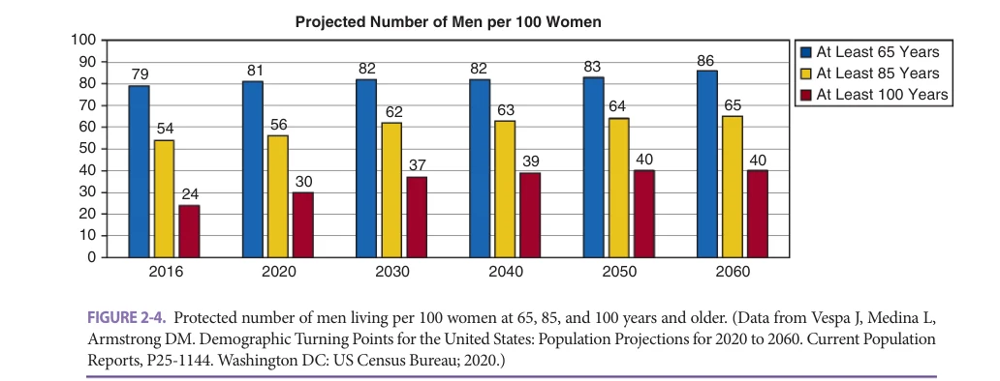

*FIGURE 2-4. Protected number of men living per 100 women at 65, 85, and 100 years and older. (Data from Vespa J, Medina L, Armstrong DM. Demographic Turning Points for the United States: Population Projections for 2020 to 2060. Current Population Reports, P25-1144. Washington DC: US Census Bureau; 2020.)*

*Owner annotations/highlights are from the marked source copy, not the book.*

assets and asset transfer may mitigate this dependency ratio. Among those 65 and older, 22% of men, and 14% of women remained in the labor force in 2016 in the United States. These numbers decreased with age; only 3.7% of men and 1.5% of women age 85 and older remained in the labor force.

Temporal trends demonstrate that the years spent working and in retirement have changed dramatically. Based on estimates from the Organization for Economic Cooperation and Development (OECD), in 1960, men in developed countries could expect to spend 46 years in the labor force and about 1 year in retirement. By 2005, years in the labor force had decreased to 36, whereas years in retirement had increased to 14. The striking increase in the number of years people can expect to live after retirement are primarily driven by the gains in life expectancy. There was a trend toward earlier retirement near the end

of the twentieth century, although this trend has slowed or reversed in recent years.

## MORTALITY

### Leading Causes of Death

Recent estimates from the National Vital Statistics Report (Table 2-3) have implications for primary, secondary, and tertiary disease prevention. Approximately a third of all deaths in 2017 can be directly associated with chronic dysregulation of cardiovascular, renal, and endocrine systems. Pneumonia, the lone infectious disease that causes death, includes bacterial, fungal, or viral diseases acquired in community or health care settings. Furthermore, pneumonia has a higher fatality rate among those with conditions including chronic obstructive pulmonary disease; the resultant organ damage among pneumonia survivors may

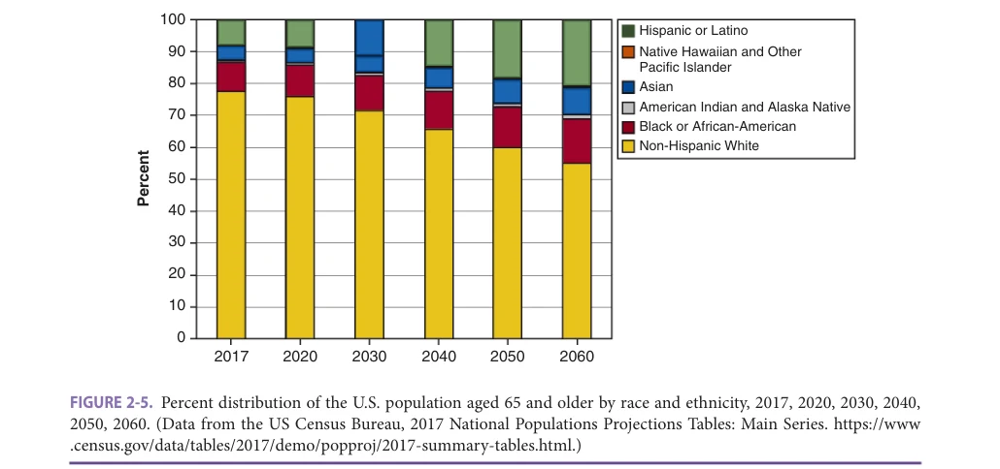

*FIGURE 2-5. Percent distribution of the U.S. population aged 65 and older by race and ethnicity, 2017, 2020, 2030, 2040, 2050, 2060. (Data from the US Census Bureau, 2017 National Populations Projections Tables: Main Series. https://www .census.gov/data/tables/2017/demo/popproj/2017-summary-tables.html.)*

*Owner annotations/highlights are from the marked source copy, not the book.*

**[p. 29]**

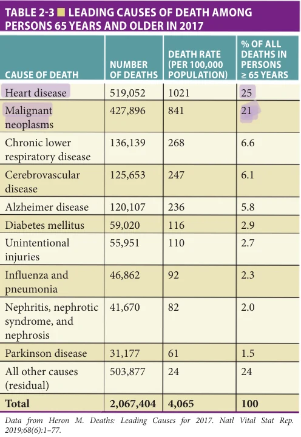

*TABLE 2-3 ■ LEADING CAUSES OF DEATH AMONG PERSONS 65 YEARS AND OLDER IN 2017*

*Owner annotations/highlights are from the marked source copy, not the book.*

precipitate further life-threatening health events. The risk of nonintentional accidents and falls that result in death can be partially a consequence of sensory and functional decline. Thus the leading causes of death have overlapping and underlying causal risk factors.

Notably, a quarter of older adult deaths could not be ascribed to a single cause. This highlights the challenges of mortality ascertainment among the segment of the population with the highest burden of chronic conditions. Additionally, the all-other cause category includes deaths subject to social stigma, such as “diseases of despair”: alcohol-related liver disease, controlled substance overdose, and suicide. The rate of diseases of despair among adults aged 65 increased from 45 to 57 deaths per 100,000 from 2009 to 2019, according to Centers for Disease Control and Prevention data.

### Mortality Rates

Mortality rates declined by 21% among all ages between 1935 and 2017. The reduction in death is even more pronounced among older adults. Among adults between 65 and 74 years, mortality rates were 60% lower in 2017 compared to the period of the Great Depression. Comparing people aged at least 85 over time reflects these gains in population health; though there is a higher absolute number

of deaths among the oldest old, the mortality rate was 40% lower in 2017 than 1935.

The elevated prevalence of chronic conditions in older adults corresponds to the patterning of older adult mortality. As observed in Figure 2-6, the mortality rates increase for the leading causes of death with advancing age. As the most striking example, the estimated Alzheimer’s mortality is less than 1 per 100,000 among people younger than 65 and 350 per 100,000 among people between the ages of 80 and 84. The only leading cause not following a consistent age-gradient is death related to accidents. Fatal accidents appear highest among people in their early to mid-80s and second highest among people in their mid to late 50s, with modest declines between the sixth and seventh decades. The most common type of accident also varies between the middle aged (vehicular) and the oldest old (falls).

Figure 2-7 illustrates how cancer mortality rates peaked among the oldest old of both sexes at the turn of the twenty-first century. Men were disproportionately affected. In 1990, there were more than 500 cancer-related deaths per million men among both the 75 to 84 and 85+ age groups. Partially a consequence of better prevention of fatal events such as heart failure and stroke, more men seem to be surviving until oldest age in order to die from advanced-stage cancer. This is among the many factors, now partially understood, that account for the 33% increase in cancer mortality among men aged at least 85 between 1950 and 2016. More research is needed to determine much of this disparity is due to sex hormone differences or to gender differences in health behaviors such as preventative screening.

## CHRONIC HEALTH CONDITIONS

### Prevalence of Common Diseases

The most common chronic conditions among Medicare beneficiaries aged 65 and older are presented in Table 2-4. Hypertension is the most common chronic condition and a risk factor for cardiovascular disease, and is prevalent in over half of older adults. Hyperlipidemia, another risk factor for cardiovascular outcomes, is the second most chronic condition and impacts 41% of older men and women. Ischemic heart disease, arthritis, diabetes, and chronic kidney disease affect over one-fifth of older men and women. There are important gender differences in the prevalence of many conditions. Arthritis, depression, and osteoporosis are more common among women, whereas ischemic heart disease is more common among men.

It is important to note that these prevalence estimates were based on Medicare claims, and thus would not capture undiagnosed conditions. Discrepancies between claims-based estimates and true prevalence of conditions are highest for asymptomatic conditions, such as hypertension and hyperlipidemia, and in marginalized populations,

**[p. 30]**

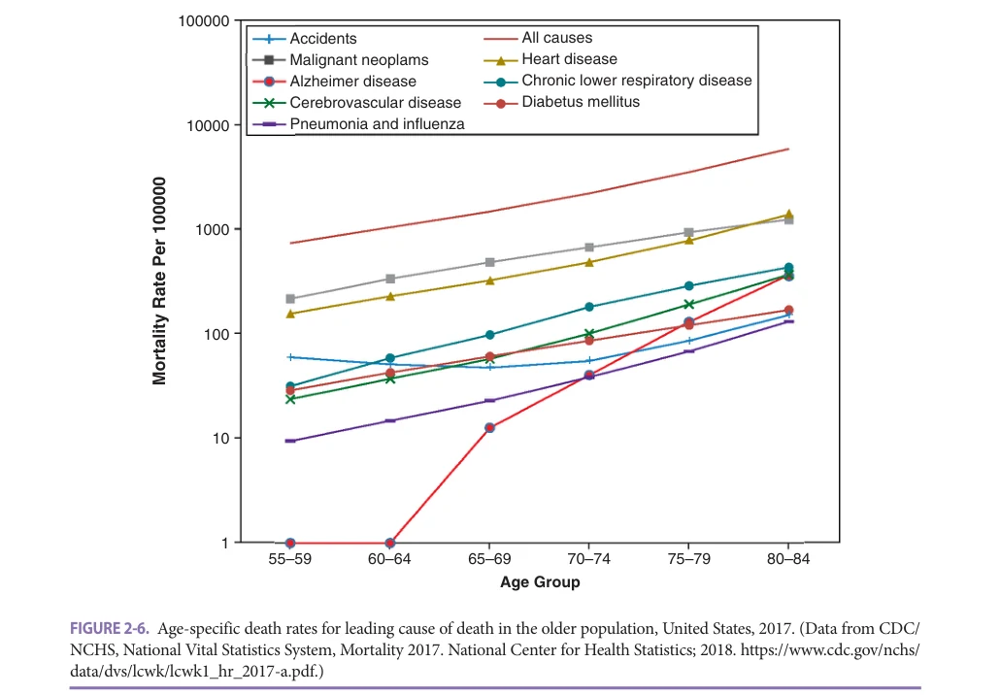

*FIGURE 2-6. Age-specific death rates for leading cause of death in the older population, United States, 2017. (Data from CDC/ NCHS, National Vital Statistics System, Mortality 2017. National Center for Health Statistics; 2018. https://www.cdc.gov/nchs/ data/dvs/lcwk/lcwk1_hr_2017-a.pdf.)*

*Owner annotations/highlights are from the marked source copy, not the book.*

such as individuals experiencing homelessness, those who are incarcerated, and those who reside in long-term care. Population-based surveys and epidemiologic cohort studies can provide more accurate estimates. These types of

studies may use a combination of testing, examinations, and medical record review to more accurately diagnose chronic conditions. However, even these studies do not reach marginalized populations.

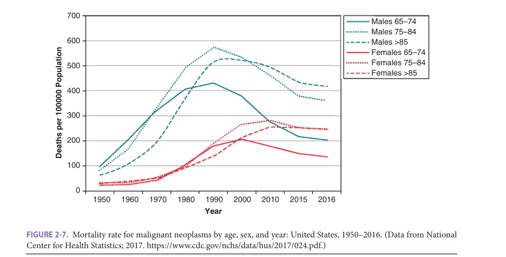

*FIGURE 2-7. Mortality rate for malignant neoplasms by age, sex, and year: United States, 1950–2016. (Data from National Center for Health Statistics; 2017. https://www.cdc.gov/nchs/data/hus/2017/024.pdf.)*

*Owner annotations/highlights are from the marked source copy, not the book.*

**[p. 31]**

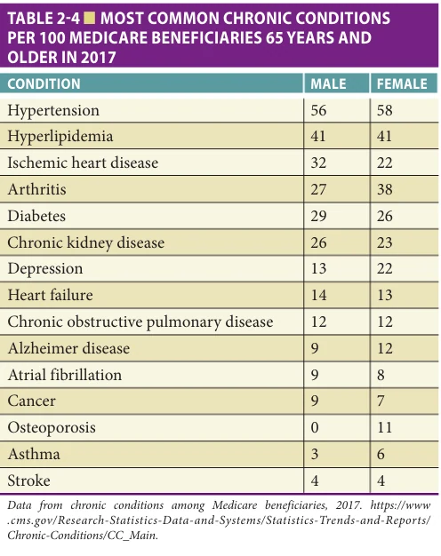

*TABLE 2-4 ■ MOST COMMON CHRONIC CONDITIONS PER 100 MEDICARE BENEFICIARIES 65 YEARS AND OLDER IN 2017*

*Owner annotations/highlights are from the marked source copy, not the book.*

### Co-Occurrence of Multiple Chronic Conditions

A core principle of geriatric medicine is that chronic conditions often occur in combination among older adults. Multiple chronic conditions are common among older adults. In 2018, 33% of adults 45 to 64 years had two or more chronic conditions, compared with 64% of adults 65 years and older. When one or more chronic conditions occur in relation to an index condition, this is often termed comorbidity; whereas when multiple chronic conditions occur together, this is termed multimorbidity. Multimorbidity accumulates with time, varies by ethnicity, and accelerates in later life. African-Americans have substantially higher levels of multimorbidity at every age, with similar age acceleration (Figure 2-8). Multimorbidity is a risk factor for multiple outcomes that include hospitalization, disability, and death, and comorbidity can increase the risk of outcomes associated with an index condition. For example, comorbidity can increase the risk of all-cause mortality among women with breast cancer, compared with women with breast cancer and no comorbid conditions. Moreover, comorbidity can complicate the treatment of a given condition, and certain therapies may be contraindicated, such as the use of diuretics to treat hypertension in the presence of comorbid gout.

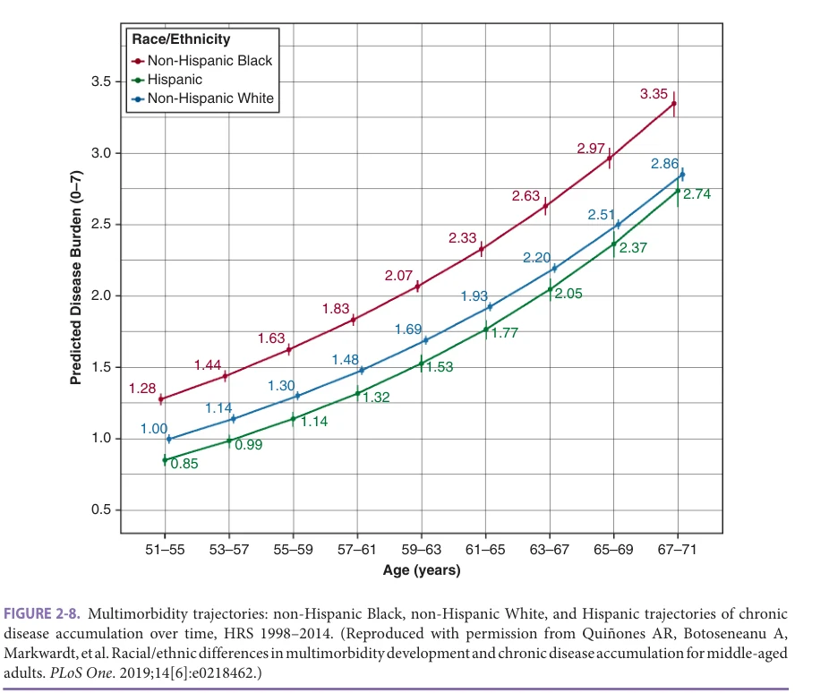

*FIGURE 2-8. Multimorbidity trajectories: non-Hispanic Black, non-Hispanic White, and Hispanic trajectories of chronic disease accumulation over time, HRS 1998–2014. (Reproduced with permission from Quiñones AR, Botoseneanu A, Markwardt, et al. Racial/ethnic differences in multimorbidity development and chronic disease accumulation for middle-aged adults. PLoS One. 2019;14[6]:e0218462.)*

*Owner annotations/highlights are from the marked source copy, not the book.*

**[p. 32]**

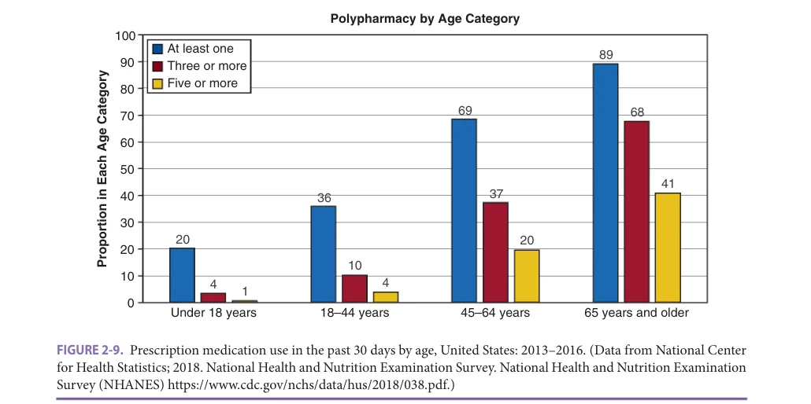

*FIGURE 2-9. Prescription medication use in the past 30 days by age, United States: 2013–2016. (Data from National Center for Health Statistics; 2018. National Health and Nutrition Examination Survey. National Health and Nutrition Examination Survey (NHANES) https://www.cdc.gov/nchs/data/hus/2018/038.pdf.)*

*Owner annotations/highlights are from the marked source copy, not the book.*

A common consequence is that people with multiple chronic conditions are often given multiple medications to treat those conditions. Most medications are evaluated one at a time in a single disease setting. While the benefit of treatment may be clear in this setting, the long-term benefits and harms associated with the combination of medications that are taking as a result of disease-specific treatment are less clear. Polypharmacy, or the use of multiple medications, is frequently associated with adverse outcomes including poor physical function, cognitive problems, and even death. Data on prescription drug use are shown in Figure 2-9. The number of prescription drugs used increases with age. Two-thirds of adults 65 years and older use three or more drugs, and 40% of this age group uses five or more. In response to concerns about medication overuse in older adults, many clinicians are considering deprescribing medications when the benefit of a medication no longer outweighs the harms. Deprescribing is the planned and supervised process of dose reduction or stopping of medication.

### Health Care Utilization

Another way to appreciate the burden of chronic conditions in older adults is to examine health care utilization. Table 2-5 illustrates that adults 75 years and older have the highest rate of ambulatory care visits of any age group based on data from the 2016 National Ambulatory Medical Care Survey. Among every 100 adults 75 years and older, there is an average of 547 outpatient medical visits per year, or between five and six visits per person. This is about double what is observed in midlife, where the average rates are 205 per 100 persons per year for adults aged 25 to 44, and 302 per 100 persons per year for adults aged 45 to 64. Also notable is that over half of

visits in adults 75 years and older are for a chronic condition, whereas this proportion is progressively smaller in younger age groups. The most common conditions reported at ambulatory care visits are hypertension, hyperlipidemia, arthritis, diabetes, and cancer.

Based on data from the National Hospital Discharge Survey, heart disease is the top cause of hospitalization in persons aged 65 and older and accounts for nearly 600 hospitalizations per 10,000 people per year (Table 2-6). Among the different types of heart disease, heart failure results in the highest burden of hospitalizations, due to the recurrent nature of this condition. After heart disease, the most common causes of hospitalization are cerebrovascular disease, pneumonia, cancer, fractures, osteoarthritis, septicemia, and

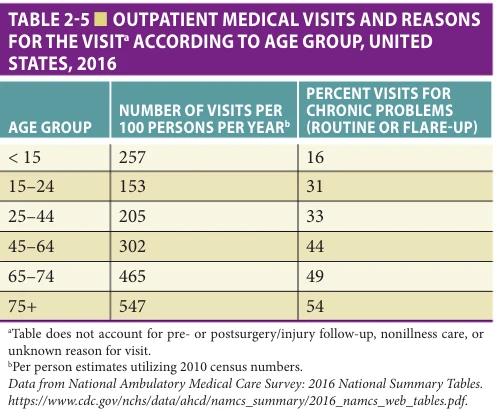

*TABLE 2-5 ■ OUTPATIENT MEDICAL VISITS AND REASONS FOR THE VISITa ACCORDING TO AGE GROUP, UNITED STATES, 2016*

*Owner annotations/highlights are from the marked source copy, not the book.*

**[p. 33]**

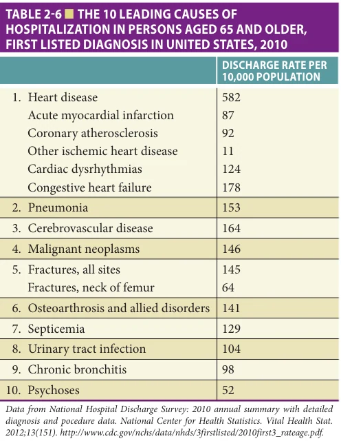

*TABLE 2-6 ■ THE 10 LEADING CAUSES OF HOSPITALIZATION IN PERSONS AGED 65 AND OLDER, FIRST LISTED DIAGNOSIS IN UNITED STATES, 2010*

*Owner annotations/highlights are from the marked source copy, not the book.*

urinary tract infections, which all have rates that exceed 100 hospitalizations per 10,000 people per year. These statistics not only represent a high burden of morbidity for patients, but a high cost to the health care system, which highlights the importance of prevention for these conditions.

### Cardiovascular Disease

The prevalence of cardiovascular disease, which includes heart failure, stroke, and coronary heart disease, rises sharply with age. Figure 2-10 illustrates the age-specific prevalence of these conditions among men and women. All increase with age, with coronary heart disease demonstrating the sharpest increase, reaching over 30% in men and 25% in women.

### Cancer

The incidence rate for most cancers rises with age, although some, such as prostate, breast, uterine, and lung cancer, decline in the oldest age groups as seen in Figure 2-11. Incidence data are available nationally from the Surveillance, Epidemiology, and End Results (SEER) survey of cancer registries. In both men and women, sex-specific cancers, prostate in men and breast in women, have the highest incidence rates, peaking in adults in their early 70s.

### Sensory Impairments

Sensory impairments are often overlooked when assessing the burden of chronic conditions but can contribute importantly to the quality of life and the ability to remain independent. Sensory impairments are often classified as a

geriatric syndrome because their incidence increases with age and is often due to multiple different pathophysiologic causes. According to data from the National Health and Nutrition Examination Survey, one out of six Americans aged 70 and older has a visual impairment, one out of four has a hearing impairment, and three out of four have abnormal testing for postural balance. These numbers continue to increase with age and the prevalence of vision and hearing impairments in those aged 80 and older are over double that in adults in their 70s. Unfortunately, many older adults are undertreated for their impairments, and almost 60% of older persons with vision problems could benefit from new or improved glasses, and 70% of older persons with hearing problems could benefit from a hearing aid. These statistics represent a missed opportunity for treatment to attenuate the detrimental effects of hearing and vision loss.

## DISABILITY AND FUNCTIONAL HEALTH

Older adults frequently report preservation of functional and cognitive health as their highest priorities for care. Maintenance of health in these domains allows older adults to engage in activities that enhance meaning in their lives. For some, this could mean being able to go for long walks or play with their grandchildren. For others, it could be the ability to continue working in their careers or engaging in volunteerism. Moreover, functional health is not only an important outcome on its own, but poor functional health is predictive of disability, loss of independence, institutionalization, and ultimately death. For these reasons, geriatric medicine has always prioritized preservation of functional health as a goal of care. In parallel, the epidemiology of aging has evolved as a discipline to study the distribution of functional health in older age, as well as risk and protective factors with the goal of informing interventions.

### Measurement of Disability and Function

The terminology used to describe functional health is complex, so we begin with a brief overview. Functional health is a broad term that is often defined as an individual’s ability to perform activities in their daily lives, including both simple and complex activities. Disability is defined as difficulty completing usual activities, and is frequently assessed through difficulty or inability to complete one’s activities of daily living (ADLs): activities essential for self-care (eg, bathing, dressing oneself, using the toilet) (see Chapter 42). The distinction between difficulty and inability is meaningful and has led to variation in disability estimates across studies. Instrumental activities of daily living (IADLs) refer to the activities that allow an individual to remain independent in the community (eg, driving, shopping, preparing food). Preceding the onset of a disability is often a functional limitation, which refers to a restriction in basic physical action, such as difficulty crouching or kneeling. Mobility limitation refers to difficulty in walking or climbing stairs and is often measured by self-report. However,

**[p. 34]**

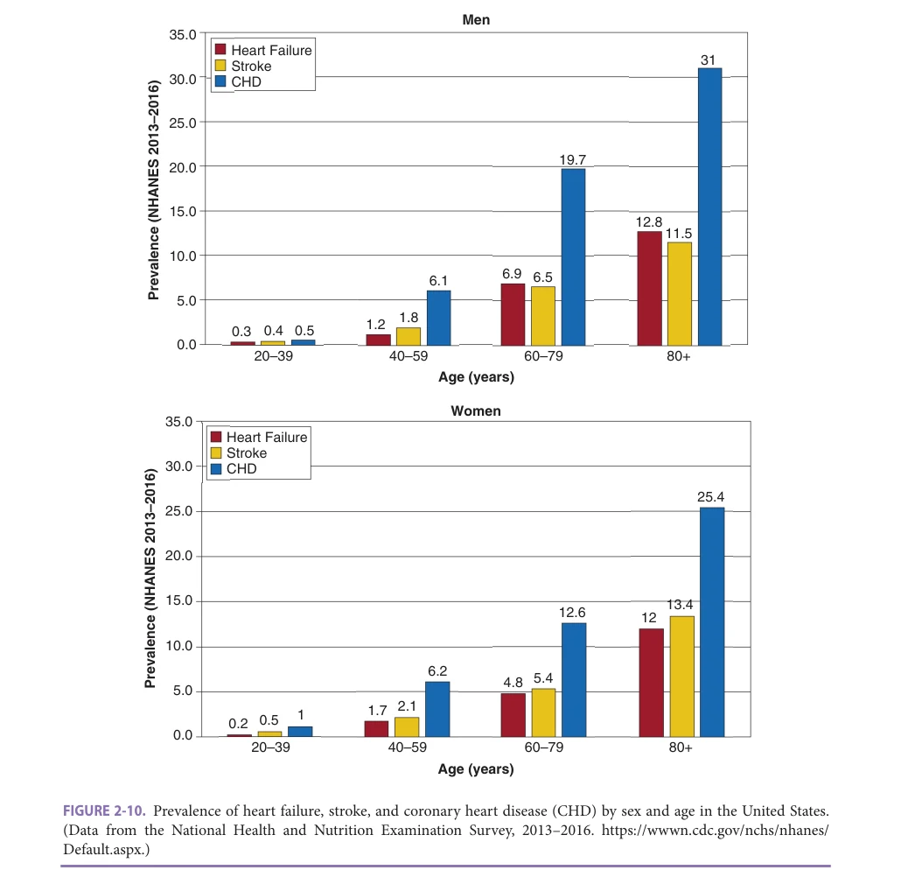

*FIGURE 2-10. Prevalence of heart failure, stroke, and coronary heart disease (CHD) by sex and age in the United States. (Data from the National Health and Nutrition Examination Survey, 2013–2016. https://wwwn.cdc.gov/nchs/nhanes/ Default.aspx.)*

*Owner annotations/highlights are from the marked source copy, not the book.*

some experts have defined dismobility as a measured gait speed less than 0.6 m/s or inability to walk 400 meters. Physical performance measures include objective measures of physical function such as walking, balance, and strength. One of the most common tools for evaluating physical performance is the Short Physical Performance Battery (SPPB), which includes a 4-meter gait speed test, chair stands as a measure of lower body strength, and balance.

### Epidemiology of Disability

Data from Medicare beneficiaries demonstrate the striking impact of age on the prevalence of disability and residence in a long-term care facility (Figure 2-12). With each decade

of ascending age, the proportion of those with no disability drops from 66% in adults 65 to 74 years old to only 27% in adults 85 years and older. In this survey, disability was defined as serious difficulty hearing, seeing, concentrating, remembering, or making decisions, walking or climbing stairs, dressing or bathing, or with errands. Moreover, the prevalence of two or more disabilities increases from 15% to 38% in the same age groups, respectively. Notably, the prevalence of adults living in a long-term care facility reaches 13% among those aged 85 and older. These same data show modest sex differences, with women being more likely to have prevalent disability than men. Figure 2-12 also demonstrates disparities by race/ethnicity, with White

**[p. 35]**

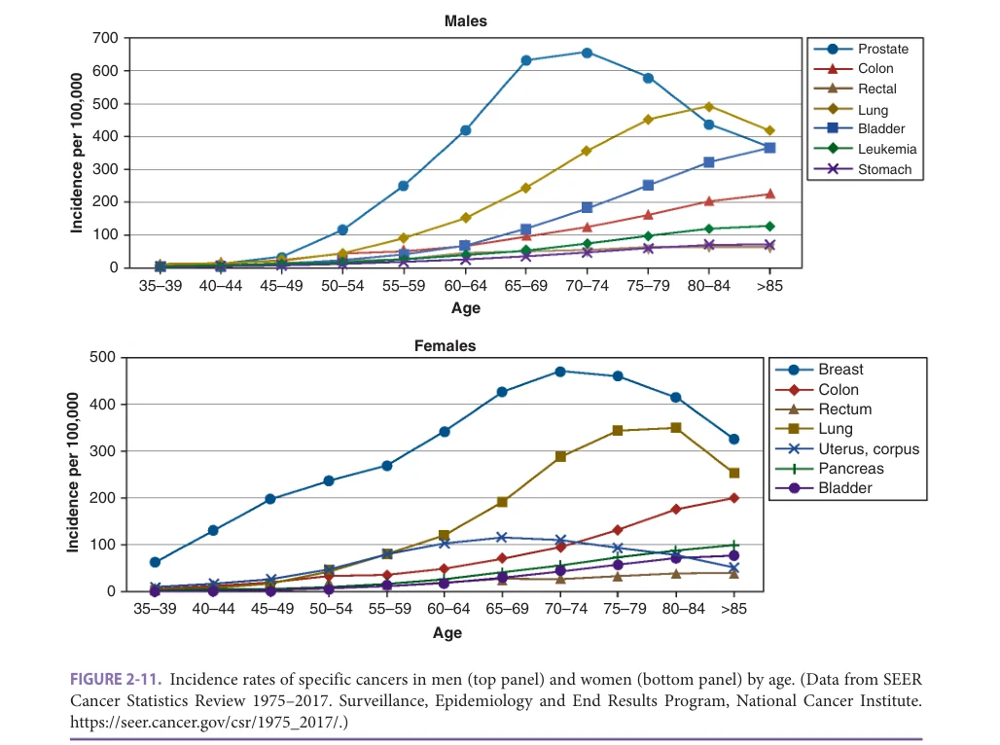

*FIGURE 2-11. Incidence rates of specific cancers in men (top panel) and women (bottom panel) by age. (Data from SEER Cancer Statistics Review 1975–2017. Surveillance, Epidemiology and End Results Program, National Cancer Institute. https://seer.cancer.gov/csr/1975_2017/.)*

*Owner annotations/highlights are from the marked source copy, not the book.*

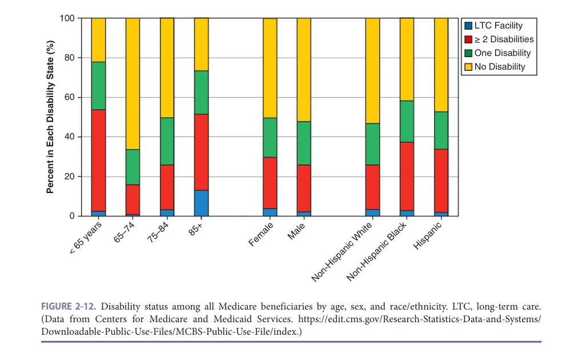

*FIGURE 2-12. Disability status among all Medicare beneficiaries by age, sex, and race/ethnicity. LTC, long-term care. (Data from Centers for Medicare and Medicaid Services. https://edit.cms.gov/Research-Statistics-Data-and-Systems/ Downloadable-Public-Use-Files/MCBS-Public-Use-File/index.)*

*Owner annotations/highlights are from the marked source copy, not the book.*

**[p. 36]**

non-Hispanic adults having the lowest prevalence of disability compared to Black non-Hispanic and Hispanic adults, yet the highest prevalence of long-term care. These inequities reflect the unequal conditions in which persons from different racial and ethnic backgrounds live in the United States.

Figure 2-13A shows similar patterning for the prevalence of mobility disability, defined as self-reported inability to walk 1/2 mile or climb a flight of stairs without assistance. Women have a higher prevalence of mobility disability, and the prevalence increases with age for both women and men. The subsequent panels allow us to examine prevalence in the setting of the dynamics of disability and death. Prevalence is a function of incidence (Figure 2-13B), or new cases of mobility limitation, as well as death (Figure 2-13C) and recovery (Figure 2-13D). The incidence rate of new mobility limitation increases with age for both women and men (Figure 2-13B), but the differences are not as great as for prevalence. This is explained by evaluating the subsequent graphs; Figure 2-13C demonstrates that women

living with a disability have lower mortality rates than men, thus contributing to greater prevalence at a given age. Men are slightly more likely to recover from mobility disability than women, although recovery declines in both groups by age (Figure 2-13D).

### Dynamics of Disability

One of the foundational models of disability, known as the Disablement Process, was first published in 1994 by Lois Verbrugge and Alan Jette. In this model, pathology or disease can lead to impairments, described as dysfunctions or structural abnormalities in specific body systems. This, in turn, can lead to functional limitations, which is a restriction in a basic physical or mental action. Last in the sequence of events is disability, which is defined as difficulty doing activities of daily life. This Disablement Process model also acknowledges the role of the environment, risk factors, and person factors such as behavior and psychosocial attributes. An alternative model was presented in 2002 by the World Health Organization to describe the

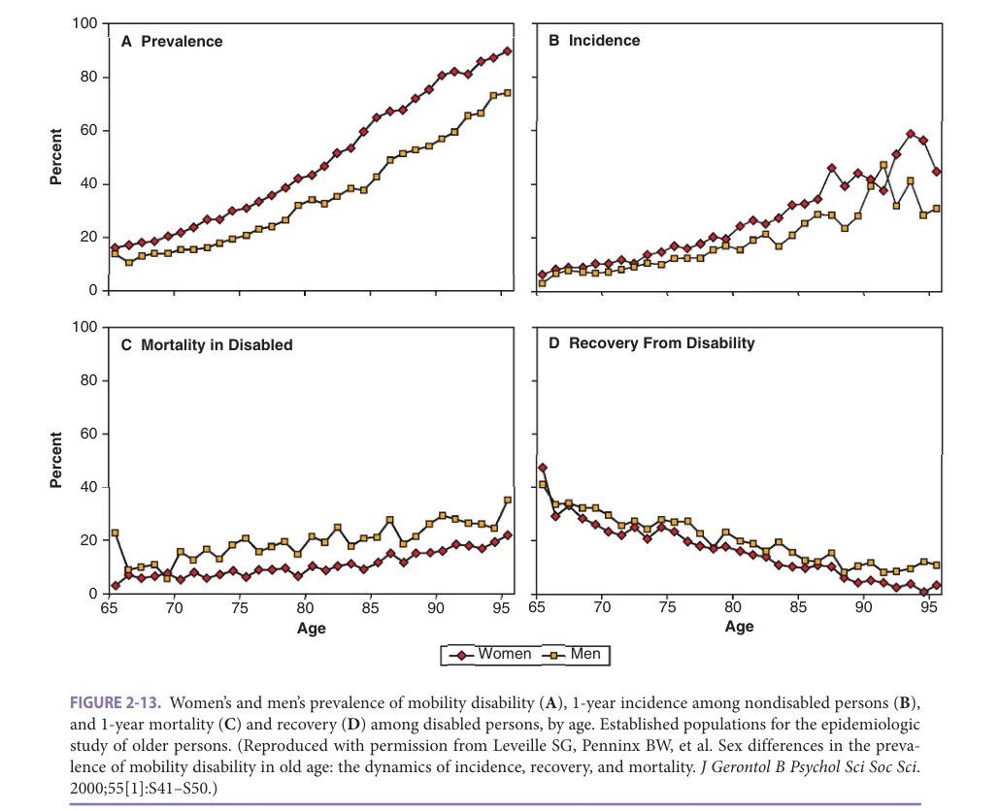

*FIGURE 2-13. Women’s and men’s prevalence of mobility disability (A), 1-year incidence among nondisabled persons (B), and 1-year mortality (C) and recovery (D) among disabled persons, by age. Established populations for the epidemiologic study of older persons. (Reproduced with permission from Leveille SG, Penninx BW, et al. Sex differences in the prevalence of mobility disability in old age: the dynamics of incidence, recovery, and mortality. J Gerontol B Psychol Sci Soc Sci. 2000;55[1]:S41–S50.)*

*Owner annotations/highlights are from the marked source copy, not the book.*

**[p. 37]**

International Classification of Functioning, Disability, and Health (ICF). This model presents a biopsychosocial model of disability, which is viewed as an interaction between the features of a person and the context in which they live. Much like the Disablement Process, the ICF model also posits levels of functioning that encompass health conditions, impairments, activity limitations, and participation restriction. However, there is increased focus on level of health, as well as a distinction between an individual’s capacity and performance, which is what a person does in their environment.

Regardless of the model used, it is important to understand that disability is not a fixed state, but a dynamic and bidirectional process. Many adults recover from disability and may report the onset and recovery of disability multiple times throughout their life course. One study in the United States found that impairment in ADLs developed in one-fifth of adults aged 50 to 64. Among this population with impairment, 2 years later, 4% had died, 9% had further declined, 50% had persistent impairment, and 37% had recovered. In another study of a population of African-American adults residing in Jackson, Mississippi, found that 32% had an incident mobility limitation, but nearly half had recovered within a year. The important takeaway for geriatric care is that, although avoiding an incident limitation is preferred, recovery after limitation or disability is likely. Interventions to facilitate recovery,

prevent persistent disability, or further loss can help older adults to stay independent and actively engaged in their communities.

Finally, the dynamic process of disability can occur over different timescales. Often there is a distinction made between catastrophic disability, with the sudden onset of disability, such as after an acute event such as a stroke, and progressive disability, which can develop slowly over time. The Precipitating Events Project is one study that has illuminated the time scale of disability onset by contacting participants aged 70 and older monthly. By assessing individuals frequently, study investigators were able to describe disability onset using a more granular timescale than is usually evaluated in large-scale epidemiologic investigations. The investigators reported five different trajectories of disability in the last year of life, illustrated in Figure 2-14, highlighting the heterogeneity of this process: persistent severe disability, progressive disability, accelerated disability, catastrophic disability, and no disability.

### Risk Factors for Disability

Data from earlier discussion illustrate differences in disability by age, sex, and race/ethnicity. We next turn to risk factors for disability and poor functional health. Many chronic conditions are risk factors for disability, including cardiovascular disease, heart failure, osteoarthritis, chronic

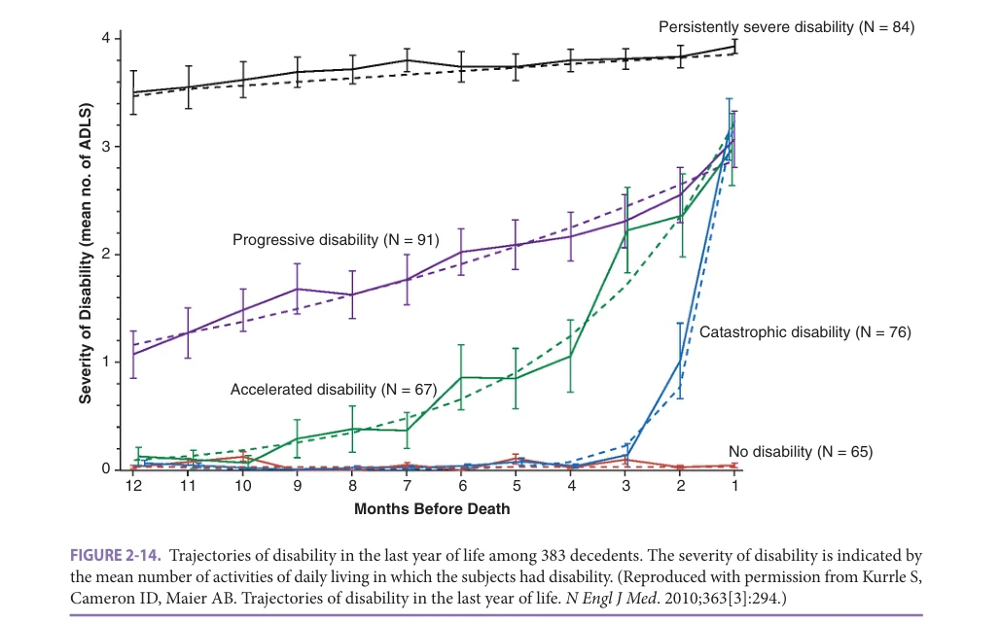

*FIGURE 2-14. Trajectories of disability in the last year of life among 383 decedents. The severity of disability is indicated by the mean number of activities of daily living in which the subjects had disability. (Reproduced with permission from Kurrle S, Cameron ID, Maier AB. Trajectories of disability in the last year of life. N Engl J Med. 2010;363[3]:294.)*

*Owner annotations/highlights are from the marked source copy, not the book.*

**[p. 38]**

obstructive pulmonary disease, diabetes, cancer, depression, dementia, and sensory impairments. Moreover, the presence and burden of disability and functional limitations increases notably with the number of chronic conditions (Figure 2-15). This figure demonstrates the prevalence of up to 19 functional limitations (Figure 2-15A) and 7 ADL/ IADL (Figure 2-15B) rises sharply with the number of chronic conditions. This graph also illustrates the higher

burden of functional limitation and disability among women and those aged 75 and older.

A healthy lifestyle can not only prevent disease but disability as well. There is a substantial body of work that has demonstrated that no smoking, healthy diet, and physical activity can all reduce the risk of disability. In 2014, investigators in the Lifestyle Interventions and Independence for Elders (LIFE) study found that

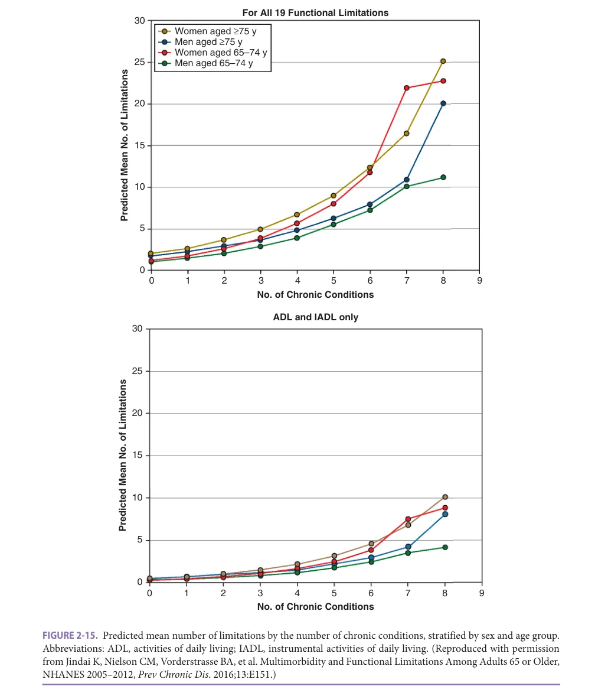

*FIGURE 2-15. Predicted mean number of limitations by the number of chronic conditions, stratified by sex and age group. Abbreviations: ADL, activities of daily living; IADL, instrumental activities of daily living. (Reproduced with permission from Jindai K, Nielson CM, Vorderstrasse BA, et al. Multimorbidity and Functional Limitations Among Adults 65 or Older, NHANES 2005–2012, Prev Chronic Dis. 2016;13:E151.)*

*Owner annotations/highlights are from the marked source copy, not the book.*

**[p. 39]**

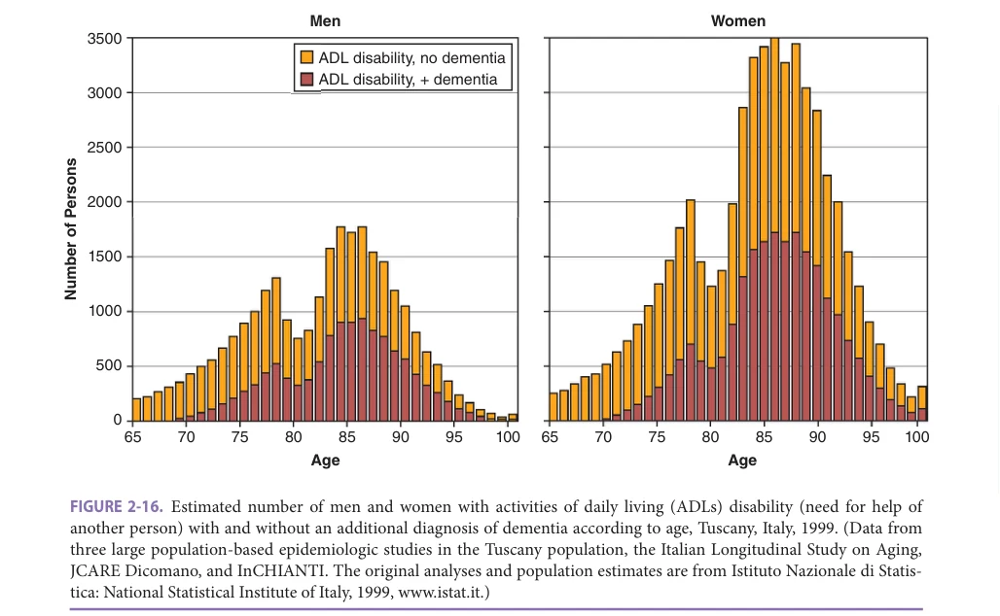

*FIGURE 2-16. Estimated number of men and women with activities of daily living (ADLs) disability (need for help of another person) with and without an additional diagnosis of dementia according to age, Tuscany, Italy, 1999. (Data from three large population-based epidemiologic studies in the Tuscany population, the Italian Longitudinal Study on Aging, JCARE Dicomano, and InCHIANTI. The original analyses and population estimates are from Istituto Nazionale di Statistica: National Statistical Institute of Italy, 1999, www.istat.it.)*

*Owner annotations/highlights are from the marked source copy, not the book.*

a structured, moderate-intensity physical activity program reduced the risk for major mobility disability by about 20% over 2.6 years. The intervention included aerobic, resistance, and flexibility training activities in a center and at home. The study targeted adults at risk for disability, demonstrating that disability is to some extent preventable.

Cognitive impairment and poor functional health are interrelated and often follow similar epidemiologic patterns. Figure 2-16 illustrates the number of men and women with disability with and without dementia in three population-based studies in the Tuscany region of Italy in 1999. One can see that these conditions are similarly distributed across the age spectrum in men and women. The dip in the number of people living with a disability in these studies with and without dementia among persons around 80 years of age is due to the low birthrate during and shortly after World War I. Dementia is a determinant of limitations in IADLs, such as paying bills or shopping, where problems in memory can limit an individual’s ability to complete these tasks. Dementia is also a risk factor for other types of functional limitations and disability, and conversely, functional limitation is also a risk factor for dementia. The bidirectional relationship between cognitive and physical function is an important active area of research. The potential clinical implication is that patients with limitations in one domain may be more likely to develop limitations in another.

### Trends in Disability

Disability is commonly considered a key indicator of older adult health; it is patient-centered outcome, and also tightly connected to an individual’s ability to remain independent and age in place. The prevalence of disability is also a measure of caregiving required by a population, either in the form of at-home or institutionalized care. For these reasons, researchers have monitored trends in disability, through large-scale nationally representative surveys. Monitoring temporal trends is challenging due to confounding by age and birth cohort effects, as well as trends that vary by characteristics of the population (ie, age, sex, geography) and the measurement tools used.

In general, there have been declines in disability prevalence over the past several decades, although this decline appears to have slowed or stopped around the turn of the millennium. Freedman et al. pooled results from five large surveys from 2000 to 2008: the Health and Retirement Study, the Medicare Current Beneficiary Survey, the National Health Interview Survey, the National Health and Nutrition Examination Survey, and the National Long Term Care Survey. The researchers found that disability prevalence was relatively stable for those aged 65 to 84, and appeared to be increasing among 55 to 64 years and decreasing among 85 years and older. These findings likely reflect the converging influences of advances in the care of older adults, especially the oldest old, as well as

**[p. 40]**

temporal increases in disability risk factors such as obesity and inactivity. Research has demonstrated physical activity, a cornerstone of disability prevention and requires environmental and societal resources, such as sidewalks and safety, in addition to individual decision-making.

## COGNITIVE FUNCTION

Along with physical function, preservation of cognitive function remains a top goal of care for older adults. Cognitive impairment and dementia are associated with worse quality of life, disability, loss of independence, and death. Moreover, cognitive function and physical function are intertwined, with decrements in one contributing to another.

### Measures of Cognitive Function and Dementia

Various instruments have been used to assess cognitive function in epidemiologic studies (see also Chapter 9). Commonly used tests include the Mini-Mental State Exam, Modified Mini-Mental State Exam, and the Montreal Cognitive Assessment, which are measures of global cognitive function, and the Digit Symbol Substitution Test, a measure of processing speed, and others. Some tests are better at detecting low function than high function such that highly educated older adults may perform at the test ceiling in spite of early cognitive decline. Moreover, tests may be insensitive for small declines in cognitive function.

The gold standard for clinical Alzheimer disease and dementia diagnosis is through a neuropsychological evaluation with a full battery of cognitive tests, a neurologic examination, and brain imaging. However, many epidemiologic studies use other data sources such as medical record review including ICD codes, medication use, death certificates, and brief cognitive tests to define dementia. Each of these sources is subject to misclassification and thus the incidence and prevalence of dementia may be biased, as well as any associations with risk factors. For example, one systematic review found that the positive predictive values of codes for dementia diagnosis ranged from 33% to

100% and sensitivities ranged from 21% to 86%. Nonetheless, the widespread availability of electronic health records and claims data has increased the use of these alternative data sources to ascertain dementia. Rigorous epidemiologic analyses that incorporate these measures will include sensitivity analyses such as quantitative bias analysis to evaluate the potential impact of the misclassification on study findings.

### Epidemiology of Cognitive Impairment and Dementia

The prevalence of mild cognitive impairment increases with age; a recent systematic review found that the prevalence of mild cognitive impairment was 6.7% for ages 60 to 64, 8.4% for 65 to 69 years, 10% for 70 to 74 years, 15% for 75 to 79 years, and 25% for 80 to 84 years. The epidemiology of dementia follows a similar pattern with age. Figure 2-17 illustrates the increase in dementia cases with age. Notably, women have more dementia than men after the mid-70s. These data were obtained from a pooled study of 11 European population-based studies. Incidence rates of dementia were 2.4 per 1000 person-years in adults aged 65 to 69, 5.5 in 70 to 74 years, 16 in 75 to 79 years, 31 in 80 to 84 years, 49 in 85 to 89 years, and 70 per 1000 person years in those aged 90+. Risk factors for cognitive impairment and dementia include lower educational attainment, cardiovascular disease, hypertension, diabetes, obesity, and apolipoprotein ε-4 genotype.

## BIOMARKERS

Biomarkers measure aspects of biologic processes in blood or urine or with physiologic monitoring or imaging. Associations of biomarkers with outcomes can indicate the level of risk or inform on biologic underpinnings. While many biomarkers have been studied for specific diseases, interest is turning to biomarkers of the aging process itself. A biomarker of aging is conceptualized along two main

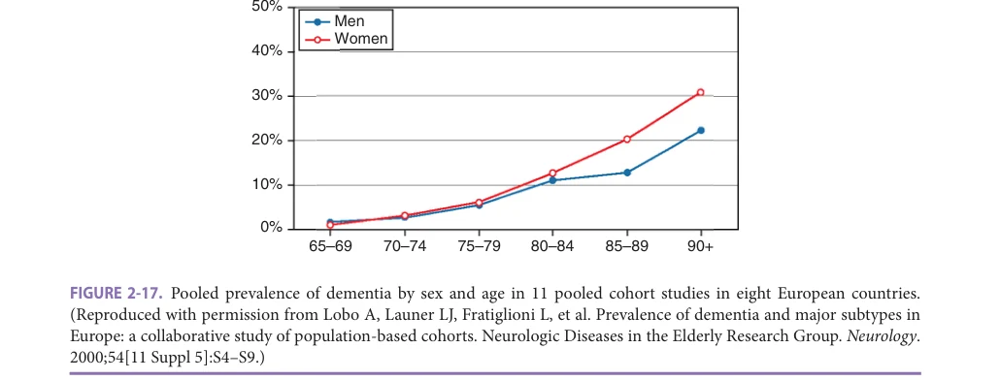

*FIGURE 2-17. Pooled prevalence of dementia by sex and age in 11 pooled cohort studies in eight European countries. (Reproduced with permission from Lobo A, Launer LJ, Fratiglioni L, et al. Prevalence of dementia and major subtypes in Europe: a collaborative study of population-based cohorts. Neurologic Diseases in the Elderly Research Group. Neurology. 2000;54[11 Suppl 5]:S4–S9.)*

*Owner annotations/highlights are from the marked source copy, not the book.*

**[p. 41]**

dimensions: first as a marker or set of markers that captures the state of one or more fundamental aging hallmarks and second, markers that can predict outcomes at least as well, if not better than, chronological age. Hallmarks of aging include inflammation, mitochondrial dysfunction, protein misfolding, impaired autophagy, and telomere shortening, among others. These have proven to be challenging to measure in epidemiologic studies, as they often require fresh blood or tissue. However, there is hope that new markers that more closely reflect aging biology could be useful to track aging over time and ultimately to assess responses to preventive measures that promote healthy aging.

Interleukin-6 (IL-6), a marker of inflammation, is one of the most robust biomarkers of aging, predicting many adverse aging outcomes. Interleukin-6 is a cytokine produced by activated immune cells, muscle, and fat, signaling the liver to induce C-reactive protein. An IL-6 level of 2.5 pg/dL may appear to fall in the upper normal range for community-dwelling older adults, but levels in this range robustly predict decline in strength, walking speed, and mortality in observational studies of older adults. Along with experimental studies in animal models, these studies support the hypothesis that directly lowering IL-6 could prevent age-related disability. Based on this hypothesis, a clinical trial, ENRGISE tested whether IL-6 could be reduced with either fish oil or losartan. While there was no change in either IL-6 levels or walking speed with either intervention, the study provided a roadmap for translating biomarker associations in epidemiologic studies to targeted intervention clinical trials in aging. Another biomarker is telomere length, which is thought to mark biologic age as the length of the telomeres shortens with each cell division. When critical shortening is reached, cell senescence ensues. Epidemiologic studies of telomere length have been inconsistent, perhaps because most studies use mixed populations of white cells from peripheral blood. Telomere length is also quite variable and difficult to track over time. Nevertheless, telomere biology is clearly important in cell senescence and cancer biology, warranting continued interest in the biology of telomere loss and maintenance.

Increasingly, panels of biomarkers are being used to detect hundreds or thousands of unique molecules circulating in the blood, ranging from single nucleotide polymorphisms in the DNA (genomics), metabolites (metabolomics), proteins (proteomics), or the composition of microbes in body fluids (microbiome). By harnessing these “-omics” technologies to study population aging, new pathways or targets for healthy aging might be identified.

Genomics and epigenetics are well-established among the “-omics” methods. Genome-wide association studies (GWAS) have linked specific risk alleles to a broad array of aging outcomes such as walking speed and muscle strength or longevity. Prior to the GWAS era, the APOE4 genotype had already been established as a risk factor for cardiovascular disease and dementia. More recently, polymorphisms in this region of the genome have been found to

predict longevity. The methylation of DNA, which controls transcription, clearly changes across the lifespan. By correlating methylation patterns with chronologic age, “methylation clocks” have been developed. The mechanisms of these associations are not well understood, yet changes in methylation age have been proposed as a potential agnostic marker of interventions purported to impact biologic aging.

Proteomic studies evaluate proteins that serve as enzymes or transcription factors in cellular processes. Growth differentiation factor 15 (GDF-15) has been identified in proteomic analysis as strongly related to mobility disability disease and frailty. Groups of proteins can be evaluated for the degree to which they fall into a pattern for a particular biologic pathway. For example, pathway analysis has revealed that signaling pathways of inflammation and phagocytosis are related to mobility disability.

Metabolomics include the circulating products of metabolism, such as lipids, alcohols, and amino acids. Several different platforms are needed to assess lipophilic and hydrophilic molecules. Many of the molecules that can be measured are as yet unknown or are adducts or other byproducts that are artifacts. Early studies have examined obesity and frailty, which are thought to have distinct metabolic fingerprints that may better define the underlying biology. More studies are needed that assess metabolic changes with specific interventions and diets.

### Composite Biomarkers

Summary measures of health have been used to approximate biologic age by validating scores of deviation of multiple laboratory tests and physiologic measures against mortality risk. Many of these measures do not seem to have substantial correlation with telomere length or methylation age, although neither of these would be considered as gold standards. Currently, composite measures of biologic age are more accessible than blood measures as most rely on clinically available information. In a study of caloric restriction (CALERIE), a composite measure of biologic age increased less in calorically restricted adults. Such studies illustrate the potential utility of understanding the global impact of interventions on health and aging.

### Physiologic Tests and Imaging

Whole person physiologic measures can also be biomarkers. One of the most well-validated is gait speed, which can be viewed as summarizing aging in multiple systems. Longer endurance walks and treadmill stress tests can also be considered as biomarkers as loss of exercise capacity is clearly age-related, even among the most fit master’s athletes. Blood pressure and pulse wave velocity can detect vascular stiffening, a strongly age-related physiologic process. Some of the composite measures of biologic age use such measures in combination with or without blood laboratory tests.

**[p. 42]**

Imaging has been used to assess many systems. Brain aging can be defined by the degree of overall brain atrophy and increases in white matter hyperintensities on brain MRI. Such measures have been validated as biomarkers in that they are strongly age-associated and predict future morbidity and mortality in epidemiologic studies. Imaging has also been used to describe the age-related loss of muscle mass and the central infiltration of body fat. Fat infiltration of muscles and organs is clearly related to worse metabolic health and appears to progress with aging, even without overall obesity or disease. Whether body composition can serve as a biomarker of aging per se is still controversial as muscle mass has been more difficult to measure precisely. New imaging or isotope tracer methods may better define the role of these measures as biomarkers.

### Epidemiology and Population Biology

Epidemiology can support the study of aging by identifying modifiable risk factors for accelerated aging and/ or longevity and their biologic pathways. Beyond individual biomarkers, multi-omics studies can link genes to proteins to metabolites and these factors to biomarkers of intermediate-aging phenotypes. Physiologic measures and imaging can summarize the state of aging at the level of individual organs. Together these can create a deeper understanding of the aging process in population studies and identify new opportunities for prevention and treatment of the adverse effects of aging.

## BEHAVIORAL, SOCIOECONOMIC, AND ENVIRONMENTAL RISK FACTORS

### Behavioral Risk Factors

Health behavior can precipitate or slow functional decline among older adults. Studies conducted among twins and family members indicate that, for the first eight decades of life, environmental factors are stronger predictors than genetics of health and survival. Surveillance from the Centers for Disease Control and Prevention (Table 2-7) indicates that adults aged at least 65 have a lower likelihood of reported binge drinking and smoking compared with middle-aged adults. Potentially due to increased need of medical care, older adults are the age group that reports regular routine checkups and immunization. Over the life course, the effect of behavior on disability and lifespan appears to attenuate. The updated framework for biomedical research involves contextualizing patterns of health behavior with social circumstances. Further research needs to identify the ideal interplay of modifiable lifestyle and environmental factors that grant older adults more disability-free life-years.

A plurality of randomized controlled trials among older adult populations target specific health behaviors to slow disease progression or reduce the incidence of functional decline. Smoking abstention or cessation,

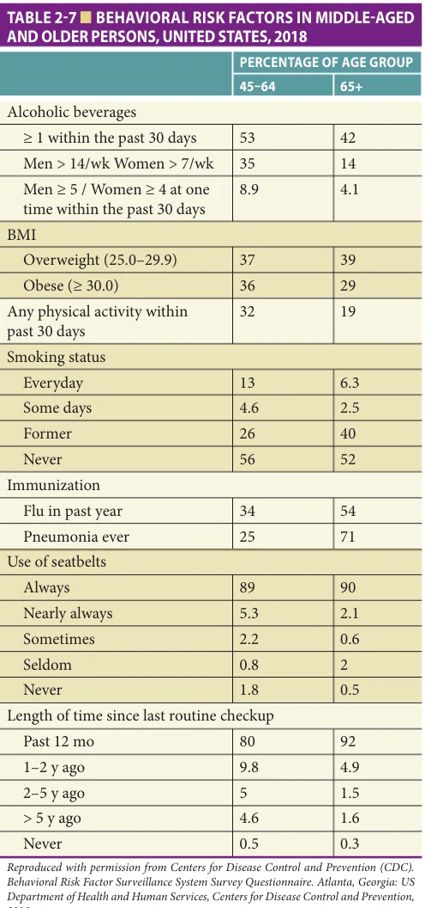

*TABLE 2-7 ■ BEHAVIORAL RISK FACTORS IN MIDDLE-AGED AND OLDER PERSONS, UNITED STATES, 2018*

*Owner annotations/highlights are from the marked source copy, not the book.*

regular physical activity, and healthy diet are certainly recommended for the preservation of older adult health and independence. However, the associations between individual behaviors and health outcomes appear to weaken among older adult populations in observational data as well as in randomized trials. Compared to those assigned to health education control groups, older adult participants engaging in behavioral intervention arms commonly experience modest reduction in the incidence of transient or permanent impairment over follow-up. The smaller than expected differences in incident mobility limitation between trial

**[p. 43]**

groups may be attributable to the community benefit that the control participants receive. Additionally, the long-term effect of such interventions remains understudied among older adults, whose average risk of functional decline increases due to the concurrent accumulation of chronic conditions and loss of social resources. The research into the determinants of healthy aging accordingly incorporates factors that influence and eventually supersede the effects of individual behavior.

### Socioeconomic Status

Low socioeconomic status (SES) has been associated with higher rates of disability and mortality. Whether operationalized as educational attainment, income, or main occupation, higher SES can provide the resources (eg, time, information, money) necessary to engage in positive health behaviors over the lifespan. Higher parental SES both determines adult SES and is associated with better cognitive reserve (good cognition in the face of brain pathology) in observational studies of dementia. In a nationally representative sample of US older adults, attainment of a high school degree or equivalent was associated with greater cognitive function, while late-life income was a more deterministic of cognitive decline. Compared to current individual income, household wealth may better characterize the finances available to adults at retirement age. Wealth is the net value of assets, investments, businesses, and property value minus debts. Older adults lacking wealth may be reliant on state-funded pensions far below their earnings during working years. Belonging to the lowest versus highest quartile of wealth was associated with greater 8-year declines in grip strength and gait speed among English older adults. Furthermore, the socioeconomic differentials in healthy aging appear to be widening over time. Wealthy adults born in 1960 have fewer reported functional impairments and better cognitive performance than their sameage counterparts born in 1915. The influence of SES on older adult health is cumulative, complex, and may be subject to cohort effects.

### Marginalization, Acculturation, and Social Stratification

Access to more economic and political resources facilitates successful avoidance of premature morbidity and mortality. The unequal distribution of resources has historically been drawn along racial and ethnic lines. Biomedical research is shifting from treating racial or ethnic identity as a homogenous and innate, instead understanding self-assigned background as a proxy for aggregated elements including cultural norms and discriminatory treatment. Discrimination includes both interpersonal experiences including harassment and police brutality, as well as structural inequality including redlining and biased bank loan practices. Forms of discrimination, such as racism, can also be internalized, that is, members of marginalized groups accepting as fact the stereotypes

propagated by the majority. Beyond inducing psychological stress and physiologic dysregulation, discrimination motivates adverse coping mechanisms, reduces the likelihood of engaging in health-promoting behaviors, and restricts socioeconomic mobility. David Williams has developed one of the earliest psychometric scales to assess discrimination. Initially used to characterize racism experienced by Black Americans, these measures have been implemented and validated among diverse groups to assess discrimination attributable to gender, class, sexual orientation, and age. Analogous to discrimination based on race or ethnicity, cultural prioritization of younger people devalues older adults in the health care and employment spheres. Ageism manifests as detrimental treatment of older adults along with the negative aging stereotypes held by the society, health care providers, and older adults themselves. Compared to older adults reporting no discrimination due to age and after controlling for baseline health status, more experiences of ageism are associated with lower preventative health care use, greater stress, poor balance, and impaired cognitive performance. Conversely, even older adult carriers of ε4 variant of the APOE gene who expressed positive aging beliefs scored better on the telephone interview for cognitive status than carriers who expressed negative aging beliefs. Understanding the impact that various forms of discrimination have on older adult health improves the equity of medical care.

Acculturation involves both maintaining attitudes and beliefs from the culture from which a person originates and developing new ties with a dissimilar and usually dominant culture. Strategies for acculturation include integrating these new cultural beliefs with original ideas, entirely assimilating the attitudes of the new culture to replace original ones, separating from the attitude of the new culture by remaining in original cultural enclaves, and being marginalized by not identifying with either their original or new culture. Though acculturation can be crudely approximated by immigration status, language use, and duration of residence in new country, culturally specific tools such as the Acculturation Rating Scale for Mexican Americans– Version II have been developed to better assess how individuals perceive identity, utilize language, and engage in interpersonal interactions. Context as individualized as immigration experience or as system-level as discriminatory legislation can influence both acculturation patterns as well as health outcomes. Highly acculturated people tend to smoke, consume more alcohol, and have unhealthier diets; they are also more likely to exercise, have higher SES, and have greater health care access as well as utilization.

### Built Environmental Risk Factors

The built environment is comprised of the buildings, public spaces, roads, and infrastructure where communities live, work, and socialize. After retirement, people spend more time near their area of residence, making the built environment increasingly deterministic of older adult

**[p. 44]**

health outcomes. Features of the built environment that facilitate independence among community-dwelling older adults include proximity to health-promoting resources, including medical providers as well as healthy food options. Meanwhile, extreme weather conditions, high ambient noise, poor street conditions, and heavy traffic can prevent independent mobility. A strengthening evidence base continues to reframe health policy around positive neighborhood features: for example, low crime, cleanliness, adequate street lighting, and land use consisting of a diverse mix of residential, commercial, and natural locations.

### Social Environmental Risk Factors

A positive-built environment can promote community engagement among older adults; this can counteract the tendency of social networks to shrink with age due to personal functional decline as well as life stage changes including retirement, widowhood, and the death of peers. Older adults increasingly rely on interpersonal resources and networks called social capital to maintain their mental and physical health. Researchers use psychometric scales such as those developed by the Chicago Neighborhood and Disability Study and the Chicago Health and Aging Project to survey about neighborhood disorder, such as vacancies and low safety, along with social cohesion, which involves a perception of a neighborhood that promotes a sense of belonging.

The Administration for Community Living estimates that a quarter of people aged at least 65 live alone. Scales such as the UCLA Loneliness Scale assess subjective isolation

with items such as “I feel isolated from others” and “I am unhappy doing so many things alone.” The Berkman-Syme Social Network Index assesses the type of support received from partners, friends, family members, religious as well as community groups. Expressions of empathy, tangible aid, and advice all comprise distinct forms of interpersonal contact whose absence indicates social isolation. Among Framingham Heart Study participants, perceived social isolation was cross-sectionally associated with lower levels of serum brain-derived neurotrophic factor (BDNF), while higher levels of emotional support corresponded with lower rates of stroke and dementia over the subsequent 11 years. The health benefits vary by intensity and frequency of support, independent of network size; not all social contacts are beneficial. Older adults can experience loneliness, irrespective of the objective size of their social network, making the subjective indicators of isolation interrelated but not mutually exclusive.

Older adult health outcomes are nested within multilevel determinants at the individual and societal level. Features of the built and social environment can increase the likelihood of engaging in health-promoting behaviors. Neighborhoods rich in resources are associated with better subjective and objective measures of health. Beyond promoting positive health behaviors, intrapersonal and interpersonal resources appear to influence each other as well as promote meaningful participation in society. Insufficiently supportive social networks, resource-poor environments, and social stratification render older adults vulnerable to excess morbidity and disability.

## FURTHER READING

Freedman VA, Spillman BC, Andreski PM, et al. Trends

in late-life activity limitations in the United States: an update from five national surveys. Demography. 2013; 50(2):661–671. Fried LP, Tangen CM, Walston J, et al. Frailty in older adults:

evidence for a phenotype. J Gerontol A Biol Sci Med Sci. 2001;56(3):M146–156. Fries JF. Aging, natural death, and the compression of

morbidity. N Engl J Med. 1980;303(3):130–135. Gill TM, Gahbauer EA, Han L, Allore HG. Trajectories

of disability in the last year of life. N Engl J Med. 2010; 362(13):1173–1180. Gill TM, Robison JT, Tinetti ME. Difficulty and dependence:

two components of the disability continuum among community-living older persons. Ann Intern Med. 1998; 128(2):96–101. Jani BD, Hanlon P, Nicholl BI, et al. Relationship between

multimorbidity, demographic factors and mortality: findings from the UK Biobank cohort. BMC Med. 2019;17(1):1–13.

Lobo A, Launer LJ, Fratiglioni L, et al. Prevalence of demen-

tia and major subtypes in Europe: a collaborative study of population-based cohorts. Neurologic diseases in the elderly research group. Neurology. 2000;54(11suppl 5): S4–9. Marden JR, Tchetgen Tchetgen EJ, Kawachi I, Glymour

MM. Contribution of socioeconomic status at 3 lifecourse periods to late-life memory function and decline: early and late predictors of dementia risk. Am J Epidemiol. 2017;186(7):805–814. Newman AB, Kritchevsky SB, Guralnik JM, et al. Acceler-

ating the search for interventions aimed at expanding the health span in humans: the role of epidemiology. J Gerontol A Biol Sci Med Sci. 2020;75(1):77–86. Newman AB, Murabito JM. The epidemiology of longevity

and exceptional survival. Epidemiol Rev. 2013;35(1): 181–197. Newman AB, Sachs MC, Arnold AM, et al. Total and

cause-specific mortality in the cardiovascular health study. J Gerontol A Biol Sci Med Sci. 2009;64(12):1251–1261.

**[p. 45]**

Pahor M, Guralnik JM, Ambrosius WT, et al. Effect of struc-

tured physical activity on prevention of major mobility disability in older adults: the LIFE study randomized clinical trial. JAMA. 2014;311(23):2387–2396. Revelas M, Thalamuthu A, Oldmeadow C, et al. Review

and meta-analysis of genetic polymorphisms associated with exceptional human longevity. Mech Ageing Dev. 2018;175:24–34.

Salomon JA, Wang H, Freeman MK, et al. Healthy life

expectancy for 187 countries, 1990-2010: a systematic analysis for the Global Burden Disease Study 2010. Lancet. 2012;380(9859):2144–2162. Verbrugge LM, Jette AM. The disablement process. Soc Sci

Med. 1994;83(1):1–14.

**[p. 46]**
