# Hazzard's Geriatric Medicine and Gerontology, 8e - Chapter 30: Nutrition Disorders, Obesity, and Enteral/Parenteral Alimentation

Dennis H. Sullivan, Larry E. Johnson, Jeffrey I. Wallace

> **Status.** Fast build from the book; not lane-reviewed.

> **Source and method.** Printed pages 405-436, from the marked 8th-edition copy (PDF page = printed page + 34). Prose follows its text layer; tables and figures are source-page crops. The book is canonical.

**[p. 405]**

## INTRODUCTION

Throughout life, nutrition is an important determinant of health, physical and cognitive function, vitality, overall quality of life, and longevity. The quantity and variety of available foods, as well as the meaningfulness of the social interactions provided by meals, are important to psychological well-being. The composition of the diet and the amount that is consumed are strongly linked to physiologic function. When a well-balanced diet adequate to meet the body’s metabolic demands is not maintained, malnutrition may develop with consequent detrimental effects on health and well-being.

#### Learning Objectives

- Describe the important interrelationship between diet and physical activity in maintaining or restoring lean body mass (LBM) and the resulting effects this interaction has on total body mass in older adults.

- Describe the changes in body composition that occur over the adult life span and what physiologic, dietary, lifestyle, and disease factors are responsible for these changes.

- Describe the changing prevalence of obesity among older adults and be able to assess the impact of excess weight on the health status of older patients.

- Advise older adults about what constitutes an optimal diet and the advisability of using nutrient supplements given their health status.

- Describe common factors contributing to undernutrition in older adults.

- Identify the three most common causes of weight loss in older adults.

- Determine appropriate nutritional support interventions for persons with protein-energy malnutrition (PEM).

#### Key Clinical Points

1. With advancing age, the ratio of fat to total body mass increases regardless of whether total body weight increases or remains constant.

2. Although skeletal muscle mass generally declines with advancing age, the rate of decline in healthy individuals is highly dependent on the individual’s habitual level

Malnutrition can have many manifestations. As outlined below, a diet that is deficient in one or more required nutrients (eg, calories, protein, minerals, fiber, or vitamins) can lead to a state of nutritional deficiency. The greater the magnitude and duration of the nutritional deprivation and the more fragile the individual, the more likely nutritional deficits will produce noticeable body compositional changes, functional impairments, or overt disease. Even borderline dietary deficiencies can have important health consequences such as producing subtle organ system impairments, diminished vitality, or increasing the individual’s susceptibility to disease. Protein and protein-energy undernutrition are two of the most common, frequently unrecognized, and potentially serious forms of nutritional deficiency. The prevalence of these conditions is particularly high among chronically ill older individuals and those in hospitals, nursing homes, and other institutional settings. Although there is a complex interrelationship between nutrition, disease, and clinical outcomes, protein and protein-energy undernutrition appear to be significant contributors to disease-related morbidity and mortality in these populations.

**[p. 406]**

of physical activity and the quality of his/her diet.

3. Although the impact of excess weight (ie, body mass index [BMI] > 25 kg/m2) on longterm survival is highly controversial, there is a strong direct relationship between the level of obesity and the risk of developing disabling chronic diseases such as severe osteoarthritis, type 2 diabetes, and heart disease.

4. There is no evidence of benefit for any micronutrient supplement in healthy older adults who do not have a documented deficiency of the given nutrient or a condition that places them at high risk for the development of such a deficiency. Supplements of vitamins and minerals do not prevent or treat cardiovascular disease (CVD), cancer, or dementia.

5. Vitamin and mineral supplements, above the recommended upper limit (UL), increase adverse health outcomes. The National Academy of Medicine provides evidence-based guidelines for Recommended Dietary Allowances of vitamins and minerals for most individuals.

6. Laboratory blood tests of serum proteins (such as albumin and prealbumin) are indicators of inflammatory status, disease severity, and morbidity risk, rather than nutritional status.

7. Weight loss of 5% or more of baseline body weight over 6 to 12 months is associated with increased morbidity and mortality and should prompt clinical investigation.

8. When malignancy is the cause of weight loss, the diagnosis is usually readily made with standard evaluations that include a careful history, physical examination, and basic laboratory tests.

9. High-protein, high-calorie oral nutritional supplements may reduce morbidity and mortality when provided to hospitalized malnourished patients age 75 or older.

10. Enteral nutrition (EN) is preferred over parenteral nutrition (PN) for patients who are in need of nutritional support and have a functional gastrointestinal (GI) tract.

At the other end of the spectrum, the persistent consumption of excess quantities of one or more nutrients can have similar untoward consequences. Forms of malnutrition that result from excess consumption include

hypercholesterolemia, hypervitaminosis, and obesity. Obesity is the most common nutritional disorder of advanced age in western societies, with a high prevalence among noninstitutionalized free-living older adults. Many obese older individuals have other nutritional disorders. Among chronically ill or functionally debilitated obese older individuals, protein undernutrition is a common, serious, and frequently unrecognized problem that can develop for many reasons including an imbalanced diet, disease, and inactivity.

Recognizing and maintaining an optimally balanced diet is an important challenge, particularly when individuals age. The challenge is particularly great for older people who already are malnourished, especially if they have nutritional disorders that developed earlier in life, such as obesity, osteoporosis, or protein undernutrition. Even healthy individuals often fail to maintain an optimal diet due to lack of knowledge, resources, or willpower. Age-related acute and chronic diseases, physical disabilities, social isolation, use of multiple medications, depression, impaired cognitive ability, and dysregulation of appetite control may contribute further to poor eating habits and the development or exacerbation of nutritional disorders. In turn, inappropriate dietary intake and poor nutritional status can impact the progression of many acute and chronic diseases such as coronary heart disease (CHD), cancer, stroke, diabetes, and osteoporosis, which are among the 10 leading causes of death in the United States. Approximately two-thirds of all deaths within the United States are due to diseases associated with poor diets and dietary habits.

Assessing diet quality of the older people is critical to addressing issues relevant to their health and nutritional status. Such an assessment must be based on knowledge of what constitutes a balanced diet for a given individual. The goal of this chapter is to identify an approach to nutrition evaluation and management that takes into account the unique needs, limitations, and desires of each older individual. The chapter examines the interrelationship between nutrition, activity, disease burden, and health outcomes and then focuses on age-related changes in body composition and appetite regulation that affect nutritional status and nutrient requirements. The chapter includes discussion of both undernutrition and obesity as well as specific dietary considerations for optimal health.

## THE INTERRELATIONSHIP BETWEEN NUTRITION, ACTIVITY, AND DISEASE

Although nutrition is a vital component of good health, it cannot be evaluated in isolation. The relationship between nutrient intake and health is influenced by other factors, most notably activity level, disease burden, and advancing age. A basic understanding of these interrelationships is essential in order to assess the potential benefits and limitations of nutritional interventions.

**[p. 407]**

Nutrition-Activity Interrelationship Nutrition and physical activity are closely linked, each having vitally important and interacting effects on body composition, functional ability, and well-being. The balance between nutrient intake and physical activity is particularly important in determining muscle mass and strength, body fat content and distribution, and bone density and resilience. A detailed description of the importance of physical activity in these relationships is provided in Chapter 54.

To preserve existing muscle mass and strength, it is necessary to maintain both an adequate level of physical activity and a balanced diet that includes sufficient protein, energy, vitamins, and minerals to meet metabolic demands and prevent negative nitrogen balance (as discussed in detail further). It is not known precisely what level of physical activity is needed to prevent loss of existing muscle mass and strength in older adults. However, even a week or two of bed rest or similar degrees of activity restriction can result in noticeable loss of muscle mass, strength, and function even when the diet is adequate, and the individual is otherwise healthy. When an inadequate diet and inflammation are combined with inactivity, as occurs with serious illness, muscle loss can be even more rapid and profound. Overfeeding does not prevent muscle atrophy associated with inactivity and may exacerbate the functional consequences since the excess nutrients are converted to fat.

Consumption of a protein meal stimulates muscle protein synthesis. However, nutrition alone has never been demonstrated to be an effective method of repleting muscle mass, improving strength, or increasing endurance in frail older individuals who have experienced a recent loss of weight. Efforts at repletion should focus on both increasing nutrient intake and exercise. Based on studies of healthy older men, the combination of progressive resistance muscle strength training and a high protein diet (containing up to 1.6 g of protein/kg body weight/day) may be the most effective method of improving muscle mass. The role of special formula amino acid supplements has yet to be determined.

Exercise and nutrition also play a critical role in maintenance of optimal bone density and strength. As discussed in Chapter 51, the nutrient needs of bone include the correct balance of protein and energy and adequate intake of vitamins and minerals, especially vitamin D and calcium. The importance of exercise for optimal bone health is also described in Chapter 54. Osteopenia can develop despite an optimal diet if exercise or other weight-bearing activities are not adequate. Because of its apparent beneficial effects on bone mineral density (BMD), exercise should be combined with an appropriate diet for both prevention and treatment of osteoporosis and fracture-related disability.

Having both direct and indirect effects on numerous metabolic processes within muscle, bone, and adipose tissues, exercise has a major impact on how nutrients are

utilized by the body during health and illness. By inducing an increase in the mass and metabolic capacity of muscle, exercise effects energy expenditure, glucose metabolism, and size of protein reserves in a manner that counteracts some of the effects of aging and thus has important nutritional implications for individuals as they grow older. Total energy expenditure (TEE) represents the sum of basal energy expenditure, post-prandial thermogenesis, and the energy expenditure of activity. Muscle represents not only the primary source of energy expenditure during physical activity, it is also the primary contributor to basal energy expenditure, which may represent 50% to 80% of TEE. With advancing age, there is a parallel decline in muscle mass and both basal and total daily energy expenditure that may be partially or fully accounted for by the fact that people tend to become more sedentary as they grow older.

Exercise-induced increases in muscle size or protein content result in greater body protein reserves that can be critical to survival during episodes of nutritional deprivation that usually accompany profound physiologic stress such as trauma, sepsis, or other acute disease. Such physiologic insults trigger an acute inflammatory response that causes ketogenesis to be suppressed, leaving glucose as the primary energy source available to the body. The problem is invariably compounded by reduced nutrient intake that results as a consequence of the anorexia and gastrointestinal tract dysfunction induced by the inflammatory response. With nutrient intake suppressed, gluconeogenesis becomes the predominant source of glucose. Since the substrate for gluconeogenesis is provided by catabolism of skeletal muscle, LBM becomes an important determinant of survival. Once LBM falls below a critical level, the chance of surviving a serious acute illness diminishes dramatically. Studies conducted within the Warsaw Ghetto, hospital intensive care units, and other settings suggest that a loss of more than 40% of baseline lean mass is incompatible with life. Indeed, very few healthy people have a LBM that is less than 70% of the mean for that of adults between 20 and 30 years. In addition to inducing muscle hypertrophy, exercise also affects insulin sensitivity and glucose disposal directly and plays a synergistic role with diet in maintaining a healthy weight and a sense of well-being. These effects of exercise can be important adjuncts to good nutrition in the prevention and treatment of hypertension, diabetes, and osteoporosis.

Nutrition-Disease Interrelationship There is a complex interrelationship between nutrition, health status, and clinical outcomes. Although a full discussion of this topic is beyond the scope of this chapter, it is important to emphasize several key points. First, nutrient requirements and the ability to metabolize select nutrients are influenced by many disease states. In addition, many diseases compromise the older individual’s ability to consume

**[p. 408]**

adequate amounts of all nutrients. This can occur through a number of mechanisms including disease-induced suppression of appetite, alteration of the normal swallowing mechanism, maldigestion or absorption, or loss of selffeeding ability.

The detrimental effects of disease on nutrient metabolism often become more pronounced with advancing age. This is particularly true of the many acute and chronic diseases that induce an inflammatory response, including acute and chronic infections, congestive heart failure, chronic pulmonary disease, cancer, end-stage renal disease, and rheumatoid arthritis. As described in detail in Chapter 3, with advancing age, the inflammatory response often becomes dysregulated as indicated by persistently elevated serum concentrations of proinflammatory cytokines and other inflammatory mediators including interleukin (IL)-6, IL-1(beta), tumor necrosis factor (TNF)-alpha, and possibly IL-8 and others. IL-1, IL-6, and TNF-alpha all contribute to the loss of skeletal muscle, fat tissue, and bone mass that characterizes inflammation-associated cachexia. Although anorexia is almost always a contributing factor, the inflammation-induced loss of fat and lean mass is often refractory to nutrition support. Through a number of different mechanisms, proinflammatory cytokines create a state of muscle hypercatabolism by suppressing muscle protein synthesis and/or accelerating muscle protein breakdown independent of dietary factors.

Since these potentially deleterious effects of disease can be difficult to predict, older individuals with one or more acute or chronic health problems should have frequent reassessments of their nutritional status and their nutritional care plan revised as necessary. Although nutrient intake may not be adequate to completely reverse inflammation-induced catabolism, a low nutrient intake will accelerate the development of cachexia. Optimally, good nutritional care should be part of the overall plan of medical intervention aimed at treating the underlying pathology as well as addressing protein and energy deficits. Although a number of specific nutrients are being studied to determine their value in counteracting inflammation-induced loss of LBM, there is not yet adequate evidence that any given dietary supplement is more effective than current standard dietary or nutrition support practices.

## AGE-RELATED CHANGES THAT AFFECT NUTRITION

Changes in Body Composition With advancing age, there are significant changes in body composition that affect the nutritional needs of the individual. Weight increases steadily on average from age 30 to 60 years primarily due to an increase in total body fat. After age 60, weight usually stabilizes, and then begins to decline.

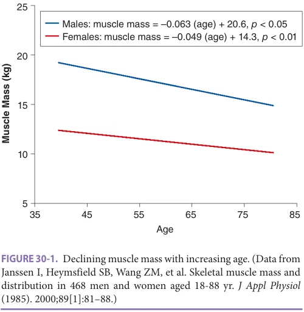

*FIGURE 30-1. Declining muscle mass with increasing age. (Data from Janssen I, Heymsfield SB, Wang ZM, et al. Skeletal muscle mass and distribution in 468 men and women aged 18-88 yr. J Appl Physiol (1985). 2000;89[1]:81–88.)*

The incidence as well as the potential causes of weight loss increase with age, particularly beyond age 75.

Regardless of whether or not weight changes, advancing age is characterized by a progressive loss in LBM, a relative increase in fat mass, and a redistribution of fat from peripheral to central locations within the body. These changes generally begin in the third decade and increase at an accelerated rate after age 65. This late acceleration may be due to loss of LBM plus the increased prevalence of chronic diseases in old age. The loss of LBM consists predominantly of skeletal muscle, particularly type II or fast twitch fibers. Central LBM, such as the liver and other splanchnic organs, is relatively preserved. As reviewed in detail in Chapter 49, muscle mass may decline by up to 45% between the third and eighth decade of life (see Figures 30-1 and 30-2). The quality of muscle may also change. With advancing age, there is a gradual infiltration or replacement of muscle by fat, as has been documented by computed tomography. Even accounting for body size, height, and other aspects of body composition, fatty infiltration into muscle is associated with symptomatic functional decline, poorer physical function, and change in strength.

The loss of muscle mass with age appears to be the result of multiple interrelated factors including age-related changes in metabolism, function, or structure of organ tissues, disease, medical therapeutics, heritability, and behavior and lifestyle choices of the individual (Chapter 49). The declines in nutrient consumption and activity level that often accompany older age are possibly modifiable contributors to the loss of muscle mass. An accelerated loss of muscle mass can occur when a serious illness requires treatment with steroids or other antianabolic drugs or is accompanied by low nutrient intake and the need for prolonged bed rest.

**[p. 409]**

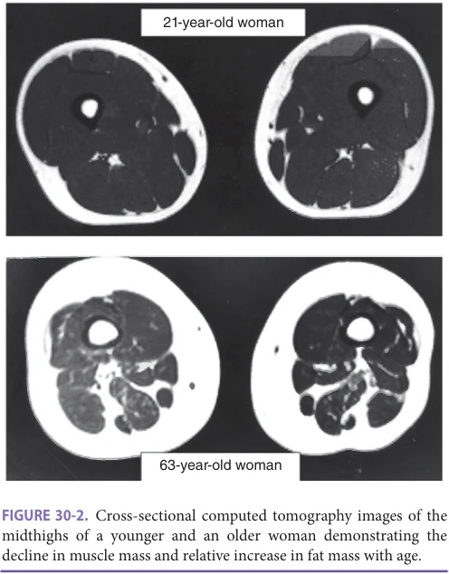

*FIGURE 30-2. Cross-sectional computed tomography images of the midthighs of a younger and an older woman demonstrating the decline in muscle mass and relative increase in fat mass with age.*

The loss of muscle mass with age is closely linked with a reduction in muscle strength and exercise capacity, which contribute to functional impairments and disability as well as to the development of CHD, diabetes mellitus, and other diseases that can contribute to further decline in a vicious cycle leading to frailty (see Chapter 42).

In parallel with the loss of LBM, there is an increase in the relative amount and the distribution of body fat with advancing age. Between the second and ninth decades of life, the percentage of body weight that is fat increases by 35% to 50% in women and to an even greater extent in men. Whether or not total body weight changes, intra-abdominal (visceral) fat increases quantitatively and proportionally more than peripheral fat mass. In females, the accumulation of intra-abdominal fat accelerates at menopause and represents primarily a shift from peripheral sites. In males, the increase in intra-abdominal fat with age represents primarily an increase in total body fat mass. For a given waist circumference, older adults have greater visceral fat than young adults, and men have greater visceral and less subcutaneous fat than women.

Changes in Appetite and Energy Intake Regulation Maintenance of a stable weight requires a steady balance between nutrient intake and energy expenditure. With advancing age, the metabolic, neural, and humoral pathways that normally maintain this delicate balance by regulating appetite and hunger begin to lose their compensatory

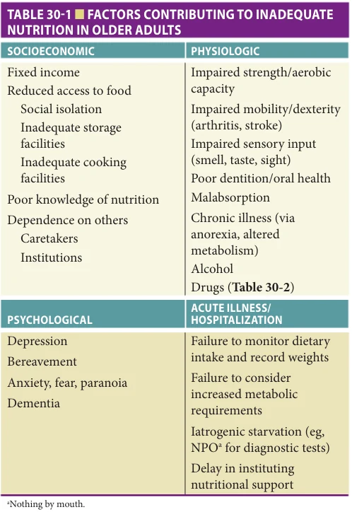

*TABLE 30-1 ■ FACTORS CONTRIBUTING TO INADEQUATE NUTRITION IN OLDER ADULTS*

responsiveness to changes in energy demands. Psychological, socioeconomic, and cultural influences and numerous disease processes further contribute to the dysregulation (Table 30-1). From the third to seventh decade of life, these factors integrate to create an imbalance usually favoring a tendency toward weight gain and increased fat deposition, at least in societies where food is plentiful and the physical demands of life are light. However, after age 70, the risk of losing weight increases steadily with each year of survival. Loss of body weight correlates with low dietary energy intake, which is common among both healthy and frail older adults. The late-life weight decline is associated with many chronic conditions that increase risk of death in old age, including Alzheimer disease.

Pathophysiologic Changes that Lead to Loss of Taste, Smell, and Appetite with Advancing Age Numerous pathologic and age-related physiologic changes can have a deleterious effect on eating habits and the likelihood of maintaining an adequate diet (see Table 30-1). This can include deterioration in sight, olfactory function, taste sensation, or ability to feel the temperature and texture of food in the mouth, all of which can contribute to a diminished appetite. Even healthy older individuals experience

**[p. 410]**

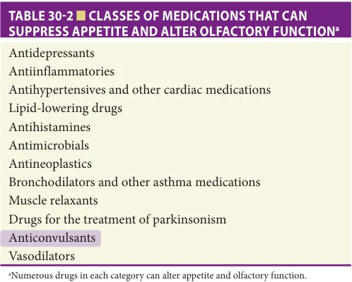

*TABLE 30-2 ■ CLASSES OF MEDICATIONS THAT CAN SUPPRESS APPETITE AND ALTER OLFACTORY FUNCTIONa*

such changes. Much greater losses in taste and smell occur in association with medication usage and other healthrelated concerns. Table 30-2 contains a representative listing of medications that can cause appetite suppression and losses of olfactory function and taste sensation. Poor oral health (Chapter 32) and many diseases that decrease mastication, salivary flow, or ability to swallow (Chapter 31) can also lead to deterioration in taste and smell to adversely affect appetite.

In addition to the special senses, there are various neural and humoral pathways within the gut that may change with advanced age and possibly contribute to the inability of many older individuals to adequately regulate food intake. There are also large numbers of hormones and other gut-derived substances that are thought to influence appetite and food metabolism, as shown in Table 30-3. It is theorized that age-related changes in some or all of these substances may adversely affect food intake in older adults.

Psychological, Socioeconomic, and Cultural Influences on Appetite After the seventh decade of life, psychological, socioeconomic, and cultural factors are increasingly important for an adequate diet (see Table 30-1). Depression is a highly prevalent, frequently unrecognized, and potentially treatable cause of a poor appetite and weight loss. Similarly, bereavement is associated with a lack of appetite. Eating alone may be associated with a lower energy intake, and the presence of family and close friends leads to greater nutrient intake. Within institutional settings, particularly nursing homes, physical environment and ambience within the dining areas are known to affect appetite and can often be improved. Elimination of therapeutic diets (eg, low salt or low cholesterol) may also be of benefit. Such restricted diets often make meals much less appetizing for the older residents and may add little to disease management. For these reasons, the American Dietetic Association in collaboration

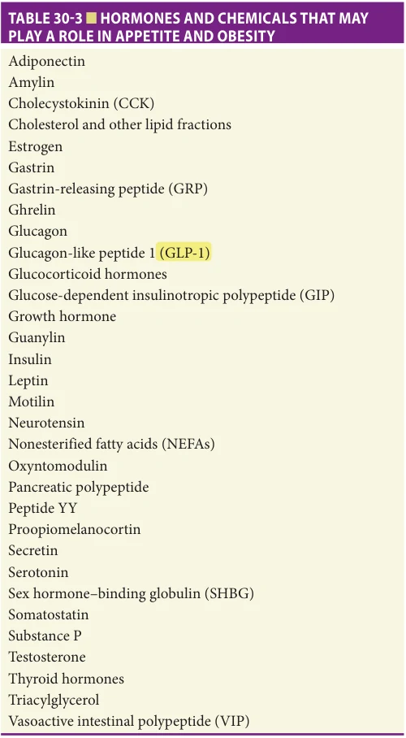

*TABLE 30-3 ■ HORMONES AND CHEMICALS THAT MAY PLAY A ROLE IN APPETITE AND OBESITY*

with the Centers for Medicare and Medicaid Services, Pioneer Network, and others published a position statement suggesting that use of therapeutic diets in nursing homes be restricted.

## OBESITY

Definition and Prevalence Obesity is defined as an unhealthy accumulation of body fat, which leads to a higher risk of medical illness and premature death. Although not ideal, body mass index (BMI) and waist circumference are the most widely utilized metrics for classifying overweight and obesity. Both are easily obtained and highly validated measures. BMI is calculated as body weight in kilograms divided by height in meters squared (kg/m2), while waist circumference is a direct

**[p. 411]**

measure obtained halfway between the iliac crest and the lower anterior ribs, with the individual standing, and at the end of expiration.

The definition of body weight categories does not currently vary by age or race. Normal weight is considered to be a BMI between 19 and 25; overweight, a BMI of 25 to less than 30; and obesity, a BMI of 30 or more. Waist circumference is used as an index of central/abdominal adiposity and is clinically useful in further categorizing an individual based on cardiometabolic risk. Traditionally, abdominal obesity is defined as a waist circumference 89 cm (35 inches) or more for women and 102 cm (40 inches) or more for men. A waist-to-hip ratio greater than 1.0 in men and 0.8 in women is another indicator of central obesity. As with BMI, there is controversy as to whether different reference ranges should be used depending on age and ethnicity. While overweight consistently increases morbidity risk in old age, the data on mortality are less consistent, suggesting that guidelines for both BMI and waist circumference should be liberalized for older individuals.

Based on National Health and Nutrition Examination Survey (NHANES) data and current definitions, obesity is highly prevalent among older adults, especially the young old (ie, individuals between the ages of 65 and 80 years). The variability in rates of obesity by race, gender, and age is shown in Figure 30-3. In all race-by-gender groups, the prevalence declines steadily with each decade of life after age 70. In part, this may be a cohort effect. Reflecting trends for the nation as a whole, prevalence rates of obesity in older adults increased significantly between 1999 and

2010, especially among men (see Figure 30-4). It was only among the oldest-old, those older than 80 years, that the prevalence remained stable during this time.

Potential Benefits and Adverse Consequences of Obesity There is controversy regarding the potential benefits and adverse consequences of being overweight or obese after age 65. Potential benefits include protection against bone fractures and a possible survival advantage, at least for select populations of older adults. The lower fracture risk is related to increased fat mass: obese older adults place more stress on their bones and convert more androstenedione to estrone than do slimmer individuals of similar age. Both of these factors contribute to increased BMD. Fat also can also serve as a cushion to protect against the impact of a fall, creating further protection against bone fractures.

Assessing the impact of weight on survival in old age is more complex. Overweight and obese older adults may have a survival advantage during periods of protracted illness, an effect thought to be the result of their greater energy and protein reserves. In general, obesity is associated with greater lean mass; during periods of catabolic stress, the fat and lean mass serve as a functional nutritional reserve.

The impact of obesity on survival in the general population of community-residing older adults usually shows a “J-shaped” relationship (Figure 30-5). There is a consistent higher mortality with a BMI less than 19. However, this does not necessarily indicate that older

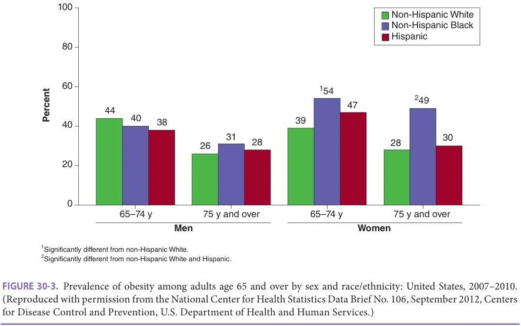

*FIGURE 30-3. Prevalence of obesity among adults age 65 and over by sex and race/ethnicity: United States, 2007–2010. (Reproduced with permission from the National Center for Health Statistics Data Brief No. 106, September 2012, Centers for Disease Control and Prevention, U.S. Department of Health and Human Services.)*

**[p. 412]**

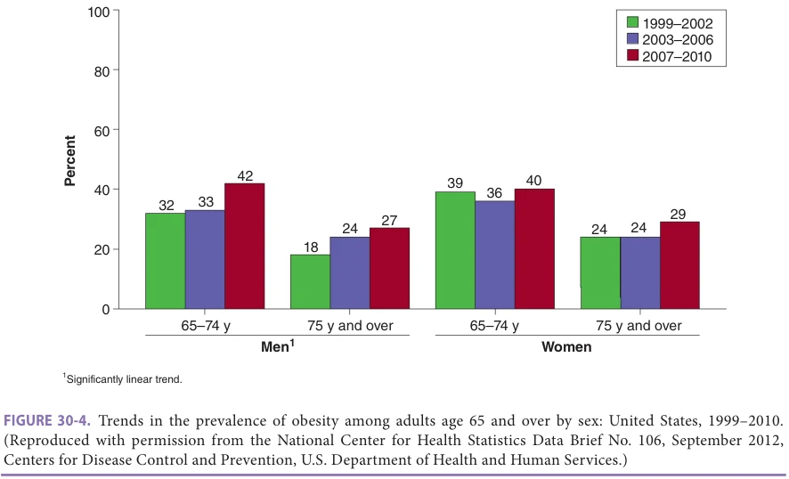

*FIGURE 30-4. Trends in the prevalence of obesity among adults age 65 and over by sex: United States, 1999–2010. (Reproduced with permission from the National Center for Health Statistics Data Brief No. 106, September 2012, Centers for Disease Control and Prevention, U.S. Department of Health and Human Services.)*

adults who have been slender all of their lives are at increased risk of mortality. Rather, the higher mortality probably reflects recently lost weight due to disease in many older adults with a low BMI. However, low protein reserves, whether the result of weight loss or a thinner body habitus, may be the critical factor that is contributing to risk of death in older adults with a low BMI.

Due to the heterogeneity of various study results, it is unclear what range of BMI is optimal for survival and at what level of obesity all-cause mortality risk begins to increase. However, when different methodologic approaches are used, which in some cases include controlling for cohort mortality and age-related survey selection bias, all-cause mortality appears to increase in direct relationship with BMI in the

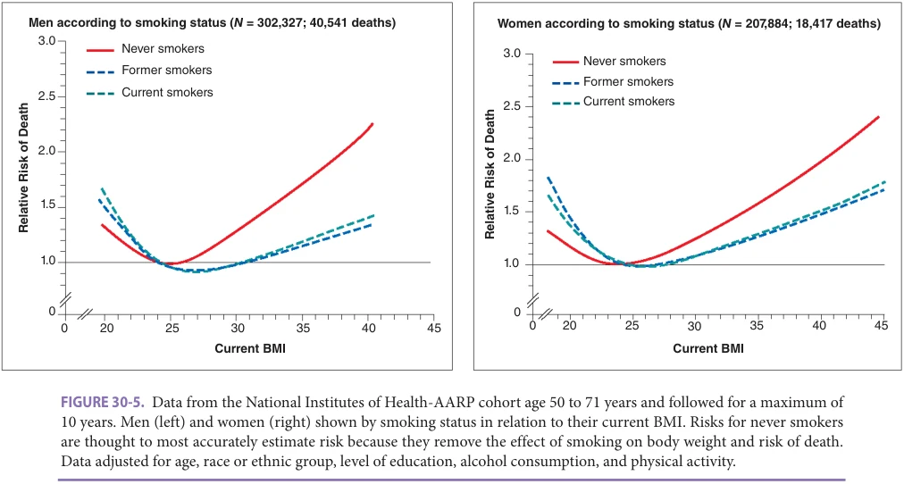

*FIGURE 30-5. Data from the National Institutes of Health-AARP cohort age 50 to 71 years and followed for a maximum of 10 years. Men (left) and women (right) shown by smoking status in relation to their current BMI. Risks for never smokers are thought to most accurately estimate risk because they remove the effect of smoking on body weight and risk of death. Data adjusted for age, race or ethnic group, level of education, alcohol consumption, and physical activity.*

**[p. 413]**

range of 25 to more than 40. Further complicating the issue, mortality risk in old age may relate to fat distribution as well as total body mass. For any given body weight, mortality risk increases with increasing waist circumference, or more specifically, increasing intra-abdominal or visceral fat mass as measured by modern imaging modalities. Although waist circumference is strongly correlated with intra-abdominal fat mass, the two metrics are not the same, and direct measures of intra-abdominal fat are more powerful indictors of cardiovascular (CV) risk. However, the mortality risk associated with obesity after controlling for intra-abdominal fat mass is also controversial. Given the many uncertainties about the impact of obesity on overall survival, it is important to consider what other effects excess weight has on the health of older adults.

Weight-Associated Morbidity The impact of obesity on overall health, functional status, and quality of life in older adults is more certain. Overweight in old age is associated with the same risks for disease as in younger populations, and it also exacerbates many age-associated diseases (Table 30-4). In addition to the detrimental metabolic effects of excess body fat, there are adverse mechanical consequences. For example, a relative excess in total body weight to muscle mass leads to osteoarthritis and other disabling conditions while increasing the work required to perform many activities of daily living. The result is a lower functional reserve, chronic

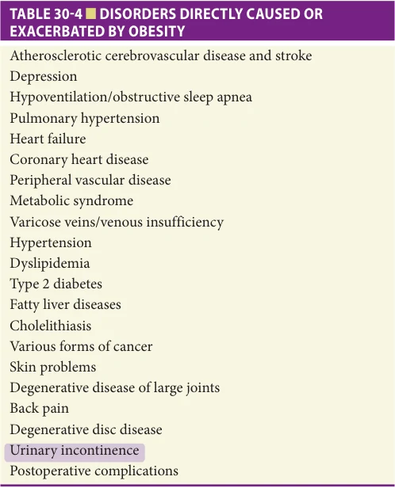

*TABLE 30-4 ■ DISORDERS DIRECTLY CAUSED OR EXACERBATED BY OBESITY*

pain, and an increased risk of disability. Some heavier individuals have relatively less muscle mass than expected on the basis of size, a situation described as sarcopenic obesity (see Chapter 49); for these individuals, the risk of disability is especially high.

Because of its contribution to many age-related diseases that lead to deterioration in central or peripheral nervous system, cardiopulmonary, or musculoskeletal function, obesity is a major risk factor for functional disability with advancing age. As a result of both these diseases and the treatments required for their control, obese older adults are far more likely to develop physical impairments or disabilities than are other older adults. Obesity also makes it more challenging to obtain the needed level of care when disabled, all of which can lead to a deterioration in quality of life.

Interventions Targeting Obesity Given the increased risk of disability associated with obesity, controlled weight loss may be an appropriate therapeutic option for selected older adults. Short-term clinical trials in older people show that appropriate interventions can lead to moderate weight loss, resulting in improvements in CV risk factors (such as hypertension, insulin resistance, and metabolic syndrome) and other clinical outcomes. However, weight loss could produce more long-term adverse than beneficial results in some older adults. In fact, there is a strong association between weight loss in older adults and an increased risk of subsequent adverse clinical outcomes such as hospitalization and death. Even when trying to control for voluntary versus involuntary weight loss, there have been conflicting findings. Furthermore, when dietary restriction is the primary mechanism for weight loss, the loss of fat is accompanied by loss of both LBM (particularly skeletal muscle mass) and BMD. Although the percentage loss from each of these tissue compartments with dieting is the same in old and young adults, the adverse consequences could be much greater in older people who have lower functional reserves and higher fracture risk. This is particularly true for older people with sarcopenic obesity, as even a small further loss of muscle mass might cause significant functional impairment.

Thus, a primary focus of any weight loss intervention in older adults should be on preserving or improving LBM and BMD. The only approach to date that has proven successful in accomplishing this dual-purpose goal is the combination of an energy-restricted, normal to high-protein diet with moderate-to-intense exercise (also see Chapter 54). In obese older adults, diet and exercise together can lead to clinically meaningful improvements in key metabolic parameters, physical performance, selfreported physical function, and quality of life; the beneficial effects are greater and the loss of both BMD and LBM less than with either intervention alone. To attain these benefits, only moderate weight loss (in the range of 10%) is required. The target of the weight loss should be improvement in the target weight-related health conditions.

**[p. 414]**

Although randomized, controlled trials provide strong evidence of benefit, little is known about how best to achieve these results with obese older adults in routine clinical settings. Efforts to increase physical activity and to decrease caloric intake are the best options for older adults, as surgical and pharmacological options are limited, usually untested in this population, and generally much riskier. Selective glucagon-like peptide (GLP)-1 receptor agonists such as semaglutide (approved for weight loss by the Food and Drug Administration [FDA] in 2021) and most recently a dual GLP-1 receptor and glucose-dependent insulinotropic peptide agonist have been used effectively to promote weight loss in overweight adults both with and without type 2 diabetes. However, the safety and effectiveness of these agents to promote weight loss while preserving LBM, bone mass, and physical function in specific subpopulations of older adults remain to be determined. In the absence of relevant long-term clinical trial data on outcomes with weight reduction, advice on weight loss should be guided by symptoms related to obesity and its associated diseases, anticipated short-term health benefits, and the general level of health status of the patient.

To be considered a candidate for a weight loss program, an obese older adult needs to have a weight-related problem that is likely amenable to weight loss plus the motivation to commit to the necessary lifestyle changes that are required to meet program goals. In order to have any lasting benefits, changes in dietary habits and level of physical activity need to be maintained long-term. Such a vigorous program would likely require the individual patient to be relatively healthy.

Components of a Weight Loss Program for Older Adults Upon committing to a weight loss program, an older adult should undergo a careful medical evaluation, which should include a detailed history and physical examination as well as a very careful assessment of the potential risks and benefits of both exercise and diet. American College of Sports Medicine guidelines (see Chapter 54) should be used to assess the risks of exercise and need for more detailed diagnostic testing such as cardiac stress tests. Successful programs generally include an assessment of the individual’s insight, motivation, and readiness to make the necessary lifestyle changes. Using motivational interviewing or other techniques, the individual’s personal goals should be illuminated, and a personalized intervention strategy devised that includes short- and long-term goals and timelines. Support from or coparticipation by family and significant others can be critical to success.

Ideally, both the dietary and exercise interventions need to be consistent with the individual’s lifestyle, abilities, interests, and personal goals. When an established program is not available to which the individual can be referred, input and support from a multidisciplinary team of professionals is crucial. Such a team may include a dietitian/

nutritionist, physical therapist, nurse, physician, social worker, or other health professionals. The diet should include at least 1.0 g/kg/day of high quality protein, adequate micronutrients, and only moderate energy restriction (eg, 1100–1300 kcal/day) with the goal of 1 to 2 pounds of weight loss or less in a week. The exercise intervention should include a combination of endurance and progressiveresistance muscle strength training and be tailored to the individual (see Chapter 54 for details).

Once an obese older adult starts an exercise/weight loss program, the quality and frequency of follow-up support become crucial. Early in the intervention, frequent follow-up is often needed, but the intervals between contacts can be gradually extended once the individual demonstrates an acceptable trajectory of success. Follow-up can be accomplished by recurring clinic visits, phone calls, or any of a variety of electronic means. These follow-up visits can be used to monitor progress (eg, checking exercise and weight logs), provide ongoing support and assistance to deal with setbacks and barriers to success, and provide guidance in advancing exercise intensity or setting new goals. The level of involvement of a nurse or other appropriately trained health professional in the follow-up assessments needs to be determined based on the medical complexity of the participant.

## NUTRIENT REQUIREMENTS TO MAINTAIN HEALTH

Energy Daily energy requirements per kilogram of body weight generally decline with age, dropping as much as 33% between the third and ninth decade of life. Male gender and chronic disease are associated with a greater rate of decline. However, a decrease in energy requirements with age occurs even among those who remain healthy, in part because of the age-related loss of muscle mass described above. Muscle is much more metabolically active than adipose tissue. As muscle mass decrease the ratio of fat to lean mass increases, leading to a greater drop in the basal or resting metabolic rate (RMR) than predicted by the decrease in total body mass. Since RMR generally accounts for 60% to 75% of TEE, the end result of the muscle loss is a significant decline in TEE, and thus energy requirements.

A second mechanism accounting for the decline in energy requirements with age is a decrease in physical activity. Energy expenditure of physical activity (EEA) generally declines with age to the same extent as RMR, accounting for about 15% to 35% of TEE in the majority of older adults. However, EEA can range from 5% in those who are bedridden to 50% in highly active, physically fit older adults. Lifestyle plays a big role in determining EEA of older people, just as it does in those who are younger. Although the increased prevalence of chronic disabling diseases accounts for some of the decline in physical activity with advancing age, even healthy older adults tend to be more sedentary than younger individuals.

**[p. 415]**

Some chronic conditions may result in an increased TEE, although this remains controversial. Examples include individuals with Alzheimer disease who constantly pace and individuals with a constant tremor. Even when an individual appears to be rather sedentary, their EEA may be greater than expected. For example, a patient with hemiparesis or amputation likely requires high levels of energy expenditure to complete basic activities of daily living due to low neuromuscular energy efficiency.

The usual decline in energy requirements with advancing age means that many older persons need to consume less food in order to maintain their weight and customary activity level. This places the older individual at risk of developing protein and micronutrient deficiencies, since requirements for other nutrients may not decrease as much as energy. Consequently, it is important that older individuals increase their activity level and change their diet to protein- and micronutrient-rich foods.

Protein Because of the paucity of high-quality nutrition studies with adequate representation from older age groups, current recommendations for protein intake do not differentiate adults over the age of 65 from those who are younger. The latest (2005) version of the Recommended Dietary Allowance (RDA) for protein, released by the Food and Nutrition Board and the National Academy of Medicine, is 0.8 g/kg body weight/day for both men and women over age 19. However, some contend that the recommended protein intake for older adults should be 1.0 to 1.25 g/kg/day. Given the variability in estimates of protein requirements in older adults, it may not be possible to resolve this controversy until better measurement techniques become available.

Factors That Influence the Protein Requirements of Older Individuals The protein requirements of an individual can change with time, being influenced by age, nonprotein content of the diet, activity level, medications, and health status. The energy content of the diet is particularly important. The protein intake required to maintain nitrogen balance increases the further total energy intake falls below 126 kJ/kg (30 kcal/kg). A negative energy balance usually precipitates a negative nitrogen balance, especially in individuals who are ill or who have a low level of activity. As a general rule, protein requirements increase with high levels of activity such as sustained high-intensity exercise. Thus, the role of a high protein diet, perhaps combined with resistance training, to prevent loss of LBM in older obese individuals during voluntary caloric restriction and increased physical activity to achieve weight loss (as described above) merits further study.

Many disease states and medications can induce a catabolic state for protein by altering the normal balance between protein synthesis and degradation. Older individuals who are both confined to bed and have an injury,

infection, or another acute inflammatory condition are at particularly high risk of developing a profoundly negative nitrogen balance that can lead to a rapid loss of LBM, particularly skeletal muscle mass. High doses of corticosteroids can have a similar effect. The amount of protein that needs to be consumed in order to minimize loss of LBM and optimize recovery from such disease states is often difficult to determine. In general, older hospitalized patients who are acutely ill or recovering from major surgery or trauma warrant a protein intake of 1.5 g/kg of body weight/day or higher (also see discussion of Malnutrition below and Table 30-9) unless they have a condition that necessitates protein restriction such as renal or hepatic insufficiency. Whether one source of protein is better than another in meeting the nutrient needs of older adults is controversial. Although it is generally recognized that all older adults should consume a diet that provides adequate quantities of all essential amino acids, there is otherwise little consensus as to the importance of the dietary protein source.

Fat and Cholesterol Fat serves as a key source of energy and essential fatty acids as well as a vehicle for transporting fat-soluble vitamins. Even when obesity and elevated cholesterol or triglycerides are a concern, fat intake should not fall below 10% of total energy requirements in order to allow for adequate absorption of fat soluble vitamins (A, D, E, K), and to ensure that the requirements for the essential fatty acids are met. There are two main types of essential fatty acids, the omega-6 series, derived from linoleic acid (eg, arachidonic acid and gamma-linoleic acid), and the omega-3 series, which could be derived from alpha-linolenic acid (from plant sources) or contained in krill oils or certain cold water fish (eg, eicosapentaenoic acid [EPA] and docosahexaenoic acid [DHA]); the omega-3 fatty acids obtained from fish are synthesized by microalgae, which the fish consume. The essential fatty acids are required for the synthesis of cell membrane phospholipids and eicosanoids, which include prostaglandins, leukotrienes, and hydroxy acids. Cell membrane phospholipids influence the biomechanical properties of the membranes and their membrane-bound receptors. The eicosanoids, derived predominantly from arachidonic acid and EPA, serve many functions including modulation of inflammation and host defenses. The eicosanoids made from omega-6s are generally more potent mediators of inflammation, vasoconstriction, and platelet aggregation.

Clinical deficiency of the essential fatty acids is rarely seen in adults since western diets generally include adequate amounts of these nutrients, and adipose tissue provides an additional reserve of 0.5 to 1 kg. When a deficiency does develop, it is usually a result of profound cachexia or extensive small bowel disease or necrosis and the inadequate provision of nutrition support. This is particularly true of the omega-6 fatty acids, which are abundant in many of the foods common to the average American diet including most vegetable oils, nuts, cereals, seeds, and legumes.

**[p. 416]**

In contrast, the average American diet may provide suboptimal amounts of omega-3 fatty acids. Although current recommendations call for the omega-3 derivatives of alphalinolenic acid to be at least 0.2 % of total food energy, many nutritionists suggest higher intakes due to their purported beneficial effects on metabolism. Oils from a variety of cold water fish species including halibut, mackerel, herring, and salmon are potentially high in the omega-3 fatty acids. Currently, nutritional labeling does not indicate the amount of omega-3 fatty acids that is contained in fresh fish; farmraised fish may have more or less omega-3 fatty acids than wild caught fish, depending on the food they are fed. Many omega-3 fatty acid supplements are available commercially, but these provide varying amounts of marine-based EPA and DHA. There is inadequate evidence that these supplements provide the same benefits as consuming fish. Alphalinolenic acid, a precursor of EPA, is found primarily in plant products such as soybeans, canola oil, flaxseed oil, and walnut oil. However, humans may be able to convert as little as 10% of alpha-linolenic acid to EPA.

The optimal fat intake for older adults needs to be determined on an individual basis. For example, reduced fat intake may be considered for a patient with CHD. However, the importance of dietary fat as a contributor to CHD risk after the age of 65 remains controversial. It is not known whether fat- and cholesterol-restricted diets have any beneficial effects in reducing CHD mortality in this age group. In fact, such diets may have detrimental consequences, especially in those who are having problems maintaining their weight. Therefore, it seems prudent to limit fat intake only in older individuals with CHD who otherwise would not be adversely affected by such dietary restrictions.

Increasing the ratio of monounsaturated and polyunsaturated fat to saturated fat, without changing total fat intake, may be beneficial in some situations. For this reason, some experts support the use of the Mediterraneanstyle diet, which promotes the use of olive oil, tree nuts, peanuts, fatty fish and other seafood, and white meat, and discourages intake of red and processed meats. Concern has also been raised about the use of partially hydrogenated fats rich in trans fatty acids, as these products may have an adverse effect on lipid metabolism. Although more study is needed, it is probably prudent to emphasize the use of natural fats derived from vegetable oils (predominantly monounsaturated), nuts, and fish while reducing those from animal products and avoiding foods containing trans fatty acids. However, this approach may not be applicable to frail older individuals, especially those who are losing weight involuntarily, have a BMI less than 20, or have diseases limiting their nutrient intake. Since fats have twice the energy content per gram as carbohydrates and protein, a diet high in fat may be necessary for such frail older individuals in order to meet their maintenance energy requirements or to replete deficits. Thus, restricting the types of foods these individuals consume may have detrimental consequences.

Carbohydrates Recommendations for carbohydrate content of the diet are generally based on two considerations, the source of the carbohydrates and the energy requirements of the individual. Ideally, food sources should be rich in fiber (see section on fiber content of diet below) and provide primarily complex carbohydrates rather than simple sugars. The amount of carbohydrates that should be included in the diet is usually determined by default. The energy, protein, and fat requirements of the individual are determined first. Carbohydrate requirements are then determined by subtracting the amount of energy supplied by protein and fat from the total energy requirements. Since protein requirements represent approximately 15% of the total energy content of the diet and fat ideally should be less than 30%, carbohydrates usually represent 55% to 70% of the total. When carbohydrates are totally excluded from the diet, energy requirements of the body are partially met by the incomplete oxidation of fatty acids, which leads to ketosis and may cause lethargy and depression. Ketosis can also contribute to anorexia, which is part of the appeal of high-fat, low-carbohydrate weight loss diets. To prevent ketosis, at least 50 to 100 g of carbohydrates should be consumed each day. Water Although fluid requirements do not change appreciably with age in adults, people over the age of 65 have a reduced ability to regulate their fluid intake and to limit urinary water losses. Thus, they are much more likely than young adults to become dehydrated (and hypernatremic) when their health status or environment changes. Regulation of water and sodium balance in older people, and recognition and management of dehydration/hypernatremia are reviewed in Chapter 39. Chronic disease and injuries that cause a deterioration of cognitive or physical function increase the risk of dehydration further by altering the perception of thirst, reducing the ability to express the desire for water, or diminishing the capability to access and drink adequate amounts of fluids. When an acute febrile illness occurs in an older individual who is already physically or cognitively impaired, life-threatening dehydration can develop rapidly. This scenario occurs with alarming frequency in nursing homes. The failure of many health care providers, family members, and personal aid assistants to recognize the risk factors and early warning signs of dehydration contributes to the danger that a frail older individual will become severely dehydrated. Many older adults themselves do not recognize their risks and may inappropriately restrict their fluid intake, sometimes as a method of controlling incontinence.

Care must be taken to prevent dehydration by recognizing those at highest risk, especially older individuals with cognitive and physical deficits, swallowing problems, ongoing weight loss, diarrhea, fever, or poorly controlled diabetes, or receiving enteral feeding, diuretics, or laxatives. The minimum daily intake for inactive adults in

**[p. 417]**

moderate climates is estimated to be between 1 and 3 L/ day; a reasonable target is roughly 30 mL/kg/day for most healthy older adults. Requirements increase with fever, activity, or prolonged exposure to an elevated environmental temperature (also see Chapter 39). Patients, family, and all health care staff, especially in nursing homes, need to be trained to recognize the importance of maintaining an adequate fluid intake at all times, and to carefully monitor intake if there is a change in mental status, activity level, or health status, or if fluid requirements increase, as may occur during heat waves.

Fiber Dietary fiber is derived from structural components of plant cell walls and consists of plant polysaccharides and lignin, which are resistant to digestion by intestinal enzymes. Many professional health organizations recommend a diet containing 20 to 35 grams of fiber a day or 10 to 13 grams dietary fiber per 1000 kcal consumed. Although dietary fiber may be associated with health benefits including a decreased rate of certain forms of cancer, diabetes, heart disease, and obesity, the average American diet is very low in fiber with consumption usually in the range of only 10 to 15 grams daily.

There are two general categories of dietary fiber: water-insoluble fibers, such as cellulose, hemicellulose, and lignin; and water-soluble fibers, such as gum and pectin. Each category of fiber has a somewhat different spectrum of beneficial effects. Both types lower the energy density of the diet. The added bulk also has a short-term satiety effect that helps control appetite and prevent overconsumption. Water-insoluble fiber has the further effect of holding water within the intestinal contents, which results in an increased fecal bulk, a decreased gut transit time, and a lower intraluminal pressure within the colon. These properties of water-insoluble fiber make it an important dietary component since it reduces constipation and may help prevent the formation of colonic diverticula. Sources of insoluble fiber include fruits, vegetables, dried beans, wheat bran, seeds, popcorn, brown rice, and whole grain products such as breads, cereals, and pasta. About two-thirds to three-fourths of the dietary fiber in typical mixed-food diets is water-insoluble. There are many excellent web sites that provide tables listing the soluble and insoluble fiber content of foods (eg, https://www.helpguide.org/articles/healthy-eating/highfiber-foods.htm; https://www.medicalnewstoday.com/articles/ 146935#recommended-intake; https://www.northottawawell nessfoundation.org/wp-content/uploads/2017/11/NOWFFiber-Content-of-Foods.pdf).

Water-soluble fiber increases the viscosity of intestinal contents, prolongs gut transit time, and decreases the rate of small intestinal absorption of carbohydrates and bile acids. These effects may have important physiologic implications that can be used to advantage clinically. By slowing the rate of carbohydrate absorption, a very high soluble-fiber diet can be effective in reducing the postprandial surge in the serum glucose, which may be beneficial

in the treatment and prevention of diabetes. Through its effects on bile acid absorption, soluble fibers can lower total cholesterol and low-density lipoprotein (LDL) cholesterol by 3% to 10%. There is an inverse association between the total dietary fiber intake and the rate of fatal and nonfatal myocardial infarctions; several meta-analyses demonstrate that higher intake is also associated with decreased all-cause mortality. Most of these effects of soluble fibers were demonstrated using fiber concentrates. Comparable amounts of fiber can be obtained from food sources, such as apples, oranges, pears, peaches, grapes, vegetables, seeds, oat and rice bran, dried beans, oatmeal, barley, and rye. Diets that are high in fiber from food sources also provide essential micronutrients and nonnutritive compounds such as xenobiotics, antioxidants, and phytoestrogens that may have important health-promoting consequences.

As a general rule, a diet rich in fresh fruits, vegetables, legumes, and whole grain products is recommended. As portrayed in the USDA Choosemyplate.gov, this should include two cups of fruit, 2 1/2 cups of vegetables, and 6 ounces of grains each day (Figure 30-6). Since most fruits and vegetables contain less than 2 grams/serving total fiber and most refined grain products contain less than 1 gram/ serving, legumes, whole grains, and cereal brans should be substituted for other foods whenever possible in order to increase the amount of both kinds of fiber. Supplementing the diet with any of the commercially available concentrated fiber sources may be necessary, especially in frail older people. Concentrated sources of dietary fiber may also be helpful in the treatment of chronic constipation when a limited variety of food is available or the amount of food consumed

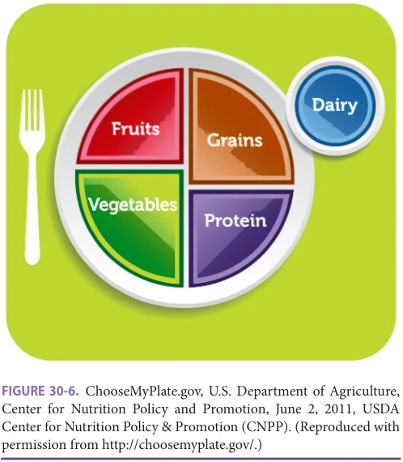

*FIGURE 30-6. ChooseMyPlate.gov, U.S. Department of Agriculture, Center for Nutrition Policy and Promotion, June 2, 2011, USDA Center for Nutrition Policy & Promotion (CNPP). (Reproduced with permission from http://choosemyplate.gov/.)*

**[p. 418]**

is inadequate. A large increase in fiber over a short period of time may result in bloating, diarrhea, gas, and general discomfort. It is important to add fiber gradually over a period of several weeks to avoid abdominal problems. Fiber supplements should always be taken with adequate fluid in order to avoid worsening constipation.

## VITAMINS AND MINERALS

Recommended Intakes The Food and Nutrition Board of the US National Research Council developed the dietary reference intakes (DRIs), which updated the earlier RDAs for vitamins and minerals. The DRIs include separate intake recommendations for adults from age 51 through 70, and for adults older than 70 years. There are not enough scientific data to calculate requirements for all micronutrients, and any person with a medical disorder may need more or less than the DRI for some nutrients. Table 30-5 lists the recommended intakes for various vitamins, as well as the recommended tolerable upper limits (ULs) intake. Intakes of micronutrients that are lower than the UL usually pose little risk for toxic side effects in healthy people. The UL allows patients and health care workers to understand possible risks if large amounts of vitamins and minerals are consumed. Understanding and consuming the DRI for vitamins and minerals reduces the risk for classic deficiency disorders (eg, scurvy, pellagra, beriberi, etc), but the ideal intake of vitamins and minerals needed for optimum health, which may be higher than the DRIs or ULs, remains controversial. Changes to the DRIs are often contentious, and they can have major medicolegal and financial implications for fortified foods and the supplement/ health food industry.

Vitamin and Mineral Supplementation Many older adults, including those who are healthy and living independently as well as those who are frail, ill, or institutionalized, are at risk for micronutrient deficiencies. Several population-based nutritional surveys demonstrate that community-dwelling older adults commonly consume as little as 50% of the DRIs for many vitamins. These findings reflect the fact that even healthy adults do not consistently consume recommended amounts of fortified dairy products, fruits, and vegetables. Risk factors for poor intake, adverse drug-nutrient interactions, and nutrition-related diseases all increase as a function of age, and clinical (and subclinical) deficiencies of vitamins and minerals become more likely, particularly once frailty and the need for institutionalization occurs. The micronutrients most commonly deficient include vitamins C, D, E, B12, thiamine (B1), and folic acid, and the minerals calcium, magnesium, and zinc. Because of this, many nutritionists recommend that older adults add a daily, iron-free, general vitamin and mineral supplement supplying the DRI for

most micronutrients, although evidence in support of benefit from this recommendation is lacking. Studies of multivitamin supplementation in noninstitutionalized people have found no benefit in reducing CV or cancer risk. It also remains unclear as to whether intakes of individual micronutrients above the DRI in selected populations are beneficial. High intakes of some micronutrients (such as vitamins A, D, and pyridoxine) are well known to cause toxicity, which may be so subtle and nonspecific that the harmful effects may not be easily diagnosed. High supplemental intakes of other vitamins or provitamins (such as vitamin E and β-carotene) that had been thought to be risk-free have now been associated with adverse health consequences. Thus, older adults should be counseled not to exceed the tolerable ULs (see Table 30-5) for vitamin intake and to

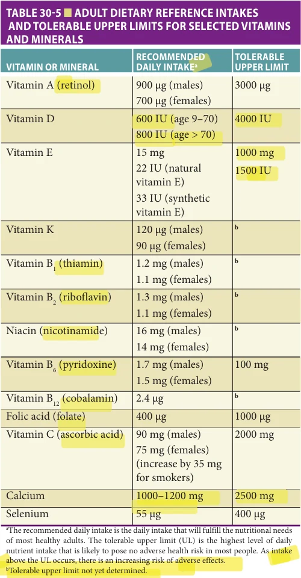

*TABLE 30-5 ■ ADULT DIETARY REFERENCE INTAKES AND TOLERABLE UPPER LIMITS FOR SELECTED VITAMINS AND MINERALS*

**[p. 419]**

disclose all vitamin and mineral supplement use whenever medications are reviewed by health professionals. Vitamin and mineral supplementation should not substitute for an overall program of healthy nutrition (eg, high fruit, vegetable, and whole grain intake and reduced simple sugar and saturated and trans-fat intake).

Vitamin B12 (Cobalamin) Low serum vitamin B12 levels become more common with aging, and about 10% to 15% of older adults have vitamin B12 deficiency. Pernicious anemia, an autoimmune disorder causing decreased gastric intrinsic factor production, is a rare cause of deficiency in an older adult. Cobalamin deficiency in older adults is more commonly due to malabsorption of cobalamin in foods; usually due to atrophic gastritis and hypochlorhydria (Table 30-6 lists multiple other causes). Supplemental B12 in crystalline form is not affected by atrophic gastritis and continues to be well absorbed. Stomach acid helps remove the vitamin from food and make it bioavailable. Disorders that interfere with enterohepatic absorption (such as ileal disease or surgery) will lead to deficiency more rapidly than low intake because the high efficiency of enterohepatic vitamin B12 reabsorption will be impaired, and the vitamin lost in the stool.

Vitamin B12 deficiency can present clinically with two relatively independent disorders. There is a hematologic disorder that causes macrocytosis and anemia. And there is a neurologic disorder that can cause a peripheral neuropathy, including paresthesias and numbness; spinal column lesions, including loss of vibration and position sense, sensory ataxia, limb weakness, orthostatic hypotension, and plantar extensor responses; and neuropsychiatric symptoms. These signs and symptoms of vitamin B12 deficiency are nonspecific and common in many older adults

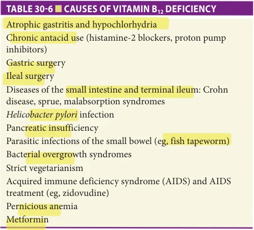

*TABLE 30-6 ■ CAUSES OF VITAMIN B12 DEFICIENCY*

with comorbid disorders. When there are several possible causes for the neurologic signs and symptoms, vitamin B12 supplementation is usually accompanied by disappointing, small measurable neurologic or behavioral improvement. The older the patient is and the more profound the signs and symptoms are, the less likely is the recovery. However, some patients may respond, especially if deficiency is relatively recent. Since patients with more severe hematologic signs often have less neurologic impairment, and vice versa, it is important to consider vitamin B12 deficiency even if the patient lacks macrocytosis and anemia. Thus, screening older adults for vitamin B12 deficiency should be considered, and supplementation of all deficient patients is recommended.

Many patients with “low normal” vitamin B12 serum levels (< 350 pg/mL) have measurable biochemical abnormalities, including elevated methylmalonic acid (MMA) (> 270 nmol/L) levels, which improve with supplementation. Although these patients often appear to be asymptomatic, it is probable that borderline serum vitamin B12 levels represent an early preclinical deficiency state. If this is the case, current laboratory norms for vitamin B12 are too low, since they may not identify patients with early deficiency. Secondary tests for low B12 status are also nonspecific and rarely useful; for example, MMA may also be elevated with renal failure, and homocysteine levels are also affected by folate and vitamin B6 status.

An approach to screening for vitamin B12 deficiency and treatment guidelines are presented in Table 30-7. Intramuscular or oral replacement is most common; alternative formulations (such as nasal gels) are more costly and have not been rigorously tested. There is no scientific basis for prescribing vitamin B12 supplementation as a general tonic, and it is not recommended. Oversupplementation of vitamin B12 is not recommended and may be associated with increased mortality.

Folate (Folic Acid) Folate deficiency is associated with general malnutrition (particularly that accompanying alcohol abuse) or with specific folate antagonists, such as methotrexate, phenytoin, sulfasalazine, primidone, phenobarbital, and triamterene. Like vitamin B12 deficiency, it can present as a megaloblastic macrocytic anemia. Although measures of both vitamin B12 and folate status are often included in the evaluation of macrocytosis, low folate is a rare cause of this disorder. Folate supplementation alone may improve the macrocytosis and anemia in vitamin B12 deficiency, without correcting the ongoing neurologic disorder of vitamin B12 deficiency, and may even cause a more rapid neurologic/ cognitive deterioration. However, in B12-deficient patients with restored normal B12 status, high folate intake is associated with protection from cognitive impairment. There are very rare case reports of neuropathy associated with folate deficiency. Slowed mental processing, including

**[p. 420]**

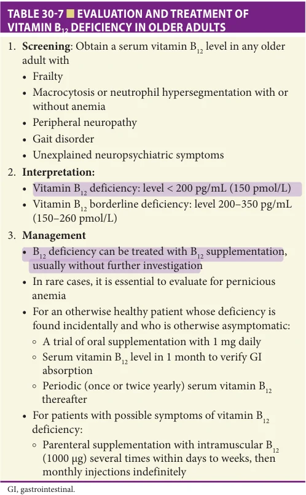

*TABLE 30-7 ■ EVALUATION AND TREATMENT OF VITAMIN B12 DEFICIENCY IN OLDER ADULTS*

poorer performance on mental status testing, and depressive symptoms (particularly impaired motivation and social withdrawal) have been described in patients with folic acid deficiency. It is uncertain if folate deficiency has an association with major depression, and whether genotype testing for mutations in the MTHFR (5,10-methylenetetrahydrofolate reductase) gene or supplementation with the more expensive L-methylfolate (which crosses the blood–brain barrier more easily) improves response to treatment-resistant depression. Fortification of grains with folic acid began in the United States in 1998 (to reduce the incidence of neural tube defects in developing fetuses). Consumption of a diet rich in fruits and vegetables, along with fortified grains, continues to be recommended as the best source for folic acid, but folate in supplements is more bioavailable.

Folate status may be assessed by measuring serum folate if dietary intake (diet or vitamin supplementation) has not been recently changed or with erythrocyte (red blood cell [RBC]) folate levels if there has been a recent change in diet (as after hospital admission). Homocysteine levels can be elevated in folic acid deficiency, but may also

be increased with renal insufficiency, and with vitamin B12 or B6 deficiency.

Vitamin D Vitamin D plays a critical role in maintenance of normal bone health (see Chapter 51). The complex physiology of vitamin D, its relationship to calcium and bone metabolism, nutritional and other causes of vitamin D deficiency, and the clinical features and treatment of vitamin D deficiency are all covered in Chapter 97, so are not addressed here. While vitamin D has been postulated to have multiple physiologic functions beyond those related to bone and calcium metabolism, these effects are controversial.

Routine screening of healthy older adults with 25(OH) D levels is controversial and expensive. The Choosing Wisely initiative does not recommend routine vitamin D screening, and the US Preventive Services Task Force (USPSTF, 2021) reports that there are no studies directly evaluating benefits or harms of screening. Vitamin D supplementation does not prevent or improve nonskeletal conditions, including mood disorders, cognitive decline, diabetes mellitus, adiposity, fatigue, osteoarthritis, chronic pain, cardiovascular disease (CVD) (including atrial fibrillation), strength, or colorectal adenomas. There is weak evidence that supplementation may prevent viral illnesses and asthma exacerbations. High-dose vitamin D does not benefit BMD, muscle function, muscle mass, or falls, and may increase harms (falls, death, and hospitalization). Based on multiple studies, the USPSTF (2018) recommends against D supplementation to prevent falls in community-dwelling older adults. It also found Insufficient Evidence to recommend vitamin D and calcium supplementation to prevent fractures in community-dwelling postmenopausal women and asymptomatic men without osteoporosis or vitamin D deficiency.

Calcium From adolescence onwards, both men and women should consume between 1000 and 1200 mg of elemental calcium daily, unless there are unique nutrition requirements. Many older adults consume far less than this amount. In addition, calcium absorption declines with age and varies depending on dietary source. The UL for calcium intake is 2000 mg/day for people over age 50. The important role of calcium intake in management of osteoporosis is covered in Chapter 51.

A cup of milk or yogurt contains about 300 mg of calcium. Green vegetables contain some calcium, but they also contain other phytochemicals that interfere with calcium absorption. Therefore, calcium bioavailability from vegetables may be limited. Because of dietary limitations or other factors, many older adults are unable to consistently obtain the recommended intake of calcium from natural sources and may need to take calcium supplements. Some brands of orange juice and candy now contain added calcium, which can add to dietary sources of this element. Calcium is also

**[p. 421]**

available in pill form. Calcium carbonate is least expensive but should be consumed with food (although highfiber foods may reduce absorption somewhat). Some other formulations, such as calcium citrate, are better absorbed but may cost more, or have less calcium per pill. Calcium supplements can increase constipation in some individuals. Persons who develop calcium oxalate kidney stones should not drastically limit their calcium intake from foods, as dietary calcium can bind with and reduce food oxalate absorption and decrease risk of stone formation. Observational studies have identified a possible association between calcium supplementation and increased risk for CVD. Until this issue is clarified, emphasis should be placed on maximizing calcium intake from food sources.

## SPECIFIC DIETARY CONSIDERATIONS FOR OPTIMAL HEALTH

Vitamins and Cognition Although numerous vitamins have been linked to cognitive decline with advancing age and to the pathogenesis of Alzheimer disease, most of this evidence is from observational studies. For example, there are associations between dietary intake of foods high in carotenoids and a diminished risk of cognitive impairment. These findings highlight the potential importance of maintaining a well-balanced diet, but do not provide evidence of cognitive benefit of using supplements containing any vitamin.

Nutrition, Cardiovascular Disease, and Cancer There is a growing body of evidence that nutrition plays an important role in CVD prevention. Diets that are lower in saturated fat, contain poly- and monounsaturated fatty acids, and include an abundance of fruits and vegetables are associated with a reduced risk of CVD events. A number of dietary regimens fall into this category including the Mediterranean-style diet (described in the Fat and Cholesterol section), which reduced major CVD events in persons at high risk.

Antioxidants have also been promoted as protective for CVD and cancer. The rate of cardiac death may be lower in people who consume a diet rich in the antioxidant vitamins and minerals, particularly vitamins E and C, and carotenoids. These findings are difficult to interpret as diets rich in antioxidants are also higher in fiber and lower in cholesterol and saturated fat; and people who consume large amounts of fruits and vegetables, or who take vitamin supplements, often have healthier lifestyles. Meta-analyses of randomized clinical trials for primary prevention of CVD have not confirmed a beneficial effect of any vitamin, antioxidant, or fish oil supplement. In fact, increased morbidity or mortality was found with the use of supplemental β-carotene, vitamin E, and selenium; high supplemental vitamin E may increase risk for hemorrhagic stroke and all-cause mortality. High-dose omega-3 fatty acid supplementation, including mixed EPA-DHA, carboxylic acid formulations, and

icosapent ethyl (IPE) formulations, have produced mixed but generally negative results on improving CVD, bone health, falls risk, nonvertebral fractures, and infection rates, and are not yet recommended. However, possible benefit for certain subgroups continues to be investigated.

There is currently no convincing evidence that any vitamin, mineral, or antioxidant supplementation prevents cancer. It is very likely that people with cancer or other serious illnesses will try alternative therapies, including megavitamin and mineral supplements, and herbal or folk remedies. Although it is generally thought that the toxicity of antioxidant vitamins and most B vitamins is low for intakes below the UL, there is increasing evidence of potential harms. Some of this evidence has come from intervention trials which have reported an increased incidence of lung cancer in high-risk patients treated with β-carotene supplements, an association between selenium supplementation and skin cancer, and an increased incidence of prostate cancer in men who took vitamin E. These risks should be discussed proactively with patients so that they can have the best information available to make their decisions and toxic side effects can be prevented. Tolerable ULs should not be exceeded.

Nutrition and Age-Related Eye Diseases Evidence to support a protective effect of individual vitamin and mineral supplements on age-related eye diseases is conflicting. The Age-Related Eye Disease Study (AREDS) found a slight reduction in progression (not prevention) of age-related macular degeneration (AMD) using a combination of higher-dose vitamins C and E, β-carotene, zinc, and cupric oxide. In the AREDS2 study, the addition of omega-3 fatty acids (DHA and EPA) and/or lutein and zeaxanthin (macular xanthophylls) and removal of β-carotene did not decrease AMD progression. The AREDS2 supplementation also did not reduce CVD risk in the older adult participants. Observational studies have identified an association between dietary antioxidant content and a lower risk of age-related cataracts. However, there is also no evidence that regular high doses of antioxidant vitamin and mineral supplements are effective in preventing cataracts.

## ASSESSMENT OF NUTRITIONAL STATUS

Initial Screening Assessment The risk of developing one or more nutritional disorders increases with age. Prevention and early intervention are the best approaches to keeping older individuals optimally nourished because many forms of malnutrition, particularly protein and energy undernutrition, are very difficult to reverse. Providers should routinely screen their older patients to determine if they have or are at risk of developing nutritional problems, at least annually and whenever there is a change in the patient’s health. Like other screening instruments, the nutritional screen should use simple criteria, be relatively easy to complete, have relatively low

**[p. 422]**

attendant costs, and provide a valid assessment of nutritional risk with a reasonable degree of sensitivity and specificity. Examples of screening instruments include the Malnutrition Screening Tool (MST), Malnutrition Universal Screening Tool (MUST), and the Mini-Nutrition Assessment (MNA). Individuals identified by the screen to be at risk of having or developing nutritional disorders should be scheduled for a more in-depth assessment.

For the initial screening assessment, older individuals who have experienced a recent deterioration in their socioeconomic or health status should be considered at high risk. Since many older individuals facing financial hardship do not volunteer this information, it is important to assess whether financial resources are inadequate to meet living expenses, including the purchase and preparation of an appropriate variety and quantity of foods. Food insecurity is an important issue for some older adults (see Chapter 21). When the older person is dependent on others for meal preparation or feeding assistance, caregiver neglect and other forms of abuse can pose serious threats and often require careful vigilance to identify. The nutritional screen should also assess psychological stressors, particularly the loss of a spouse or other family members. Older individuals should always be evaluated for depression. Alcohol and drug abuse are serious but frequently unrecognized problems that can cause a variety of nutritional disorders; screening tools include the CAGE Alcohol Questionnaire and Alcohol Use Disorders Identification Test (AUDIT).

The list of medications that can adversely affect nutrient intake is very long (see Table 30-2). Any drug that is being taken, including over the counter (OTC), herbals, and folk medications, should be considered suspect when anorexia or weight loss occur. Many drugs produce subtle side effects that older individuals may tolerate when feeling well. However, these same side effects, which may include alterations in appetite, taste sensation or salivary secretion, nausea, constipation, diarrhea, or a depressed sensorium, can contribute to the development of anorexia during periods of ill health. Swallowing problems can also adversely affect nutrient intake (see Chapter 31). Besides choking or coughing while eating or drinking liquids, the signs and symptoms may be far more subtle and can include only food avoidance. Older patients who are hospitalized are at very high risk of developing nutritional deficits prior to discharge. Prolonged bed rest, acute inflammation, and inadequate nutrient intake, which are common during hospitalization, rapidly lead to the depletion of both lean and total body mass, placing the older patient at high risk for subsequent mortality. For this reason, any acute hospitalization should be recognized as a nutritional risk factor.

A careful weight history, possibly the most important component of the nutrition screen, should be obtained from all older patients. Since patients often provide inaccurate accounts of their weight history, prior weights from the medical record may be useful. A weight loss of 5% or more within the prior 3 months or 10% or more within the

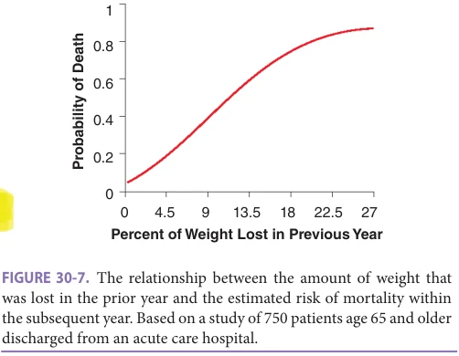

*FIGURE 30-7. The relationship between the amount of weight that was lost in the prior year and the estimated risk of mortality within the subsequent year. Based on a study of 750 patients age 65 and older discharged from an acute care hospital.*

prior 6 months to 3 years should be considered indicative of a potentially serious nutritional problem unless the weight fluctuation can be ascribed with certainty to alterations in fluid balance, such as those with heart failure or on hemodialysis. There is a clear and direct correlation between the amount of weight that is lost and increased risk of subsequent mortality (Figure 30-7), even if older individuals state that they voluntarily lost the weight. Voluntary weight loss in frail older adults has the same adverse implications as involuntary weight loss, likely because few older individuals successfully lose weight volitionally and keep it off while healthy. Thus, “voluntary” weight loss is the result of underlying pathology in many older individuals.

As part of the general physical examination, a weight and height should be obtained. If significant kyphosis or scoliosis is present, the patient’s estimate of peak adult height can be utilized for current height. From the weight and height measurements, the patient’s BMI and weight as a percentage of usual weight can be calculated. Since poor oral health may contribute to the development of nutritional problems, a careful oral examination is indicated.

## Comprehensive Nutritional Assessment

Anthropometrics Neither BMI nor the skinfold measurements are good measures of total body fat mass if there is significant intra-abdominal fat accumulation, as often occurs with advanced age. Waist circumference and the waist-to-hip ratio are reasonably useful indicators of abdominal fatness, as defined earlier.

Laboratory assessment

Albumin A random serum albumin, interpreted without regard to clinical context, has low sensitivity and specificity and only limited clinical utility as a nutritional indicator. While albumin synthesis decreases by 30% to 50% after only 24 to 48 hours of protein and energy deprivation, there may be little change in the serum albumin concentration even after a much more prolonged period of fasting in an otherwise healthy individual. During periods of inadequate nutrient intake, a decreased rate of albumin degradation

**[p. 423]**

and mobilization of albumin from the extravascular space may contribute to the maintenance of a normal serum albumin concentration. For these reasons, albumin is not a very sensitive screening test for early stages of nutritional deterioration. Conversely, a low albumin concentration has low specificity as an indicator of protein-energy undernutrition. Acute and even chronic subclinical inflammation and other disease conditions are usually the primary contributors to the development and maintenance of a low serum albumin. Although in healthy individuals serum albumin has a halflife of approximately 20 days, during periods of acute physiologic stress (such as major surgery or sepsis), the serum concentration can decline by up to 30 g/L within a few days. This effect on the albumin concentration is probably mediated by cytokines that are believed to increase vascular permeability to albumin. The concentration of albumin is normally much greater within the intravascular compared to the extravascular space (35–50 g/L compared to ~ 10 g/L). With inflammation-induced changes in vascular permeability, there is a rapid loss of the normal concentration gradient between the intra- and extravascular space and an apparent sequestration of albumin in extravascular sites. These same cytokines also suppress albumin synthesis and may trigger an increased rate of albumin degradation with a resultant drop in the serum concentration to 25 g/L or less. Prolonged hypoalbuminemia can also develop in association with advanced liver disease (cirrhosis), severe congestive heart failure, nephrotic syndrome, and protein-losing enteropathies. When these conditions are not present, a persistently low serum albumin probably represents ongoing inflammation and is associated with a high risk of adverse outcomes, including death. The independent effect of nutritional deprivation on low albumin is unclear. Since it is not currently possible to differentiate the effects of inflammation from those of nutritional deprivation, a low albumin indicates only that the patient is at risk for being undernourished, and for increased morbidity and mortality. Serum albumin does not increase rapidly with refeeding and should not be utilized as an indicator of the adequacy of nutritional support.

Prealbumin Although it has limited specificity as a nutritional indicator, serum prealbumin may respond to changes in nutrient intake if there is no persistent inflammation or other active disease processes that are keeping the serum levels suppressed. Despite its name, prealbumin is not a precursor to albumin. Its more descriptive name is transthyretin because it transports both thyroxine and retinol (vitamin A). In health, prealbumin has a half-life of 2 to 3 days and a much smaller volume of distribution compared to albumin. Like albumin, prealbumin is a negative acute-phase reactant. In response to systemic inflammation, liver production declines and the serum concentration drops rapidly. Low levels are also found in association with end-stage liver disease, iron deficiency, and nutrient deprivation. Renal failure and high-dose steroid therapy are associated with elevated prealbumin concentrations.

Because of its relative short half-life, prealbumin is more sensitive to changes in nutrient intake and disease activity than is albumin. The serum concentration begins to drop after 3 to 5 days of very low nutrient intake in an otherwise healthy individual and can decline by 50% or more after a major physiologic insult. In the latter case, the nadir value is usually reached within 3 to 5 days and corresponds to the period of maximal negative nitrogen balance. With resolution of the inflammatory process, the serum concentration will climb rapidly to the normal range if nutrient intake is adequate. A rising prealbumin correlates with positive nitrogen balance. This fact may be used to advantage to assess the adequacy of nutrition support. Failure of the serum concentration to increase by at least 20 mg/L in 1 week is considered an indication of inadequate nutrient intake and/or ongoing inflammation and should prompt a careful assessment of the patient and the nutrient regimen being employed.

Assessment of Nutrient Intake Although frequently difficult to obtain, a detailed nutrient and caloric intake assessment is often the most critically needed part of the nutritional assessment. In the outpatient setting where both over- and undernutrition may be a concern, a 24-hour recall or a 3-day food intake diary can be effective tools for estimating nutrient intake and identifying where dietary modifications need to be made, especially if a dietitian or comparably skilled health care provider gives the patient and the family adequate instructions on how to collect the needed data. The employment of more accurate methods of measuring nutrient intake is often especially necessary within hospitals and nursing homes.

Unfortunately, many older patients are maintained throughout their hospitalization on nutrient intakes that are far less than their estimated maintenance energy requirements. Contributing to the problem, the attending health care team often overestimates how much food the older patient is consuming. In one study, over 20% of nonterminally ill older hospitalized patients had an average daily nutrient intake while hospitalized that was less than 50% of their maintenance energy requirements. This lack of adequate nutrient intake was associated with a significant deterioration in protein-energy nutritional status by discharge and a sevenfold increased risk of mortality. Low nutrient intake may be an even more widespread problem within nursing homes. Only by carefully monitoring each older individual’s nutrient intake during their institutional stay can this problem be recognized. However, resources are often not available to support monitoring efforts. Within the hospital setting, older patients who are not recovering as rapidly as expected, have been placed on clear liquids or nothing by mouth for more than 24 hours, have a persistently low serum prealbumin, or are unexpectedly losing weight, should have their nutrient intake measured each day until they resume an adequate diet. A dedicated team of appropriately trained staff members may

**[p. 424]**

be needed to perform this daily nutrient intake assessment, since accuracy often suffers when the regular nursing and dietary staff performs this function. Within nursing homes, any resident experiencing an acute illness, change in mental status, loss of weight, or decline in functional status should have their nutrient intake monitored in a similar fashion.

## MALNUTRITION

Definition Protein-energy malnutrition (PEM) is present when insufficient energy and/or protein is available to meet metabolic demands. PEM may develop because of poor dietary protein or caloric intake, increased metabolic demands, or increased nutrient losses. Proposed clinical criteria from the Academy of Nutrition and Dietetics and the American Society for Parenteral and Enteral Nutrition to diagnose adult malnutrition are listed in Table 30-8.

Epidemiology Prevalence data, relying on a variety of measures of nutritional adequacy, suggest that deficiencies in macronutrients (protein energy) and micronutrients (vitamins and minerals) are very common among older adults. National survey data indicate that 40% to 50% of noninstitutionalized older adults are at moderate to high risk for nutritional problems, and up to 40% have diets deficient in three or more nutrients. Prevalence estimates in selected populations over age 65 indicate that 6% to 15% of older persons seen in outpatient clinics, 12% to 50% of hospitalized older persons, and 25% to 60% of older persons residing in institutional settings have one or more nutritional inadequacies—with PEM being the most common. Physical and psychosocial factors that may lead to inadequate nutrition were discussed earlier and are listed in Table 30-1.

As discussed earlier in this chapter, energy intake declines with age, attributable in part to decrements in LBM and physical activity that often accompany aging. A still greater reduction in caloric intake to levels that may be below daily requirements has been a consistent finding of nutritional surveys conducted among community-dwelling

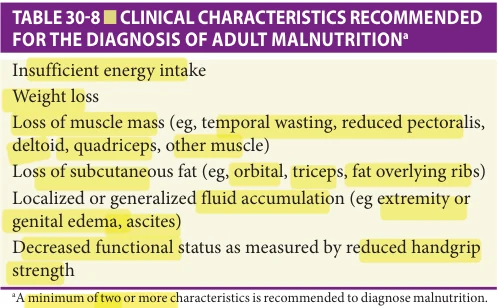

*TABLE 30-8 ■ CLINICAL CHARACTERISTICS RECOMMENDED FOR THE DIAGNOSIS OF ADULT MALNUTRITIONa*

older adults. The National Health and Nutrition Examination Survey (NHANES III) found that the mean daily energy intake of persons age 70 and older was approximately 1800 kcal/day for men and 1400 kcal/day for women, and more than 10% of older adults reported consuming less than 1000 kcal/day. Even if this limited energy intake met the caloric needs of less-active older adults, it is unlikely that all noncaloric nutrient needs (vitamins and minerals) would be met unless the diet was extremely diverse and rich in nutrients. Although micronutrient deficiencies are common when PEM is moderate to severe, it is the PEM that tends to have the greater clinical impact. Poor nutritional status and PEM are associated with altered immunity, impaired wound healing, reduced functional status, increased health care use, and increased mortality. Despite the confounding effect of coexisting nonnutritional factors, poor nutrition remains an independent source of increased morbidity and mortality after adjustment for nonnutritional factors.

Pathophysiology PEM may occur as a consequence of inadequate intake alone (eg, starvation) or in association with disease-activated physiological mechanisms that affect body metabolism, composition, and appetite (ie, cachexia). In the former (primary caloric deficiency state) the body adapts by using fat stores while conserving protein and muscle, and the resulting physiologic changes are often reversible with resumption of usual intake and activity. Cachexia is a complex metabolic syndrome that is associated with elevated inflammatory cytokines (eg, TNF-α and IL-6) and increased protein and muscle degradation that may not be mitigated or reversed by refeeding. Although cachexia is usually associated with specific chronic disease conditions (eg, cancer, renal failure, chronic obstructive pulmonary disease [COPD]), this state may develop in older persons without obvious underlying disease.

Presentation and Evaluation Despite its clinical importance, malnutrition is often missed clinically. Effective management of frail or ill older adults mandates an evaluation of nutritional status to better allow for early recognition of PEM and consideration of appropriate interventions. Assessment of nutritional status by standard anthropometric, biochemical, and immunologic measures can be complex, as both nutrient intake and non -nutrition-related factors can affect these parameters (see preceding section on Assessment of Nutritional Status). The close monitoring of body weight, a readily obtainable measure that reflects imbalance between caloric intake and energy requirements, is a simple and reliable way to screen for malnutrition, particularly in the outpatient setting. Weight loss of 5% or more of usual body weight over 6 to 12 months is associated with increased morbidity and mortality in the outpatient setting, and so is the degree of weight loss that should prompt investigation.

**[p. 425]**

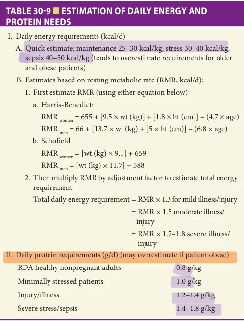

*TABLE 30-9 ■ ESTIMATION OF DAILY ENERGY AND PROTEIN NEEDS*

In the hospital setting, where acute illness or injury often coexists with inadequate intake, alterations in nutritional parameters associated with PEM may develop rapidly. Elevated levels of inflammatory mediators appear to be responsible for the greater losses in LBM and the rapid declines in albumin that often accompany PEM in physiologically stressed patients. While serial weight measures remain clinically relevant, early detection and correction of PEM in acutely ill hospitalized patients is enhanced by determination of dietary intake relative to metabolic requirements. Although registered dietitians often provide this information, all members of the clinical care team should be aware of dietary intake and can readily estimate caloric and protein requirements using formulas presented in Table 30-9. Biochemical and immunologic measures (eg, albumin, prealbumin, transferrin, and lymphocyte counts) can provide prognostic information, but their lack of specificity limits their utility as markers of PEM. An effective assessment of nutritional status requires synthesis of information provided from the dietary history, physical examination, and biochemical data. There are no definitive criteria for classifying degrees of PEM. However, when weight loss exceeds 20% of premorbid weight, serum albumin is less than 21 g/L, transferrin is less than 1 g/L, and total lymphocyte count is less than 800/μL, PEM is generally considered to be severe.

Assessment for Causes of Weight Loss Initial management of patients with PEM and/or weight loss should include a thorough evaluation to identify

underlying causes, and if found, to aggressively attempt to correct potentially remediable factors. In the acute care setting the cause(s) of malnutrition are often readily evident, although depression may be a contributing factor that is frequently overlooked. In contrast, reasons for poor nutrition and weight loss among community-dwelling older persons may be multiple and not as readily discernible. Depression, gastrointestinal (GI) maladies (eg, peptic ulcer, motility, or malabsorption disorders), and cancer are the three most common causes of involuntary weight loss in older adults when a single predominant cause is present (Table 30-10). When cancer is the cause of weight loss, the diagnosis is rarely obscure. Most diagnoses are readily made after standard evaluations that include a careful history and physical examination and basic screening tests, with additional tests only as directed by signs and symptoms. If the initial basic evaluation is unrevealing, as will occur in roughly 25% of cases, it is best to enter a period of “active surveillance” rather than pursue more extensive undirected testing. A diagnostic algorithm (Figure 30-8) focusing first on verifying actual weight loss (patients may inaccurately report a history of weight loss) and then on whether caloric intake is adequate can help guide an appropriate work-up.

## Management

General considerations Older persons who are not meeting their protein and caloric requirements through oral intake should be considered for nutritional support. Table 30-11 outlines approaches to nutritional support and factors to consider in deciding whether to pursue specific interventions. The urgency for nutritional interventions relates to the degree of protein-calorie depletion at the time of diagnosis coupled with the expected magnitude and duration of inadequate nutrition. In the hospital setting, clinicians must consider that patients may have been suffering from PEM for some time prior to admission. Therefore, delay in instituting nutritional support while waiting for improved intake should be avoided. One approach is to intervene if a patient has a 5- to 7-day period of severely limited intake or for weight loss more than 10% of preillness weight in a hospitalized patient. However, attempts should be made to prevent PEM rather than wait for this degree of PEM to develop because weight loss and undernutrition are associated with worse clinical outcomes, and recovery of lost LBM is often difficult. This is particularly important in severe stress states (eg, sepsis, major injury) where protein catabolism can lead to LBM losses that approach 0.6 kg/ day. In support of early intervention when the development of PEM is likely, a trial of enteral nutrition among patients with major injury found that early (within 24 hours) enteral feeding had clinical benefits over tube feeding started later in the course of hospitalization.

Patient preference The effect of the planned intervention on the patient’s quality and/or quantity of life should be addressed before proceeding with nutritional support.

**[p. 426]**

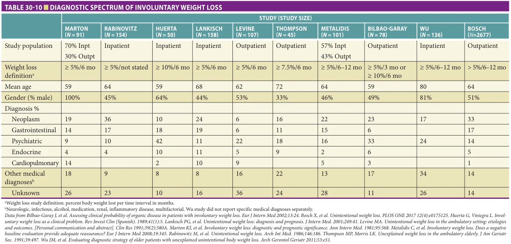

*TABLE 30-10 ■ DIAGNOSTIC SPECTRUM OF INVOLUNTARY WEIGHT LOSS*

**[p. 427]**

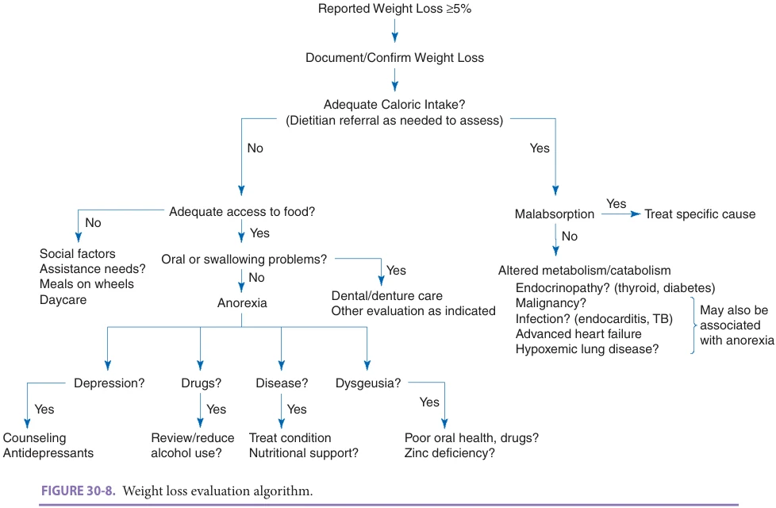

*FIGURE 30-8. Weight loss evaluation algorithm.*

Although nutritional support interventions may improve weight and other nutritional parameters, evidence demonstrating their ability to improve clinical outcomes is still limited, particularly when PEM is associated with serious (eg, critically ill intensive care unit [ICU] patients) or irreversible underlying disease (eg, cancer). While efforts to improve nutrition, even in patients with serious underlying disease, are often warranted, late in the course of disease

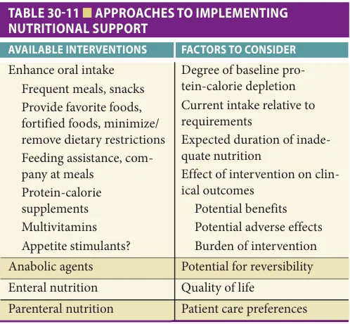

*TABLE 30-11 ■ APPROACHES TO IMPLEMENTING NUTRITIONAL SUPPORT*

appropriate palliative care may include, if not mandate, discontinuing such efforts. Determination of the care preferences of the patient is a critical component of the decision-making process. Patient and family counseling prior to implementing nutritional support should include a review of the interventions being considered and their potential for adverse, as well as beneficial, effects. Figure 30-9 provides an algorithm to help guide nutritional support decisions.

Enhancing oral intake

Nonpharmacologic approaches Although it is uncommon for hospitalized older persons with PEM to be able to increase their food consumption sufficiently to correct their nutritional deficits, trials of strategies to improve voluntary intake are reasonable for stable patients with mild PEM (no definitive criteria exist, but parameters consistent with mild-moderate PEM include weight 85%–90% of premorbid weight, albumin 25–30 g/L, transferrin 1.5–2.0 g/L, total lymphocyte count 800–1200/μL). As previously outlined, underlying causative or contributing condition(s) to PEM should be sought, identified, and addressed. Strategies to help overcome anorexia and improve oral intake include assessing and meeting food preferences, providing frequent small meals and snacks, use of fortified and flavor-enhanced foods, providing company at meals and feeding assistance as needed, and minimizing dietary restrictions. A dietitian may aid greatly in these efforts.

**[p. 428]**

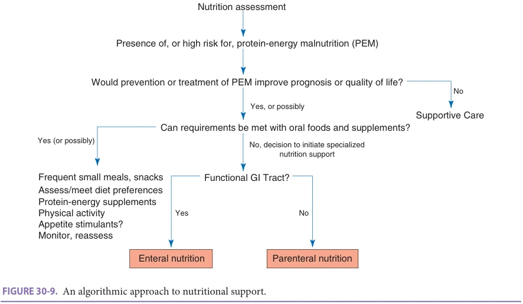

*FIGURE 30-9. An algorithmic approach to nutritional support.*

The role for high-protein, high-calorie oral nutritional supplements is not clear. While meaningful clinical benefits may occur in malnourished older adults, the effects are less clear in persons with dementia or other progressive illnesses, particularly in the outpatient setting. A Cochrane Library review concluded that oral nutritional supplements produce modest (2% on average) weight gain, may reduce mortality in undernourished individuals, and may reduce hospital complications, but evidence for functional benefits or reduced length of hospital stay is lacking. As the greatest mortality impact was found in hospitalized malnourished patients age 75 or older who received high-calorie supplements, it seems reasonable to recommend such supplements in older hospitalized patients with, or at high risk for, PEM. Higher-calorie “plus” variety nutritional supplements (1.5–2.0 kcal/mL) are preferred over standard (1 kcal/mL) formulas, as costs are only slightly higher. Furthermore, because they deliver higher calorie content per milliliter ingested, patients do not need to drink as much volume to improve caloric intake. Supplements should be provided between, rather than with, meals as this appears to result in less compensatory decreases in food intake at mealtime, thereby more effectively increasing total daily caloric intake. However, even if total caloric intake is only marginally improved, the provision of energy from nutritionally dense supplement sources may be beneficial due to improved protein and micronutrient intake.

A standard multivitamin supplement should also be considered for all older adults with PEM. Although study results are not consistent, some have demonstrated that improving micronutrition with multivitamins, particularly in malnourished or at-risk persons, may improve clinical outcomes (eg. infection rates). Increased physical activity

is an important adjunct that can help maintain LBM and improve appetite, thereby leading to improved caloric intake and functional status.

Drugs Pharmacologic approaches to stimulate appetite and promote weight gain can be considered on an individual basis with the knowledge that the few agents (megestrol acetate [MA], dronabinol, cyproheptadine) that may improve intake in some patient populations (eg, cancer, human immunodeficiency virus, anorexia nervosa) have not been shown to be effective in older adults and may cause serious side effects. Further, the weight gain that has been observed with these agents has usually been small, disproportionately fat mass, and not associated with improved function, quality of life, or decreased morbidity and mortality. MA increases risks of thrombotic events, fluid retention, and mortality. The American Geriatrics Society Beers Criteria lists both MA and cyproheptadine as medications to be avoided in older adults. Dronabinol has not been carefully studied in older adults and at best has shown limited promise in small nonrandomized trials conducted in nursing home patients. If initiated, MA may not have a demonstrable effect on appetite for several weeks, but if no effect is seen by the eighth week, MA should be discontinued. If positive effects are demonstrated without significant side effects, MA may be continued for up to 12 weeks. Treatment for more than 8 to 12 weeks can suppress the adrenal–pituitary axis, resulting in adrenal insufficiency and insufficient response to acute stressors. MA also appears to blunt the beneficial effects of progressive resistance exercise, consistent with an undesirable glucocorticoid-like catabolic effect.

If depression is felt to be a contributing factor to poor intake, a trial of therapy is usually warranted. Selective

**[p. 429]**

serotonin reuptake inhibitors (SSRIs) are first-line antidepressant agents that may improve appetite by improving depression. Mirtazapine leads to more weight gain than SSRIs, but it is not clear that mirtazapine has a significant advantage over other antidepressants when weight loss is a predominant presenting sign in a depressed older adult. There is no high-quality evidence to support the use of mirtazapine for weight gain in the absence of depression.

## Maintaining Lean Body Mass and Functional Status

Anabolic agents Anabolic hormones (eg, growth hormone [GH], testosterone, oxandrolone) have received considerable attention in the search to find strategies to help preserve or increase LBM in patients with malnutrition and weight loss. Although adequate nutrition is essential for patients with weight loss, a physiologically stressed catabolic patient may lose significant LBM despite aggressive nutritional support (and the weight gain that does occur with nutritional support and appetite stimulants may be primarily fat and water). GH has generally failed to demonstrate benefits on muscle mass or muscle strength in older adults, even in association with resistance training. The use of GH in intensive care and congestive heart failure patients has also yielded disappointing results with evidence of increased mortality. The cost, need for injection, and potential side effects of GH (eg, arthralgias, edema, insulin resistance, tumor growth) further limits its clinical role. Testosterone increases muscle protein synthesis mass and strength, and improvements in functional outcomes have been observed in small, controlled trials in selected male populations (eg, older men after knee replacement surgery, deconditioned older men on a Geriatric Evaluation and Management unit). Although testosterone might be considered in men with documented clinical hypogonadism (see Chapter 97), its role in the setting of malnutrition and/or cachexia remains to be clarified, especially in light of known safety concerns (in particular CV). Oxandrolone, a synthetic testosterone derivative with an increased anabolic to androgenic effect ratio, has shown some utility for patients with weight loss in association with AIDS/ HIV or burns, and preliminary data also suggest benefit in patients with COPD. This agent can cause hepatitis, hirsutism, and fluid retention, and is contraindicated in patients with breast or prostate cancer. Selective androgen receptor modulators (SARMs), for example enobosarm, have the potential to provide desirable anabolic effects on muscle and bone without androgenic effects elsewhere, but these agents are still under study and not yet available clinically. Other anabolic agents that are under study include myostatin inhibitors and ghrelin analogues. Myostatin is expressed in skeletal muscle and inhibits muscle protein synthesis and promotes fibrosis. Blocking these effects may provide a novel approach to prevent muscle loss and promote muscle growth. Ghrelin is an endogenous GH secretagogue that increases appetite and has anabolic properties

that can lead to increases in LBM. Anamorelin is an oral ghrelin analogue that has shown promise in patients with cancer-associated anorexia/cachexia. It remains under study and is not commercially available.

Physical activity Efforts to increase physical activity are an important adjunct to any nutritional intervention as positive effects of exercise include enhanced appetite and improved functional status. The benefits (and safety) of exercise in older populations are reviewed in Chapter 54.

## NUTRITIONAL SUPPORT

Enteral Nutrition Enteral nutrition (EN) is defined as the nonvolitional delivery of nutrients by tube into the GI tract. EN should be considered for patients with PEM, or at high risk for it, who cannot meet their nutritional requirements through oral intake. However, specific indications regarding if and when to provide EN are not clearly established, and patient prognosis and preference are critical factors that must be taken into account. EN requires a functional GI tract and is contraindicated in patients with bowel obstruction, inadequate bowel surface area, major upper GI bleeding, GI ischemia, or intractable vomiting or diarrhea. Purported benefits of enteral tube feedings relative to parenteral nutrition (PN) include the maintenance of GI structure and function, more physiological delivery of nutrients, less risk of overfeeding and hyperglycemia, and lower costs. Although some of these advantages may be more theoretical than actual, EN is preferred when GI function is adequate. EN and PN should not be considered mutually exclusive. For patients unable to fully meet their nutritional requirements through EN, a mixture of PN and EN is preferable to PN alone.

Efficacy EN can improve prognostically important intermediate nutritional parameters but the effects of EN on clinical outcomes (eg, functional status, medical complications, mortality) are unclear owing to limited and/or mixed data. EN is often not initiated until advanced PEM is present, which is a clear impediment to the potential positive effects of nutritional therapy. There is prospective clinical trial evidence that EN can improve both nutritional parameters and clinical outcomes (eg, length of stay, infectious complications, and mortality) in older undernourished hip fracture patients. Further study is needed to determine which older hospitalized patients might benefit most from aggressive nutritional support. In the interim, sufficient rationale exists to consider EN for patients who are undernourished or at high risk for undernutrition and cannot meet their nutritional needs with oral intake.

Tube placement The route selected for tube feeding depends on the anticipated duration of feeding, the potential for aspiration, and the condition of the gastrointestinal tract (eg, esophageal or gastric obstruction). Nasogastric (NG) or nasointestinal tubes provide the simplest approach

**[p. 430]**

for patients requiring relatively short-term EN (< 30 days). Patient comfort is often problematic, and tolerance is best when a small-diameter, soft feeding tube is used rather than a standard large-bore NG tube. The use of longer specialized feeding tubes also allows the tube to reach beyond the pylorus into the distal duodenum or jejunum (ie, beyond the ligament of Treitz), which is the preferred site of placement for patients who have delayed gastric emptying or are at high risk for aspiration. Methods to promote passage of the tube past the pylorus when postpyloric feeding is desired include ensuring adequate tube length, having the patient lie on their right side, prescribing erythromycin or metoclopramide, or using endoscopic or fluoroscopic guidance to position the tube. However, postpyloric feeding can be a challenge to maintain as even endoscopically placed tubes may migrate back into the stomach. After placement, the desired tube position should be verified radiologically before starting feedings and the tube should be marked at its exit point to help identify if subsequent movement occurs.

Percutaneous tube placement (gastrostomy, gastrojejunostomy, jejunostomy) is indicated when long-term tube feeding is anticipated (> 4 weeks). Percutaneous placement of gastrostomy tubes (G-tubes) can be performed either endoscopically or under radiographic guidance. The risks of major complications with either procedure are generally low, but infection, hemorrhage, and peritonitis have each been reported at rates of 1% to 3%. Placement of feeding tubes directly into the jejunum may be required for patients with abnormal or inaccessible stomachs (eg, gastrectomy, duodenal obstruction). Although direct jejunostomy tube (J-tube) placement can be accomplished using percutaneous methods, a J-tube traditionally requires an open surgical procedure and is often placed at the time of laparotomy when the need for prolonged nutritional support is anticipated.

Tube feeding is associated with an increased incidence of aspiration. However, most aspiration pneumonias are the result of difficulty handling endogenous (oropharyngeal or gastric) secretions rather than aspiration of material introduced through the tube. Thus, it is not entirely surprising that although postpyloric feeding tube placement is generally advised in older and sicker patients, the reduction in the incidence of pneumonia is small.

Formula selection Adult enteral formulas fall into one of the following categories: standard, concentrated, predigested (previously called elemental or semi-elemental), and disease-specific. All consist of varying mixtures of protein (often casein), carbohydrate (often cornstarch), and fat (usually vegetable oils), and most do not contain lactose. Formula variability includes nutrient composition, nutrient density, osmolarity, fiber content, and cost (cost tends to be substantially higher for disease-specific specialty formulas, and up to 10-fold higher for critical care and predigested specialty formulas). Isotonic standard formulas with caloric densities of 1.0 to 1.2 kcal/mL are usually the initial products of choice. Higher caloric density formulas (1.5–2.0 kcal/mL) may be useful when volume

restriction is paramount (eg, in patients with renal failure) but their higher viscosity increases the risk of tube clogging and their higher osmolarity may be less well tolerated if delivered rapidly via tubes placed beyond the pylorus. There is no evidence that routine supplementation of EN with fiber prevents diarrhea, but supplemental fiber may be tried if patients receiving EN are having problems with diarrhea or constipation. Predigested formulas differ from standard EN because their carbohydrates are less complex and proteins have been hydrolyzed to short-chain peptides. Although they are promoted for patients with diminished ability to digest nutrients, it is uncommon for patients to be incapable of digesting and absorbing standard formulas unless they have significantly impaired gastrointestinal function (assuming appropriate adjustments are made in rates of feedings, osmolality, and fiber content).

Disease-specific/specialty formulas are available for patients with renal failure, liver failure, diabetes mellitus, pulmonary disease, gastrointestinal dysfunction, and critical illness. However, as costs are usually substantially higher and no clear clinical benefits have been consistently demonstrated, disease-specific formulations are not routinely recommended. Renal formulas, which are low in electrolytes and dense in calories, do have a place in renal failure patients who have need for fluid and/or electrolyte restrictions. These formulas may be useful before dialysis but are not necessary for most patients once on dialysis. Formulas have been developed for diabetic patients but use of cheaper standard formulas with adjustments in glucose control regimens as necessary is adequate for most diabetic patients. Formulas for pulmonary patients have higher fat and lower carbohydrate content based on the now known erroneous rationale that this alteration in fuel source reduces carbon dioxide production. Clinical studies have failed to show any benefit to support the use of pulmonary EN formulations. Hepatic formulas have specific amino acid mixtures (high in branched chain, low in aromatic amino acids) that are less likely to cause or exacerbate hepatic encephalopathy. They are only indicated when, despite appropriate medical therapy, hepatic encephalopathy limits the delivery of adequate protein to a patient with liver disease.

A number of specialty formulations have been designed for critically ill patients. Some of these products are enriched with glutamine (an amino acid associated with improved nitrogen balance and gut barrier function as well as immune-modulating effects when delivered parenterally), arginine (a conditionally essential amino acid associated with improved nitrogen balance and immune function), and/or other immune modulators (eg, antioxidants, selenium, omega-3 fatty acids). However, meta-analyses have not shown convincing clinical benefits and a large trial of “immunonutrition” in an ICU population found that early provision of glutamine or antioxidants did not improve clinical outcomes, and glutamine was associated with increased mortality. Pending further study, use of these products in EN formulas is not recommended.

**[p. 431]**

Administration guidelines After desired tube placement location is confirmed, tube feeds (TFs) can be started at a rate of 10 to 30 mL/hour. Two basic approaches to advancing TF flow rates are: (1) maintain a lower “trophic” feeding goal of 25% to 30% of estimated needs for 6 days before increasing to target rate; versus (2) advance TF rate to goal as quickly as tolerated over 24 to 48 hours. The American Society for Parenteral and Enteral Nutrition favors the latter for patients who are severely malnourished or at high nutritional risk while noting that EN was better tolerated in mechanically ventilated ICU patients (eg, less vomiting, reduced use of prokinetic agents) and clinical outcomes were similar when feeding rates were kept low (10–30 mL/ hour, roughly 30% of target rate) for 6 days before increasing by 25 mL/hour every 6 hours as tolerated to target rate. In non-ICU settings feeding rates can be advanced 25 mL/hour every 6 to 12 hours based on individual tolerance, until target rate is reached. Routine checking of gastric residual volume (GRV) lacks benefit and is no longer recommended unless abdominal distension, abdominal pain, nausea, or change in clinical status occur. An evaluation for remediable factors (eg, medications, high fat-content formulas) should be conducted if GRV exceeds 250 mL, and feedings should be held if GRV exceeds 500 mL. Once daily requirements are reached, further adjustments to deliver nutrients primarily at night can allow more freedom of movement during the day. Nocturnal feeds probably offer little benefit in terms of decreased satiety and improved intake during the day relative to continuous feeds. Intermittent bolus gastric feedings without a pump offers convenience advantages but generally should be avoided in persons with delayed gastric emptying and those at high risk for aspiration.

As all feeding products consist of no more than 70% to 80% water, they are unable to meet basal free-water requirements of roughly 30 mL/kg per day. Most patients require additional water beyond the routine water flushes that occur with medication and TF administration to avoid tube clogging. Attention must also be paid to water and electrolyte requirements as they will need to be increased with excess losses due to diarrhea, high urinary output, or increased insensible losses. For patients with fever, an additional 300 to 400 mL of water is needed for each degree centigrade of temperature elevation. Monitoring of weight and electrolytes can help detect any necessary adjustments, with additional free-water needs given in divided boluses three or four times a day.

Risks and complications Proper consideration of whether to proceed with EN entails an understanding of common adverse effects (Table 30-12). NG tubes are often not well tolerated, with agitation and self-extubation being particularly common among patients with cognitive impairment or delirium. Self-extubation may lead to consideration of physical or chemical restraints, but such restraints are not justified to prevent NG tube self-extubation alone. Also, EN in actual practice often involves delayed and inadequate

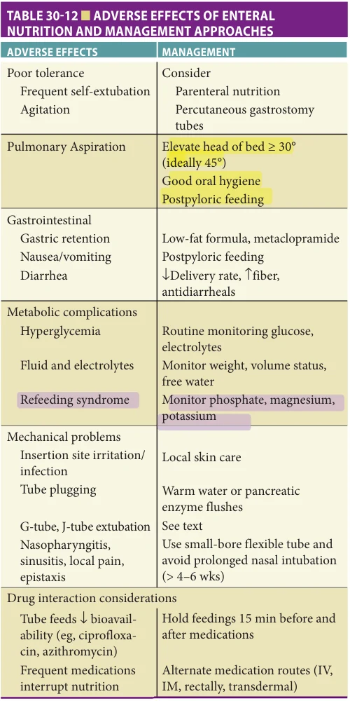

*TABLE 30-12 ■ ADVERSE EFFECTS OF ENTERAL NUTRITION AND MANAGEMENT APPROACHES*

nutritional support because of frequent problems with tubes (eg, self-extubation, plugging) or GI intolerance (eg, high residuals, bloating, diarrhea). These factors may explain why attempts to provide EN to older persons are often abandoned after only a short course of therapy. Some have advocated for an early switch to PN, or starting with PN, particularly if patients are confused or delirious and the expected duration of therapy is short (1–2 weeks). If longer-term support is likely, early use of percutaneous gastrostomy tubes, which tend to be better tolerated by uncooperative or confused patients, may be considered (along with a reevaluation of overall patient care preferences and intervention goals before proceeding with this more invasive approach).

**[p. 432]**

Pulmonary aspiration is a relatively common complication of EN, but unless aspiration causes an overt clinical event (eg, aspiration of a large volume), it is not clear that aspiration causes untoward clinical outcomes such as higher rates of pneumonia. Nonetheless, strategies to reduce aspiration are generally advised. Patients with gastric retention, decreased gag reflex, and altered levels of consciousness are at increased risk for aspiration, and mechanically ventilated patients should not be considered protected by the presence of an endotracheal cuff. The risk of aspiration can be reduced as outlined in Table 30-12. EN-related GI issues and their management are also presented in Table 30-12. When significant diarrhea occurs, infectious causes (particularly Clostridium difficile) must first be excluded. Metabolic abnormalities related to tube feedings include high potassium and phosphorous requirements in the first few days after nutritional support is started because of extracellular to intracellular shifts that accompany nutrient utilization, particularly among very malnourished patients (“refeeding syndrome”). Fluid retention can occur in older adults with impaired renal or cardiac function. To minimize these problems, monitoring protocols should include frequent evaluation of GI tolerance, daily weights, and daily monitoring of glucose and electrolytes until stable.

Increased problems with tube clogging often occur when more viscous higher-calorie formulas and medications (especially fiber and calcium supplements) are passed via small-bore (smaller than no. 10 French) catheters. Tube maintenance with regular water flushing every 4 to 8 hours for patients on continuous feeds, and before and after the delivery of intermittent TFs or medications (with 30 mL warm water) can reduce clogging problems. When possible, medications should be given by mouth rather than by feeding tube. If clogging occurs flush with 30 to 60 mL warm water, or a solution containing pancreatic enzymes. Cola or cranberry juice flushes have not been shown to be any more effective than water for resolving occlusions, and when used their dried residuals can narrow the lumen of the tube and contribute to clogging. Another common mechanical problem is the replacement of a gastrostomy or jejunostomy tube that has fallen out. Feeding tube fistula tracts are generally not well established for at least 1 to 2 weeks after placement (and often substantially longer given malnutrition’s adverse effect on wound healing). Tubes that come out early (in the first 2–3 weeks after placement) require replacement by the original specialist. If the fistula tract is well established, patients or care providers should be able to gently replace tubes that have fallen out. Delay in doing so for more than 6 to 12 hours risks spontaneous closure of the tract. However, feeding should not be resumed until proper tube placement is radiologically confirmed.

Parenteral Nutrition PN, the delivery of nutrients by vein, should be considered to prevent the adverse effects of malnutrition in patients

who are unable to obtain adequate nutrients by oral or enteric routes (ie, EN is not possible or effective). However, specific indications regarding if and when to institute PN, as well as the utility of PN once instituted, have not been clearly delineated. In general, the decision to institute PN depends on the severity and expected course of the underlying disease(s) and the severity of preexisting and anticipated undernutrition. For critically ill patients who are adequately nourished on admission and have contraindications to EN, guidelines from the Society of Critical Care Medicine and American Society for Parental and Enteral Nutrition recommend against PN during the first week as early PN likely increases the risk of infections and other complications without conferring benefit. Conversely, in the situation where EN is not possible and the patient is severely malnourished or at high nutrition risk on admission, these same guidelines recommend consideration of PN as soon as possible after ICU admission. They also advise supplemental PN be considered after 7 to 10 days (but not before) for patients unable to meet more than 60% of energy and protein requirements by the enteral route alone. Decisions to institute PN require careful consideration of the patient’s clinical condition and prognosis, clinical judgment about the patient’s ability to tolerate undernutrition, and insight regarding patient care needs and preferences.

Efficacy The European Society for Clinical Nutrition and Metabolism concluded that PN can reduce morbidity and mortality in geriatric patients, but the evidence that PN improves clinical outcomes in older adults is not robust. There are limited data on beneficial effects of PN in the following settings: perioperatively in patients with GI cancers; in patients undergoing major elective surgery who are severely malnourished (generally when weight loss exceeds 10%–15% and serum albumin level is < 33 g/L, or, in the absence of weight loss, if albumin is < 28 g/L); and in bone marrow transplant recipients, malnourished critically ill patients, and patients with short bowel syndrome. Overall, there is still a paucity of studies and many unanswered questions about the efficacy and safety of PN in older adults.

Administration guidelines

Intravenous access Total parenteral nutrition (TPN), the delivery of all required nutrients by vein, requires the use of hypertonic solutions that can only be tolerated when delivered into large venous vessels, preferably into the superior vena cava. Because peripheral veins are limited to solutions containing lower concentrations of amino acids and dextrose (< 10% dextrose), peripheral parenteral nutrition (PPN) alone usually cannot deliver nutrients in sufficient quantity to meet all requirements. Although the infusion of lipids can improve energy delivery and vessel tolerance to PPN, its role in PN is extremely limited given the uncertain clinical benefits of short-term PPN and the ease of obtaining central venous access for TPN. Short-term TPN in the

**[p. 433]**

hospital setting is preferably delivered via a peripherally inserted central catheter (PICC). PICC lines offer reduced risks of central placement complications (eg, pneumothorax, inadvertent arterial puncture, and hemorrhage) and may have a reduced risk of infectious complications compared to subclavian or internal jugular venous catheters. Tunneled central venous catheters (eg, Hickman or Groshong catheter) are generally preferred over PICCs for long-term TPN (eg, home TPN) owing to lower infection rates. Regardless of the placement method used, proper line position needs to be confirmed by x-ray before initiating TPN.

TPN composition Standard TPN solutions contain carbohydrate (dextrose), protein (amino acids), electrolytes, vitamins, minerals, and trace elements. Lipid emulsions (traditionally soybean or safflower oil with egg phospholipids) may be infused separately or added to the mixture. Although clinicians should have a basic knowledge of usual TPN formula composition (Table 30-13), PN should be initiated and monitored by a team (usually physicians, nutrition specialists, and pharmacists) with an advanced understanding of factors such as nutrient metabolism and solute compatibility. Clinicians should also be aware that electrolyte requirements are highly variable and often require adjustments as they are influenced by the patient’s underlying diseases (eg, heart failure, renal dysfunction) and factors such as renal or GI fluid losses.

The optimal proportions of fat and carbohydrate to meet energy needs are controversial. All standard formulas contain hypertonic glucose (10%–70% dextrose before mixing), but because diabetes and glucose intolerance are so common in older people, slow upward titration in delivery rates is necessary. Aggressive glucose monitoring and treatment is important, as hyperglycemia is associated with increased infection risk and worse clinical outcomes in critically ill patients. Glucose infusion rates should not exceed 5 mg/kg/min (about 500 g/day for a 70-kg person on continuous TPN) because the rate at which stressed patients can metabolize glucose as energy is limited. Overfeeding with glucose can lead to not only hyperglycemia, but also increased carbon dioxide production and the conversion of excess glucose calories into fat (which requires energy and contributes to fatty liver changes).

Lipids in the form of 10% to 20% fat emulsions are added to TPN as a source of concentrated energy and to supply essential fatty acids. Delivery of fat emulsions two to three times a week is usually sufficient to prevent essential fatty acid deficiency. Fat emulsions are isotonic and are generally well tolerated, but patients occasionally develop hyperlipidemia and, less frequently, have allergic reactions (usually to the egg phospholipid component). Increasing the proportion of energy supplied by fat can reduce hyperglycemia and carbon dioxide production, but fat delivery should not exceed 2.5 g/kg/day (or 50%– 60% of nonprotein calories) to avoid possible adverse

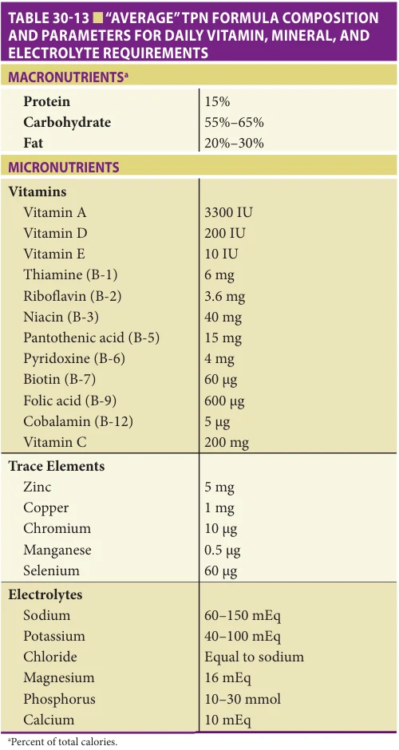

*TABLE 30-13 ■ “AVERAGE” TPN FORMULA COMPOSITION AND PARAMETERS FOR DAILY VITAMIN, MINERAL, AND ELECTROLYTE REQUIREMENTS*

consequences associated with fat overload. The fat overload syndrome is characterized by hyperlipidemia with diffuse fat deposition that can cause organ and reticuloendothelial system dysfunction and increased risk of sepsis. Newer lipid emulsions that contain omega-3 fatty acids (eg, mixtures that include fish oil as well as olive oil) may have anti-inflammatory properties that could be beneficial during critical illness, but to date evidence is inadequate to recommend their routine use.

Formula delivery Infusion rates usually start at 25 to 50 mL/h and are increased every 8 to 12 hours as metabolic status allows until fluid and nutrition goals are met. At some institutions, carbohydrate, fat, and protein TPN components are mixed together into a single bag (total nutrient admixture or 3-in-1 formula), which may have cost and convenience benefits compared to traditional TPN

**[p. 434]**

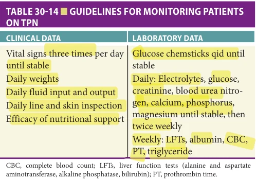

*TABLE 30-14 ■ GUIDELINES FOR MONITORING PATIENTS ON TPN*

administration of dextrose and amino acids (2-in-1) with separate intravenous (IV) fat emulsion infusions. In most circumstances, daily TPN volumes are infused continuously over the full 24 hours. This allows slower delivery of carbohydrate (which can help reduce hyperglycemia), and the continuous flow may decrease the risk of catheter occlusion while avoiding interruptions that might lead to hypoglycemia. Shorter infusion schedules with brief periods off TPN (cyclic TPN) are occasionally desirable, but this is more of an issue for long-term TPN in the home care setting. Because TPN formulas (especially the lipid component) can suppress appetite, it may be desirable to reduce or hold lipid emulsions for a few days to help improve oral intake prior to planned discontinuation of TPN.

Patient monitoring and complications Older persons receiving TPN should be monitored closely (Table 30-14), with adjustments made in frequency of monitoring depending on the patient’s acuity and stability. Table 30-15 details common complications and their prevention and/or treatment. Correction of dehydration and volume depletion can most readily be accomplished with standard IV fluids, which can be infused separately or added to TPN bags for convenience. Fluid overload can be managed by using higher concentrations of macronutrients to limit total volumes infused, with diuretics added as needed. Although insulin can be added directly to TPN solutions to help control hyperglycemia, it is best to give insulin separately until caloric delivery and glucose control are stabilized. IV insulin is preferred over subcutaneous insulin owing to the latter’s potential for erratic absorption in malnourished patients. Infection and volume depletion need to be considered if hyperglycemia is a persistent problem. As with EN, potassium and phosphate must be monitored closely because they may drop precipitously after initiating TPN in malnourished patients. In most cases, electrolyte requirements stabilize within 1 week. The relative amounts of chloride (which can lead to metabolic acidosis) and acetate (which can be metabolized to bicarbonate and lead to metabolic alkalosis) can be adjusted as needed depending on the patient’s acid–base balance.

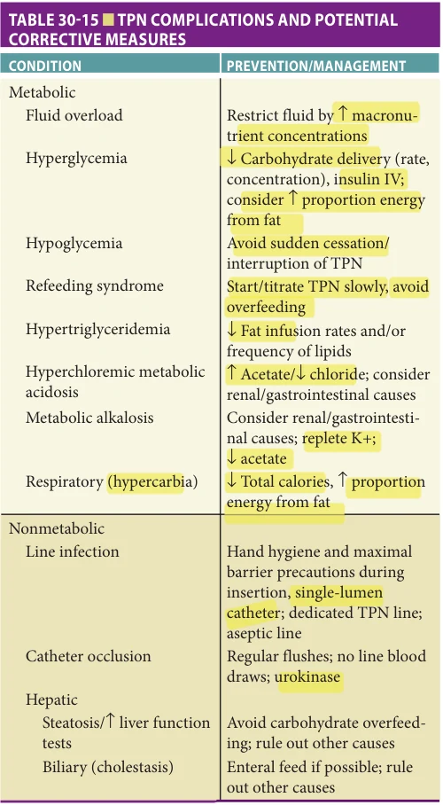

*TABLE 30-15 ■ TPN COMPLICATIONS AND POTENTIAL CORRECTIVE MEASURES*

Infection of the access line is uncommon in the first 72 hours, so early fevers are usually a result of other causes. The risk of infection can be reduced by following optimal insertion techniques and providing aseptic vigilant catheter care. The line site should be monitored daily for erythema, tenderness, or discharge. The increased rates of sepsis that have been observed in some trials of TPN (and which possibly diminished the potential for TPN trials to demonstrate improved clinical outcomes) may have been related to overfeeding and hyperglycemia. Avoidance of hyperglycemia (in particular glucose levels > 200 mg/dL) may decrease the risk of TPN-associated infections. Liver abnormalities that can occur with TPN include fatty liver with elevated liver function tests (often occurs early, likely related to carbohydrate overfeeding, generally benign/reversible) and cholestasis (tends to occur later, after 3+ weeks). EN, even in small amounts, may reduce problems with cholestasis.

**[p. 435]**

Efforts should be made to transition to EN or oral intake as soon as feasible. As tolerance to EN improves, the amount of PN energy should be reduced and PN should be discontinued when EN or oral intake is providing more than 60% of energy requirements.

## Special Issues

Comorbidity Responses to nutritional support may vary substantially owing to heterogeneity in underlying disease states associated with PEM (particularly the presence and severity of inflammatory/catabolic states). Limited data on the interaction between nutritional support and specific comorbid conditions and care settings include the following:

Hip fracture As many as half of all older patients who present with hip fractures are malnourished. Undernutrition may directly contribute to hip fracture events via increased presence of osteoporosis, increased risk of falls due to reduced LBM and strength, and reduced fat to “cushion” a fall. Nutritional intervention, primarily with oral nutritional supplements, improves energy balance and reduces complications and hospital length of stay following hip fracture. Accordingly, attention to nutrition is an important aspect of post hip fracture care, particularly in undernourished patients. As nasogastric feedings are not well tolerated after hip fracture and do not improve mortality, EN should be reserved for patients with more severe levels of malnutrition with poor intakes not responsive to oral supplementation.

Chronic obstructive pulmonary disease Prevalence estimates of malnutrition in patients with COPD range from 20% to 70%. Causes are likely multifactorial and include increased inflammatory activity, higher metabolic rate due to work of breathing and diminished intake due to dyspnea, chronic sputum (can alter taste), flattened diaphragm (may contribute to early satiety), and medication side effects

## FURTHER READING

Baldwin C, Smith R, Gibbs M, Weekes CE, Emery PW.

Quality of the evidence supporting the role of oral nutritional supplements in the management of malnutrition: an overview of systematic reviews and meta-analyses. Adv Nutr. 2021;12(2):503–522. Beavers KM, Nesbit BA, Kiel J, et al. Effect of an energy-

restricted, nutritionally complete, higher protein meal plan on body composition and mobility in older adults with obesity: a randomized controlled trial. J Gerontol A Biol Sci Med Sci. 2019;74(6):929–935. Cetin DC, Nasr G. Obesity in the elderly: more complicated

than you think. Cleve Clin J Med. 2014;81:51–61. Despres JP. Body fat distribution and risk of cardiovascular

disease: an update. Circulation. 2012;126:1301–1313.

(eg, adverse GI effects). Nutritional support (most often with oral supplements) has beneficial effects on a wide range of COPD outcome measures that include anthropometrics, immune function, muscle strength, respiratory function, and quality of life. Given their relative low cost and potential for benefit, nutritional support should be considered for all patients with COPD and evidence of PEM.

Nursing home Very high prevalence rates of PEM and weight loss have been documented in nursing home patients, likely because conditions associated with reduced intake are so common (see earlier discussion and Table 30-1), In this setting, simple interventions such as fortified foods, high-calorie snacks, nutritional supplements, and assisted feeding, can improve nutritional parameters and help stabilize weight. Although it is not clear that improvements in nutritional parameters translate to improved clinical outcomes, such interventions may enhance quality of life and are reasonable and appropriate for most nursing home residents.

Dementia Use of TFs in patients with advanced dementia is not advised. Tube feeding patients with advanced dementia does not improve nutritional status, decrease pressure sores or infections, reduce aspiration problems, or improve functional status or survival. Potential adverse effects of TFs in these patients include increased risk of aspiration, discomfort and complications from tube placement, agitation driving increased use of physical and chemical restraints, worsening pressure ulcers from increased urine and fecal output, and diminished quality of life from decreased interaction at mealtime and loss of gustatory pleasure from food intake. The lack of demonstrable benefits combined with considerable potential for harm led the American Geriatrics Society to advise clinicians not to recommend percutaneous feeding tubes in patients with advanced dementia and instead focus on oral-assisted feeding with food as the preferred nutrient.

Fakhouri TH, Ogden CL, Carroll MD, Kit BK, Flegal

KM. Prevalence of obesity among older adults in the United States, 2007-2010. NCHS Data Brief. 2012;106:1–8. Gingrich A, Volkert D, Kiesswetter E, et al. Prevalence

and overlap of sarcopenia, frailty, cachexia and malnutrition in older medical inpatients. BMC Geriatrics. 2019;19(1):120. Jenkins DJA, et al. Supplemental vitamins and minerals for

cardiovascular disease prevention and treatment. J Am Coll Cardiol. 2021;77:423–436. Jensen GL, Compher C, Sullivan DH, et al. Recognizing

malnutrition in adults: definitions and characteristics, screening, assessment, and team approach. JPEN J Parenter Enteral Nutr. 2013;37:802–807.

**[p. 436]**

Kim Y, et al. Dietary fiber intake and total mortality:

a meta-analysis of prospective cohort studies. Am J Epidemiol. 2014;180:565. Manson J, et al. Vitamin D supplements and prevention

of cancer and cardiovascular disease. N Engl J Med. 2019;380:33–44. Michos Erin D, et al. Vitamin D, calcium supplements, and

implications for cardiovascular health. J Am Coll Cardiol. 2021;77:437–449. Miller J, Wells L, Nwulu U, Currow D, Johnson MJ,

Skipworth RJE. Validated screening tools for the assessment of cachexia, sarcopenia, and malnutrition: a systematic review. Am J Clin Nutr. 2018;108(6):1196–1208. Milne AC, Potter J, Vivanti A, Avenell A. Protein and energy

supplementation in elderly people at risk from malnutrition. Cochrane Database Syst Rev. 2009;(2):CD003288. Morton RW, Murphy KT, McKellar SR, et al. A systematic

review, meta-analysis and meta-regression of the effect of protein supplementation on resistance training-induced gains in muscle mass and strength in healthy adults. Br J Sports Med. 2018;52:376–84. Nicholls SJ, et al. Effect of high-dose omega-3 fatty acids

vs corn oil on major adverse cardiovascular events in patients at high cardiovascular risk: the STRENGTH randomized clinical trial. JAMA. 2020;324:2268–2280. Otten JJ, et al (eds). Dietary Reference Intakes: The Essential

Guide to Nutrient Requirements. Washington, DC: The National Academies Press; 2006. Perera L, Chopra A, Shaw A. Approach to patients with

unintentional weight loss. Med Clin North Am. 2021; 105:175–186. Protein and amino acid requirements in human nutri-

tion. WHO Technical Report Series No. 935:2007. https://apps.who.int/iris/handle/10665/43411. Accessed December 15, 2021. Reedy J, Krebs-Smith SM, Miller PE, et al. Higher diet

quality is associated with decreased risk of all-cause,

cardiovascular disease, and cancer mortality among older adults. J Nutr. 2014;144:881–889. Reinders I, Volkert D, de Groot LCPGM, et al. Effective-

ness of nutritional interventions in older adults at risk of malnutrition across different health care settings: pooled analyses of individual participant data from nine randomized controlled trials. Clin Nutr. 2019;38(4): 1797–1806. Sobotka L, Schneider SM, Berner YN, et al. ESPEN guide-

lines of parenteral nutrition: geriatrics. Clin Nutr. 2009;28(4):461–466. Struijk EA, Beulens JW, May AM, et al. Dietary patterns

in relation to disease burden expressed in disabilityadjusted life years. Am J Clin Nutr. 2014;100:1158–1165. Taylor B, McClave S, Martindale R, et al. Guidelines for

the provision and assessment of nutrition support therapy in the adult critically ill patient: Society of Critical Care Medicine and American Society for Parenteral and Enteral Nutrition. Crit Care Med. 2016;44(2):390–438. Ukleja A, Gilbert K, Mogensen K, et al. Standards for nutri-

tion support: adult hospitalized patients. Nutr Clin Pract. 2018;33(6):907–920. US Department of Agriculture, Center for Nutrition Pol-

icy and Promotion. ChooseMyPlate.gov. USDA Center for Nutrition Policy & Promotion (CNPP). June 2, 2011. Available at http://choosemyplate.gov/. Accessed December 15, 2021. Volkert D, Beck AM, Cederholm T, et al. ESPEN guideline

on clinical nutrition and hydration in geriatrics. Clin Nutr. 2019;38(1):10–47. Wilding JPH, Batterham RL, Calanna S, et al. Once-weekly

semaglutide in adults with overweight or obesity. N Engl J Med. 2021;384(11):989. Yang Y, et al. Association between dietary fiber and lower

risk of all-cause mortality: a meta-analysis of cohort studies. Am J Epidemiol. 2015;181:83.
