# Hazzard's Geriatric Medicine and Gerontology, 8e - Chapter 31: Disorders of Swallowing

Nicole Rogus-Pulia, Steven Barczi, JoAnne Robbins

> **Status.** Fast build from the book; not lane-reviewed.

> **Source and method.** Printed pages 437-452, from the marked 8th-edition copy (PDF page = printed page + 34). Prose follows its text layer; tables and figures are source-page crops. The book is canonical.

**[p. 437]**

## INTRODUCTION

Demographic changes related to aging necessitate that clinicians have the resources to address eating and swallowing difficulties present in older adults. The capacity to effectively and safely eat or swallow is one of the most basic human needs and also can be a great pleasure. Therefore the loss of this capacity can have far-reaching implications. Many would argue that swallowing is one of the cardinal behaviors needed to sustain life. The process of swallowing requires orchestration of a complex series of psychological, sensory, and motor behaviors that are both voluntary and involuntary. Dysphagia refers to difficulty swallowing that may include oropharyngeal or esophageal problems. More specifically, there may be difficulty in oral preparation for swallowing and/or moving material from the mouth to the esophagus and from the esophagus to the stomach.

#### Learning Objectives

- To understand the anatomy and physiology of the normal swallowing process.

- To distinguish between presbyphagia (healthy age-associated changes in swallowing) and dysphagia.

- To identify age-related diseases and conditions most commonly associated with the development of dysphagia.

- To describe screening and assessment techniques, instrumental and noninstrumental, for identifying and characterizing dysphagia.

- To summarize options available for treatment of dysphagia, including compensatory and rehabilitative approaches.

#### Key Clinical Points

1. Changes in swallowing that occur with healthy aging, termed presbyphagia, combined with age-associated diseases and conditions place older adults at risk for the development of dysphagia.

2. Swallowing is a complex patterned response that involves coordination of 30 oral and pharyngeal muscle pairs across both the cranial and spinal nerve systems.

3. An interdisciplinary team approach to early identification and comprehensive assessment of dysphagia will allow for effective treatment through both compensatory and rehabilitative techniques.

Although age-related changes and comorbidities place older adults at risk for dysphagia, an older adult’s swallow is not inherently impaired. Presbyphagia refers to characteristic changes in the mechanism of swallowing of otherwise healthy older adults. Clinicians need to be able to distinguish among dysphagia, presbyphagia, and other related diagnoses such as globus to avoid misdiagnosis and overtreatment of dysphagia. Older adults can be more vulnerable and, with additional stressors such as acute illness and certain medications, they can cross over from having a healthy older swallow (presbyphagia) to experiencing dysphagia. This chapter reviews the normal swallowing process and presbyphagia, as a healthy aging evolution, dysphagia outcomes, multidisciplinary approaches to diagnosing and managing dysphagia, and rehabilitation strategies for dysphagia care.

## IMPACT OF DYSPHAGIA

Dysphagia prevalence depends on the specific population sampled, with community-dwelling and more independent individuals having rates near 15%. Upward of 40% of people living in institutional settings, such as assisted living and nursing homes, are dysphagic. Given the projected increases in the geriatric population over the next several decades, the prevalence of dysphagia is expected to

increase substantially. With a greater number of individuals in assisted-living facilities and nursing homes, there is a compelling need to address dysphagia not only in ambulatory and acute care settings but also in long-term care settings.

The consequences of dysphagia vary from social isolation because of the embarrassment associated with choking or coughing at mealtime to physical discomfort

**[p. 438]**

(eg, food sticking in the throat) to potentially life-threatening conditions. The more serious sequelae include dehydration, malnutrition, and both overt and silent aspiration, precipitating pulmonary complications. For the purposes of this chapter, aspiration is defined as the entry of material into the airway below the level of the true vocal folds. Silent aspiration refers to the circumstance in which a bolus comprising saliva, food, liquid, medication, or any foreign material enters the airway below the vocal folds without triggering overt symptoms such as coughing or throat clearing. Both overt and silent aspiration occur more frequently in older adults and may lead to pneumonitis, pneumonia, exacerbation of chronic lung disease, or even asphyxiation and death.

Dysphagia is an independent risk factor for the development of aspiration pneumonia. The reported prevalence of dysphagia in older patients hospitalized for pneumonia ranges from 55% to 86%. Dysphagia is also an independent risk factor for hospital readmission due to aspiration and nonaspiration pneumonia in patients 70 or older discharged from an acute geriatric unit. Dysphagia is an independent risk factor for malnutrition as well.

Signs of bolus flow abnormality in dysphagia, using instrumental assessments (videofluoroscopy and fiberoptic endoscopic evaluation of swallowing [FEES]), include (1) the duration, direction, and completeness of bolus flow; (2) the duration and extent (range) of anatomic structural movements; and (3) the relationship between bolus flow and structural movements as well as between physiologic and anatomic parameters such as pressure generation and muscle/fat structure. Bulbar innervated swallowing mechanisms may provide targets specific for novel treatment paradigms aimed at improving swallowing function. Other clinical outcomes of dysphagia have become important end points in assessing interventions that aim to make it possible for patients to eat and drink adequately and safely. Key outcome measures are summarized in Table 31-1. Additionally, pneumonitis, overt aspiration pneumonia, and other forms of pulmonary damage are monitored. Nonetheless, it has been difficult to attribute mortality directly to dysphagia because it is often a secondary rather than a primary diagnosis.

Dysphagia profoundly influences quality of life (QOL). Patients with swallowing difficulties, especially those who relinquish oral eating, manifest significant changes in psychosocial status, functional status, and emotional well-being. Eating and drinking are social events that relate to friendship, acceptance, entertainment, and communication. As such, major adjustments in the process of feeding and eating can lead to distressing responses such as shame, anxiety, depression, and isolation. Practical dysphagia-specific, comprehensive, QOL measures are available. By monitoring functional outcomes in clinical practice, physicians and other health care providers may be able to better assess and adjust their treatment of dysphagia.

## SWALLOWING PROCESS

Swallowing is an orchestrated activity that balances the competing behaviors of ingestion, speaking, and breathing. Approximately 30 oral and pharyngeal muscle pairs and multiple nerves must perform precisely on cue so that the upper aerodigestive tract is reconfigured from a mechanism that channels air for breathing and speaking (Figure 31-1) to a food-propelling mechanism that accomplishes ingestion (Figure 31-2). The four morphologic regions serving these purposes are the oral cavity, pharynx, larynx, and esophagus. Of these, the first three collectively are termed the upper aerodigestive tract because they also serve the airwaydependent functions of respiration and speech production. In humans, with our upright posture, it is the adjacent position of the anatomy for breathing to the anatomy for food passage that facilitates gravitational influences on food to flow into an unprotected airway. Such anatomy and physiology require precision to satisfy the delicate balance between swallowing physiology and breathing—each a life-sustaining function that must occur during cessation of its counterpart. Thus, a basic understanding of the relationship between the anatomic components and the functional interaction of this mechanism is essential to an understanding of normal swallowing and the effects of age and age-related diseases on it.

Normal Swallowing Swallowing is an integrated neuromuscular process consisting of a combination of volitional and relatively automatic movements. Although normal swallowing is usually conceptualized as a continuous sequence of events, the process of deglutition has been conveniently described as occurring in two, three, or four phases or stages. Moreover, the system engaged in swallowing can be divided into two basic structural subsystems, horizontal and vertical (Figure 31-3), that mirror the direction of bolus flow and the potential for gravitational influence on it.

Horizontal subsystem The oral cavity components comprise the horizontal subsystem, which handles the initial, largely volitional, processing and transport phases of swallowing— the swallow preparatory phase and the oral transport phase. The swallow preparatory phase is characterized by food acceptance, containment, and manipulation. The lips and the buccal musculature act in complex patterns, varying the size and shape of the oral opening to allow acceptance and/ or containment of food within the oral cavity. The process of chemically changing the material requires that numerous labial and lingual glands secrete into the oral cavity an enzyme-rich fluid that maintains and lubricates the mucosa and is directly incorporated into the food. Textural manipulation of food and the mechanical formation of a bolus once it is modified by saliva are accomplished largely by the tongue. The tongue positions the bolus between the teeth and moves in a complex three-dimensional chewing pattern if the bolus requires mastication. The moistening of the food in the oral cavity is essential for normal bolus transit

**[p. 439]**

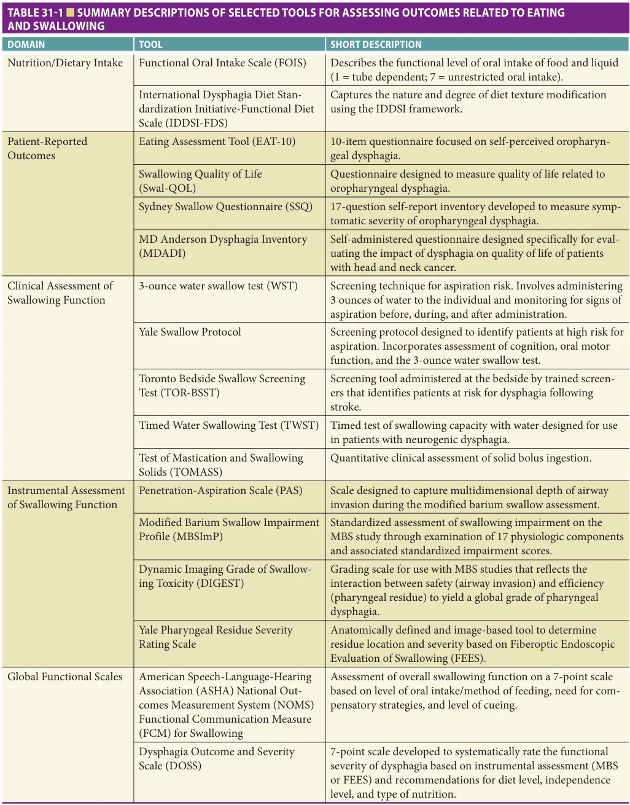

*TABLE 31-1 ■ SUMMARY DESCRIPTIONS OF SELECTED TOOLS FOR ASSESSING OUTCOMES RELATED TO EATING AND SWALLOWING*

**[p. 440]**

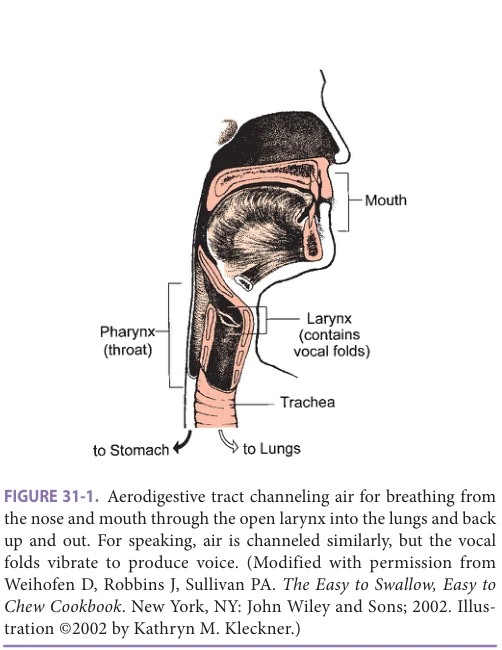

*FIGURE 31-1. Aerodigestive tract channeling air for breathing from the nose and mouth through the open larynx into the lungs and back up and out. For speaking, air is channeled similarly, but the vocal folds vibrate to produce voice. (Modified with permission from Weihofen D, Robbins J, Sullivan PA. The Easy to Swallow, Easy to Chew Cookbook. New York, NY: John Wiley and Sons; 2002. Illus- tration ©2002 by Kathryn M. Kleckner.)*

and/or flow and clearance, particularly because gravity provides no assistance until the vertical phases of swallowing.

The oral transport phase comprises movement of the cohesive bolus (masticated if necessary) posteriorly (and horizontally when the subject is in a normal upright seated posture) to the inlet of the superior aspect of the vertical subsystem, the pharynx (Figure 31-4). The intrinsic tongue muscles change the shape and position of the tongue,

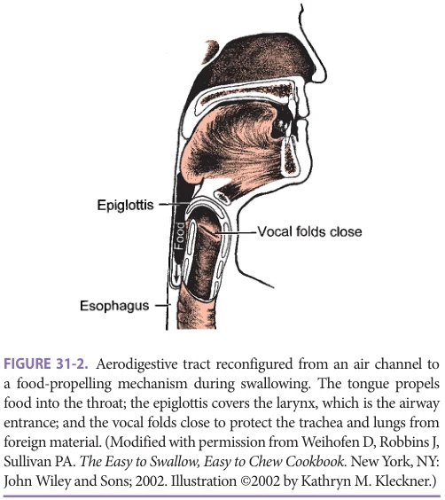

*FIGURE 31-2. Aerodigestive tract reconfigured from an air channel to a food-propelling mechanism during swallowing. The tongue propels food into the throat; the epiglottis covers the larynx, which is the airway entrance; and the vocal folds close to protect the trachea and lungs from foreign material. (Modified with permission from Weihofen D, Robbins J, Sullivan PA. The Easy to Swallow, Easy to Chew Cookbook. New York, NY: John Wiley and Sons; 2002. Illustration ©2002 by Kathryn M. Kleckner.)*

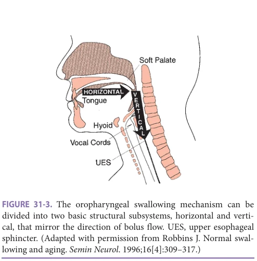

*FIGURE 31-3. The oropharyngeal swallowing mechanism can be divided into two basic structural subsystems, horizontal and verti- cal, that mirror the direction of bolus flow. UES, upper esophageal sphincter. (Adapted with permission from Robbins J. Normal swal- lowing and aging. Semin Neurol. 1996;16[4]:309–317.)*

forming grooves along its body and anterior and lateral seals to facilitate containment (Figure 31-4A), and then progressively arching the tongue posteriorly to transport the bolus to the vertical subsystem (Figures 31-4B and C).

Vertical subsystem The pharyngeal and laryngeal components, in conjunction with the tongue dorsum, comprise the superior aspect of the vertical subsystem, where gravity begins to assist in the transport of the bolus. The anatomic juxtaposition of the entrance to the airway (laryngeal vestibule) and the pharyngeal aspect of the upper digestive tract demand biomechanical precision to ensure simultaneous airway protection and bolus transfer or propulsion through the pharynx. To this end, the pharyngeal transport phase is characterized by a sequence of rapid, highly coordinated neuromuscular events that cause pressure changes critical to bolus transport or transit in a safe, timely, efficient manner.

Linguapalatal contact sequentially moves the bolus against the posterior pharyngeal wall, contributing to the positive pressures imparted to the bolus and propelling it downward. Simultaneously, the pharyngeal constrictors begin to contract in a descending sequence, first elevating and widening the entire pharynx to engulf the bolus (Figures 31-4D and E), and clean up residue after swallowing is completed. Tight closure of the velopharynx during the pharyngeal transport phase provides a seal at the superior aspect of the vertical system, preventing nasal leakage of the bolus and contributing to the generation of high positive pressures, which are applied to the bolus.

Several mechanisms ensure the redundancy by which airway protection is accomplished. Three levels of sphincteric closure include (1) the aryepiglottic folds, (2) the false vocal folds, and (3) the true vocal folds, with closure of the true vocal folds (the lowest of the three sphincters) providing “the last line of defense” to prevent aspiration of invasive material. The hyolaryngeal complex is lifted upward and forward by the combined contraction of the suprahyoid muscles, thyrohyoid muscles, and pharyngeal elevators.

**[p. 441]**

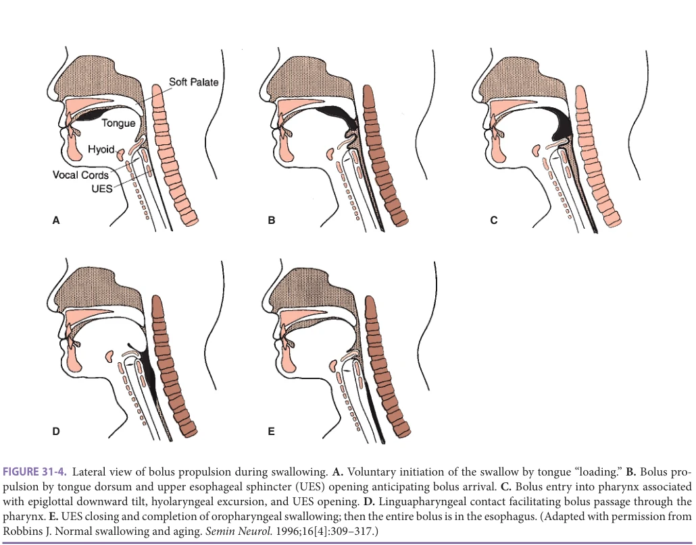

*FIGURE 31-4. Lateral view of bolus propulsion during swallowing. A. Voluntary initiation of the swallow by tongue “loading.” B. Bolus pro- pulsion by tongue dorsum and upper esophageal sphincter (UES) opening anticipating bolus arrival. C. Bolus entry into pharynx associated with epiglottal downward tilt, hyolaryngeal excursion, and UES opening. D. Linguapharyngeal contact facilitating bolus passage through the pharynx. E. UES closing and completion of oropharyngeal swallowing; then the entire bolus is in the esophagus. (Adapted with permission from Robbins J. Normal swallowing and aging. Semin Neurol. 1996;16[4]:309–317.)*

This hyolaryngeal elevation and anterior movement, coupled with retraction of the tongue base, covers the laryngeal vestibule and diverts the bolus laterally around the airway. Timely relaxation and opening of the upper esophageal sphincter (UES) permits continuous vertical passage of the bolus into the esophagus. The UES functions as a mechanical valve. For it to open normally, four criteria must be met: (1) relaxation of muscle tone, (2) compliant tissue, (3) traction force provided by sufficient hyolaryngeal excursion, and (4) pulsion force imparted by the bolus. In normal swallowing, UES relaxation and opening occur prior to bolus arrival at the hypopharynx.

Neurophysiology of Oropharyngeal Swallowing Historically, swallowing was largely viewed as a sequence of pharyngeal and esophageal events and was defined as reflexive. However, it is now clear that normal swallowing is a patterned response rather than a traditional reflex.

Sensorimotor control of swallowing requires the coordinated activity to be distributed across both the cranial and spinal nerve systems, including the peripheral nerves, their central nuclei, and their neural centers, as summarized in Table 31-2. This neural network spans all levels of the neuraxis from the cerebrum superiorly to the brain stem and spinal nerves inferiorly and muscles and

end organs at the periphery. This relatively diffuse network is designed to integrate and sequence both the volitional and automatic actions of swallowing.

Healthy persons depend on a highly automated neuromuscular sensorimotor process that intricately coordinates the activities of chewing, swallowing, and airway protection. To accomplish a normal swallow, which occurs

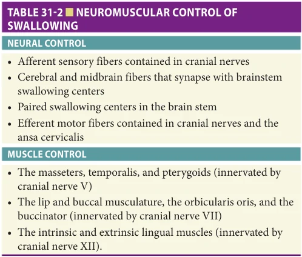

*TABLE 31-2 ■ NEUROMUSCULAR CONTROL OF SWALLOWING*

**[p. 442]**

in 2 seconds or less, the muscles of chewing interact with 26 pairs of striated pharyngeal and laryngeal muscles (see Table 31-2). Optimal structural integrity and precise neural mediation result in continuous, rapid bolus flow from the mouth to the esophagus (Figures 31-5A, B, and C) that

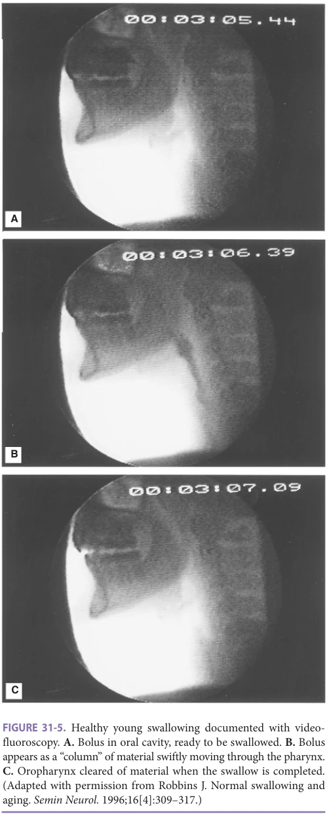

*FIGURE 31-5. Healthy young swallowing documented with video- fluoroscopy. A. Bolus in oral cavity, ready to be swallowed. B. Bolus appears as a “column” of material swiftly moving through the pharynx. C. Oropharynx cleared of material when the swallow is completed. (Adapted with permission from Robbins J. Normal swallowing and aging. Semin Neurol. 1996;16[4]:309–317.)*

accommodates variations in bolus size, texture, and temperature and the individual’s intent to swallow, chew, or just hold the bolus in the mouth.

## SENESCENT SWALLOWING

Traditional thinking suggests that the causes of dysphagia are always disease-related, with direct or indirect damage to effector end-organ systems of swallowing. However, the swallowing changes with healthy aging, progressive changes of the anatomy, and physiology of the oropharyngeal swallowing mechanism put the older population at increased risk for dysphagia (Figure 31-6). Dysphagia occurs when an older healthy adult with diminished functional reserve is faced with increased stressors that elicit dysphagia only in a vulnerable individual. Such stressors include central nervous system (CNS)-altering medications, mechanical perturbations (eg, a nasogastric [NG] tube or a tracheostomy), or medical conditions (eg, frailty).

Age-Associated Changes in Swallowing The swallow of an older healthy adult is relatively slow. In people older than 65, the initiation of laryngeal and pharyngeal events, including laryngeal vestibule closure, maximal hyolaryngeal excursion, and upper UES opening, takes longer than in adults younger than 45. Although the specific neural underpinnings have not been confirmed, oral events may become uncoupled from the pharyngeal response. Thus, in older healthy adults, the bolus may remain adjacent to an open airway by pooling or pocketing in the pharyngeal recesses longer than in younger adults (Figure 31-7).

Aspiration and airway penetration are the most significant adverse clinical outcomes of misdirected bolus flow, as reflected in the high rates of pneumonia with increasing age and disease. While airway invasion is generally believed to be absent in healthy adults, under demanding conditions (eg, endurance = demanding), older individuals are less able to compensate and are more at risk for aspiration than younger people. Findings such as these differentiate presbyphagia from clinically abnormal swallowing.

Age-related changes in the generation of lingual pressure also define presbyphagia. Healthy older individuals have reduced isometric tongue pressures compared with younger individuals. In contrast, the generation of maximal lingual pressure during swallowing (which requires submaximal pressures) remains “young” in magnitude but slows in the time necessary to achieve those “young” swallowing pressures. The relationship between maximum isometric pressure and peak swallowing pressures can be considered an indication of the functional reserve available for swallowing. As people get older, slower swallowing may allow time to recruit the necessary number of motor units required for pressures critical for adequate bolus propulsion through the oropharynx. However, fluids

**[p. 443]**

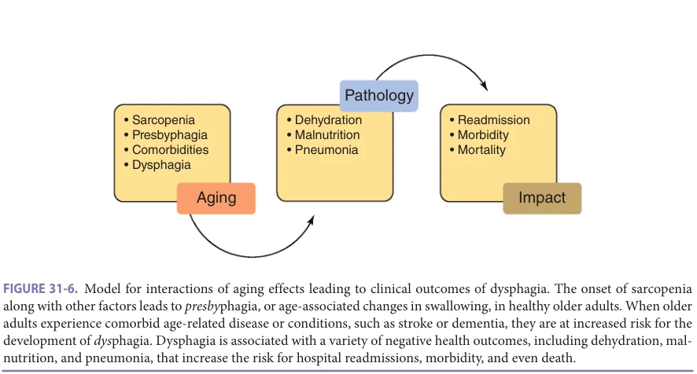

*FIGURE 31-6. Model for interactions of aging effects leading to clinical outcomes of dysphagia. The onset of sarcopenia along with other factors leads to presbyphagia, or age-associated changes in swallowing, in healthy older adults. When older adults experience comorbid age-related disease or conditions, such as stroke or dementia, they are at increased risk for the development of dysphagia. Dysphagia is associated with a variety of negative health outcomes, including dehydration, mal- nutrition, and pneumonia, that increase the risk for hospital readmissions, morbidity, and even death.*

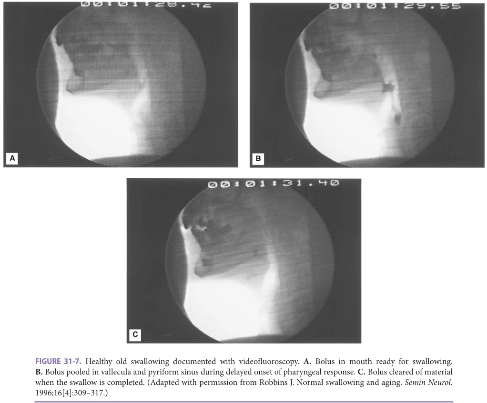

*FIGURE 31-7. Healthy old swallowing documented with videofluoroscopy. A. Bolus in mouth ready for swallowing. B. Bolus pooled in vallecula and pyriform sinus during delayed onset of pharyngeal response. C. Bolus cleared of material when the swallow is completed. (Adapted with permission from Robbins J. Normal swallowing and aging. Semin Neurol. 1996;16[4]:309–317.)*

**[p. 444]**

of low viscosity (eg, water, tea), by their composition, are likely to move more quickly than the physiology to handle them safely and thus put older people at increased risk for aspiration.

Neurophysiologic Correlates of Senescent Swallowing The relationship between slower swallowing and increased number and severity of periventricular white-matter hyperintensities (PVHs) in the brain suggests that voluntary control of swallowing is mediated by corticobulbar pathways traveling within the periventricular white matter. These PVHs may explain, at least in part, the relatively asymptomatic decline in oropharyngeal motor performance observed in older people. Cerebral atrophy, a common finding in asymptomatic older individuals, may be another contributing factor to presbyphagia.

Changes in the periphery with age may be a function of changes in various sensory mechanisms or caused by muscle atrophy. Similar to the age-related loss of limb skeletal muscle, there are changes with age in muscle composition, muscle tension, muscle strength, and muscle contraction in facial, masticatory, and lingual musculature. Rather than reflecting CNS deterioration, slowed swallowing that remains coordinated and effective, as found in most healthy old people, may represent a compensatory strategy for achieving pressure-generation values that may be critical to successful bolus propulsion.

## DIFFERENTIAL CONSIDERATIONS FOR DYSPHAGIA AND ASPIRATION

Etiologies Older adults are at increased risk for developing dysphagia because of a number of age-associated phenomena, comorbid conditions, and medications. By targeting highrisk groups and intervening with acceptable compensatory and rehabilitative approaches, it is hoped that the ultimate burden of dysphagia on the geriatric population will decline.

As illustrated in Figure 31-6, decreased physiologic reserve can combine with a number of age-related, disease-related, or iatrogenic changes to transform an at-risk individual into an older adult with dysphagia. Sarcopenia, described in detail in Chapter 49, affects the head and neck musculature involved in swallowing. In fact, anterior and posterior isometric tongue pressure positively correlates with hand grip strength and with jump height and power. Furthermore, sarcopenia and worsening frailty status predict dysphagia prevalence in older adults.

Several anatomic or pathologic perturbations occurring throughout the orobuccal cavity, the laryngopharyngeal region, and the esophagus are also important cofactors in the onset of dysphagia. Additionally, age-related alterations

in the neural coupling between respiration and swallowing result in more frequent occurrences of swallowing during the inspiratory phase in older adults. When the inspiratory phase is interrupted for swallowing rather than the expiratory phase, there is an increased risk for entry of material into the airway once inhalation is resumed.

Age-related conditions Age-related changes throughout the upper aerodigestive tract can influence swallowing integrity. Oral risks are also discussed in Chapter 32. During the oral phase, the food bolus may be inadequately prepared because of poor or absent dentition, periodontal disease, ill-fitting dentures, or inappropriate salivation caused by xerostomia. Salivary flow rate declines with advancing age and is exacerbated by xerostomia-inducing medications often prescribed to older adults. Certain organic components within whole saliva, including secretory immunoglobulin A and mucoglycoproteins, also are reduced in older adults thereby altering the compositional makeup of saliva and affecting oral health. This decline in mucous properties can change the viscoelastic properties of saliva that may be important for bolus formation.

Musculoskeletal factors such as weakness of the muscles of mastication, arthritis of the temporomandibular joint or larynx, osteoporosis of the jaw, or changes in tongue strength and coordination of the oropharyngeal events can deter efficient swallowing. Sensory input for taste, temperature, and tactile sensation changes in many older adults. This disruption of sensory-cortical-motor feedback loops may interfere with proper bolus formation and timely response of the swallowing motoric sequence and detract from the pleasure of eating.

Material can penetrate into the upper airway in normal individuals if the bolus is not properly prepared, if the timing of the swallow is delayed, or if the intake is too rapid. Important risk factors for aspiration include altered level of attention during feeding (eg, delirium), altered sensory discrimination in the oropharynx, feeding problems, mechanical ventilation, and feeding tube placement. In the latter circumstance, the rate of tube feeding, the position of the patient, altered intestinal transit times, and the ability of the patient to protect their airway all influence the occurrence of reflux and aspiration and are discussed in detail in Chapter 30. There are subtle changes in lower esophageal sphincter (LES) function even in asymptomatic older individuals. Gastroesophageal reflux caused by LES incompetence as well as intraesophageal reflux (defined as material moving proximally within the esophagus prior to crossing the LES) also predispose individuals to micro- or macroaspiration.

Age-related disease Neurologic and neuromuscular disorders are principal risks for dysphagia (Table 31-3). Stroke, brain injury, Alzheimer disease, other dementia syndromes, and parkinsonism all place older adults at increased risk for dysphagia with its incipient consequences.

**[p. 445]**

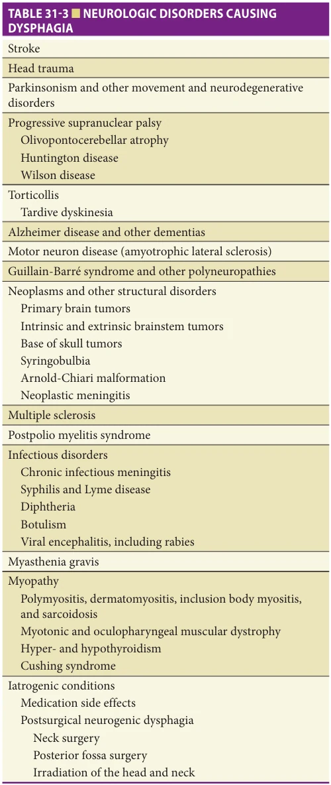

*TABLE 31-3 ■ NEUROLOGIC DISORDERS CAUSING DYSPHAGIA*

Because cognitive function and/or communication may be impaired, it is important for the practitioner to note the warning signs associated with dysphagia and risk of aspiration (Table 31-4). The entire eating process, which includes self-feeding (transferring food from the table to the mouth) in addition to swallowing, is affected in patients

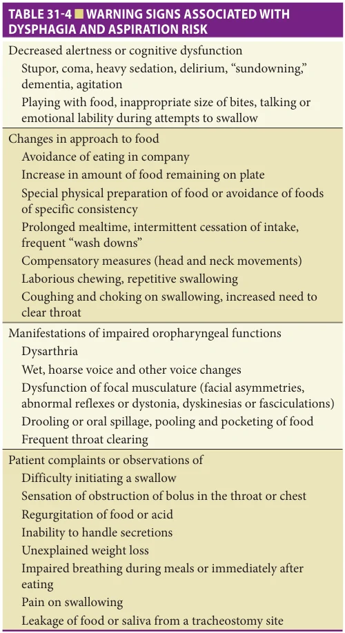

*TABLE 31-4 ■ WARNING SIGNS ASSOCIATED WITH DYSPHAGIA AND ASPIRATION RISK*

with dementia. The inability to eat safely is one of the most life-threatening impairments for these patients frequently leading to pneumonia onset. Between 50% and 75% of patients who have had a recent acute stroke develop eating and swallowing problems, with ensuing complications of malnutrition and pneumonia. Brainstem or bilateral hemispheric strokes predictably produce dysphagia, but unilateral lesions also can contribute to dysphagia.

A host of common problems involving the head and neck can directly damage the effector muscles of swallowing and increase the risk for dysphagia. Head and neck injury, carcinoma, complex infections, thyroid conditions, and diabetes are associated with age-related dysphagia. Although vertebral osteophytes are common, these bony growths alone rarely cause dysphagia. Dysphagia more commonly results from the presence of osteophytes in conjunction with neuromuscular weakness or discoordination.

**[p. 446]**

This can be caused by combinations of several underlying conditions or comorbidities such as diabetes, chronic obstructive pulmonary disease, congestive heart failure, renal failure, an immunocompromised status, and/or cachexia for which an individual no longer can sustain adequate reserve to effectively compensate.

Sometimes dysphagia can be a direct consequence of a treatment provided for another disease process. Health care interventions can result in drug-induced delirium, protracted hospital stays, and ultimately malnutrition. Indwelling NG tubes, prolonged airway intubation resulting in laryngeal injury, and medication effects may all predispose a frail older adult with borderline airway protection to develop frank aspiration.

Older adults are much more likely to be taking medications for multiple medical conditions. These medications can influence salivary flow, intestinal peristalsis, cognition, or psychomotor status, thereby interfering with normal oropharyngoesophageal function or altering airway protection. More than 2000 drugs can cause xerostomia or reduced salivary flow via anticholinergic mechanisms. The list is extensive and can include common antidepressants, antihistamines, antipsychotics, and antihypertensive agents. Likewise, delirium-promoting drugs can produce adverse consequences through either anticholinergic or other central mind-altering effects. Certain agents can directly relax the LES and increase acid reflux and esophageal problems. Finally several psychotropic drugs can produce delayed neuromuscular responses or extrapyramidal effects, thereby influencing the tongue and bulbar musculature. Table 31-5 provides a partial list of these agents and how they can contribute to dysphagia.

An altered level of attention and cognition may also produce special concerns with regard to safe eating and swallowing. Delirium is frequently underrecognized and undertreated in both hospital and institutional settings. In general, testing an inattentive adult for dysphagia results in the poorest evaluation. If swallowing is assessed during one of these episodes, aspiration is likely to occur. If a staff member at a hospital or nursing home feeds a patient during one of these intervals, the outcome may be disastrous.

Several different treatments can either directly or indirectly damage swallowing effector organs as described previously. Head and neck cancer surgeries, some spinal cord surgeries, thyroid surgeries, and any intervention that can jeopardize the recurrent laryngeal nerve may result in dysphagia. A number of chemotherapy and radiotherapy regimes can cause oropharyngeal injury. The prospective outcome of dysphagia should be incorporated into the risk-benefit discussions of these procedures.

Symptoms Medical history plays a critical role in establishing a diagnosis of dysphagia (Table 31-6). A detailed history can elucidate the proper diagnosis in some dysphagic adults and is

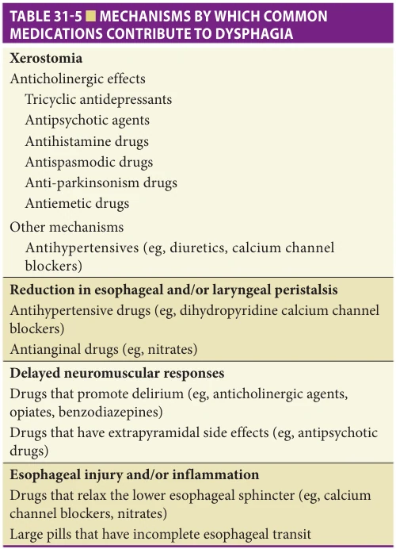

*TABLE 31-5 ■ MECHANISMS BY WHICH COMMON MEDICATIONS CONTRIBUTE TO DYSPHAGIA*

an important first step in the evaluation process. Dysphagia may present in a more subtle fashion, without symptoms, but with recurring exacerbations of an underlying disease such as chronic obstructive pulmonary disease.

Patients may initially complain of difficulty swallowing liquids, solid food, or pills. Caregivers or nursing personnel may note such difficulties experienced by the patient including “pocketing” of pills within the oral cavity. The patient may report more effort needed while eating. The patient or the patient’s observant family members may complain of the increased time needed to complete a meal. The patient or the practitioner may identify weight loss without any other localizing explanation. However, clinicians must distinguish these dysphagia or aspiration symptoms from a myriad of other common health problems that may mimic dysphagia in older adults. For example, in frail individuals, depression or early Parkinsonism may be manifested solely by weight loss and slowed eating. Without a complete history, these patients may be sent for a dysphagia work-up before an attempt is made to manage their “root problem.”

Symptoms of esophageal dysphagia include food “hanging up” behind the sternum, neck pain, chest pain, and heartburn. A specific problem with solid food dysphagia suggests a mechanical obstruction. If the symptoms are intermittent, a lower esophageal ring may be present. If the symptoms are progressive, a peptic stricture or carcinoma

**[p. 447]**

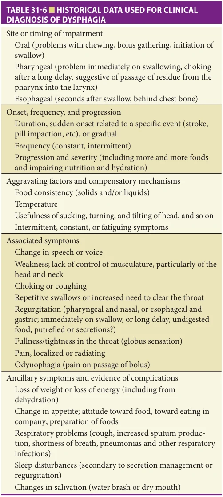

*TABLE 31-6 ■ HISTORICAL DATA USED FOR CLINICAL DIAGNOSIS OF DYSPHAGIA*

is more likely. If there are difficulties in ingesting solids and liquids, a neuromuscular or dysmotility etiology must be considered.

## SCREENING ACROSS A CONTINUUM OF CARE SETTINGS

Dysphagia evaluation varies depending on the clinical setting. The comprehensive diagnostic approaches available for hospitalized older patients with dysphagia may not be

logistically feasible for bedbound nursing home residents. Likewise, interdisciplinary dysphagia teams are frequently available in academic settings or in larger hospital systems and less common in other settings. When such a team is not available, the responsibility for screening for swallowing problems falls on the primary provider or the hospital staff. Speech language pathologists, who are usually the swallowing therapists, are well trained to conduct bedside (also referred to as noninstrumental) examinations that include history taking, oral motor assessment, voice evaluation, and assessment of trial swallows. Prior to this referral though, clinicians can provide a focused secondary screening during their encounter with the patient. A number of attempts have been made to identify a simple screening tool for use in ambulatory clinics or at the patient’s bedside. A systematic review focused on dysphagia screening techniques for inpatients 65 years or older without stroke or Parkinson disease concluded that existing evidence is not sufficient to recommend the use of bedside tests in a general older population. While none of these approaches has proven altogether effective, certain approaches warrant mention (see Table 31-1 for an overview of selected available tools). However, along with the risk of false negatives, bedside screening provides no information about the underlying pathophysiology of the swallow or for selecting specific interventions.

Despite these issues, owing to the high prevalence of swallowing difficulties in geriatric patients, some mechanism of primary screening needs to take place within a primary care clinic setting. Several validated screening tools are listed in Table 31-1. Because swallowing is not something a patient usually mentions, it may be necessary to ask related questions until a particular word or phrase triggers an association with the patient’s experience (eg, swallowing, chewing, moving food to the throat, coughing, choking). Nonetheless, once dysphagia is suspected, a more complete assessment is necessary not only to validate its presence but also to define and construct a treatment plan that modifies the underlying sensorimotor pathophysiology.

## TEAM APPROACH TO DYSPHAGIA

An interdisciplinary team approach offers the stated advantage of a more efficient comprehensive assessment with shared responsibility for interventions and often makes timely consultation possible. The responsibilities of team members are often divided among disciplines and can include reviewing health issues, obtaining pertinent swallowing history, and an examination (which may include instrumental studies), providing education and counseling to the patient and to the family or the care provider, conducting psychosocial screening, and reviewing advance directives. Core teams frequently include a speech language pathologist, a dietitian, a social worker, and either a physician or a nurse practitioner.

**[p. 448]**

Focused Assessment of Swallowing A major function of the swallowing team is to perform a thorough assessment of the swallowing mechanism and its function. Most commonly, the speech language pathologist plays a major role, performing a two-part examination consisting first of a clinical (bedside) noninstrumental evaluation often followed by an instrumental assessment of swallowing.

Noninstrumental Swallowing Assessment The clinical evaluation is noninstrumental and although often referred to as a “bedside” procedure can be performed in a variety of environmental settings including an outpatient office. It usually involves four types of assessment: (1) history taking; (2) speech and voice assessment; (3) oropharyngeal sensorimotor assessment; and (4) performance on trial swallows. The specific methods and measures preferred and most frequently used by clinicians when working with dysphagia of neurogenic origin, which is frequently the case in older patients, are shown in Table 31-7.

Although a noninstrumental assessment provides a breadth of information, it can only increase the suspicion of aspiration through findings such as increased secretions or a wet and/or gurgly voice quality. Given the possibility of silent aspiration as a result of decreased cognition or diminished sensation in older people, coughing and throat clearing, which are the characteristic signs of aspiration, may be absent. To rule out aspiration with an acceptable level of confidence, an instrumental assessment is often necessary. Moreover, effective dysphagia intervention relies on an accurate diagnosis of the specific pathophysiology. That is, the underlying movement disorder that results in disordered bolus flow in terms of direction, duration, and clearance, must be defined and remediated in order to eliminate or minimize the dysphagia. Most frequently, instrumental methods are necessary to clarify the aspects of the swallowing sequence that must be modified to effect safe and efficient bolus flow. Although clinicians must pursue a complete oropharyngeal and esophageal assessment of many dysphagic patients, this section focuses on oropharyngeal dysphagia, and the reader is referred to Chapter 85 for a discussion of esophageal disorder.

## Instrumental Examination

Oropharyngeal videofluoroscopic swallowing evaluation An oropharyngeal videofluoroscopic swallowing evaluation, or Modified Barium Swallow (MBS) study, is most commonly used to assess the integrity of the oropharyngeal anatomy, swallowing physiology, and bolus flow. Structural abnormalities and mucosal lesions are identified by the barium that is swallowed and used to outline the soft tissue structures it passes. Perhaps the two greatest strengths of the videofluoroscopic swallow evaluation are that the swallow is recorded in motion and preserved digitally or on videotape for replay. This method permits viewing of the dynamic swallow. All oropharyngeal

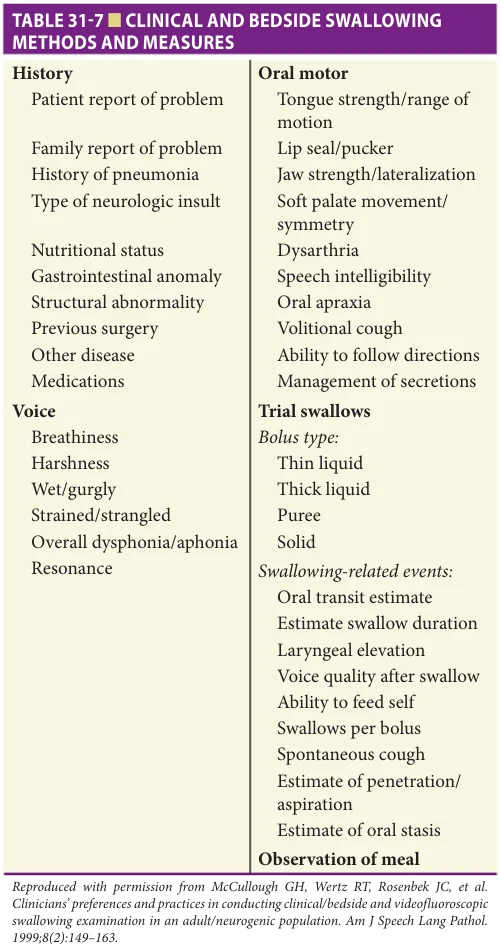

*TABLE 31-7 ■ CLINICAL AND BEDSIDE SWALLOWING METHODS AND MEASURES*

structures can be examined with regard to their contribution to the coordinated (or uncoordinated) swallow in terms of timing and range of motion. Their impact on bolus flow is made apparent. Therefore, the specific pathophysiology and its impact on bolus flow are clarified and can be targeted for treatment.

An oropharyngeal videofluoroscopic swallow study is not designed simply to determine if a patient is aspirating or even why a patient is aspirating or retaining residue. It is designed also to assist a clinician in determining if a patient can safely receive oral nourishment and allows for trials of proposed interventions to maximize efficacy and safety. During the study, the clinician often varies bolus characteristics sufficiently to be able to offer a diet recommendation (such as thickened liquid or semisolid). Additional recommendations may be simple postural adjustments,

**[p. 449]**

such as tucking the chin, which are shown under fluoroscopy to improve direction or efficiency of bolus flow.

Although videofluoroscopy is the instrumental method most commonly used to assess swallowing, it is limited in the following ways:

1. The amount of information obtained is restricted to a few minutes in an effort to limit radiation exposure. 2. The environment can be distracting for patients with cognitive deficits. 3. The material ingested is barium, not food, and may not simulate the swallow evoked when real food is used as a stimulus (taste, smell).

Despite these limitations and exposure to a small amount of radiation (equivalent to 2 years of natural background radiation or a set of dental x-rays), videofluoroscopy is preferred for the breadth of information it provides with regard to anatomy, physiology, bolus flow, and assessment of trial intervention.

In addition, a fluoroscopic examination can easily be extended to the esophagus when indicated. Merging of the videofluoroscopic swallow study directly into esophagraphy, which results in a distinct third test referred to as an oropharyngeal esophagram, may reveal anatomic or physiologic findings for the referred sensation. Findings may include a Schatzki ring, an esophagus-narrowing web or stricture, a delay in LES opening or esophageal stasis, or other esophageal etiologies for the dysphagia. Thus, an oropharyngeal esophagram permits a more organized, efficient, cost-effective process for professional personnel and for the patient. Most importantly, it optimizes the potential for comprehensive findings and facilitates immediate intervention.

Fiberoptic endoscopic evaluation of swallowing Fiberoptic endoscopic evaluation of swallowing (FEES) is second to videofluoroscopy in frequency of instrumental approaches used with older patients. It combines the traditional endoscopic examination, in which the flexible scope allows direct visualization of the nasal cavity, the entire nasopharynx, the oropharynx, the larynx, and the hypopharynx, with dynamic recording of swallowing. Although FEES permits only limited observation of the pharyngeal swallow because it is “whited out” or visually obliterated during swallowing caused by constriction of the anatomy, the method provides a valuable alternative to a noninstrumental clinical assessment. It is being used with increased frequency in long-term care facilities where videofluoroscopy is unavailable and also with bariatric patients or those who cannot be moved to radiology because of medical instability. Other advantages are its repeatability, the use of real food and fluid during the assessment, and its potential as a biofeedback tool.

In addition to limited visualization of the dynamic oropharyngeal swallow, the limitations of FEES involve risks related to endoscopy, which include nosebleed, mucosal

injury, gagging, allergic reaction to the topical anesthesia, laryngospasm, and vasovagal response. The unlikely possibility of encountering an adverse reaction during a flexible endoscope examination must be balanced against the daily risks faced by patients with dysphagia.

## DYSPHAGIA INTERVENTION

Adherence to dysphagia-related recommendations, whether thickened liquids or an exercise regimen, is known to be problematic. Reasons include not aligning therapy with the patient’s goals, poor insight into the extent of swallowing-related deficits, a lack of understanding regarding the importance of treatment for dysphagia, and inadequate patient education on the part of the clinician. A variety of patient-reported outcome measures, including the SWALQOL, Eating Assessment Tool (EAT-10), Sydney Swallow Questionnaire (SSQ), and the MD Anderson Dysphagia Inventory, allow clinicians to gauge the patient’s perspective of his or her swallowing impairment in order to tailor treatment to the needs of the patient, thereby supporting improved adherence.

Treatment for dysphagia is usually compensatory, rehabilitative, or a combination of the two approaches. Compensatory interventions avoid or reduce the effects of impaired structures or neuropathology and resultant disordered physiology and biomechanics on bolus flow. Rehabilitative interventions have the capacity to directly improve dysphagia at the biological level. That is, the targets of therapy are aspects of anatomic structures (eg, muscle) or neural circuitry that may have a direct influence on physiology, biomechanics, and bolus flow.

Compensatory Dysphagia Interventions Traditionally, interventions for dysphagia in older patients are compensatory in nature and are directed at modifying bolus flow by targeting neuromuscularly induced pathobiomechanics or by adapting the environment.

Postural adjustments Postural adjustments are relatively simple to teach to a patient, require little effort to employ, and can eliminate misdirection of bolus flow through biomechanical adjustment. A general postural rule for facilitating safe swallowing is to eat in an upright posture so that the vertical phase of the oropharyngeal swallow capitalizes on gravitational forces at work. For patients with hemiparesis, a common strategy is a head turn toward the hemiparetic side, effectively closing off that side to bolus entry and facilitating bolus transit through the nonparetic pharyngeal channel. If the pathophysiologic condition is the uncoupling of the oral from the pharyngeal phase of the swallow, a simple chin tuck (45 degrees) reduces the speed of bolus passage, thereby giving the neural system time to initiate the pharyngeal and airway protection events prior to bolus entry.

Food and liquid rate and amounts Although we live in a “fast food” society, older individuals and especially those with

**[p. 450]**

dysphagia take longer to eat. Eating an adequate amount of food becomes a challenge not only because of the increased time required to do so but also because fatigue frequently becomes an issue. Typically, smaller amounts per swallow are less likely to enter or block the airway, but in individuals who experience a sensory loss in the mouth or throat, larger amounts of food or liquid may be necessary to trigger a swallow. To promote a safe, efficient swallow in most individuals with swallowing and chewing difficulties, the following recommendations are useful:

• Eat slowly and allow enough time for a meal. • Do not eat or drink when rushed or tired. • Take small amounts of food or liquid into the mouth— use a teaspoon rather than a tablespoon. • Concentrate on swallowing—eliminate distractions like television. • Avoid mixing solid food and liquid in the same mouthful. • Place the food on the stronger side of the mouth if there is unilateral weakness. • Alternate between liquids and solids. • Use sauces, condiments, and gravies to facilitate cohesive bolus formation and prevent pocketing or small food particles from entering the airway.

Adaptive equipment Eating and drinking aids can assist in placing, directing, and controlling the bolus of food or liquid and in maintaining proper head posture while eating. For example, modified cups with cutout rims (placed over the bridge of the nose) or straws prevent a backward head tilt when drinking to the bottom of a cup. A backward head tilt, which results in neck extension, should be avoided in most cases because when the head is tilted back, food and liquid are more likely to be misdirected into the airway. A speech pathologist or swallowing clinician can make suggestions regarding appropriate aids for optimizing swallowing safety and satisfaction. Occupational therapists are experts in the area of adaptive equipment and can be helpful in obtaining products that are often available only commercially.

Diet modification The most common compensatory intervention is diet modification, a totally passive environmental adaptation. Withholding thin liquids such as water, tea, or coffee, which are most easily aspirated by older adults, and restricting liquid intake to thickened liquids is almost routine in nursing homes in an attempt to minimize or eliminate thin-liquid aspiration, presumably the precedent to the long-term related outcome, which is pneumonia. Despite the huge impact these seemingly unappealing practices may have on patient QOL, they have been commonly implemented in the absence of efficacy data.

Both chin-down posture and thickened liquids (nectar and honey viscosity) have been shown to be effective

for patients with Parkinson disease and/or dementia. In the short term, aspiration is reduced with honey-thick liquids as compared with both nectar-thick and chin-down posture interventions. Both chin-down posture and thickened liquids were equally effective in pneumonia prevention over 3 months.

Additional diet modifications include a pureed diet and a soft food diet in which the bolus maintains itself in a cohesive mass during transit but has more texture than the pureed diet. The use of sauces and gravies to minimize the formation of dry particles that may easily be misdirected into the airway is a common practice. Other strategies are also available, so the dietitian should work closely with the team to ensure that the safest diet is provided and that it is effective in maintaining adequate nutrition and hydration, while also acceptable to patients in order to enhance compliance.

Free water protocols Approaches have been developed to encourage intake of water to avoid dehydration in those patients with dysphagia who require thickened liquids. These “free water” protocols involve intensive oral care followed by ingestion of thin liquids between meals but thickened liquids during meals. While initial studies have shown no increased risk for lung complications in patients following these protocols, the findings are limited by small sample sizes and strict exclusion criteria that focus only on patients who are ambulatory, acute rehabilitation inpatients, and cognitively intact. More research is needed to examine the safety and outcomes of these protocols in various older adult populations prior to clinical implementation. Rehabilitative Dysphagia Interventions Rehabilitative exercises are, by nature, more active and rigorous. Often a rehabilitative approach to dysphagia intervention is withheld from older patients because such a demanding activity is assumed to deplete any limited remaining swallowing reserve, thus potentially exacerbating dysphagia symptoms. Sufficient treatment efficacy data are unavailable, and so assumption-based patterns of practice prevail.

Given that progressive resistance training appears to be safe and effective for limb musculature in older adults, such training has been systematically applied to the muscles of swallowing. Several exercise regimens with efficacy data have been utilized with older adult populations including systematic tongue strengthening over 8 weeks, expiratory muscle strength training over 5 weeks, and a simple isotonic/isometric neck exercise (lying flat on back while lifting head with shoulders flat) over 6 weeks. Additionally, preventative approaches that incorporate swallowing-related exercise regimens have begun to be implemented with older adults with the goal of minimizing the effects of presbyphagia and increasing swallowing functional reserve.

**[p. 451]**

## OPTIMIZING SWALLOWING AND RELATED HEALTH THROUGH PREVENTION

Medications Minimizing medications that may put a patient at risk for dysphagia is an important goal. Furthermore, pills are often described by patients as being difficult to swallow. Patients should be informed about medications that can be crushed, can be mixed with foods, or are available in liquid form. Pill-induced damage to the esophagus can occur if pills are taken when lying down or with inadequate amounts of liquid.

Oral Hygiene Poor oral hygiene is a risk factor for pneumonia, and aspiration of saliva, whether or not it is combined with food or fluid, can increase the likelihood of infection. The risk for periodontal disease as well as dental caries increases with age. Therefore, patients should be encouraged to perform oral hygiene several times a day and undergo periodic dental examinations. Furthermore, products to relieve oral dryness in the form of saliva substitutes, as well as alcoholfree mouth care products, can be recommended.

TuBe or Not TuBe—Oral Versus Nonoral Intake Oropharyngeal dysphagia is potentially life threatening. In the older population, critical decisions often must be made that impact on the patient’s safety, health, and QOL. Among these perplexing issues is the question of continuing oral intake or providing nonoral enteral or parenteral nutrition. This dilemma is also reviewed in Chapter 30.

Enteral nutrition, the delivery of nutritive products to the digestive system through nonoral means, is often selected for the temporary prevention of aspiration in acutely ill patients. It also is chosen for permanent replacement in patients whose disease process results in confirmed or suspected swallowing-related aspiration or malnutrition and dehydration. In the case of longer-term or permanent nutritive supplementation, the clinician’s impressions often direct decisions relating to tube feeding for weeks, months,

## FURTHER READING

American Geriatrics Society Ethics Committee and Clini-

cal Practice and Models of Care Committee. American Geriatrics Society feeding tubes in advanced dementia position statement. J Am Geriatr Soc (JAGS). 2014;62(8): 1590–1593. Barczi SR, Sullivan P, Robbins J. How should dysphagia care

of older adults differ? Establishing optimal practice patterns. Semin Speech Lang. 2000;21(4):347–361. Buehring B, Hind J, Fidler E, Krueger D, Binkley N, Robbins J.

Tongue strength is associated with jumping mechanography performance and handgrip strength but not with

or even years in older patients whose chronic disease processes are overlaid on reduced functional reserve for safe, sufficient swallowing. However, it would clearly be narrow and short-sighted to make decisions with such an impact solely on the basis of empirical swallowing abilities or even instrumental physiologic and bolus flow test results. For an issue that may be a critical source of a patient’s sense of autonomy, self-respect, dignity, and QOL, swallowing ability is merely one factor in a decision-making formula. It is also important to consider that feeding tubes are associated with their own risks and poor long-term outcomes. NG tubes can result in agitation, nasal irritation, and sinus infection while gastrostomy tubes may lead to cellulitis, fasciitis, and bacteremia. Both types of feeding tubes increase the risk of diarrhea as well as pressure ulcers with slower healing of existing sores. There is currently no evidence to support that feeding tubes prolong survival in patients with dementia and dysphagia or that early placement improves recovery of function or length of stay in patients with poststroke dysphagia. In fact, the Ethics and Clinical Practice Committees of the American Geriatrics Society published a comprehensive review of the evidence about feeding tubes and dementia in 2014 and issued position statements that suggest placement of feeding tubes in patients with dementia should be seriously reconsidered. Other approaches, such as hand feeding, are preferred for this population.

In summary, while oropharyngeal dysphagia may be life threatening, so are the alternatives, particularly for frail older patients. Therefore, contributions by all team members are valuable in this challenging decision-making process. The patient’s family or care provider’s point of view is also critical but second, of course, to that of the competent patient, himself. The state of the evidence calls for more research, including randomized controlled trials (RCTs) in this area. Until then, the many behavioral, dietary, and environmental modifications described in this chapter and being further refined are compassionate and, in many cases, preferred alternatives to the always present option of tube feeding.

classic functional tests in older adults. J Am Geriatr Soc. 2013;61(3):418–422. Cabre M, Serra-Prat M, Force L, Almirall J, Palomera E,

Clave P. Oropharyngeal dysphagia is a risk factor for readmission for pneumonia in the very elderly persons: observational prospective study. J Gerontol A Biol Sci Med Sci. 2014;69(3):330–337. Christmas C, Rogus-Pulia N. Swallowing disorders in the older

population. J Am Geriatr Soc. 2019;67(12):2643–2649. Gillman A, Winkler R, Taylor NF. Implementing the Free

Water Protocol does not result in aspiration pneumonia

**[p. 452]**

in carefully selected patients with dysphagia: a systematic review. Dysphagia. 2017;32(3):345–361. Huckabee ML, McIntosh T, Fuller L, et al. The Test of Mas-

ticating and Swallowing Solids (TOMASS): reliability, validity, and international normative data. Int J Lang Commun Disord. 2018;53(1):144–156. Jardine M, Miles A, Allen JE. Swallowing function in

advanced age. Curr Opin Otolaryngol Head Neck Surg. 2018;26(6):367–374. Logemann J, Gensler G, Robbins J, et al. A randomized

study of three interventions for aspiration of thin liquids in patients with dementia or Parkinson’s disease. J Speech Lang Hear Res. 2008;51:173–183. Malandraki GA, Johnson S, Robbins, J. Functional MRI of

swallowing: from neurophysiology to neuroplasticity. Head Neck. 2011;33 Suppl 1(0 1):S14–S20. Malandraki GA, Perlman AL, Karampinos DC, et al.

Reduced somatosensory activations in swallowing with age. Hum Brain Mapp. 2011;32(5):730–743. Martin-Harris B, Brodsky MB, Michel Y, et al. MBS mea-

surement tool for swallowing impairment- MBSImp: establishing a standard. Dysphagia. 2008;23(4):392–405. Newman R, Vilardell N, Clave P, et al. Effect of bolus vis-

cosity on the safety and efficacy of swallowing and the kinematics of the swallow response in patients with

oropharyngeal dysphagia: white paper by the European Society for Swallowing Disorders (ESSD). Dysphagia. 2016;31(2):232–249. Nicosia MA, Hind JA, Roecker EB, et al. Age effects on the

temporal evolution of isometric and swallowing pressure. J Gerontol A Biol Sci Med Sci. 2000;55(11):M634–640. Raphael C. Oral health and aging. Am J Public Health.

2017;107(S1):S44-S45. Robbins J, Coyle J, Rosenbek J, et al. Differentiation of

normal and abnormal airway protection during swallowing using a penetration-aspiration scale. Dysphagia. 1999;14(4):228–232. Robbins J, Gensler G, Hind J, et al. Comparison of 2 inter-

ventions of liquid aspiration on pneumonia incidence: a randomized trial. Ann Intern Med. 2008;148:509–518. Rogus-Pulia NM, Rusche N, Hind J, et al. Effects of

device-facilitated (D-F) isometric progressive resistance oropharyngeal (I-PRO) therapy on swallowing and health-related outcomes in older adults with dysphagia. J Am Geriatr Soc. 2016;64(2):417–424. Suiter DM, Leder SB. Clinical utility of the 3-ounce water

swallow test. Dysphagia. 2008;23(3):244–250. Teno JM, Gozalo PL, Mitchell SL, et al. Does feeding tube

insertion and its timing improve survival? J Am Geriatr Soc. 2012;60(10):1918–1921.
