# Hazzard's Geriatric Medicine and Gerontology, 8e - Chapter 32: Oral Health

Joseph M. Calabrese, Judith A. Jones

> **Status.** Fast build from the book; not lane-reviewed.

> Not cited in the 2020-2026 past papers.

> **Source and method.** Printed pages 453-468, from the marked 8th-edition copy (PDF page = printed page + 34). Prose follows its text layer; tables and figures are source-page crops. The book is canonical.

**[p. 453]**

## INTRODUCTION

The centrality of the mouth to human health, function, and behavior is clear. The abilities to eat, smile, speak, and interact with others are essential functions. This chapter presents the contributions of the mouth to health and function in an older person’s life. The components of the oral cavity are described along with age-related and disease-related changes, how to evaluate geriatric patients’ oral conditions, and when to refer. The impacts of oral conditions on quality of life are described, as are disparities in access to and outcomes of oral health care and the importance of prevention in health status. Finally, goals of longterm oral health care are described, along with options for long-term oral health care.

#### Learning Objectives

- Describe normal healthy tissue, abnormal tissue (hard and soft) and lesions in the oral cavity.

- List the primary barriers to professional oral health care: finances, perceived need, access to care, and the clinician’s inability to care for the challenges that face this population.

- Identify patient limitations that decrease their ability to perform daily oral hygiene care.

- Recognize why being part of an interprofessional health care team along with oral health care providers (dentists, hygienists, dental assistants, caregivers) ensures good oral health in long-term care facilities.

- Identify the oral health challenges that frail homebound patients will face.

- Recognize when to refer and what criteria are most important when referring an older adult patient to an oral health professional.

#### Key Clinical Points

1. Oral health screening should be part of the patient’s initial history and physical examination.

2. A preventive model of oral health care for all older adult patients includes fluoridecontaining gels, varnishes, rinses and pastes, antibacterial rinses, electric toothbrushes, floss threaders, and other adaptive methods.

3. Many common medications have adverse effects on the oral cavity and oral health.

4. Disease in the oral cavity can diminish a patient’s overall health and quality of life.

5. Common systemic medical conditions may affect oral health and vice versa, and may affect dental treatment.

## ESSENTIAL FUNCTIONS OF THE ORAL CAVITY

Specialized tissues have evolved in the orofacial region that allow us to speak, process food, and protect us from pathogens and trauma (Table 32-1). The teeth, the periodontium, and the muscles of mastication prepare food for swallowing. The tongue plays a central role in communication and is a key participant in food bolus preparation and translocation. Salivary glands provide secretions with multiple functions; saliva lubricates oral mucosal tissues keeping them intact and pliable, and moistens the food bolus into a swallow-acceptable form. These activities are finely coordinated; a disturbance in any one function can compromise speech, alimentation, and the quality of a patient’s life (Table 32-2).

The oral cavity is exposed to the external world and is vulnerable to infectious, traumatic, and environmental insults. Mechanisms have evolved to protect the mouth and permit normal oral function. Local infections that can affect the oral cavity are summarized in Table 32-3.

The oral cavity is richly endowed with sensory systems that contribute to the enjoyment of food and alert an individual to potential problems. These systems include taste (and its inextricable relationship with smell); thermal, textural, and tactile sensation; and pain discrimination. Saliva plays an important protective role and contains a broad spectrum of antiviral, antibacterial, and antifungal proteins

**[p. 454]**

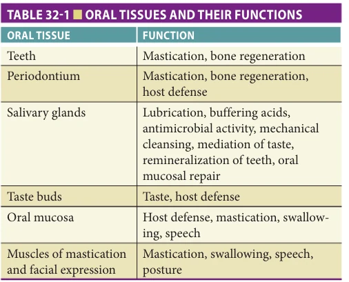

*TABLE 32-1 ■ ORAL TISSUES AND THEIR FUNCTIONS*

*Owner annotations/highlights are from the marked source copy, not the book.*

that modulate oral microbial colonization. Biomarkers of systemic (eg, C-reactive protein [CRP], interleukin [IL]-6) and oral inflammation are present in saliva. Other proteins maintain the functional integrity of teeth by keeping saliva supersaturated with respect to calcium and phosphate salts and provide the first role in repairing early dental caries (tooth decay) via a remineralization process.

## TOOTH LOSS AND DENTAL CARIES

The loss of teeth has long been associated with aging. However, older adults lose teeth not because of age per se, but because of dental diseases. National surveys in the United States (NHES, NHANES) demonstrate that each successive age cohort has less tooth loss than the prior one. Thus, the percent of 65- to 74-year-olds who had lost all their teeth decreased from 55% in 1958 to 1959 to 29% in 1988 to 1994, to 24% in 1999 to 2004, and 13% in 2011 to 2016. Tooth loss has two major causes: dental caries (discussed later) and periodontal diseases (discussed in the next section). Dental caries mostly affect exposed tooth surfaces, and periodontal diseases affect the supporting bony and ligamentous dental structures. With the current trends toward increasing tooth retention in aging populations,

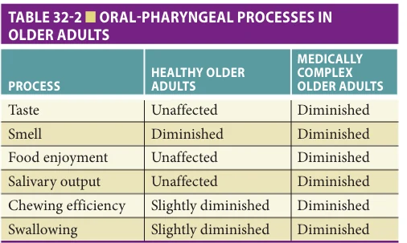

*TABLE 32-2 ■ ORAL-PHARYNGEAL PROCESSES IN OLDER ADULTS*

*Owner annotations/highlights are from the marked source copy, not the book.*

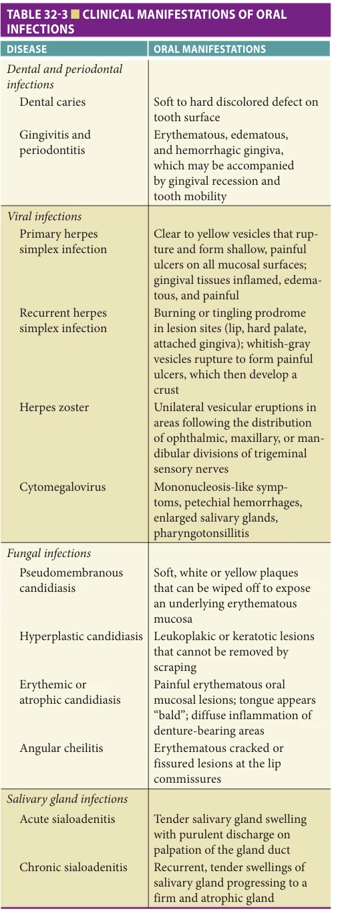

*TABLE 32-3 ■ CLINICAL MANIFESTATIONS OF ORAL INFECTIONS*

*Owner annotations/highlights are from the marked source copy, not the book.*

**[p. 455]**

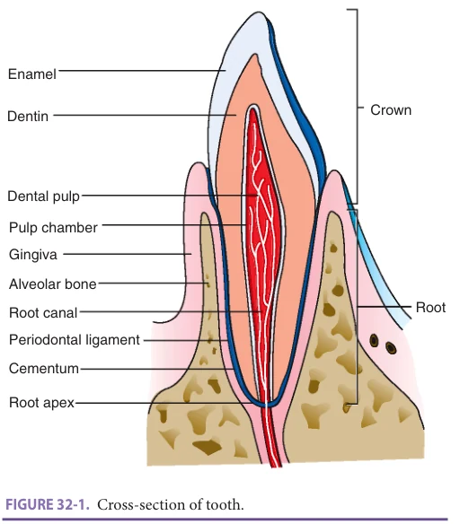

*FIGURE 32-1. Cross-section of tooth.*

*Owner annotations/highlights are from the marked source copy, not the book.*

there is a correspondingly greater risk for the development of both of these disease entities.

A tooth consists of several mineralized and nonmineralized components supported by the periodontal ligament and the alveolar bone (Figure 32-1). The outer dental structure (enamel) is the hardest mineralized component, approximately 95% hydroxyapatite. Enamel covers the coronal portion of the tooth and is the first hard tissue exposed to caries-causing bacteria. Dentin, approximately 72% mineralized, constitutes the main portion of the tooth structure, extending almost the entire length of a tooth. It is covered by enamel on the crown and by cementum on the root. Cementum is the least mineralized of the three components (~ 50%) and is the component most susceptible to caries-causing bacteria. The central, nonmineralized portion is the dental pulp, which houses the vascular, lymphatic, and neuronal supply to the tooth. Stem cells are present in pulpal tissues.

There are two classifications of dental caries, depending on the tooth surface affected. Coronal caries occurs when the enamel and dentin of the crown portion of the tooth (usually above the gums) are affected. In older adults, if gingival (gum) recession or periodontal disease causes the root surfaces of the tooth to become exposed to the oral environment, root surface caries may occur.

The primary caries-causing microorganisms are Streptococcus mutans; oral streptococci, Actinomyces, and lactobacilli are also associated with coronal and root surface lesions. These bacteria reside on the tooth surface in dental plaque, a soft, firmly adherent mass that contains bacteria, food debris, desquamated cells, and bacterial products.

Acid production by plaque bacteria dissolves the mineral content of the enamel, dentin, or cementum. The exposed proteins are destroyed by hydrolytic enzymes, resulting in early dental caries. Dental plaque is considered a primary etiologic factor in dental caries, as well as a principal source of pathogenic organisms in periodontal diseases.

As older adults live longer and maintain their permanent dentition, there is susceptibility to coronal caries due to recurrent decay bordering existing fillings and the increased prevalence of root surface caries. There are many risk indicators for root surface caries: increased age, decreased exposure to fluoride, coronal caries, periodontal attachment loss, diminished oral-motor skills required for oral hygiene, and additional medical, behavioral, and social factors.

For an older adult with teeth, dental caries is a significant concern and may be a source of pain, infection, and difficulty chewing or swallowing, resulting in a compromised diet or malnutrition. Dental caries will appear as orange to dark brown lesions that frequently are associated with dental plaque (Figure 32-2A and B). Long-standing dental caries ultimately result in the destruction of the tooth with the possibility of local or disseminated infection in the maxillofacial tissues, space infections in the head

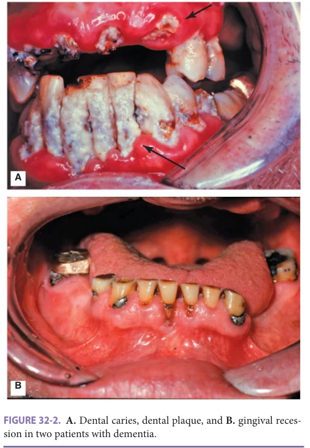

*FIGURE 32-2. A. Dental caries, dental plaque, and B. gingival recession in two patients with dementia.*

*Owner annotations/highlights are from the marked source copy, not the book.*

**[p. 456]**

and neck, and infection in the systemic circulation (septicemia). Once teeth have been destroyed from dental caries or periodontal disease, mastication, phonation, and swallowing are perturbed. Finally, social contact and nutritional status may be affected in an edentulous aging individual.

The prevention of dental caries in an older adult includes use of fluoride in many forms, daily effective oral hygiene, and regular visits to dental professionals. Tooth surfaces can become resistant to decalcification and decay through repeated exposure to fluoride in water supplies, toothpaste, rinses, high-strength prescription gels, and varnishes. However, even resistant tooth surfaces can decay when oral hygiene is poor and the mouth is dry and/or exposed repeatedly to fermentable carbohydrates. When detected early, dental caries can be debrided from a tooth, and the missing tooth structure can be restored with a wear-resistant, insoluble restorative material (eg, amalgam or composite resin). Some restorative materials contain fluoride (glass ionomers) and can help reduce caries risk. Replacements for lost teeth are available with complete or partial dentures, crowns, bridges, or implants.

## PERIODONTIUM AND PERIODONTAL DISEASES

The periodontium consists of the tissues that invest and support the teeth. It is divided into the gingival unit (gums) and the attachment apparatus (cementum, periodontal ligament, and alveolar bony process) (see Figure 32-1). Gingivitis occurs when the gingival unit alone is inflamed. Periodontitis (periodontal disease) exists when there is inflammation, infection, and an appreciable loss of the attachment apparatus as a result of the presence of pathogenic microorganisms. Microbial species (eg, Porphyromonas gingivalis, Bacteroides, Fusobacterium, Prevotella, Actinobacillus, Actinomyces, Capnocytophaga, and others) cross through the gingival epithelium and enter subepithelial tissues, where they activate host defense mechanisms. Eventually, this causes tissue destruction, including bone loss, mobility, pain on eating, and tooth loss.

Periodontal diseases are more prevalent in the aging population than with younger adults. Sixty-four percent of persons in the United States age 65 and older have moderate or severe periodontal diseases. Older persons experience greater gingival recession and loss of periodontal attachment (see Figure 32-3). Periodontal disease proceeds through a series of episodic attacks rather than occurring as a slowly progressing continuous process. Bone destruction results from an overly aggressive local immune reaction to the pathogenic organisms, triggering a cascade of cytokine and immunologic events that can produce irreversible loss of alveolar bone. Among healthy adults, periodontal attachment loss occurs at small increments in all age cohorts and does not occur in

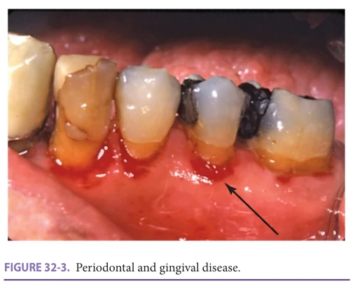

*FIGURE 32-3. Periodontal and gingival disease.*

*Owner annotations/highlights are from the marked source copy, not the book.*

greater amounts in older healthy adults. However, many systemic diseases and therapeutic regimens commonly found in older individuals adversely affect periodontal health. Therefore, older, medically compromised adults and smokers are especially susceptible to developing periodontal diseases and at risk for associated dental-alveolar infections, pain, and tooth loss.

Medication-induced changes: Several classes of medications commonly prescribed for older people are associated with gingival enlargement and hyperplasia, a condition that if left untreated, predisposes people to both dental caries and destructive periodontitis. Some calcium channel blockers (eg, nifedipine), phenytoin, and cyclosporine can cause this unwanted drug side effect, which may require periodontal surgery.

Periodontal-systemic connections: Periodontal diseases have oral and systemic effects on health. They are directly associated with halitosis, gingival bleeding, tooth mobility, and tooth loss. Untreated periodontitis has been reported to interfere with blood glucose control in patients with diabetes; and cardiovascular disease is associated with periodontitis after controlling for traditional risk factors such as body mass index (BMI), gender, tobacco use, age, and blood lipid levels. Gram-negative bacteria are implicated in the pathogenesis of periodontal disease, and colonization of the oropharynx with gram-negative bacilli predisposes a patient to pneumonia. Aspiration pneumonia can occur when oropharyngeal secretions are aspirated into the lungs, causing infection. Bacteria from the gingival sulcus in persons with periodontitis have been isolated from patients with pneumonia. Risk factors for aspiration pneumonia include older age, immunocompromised state, mechanical ventilation, feeding problems and/or feeding tubes, deteriorating health status, and wearing dentures during sleep. Importantly, debilitated older patients who do not have adequate oral hygiene care are highly susceptible to aspiration pneumonia.

Treatment of gingivitis and periodontitis starts with good oral hygiene in the form of tooth brushing for

**[p. 457]**

2 minutes twice daily and flossing daily. Electric toothbrushes can assist older patients who have arthritis, motor, and/or cognitive disorders. Periodontal therapy ranges from local (dental prophylaxis, local debridement, scaling, and root planing) to pharmacologic (intrasulcular antimicrobial solutions, systemic low-dose doxycycline as an immunomodulator) to surgical techniques (debridement, excision of hyperplastic tissue), depending on the extent of periodontal infection and bony destruction. Several antimicrobial and anticollagenase drugs have been approved for treatment: oral rinses (chlorhexidine 0.12%), subgingival antimicrobials (minocycline hydrochloride 1-mg microspheres), short-term antimicrobials (clindamycin 300 mg QID or metronidazole 400 mg TID for 7–10 days), or anticollagenases (doxycycline 20 mg). While periodontal healing after surgery tends to be slower even in healthy older persons, the long-term results of periodontal therapy are indistinguishable from those in younger adults. The decision either to save the dentition and restore periodontal health or to extract teeth with moderate periodontal disease should be determined after all oral and systemic factors have been evaluated. The health and functional status of a person, rather than age per se, should determine the extent of periodontal treatment.

## SALIVARY GLANDS, HYPOFUNCTION, AND XEROSTOMIA

There are three major pairs of salivary glands (parotid, submandibular, and sublingual) and numerous minor glands (labial, palatal, and buccal); their principal function is the exocrine production of saliva. Each gland type makes a unique secretion derived from either mucous or serous cell types, forming the fluid in the mouth termed whole saliva. Saliva includes many constituents that are critical to the maintenance of oral health. Saliva lubricates the oral mucosa, promotes remineralization of teeth, and protects against microbial infections. Saliva helps prepare the food bolus for deglutition, dissolves foods, and delivers tastants to the taste buds.

Salivary output does not appreciably diminish with increasing age. Nevertheless, there is a common clinical observation that older individuals have xerostomia (dry mouth) and voice concern of said condition. Further, there appear to be no significant alterations in the composition of saliva in older, healthy persons.

The physiologic findings contrast with the morphologic changes seen in aging salivary glands. Major salivary glands lose approximately 30% of their parenchymal tissue over the adult life span. The loss primarily involves acinar or fluid-producing components, while proportional increases are seen in ductal cells and in fat, vascular and connective tissues. Because acinar components are primarily responsible for the secretion of saliva, it is not known why, in the presence of a significant reduction in the gland acinar volume, total fluid production does

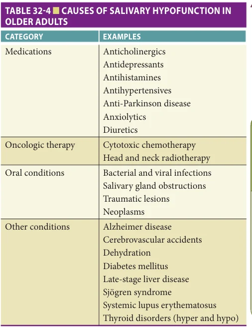

*TABLE 32-4 ■ CAUSES OF SALIVARY HYPOFUNCTION IN OLDER ADULTS*

*Owner annotations/highlights are from the marked source copy, not the book.*

not diminish with increasing age. Current thinking is that salivary glands possess a functional reserve capacity that enables them to maintain fluid output throughout the human adult life span. There is evidence that with a reduced reserve capacity, additional burdens placed on aging salivary glands (eg, anticholinergic medications) increase vulnerability to functional decline. Therefore, salivary hypofunction (the objective finding) and complaints of xerostomia (the subjective finding) should not be considered normal sequelae of aging but instead are indicative of a variety of diseases and their treatments (Table 32-4). Many medications taken by older adults reduce or alter salivary gland performance, as can dehydration. In addition, radiation for head and neck neoplasms and cytotoxic chemotherapy have direct and dramatic deleterious effects on salivary glands.

The most common disease affecting salivary glands is Sjögren syndrome, an autoimmune exocrinopathy that occurs predominantly in postmenopausal women. Alzheimer disease, diabetes, dehydration, rheumatoid arthritis, and cerebrovascular accidents may also affect salivary output. Several oral inflammatory and obstructive salivary gland disorders (eg, bacterial infections, sialoliths, trauma, neoplasms) result in salivary dysfunction, as well as benign and malignant salivary tumors.

A clinician is likely to encounter many older patients with oral complaints related to salivary gland hypofunction. Clinical examination includes palpation of all major

**[p. 458]**

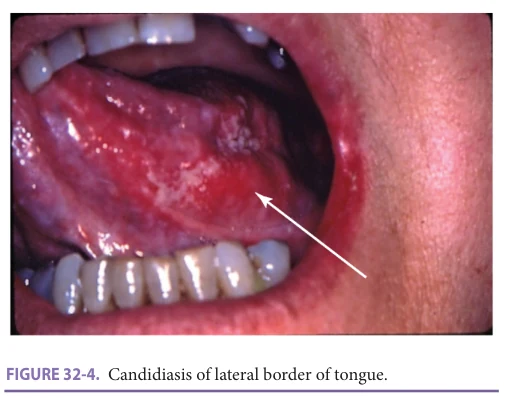

*FIGURE 32-4. Candidiasis of lateral border of tongue.*

*Owner annotations/highlights are from the marked source copy, not the book.*

glands and inspection of the duct orifices while milking the glands to ensure gland patency. The application of a mild solution of citric acid or lemon juice to the tongue can help determine whether a patient’s salivary glands will respond to a gustatory stimulus. Regardless of etiology, any of the major oral physiologic roles influenced by saliva (see Table 32-1) may be affected adversely. With impaired glandular output, dental caries will increase, increasing the possibility of tooth loss. The oral mucosa becomes desiccated and cracked, leaving the host more susceptible to microbial infection (Figure 32-4). Older adults with salivary gland hypofunction may experience difficulty swallowing or speaking at length, pain (which may arise from either the teeth or the oral soft tissues), impaired denture use, altered taste, and diminished food enjoyment.

Treatment of salivary dysfunction starts with identification of the etiology. Medication-induced salivary problems can be eliminated by stopping unnecessary medicines, modifying drug use and dose, or substituting one drug with another drug that has fewer anticholinergic side effects. Even when no reduction in the daily dose is recommended, the splitting of a dose into several smaller and more frequently taken doses may alleviate or diminish the sensation of oral dryness. To enhance salivary production, gustatory (sugar-free mints, candies), masticatory (sugar-free gums), and pharmacologic (pilocarpine 5 mg TID and qhs, cevimeline 30 mg TID) stimulants can be useful in a patient who has remaining salivary function. Salivary substitutes, rinses, and moisturizing gels can assist a patient who has little or no remaining salivary function. Prevention of xerostomia is essential and can be achieved with the frequent use of noncarbonated, caffeine- and sugar-free beverages, topical fluoride, and routine oral hygiene no less than twice daily. Full (complete) and partial removable prostheses (dentures) must be kept clean and out of the mouth during sleeping hours. Frequent lubrication of the lips will help prevent lip cracking, trauma, and infections.

## SENSORY FUNCTIONS

When food enjoyment, recognition, and sensory function decline in an older person, significant nutritional deficits can result. The question of whether there is a true anorexia (loss of appetite) associated with aging is confounded by many comorbidities, common in older people, that may cause anorexia, and social and psychological factors that may reduce oral food and fluid intake. Perturbations in taste, smell, and other oral sensory modalities can occur with age and with dental/periodontal problems, thereby reducing the rewards of eating and contributing to a diminished interest in food by some older persons.

The taste receptors of the human gustatory system are distributed throughout the oropharynx and are innervated by three cranial nerves: VII, IX, and X. The number of lingual taste buds does not diminish with age. The registration of a taste phenomenon is complex, because multiple factors are involved: gustation, olfaction, and central nervous system function. The ability to taste is often evaluated at two levels: (1) threshold, the most common measure, a “molecular-level” event, which reflects the lowest concentrations of a tastant that an individual can recognize as being different from water, and (2) suprathreshold, a measure that is reflective of the ability to taste the intensity of substances at functional concentrations encountered in daily life. In addition to detection, recognition, and intensity, the normal sensation of taste involves a hedonic component: the degree of pleasantness.

Taste function among healthy, community-dwelling individuals changes modestly with increased age. In contrast, a threefold increase in the frequency of subjective taste complaints has been observed among older persons who take prescription medications. Objective threshold and suprathreshold evaluations of gustatory function in healthy older adults have been reported for all four taste qualities (sweet, sour, salty, and bitter). In general, the changes detected with increased age are modest and taste-quality-specific. For example, the ability of older adults to detect salt decreases slightly with age, while no changes in the detection threshold for sucrose (sweet) are noted. The importance of medication usage and place of residence in the evaluation of taste dysfunction has been confirmed in clinical studies in which institutionalized persons and those using more prescription medications had elevated taste thresholds.

Older adults perform less well in the more complicated problems of flavor perception, food recognition, and food preference. This is probably a result of diminished olfactory performance rather than the modest changes that accompany taste function with aging. Olfactory performance data show declines in thresholds, suprathreshold intensity judgments, and odor recognition in both men and women with increasing age. Among older adults, average thresholds are higher, the ability to perceive suprathreshold intensities is blunted, odor recognition is impaired, and

**[p. 459]**

the judgment of pleasantness is reduced compared with younger subjects. Moreover, longitudinal studies demonstrate that as people get older, recognition decrements become even more severe.

Normal chemosensory function does not operate independently of good oral health. Numerous oral conditions can directly or indirectly affect smell and taste by altering the underlying biology of the taste or smell system or by introducing exogenous stimuli into the mouth or nose. Fungal/bacterial/viral infections, vesiculobullous diseases, salivary gland hypofunction, poorly fitting prostheses, and oral manifestations of systemic diseases can cause chemosensory dysfunction. Inadequate removal of food particles allows their breakdown or by oral microorganisms to noxious, unpleasant substances. Periodontal diseases can result in accumulations of putrefied materials that may leak into the oral cavity and alter taste sensation. Similarly, dental-alveolar bacterial infections with subsequent fistula formation may contribute continuously low levels of purulent matter in the mouth.

The complaint of a smell or taste problem may be indicative of a chemosensory disorder or could be the manifestation of an oral and/or systemic medical problem. For example, the sudden loss of either smell or taste may be a sign of brain tumor or COVID-19. Alternatively, gradual diminishment in food enjoyment may be related to multiple sources. Examples include a poorly fitting removable prosthesis (Figure 32-5), an oral fungal infection (see Figure 32-4), decreased smell identification, or use of a new drug. A patient should be asked if he or she can specifically identify the four basic tastants and distinguish between different odorants; such patients could be given the University of Pennsylvania Smell Identification Test. A thorough multidisciplinary approach is required for a patient presenting with chemosensory complaints because of the wide range of potential oral, systemic, physiologic, cognitive, and pathologic factors that are involved in oral sensory functioning.

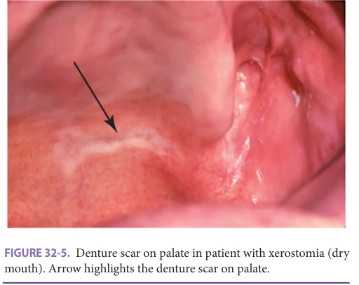

*FIGURE 32-5. Denture scar on palate in patient with xerostomia (dry mouth). Arrow highlights the denture scar on palate.*

*Owner annotations/highlights are from the marked source copy, not the book.*

## ORAL MUCOSA

Three general types of soft tissue line the mouth: (1) well-keratinized tissue with a dense layer of connective tissue and firmly attached to underlying bone (marginal gingiva, palatal mucosa), (2) slightly keratinized and freely movable tissue (labial and buccal mucosa, floor of the mouth), and (3) specialized mucosa (dorsum of the tongue). The primary function of the oral mucosa is to act as a barrier to protect the underlying structures from desiccation, noxious chemicals, trauma, thermal stress, and infection. The oral mucosa plays a key role in the defense of the oral cavity.

Aging can be associated with changes in the oral mucosa similar to those in the skin, with the epithelium becoming thinner, less hydrated, and more susceptible to injury. The reasons for these changes are complex and include alterations in protein synthesis and responsiveness to growth factors and other regulatory mediators. Cell renewal (ie, mitotic rates) and the synthesis of proteins associated with oral mucosal keratinization occur at a slower rate in aging individuals. Normal tissue architecture and patterns of histodifferentiation, which probably are dependent on complex interactions with the underlying connective tissue, do not display any changes with age. Overall, changes in the vascularity of oral mucosa likely contribute to alterations in mucosal integrity because of reductions in cellular access to nutrients and oxygenation. Mucosal, alveolar, and gingival arteries can be affected by arteriosclerosis. Varicosities on the floor of the mouth and the lateral and ventral surfaces of the tongue (comparable to varicosities in the lower extremities) are also observable in some geriatric patients.

The maintenance of mucosal integrity depends on the ability of the oral epithelium to respond to insults caused by physical factors (trauma), exposure to chemical or microbiological toxins, microbial infections, and oral and/or systemic conditions. Although the immune system generally declines with age (see Chapter 3), it is unknown whether this decline extends to mucosal immunity. If so, the oral mucosa and gingival tissues may be more susceptible to transmission of infectious diseases as well as delayed wound healing.

Although age has no effect on the clinical appearance of the oral mucosa, the use of removable prostheses has a potentially adverse effect on the health of the oral mucosa. The denture-bearing mucosa of aged maxillary and mandibular ridges shows morphologic changes. Ill-fitting dentures can produce mechanical trauma to the oral tissues (see Figure 32-5) and cause mucosal hyperplasia. Oral candidiasis can frequently be found on denture-bearing areas in an edentulous individual, often occurring with angular cheilitis (deep fissuring and ulceration of the epithelium at the commissures of the mouth). The clinician should ask the patient to remove all removable dentures before conducting an oral screening.

**[p. 460]**

Oral mucosal alterations in an older person are often a result of multiple oral and systemic factors (Table 32-5). Many medications have been associated with oral mucosal changes, and long-term use of antibiotics frequently results in oral candidal infections, while drugs with xerostomic side effects (see earlier) increase the potential for mucosal injury. Bisphosphonate drugs used for cancer metastasis and osteoporosis (especially those administered intravenously) are associated with increased risk for osteonecrosis, a severe destruction of oral mucosa and bone. However, risk for the rare event of osteonecrosis must be balanced against the benefit of bisphosphonate drugs for common osteoporosis-related fractures. Drugs

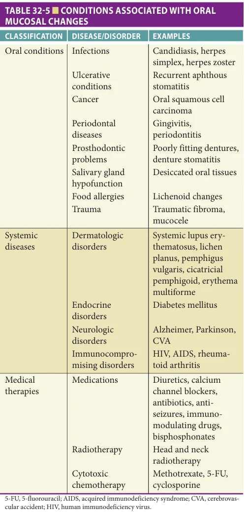

*TABLE 32-5 ■ CONDITIONS ASSOCIATED WITH ORAL MUCOSAL CHANGES*

*Owner annotations/highlights are from the marked source copy, not the book.*

used in older patients for arthritic conditions, hypertension, cardiac arrhythmias, seizures, and dementia are associated with lichenoid-like reactions. The withdrawal of a causative drug usually results in complete resolution of the lesion within 2 to 3 weeks, but if there is no clinical improvement, a definitive diagnosis should be obtained with a biopsy specimen.

Many oral mucosal disorders can affect older people, ranging from benign (eg, recurrent aphthous ulcers and traumatic lesions) to malignant (eg, squamous cell carcinomas) (Figure 32-6A and B). The diagnosis of mucosal diseases requires a detailed history and a thorough head and neck and oral examination, including all mucosal tissues. For vesiculobullous and erosive diseases, a simple threeitem classification is helpful: (1) acute multiple lesions (eg, erythema multiforme, herpes simplex, herpes zoster, allergic reaction), (2) recurring oral ulcers (eg, recurrent aphthous stomatitis, traumatic ulcer), and (3) chronic multiple lesions (eg, pemphigus vulgaris, mucous membrane pemphigoid, lupus erythematosus, lichen planus, dysplasia, squamous cell carcinoma). If a lesion does not resolve after 2 to 3 weeks, a tissue biopsy is required. For lesions that are suspected to be oral manifestations of autoimmune connective tissue disorders (eg, pemphigus, pemphigoid,

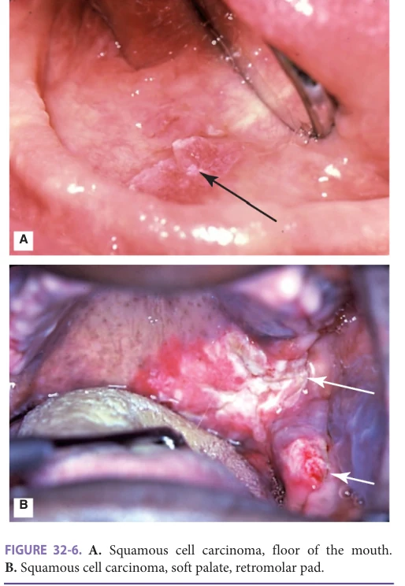

*FIGURE 32-6. A. Squamous cell carcinoma, floor of the mouth. B. Squamous cell carcinoma, soft palate, retromolar pad.*

*Owner annotations/highlights are from the marked source copy, not the book.*

**[p. 461]**

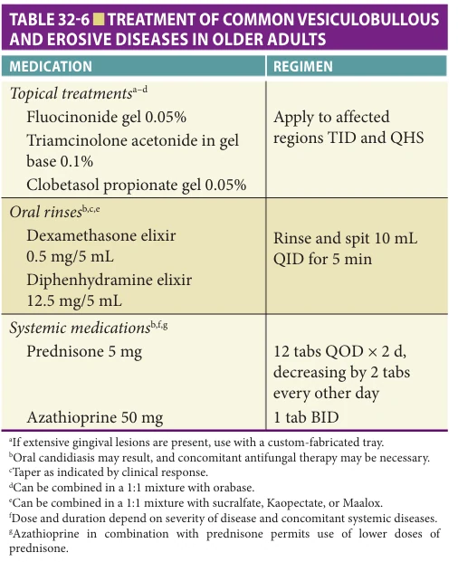

*TABLE 32-6 ■ TREATMENT OF COMMON VESICULOBULLOUS AND EROSIVE DISEASES IN OLDER ADULTS*

*Owner annotations/highlights are from the marked source copy, not the book.*

lichen planus), biopsies should also include specimens for direct immunofluorescence. If trauma from an injury or an ill-fitting denture is suspected, removal of the etiology should allow the lesion to heal. Many of these conditions have an immunologic etiology, and therefore management strategies involve topical and/or systemic immunomodulating agents (Table 32-6).

## ORAL CANCER

The oral mucosal disease with the greatest potential morbidity and mortality is cancer (see Figure 32-6A and B). Oral cancers represent 2.9% of all cancers. There were an estimated 53,260 new oral and pharyngeal cancers in the United States in 2020 and 10,750 cancer deaths. The 5-year survival rate is 66%. Median age at diagnosis is 63; 80% of new cancers occur after age 55; and median age at death is 68. Five-year survival for localized cancers (29% of oral and pharyngeal cancers) is 85%, for cancers that spread to regional nodes (48%) is 67%, and for metastatic oral and pharyngeal cancers (19%) is 40%. The greatest risk factors for developing oral cancer are age, tobacco, heavy alcohol use, and human papillomavirus (HPV). Males are more than twice as likely to develop oral cancer as females.

Carcinoma should be considered part of the differential diagnosis of any oral lesion. Any oral lesion that does not heal completely in 2 to 3 weeks after removal of suspected etiologies (eg, ill-fitting denture, change in medication) should undergo a diagnostic biopsy procedure.

The treatment of oral cancers involves head and neck surgery, radiotherapy, chemotherapy, or a combination of any of these three modalities, depending on the tumor’s histopathology and stage. Before receiving definitive therapy, the patient should have a comprehensive oral examination so that focal areas of infection or potential infection (dental caries, periodontal disease, dental-alveolar infections, soft and hard tissues lesions) can be treated before surgery, radiotherapy, or chemotherapy. The patient must be educated about many potential risks: surgery-related sensory, esthetic, and functional problems; radiotherapy-induced mucositis, salivary gland hypofunction, and osteoradionecrosis; and chemotherapy-induced mucositis and immunosuppression.

## MOTOR FUNCTION

The oral motor apparatus is involved in routine yet intricate functions (speech, posture, mastication, and swallowing). Regulation of these activities may occur at three levels: the local neuromuscular unit, central neuronal pathways, and systemic influences. While aging is associated with changes in neuromuscular systems, animal studies suggest that age-associated deficiencies in motor function are unrelated to the composition and contractile function of skeletal muscles. Rather, these changes probably are related to other factors such as neuromuscular transmission and propagation of nerve impulses.

Dentition status (the number of teeth), and not age, influences mastication. While older adults with an intact dentition prepare food more slowly for swallowing than do younger individuals, and minor alterations in performance (mastication, swallowing, oral muscular posture, and tone) can be expected with increased age, changes are more common among completely or partially edentulous persons rather than among persons with a natural dentition. Any diminution in masticatory efficiency can be exacerbated in individuals with a compromised dentition (persons with dental caries, periodontitis, missing teeth, and removable dentures).

Swallowing changes in older persons are usually caused by sensory, muscular, and neurologic deterioration. A thorough review of swallowing problems in older people is provided in Chapter 31, Disorders of Swallowing. Normal aging has minor adverse effects on swallowing, although in a healthy older person, even advanced age does not appear to cause any clinically important dysfunction. However, a host of conditions common in the older adult population can cause clinically significant swallowing deficiencies. Salivary hypofunction (described earlier) impairs swallowing times and under severe conditions increases the likelihood of aspiration. Patients with neuropathies have been reported to have oral swallow times four- to sixfold longer than those in healthy controls; these persons may not even be able to produce the recognizable characteristics of an oral swallow. Neurovascular conditions (eg, cerebrovascular accidents, dementia, motor neuron disease)

**[p. 462]**

and Parkinson disease are likely to cause dysphagia and predispose a person to the danger of aspiration.

The temporomandibular joint (TMJ) is located between the glenoid fossa and the condylar process of the mandible, and exhibits a functionally unique gliding and hinge movement. It is of particular interest to clinicians, for it is the focus of several craniofacial pain disorders. Radiographic and postmortem evaluations suggest that the components of this joint undergo degenerative alterations with increasing age. However, TMJ functional impairment is not a “normal” age-associated event. Rather, temporomandibular disorders (TMD) in older adults are linked with many common oral and systemic conditions. Orofacial pain in an older patient may be a result of a variety of problems of the craniomandibular complex and other extraoral diseases, making diagnosis and treatment challenging and frequently requiring a multidisciplinary approach.

In general, two types of pathology are associated with the TMJ: articular, related to the joint itself, and nonarticular, pathology occurring in structures unrelated to the joint but causing similar or referred symptomatology. Articular abnormalities common to all joints may also affect the TMJ: for example, trauma, ankylosis, dislocation, and arthritis. Nonarticular disorders may result from trigeminal neuralgia, headache, migraine, otitis, dentoalveolar pain/ infection, and masticatory myalgia. Orofacial habits (eg, jaw clenching and tooth grinding) and poor head and neck posture can produce muscle fatigue and spasm. Psychological conditions (stress and depression) can exacerbate underlying articular and nonarticular disorders. Clinically, the patient will present with pain in many regions: TMJ, temporal, neck, masticatory muscles, and the oral cavity. Diagnosis is challenging because symptoms primarily occur in any of these sites with regular, irregular, or no pain referred to the TMJ region. Limited jaw opening (< 40 mm from the maxillary central incisor to the mandibular central incisor edges) and pain on mastication or during jaw movements may be indicative of TMD. Treatment, as with other arthritic or muscular disorders, requires an appropriate diagnosis and ranges from conservative and reversible regimens (anti-inflammatories, analgesics, muscle relaxants, physical therapy, oral bite splints) to more invasive procedures for unresolved painful conditions (eg, TMJ surgery). Pain in the jaws and/or face is present in 3% to 6% of persons age 65 and older.

Speech is another function of the oral structures; speech undergoes changes with increasing age, including shape of the tongue and its function during sound production and frequency variability. Among healthy older persons, these changes do not compromise or alter speech in any perceptible way. Tongue strength decreases with age, even among healthy adults, yet tongue endurance is similar between younger and older persons. There are also age-associated alterations in intraoral and maxillofacial posture. Drooping of the lower face and lips in the

older adult results from the loss of supporting hard tissues and diminished tone of the circumoral muscles. The latter changes may elicit esthetic concerns and can lead to embarrassment from drooling or food spills caused by the inability of an older individual to close the lips competently while eating or speaking. Often, drooling caused by reduced circumoral muscle tone can result in complaints of excess salivation. Finally, oral motor disorders also may result from therapeutic drug regimens, such as the frequent association of tardive dyskinesia with phenothiazine therapy. These dyskinesias may include diminished performance and speech pathologies as well as alteration in movement (eg, chorea).

## ORAL CONDITIONS AND QUALITY OF LIFE IN OLDER ADULTS

Poor oral health diminishes the quality of life among persons with poor general health. There is a strong association between poor general health and poor oral health (Figure 32-7A and B). Persons who report poor general health are more likely to have complete tooth loss compared to older people reporting good or better general health. Older adults with teeth reporting poor general health also have two to four fewer teeth than persons reporting good or better general health. Further, the mean number of teeth in persons 50 years and older reporting poor general health is below the threshold for a functional dentition (20 teeth are considered the minimum for a functional dentition). Persons reporting poor general health are also more likely to report painful aching in their mouth. Conditions that increase the likelihood of reporting pain include arthritis, chronic obstructive pulmonary disease (COPD), cardiovascular disease (CVD), diabetes, and low/no vision. One in five adults between age 65 and 74 who report poor general health also report avoiding particular foods because of poor oral health (problems with their teeth, dentures, or mouth).

## DISPARITIES IN ACCESS TO AND OUTCOMES OF CARE

Nearly 73 million baby boomers will turn 65 by 2030. Most will lose dental insurance upon retirement. Medicare does not cover dental care except in very narrowly prescribed circumstances. Medicaid coverage varies by state; in 2011, 22 states provided “comprehensive,” 7 provided limited, 14 provided emergency, and 7 provided no dental coverage for adults. However, Medicaid is only for people at or below the poverty level. Thus, a large “middle” group of older people are on a fixed income with limited access to sponsored dental care coverage. Such people need private dental coverage and/or effective, community-based prevention programs.

There are important disparities in access to dental care, tooth loss, unfilled caries, periodontal diseases, and

**[p. 463]**

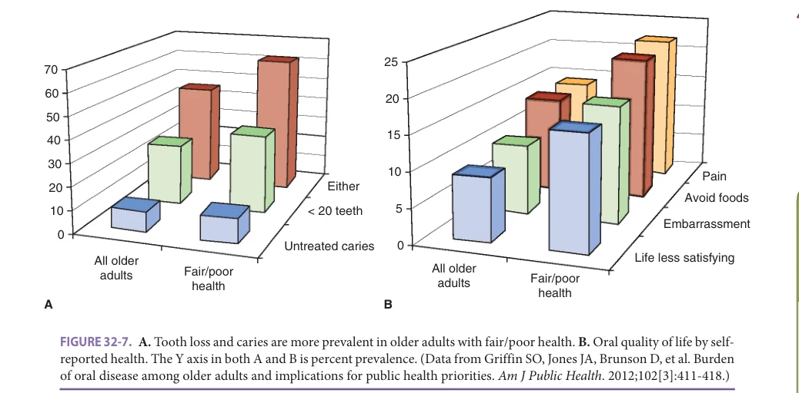

*FIGURE 32-7. A. Tooth loss and caries are more prevalent in older adults with fair/poor health. B. Oral quality of life by selfreported health. The Y axis in both A and B is percent prevalence. (Data from Griffin SO, Jones JA, Brunson D, et al. Burden of oral disease among older adults and implications for public health priorities. Am J Public Health. 2012;102[3]:411-418.)*

*Owner annotations/highlights are from the marked source copy, not the book.*

oral cancers among the poor, near poor, and racial and ethnic minorities. Insurance affects access for persons age 65 and older : “54% of adults with private health care coverage had visited dental professional within the past 6 months, compared with 41% of adults who had only Medicare and 25% who had Medicare plus Medicaid” (CDC, 2014). Thus, the so-called dual eligibles are the most likely group of older persons to not have access to dental care. In addition, while past dental care use has improved slightly among persons age 65 and older since 1999 to 2004 for persons above 200% of the federal poverty level (FPL), it is lower among persons below 200% of this level (Figure 32-8A).

Baby boomers will be keeping their teeth longer and in greater numbers than ever before; however, dental decay (caries) is now as much of a problem in older adults as in children. NHANES caries data from 1999 to 2004 and 2011–2016 (Figure 32-8B) showed that among persons age 65 and older, prevalence of unfilled caries was higher among persons below 200% of the FPL (18% vs 25%) in contrast with persons 200% or more of the FPL, where unfilled caries rates were lower in 2011 to 2016 (16% vs 14%). NHANES data from 2011 to 2016 show that unfilled decay was highest among Mexican Americans, nonHispanic Blacks and the poor, while complete tooth loss (edentulism) is lowest among Whites and highest among the poor and African-Americans (Figure 32-8C). Disparities in access and dental conditions are the starkest in nursing homes and senior centers. In nine Basic Screening Surveys across the United States, edentulism ranged from 25% to 43% (median 33%) and unfilled caries from 25% to 53% (median 40%). National SEER data show that new oral and pharyngeal cancer rates are highest among male Whites, yet death rates are highest among African-American men (Figure 32-9).

## COMPREHENSIVE ORAL EXAMINATIONS AND EVALUATIONS

The initial examination and radiographic series by an oral health professional can yield the greatest diagnostic value. This information will not only serve as a diagnostic tool for the immediate treatment needs but also as a baseline that can be used to map the progression of disease or a decline in the patient’s oral health. For frail medically compromised (homebound or institutionalized) older adults, subsequent visits can be more challenging when there has been an overall decline in the patient’s medical and physical condition or psychological state.

For nondental health professionals on the interdisciplinary geriatrics team, it is important to take a couple of minutes to complete an intraoral evaluation. Any clinical findings that differ from the routine normal color and structure are indications for referral to a dental health professional. Along with the clinical intraoral evaluation, it can be very helpful for the nondental health professional to ask two simple questions:

“Do you have any pain or discomfort in your mouth?” “Do you have any trouble biting or chewing your food?”

A positive response to one or both predicts the need for treatment. Any combination of positive responses to these questions should also trigger a referral for consultation to an oral health care provider with formal training or experience with special needs adults or geriatric dental medicine. Often the most important step is the early identification of the clinical problem, and referral to the appropriate provider. Lack of an early referral may result in a missed opportunity to aid the patient with their oral health needs. The interdisciplinary team working together can ensure

**[p. 464]**

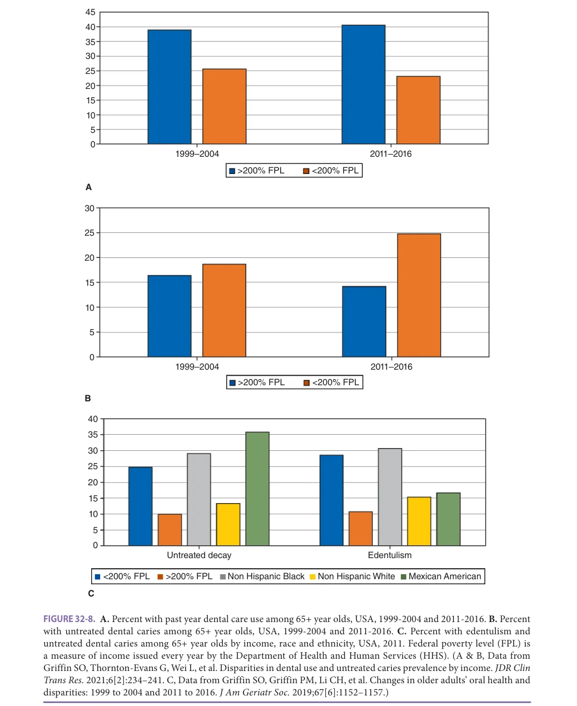

*FIGURE 32-8. A. Percent with past year dental care use among 65+ year olds, USA, 1999-2004 and 2011-2016. B. Percent with untreated dental caries among 65+ year olds, USA, 1999-2004 and 2011-2016. C. Percent with edentulism and untreated dental caries among 65+ year olds by income, race and ethnicity, USA, 2011. Federal poverty level (FPL) is a measure of income issued every year by the Department of Health and Human Services (HHS). (A & B, Data from Griffin SO, Thornton-Evans G, Wei L, et al. Disparities in dental use and untreated caries prevalence by income. JDR Clin Trans Res. 2021;6[2]:234–241. C, Data from Griffin SO, Griffin PM, Li CH, et al. Changes in older adults’ oral health and disparities: 1999 to 2004 and 2011 to 2016. J Am Geriatr Soc. 2019;67[6]:1152–1157.)*

*Owner annotations/highlights are from the marked source copy, not the book.*

that the needs of the patient are addressed in a timely and thorough manner. Important interactions may involve the primary care physician, specialist physician, nurse, nurse practitioner, physician assistant, dentist, dental specialist,

dental hygienist, dental assistant, and health aides. One key goal is to determine the need for antibiotic premedication prior to dental treatment. Premedication is often considered for patients with risk for endocarditis, autoimmune

**[p. 465]**

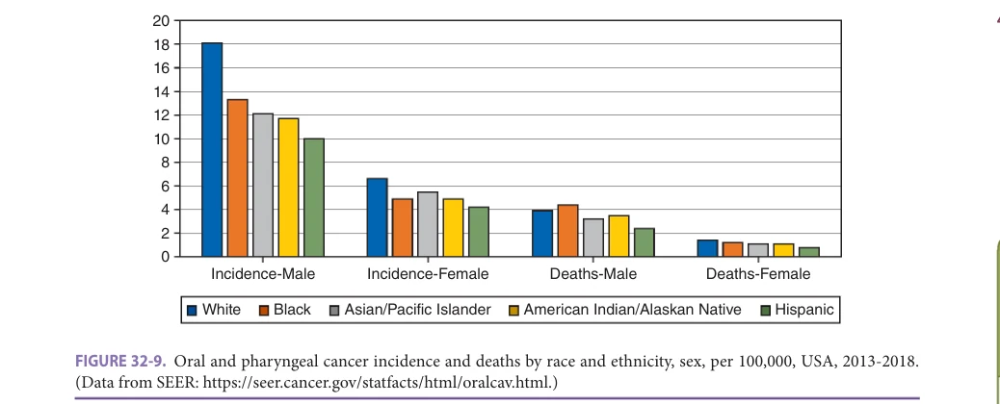

*FIGURE 32-9. Oral and pharyngeal cancer incidence and deaths by race and ethnicity, sex, per 100,000, USA, 2013-2018. (Data from SEER: https://seer.cancer.gov/statfacts/html/oralcav.html.)*

*Owner annotations/highlights are from the marked source copy, not the book.*

disease, chemotherapy, joint replacement, or heart murmurs. Another goal is to establish appropriate antianxiety premedication regimes for patients with psychiatric, social, and medical conditions to ensure that optimal dental treatment can be rendered efficiently.

## KEY FEATURES OF AN ORAL EXAMINATION FOR NONDENTAL CLINICIANS

When performing an intraoral assessment, the clinician should use a strong light source and take the time to systematically review all anatomic landmarks in the oral cavity. An instrument such as a dental mirror or tongue blade plus use of fingers with a dry gauze can be used to isolate and retract tissues within the oral cavity to properly access and evaluate each structure. For example, it is impossible to evaluate the floor of the mouth without physically retracting the tongue and gaining direct vision. At a minimum, an oral health screening should include the hard palate, soft palate, uvula, tongue, cheek, lips, floor of the mouth, gingiva/gums, and teeth. It is important to document and report any findings in a referral for dental treatment. This report should include any mobile, decayed, missing, or fractured teeth along with any structure that is loose or does not follow normal size, color, or texture. Any sign or symptom of an abscess or infection in the oral cavity should be reported immediately. If a physician starts the patient on a course of antibiotic for a dental infection, that should also be noted to avoid repetition of the antibiotic.

## ORAL HEALTH IN LONG-TERM CARE

By the time of transition to a nursing home for long-term care, many frail older adults already need dental care. There is a clear need for community-based prevention before older people require long-term care. Prior to embarking

on programs to prevent caries and other oral diseases in older people using, for example, fluoride varnish, patient navigation, and patient-centered counseling, it is important to take a community-based participatory approach to find out what older people want, and what would be acceptable options for preventive care.

As the end of life draws near either in the long-term care setting or at home, goals of dental care may shift from aggressive treatment to a focus on comfort, safety, dignity, and preservation of function. In a Delphi study of the goals of oral health in long-term care, the 10 most important goals are shown in Table 32-7.

The overall goal in these special populations is to be proactive as opposed to waiting for problems to arise. Prevention and early detection are paramount to avoid more complex problems that may require a more invasive treatment plan for the patient. In many cases, this increases the financial burden for the patient, the family, or the facility.

First, it is important to identify any limitations the patient may have. Oral health care should ideally be

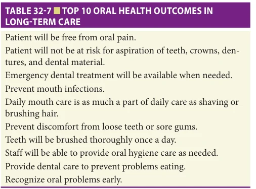

*TABLE 32-7 ■ TOP 10 ORAL HEALTH OUTCOMES IN LONG-TERM CARE*

*Owner annotations/highlights are from the marked source copy, not the book.*

**[p. 466]**

practiced in the morning when the patient wakes up, after each meal, and at their hour of sleep. In some cases, patients are not able to gain access to care at each of these points in a day due to the lack of available assistance. When assistance is available, the oral hygiene should be practiced as often as possible, but no less than twice daily.

When obstacles are introduced, such as a patient with arthritis who is unable to hold the small handle of a toothbrush, the plan needs to be modified so it is doable. The solution to this example could be as simple as creating a larger handle by wrapping a sponge around the brush and securing it with medical tape, placing two small slits in a tennis or racquet ball and sliding the brush into the slits, securing the brush in a bicycle handle or purchasing an electric toothbrush with a larger handle. In most cases, the action of the electric brush can take the place of the movements that once were accomplished by the patient.

It is also important for patients to continue to see the oral health team on a regular basis. The number of visits needed for older adults could range from quarterly to semiannual or an annual evaluation for the edentulous patient. These routine visits along with a strong care plan for twicedaily oral hygiene will greatly decrease the risk of complex

problems arising in the oral cavity. The patient’s physician should communicate any major health changes to the oral health team, who will be able to assist in finding solutions for new barriers. When delivering oral health care within a long-term facility it is important to consider the cooperation and participation of the staff, patients, their families, and the administration. Without the support of the administration, delivery of oral health care is difficult. There are many models that can be designed to best fit the needs of each specific population. At a minimum, the facility should provide the space and time required to properly treat each patient and allow staff access for in-service training as required by the facility.

## ACKNOWLEDGMENTS

The late Dr. Jonathan Ship wrote this chapter in the 6th edition. While we are not able to include him as an author in this chapter, much of the material from that chapter has been retained in this edition. The authors are grateful for Dr. Ship’s enduring leadership and lifetime contributions to the field of geriatric dental medicine and oral health in the older adult population.

## FURTHER READING

Atkinson JC, Grisius M, Massey W. Salivary hypofunction

and xerostomia: diagnosis and treatment. Dent Clin North Am. 2005;49(2):309–326. Bernabé E, Sheiham A. Age, period and cohort trends in

caries of permanent teeth in four developed countries. Am J Public Health. 2014;104(7):e115–e121. Calabrese J, Friedman P, Rose L, Jones J. Using the GOHAI

to Assess Oral Health Status of Frail Homebound Elders: Reliability, Sensitivity & Specificity. Special Care in Dentistry, October 1999. Chalmers JM, Carter KD, Spencer AJ. Caries incidence and

increments in community-living older adults with and without dementia. Gerodontology. 2002;19(2):80–94. Dye BA, Li X, Beltrán-Aguilar ED. Selected oral health

indicators in the United States, 2005–2008. NCHS Data Brief, No 96. Hyattsville, MD: National Center for Health Statistics; 2012. Dye BA, Li X, Thornton-Evans G. Oral health disparities as

determined by selected Healthy People 2020 oral health objectives for the United States, 2009–2010. NCHS Data Brief, No 104. Hyattsville, MD: National Center for Health Statistics; 2012. Eke PI, Dye BA, Wei L, et al. Prevalence of periodontitis in

adults in the United States: 2009 and 2010. J Dent Res. 2012;91(10):914–920. Gibson G, Jurasic M, Wehler C, Jones JA. Supplemental

fluoride use for moderate and high caries risk adults: a systematic review. J Pub Health Dent. 2011;71:171–184.

Greenberg MS, Glick M, Ship JA. Burket’s Oral Medicine:

Diagnosis and Treatment. 11th ed. Hamilton, OH: BC Decker; 2007. Griffin SO, Griffin P, Li CH, Bailey WD, Brunson D, Jones

JA. Changes in older adults’ oral health and disparities: 1999 to 2004 and 2011 to 2016. J Am Geriatr Soc. 2019;67(6):1152–1157. Griffin SO, Jones JA, Brunson D, Griffin P, Bailey WD.

Burden of oral disease among older adults and implications for public health priorities. Am J Public Health. 2012;102(3):411–418. Griffin SO, Regnier E, Griffin PM, et al. Effectiveness

of fluoride in preventing caries in adults. J Dent Res. 2007;86(5):410–415. Jones JA, Brown EJ. Target outcomes for long-term oral

health care: a Delphi approach. J Public Health Dent. 2000;60(4):330–334. Jones JA, Spiro A III, Miller DR, Garcia RI, Kressin NR. Need

for dental care in older veterans: assessment of patientbased measures. J Am Geriatr Soc. 2002;50:163–168. Migliorati CA, Siegel MA, Elting LS. Bisphosphonate-

associated osteonecrosis: a long-term complication of bisphosphonate treatment. Lancet Oncol. 2006;7(6): 508–514. Musacchio E, Perissinotto E, Binotto P, et al. Tooth loss

in the elderly and its association with nutritional status, socio-economic and lifestyle factors. Acta Odontol Scand. 2007;65(2):78–86.

**[p. 467]**

National Cancer Institute. SEER Stat Fact Sheets: Oral

Cavity and Pharynx Cancer. Available at https://seer. cancer.gov/statfacts/html/oralcav.html. Accessed October 26, 2020. Pretty IA, Ellwood RP, Lo EC, et al. The Seattle Care Path-

way for securing oral health in older patients. Gerodontology. 2014;31(suppl 1):77–87. Slade GD, Akinkugbe AA, Sanders AE. Projections of U.S.

edentulism prevalence following 5 decades of decline. J Dent Res. 2014;93(10):959–965.

Spielman AI, Ship JA. Taste and smell. In: Miles TS,

Nauntofte B, Svensson P, eds. Clinical Oral Physiology. Copenhagen: Quintessence Publishing Co. Ltd; 2004: 53–70. Terpenning M. Geriatric oral health and pneumonia risk.

Clin Infect Dis. 2005;40(12):1807–1810. Yoshikawa M, Yoshida M, Nagasaki T, et al. Aspects of

swallowing in healthy dentate elderly persons older than 80 years. J Gerontol A Biol Sci Med Sci. 2005;60(4): 506–509.

**[p. 468]**
