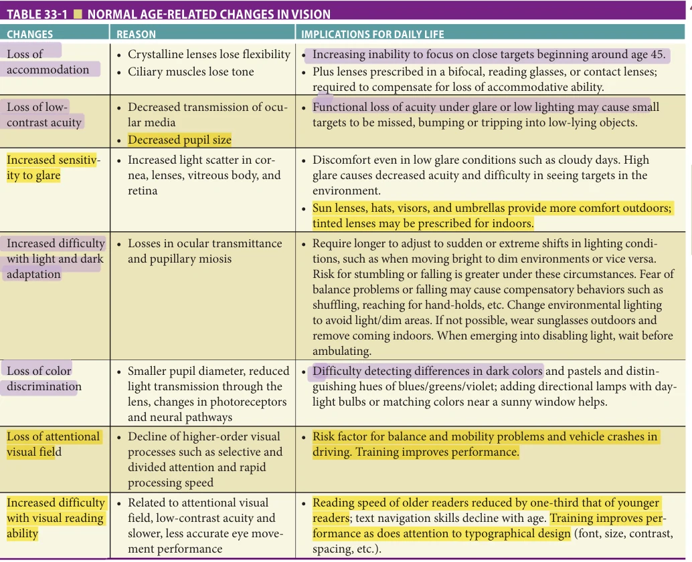
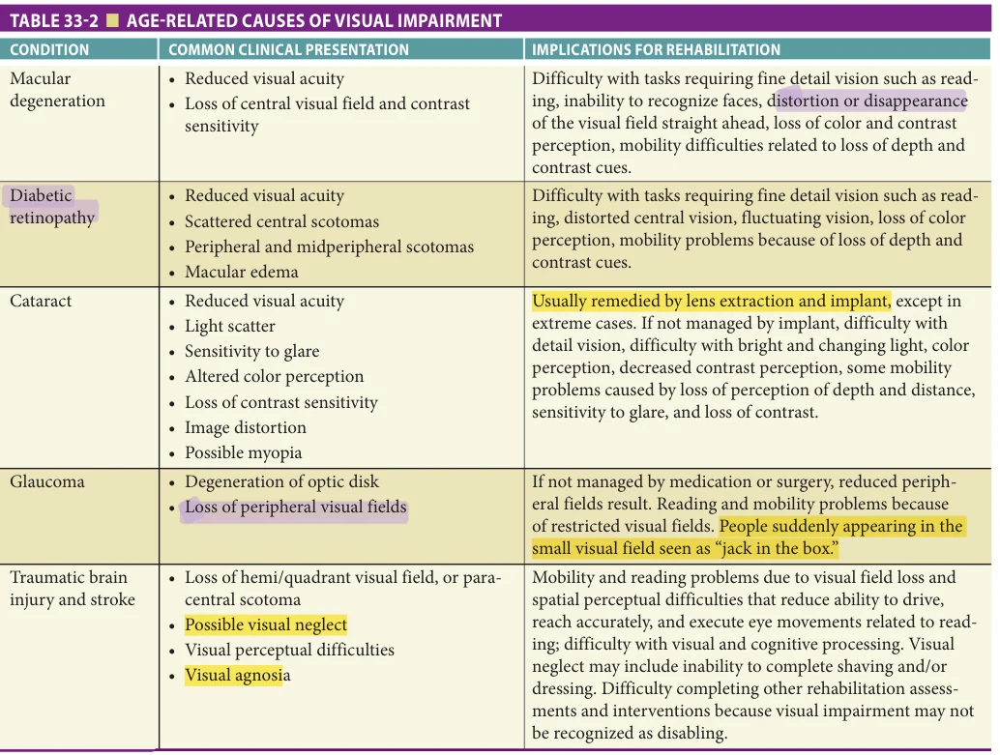
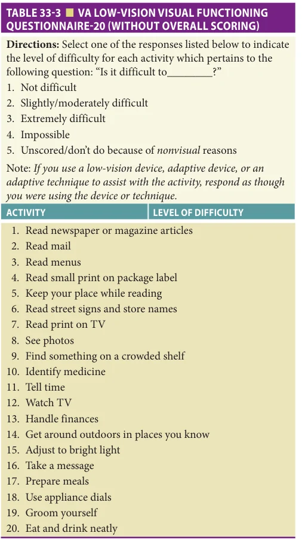
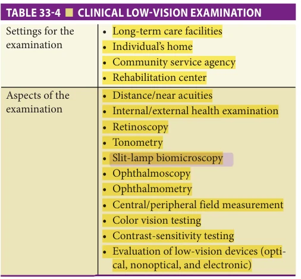
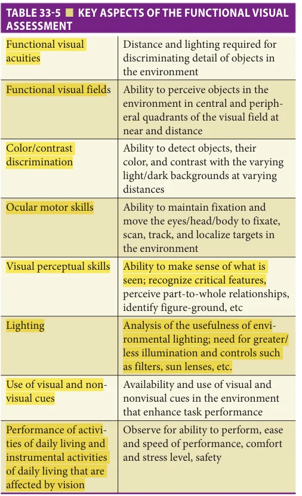
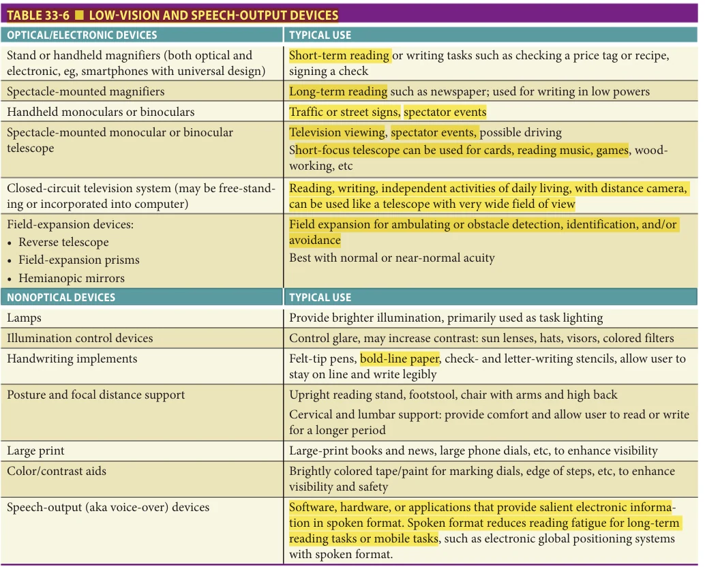
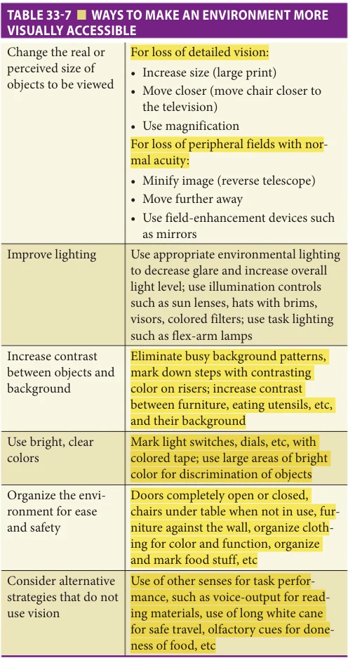
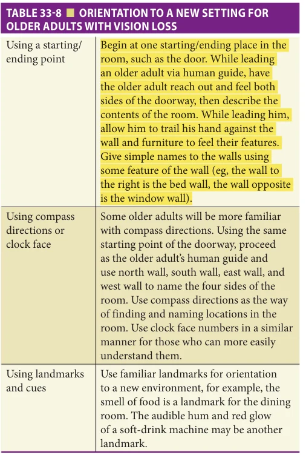

# Hazzard's Geriatric Medicine and Gerontology, 8e - Chapter 33: Low Vision: Assessment and Rehabilitation

Gale R. Watson, Katharina V. Echt

> **Status.** Fast build from the book; not lane-reviewed.

> Cited in the 2020-22 past papers (Hazzard 7e, linked by chapter).

> **Source and method.** Printed pages 469-488, from the marked 8th-edition copy (PDF page = printed page + 34). Prose follows its text layer; tables and figures are source-page crops. The book is canonical.

**[p. 469]**

## DEMOGRAPHICS AND ECONOMICS

### Population Studies

Many large, population-based, cross-sectional studies have documented the increase in prevalence of eye disease and visual impairment with increasing age, particularly in people older than 75 years. Greater prevalence of vision loss in the population with advancing age is a common feature across available data reports, despite a fair degree of variability in estimates and projections as a function of data type, source, definitions, and approach. Year 2020 prevalence estimates for vision loss in the United States, for instance, are 4.8% (16 million) of the population and 10% of those age 50 and older (12 million; International Agency for Prevention of Blindness Vision Atlas, https://www.iapb.org/learn/ vision-atlas). The Centers for Disease Control and Prevention (CDC) and the National Centers for Health Statistics (NCHS) estimate the prevalence of significant visual impairment among Americans age 18 to 44 is 5.5%; the prevalence in those age 45 to 74 is approximately 12% and is rising to more than 15% for those age 75 and older. Indeed, according to a 2016 National Academies of Sciences, Engineering, and Medicine Report, of all adults with vision impairment or blindness who were 40 years and older in 2015, nearly half (48% or 2 million) were at least age 80. Projections for the year 2050 indicate the proportion of US adults age 80 and older will expand to account for 63% (5.6 million) of adults age 40 and older with vision impairment or blindness. After age 85, one in four older people are vision-impaired—unable to read, drive, recognize faces, and perform everyday activities without assistive devices and rehabilitation training. The prevalence of all forms of vision loss are projected to increase. Higher numbers of visually impaired older adults are non-Hispanic White women.

#### Learning Objectives

- Understand the prevalence of vision impairment among older adults, its functional implications, as well as the costs to the older adult who develops it, to the family, and to society.

- Understand the normal age-related vision changes, and recognize functional indications and losses of the most prevalent age-related eye diseases.

- Care for older adults who have vision loss with evaluations, recommendations, supportive education, and appropriate referrals to eye care and rehabilitation providers.

- Assure that older adults with low vision who are in longterm and palliative care have their specific visual needs addressed.

#### Key Clinical Points

1. Visual impairment among older adults is treated through examination, prescription, and recommendation of assistive devices and interventions, rehabilitation training, and education of family and other health professionals.

2. Vision loss among older adults is associated with depression, comorbid health problems, and other disabilities. Treatment and rehabilitation for vision loss increase independence and mental health. (Continued)

**[p. 470]**

3. Geriatricians can play an important role in assuring that older adults receive lowvision rehabilitation and supporting the full range of services that can be provided.

4. Addressing visual impairment and assuring that older adults maintain their visual abilities and strategies can be included as a part of long-term and palliative care plans.

### Cost of Age-Related Vision Loss

Age-related visual impairment is not only challenging to the person who develops it, but also affects society as a whole. The total economic burden of eye disorders and vision loss in the United States has been estimated at $139 billion for the year 2013. More than half of these costs ($77 billion) were incurred by Americans age 65 and older, with $30 billion direct medical expenditures for eye disorders and low vision care, vision aids, adaptations, devices and assistance.

Medicare beneficiaries with coded diagnoses of vision loss incurred yearly eye-related costs ranging from $237 to $407 per patient depending on severity of loss. Beneficiaries with vision loss were also shown to incur an additional $2.1 billion in non–eye-related medical costs. Additional non–eye-related costs per patient yearly were $2193, $3301, and $4443, respectively. Health utility (distress, pain, depression, lack of mobility, social limitations) was converted into quality-adjusted life years, and the total lost value for this factor was $11 billion. Significantly higher overall health care utilization and expenditures among patients with vision loss relative to patients without vision loss is a persistent issue consistent with comparatively higher prevalence of chronic comorbidities in this population. Vision loss may in fact amplify mortality and morbidity risk associated with this greater chronic comorbidity burden.

Patients with vision loss experience a number of health care access barriers. Gaining physical access to providers and other health professionals and health facilities as well as difficulties with patient–provider communication and limited availability of accessible health education and information to support adherence to recommendations and self-care following health care visits and stays elucidate some of the ways in which vision loss can limit effective patient-centered care. Having vision impairment was associated with lower patient satisfaction with care ratings among Medicare beneficiaries in 2017.

Recent analytic population health reports describing specific health care utilization disparities among older adults with vision loss affirm prior reports regarding the economic impact of eye disorders and vision loss in the United States. Older adults with vision loss were less likely to complete recommended preventive health screenings,

had longer average length of hospital stay, higher readmission rates, and higher incurred hospitalization and post-discharge costs relative to comparisons without vision loss. While more remains to be understood, it is clear that prevention of vision loss in the first place, or early detection and timely referral for low vision assessment and rehabilitation are key to minimizing the significant health, disability, and economic burdens exacted by vision loss in aging.

### Related Impairments

Vision loss is reason enough for a decline in function among older people, but vision loss has also been associated with declines in cognition, hearing, mobility, well-being, and overall quality of life. Older visually impaired people are twice as likely to have difficulty walking as do sighted peers, three times more likely to have difficulty getting outside, more than twice as likely to have difficulty getting in and out of a bed/chair, and three times more likely to have difficulty preparing a meal.

The most prevalent age-related causes of visual impairment in the United States are macular degeneration, diabetic retinopathy, glaucoma, and cataract. Approximately 60% of people with visual impairments who are not institutionalized have one or more additional impairments. These include the loss of hearing, impaired mobility and greater falls risk, decreased energy and stamina from respiratory and heart disease, and cognitive changes resulting from stroke or dementia. Vision loss has been ranked third, behind arthritis and heart disease, among the most common chronic conditions causing older people to require assistance with activities of daily living (ADLs). Because the majority of people with visual impairments have useful vision, rehabilitation services and vision-enhancing techniques and devices offer opportunities to increase their visual and general functional capacity.

## AGING AND LOSS OF VISION

### Normal Age-Related Changes in Vision

Every older person experiences age-related changes in vision. The majority of these age-related changes are not amenable to correction with spectacles. Table 33-1 summarizes the age-related changes that cause functional declines for older people. Decreased transmission of the ocular media, increased scatter in the cornea, lens, vitreous body, and retina as well as decreased pupil size are related to anatomic changes in the aging eye. The age-related changes discussed here are those that have the greatest impact on function in daily life. The importance of accommodating these typical, age-related changes in visual function cannot be overstated. Age-related changes in vision affect nearly all older adults and manifest in the absence of eye pathology. Their impacts on aspects of health self-management and cognitive function, for instance, are only beginning to be appreciated. Age-related changes in vision must be taken in account when considering the daily living, quality of life, and the design of facilities for all older people.

**[p. 471]**

*TABLE 33-1 ■ NORMAL AGE-RELATED CHANGES IN VISION*

*Owner annotations/highlights are from the marked source copy, not the book.*

Accommodation The ability to accommodate for focus on visual targets from distance to near, which is dependent on a flexible crystalline lens and the ciliary muscle, is altered with age, beginning around age 45. During this change, an increasing amount of plus in a concave lens (usually prescribed in bifocal lenses or reading glasses) is required to boost the focusing power of the eye to compensate for the loss in refracting ability of the lens for near tasks.

Visual acuity The visual acuity of nonvisually impaired older people shows only a modest decrease under high-contrast conditions, but reducing the illumination of an acuity chart, reducing the contrast of the acuity chart, and/or adding surrounding glare, produces drastic age-related acuity losses, as compared to young observers. For example, in a sample of 900 older observers, for those at age 82, the median high-contrast visual acuity was 20/30, low-contrast highluminance acuity was 20/55, low-contrast low-luminance acuity was 20/120, and low-contrast acuity in glare conditions was 20/160. The added challenge of less than optimal lighting and/or contrast between the letters and their

background means that older adults have difficulty resolving detailed visual information at the same distance as younger observers. The combined challenge of low contrast stimuli and less than optimal illumination significantly reduces visual acuity relative to young comparisons. A young observer loses only about one line of acuity under similar conditions. Thus, older adults’ visual acuity is dramatically reduced under less than optimal viewing conditions. Older people need higher contrast and two to three times more light to see than a younger person. Low contrast and low lighting adversely impact the visual function of older people, and modification of visual materials and environmental lighting are helpful.

Adaptation to changing lighting conditions Because of anatomic changes in the eye and media, older people require more light to support adequate vision; however, they are also more sensitive to glare, such as very bright direct light or reflected bright light in the environment. As a result, older adults are more likely to experience momentary glare disability and take longer to recover from glare exposure

**[p. 472]**

(eg, camera flash, bright headlights) relative to younger persons. The adverse effects of glare may have the most impact on activities such as walking outdoors or driving, but may affect indoor activities as well. Because adaptation to changing levels of light is slowed in aging, the momentary vision loss and visual discomfort experienced when moving between dim and very bright environments (eg, from a dim restaurant, or theater, into a sunny day) may limit how well important targets that must be viewed for the sake of safety are seen. Glare sensitivity has been associated with motor vehicle accidents for older drivers.

Attentional visual field Attentional visual field, the visual field area over which one can detect and process rapidly presented visual information, declines with age. Unlike conventional measures of visual field that assess visual sensory sensitivity (such as static flashing lights), attentional visual field relies on higher-order processing skills such as selective and divided attention and rapid processing speed. Decreased attentional visual field has been correlated to a greater incidence of driving accidents and is related to a greater risk for balance and mobility problems for nonvisually impaired older people. Attentional visual field can be improved with training, but such training is not widely available.

Reading rate Visual reading ability decreases with age as well. The reading rate of older people who do not have a vision loss and have good high-contrast visual acuity still decreases by as much as a third of that of young readers. Accuracy of reading, however, can remain comparable to that of younger readers. Reading performance among older people with good acuity (20/30) is highly correlated with attentional visual field; those with good reading performance into very old age also retain good attentional fields as well. Low-contrast visual acuity is also correlated with reading performance for this population; older people with poor low-contrast acuity tend to read more slowly. Even when high-contrast acuity is good, older people, especially the oldest old, are at risk for reading difficulties that may arise from a combination of reduced attentional visual field, reduced accuracy and efficiency of eye movements, and poor low-contrast visual acuity. Reading ability can be supported by optimizing lighting, contrast and typography (font size and type, spacing, leading, kerning, line length) of text materials. Moreover, reading rate for nonvisually impaired older adults with good high-contrast acuity and good comprehension skills can be improved with training. Training in reading efficiency that emphasizes improvements in eye movements for reading similar to those exercises used to improve reading for school children has given good results for this population. Such training, however, is not widely available.

Color discrimination Color discrimination is another aspect of vision that declines with advancing age. People who are older have greater difficulty detecting differences between very dark colors (eg, brown, black, or navy). Particularly

challenging are tasks that involve green-blue-violet color discriminations, or distinguishing between very light, pastel colors (eg, light yellow, peach, light green, light blue— common medication pill colors). Loss of color vision in old age is related to smaller pupil diameter (miosis), reduced light transmission through the lens which yellows and thickens with age, and changes in photoreceptors and neural pathways.

Dark adaptation Dark adaptation ability and speed decline as a result of losses in ocular transmittance and pupillary miosis resulting from the aging process. Difficulty with slowed dark adaptation can be limiting to older adults moving from light to dim environments and vice versa. The risk for stumbling or falling may be greater under these circumstances (eg, exiting a theater into a bright, sunny day). During the protracted adaptation period the nonvisually impaired older person may function as if severely visually impaired when required to transition quickly between environments with drastically different levels of illumination.

Spectacles and falls risk Although not related to a change in vision per se, care must be taken in providing refractive correction in spectacle form for geriatric patients. Multifocal spectacle lenses either in the form of bifocals or varifocals are commonly prescribed but are associated with a higher risk of “edge of step” accidents, and multifocal lens wearers are twice as likely to fall as single-focus lens wearers. A large percentage of these falls are reported to occur outside the home, perhaps as a result of tripping or stumbling resulting from obstacles not seen in the near-vision correction of the lower visual field. The bifocal portion of a spectacle correction provides additional dioptric power to provide vision at near distance for reading, etc. This means that objects outside this near-focal range, such as steps, curbs, stairs, pets, etc., are blurred and indistinct. This effect is greatest in older patients, as the need for extra dioptric power for near vision increases with age. Patients with multifocal correction are encouraged to tuck their chins and look over the top of the bifocal correction when moving so that they can look through the distance correction in the upper portion of the lenses, but head flexion significantly increases postural instability. Encouraging those who are at risk for falling to explore these issues with their eye care specialists, who may recommend separate “near” and “distance” spectacles or other solutions, can be an important aspect of falls prevention.

The changes in healthy aging vision described above are common and experienced by nearly all people as they grow older. This does not minimize the importance of using, and recommending, the strategies described above to minimize the impacts of age-related changes in visual function on daily life. The impacts of the aging visual system described are evident in the absence of eye conditions or disease and amplify functional impairments if pathology does develop. The most prevalent age-related causes of visual impairment are described next.

**[p. 473]**

### Prevalent Age-Related Causes of Visual Impairment

Age-related macular degeneration Functional vision loss due to age-related macular degeneration may include metamorphopsia (visual images appear distorted and wavy), relative scotomas, as well as dense central scotomas for those whose pathology progresses to visual impairment. Individuals with central scotomas in both eyes usually develop a strongly preferred retinal locus or loci (PRL) that performs as the primary fixation reference, although the patient may not always be aware that there is a scotoma present. The loss of central visual field results in loss of visual acuity and contrast sensitivity. The ability to use the PRL that develops for fixation may be difficult for many people. The effects of macular degeneration on daily life include difficulty with reading print, inability to recognize faces (that can lead to reluctance to participate in social activities), difficulty with distance and depth cues (that adversely affect safe mobility), and loss of color and contrast sensitivity (that interferes with a variety of household and work/leisure tasks) (Table 33-2).

Diabetic retinopathy The progression of diabetic retinopathy includes macular edema that may cause blurred

vision if the fovea is involved, retinal hemorrhages (and/or laser treatments), which may result in scattered central, peripheral, and/or midperipheral scotomas, and retinal detachment, which can cause larger areas of field loss if not reattached. Diabetic retinopathy can progress to total blindness. Loss of function can include decreased visual acuity, scattered field loss over the retina, metamorphopsia across the retina, increased sensitivity to glare, and loss of color and contrast sensitivity. If the fovea is lost to scotoma, then a PRL or multiple PRLs will likely develop. Vision fluctuations can be manifested over time as macular swelling increases or subsides, and can also be related to hemorrhage. Sudden vision loss is common following hemorrhage, with the patient describing episodes of smoky vision, a dropped veil over the eye(s), or seeing black or red strings across the field of view. Treatment and absorption of blood can improve acuity, though not usually to normal levels. The effects on daily life include difficulty reading print materials, difficulty recognizing faces, increased sensitivity to glare and light/dark adaptation, difficulty with distance and depth cues, loss of color and contrast sensitivity, and fluctuating vision.

*TABLE 33-2 ■ AGE-RELATED CAUSES OF VISUAL IMPAIRMENT*

*Owner annotations/highlights are from the marked source copy, not the book.*

**[p. 474]**

Cataract Age-related cataract is manifested by gradual opacity of the lens, which interferes with the passage of light, causing reduced visual acuity, light scatter, sensitivity to glare, altered color perception, and image distortion (straight lines appear wavy). People with cataracts may experience trouble with glare and loss of contrast, may have decreased acuity, and report areas of metamorphopsia or small scotomas in the visual field. When the cataract has begun to interfere with lifestyle, surgery may be performed to remove either the entire lens or the posterior portion. Correction for the removal of the lens is provided primarily through intraocular lens implants, but occasionally eyeglasses or contact lens are used instead. Cataract surgery is the most common major surgical procedure done for people older than age 65 who are receiving Medicare funding. Cataract surgery with lens implantation is associated with improved objective and subjective measures of function in ADLs, as well as improved levels of vision to normal acuity in most cases.

Glaucoma Glaucoma is an increase in intraocular pressure caused by an abnormality in flow of aqueous fluid from the anterior chamber. It can cause a degeneration of the optic disk, loss of visual fields, and severe visual impairment. When left untreated, or if treatment is not successful, glaucoma results in a loss of peripheral fields and can lead to blindness. The effect of peripheral field loss on daily life is most problematic in safe ambulation. Because of field restrictions, the patients may not see objects in their path and may bump into objects that fall outside the field of view in any direction (street signs, tree branches, other people, etc). In addition, a person outside the patient’s field of view may suddenly be seen as a “jack-in-the-box” and create a startle effect. Peripheral field loss may also create problems in reading and writing as only a small portion of the page can be seen at once.

Traumatic brain injury and stroke Head injury to older adults from falls or automobile accidents resulting in traumatic brain injury (TBI), as well as brain injury due to strokes, can lead to visual impairment. Between 20% and 40% of strokes result in visual disorder that can inhibit cognitive functioning and may reduce the effectiveness of rehabilitation of the TBI. Visual field disorders can result from injury to the visual pathway anyway between the retina and the striate cortex. The optic chiasm is an anatomic landmark that differentiates the peripheral (prechiasmatic) and the central (postchiasmatic) visual pathway. Unilateral injury to the prechiasmatic pathway affects the ipsilesional field only, but postchiasmatic injury causes visual deficits in both monocular hemifields that are referred to as homonymous. Visual field disorders must be discerned by visual field measurement techniques called perimetry. Patients are often unaware of field loss and may not report the lost visual field/s, but they may suffer from their effects, for example, bumping into objects, tripping, falling, being unable to read, etc. Vision can be completely lost in the missing field, or some vision function (eg, light detection) may remain. The most common visual field losses are hemianopsia

(loss of half the visual field), followed by quadranopsia (loss of one quadrant) and paracentral scotoma (island of vision loss in the parafoveal region). Recovery of some visual field following injury may be spontaneous, and some patients learn spontaneously to adapt to visual field loss by oculomotor strategies; shifting gaze may reveal what is missing in the field of view of a street scene (such as an oncoming car) or the missing portion of a line of text. Systematic training in oculomotor adaptation and visual perceptual training can improve vision function and has the ability to improve the perceived visual field. Visual field loss may also be accompanied by visual neglect. Older adults with neglect may not spontaneously be able to attend to the neglected side. TBI may also result in disorders of visual space perception, which affect reach (over- or underreaching for objects, knocking objects over), driving (accidents resulting from inability to judge distance and depth), and reading (inability to plan and execute accurate eye movements). Visuospatial localization and orientation may be improved through training, but may not reach pre-TBI thresholds. Visual agnosia, a failure to visually recognize an object because of “mistaken identity,” is a disorder that is based in both visual-perceptual and visual-cognitive functions. Typically, misidentifications result from the incomplete or inappropriate use of object features such as size, shape, or color. Older adults with TBI may be unaware that they are ignoring other features that might assist with correct identification. Cognitive and/or communication disorders can make visual impairment more difficult to detect following TBI. Undetected or untreated visual impairment in TBI can limit the effectiveness of other TBI rehabilitation. For example, many cognitive and functional assessments use visual items that cannot be appropriately identified by older people with vision loss; visual motor assessments require eye-hand coordination. If TBI vision loss is not detected and treated to the extent possible, the examiner or therapist may get a false-negative impression of the level of TBI disability. In addition, the TBI patient will be frustrated and troubled unduly by participating in rehabilitation that does not simultaneously address the vision deficit. Integrated, interdisciplinary team-based care is key.

## ROLE OF THE GERIATRICIAN IN VISION REHABILITATION

After diagnosis and medical management of the patient’s vision loss, the geriatrician can play an important role in assuring that visually impaired people receive rehabilitation services that are of high quality, are sought in a timely manner, and provide all the benefit that the patients might be able to derive from them.

A geriatrician can provide the following services for their patients related to vision rehabilitation:

1. A visual acuity evaluation. Current best practice includes the use of a logarithmic visual acuity chart.

**[p. 475]**

2. A contrast sensitivity function evaluation. The PelliRobson chart is recommended for its ease of use and reliability. 3. A referral to a low-vision eye care specialist (ophthalmologist or optometrist) for the appropriate clinical low-vision evaluation and prescription of optical low-vision devices for tasks the older person can no longer perform, such as reading, writing, watching television, and recognizing street signs. 4. A referral to certified vision rehabilitation professionals for assessment and instruction of vision, and assistive devices for literacy, ADLs, safe travel, hobbies, etc. These therapists can also provide environmental analyses and teach the use of environmental cues. 5. Assistance to patients in preparing for rehabilitation by providing information and encouraging them to consider the goals they would like to achieve. Table 33-3 provides the questions and rating scale for the VA Low-Vision

*TABLE 33-3 ■ VA LOW-VISION VISUAL FUNCTIONING QUESTIONNAIRE-20 (WITHOUT OVERALL SCORING)*

*Owner annotations/highlights are from the marked source copy, not the book.*

Visual Functioning Questionnaire-20 (VFQ-20). The VA VFQ-20 is a modified 20-item questionnaire that is effective in assessing the impact of vision impairment on quality of life and is helpful in assisting patients in setting goals for rehabilitation. 6. Counseling or referral for coping with psychosocial issues related to visual impairment. Patients may not be forthcoming about these issues, so the physician must ask. Adjustment disorder and depression are associated with visual impairment for older people. When patients are dealing with loss of independence and control, lowered self-esteem, and strained social relations, counseling and/or psychotherapy may be recommended for both patients and family members. 7. Reinforcement of simple strategies to improve abilities, such as the use of saturated colors and contrast in the home environment, and the use of simple devices, such as sun lenses outdoors and brighter indoor environments. 8. Providing information to the patient and family about the variable nature of low vision, its effect on daily life tasks, and the variable nature of visual abilities according to fluctuations of light and contrast. 9. Sponsorship of, or referral to, support groups where older people with vision loss and their families can discuss problems, coping, and rehabilitation strategies they have learned with other patients. 10. Assistance in community awareness about the prevalence, treatment, and rehabilitation of visual impairment among older people.

Patients likely to benefit from vision rehabilitation include those with reduced acuity of less than 20/50 in the better-seeing eye, central or peripheral field loss with intact visual acuity, reduced contrast sensitivity, glare sensitivity, and/or light/dark adaptation difficulties as well as those with TBI. Candidates for cataract surgery with macular disease might also benefit from preoperative lowvision assessment and coincident rehabilitation training that enhances postoperative visual performance and satisfaction with a cataract procedure.

## ADAPTATIONS OF CLINICAL AND FUNCTIONAL EVALUATIONS FOR OLDER ADULTS

The clinical and functional low-vision examinations for older people should distinguish aging from treatable disease processes; focus holistically; incorporate family and caregiver support; identify what matters most to the patient; and set realistic patient-centered goals as part of interdisciplinary team-based plans of care to improve functional status and quality of life.

In health care service delivery to older adults with low vision, certain aspects of the examination sequence are adapted to accommodate these principles.

**[p. 476]**

### Case History Interview

Because most age-related visual impairments result in a central scotoma, most patient complaints will be related to the loss of acuity, loss of central visual field, and resultant decrease in contrast sensitivity and color sensitivity. Patient goals for rehabilitation will usually include reading, writing, independence in ADLs such as meal preparation and household maintenance, management of glare and other illumination concerns, leisure activities, and safe independent movement and travel. Older people may also have specific health-related activities that require the use of vision (eg, loading a syringe with insulin, changing an ostomy bag); these will be goals as well.

This information may be taken by a pre-examination telephone interview to lessen the amount of time the first examination visit might require. Because low-vision rehabilitation requires a great deal of energy and motivation from the patient, it will be guided by their personal goals for rehabilitation and by those tasks that are difficult or impossible to perform because of low vision. In this regard, the intake interviewer may find that some education is necessary in order to set reasonable goals for low-vision treatment. Because most low-vision interventions and assistive devices are “task specific,” it is important to state treatment goals as specifically as possible.

Because of the nature of the older person’s vision loss, professionals should become familiar with some key accommodations that assist in providing quality health care, such as the following:

• Always face, make eye contact, and speak directly to the older adult with visual impairment. • Allow the older adult to take your arm when moving from place to place in the environment, and use appropriate sighted guide techniques. If you are guiding a person with visual impairment by having the person take your arm, you are responsible for assuring that the path you are taking is wide enough to accommodate both of you. If the path is not wide enough (eg, a crowded hallway), ask the person to step behind you, while still holding your arm when walking. • Say your name when first coming into the room, and tell the older adult when you are leaving the room. • Do not leave the older adult with low vision standing alone in a hallway or room without a wall or furniture near to touch for orientation and balance. • Avoid using directional cues that are visual in nature such as pointing or giving directional references that are unclear to those with low vision. For example, instead of saying, “take that chair over there” say, “take the red chair against the white wall to your immediate right.”

### Clinical Low-Vision Evaluation

The low-vision eye care specialist (who may be an ophthalmologist or an optometrist) must be flexible and adaptable

to a variety of different environments, schedules, and communication styles. The conventional pattern of the lowvision examination will be followed including distance and near acuities; internal and external ocular health examination; retinoscopy; tonometry and slit-lamp biomicroscopy; ophthalmoscopy; ophthalmometry; determination of central and peripheral fields; color vision and contrast-sensitivity testing; glare testing; and near and distance testing of vision-enhancing devices, including optical, electronic, and nonoptical devices. For many older adults, especially those in long-term care facilities, a careful refraction and update of conventional spectacles may provide significant improvement in vision. Table 33-4 summarizes the aspects of the clinical low-vision examination.

Because of the nature of medical and long-term care service delivery to older adults, the low-vision examination and therapeutic intervention is often taken out of the office or clinical setting. There is a growing trend of providing low-vision services as a part of outpatient hospital care, comprehensive outpatient rehabilitation facilities, and long-term care facilities, such as nursing homes and private homes of older adults.

### Long-Term Care Facilities

Despite the fact as many as half the people in nursing homes have visual impairment, few nursing home residents receive low-vision care. For example, one study estimated only 25% of visually impaired patients at a long-term care facility who could potentially benefit from vision rehabilitation were referred for these services. Another study found that there was no difference in the referral rate for vision services for nursing home residents between those who complained about their vision and those who did not. Another study found that only 11% of all residents in 19 nursing homes had

*TABLE 33-4 ■ CLINICAL LOW-VISION EXAMINATION*

*Owner annotations/highlights are from the marked source copy, not the book.*

**[p. 477]**

received eye examinations in the last 2 years. Providing information about vision and vision impairment to the nursing home staff is important for assisting residents in using their remaining vision effectively. Because stroke is another common medical condition requiring rehabilitation for older adults, it is important that the low-vision team work closely with those professionals who diagnose, treat, and rehabilitate older adults who have experienced cerebrovascular accident. Currently, Hadley School for the Blind provides an online curriculum in visual impairment for in-service training for people with visual impairment and their family members as well as professionals and technicians who work with them (www.Hadley.edu). The use of curricular materials by longterm care staff has proven effective in increasing staff knowledge and positive outcomes for patients.

### Hospital Settings

Low-vision care is routinely provided to older veterans in the hospital system of the Veterans Health Administration (VHA). In the inpatient Blind Rehabilitation Centers, a veteran who is severely disabled is seen for up to 10 weeks of rehabilitation, including low-vision rehabilitation. Results from a national outcomes study indicate positive outcomes and veteran satisfaction from these programs that exceed the outcomes of rehabilitation in the private sector. The VHA also provides low-vision rehabilitation for veterans who are visually impaired but have remaining vision. In 2009, the VHA expanded low-vision services at medical facilities and in patients’ homes providing $40 million in funding for a continuum of care closer to veterans’ homes. Outcome studies of all VA vision rehabilitation services indicate that veterans who are provided low-vision services regain their ability to perform independent activities of daily living (IADLs) independently and become active community participants. VHA is the only national medical system that completely integrates vision and blind rehabilitation into the system of care. In fiscal year 2014, VHA provided inpatient, outpatient, and home-based vision and blind rehabilitation to approximately 29,000 unique patients. Further, there are approximately 50,000 severely disabled blind veterans on the rosters of VHA case managers, who assure that this vulnerable population receive all the VA benefits that should accrue to them. Hospitals in the private sector are increasingly providing services to older people as a part of outpatient services, and low-vision rehabilitation is often provided.

### Community Service Agency Settings

The Older Americans Act (OAA) is a major source for the organization and delivery of social and nutrition services for older adults as well as their caregivers. The OAA authorizes many services through a national network of 56 state agencies on aging, 629 area agencies on aging, 244 tribal organizations, and 2 native Hawaiian organizations representing 400 tribes. The OAA programs include community service employment for low-income older

Americans; training, research, and demonstration activities in the field of aging; and vulnerable elder rights protection activities. The Administration on Aging (AoA) oversees these OAA programs and services and maintains an online National Eldercare Locator searchable for local agencies and resources. Low-vision services or vision rehabilitation agencies in your area can be located by searching your state’s rehabilitation agency website or searching the American Printing House for the Blind’s Directory of Services (VisionAware: https://visionaware.org/), which includes directories of state agencies, independent service providers, and organizations that provide vision rehabilitation services.

### Private Home Settings

Pew Research Center estimates that 4 in 10 adults in the United States are caring for a sick or older family member at home. The number of caregivers increased 10% between 2010 and 2013; most caregivers surveyed were between 30 and 64 years. Approximately 70% of the older population requiring long-term care resides in the community. Senior residential retirement centers have increased in number. Most frail older people requiring care are living at home with family members and not in long-term care facilities. It is crucial that family members and caregivers understand the sometimes contradictory nature of visual impairment; for example, visual performance varies widely under different levels of illumination and can decline if the older person is fatigued. Comorbid conditions such as dementia, mobility impairment, and depression can affect how the older person uses vision and interprets visual images. Understanding the interaction of these factors will help family members in supporting the older adult achieve their goals for vision rehabilitation.

### Functional Visual Assessment

Whenever possible, a functional assessment should take place in the older adult’s daily environment. Specific goals for using vision independently stated by the older adult will guide the functional assessment to discover what visual target size, target distance, and visual skills are required to achieve that goal. For example, if the patient’s goal is to read the newspaper again, the target size requires approximately 20/40 or better visual acuity with spectacles and magnification, the target distance will be determined by the magnification device, and the visual skills required are precise visual fixation and saccades while maintaining the focal distance of the magnification device. The older adult must learn not only new visual strategies, but also new cognitive strategies to aid comprehension, even with a slower rate of reading. The functional assessment can also uncover the need to address other goals, the need for environmental assessment and modification, and to provide ongoing opportunities to educate the older adult and family about vision and rehabilitation. Table 33-5 presents the key aspects of the functional vision assessment.

**[p. 478]**

*TABLE 33-5 ■ KEY ASPECTS OF THE FUNCTIONAL VISUAL ASSESSMENT*

*Owner annotations/highlights are from the marked source copy, not the book.*

The functional low-vision assessment may be completed by a wide variety of rehabilitation professionals. Traditionally, the functional low-vision assessment of older people has been provided by a low-vision therapist, a rehabilitation teacher for the visually impaired, an orientation and mobility specialist, or some other professional from the field of visual impairment, such as an eye care technician or technologist. Now, as vision rehabilitation is increasingly a part of hospital services and comprehensive outpatient rehabilitation facilities, the functional assessment may be provided by a rehabilitation nurse, an occupational therapist, or some other rehabilitation professional who has received specialized training in low vision.

Regardless of the background of vision rehabilitation professionals, they should be well versed and experienced in basic optics of the eye, lenses, and low-vision devices; methods of observation and evaluation of visual skills for all daily tasks; the causes and functional implications of visual impairments; basic techniques of sighted guide and basic orientation and mobility; assessment of safety (falls, medication access, sharps, burns, etc); assessment

of literacy (reading, numeracy); assessment of the visual aspects of environment; and basic techniques of assessing and using technology such as optical devices (eg, magnifiers, spectacles, monoculars) and electronic devices (eg, Braille writer, smartphones, tablets, computers, and closed-circuit television [CCTV] system). The rehabilitation professional providing the evaluation may also be the rehabilitation therapist, in which case they must be familiar with techniques of instructing visual-motor skills for all daily, vocational and avocational tasks (with and without optical devices and access technology), task analyses, organization and time management, basic orientation and mobility, basic techniques of literacy, and safety in the home. The professional must also be familiar with tools and techniques that do not require the use of vision. There are situations in which using vision is not the safest or most efficient way to complete a task. In that case, other nonvisual strategies such as voice-over, use of Braille tags, use of a long cane on a dark street, etc, are more helpful. The rehabilitation professional will work closely with the eye care specialist providing the clinical low-vision examination, and the low-vision team may also include a counseling professional and any other professionals who are providing care associated with vision impairment or comorbid disabilities. Because many older people are at risk for multiple impairments, this team may also include other physicians, such as a geriatrician or physiatrist, orthopedist, speech, physical, respiratory, and recreational therapists, nurses, and technicians.

## MANAGEMENT OF LOW VISION

### Developing a Vision Rehabilitation Plan

The clinical low-vision examination and functional visual assessment culminate in a vision rehabilitation plan that summarizes the information obtained in the evaluations into clearly stated goals and objectives. If Medicare is funding the low-vision services, the plan will follow that format and requirements. In many cases, family members also may be involved. The implementation of the vision rehabilitation plan should emphasize a process using the principles of andragogy, or adult learning, that incorporate the older person’s values, beliefs, attitudes, and life experiences.

Following the clinical examination and functional assessment, the low-vision team will recommend lowvision devices (including optical, electronic, nonoptical, and environmental modifications) that will be evaluated to assess their usefulness by the older adult. There should be additional focus on the rehabilitation program and its adaptation for older individuals. Successful use of lowvision devices is related to the intensity of the instructional program. Research shows that specialized therapy in the use of visual skills and low-vision devices improve the abilities of low-vision individuals who are older to a greater extent than do the services provided by eye care specialists alone.

**[p. 479]**

### Low-Vision Therapy

Low-vision therapy is a crucial aspect of providing care. Therapy is dependent on the goals of the older adult and might include the following:

• Visual skills rehabilitation training including fixation, PRL ability for reading, and visual scanning for other visual tasks such as locating a traffic light or street sign. • Literacy assessment and training to improve reading accuracy, speed, comprehension, and duration. • Legible handwriting and written expression (including being able to read one’s own handwriting). • Use of low-vision devices for daily tasks. • Modification of the environment to enhance safety and ability to complete activities including lighting, contrast, organization, labeling, glare control, removal of hazards, and other safety measures. • Use of access technology such as computers, smartphones, tablets, global positioning devices, etc. • Guidance on safe functional movement within the known environment. • ADLs such as home maintenance, meal preparation and cleanup, clothing care, grooming, etc. • Strategies for self-management of health such as organizing and accessing medications, blood pressure check, diabetic management, ostomy care, etc. • Assessment and modification of work stations at home or away. • Information and education of caregivers such as understanding the functional implications of low vision and their effect on daily life, understanding the use of assistive devices. • Visual strategies for safe driving, or managing daily routines without driving. • Use of community resources for people who are visually impaired such as support groups, free services such as Library for the Blind talking books, Treasury Department’s free money identifier, low or no cost transportation, etc. • Referral to other practitioners in a broader low-vision team, for example, referrals for assessment and training in the use of long white cane for mobility, guide dog, Braille training, diabetic education, etc. • Emerging technology for adults with vision impairment has reduced much of the frustration of literacy and recognition of friends and family due to new technology.

### Instruction and Guided Practice Using Remaining Vision and Low-Vision Devices

Working with a low-vision therapist will provide an opportunity for the older adult to develop the appropriate visual skills; use optical devices and access technology; and learn to apply principles of color, illumination, and contrast that make the environment as conducive as possible to the use

of remaining vision. It is important to assist caregivers in understanding how rehabilitation interventions aid the older adult in accomplishing visual tasks. Family members and caregivers can provide important social support in this regard, but must understand the process in order to be most helpful. In a study of visually impaired older veterans, a supportive caregiver was the most strongly correlated variable to continued use of low-vision devices 1 to 2 years after they were prescribed. If at all possible, devices should be loaned for use in the daily environment before they are prescribed to assure that they are useful.

Some aspects of instructing the use of vision, prescribed devices, and access technology are particularly important when working with older people with low vision. Because of the potentially devastating consequences of falling, the low-vision therapist must be certain to address safety issues related to using low-vision devices that will prevent falls. Nausea, dizziness, and other aspects of motion sickness can be side effects of using magnification, and reducing them is an important aspect of instruction. Monoculars and binoculars should be used as spotting devices only, and older adults must never attempt to walk while viewing through them. If the older person’s goal is watching television or spectator sports, binoculars that are spectacle-mounted may be provided and the older person will use them only while seated.

Another factor to be explored in the use of low-vision devices for older adults is hand tremor. Hand tremor may be severe enough that handheld magnifiers or telescopes are not useful. The low-vision team may want to explore spectacle-mounted devices to avoid the difficulty of maintaining focus, if hand tremor is problematic.

Postural support and ergonomic considerations are important to using devices for people who are older. Because of the prevalence of back and neck pain, as well as limited stamina, it is important that the therapist assure the older person to be as comfortable as possible. The low-vision therapist will evaluate and demonstrate the use of appropriate ergonomic devices such as the appropriate chair and table, lumbar and cervical support, footstool, lamps, and reading stands. One study demonstrated that older adults who were supported according to ergonomic standards achieved significantly better reading performance.

Cognitive decline may limit the usefulness of low-vision devices for independent functioning; however, an additional goal can be added for rehabilitation—reducing caregiver burden. Vision rehabilitation for older adults with cognitive decline may include ergonomic solutions for comfort, increasing safety by providing good lighting for ambulation and other visual tasks, judiciously adding bold color and contrast for cuing activity and movement, and using simple assistive devices for common activities (eg, watching television on a larger screen, reading large-print books, getting a bright-colored snack from the refrigerator).

Finally, illumination is an important aspect of the instruction. Most older people need more light, but some

**[p. 480]**

may be extremely sensitive to light. An evaluation of a variety of lamps and overhead lighting situations is necessary, with the use of illumination controls that are individually recommended such as filters, absorptive lenses, hats with brims, and pinhole glasses.

### Low-Vision Devices

Low-vision devices are optical devices, electronic devices, lighting devices, ergonomic devices, access technology such as global positioning devices, accessible smartphones and tablets, and other tools that enhance the use of vision. Some devices, such as those optical devices that incorporate refractive correction, require special prescription. Others are simpler, such as lamps, reading stands, or large-print books. During the clinical evaluation and functional assessment, the low-vision team will discover whether magnification, minification, voice-over, or other nonoptical devices (such as large-print books, lamps, reading stands, etc.) will be useful for enhancing the vision. Table 33-6 summarizes the types of devices available and their uses. Devices are prescribed/recommended based on the goals of the older

person and most people require instruction and practice in their use.

Magnification devices may be categorized as four types: relative distance, relative size, angular, and electronic. Relative distance magnification is provided by bringing the device to be viewed closer to the eyes. Often older adults who want to recognize someone will move more closely to the face they want to see, exhibiting this type of magnification. Spectacle-mounted magnifiers focus the target image, such as print for reading, at ranges closer than the older eye can accommodate, and allow very close distances to be maintained. These lenses must be prescribed by an eye care specialist experienced in low vision in order to incorporate the refractive correction of the older person when required. Typically, these devices require a close focal distance and have a short depth of focus. Depending on the power and focal distance, they can be used for near tasks such as reading, writing, and viewing photographs.

Magnification may also be provided by stand or handheld magnifiers, which are often more familiar to older adults who may have used them previously for maps

*TABLE 33-6 ■ LOW-VISION AND SPEECH-OUTPUT DEVICES*

*Owner annotations/highlights are from the marked source copy, not the book.*

**[p. 481]**

or coins. These devices do not require a close eye-to-lens distance, but the closer to the eye the lens is held, the wider the field of view. Some are available with built-in illumination, which overcomes the problem of illuminating the target the older adult is viewing. Handheld magnifiers require a steady hand to maintain focus and may be fatiguing to use for long periods. Older adults who use stand magnifiers must wear their bifocal correction for visual accommodation, as the lens is set slightly inside the true focal distance of the lens in order to provide a better optical image at the periphery of the lens.

Relative size magnification is used whenever a target to be viewed is made physically larger. Examples of this are magazines and books that are printed larger than normal. Environments such as older adult high-rise apartments or condominiums and planned communities may also use enlarged signage, another example of relative size magnification.

Telescopic devices provide angular magnification by the use of a positive and negative lens in housing (galilean) or by the use of two positive lenses with an erecting prism (keplerian). Older adults may have used monoculars or binoculars in the past for sporting or other events and may have developed basic skills in their use. Older adults may use telescopic devices for identifying targets that are further away, such as street signs, sporting events, or television. The telescope may be handheld or may be mounted into spectacles for hands-free viewing. Mounted short-focus telescopes may be used for tasks that are closer, such as reading music from a stand or identifying cards on a table. Some older adults with visual impairment who meet visual and driving requirements may use miniature mounted telescopes (called bioptics) for driving.

The CCTV system, used by people who are visually impaired, is an example of electronic magnification. The CCTV provides a camera to focus on the visual task and the older adult sees the image projected onto an enlarged screened monitor or his television set. The visual task may be reading and writing from a desktop or the camera may be positioned for visual tasks at a greater distance such as seeing the minister and choir at church. The advantages of the CCTV include more magnification than any other device, a wider field of view, and color and contrast enhancement capability. CCTV offers a mechanism for the development of new technologies such as miniaturization, head-worn devices, and contrast enhancement.

Computer configuration with the CCTV can use multiple cameras to provide split-screen images for designing a workstation that simultaneously accesses computer, print viewing, word processing, and distance viewing.

Expanded field devices are helpful to older adults who maintain normal or near-normal acuity while experiencing decreased field of view, such as that caused by glaucoma or hemianopsias. Expanded field devices provide the ability to find targets by increasing the perceived view of a scene. For example, an older adult with restricted fields wishes to find

the arriving and departing flight monitors in an airport. By using a field-expansion device, these monitors can be more easily located and the user then moves closer to them in order to read the information without the device if central vision is intact. A reverse telescope functions similar to a peephole in a door, but with better optics. Another type of field-expanding device minifies in the horizontal meridian only. The visual field may also be expanded by the use of base-out prisms incorporated into spectacles. The base-out prism shifts the image in, allowing a small eye movement to see the expanded field. Small mirrors attached to spectacles may also be used for field expansion.

Universal design in small portable electronic devices such as smartphones and tablets has revolutionized the field of vision rehabilitation. These devices are manufactured with sensory access (both vision and hearing enhancements) included in each one manufactured. The visually impaired user merely accesses the settings to turn on magnification or voice-over controls in the device, and then downloads a myriad of applications that provide the ability to ask the current location; use navigation systems; read; capture spoken commands, notes and documents; turn on a flashlight in the device; take a picture and ask what the picture depicts; use a wireless keyboard to use the device as a computer and other activities too numerous to mention. Universal design for access is becoming a marketing strategy for companies; one large cable company recently announced voice-over for navigating channels and finding desired programming. For older adults who are technologically adept, accessible smartphones and tablets are quickly learned and highly used. For older adults who have struggled with computers and other technology such as “smart” microwave ovens, these access devices may be very frustrating. However, even very old adults who are cognitively intact can master these intricate but powerful devices with good rehabilitation techniques.

If a smartphone, tablet, computer, CCTV, or other electronic device is to be used visually, the eye care specialist will assure that the older adult’s vision is best corrected for the viewing distance of the screen. A pair of reading spectacles may be prescribed.

### Instruction in the Use of Devices That Enhance Remaining Vision

A sequence of instructional procedures covers several areas:

• Use of visual skills without low-vision devices • Use of visual skills with low-vision devices • Use of vision and low-vision devices for individualized functional tasks that lead to the accomplishment of defined goals

Instruction in the use of visual skills without devices covers fixation, spotting, localization, scanning, tracing, and tracking. Individuals with maculopathy (such as age-related macular degeneration or diabetic retinopathy)

**[p. 482]**

may require additional instruction in the development and maintenance of visual skills using the PRL.

Instruction in the use of visual skills with lowvision devices includes integrating unaided visual abilities with the unique demands of a low-vision device such as maintaining the focal distance or focusing the device, and adjusting eye and head movements to compensate for a restricted field of view through the lens. If the individual is using eccentric viewing (the use of a PRL other than the fovea), the instructor assures that the device selected allows the opportunity to maximize field and acuity in the eccentric position.

### Reading and Writing with Low-Vision Devices

Reading is a task that is so fundamental to our society and so disrupted by age-related visual impairment that it is the primary goal for vision rehabilitation among older adults. Readers with low vision can develop visual skills that are well-adapted to reading if they receive appropriate intervention. Most readers develop a strong PRL following the onset of central scotoma. The PRL is an area that will take over the function of fixation in an eccentric, nondamaged area of the retina. The reader may require instruction and practice in using the PRL for reading, especially because of the demands of using magnification to compensate for acuity loss. A Swedish study found that 71% of older adults with low vision could read the newspaper following rehabilitation, although at a 3-year follow-up that number had dropped to 48%. However, the number of fluent readers (70 words per minute or better) had increased from 41% to 48% over the 3-year period. These results indicate that those older adults with vision loss who persevere with rehabilitation strategies are able to continue improving their skills over time. In another study, people with macular loss who had a PRL below the scotoma exhibited faster reading rates, and the size of the atrophic area in the macula was the predominant limiting factor in reading; the larger the atrophy, the lower the reading rate. Reading rate is also related to visual span (number of characters available in the field of view) and the reserves of acuity and contrast sensitivity provided by the visual system and low-vision device. Accuracy of word identification and comprehension of reading, however, can remain near normal for readers with macular loss despite their slow rates. Readers with low vision often supplement visual reading with speech output devices such as spoken computer programs and books on audiotape.

Older adults with low vision can write effectively using a combination of magnification devices, lighting devices, stencils (templates for checks, envelopes, letters, etc. that assure that writing is spatially correct), and pens that provide more visibility.

Older adults who have good computer skills can substitute desktop computer, laptop, or smart phone for most low-vision devices and use the universally designed magnification, voice-over, and/or both to achieve reading and writing goals.

## ENVIRONMENTS FOR OLDER PEOPLE

The onset of visual impairment for older adults can make even the most familiar environment seem strange and hazardous. It is important that older adults be oriented to familiar and unfamiliar environments, and that the environment be as “userfriendly” as possible to increase independence and safety. There are a variety of rehabilitation techniques that assist in accomplishing this task. Table 33-7 presents the basic strategies.

### Improving the Lighting

Most older people require two to three times more light than do younger people for the same tasks, but those with cloudy media (cataract, keratoconus, vitreous floaters, etc) are more sensitive to glare. The challenge is to get enough light without creating glare, which can be disabling. For example, the glare from a sunny window onto a waxed

*TABLE 33-7 ■ WAYS TO MAKE AN ENVIRONMENT MORE VISUALLY ACCESSIBLE*

*Owner annotations/highlights are from the marked source copy, not the book.*

**[p. 483]**

floor, tabletops, and glass could cause objects in the dining room of a senior community to be obscured. An older person with low vision might function as if blind in that environment and be unable to find a chair, recognize his friends, serve his plate, or identify the food in a buffet line.

In an environment that is conducive for the function of older people, it is important to manage not only light, but also shadow, which can be conducive to function, for example, a triangular shadow at the end of a step indicates the height and depth of the step as well as how many steps are there. But shadow can also be hazardous, such as the shadow of a garden wall that obscures a sidewalk curb, causing a person to trip or fall.

Lighting is best if controllable, no matter what type it is. Many older people with low vision will require task lighting that can be positioned closer to reading/writing material or craft activity. Because the intensity of light is inversely related to the square of distance from its source, adding light at ceiling height will not provide adequate task illumination for older viewers. Task lights must be used that can be positioned closely, and therefore flex-armed lamps are best in this regard.

There are a variety of different types of bulbs that are useful and recommended for older viewers with low vision.

• Fluorescent lighting spreads evenly, is inexpensive and energy efficient, but provides less contrast because of that evenness and produces less shadow. It is a harsh light and flickers and may be bothersome to some viewers, causing headache and eye strain. Covering or shading fluorescent bulbs or bouncing the light from the ceiling to the eye may be helpful. • Incandescent light is easily directed and provides more contrast and shadow. But the light can pool, especially if provided by one bulb suspended from the ceiling, causing pinpoint glare or pools of light within relative darkness. Using multiple incandescent fixtures can eliminate this problem. Incandescent lamps are good for task lighting such as reading, sewing, or hobbies. • Halogen light uses the glow of halogen gas, as well as the incandescent filament to create a brighter light. The light is more blue and therefore may require filtering. Ultraviolet or blue light may generate superoxide and hydroxide free radicals that may be related to damage in the eye. Although controlled clinical studies have not been done, blue light has been suggested as increasing risk of cataract and macular degeneration. Subsequent studies have not shown a correlation to visible light exposure and risk, but many rehabilitation services are cautious about “blue light hazard.” An Australian study suggests that people with less melanin (ie, light-colored iris, fair skin) are at more risk from light. • Neodymium oxide and incandescent bulbs are currently touted as “full-spectrum lighting.” These bulbs emit fewer ultraviolet and infrared rays and provide a sharp drop in the emission of yellow light. The effect is a more vivid “true” color, similar to sunlight, so contrast is increased.

These types of lighting can be mixed to achieve effects that are most pleasing and comfortable for older people with low vision. A study exploring these types of lighting in reading lamps found strong preferences among older readers with low vision, but no differences in objective measures of reading performance based on the type of light. Thus, informed reader choice should guide the selection of the type of light for older readers.

Light/dark adaptation is another aspect of environmental lighting that must be considered. Most older people have difficulty traveling from bright areas to dim ones because their dark adaptation is not as efficient as in young adults. People with severely restricted field loss (eg, advanced glaucoma) become functionally blind in dim lighting. Avoiding light/dark areas in the environment such as a bright dining room and dim hallway is helpful. When these areas are unavoidable, the older person could use illumination controls such as sunglasses or brimmed hats to assist with light/dark adaptation. People with severely restricted visual fields who are at risk for falling when ambulating at night may use lightweight, very bright, portable lamps with long battery life that have been designed for night hunters.

### Increasing Contrast

Light/dark contrast is produced by the amount of light that is reflected from different surfaces (a light object is brighter than a dark one). A greater contrast between objects and their backgrounds make them easier to see. Therefore, providing an area of dark background and an area of light background in the bathroom, kitchen, and bedroom can help a person more easily identify possessions. For example, if a comb and brush are of light color, they may be kept on a dark tray. Most TV remotes are black, so they should be placed on a very light background. Similarly, marking the edge of stairs with contrasting colored tape makes each step more visible.

### Using Color

The ability to identify colors, especially darks and pastels, diminishes with age. Certain visual impairments, especially those that affect the cones, such as macular degeneration, also reduce color vision. However, bright, clear colors can be seen by most older people with low vision. For example, yellow against navy blue is very visible, because it combines both color and contrast cues.

### Using Organizational Strategies

Organization can be extremely helpful for the person with low vision. For example, always making sure that doors are completely open or completely closed, and placing chairs under the table when not used increases the safety of the environment. Organizing and labeling clothing by color and function in closets and drawers and organizing the kitchen can assist an older person in continuing to live

**[p. 484]**

independently. Learning new ways of performing daily tasks can make the loss of vision less of a problem in independent living. For example, retrieving a pair of spectacles that have fallen onto a light carpet might be difficult for some older adults. Learning a visual scanning pattern that begins at the site where the spectacles seem to have fallen and then continues in a circular pattern outward until they are found will assist in retrieving them.

Using color coding can be helpful as well. For example, chicken soup cans could be marked with wide yellow rubber bands, and tomato soup cans could be marked with wide red rubber bands. These markers could be quickly identified, avoiding the necessity for identifying the soup with a magnifier each time a can is retrieved from the cabinet. Brightly colored and nubby stick-on “dots” may be provided that provide both contrast and tactual cues for marking dials, buttons, and controls of appliances.

### Using Alternative Strategies

Even when an older adult with low vision retains useful vision for a wide variety of tasks, it is sometimes helpful to use alternative techniques that do not require the use of vision because vision may not be the most efficient or safest way of accomplishing some tasks. For example, even though an older adult may have useful vision for walking, he may find it best to use a long white mobility cane in order to detect drop-offs, so that vision can be used to seek landmarks for orientation. An older adult with low vision may use speech output (a program that speaks symbols or words) for most computer word processing so that limited stamina for reading and writing may be used for reading mail, which must be done visually. A metal plate called a “flame-tamer” may be placed on the eyes of a gas stove in order to avoid burns in the kitchen. Knowledge of a wide variety of rehabilitation strategies and tools will assist older adults with low vision in developing a repertoire of techniques and devices that allows them to complete tasks safely, efficiently, and effectively.

Orientation to a new setting requires some basic alternative techniques that can be used anywhere. Some older adults may be able to use all of the techniques; some may only need one or two. It is important to remember not to rush the older adult in orientation, whether it is a longterm care facility or physician’s office. These exercises may be repeated as often as necessary. Teaching family members these techniques may be helpful when new environments come up in the future. Table 33-8 presents an overview of these techniques.

## PSYCHOSOCIAL CONSIDERATIONS

### Adaptation to Vision Loss

Anxiety and depression are common reactions to loss, and age-related visual impairment is complicated by the other losses associated with aging. There are two schools

*TABLE 33-8 ■ ORIENTATION TO A NEW SETTING FOR OLDER ADULTS WITH VISION LOSS*

*Owner annotations/highlights are from the marked source copy, not the book.*

of thought on the timing of rehabilitation related to adaptation. Some rehabilitation professionals subscribe to a “loss theory” of psychological adjustment. This theory proposes that the person must “die” as a sighted person, and be “reborn” as a visually impaired person, incorporating the visual impairment into the sense of self. According to this theory, attempting rehabilitation would be fruitless until the process is complete. Others subscribe to the theory that anxiety and depression are related to a person’s negative stereotypes about visual impairment and a lack of confidence and motivation to attempt rehabilitation, but that if rehabilitation is successful, depression and anxiety should be reduced.

Older adults may hold many negative stereotypes associated with visual impairment: increased helplessness, inhabiting a world of darkness, increased vulnerability to crime, and the perception that use of devices marks them as different or to be pitied. Older adults with low vision may attempt to pass as fully sighted in order to avoid having others project these negative stereotypes onto them. But attempting to pass as fully sighted may cause other difficulties. For example, older adults with low vision do not recognize faces well, and the lack of a friendly hello when passing acquaintances may be interpreted as unfriendliness. Failure

**[p. 485]**

to use alternative techniques for identifying targets and moving in the environment may lead to falls, burns, or other safety hazards.

Support groups and peer counseling for older adults with low vision can be extremely helpful in coping with vision loss. Support groups may be found through local multiservice agencies for people who are visually impaired or may be started by senior citizen’s centers or other groups. Short-term professional counseling in conjunction with rehabilitation may be very helpful.

### Family and Social Support

In a recent study of low-vision device use among veterans, most of whom were older males with macular degeneration, family support was the most powerful predictor of continued use of devices up to 2 years following their prescription. Providing information and support to family members who are experiencing the impact of an older member’s vision loss can be powerful. Visual impairment is experienced by the entire family or caregiving system, not just by the older person, and both social and psychological concerns must be addressed. The loss of vision by one family member can disrupt roles in the family, create economic demands, and add stress when tasks previously performed by the older adult must be performed by someone else.

For family members who understand the functional implications of visual impairment, understanding the behavior of their older adult with low vision is easier. For example, understanding the effect of changing lighting conditions, the effects of glare, and the adaptation times when traveling from dim light to bright and vice versa, can help explain behaviors like shielding the eyes, shuffling the feet, hesitation, fear of falling, and ceasing previously enjoyed activities. The fact that an older adult with restricted visual fields may pick up a dime from the floor, then bump into a partially open door seems contradictory, but is perfectly explained by the functioning field of view.

Assisting older adults with low vision in continuing social activities, such as hobbies, crafts, games, and traveling can aid them in maintaining important contacts with family and peers. Social support and contact are associated with less depression in older adults with low vision. Support groups can assist older adults with low vision in completing and using their rehabilitation, as well as facilitating adaptation to vision loss. Peer support or mutual aid groups who meet regularly to share their concerns may be especially beneficial for older adults who may be overprotected, abused, or treated paternalistically by those who do not understand visual impairment or aging. Facilitating assertiveness for older adults with low vision is recommended because it is linked to less depression and more social support. Social skill training in assertiveness for older adults with low vision has been shown effective in decreasing depression, and in deriving greater satisfaction in life.

## FUNDING FOR LOW-VISION REHABILITATION

### Rehabilitation Services Administration

Vision rehabilitation services have been funded through private pay, or through vocational rehabilitation services for individuals who were preparing for the work force. Funding for services to older adults with vision impairment has been a critical health care issue in the United States. Public funding through Rehabilitation Administration Service for the Independent Living Services for Older Individuals Who Are Blind program under the Rehabilitation Act is minimal, with approximately $495 million allocated nationally in fiscal year 2014. These funds provide services in the traditional “blindness” system—state services or private agencies for the blind. State governments may also allocate funding for low-income older people to receive vision and blind rehabilitation as well.

### Veterans Health Administration

Prior to 2002, only older veterans with legal blindness who served in the US military and whose disability is serviceconnected had full access to comprehensive blindness and services through the Department of Veterans Affairs Medical Centers. However, most visually impaired veterans have age-related vision loss and their income is such that a copayment is required from them or from their private insurance carrier. Vision rehabilitation services were developed initially to meet the needs of blinded veterans returning from World War II. Young war-blinded men had few other medical problems, so efforts to rehabilitate them for the work force spawned the professions of orientation and mobility instructors, rehabilitation teachers for the blind, and low-vision therapists in order to meet their unique needs. Services for veterans who are visually impaired but not legally blind were provided nationally beginning in 2008. This specialized “blindness and low-vision” rehabilitation was not considered part of the broader medical rehabilitation. Credentialing of vision-rehabilitation professionals developed separately from occupational or physical therapists, and their practice was autonomous, requiring neither medical referral nor physician supervision. As a result, many medical professionals are unaware of their services and do not understand the “blindness” rehabilitation system in which their practice began. The Department of Veterans Affairs model of service delivery in vision rehabilitation continues today in the same vein. Services are provided nationally by teams of professionals. Ophthalmologists or optometrists provide the medical eye care services, and the vision and blind rehabilitation professionals are orientation and mobility specialists, rehabilitation teachers, and low-vision therapists. Recently the Department of Veterans Affairs appropriated $40 million to provide vision rehabilitation services in a continuum of care for patients who have low vision as well as those who are blind, in recognition that veterans are aging in place and

**[p. 486]**

require services close to home. The vision/blind rehabilitation service in this milieu is also unique in that prosthetic devices are provided. Devices such as magnifiers, telescopes, binoculars, CCTV system, computer equipment, accessible smartphones, and tablets are dispensed according to Veterans Affairs (VA) policy at no cost to veterans as a part of the VA’s commitment to vision/blind rehabilitation services.

### Medicare Funding for Vision Rehabilitation

The rise in older adults with low vision has spurred Medicare to produce a national policy of reimbursement as well. In 2002, the Centers for Medicare and Medicaid Services (CMS) released a national program memorandum to alert the provider community that Medicare beneficiaries who are blind or visually impaired are eligible for physicianprescribed rehabilitation services from approved health care professionals on the same basis as beneficiaries with other medical conditions that result in reduced physical functioning. This memorandum was issued in response to the committee report accompanying the FY 2002 Labor/ Health and Human Services/Education appropriations bill.

The memorandum further directed that the patient receiving services must have a potential for restoration or improvement of lost functions and must be expected to improve significantly within a reasonable and generally predictable amount of time. The rehabilitation that is covered is to be short term and intense; maintenance therapy is not covered. Applicable Health Care Common Procedural Coding System therapeutic procedures are outlined in the memorandum, as are applicable International Classification of Diseases (ICD)-9 codes that support medical necessity.

The effect of the program memorandum has been to increase the visibility of Medicare provisions for vision rehabilitation, but it is not a national coverage decision. Medicare carriers are not compelled by the memorandum to develop a Local Medical Review Policy as a result, and are still able to deny all claims that the local carrier does not deem medically reasonable or necessary.

In 2003, Congress authorized the Secretary of Health and Human Services to carry out a nationwide outpatient vision rehabilitation services demonstration project. The purpose of the project was to examine the impact of standardized national coverage for vision rehabilitation services in the home by physicians, occupational therapists, and certified vision/blind rehabilitation professionals. The 2003 Demonstration Project did not provide coverage for adaptive equipment (low-vision and blindness devices). The project proceeded for 2 years without clear results. The outcome of the project was status quo, with no new practitioners added to Medicare for reimbursement in providing care for older people with low vision.

To date, the national funding sources for providing vision and blind rehabilitation care continue to be CMS,

Department of Veterans Affairs, and Rehabilitation Services Administration.

## PALLIATIVE CARE FOR OLDER ADULTS WHO ARE VISUALLY IMPAIRED

Palliative care for older adults with visual impairment may focus on assuring that patients are able to see as well as participate in activities that mean the most to them; continue hobbies and other desired activities that relieve stress and help them to feel that life is as normal as it can be; participate in diversions that may assist in managing pain; participate in spiritual activities such as reading or listening to devotional materials that strengthen faith and may reduce anxiety and depression; and reduce caregiver burden.

In addition to the suggested strategies in the section of this chapter titled “Environments for Older People,” the following considerations may assist patients with visual impairment in palliative care.

• Assure that spectacle correction in eyeglasses is up-to-date. Assure that spectacles, magnifiers, and other useful devices are within patient’s reach, and are kept in the same known place, so that they may be used whenever desired. • Assure that patient’s autonomy is respected in longterm care. When entering the patient’s room, knock on the door and ask to enter the room; address the patient by name and identify yourself. • If the patient is not in their home environment, ask the patient how he or she performs ADL such as bathing, eating, and dressing, and how you can help. Include the patient, family, and palliative team in the plan. • Talk in a normal, natural tone of voice, face the patient directly, and if possible, make eye contact and explain what you’re going to do in detail before you do it (eg, taking blood or vital signs); ask permission or notify the patient before you touch him or her. • Always address the patient directly, even if family members are present. Don’t worry about saying the words “look,” “see,” or “blind.” • If the patient is in palliative care in a facility, describe the room layout including dimensions. Use compass directions to describe the location of objects in relation to the bed (eg, “you are facing north in the bed,” “the door is to the west”). • Place the phone, call bell, and bedside table within the patient’s reach in a known location, and let the patient know where they are. Do not move them. • Place the item in the patient’s hand, or the patient’s hand on the item, if needed. • Once you’ve oriented the patient to the room, alert staff to leave things in position. Notify the patient before you move, take, or add any objects (eg, furniture, trash can, grooming aids).

**[p. 487]**

• If the patient is mobile, use the “Human Guide” technique to assist the patient with ambulating: • Ask the patient from which side he or she would prefer to be approached and guided. • Extend your arm so that it touches the patient’s; he or she can grasp and follow your elbow. • While the patient is holding your arm, walk to his or her side, one step ahead, at a pace that is comfortable for him or her. • Use clock coordinates to describe the location of food on the plate and all items on his food tray. Ask the patient what assistance is needed.

• Indicate to the patient when you are leaving the room so she will know you are leaving. • Encourage the patient to use assistive devices (eg, talking clocks/watches, radios, speech-output reading devices, etc.). • Encourage the patient to use reading technology for pleasure reading, devotionals, etc. If the patient does not have the stamina for reading, experiment with talking books or voice-over devices. Reading to the patient with visual impairment may be a bonding experience for family members and friends. • Craft activities and games are available that are enlarged and use bright saturated colors and good contrast.

## FURTHER READING

American Academy of Ophthalmology. Preferred Practice

Pattern: Age-Related Macular Degeneration. San Francisco, CA: American Academy of Ophthalmology; 2019. American Academy of Ophthalmology. Preferred Practice

Pattern: Diabetic Retinopathy. San Francisco, CA: American Academy of Ophthalmology; 2019. American Academy of Ophthalmology. Preferred Practice

Pattern: Primary Angle Closure Disease. San Francisco, CA: American Academy of Ophthalmology; 2020. American Academy of Ophthalmology. Preferred Practice

Pattern: Primary Open-Angle Glaucoma. San Francisco, CA: American Academy of Ophthalmology; 2020. American Academy of Ophthalmology. Preferred Practice Pat-

tern: Vision Rehabilitation. San Francisco, CA: American Academy of Ophthalmology; 2017. Casten R, Rovner B. Depression in age-related macular

degeneration. J Vis Impair Blind. 2008;102:591–599. Echt KV. Designing web-based health information for

older adults: Visual considerations and design directives. In: RW Morrell (ed). Older Adults, Health Information, and the World Wide Web. Mahwah, NJ: Erlbaum; 2002:61–87. Echt KV, Saunders GH. Accommodating dual sensory

loss in everyday practice. Perspectives on Gerontology. 2014;19:4–16.

Haegerstrom-Portnoy G. Vision in elders—summary of

findings of the SKI study. Optom Vis Sci. 2005;82:87. National Eye Institute. Prevalence of adult vision impair-

ment and age-related eye diseases in America. https://www.nei.nih.gov/eyedata/adultvision_usa. Accessed February 16, 2022. Schuchard RA, Fletcher DC. Preferred retinal locus: a

review with applications in low-vision rehabilitation. Ophthalmol Clin North Am. 1994;7:243–256. Silverstone B, Lang MA, Rosenthal B, et al. (eds). The Light-

house Handbook on Vision Impairment and Vision Rehabilitation. New York, NY: Oxford University Press; 2000. Stelmack J, Massof B. Using the VA LV VFQ-48 and LV

VFQ-20 in low vision rehabilitation. Optom Vis Sci. 2007;30:705–709. Stelmack J, Tang XC, Reda DJ, et al. Outcomes of the

Veterans Affairs Low Vision Intervention Trial (LOVIT). Arch Ophthalmol. 2008;5:608–617. Watson GR. Low vision in the geriatric population:

rehabilitation and management. J Am Geriatr Soc. 2001;49:317–330. Watson GR, Echt KV. Aging and vision loss. In: AL Corn,

AJ Koenig (eds). Foundations of Low Vision: Clinical and Functional Perspectives. New York, NY: AFB Press; 2010:871–916.

**[p. 488]**
