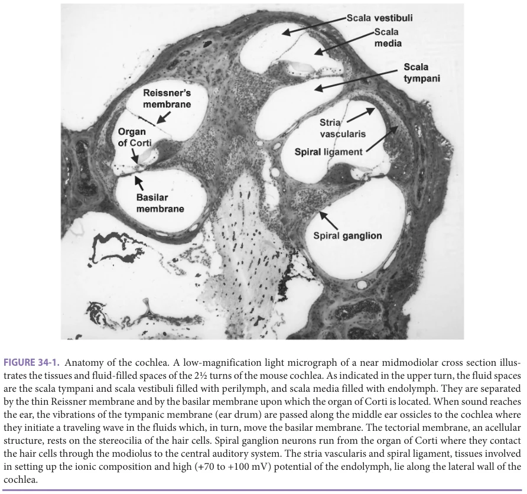
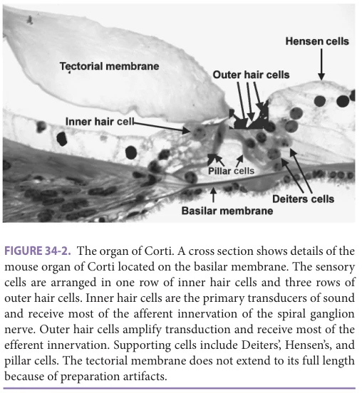
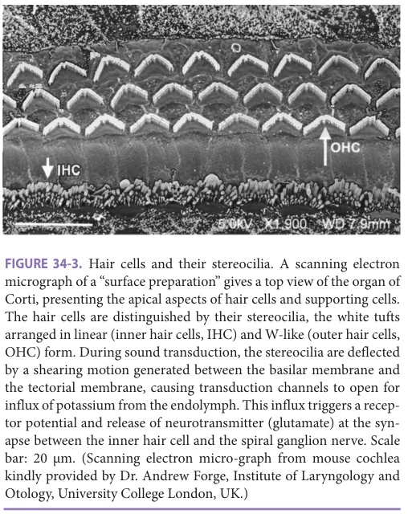
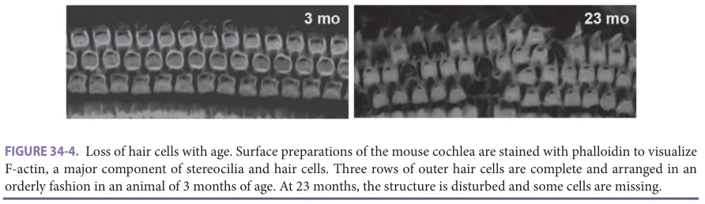
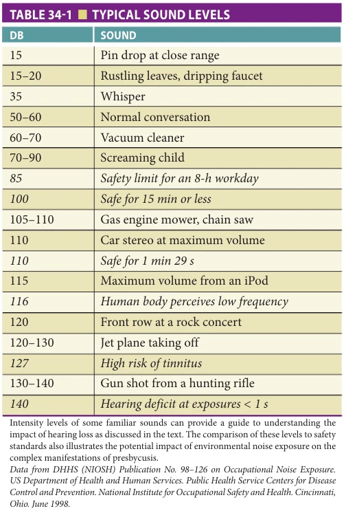
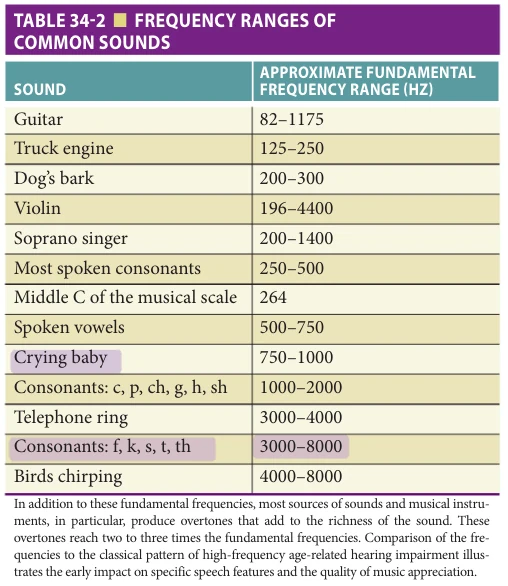
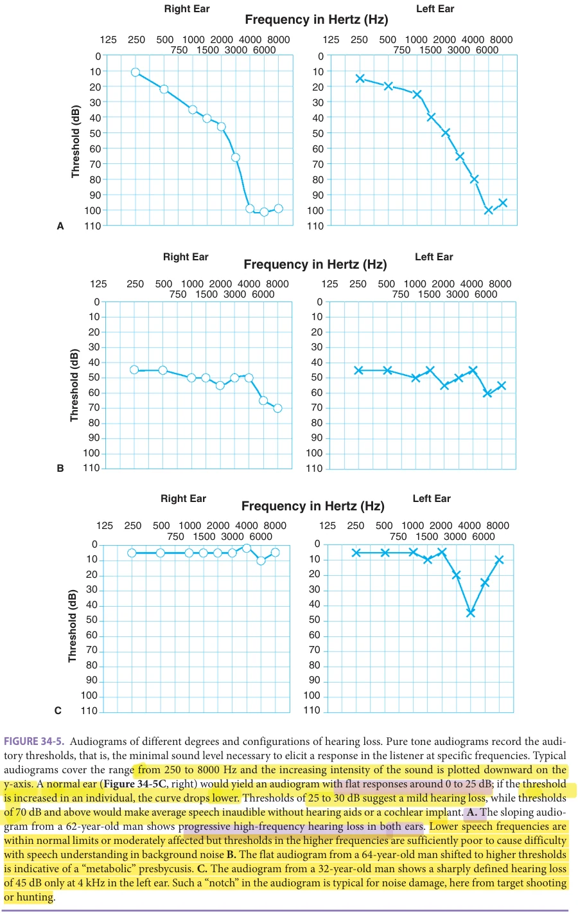
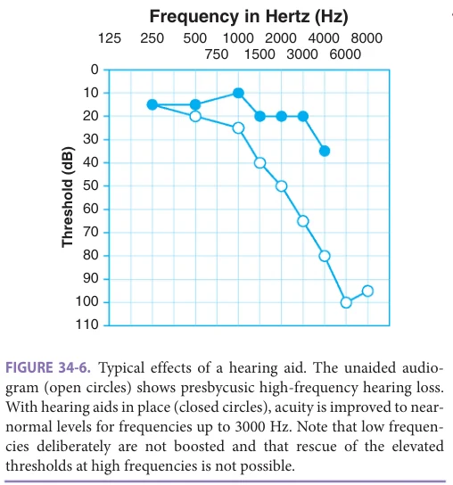

# Hazzard's Geriatric Medicine and Gerontology, 8e - Chapter 34: Hearing Loss: Assessment and Management

Su-Hua Sha, Kara C. Schvartz-Leyzac, Jochen Schacht

> Excluded from the IMA required reading list (P005-2026); cited once in past papers.

> **Status.** Fast build from the book; not lane-reviewed.

> **Source and method.** Printed pages 489-502, from the marked 8th-edition copy (PDF page = printed page + 34). Prose follows its text layer; tables and figures are source-page crops. The book is canonical.

**[p. 489]**

## INTRODUCTION

The sense of hearing is unequalled by our other sensory modalities in terms of its sensitivity, dynamic range, and discrimination of the finest nuances in stimuli. It does serve us well through a part of our lifetime, but beginning in our 40s (slightly earlier for men and later for women) our inner ears suffer the influence of aging in a very subtle yet progressive manner. Age-related hearing loss (ARHL) affects most people aged 65 and older and represents the predominant neurodegenerative disease of aging.

#### Learning Objectives

- Learn the epidemiology, pathophysiology, diagnosis, clinical features, risk factors, and treatment of hearing impairments in older adults.

- Understand the interplay between common medical comorbidities, medications, genetics, and hearing disorders in older patients.

- Gain a clear understanding of tests used to distinguish various kinds of hearing impairments.

- Learn about recent technological advances involving hearing aids and cochlear implants, as well as emerging therapies targeting hair cell regeneration.

#### Key Clinical Points

1. Age-related hearing loss (ARHL) is the most common sensory impairment in older adults, and its prevalence increases steadily with age.

2. Men develop ARHL earlier than women. Family history and specific genes increase risk for presbycusis. Over 55% of ARHL in older patients can be attributed to heritability.

3. Diabetes mellitus and cardiovascular disease, two of the most common comorbidities seen in older adults, promote hearing loss and cochlear pathology.

4. Pure tone audiometry, tympanometry, acoustic reflex measurements, and word recognition scores are the most common methods for hearing assessment.

5. Older patients often present with difficulties in speech recognition rather than inability to hear sound.

(The terms “age-related hearing impairment” and “age-related hearing loss” are interchangeably used in the literature whereby “loss” does not imply a complete loss of hearing but may signify any degree of auditory dysfunction. Individuals with hearing loss are generally referred to as “hard-of-hearing.”)

Hippocrates had already noted deafness to be more prevalent among his older patients and in The Comedy of Errors, Shakespeare’s older merchant, Aegeon, complains of his own “dull deaf ears.” Thus, ARHL or presbycusis is not a disease of modern societies but has been accepted for centuries as one of Lord Byron’s inevitable “woes that wait on age” that it still appears to be today. It was the New York otologist St. John Roosa who first drew the attention of his colleagues to hearing loss of older adults as a medical condition. In 1885 he proposed the name presbycusis that he had coined from the Greek πρέσβυς, old man, and ακούειν, to hear. Systematic studies of the anatomical pathology began in the late nineteenth century, leading by the 1930s to the realization that the decreased auditory acuity could be attributed to deterioration of the auditory sensory cells and the auditory nerve. These changes frequently affect the perception of the upper frequencies first, resulting in highfrequency (high “pitch”) hearing loss as a hallmark of presbycusis. However, ARHL is not a uniform condition, but a multifactorial one combining genetic predispositions with a plethora of lifetime insults to the hearing organ because, in all its versatility and efficacy, our sense of hearing is also uniquely vulnerable to environmental influences. These may include noise, chemicals, and solvents at the workplace, lifestyle (eg, smoking), and leisure activities (from iPods to rock concerts and target shooting), diseases (eg, diabetes, respiratory disorders), viral or bacterial infections, and

even the adverse effects of the very medications (aminoglycosides, cisplatin) designed to cure diseases and infections. This spectrum of potential abuse of our auditory organ yields an exceedingly intricate etiology and pathology of

**[p. 490]**

hearing loss in older adults. Age-related pathology of the central auditory system adds to the complexity of the problem. Consequently, presbycusis has been defined as hearing loss associated with various types of auditory dysfunction, peripheral or central, that accompany aging and that cannot be accounted for by extraordinary ototraumatic, genetic, or pathologic conditions.

Animal models provide hope to resolve some of the basic mechanisms that underlie the deterioration of hearing and point to ways and means to delay or prevent presbycusis. By virtue of the availability of molecular and genetic information and of transgenic and knock-out animals, mice have become one of the preferred model animals although, as we shall point out later, caveats do apply here too. This review will illustrate the features of human presbycusis and draw on animal models to discuss its potential molecular basis.

## EPIDEMIOLOGY OF AGE-RELATED HEARING LOSS

ARHL is the most frequent sensory loss in older adults and the prevalence of the disorder increases with age. In humans, as in most other species, ARHL mostly begins at the high frequencies and progresses gradually into the lower speech range. Males experience ARHL earlier than females, beginning in the late 30s to early 40s while women will match the men’s deficits in the later decades of their lives. Approximately 44% of people suffer from a significant hearing loss in their 60s; this number rises to 66% between the ages of 70 and 79 years, and skyrockets to 90% after age 80. With an increased life span of the population worldwide, especially in developed countries, the impact of ARHL will continue to increase in the future.

The individual rate of decline in hearing, however, is exceptionally variable and some people may maintain excellent hearing with “golden ears” late into life as a result of genetic traits that have yet to be elucidated. Superimposed on the gender differences, race apparently also plays a role, although whether this role is causative or correlative is unknown. One study of over 2000 older Americans aged 73 to 84 found the incidence of high-frequency hearing loss to be 92% in Caucasian American men, 76% in African-American men, 74% in Caucasian American women, and 59% in African-American women.

## RISK FACTORS MODULATING AGE-RELATED HEARING LOSS

The large variability in the age of onset, rate of progression, and the nature and severity of the hearing loss suggests that ARHL is a complex genetic disorder with superimposed environmental and health-related risk factors.

Genetics Family history plays a role in predisposition to presbycusis. An analysis of hearing thresholds in sibling or parent/child

pairs versus spousal pairs (controls) in Framingham Heart Study patients found that the inherited genetic effects were significant. The predictive power of family history appeared stronger for females than males and stronger for a “flat” rather than sensorineural high-frequency type hearing loss (see the classification of age-related hearing loss in the section on “Peripheral Pathology of Age-Related Hearing Loss in Humans”). Overall, the study suggested that about 55% of ARHL in older adults can be ascribed to heritability.

Further studies detailing genes that contribute to ARHL in humans have pointed largely those involved in detoxification of reactive oxygen species (ROS) and include glutathione S-transferase polymorphisms (in the GSTM1 and GSTT1 genes), an N-acetyltransferase 2 gene polymorphism, and superoxide dismutase 2 promoter variants. A genome-wide association study (GWAS) of presbycusic subjects at the Audiological Center of the Antwerp University Hospital found no variants with genome-wide significance. Previously reported genes for ARHL could not be confirmed, indicating that ARHL is highly polygenic in nature, with probably no major determining genes involved.

Gender and Hormonal Factors The fact that ARHL sets in earlier in males than in females is seen both in the human population and in experimental animals. Differences between males and females diminish in the later decades of life, suggesting a modulation of ARHL by the hormonal status of an individual. In support of this notion, receptors for steroid hormones have indeed been located in the cochlea. In further support of a link between ARHL and hormonal levels, fluctuations in hearing thresholds have been observed during the menstrual cycle; estrogen therapy slowed the development of ARHL in postmenopausal women. Furthermore, in patients (and mouse models) with Turner syndrome who synthesize inadequate levels of estrogen, ARHL sets in early and sensorineural hearing loss often presents in childhood. While estrogen seems to be protective of hearing, progesterone replacement is detrimental in postmenopausal women, negatively affecting the auditory nerve pathway and neurotransmitters. Generally, sex-hormone replacement therapy in premenopausal, perimenopausal, and postmenopausal women has revealed a number of serious side effects in addition to hearing loss, including strokes, breast and ovarian cancer, and cardiovascular problems.

Another class of steroid hormones, mineralocorticoids, may also influence ARHL. A correlative study in human subjects showed a protective effect of elevated serum levels of aldosterone on auditory thresholds and an improvement of speech perception (“hearing-in-noise”) in older individuals. Although aldosterone primarily acts on water and ion resorption in the kidney, aldosterone receptors have also been localized to the inner ear. They are hypothesized to influence the ionic composition of inner ear fluids, which is essential for cochlear homeostasis and the transduction of sound (see section on “Anatomy of the Auditory Periphery”).

**[p. 491]**

Diseases A contribution of specific diseases to the rate and severity of hearing loss has long been speculated but firm evidence is challenging to ascertain. The complex etiology of ARHL and the multitude of potential noxious influences renders it difficult to account for all potentially confounding factors in human population studies. Nevertheless, good evidence exists for diabetes and cardiovascular disease as risk factors in ARHL.

Diabetes mellitus Both type 1 and type 2 diabetes promote hearing loss and cochlear pathology in humans and in animals. Deficits in several aspects of auditory function were significantly more pronounced in a group of people with type 2 diabetes aged 60 or older compared with a group of age- and sex-matched controls and excluding those with other significant health issues or a history of hearing problems. Furthermore, plasma concentrations of glycosylated hemoglobin (HbA1c), an indicator of potentially elevated glucose levels, have been found to correlate with ARHL in a cohort aged 65 or older, even in those without levels high enough to be diagnosed with diabetes.

Diabetes mellitus and associated deregulated blood glucose levels exact a multitude of stresses on a cellular level, which could lead to loss of function in the delicately balanced hearing organ with time and age. Fundamentally, increased blood glucose levels lead to cellular hypoxia and a build-up of ROS and lipid metabolic byproducts, as well as changes in the collagen and microtubule structure of the cells. In addition, diabetes has profound effects on the vasculature, including atherosclerosis and vessel wall dystrophy. In the inner ear, which depends on the highly vascularized stria vascularis to maintain the endocochlear potential, this could result in impaired sensory function. Patients with diabetes mellitus also demonstrate abnormal processing of auditory signals at the level of the brain stem and cortex.

Cardiovascular disease All conditions that affect the function of blood vessels such as hyperlipidemia, hypercholesterolemia, hypertension, hyperlipoproteinemia, and cardiovascular disease have been implicated in ARHL. Specifically, a flat ARHL (see next section) appears to be associated with those conditions because the maintenance of the endolymphatic potential and driving force for the transduction process is most vulnerable to any restriction of blood flow. Just as in diabetes, any disease leading to vascular compromise will impair these processes and diminish the sensitivity of the cochlear organ to sound.

Lifestyle and Environmental Factors Poor health habits with regard to exercise, smoking, and diet are also considered risk factors for ARHL based on data from population studies. Since some of these habits influence cardiovascular function and other potential risk factors for ARHL, it remains open to what extent lifestyle directly influences the auditory organ or whether the

resulting effects are secondary to general health. Additional major environmental risk factors include exposure to excessive or even moderate noise, ototoxic medications (primarily aminoglycoside antibiotics and anticancer agents of the cisplatin class), and several industrial solvents.

Even at levels that do not necessarily inflict acute damage by themselves, these environmental factors appear to sensitize the auditory system to subsequent loss and aggravate any age-related changes. This notion was borne out in experiments in which mice at a young age (1–3 months) received a moderate noise exposure that resulted in temporary hearing loss only. Although their hearing recovered to normal baseline levels within a few days or a week after the noise exposure, these mice developed a significantly greater hearing loss with progressing age than control animals. Therefore, the initial recovery might not have been a return to normal but to a “hidden hearing loss.” The implication of this finding is that occupational or recreational noise exposure, even if no deficit is noted at the time, will take its toll in later years.

Psychology Interestingly, adherence to negative stereotypes about older adults, that is, the concept in many societies that aging is met with an inevitable decline in function of all faculties, demonstrates as a predicting risk factor for ARHL. External stereotyping (the prevalence of stigmata with aging in the individual’s culture) and negative internal perception (extent of internalization of these stigmata) acted as independent risk factors on hearing loss with age, and had a stronger impact than gender or race. This predicts an observable phenomenon wherein cultures with positive concepts of aging do not expect their elders’ hearing to become enfeebled and, in fact, the incidence of ARHL is then lower. Here again, an influence on the auditory system maybe secondary to the effect of stigmata on general well-being and levels of stress hormones in particular. Furthermore, a stimulating social engagement in a positive environment might delay not only cognitive decline but also an associated hearing loss.

## BASICS OF HEARING AND HEARING LOSS

In order to understand the different forms of presbycusis and their underlying mechanisms, some knowledge of auditory anatomy and physiology is required. The following sections briefly summarize the essentials.

Anatomy of the Auditory Periphery Not only is ARHL shaped by many influences, it also shows a variety of morphological manifestations. An early framework for classifying ARHL was proposed by Schuknecht in 1964 based on the histopathology of human temporal bones, and has since been modified on the basis of further human and animal studies. The mammalian auditory organ, the cochlea (Figure 34-1), is encased in bone, and its tissues

**[p. 492]**

*FIGURE 34-1. Anatomy of the cochlea. A low-magnification light micrograph of a near midmodiolar cross section illus- trates the tissues and fluid-filled spaces of the 21⁄2 turns of the mouse cochlea. As indicated in the upper turn, the fluid spaces are the scala tympani and scala vestibuli filled with perilymph, and scala media filled with endolymph. They are separated by the thin Reissner membrane and by the basilar membrane upon which the organ of Corti is located. When sound reaches the ear, the vibrations of the tympanic membrane (ear drum) are passed along the middle ear ossicles to the cochlea where they initiate a traveling wave in the fluids which, in turn, move the basilar membrane. The tectorial membrane, an acellular structure, rests on the stereocilia of the hair cells. Spiral ganglion neurons run from the organ of Corti where they contact the hair cells through the modiolus to the central auditory system. The stria vascularis and spiral ligament, tissues involved in setting up the ionic composition and high (+70 to +100 mV) potential of the endolymph, lie along the lateral wall of the cochlea.*

and fluids coil “snail-like” for 21⁄2 to 41⁄2 turns (depending an species) and a total length of a few centimeters without any relationship to body size. A human cochlea, for example, on average extends for 33 mm in 21⁄2 turns while the dimensions in the guinea pig are 20 mm and 41⁄2 turns. In all species, however, the cochlea is tonotopically organized, meaning that high frequencies are processed in its basal part, low frequencies in the apex.

Several structures with distinctly different functions and susceptibility to environment and age-related insults can be discerned within this membranous labyrinth and are best seen in a midmodiolar section that transverses the length of the cochlea. The lumen of the cochlea is separated into three fluid-filled compartments by the basilar membrane and Reissner membrane. Scala vestibuli and scala tympani contain perilymph, similar in composition to extracellular fluids. Scala media contains endolymph, unique among body fluids by its high concentration of K+ and low Na+, creating a large positive endolymphatic potential (also referred to as endocochlear potential) as a driving force for the transduction current, which is used by

the sensory cells. Scala media is bounded laterally by spiral ligament and stria vascularis, the tissues that are responsible for maintaining the ionic composition and hence the potential of endolymph. These tissues are also highly vascularized and provide most of the oxygen and nutrient supply to the cochlea.

The organ of Corti (Figure 34-2), located on the basilar membrane, is the auditory end organ containing sensory cells and supporting cells. Sensory cells include one row of inner hair cells (IHCs) and three rows of outer hair cells, numbering several thousand in all species. The name “hair cell” is derived from the stereocilia that protrude from the apical end of the cells (Figure 34-3) and contain the mechano-transduction channels. IHCs are the primary sensory cells that convert the mechanical acoustic input into receptor potentials and release of neurotransmitter, triggering action potentials that are carried to the brain by the spiral ganglion neurons (SGNs). Most of the afferent innervation by this auditory nerve converges on the IHCs. The major function of outer hair cells, which receive mostly efferent innervation from auditory centers in the brain, is

**[p. 493]**

*FIGURE 34-2. The organ of Corti. A cross section shows details of the mouse organ of Corti located on the basilar membrane. The sensory cells are arranged in one row of inner hair cells and three rows of outer hair cells. Inner hair cells are the primary transducers of sound and receive most of the afferent innervation of the spiral ganglion nerve. Outer hair cells amplify transduction and receive most of the efferent innervation. Supporting cells include Deiters’, Hensen’s, and pillar cells. The tectorial membrane does not extend to its full length because of preparation artifacts.*

to enhance the performance of the cochlea, particularly at low intensities of sound. Supporting cells include the inner pillar, outer pillar, Deiters’, Hensen’s, and Claudius’ cells, about whose function we know less.

The cells in the sensory epithelium are highly differentiated. Hair cells, once lost, are not regenerated by

*FIGURE 34-3. Hair cells and their stereocilia. A scanning electron micrograph of a “surface preparation” gives a top view of the organ of Corti, presenting the apical aspects of hair cells and supporting cells. The hair cells are distinguished by their stereocilia, the white tufts arranged in linear (inner hair cells, IHC) and W-like (outer hair cells, OHC) form. During sound transduction, the stereocilia are deflected by a shearing motion generated between the basilar membrane and the tectorial membrane, causing transduction channels to open for influx of potassium from the endolymph. This influx triggers a recep- tor potential and release of neurotransmitter (glutamate) at the syn- apse between the inner hair cell and the spiral ganglion nerve. Scale bar: 20 μm. (Scanning electron micro-graph from mouse cochlea kindly provided by Dr. Andrew Forge, Institute of Laryngology and Otology, University College London, UK.)*

other cell types in the mammal but are replaced by permanent “scars” (Figure 34-4). Consequently, any damage to these cells leads to irreversible hearing loss. Considerable research effort is currently expended on determining any factors that might regenerate hair cells from supporting cells or enable the differentiation of putative stem cells into hair cells.

Functional Assessment of Hearing From a clinical functional aspect, pure tone audiometry, tympanometry, acoustic reflex measurements, and word recognition scores with behavioral tests are the most common and important methods for hearing assessment. Tympanometry and acoustic reflex (stapedius reflex) test the integrity of the middle ear while audiometry yields information about acoustic thresholds at distinct frequencies. Word recognition tests, in contrast, explore more complex tasks that involve both the auditory periphery and central processing of the information. Auditory brain stem response (ABR) and otoacoustic emission measurements provide information on the integrity of the auditory pathway and outer hair cells, respectively. They are passive sound-evoked responses and therefore suitable for testing infants or incapacitated individuals and most easily adapted to routine testing in animals. Some invasive methods, essentially limited to animal experimentation, such as recordings of cochlear microphonic potential (largely derived from outer hair cells), cochlear whole nerve action potential, and single unit recordings, can be used to assess hair cell transduction and synaptic activity, the function of auditory afferent nerves, and individual neurons of the cochlear and vestibular nerves.

Frequencies and Sound Intensity: What Constitutes Hearing Loss? A significant hearing loss of any origin will eventually lead to difficulties in communication and a decreased awareness of the environment. In addition to the social isolation, individuals with early-onset presbycusis may suffer economic consequences from difficulties in employment or professional advancement. The question of what constitutes a significant hearing loss is complex as it involves consideration of both the magnitude of sensitivity loss and the frequencies at which the loss occurs. Although the most convenient assessment criterion for ARHL is a subjective one—that is, posing the question, “Do you have a hearing problem?” or answering a more elaborate questionnaire like the Hearing Handicap Inventory for the Elderly-Short (HHIE-S)—a more quantitative evaluation can be obtained by an audiogram. While there is not one set paradigm for classification of audiograms into handicapping and non-handicapping hearing thresholds, the American Speech-Language-Hearing Association and the American Academy of Audiology set the bar at a threshold shift (hearing loss) of 25 dB or above at any frequency between 250 Hz and 8000 Hz.

**[p. 494]**

*FIGURE 34-4. Loss of hair cells with age. Surface preparations of the mouse cochlea are stained with phalloidin to visualize F-actin, a major component of stereocilia and hair cells. Three rows of outer hair cells are complete and arranged in an orderly fashion in an animal of 3 months of age. At 23 months, the structure is disturbed and some cells are missing.*

What does a loss of 25-dB hearing acuity mean in everyday terms? The bel or decibel (dB) scale of sound pressure (“intensity”) is logarithmic, such that an increase in 3 dB represents approximately a doubling of the sound intensity. Therefore, a reduction of sensitivity of 25 dB is considerable. In rough terms, a difference of 25 dB in threshold makes normal conversation equivalent to a whisper, and a whisper equivalent to silence (Table 34-1). The affected person will still hear the crying baby—albeit subdued—but not the leaves rustling in the forest or the crickets in summer.

There is one caveat. Defining hearing loss as beginning at a threshold shift of 25 dB in one ear is clinically useful but does not necessarily mean that an afflicted person

*TABLE 34-1 ■ TYPICAL SOUND LEVELS*

even notices the deficit. Auditory impairment may be asymmetrical, affecting primarily one ear only (recreational shooters or combatants are good examples). Such a unilateral impairment might remain unnoticed since the better ear will provide a “normal” hearing in most situations.

ARHL poses a specific problem as the hearing loss progresses slowly and mostly sets in at the high frequencies. The frequency spectrum of human hearing, at its best, ranges from about 60 Hz to 16 kHz but speech frequencies and hence, basic hearing needs, mostly center on the 1000 Hz to 2000 Hz range (Table 34-2). A hearing loss at the very high frequencies may therefore not produce any communicative disadvantages particularly when conversations occur in a quiet environment; even musical instruments have a limited range in their fundamental frequencies.

Since the progression of ARHL is also slow, the individual maybe unaware of the gradual loss of overtones in speech or instrumental music (which can extend two or three octaves higher than the fundamentals) for a long time.

*TABLE 34-2 ■ FREQUENCY RANGES OF COMMON SOUNDS*

**[p. 495]**

However, losses at higher frequencies like those in ARHL cost the ability to discriminate between many words with f, p, k, s, t, th sounds (see Table 34-2). For example, to a person with high-frequency hearing loss, “sick” and “thick” may be difficult to differentiate, and “three socks” may sound like “free fox” unless the listener has developed the ability to read the speakers lips for supplementary information or can interpret them in context. Such communication errors may seem trivial, but can cause enormous social disability when they happen in work situations or become cumulative.

Audiological examinations routinely include frequencies up to 8000 Hz and could reveal the presbycusic changes although the individual may still be told by the audiologist that their hearing is “normal for the age.” Such a statement should not be taken to mean that a hearing aid is not necessary or not useful. Quite frequently, an individual with a reasonably reliable pure-tone audiogram and good one-on-one communication skills may experience difficulties in speech perception in a noisy environment such as a restaurant, a party, or a conference because high frequencies are essential for auditory discrimination in the presence of background noise. This “party effect” is often the first signal indicative of presbycusis, and such individuals may greatly benefit in their enjoyment of conversation and music by modern hearing aids fitted to their particular needs.

## PERIPHERAL PATHOLOGY OF AGE-RELATED HEARING LOSS IN HUMANS

A classification of the various forms of presbycusis has limitations because of the complexity of functional deficits and pathologic changes. However, broad categories of ARHL are as follows: (1) Sensorineural ARHL refers to a primary degeneration of hair cells (“sensory ARHL”) of the organ of Corti that begins in the base, yielding an audiogram that is abnormal only at the high frequencies (Figure 34-5A). Current data suggest that ARHL in humans largely follows such a pattern of a high-frequency hearing loss. A neural component of ARHL mainly reflects loss of afferent neurons while cochlear structures remain relatively normal, leading to a loss of word discrimination ability. In general, aging people lose afferent neurons only slowly and significant changes in the audiogram may require a loss of up to 90% of neurons. The incidence of purely neural ARHL is therefore controversial. As hair cells degenerate, secondary neuronal degeneration follows, so that the term “sensorineural” ARHL is favored over a separation of sensory and neural ARHL. (2) A “flat configuration” (or metabolic) ARHL shows an audiogram that is significantly depressed at all measured frequencies. It is thought to be caused primarily by a dysfunction of the supporting structures in the cochlea that maintain the endocochlear potential, the driving force for auditory transduction. A decrease of the endocochlear potential will affect the entire cochlea and hence all frequencies (Figure 34-5B). Human and animal studies have connected a metabolic ARHL to pathology

of the stria vascularis and the adjacent spiral ligament but a lack of such correlation has been noted in some human temporal bones and points to a potentially more complex etiology. (3) Cochlear conductive ARHL or mechanical ARHL is caused by changes in the stiffness of the basilar membrane. An audiogram of this type shows a linear decline of over 50 dB at all frequencies without degeneration of any cochlear cells or structures. Only a small portion of ARHL is estimated to fall into this category. (4) Mixed ARHL is the overlap of multiple pathologies. About 25% of cases may be of mixed pathology.

In evaluating ARHL, it is oftentimes difficult to determine the individual contributions of environmental influences that might damage the hair cells in the organ of Corti, such as exposure to noise, industrial solvents, or ototoxic medications. Aminoglycoside antibiotics (exemplified by streptomycin, gentamicin, kanamycin, and related drugs), in particular, destroy hair cells in a baseto-apex progression, causing an initial high-frequency hearing loss reminiscent of sensorineural presbycusis. Noiseinduced hearing loss usually differs in its pattern as the site of cochlear damage relates to the frequency of the exposure, creating a “notch” in the audiogram. A fingerprint of noise trauma in hunters and shooters, for example, is a unilateral hearing deficit in the 4-kHz region (Figure 34-5C). Damage from industrial noise would be expected to be bilateral and create a broader area of hearing loss.

The recent discovery of a “hidden hearing loss” has spurned an interest in more subtle cochlear morphological changes than overt hair cell loss, in particular the integrity of synaptic connections. SGNs, bipolar cochlear neurons that conduct auditory information to the brain, transmit sound information from hair cells to the central auditory system via two type synapses: cochlear synapses and auditory nerve synapses. The pathophysiology of cochlear synapses at peripheral terminals of the SGNs has been well characterized in animal models: moderate noise exposure can induce loss of IHC synapses as a consequence of excessive glutamate release from overstimulated IHCs (excitotoxicity). This concept is further supported by the protection of cochlear synapses from noise exposure via a blockade of calcium-permeable AMPA receptors that are thought to mediate excitotoxicity. Such damages of cochlear synapses lead to loss of SGNs with aging and accelerate ARHL. This “cochlear synaptopathy” may also occur in humans, as recently revealed in human temporal bones. However, the prevalence of cochlear synaptopathy is clinically unknown because it is difficult to assess cochlear synaptopathy in patients.

## CENTRAL AUDITORY ASPECT OF AGERELATED HEARING LOSS

In addition to deficiencies in peripheral auditory processing, advanced age can lead to changes in the central auditory system, which can essentially be classified into two

**[p. 496]**

*FIGURE 34-5. Audiograms of different degrees and configurations of hearing loss. Pure tone audiograms record the audi- tory thresholds, that is, the minimal sound level necessary to elicit a response in the listener at specific frequencies. Typical audiograms cover the range from 250 to 8000 Hz and the increasing intensity of the sound is plotted downward on the y-axis. A normal ear (Figure 34-5C, right) would yield an audiogram with flat responses around 0 to 25 dB; if the threshold is increased in an individual, the curve drops lower. Thresholds of 25 to 30 dB suggest a mild hearing loss, while thresholds of 70 dB and above would make average speech inaudible without hearing aids or a cochlear implant. A. The sloping audio- gram from a 62-year-old man shows progressive high-frequency hearing loss in both ears. Lower speech frequencies are within normal limits or moderately affected but thresholds in the higher frequencies are sufficiently poor to cause difficulty with speech understanding in background noise B. The flat audiogram from a 64-year-old man shifted to higher thresholds is indicative of a “metabolic” presbycusis. C. The audiogram from a 32-year-old man shows a sharply defined hearing loss of 45 dB only at 4 kHz in the left ear. Such a “notch” in the audiogram is typical for noise damage, here from target shooting or hunting.*

**[p. 497]**

major types. The first is referred to as “peripherally induced central effects,” which presents with changes in the cochlear nucleus driven by the decline of peripheral cochlear inputs that occur with age, typically starting with hearing loss at high frequencies. The other is referred to as “true aging” neurodegenerative changes in the brain. In this case, ARHL shares similarities or common mechanisms with other central nervous system conditions of the aged such as Alzheimer and Parkinson diseases. Age-dependent changes in auditory structures include declines in the number of ventral cochlear nucleus and lemniscal nerve fibers.

Indicative of deficits in sound processing in the higher auditory or cognitive centers, older adults often present with difficulties in speech recognition, rather than an inability to hear sound. Despite audiograms within the normal range, such patients might still require a stronger speech-to-noise signal or might experience better comprehension when speech is slowed down. Specific comprehension tests, for example, of speech perception in noise (QuickSIN test) can be used to better define such a condition, and can often identify difficulties understanding speech in noise independent of degree of hearing loss. Additionally, measures of complex auditory function (eg, speech in noise, comprehension of temporally compressed [“rapid”] speech) have been shown to relate to cognitive measures of working memory in adults. Cognitive screening examinations, such as the Hearing-Impaired Montreal Cognitive Assessment (HI-MoCA) are sometimes used in patients with ARHL in order to parse out contributions of peripheral and central factors to communication difficulties.

Animal models have helped to illuminate some central consequences of degeneration of the auditory periphery. However, the interrelationship of the pathophysiology of the auditory nerve and how it may contribute to central processing deficits in the cochlear nucleus needs further study. With age, synaptic connections may also change in number, spontaneous activity, or in their inhibitory or excitatory properties. It is possible, although yet unknown, if these changes directly affect speech understanding in humans. For patients with cochlear implants, who often have degeneration of the auditory nerve due to auditory deprivation, we know that the integrity of the auditory nerve matters to optimize speech understanding. Nevertheless, cochlear implants can still be very successful in older patients with a long duration of hearing loss (and loss of peripheral nerve connections) suggesting that the success of cochlear implants and hearing aids is at least partially dependent upon more central factors.

## LESSONS FROM ANIMAL MODELS

Suitability of Different Species A large variety of species has been studied for age-related auditory pathology, including chinchillas, guinea pigs, primates, dogs, and rodents. These species cover the range of cochlear pathologies, including organ of Corti, neural,

and strial degeneration, and the majority of animals show a complex mix. Mongolian gerbils are considered a model for metabolic (strial) presbycusis, presenting with strial atrophy, decreased endocochlear potential, and decreased cochlear blood flow. Degeneration of spiral ganglion cells, vacuolization of fibrocytes, and interstitial edema in the spiral ligament are also observed. In cats and rats, the underlying pathology has been linked to a combination of hair cell and spiral ganglion cell loss. Recently, a metabolic-type of hearing loss was also observed in the rat underscoring the fact that a singular “pure” type of hearing loss maybe rare in any species.

Mice have become favored for study of ARHL, because of availability of molecular and genetic information and of transgenic and knock-out animals. A caveat, however, is that each mouse strain differs significantly in its rate of hearing loss, ranging from those such as CBA and CAST, which exhibit minimal hearing loss by 18 months of age, to those such as C57BL/6 and DBA, which exhibit significantly accelerated hearing loss by approximately 8 and 3 months of age, respectively. The accelerated loss of hair cells and hearing found in C57BL/6 and BALB/cJ mice correlates with the presence of a recessive locus on proximal mouse Chr 10, the age-related hearing loss (Ahl) gene. The Cdh23ahl allele (cadherin 23 or otocadherin) promotes degeneration of the organ of Corti in the cochlear base and high-frequency hearing loss beginning after 1 year of age as shown in congenic B-6.CAST-Cdh23ahl. Furthermore, Cdh23ahl also promotes noise-induced hearing loss, suggesting a connection between noise and ARHL. Since BALB/cJ and C57/BL mice are genetic mutations, they may not reflect a normal biological aging process. In fact, one genetic analysis of human presbycusis found no evidence for the presence of a mutation in cadherin 23.

The CBA/J mouse is among the strains in which the progression of ARHL more closely approximates human presbycusis. CBA/J mice lose hearing sensitivity late in their life span, advancing from high to low frequencies. ARHL begins around 12 months of age—here again the onset is earlier in males than in females—and progresses slowly until 18 months, after which point a more rapid rate of hearing loss is seen. The hearing loss at high frequencies is accompanied by loss of outer hair cells and a moderate degeneration of spiral ganglion cells. Since the CBA/J strain maintains normal morphology of the stria vascularis and normal endocochlear potential in aging, a sensorineural origin of the observed auditory deficits can be inferred.

Molecular Mechanisms Significant progress has been made in our understanding of the pathologic and functional changes that occur in the inner ear with age using animal models. However, less is known about the specific molecular and genetic mechanisms contributing to ARHL. Recent work suggests to place “auditory aging” in animals—at least for sensorineural presbycusis—into the category of oxidant-stress

**[p. 498]**

related events. Oxidant stress is caused by the metabolic overproduction of ROS or reactive nitrogen species (RNS), including singlet oxygen, superoxides, peroxides, hydroxyl radicals, and hypochlorous acid or nitric oxide-derived compounds such as nitroxyl anion, nitrosonium cation, higher oxides of nitrogen, S-nitrosothiols, and dinitrosyl iron complexes. Maintaining cellular redox homeostasis depends on the rate of production of ROS and their removal by cellular antioxidants. If such homeostasis is disrupted, cell death is a potential consequence. Markers of oxidative stress are indeed elevated in the cochlea of the aging CBA/J mouse while antioxidant defense systems decrease. Other suggestive evidence for an involvement of oxidative stress comes from heterozygous mice lacking superoxide dismutase; ARHL developed earlier and with greater severity, as evidenced by an increased hair cell loss following the canonical base-to-apex progression. Consistent with oxidative stress is also the observation that the severity of ARHL in humans correlates with plasma levels of hydroxyl radicals and hydrogen peroxide, although a causal relationship cannot be inferred. While oxidative stress may be a contributing factor, failed attempts to slow the progression of cochlear degeneration and hearing loss with antioxidants point to a more complex picture (see section on “Prevention of Age-Related Hearing Loss”). Recent studies in lower organisms suggest that low levels of mitochondrial ROS (mROS) regulate immunity and autophagy, which positively affects aging. The dual function of ROS to both promote cell damage and promote cell adaptation to stress responses makes them challenging as potentially therapeutic targets.

Deletions in mitochondrial DNA are also an established indicator of cumulative oxidative damage to a tissue and have been observed in the aging—including human— cochlea. DNA in mitochondria, in contrast to nuclear DNA, is particularly vulnerable because these organelles possess less efficient machinery to repair DNA damage, leaving mutations uncorrected and prone to adversely affect mitochondrial function. A mtDNA4977 deletion is the most common mutation found in human temporal bones and significantly correlated with individual audiometric thresholds and the severity of presbycusis.

Vascular abnormalities are another pathologic change with aging potentially affecting supply of nutrients and oxygen as well as mitochondrial respiration, thus adding to oxidant stress in the inner ear. As a case in point, suppression of cochlear blood flow promotes mitochondrial DNA mutations and may impact hearing loss. In addition, and as already mentioned, reduction of cochlear blood flow from age-related degeneration could lead to a compromised function of the stria vascularis and an inability to maintain cochlear homeostasis for the maintenance of transduction currents and tissue integrity. The sum of these considerations supports the general concept that ARHL is a consequence of accumulated environmental injuries to the cochlea along with the intrinsic genetically controlled aging process.

Genetic Contributions The majority of so-called mouse models of genetic hearing loss exhibit sensory dysfunction soon after birth; in other words, these are models of accelerated hearing loss not necessarily reflecting human pathology. Hence, the utility of these models for understanding presbycusis-type lateronset hearing loss is unclear. In contrast, a genetically heterogeneous population of four-way cross mice at the age of 8, 18, and 22 months was tested for auditory hearing function by auditory brain stem response (ABR), and genotyped at 128 markers to identify loci that modulate late-life hearing loss. Polymorphisms significantly affecting hearing at 18 or 22 months of age were noted on several chromosomes. Such phenotypic variability strongly suggests that ARHL is a complex polygenetic disorder possibly involving numerous alleles on multiple genes. These conclusions from an animal model fit well with the previously mentioned GWAS study in humans.

## PREVENTION OF AGE-RELATED HEARING LOSS

Avoiding noise, ototoxins, and smoking, but engaging in regular exercising and maintaining a healthy diet may aid in slowing progressive hearing loss as it will contribute to general health. The question as to what extent interventive strategies can specifically delay ARHL cannot yet be conclusively answered but some data from animal experimentation point to the general concept that the rate of ARHL can be influenced.

“Augmented acoustic environment” is a concept to influence the progression of presbycusis by exposure to controlled stimuli. This environment could be created by an enhanced ambient acoustic background or by delivery of specific stimuli through hearing aids. Studies in mice, although mostly on inbred strains with accelerated hearing loss, confirm that the auditory system responds to such treatment but not necessarily in predictable ways. While amelioration of some forms of age-related changes was found, other effects were detrimental, leaving final judgment to future experimentation.

Dietary restriction has been widely used in aging studies and can slow certain age-related physiological declines and extend longevity. For the auditory system, results of such studies are inconclusive and emphasize the point that organ-specific effects of a generalized treatment are impossible to predict. Caloric restriction had positive effects on the progression and magnitude of ARHL in rats but was ineffective in rhesus monkeys. A comprehensive study of 15 mouse strains brought every conceivable result from an apparent amelioration of the rate or severity of presbycusis to no effects and to an acceleration of hearing loss. Such results indicate a major influence of genotype on the outcome, cautioning that similar problems might be encountered in presbycusis therapy in humans.

**[p. 499]**

Antioxidant therapy in animal models, based on the premise that oxidant stress is a contributor to ARHL, has shown inconsistent results. Rats that were placed on vitamin supplementation (vitamins C and E) shortly after birth outperformed their placebo controls in hearing tests at old age but the number of animals in this study was exceedingly low and the results might have been skewed by a more robust health of the surviving small cohort. When the supplementation with antioxidants (acetyl carnitine and lipoic acid) in rats was started later in life and upheld for 6 weeks, results were less convincing. Dogs, on the other hand, fed an antioxidant diet for the final 3 years of their life had better preserved auditory neurons; a confounding factor, however, might have been the high noise level in the kennels which can contribute to noise-induced hearing loss which may be attenuated by antioxidants. In a long-term longitudinal study, 10-month-old female CBA/J mice were maintained on either a control or antioxidant-enriched diet and monitored through 24 months of age; ARHL showed no difference between the two groups. The simple approach to attenuate ROS generation may therefore be an inadequate therapy, perhaps due to the dual role of ROS in adaptation to stress and promotion of cell damage.

Nevertheless, human studies suggest the hypothesis that ARHL can, to some extent, be influenced by dietary or therapeutic intervention. Daily supplementation of folic acid for 3 years positively affected the hearing of older participants in a study in the Netherlands. The effect was significant but very small on low-frequency hearing while age-related changes in high-frequency hearing, the area normally most afflicted by presbycusis, proceeded unaffected. Since lowfrequency hearing is important for speech, the result can be considered encouraging. The underlying mechanism of this protection has yet to be established but the effect goes hand-in-hand with controversial observations that patients with higher erythrocyte and serum concentrations of folate maintain lower hearing thresholds. It should be noted however that routine folic acid supplementation of foods is not permitted in the Netherlands but is common in other industrialized countries. Results therefore may differ in countries where basic folate levels in the population can be expected to be higher. Finally and quite intriguingly, several surveys indicate alcohol consumption as a possible modulator of ARHL. Moderate use of alcohol was associated with better hearing in older individuals in three independent studies, an effect in line with—somewhat controversial—observations that low alcohol intake can be beneficial for general health. Heavy drinkers, in contrast, had a tendency toward more pronounced high-frequency hearing loss.

## MANAGEMENT OF AGE-RELATED HEARING LOSS

Restoration of normal hearing is currently not possible since lost hair cells, a major cause of ARH, cannot regenerate. The current choice for rehabilitation of ARHL, therefore,

*FIGURE 34-6. Typical effects of a hearing aid. The unaided audio- gram (open circles) shows presbycusic high-frequency hearing loss. With hearing aids in place (closed circles), acuity is improved to near- normal levels for frequencies up to 3000 Hz. Note that low frequen- cies deliberately are not boosted and that rescue of the elevated thresholds at high frequencies is not possible.*

is hearing aids. Digital hearing aids present a wide range of user options and have advanced technologically in all aspects including the tolerance of a noisy environment and improved cosmetology. Hearing aids, individually tailored to a user’s audiogram, provide clearly increased hearing ability and speech discrimination (Figure 34-6). However, knowledge about the benefits and acceptance of hearing aids is low. About one-half of older people who could benefit from a hearing aid never try; others are dissatisfied after short use and only 10% to 30% continue to wear hearing aids. Rejection to a large extent depends on personal idiosyncrasies, education, and cultural aspects. Health care costs do not appear to be a decisive factor. The compliance rate is the same in the United States (where patients pay or co-pay for the hearing aid) and the United Kingdom (where they are free), around 15%. In some instances the pathophysiological basis may lie beyond the cochlea. “I can hear but I can’t understand” may point to a central auditory deficit that cannot be easily corrected by enhancing the peripheral stimulus.

If the magnitude of the hearing loss exceeds the corrective capability of hearing aids, cochlear implants (CI) are recommended with increasing frequency to older patients. Cochlear implant candidacy is quickly expanding and is beneficial in patients who score at less than 60% on sentences, in quiet or in noise, in the poorer hearing ear. While a hearing aid essentially amplifies sound to the cochlea and therefore depends on remaining sensory cells, the cochlear implant bypasses the sensory cells and directly stimulates the auditory nerve electrically. To achieve an effective transformation to an electrical stimulus, the acoustic information needs to be preprocessed and delivered to the nerve via an electrode implanted into the cochlea. The success

**[p. 500]**

depends on appropriate coding paradigms and a healthy complement of cochlear nerve innervation. Since the degeneration of the cochlear nerve is slow in humans, much of the aging population presenting with presbycusis should be good candidates. The outcome of implantation is variable but almost all of the patients greatly improve speech perception and most even acquire the ability to carry on telephone conversations. Challenges that remain are speech recognition in unfamiliar contexts and the enjoyment of music. In older patients, cognitive status will also affect cochlear implant outcomes. Unlike acoustic hearing aids, cochlear implants are typically covered by medical insurance (including Medicare) and age is not a contraindication to success. There is some evidence that older patients perform slightly poorer overall with a CI compared to their younger counterparts, but in these patients, it is difficult to parse out effects of chronological age and duration of hearing loss/neural degeneration. Importantly, CIs are successful and beneficial in the overwhelming number of older recipients.

## ASSOCIATION BETWEEN HEARING LOSS AND COGNITIVE DECLINE

More recently, there has been a shift in focus and awareness of potential effects of hearing loss on cognitive decline in the aging population. It has long been recognized that even in the absence of significant measurable hearing loss, older individuals demonstrate slowed auditory processing when compared to younger peers. Even older patients with relatively normal hearing can have difficulty understanding speech in the presence of background noise or when the speaker talks at rapid pace; for older individuals with hearing loss, these effects are even more pronounced, and studies have pointed to underlying differences in cognitive processing to help account for senescent declines in speech understanding.

Several studies have identified a potential link between untreated hearing loss and a higher prevalence of cognitive decline in older adults; however, the precise nature or direction of this relationship is yet unknown. Epidemiologic studies suggest that hearing loss is independently associated with more rapid cognitive decline in older patients, and a single study from Johns Hopkins University (JHU) reported a 24% increased risk for cognitive loss among those with ARHL. Additional studies reveal that the severity of hearing loss also plays a role; among 1103 participants, only those with moderate to severe hearing loss showed an increased risk of cognitive dysfunction compared to normal hearing controls. A radiologic study conducted at JHU reported that even among patients without cognitive loss observed on behavioral screenings, those with hearing loss show changes in microstructural integrity of the temporal lobe and reduced grey matter in the hippocampus.

It is not yet understood whether hearing aids and/ or CIs can be used to help slow the onset of cognitive

decline associated with untreated hearing loss. However, a retrospective study at the University of Michigan including 114,862 adults aged 66 or older suggests that the use of hearing aids can delay the diagnosis of Alzheimer and dementia, and also results in lower incidences of anxiety and falls. Additional studies in older patients who use CIs have reported improved performance on behavioral measures of cognitive function, when preoperative and postoperative scores are compared. While studies are underway, there is currently insufficient data using prospective, randomized controls to help determine if hearing aids and CIs can help to prevent early-onset cognitive changes in these populations.

## OUTLOOK

ARHL is an exceedingly complex disease besetting an organ of even greater complexity. It appears to be a sequel to numerous morphological and molecular changes that befall the auditory system as we age and that are being characterized with increasing acuity by basic and clinical research. One of the major reasons for the lack of treatment of ARHL is the extensive phenotypic variability in hearing loss among human subjects. Our understanding and ability to design interventive and curative therapies will much depend on advances into the molecular and cellular mechanisms of auditory pathologies and identification of genetic variants associated with ARHL. Recent new technologies such as next-generation sequencing including DNA-Seq, RNA-Seq, ChIP-Seq, Methyl-Seq, targeted sequencing utilizing Illumina HiScanSQ, and Ion Torrent instrumentation will provide the platform to perform a large-scale genomewide phenotype association studies with ARHL.

Given the partial success of pharmacological protection, this approach should yield the first practical results. Appropriate agents for and timing of interventions will be explored in animal models, both independent of and tied into interventions in extending life span and general health. Gene therapy also shows promise as a possible strategy to protect hair cells. To date, research has successfully focused on prevention of hearing loss caused by acute traumata like drugs and noise. Such model systems might be modified to serve hearing loss from aging as the etiology of these insults shows similarities to age-related sensorineural hearing loss. As a major caveat, any intervention into ARHL would necessitate lengthy trials that may prevent the implementation of prospective solutions in the near future.

In the area of rehabilitation, technological advances of hearing aids and cochlear implants will improve not only speech recognition but also music appreciation, an area currently of difficult rehabilitation. A direct nerve implant, already successfully tested in an animal model, may replace the cochlear implant for better efficacy of stimulation and a wider range of frequency and intensity perception. The following generation of prostheses will bypass the cochlea and its nerve and stimulate higher auditory centers. Although

**[p. 501]**

clinical application of auditory midbrain implants is less common, a handful of patients have already been treated albeit with more limited success compared to hearing aids or cochlear implants. Such prosthetic therapy could prove advantageous for patients with massive degeneration of the auditory periphery and/or degeneration of the auditory nerve as in a severe neural type of ARHL.

Lastly, functional hair cell regeneration is the final frontier in the field. Recent studies have shown that cells in the organ of Corti, such as supporting cells, may mitose or transdifferentiate into hair cells if appropriately stimulated. The challenges, however, are highly complex: not only hair cells need to be (re)generated, they also have to be incorporated into the intricate cytoarchitecture of the cochlea and find their appropriate connections to the central auditory structures. Stem cell research may likewise provide new insights for replacement of hair cells and the regeneration of the auditory nerve.

## FURTHER READING

Durga J, Verhoef P, Anteunis LJ, Schouten E, Kok FJ.

Effects of folic acid supplementation on hearing in older adults: a randomized, controlled trial. Ann Intern Med. 2007;146:1–9. Fransen E, Bonneux S, Corneveaux JJ, et al. Genome-wide

association analysis demonstrates the highly polygenic character of age-related hearing impairment. Eur J Hum Genet. 2015;23(1):110–115. Frisina RD, Walton JP. Age-related structural and func-

tional changes in the cochlear nucleus. Hear Res. 2006;216–217:216–223. Gates GA, Cooper JC Jr, Kannel WB, Miller NJ. Hear-

ing in the elderly: the Framingham cohort, 1983– 1985. Part I. Basic audiometric test results. Ear Hear. 1990;11:247–256. Helzner EP, Cauley JA, Pratt SR, et al. Race and sex dif-

ferences in age-related hearing loss: the Health, Aging and Body Composition Study. J Am Geriatr Soc. 2005;53:2119–2127. Jiang H, Talaska AE, Schacht J, Sha S-H. Oxidative

imbalance in the aging inner ear. Neurobiol Aging. 2007;28:1605–1612. Johnsson LG, Hawkins JE. Sensory and neural degener-

ation with aging, as seen in microdissections of the human inner ear. Ann Otol Rhinol Laryngol. 1972;81: 179–192. Kujawa SG, Liberman MC. Acceleration of age-related

hearing loss by early noise exposure: evidence of a misspent youth. J Neurosci. 2006;26:2115–2123. Levy BR, Slade MD, Gill TM. Hearing decline predicted

by elders’ stereotypes. J Gerontol B Psychol Sci Soc Sci. 2006;61:P82–P87.

Although presbycusis is not yet preventable or treatable, progress in basic and clinical research promises hope for the future. Most realistic in the near term seem protective pharmacological strategies to delay or attenuate ARHL and improved rehabilitation through next-generation hearing aids and implants. A plausible clinical therapy for the regeneration of new and functional hair cells may, despite recent encouraging advance, still be decades away.

## ACKNOWLEDGMENT

The authors wish to thank Andra E. Talaska for her contributions to the previous versions of this chapter. Dr. Schacht’s and Sha’s research on age-related hearing loss was supported by program project grant AG-025164 from the National Institute on Aging, NIH. Dr. Sha’s research is supported by R01 grant DC009222 from the National Institute on Deadness and Other Communication Disorders.

McFadden SL, Ding D, Salvi R. Anatomical, metabolic and

genetic aspects of age-related hearing loss in mice. Audiology. 2001;40:313–321. National Institute on Deafness and Other Communica-

tion Disorders. Presbycusis. https://www.nidcd.nih.gov/ health/age-related-hearing-loss. Ohlemiller KK. Contributions of mouse models to under-

standing of age- and noise-related hearing loss. Brain Res. 2006;1091:89–102. Pickles JO. Mutation in mitochondrial DNA as a cause of

presbyacusis. Audiol Neurootol. 2004;9:23–33. Rosenhall U, Karlsson Espmark AK. Hearing aid rehabilita-

tion: what do older people want, and what does the audiogram tell? Int J Audiol. 2003;42(Suppl 2):2S53–2S57. Schacht J, Altschuler RA, Burke DT, et al. Alleles that mod-

ulate late life hearing in genetically heterogeneous mice. Neurobiol Aging. 2012;33:1842.e15–1842.e29. Schacht J, Hawkins JE. Sketches of otohistory. Part 9: pres-

by[a]cusis. Audiol Neurootol. 2005;10:243–247. Schuknecht HF. Further observations on the pathology of

presbycusis. Arch Otolaryngol. 1964;80:369–382. Sha S-H, Kanicki A, Halsey K, Wearne KA, Schacht J.

Antioxidant-enriched diet does not delay the progression of age-related hearing loss. Neurobiol Aging. 2012;33:1010.e15–1010.e16. Van Eyken E, Van Camp G, Van Laer L. The complex-

ity of age-related hearing impairment: contributing environmental and genetic factors. Audiol Neurootol. 2007;12:345–358. Willott JF, Chisolm TH, Lister JL. Modulation of presby-

cusis: current status and future directions. Audiol Neurootol. 2001;6:231–249.

**[p. 502]**
