# Hazzard's Geriatric Medicine and Gerontology, 8e - Chapter 35: Sexuality, Sexual Function, and the Aging Woman

Monica Christmas, Kaitlyn Fruin, Stacy Tessler Lindau

> **Status.** Fast build from the book; not lane-reviewed.

> Not cited in the 2020-2026 past papers.

> **Source and method.** Printed pages 503-526, from the marked 8th-edition copy (PDF page = printed page + 34). Prose follows its text layer; tables and figures are source-page crops. The book is canonical.

**[p. 503]**

## INTRODUCTION

Sociological evidence about sexuality of women in middle and later life has increased substantially over the last decade, but sexual function and outcomes among middle age and older women are still largely overlooked in the context of medical care. Negative societal attitudes about aging, sexuality among older people, and women’s sexuality, in particular, present a significant barrier to scientific inquiry and medical attention to older women’s health concerns. Proven interventions for promoting female sexual well-being or treating women’s sexual problems are limited. Although older women experience high rates of sexual problems and the majority of partnered older women are sexually active, physicians infrequently discuss sexual health with older women. Public health attention to older women’s sexuality remains sparse.

#### Learning Objectives

- Understand a biopsychosocial model for research, diagnosis, and care of sexual concerns among aging women.

- Integrate into clinical practice knowledge of population norms of sexual activity, behaviors, and problems among aging women.

- Use knowledge of sexual physiology in aging to inform sexual history-taking, diagnosis, and treatment of sexual problems in older women.

#### Key Clinical Points

1. Older women, including those without a partner, value their sexual function and expect physicians to counsel them about sexual side effects or expected outcomes of medical conditions and treatments.

2. An older woman with sexual dysfunction is likely to be bothered or distressed by the sexual problems, and this distress can have deleterious effects on her overall physical and mental health and intimate relationships.

3. Older women who identify as members of a sexual minority group are marginalized and stigmatized in medical care generally, and they are particularly vulnerable with respect to receiving appropriate medical attention for their sexual concerns.

The 2005–2006 National Social Life, Health and Aging Project (NSHAP), funded by the National Institutes of Health, provided the first comprehensive, populationrepresentative biosocial data on sexuality among middle age and older women and men in the United States, and it informs many of the insights presented in this chapter (https://www.norc.org/Research/Projects/Pages/nationalsocial-life-health-and-aging-project.aspx). In 2010 and 2011 (NSHAP Wave II), 75% of participants in the baseline NSHAP study (Wave I) participated in follow-up interviews. Between 2015 and 2016, 2409 surviving Wave I respondents and an additional new cohort of respondents born between 1948 and 1965 participated in Wave III (accessed at https://www.icpsr.umich.edu/web/NACDA/ studies/36873). This chapter first locates older women’s sexuality in a sociodemographic context, then describes sexual activity, behaviors, and problems experienced by women in later life; reviews physiologic changes that affect

**[p. 504]**

sexual functioning as women age; and recommends a clinical approach to evaluation, prevention, and treatment of sexual problems common among older women. Older women, and their sexual relationships, are very heterogeneous. Generalizations made in this chapter, based on population data from the NSHAP study and findings from other sources, are rooted in statistical norms but should not be interpreted as a normative prescription for older women’s sexuality.

### Interactive Biopsychosocial Model

The interactive biopsychosocial model (IBM) provides a conceptual framework for understanding the bidirectional relationship between sexuality and health throughout the life course (Figure 35-1). To the degree that medicine attends to matters of sexuality, the orientation is largely negative. The medical model approach to understanding sexuality focuses on sexual dysfunction as a problematic consequence of aging, disease, or treatment.

Sexual behavior can result in health problems, such as sexually transmitted infection and victimization. Aging, physical and mental health problems, surgeries, medications, and other medical treatments can cause sexual dysfunction. The IBM acknowledges this reciprocal relationship between sexuality and health but incorporates the possibilities that sexuality may also be health promoting and that aging, or even illness, may confer advantages for sexual life.

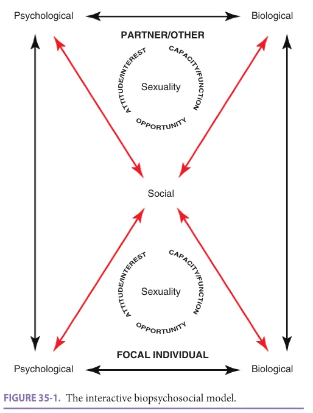

*FIGURE 35-1. The interactive biopsychosocial model.*

*Owner annotations/highlights are from the marked source copy, not the book.*

In this model, health comprises biological, psychological, and social components and is conceptualized as jointly produced by a woman in conjunction with her spouse or other intimate partner(s). Joint production of health means that partners contribute assets (or liabilities) to the “health endowment,” and these assets and liabilities impact the health of the other(s). The hourglass shape symbolizes the dynamic nature of both health and intimate relationships over time. Clinically, this model can be used as a mnemonic for the broad domains of inquiry pertinent to assessing a patient’s sexual history and reminds the clinician of the importance of ascertaining the presence, and health, of the patient’s intimate partner(s).

## SOCIODEMOGRAPHIC CONTEXT OF OLDER WOMEN’S SEXUALITY

Sexuality in later life commonly occurs in the context of a long-term marital relationship. Men are significantly more likely than women to have a spouse or other romantic partner in later life and to be engaging in a satisfying sexual relationship, despite a high prevalence of erectile difficulties. As a result of greater longevity, women, in contrast, are much more likely to experience aging, illness, and death without a partner (Figure 35-2).

Still, many older women regard sexuality as important for health and relationships and, among those with a spousal or other intimate relationship, many engage in regular sexual activity. Women tend to be less satisfied with sex in later life than men, and they also report a high frequency of sexual problems including low desire, vaginal dryness, and difficulty experiencing orgasm. An older married woman is often healthier and more vital than her spouse and commonly assumes a caregiver role, which can interfere with the romantic dynamic of the relationship. Physical health problems, medications, and medical treatments affect the sexual lives of older couples; older heterosexual adults with a spouse or other intimate partner who are not sexually active most commonly attribute this to the male partner’s health problems. Although some aspects of aging are regarded as detrimental to sexual life, older women also identify ways in which aging is beneficial for sexuality (Table 35-1).

Lack of formal sexuality education combined with widely restrictive social, religious, and cultural practices around female sexuality during much of the twentieth century have influenced the current generation of older women’s sexual expectations throughout their lives. As a result, many report that they have never discussed nor would they initiate discussion of sexual matters with anyone, including their spouses. Most older women report that they have never spoken of sexual matters with a physician, yet feel that sexuality is an appropriate issue for physicians to address and that the physician, rather than the patient, should initiate the discussion (Table 35-2). Gender and age differences between women and their physicians can also

**[p. 505]**

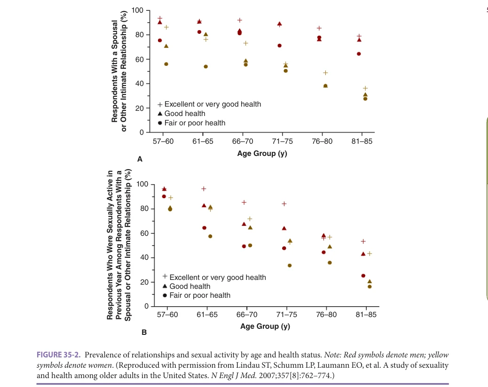

*FIGURE 35-2. Prevalence of relationships and sexual activity by age and health status. Note: Red symbols denote men; yellow symbols denote women. (Reproduced with permission from Lindau ST, Schumm LP, Laumann EO, et al. A study of sexuality and health among older adults in the United States. N Engl J Med. 2007;357[8]:762–774.)*

*Owner annotations/highlights are from the marked source copy, not the book.*

present barriers to communication about sexual matters. In addition, older women perceive physicians to be poorly trained to deal with patients’ sexual concerns and that physicians presume older women to be asexual or disinterested (see Table 35-2).

Aging of the baby boomers, the generation of the sexual revolution, is increasing demand for medical attention to sexual matters. Although male longevity is expected to increase, older women will continue to outnumber older men through 2050; this presents a significant gender disparity in the opportunity for formation of new sexual relationships in later life and, in some cases, results in multiple women sharing a single male partner. Little is known about the health implications of emerging trends among older adults including nonmonogamy, rising rates of divorce, unmarried cohabitation, same-sex marriages, and later life dating.

### Sexuality and Cognitive Function

Until recently, most of what was known about sexuality in the context of cognitive dysfunction derived from studies of sexual behavior among people with dementia living

in nursing home settings. NSHAP Wave II included the first nationally representative study of sexuality among community-dwelling people with cognitive impairment and dementia. This study found that cognitively impaired men were much more likely than women to be partnered (83% vs 57%), about half of all partnered women and men with cognitive impairment, including 40% of those aged 80 to 91, were sexually active. Sexual problems, including a lack of interest in sex, were reported by a quarter of men and one in ten women with cognitive impairment. Yet, very few cognitively impaired people had addressed sexual function concerns with their partner or a physician. Because cognitive impairment can impede consent for sexual activity, and an individual’s understanding of sex or ability to express their desire for sex can wax and wane in the course of dementia, it makes sense to include an individual’s wishes for sexual activity in their documentation of advance directives. NSHAP, in fact, reported that 14% of women and 17% of men with cognitive impairment engaged in obligatory sex or sex without feeling aroused. Currently, an estimated 3 million older people with cognitive impairment or dementia are both community-dwelling

**[p. 506]**

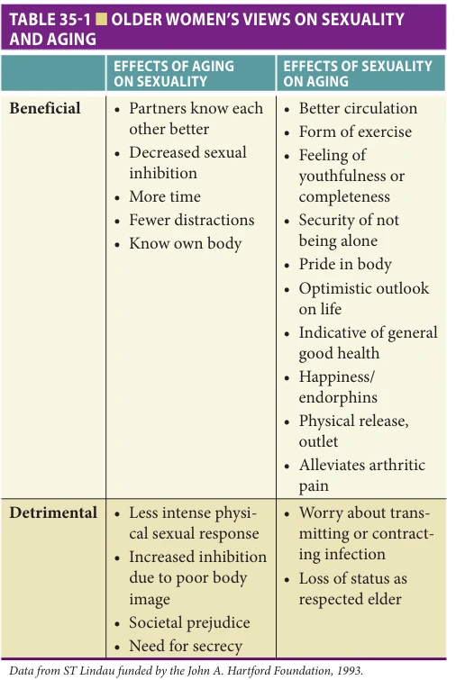

*TABLE 35-1 ■ OLDER WOMEN’S VIEWS ON SEXUALITY AND AGING*

*Owner annotations/highlights are from the marked source copy, not the book.*

and sexually active. This number is expected to double by 2050. Best practice for care of older adults with cognitive impairment should include early and ongoing discussion about the effects of impairment on sexual function, sexual behavior (which can include an increase or change in sexual behavior in some cases), and decision making about engaging in partnered sexual activity.

### Sexuality in Long-Term Care Institutions and Palliative Care

The early literature on sexuality and aging in the nursing home or long-term care setting focused on strategies for staff to restrict this behavior. Residents of long-term care institutions are less likely to be sexually active than community-residing older adults, and they cite lack of partners, lack of privacy, lack of interest, sexual dysfunction, and negative attitudes of staff as limiting sexual expression. Older lesbian, bisexual, and transgender individuals are at increased risk of stigma and discrimination, especially in settings where the right to privacy is limited.

Increasingly, as a human rights matter, long-term care institutions provide private rooms for residents and have trained their providers to understand and accept sexuality in a respectful manner. Sometimes,

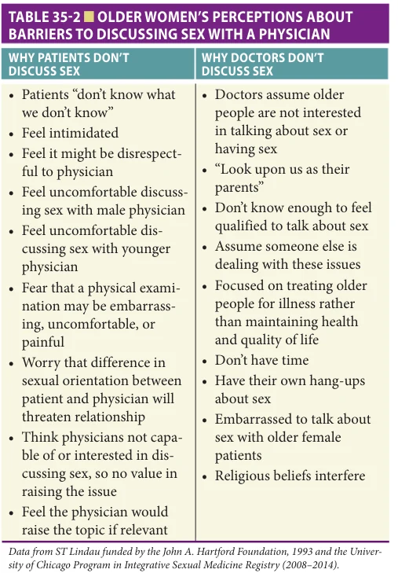

*TABLE 35-2 ■ OLDER WOMEN’S PERCEPTIONS ABOUT BARRIERS TO DISCUSSING SEX WITH A PHYSICIAN*

*Owner annotations/highlights are from the marked source copy, not the book.*

sexual relationships form among people with dementia who have, but may not remember, a communityresiding spouse. Likewise, community-residing spouses may initiate new intimate relationships while maintaining involvement with and commitment to their institutionalized spouse. The implications of these relationships for health and integrity in later life are a growing reality, but poorly understood and often a cause of distress for families. Sexual exploitation and abuse of older women living in residential facilities (and in the community) are poorly documented, but vulnerability is heightened by cognitive impairment, which can interfere with a woman’s ability to consent to sexual relations.

Palliative care, whether provided in an institutional or community setting, presents another opportunity to address a patient’s capacity for sexual function and fulfillment. Palliation for sexual function could entail providing sex hormone therapy to a patient even if she has a history of an estrogen-sensitive cancer. It could also involve treatment aimed specifically at alleviating nonhormonal causes of dyspareunia, such as timing breakthrough pain medications prior to sexual activity. While some patients bring closure to their sexual lives before entering palliative care, other patients may wish to remain intimate with their partners as long as possible. Optimization of sexual function for

**[p. 507]**

older women in palliative care is understudied and often overlooked, but is an area of increasing attention.

## SEXUAL ACTIVITY, BEHAVIOR, AND PROBLEMS

### Sexual Partnership

Population-based normative data for older women show that sexual activity is largely determined by availability of a sexual partner. Among women aged 57 to 64 in the 2005– 2006 NSHAP study, about 85% had a current spouse or other romantic or intimate partner. Nearly all of these relationships were reported as heterosexual, monogamous, and involving sexual activity. The proportion of women with a partner declined with age, because of earlier male mortality. By age 85, only about 40% of women had a partner, and fewer than 20% of all women engaged in sexual activity.

As compared with findings for younger women, women 57 years and older reported fewer total sexual partners over the lifetime. Most sexually active older women reported that their current relationship was monogamous. In the NSHAP baseline study, nearly 1 in 10 married women and twice as many nonmarried women with a sexual partner believed that their current partner had other sexual partners during the relationship.

In the NSHAP baseline study, 5% of women reported ever having a female sexual partner and only five women (0.3%) reported currently being in a relationship with another woman. Although population data on lesbian relationships at older ages are only just beginning to emerge, estimates from the younger population suggest that women in this study may have underreported same-sex relationships. Qualitative research and clinical experience reveals cases of older women choosing or demonstrating receptivity to intimacy with female partners for the first time in later life. Some women explain this as a choice caused by the scarcity of males in later life, while others are fulfilling, for the first time, a lifelong interest. The Caring and Aging with Pride study (2010), a national community-based survey of lesbian, gay, bisexual, transsexual (LGBT) aging, found that among individuals 50 years and older, lesbian and bisexual adults were less likely to have a partner or be married than people identifying as heterosexual.

The low representation of sexual minorities in studies of older adults, the frequent exclusion of older adults in studies of sexual minorities, and the lack of inclusion of questions ascertaining sexual orientation in routine research practice render older LGBT adults largely invisible in most research. This invisibility is perpetuated in clinical settings when providers do not ask about sexual orientation and when patients feel unsafe disclosing their sexual orientation. Further research is necessary to understand the barriers to accessing care and the health needs of aging sexual minorities so that culturally competent care and targeted interventions can be delivered. With marriage equality

declared a constitutional right, older adults who identify as members of a sexual minority group will be more likely to disclose their status in research, clinical, and institutional living settings.

### Sexual Activity

Among those who are sexually active (defined in the NSHAP study as engaging in “any mutually voluntary activity with another person that involves sexual contact, whether or not intercourse or orgasm occurs” during the prior 12 months), the kinds and frequency of sexual activity in which women engage are similar to those observed among younger women. Most commonly, sexual activity involves vaginal intercourse, hugging, kissing, or other forms of sexual touching, and about 45% of sexually active women engaged in oral sex. On average, the frequency of sexual activity for those with a sexual partner ranges from one to three times per month, similar to that observed among younger sexually active adults. About a quarter of women aged 57 to 85 reported masturbating in the previous year. The prevalence of masturbation among women without a partner is the same as among women with a partner. This is also true for older men (50% report masturbating) and suggests that older adults maintain an individual desire for sexual activity, even in the absence of a sexual partner.

### Sexually Active Life Expectancy

Sexually active life expectancy projects population patterns of sexual activity to estimate the number of years, for any given age, of expected future sexual activity. As calculated based on 1995–1996 and 2005–2006 data, at age 55, sexually active life expectancy is about 16 years for women with a spouse or other intimate partner (Figure 35-3). Among sexually active women, good health was associated with a gain of 3 to 6 years of expected future sexually active life. Communication of normative expectations to

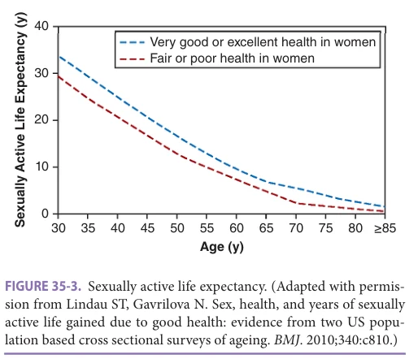

*FIGURE 35-3. Sexually active life expectancy. (Adapted with permission from Lindau ST, Gavrilova N. Sex, health, and years of sexually active life gained due to good health: evidence from two US population based cross sectional surveys of ageing. BMJ. 2010;340:c810.)*

*Owner annotations/highlights are from the marked source copy, not the book.*

**[p. 508]**

patients about the longevity and quality of their sexually active lives assuming good health could motivate patients to stop smoking, adhere to medication regimens, exercise regularly, or engage in other health-promoting behaviors. Further research is needed to evaluate the potential impact of sexually active life expectancy projections on individual health behavior. The sexually active life expectancy measure also quantifies years of sexually active life lost in the absence of knowledge and treatments to preserve sexual function as people age.

### Sexual Problems

Among sexually active women, approximately half reported having one bothersome sexual problem; almost one-third reported having two. The most common sexual problems experienced by older women are summarized in Table 35-3. Lack of interest in sex, pain with intercourse, unpleasurable sex, and inability to experience orgasm are much more common among older women as compared to men and somewhat more common compared to younger women. Because some sexually inactive women discontinued sexual activity as a result of bothersome sexual problems, the NSHAP baseline study underestimates the prevalence of problems in the whole population. On the other hand, many women engage in sex despite bothersome problems. The rewards or gains of sexual engagement may outweigh the experience of sexual pain or lack of physical pleasure; some women may obligatorily participate in sex to satisfy their partner while others may lack agency to refuse.

Problems related to sexuality in later life can result from sexually transmitted infection, trauma, and sexual

violence or abuse. These topics are discussed below. Sexual dysfunction, including clinical diagnosis and treatment, is discussed later in this chapter.

### Sexually Transmitted Infections (STIs)

Data from the NHANES and the baseline NSHAP study provide the population prevalence of STIs among older women. Overall, the prevalence of most STIs in the general older adult population is very low (< 1% for Chlamydia trachomatis, Neisseria gonorrhea, and syphilis), although rates of some infections may be higher in residential communities or geographic regions with high concentrations of sexually active older adults (eg, Florida and Hawaii in the United States), or in other subpopulations. A prevalence estimate for Trichomonas vaginalis among older US women is not available; late twentieth-century data from Danish and Chinese epidemiologic studies indicate that very few cases occur among women 60 years and older. Changes in the cervical epithelium caused by loss of estrogen in older women may account for reduced susceptibility to these infections. Although there is no evidence for an epidemic, STI prevalence among older adults is likely underestimated because of lack of uniform tracking systems and under-identification in the clinical setting. One study showed that physicians were likely to counsel older African-American and married women about human immunodeficiency virus (HIV) and other STIs, but the majority of older women reported that a physician has never initiated such discussion.

Viral infections, including genital herpes simplex virus (HSV) and human papillomavirus (HPV), are the

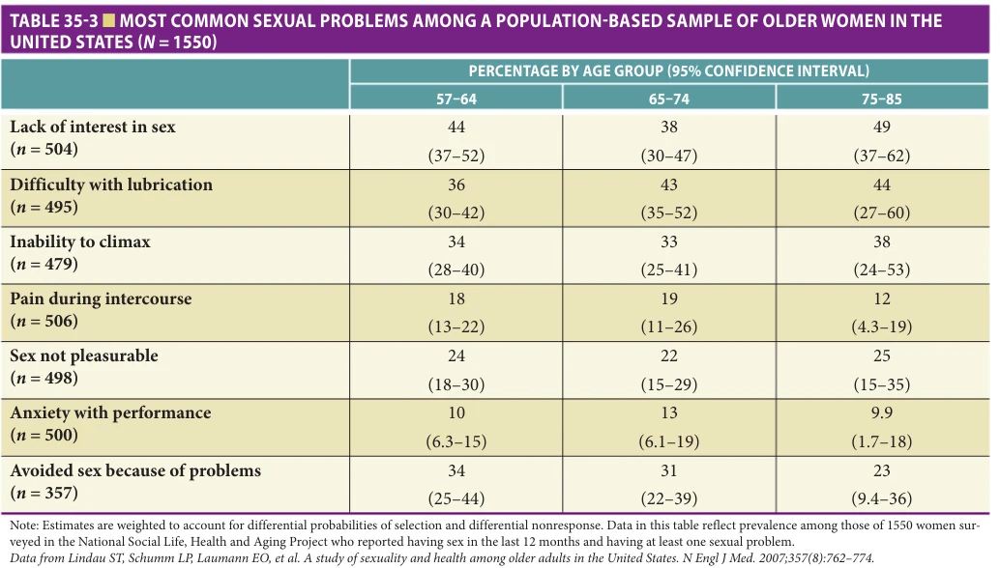

*TABLE 35-3 ■ MOST COMMON SEXUAL PROBLEMS AMONG A POPULATION-BASED SAMPLE OF OLDER WOMEN IN THE UNITED STATES (N = 1550)*

*Owner annotations/highlights are from the marked source copy, not the book.*

**[p. 509]**

more prevalent STIs among older women. HSV-2 seroprevalence among men and women 70 years and older based on NHANES III data (1988–1994) was 28%, but women had a higher overall prevalence than men and rates were much higher among African-Americans (74%) and Mexican Americans (45%). High-risk, or oncogenic, HPV (HR-HPV) prevalence among women aged 57 to 85, based on 2005–2006 NSHAP data, was 6% and did not vary significantly across age or racial/ethnic groups. The prevalence of HR-HPV among older women is similar to that documented by NHANES for women aged 50 to 59. HR-HPV is an important factor in both cervical dysplasia and cervical cancer, a leading cause of female cancer death in the world. In the United States, about 20% of cervical cancer cases, but more than a third of cervical cancer deaths, occur in women aged 65 and older. Most screening and prevention strategies, including HPV vaccine, use age-based eligibility criteria that exclude older women.

The rate of new HIV infection among older women in the United States, particularly those of minority racial and ethnic groups, has been increasing over the last several years, due mostly to transmission by heterosexual sex. Mucosal atrophy (vaginal, rectal) related to menopausal estrogen depletion increases an older woman’s susceptibility to mucosal tears and abrasions that can facilitate HIV transmission. In 2010, 27% of Americans diagnosed with HIV/AIDS after age 50 were women. Public health messages regarding HIV/AIDS prevention and detection do not target older women, and physicians rarely offer HIV counseling or testing to this group. The effects of HIV/AIDS and treatments on sexual function among older women have been minimally investigated. Please see Chapter 107 for further discussion of HIV in later life.

STI prevention strategies for older adults have not been well-tested. Counseling women with new or multiple sexual partners warrants discussion of STI prevention, including education about barrier methods such as male and female condoms and dental dams (for oral sex) (Figure 35-4). Few older adults, including those in nonmarital sexual relationships, report using condoms. Condom use by older couples to prevent STIs may be compromised by the belief that condoms are not necessary if there is no risk of pregnancy; by changes in male and female physiology that occur with age;

and by knowledge, communication, and cultural barriers as seen in younger age groups. A male condom is best applied when the penis is fully erect, but for some older men, full erection may not occur until after coitus is initiated. Female condom use does not require a fully erect penis and may be preferable for some couples.

For women, increased susceptibility to condominduced vaginal irritation or abrasion may result from vaginal dryness and/or atrophy caused by estrogen depletion. Foreplay is encouraged to stimulate full penile erection and maximal female arousal before attempting vaginal or other penetration. Use of water or silicone type lubricants is recommended to reduce vaginal and vulvar friction in couples using condoms (oil-based lubricants can reduce condom effectiveness). Because they dry quickly, water-based lubricants may actually increase vaginal friction. Condoms with spermicide are not necessary for post-reproductive age women and should be avoided because they have a shorter shelf-life and have been associated with urinary tract infection in younger women. Nonlatex male and female condoms and dental dams are available for individuals with latex sensitivities and allergies, and they have physical and performance properties that some individuals may prefer. Male and female condoms and dental dams are for onetime use only.

Medicare annual wellness visits are an ideal opportunity for physicians to assess their patients’ sexual history, although sexual history-taking is not included in the CMS quick reference document for the annual wellness visit. Medicare does cover HIV testing, and, for at-risk individuals, chlamydia, gonorrhea, syphilis, and hepatitis B tests. People at increased risk of STIs can receive up to two individual 20- to 30-minute, intensive in-person behavioral counseling sessions each year. These counseling sessions can include education, skills training, and guidance on safe sexual behavior and may help mitigate the competing clinical issues that prevent discussion of safer-sex practices during routine visits.

### Sexual Trauma, Violence, and Abuse

Early life events, including sexual trauma in the form of abuse, exploitation, genital injury, and rape, can have lasting effects on sexuality and health that persist into later life.

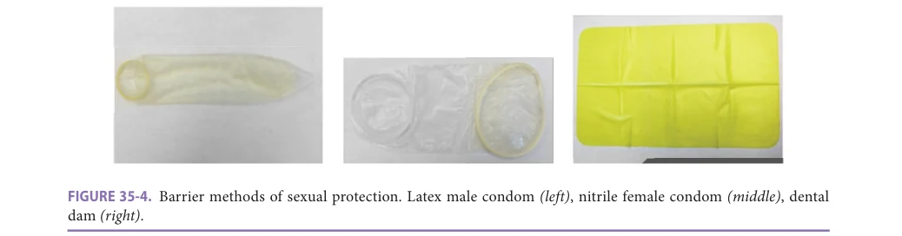

*FIGURE 35-4. Barrier methods of sexual protection. Latex male condom (left), nitrile female condom (middle), dental dam (right).*

*Owner annotations/highlights are from the marked source copy, not the book.*

**[p. 510]**

Lifetime estimates among older women indicate that 20% to 26% of women experience intimate partner violence; nearly 40% in one study reported that this was severe, including forced sex or sexual contact. In the NSHAP baseline study, 9% of women aged 57 to 85 reported a lifetime history of forced sex (which may or may not have been with an intimate partner); of these, nearly 40% reported that the most recent event occurred at or younger than age 19 and 16% reported that the most recent event occurred after age 40. Sexual dysfunction, particularly conditions such as vaginismus, dyspareunia, inability to experience orgasm, lack of pleasure with sex, and disturbing fantasies are more common among women with a history of sexual trauma, violence, or abuse. In conjunction with medical treatment and/or physical therapy, psychotherapy can be effective in helping women cope with sexual violence and experience positive sexual relationships.

Elder mistreatment, or abuse, discussed in Chapter 48, is defined by the US CDC to include sexual abuse or abusive sexual contact but is not limited to an intimate partner. In fact, lack of a spouse or other partner,

cognitive impairment, and institutionalization are risk factors for female sexual abuse and rape in later life. Very little is known about how commonly older women experience sexual violence or abuse; 3% of women aged 60 and older in one study reported having been pressured to have sex in a way they did not like or want since age 55. Few older women report that a physician has ever asked questions to ascertain sexual victimization. There is not sufficient evidence to support the accuracy of existing screening tools to identify abuse in older adults, and studies of interventions to address sexual trauma focus almost exclusively on younger women, perhaps explaining why physicians may feel ill-prepared to screen for victimization among older women. Screening questions for identifying intimate partner violence in the clinical setting are summarized in Table 35-4 and should be part of routine assessment of the older woman.

In acute or emergency care settings, intimate partner violence and sexual abuse should be considered when a woman presents with physical injury, vague symptoms (especially in recurrent visits), acute mental status changes,

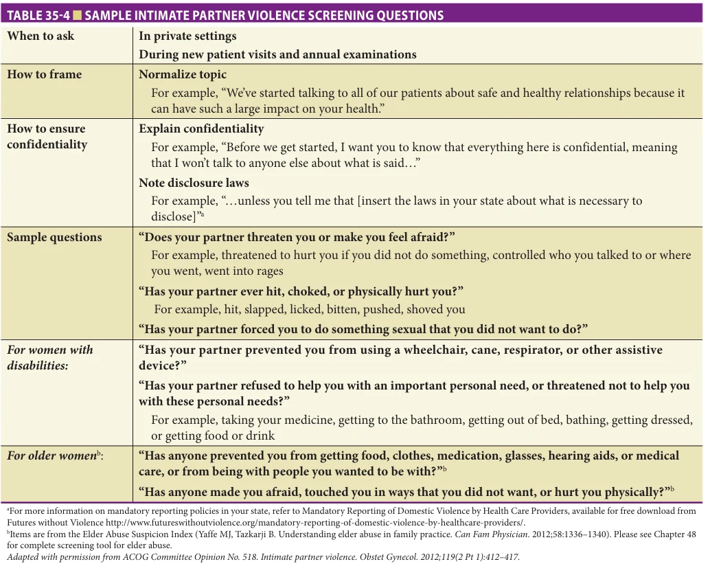

*TABLE 35-4 ■ SAMPLE INTIMATE PARTNER VIOLENCE SCREENING QUESTIONS*

*Owner annotations/highlights are from the marked source copy, not the book.*

**[p. 511]**

and/or is accompanied by a partner or other individual who interferes with the patient’s interaction with health care providers.

## FEMALE SEXUAL RESPONSE CYCLE

The Masters and Johnson model of the female sexual response cycle (Figure 35-5A), based on physiologic research initiated in the 1960s with a convenience sample of local sex workers, other volunteers, and patients presenting for treatment of sexual problems or contraception, remains the most widely represented model in medical textbooks and historically was the foundation for the Diagnostic and Statistical Manual definitions for sexual dysfunction. This traditional, linear model describes four phases of human sexual response: excitement, plateau, orgasm, and resolution (sex therapist Helen Singer Kaplan modified this model in 1979 to include orgasm, excitement, and desire) and illustrates notable differences in female as compared with male sexual physiology.

According to Masters and Johnson, the female sexual response is more variable than that of males, and female orgasm may be single and peak-like similar to male orgasm, more gradual or undulating, and/or repetitive during a single sexual encounter. The typical male sexual response is described as much more uniform, peaking in a single orgasm, and includes a latency period during which a subsequent orgasm cannot occur. Arousal for women tends to require direct clitoral or periclitoral stimulation and, for many women, nipple areolar complex stimulation, before, during, and/or after intercourse (which may involve penile-vaginal, penile-anal, oral, or manual penetration) in order to experience orgasm. Sufficient arousal with vaginal lubrication (physiologic or with a lubricant) before vaginal penetration may be particularly important for the older woman engaging in vaginal intercourse with a male sex partner because of reduction in the firmness and fullness of the male erection in later life.

The pattern of female sexual response may vary across time and relationships, although little is known empirically about the physiology of the female sexual response cycle in later life or in the context of very long-term (several decades or more) relationships. Psycho-emotional changes, and changes in physical appearance with age, can negatively or positively affect an older woman’s feeling of attractiveness, and can influence her interest in sex. Some women indicate decreased psychological inhibition about physical appearance or improved self-image with age, both of which can be sexually liberating.

As men age, the sexual response becomes more similar to that of women (a phenomenon some refer to as “feminization of the male sexual response cycle”). Tactile stimulation and foreplay are increasingly important for older male arousal, the time to erection and orgasm is longer, and latency between orgasms (the refractory period) is increased. Because few older men or women are aware of

these phenomena, these changes often cause unnecessary anxiety and shame, leading some couples to cease sexual activity as a consequence. The changes to sexual physiology that occur with age may be beneficial to some couples, as the mutual need for foreplay and the longer arousal phase in men makes it easier for some couples to experience simultaneous orgasm. Older couples should be provided basic information about the normative changes to sexual function that occur with aging. The National Institute on Aging offers an “AgePage” on this topic (http://www.nia.nih. gov/health/publication/sexuality-later-life); the American Association of Retired Persons (AARP) also offers accessible, consumer-focused information about sexuality and intimacy in its publications. WomanLab.org, a resource from the University of Chicago Program in Integrative Sexual Medicine, was codeveloped with aging women to fill gaps in public and clinician understanding of female sexuality in the context of aging and illness.

Building on the pioneering work of Masters and Johnson, Basson proposed a widely referenced intimacybased, cyclical model of the female sexual response that incorporates the quality and duration of the relationship as well as the psycho-emotional component of female sexuality (Figure 35-5B). In women, sexual desire may occur before or following sexual arousal. This model emphasizes the role of intimacy in generating female sexual desire and suggests that lack of intimacy and unsatisfying sexual encounters can raise the threshold for interest and arousal in a subsequent sexual encounter. Rather than linear and discrete, the phases of the female sexual response are described by Basson as variably overlapping in a way that “blends mind and body.”

Further empirical characterization of the physiology and psychosocial aspects of the female sexual response cycle in later life, including how it might fluctuate within relationships over long durations of time, across relationships, and with aging, is needed both to inform women’s expectations and the clinical approach to older women’s sexuality.

## FEMALE SEXUAL PHYSIOLOGY IN LATER LIFE

Effects of senescence on the endocrine, neurovascular, musculoskeletal, genitourinary, and gastrointestinal systems are particularly salient to sexual function in later life. Global changes in physical appearance, sensory function (hearing, vision, olfaction, taste, and tactile sensation), cognitive function and memory, and body aromas such as scent, breath, and genital odor can also affect sexual engagement and enjoyment. The female sexual response involves a complex and highly interconnected series of physiologic events connecting mind and body. Disruptions in these physiologic systems caused by age-related changes, physical or mental illness, or medical procedures and medication use can alter the sexual response and the ability of a

**[p. 512]**

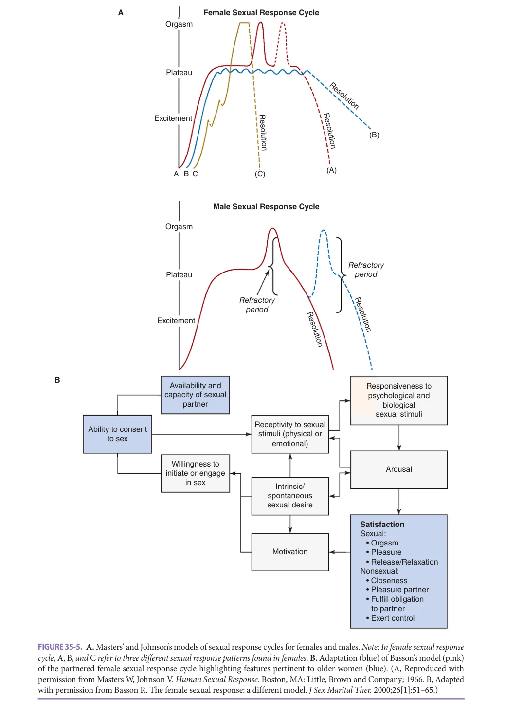

*FIGURE 35-5. A. Masters’ and Johnson’s models of sexual response cycles for females and males. Note: In female sexual response cycle, A, B, and C refer to three different sexual response patterns found in females. B. Adaptation (blue) of Basson’s model (pink) of the partnered female sexual response cycle highlighting features pertinent to older women (blue). (A, Reproduced with permission from Masters W, Johnson V. Human Sexual Response. Boston, MA: Little, Brown and Company; 1966. B, Adapted with permission from Basson R. The female sexual response: a different model. J Sex Marital Ther. 2000;26[1]:51–65.)*

*Owner annotations/highlights are from the marked source copy, not the book.*

**[p. 513]**

woman to derive pleasure and satisfaction from her sexual encounters.

### Endocrine System, Menopause, and the Genitourinary System

Loss of estrogen due to menopause is a dominant physiologic event that can affect many aspects of older women’s sexual function. Women can live a third or more of life in menopause: the median age of natural menopause in the United States is 51 and average female lifespan is 81 years. Surgical menopause occurs when a woman undergoes bilateral oophorectomy (or loses ovarian function as a result of other interventions such as chemotherapy or radiation) prior to natural menopause. In the NSHAP study, about one in five US women aged 57 to 85 reported a history of surgical menopause. Women who have undergone bilateral oophorectomy, pre- or postmenopause, also experience an abrupt and irreversible loss of androgen production.

Estrogen is important for maintaining skin, subcutaneous, mucosal (vaginal, bladder, and rectal) and musculoskeletal integrity, the vaginal microenvironment (pH balance and microflora), vascular flow to the vagina and clitoris via regulation of nitric oxide synthase expression, and sensory perception. Over time, low estrogen results in vaginal dryness, loss of epithelial cell glycogen, shortening of the vagina, narrowing of the introitus, thinning of the labia, and diminution of the fat pad underlying the mons pubis. Loss of vaginal acidity results from glycogen depletion and can increase propensity for bacterial vaginitis. Urinary and fecal incontinence can be exacerbated by estrogen depletion and inhibit social and sexual relationships as well as sexual function. The term genitourinary syndrome of menopause (GSM) was adopted in 2014 to encompass the constellation of genital and urinary signs and symptoms attributed to the absence of estrogen and aging (Table 35-5). Maintenance of sexual activity in later life appears to offset some of these local genital changes, in part by maintaining elasticity of the vulvovaginal tissues, pelvic floor musculature, and pelvic joints. Additionally, sexual activity and other forms of physical contact may mitigate estrogen-related decline in sensory perception and function with age and may play a role in female attractiveness. Exogenous estrogen is approved by the US Food and Drug Administration (FDA) for treatment of moderate to severe dyspareunia in women. Details of estrogen treatment, including a table of available preparations, and treatment of other genitourinary disorders affecting sexual function are provided in Chapter 36.

Testosterone, along with dehydroepiandrosterone (DHEA), plays an important role in female libido, arousal, genital sensation, and orgasm. Loss of testosterone can exacerbate vaginal mucosal atrophy, thinning of pubic hair, and may compromise an older woman’s sense of general well-being. Female androgen insufficiency as a treatable condition is controversial. While levels of endogenous androgens have not been found to be predictive of sexual function, a large meta-analysis confirmed that testosterone

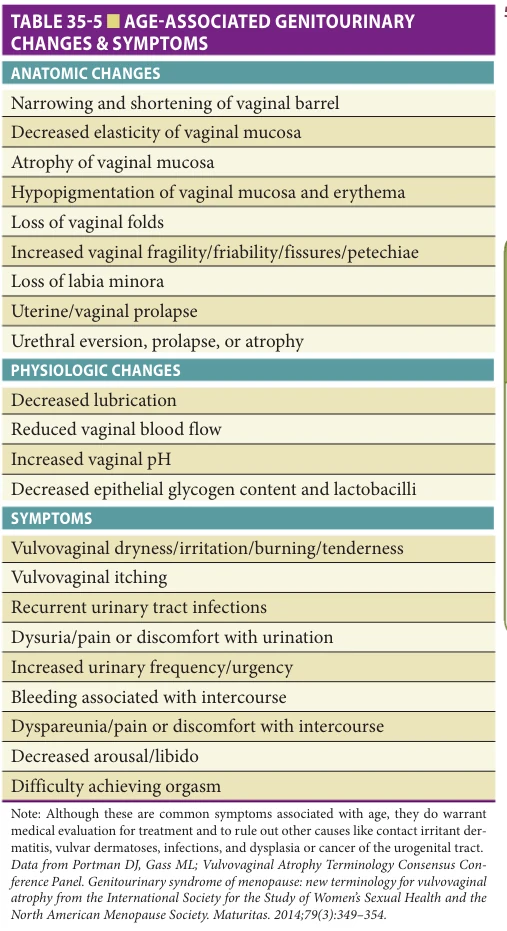

*TABLE 35-5 ■ AGE-ASSOCIATED GENITOURINARY CHANGES & SYMPTOMS*

*Owner annotations/highlights are from the marked source copy, not the book.*

therapy for low libido was effective in clinical trials involving women with bilateral oophorectomy or total loss of ovarian function, as well as postmenopausal women with or without use of estrogen therapy (estrogen reduces bioavailable testosterone by increasing sex hormone–binding globulin production). However, the FDA has not approved testosterone for this indication. Use of testosterone or DHEA to treat female sexual dysfunction is currently off-label in the United States and most countries, and requires close monitoring for side effects. Although rare, irreversible deepening of the voice and growth of facial hair may occur with testosterone use. In the 2019 Global Consensus Position Statement, an international task force found physiologic dosing of testosterone was not associated with severe side effects; however, long-term safety and efficacy have not been established in postmenopausal women.

**[p. 514]**

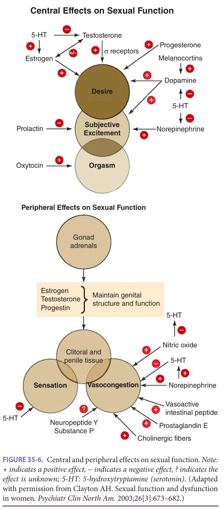

*FIGURE 35-6. Central and peripheral effects on sexual function. Note: + indicates a positive effect, − indicates a negative effect, ? indicates the effect is unknown; 5-HT: 5-hydroxytryptamine (serotonin). (Adapted with permission from Clayton AH. Sexual function and dysfunction in women. Psychiatr Clin North Am. 2003;26[3]:673–682.)*

*Owner annotations/highlights are from the marked source copy, not the book.*

Figure 35-6 summarizes central and peripheral hormonal mediators of sexual function (see also Chapter 97). Understanding centrally mediated neuroendocrine changes that occur with senescence is an active area of discovery, focused heavily on understanding cognitive pathophysiology. In women and female animal studies, interest in the cascade of neuroendocrine events resulting in menopause has been similarly driven by an effort to understand the role of sex hormones and hormone therapy in neuroplasticity

and degeneration, as well as by efforts to treat female infertility. Application of this knowledge to female sexual function in later life, particularly sex differences in endocrine regulation of the sexual response cycle, is nascent.

Aside from its peripheral effects, estrogen plays an important central role via direct membrane receptor activity and modulation of neurotransmitters. Estrogen appears to exert neurotrophic and neuroprotective activity in the brain that mitigates hypothalamic damage that occurs with age. Estrogen also interacts with serotonin and norepinephrine metabolism, which may explain the role of estrogen depletion in sleep, mood, memory, and, through these and no doubt other mechanisms, the female sexual response cycle in later life.

The hypothalamic-pituitary-adrenal (HPA) axis mediates the human physiologic stress response and, of course, is the pathway or pacemaker through which sex hormonal regulation occurs. The loss of temporality and pulsatility in HPA neural signaling is a key event in menopause; the dynamics of HPA function over the portion of the lifespan following menopause and the implications for female sexual functioning in later life are much less well-defined. Vasoactive intestinal peptide (VIP), now recognized to play a role in female sexual arousal via vasocongestion of the clitoral tissue, also signals time of day information for central gonadotropin-releasing hormone (GnRH) regulation. Rhythmic synthesis of VIP in the brain appears to wane by middle age in women and may be an important triggering event in the loss of hypothalamic-pituitary-ovarian access coordination required for ovulation and menstruation. The peripheral effects of changes in central VIP metabolism for later life sexual arousal in women are unknown.

### Neurovascular System

Neurovascular physiology, mediated by the sympathetic and parasympathetic nervous systems and a growing list of nonadrenergic/noncholinergic neurotransmitters (eg, nitric oxide and VIP), is particularly important for the arousal and orgasm phases of the female sexual response cycle. Arousal involves vascular engorgement of the genitopelvic organs, including the labia, vagina, and clitoris; lengthening, dilation, and lubrication of the vagina; retraction of the clitoral hood; and tumescence of the clitoris. Microvascular integrity is important for genital sensation and orgasm. Clitoral sensation, in particular, can be compromised by microvascular disease as seen in chronic smokers and women with hypercholesterolemia or diabetes. Although clinical guidelines for diabetes care in men advise assessment and treatment of erectile problems, clinical guidelines for women do not go beyond screening for sexual dysfunction. Research on effective treatment options for sexual dysfunction among older women with diabetes is needed to inform clinical guidelines. Women with diagnosed diabetes are less likely than men to have discussed sexual problems with a physician and more likely to cease all sexual activity.

**[p. 515]**

Cardiovascular disease can impair women’s sexual function in later life both through psychological and physiologic mechanisms. Although practice guidelines recommend that physicians communicate with patients about the sexual implications of heart disease and potential sexual side effects of treatment, these issues are commonly omitted from counseling, and men are significantly more likely than women to receive such counsel.

Treated and untreated hypertension are both associated with lower rates of sexual activity among older women. However, among sexually active older women, the rate of sexual problems is similar among women with treated hypertension, untreated hypertension, and no hypertension. No one class of antihypertensives has been consistently associated with female sexual dysfunction, particularly in older women. Based on expert opinion, older women with hypertension should be counseled that treatment of hypertension is likely to improve overall sexual function and longevity.

Acute myocardial infarction (AMI) is an important health problem in older women. United States and European practice guidelines state that patients with uncomplicated AMI can resume sexual activity within a week of AMI. Based on the largest study to date of sexual outcomes in AMI among older women, the majority of those who were sexually active before their AMI resume sexual activity within 1 year following AMI. Receipt of counseling by a physician about resuming sex is the single most important predictor of whether a woman resumes sexual activity after AMI.

Phosphodiesterase inhibitors are used in men to treat neurovascular causes of erectile dysfunction; similar effectiveness has not been found in women. The only FDA-approved device for treatment of female sexual dysfunction, the Eros Therapy (UroMetrics) clitoral pump, may assist some women with microvascular disease in experiencing improved clitoral sensation, vaginal lubrication, and orgasm.

### Musculoskeletal System and Body Fat

Parity, childbirth-related injury, pelvic or lower extremity trauma, obesity, and sedentariness can compromise the integrity of the vulvar, pelvic floor, and lower extremity musculature, contributing to incontinence and pelvic organ prolapse. Effective contraction and relaxation of the peri-introital, perineal, and pelvic floor muscles are important for penetration, arousal, orgasm, and the relaxation phase following orgasm. Loss of flexibility of hip muscles and compromised stability and mobility of hip joints, commonly experienced by women with arthritis or hip fracture, can interfere with sexual functioning in later life. Skeletal changes in the hips and vertebrae caused by loss of bone density, osteoporosis, vertebral compression and fracture, and arthritis can make vaginal penetration, particularly using “missionary” (female supine with hips and knees flexed) position, difficult and may be accommodated by use of alternative sexual positioning such as side-lying or

sex without vaginal penetration. Prevention and treatment of these conditions with attention to maximizing musculoskeletal strength and flexibility can improve overall physical functioning and help preserve sexual capacity for aging women. Endorphin release associated with pleasurable sexual activity may help alleviate musculoskeletal pain.

Although more than a third of women age 65 and older are obese, little is known about the effect of obesity on older women’s sexual function and satisfaction. Research is further complicated by women’s varying self-appraisals of their body size and attractiveness, the frequent co-occurrence of obesity and chronic disease among older women, and the potentially different contributions of abdominal adiposity, generalized obesity, and relative weight gain postmenopause.

### Gastrointestinal System

Gastrointestinal changes with aging that are most relevant to female sexual function include incontinence of stool and flatus, hemorrhoids, and borborygmi. Anal or stool incontinence typically results in cessation of sexual activity and can be socially isolating. Hemorrhoids can be exacerbated by sexual activity, particularly anal intercourse, and may result in bleeding during or following sex. Borborygmi can be controlled to some degree by timing of meals in relation to symptoms. Constipation can be a cause of dyspareunia; this can be overcome by treating the primary cause of constipation and educating the patient to time sexual activity after moving her bowels. Older women should be screened and evaluated for anal and urinary incontinence, especially those who have ceased and/or wish to resume sexual activity after a hiatus, as both are commonly overlooked as contributors to female sexual function. Treatment should be initiated in order to prevent embarrassing or painful sexual experiences that can be very detrimental to sexual self-image and function.

### Cancer and Female Sexual Function

The vast majority of cancers affecting older women involve treatment with local or systemic therapies that impair or surgically remove the sexual organs. Most women who develop cancer value their sexual function and wish to preserve the possibility of future sexual activity. All women, regardless of age or current partner status, undergoing treatment for cancer should be counseled about the potential effects of cancer or its treatment on future sexual function, and baseline sexual activity and function (prior to cancer treatment) should be documented. Women undergoing pelvic radiation should be offered vaginal dilation therapy to preserve vaginal capacity for sexual activity and future gynecologic examinations. The most common sexual function problems in this patient population include dyspareunia, commonly resulting from or exacerbated by severe vulvovaginal atrophy (VVA), and diminished or no libido. Compromised sexual function and painful or unsatisfying sexual activity may strain intimate partnerships and

**[p. 516]**

provoke anxiety about cancer recurrence. Repeated studies show that women with cancer, including older women, believe that physicians should discuss sexual outcomes and side effects of treatment. As in cardiovascular disease, women who report discussing sex with a physician are significantly less likely to avoid sex because of a sexual problem or to exhibit complex sexual morbidity.

## SEXUAL HISTORY-TAKING

There is ample evidence that older women, including those who are not currently sexually active, regard sexual function as an important aspect of health, believe it is appropriate for physicians to discuss sexual issues in the context of medical care, and want physicians to be proactive in counseling about sexual outcomes or side effects of treatment. Avoidance of these matters can be deleterious, particularly for women who identify as a member of a sexual minority group. Geriatricians can signal their openness to all patients by posting commonly recognized symbols such as a rainbow flag or an explicit statement of respect for all human rights (Figure 35-7).

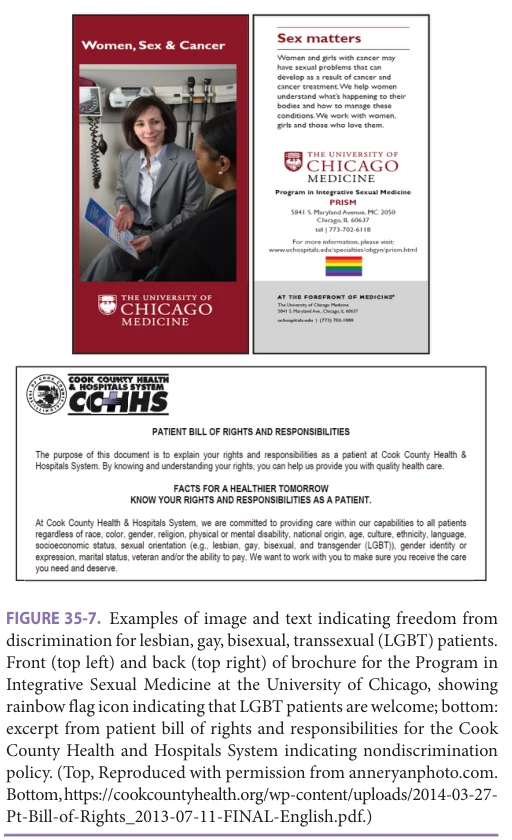

*FIGURE 35-7. Examples of image and text indicating freedom from discrimination for lesbian, gay, bisexual, transsexual (LGBT) patients. Front (top left) and back (top right) of brochure for the Program in Integrative Sexual Medicine at the University of Chicago, showing rainbow flag icon indicating that LGBT patients are welcome; bottom: excerpt from patient bill of rights and responsibilities for the Cook County Health and Hospitals System indicating nondiscrimination policy. (Top, Reproduced with permission from anneryanphoto.com. Bottom, https://cookcountyhealth.org/wp-content/uploads/2014-03-27Pt-Bill-of-Rights_2013-07-11-FINAL-English.pdf.)*

*Owner annotations/highlights are from the marked source copy, not the book.*

Table 35-6 lists basic sexual history questions that can be incorporated into a routine geriatrics encounter and should be tailored to the individual’s needs.

The geriatrician is also encouraged to include on patient self-report or review of system checklists a simple item such as, “Do you have any sexual problems or concerns?” The widely used PLISSIT model or the “therapeutic moment” approach described in Tables 35-7A and B can help guide a preliminary conversation about sexual concerns. When a patient presents with multiple concerns in addition to a sexual concern, the geriatrician should work with the patient to prioritize issues for the current visit, acknowledge the sexual concern, and suggest, if necessary, that the patient return for a visit focused specifically on that issue. The IBM (see Figure 35-1) provides a useful framework for more in-depth assessment of a patient’s sexual concern. The geriatrician should inquire about the patient’s biological or medical problems, psychological or emotional problems, and relational or social problems. If the patient is in a current relationship, the history should also inquire about the partner’s health in these domains, whether there has been communication with the partner about the patient’s sexual concerns, and whether the partner also has any sexual function difficulties.

## FEMALE SEXUAL DYSFUNCTION

Use of terms like “dysfunction,” “normal,” and even “healthy” in relation to human sexuality requires caution and has been criticized, particularly in the feminist and psychology literatures. What is a normal level of sexual desire for older women? Is celibacy unhealthy? Few older women report same-sex partners, so is lesbianism abnormal? Is a distressing sexual difficulty a “dysfunction” or a “normal” response to unhappy circumstances in a relationship? Critiques are rooted in a painful history of sexual discrimination, particularly in the United States, and partially in medical history; as recently as the early 1990s, female sexual dysfunction could be diagnosed as a sexual problem experienced by a woman even if it was only troublesome to her partner. In addition, skeptics of the “medicalization” of female sexuality question how “normal” or “functional” sexuality can be defined as the absence of problems, given the high prevalence of sexual problems in the population.

### Diagnostic Classification of Female Sexual Dysfunction

The Diagnostic and Statistical Manual of Mental Disorders, Fifth Edition (DSM-5) updates classification of female sexual dysfunction for clinical diagnosis (Table 35-8). The DSM-5 merges the conditions dyspareunia and vaginismus (classified separately in the DSM-IV) as genitopelvic pain/ penetration disorder. Hypoactive sexual desire disorder and female arousal disorder are now defined as female sexual interest/arousal disorder.

**[p. 517]**

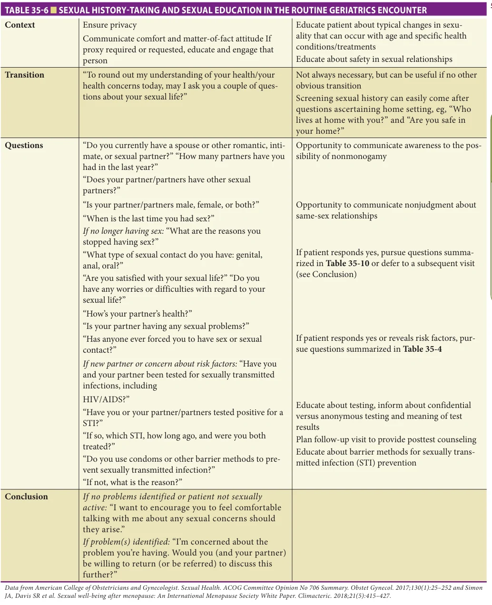

*TABLE 35-6 ■ SEXUAL HISTORY-TAKING AND SEXUAL EDUCATION IN THE ROUTINE GERIATRICS ENCOUNTER*

*Owner annotations/highlights are from the marked source copy, not the book.*

Population estimates of sexual problems from the cross-sectional NSHAP study (Figure 35-8) and other studies are useful for quantifying the baseline prevalence of sexual problems in later life, or even bothersome sexual

problems, but should not be expected to translate precisely into population rates of female sexual dysfunction, clinically defined. Prevalence estimates for older women can be estimated from prior studies, but are needed for the newly

**[p. 518]**

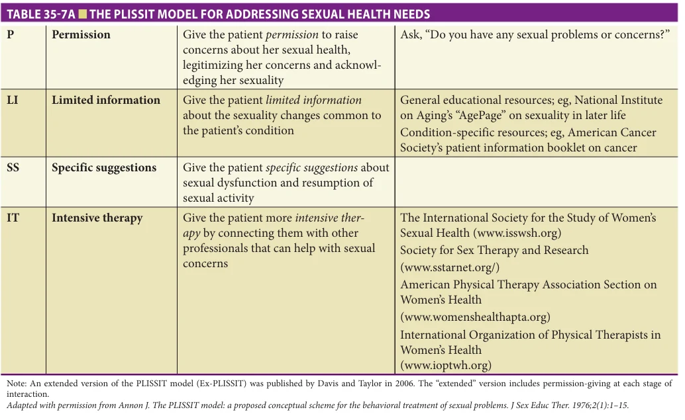

*TABLE 35-7A ■ THE PLISSIT MODEL FOR ADDRESSING SEXUAL HEALTH NEEDS*

*Owner annotations/highlights are from the marked source copy, not the book.*

defined classes of genitopelvic pain/penetration disorder and female sexual interest/arousal disorder.

### Causes of Female Sexual Dysfunction

Sexual dysfunction in later life can be primary, such as a lifelong history of bothersome low sexual desire, or secondary. Secondary causes include (1) interpersonal and personal psychological factors including depression and substance use, (2) biological factors including a wide spectrum of illnesses, injuries, physical disabilities, and their medical and surgical treatments (note that earlier life illness such as cancer and its treatment may have long-lasting effects on sexual function in survivors), and (3) social factors. The patient’s psychosexual history and her current partner’s

physical and mental health, medications, substance use, and sexual function must also be investigated in order to gain a full picture of the patient’s sexual functioning and to appropriately tailor therapeutic interventions. Common medications implicated among iatrogenic causes of sexual dysfunction are summarized in Table 35-9. Evidence for the effects of drugs on sexual dysfunction is mixed overall and very limited with respect to older females, specifically. Treatment of underlying disease and health concerns, including common problems like incontinence, vaginal atrophy, sleep dysfunction, and depression, is an essential first step to addressing sexual function problems. Sexual side effects of medications can be offset by improvement of disease-related symptoms and better overall health.

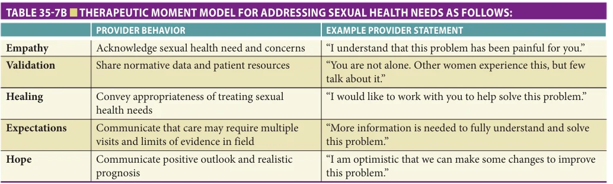

*TABLE 35-7B ■ THERAPEUTIC MOMENT MODEL FOR ADDRESSING SEXUAL HEALTH NEEDS AS FOLLOWS:*

*Owner annotations/highlights are from the marked source copy, not the book.*

**[p. 519]**

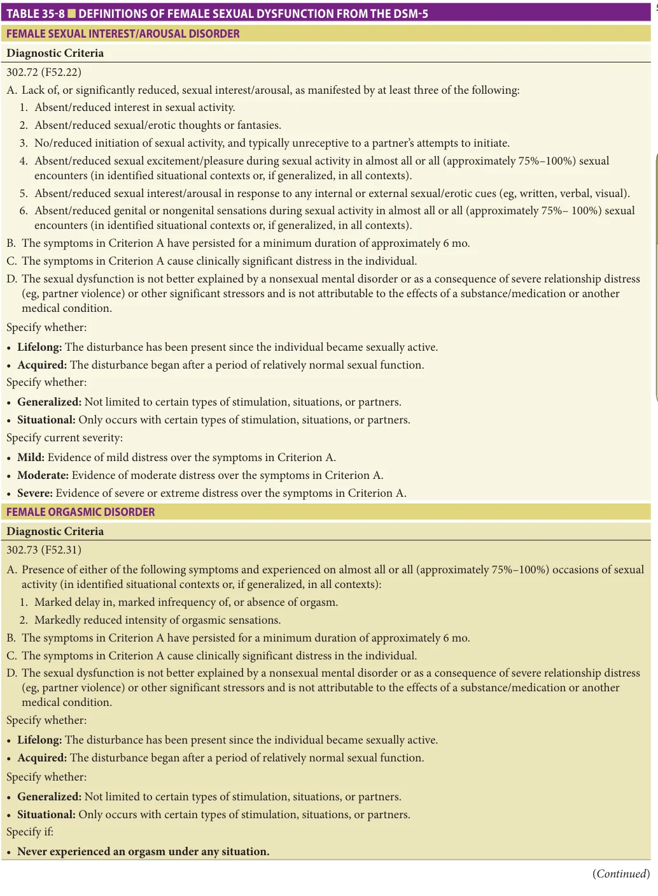

*TABLE 35-8 ■ DEFINITIONS OF FEMALE SEXUAL DYSFUNCTION FROM THE DSM-5*

*Owner annotations/highlights are from the marked source copy, not the book.*

**[p. 520]**

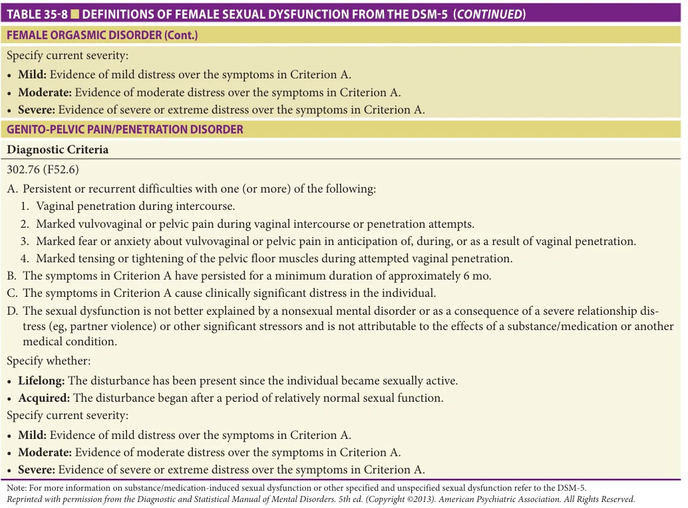

*TABLE 35-8 ■ DEFINITIONS OF FEMALE SEXUAL DYSFUNCTION FROM THE DSM-5*

*Owner annotations/highlights are from the marked source copy, not the book.*

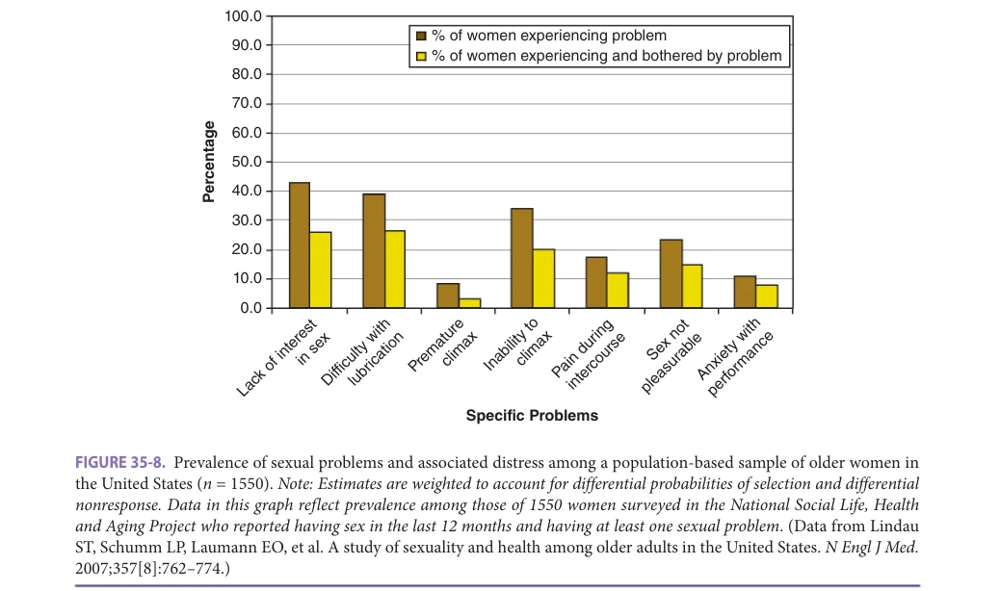

*FIGURE 35-8. Prevalence of sexual problems and associated distress among a population-based sample of older women in the United States (n = 1550). Note: Estimates are weighted to account for differential probabilities of selection and differential nonresponse. Data in this graph reflect prevalence among those of 1550 women surveyed in the National Social Life, Health and Aging Project who reported having sex in the last 12 months and having at least one sexual problem. (Data from Lindau ST, Schumm LP, Laumann EO, et al. A study of sexuality and health among older adults in the United States. N Engl J Med. 2007;357[8]:762–774.)*

*Owner annotations/highlights are from the marked source copy, not the book.*

**[p. 521]**

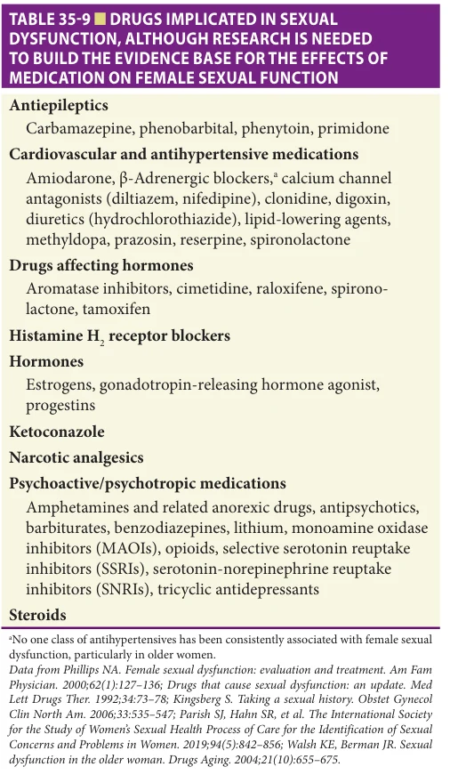

*TABLE 35-9 ■ DRUGS IMPLICATED IN SEXUAL DYSFUNCTION, ALTHOUGH RESEARCH IS NEEDED TO BUILD THE EVIDENCE BASE FOR THE EFFECTS OF MEDICATION ON FEMALE SEXUAL FUNCTION*

*Owner annotations/highlights are from the marked source copy, not the book.*

### Clinical Evaluation of Sexual Dysfunction

Health care providers should routinely inquire about sexual function during visits to normalize the topic and establish a safe space to discuss concerns. Questions to assess sexual dysfunction are summarized in Table 35-10. Identification of the level of personal distress caused by each problem can be assessed informally by asking, “How much does this problem bother you?” and can be noted as a lot, somewhat, or not at all. Not uncommonly, an older woman will say she is not bothered by the problem, but is motivated to address it for relational purposes. The Derogatis Female Sexual Distress Scale (2002) and other research tools can be used to track change in distress over time, but have not been validated in geriatric-age women. We recommend the PROMIS sexual function measures (http://www.nihpromis.org/measures/availableinstruments).

Although many adult female sexual function problems have a psychosocial component, a thorough gynecologic physical examination by a skilled practitioner is needed to

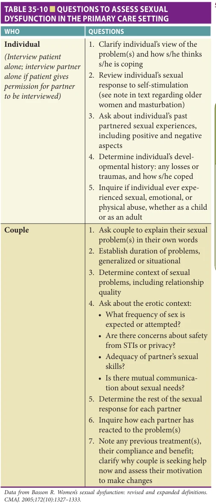

*TABLE 35-10 ■ QUESTIONS TO ASSESS SEXUAL DYSFUNCTION IN THE PRIMARY CARE SETTING*

*Owner annotations/highlights are from the marked source copy, not the book.*

evaluate for underlying gynecologic pathologies that may be contributing to sexual function issues. Details of the routine gynecologic examination can be found in Chapter 36. A vulvar cotton swab test can be used to quantify and localize vulvar pain, although some have questioned specificity of this test. Graded vaginal dilators can be used to demonstrate to the patient her vaginal capacity and to educate

**[p. 522]**

her about dilation, a useful modality in women seeking to resume sexual intercourse after a long hiatus, in women with vaginal stenosis related to radiation or extreme atrophy, and in women with vaginismus. Using a hand mirror or diagram during the pelvic examination allows the patient to visualize genital findings and the depth of penetration with the examining finger, speculum, or a vaginal dilator. This information can be therapeutic and facilitate education about the patient’s genital anatomy and any physical findings.

### Clinical Management of Female Sexual Dysfunction

Although the evidence base for treatment of sexual problems in women is growing, few studies to date include women 65 years and older. Treatment of many sexual problems benefits from an interdisciplinary approach when possible, including thorough medical evaluation, and in some cases, physical and/or psychotherapy. Despite improved coverage of mental health services for Medicare beneficiaries, very few mental health professionals with expertise in geriatrics are also certified in sex therapy. The overview of clinical management presented here draws heavily on recommendations by the Female Sexual Dysfunction Practice Bulletin (Number 2013) updated in 2019 by the American College of Obstetricians and Gynecologists (ACOG), as well as the International Menopause Society White Paper

on sexual well-being after menopause, and uses DSM-5 classifications. It aims to give primary care providers initial treatment options. If available and affordable, referral to a specialist with experience in treatment of female sexual dysfunction may be optimal. Psychotherapy, including couples’ and sex therapy, cognitive-behavioral approaches, mindfulness, and sensate focus techniques have been successfully implemented for treatment of female sexual dysfunction and can be adapted to the needs of older women and couples.

### Genitopelvic Pain/Penetration Disorder

Genitopelvic pain/penetration disorder is more common during and after menopause, exacerbated by thinning of the vaginal mucosa, decreased vaginal lubrication, prolapse of the pelvic organs, and shortening of the vagina caused by natural or iatrogenic loss of estrogen. Pain, attributed to these physiologic changes, is a common reason for cessation of sexual activity among older women and couples. Management involves treatment of the underlying condition, as covered in Chapter 36. Lubricants are typically used to reduce friction during vaginal or anal penetration in women with dyspareunia and are also available in hundreds of variations over the counter (Table 35-11). Both moisturizers and lubricants may be used in conjunction with hormone therapy. Pelvic physical therapy is an

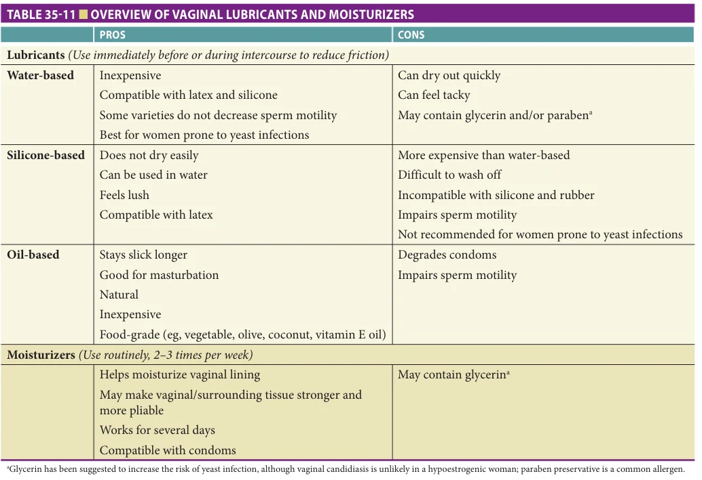

*TABLE 35-11 ■ OVERVIEW OF VAGINAL LUBRICANTS AND MOISTURIZERS*

*Owner annotations/highlights are from the marked source copy, not the book.*

**[p. 523]**

effective modality for treating dyspareunia when there is a pelvic, abdominal, and/or low-back component to the dyspareunia and when vaginismus is present. Vaginal dilation with graded dilators or other devices and behavioral, sex, or couples’ therapy are additional modalities that benefit many women with sexual pain disorders. Although, not FDA approved for treatment of VVA, energybased laser devices, such as microablative fractional CO2 and Erbium YAG lasers have shown promising short-term benefit in alleviation of symptoms due to VVA. It is important to note that in 2018 the US FDA issued warnings about injuries attributed to intravaginal lasers used as treatment for VVA.

### Orgasm Disorder

Management depends heavily on whether the disorder is lifelong or acquired and situational or generalized. Acquired situational orgasmic disorder is most common and occurs in the setting of decreased libido and/or relational strain. Treatment primarily focuses on instruction in masturbation, also known as “sexual skills training.” Because older women, particularly those 75 years and older, report less experience with masturbation (some report they have never masturbated), ability to assess orgasmic ability may be limited. Encouragement to selfstimulate either manually or with a vibrator must take into account the woman’s experience with and attitudes about masturbation. Psychotherapy to assess psychological issues and attitudes regarding orgasm and to complement physical interventions may be necessary. Education about vulvar anatomy, the role of the clitoris in orgasm, and variations in female orgasm may be therapeutic for some women. Women with arousal disorders also commonly have difficulty experiencing orgasm, so evaluation of arousal should be included in women with this complaint. Sleep dysfunction is a common comorbidity in women with libido, arousal, and orgasm disorders.

### Medical Therapy for Female Sexual Dysfunction

Currently there are three FDA-approved medical treatments for postmenopausal women experiencing sexual dysfunction: conjugated equine estrogen, ospemifene, and intravaginal prasterone, as discussed earlier. Other systemic and local exogenous estrogen products, especially local vulvovaginal estrogen cream and vaginal estrogen tablets and rings, are commonly used off-label to treat dyspareunia in menopausal women.

Hormone products have not been approved for use to treat female sexual interest/arousal disorder, but women treated with these products for VVA may experience improvement in desire and arousal that results from alleviation of dyspareunia. Two pharmaceuticals have been approved for treatment of “hypoactive sexual desire disorder,” a term that was eliminated with the 2013 revisions to the DSM-5: flibanserin, a serotonin agonist/ antagonist taken daily by mouth; and bremelanotide, a

melanocortin-receptor-4 agonist given as a self-injection as needed before a sexual encounter. Neither drug has been approved for use in postmenopausal women

Androgen therapy, including testosterone and DHEA formulations, is being used off-label in some cases for treatment of sexual interest/arousal disorder. Systematic reviews have not shown efficacy with any of the DHEA formulations, but testosterone use has shown some benefit. However, side effects can be irreversible and safety is not established in older women. Tibolone, a synthetic steroid hormone, has been investigated for the treatment of sexual dysfunction in postmenopausal women but evidence of its benefits is limited and it is not approved by the FDA. Treatment of depression can improve sexual desire and interest, but some antidepressants, particularly selective serotonin reuptake inhibitors (SSRIs), can inhibit sexual interest. There is limited clinical data to inform treatment options for SSRI-induced sexual dysfunction, but decreasing or ceasing the SSRI dose, switching antidepressants, or using bupropion in combination with SSRIs to offset this side effect may be effective for some women.

Off-label use of phosphodiesterase inhibitors has also been tried for women with genital arousal disorder (a very small subset of women with sexual dysfunction); again, safety has not been established in older women and there is no convincing evidence that benefit outweighs risk. Tricyclic antidepressants and anticonvulsants are being used by some practitioners for treatment of vulvovestibulitis (a cause of dyspareunia), but these should be used with caution because of central nervous system side effects that may be exaggerated in older women, particularly those taking other medications.

Funding for intervention research in the area of female sexual dysfunction comes primarily from pharmaceutical sources supporting clinical trials of small numbers of young, healthy subjects followed for brief periods; even studies of postmenopausal women include only small numbers of older women. Building an evidence base is a necessary step to offering safe and effective medical, psychological, and other treatments for female sexual dysfunction in later life. Several drugs for treatment of female sexual dysfunction, particularly sexual interest/arousal disorder, are currently in preclinical and clinical trials. The FDA has held a patient-focused drug development public meeting and scientific workshop on female sexual dysfunction to learn from patients about their perspectives on female sexual dysfunction and the treatments currently available. As more treatment options for female sexual dysfunction become available, an increase in sexual activity among women in later life may occur.

## CONCLUSION

Many aspects of older women’s health have been neglected by researchers and clinicians, including sexuality. Sexual and intimate relationships in later life can promote health and well-being and sustain a basic human need.

**[p. 524]**

Many older women engage in sexual relationships despite sexual problems and pain, while others discontinue sex caused by problems that could be treated. Physicians caring for older women can positively impact their patients’ sexual functioning and overall well-being by initiating and fostering an open and ongoing dialogue about sexual matters in the context of healthy aging or in relation to medical conditions and their treatments. Public health messaging and medical education addressing the continued importance of sexual health discussions past reproductive age could help normalize late life female sexuality and validate older women’s sexual health concerns. Research is needed to establish trajectories of older women’s sexuality

with aging especially among people identifying with racial, ethnic, and sexual minority groups, and to provide an evidence base for diagnosis and treatment of female sexual dysfunction in later life.

## ACKNOWLEDGMENTS

We would like to acknowledge Amber Matthews, BA, and Isabella Joslin, BA, research assistants in the Lindau Laboratory at the University of Chicago, for their contribution to the review and synthesis of the literature. Additionally, we would like to acknowledge Amber Matthews for her work on data visualization, figures, and editing.

## FURTHER READING

American College of Obstetricians and Gynecologists.

Female sexual dysfunction. ACOG Practice Bulletin No. 213. Obstet Gynecol. 2019;134(1):203–205. American College of Obstetricians and Gynecologist. Sex-

ual Health. ACOG Committee Opinion No 706 Summary. Obstet Gynecol. 2017;130(1):251–252. American Psychiatric Association. Diagnostic and Statis-

tical Manual of Mental Disorders: DSM-5. Washington, DC: American Psychiatric Association; 2013. Baron SR, Florendo J, Sandbo S, Mihai A, Lindau ST. Sex-

ual pain disorders in women. Clinician Reviews; 2011. http://www.clinicianreviews.com/the-publication/pastissues-single-view/sexual-pain-disorders-in-women/ 59f19a0743f02eceb02c4bd7196c235c.html. Accessed March 24, 2016. Basson R. The female sexual response: a different model.

J Sex Marital Ther. 2000;26(1):51–65. Basson R, Wierman ME, Van Lankveld J, Brotto L. Reports:

summary of the recommendations on sexual dysfunctions in women. J Sex Med. 2010;7(1):314–326. Davis SR, Baber R, Panay N, et al. Global consensus position

statement on the use of testosterone therapy for women. J Clin Endocrinol Metab. 2019;104(10):4660–4666. Fredriksen-Goldsen KI, Kim HJ, Emlet CA, et al. The Aging

and Health Report: Disparities and Resilience among Lesbian, Gay, Bisexual, and Transgender Older Adults. Seattle, WA: Institute for Multigenerational Health; 2011. Gaster B, Larson EB, Curtis JR. Advance directives

for dementia: meeting a unique challenge. JAMA. 2017;318(22):2175–2176. Hughes C. What you need to know about the Medicare

preventive services expansion. Family Pract Manag. 2011;18(1):22–25. Islam RM, Bell RJ, Green S, Page MJ, Davis SR. Safety and

efficacy of testosterone for women: a systematic review and meta-analysis of randomized controlled trial data. Lancet Diabetes Endocrinol. 2019;79(10):754–766.

Joy M, Weiss KJ. Consent for intimacy among persons with

neurocognitive impairment. J Am Acad Psychiatry Law. 2018;46(3):286–294. Lindau ST, Dale W, Feldmeth G, et al. Sexuality and cog-

nitive status: a U.S. nationally representative study of home-dwelling older adults. J Am Geriatr Soc. 2018; 66(10):1902–1910. Lindau ST, Gavrilova N. Sex, health, and years of sexually

active life gained due to good health: evidence from two US population based cross sectional surveys of ageing. BMJ. 2010;340:c810. Lindau ST, Laumann EO, Levinson W, Waite LJ. Synthesis

of scientific disciplines in pursuit of health: the Interactive Biopsychosocial Model. Perspect Biol Med. 2003; 46(suppl 3):S74–S86. Lindau ST, Schumm P, Laumann, EO, Levinson W,

O’Muircheartaigh C, Waite L. A national study of sexuality and health among older adults in the United States. N Engl J Med. 2007;357(8):762–774. Lusti-Narasimhan M, Beard JR. Sexual health in older

women. Bull World Health Organ. 2013;91(9):707–709. Masters W, Johnson V. Human Sexual Response. Boston,

MA: Little, Brown and Company; 1966. Moyer VA. Screening for intimate partner violence and

abuse of elderly and vulnerable adults: U.S. preventive services task force recommendation statement. Ann Intern Med. 2013;158(6):478–486. National Institutes of Health. PROMIS: dynamic tools to

measure health outcomes from the patient perspective. https://www.healthmeasures.net/explore-measurementsystems/promis. Accessed December 13, 2021. National Institute on Aging. AgePage: sexuality in later life;

Revised 2017. http://www.nia.nih.gov/sites/default/files/ sexuality_in_later_life_0.pdf. Accessed December 14, 2020. Parish SJ, Hahn SR, Goldstein SW, et al. The international

society for the study of women’s sexual health process

**[p. 525]**

of care for the identification of sexual concerns and problems in women. Mayo Clin Proc. 2019;94(5): 842–856. Portman DJ, Gass ML. Vulvovaginal Atrophy Terminology

Consensus Conference P. Genitourinary syndrome of menopause: new terminology for vulvovaginal atrophy from the International Society for the Study of Women’s Sexual Health and the North American Menopause Society. Maturitas. 2014;79(3):349–354. Russell BA, Bachmann GA, Chudnoff S, et al. Find-

ing solutions for female sexual dysfunction. The American Congress of Obstetricians and Gynecologists; 2010. https://www.womentc.com/wp-content/

uploads/2014/04/Finding-Solutions-for-FSD-ACOG. pdf. Accessed December 13, 2021. Simon JA, Davis SR, Althof SE, et al. Sexual well-being after

menopause: an International Menopause Society White Paper. Climacteric. 2018;21(5):415–427. US Department of Health and Human Services, Centers

for Medicare & Medicaid Services. Your guide to Medicare’s preventive services; Revised 2018. https://www .medicare.gov/Pubs/pdf/10110-Medicare-PreventiveServices.pdf. Accessed December 13, 2021. World Health Organization. Defining Sexual Health: Report

of Technical Consultation on Sexual Health. Geneva: World Health Organization; 2002.

**[p. 526]**
