# Hazzard's Geriatric Medicine and Gerontology, 8e - Chapter 36: Gynecologic Disorders

Thomas Clark Powell, Russell Stanley, Holly E. Richter

> **Status.** Fast build from the book; not lane-reviewed.

> Not cited in the 2020-2026 past papers.

> **Source and method.** Printed pages 527-546, from the marked 8th-edition copy (PDF page = printed page + 34). Prose follows its text layer; tables and figures are source-page crops. The book is canonical.

**[p. 527]**

## INTRODUCTION

The population of older women, generally defined as those greater than 65 years of age, is the fastest growing segment of the US population and as such deserves exceptional medical care from all health care providers. Primary and high-quality preventative care are an important challenge and opportunity for the health care workforce for older women. When gynecologic care is provided by geriatric primary care practitioners, they must be more mindful than ever about risks, symptoms, and unspoken issues. Lifetime risk of a gynecologic cancer (excluding breast cancer) is over 5%, greater than a woman’s lifetime colorectal cancer risk. Pelvic floor symptoms bother at least 40% of women age 70 to 79 and more than 50% of women greater than or equal to 80 years. Sexual problems are prevalent in half of older women who are still sexually active. This chapter seeks to address the most common and important gynecologic and urogynecologic issues encountered in a geriatrics practice, with practical tips and suggestions. Urinary incontinence (UI) is not included in this chapter but is covered in detail elsewhere (see Chapter 47). Topics are presented anatomically, in approximately the same order as a physical examination is approached, along with the major corresponding clinical issues.

#### Learning Objectives

- Establish personal and familial risk factors for gynecologic cancer in female patients.

- Review criteria that should be met to discontinue screening for cervical cancer.

- Describe the approach to the initial evaluation of vulvovaginal complaints.

- List multiple options to treat atrophic vaginitis.

- Understand the indications for specialty referral versus reassurance in a woman with pelvic organ prolapse (POP).

#### Key Clinical Points

1. Primary care providers are increasingly responsible for routine gynecologic care of older women.

2. Cervical cancer has a higher case-fatality rate in older women, and if a cervix is in situ, screening should be discontinued only in low-risk women age 65+ after three negative cytologies or two negative HPV co-tests in the previous decade.

3. Endometrial cancer associated with a false-negative screening ultrasound is frequently of the more aggressive type.

4. Although ultrasound and serum (CA-125) screening for ovarian cancer is ineffective in a low-risk population, imaging should be considered in women with suspicious symptoms involving abdominal and pelvic pain/ discomfort, bloating, gastrointestinal disturbances, and urinary complaints.

5. Pelvic pain is not commonly due to pathology of reproductive organs; the urinary tract, gastrointestinal (GI) tract, and musculoskeletal systems should be thoroughly (Continued)

## GYNECOLOGIC WELL-WOMAN VISIT

Gynecologic history and review of systems and medication list are mainstays of the primary care approach to gynecologic care. This should be targeted to assess cancer and infectious disease risks, to anticipate and interpret problems, and to promote function and quality of life. If a new patient visit is focused on other concerns, an assessment of vaginal bleeding and pelvic or vulvovaginal pain should be obtained at a minimum, since these are most indicative of urgent issues.

Key points in the gynecologic history and physical examination are listed in Table 36-1. If gynecologic surgery was performed, note the indication. For pain, prolapse, and incontinence surgeries, determine whether symptoms are resolved. Lifetime hormonal status and exposure, family cancer history, and cancer screening since age 55 are important in assessing current cancer risks.

**[p. 528]**

investigated with history and physical examination.

6. Pessaries can successfully relieve symptoms for many types of POP and stress urinary incontinence and should be offered.

7. Genitourinary syndrome of menopause and atrophic vaginitis are results of hypoestrogenism and can be readily treated using vaginal estrogen without systemic effects.

Diethylstilbestrol (DES) is an often-forgotten cancer risk factor that should be assessed. It was synthesized in 1938 and prescribed to pregnant women until 1971 in the United States and the early 1980s in some European countries. An estimated 5 to 10 million women worldwide took DES during pregnancy. An increased breast cancer

risk has been seen in both women who received DES and their female fetuses exposed in utero (DES daughters). The increased risk of vaginal clear cell adenocarcinoma and cervical neoplasia in DES daughters continues into the fifth decade, but little is known about epidemiology of these conditions in advanced age.

### Physical Examination

The physical examination serves four main purposes: (1) to understand the patient’s anatomic status, (2) to detect unrecognized problems at an early stage, (3) to detect significant current problems in the cognitively or neurologically impaired, and (4) to provide the patient an opportunity to discuss embarrassing and private issues. A surprising number of gynecologic and urologic symptoms are only voiced or discovered during the pelvic examination, despite a thorough history and review of systems. An annual pelvic examination helps the practitioner assess the condition of the vaginal tissue, the vulva and perineum for any abnormalities that may be present. Although

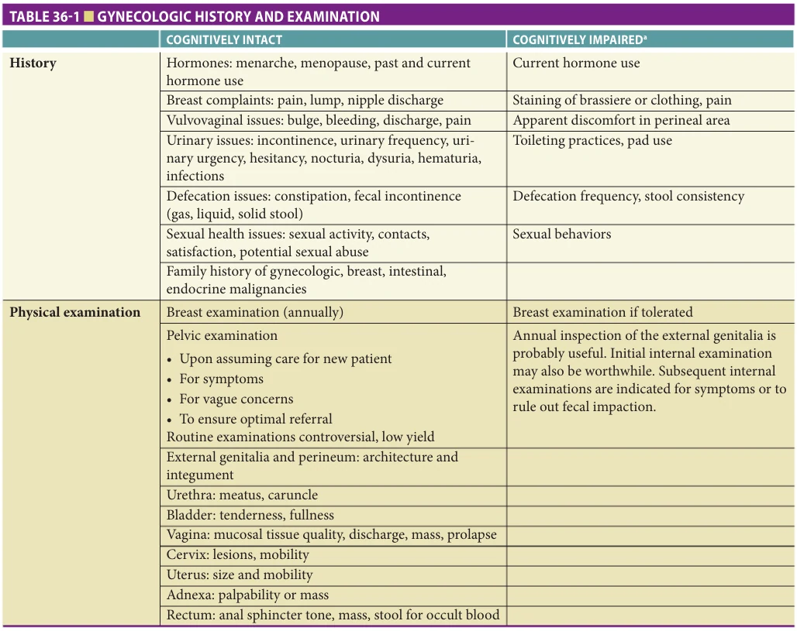

*TABLE 36-1 ■ GYNECOLOGIC HISTORY AND EXAMINATION*

*Owner annotations/highlights are from the marked source copy, not the book.*

aSuggestions for examination in the cognitively impaired older woman (moderate or severe impairment) are based on clinical experience (Level D evidence).

**[p. 529]**

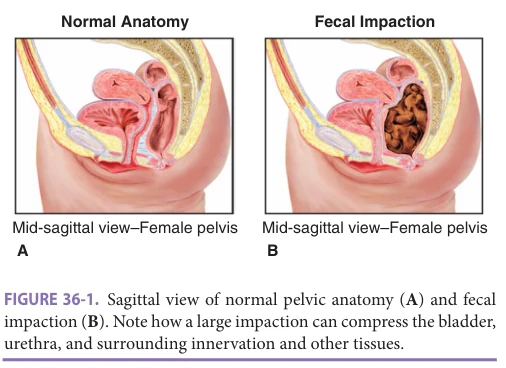

*FIGURE 36-1. Sagittal view of normal pelvic anatomy (A) and fecal impaction (B). Note how a large impaction can compress the bladder, urethra, and surrounding innervation and other tissues.*

*Owner annotations/highlights are from the marked source copy, not the book.*

there is some debate regarding the utility of this examination, assessing the health of the vulva and vagina remains important for primary care providers and gynecologists to provide complete care. Periodic examination of “asymptomatic” but concerned women is indicated. A patient may not be able to articulate the concerns she has. Appropriate speculum size, shape, and use is essential to perform a thorough but painless vaginal examination. Topical lidocaine at the posterior introitus as needed limits discomfort. This can also be applied liberally to the vulva and vagina to facilitate examination in cognitively impaired women. Fecal impaction should be ruled out in older women as a cause of a difficult vaginal examination. Fecal impaction can also compress the urethra and bladder and the surrounding innervation (Figure 36-1), cause urinary symptoms in addition to abdominal discomfort, and requires evaluation of underlying causes as well as treatment. (See Chapter 87, Constipation.)

The American College of Obstetricians and Gynecologists (ACOG) is unique in clearly recommending that “annual examination of the external genitalia should continue” beyond age 65. The utility of annual external genitalia examination may be most important in women who are cognitively impaired. Given the possible association with vaginal cancer, ACOG also recommends continuing annual internal pelvic examinations indefinitely in DES daughters, even those who have had a hysterectomy.

## BENIGN BREAST DISEASE

While numerous studies address breast cancer, less is known about the epidemiology of benign breast disease in older women, but it may represent a significant number of primary care encounters. The breast is a complex structure subject to many pathologic conditions, both intrinsic and extrinsic. These may involve skin, connective tissue, ligaments, nerves, vasculature, lymphatics, and muscles in addition to mammary ducts and alveoli.

A clinical breast examination begins with inspection to evaluate overall symmetry and presence of skin changes

such as erythema, swelling, and bulging or retraction of the nipple and areola. Palpation should include axillary, supraclavicular, and infraclavicular lymph nodes. Pertinent positive and negative findings should be documented, ideally in all patients, but especially if there is any breast complaint. Symptomatic problems can be categorized as a lump, pain, nipple discharge, or inflammation and should be evaluated and appropriately documented.

### Breast Lump

It is important for the clinician to remember that it is not possible to distinguish between malignant from benign or solid from cystic masses by clinical examination alone. However, when combining findings from clinical examination, interpreted in combination with pathology and imaging, one can better evaluate and develop a treatment plan for breast lumps. Evaluation of a lump includes noting the size, position, consistency, and character. Location can be described referencing the areola as a clock face and measuring distance from the areolar border. While a myriad of pathologic entities could result in a breast lump, age is a consistent risk factor for malignancy. All discrete lumps should be evaluated by a breast specialist. The diagnostic mammogram and ultrasound may be performed before or after consultation, per consultant preference. If a lump found by the patient is not palpated by the physician, additional consultation is in order. If both the patient and physician agree that now there is no palpable abnormality, reassessment in 2 months to reconfirm is advisable.

### Mastalgia

Mastalgia is common and rarely indicates pathology. The prevalence of breast pain is 66% and is higher for women nearing menopause than for premenopausal women. The precise etiology of mastalgia is currently unknown. Mastalgia is generally classified as either noncyclic or cyclic. Noncyclic mastalgia is often focal and does not have any relationship to the menstrual cycle. Focal mastalgia is frequently caused by a simple cyst, but breast cancer can occasionally present as localized breast pain. Thus, careful examination, imaging, and possible needle biopsy should be considered. Of note, cyclic mastalgia is usually bilateral, diffuse, and is most severe during the late luteal phase of the menstrual cycle and is most prevalent in the premenopausal population.

Symptoms may be unilateral or bilateral, intermittent, or persistent, sharp, or aching. Only half of women with significant breast pain seek medical attention. Cancer uncommonly presents with breast pain, and mastalgia is not an indication for a diagnostic mammogram. Focal persistent pain may be associated with cancer in 1% to 3% of patients, but primarily in younger women. If focal persistent pain is concerning, a diagnostic mammogram and ultrasound can adequately rule out cancer, or the patient may be referred.

Pain sources intrinsic to the breast include fibrocystic disease, duct ectasia, trauma, sclerosing adenosis, and stretching of Cooper ligaments. Conditions external to the

**[p. 530]**

breast but perceived as breast pain include costochondritis (Tietze syndrome), cervical radiculopathy, intercostal neuralgia, thrombophlebitis of the thoracoepigastric vein (Mondor disease), herpes zoster, angina, cholecystitis, and hiatal hernia. The affected breast(s) should be palpated to differentiate breast from chest wall pain. If findings are negative and mammographic screening is current, the patient can be offered reassurance and follow up. Interference with activities such as physical contact, sexual activity, exercising, and sleeping may indicate a need for more aggressive pain management, starting with a well-fitted brassiere with good support and nonsteroidal anti-inflammatory drugs or acetaminophen. Prescription pharmacologic agents for mastalgia have side effects and are supported by limited data. Danazol is the only FDA-approved medication for mastalgia. Tamoxifen has also shown efficacy. However, both of these medications come with significant side effects and are targeted for the treatment of cyclic breast pain, which should not be found in the older population.

### Nipple Discharge

Breasts are secretory organs and discharge is a common symptom. Important nipple discharge characteristics are whether it is spontaneous or expressed, unilateral or bilateral, involving single or multiple ducts, and the color. The examiner should try to elicit discharge palpating each breast quadrant from the outside toward the areola, and then gently squeezing the areola. A patient may also demonstrate expressing the discharge. A mass should be ruled out, particularly under the areola. Whereas unilateral, single-duct, spontaneous, bloody, or watery discharge is more concerning for neoplasia, bilateral, expressed, non-bloody discharge from multiple ducts is not associated with cancer. Pathologic nipple discharge is defined as a spontaneous single-duct discharge that is either bloody or serous. The rate of underlying malignancy ranges from approximately 2% for young women with no associated clinical or imaging findings to approximately 20% for older women without associated findings. Most pathologic nipple discharges are caused by benign intraductal papillomas, which are simple milk duct polyps. Consultation should be obtained for all bloody or recurrent spontaneous discharge. A thick gray or green grumous or purulent discharge may indicate duct ectasia (dilated lactiferous ducts with inspissated secretions) or subareolar abscess. Duct ectasia is also the most common cause of blood-stained discharge from multiple ducts. Duct ectasia is benign but may be excised to rule out underlying cancer. Hyperprolactinemia is rare in older women. A serum prolactin is indicated if galactorrhea is observed or suspected. Eczematous and other skin conditions may imitate nipple discharge.

### Breast Inflammation

Inflammatory conditions intrinsic to the breast include duct ectasia, fat necrosis, a ruptured inflammatory cyst, an inflammatory abscess due to obstructed ducts, idiopathic

granulomatous mastitis, foreign body, radiation, and inflammatory carcinoma. Smoking, diabetes, and rheumatoid arthritis predispose to abscesses. The most common pathogen is Staphylococcus aureus. Risk factors for methicillin-resistant S aureus include diabetes and residence in long-term care. Most abscesses respond well to drainage and antibiotics. Consultation should be obtained for recurrent or persistent abscess. Conditions extrinsic to the breast that may present with inflammation include metastatic lung cancer, Wegener granulomatosis, sarcoidosis, and other skin diseases.

## PELVIC PAIN

Perceived “pelvic” pain may arise from any component between the umbilicus and the upper thigh. Bladder pain syndrome, also known as interstitial cystitis (IC), is discussed later in this chapter. A strictly gynecologic cause of either acute or chronic pelvic pain is uncommon in older women except with advanced malignancy. Although many women fear that the pain indicates an ovarian problem, other causes are more likely. After menopause, the ovaries have decreased to about the size of an almond in its shell and are largely inactive, making painful cysts rare and torsion highly unlikely. Benign ovarian cysts and masses are usually asymptomatic until they are quite large. A complaint of “pain” is not likely to herald a gynecologic malignancy; nonspecific abdominal and pelvic fullness or discomfort are more common descriptions associated with cancer. Infection and neoplasm could be gynecologic causes of acute pain. But a non-gynecologic cause would be more likely, such as constipation, diverticulitis, herpes zoster, or pelvic insufficiency fracture.

Older women rarely experience the same type of chronic pelvic pain (≥ 6 months) that plagues women in their reproductive years, with “cross-talk” between pelvic organ structures, pelvic tension myalgia, and central sensitization. POP is a more common ailment in the geriatric population and may cause low back or pelvic pain. Pelvic floor repair with synthetic mesh may result in chronic pain. More likely etiologies of chronic pelvic pain involve the gastrointestinal and musculoskeletal systems. The abdomen, low back, and hips should be evaluated. Myofascial pain with trigger points in the lower abdomen is a particularly notorious pelvic pain impostor. This occurs in 30% of patients with chronic abdominal pain, frequently misrepresented as visceral or functional pain. A finding of myofascial trigger points with the Carnett test (increased point tenderness with partial sit-up tensing the abdominal muscles) does not completely rule out internal causes of pain, but initial treatment of this will clarify the etiology.

Following evaluation of the abdomen, back, bony pelvis, and hips, the pelvic examination should proceed slowly, assessing sensation and tenderness from external to internal. Urethra, bladder, and pelvic musculature can be sequentially palpated. If abdominal pain or tenderness

**[p. 531]**

is present, begin the “bimanual” examination of the uterus and ovaries using only the vaginal hand. After assessing cervical, uterine, and adnexal tenderness without abdominal palpation, proceed to bimanual evaluation. If the cause is unknown, repeating the examination at subsequent visits is valuable, as the findings typically vary somewhat. Vulvovaginal pain examination is addressed below.

## VULVAR AND VAGINAL ISSUES

### Examination of the Vulva

Normal vulvar architecture consists of labia minora, labia majora, clitoris, clitoral hood, and intact urethral meatus (Figure 36-2). Advanced age and estrogen deficiency

Caruncle

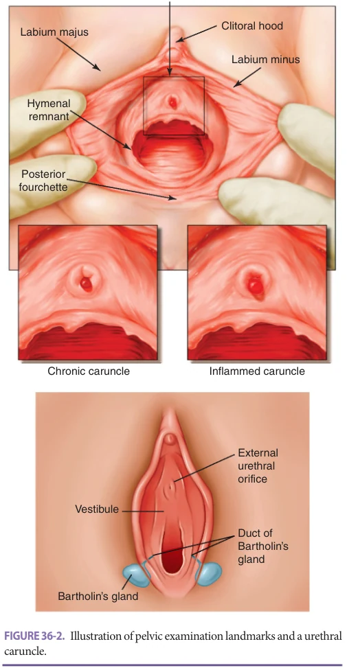

*FIGURE 36-2. Illustration of pelvic examination landmarks and a urethral caruncle.*

*Owner annotations/highlights are from the marked source copy, not the book.*

may lead to a loss of vulvar architecture, especially of the labia minora. Cherry angiomata and epithelial inclusion cysts on the labia majora are common and not concerning. Asymmetrical pigmented lesions should be noted and considered for either biopsy or follow-up examinations. Punch biopsies of the vulva are simple, rarely become infected, and can be performed in the office under local anesthesia. Bartholin glands are in the inferior (dorsal) aspect of each labium majus. An asymptomatic Bartholin cyst does not require referral if there is no detectable mass associated with the cyst, but rare Bartholin gland malignancies do occur. Thus, a symptomatic Bartholin cyst or abscess in the postmenopausal woman should be drained and biopsied and consideration given to full excision if symptoms persist.

### Benign Conditions of the Vulva

The hundreds of benign vulvar disorders generally fall into categories of infection, neoplasia, and dermatosis, some of which may reflect systemic disorders. Inflammatory disorders may be difficult to recognize, even by dermatologists, because the warm, moist, frictional environment alters their otherwise typical appearance. Establishing a nomenclature that is both clinically useful and pathologically appropriate is challenging. The current International Society for the Study of Vulvar Diseases (ISSVD) classification relies primarily on histologic morphology (Table 36-2). Realizing its limitations, they have since formulated an approach that allows highly accurate diagnoses with just clinical observations. Estrogen deficiency may increase susceptibility to trauma, irritation, and secondary infection, but is not a primary cause of vulvar problems.

### Lichen Simplex Chronicus

Lichen simplex chronicus is characterized as an eczematoid disease of hyperkeratotic, scaling plaques with varying pigmentation that is found to be associated with severe vulvar pruritis. This can be seen in conjunction with other vulvar skin disorders and is ultimately brought on by chronic scratching and subsequent irritation from dermatological and environmental processes. Lichen simplex chronicus is associated with patients who have a history of atopic disease in up to 75% of patients and typically presents later in adult life. The diagnosis of lichen simplex chronicus is based on history of pruritis, typical hyperkeratotic lesions on examination, and vulvar irritation. Biopsy may be done to identify underlying disease such as lichen sclerosus or cultures may be sent to identify yeast. First-line therapies involve treating the underlying conditions, utilization of topical corticosteroids, and even a combination of steroid and antifungal ointments if an underlying yeast infection is suspected. Hygiene measures such as controlling the amount of vulvar wetness and avoiding potential irritants (strong soaps, perfumes, or detergents) are key to cutting down on things that exacerbate and prolong the condition.

**[p. 532]**

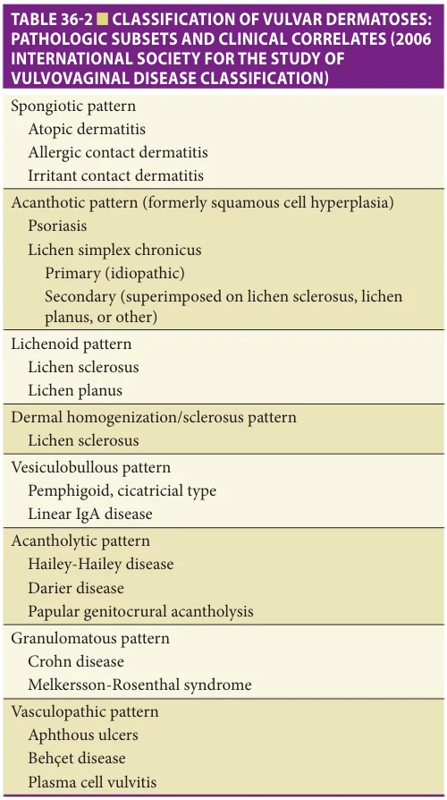

*TABLE 36-2 ■ CLASSIFICATION OF VULVAR DERMATOSES: PATHOLOGIC SUBSETS AND CLINICAL CORRELATES (2006 INTERNATIONAL SOCIETY FOR THE STUDY OF VULVOVAGINAL DISEASE CLASSIFICATION)*

*Owner annotations/highlights are from the marked source copy, not the book.*

### Lichen Sclerosus

Lichen sclerosus is a chronic inflammatory disease that can occur at any age, its highest prevalence being after menopause. It may have an autoimmune etiology and is frequently associated with other autoimmune disorders. Pruritus is characteristic, but it may be asymptomatic. Typical lesions are porcelain white papules and plaques, often with areas of ecchymosis or purpura. Perianal involvement can create the classic “figure of eight” appearance. In more advanced cases, vulvar architecture is lost, with labial fusion, clitoral hood phimosis, and fissures. Scarring may lead to introital narrowing. The malignant potential of lichen sclerosus is debated but may be as high as 4% to 5%. Biopsy confirmation of the diagnosis and visual inspection at least annually are advisable. Treatment is necessary only to control symptoms. Typical regimens involve moderate strength topical glucocorticoids for at least 4 weeks, then tapering to a lower dosing frequency. A subsequent maintenance regimen of

daily or twice-daily emollient may reduce the frequency of symptomatic flares. Estrogen has little or no effect on lichen sclerosus but can improve the resilience of unaffected areas, and estrogen cream can serve as an emollient.

### Lichen Planus

Lichen planus exhibits a wide range of morphologies. Of women with oral lichen planus, approximately 20% to 25% have vulvovaginal lesions. The erosive form may cause pain and vaginal discharge, and lead to agglutination and resorption of labial architecture, rarely with complete obliteration of the vaginal orifice. As with lichen sclerosus, biopsy can be utilized for confirmation of diagnosis and to rule out malignancy. Treatment options include topical or systemic corticosteroids or immunomodulators. Other autoimmune disorders to consider are Zoon disorder (plasma cell vulvitis), Behçet disease, Crohn disease, aphthous ulcers, and Hailey-Hailey disorder (fragile and inflamed vulvar and axillary skin). Psoriatic lesions of the genitalia do not exhibit the silver appearance seen elsewhere on the body, and are more often simply erythematous. There is usually a personal or family history of psoriasis.

### Ulcerations and Infections of the Vulva

The differential diagnosis of genital ulceration includes sexually transmitted diseases, the most common of which in the United States is herpes simplex virus (HSV). Immune suppression, including very advanced age, is a risk factor for HSV infection in the absence of sexual contact, and for herpes zoster of the S3 dermatome. A primary infection is usually accompanied by lymphadenopathy, vaginal discharge, urinary frequency and urgency, and painful ulcers on the labia and/or cervix. Zoster can inhibit detrusor function resulting in an inability to void. Lesions clear more quickly with antiviral agents. Other causes include syphilis, the autoimmune disorders listed above, blistering dermatologic disorders, and of particular concern in older women, excoriated or ulcerated neoplasia.

### Vulvar Neoplasia

Vulvar carcinoma is a rare malignancy and represents less than 5% of all cancers in the female genital tract. However, even though vulvar carcinoma remains uncommon, the incidence is increasing with an estimated 6020 new cases of vulvar carcinoma diagnosed in the United States annually and an estimated 1150 deaths from the disease. The average age of diagnosis is 68.7 with 70% of vulvar cancer diagnoses occurring in women over the age of 60.

Squamous cell carcinomas (SCC) of the vulva are the most common histologic subtype, accounting for 90% of vulvar cancers. There are two distinct pathways involving the pathogenesis of SCC of the vulva and its precursor lesion, vulvar intraepithelial neoplasia (VIN). In the past, VIN included grades 1 to 3, but the nomenclature has recently changed, and VIN now refers only to high-grade lesions of

**[p. 533]**

the vulva. Human papillomavirus (HPV)-associated VIN, also referred to as usual type VIN, occurs more frequently in younger women and is mostly associated with the carcinogenic HPV genotypes, most commonly HPV 16. HPV-independent VIN, or differentiated VIN, occurs more frequently in older women and is associated with chronic inflammation that is secondary to underlying dermatologic conditions such as lichen sclerosus or lichen planus. The HPV-associated VIN develops slowly and then will spontaneously regress. On the other hand, the HPV-independent VIN is more likely to progress rapidly to invasive squamous cell cancer. Presentation is often with vulvar burning or pruritus.

Vulvar cancer is surgically staged. The presence or absence of lymph node metastasis is the most important prognostic factor for women with this disease. Five-year survival in the absence of nodal metastasis is 91% compared to only 57% for patients with node-positive disease.

Vulvar melanoma is the second most common type of malignancy of the vulva and makes up 5% to 10% of vulvar malignancies. Many vulvar melanomas occur in the older patient population and is more common in the Caucasian population. Compared to the cutaneous version of melanoma and other mucosal melanomas, the prognosis for women with vulvar melanoma is poor with a 5-year survival rate of less than 50%. Similar to cutaneous melanomas, an approach of wide local excision with sentinel lymph node biopsy has been adopted as the treatment of choice for patients.

### Vulvar Pain, Vaginal Pain, and Dyspareunia

To evaluate vulvar or vaginal pain, the perineum from the mons pubis to the anus should be inspected for vulvar architectural changes, which may or may not be pathologic, including fissures, ulcers, erythema, and other signs of inflammation. Palpation of the vulva and around the vaginal introitus with a cotton swab will better establish the location and extent of tenderness than digital palpation. Areas to assess are the base of hymeneal remnants, posterior fourchette, and periurethral Skene glands.

Vulvodynia is chronic vulvar pain that persists for greater than 3 to 6 months in the absence of another clinically identifiable condition. In 2015, the ISSVD updated vulvar pain classifications into two categories: (1) vulvar pain caused by a specific disorder (infection, inflammation, neoplasm, trauma, hormonal deficiency, neurologic disease, or iatrogenic etiology) and (2) vulvodynia, defined as vulvar pain of at least 3 months’ duration, without an identifiable cause. While the true prevalence of vulvodynia is unknown, estimated prevalence is between 10% and 16% over a woman’s lifetime and tends to be more common in older patients. Women may have both a specific disorder and vulvodynia and may require concurrent or sequential management since vulvodynia is a diagnosis of exclusion.

Vulvodynia may be provoked, unprovoked, or both, and generalized or localized. “Localized provoked vulvodynia” denotes the condition formerly termed vulvar

vestibulitis. The suffix “itis” is technically inaccurate as inflammation is not usually present. Pain located specifically in the vestibule is referred to as vestibulodynia. This is not particularly associated with aging or atrophy. This condition is poorly understood and may be frustrating for patients and can be difficult to treat. After ruling out known causes of discomfort (infection, dermatitis, genitourinary syndrome, post herpetic neuralgia, etc.), the approach to continued vulvodynia generally must be multimodal and often interdisciplinary to address physical as well as psychosocial causes and effects. Pelvic floor physical therapy, cognitive behavioral therapy, couples’ therapy, and/or sexual therapy all may be utilized depending on the specific attributes of a woman’s pain and setting in which it occurs. Neuropathy is thought to be one of the many components and may be addressed using antidepressants that modulate serotonin and norepinephrine as well as low-dose tricyclic antidepressants; however, evidence for the most appropriate agent, dose, and duration are limited and often extrapolated from experience with other chronic pain syndromes. Similarly, other agents such as gabapentin, pregabalin, and carbamazepine may be used as adjunct treatment with physical and cognitive therapies. Topical estrogen is appropriate to ensure that tissue atrophy is not a contributing factor. Glucocorticoid or lidocaine topical preparations rarely improve symptoms for long duration but are reasonable to try both for the effect of their active ingredients and emollient properties. Persistent symptoms may require coordination of care with a pain management specialist.

Unlike the vulva, the vagina is rarely an isolated source of pain unless the patient is sexually active. Simple postmenopausal vaginal atrophy is usually asymptomatic, but dyspareunia is common. Dyspareunia evaluation is guided by historical factors such as past sexual experiences, exact symptoms during intercourse, and examination. The anterior, lateral, and posterior vaginal walls and apex should be inspected and palpated as separately as possible. Atrophic vaginitis considerations are presented below. Patients with presumed atrophic vaginitis that has not responded to estrogen frequently have an unrecognized vulvar condition. Isolated vaginal pain in the absence of intercourse should prompt consideration of surrounding organs and structures, including the pelvic floor musculature and urinary and gastrointestinal tracts.

### Vaginitis, Vaginosis, and Vaginal Discharge

Symptoms of vaginitis, vaginosis, and vaginal discharge overlap with each other and with those of vulvar conditions. A true bacterial vaginitis is uncommon in the absence of an underlying epithelial disorder. Bacterial vaginosis incidence increases with age, but only requires treatment for bothersome symptoms or planned vaginal surgery. Yeast infection incidence declines with age, but antibiotics, diabetes, immune suppression, and estrogen therapy are risk factors. Trichomonas can be carried asymptomatically and occur recurrently without partner treatment. Coexistence

**[p. 534]**

with bacterial vaginosis is common. Either estrogen initiation or replacement of vaginal prolapse with a pessary may cause benign white discharge from an increase in epithelial turnover. Desquamative inflammatory vaginitis is an uncommon cause of discharge, burning, and dyspareunia, and may be a manifestation of erosive lichen planus. Rare causes of purulent malodorous discharge include an enterovaginal fistula secondary to diverticulitis, inflammatory bowel disease, or prior surgery.

Evaluation of vaginal discharge in younger and older women is largely the same except for vaginal bleeding. Any history of a brown or red discharge necessitates endometrial evaluation. Physical examination is essential to evaluate vaginal discharge as findings often differ from the presumption based on history. With aging and estrogen deficiency, vaginal pH rises, providing a less hospitable environment for both lactobacilli and yeast. However, vaginal candidiasis still occurs and stereotypically is accompanied by symptoms of odorless, thick, white discharge and pruritis. The vulva may be involved with erythema, excoriations, and satellite lesions. On microscopy, pseudohyphae are diagnostic. In contrast, bacterial vaginosis causes a thin, malodorous, gray discharge that on microscopy demonstrates clue cells, which are squamous epithelial cells surrounded by bacteria. If microscopy is not available, commercial tests are available for bacterial vaginosis and Trichomonas vaginalis, and yeast can be cultured. A trichomoniasis diagnosis should prompt sexually transmitted infection screening and treatment of partner(s). Current recommendations for detection and treatment of sexually transmitted diseases are maintained on the website of the Centers for Disease Control and Prevention (www.cdc.gov/std/default.htm).

Vaginal atrophy due to hypoestrogenism involves several changes including mucosal thinning; loss of rugae, elasticity, and distensibility; an increase in subepithelial connective tissue and vaginal pH (> 4.5); and reduced secretions which collectively contribute to genitourinary syndrome of menopause. Changes in the vaginal microbiome predispose to urinary tract infections (UTIs). Atrophic “vaginitis” is poorly defined apart from simple atrophy, but is usually diagnosed when symptoms (dryness, itching, irritation, burning, dyspareunia, irritative voiding) or signs (pale, thin, shiny vaginal mucosa, telangiectasias, petechiae, patches of inflammation, discharge) are present (Figure 36-3). A cytologic maturation index would reveal 60% to 100% parabasal cells but is not necessary for the diagnosis.

Low-dose topical estrogen remains the preferred treatment for atrophic vaginitis in most women. It is the most proven for symptom relief, and there are several delivery options, via ring, tablet, capsule, or cream. Examples of low- and moderate-dose vaginal estrogen therapies are listed in Table 36-3. The ring can remain in the vagina for 3 months, releasing 6 to 9 μg of estradiol daily. Tablets containing 10 μg of estradiol may be inserted nightly for 2 weeks, then twice a week indefinitely. Daily use is required initially to stimulate mucosal remodeling, because the very

low maintenance dose alone is not sufficient. The dose and absorption of both the ring and the tablet are specific and well-studied. Serum estradiol rises briefly in the first 24 hours then remains within the postmenopausal range. Exact low dosage is difficult to achieve with creams, but cream has other advantages. The vehicle soothes the mucosa. Creams are often the least costly approach. The amounts needed to treat atrophic vaginitis are smaller than the lowest measurements on the applicator; using an estimated 1/4 to 1/2 g twice weekly is reasonable. Some women find fingertip application of a pea- or chocolate chip–size amount placed into the vagina easier than inserting an applicator.

The lower urinary tract is also estrogen sensitive, as estrogen receptors are found in the bladder and urethra. The symptoms of dysuria, urethral discomfort, overactive bladder (OAB, consisting of urinary urgency, frequency, urgency urinary incontinence, nocturia), hematuria, UTIs, and UI are associated with aging. Estrogen has been a mainstay of treatment in urinary tract symptoms. There is a role for transvaginal estrogen in preventing recurrent UTIs.

Vaginal estrogen use in breast cancer survivors is controversial and best prescribed in consultation with an oncologist. Oral estrogen is contraindicated during breast cancer treatment, but no harm has been detected from use of low-dose intravaginal preparations with a history of breast cancer. Patients taking aromatase inhibitors may achieve undesirably high premenopausal serum estrogen levels, warranting extra precaution or consultation before and during any estrogen treatment. Concerns seem to only apply to hormone-sensitive cancers as no increased recurrence of hormone receptor–negative cancers has been found with any type of postmenopausal hormone therapy. Nonetheless, women with a history of breast cancer should try nonhormonal treatments first.

With these low doses, progestins to prevent endometrial hyperplasia or endometrial surveillance are not required. However, estrogen absorption varies considerably among individuals, and endometrial growth could possibly be stimulated. Any brown or red discharge necessitates evaluation of the endometrium as would be performed with any postmenopausal bleeding. Ospemifene is an oral estrogen agonist/ antagonist, or selective estrogen receptor modulator (SERM), approved by the FDA for dyspareunia due to vaginal atrophy. It is effective for vulvovaginal atrophy and appears to have favorable effects on bone, neutral effects on the endometrium and the cardiovascular system, and no clinically significant estrogenic effect on the breast. Risks and contraindications are like those for estrogen, including venous thromboembolism. Vasomotor symptoms are bothersome in 10% of patients.

Other non-estrogen therapies are less reliable in reducing dyspareunia and irritative voiding symptoms, but often relieve mild symptoms. Vaginal moisturizers are used on a regular basis, daily to weekly, to maintain epithelial moisture and vaginal pH. In addition, vaginal lubricants may be used for intercourse. Frequent sexual activity helps maintain supple tissues. Alternative hormonal agents

**[p. 535]**

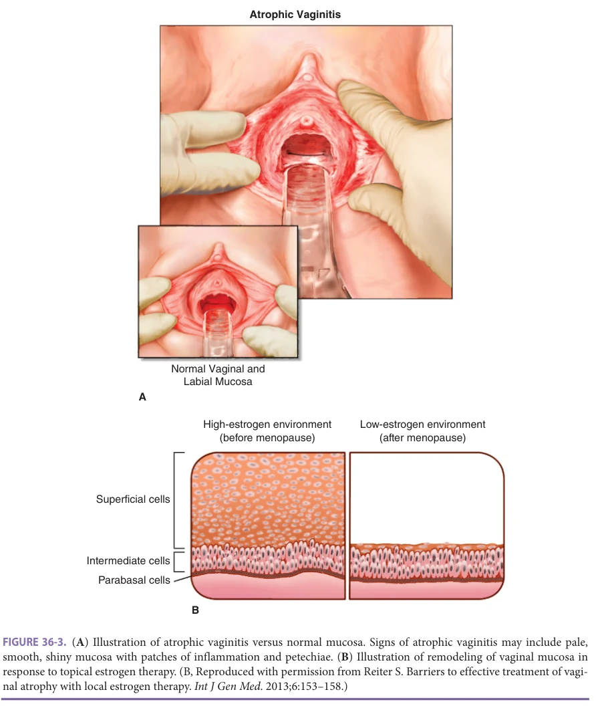

*FIGURE 36-3. (A) Illustration of atrophic vaginitis versus normal mucosa. Signs of atrophic vaginitis may include pale, smooth, shiny mucosa with patches of inflammation and petechiae. (B) Illustration of remodeling of vaginal mucosa in response to topical estrogen therapy. (B, Reproduced with permission from Reiter S. Barriers to effective treatment of vaginal atrophy with local estrogen therapy. Int J Gen Med. 2013;6:153–158.)*

*Owner annotations/highlights are from the marked source copy, not the book.*

(dehydroepiandrosterone, other SERMs, testosterone) are promising but not yet sufficiently studied.

### Vaginal Cancer

Vaginal cancer accounts for 1% or less of female genital tract cancers. Metastatic disease of the vagina is more common than primary vaginal cancer, notably from cancers of the endometrium, cervix, vulva, ovary, breast, rectum, and kidney. The most common primary vaginal cancer is SCC, but adenocarcinoma, sarcoma, melanoma, and others occur. Vaginal SCC is often preceded by vaginal intraepithelial neoplasia, which is associated with concomitant cervical or vulvar neoplasia in about 50% of cases. It is usually

asymptomatic and not easily visible, but induration may be palpable. Two-thirds of cases occur in the upper vagina. Risk factors for primary vaginal cancer are the same as those for cervical cancer, including prior gynecologic cancer and radiation therapy. Bleeding, discharge, pain, and urinary or rectal complaints are presenting symptoms. Survival drops precipitously beyond stage II.

## CERVIX UTERI

### Examination of the Cervix

The location of the squamocolumnar junction, the border between squamous (ectocervical) and mucous (endocervical)

**[p. 536]**

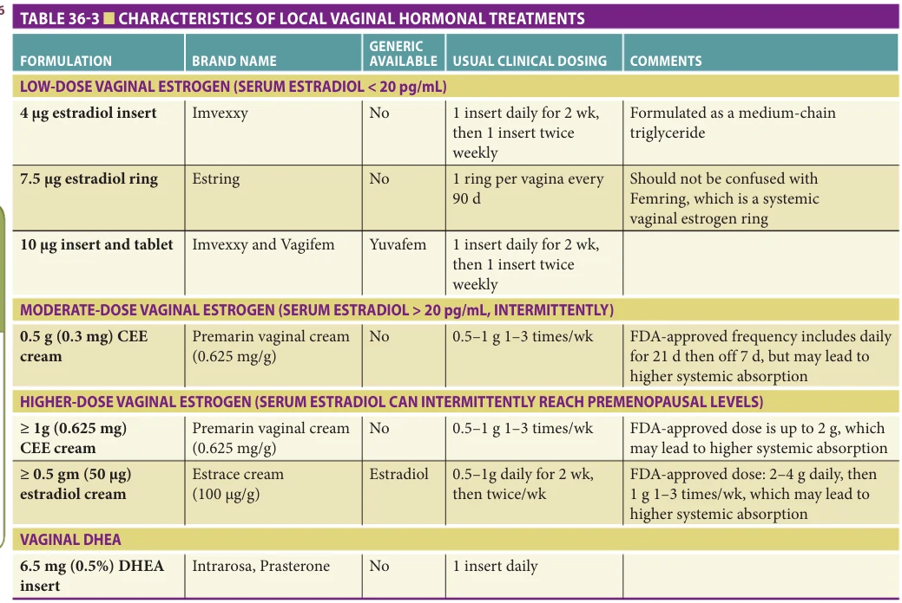

*TABLE 36-3 ■ CHARACTERISTICS OF LOCAL VAGINAL HORMONAL TREATMENTS*

*Owner annotations/highlights are from the marked source copy, not the book.*

CEE, conjugated equine estrogen; FDA, Food and Drug Administration. Modified with permission from Crean-Tate KK, Faubion SS, Pederson HJ, et al. Management of genitourinary syndrome of menopause in female cancer patients: a focus on vaginal hormonal therapy. Am J Obstet Gynecol. 2020;222(2):103–113.

epithelia, changes location over a lifespan. It is usually within the endocervical canal in older women and not visible. Its importance lies in the fact that it is the most common site of cervical neoplasia. Cystic structures near this border are almost invariably Nabothian cysts. These are not true cysts, but collections of mucus trapped during metaplastic transition, when squamous cells cover mucus-secreting crypts. They do not require biopsy. Any lesion whose benignity is uncertain should be biopsied or referred. Cytology is a screening test and alone is not an appropriate evaluation of a visible lesion.

### Cervical Cancer

Worldwide, cervical cancer is the most common gynecologic cancer and the fourth most common cancer overall in women. Most incident cases and 87% of cervical cancer-related deaths occur in less-developed countries due to the lack of access to appropriate screening and treatment of preinvasive disease. In the United States, there are an estimated 12,820 cervical cancer diagnoses and 4210 deaths annually. The risk of cervical cancer increases with age, and the case-fatality rate is higher in older women. While women over age 65 years represent approximately 14% of the US female population, more than 20% of new cervical cancer cases and a disproportionate amount of

cervical cancer deaths are in this age group. Most of these are in unscreened or inadequately screened women. Threefourths of cervical cancers are SCC; the remaining adeno-, adenosquamous, and clear cell carcinomas have higher mortality rates. In older women only half to two-thirds of cervical cancers are associated with HPV. Postcoital bleeding may occur at an early stage, but other symptoms (pain and bowel or bladder symptoms) are absent. Radical hysterectomy is the primary treatment for early-stage cervical cancer. Radiation therapy is used for locally advanced disease, as adjunctive treatment, when surgery is not an option, and along with chemotherapy for palliation.

### Cervical Cancer Screening (Table 36-4)

The excess deaths from this mostly preventable malignancy are only avoided through screening, including “adequate” screening of older women. Screening older women provides equivalent benefit to screening younger women, that is, an equivalent reduction in severe cervical intraepithelial neoplasia (CIN) and, by inference, of cancer. However, due to low cancer incidence and long lead time, routine screening after age 65 provides little benefit if women have been adequately screened prior to this. The key to safe discontinuation is knowing the patient’s screening and risk factor history. The three main issues in

**[p. 537]**

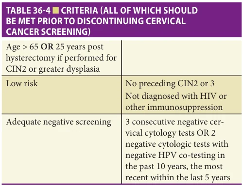

*TABLE 36-4 ■ CRITERIA (ALL OF WHICH SHOULD BE MET PRIOR TO DISCONTINUING CERVICAL CANCER SCREENING)*

*Owner annotations/highlights are from the marked source copy, not the book.*

older women are (1) when to discontinue screening, (2) in whom to continue screening, and until what point, and (3) the best screening modalities.

Cervical cancer screening has evolved from microscopy of exfoliated cells in the vagina to detect current cancer, introduced by Georgios Papanikolaou in 1928, to prevention of cancer through HPV genotyping, with or without cervical cytology. Testing options, recommendations, and guidelines have changed several times in recent years, and will continue to evolve. Cervical cytology with HPV co-testing should be obtained every 5 years in women over age 30. Updated guidelines and algorithms are available from the American Society for Colposcopy and Cervical Pathology (www.asccp.org).

The ACOG, American Society for Colposcopy and Cervical Pathology (ASCCP), the United States Preventive Services Task Force (USPSTF), the American Cancer Society (ACS), and other organizations recommend discontinuing cervical screening after appropriate criteria are met. The criteria include that the patient should be age 65 or older, low risk, and have had adequate negative screening. Adequate is defined as three consecutive negative cervical cytology tests or two negative cytologic tests with negative HPV co-testing in the past 10 years, the most recent of which was within the past 5 years. Ideally the final test would include HPV genotyping. Women older than 65 should continue with screening until these criteria are met. Screening should continue for at least 25 years after documented regression or treatment of a precancerous lesion, even if this extends after age 65. Having a new sexual partner after age 65 does not necessitate additional screening.

Screening of women who have undergone a total hysterectomy (corpus et cervix uteri) is not recommended unless the hysterectomy was performed for dysplasia, for cancer or the woman is a DES daughter. The positive predictive value of vaginal cuff cytology after hysterectomy for benign disease is approximately zero. Many women do not know whether their hysterectomy was total or

supracervical (corpus alone). This can be determined at the initial pelvic examination. If a cervix is unexpectedly discovered, adequate screening should be performed before discontinuation.

Risk factors for cervical cancer include an abnormal Pap smear within the past decade, a history of moderate or severe CIN (CIN 2 or 3) within the past 25 years; a history of cervical, vaginal, or vulvar cancer; immune suppression; and DES exposure in utero. These groups are excluded from major society guidelines for lengthening screening intervals and discontinuation, but without sufficient alternative recommendations. As mentioned earlier, screening should continue for at least 25 years following successful treatment for CIN 2+. Women infected with human immunodeficiency virus (HIV) should continue annual screening indefinitely. Other causes of immune suppression including solid organ transplant, autoimmune disorders, treatment with glucocorticoids, and chronic antineoplastic therapies are not addressed. The relevance of DES exposure in utero to cervical or vaginal cancer risk in advanced age is uncertain. Although ACOG recommends continuing annual internal pelvic examinations indefinitely in DES daughters, it does not specifically address cervical or vaginal cytology.

## CORPUS UTERI AND VAGINAL BLEEDING

### Benign Conditions of the Uterus

Both the uterus and leiomyomata (fibroids) typically decrease in size after menopause. Therefore, a palpably large uterus (navel orange or grapefruit sized) is unusual. Previous medical records would probably clarify whether this is a new finding. If unclear, sonographic evaluation would inform the need for further evaluation or referral to a gynecologic specialist. Uterine tenderness is also unusual. Bacterial endometritis is uncommon, but can occur even in the absence of uterine manipulation. It is usually associated with a purulent, odorous discharge and/or bleeding.

### Uterine Cancer

Endometrial cancer is the most common gynecologic malignancy in developed countries and the second most common in developing countries. The mortality rate has been declining slowly, but more than 10,000 women still die annually in the United States of this disease. An estimated 61,380 new cases of uterine cancer are diagnosed annually in the United States, and 10,920 women die per year because of this disease. Patients 65 and older account for 44.3% of new endometrial cancer diagnoses and 66.6% of endometrial cancer deaths. Incidence rates in Europe and North America have risen since the 1980s, possibly related to increases in obesity and life expectancy with a concomitant decrease in birth rates. Ninety percent of uterine cancers originate in the endometrium. Three-fourths are type I endometrioid adenocarcinoma. Type II is more aggressive and characterized by clear cell and papillary serous tumor

**[p. 538]**

histology. Papillary serous carcinoma accounts for only 10% of uterine cancers but 40% of uterine cancer deaths. Type I endometrial cancer is associated with traditional risk factors related to estrogen abundance and inadequate progestin. It tends to present at an earlier stage and younger age than does type II. Risk factors include early menarche and late menopause, obesity, chronic anovulation, type 2 diabetes, hypertension, and nulliparity. Pregnancy, lactation, hormonal contraceptives (including a progesterone-releasing intrauterine device), and postmenopausal hormone therapy with continuous (not intermittent) progestins are protective historical factors. Pathogenesis and risk factors for type II endometrial cancer are less well understood. Although the effect size of risk and protective factors is stronger in most studies for type I cancer than for type II, the factors are surprisingly similar. Risk factors include body mass index, early menarche, and diabetes; protective factors are higher parity, oral contraceptive use, and cigarette smoking.

Endometrial cancer is the most common sentinel cancer in Lynch syndrome, an autosomal dominant condition caused by germline mutations in mismatch repair genes. Lynch syndrome accounts for 2% to 5% of endometrial cancers and is more associated with younger age and type I histomorphology. The question of universal versus selective genetic screening in endometrial cancer patients remains to be resolved. The 2014 Clinical Practice Statement from the Society for Gynecologic Oncology (SGO) recommends that “all women who are diagnosed with endometrial cancer should undergo systematic clinical screening for Lynch syndrome (review of personal and family history) and/or molecular screening. Molecular screening of endometrial cancers for Lynch syndrome is the preferred strategy when resources are available.”

A hysterectomy with bilateral salpingo-oophorectomy, lymph node sampling, and tumor debulking is required for endometrial cancer staging and is the mainstay of treatment. Radiation and/or chemotherapy may be used adjunctively or in women who are too frail to undergo surgery. Overall, 5-year survival is estimated at 82% since bleeding usually leads to early diagnosis and treatment. Older age is associated with a worse prognosis because more aggressive tumors are relatively more common, as well as due to comorbidity, late diagnosis, and lack of aggressive treatment.

Malignant lesions of the myometrium include leiomyosarcoma and other sarcomatoid tumors. These are less likely to cause bleeding in early stages, and may only be detected by the presence of an enlarging uterus or pelvic mass, or be discovered after hysterectomy. Incidence of leiomyosarcoma peaks in the sixth and seventh decades. They are aggressive tumors with high metastatic potential. Treatment involves surgery, chemotherapy, and radiation. Extension of tumor beyond the confines of the uterus is associated with a poor prognosis.

### Approach to Vaginal Bleeding

Abnormal vaginal bleeding occurs in up to 20% of postmenopausal women, 10% to 20% of the time due to

endometrial hyperplasia or neoplasia. Studies invariably analyze “postmenopausal” as one group, so these statistics misrepresent the risks in older women. Older women bleed less often, but older age increases the risk of malignancy and of a higher-grade cancer. Although most women with postmenopausal bleeding will be referred to a gynecologist, a focused history and examination will ensure the best referral. A rectal polyp, urethral mucosal prolapse, vulvovaginal pathology, or neglected pessary may be discovered.

All pelvic bleeding sources should be investigated, including hematuria, hematochezia, vulvovaginal pathology, and trauma (Table 36-5). The external genitalia, vagina, and cervix are inspected for ulcerations, atrophy, abrasions, polyps, etc. If the cervix appears normal, screening with

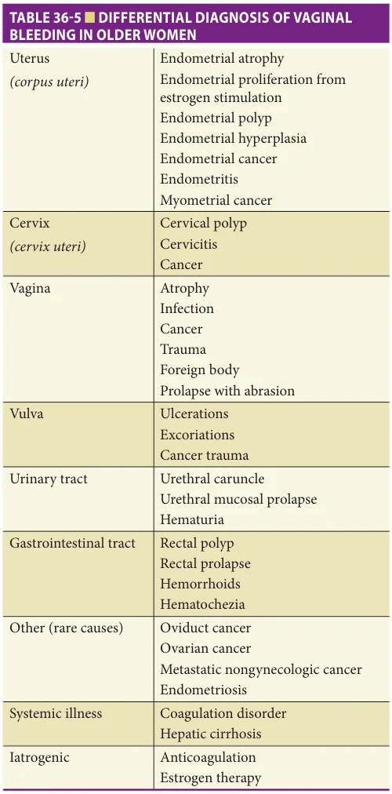

*TABLE 36-5 ■ DIFFERENTIAL DIAGNOSIS OF VAGINAL BLEEDING IN OLDER WOMEN*

*Owner annotations/highlights are from the marked source copy, not the book.*

**[p. 539]**

both cytology and HPV genotyping (co-testing) is advisable unless recently performed. An abnormal appearing cervix warrants biopsy. Bimanual and rectal examinations will help rule out pelvic masses, tissue induration, and rectal pathology.

Regardless of other findings, the endometrium must be evaluated with a biopsy or transvaginal ultrasound in the setting of postmenopausal bleeding. Office biopsy can have greater than 99% sensitivity, but not all devices achieve this. ACOG states that endometrial sampling may be deferred if the endometrial thickness is 4 mm or less. However, biopsy for tissue diagnosis is preferable to sonography to evaluate the endometrium in older women or in those with recurrent or persistent bleeding regardless of imaging.

No guidelines have been established for the evaluation of vaginal bleeding in frail, impaired older women. Even if aggressive treatments are not an option, palliative management improves when the disease process is understood. Evaluation of vaginal bleeding including biopsy can always be recommended, guided by clinical judgement and the patient’s wishes.

## OVARY AND ADNEXAL MASSES

### Adnexal Mass

“Adnexa” is a plural word meaning “parts.” Adnexa uteri refers to the fallopian tube and ovary. Adnexal masses can be, accordingly, of either the tube or ovary, but many other gynecologic and non-gynecologic pathologies masquerade as adnexal masses. Definitive diagnosis of an ovarian mass generally requires excisional surgery. However, imaging can obviate surgery in most patients. Although the chance of malignancy is increased after menopause, most adnexal masses are benign.

Menopause occurs when the ovary ceases its cyclic reproductive function and shrinks to an average volume of less than 4 cm3. It continues to be an important source of androgen production, but not of estrogen. Functional cysts, normally associated with development of mature ova, still occur often after menopause. These generally resolve without intervention. Benign lesions are overwhelmingly epithelial tumors, usually cystadenomas. Tumors may also arise from stromal or germ cells, but most of these occur at younger ages. An endometrioma may persist indefinitely and is unlikely to grow or become newly symptomatic in older women.

Transvaginal ultrasound is the preferred imaging study for adnexal masses. Magnetic resonance imaging (MRI) is best suited to clarify the malignant potential if ultrasound is unreliable or cannot be performed transvaginally. When extraovarian disease is suspected or needs to be ruled out, computed tomography (CT) scan is the most reliable technique. Ultrasonography may be useful even when the adnexal mass was discovered on another imaging study, sometimes adding information that better characterizes the ovaries and uterus. For cysts that will be followed,

it is best to measure size over time with the same imaging modality, and ultrasound is less expensive.

Simple cysts less than 10-cm diameter will resolve spontaneously in half of older patients, indicating they were functional cysts. Most of the persistent ones eventually excised are benign epithelial tumors. Complex ovarian masses, with loculations or solid components, comprise 3% of postmenopausal adnexal masses. These are more concerning for neoplasia, but up to half may also resolve spontaneously. If an asymptomatic simple cyst is smaller than 10-cm diameter on transvaginal ultrasound and the serum CA-125 is not elevated, the usual plan is to repeat these studies in 3 to 6 months. Indications for urgent gynecologic consultation include size greater than or equal to 10 cm, complex components, or an elevated CA-125.

### Ovarian Cancer

Ovarian cancer is the deadliest of the gynecologic cancers and is the fifth leading cause of cancer death in women in the United States. Approximately 1 in 70 women will be diagnosed with ovarian cancer in their lifetime. In 2020, an estimated 21,750 women were diagnosed with ovarian cancer in the United States, and 13,940 died from this disease. The median age at diagnosis is 63. The age-specific incidence peaks at age 80 to 84, and subsequently plateaus. Survival rates are poor primarily because of diagnosis at advanced stage. Initial symptoms are nonspecific, such as abdominal or pelvic pain, bloating, urinary complaints, and constipation. It is now appreciated that early-stage cancers are often symptomatic. In retrospect, most ovarian cancer patients have had symptoms for several months prior to diagnosis. While a transvaginal ultrasound and CA-125 blood test perform poorly as screening tests in low-risk women, they are useful to rule out ovarian cancer when abdominal, pelvic, gastrointestinal, or urinary symptoms are present. Early evaluation of symptoms has not been proven to improve survival, but some evidence suggests it identifies more women with completely resectable disease. Genetic testing is evolving rapidly. It is now thought that approximately 25% of ovarian cancers have a germline mutation.

Most ovarian malignancies in older women are epithelial. The paradigm of epithelial ovarian cancer pathogenesis has undergone radical changes in the past decade. Rather than arising from the ovarian cortex, most cancers are likely derived from the fallopian tube or the endometrium. Epithelial ovarian cancers are now divided into two broad categories. The relatively indolent type I tumors are comprised of low-grade serous, low-grade endometrioid, clear cell, and mucinous carcinomas, and Brenner tumors. Type II tumors are high-grade serous, high-grade endometrioid, and other aggressive carcinomas. While these new distinctions have few direct implications for geriatrics practice, they have expanded preventive surgical strategies. ACOG recommends performing incidental bilateral salpingectomy whenever possible. Older women already routinely undergo bilateral salpingo-oophorectomy incidental to abdominal

**[p. 540]**

hysterectomy, but not routinely during vaginal surgery. This should be considered in preoperative planning, but there are inadequate data to fully inform this decision.

Surgery is indicated for most women with ovarian cancer, even in advanced age, both for staging and improved survival with optimal tumor debulking. Treatment outcomes are better on average when the initial surgery is performed by a gynecologic oncologist rather than a general gynecologist, due to more complete staging and debulking. Having one surgery for diagnosis and partial treatment, then a subsequent one to finish the staging and treatment is associated with worse outcomes. This may have implications for referrals from a geriatrics practice.

## HORMONES

### Menopause

Menopause is defined as 12 months of amenorrhea secondary to cessation of ovulation. This can also be attained by surgical oophorectomy, chemotherapy, or radiation. The transition to menopause referred to as the perimenopause begins approximately 4 years prior to the last menstrual period and starts with irregular cycles during which time estrogen levels can be normal or elevated. Progesterone and estradiol levels decrease with an increase in folliclestimulating hormone (FSH) levels. The postmenopausal estradiol levels are usually less than 20 pg/mL, while FSH is most often more than 70 mU/mL. Symptoms attributed to menopause include vasomotor (hot flushes and night sweats), vaginal atrophy (pruritis, dryness, and dyspareunia), UI, sleeping difficulty, depression, anxiety, mood changes, cognitive decline, and somatic complaints. Migraine prevalence may also increase in perimenopausal women due to estrogen fluctuations. Therefore, consideration of hormone therapy and the alternatives is important for symptom management and quality of life.

### Hormone Therapy

Estrogen and estrogen plus progestin hormone therapy (HT) following menopause has a complex constellation of statistically small benefits and risks, and symptoms can often be managed with nonhormonal alternatives. Estrogen therapy is by far the most effective treatment for vasomotor symptoms of menopause. However, the use of systemic estrogen has been complicated by the results of the Women’s Health Initiative (WHI), which found that the use of systemic estrogen alone increased the risk of stroke (relative risk 1.39), while the addition of progestin increased the risk of coronary events (relative risk 1.28), breast cancer (relative risk 1.26), and pulmonary embolism (relative risk 2.13). The absolute risk of these events is much lower in younger premenopausal women.

While initiation of HT after age 65 is contraindicated, continuation of HT taken since menopause should be decided on an individualized basis. The ACOG and the North American Menopause Society (NAMS) recommend

that the lowest effective dose of systemic estrogen (plus progestin if uterus is present) should be used and estrogen replacement not be used for disease prevention. The marginal risk of continuation is very small. However, given the association with stroke and cardiovascular events, most women over age 65 will choose to discontinue HT. The issue then becomes how to discontinue without suffering excessive menopausal symptoms.

Four randomized trials studying fewer than 300 women have evaluated abrupt discontinuation versus tapering over 2 weeks, 4 weeks, 4 months, and 6 months. Overall successful discontinuation rates were similar, but symptoms were generally greater in the abrupt discontinuation groups. Roughly half of women tolerate sudden cessation but do better with ongoing clinical support for up to 3 years. Others experience unacceptable vasomotor symptoms, insomnia, irritability, short-term memory loss, or fatigue and resume HT. Anecdotally, tapering over an even longer time would yield greater success with fewer symptoms. Unless urgent, this can be done as slowly as necessary, reducing the dose every few months or annually. When the lowest commercially available dose has been reached, the taper can be continued dropping one weekly dose at a time once a month or as tolerated. Vasomotor symptoms can also be ameliorated with nonhormonal medications. Paroxetine, clonidine, and gabapentin have all shown efficacy in symptom management; however, paroxetine is the only nonhormonal agent with FDA approval for this indication. These may be trialed as initial therapy or as management after discontinuation of hormonal therapy. Each of these drugs have significant side effects in the older population.

Occasionally an older woman not taking estrogen experiences new-onset vasomotor symptoms. Pertinent history includes onset, frequency, duration, timing during the day or night, facial erythema, perspiration, flushed feelings, associated activities, and her symptoms at the time of menopause. Medications or supplements are often implicated in new symptoms; however, other etiologies should be evaluated including thyroid function. While hormone-related vasomotor symptoms do not suddenly arise years after a decline in estrogen, it is unclear in some cases whether hormones could be involved. A trial of estrogen therapy for 1 to 3 months can be informative or educational. Transdermal administration would minimize the risk of a vascular event as this avoids first-pass metabolism in the liver.

## UROGYNECOLOGIC AND PELVIC FLOOR SUPPORT ISSUES

POP, UI, and UTI are very common gynecologic problems experienced by older women. Incontinence and infection are covered in more detail elsewhere. This section will focus on several specific conditions common in urogynecology and female urology including POP as well as bladder and urethral disorders such as IC, urethral caruncle, urethral

**[p. 541]**

cancer, urethral stricture, and urethral diverticulum. Urinary incontinence is discussed in Chapter 47.

### Urethral Disorders

Several disorders of the female urethra occur with greater incidence and prevalence in older women compared to their younger counterparts. A urethral caruncle generally appears as a polypoid red mass protruding from the urethra at the 6 o’clock position. This is often asymptomatic and identified incidentally on physical examination (see Figure 36-2). Some patients may notice it and are often concerned for possible malignancy. Urethral caruncles are typically soft to palpation, although they may bleed due to irritation. They represent an incomplete prolapse of the urethral mucosa with possible loss of support of the periurethral muscular-connective tissue. Topical estrogen is generally effective and may lead to reduction in size or complete involution of the caruncle.

Urethral prolapse, in contrast to caruncles, is complete circumferential mucosal prolapse. It is managed similarly to a caruncle and, in most cases, resolves with topical estrogen. If there is persistent pain, bleeding, or other concerns, referral is warranted for further evaluation and consideration of surgical management.

In contrast, urethral cancers in women may present with bleeding and are typically hard or firm to palpation. The tumor can extend proximally toward the bladder neck, or into the vagina. Treatment is typically surgical, although radiation may also be used in select cases or for palliation.

Urethral strictures in women are uncommon. Surgical excision and reconstruction are the most effective form of therapy. Urethral dilation should be avoided in women and is not particularly effective for long-term therapy. There are no data to support routine urethral dilation for treatment of UTI or voiding dysfunction in most women.

Urethral diverticulum results from an outpouching of tissue in the urethra associated with a defect in the midline fusion of the urethral plate. Women often experience the “3-Ds” of dysuria, dyspareunia, and dribbling incontinence; they may also be associated with recurrent UTIs. Differential diagnosis for urethral diverticulum includes vaginal wall cysts from an embryologic remnant (Gartner’s duct cyst) or local gland (Skene’s duct cyst) and ectopic ureterocele. Surgical excision with urethral closure or reconstruction is typically indicated. Urethral malignancy has been found in approximately 6% to 9% of patients with a urethral diverticulum; the most common type of malignancy is adenocarcinoma. Magnetic resonance imaging is the imaging modality of choice prior to surgical management.

### Interstitial Cystitis and Painful Bladder Syndrome

Interstitial cystitis (IC), also called painful bladder syndrome (PBS), is a chronic condition of the bladder typically associated with a constellation of symptoms including urinary urgency, frequency, and pelvic pain. It is generally diagnosed in women in their 30s or 40s but must

be chronically managed throughout a woman’s lifetime as there is no cure. Patients generally experience worse pain with bladder filling, which is relieved at least temporarily by voiding. Pain is a hallmark symptom and helps to differentiate the condition from overactive bladder (OAB) and other forms of lower urinary tract dysfunction. The exact etiology of IC is unknown although theories include autoimmune components, direct chemical irritants in the urine, effects from inflammatory mediators, and defects in the bladder epithelial barrier layer. Other conditions that should be ruled out in cases of possible IC include bladder cancer, bladder carcinoma in situ, UTI, and bladder stones. Continued symptoms in the context of persistent negative urine cultures should prompt the clinician to consider IC.

Diagnosis can be made based on clinical symptoms and ruling out other etiologies. Cystoscopy with hydrodistension of the bladder under anesthesia is a useful diagnostic tool and may also be therapeutic for many patients. Reduced bladder capacity and mucosal changes including petechial hemorrhage are commonly seen in cases of IC. Ulcerations of the bladder mucosa occur less commonly but may represent more severe disease. Cystoscopy also offers the clinician the opportunity to visually examine the bladder to rule out other serious conditions such as bladder cancer, particularly in older women where the rates of bladder cancer increase compared to young women. Bladder wash cytology and biopsies may also be used to help aid in the diagnosis of bladder cancer. Patients may be treated for IC or PBS without cystoscopic confirmation of the condition, but in older patients it is wise to eliminate other potential pathologies. Referral to Urology is indicated if a patient has persistent or progressive symptoms not adequately managed with conservative therapy.

### Pelvic Organ Prolapse

POP can be quite bothersome for older women. Incidence and prevalence rates of POP increase with advancing age. Risk factors include prior hysterectomy, obesity, smoking, parity, poor tissue quality, and connective tissue disease. Several different types of prolapse occur depending on the involved anatomy. Patients may experience a bulging sensation from the vagina or may complain of pressure or discomfort in the pelvis or lower back. Bleeding and discharge are common symptoms, particularly in women with large prolapse extending out of the vaginal canal, and may be associated with erosion, ulceration, or keratinization of the exposed vaginal mucosa.

### Evaluation of Pelvic Organ Prolapse

Clinical evaluation includes careful history and physical examination (Table 36-6). Symptoms should be identified to help gauge the degree of bother experienced by the patient, which in turn can help determine the types of treatment that can be considered. In patients with little symptomatic bother and minimal other signs or symptoms,

**[p. 542]**

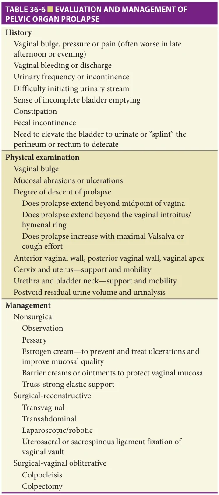

*TABLE 36-6 ■ EVALUATION AND MANAGEMENT OF PELVIC ORGAN PROLAPSE*

*Owner annotations/highlights are from the marked source copy, not the book.*

observation may be adequate. Careful pelvic examination is critical in making the correct diagnosis of POP. Prolapse of the anterior vaginal wall is a cystocele, and the posterior vaginal wall is typically a rectocele. Loss of support of the vaginal apex may include small bowel which is known as an enterocele. Uterine prolapse may also occur due to loss of support of the cardinal or uterosacral ligaments. Complete vaginal eversion may occur in women with a prior hysterectomy, or “procidentia” if the uterus is in situ.

Physical examination is important for complete assessment. On simple inspection, it can be difficult to differentiate the portion of the vagina involved in the prolapse. A single-blade speculum is useful for this purpose. The speculum is initially inserted to depress the posterior vaginal wall. The speculum is then reinserted in the reverse position to elevate the anterior vaginal wall allowing inspection of the posterior compartment for evidence of rectocele. Asking the patient to cough and Valsalva can help to demonstrate prolapse that may increase with abdominal straining. It can be useful to also examine the patient in the standing position if possible, as some prolapse may only be evident with standing.

A cystocele occurs because of a weakness of the anterior vaginal wall muscular-connective tissue. The bladder protrudes into the vaginal space, and in some cases may extend beyond the hymenal ring. Cystoceles may or may not be associated with stress UI. Some women with large cystoceles may have trouble voiding due to obstructive angulation of the urethra or poor bladder contractility (Figure 36-4). In some cases, women with large cystoceles may report having to put their fingers in the vagina to elevate the tissue to straighten out the urethra to urinate or to completely empty the bladder. Despite this, high-grade obstruction in women is rare, and development of upper tract deterioration with hydronephrosis and renal insufficiency is uncommon. Hydroureter and hydronephrosis can occur if there is substantial ureteral kinking at its insertion into the bladder in cases of complete vaginal vault prolapse. This is more likely if the uterus is present. Serum blood urea nitrogen and creatinine level and renal ultrasound are useful in determining the extent of renal impairment.

A rectocele is a protrusion of the rectum through the posterior wall of the vagina and is caused by weakness in the perirectal muscular-connective tissue (Figure 36-5). Some patients may describe difficulty with defecation, including an increased sense of pressure or need to strain. Some women describe needing to “splint” or press on the posterior vaginal wall or perineum to completely evacuate their stool.

An enterocele is a herniation of small bowel and peritoneum through the apical vagina or between the uterosacral ligaments and rectovaginal space (Figure 36-6). It is the only true hernia among the various forms of POP. It is more common in women who have undergone prior hysterectomy. However, it can be present in any posterior vaginal wall prolapse, and rarely in anterior compartment prolapse.

Rectal prolapse involves protrusion of the rectum through the anal sphincter with tissue extending beyond the anal verge. It may or may not be associated with hemorrhoids. Symptoms of rectal prolapse can include pain, bleeding, or defecatory dysfunction. Many patients experience both fecal incontinence and constipation. Careful examination is needed to determine if the rectal prolapse can be reduced. In cases where reduction is not possible,

**[p. 543]**

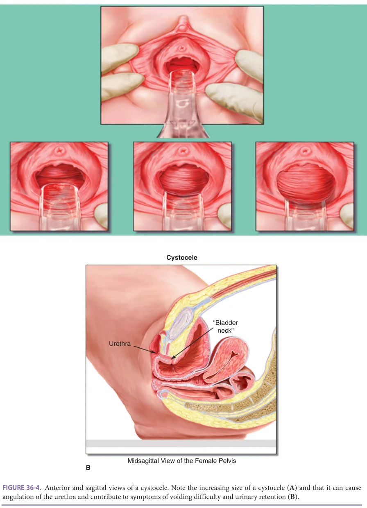

*FIGURE 36-4. Anterior and sagittal views of a cystocele. Note the increasing size of a cystocele (A) and that it can cause angulation of the urethra and contribute to symptoms of voiding difficulty and urinary retention (B).*

*Owner annotations/highlights are from the marked source copy, not the book.*

A

tissue incarceration and necrosis may develop. Patients with rectal prolapse should be referred to a colorectal surgeon or gastroenterologist for additional evaluation and treatment.

Several different systems have been designed to grade the degree of POP based on anatomic changes. The

Baden-Walker system was commonly used in clinical practice, and classifies the degree of prolapse based on whether it extends beyond the midpoint of the vagina or beyond the vaginal introitus, when it is more likely to become symptomatic. The POP-Q system is more commonly used in

**[p. 544]**

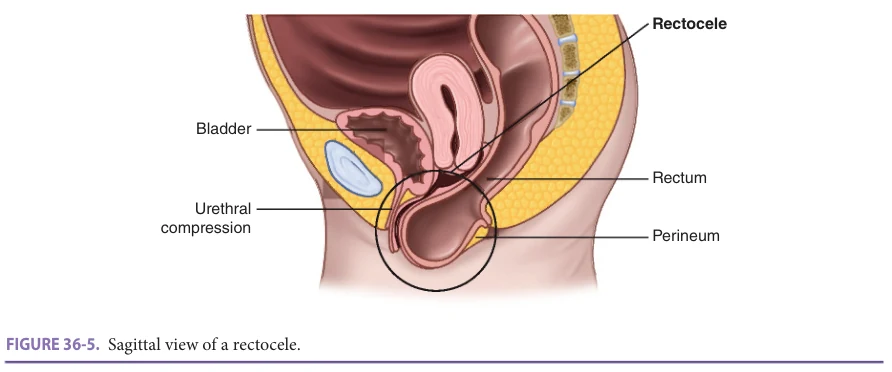

*FIGURE 36-5. Sagittal view of a rectocele.*

*Owner annotations/highlights are from the marked source copy, not the book.*

research settings but is also useful in a simplified approach in defining the leading edge of the prolapse. It includes multiple anatomic measurements in relation to the vaginal introitus. In most systems, the hymenal ring is used to define the vaginal introitus. A clear understanding and documentation of the extent of prolapse is useful for surgical planning and for following progress over time (Figure 36-7).

### Treatment of Pelvic Organ Prolapse

Most treatments are aimed at reducing the prolapse back into the vaginal canal and correcting vaginal anatomy (see Table 36-6). Ulcerations of the vaginal epithelium may respond to topical estrogen therapy. Barrier compounds may also be helpful to reduce tissue irritation.

Treatment of POP may be surgical or nonsurgical and depends to some degree on the amount of bother experienced by the patient. It also depends on overall health status, and goals of therapy. The main conditions necessitating definitive treatment or specialist referral include nonhealing ulcerations, bleeding, elevated postvoid residual urine volume causing recurrent UTIs, and hydronephrosis. If none of these are present and the patient is not particularly bothered by her symptoms, then reassurance and observation are appropriate. Application of estrogen cream once or twice a week is advisable for preventive care and can help

reduce tissue irritation and ulceration. Some patients may find comfort in using supportive underwear.

### Nonsurgical Treatment of POP and UI

Nonsurgical treatment of POP and UI includes such treatment as behavioral therapy (pelvic floor muscle exercises including stress and urgency incontinence strategies), medications, as well as the use of intravaginal support devices. One should consider first starting with a conservative treatment approach in older women who do not have a desire for surgical intervention or in cases where surgical intervention may not be an ideal choice due to the medical comorbidities causing the increased surgical risk.

With respect to pelvic floor muscle exercises, they may limit the progression of mild prolapse and related symptoms, but less response has been noted with prolapse beyond the vaginal introitus. Pelvic floor muscle exercises are usually employed to treat accompanying urinary and/ or fecal incontinence. Results are generally dependent on patient motivation and the patient’s willingness to comply with an exercise treatment program.

The use of a pessary has been considered an excellent option for nonsurgical management of POP and UI. Patient acceptance is relatively high when appropriately counseled. There are a number of different sizes and shapes

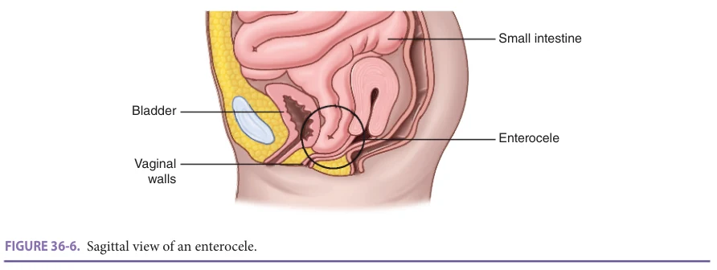

*FIGURE 36-6. Sagittal view of an enterocele.*

*Owner annotations/highlights are from the marked source copy, not the book.*

**[p. 545]**

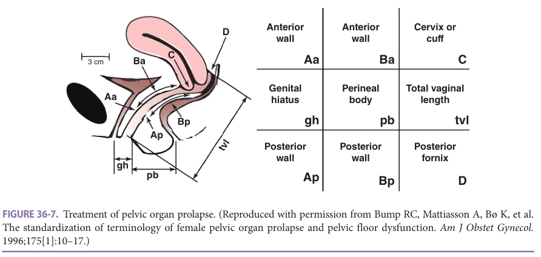

*FIGURE 36-7. Treatment of pelvic organ prolapse. (Reproduced with permission from Bump RC, Mattiasson A, Bø K, et al. The standardization of terminology of female pelvic organ prolapse and pelvic floor dysfunction. Am J Obstet Gynecol. 1996;175[1]:10–17.)*

*Owner annotations/highlights are from the marked source copy, not the book.*

for pessaries and most of them are made from silicone. The risk factors for a failed fitting include a large genital hiatus and a short vaginal length. Pessaries provide pelvic organ support within the vaginal vault. There are two categories of pessaries for POP: support pessaries and space-filling pessaries. The ring pessary (with a diaphragm) is one of the most used support pessaries while the Gellhorn pessary is a commonly used space-filling pessary. Most women who have a stage II or stage III prolapse are successfully fitted with ring pessaries while women with stage IV prolapse usually require a Gellhorn pessary.

Some of the possible complications from pessaries include odor and vaginal discharge. There may also be a failure to retain a pessary or the pessary may be too large, which could lead to excoriation or irritation. There may also be increased stress incontinence with reduction of the vaginal prolapse and in rare instances more severe complications such as fistula formation.

Ideal follow-up for pessaries should be tailored to the patient. Some patients can remove pessaries by themselves and clean them while other patients are less mobile and are cognitively impaired and may need very close follow up within 1 to 3 months. Each clinician should evaluate the tissue health of the patient, the cognitive and mobility status of the patient, type of pessary being utilized, and the patient’s home/living situation and then assess the patient for the appropriate treatment plan for each patient depending on the aforementioned factors. Assessing tissue health and the use of vaginal estrogen cream accompanying the pessary are important aspects of managing pessary care.

### Surgeries

Surgical management of POP includes either reconstructive or obliterative procedures. Reconstructive options aim to reduce the prolapse and reestablish normal vaginal anatomy. Examples include anterior and posterior colporrhaphy and enterocele repair. Prolapse of the vaginal apex

may require more advanced repair techniques including vaginal, abdominal, laparoscopic, or robotic approaches to the vaginal apex. For example, one can perform a vaginal uterosacral or sacrospinous ligament fixation, in which the apex of the vagina is sutured to a fixed point in the pelvis. In some cases, mesh or other supporting material is needed to perform this type of repair such as sacrocolpopexy. Potential complications include mesh erosion through the vaginal wall or other surrounding structures. Colpocleisis is an obliterative procedure in which the prolapse is reduced and the vagina is essentially closed to prevent recurrence. For a specialist, it is technically straightforward and may offer an option for older women with substantial comorbidity who may not be good candidates for more involved reconstructive procedures. However, patients need to be carefully counseled that penetrative sexual activity will not be possible after colpocleisis. Studies have shown that in carefully selected patients, satisfaction rates are high with low rates of regret regarding the procedure. Rectal prolapse is typically treated surgically with either reduction, fixation, or excision of the prolapsed portion of the rectum. Treatments to prevent chronic constipation are indicated after all types of POP repair to avoid significant straining with bowel movements and prevent prolapse recurrence.

## SUMMARY

Although gynecologic issues comprise a small part of geriatric care, large impacts can be made on function and quality of life. A thorough personal and family history will guide cancer prevention and detection. An initial pelvic examination will provide the basis for understanding symptoms and anticipating problems, potentially for years to come. Querying problems in a systematic fashion addressing all potential gynecologic concerns will encourage the patient to voice symptoms when they arise. Persistence in addressing incontinence and pelvic floor issues can help maintain physical activity and prevent isolation. Ensuring adequate

**[p. 546]**

cervical cancer screening, early recognition of endometrial and vulvar cancer, and early investigation of abdominopelvic complaints to rule out ovarian cancer will reduce disease burden. Proactive assessment of pelvic floor conditions may also impact quality of life.

## FURTHER READING

### General

Meyer I, Howard TF, Smith HJ, Kim KH, Richter HE. Gyne-

cologic disorders in the older woman. In: Rosenthal R, Zenilman M, Katlic M (eds). Principles and Practice of Geriatric Surgery. Cham: Springer; 2020. The 2017 hormone therapy position statement of The North

American Menopause Society. Menopause. 2017;24(7): 728–753.

### Breast

ACOG Practice Bulletin No. 164. Diagnosis and Man-

agement of Benign Breast Disorders. Obstet Gynecol. 2016;127(6):e141–e56.

### Pain

ACOG Practice Bulletin No. 218. Chronic pelvic pain.

Obstet Gynecol. 2020;135(3):e98–e109. Lindsetmo RO, Stulberg J. Chronic abdominal wall

pain—a diagnostic challenge for the surgeon. Am J Surg. 2009;198(1):129–134.

### Vulva

ACOG Practice Bulletin No. 224. Diagnosis and Man-

agement of Vulvar Skin Disorders. Obstet Gynecol. 2020;136(1):e1–e14. The 2020 genitourinary syndrome of menopause position

statement of the North American Menopause Society. Menopause. 2020;27(9):976–992. Bornstein J, Bogliatto F, Haefner HK, et al. The 2015 Inter-

national Society for the Study of Vulvovaginal Disease (ISSVD) terminology of vulvar squamous intraepithelial lesions. J Low Genit Tract Dis. 2016;20(1):11–14. Gerfus KB, Lee AW, Baradaran N, et al. Pathophysiology,

clinical manifestations, and treatment of lichen sclerosus: a systematic review. Urology. 2020;135:11–19. Marnach ML, Torgerson RR. Vulvovaginal issues in mature

women. Mayo Clin Proc.; 2017;92(3):449–454.

### Vagina

ACOG Practice Bulletin No. 215. Vaginitis in nonpregnant

patients. Obstet Gynecol. 2020;135(1):e1–e17.

## ACKNOWLEDGMENT

Karen L. Miller and Tomas L. Griebling contributed to this chapter in the 7th edition and some material from that chapter has been retained here.

Shifren JL. Genitourinary syndrome of menopause. Clin

Obstet Gynecol. 2018;61(3):508–516.

### Cervix

Malagon T, Kulasingam S, Mayrand MH, et al. Age at

last screening and remaining lifetime risk of cervical cancer in older, unvaccinated, HPV-negative women: a modelling study. Lancet Oncol. 2018;19(12): 1569–1578. Perkins RB, Guido RS, Castle PE, et al. 2019 ASCCP Risk-

Based Management Consensus Guidelines for Abnormal Cervical Cancer Screening Tests and Cancer Precursors. J Low Genit Tract Dis. 2020;24(2):102–131.

### Uterus/Bleeding

ACOG Practice Bulletin No. 149. Endometrial cancer.

Obstet Gynecol. 2015;125(4):1006–1026. SGO Clinical Practice Statement. Screening for Lynch

syndrome in endometrial cancer. March 2014. https:// www.sgo.org/clinical-practice/guidelines/screeningfor-lynch-syndrome-in-endometrial-cancer/. Accessed December 12, 2020.

### Ovary/Adnexal Mass

ACOG Practice Bulletin No. 174. Evaluation and man-

agement of adnexal masses. Obstet Gynecol. 2016;174: e1–e17. ACOG Practice Bulletin No. 182. Hereditary breast and

ovarian cancer. Obstet Gynecol. 2017;182:e1–e17.

### Urogynecological Issues

ACOG Practice Bulletin No. 214. Pelvic organ prolapse.

Obstet Gynecol. 2019;134(5):e126–e142. Bump RC, Mattiasson A, Bø K, et al. The standardization

of terminology of female pelvic organ prolapse and pelvic floor dysfunction. Am J Obstet Gynecol. 1996;175(1): 10–17. De Albuquerque Coelho SC, de Castro EB, Juliato CR.

Female pelvic organ prolapse using pessaries: systematic review. Int Urogynecol J. 2016;27(12):1797–1803.
