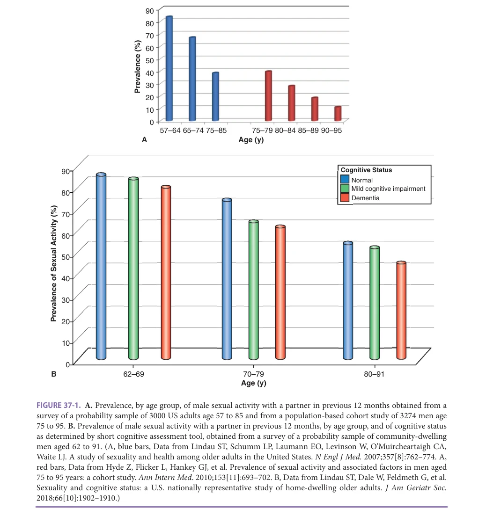
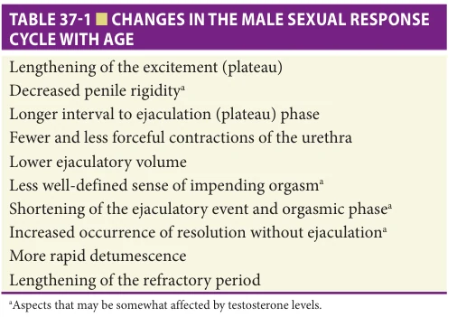
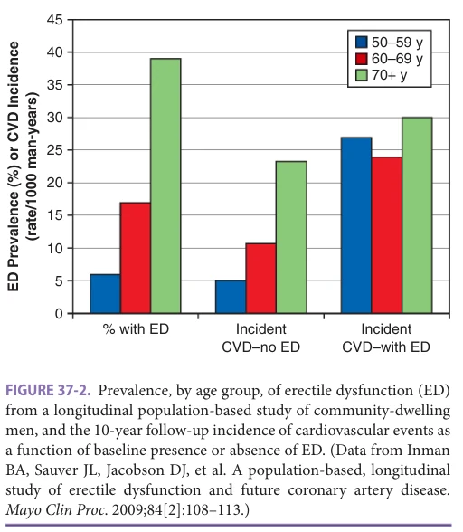
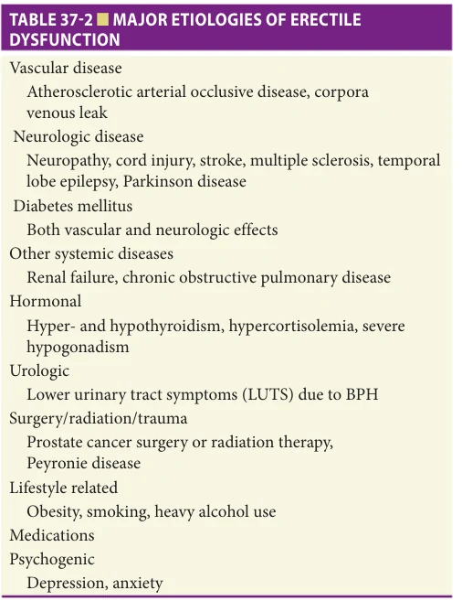
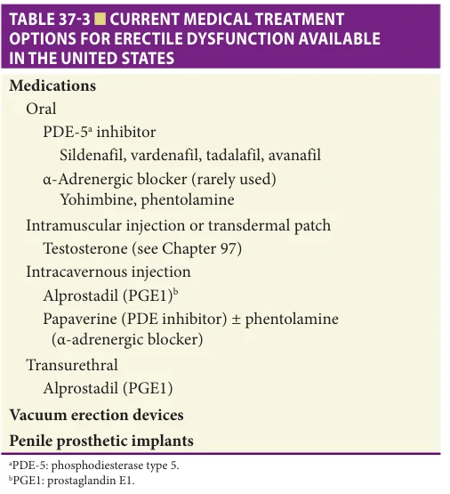

# Hazzard's Geriatric Medicine and Gerontology, 8e - Chapter 37: Sexuality, Sexual Function, and the Aging Man

J. Lisa Tenover, Alvin M. Matsumoto

> **Status.** Fast build from the book; not lane-reviewed.

> Not cited in the 2020-2026 past papers.

> **Source and method.** Printed pages 547-554, from the marked 8th-edition copy (PDF page = printed page + 34). Prose follows its text layer; tables and figures are source-page crops. The book is canonical.

**[p. 547]**

Sexuality is a basic human need that exists throughout life and is a significant component to quality of life of many older individuals. Although 70% of adult patients in a large sample study considered sexual matters to be an appropriate topic for a general clinician or geriatrician to discuss, sexual problems are noted in fewer than 2% of primary care physicians’ notes. Sexuality and sexual function in the aging female are addressed in Chapter 35. Sexuality, sexual function and dysfunction in the aging male, and the use of testosterone replacement therapy for male sexual dysfunction caused by male hypogonadism will be discussed in this chapter.

#### Learning Objectives

- Identify the factors affecting sexual function in the older man, including changes in sexual physiology, coexisting medical problems, and psychosocial issues.

- Describe the initial evaluation of erectile dysfunction (ED) in an older man, using knowledge of possible etiologies to guide evaluation and treatment recommendations.

- Identify older men with sexual dysfunction who might benefit from testosterone treatment.

#### Key Clinical Points

1. Male sexual activity declines with aging, due to social factors and changes in physical and psychological health; yet many older men are sexually active into late life.

2. The most common causes for ED in older men are vascular in origin, not hormonal, and thus current predominant therapies are phosphodiesterase-5 (PDE-5) inhibitors and vacuum devices.

3. Testosterone treatment improves libido, sexual activity, and erectile function in older men with hypogonadism (ie, men with symptoms and signs of testosterone deficiency and consistently low morning serum testosterone concentrations), but not in older men with normal testosterone concentrations. The Aging Gay, Bisexual, or Transgender (GBT) Male

## SEXUALITY AND SEXUAL FUNCTION IN OLDER MEN

### Sexual Behaviors

Numerous cross-sectional and longitudinal epidemiologic studies of sexuality and aging report that, although sexual activity decreases with age, many older adults are sexually active. Sexual expression can encompass many forms, but most studies report data on sexual intercourse, oral sex, and masturbation.

Figure 37-1A depicts the age-related prevalence of male sexual activity from two large studies. Both studies defined sexual activity as activity with a partner and occurring within the 12 months prior to the data collection. In these studies, the likelihood of sexual activity with a partner did decline with age, but nearly 40% of men at age 75 to 80 reported some sexual activity, and 54% of these reported sex at least two to three times a month.

Reasons reported by older men for not engaging in sexual activity are varied, involving social factors as well as physical and psychological health. Partner availability (no partner, partner not interested, or partner with physical limitations) is a major factor. Psychological conditions, such as anxiety and depression, can affect libido and sexual function; and many medical problems are linked to sexual dysfunction.

### Changes in Male Sexual Physiology With Age

Overall there is a gradual slowing of sexual physical response time as men age. It takes more time to achieve sexual arousal, complete the sexual act, and become rearoused

for further sexual activity. Table 37-1 lists the specific changes in the male sexual response cycle with age. Some of the changes have been shown to be impacted, at least in part, by low testosterone levels, while others are unaffected by hormone levels.

As of 2017, somewhere between 1.4% and 2.4% of older men identified themselves as GBT. Older GBT men have similar sexual problems as older heterosexual men, but

**[p. 548]**

*FIGURE 37-1. A. Prevalence, by age group, of male sexual activity with a partner in previous 12 months obtained from a survey of a probability sample of 3000 US adults age 57 to 85 and from a population-based cohort study of 3274 men age 75 to 95. B. Prevalence of male sexual activity with a partner in previous 12 months, by age group, and of cognitive status as determined by short cognitive assessment tool, obtained from a survey of a probability sample of community-dwelling men aged 62 to 91. (A, blue bars, Data from Lindau ST, Schumm LP, Laumann EO, Levinson W, O’Muircheartaigh CA, Waite LJ. A study of sexuality and health among older adults in the United States. N Engl J Med. 2007;357[8]:762–774. A, red bars, Data from Hyde Z, Flicker L, Hankey GJ, et al. Prevalence of sexual activity and associated factors in men aged 75 to 95 years: a cohort study. Ann Intern Med. 2010;153[11]:693–702. B, Data from Lindau ST, Dale W, Feldmeth G, et al. Sexuality and cognitive status: a U.S. nationally representative study of home-dwelling older adults. J Am Geriatr Soc. 2018;66[10]:1902–1910.)*

*Owner annotations/highlights are from the marked source copy, not the book.*

may suffer additional problems. GBT older men can face discrimination when seeking health care, and many service providers are poorly prepared to work with them. Additionally, these older men are likely to suffer additional stress while trying to find a partner, especially if their living situation changes and they move into assistedliving facilities or nursing homes. While assisted living and long-term care facilities have been evolving to become more welcoming to the LGBT community, disparities in care still exist. Specific organizations that address issues of aging gay, bisexual, or transgender persons have formed across the country.

Unprotected sex occurs in approximately 10% of older gay men. Compared to younger gay men, however, older gay men get tested less often for sexually transmitted diseases, including testing for acquired immunodeficiency syndrome (AIDS). The incidence of AIDS is increasing in older men. Education about safe sex practices is important for the older population. Older males with a history of anal sex need to be regularly examined for anal cancer, as the prevalence increases in such persons.

Older GBT males should be encouraged to make advance directives for health and to specifically designate their durable power of attorney for health care in order to

**[p. 549]**

*TABLE 37-1 ■ CHANGES IN THE MALE SEXUAL RESPONSE CYCLE WITH AGE*

*Owner annotations/highlights are from the marked source copy, not the book.*

facilitate the ability of their partners to make their health decisions.

### Sex in Long-Term Care

While there is no reason to believe the desire for intimacy is lost on entering a residential long-term care facility, persons who live in nursing homes frequently have no opportunity for a private or sexual life; many couples are separated due to the residential care admission. Federal regulations provide some right to privacy, and nursing home staff are becoming more educated about resident sexuality and issues that may arise as a result, but barriers to sexual expression in long-term care often are significant. Issues surrounding romantic liaisons between two unmarried residents in a nursing home can be problematic. Ethical concerns can arise around the assessment of sexual behaviors and whether they are “sexually inappropriate” or not, and may involve balancing a resident’s need for sexual expression against expectations and beliefs of caregivers and family members. If the sexual conduct involves one or both persons who are cognitively impaired, individual capacity to consent to sexual activity needs to be assessed. There is considerable variability by state in the definitions of capacity to consent to sexual activity and sexual consent is complicated, involving knowledge, capacity, and voluntariness. There are no surrogate decision makers for sexual relations. Psychological evaluation for capacity to consent to sexual activity may need to be sought. Also see Chapter 35, as similar challenges affect older women in these settings.

### Sex and Cognitive Impairment/Dementia

Development of cognitive impairment does not equate with loss of sexuality or sexual function. Although age-adjusted rates of partnered sexual activity are lower in those with worse cognitive function, the majority of community dwelling partnered older men with dementia are sexually active. In one study (Figure 37-1B), more than 40% of partnered men, ages 80 to 91 and who screened positive for dementia, were sexually active, although compared to

the same age men with normal cognition, those men with dementia were more likely to report obligatory sex and sex without arousal. Issues of sexuality, however, can be especially complex for those individuals who have significant dementia and can include loss of partner recognition, loss of memory of past sexual activity, and role changes, where one’s sexual partner now also is one’s caregiver. Physicians of demented male patients need to ask the spouse or partner about sexual issues or conflicts. Placing the problems in the context of dementia can assist with discussion of coping strategies. Nonsexual ways of expressing one’s intimacy, such as touching, holding hands, and massages, might be suggested.

Inappropriate sexual behavior (ISB) in individuals with dementia reportedly ranges from 7% to 25% with higher prevalence in men, in residents of nursing facilities, and in persons with more severe cognitive impairment. There is no universally accepted definition of ISB, but it has been described as sexually related activities or heightened sexual drive that interferes with function and is pursued at inappropriate times or with nonconsenting persons. Included in ISB are unwanted verbal remarks, unwanted touching, disrobing, public masturbation, unwanted sexual advances, and sexual aggression. ISB can cause conflict between a patient’s autonomy and the prevention of psychological and physical trauma. It impacts families, care providers, and, especially in long-term care facilities, may threaten others who might be unable or unwilling to give informed consent.

There are no established treatment protocols for ISB. Some environmental and behavioral strategies that have been tried include redirection, distraction, clothing modification, avoidance of external cues, and in long-term care facilities, provision of single rooms. Supportive psychotherapy for spouses and families can be helpful. There are no controlled trials of pharmacologic therapies for ISB, but medications that have been reported to reduce ISB include the selective serotonin reuptake inhibitors (SSRIs), venlafaxine, both first-generation and atypical antipsychotics, medroxyprogesterone acetate, gonadotropin-releasing hormone (GnRH) analogues, cyproterone acetate, cholinesterase inhibitors, pindolol, and gabapentin.

## SEXUAL DYSFUNCTION IN THE AGING MALE

### Categories of Male Sexual Dysfunction

The major categories of sexual dysfunction in older men include erectile dysfunction (ED), lack of interest in sex (low libido), performance anxiety, and inability to climax. ED is by far the most prevalent. ED is defined as the inability to obtain and sustain a penile erection adequate for intercourse. Age alone is a major risk factor for ED, and its incidence, prevalence, and severity increase with age. In the Massachusetts Male Aging Study, a community-based

**[p. 550]**

*FIGURE 37-2. Prevalence, by age group, of erectile dysfunction (ED) from a longitudinal population-based study of community-dwelling men, and the 10-year follow-up incidence of cardiovascular events as a function of baseline presence or absence of ED. (Data from Inman BA, Sauver JL, Jacobson DJ, et al. A population-based, longitudinal study of erectile dysfunction and future coronary artery disease. Mayo Clin Proc. 2009;84[2]:108–113.)*

*Owner annotations/highlights are from the marked source copy, not the book.*

study of middle-aged and older men, the reported incidence of some degree of ED was 55% for men at age 60, and 65% for men at 70 years; the prevalence of total ED was 15% at age 70. In a population-based prospective cohort study in Olmsted County, Minnesota, ED prevalence was 6% in men aged 50 to 59, 17% in men aged 60 to 69, and 39% in men aged 70 and older (Figure 37-2). Libido is dependent on learned responses, general health-related quality of life, and, to some extent, serum testosterone levels. As will be discussed later in this chapter, testosterone levels decline in men with normal aging, and some men may reach levels that are low enough to affect libido. Similarly, treatment of prostate cancer with androgen deprivation therapy (ADT) resulting in severe testosterone deficiency can be associated with loss of libido.

Performance anxiety is common in older men and often a result of equating masculinity with speed and magnitude of sexual activity. A man may become so preoccupied by his performance that his confidence and sexual capacity lessen, leading to ED. Depression and psychosocial stresses also are prevalent in older men and contribute to sexual problems. “Widower’s syndrome,” where a man fails to achieve erection after the death of spouse, is a reported entity.

Inability to reach climax or resolution of climax without ejaculation can occur. In the University of Chicago study, this occurred in about 16% in the 57- to 64-year age range, but increased to 33% in the 75-year and older age group.

### Erectile Dysfunction

Etiologies Table 37-2 lists the major etiologies of ED. Vascular disease, which includes both atherosclerotic arterial

*TABLE 37-2 ■ MAJOR ETIOLOGIES OF ERECTILE DYSFUNCTION*

*Owner annotations/highlights are from the marked source copy, not the book.*

occlusive disease and corpora cavernosal venous leak, is the most common cause of ED. The likely mechanism is that penile hypoxia leads to replacement of corpora smooth muscle by connective tissue, which results in impaired cavernosal expandability and inability to compress subtunical venules.

Cardiovascular disease (CVD) and ED share etiologies. Diabetes mellitus, hypertension, hyperlipidemia, and smoking are major risk factors for both ED and CVD. The penis is a high blood flow system during erectile function, so ED may be an early sign of vascular inadequacy on the basis of atherosclerosis. Numerous studies suggest that ED is one of the sentinel symptoms of occult CVD, particularly in men under the age of 70 (see Figure 37-2). It is recommended that men under the age of 70 presenting with ED should be provided appropriate screening and treatment for CVD.

Diabetes mellitus is the most common single disease to cause ED. Although the severity of hyperglycemia has been suggested as a predictor of ED, age, duration of diabetes, autonomic neuropathy, and other diabetic complications appear to be better predictors. Sometimes ED is the first symptom of diabetes mellitus, so all men who present with newly diagnosed ED should be evaluated for possible diabetes.

Neurologic diseases, such as peripheral neuropathy, spinal cord injury, stroke, multiple sclerosis, temporal lobe epilepsy, and Parkinson disease all can cause ED. In men

**[p. 551]**

who develop multiple sclerosis, about half of them present initially with ED. In these men, ED may be present for a time, then resolve and recur at the next exacerbation. Men with stroke-related ED also tend to have ejaculatory problems.

Significant other systemic diseases that can cause ED are renal failure and chronic obstructive pulmonary disease (COPD). Chronic renal failure impacts erectile function through effects on the vascular system and via the development of autonomic neuropathy. In addition, many men with end-stage renal disease are severely hypogonadal. Neither hemodialysis nor testosterone replacement in men with renal failure has been shown to improve ED. Men with COPD and low PaO2 have decreased cavernosal nitric oxide. Oxygen therapy may improve erectile function in some men with COPD.

Hypercortisolemia and hyper- and hypothyroidism have been associated with low libido and ED. Hypothyroidism also is associated with delayed ejaculation, while hyperthyroidism is associated with premature ejaculation. Normalization of thyroid function frequently leads to improvement in both ED and ejaculatory dysfunction, although it may take up to 6 months after achievement of a euthyroid state for these functions to normalize.

Serum testosterone levels in men decline with aging, but the amount of contribution of this testosterone decline to the development of ED is not clear. In the Massachusetts Male Aging Study, where serum testosterone levels were measured throughout the study duration, 16% of the men who had no ED at baseline developed erectile problems within the next 8 years. Of the men who developed ED, 22% were in the lowest tertile for serum testosterone levels, but 12% were in the highest tertile. In the Concord Health and Ageing in Men study, where men 70 years and older were followed for 2 years, no association of ED and testosterone levels was found. Conversely, in the European Male Ageing Study, where men 40 to 79 were followed for over 4 years, becoming hypogonadal (as defined by serum total testosterone < 10.5 nmol/L) was significantly associated with development of ED. Unlike ED, a number of studies have reported that in healthy older men, libido does tend to correlate with serum testosterone levels.

ED and lower urinary tract symptoms (LUTS), occurring as the result of benign prostatic hyperplasia (BPH), frequently coassociate. A study in older men who had both ED and LUTS and were treated with the PDE-5 inhibitor, sildenafil, reported that both ED and LUTS symptoms improved with the sildenafil treatment.

While transurethral resection of the prostate (TURP) for BPH seldom results in ED, surgery for prostate cancer is more extensive and results in some degree of ED in about 60% of men. Nerve-sparing surgery offers a greater chance of preserving sexual potency. In addition, penile rehabilitation with PDE-5 inhibitors immediately following surgery helps prevent complete ED. ED also has been reported to be associated with pelvic radiation in up to 36% of cases.

Peyronie disease, where fibrosis of the penile corpora cavernosa occurs, also can lead to erectile problems.

A number of lifestyle factors have been associated with the development of ED. Obesity alone is associated with a 20% increased risk of developing erectile problems. Weight loss may improve erectile function in obese patients. Smoking also can cause ED, both from direct effects of nicotine on penile smooth muscle and from longer-term effects on accelerating atherosclerosis. Heavy alcohol consumption (> 3 drinks/day) is associated with ED. Physical activity alone, regardless of weight, can improve or delay development of ED.

A large number of medications have produced adverse drug events reports involving male sexual dysfunction, usually ED. By and large, the effects on sexual function are medication class effects, based on mechanisms of action. The more common medications that have been reported to be associated with ED are beta blockers, diuretics, antiandrogens, opioids (chronic use), and antidepressents, particularly the SSRIs, venlafaxine, and the tricyclics. It is unlikely that medications would precipitate symptomatic ED in a man who had absolutely no erectile problems prior to initiating the medication, but for men with mild preexisting ED, these medications may precipitate clinically significant ED.

### Evaluation of Sexual Dysfunction

The first step in evaluation of sexual dysfunction is often the most difficult: eliciting the information. Asking a brief question about sexual activity in all patients can legitimize the topic for conversation. Examples of possible screening questions include: “Are you satisfied with your sexual activity?”; “How has your illness affected your sex life?” if the patient has a chronic illness; or “Many of my male patients your age have noticed some change in their sexual function; how about you?”

If sexual dysfunction is discovered during screening, then a more extensive sexual and health history and physical examination are warranted. A careful history from the man’s sexual partner also can be helpful. If psychological or couples’ problems exist, or if the patient is depressed, these should be treated. As noted earlier, an evaluation for general vascular disease and for diabetes, as well as a medication evaluation, should be done.

### Treatments for Erectile Dysfunction

After addressing lifestyle modifications, medications and reversible causes of ED, the next step is consideration of direct medical treatments. Table 37-3 lists the current medical treatments for ED that are available in the United States.

The most common first-line therapy of ED is an oral phosphodiesterase type 5 (PDE-5) inhibitor because of their efficacy (from 45% to 90%), ease of use, and generally favorable side effect profiles. The PDE-5 inhibitors available currently in the United States are sildenafil, vardenafil, tadalafil, and avanafil. Systemic reviews and pooled data across trials support that all four PDE-5 inhibitors

**[p. 552]**

*TABLE 37-3 ■ CURRENT MEDICAL TREATMENT OPTIONS FOR ERECTILE DYSFUNCTION AVAILABLE IN THE UNITED STATES*

*Owner annotations/highlights are from the marked source copy, not the book.*

have similar efficacy. Tadalafil has a longer duration of action and avanafil may have a more rapid onset of action compared to the others. Sildenafil and vardenafil must be taken on an empty stomach, as high-fat meals and/or alcohol delay their absorption, but food does not interfere significantly with the absorption of tadalafil or avanafil. They all require sexual stimulation to work effectively. Men with diabetes mellitus or after prostatectomy usually have more severe ED at baseline, so they often respond less well to PDE-5 inhibitors. Men who are hypogonadal may find PDE-5 inhibitors more effective if combined with testosterone therapy.

PDE-5 inhibitors have some vasodilatory activity and interact with nitrates. Therefore they are contraindicated in men taking nitrates. Men with LUTS/BPH who are taking α-adrenergic blockers, medications which also can lower blood pressure, should be cautioned when starting a PDE-5 inhibitor. Most common side effects of these agents are headaches, flushing, rhinitis, dyspepsia, myalgias, dizziness, back pain, and lowering of blood pressure. Sildenafil and vardenafil have some cross-reactivity with PDE-6, which may explain some reports of visual disturbances (usually a “blue haze”) with use of these medications.

Intracavernous injections with prostaglandin E1 (PGE1) or a PDE-5 inhibitor, with or without intracavernosal co-injection of an α-adrenergic blocker, have efficacy of 65% to 90%. Side effects include mild local pain (10%–15%), penile fibrosis, prolonged erections, and rhinitis. PGE1 (Alprostadil) also can be delivered via urethral insertion, followed by vigorous penile massage to assist with medication delivery. Reported efficacy is between 45% and 65% and side effects include mild pain, minor urethral

bleeding, dizziness, and lowered blood pressure; there is a rare risk of anterior optic neuropathy.

Vacuum erection devices consist of a vacuum cylinder connected to a pump to create controlled negative pressure, and one or more constriction rings that go at the base of the penis after vacuum-induced engorgement has occurred. Intercourse occurs with rings in place, but the ring should not be left on for more than 30 minutes. Erection satisfactory for intercourse occurs in 75% to 90% of users. Overall satisfaction rate is 65% to 70% if the method is chosen and used, but only about 12% of men select the vacuum device as an initial choice of therapy. Side effects or reasons for dissatisfaction include pain, inconvenience, and premature loss of rigidity. There are few contraindications to its use, but if on anticoagulants, these devices should be used with care.

Penile prosthetic implants are either semirigid (noninflatable) or inflatable. Designs have improved over the last decades, and the 5-year failure rates for the inflatable prosthesis are low. Infection is the most significant complication and varies from less than 1% to 16%.

Oral α-adrenergic blockers, such as yohimbine or phentolamine, have been used to treat ED, but with low efficacy (10%–20%) and are rarely used. Testosterone replacement therapy, with or without concomitant PDE-5 inhibitor treatment, has been used successfully to treat ED in some hypogonadal men (see following section).

### Testosterone and Male Sexual Function

Testosterone and its active metabolite, estradiol, play important roles in maintaining normal sexual function in men. Libido, sexual activity, and erectile function are reduced by severely low, castration-range, serum testosterone concentrations produced by ADT in older men with prostate cancer. In a recent study, healthy older men were treated with a gonadotropin-releasing hormone agonist (to induce experimental castration) and various dosages of testosterone (to produce very low to normal serum testosterone concentrations) for 16 weeks. In this study, sexual desire and erectile function were reduced slightly at serum testosterone concentrations less than 200 ng/dL; however, they were not reduced significantly relative to controls until serum testosterone levels were less than 100 ng/dL. These results suggest that the threshold of testosterone concentrations to maintain sexual function is relatively low and support results from previous observational studies.

Testosterone treatment is only indicated for men with hypogonadism (see Chapter 97). As per the Endocrine Society clinical practice guidelines, the diagnosis of hypogonadism requires clinical manifestations (ie, symptoms and signs) of testosterone deficiency and consistently low morning (preferably fasting) serum testosterone concentrations on at least two occasions. Sexual dysfunction symptoms (eg, low libido, loss of spontaneous erections, ED, and reduced sexual activity) are prominent manifestations of hypogonadism.

**[p. 553]**

Meta-analyses have reported inconsistent effects of testosterone treatment on sexual function. Earlier meta-analyses utilized testosterone treatment trials in which men without symptoms or signs of testosterone deficiency or who had normal to low-normal testosterone levels were included. A more recent meta-analysis, however, included only the small number of randomized, placebo-controlled studies of 1779 men who had at least one symptom or sign of testosterone deficiency and morning testosterone concentration less than or equal to 300 ng/dL who received testosterone replacement therapy for more than or equal to 12 weeks. In this meta-analysis, compared to placebo, testosterone treatment of hypogonadal men was associated with a modest but significant improvement in libido, erectile function, and sexual satisfaction.

The results of the Testosterone Trials (T Trials) are worth noting. This was a large, multi-center, doubleblind, placebo-controlled study in older men (average age 72 years) with unequivocal hypogonadism (symptoms and signs of testosterone deficiency and two morning total testosterone levels by mass spectrometry < 275 ng/dL) for no apparent reason other than age. More details of the T Trials are provided in Chapter 97. Of the 459 men

with low sexual desire (low libido) enrolled in the Sexual Function Trial of the T Trials, testosterone versus placebo treatment for 1 year resulted in moderate and sustained improvements in sexual activity, libido, and erectile function in older men with age-associated hypogonadism. The effect of testosterone therapy on ED as assessed by the International Index of Erectile Function (IIEF) was clinically meaningful, but less than that reported for PDE-5 inhibitors. In contrast to improvements in libido and sexual activity in testosterone-treated men that correlated with incremental changes in serum total or free testosterone and estradiol levels, the improvement in ED did not correlate with sex steroid concentrations. Also, no threshold testosterone concentration was apparent for any of the sexual function outcomes.

In contrast to men with hypogonadism, testosterone treatment does not improve libido, sexual activity or erectile function in men with normal testosterone (ie, eugonadal men). Also, in men with ED who fail to respond to PDE-5 inhibitors, the addition of testosterone treatment may improve erectile function as well as libido and sexual activity in men who have severe hypogonadism, but not in eugonadal men.

## FURTHER READING

Ahern T, Swiecicka A, Eendebak RJAH, et al. Natural

history, risk factors, and clinical features of primary hypogonadism in ageing men: longitudinal data from the European Male Ageing Study. Clin Endocrinology. 2016;85:891–901. American Geriatrics Society Ethics Committee. American

Geriatrics Society care of lesbian, gay, bisexual and transgender older adults position statement. J Am Geriatr Soc. 2015;63:423–426. Araujo AB, Mohr BA, McKinlay JB. Changes in sexual

function in middle-aged and older men: longitudinal data from the Massachusetts Male Aging Study. J Am Geriatr Soc. 2004;52:1502–1509. Cunningham GR, Stephens-Shields AJ, Rosen RC, et al.

Testosterone treatment and sexual function in older men with low testosterone levels. J Clin Endocrinol Metab. 2016;101(8):3096–3104. Finkelstein JS, Lee H, Burnett-Bowie SM, et al. Dose-

response relationships between gonadal steroids and bone, body composition, and sexual function in aging men. J Clin Endocrinol Metab. 2020;105(8): 2779–2788. Hay B, Cumming RG, Blyth FM, et al. The longitudinal

relationship of sexual function and androgen status in

older men: the Concord health and ageing in men project. J Clin Endocrinol Metab. 2015;100:1350–1358. Hyde Z, Flicker L, Hankey GJ, et al. Prevalence of sexual

activity and associated factors in men aged 75 to 95 years. Ann Intern Med. 2010;153:693–702. Inman BA, St. Sauver JL, Jacobson DJ, et al. A population-

based, longitudinal study of erectile dysfunction and future coronary artery disease. Mayo Clin Proc. 2009;84: 108–113. Lindau ST, Dale W, Feldmeth G, et al. Sexuality and Cog-

nitive Status: A U.S nationally representative study of home-dwelling older adults. J Am Geriatr Soc. 2018;66: 1902–1910. Lindau ST, Schumm LP, Laumann EO, et al. A study of

sexuality and health among older adults in the United States. N Engl J Med. 2007;357:762–774. Ponce OJ, Spencer-Bonilla G, Alvarez-Villalobos N, et al.

The efficacy and adverse events of testosterone replacement therapy in hypogonadal men: A systematic review and meta-analysis of randomized, placebo-controlled trials. J Clin Endocrinol Metab. 2018;103(5):1745–1754. Snyder PJ, Bhasin S, Cunningham GR, et al. Effects of tes-

tosterone treatment in older men. N Engl J Med. 2016; 374(7):611–624.

**[p. 554]**
