# Hazzard's Geriatric Medicine and Gerontology, 8e - Chapter 38: Benign Prostate Disorders

Catherine E. DuBeau, Christopher D. Ortengren

> **Status.** Fast build from the book; not lane-reviewed.

> **Source and method.** Printed pages 555-574, from the marked 8th-edition copy (PDF page = printed page + 34). Prose follows its text layer; tables and figures are source-page crops. The book is canonical.

**[p. 555]**

## DEFINITIONS

Many terms are used to describe benign prostate disease, often interchangeably. Precision is important, however, because the conditions overlap only partially (Figure 38-1). Benign prostate hyperplasia (BPH) is a histologic condition characterized by benign proliferation of stromal and/ or epithelial prostate tissue. Its prevalence increases with age and is nearly universally present in men by the ninth decade. Benign prostate enlargement (BPE) occurs in about half of men with BPH, and is quantified by milliliters of prostate tissue (eg, as measured by ultrasound). Bladder outlet obstruction (BOO) occurs in only a subset of men with BPE.

#### Learning Objectives

- Understand the epidemiology and pathophysiology of benign prostate disease in older men.

- Perform an evaluation of older men with lower urinary tract symptoms (LUTS) that incorporates an understanding of the role of etiologic factors beyond benign prostate disease.

- Manage evidence-based stepped treatment of LUTS, including appropriate specialist referral.

#### Key Clinical Points

1. Benign prostate hyperplasia (BPH), prostate hypertrophy, and bladder outlet obstruction are related but not always coincident common conditions in older men.

2. The natural history of benign prostate disease and lower urinary symptoms is variable and includes symptom regression.

3. Multimorbidity, medications, and functional and cognitive impairment may be the predominant cause of LUTS even in men with benign prostate disease.

4. Many men with LUTS can be effectively managed with medical treatment.

Common voiding symptoms are urgency, frequency, nocturia, slow stream, hesitancy, incomplete emptying, postvoiding dribbling, and incontinence, which may be related to BPH, BPE, BOO, age-related physiologic changes in the lower urinary tract, and/or comorbid conditions and medications. However, women may experience these same symptoms. Therefore, voiding symptoms are best described by the nonspecific term lower urinary tract symptoms (LUTS).

## EPIDEMIOLOGY AND NATURAL HISTORY

Early autopsy and epidemiologic studies demonstrated a marked rise in prevalence of BPH and BPE with age, especially during the sixth and seventh decades, and a similar relationship between age and “clinical BPH” (LUTS and BPE on examination) (Figure 38-2). In a racially, ethnically, and socioeconomically diverse population in the United States, the overall prevalence of LUTS was 19% and increased with age (11% at age 30–39 to 26% at age 70–79) but did not differ by sex or race/ethnicity. Other studies suggest that 28% to 35% of older men without previous prostate surgery have moderate to severe LUTS. More recent data from longitudinal epidemiologic studies and placebo arms of treatment trials confirm that the incidence of benign prostate disease gradually and variably increases with age until the ninth decade (Figure 38-3). Only weak correlations exist between BPE, BOO, and LUTS, suggesting that their relationships are nonlinear and complex.

Some data suggest that African-American men have a higher risk of benign prostate disease, urinary retention, and BPE/BOO surgery, possibly because they have higher levels of 5α-reductase and larger prostate transitional zone volume (see section “Pathophysiology”). The very limited available data suggest that Hispanic men have similar risk of BPH and characteristics of BPE as non-Hispanic White men. Asian men generally have lower rates of benign and malignant prostate disease, although this may differ by country of origin.

Progression of benign prostate disease is defined as worsening LUTS, acute urinary retention (AUR), and/or the need for surgical treatment. LUTS can vary significantly over time, and abate as well as progress. In a prospective

**[p. 556]**

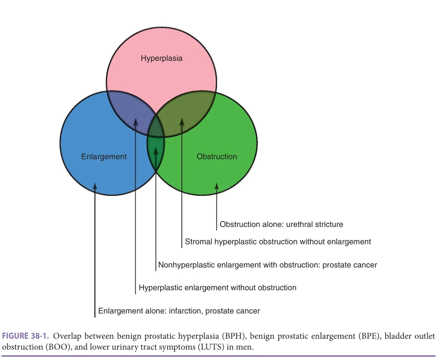

*Figure 38-1, printed p. 556.*

cohort of men with moderate LUTS, by 1 year, symptoms had improved in 16% and worsened in only 24%, and at 4 years, symptoms were only mild in 13%, unchanged in 46%, and worse in 41%. The worsening of LUTS and the

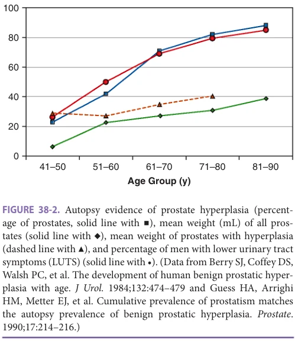

*Figure 38-2, printed p. 556.*

need for medication and surgery differ by age, with the proportion developing severe LUTS and treatment increasing with age (Figure 38-4). The incidence of AUR in men with LUTS and benign prostate disease is low; in a meta-analysis including 6100 moderately symptomatic men, the incidence of AUR was 13.7 per 1000 patient-years in all men, and considerably higher in men aged 70 or older or taking anticholinergic agents (34.7 per 1000 patient-years). Higher baseline prostate-specific antigen (PSA) levels are associated with greater risk of AUR and surgery; 7.8% of men with PSA levels up to 1.3 ng/mL develop AUR and/ or require surgery by the fourth year, compared with 13% of men with PSA levels 1.4 to 3.2 ng/mL, and 20% with PSA levels 3.3 to 12 ng/mL. Change in PSA over time (PSA velocity), however, is not associated with AUR or surgery. As PSA is strongly correlated with prostate volume, it is not surprising that higher volumes (> 30–40 mL by ultrasound) are associated with worsening LUTS and AUR. Other factors that increase AUR risk include previous episode(s) of retention, baseline postvoiding residual volume (PVR) greater than 100 mL, worsening LUTS, and failure to respond to α-blocker treatment. It is important to remember that not all men with BPE will have LUTS.

LUTS are strongly related to poorer health and decreased quality of life. Bother from urinary symptoms and poorer health status (self-reported health, SF-12 Physical Summary Scale, or difficulty with instrumental activities

**[p. 557]**

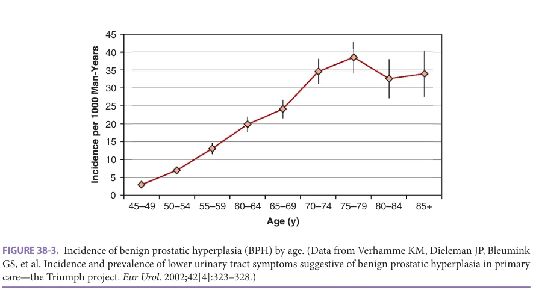

*Figure 38-3, printed p. 557.*

of daily living [IADLs]) are strongly associated with older age. Over half of men with severe LUTS report they would feel unsatisfied, unhappy, or terrible if they were to spend the rest of their life with their urinary condition.

## PATHOPHYSIOLOGY

Hyperplasia Prostate hyperplasia occurs when prostate cell proliferation exceeds programmed cell death (apoptosis) as a result of stimulated cell growth, inhibition of apoptosis, or both.

BPH occurs predominantly in the prostatic periurethral transitional zone, unlike prostate cancer, which tends to occur in more peripheral areas. BPH and prostate cancer are genetically distinct, and one is not a risk factor for the other.

The development of stromal and epithelial hyperplasia in BPH is androgen- and aging-dependent, and involves numerous paracrine and autocrine factors. The trophic androgen for prostate growth is dihydrotestosterone, produced from testosterone within the prostate by the enzyme 5α-reductase (thus the utility of 5α-reductase inhibitors

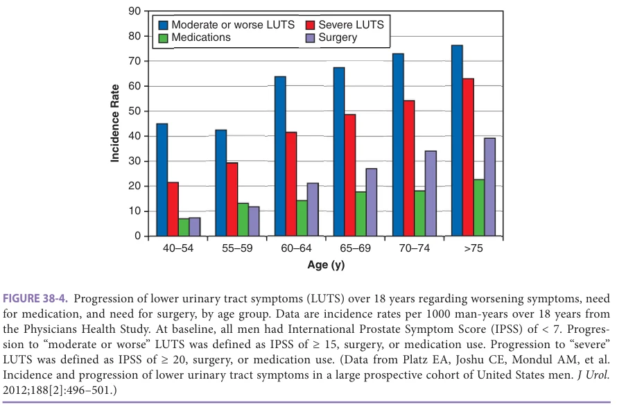

*Figure 38-4, printed p. 557.*

**[p. 558]**

[5αRIs] for treatment). In the absence of 5α-reductase, even high serum levels of testosterone will not cause BPH. Additional factors supporting prostate cell growth include inflammatory cytokines (eg, interleukin-8), autocrine cytokine growth factors, and neuroendocrine cell products. Stromal-epithelial interactions regulating proliferation also involve interactions between androgens, estrogens, and stimulatory and inhibitory peptide growth factors (eg, fibroblast growth factor-2, transforming growth factor-β). Other regulatory factors include nitric oxide (nitric oxide synthetase levels are low in BPH), vitamin D, and local autonomic innervation and activity. Thus, the development of BPH is the end result of numerous pathways involved in regulating sympathetic activity, androgen-estrogen balance, and smooth muscle proliferation.

The divergence in prevalence between BPH, BPE, BOO, and LUTS results from many lower urinary tract factors (Table 38-1). In addition, numerous medical conditions, medications, and functional impairment may cause or worsen LUTS independent of prostate disease (see Chapter 47 on incontinence).

Risk Factors Factors associated with the development of benign prostate disease and LUTS include age, physical inactivity, high meat and fat intake (especially polyunsaturated fats), diabetes, high insulin levels, obesity, low high-density lipoprotein levels, and arteriovascular disease. Vasectomy is not a risk factor and the data on smoking are inconclusive. Potentially modifiable risk factors for BPH and/or LUTS are obesity, a diet high in meat and fat, medications (antidepressants), and physical inactivity.

## EVALUATION

Benign prostate disease may be asymptomatic, but most commonly presents with LUTS; other symptoms include urinary retention, recurrent urinary tract infections (UTIs), or hematuria (from prostatic varices). Figure 38-5 lists the recommended evaluation and management in men presenting with LUTS suggestive of benign prostate disease from the American Urological Association (AUA) 2021 guideline on the management of BPH. The sections below highlight aspects of the evaluation especially relevant to older men.

History The evaluation of older men with LUTS closely parallels that of older persons with urinary incontinence (UI; see Chapter 47). The history should include the onset, progression, and associated factors for the common LUTS (slow stream, urgency, nocturia, etc), and quantification of LUTS using a symptom index (see below). Distinguishing between “irritative” and “obstructive” LUTS is not useful, because the terms are poorly specific and do not correlate with symptom bother, severity,

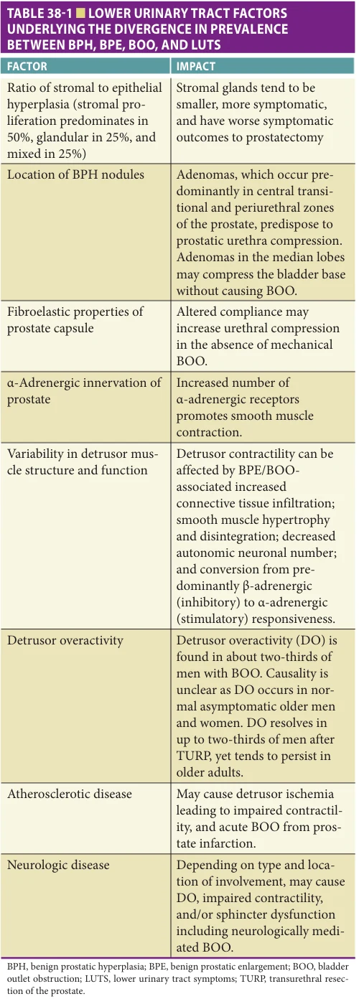

*Table 38-1, printed p. 558.*

**[p. 559]**

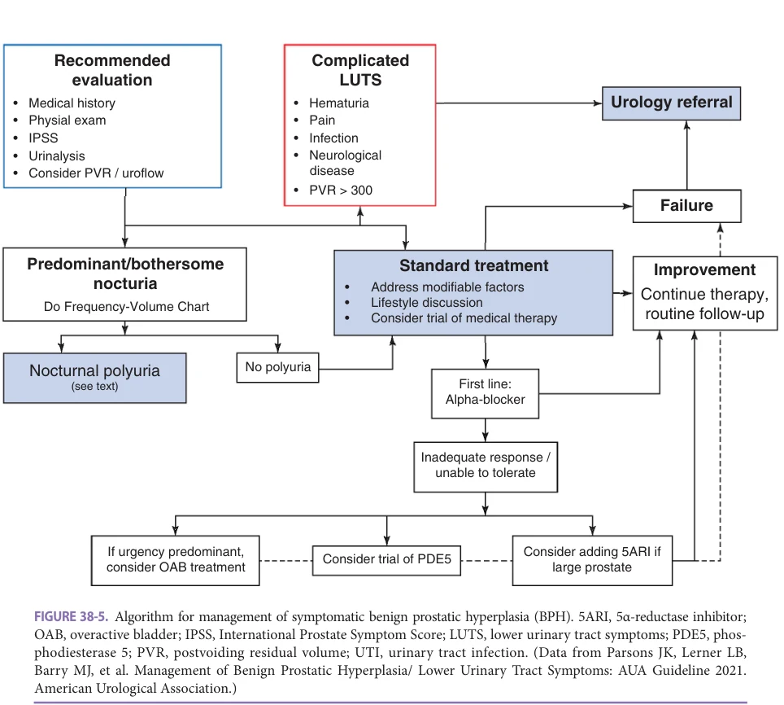

*Figure 38-5, printed p. 559.*

or physiologic measures. Older men always should be evaluated for causes of LUTS other than prostate disease. The history and review of systems should question patients about hematuria, dysuria, and pelvic pain (rare in benign prostate disease, more suggestive of infection, bladder stone, prostate or bladder cancers); episodes of urinary retention; cardiac symptoms (regarding possible congestive heart failure in patients with nocturia); bowel and sexual function; type and amount of fluid intake (in relationship to frequency and nocturia symptoms); and sleep disturbance. All medications (including nonprescription drugs) must be reviewed, with a focus on drugs that can decrease detrusor contractility (anticholinergics, calcium channel blockers), diuretics, drugs that can cause pedal edema and contribute to nocturia, and α-adrenergic agents.

Symptom Indices The International Prostate Symptom Score (IPSS) and American Urological Association Symptom Index (AUASI) are identical indices that quantify the severity of

BPH-associated LUTS on a scale 0 to 35; scores of 0 to 7 indicate mild symptoms, 8 to 19 moderate, and 20 to 35 severe (Table 38-2). An additional question, not tallied in the total score, assesses disease-specific quality-of-life impact. The IPSS is widely translated. A change in AUASI of ± 5 points has an 80% probability of indicating a true clinical change. The threshold for clinical change varies with symptoms severity (minimum perceptible difference is 2 points for AUASI < 20 and 6 points for AUASI ≥ 20). Any magnitude of change, however, may be caused by interval changes in comorbidity and medications and not prostate disease.

The Benign Prostatic Hyperplasia Impact Index (BII) measures the impact of BPH-associated LUTS on a scale 0 to 13 (Table 38-3). Results from randomized controlled treatment trials suggest that the minimal clinically perceptible difference for the BII is a mean decrease of 0.5 to 1.7 points. BII correlates well with the AUASI, but not with objective measures of BPHassociated LUTS severity (eg, urine flow rate or prostate size).

**[p. 560]**

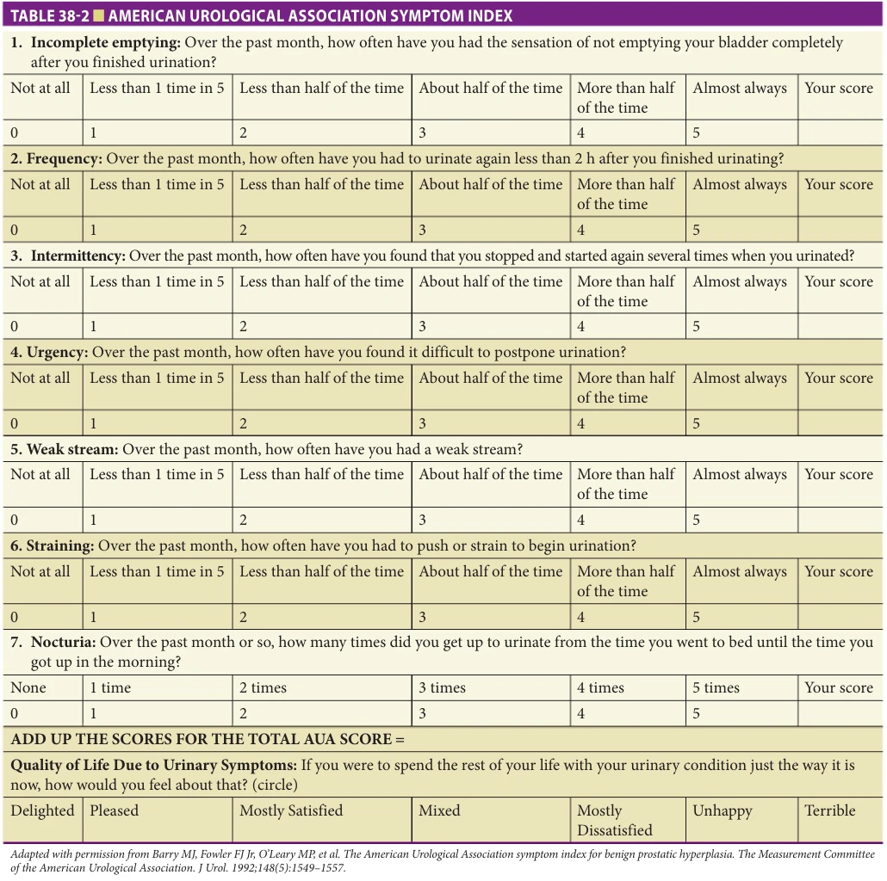

*Table 38-2, printed p. 560.*

## OTHER MEASURES OF LUTS AND QUALITY OF LIFE

There is a variety of other measures of LUTS and their impact. Some of the more widely used are the International Consultation on Incontinence Questionnaire (ICIQ) male module (ICIQ-MLUTS). To assess sexual function, the Derogatis Interview for Sexual Functioning Self-Report and the International Index of Erectile Function can be used. Depending on the patient’s symptoms, other potentially useful scales are the Incontinence Impact Questionnaire and ICIQ Urinary Incontinence Short Form, and UI-specific and general quality-of-life measures; for

example, ICIQ-LUTSqol, Urogenital Distress Inventory, Urge Impact Scale, and the SF-12.

The impact of LUTS on quality of life is critical to evaluate because it is the primary determinant of treatment. Quality-of-life impact may include interference with daily activities, work, sleep, and sexual function; worry, embarrassment, and impaired self-esteem; and physical discomfort. Patients’ perception of bother may be independent of LUTS severity, and bother from an individual symptom may be more important than from all symptoms. Determining a patient’s most bothersome symptom can help target evaluation and treatment; for example, nocturia is often extremely bothersome, yet

**[p. 561]**

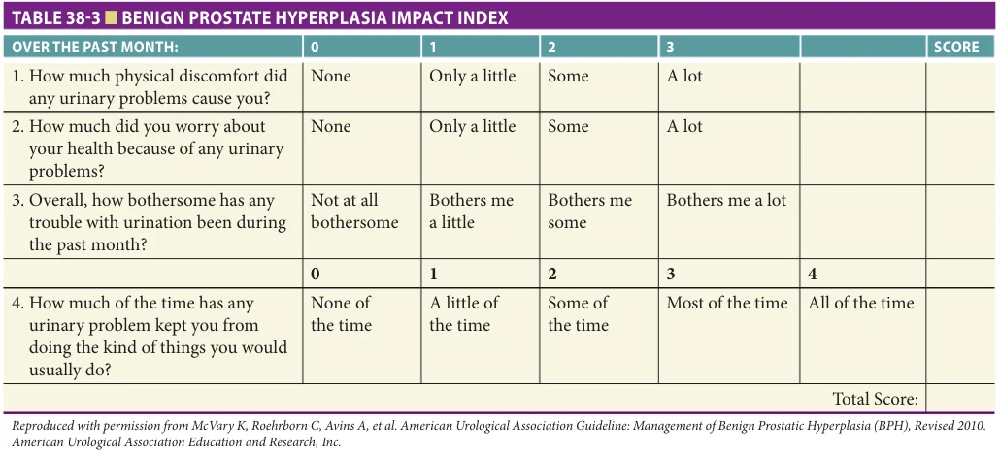

*Table 38-3, printed p. 561.*

many prostate-specific treatments are not very effective for it.

Nocturia Nocturia is defined as voiding at least once during the normal hours of sleep. Almost 80% of older men have nocturia, which is the most bothersome of all of the LUTS associated with benign prostate disease. Moreover, nocturia 2 or more times a night is associated with hypertension, cardiovascular disease, and increased mortality. The three main causes of nocturia are LUT pathophysiology, nocturnal polyuria, and sleep disturbance (Table 38-4). The latter two causes are especially important in older men because of the many age-related changes, comorbid conditions, and medications that can cause them.

Nocturnal polyuria is defined as the excretion of onethird or greater of the daily (24-hour) urine output during normal sleeping hours. Older persons are prone to nocturnal polyuria, possibly due to higher nocturnal atrial natriuretic peptide levels and/or altered secretion of vasopressin. Some older persons may excrete 50% or more of their 24-hour urine output during the night. For this reason, one episode of nocturia is considered normal in older persons and even the best treatment may not be able to completely eliminate nocturia. Another cause of nocturnal polyuria is peripheral edema; because edema fluid mobilizes when the patient reclines, leading to increased urine output. Sleep apnea is an underappreciated cause of nocturnal polyuria; apnea should be suspected when the patient or his partner report loud snoring, apneic periods, excessive daytime sleepiness, and morning headaches, and in men who are obese and/or have hypertension. Tools such as the Epworth Sleepiness Scale or STOP-BANG can help assess apnea risk. Importantly, treatment of apnea with continuous positive airway pressure (CPAP) reduces nocturia. (See Chapter 44 on sleep disorders.)

When aroused owing to primary sleep disorders, patients may sense their bladder volume (which tends to be higher at night) and get up and void, and report these episodes as “nocturia.” Common causes of sleep disturbance in older persons include age-related changes in sleep architecture (see Chapter 44), pain (eg, from arthritis), depression, restless leg syndrome, gastric reflux, pulmonary and cardiac diseases, dementia, Parkinson disease, and the effects of many medications (see Table 38-4).

Physical Examination Given the many medical causes of LUTS in older men, a complete physical examination is required and should include evaluation of cognition, function, and mobility. In men with impaired emptying without other evident cause, a neurologic examination should include the bulbocavernosus reflex, anal wink, and perineal sensation to assess sacral nerve integrity. Digital rectal examination (DRE) should be done to assess prostate nodularity, rectal tone, masses, and stool impaction. DRE is not accurate for assessing prostate volume, even when performed by specialists, because BPH adenomas can occur in the anterior and median lobes that are inaccessible to rectal palpation. Prostate volume is not associated with BOO, and is important only for decisions regarding surgical approach for prostatectomy. Although higher volume is associated with disease progression and response to 5α-reductase inhibitor treatment, it should not be routinely assessed for this purpose because accurate measurement requires ultrasound.

Laboratory Tests Only urinalysis is needed in routine assessment, primarily to check for microscopic hematuria. The decision of whether to do PSA testing in men with LUTS should follow the recommended guidelines for prostate cancer screening (see Chapter 90 on prostate cancer). Serum creatinine is not

**[p. 562]**

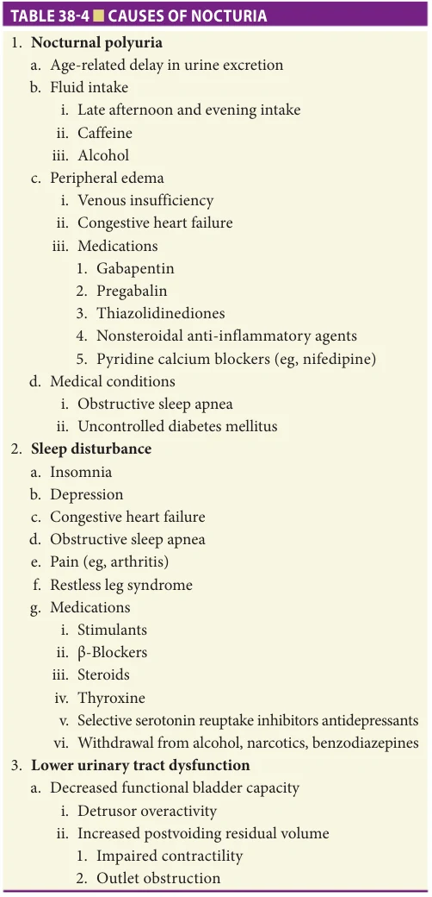

*Table 38-4, printed p. 562.*

required because of the extremely low prevalence of renal insufficiency in men with LUTS. Vitamin B12 level may be considered in men with a high PVR or urinary retention.

Postvoiding Residual and Urine Flow Rate PVR is not required in the initial evaluation, especially in men with mild-moderate LUTS who can be managed with watchful waiting or medical therapy. PVR is small in randomly selected community men (75th percentile, 35 mL). In a large trial of men with moderate LUTS, the baseline mean PVR was 110 ± 74 mL. PVR correlates modestly with prostate volume, but is not significantly associated with age, AUASI, quality-of-life indices, BOO, or the need for invasive therapy.

PVR should be considered in men with complex neurologic disease (eg, Parkinson disease, spinal cord injury), new impairment in renal function without other evident cause, medications that can decrease detrusor contractility (anticholinergics, opiates, calcium channel blockers), or who have failed empiric therapy. Inability to pass a urethral catheter for PVR measurement is more likely a result of sphincter spasm than BOO; this can be overcome using intraurethral lidocaine jelly and patient relaxation. Older men tend to have a larger PVR in the morning, which can increase within-patient PVR variability.

Urine peak flow rate measurement is commonly used in urologic practice. In the AUA BPH guideline, flow rate can be considered in the initial evaluation, and recommended in men who inadequately respond to medical therapy. Low urine flow rate is not specific for BOO, as it can also occur with impaired detrusor contractility (intrinsic or extrinsic [eg, from medications]) and/or a low bladder volume. A normal peak flow rate is very sensitive for BOO (peak flow > 12 mL/s with void ≥ 150 mL excludes BOO).

Frequency-Volume Charts (Bladder Diaries) Frequency-volume charts are very helpful to determine if polyuria contributes to frequency and/or nocturia symptoms (Table 38-5). To complete the diary, the patient records the time and volume of all voids (continent and incontinent). Several studies (albeit primarily in women) confirm that bladder diaries are reliable and valid, especially when done for 3 days.

## Specialized Testing

Urodynamic studies Urodynamic studies are not required in the initial evaluation of men with LUTS, especially in men with mild-moderate symptoms, The AUA guideline recommends urodynamics, along with PVR and frequency voiding charts, in men who have inadequate response to medical therapy. Urodynamics may also be considered in frail older men (especially those with Parkinson disease or spinal cord injury) who desire surgical treatment, in order to exclude conditions such as detrusor hyperactivity with impaired contractility. The urodynamic tests to evaluate LUTS are cystometry and pressure-flow study. Cystometry measures bladder pressure during filling to determine detrusor stability (vs overactivity), contractility, and compliance. The standard for diagnosing BOO is pressure-flow study, which simultaneously measures flow rate versus bladder pressure during voiding. A high bladder pressure combined with a low flow rate is indicative of BOO.

Other tests AUA guideline recommends cystoscopy in men who have inadequate response to medical therapy. Cystoscopy also is recommended for men with hematuria (especially those with risk factors for bladder carcinoma such as smoking), positive cytology, or pelvic pain. Cystoscopy should not be used to diagnose BOO. Renal ultrasound may be considered in men with new renal impairment, yet even

**[p. 563]**

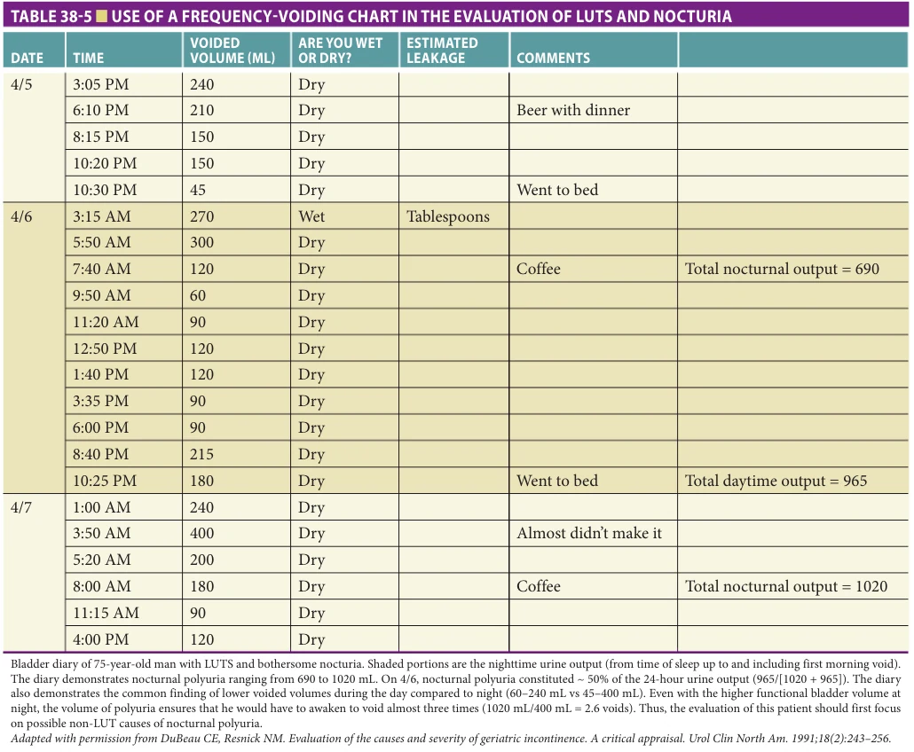

*Table 38-5, printed p. 563.*

in this group, hydronephrosis is usually only found in men who also have PVR greater than 150 mL.

## MANAGEMENT

Overview For the majority of men, treatment of benign prostate disease will focus on management of LUTS. Generally, fewer than 10% will need upfront surgical intervention for severe obstruction, urinary retention, or gross hematuria. This section focuses on stepped, evidence-based management of LUTS based on the AUA BPH guideline (see Figure 38-5 and Table 38-6), emphasizing shared decision making. The discussion assumes that contributory multimorbidity, medications, and impairments have been addressed and minimized to the extent possible.

Shared Decision Making Treatment decisions must be patient-centered because benign prostate disease has variable impact on patients and

only a small absolute risk of morbidity. No treatment prolongs life or guarantees durable cure, and watchful waiting and lifestyle changes provide relief with little risk for many men. Only the small minority of men with hematuria, significant renal impairment, hydronephrosis, recurrent UTIs, retention, and large PVR (eg, over 200 mL) require immediate referral to a urologist. Issues to discuss in making management decisions include symptom severity and quality-of-life impact, risk for disease progression, preferences for immediate versus delayed symptom improvement, likely treatment outcomes and adverse effects, short- and long-term costs, and ability to comply with long-term monitoring. Providers should offer guidance in tailoring treatment so that men are supported in—and not burdened by—decision making. There are video and print decision aids to help both patients and providers weigh treatment risks and benefits. Men with nocturia should be offered prostate-specific medical and invasive therapy only after treatment of any contributing polyuria and/or sleep disturbance.

**[p. 564]**

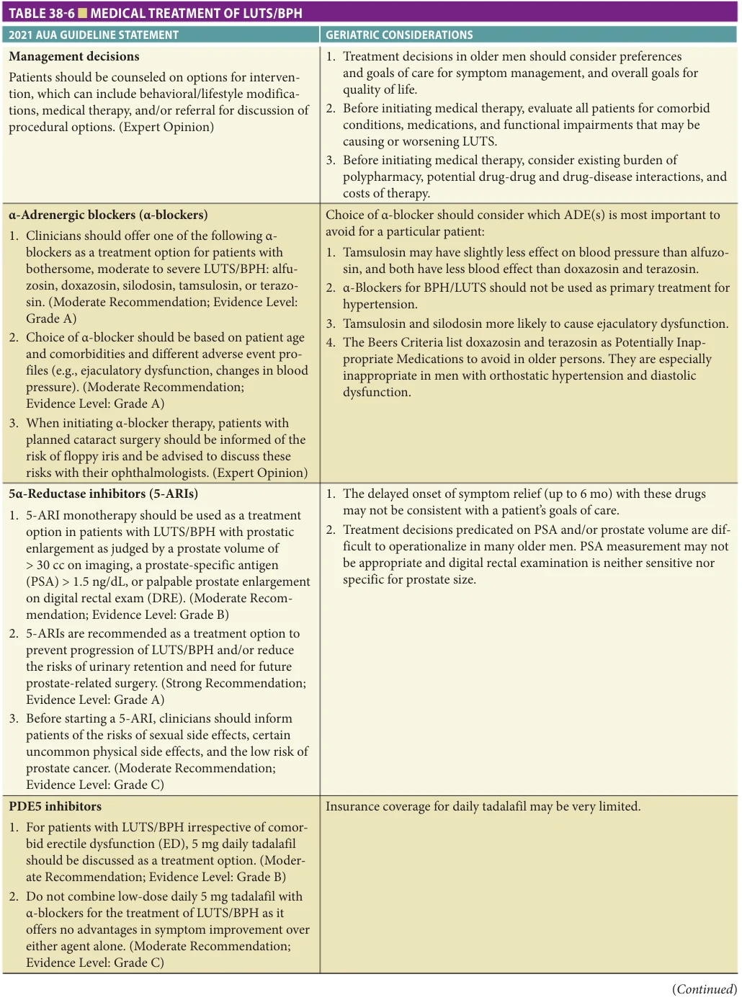

*Table 38-6, printed p. 564.*

**[p. 565]**

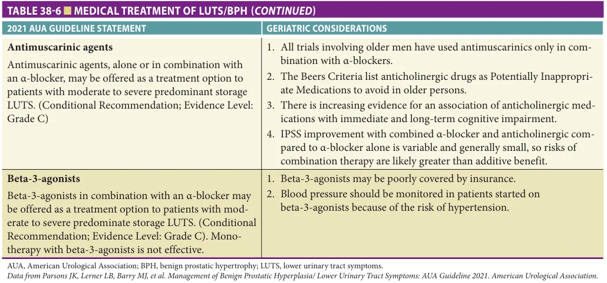

*Table 38-6 continued, printed p. 565.*

Multiple medical problems, frailty, and short life expectancy need not preclude treatment of benign prostate disease. The broad range of available therapies permits tailoring to the desired immediacy of symptom relief, avoidance of specific adverse effects, and patient comorbidity. Noninvasive treatment is possible in care settings where adequate clinical monitoring and medication adjustment are possible. Assisted-living residents and other vulnerable men may require skilled nursing facility care after surgical interventions in order to monitor PVR and provide physical therapy for improved mobility. Across settings, surgery may not be desirable for men at high risk for in-hospital functional and cognitive decline.

Treatment decisions include the efficacy, durability, and associated adverse effects of therapy. Table 38-6 summarizes 2021 AUA guideline statements on treatment along with associated geriatric considerations. Figure 38-5 shows the suggested treatment algorithm modified from the 2021 AUA guideline.

General Geriatric Medicine Considerations in BPH/LUTS Treatment Management of benign prostate disease and LUTS in older men should incorporate important principles central to the practice of geriatric medicine. These are as follows:

• Goals of care: Specific treatments may be effective for some, but not other individuals with LUTS, and have differing time to maximum effect. It is important to ask these questions: Which LUTS are the most bothersome or troubling to the patient and/or caregiver? How urgent is symptom relief? To what degree is the patient accepting of possible surgical treatment? How does the time course of treatment fit within the patient’s remaining life expectancy?

• Avoiding harms from treatment. Several medications used to treat LUTS are included in the Beers Criteria of potentially inappropriate medications in older persons (see Chapter 22, Medication Prescribing and De-Prescribing). These include antimuscarinics and α-blockers (in patients with falls and previous fractures). LUTS management frequently involves medications or treatments that can cause or worsen erectile dysfunction (ED). The likely harm from a specific treatment in a particular patient must be carefully considered. • Appropriate prescribing: These principles include starting at the lowest possible dose, and avoidance of drugdrug and drug-disease interactions. For example, all α-blockers can cause significant hypotension (especially in patients with hypertension), several interact with other drugs that induce or inhibit the P450 system, and doxazosin can exacerbate congestive heart failure. The half-lives of silodosin (34 hours) and tamsulosin (15 hours) may allow for off-label, less than daily dosing.

Indications for Urology Referral Absolute indications for prompt urologic referral and intervention are urinary retention (> 250–300 mL—acute or chronic), recurrent UTIs, bladder stones, and hematuria (gross and microscopic). Urology referral should also be considered for men with LUTS and prior bladder or prostate cancer, history of urethral stricture, complicated neurologic disease (Parkinson disease, spinal cord injury), and those who fail noninvasive treatment.

## Medical Therapy

Watchful waiting The natural history of benign prostate disease and LUTS and the large placebo effects seen in

**[p. 566]**

randomized controlled treatment trials support the use of watchful waiting as a specific intervention. Men most appropriate for watchful waiting have mild to moderate LUTS, are comfortable with this approach, and are amenable to regular follow-up. Clinicians should be “watchful” and not passive in monitoring these patients, with regular follow-up, and careful monitoring for men taking anticholinergics, opioids, or calcium channel blockers. Men should be counseled on general voiding hygiene and behavioral approaches to decrease LUTS (see Chapter 47 on incontinence), counseling to avoid medications that can cause retention (eg, over-the-counter “cold” tablets containing α-agonists and antihistamines), and instructions on the signs of symptoms of retention.

Self-management techniques can be effective. One such program, comprising education and reassurance, lifestyle modifications, and behavioral interventions (ie, adjustment in fluid intake), resulted in 30% to 50% less need for medication or surgery than standard care. In the largest randomized trial of watchful waiting versus transurethral resection of the prostate (TURP) (n = 556 men with moderate LUTS), TURP had significantly greater symptom improvement at 3 years, yet the watchful waiting results were not trivial (mean decrease in symptom score 66% and 38%, respectively). One-third of men on watchful waiting crossed over to TURP, but absolute failure rates with watchful waiting were low (urinary retention 2.9%, PVR > 350 mL 5.8%, worsening LUTS 4.3%). There were no significant differences in sexual function, general well-being, or social activities. The improvement in LUTS was less in men with the least symptom bother, especially after TURP. In the Medical Therapy of Prostatic Symptoms (MTOPS) trial, only 17% of men in the placebo (watchful waiting) arm had “clinical progression” at 4 years, of which 80% had progression solely by clinically significant increase in AUASI of 80% of greater than or equal to four points.

Medications (Table 38-7)

α-Adrenergic Blockers α-Adrenergic blockers are the mainstay of medical treatment for BPH-related LUTS. A recent network meta-analysis found α-blockers more effective than all other medications for BPH-related LUTS. They work by several mechanisms: decreased contractility of prostatic tissue, capsule, and urethra; increased apoptosis caused by higher levels of tumor growth factor-β; and improved vascular flow to the detrusor. The nonselective agents—terazosin and doxazosin—target α1B and α1D receptors, which are also found outside the LUT and can lead to adverse effects, especially cardiac. There are scant data on prazosin for treatment of BPH-associated LUTS. Selective agents target the α1A receptors that are specific to the prostate, and include tamsulosin (0.4–0.8 mg daily), alfuzosin (10 mg daily), and silodosin (8 mg daily [4 mg with renal impairment]).

Time to onset of action for all α-blockers is 2 to 4 weeks. Randomized controlled trials (RCTs) show no significant differences in LUTS reduction between these

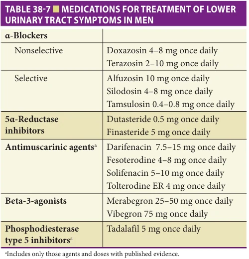

*Table 38-7, printed p. 566.*

agents. Efficacy is greater in men with more severe LUTS, and appears durable, although most long-term data are from open-label trials. α-Blockers do not prevent urinary retention and are not very effective in reducing nocturia.

For all of these agents, withdrawal rates in published trials are 10% to 15%, and may be higher in clinical practice. All can cause asthenia, headache, dizziness, and hypotension, but dizziness and hypotension are less marked with the selective α1A agents, making them preferred for use in older men. Slow titration from minimal starting doses and nighttime dosing help mitigate first-dose hypotension. Alfuzosin is taken within an hour of a meal to maximize bioavailability. Although seemingly parsimonious, α-blockers should be avoided as first-line antihypertensive agents in men with LUTS and hypertension.

Tamsulosin is associated with retrograde ejaculation and a high risk of floppy iris syndrome during cataract surgery. To prevent the latter complication, special surgical approaches are necessary and men taking tamsulosin should alert their ophthalmologist. The impact of stopping tamsulosin preoperatively is unclear, as some cases occurred months after discontinuation. Concomitant use of phosphodiesterase type 5 (PDE-5) inhibitors for ED can cause potentially dangerous hypotension with all α-blockers, although possibly less likely with tamsulosin.

5α-Reductase Inhibitors The 5αRIs finasteride and dutasteride decrease prostate size by blocking the 5α reduction of testosterone to dihydrotestosterone, the active androgen for prostate growth. 5αRIs decrease prostate volume over 6 months by a maximum of 30%. They have a slow onset of action, and improvement in LUTS may take 6 to 10 months; they will not help men who want rapid symptom improvement or have a short life expectancy. Lifetime use is

**[p. 567]**

necessary to prevent recurrent BPE and LUTS, raising the potential for higher lifetime treatment costs. In one study, finasteride was more cost-effective for men with moderate LUTS than watchful waiting (up to 3 years) and TURP (up to 14 years), but cost-effectiveness decreased over time. Unlike α-blockers, 5αRIs are considered “disease modifying” because they decrease the risk of BPE-related complications (ie, worsening symptoms, AUR, need for surgery), as first demonstrated in the PLESS trial (Proscar Long-term Efficacy and Safety Study) in men with moderate to severe LUTS and BPE. Finasteride decreased the incidence of AUR (absolute risk reduction [ARR] 5% [95% CI 10%–5%], number needed to treat [NNT] 26–49) and prostatectomy (ARR 4% [95% CI 7%–3%], NNT 18–31). Risk reduction was apparent by 1 year and was greatest in men with large glands (prostate volume > 58 mL and/or PSA ≥ 1.4 ng/mL). Similar results were seen with dutasteride in the Reduction by Dutasteride of Prostate Cancer Events (REDUCE) trial. At baseline, men had prostate size greater than 40 mL and AUASI less than 8. At 4 years, clinical progression occurred in 21% in men taking dutasteride versus 36% in men on placebo (NNT 7). Sexual dysfunction with finasteride was 8% greater than placebo (absolute difference).

Although 5αRIs maintain or even increase serum testosterone levels, they can cause adverse sexual effects including decreased libido (6%) and impotence (8%). There is conflicting data from cohort studies whether 5αRIs increase the risk of depression, primarily due to differences in pharmaco-epidemiology methods. Data from the prospective Prostate Cancer Prevention Trial did find evidence of a possible association. A sub-analysis of the PLESS trial and subsequent case-control and population-based studies found no association of finasteride or dutasteride with osteoporosis or hip fracture.

The relationship between 5αRIs and prostate cancer is complex. 5αRIs decrease PSA levels by 40% to 60% in the first year. PSA should be monitored and biopsy done if PSA remains stable or rises only in older men for whom prostate cancer screening is appropriate (which should be uncommon). Long-term use of 5αRIs may increase the risk of high-grade prostate cancer. In the initial report from the Prostate Cancer Prevention Trial (PCPT), finasteride lowered prostate cancer rates (18% vs 24% with placebo), but there was a statistically significant increase in high-grade cancer in the finasteride group (6.4% vs 5.1%). Results were very similar in the subsequent REDUCE trial with dutasteride: overall prostate cancer rates were lower with the 5αRI (23% relative reduction, absolute reduction 5%), but there were significantly more high-grade tumors. However, a higher rate of high-grade tumors was still present but no longer statistically significant in the 2013 PCPT analysis with an extra year of data. Furthermore, at 10-year analyses, there were no differences in overall or prostate cancer–specific mortality. However, the Food and Drug Administration (FDA) maintains a black box warning of risk of high-grade prostate cancer with these drugs.

Phosphodiesterase Type 5 Inhibitors Randomized trials demonstrate statistically significant but modest decreases in AUASI with daily doses of PDE-5 inhibitors used for ED. Trials have included tadalafil 5 mg daily, vardenafil 10 mg daily (only studied in men < 65 years), and sildenafil 25 mg daily, but only daily tadalafil is FDA-approved for treatment of male LUTS.

PDE-5 inhibitors may decrease BPH-associated LUTS by regulation of smooth muscle tone and tissue oxygenation. However, there is ongoing controversy about whether the observed efficacy of PDE-5 inhibitors for LUTS is a direct effect or secondary to subjects being “unblinded” to their randomization to drug by improvement in ED symptoms. A review of four randomized trials found no significant interaction of baseline ED severity and improvement in IPSS, and similarly no significant interaction between baseline IPSS severity and ED outcomes.

Combination Therapy

a-Adrenergic blockers and bladder relaxants. The most bothersome LUTS are typically urgency, frequency, and nocturia, which are less responsive to drug therapy than other LUTS. This led to interest in using antimuscarinic agents and the beta3 agonist mirabegron to treat male LUTS. The vast majority of trials studied these drugs in combination with α-blockers, due to concern about incomplete emptying and retention with monotherapy. In addition, most only included men with PVR less than 200 mL, and had a relatively short follow-up (12 weeks, maximum in one study for 4 months). The additive benefit from antimuscarinics or mirabegron is clinically modest at best, and mostly for reducing frequency but not urgency, nocturia, or incontinence. This modest benefit must be weighed against the risks of antimuscarinics and the potential blood pressure effects of mirabegron, as well as added cost. Because of their different mechanisms of action, combination treatment with α-blockers and 5αRIs has the potential for additive benefit. The pivotal Medical Therapy of Prostate Symptoms (MTOPS) study randomized nearly 3000 men with moderate LUTS to placebo, doxazosin, finasteride, or both drugs with a mean follow-up of 4.5 years. The primary outcome was “clinical progression,” not LUTS reduction. At 1 year, only doxazosin (alone or in combination) was significantly more effective than placebo, but at 5 years, finasteride was more effective than doxazosin, and combination therapy more effective than either finasteride or doxazosin alone (albeit with high withdrawal rates and adverse effects). Men with baseline prostate volume greater than 40 mL and/or PSA greater than 4 ng/mL benefited the most from combination therapy. Disease progression was associated with rising PSA and prostate volume during the trial in men on placebo or doxazosin, but not finasteride or combination therapy. The Symptom Management After Reducing Therapy (SMART) trial evaluated whether the efficacy of short-term combination therapy is maintained with a 5αRI alone. After 24 weeks of dutasteride ± tamsulosin, stopping

**[p. 568]**

tamsulosin caused increased symptoms only for men with severe baseline LUTS. The CombAT trial (Combination of Advodart and Tamsulosin) randomized men with symptomatic LUTS to tamsulosin 0.4 mg, dutasteride 0.5 mg daily, or both. At 4 years, AUR or surgery occurred in 4.2% on combination therapy, versus 5.2% with dutasteride and 12% with tamsulosin. Symptom progression was less likely with combination (13%) than dutasteride (18%) or tamsulosin (22%).

a-Adrenergic blockers and PDE-5 inhibitors. There is no clear benefit from adding PDE-5Is to α-blockers. A meta-analysis including 11 RCTs and a total of 855 patients found statistically but not clinically significant decrease in IPSS (pooled mean difference −1.66, 95% CI −3.03 to −0.29; minimum clinically significant difference is 3 or more). Tadalafil is approved as a single agent for treating LUTS and ED.

Phytotherapy Saw palmetto, β-sitosterols, and cernilton are some of the plant-derived compounds used to treat BPHrelated LUTS, especially outside of the United States. Most phytotherapy trials suffer from short-term treatment (typically 4–24 weeks) and lack of standardized preparations. Although a Cochrane systematic review concluded that saw palmetto significantly improved LUTS and decreased nocturia, a subsequent RCT found no difference from placebo in men with moderate to severe LUTS. Cochrane meta-analyses also found that β-sitosterols and cernilton statistically significantly reduce LUTS, but the source trials were heterogeneous and small. Phytotherapeutic agents have few reported side effects in the data that exist, yet more rigorous and long-term data are lacking.

Emerging drug therapies Drugs under investigation for LUTS treatment include α1D antagonists and agents targeting novel therapeutic pathways (vitamin D3 and calcitriol analogs; agonists/antagonists of endogenous peptides; intraprostatic botulinum toxin; intraprostatic fexapotide triflutate [which targets caspase, tumor necrosis factor and beta lymphoma pathways causing prostate epithelial involution]; and the gonadotropin-releasing hormone antagonist cetrorelix).

Surgery The role for surgical management of benign prostate disease is well established with Level 1 evidence of robust and durable symptom improvement. Surgery should be considered for patients with moderate to severe symptoms (AUASI > 8) who have failed appropriate medical management or wish to avoid daily medications. More stringent indications exist for conditions where medical therapy is often inappropriate such as patients with renal insufficiency due to BOO, bladder stones, gross hematuria related to BPH, recurrent urinary retention, or UTI.

For the past century, surgical treatment has involved removing obstructing adenomatous tissue from primarily the transition zone of the prostate with either a transurethral (TURP) or open surgical approach (simple prostatectomy). These procedures differ from a radical prostatectomy, preformed for prostate cancer, in that prostatic tissue and capsular structure are left in place obviating the need for an

anastomosis between the bladder neck and urethra that is required when the entire gland is removed. The TURP has classically been performed utilizing a monopolar resectoscope, an instrument inserted into the urethra with a lens for visualization and an electrified wire loop to remove obstructing adenoma surrounding the urethra. Irrigation with a nonconductive fluid such as glycine or water is needed with monopolar TURP and prolonged operative time increases the risk for transurethral resection syndrome (dilutional hyponatremia and hypervolemia). Due to this risk, open surgical approaches (retropubic, suprapubic, perineal) are used to treat larger prostates. Both open simple prostatectomy and TURP require regional or general anesthesia, variable length of hospital admission, and have known complications such as blood loss requiring transfusion, urethral stricture, bladder neck contracture, stress urinary incontinence, ED, and retrograde ejaculation. More recently alternatives to classic monopolar TURP and open simple prostatectomy have been developed to mitigate need for general anesthesia, hospital admission, discontinuation of anticoagulation therapy, or open surgery, and surgical candidacy has been expanded to older and more comorbid individuals.

Transurethral Resection of Prostate TURP remains the gold standard for surgical treatment of LUTS attributed to BPH. TURP is highly effective, resulting in up to 90% decrease in LUTS and 10-point decrease in AUASI. Symptom decrease may be less in older men (< 80% decrease in symptoms). TURP is superior to watchful waiting in preventing worsening LUTS, elevated PVR, and AUR over 5 years (10% vs 21%, NNT 9). Urodynamic evaluation may be helpful in identifying men most likely to have the best symptomatic outcomes (BOO present without detrusor overactivity or underactivity). Efficacy declines over time, from 87% decrease in LUTS at 3 months to 75% at 7 years, and reoperation rates average 1% to 2% per year.

There are two types of TURP, the original monopolar resection (M-TURP) and the newer bipolar resection (B-TURP); the difference is that the electrical generator of B-TURP allows for isotonic irrigation fluid, eliminating the risk of TURP syndrome. A 2019 Cochrane systematic review, including more than 50 RCTs with overall moderate quality of evidence, suggests that 1-year (and likely longer) symptomatic and objective outcomes from M-TURP and B-TURP are similar, but B-TURP has less post-TURP syndrome, decreased need for postoperative blood transfusion, and reduced overall adverse events. In practice, B-TURP has become the new standard modality.

Perioperative complications of TURP have declined over time. Adverse effects of TURP include retrograde ejaculation (74%); immediate surgical complications (12%); UI (1%); bleeding requiring transfusion (3%); postoperative urinary retention (7%); and UTI (6%). There are conflicting data on erectile function after TURP with some studies finding improved function while others have rates of ED as

**[p. 569]**

high as 14 %. One study found no difference in ED and UI rates between TURP and watchful waiting and the percentage of men who were sexually active was unchanged before and after TURP. Men older than age 80 have higher rates of complications (early 30%–40%, late 13%–22%), reoperation (4% per year), and perioperative mortality (2%–3% vs 0.4%), but no change in long-term survival. Older men may be at higher risk of postoperative myocardial infarction, although the level of evidence is weak. Many of the studies in older men, however, did not adjust for increased comorbidity, and there is some evidence that higher Charlson scores are associated with increased morbidity post-TURP. There is significant risk associated with TURP in the anticoagulated patient with increased risk of hemorrhage needing transfusion, bladder clots, and thromboembolic events. Laser-based prostate procedures are generally preferable in patients who are unable to discontinue anticoagulation.

Laser Prostatectomy Laser technology is an increasingly used alternative to TURP. The main laser systems currently used are holmium or thulium lasers for enucleation of the prostate (HoLEP, ThuLEP) and the GreenLight laser for photovaporization of the prostate (PVP). Lasers are able to provide rapid vaporization and coagulation of prostatic tissue with minimal tissue depth penetration, providing better coagulative properties than either monopolar or bipolar TURP.

Laser enucleation of the prostate consists of transurethral en-bloc excision of the transitional zone of the prostate gland using a combination of mechanical dissection with a rigid cystoscope and laser energy to enucleate the prostatic adenoma and move it to the bladder where it is morcellated. This procedure has a significant learning curve and is disproportionally utilized by urologists who have exposure in fellowship training. It provided similar outcomes when compared to TURP as measured by IPSS (AUASI) and IPSS-Qol outcomes and lower likelihood for either peri- or postoperative blood transfusions. Laser enucleation is likely a more durable treatment as well. Laser enucleation can be completed on any sized prostate gland but is frequently utilized as an endoscopic option for the treatment of large prostate glands (> 80 mL) and provides similar outcomes to open prostatectomy for men with AUR with significant BPE.

GreenLight laser photovaporization of the prostate (PVP) utilizes a 532-nm wavelength laser that is preferentially absorbed by hemoglobin and provides targeted tissue vaporization and coagulation. The PVP, like a TURP, utilizes a cystoscope and gradual removal of prostatic adenoma starting from the lumen of the prostatic urethra and moving out to the surgical capsule of the prostate. Unlike TURP and laser enucleation procedures, there is no tissue for pathologic examination at the completion of PVP because all tissue is vaporized by laser energy. In a multicenter, industry-sponsored RCT in 269 patients, PVP was noninferior to TURP with 24 month follow-up data, including similar adverse events related to UI and overall need for reoperation. PVP patients had shorter catheterization times

and shorter hospital stay. A single center study comparing M-TURP, B-TURP, and 120W PVP through 36 months found similar change in IPSS and IPSS-QOL between PVP and the TURP cohorts. Per AUA guidelines, PVP should be considered for patients at higher risk for bleeding (eg, treated with heparin, warfarin, clopidogrel, or direct oral anticoagulant drugs) due to lower transfusion rates compared to TURP and good safety outcomes reported in this population.

Side effects of laser enucleation vary by technique, and can include impotence, retrograde ejaculation, increased urgency and frequency, UI, and bladder neck stricture.

Simple Prostatectomy Men with large prostate volume (> 60 mL) have traditionally required open prostatectomy (via an abdominal or perineal approach) because the operative time needed for TURP significantly increases perioperative complications. With the introduction of B-TURP, laser enucleation, laparoscopic, and roboticassisted surgeries, open procedures have become less common and account for less than 5% of prostatectomies for benign indications, and some surgeons prefer to perform an “incomplete” TURP to avoid the morbidity of abdominal or perineal surgery. In the case of very large prostate glands, simple prostatectomy (open, laparoscopic, or robot-assisted) continues to be a reasonable option. In retrospective studies, open prostatectomy has lower reoperation rate and mortality than TURP, but these analyses did not adequately control for the higher age and comorbidity in TURP patients or the secular trend of decreasing TURP mortality. A more recent RCT evaluated laparoscopic simple prostatectomy compared to B-TURP and found similar risk of blood transfusions, need for reoperation, UI, and similar change in IPSS through 36 months,

Minimally Invasive Procedures

Prostatic urethral lift. The prostatic urethral lift (PUL) alters prostate anatomy without removing tissue by utilizing transprostatic suture implants delivered through a cystoscope. The implants consist of two T-shaped bars attached to a length of suture that are deployed through the prostate with one bar located outside the prostate capsule and the other within the prostatic urethral lumen. The tension across the implant helps widen the prostatic urethra. A single RCT compared the PUL to TURP and found 73% of patients with PUL reported 30% or greater reduction in IPSS at 1 year compared to 91% who had TURP. At 2 years patients with TURP had an average 6 point greater reduction in IPSS and significantly better Qmax than those with PUL. PUL was found to have less likelihood of altering sexual function than TURP with no evidence of altered ejaculatory or erectile dysfunction, and ejaculatory bother improved by 40% at 1 year while intensity of ejaculation and amount of ejaculate improved by 23% and 22%, respectively. Another study compared PUL to sham and found modest improvements in IPSS (mean decrease −5.2; CI: -7.45, -2.95) at short-term follow-up and with both sham

**[p. 570]**

and PUL remaining significantly improved at 5 years. Rates of serious and non-serious harm are similar between TURP and PUL and reoperation rates at 2 years are similar. Longterm data are limited but this procedure has gained popularity over the past decade partly due to the ability to complete it in an office setting without the use of general anesthesia.

Prostate incision. Transurethral incision of the prostate (TUIP) is a technically simpler procedure used in men with small glands (< 30 mL). TUIP is done under local anesthesia with shorter operation time and less bleeding than TURP. TUIP has similar symptomatic efficacy to TURP at 1 year. In a select case series, at 2 years only 8% of TUIP patients had required a subsequent TURP. TUIP has the potential to be a safe and effective alternative for obstructed older men with smaller prostates who have high operative risk and have failed noninvasive treatment.

Transurethral needle ablation (TUNA) employs transurethrally placed radiofrequency needles to heat prostate tissue, causing coagulation necrosis and a tissue defect. Symptomatic efficacy is lower and less durable than with TURP, and no studies compare TUNA to other procedures, medical therapy, or watchful waiting. Transurethral microwave thermotherapy is a related outpatient procedure that requires repeated treatments. Symptomatic improvement

## FURTHER READING

Alexander CE, Scullion MMF, Omar MI, et al. Bipolar ver-

sus monopolar transurethral resection of the prostate for lower urinary tract symptoms secondary to benign prostatic obstruction. Cochrane Database Syst Rev. 2019;12(12):CD009629. American Urological Association (AUA) guidelines on

the management of benign prostatic hyperplasia. https://www.auanet.org/guidelines/guidelines/benignprostatic-hyperplasia-(bph)-guideline. Accessed August 29, 2021. Bachmann A, Tubaro A, Barber N, et al. A European mul-

ticenter randomized noninferiority trial comparing 180 W GreenLight XPS laser vaporization and transurethral resection of the prostate for the treatment of benign prostatic obstruction: 12-month results of the GOLIATH study. J Urol. 2015;193(2):570–578. Barry MJ, Link CL, McNaughton-Collins MF, McKinlay

JB. Boston Area Community Health (BACH) Investigators. Overlap of different urological symptom complexes in a racially and ethnically diverse, community-based population of men and women. BJU Int. 2008;101:45–51. Biester K, Skipka G, Jahn R, Buchberger B, Rohde V,

Lange S. Systematic review of surgical treatments for

is typically modest, and in short-term trials is inferior to TURP, sham procedures, and terazosin. The future of these procedures is uncertain.

Urethral stents to facilitate voiding should be reserved for high-risk patients with recurrent AUR who are unfit for surgery or for whom long-term indwelling catheterization is undesirable. Permanent absorbable stents are complicated by encrustation, pain, and infection, and failure rates range from 20% to 30%. Nonabsorbable temporary stents are complicated by migration, UTI, stricture, and encrustation. Due to lack of efficacy, thermotherapy and urethral stents are no longer recommended to treat BPH-related LUTS.

## PREVENTION

Data on risk and protective factors suggest that increased physical activity, a diet low in meat and fat and high in vegetables and micronutrients, and moderate alcohol consumption may prevent or slow the progression of benign prostate disease. Weight loss for obese men, glycemic control in diabetes, and treatment of high cholesterol also may be important. However, there are no intervention trials to support these suggestions.

benign prostatic hyperplasia and presentation of an approach to investigate therapeutic equivalence (noninferiority). BJU Int. 2012;109(5):722–730. Crawford EF, Wilson SS, McConnell JD, et al. Baseline fac-

tors as predictors of clinical progression of benign prostatic hyperplasia in men treated with placebo. J Urol. 2006;175:1422–1427. Füllhase C, Chapple C, Cornu J-N, et al. Systematic review

of combination drug therapy for non-neurogenic male lower urinary tract symptoms. Eur Urol. 2013;64: 228–243. Hollingsworth JM, Wilt TJ. Lower urinary tract symptoms

in men. BMJ. 2014;349:g4474. Kaplan SA, Herschorn S, McVary KT, et al. Efficacy and

safety of mirabegron versus placebo add-on therapy in men with overactive bladder symptoms receiving tamsulosin for underlying benign prostatic hyperplasia: a randomized, phase 4 study (PLUS). J Urol. 2020;203(6)1163–1171. Knapp GL, Chalasani V, Woo HH. Perioperative adverse

events in patients on continued anticoagulation undergoing photoselective vaporisation of the prostate with the 180-W Greenlight lithium triborate laser. BJU Int. 2017;119(Suppl 5):33–38.

**[p. 571]**

Kumar N, Vasudeva P, Kumar A, Singh H. Prospective

randomized comparison of monopolar TURP, bipolar TURP and photoselective vaporization of the prostate in patients with benign prostatic obstruction: 36 months outcome. Low Urin Tract Symptoms. 2018;10(1):17–20. Kupelian V, Wei JT, O’Leary MP, et al. Prevalence of lower

urinary tract symptoms and effect on quality of life in a racially and ethnically diverse random sample: the Boston Area Community Health (BACH) Survey. Arch Intern Med. 2006;166(21):2381–2387. Lerner LB, McVary, KT, Barry MJ, et al. Management of

lower urinary tract symptoms attributed to benign prostatic hyperplasia: AUA Guideline part I, initial work-up and medical management. J Urol. 2021;206(4):806–817. Lerner LB, McVary, KT, Barry MJ et al. Management of

lower urinary tract symptoms attributed to benign prostatic hyperplasia: AUA Guideline part II, surgical evaluation and treatment. J Urol. 2021;206(4):818–826. Lerner LB, McVary, KT, Barry MJ et al. Management of

lower urinary tract symptoms attributed to benign prostatic hyperplasia: AUA Guideline part I, initial work-up and medical management. J Urol. 2021;206:806. Platz EA, Joshu CE, Mondul AM, Peskoe SB, Willett WC,

Giovannucci E. Incidence and progression of lower urinary tract symptoms in a large prospective cohort of US men. J Urol. 2012;188(2):496–501. Sarma AV, Wei JT. Clinical practice. Benign prostatic

hyperplasia and lower urinary tract symptoms. N Engl J Med. 2012;367:248–257. Saigal CS. Quality indicators for benign prostatic hyperplasia

in vulnerable elders. J Am Geriatr Soc. 2007;55(suppl 2): S253–S257.

Toren P, Margel D, Kulkarni G, Finelli A, Zlotta A,

Fleshner N. Effect of dutasteride on clinical progression of benign prostatic hyperplasia in asymptomatic men with enlarged prostate: a post hoc analysis of the REDUCE study. BMJ. 2013;346:f2109. Ückert S, Kedia GT, Tsikas D, Simon A, Bannowsky A,

Kuczyk MA. Emerging drugs to target lower urinary tract symptomatology (LUTS)/benign prostatic hyperplasia (BPH): focus on the prostate. World J Urol. 2020;38(6):1423–1435. Unger JM, Till C, Thompson IM Jr, et al. Long-term

consequences of finasteride vs placebo in the Prostate Cancer Prevention Trial. J Natl Cancer Inst. 2016;108(12):djw168. Walton A. Managing overactive bladder symptoms in

a palliative care setting. J Palliat Med. 2014;17(1): 118–121. Weiss JP, Blaivas, JG, Blanker MH, et al. The New England

Research Institutes, Inc. (NERI) Nocturia Advisory Conference 2012: focus on outcomes of therapy. BJU Intl. 2013;111(5):700–716. Xie JB, Tan YA, Wang FL, et al. Extraperitoneal lap-

aroscopic adenomectomy (Madigan) versus bipolar transurethral resection of the prostate for benign prostatic hyperplasia greater than 80 ml: complications and functional outcomes after 3-year follow-up. J Endourol. 2014;28(3):353–359. Zhang J, Li X, Yang B, et al. Alpha-blockers with or with-

out phosphodiesterase type 5 inhibitor for treatment of lower urinary tract symptoms secondary to benign prostatic hyperplasia: a systematic review and meta-analysis. World J Urol. 2019;37:143–153.

**[p. 572]**
