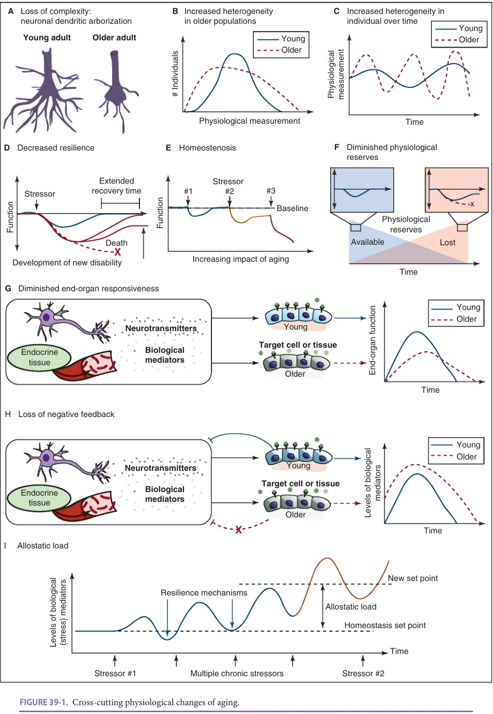
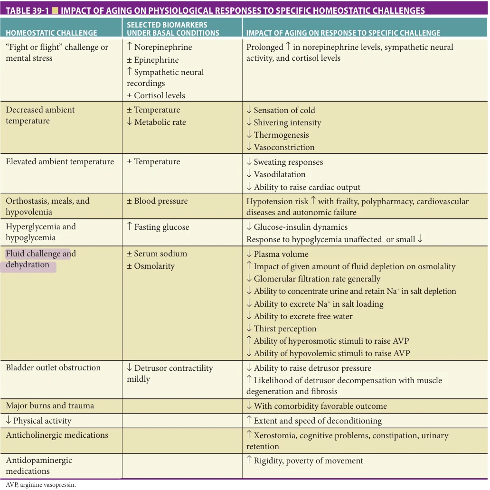
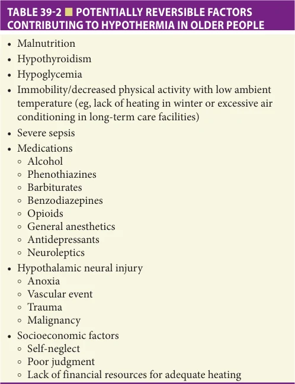
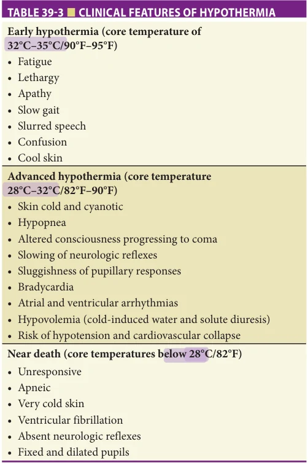
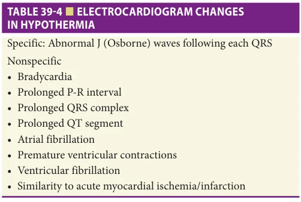
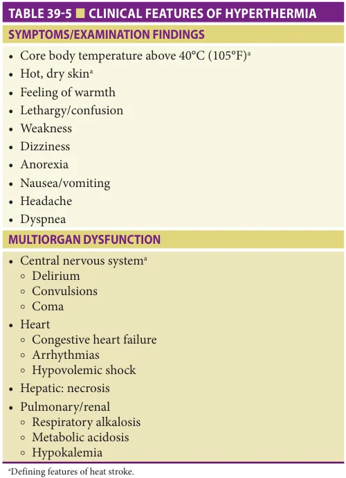
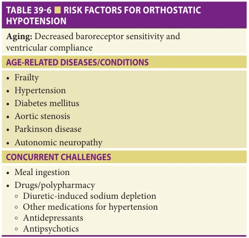
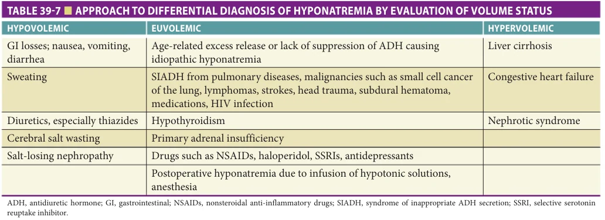

# Hazzard's Geriatric Medicine and Gerontology, 8e - Chapter 39: Systems Physiology of Aging and Selected Disorders of Homeostasis

George A. Kuchel

> **Status.** Fast build from the book; not lane-reviewed.

> **Source and method.** Printed pages 575-592, from the marked 8th-edition copy (PDF page = printed page + 34). Prose follows its text layer; tables and figures are source-page crops. The book is canonical.

**[p. 575]**

“Besides more or less obvious physical changes in old age, physiological investigation may reveal increasing limitation of the effectiveness of homeostatic devices which keep the bodily conditions stable.”

Walter Bradford Cannon (1871–1945)

## OVERVIEW

All organ systems undergo physiological changes with aging. However, the rate and nature of such changes varies both among organ systems and across individuals. This book includes individual chapters that address physiological changes associated with aging within the context of specific organ systems or tissues (see Part V: Organ Systems and Diseases).

Nevertheless, approaches to the older patient, which do not consider the entire person and ignore considerations cutting across different organ systems or disciplinary perspectives often fail to produce clinically meaningful improvements in the health of older adults, especially in the context of multiple morbidity (see Chapter 41). This chapter discusses physiology of aging using an integrative systems-based approach designed to address these issues via several complementary perspectives. First, in order to fully understand aging it is essential to consider cross-cutting physiological patterns that are observed with aging across different organ systems. Second, efforts to improve the health and function of frail older adults with common geriatric syndromes and multiple morbidities require an understanding and appreciation of the impact of physiological changes in the context of these additional complexities. Finally, the full impact of aging on physiological responses can only be understood when considering the ability of older adults to respond to common stressors experienced in life ranging from changes in ambient temperature to fluctuations in fluid balance to ability to maintain an adequate blood pressure and brain perfusion when standing up, among many others. Given the importance of temperature and fluid/salt balance regulation, physiological principles and clinical approaches to these problems are discussed in additional detail in this chapter.

#### Learning Objectives

- Describe general features of physiological aging shared across tissues and organ systems including loss of complexity, increased heterogeneity, loss of resilience, homeostenosis, diminished physiological reserves, diminished end-organ responsiveness, loss of negative feedback, and allostatic load.

- Understand the concepts of homeostasis and homeostenosis.

- Describe the impact of aging on homeostatic mechanisms which help maintain a normal physiologic body temperature and fluid/salt balance in the face of lowered or increased ambient temperature, as well depletion or overload of fluids and sodium.

- Describe the clinical features—including epidemiology, symptoms, signs, results of diagnostic tests and treatment— of hypothermia, hyperthermia, and water and sodium excess or depletion.

- Describe the impact of aging on the ability to maintain a normal blood pressure in the face of orthostasis, meal ingestion, hypovolemia, and volume overload.

#### Key Clinical Points

1. In addition to tissue- and organ-specific changes, shared features of physiological aging include loss of complexity, increased heterogeneity, loss of resilience, homeostenosis, diminished physiological reserves, diminished end-organ responsiveness, loss of negative feedback, and allostatic load.

2. Homeostasis reflects the aggregate effect of varied mechanisms that maintain normal physiologic constancy in the face of different extrinsic challenges. Aging is associated with impaired homeostasis, or

**[p. 576]**

homeostenosis, in the form of diminished capacity to respond to varied challenges.

3. Aging is associated with a failure of several different homeostatic mechanisms that enhance the risk of hypothermia in the face of decreased ambient temperature.

4. Aging is associated with a failure of homeostatic mechanisms that enhance the risk of hyperthermia and heatstroke in the face of increased ambient temperature.

5. The clinical presentation of hypothermia and hyperthermia may be subtle in older adults, requiring a high index of suspicion and careful supportive management in order to avoid the high rate of mortality associated with these conditions in late life.

6. Aging is also associated with homeostatic deficits when confronted with the assumption of the upright posture, eating, hypovolemia or a fluid challenge, increased or decreased sodium level, increased or decreased glucose level, bladder filling or bladder outlet obstruction, major burns or trauma, bed rest, or exercise.

## AN INTEGRATIVE APPROACH TO THE PHYSIOLOGY OF AGING

## Cross-Cutting Physiological Changes of Aging

Loss of complexity Geriatricians are in many ways experts in clinical complexity and in dealing with complicated decisions that arise from multiple morbidity, the multifactorial nature of most geriatric conditions, and the complex multidimensional needs of many older adults. However, declines in complexity involving critical structural and functional components accompany and greatly contribute to these clinical manifestations. Selected examples include losses with aging in the complexity of dendritic arborizations (Figure 39-1A), neuronal circuits (Chapter 56), and bone architecture (Chapter 51). Further discussion is provided in the section on systemic patterns of change later in this chapter.

Increased heterogeneity Descriptions of aging often emphasize comparisons of means or medians. However, changes in variability with aging also need to be considered. Most, but not all, physiological parameters show evidence of increased heterogeneity in aged populations (Figure 39-1B) and also in older individuals examined repeatedly over time (Figure 39-1C). Such increases in heterogeneity are seen both for many physiological parameters

that on average decline with aging (eg, gait speed) and others that typically increase with aging (eg, systolic blood pressure).

Decreased resilience Resilience represents the ability of a physiological system or individual to maintain normal function (black line in Figure 39-1D) or to rapidly and completely regain normal function (blue line in Figure 39-1D) when exposed to a stressor. As discussed below, relevant stressors may be as varied as a stressful “fight or flight” response, exposure to a decreased or increased ambient temperature, orthostasis, meal ingestion, hypovolemia, hyperglycemia, hypoglycemia, fluid challenge, dehydration, bladder outlet obstruction, major burn, trauma, bed rest, exercise, medications interfering with signaling pathways (eg, anticholinergic, antidopaminergic), or neuronal degeneration. When a stressor or a combination of stressors overcome an individual’s resilience mechanisms, delayed recovery (red line in Figure 39-1D), partial recovery with new disability (purple line in Figure 39-1D), or even death (stippled red line in Figure 39-1D) may result.

Homeostenosis reflects a narrowing of the capacity to maintain normal homeostasis which results in the aged system being overwhelmed by stressors (#2 and #3 in Figure 39-1E) that would normally not pose any difficulty (#1 in Figure 39-1E).

Diminished physiological reserve Physiological reserves (blue in Figure 39-1F) decline with aging and therefore may no longer be available (red in Figure 39-1F) to come into play when initial resilience mechanisms are overwhelmed, thus resulting in lost function and even system decompensation (red in Figure 39-1E). There may be decreased synthesis and release of specific neurotransmitters with aging, such as declining dopamine release in brain circuits involved in motor and behavioral control, or decreased levels of circulating hormones (eg, testosterone in men, 17β-estradiol in women).

Diminished end-organ responsiveness Many physiological systems demonstrate decreased responsiveness with aging (Figure 39-1G). There is often a decline of endorgan receptor numbers (eg, post-synaptic beta adrenergic receptors) or decreased responsiveness at the level of individual receptors (eg, functional uncoupling of the platelet alpha 2-adrenergic receptor-adenylate cyclase complex). Any of these individual or combined changes can result in delayed onset and diminished magnitude of end-organ functional responses.

Loss of negative feedback with basal activation and system sluggishness Declines with aging in the ability of systems to provide negative feedback have been described in the context of neural circuits, endocrine systems, and immune response loops (Figure 39-1H). These impair the ability of the aged sympathetic nervous system (SNS), hypothalamicpituitary-adrenal (HPA) axis, and inflammatory mediators to dampen and downregulate the activation of these systems (Figure 39-1H). As a result, with aging, basal levels of

**[p. 577]**

*Figure 39-1, printed p. 577.*

**[p. 578]**

mediators of SNS function (eg, norepinephrine), stress (eg, cortisol), and inflammation (eg, interleukin [IL]-6) are elevated with healthy aging and even more so in the context of frailty, multiple morbidity, and disability. Moreover, poststimulation increases in these mediators tend to be higher and remain for a longer period of time in older adults.

Allostatic load Individual physiological and behavioral stressors do not occur in isolation from the many other similar and different events that may have preceded these homeostatic challenges. To that end, the term allostatic load was coined to measure “the wear and tear on the body” that accumulates as an individual is exposed to repeated or chronic stress. From a resilience perspective this means that repeated multiple chronic stressors can reset the homeostatic set point so that subsequent stressors (stressor #2 in Figure 39-1I) result in enhanced levels of biological mediators of stress (red line in Figure 39-1I) together with increased likelihood of system decompensation.

Attributing Physiological Changes to Aging and/or Disease Age-related physiological changes influence nearly all aspects of older patients’ health status and functional independence. These include clinical symptoms, health trajectories, and responsiveness to therapies, as well as related conditions such as resilience and frailty. Physiological declines with geriatric syndromes and chronic diseases of aging often represent quantitatively augmented versions of otherwise similar physiological changes with typical healthy aging. Recognition of these common shared physiological motifs as well as their transition from “normative” to pathological aging requires sophisticated clinical expertise. In fact, one of the key features of comprehensive geriatric care is the ability of skilled experts such as geriatricians to take into consideration the nature of physiological changes attributable to aging and/or varied aging-related disease processes when making diagnostic and therapeutic decisions regarding individual patients.

A growing body of knowledge has highlighted the nature of many physiological changes attributable to aging in the absence of overt diseases, although interpretation of such work requires a clear understanding and definition of disease versus “normative” aging. Exclusion of older adults from research continues to represent a major problem. To that end, in 2017 the National Institutes of Health (NIH) established a policy whereby individuals of all ages, including children and older adults, must be included in all human research, conducted or supported by the NIH, unless there are scientific or ethical reasons not to include them. Nevertheless, two major problems remain. First, most studies still fail to recruit older adults whose health status in the form of multiple morbidity with presence of varied common chronic diseases (Chapter 41) reflects the types of real-world patients seen by most geriatricians. At the other extreme in terms of health status, there continues to be a great deal of confusion as to the selection and

recruitment of appropriate older “controls” when seeking to disentangle the role of aging versus diseases.

Furthermore, research that focuses on older adults who have no evidence of any chronic disease presents significant challenges since it excludes the vast majority of older adults, including many living healthy and independent lives in the community. Moreover, this approach to recruitment is more reflective of “exceptional” aging as opposed to usual or typical healthy aging. The latter construct is more broadly translatable to real-world clinical care since it reflects physiological aging in the context of far greater numbers of independent and generally healthy older adults with extremely common and well-controlled chronic conditions such as hypertension, hyperlipidemia, osteoarthritis, and others.

Nevertheless, and in spite of the above complexities and the fact that even healthy aging is associated with a great deal of interindividual heterogeneity, geriatricians must possess a deep understanding of the nature of physiological changes attributable to aging and other changes attributable to specific chronic diseases. While such a task might seem overwhelming and perhaps even insurmountable at first, two foundational principles of aging physiology greatly facilitate even a novice’s approach to these otherwise challenging issues.

First, in the majority of cases, the physiological changes involving a specific organ or tissue that are attributable to aging do not differ qualitatively from those that are observed with individual chronic diseases or geriatric syndromes. Instead, these disease processes and geriatric syndromes for which aging represents a major risk factor generally reflect a quantitative amplification of individual and often multifaceted physiological changes described with aging.

Second, the otherwise highly disparate, distinct, and multifactorial chronic diseases, geriatric syndromes, and other common conditions that afflict older adults do share a common overarching feature—biological aging as a common and shared risk factor. As a consequence of these underlying biological mechanisms or drivers that are shared with aging, individual chronic diseases and geriatric syndromes also generally share common physiological patterns or motifs. Moreover, the shared biological drivers also represent opportunities for intervening in these physiological declines via geroscience-guided interventions (see Chapter 40).

Physiological Changes in the Context of Geriatric Syndromes In addition to being highly prevalent in frail older people, geriatric syndromes also exert a substantial impact on quality of life and disability. Moreover, these are complex multifactorial conditions in which large numbers of underlying and provocative risk factors involving different organ systems interact in influencing ultimate clinical presentation, course, response to treatment, and outcome. These unusual

**[p. 579]**

features present important challenges for the clinician since the patient’s chief complaint may point away from, rather than toward, the specific pathologic condition, which actually underlies the change in health status. At times, the two processes may involve distinct and distant organs with an apparent “disconnect” between the site of the underlying insult and the site involved in specific functional declines and/or clinical symptoms as reported by the patient. For example, an infection involving the urinary tract can precipitate delirium, and it is often the altered neural function in the form of cognitive and behavioral changes which are the patient’s presenting symptoms. The underlying urinary tract infection may be missed unless carefully searched for.

Grouping distinct conditions together as geriatric syndromes also highlights those common features that may help in the development of innovative clinical and research strategies. One of the primary goals of geriatric medicine has been to maintain functional independence in frail older adults, addressing the very common scenario of an older patient who is able to maintain usual function under basal conditions, yet decompensates when exposed to seemingly common every day and even minor challenges. In fact, the clinical dilemma of a frail older adult who is at significant risk of delirium, falls, or incontinence can be restated within a homeostatic framework. Viewed in this manner, function is determined by a complex balance between underlying physiology and health; the nature, number, and intensity of the challenges being experienced; as well as overall physiological plasticity expressed as the effectiveness of relevant homeostatic mechanisms. This approach has several advantages, above all, permitting a clinical and research conceptualization of health and aging that moves beyond traditional paradigms and to an approach that is able to capture the highly dynamic and multifactorial reality of geriatric care.

However, some of the most complex, common, debilitating, and costly clinical problems seen in geriatrics are extremely challenging, precisely because they defy conventional medical wisdom by crossing traditional organ- and discipline-based boundaries. Termed “geriatric syndromes,” they are discussed subsequently (Chapters 42–48). Nevertheless, given the central importance of these diverse conditions to the practice and science of geriatric medicine, it is also important to address their common features which range from their multifactorial etiology to their association across multiple different tissues of augmented versions of physiological motifs associated with aging (see Figure 39-1).

Physiological Changes in the Context of Multiple Morbidity The coexistence of multiple chronic conditions and morbidities is common in older people, especially in patients typically seen by geriatricians (Chapter 41). Unfortunately, there is limited information regarding the likely impact on physiological parameters of the multiple morbidity state

or even more importantly the coexistence of specific pairs or clusters of chronic conditions. This lack of information exists because most physiological studies conducted in older adults focus on one single organ system at a time, not considering and often formally excluding the presence of other common chronic conditions.

One example of such a knowledge gap involves sarcopenia. Although there have been great advances in our understanding of muscle aging and sarcopenia (see Chapter 49), their interface with varied chronic conditions is much less well explored. For example, while aging, deconditioning, sepsis, congestive heart failure, cirrhosis, and cancer are all associated with significant declines in muscle mass and function, it remains unclear to what extent similar or distinct physiological changes or mechanisms are involved. These considerations have important clinical implications regarding the choice and responsiveness to varied existing and future interventions.

Conversely, different chronic conditions may have competing and at times even opposing effects on a shared physiological measure. For example, the coexistence of congestive heart failure with chronic kidney disease can result in conflicting care priorities with strategies focused on heart function emphasizing diuresis to reduce blood volume, while those focused on renal performance highlight the importance of maintaining sufficient renal perfusion by increasing blood volume via salt and water loading. As a result, patients with these conditions and their caregivers may sometimes receive conflicting guidance as to the use of diuretics and fluid restriction versus fluid increases from different providers.

## HOMEOSTASIS IN A HISTORICAL CONTEXT

The term homeostasis was first coined by Claude Bernard in the mid-nineteenth century and is now extensively used to refer to the body’s attempts at maintaining an internal constancy, which is required for optimal function. Far from reflecting physiologic “stasis,” effective homeostasis actually requires that all relevant compensatory mechanisms remain suitably vibrant, responsive, and well calibrated. During the twentieth century, it became increasingly clear that overall health status, as well as many individual disease processes, may impair an individual’s ability to appropriately respond to common homeostatic challenges. The recognition that aging can also exert a measurable impact on homeostatic mechanisms came later, but is not recent, as illustrated by the 1932 quote preceding this chapter from the great physiologist Walter Cannon. Finally, in the modern era, several events have greatly affected our understanding of homeostasis. In an extension of the concept of homeostasis, Yates introduced the term homeodynamics to emphasize that the resiliency of living organisms requires a dynamic interplay of multiple regulatory mechanisms rather than a constancy of the internal environment. Advances in basic research have also permitted investigators to explore homeostatic

**[p. 580]**

principles at the level of subcellular processes ranging from gene expression to protein turnover. Most recently, some of the limitations inherent in purely reductionist studies have led to a trend toward systems biology, emphasizing an integration of relevant homeostatic processes from the level of individual cells to tissues and organisms. Moreover, it is now possible to begin defining mechanisms in a manner which reflects the multifactorial and systemic nature of typical geriatric conditions or syndromes.

## HOMEOSTATIC REGULATION IN OLD AGE

General Considerations Physiologic systems responsible for maintaining homeostatic regulation may control variables as divergent as body temperature, blood pressure, intracellular calcium, or serum cortisol, among many others. At the same time, even among distinct systems, it is possible to observe shared common physiologic principles by which they all exert homeostatic control (Table 39-1). With these considerations in mind, efforts are being made to identify unifying and preferably specific “fingerprints” by which aging affects homeostatic control within different physiologic systems.

Systemic Patterns of Change Homeostenosis of old age has been viewed as the diminished capacity to respond to various homeostatic challenges. Even healthy older adults may exhibit homeostenosis when exposed to a cold or hot environment, on rapidly assuming upright posture, and while responding to an acute fluid challenge or hypovolemia. Traditionally, these deficits were attributed to a loss of physiologic reserve, an appealing, yet somewhat ill-defined concept emphasizing static (eg, losses in neuronal numbers, declines in renal function) rather than dynamic explanations. A focus on physiologic categories of relevant complexity that decline with aging may provide a better basis for understanding the dynamic nature of stability in old age, disease, and frailty. For example, study of aged bone and brain demonstrates evidence of declining complexity in terms of trabecular or neuronal architecture. Other examples of declining complexity involve physiologic processes such as narrowing of auditory frequency responsiveness, declines in recognizable blood pressure patterns over time, and increased randomness or stochastic activity of cardiac intervals. It has been proposed that such alterations in dynamics of physiologic systems contribute to functional decline and frailty. Note that complexity and variability are different concepts, with aging often having distinct and at times directly opposite effects. For example, aging increases interindividual and intraindividual variability in blood pressure measurements, while observable patterns over time involving the complexity of these readings decrease with aging. Finally, proponents of the concept of allostatic

load have used population-derived measurements (eg, blood pressure, waist-hip ratio, cholesterol, glycosylated hemoglobin, cortisol, catecholamines, and dehydroepiandrosterone sulfate [DHEA-S]) as an estimate of cumulative physiologic burden exacted on the body through attempts to adapt to life’s demands.

Alterations in Specific Homeostatic Mechanisms In addition to systemic perspectives of homeostasis, there has also been a growing interest in uncovering specific homeostatic mechanisms that are impaired in old age. For example, markers of SNS activity such as peripheral norepinephrine (NE) levels are elevated in older adults under basal conditions. At the same time, a variety of different stimuli result in an elevation in peripheral NE levels, which are both enhanced and prolonged in older adults. Another common feature is a decline in endorgan responsiveness of many, but not all, receptors to their relevant ligand in the form of a neurotransmitter or hormone. Finally, decreased tissue responsiveness translates in many cases to lessened effectiveness of negative feedback mechanisms as shown for a number of hormones, including corticosteroids.

Reconciling Different Views of Homeostatic Dysregulation Although many different aspects of homeostatic dysregulation in old age have been described, common unifying principles can sometimes be identified. For example, in simple gene circuits negative feedback loops enhance the complexity and stability of such systems, permitting more precise and rapid responses to homeostatic challenges. Thus, declines in negative feedback demonstrated for many mammalian homeostatic systems could also contribute to some of the other commonly described features of homeostatic dysregulation in old age and frailty. Moreover, a marker of “allostatic load” such as peripheral cortisol is not only a predictor of future cognitive and functional impairment, but can also contribute to neuronal cell death involving hippocampal cells involved in cognition, while also contributing to a decline in the ability of cortisol to downregulate its own synthesis and release.

## SPECIFIC HOMEOSTATIC CHALLENGES

General Considerations As discussed earlier, under normal basal conditions, many older adults are able to maintain their usual level of function even in the presence of a large number of health problems. However, once exposed to additional challenges, the same individuals may experience rapid and at times even catastrophic declines in their health status and functional independence. Figure 39-1 provides an overview of our current understanding of the impact of aging on the ability

**[p. 581]**

*Table 39-1, printed p. 581.*

to effectively respond to specific homeostatic challenges in terms of the most relevant biomarkers or physiologic measurements. However, it must also be noted that aging may influence some of these measurements under basal conditions. Note that some of these topics are discussed in greater detail in chapters addressing specific organ systems (see Table 39-1). Finally, when evaluating the information provided in Table 39-1 and Figure 39-1, several overarching principles must be kept in mind. First, while animal studies largely support results of human research, occasional species-specific differences have been noted.

Thus, all summary findings in Table 39-1 are based on human research. Second, most of the changes reported in Table 39-1 can be attributed to normal or “usual” aging, with common geriatric illnesses often enhancing such vulnerabilities. In many cases, it remains unknown whether individuals who age particularly well or successfully also exhibit some or all of these changes.

“Fight or Flight Response” When confronted with a stressful situation, animals and humans respond in a fairly predictable fashion involving

**[p. 582]**

a series of predetermined responses collectively referred to as the fight or flight response. Although thought to have evolved as a response to the risk of attack by a predator, in the context of our patients, such responses are more commonly activated during mental stress for any reason, while caring for an ill or disabled spouse or during bereavement. Stress results in the activation of hypothalamic and brainstem neurons, leading to increased stimulation of SNS preganglionic neurons, which regulate cardiac and adrenal medullary function, and activation of the HPA axis. These events result in both local and systemic release of corticosteroids and catecholamines, which are ultimately responsible for mediating most of the clinical features of the response to stress. The above sequence of reactions can ultimately influence a broad range of systemic functions including cardiac performance, energy metabolism, as well as immune and inflammatory responses.

Under basal conditions, overall SNS activity appears to be increased with aging. This basal activity increase is manifested in the form of increased SNS nerve activity on microneural recordings, elevated basal plasma NE, and less consistently epinephrine levels, while basal cortisol levels do not appear to be altered with aging. In contrast, both systems demonstrate somewhat similar patterns of dysregulation in old age with enhanced and prolonged responsiveness following exposure to varied challenges. For example, assuming the upright posture, an oral glucose meal, insulin infusion, isometric exercise, and mental stress all result in enhanced elevation of peripheral NE levels in older subjects, while cortisol responses to surgical stress are also increased. Moreover, demonstrated deficits in terms of decreased negative feedback have been proposed as being major contributors to exaggerated SNS and HPA axis activation with aging. For example, the ability of clonidine or elevated blood pressure to downregulate SNS activity via central nervous system (CNS) α2receptors or baroreceptor activation, respectively, is impaired in old age. This is in addition to well-described declines in the ability of peripheral catecholamines to increase heart rate via β-adrenergic receptors or to mediate arterial vasoconstriction via α-adrenergic receptors. Similarly, the ability of circulating corticosteroids to downregulate HPA activity via hypothalamic and hippocampal receptors is also diminished in old age.

## Lowered Ambient Temperature

Epidemiology Older adults are less able to adjust to extremes of low temperature. For example, one report from the United Kingdom described hypothermia among 3.6% of individuals 65 years and older admitted to the hospital, with nearly 10% of community-dwelling older adults found to demonstrate evidence of borderline hypothermia. Hypothermia also occurs often in North America, including hypothermia-related deaths in sunbelt states with advanced age, chronic medical conditions, substance abuse, and homelessness as contributing risk factors. Moreover, a

number of individual case series have highlighted the need to remain vigilant to the development of hypothermia among frail and immobile residents of air-conditioned long-term care facilities. Concerns have also been raised about the role played by medications, which may enhance the risk of hypothermia.

Pathophysiology While basal body temperature remains unaltered with aging, older adults are less able to sense and respond to cold challenges when exposed to lowered ambient temperatures. Relevant mechanisms include a decreased sensation of cold, as well as declines in shivering intensity, thermogenesis, and vasoconstriction. Such changes may be related to both physiologic declines associated with aging or with specific diseases. For clinical purposes, hypothermia is generally defined as a core body temperature of less than 35°C (95°F), obtained using tympanic, rectal, or esophageal probes. Nonetheless, significant clinical consequences may occur at slightly higher body temperatures. Moreover, the development of frank hypothermia depends on a balance between the severity and length of the cold exposure and an individual subject’s ability to sense and mount an effective response to such a challenge. Ultimately, aging, frailty, comorbidity, and diseases may all contribute to determining an individual’s specific vulnerability.

Normal body temperature is regulated by the hypothalamic thermoregulatory center, which controls heat loss and heat generation by regulating sweating, blood vessel tone, as well as shivering and nonshivering (chemical) thermogenesis. Older adults demonstrate evidence of deficits in both afferent and efferent thermoregulatory pathways (see Table 39-1). For example, a diminished sensitivity to changes in environmental temperature may have both physiologic and behavioral consequences. As a result, already compromised compensatory mechanisms may be overwhelmed if an older individual does not seek suitable shelter or clothing in the cold. Declines in shivering thermogenesis may be particularly catastrophic in older adults, given the importance of these mechanisms in normal responses to cold temperature. Other contributing physiologic risk factors for hypothermia include deficient autonomic mechanisms with a decreased vasoconstrictor response, which is more common among older adults with orthostatic hypotension, as well as decreased ability of β-adrenergic stimuli to effect thermogenesis. Decreases in lean body mass with a lower metabolic rate also enhance the vulnerability of older adults, and relatively low fat mass may provide frail older adults with less insulation against heat loss.

A large number of potentially reversible factors also need to be considered (Table 39-2). Thus, a clinician’s approach to hypothermia requires a comprehensive assessment of medical, cognitive, social, and economic factors that may contribute.

Clinical presentation Early manifestations of hypothermia may be subtle and nonspecific. Moreover, older adults may

**[p. 583]**

*Table 39-2, printed p. 583.*

become hypothermic even without exposure to extremely cold temperatures. Thus, a high index of suspicion is essential, as is a thermometer capable of recording very low temperatures. Clinical features vary with the severity of hypothermia and are summarized in Table 39-3. Challenging the diagnosis is the nonspecific nature of these symptoms and signs, combined with the finding that some hypothermic older patients may not complain of feeling cold and may not shiver. Individuals who have survived early cardiovascular complications of severe hypothermia are at risk for pneumonia, aspiration, pulmonary edema, pancreatitis, gastrointestinal hemorrhage, acute renal failure, and intravascular thrombosis. Common electrocardiogram (ECG) changes with hypothermia are listed in Table 39-4. Abnormal J (Osborne) waves are relatively specific to hypothermia and disappear as temperature returns to normal. Finally, individuals who present with hypothermia may have underlying severe hypothyroidism (myxedema coma, see Chapter 98) as a cause of the hypothermia, so thyroid stimulating hormone (TSH) measurement is mandatory. A history of previous thyroid disease or a surgical scar in the thyroid region may provide the only clues.

Management

Emergency Care Severe hypothermia represents a medical emergency. If outdoors, such individuals need to be immediately moved away from severe cold, wet clothing must be removed, and warmed blankets applied. Early cardiac

*Table 39-3, printed p. 583.*

monitoring is essential since even minor stimuli can trigger significant dysrhythmias. Procedures such as chest compression or pacemaker placement should be avoided as long as a heartbeat is detectable and the patient is breathing spontaneously. However, cardiopulmonary resuscitation may be required. Since a cold heart is relatively unresponsive to drugs or electrical stimulation, such efforts must be pursued aggressively and need to include warmed

*Table 39-4, printed p. 583.*

**[p. 584]**

intravenous fluids (eg, 5% dextrose normal saline without potassium).

General Support Severe hypothermia is associated with a mortality exceeding 50%. These figures worsen further with advanced age and with associated comorbidity. As a result, such patients require close supportive care in an intensive care unit. Such supportive care must include treatment of contributing conditions such as infection, hypoglycemia, and hypothyroidism. Clinicians need to have a high index of suspicion for infection in hypothermic older adults, administering broad-spectrum antibiotics without waiting for results of confirmatory cultures. When administering thyroid hormone for suspected hypothyroidism, corticosteroids may also be required in order to avoid inducing adrenal insufficiency. While ECG monitoring is necessary, central lines should be avoided, given cardiac irritability in these subjects. Pharmacodynamic and pharmacokinetic properties of many commonly used drugs may become dramatically altered in hypothermic patients, creating therapeutic challenges. Such drugs may accumulate as metabolism is delayed and as ever-increasing doses are administered because of a lack of response at lower temperatures, causing potential problems as responsiveness to accumulated doses of these medications increases during body warming. Insulin is ineffective at temperatures below 30°C (86°F), so should not be administered until some rewarming has occurred. Volume depletion as well as hypoxemia needs to be corrected. Intubation may be required, and blood gases should be monitored.

Rewarming strategies need to be undertaken immediately following stabilization, since cardiac arrhythmias, acidosis, fluid, and electrolyte disorders may be resistant to treatment until the core body temperature is raised. For patients who are only mildly hypothermic (core temperatures of 32°C–35°C or 90°F–95°F), passive rewarming techniques using insulating materials and transfer to a warm environment generally suffice. For such individuals, active external rewarming using electric blankets, warm mattresses, hot water bottles, or warm water baths are generally not necessary. Moreover, such treatment can be associated with significant risk as warmth-induced peripheral vasodilatation may precipitate hypovolemic shock in vulnerable individuals.

For individuals in more severe hypothermia (core temperatures under 32°C or 90°F), active core rewarming is necessary. A variety of techniques are available, with peritoneal dialysis rewarming by rapid instillation and removal of warm (40°C or 104°F) potassium-free dialysate representing the most practical solution in most institutions. It can provide safe core warming within six to eight fluid exchanges. Mediastinal lavage involves a major surgical procedure, while extracorporeal circulation requires special equipment and carries risks of hypotension and heparin-induced hemorrhage. Gastric lavage using balloons filled with warm fluid is simple, yet rate of warming may be slow and pharyngeal irritation may induce arrhythmias.

## Raised Ambient Temperature

Epidemiology Heatstroke is a major public health problem with over 600 US deaths attributed to extreme heat each year, nearly 40% of which occurring in those older than 65 years. Heat waves in the United States (eg, Chicago) and abroad (eg, France) have graphically illustrated the vulnerability of older adults to excessively high temperatures. Given a growing awareness of the need to be vigilant for the development of hyperthermia in institutional settings, nursing home cases have fortunately become rarer. Nevertheless, older adults living in the community, especially those who are frail, suffer from disabilities, and live alone are at great risk. In addition to the risk of heatstroke, hyperthermia also contributes to excessive cardiac mortality and morbidity.

Pathophysiology As in the case of hypothermia, heatstroke represents an example of homeostatic decompensation in which older adults’ deficient or sluggish compensatory mechanisms are unable to maintain normal body temperature in the face of increased environmental temperature. Excess mortality in older adults during heat waves may be attributed to heat-provoked cardiac events or to primary thermoregulatory failure. In recent years, there has been a growing awareness that heatstroke is a form of hyperthermia, which is associated with an excessive systemic inflammatory response contributing to multiorgan dysfunction. Impairments of thermoregulatory systems may occur at a number of different levels and, as in the case of hypothermia, may result from aging or from associated comorbidity and diseases. Sweating responses to thermal, pharmacologic, and chemical stimuli are reduced with aging, representing a significant contributor to homeostatic decompensation by older adults faced with significant heat challenges. Moreover, older adults require higher body core temperatures before compensatory sweating mechanisms are activated. During times of heat stress, younger individuals depend on being able to increase their skin heat loss by shunting blood flow from core toward peripheral blood vessels. In older individuals, the extent and speed of these important compensatory homeostatic mechanisms is impaired as a result of decreased cardiac output and a diminished vasodilatation of peripheral blood vessels. However, some of the above changes may also be the result of occult cardiac disease or physical deconditioning. For example, maximum oxygen uptake appears to be a much more important predictor of sweat rate and forearm flow during exercise than is chronological age. Moreover, with increased physical activity, older adults are able to improve some of these physiologic responses to heat challenge toward those seen in younger individuals. Finally, as for hypothermia, presence of significant comorbidity, medications, as well as social and environmental factors may further place older adults at risk of homeostatic decompensation during heat waves. For example, decreased mobility or impaired judgment caused by dementia or psychiatric

**[p. 585]**

illness may keep some older adults from seeking assistance and from taking sensible precautions such as removal of heavy clothing and increasing fluid intake. Moreover, air conditioning may not be an option for individuals living on a fixed income. Common chronic conditions such as congestive heart failure, diabetes mellitus, chronic obstructive pulmonary disease (COPD), and alcoholism further enhance the risk of heatstroke. Anticholinergic agents used for urge incontinence, depression, or behavioral problems may also contribute to hyperthermia by inhibiting normal sweating mechanisms, while diuretics may lead to hypovolemia. Finally, neuroleptic medications have been associated with an increased risk for hyperthermia in the rare but highly dangerous neuroleptic malignant syndrome.

Clinical presentation Earliest warnings of thermoregulatory failure or heat exhaustion may be subtle and nonspecific (Table 39-5). Frank heatstroke is defined clinically as a core body temperature above 40°C (105°F) that is accompanied by hot, dry skin, and major CNS abnormalities. Multiorgan dysfunctions are also common (see Table 39-5). Rhabdomyolysis, disseminated intravascular coagulation, and acute renal failure may occur in older adults, but are more common in exertional heatstroke typically seen in younger athletes.

Management Heatstroke is a medical emergency, requiring prompt and aggressive therapy. Rapid cooling is essential

*Table 39-5, printed p. 585.*

since its pathophysiology involves thermoregulatory failure rather than a reset thermostat point. Immediate on-site management must include removal of clothing, cooling the patient’s skin with cold water or ice packs, and transfer to a cooler setting. Cool intravenous fluids should be considered, as oral hydration may lead to aspiration. Other effective cooling techniques include ice water baths, cold water gastrointestinal lavage, or the administration of cool water followed by warm air to promote evaporation. Irrespective of the technique chosen, speed is of the essence with careful continuous monitoring in order to prevent hypothermic overshoot. Careful fluid balance management and cardiovascular monitoring are also essential. However, given the high prevalence and mortality associated with heatstroke, preventive measures are extremely important. Above all, vulnerable older adults, as well as their families and neighbors, must be educated regarding both the seriousness of this problem and commonsense strategies, which can help reduce its toll.

Orthostasis, Meals, and Hypovolemia An ability to appropriately respond to the challenge of assuming the upright posture is absolutely critical to remaining independent. Under normal conditions, significant or symptomatic orthostatic hypotension is rare among healthy older adults. However, aging does blunt the ability of older individuals to defend against more major hemodynamic challenges, especially among frail individuals, in the presence of significant comorbidity and following exposure to multiple provocative factors (Table 39-6). For example, while meal ingestion induces only negligible and asymptomatic blood pressure changes in most healthy older adults, frail older people may develop symptomatic postprandial hypotension, which may even contribute to altered mental status and syncope.

*Table 39-6, printed p. 585.*

**[p. 586]**

Hyperglycemia and Hypoglycemia Aging is associated with glucose intolerance (see Chapter 99). Even in healthy individuals who do not meet criteria for diabetes mellitus or for impaired glucose tolerance, aging is associated with a dramatic slowing in the return of glucose levels back to normal following glucose ingestion. In contrast, most healthy older adults are able to respond adequately to hypoglycemia. Nevertheless, diabetes, malnutrition, medications, as well as a number of comorbidities may significantly attenuate older adults’ ability to recover from a hypoglycemic episode.

Fluid Challenge and Dehydration Aging is accompanied by impairments in nearly all aspects of the regulation of water and salt balance. With aging, body fat increases with declines in total body water as well as blood and plasma volume. As a result of these declines in fluid compartments with aging, an equivalent acute loss or gain of body water will result in enhanced flux in osmolality with greater increases in osmolality in older adults as compared to younger individuals. At the same time, in most but not all older adults, glomerular filtration rate (GFR) declines with aging. This is accompanied by decreased capacity to excrete free water or to concentrate the urine and retain sodium when confronted by osmotic and volume stressors. Ability to perceive thirst and to then respond to such challenges is also impaired. While secretion of arginine vasopressin (AVP), the antidiuretic hormone (ADH), increases with aging both under basal conditions and in response to hyperosmotic stimuli, ability of hypovolemic stimuli to induce AVP secretion is impaired in many older adults. Moreover, renal responsiveness to AVP may be impaired with aging.

As a result of the above changes, older adults tend to have greater difficulty in appropriately diluting their urine when confronted with a major water challenge. While less well-studied, declines in GFR tend to compromise the ability of the aged kidney to deal effectively with a sodium load. Difficulties with water disposal can predispose older individuals to develop hyponatremia, while decreased capacity to adapt to increased salt load may contribute to dependent edema, nocturia, hypertension, and congestive heart failure. The aged body’s capacity to prevent dehydration is also affected. Aging is associated with a decreased sensation of thirst even in the setting of significant dehydration. Moreover, aging is associated with a delay in the time required for the kidney to appropriately concentrate urine in response to sodium restriction. Large numbers of medications, as well as the presence of significant comorbidity, can further enhance the clinical impact of these aging-related changes.

## Hyponatremia

Epidemiology Hyponatremia is the most common electrolyte abnormality in clinical medicine, resulting primarily

from the inability to excrete a water load due to excessive ADH presence or due to lack of sufficient solute excretion. It affects approximately 10% of ambulatory older individuals and is even more common in hospitalized or institutionalized patients with estimates ranging from 25% to 50%. Hyponatremia frequently accompanies common medical conditions that affect older adults such as congestive heart failure, cirrhosis, many cancers, and chronic kidney disease. Hyponatremia is also seen with chronic CNS disorders and chronic pulmonary disease and is a side effect of a number of medications such as thiazide diuretics, chemotherapeutic agents, pain medications, and antipsychotics. The most common cause of hyponatremia in older individuals is the syndrome of inappropriate ADH secretion (SIADH). However, in spite of its frequency, hyponatremia is an independent predictor of mortality, as well as falls, osteoporosis, fractures, hospital readmissions, and need for long-term placement.

Clinical presentation Symptoms of hyponatremia vary depending on severity and underlying clinical conditions. Many may be completely asymptomatic, especially if the serum sodium is greater than 130 mEq/L, and the condition is discovered serendipitously on routine laboratory evaluation. However, even mild degrees of hyponatremia may produce symptoms—commonly fatigue, inanition, weakness, and nausea. As the hyponatremia worsens, more significant signs and symptoms become apparent including a clouded sensorium, inability to concentrate on tasks, falls, seizures, and coma. When evaluating symptomatic status, it is important to ascertain the individual’s baseline mental function. As a general rule, the more chronically and gradually the hyponatremia has developed, the fewer the overt symptoms even with serum sodium concentrations as low as 120 to 125 mEq/L. However, serum sodium less than 115 mEq/L is virtually always accompanied by symptoms, even if chronic.

Pathophysiology

Pseudohyponatremia. In contrast to true hypo-osmolar hyponatremia, pseudohyponatremia can be seen with significant hyperglycemia, where the osmotically active glucose obligates egress of water from the intracellular space, thus diluting the serum sodium. In these cases, the serum osmolality will be high, while the serum sodium is low. A simple equation to estimate the “true” serum sodium in the setting of hyperglycemia is the following: ([Measured glucose – 100]/100) × 1.5 + measured serum Na = corrected serum Na. If the corrected serum sodium falls within the normal range, then the patient has pseudohyponatremia. Serum sodium may also be low with severe hyperlipidemia, particularly hypertriglyceridemia, or hyperproteinemia as may be seen with multiple myeloma or other paraproteinemias. In these instances, a measured serum osmolality will be normal. Further testing and therapy then should be directed toward diagnosis and management of these underlying conditions.

**[p. 587]**

Renal Diluting Capacity Ability of the kidneys to appropriately respond to the hyponatremia by diluting the urine is best assessed by measuring urine osmolality or specific gravity. Ability to excrete excess water by diluting the urine declines with aging and in the context of hyponatremia it may suggest that excess ADH is present. The vast majority of cases of hyponatremia are associated with an inappropriately high urine osmolality, that is, an inability to excrete a free water load.

Role of Volume Status Managing hyponatremia in a physiologically guided manner requires assessment of fluid status (Table 39-7). Hypovolemia is suggested by a low blood pressure, orthostatic hypotension, weight loss, and a low urine sodium (< 20–40 mEq/L). Hypervolemic hyponatremia is suggested by the presence of hypertension and/or peripheral or pulmonary edema. All categories of hyponatremia are commonly seen in older adults given underlying physiological predispositions combined with increasing prevalence of the varied chronic conditions and multiple morbidities that may contribute to hyponatremia.

Management Although hyponatremia is defined by serum sodium levels, management of older adults with this problem must also encompass other closely inter-related physiological parameters and conditions. To that end, accompanying alterations in fluid volume must also be treated and underlying and precipitating diseases and geriatric syndromes that contributed to the hyponatremia must not be ignored.

Most instances of hyponatremia are mild and asymptomatic with serum sodium ranging between 130 and 135 mEq/L. The benefits of correcting such mild asymptomatic cases by stopping potentially offensive medications or use of mild fluid restriction remain unclear. Severe symptomatic hyponatremia is a medical emergency warranting immediate treatment, no matter what the underlying cause is. The goal for treatment is to raise the serum sodium to a level where life-threatening symptoms abate, generally aiming for an increase of no more than 8 mEq/L within the first 24 hours. The rate at which such an increase is

most safely accomplished remains an area of intense study with some advocating a rapid increase followed by stabilization while others recommend a steady gradual increase over the 24-hour period. The mechanism for achieving this increase will very much depend on the underlying cause. Patients afflicted with SIADH, with a high urine osmolality, respond most effectively to hypertonic saline with or without the use of a loop diuretic to enhance free water excretion. Hypovolemic individuals will respond to 0.9% saline with correction of the hyponatremia. Hypervolemic individuals such as those with heart failure will respond to a combination of high-dose loop diuretic and water restriction. In contrast, individuals who are already excreting a dilute urine may be able to correct themselves without specific intervention. In all circumstances, frequent monitoring of serum sodium is critical to ensure adequate but not excessive correction of the serum sodium within the critical first 24-hour period.

## Hypernatremia

Epidemiology Hypernatremia occurs far less frequently than hyponatremia but is especially common in the setting of heat waves and in frail older adults. For example, a prevalence of between 0.3% and 8.9% has been described in nursing home patients, while up to 30% of nursing home residents develop hypernatremia during admission to a hospital. Presence of hypernatremia is associated with enhanced risk of morbidity and mortality.

Clinical presentation Clinical features of acute hypernatremia may range from none to lethargy, weakness, irritability, and even seizures and comma. As with hyponatremia, the gradual onset of chronic hypernatremia may be associated with milder symptoms.

Pathophysiology This hyperosmolar condition generally results from a loss of water through renal or extrarenal mechanisms and/or inability to sense or respond to thirst by increasing fluid intake. Older individuals with reduced thirst sensation have lost a critical mechanism to prevent the development of hypernatremia. Moreover, such

*Table 39-7, printed p. 587.*

**[p. 588]**

individuals are frequently unable to concentrate the urine maximally, thus obligating more water losses through renal excretion. One common clinical scenario associated with the development of hypernatremia is an older individual debilitated by stroke or other major limitation to mobility rendering them unable to obtain fluids. Other situations include severe diarrhea leading to profound intestinal fluid losses, advanced chronic kidney disease, or uncontrolled diabetes mellitus with severe polyuria. More rarely, partial or complete central diabetes insipidus will develop in the setting of head trauma after a fall or surgery.

Renal Concentrating Capacity The renal response to hypernatremia is elaboration of a low-volume, highly concentrated urine, generally with a urine output of less than 20 mL/h and a urine osmolality of greater than 600 mOsm/kg. If the hypernatremic person exhibits this response, then the cause of the hypernatremia is extrarenal water losses such as diarrhea or inability to obtain water to drink due to immobility. Diagnostic and therapeutic efforts should be directed toward determination of the cause of the failure to obtain adequate fluid or the cause of the extrarenal fluid loss. If the hypernatremic person has polyuria with a urine output greater than 50 to 100 mL/h and/or a urine osmolality of 300 mOsm/kg or less, then the cause is likely renal loss of water due to an osmotic diuresis as is seen commonly with uncontrolled diabetes mellitus or insipidus.

Management Aside from treating any underlying cause of water loss or water deprivation, the cornerstone of therapy for hypernatremia is water replacement. As for hyponatremia, correction of hypernatremia should be judicious in rate, limiting the decrease of serum sodium to approximately 8 to 10 mEq/L/24 h, although some have suggested that 50% of the water deficit can be safely corrected in the first 24 hours. The water deficit can be estimated by the following equation:

Water deficit (L) Measured[Na]mEq/L 140 mEq/L

140 mEq

(0.45 body weight[kg])

If the water deficit is less than 3 L and the patient is able to drink safely, then oral water repletion is reasonable. If not, then the deficit will need to be addressed with intravenous administration of 5% dextrose in water. Frequently, patients with hypernatremia are also intravascularly volume-depleted and may be frankly hypotensive. If the cardiovascular status is in jeopardy, then the initial fluid of choice is 0.9% saline to ensure adequate intravascular volume. Once the volume status is established, switching to more hypotonic fluid is reasonable. If the degree of volume depletion is felt to be moderate, then initial therapy with 5% dextrose in 0.45% saline is a reasonable choice, taking into account that twice as many liters would be required to deliver the volume of free water equivalent to that delivered using 5% dextrose in water. Serum sodium should be

carefully monitored throughout the therapy as the above calculation is based on several assumptions that may not apply to the individual person, such as the estimated percentage of body weight that is comprised of body water, the projected volume of distribution of the fluid, and ongoing salt and water losses.

Physiologic Regulation of Sodium Balance From a clinical standpoint, regulation of sodium balance may be considered as being equivalent to the regulation of extracellular fluid volume. Aging has several notable effects on cardiovascular, neural, and humoral factors involved in sodium balance. As noted, older individuals have more difficulty in excreting a sodium load due to the age-related decrease in GFR as well as concomitant medical conditions such as heart failure, and have more difficulty adjusting to an abrupt decrease in sodium ingestion or frank sodium loss. The former defect predisposes the older person to significant volume overload and exacerbation of hypertension, while the latter defect potentiates the development of volume depletion. Interestingly, despite the overall tendency for older individuals to retain sodium, atrial natriuretic peptide (ANP) levels are higher in older individuals and the ANP response to a sodium load is more pronounced, as is the renal natriuretic response to ANP. In contrast, the renin response to the upright position is dampened in older adults and the levels of aldosterone tend to be lower. These alterations in hormone balance would be predicted to result in renal salt wasting, yet older individuals are more likely to exhibit salt-sensitive hypertension, being either more susceptible to sodium retention or perhaps more sensitive to the effects of sodium on blood pressure. The explanation for these apparent discrepancies has not been fully established.

Sodium/Volume Depletion Older individuals are more prone to extracellular fluid volume depletion—total body sodium depletion—than younger individuals. Volume depletion is a common reason for admission to the hospital for older patients. A major consequence of aging is a slowed ability of the kidney to increase sodium reabsorption in response to volume depletion, thus potentiating sodium losses. Furthermore, when faced with a salt-losing condition such as food deprivation, aged animals ingest less sodium than younger animals, suggesting age-related defects in the sensing mechanisms for sodium loss in addition to intrinsic defects in the renal response to volume depletion. The consequence is an increase in the susceptibility to volume depletion. Assessment of volume status relies heavily on physical examination and selected laboratory findings.

Clinical presentation Physical examination findings of volume depletion in older adults are similar to those in younger patients, but may not be as obvious. Also complicating the evaluation of volume status in older adults are the changes in body composition that occur with aging, including loss of muscle mass and increase in fat mass, resulting in

**[p. 589]**

an overall reduction in total body water. Hypotension with tachycardia and orthostatic hypotension are commonly used parameters to detect volume depletion. These findings may not be as reliable in older individuals due to peripheral neuropathy, medications, or deconditioning, all of which may result in orthostatic hypotension even in the absence of volume depletion. In addition, older women manifest a lesser increase in heart rate in response to volume depletion than do younger women.

Laboratory findings suggestive of volume depletion may also be less reliable in older adults than in younger people. A blood urea nitrogen (BUN)/creatinine ratio of greater than 20:1 is consistent with volume depletion, but in older adults could be due to a decrease in muscle mass and not volume depletion. Conversely, poor protein intake could result in a lower BUN/creatinine ratio, masking the presence of underlying volume depletion. A low urine sodium concentration of 20 mEq/L or less or a low fractional excretion of sodium less than 1% are commonly used parameters to help determine volume status; however, in older individuals, this valuable clue to volume depletion may be lost due to impaired renal sodium reabsorption. Additionally, measurement of A or B natriuretic peptide, cortisol, and aldosterone levels may have limited value due to aging effects on these hormones as well as the time required to obtain the results.

Management Treatment of volume depletion in older adults centers around the cause and the status of other underlying conditions. Common causes of volume depletion include gastrointestinal fluid losses, bleeding, anorexia associated with infection or chronic disease, diuretic use, and adrenal insufficiency. In particular, primary adrenal insufficiency or isolated aldosterone deficiency can present with repeated episodes of fatigue and hypotension that responds to parenteral saline administration. Frank hyperkalemia may be present, but often is not, and urine studies will show a relatively high urine sodium. Thus, the diagnosis of mineralocorticoid deficiency may not be initially suspected. The treatment of volume depletion is administration of sodium either orally, parenterally, or both. Diuretics should be discontinued and their ongoing use reevaluated once the sodium deficit is replenished. If the index of suspicion is sufficiently high, measurement of fasting morning cortisol, renin, and aldosterone may also be considered. If frank adrenal insufficiency is diagnosed, then treatment with both glucocorticoid and mineralocorticoid replacement is indicated. If isolated mineralocorticoid deficiency is diagnosed, then therapy with a mineralocorticoid-specific replacement such as fludrocortisone 0.1 mg daily should be initiated.

Sodium Excess Peripheral and pulmonary edema are the hallmarks of volume overload or sodium excess. Lower extremity edema is common and can be attributed to local or systemic factors. It is important to determine if a patient has a systemic cause

of edema, as treatment of the edema will center around the treatment of the systemic disorder. In contrast, local causes of edema such as venous insufficiency are addressed through local measures such as compression stockings. Systemic causes of edema, including congestive heart failure (Chapter 76), chronic kidney disease (Chapter 83), and liver failure (Chapter 86) are discussed elsewhere. Medications that may contribute to volume overload include nonsteroidal anti-inflammatory drugs, thiazolidinediones, direct vasodilators, calcineurin inhibitors, and steroid hormones that have mineralocorticoid effects such as prednisone. Even in the absence of heart failure, these drugs may cause sodium retention and subsequent edema.

Bladder Filling and Bladder Outlet Obstruction The ability of older adults to sense and respond appropriately to bladder filling appears to be diminished. These sensory processing deficits may be contributing to a form of homeostatic dysregulation involving lower urinary tract mechanisms in response to bladder filling. It remains to be seen to what extent these changes contribute to common voiding disorders of late life involving urgency and/or impaired bladder emptying.

Bladder outlet obstruction is a relatively common complication of benign prostatic hyperplasia, and older men with this problem are much more likely to develop urinary retention with detrusor decompensation than are their younger counterparts. Normally, during a compensatory phase, bladder emptying is maintained with an increased bladder muscle mass, mostly caused by hypertrophy of individual muscle cells. During a subsequent decompensation phase, the bladder undergoes muscle loss, collagen infiltration, and axonal degeneration. Aging appears to increase the likelihood of detrusor decompensation, with its associated degenerative changes.

Major Burns and Trauma For any given total percentage of body surface burned, advanced age contributes to a measurable decrease in survival. Such systemic vulnerability has been attributed to a combination of progressive reductions in the function of many organs, together with simultaneous reductions in varied homeostatic capabilities and functional impairments associated with specific disease states. In spite of remarkable improvements in the perioperative care of older adults, older individuals have significantly worse outcomes than their younger counterparts following burns, road traffic injuries, and head trauma. While more research is needed, this differential vulnerability may be related to the catastrophic nature of these events, as well as underlying vulnerabilities and presence of significant comorbidity.

Immobilization/Bed Rest Older adults are particularly vulnerable to loss of function and the development of adverse events following bed rest. With immobilization, muscle mass can be lost at a rate

**[p. 590]**

of up to 5% a week, which together with disruptions in subcellular muscle structure, can result in losses in muscle strength, which may approach 40% by 6 weeks. When unloaded, aged muscle cells are more likely to atrophy or to degenerate via apoptotic mechanisms. Strategies, which can diminish the impact of bed rest, include opting for minimally invasive surgery whenever possible, rapid mobilization following surgery or injury, exercise, nutritional supplementation, as well as efforts to decrease offending medications and to address relevant comorbidity. Increased physical activity represents an extremely attractive option since contrary to conventional wisdom, even frail institutionalized older adults experience significant benefits from exercise in terms of muscle mass, muscle performance, and improvements in relevant homeostatic mechanisms.

## Anticholinergic and Antidopaminergic Medications

Anticholinergic While systematic literature is lacking, older adults appear to be highly sensitive to anticholinergic effects of commonly used medications including altered cognitive function, dry mouth, constipation, and urinary retention. Some of this vulnerability can be attributed to the presence of underlying disease or preclinical pathology. For example, subjects with Alzheimer disease develop new learning deficits at lower scopolamine doses than do age-adjusted normal controls, while the presence of detrusor underactivity predisposes older adults to develop urinary retention when treated with anticholinergic agents. In addition, there is enhanced anticholinergic vulnerability with aging alone, as shown by an augmented and prolonged inhibition of stimulated parotid flow rate in healthy older adults following exposure to an intravenous

## FURTHER READING

Aalami OO, Fang TD, Song HM, Nacamuli RP. Phys-

iological features of aging persons. Arch Surg. 2003;138(10):1068–1076. Burke SN, Barnes CA. Neural plasticity in the ageing brain.

Nat Rev Neurosci. 2006;7(1):30–40. Carpenter RH. Homeostasis: a plea for a unified approach.

Adv Physiol Educ. 2004;28(1–4):180–187. Epstein Y, Yanovich R. Heatstroke. N Engl J Med. 2019;

380(25):2449–2459. Ferrara N, Komici K, Corbi G, et al. Beta-adrenergic

receptor responsiveness in aging heart and clinical implications. Front Physiol. 2014;4:396. Ferrucci L, Kuchel GA. Heterogeneity of aging: individual

risk factors, mechanisms, patient priorities, and outcomes. J Am Geriatr Soc. 2021;69(3):610–612.

anticholinergic drug (glycopyrrolate). Increased blood– brain permeability in old age and in the setting of specific diseases has been proposed as one mechanism that could mediate an augmented vulnerability to develop cognitive or other CNS problems with anticholinergic medications. Other relevant contributing mechanisms include a decreased homeostatic capacity with declines in both numbers and complexity of relevant cellular elements, as well as an aging-associated loss in the ability of muscarinic receptors to be upregulated when exposed to anticholinergic agents.

Antidopaminergic Older adults often develop extrapyramidal side effects when given neuroleptic agents with potent antidopaminergic properties. Interestingly, adverse events such as acute dystonia are relatively rare in old age, while others including rigidity, poverty of movement, and tardive dyskinesia appear to be more common in old age. In many cases, early or preclinical Parkinson disease may render individuals more vulnerable to pharmacologic disruption of relevant CNS dopaminergic circuits. Moreover, aging-associated declines in numbers and function of CNS dopaminergic neurons, as well as a decreased capacity to compensate for additional losses by upregulation of dopaminergic receptors or by neuronal plasticity involving surviving dopaminergic fibers, are also likely to contribute to the loss of such homeostatic mechanisms.

## ACKNOWLEDGMENT

Many thanks to Eleanor Lederer and Vibha Nayak for their contributions to the Disorders of Fluid and Electrolyte Balance chapter in the 7th edition of this book, some components of which were used in this chapter.

Goldstein DS. How does homeostasis happen? Integra-

tive physiological, systems biological, and evolutionary perspectives. Am J Physiol Regul Integr Comp Physiol. 2019;316(4):R301–R317. Hadley EC, Kuchel GA, Newman AB, Workshop Speakers

and Participants. Report: NIA Workshop on Measures of Physiologic Resiliencies in Human Aging. J Gerontol A Biol Sci Med Sci. 2017;72(7):980–990. Hart EC, Charkoudian N. Sympathetic neural regulation of

blood pressure: influences of sex and aging. Physiology (Bethesda). 2014;29(1):8–15. Inouye SK, Studenski S, Tinetti ME, Kuchel GA. Geriatric

syndromes: clinical, research, and policy implications of a core geriatric concept. J Am Geriatr Soc. 2007;55(5):780–791.

**[p. 591]**

Kuchel GA, Hof PR. Autonomic Nervous System in Old Age.

Basel: Karger Press; 2004. Kuchel GA. Frailty and resilience as outcome measures

in clinical trials and geriatric care: are we getting any closer? J Am Geriatr Soc. 2018;66(8):1451–1454. Lee PG, Halter JB. The pathophysiology of hyperglycemia

in older adults: clinical considerations. Diabetes Care. 2017;40(4):444–452. Masoro EJ. Handbook of Physiology: Section 11 Aging.

New York: Oxford University Press; 1995. Morley JE. Dehydration, hypernatremia, and hypona-

tremia. Clin Geriatr Med. 2015;31:389–399. Pignolo RJ. Physiology of human ageing. In: Heidt PJ,

Bienenstock J, Bosch TCG, Zasloff M, Rusch V, eds. Ageing and the Microbiome. Herborn, Germany: Old Herborn University Foundation; 2018, pp. 5–23. Reske-Nielsen C, Medzon R. Geriatric trauma. Emerg Med

Clin North Am. 2016;34(3):483–500.

Schneider A, Ruckerl R, Breitner S, Wolf K, Peters A.

Thermal control, weather, and aging. Curr Environ Health Rep. 2017;4(1):21–29. Studenski S, Ferrucci L, Resnick NM. Geriatrics. In:

Robertson D, Williams GH, eds. Clinical and Translational Science. Principles of Human Research. Amsterdam: Academic Press; 2009, pp. 477–495. van Beek JH, Kirkwood TB, Bassingthwaighte JB. Under-

standing the physiology of the ageing individual: computational modelling of changes in metabolism and endurance. Interface Focus. 2016;6(2):20150079. van den Beld AW, Kaufman JM, Zillikens MC, Lamberts

SWJ, Egan JM, van der Lely AJ. The physiology of endocrine systems with ageing. Lancet Diabetes Endocrinol. 2018;6(8):647–658.

**[p. 592]**
