# Hazzard's Geriatric Medicine and Gerontology, 8e - Chapter 3: Immunology and Inflammation

Albert C. Shaw, Thilinie D. Bandaranayake

> **Status.** Fast build from the book; not lane-reviewed.

> Excluded from the IMA required reading list (P005-2026). Cited in the 2020-22 past papers (Hazzard 7e, linked by chapter).

> **Source and method.** Printed pages 47-64, from the marked 8th-edition copy (PDF page = printed page + 34). Prose follows its text layer; tables and figures are source-page crops. The book is canonical.

**[p. 47]**

## OVERVIEW OF IMMUNOSENESCENCE

Immunosenescence refers to the changes in the immune system that occur with aging. These changes affect virtually all cell lineages of the immune system, and result in alterations in diverse innate immune responses mediating the earliest interactions of the immune system with pathogens or vaccines, as well as slower onset, highly specific adaptive immune responses in B cells and T cells. Indeed, these changes extend to hematopoietic stem cells (HSC) in the bone marrow that give rise to all cell lineages of the immune system. These immunological alterations are manifested in changes in cellular signal transduction or function that may arise from intrinsic mechanisms with a genetic component, but also reflect the complex interactions of the aged immune system with factors such as chronic or repetitive infection (such as with herpesvirus family reactivation or HIV), hormonal changes, and endogenous cellular damage as a potential result of chronic medical conditions. Immunosenescence has profound clinical consequences in older adults, who are at increased risk for morbidity and mortality from infectious diseases. For example, older adults are at increased risk for the development of reactivation tuberculosis and varicella zoster virus (VZV) infection; age is also an independent risk factor for mortality and impaired functional outcome from sepsis and infection with the severe acute respiratory syndrome coronavirus 2 (SARS-CoV-2), the cause of COVID-19. Immune system aging also contributes to impaired responses to vaccines against influenza and other pathogens. The protean manifestations of immunosenescence provide insights into clinically important problems that disproportionately affect older adults and potential interventions to improve immunologic responses. Here, we provide an overview of aging of the human immune system.

#### Learning Objectives

- Recognize the relationship of immunosenescence with impaired vaccine responses and increased risk of infections such as zoster, influenza, and SARS-CoV-2.

- Understand the age related changes in the immune system that lead to “inflammaging.”

#### Key Clinical Points

1. Immunosenescence—the cumulative effect of aging on immune function—affects all cell types and many molecular pathways at all levels of the immune response. The resulting general phenotype is one of low-level inflammation at baseline, but impaired innate and adaptive immune responses to an acute stimulus. Reponses to naïve antigens are often more impaired than memory responses.

2. Increased levels of proinflammatory cytokines such as interleukin-6 (IL-6) and tumor necrosis factor-α (TNF-α), acute phase reactants such as C-reactive protein (CRP), and clotting factors are found in the plasma of older adults, compared to younger adults, a phenomenon called “inflammaging,” and thought causal links have not yet been demonstrated, is associated with cardiovascular events, Alzheimer disease, decreased muscle mass/strength, and mortality risk in cohorts of older adults.

3. Cumulative immune changes render many vaccines less effective in seniors. Specific changes in vaccine formulation (eg, highdose influenza vaccine, conjugated pneumococcal vaccine, recombinant Zoster vaccine) attempt to address this concern, and clinical efficacy trials demonstrate benefit versus standard vaccines in some (eg, high-dose influenza).

## EFFECTS OF AGING ON HEMATOPOIESIS

HSCs in the bone marrow give rise to all blood cell lineages (Figure 3-1) and as a result must maintain their ability to both differentiate and self-renew so that hematopoiesis can continue throughout life. The effects of aging on HSCs are complex; for example, HSC numbers appear to increase with age, rather than the decrease that might be

**[p. 48]**

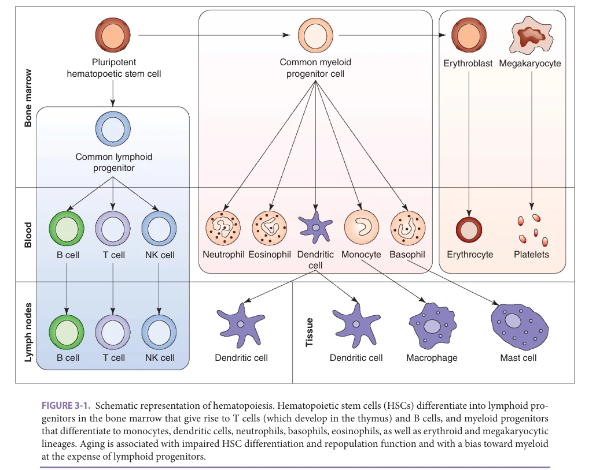

*FIGURE 3-1. Schematic representation of hematopoiesis. Hematopoietic stem cells (HSCs) differentiate into lymphoid progenitors in the bone marrow that give rise to T cells (which develop in the thymus) and B cells, and myeloid progenitors that differentiate to monocytes, dendritic cells, neutrophils, basophils, eosinophils, as well as erythroid and megakaryocytic lineages. Aging is associated with impaired HSC differentiation and repopulation function and with a bias toward myeloid at the expense of lymphoid progenitors.*

*Owner annotations/highlights are from the marked source copy, not the book.*

expected. Aging is associated with impaired differentiation and repopulation of blood cell lineages upon transplantation; this has been most clearly demonstrated in model mouse systems, although the substantial effect of donor age on outcomes from HSC transplantation suggests a similar effect in humans. Notably, there appears to be a significant bias favoring development of progenitor stem cells for the myeloid lineage (which give rise to granulocytes, monocytes, macrophages, erythrocytes, and platelets) and diminished numbers of lymphoid progenitors responsible for B and T lymphocyte development. This likely contributes to the impairment in B and T cell development found in older adults, and it is attractive to speculate that increases in myeloid progenitors could contribute to age-associated myeloproliferative disorders. The mechanisms underlying these alterations in hematopoiesis remain incompletely understood, but likely involve stem cell-intrinsic changes such as the accumulation of cellular and DNA damage (with age-related chronic inflammation likely playing a contributing role) and telomere shortening in HSCs with age, as well as inefficient DNA replication and alterations in signaling pathways mediating the response to DNA

damage. In addition, changes in the bone marrow microenvironment that interacts with HSCs to facilitate their maintenance, renewal, and differentiation are also likely to contribute; one example of this is the increased fat cell content of bone marrow with age, which may alter the production of cytokines, chemokines, and other factors influencing HSC function.

## OVERVIEW OF THE INNATE IMMUNE SYSTEM

The earliest onset responses to pathogens or vaccines are mediated by the innate immune system. Innate immune responses are mediated by a network of cells including epithelial cells, neutrophils, monocytes, dendritic cells (DCs), natural killer (NK) cells, basophils and eosinophils, and by biochemical factors including complement, antimicrobial peptides (defensins), proinflammatory cytokines, and antiviral interferon responses (Table 3-1). Such responses include pathogen clearance via intracellular killing (in neutrophils and macrophages/monocytes), killing of virus-infected or

**[p. 49]**

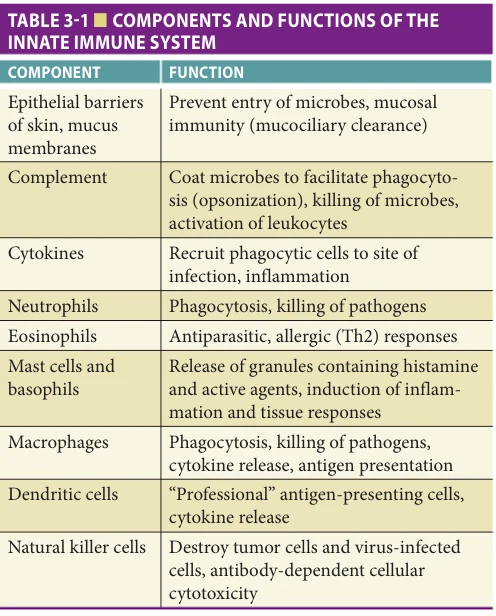

*TABLE 3-1 ■ COMPONENTS AND FUNCTIONS OF THE INNATE IMMUNE SYSTEM*

*Owner annotations/highlights are from the marked source copy, not the book.*

malignant cells (by NK cells), and complement fixation and lysis of extracellular organisms.

### Pattern Recognition Receptors of the Innate Immune System

Another crucial function of the innate immune system is to activate proinflammatory cytokine and chemokine production, particularly in cells such as DCs or monocytes, which present peptides derived from pathogens in conjunction with a host major histocompatibility antigen for recognition by T cell antigen receptors. Activation of such antigen-presenting cells (APCs) results in the expression of so-called costimulatory molecules such as CD80 and CD86—proteins that interact with a ligand on the surface of T cells to provide a critical additional signal (in conjunction with that provided by engagement of the T cell receptor [TCR]) for T cell activation. This innate proinflammatory response and upregulation of costimulatory protein expression are mediated by a series of invariant innate immune pattern recognition receptors (PRRs). Toll-like receptors (TLRs) are one family of PRRs that are associated with either extracellular or intracellular membranes and recognize highly conserved, so-called pathogen-associated molecular patterns (PAMPs) found in bacteria, mycobacteria, fungi, and viruses. Examples of PAMPs recognized by TLRs include lipopolysaccharide (LPS) and flagellin on gram-negative bacteria (TLR4 and TLR5, respectively), lipopeptides found in bacteria, mycobacteria, and yeasts (recognized by the TLR1/2 and TLR2/6 heterodimers, respectively). While these TLRs are expressed as membrane-associated receptors on the cell

surface, other TLRs recognizing nucleic acids are localized to intracellular endosomal plasma membranes; such TLRs are activated by single-stranded RNA (TLR7 and TLR8) and double-stranded RNA (TLR3) produced during viral infections, as well as unmethylated CG-rich DNA (TLR9). Activation of TLRs on APCs engages signal transduction pathways employing myeloid differentiation primary response gene 88 (MyD88) or a pathway including the toll-interleukin-1 receptor (TIR)-domain-containing adapter-inducing interferon-β (TRIF) protein and TRIF-related adaptor molecule (TRAM), resulting in not only upregulation of costimulatory proteins but also production of proinflammatory cytokines such as IL-6 and TNF-α via activation of the NF-κB transcription factor, or production of type I interferons via interferon regulatory factor (IRF) engagement (eg, IRF3 and IRF7). By activating APCs presenting antigen to T cells, such TLR signaling links the innate immune response to adaptive immunity.

Recent studies have also identified families of PRRs localized to the cytoplasm (in contrast to the membrane localization of TLRs) that also include receptors recognizing viral RNAs (retinoic acid-inducible gene-I [RIG-I] and melanoma differentiation antigen-5 [MDA-5]) that interact with a mitochondria-localized signaling intermediate (mitochondrial antiviral signaling protein [MAVS]) are particularly important for antiviral interferon responses. Cytosolic DNA (that can arise in the context of infections— such as with DNA viruses—or DNA damage, such as in cancer) is recognized by numerous innate immune sensors including cyclic GMP-AMP synthase, gamma interferon inducing protein (IFI)-16, and others; the stimulator of interferon genes (STING) protein plays a central role in inducing type I interferon production following activation by such a DNA sensor. A member of the nucleotide-binding oligomerization domain (NOD)-like receptor family, NLRP3, has emerged as an example of an innate immune PRR that responds to not only bacterial and viral motifs but also so-called damage-associated molecular patterns (DAMPs). NLRP3 activation results in assembly of a multiprotein complex termed the inflammasome, a multiprotein complex containing the adaptor protein ASC (apoptosis-associated speck-like protein containing a CARD [caspase activation and recruitment domain]) polymerized into helical filaments that can be visualized using immunofluorescence as a protein “speck” within cells. The CARD domains of these multimerized ASC proteins then mediate the activation of caspase-1 and the consequent proteolytic processing of immature forms of proinflammatory cytokines such as IL-1β and IL-18 to their mature, active forms. DAMPs activating NLRP3 include exogenous factors such as silica and asbestos, and endogenous factors such as uric acid, extracellular ATP, and necrotic cells. The activation of innate immune inflammatory responses by such endogenous DAMPs is hypothesized to be a contributing factor to the increased levels of inflammation found in older adults, as discussed below.

**[p. 50]**

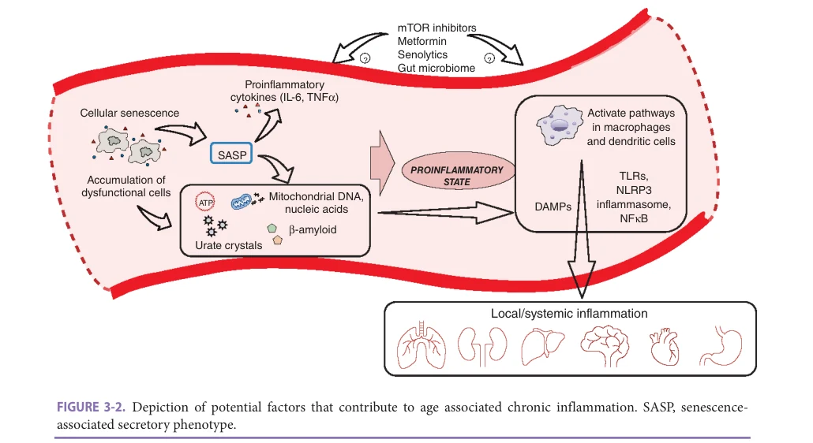

*FIGURE 3-2. Depiction of potential factors that contribute to age associated chronic inflammation. SASP, senescenceassociated secretory phenotype.*

*Owner annotations/highlights are from the marked source copy, not the book.*

### A Heightened Proinflammatory Environment in Older Adults

The effects of age on innate immunity are complex, and reflect the diversity of innate immune responses. Increased levels of proinflammatory cytokines such as IL-6 and TNF-α, acute phase reactants such as C-reactive protein (CRP), and clotting factors are found in the plasma of older, compared to young adults; this age-associated chronic inflammatory state was first referred to by Franceschi as “inflammaging.” Inflammaging, as manifested by such elevated cytokine levels, is associated with mortality risk in cohorts of older adults, and is also correlated with decreased muscle mass and strength. In this regard, it is also notable that several diseases of aging, such as cardiovascular disease, diabetes, Alzheimer disease, and osteoporosis, are reported to have an inflammatory component that contributes to pathogenesis. The mechanisms underlying inflammaging remain incompletely understood, but are hypothesized to include activation of innate immune PRRs by PAMPs arising from chronic infections (such as viral infections with herpesvirus family members, or HIV infection, which is associated with increased inflammatory parameters even in individuals with nondetectable viral loads); in addition, age-associated accumulation of DAMPs such as noncellassociated nucleic acids, mitochondria, ATP, urate crystals, heat shock proteins, ceramide, hyaluronan, amyloid, and others resulting from cellular or tissue damage leads to activation of innate immune PRRs such as TLRs and the NLRP3 inflammasome. Defects in autophagy with aging may result in reduced ability to dispose of damaged cellular elements, exacerbating the chronic inflammatory state. In this regard, Campisi and colleagues have described

the senescence-associated secretory phenotype (SASP), a secretome of proteins released by damaged cells that includes chemokines and proinflammatory cytokines such as IL-6 and IL-8—another link between cell damage and inflammation (Figure 3-2). The inflammatory environment in older adults can also be influenced by additional factors; for example, both testosterone and estrogen suppress IL-6 production, with reduced sex hormone levels of menopause and andropause associated with increased cytokine levels. Finally, increased mitochondrial function with aging and associated uncoupling of oxidative phosphorylation could result in increased levels of reactive oxygen species that may also increase proinflammatory cytokine production.

### Age-Associated Alterations in Innate Immune Cell Function (Table 3-2)

Neutrophil function in older adults In cells of the innate immune system, age-associated changes include both impaired responses and inappropriate persistence of inflammation that may result from alterations in signal transduction. For example, neutrophils from older adults show diminished signaling via the granulocyte-macrophage colony-stimulating factor (GM-CSF) receptor that usually mediates antiapoptotic cell survival. Impaired age-associated signaling via the triggering receptor expressed on myeloid cells-1 (TREM-1) may also contribute to functional alterations in cytokine or reactive oxygen species (ROS) production. Human neutrophils also show an age-associated decline in migration toward a chemical stimulus (chemotaxis) and in phagocytosis and intracellular killing of engulfed pathogens. In addition, the

**[p. 51]**

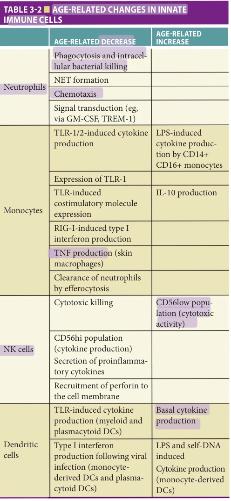

*TABLE 3-2 ■ AGE-RELATED CHANGES IN INNATE IMMUNE CELLS*

*Owner annotations/highlights are from the marked source copy, not the book.*

release of neutrophil extracellular traps (NETs), complexes of DNA, histones, and antimicrobial proteins released from the neutrophil that facilitate pathogen capture and killing, is also decreased in neutrophils from older compared to young adults. While alterations in specific signaling pathways as discussed above have been linked to some of these findings, how age influences these functions remains unclear, particularly in view of the short lifespan of human neutrophils in vivo (approximately 5 days). It should be noted that alterations in function such as chemotaxis that may influence migration to sites of infection or injury could

result in not only impaired migration to sites of infection or wound healing, but also impaired egress of neutrophils from these sites—potentially resulting in an inappropriate prolongation of the inflammatory response. In this regard, the clearance of apoptotic neutrophils by macrophages (a process termed efferocytosis) in a skin blister model of sterile inflammation was diminished in older, versus young adults, and was associated with elevated activation of macrophage p38 mitogen-activated protein (MAP) kinase; in vivo administration of an orally administered p38 inhibitor restored efferocytosis and inflammatory resolution, suggesting an additional approach to modulating age-related inflammatory dysregulation.

NK cell function in aging Age-associated decline in function has also been reported for NK cells, a class of innate immune lymphocyte sensitive to cytokine activation, which plays an important role in killing virus-infected cells and in immunosurveillance against malignant cells. Critical proteins for the killing function of NK cells include proteases known as granzymes (for their storage in cytoplasmic granules), and perforin, a protein that forms a pore or channel in the target cell through which granzymes may be introduced. Inhibitory NK cell surface receptors recognize host class I major histocompatibility complex (MHC) protein expression and prevent apoptosis, but with loss of MHC class I expression—as frequently occurs on tumor cells to facilitate evasion of antitumor T cell responses—NK-dependent killing via apoptosis of target cells ensues. NK cells also express surface receptors recognizing the so-called Fc constant region of antibodies, and may thereby also mediate killing of targets bound to immunoglobulin—a process termed antibody-dependent cytotoxicity. With age, the proportion of NK cells specialized for cytotoxicity (as assessed by low expression of the surface CD56 adhesion protein) increases at the expense of NK cells specialized for cytokine production (which express high levels of CD56). However, the cytotoxic function of aged NK cells is decreased on a per cell basis, likely in part resulting from diminished recruiting of perforin to the target cell. Studies of NK cell function in the context of aging are likely to have future clinical impact; notably, NK cell counts and measures of NK function have been associated with mortality from sepsis and other critical illness, and with increased infection and mortality rates in older nursing home residents.

Age-associated alterations in PRR function The effects of aging on human innate immune PRR function such as TLRs show evidence for an age-associated impairment in TLR-dependent expression of costimulatory proteins on monocytes, likely influencing the ability of these cells to serve as APCs that can maximally engage T cells. In addition, TLR-induced production of proinflammatory cytokines such as IL-6 and TNF-α in APCs such as monocytes and DCs is also diminished in cells from older adults. In particular, TLR1/2-induced cytokine production (in response to triacylated lipopeptides such as those found

**[p. 52]**

in many gram-positive organisms) appears diminished in monocytes from older compared to young adults. TLR function has also been evaluated in human DC populations, which may be predominantly divided into myeloid DCs, which express a wide range of TLRs and mediate production of IL-12 for activation of T cell immunity, and plasmacytoid DCs, which express a narrower range of TLRs but are particularly adept at type I interferon production in response to viral infection. For both of these DC subtypes, a generalized age-associated decrease in TLR-induced cytokine production has been observed. At the same time, it is important to recognize that these studies largely represent in vitro assessments of TLR function. In vivo tissue context is likely to be an important factor; for example, evaluation of TLR function in monocytederived DCs showed an age-associated increase in cytokine production; such DCs are derived from monocytes using growth factors and cytokines (GM-CSF and IL-4), and could model DCs generated in the context of inflammation. LPS (recognized by TLR4)-induced cytokine production also appears increased in so-called CD14+CD16+ monocytes (as opposed to CD14+CD16− conventional monocytes) that arise in the setting of inflammation-associated conditions such as sepsis, HIV infection, and myocardial infarction. As a final example, TNF-α production by macrophages in human skin was diminished in the setting of a delayed-type hypersensitivity response to purified protein derivative (PPD)—yet TNF-α production in vitro by such macrophages was preserved, arguing for the importance of local factors (such as the potential influence of regulatory T cells in the skin of older adults, in this case) in assessing innate immune function.

The mechanisms underlying these age-related changes remain incompletely understood; some changes in expression of specific TLRs have been reported in APCs (including an age-associated decrease in surface TLR1 in monocytes), but such decreases in protein expression alone do not appear sufficient to explain the observed findings and it is likely that both transcriptional (ie, gene expression) and posttranscriptional (eg, protein stability, modification, localization, or damage) mechanisms contribute. Moreover, these effects are not uniform for all cell types and must be reconciled with age-related increases in circulating cytokine levels. In this regard, there is evidence for increased basal cytokine production, for example in DCs in the absence of in vitro TLR stimulation. Thus, ageassociated impairment in cytokine production could reflect inflammatory dysregulation and an inability to further increase cytokine levels beyond a basal level in response to a newly encountered antigen (such as a PAMP from a pathogen or vaccine). In addition, the wide range of TLR expression on nonblood-derived cells—including cells of epithelial, endothelial, and neuronal origin—represents an additional, largely unexplored source of complexity in the integration of TLR activity in older adults. The function

of cytoplasmic PRRs in older adults remains to be definitively evaluated; however, the demonstration that “specks” of multimerized ASC and inflammasome components can be released from the cell, where they may cause extracellular inflammatory activation and activate inflammation in neighboring cells, suggests a potential source for endogenous immune activation that could contribute to an agerelated inflammatory environment.

## OVERVIEW OF ADAPTIVE IMMUNITY

The term adaptive immunity refers to highly specific immune responses mediated by lymphocyte-specific antigen receptors: in B cells, immunoglobulins (Ig) or antibodies, which are both membrane-bound as the B cell antigen receptor (BCR) and secreted antibodies that are effectors of humoral immunity; or in T cells, the exclusively membrane-associated TCR, mediating cell-mediated immunity. Humoral and cell-mediated immunity are both characterized by immunologic memory, in which the response to previously encountered antigens is enhanced upon repeat exposure.

Both the BCR and TCR are comprised of two polypeptide chains. The BCR contains two antigen-binding sites, each comprised of one heavy chain and one light chain; the TCR contains a single α chain complexed with a β chain that recognizes a host MHC protein bound to a peptide derived from enzymatic processing of a protein antigen on the surface of an APC (such as a monocyte, macrophage, DC, or even in some cases a B cell) (Figure 3-3). The specificity of the humoral or cell-mediated immune response results from a highly diverse repertoire of BCRs on B cells and TCRs on T cells, respectively, that can recognize millions of different antigenic specificities. This diversity results from a lymphocyte-specific gene rearrangement program that acts on the genetic loci for Ig heavy chains or the β TCR subunit, which contain clusters of variable (V regions), diversity (D regions), and joining (J regions), or V and J regions only for Ig light chains or the α TCR subunit. All BCR or TCR chains contain a constant or invariant region (C region). For the BCR Ig heavy chain, several different C regions are present, which denote the Ig isotype and functional implications—such as the Cμ region found in IgM, Cγ1-Cγ4 regions found in IgG subclasses, Cα found in IgA secreted at mucosal surfaces, and Cε denoting IgE, a critical component for allergic responses or immune responses to parasitic infections. The BCR light chain locus contains two C regions, encoding sequences specific for either the κ or λ light chains.

The state of BCR or TCR gene rearrangement denotes specific maturation stages of B or T lymphocyte development, respectively. A rearranged Ig heavy chain or β TCR locus contains a single V, D, and J region linked together to form the variable region of the heavy chain or β TCR protein, while VJ gene rearrangement is found for the

**[p. 53]**

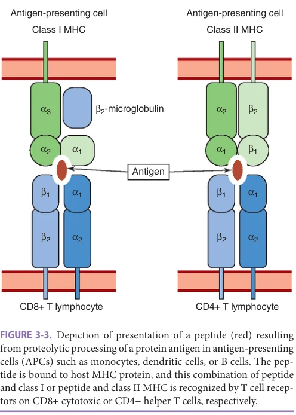

*FIGURE 3-3. Depiction of presentation of a peptide (red) resulting from proteolytic processing of a protein antigen in antigen-presenting cells (APCs) such as monocytes, dendritic cells, or B cells. The peptide is bound to host MHC protein, and this combination of peptide and class I or peptide and class II MHC is recognized by T cell receptors on CD8+ cytotoxic or CD4+ helper T cells, respectively.*

*Owner annotations/highlights are from the marked source copy, not the book.*

Ig light chain and α TCR rearranged loci. To accomplish this, the lymphocyte-specific recombinase activating genes (RAG) mediate site-specific DNA cleavage at unrearranged V, D, and J regions. The subsequent joining of these gene segments to form a rearranged antigen receptor gene utilizes proteins responsible for DNA repair (nonhomologous end joining) that are generally expressed in all cell types as part of the response to DNA damage; such proteins include Ku70, Ku80, DNA-dependent protein kinase (DNA-PK), Artemis nuclease, X-ray repair cross-complementing protein 4 (XRCC4), DNA ligase IV, and others. Recombinatorial gene rearrangement of V regions to a more limited number of D and/or J segments, combined with imprecision in the rejoining of cleaved gene segments, results in the tremendous antigenic diversity found in B and T lymphocytes at birth (Figure 3-4). Substantial changes in this diversity occur with age, as described below.

In B cells, additional genetic steps are required for the evolution of a humoral immune response. Following gene rearrangement, an IgM BCR is generated (with surface IgM on B cells that can differentiate to a plasma cell secreting IgM with the same antigenic specificity), since the Cμ constant region is most proximal to the rearranged VDJ region. Following initial VDJ gene rearrangement and expression of a mature IgM BCR containing the Cμ

constant region, a B cell–specific process known as heavy chain class switching results in the replacement of the C region exon with that of another isotype, and deletion of the intervening DNA (in this case, containing the previous Cμ region) while preserving the rearranged variable region gene. This process is the mechanism by which evolution of the humoral immune response occurs, from initial expression of IgM early in infection to subsequent expression of IgG and other isotypes. A B cell–specific protein, activation-induced cytidine deaminase (AID), is essential for heavy chain class switching. The mechanism of heavy chain class switching is still a subject of investigation, but is facilitated by transcription at highly repetitive regions of DNA found upstream of each C region exon, termed switch regions. Current models suggest that AID targets single-stranded regions of DNA exposed by transcription, and deaminates cytosine DNA residues to induce a mutation to uracil residues. These mutations are then subjected to generally expressed DNA excision repair proteins to generate double-stranded DNA breaks, which are then repaired by similar nonhomologous endjoining repair mechanisms utilized for VDJ recombination. The ability of AID to induce C to U mutations that are resolved by DNA repair processes also plays an essential role in another function critical to the memory B cell response—somatic hypermutation, the process by which rearranged variable region genes in mature B cells undergo additional mutation, resulting in improved affinity of the encoded immunoglobulin molecule for antigen (Figure 3-4A). Thus, mechanisms associated with maintaining the integrity of genomic DNA such as DNA repair pathways—which are likely affected by aging—play crucial roles in these fundamental processes in adaptive immunity.

### Overview of T Cell Development and Function

The generation of mature T cells occurs in the thymus, a bilobed organ located in the anterior mediastinum (Figure 3-5). Each lobe is comprised of a capsule, a cortex with abundant numbers of developing T cells and a deeper medulla region with sparser quantities of lymphocytes. In addition to developing T cells, several other cell types are present in the thymus to carry out crucial functions related to selection of T cells and clearance of apoptotic cells resulting from thymic selection processes (described below), such as cells of the thymic epithelium, DCs, and macrophages. The thymic cortex is colonized by early thymic progenitor cells originating from the bone marrow. Subsequent developmental steps are driven by rearrangement of TCR genes and are linked to specific regions of the thymus; in general, more mature T cell subsets are found in deeper layers of the cortex, with the most mature cells occupying the medulla. The TCR β chain locus is the first to undergo rearrangement, with subsequent incorporation of the β chain protein in a pre-TCR complex that signals for

**[p. 54]**

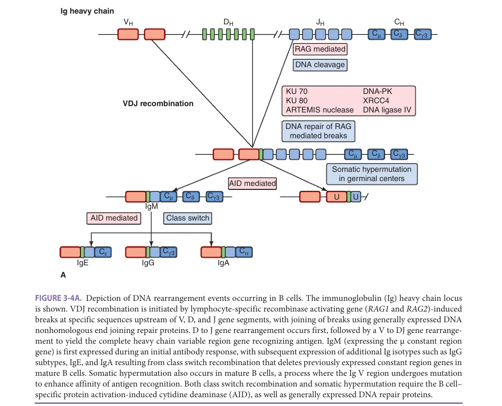

*FIGURE 3-4A. Depiction of DNA rearrangement events occurring in B cells. The immunoglobulin (Ig) heavy chain locus is shown. VDJ recombination is initiated by lymphocyte-specific recombinase activating gene (RAG1 and RAG2)-induced breaks at specific sequences upstream of V, D, and J gene segments, with joining of breaks using generally expressed DNA nonhomologous end joining repair proteins. D to J gene rearrangement occurs first, followed by a V to DJ gene rearrangement to yield the complete heavy chain variable region gene recognizing antigen. IgM (expressing the μ constant region gene) is first expressed during an initial antibody response, with subsequent expression of additional Ig isotypes such as IgG subtypes, IgE, and IgA resulting from class switch recombination that deletes previously expressed constant region genes in mature B cells. Somatic hypermutation also occurs in mature B cells, a process where the Ig V region undergoes mutation to enhance affinity of antigen recognition. Both class switch recombination and somatic hypermutation require the B cell– specific protein activation-induced cytidine deaminase (AID), as well as generally expressed DNA repair proteins.*

*Owner annotations/highlights are from the marked source copy, not the book.*

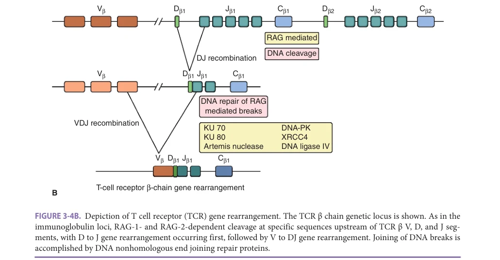

*FIGURE 3-4B. Depiction of T cell receptor (TCR) gene rearrangement. The TCR β chain genetic locus is shown. As in the immunoglobulin loci, RAG-1- and RAG-2-dependent cleavage at specific sequences upstream of TCR β V, D, and J segments, with D to J gene rearrangement occurring first, followed by V to DJ gene rearrangement. Joining of DNA breaks is accomplished by DNA nonhomologous end joining repair proteins.*

*Owner annotations/highlights are from the marked source copy, not the book.*

**[p. 55]**

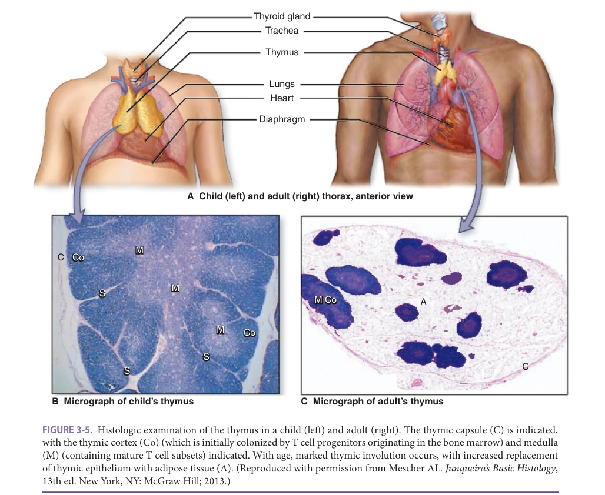

*FIGURE 3-5. Histologic examination of the thymus in a child (left) and adult (right). The thymic capsule (C) is indicated, with the thymic cortex (Co) (which is initially colonized by T cell progenitors originating in the bone marrow) and medulla (M) (containing mature T cell subsets) indicated. With age, marked thymic involution occurs, with increased replacement of thymic epithelium with adipose tissue (A). (Reproduced with permission from Mescher AL. Junqueira’s Basic Histology, 13th ed. New York, NY: McGraw Hill; 2013.)*

*Owner annotations/highlights are from the marked source copy, not the book.*

survival of precursors with a successful β chain gene rearrangement. Subsequent rearrangement of the TCR α chain genes corresponds to upregulation of both CD4 and CD8 expression (such CD4+ CD8+ cells are referred to as “doublepositive” thymocytes), and if a productive gene rearrangement occurs (ie, one able to encode for an α chain protein), the mature αβ TCR is expressed. These developing cells subsequently undergo so-called positive selection, in which cells bearing TCRs that recognize host class MHC class I or class II proteins survive, while those that do not undergo apoptosis. This step coincides with differentiation to “single-positive” CD4+ cells recognizing MHC class II proteins, and cytotoxic CD8+ T cells recognizing MHC class I. Another process of negative selection eliminates those T cells carrying αβ TCRs with high affinity for selfpeptide/MHC complexes that could result in autoimmunity. Additional lineage specification for development of regulatory T cells (Treg), which inhibit T cell activation, and γδ T cells expressing two distinct classes of TCR proteins that may play a role in the recognition of lipid antigens, also occurs in the thymus (Figure 3-6).

### Aging and T Cell Development and Function (Table 3-3)

Thymic involution The human thymus is at its maximal size in infancy, and begins to decrease in size and cellularity in childhood. The thymic epithelium begins to diminish, particularly after puberty, and is replaced by adipose tissue that may be a source of cytokines and chemokines that interfere with thymopoiesis (Figure 3-5). The T cell generation capacity of the thymus is substantially diminished by young adulthood, to around 10% of the capacity seen in infancy. T cell lifespan can be assessed by in vivo metabolic labeling, and the generation of new T cells may be measured via the detection of T cell receptor excision circles (TRECs), the excised products of VDJ recombination of DNA that are only detectable in recently matured T cells, since they cannot undergo replication and are diluted by cell division. Such analyses have revealed minimal thymic activity in older adults, and indicate that maintenance of the T cell pool occurs instead via cell division and expansion of preexisting T cells. Not surprisingly, this absent thymic

**[p. 56]**

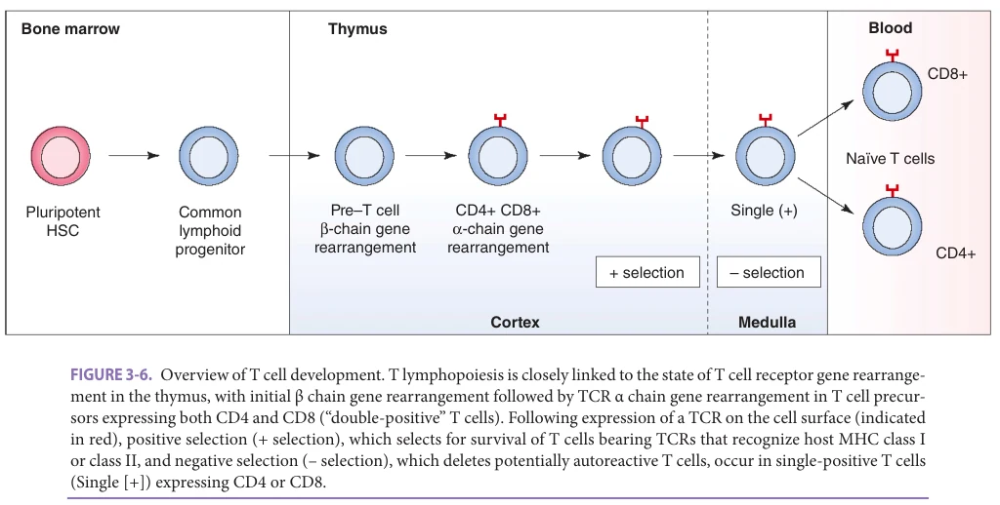

*FIGURE 3-6. Overview of T cell development. T lymphopoiesis is closely linked to the state of T cell receptor gene rearrangement in the thymus, with initial β chain gene rearrangement followed by TCR α chain gene rearrangement in T cell precursors expressing both CD4 and CD8 (“double-positive” T cells). Following expression of a TCR on the cell surface (indicated in red), positive selection (+ selection), which selects for survival of T cells bearing TCRs that recognize host MHC class I or class II, and negative selection (– selection), which deletes potentially autoreactive T cells, occur in single-positive T cells (Single [+]) expressing CD4 or CD8.*

*Owner annotations/highlights are from the marked source copy, not the book.*

activity results in decreased numbers and proportion of naïve (CD45RA+) T cells in peripheral blood, with an increase in T lymphocytes with a memory phenotype (CD45RO+). In this regard, it is notable that a T cell phenotype resembling that seen in aged adults was found in young adults who had undergone thymectomy in childhood. The mechanisms underlying thymic involution remain a subject of active study; alterations in thymic epithelial cells that facilitate the developmental expansion and selection steps of T cell development, such as changes in expression of the master transcriptional regulator FoxN1, are thought to play an important role. There is interest in developing interventions that can stabilize or reverse thymic involution

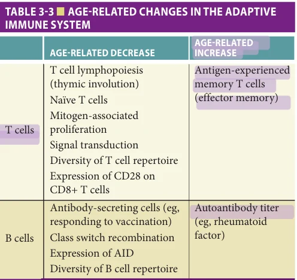

*TABLE 3-3 ■ AGE-RELATED CHANGES IN THE ADAPTIVE IMMUNE SYSTEM*

*Owner annotations/highlights are from the marked source copy, not the book.*

and thereby improve T cell production in older adults. However, the widespread conservation of thymic involution in most mammals raises the speculative question of whether it might represent an evolutionary adaptation, perhaps protecting the host from lymphocytic malignancies in older age.

Influence of CMV infection on T cell repertoire The lack of generation of new (naïve) T cells in older adults as a result of thymic involution also results in marked changes in the diversity of the TCR repertoire, which decreases substantially with age. Notably, cytomegalovirus (CMV) infection is associated with such profound alterations in diversity (Figure 3-7). Like other herpesviruses, following primary infection CMV establishes a state of latency in the host, with reactivation to productive infection throughout life, often in the setting of stress or non-CMV–associated illness that is usually asymptomatic and not associated with CMVdependent end organ disease. However, such reactivations result in marked expansion of CMV-specific CD4+ and CD8+ memory T cell populations, and resultant decreases in TCR diversity with expansion of nonmalignant T cell clones—many of which recognize CMV peptides. Such oligoclonal T cell expansions may comprise a large proportion (even in some cases the majority) of CD4+ or CD8+ T cells, and are also found in CMV seronegative older adults; in such individuals, it is likely that other herpesviruses associated with latent infection, such as EBV or HHV-6, other viruses such as hepatitis C virus, or other sources of chronic immune system activation may contribute to loss of repertoire diversity. Notably, the extent of diversity loss has been linked to decreased lifespan in older adults, though the underlying mechanisms or associated factors remain incompletely understood.

**[p. 57]**

Aging and alterations in T cell phenotype and signal transduction The age-related increase in memory phenotype T cells, with decreased naïve T cells is also associated with several additional findings. For example, aged human T cells show a substantial loss of expression of the costimulatory protein CD28 from the surface of CD8+ cytotoxic T cells (Figure 3-7). CD4+ T cells show a much lesser degree of CD28 loss with aging, although marked increases

in CD4+ CD28− cells can be found in adults with rheumatologic disease. CD28 associates with ligands (CD80 and CD86) on the surface of APCs such as activated macrophages or DCs, and this interaction provides a second signal, in addition to that provided by the TCR interaction with peptide bound to host MHC, that is critical for optimal T cell activation. Thus, this loss of CD28 would be expected to influence T cell activation in CD8+ T cells.

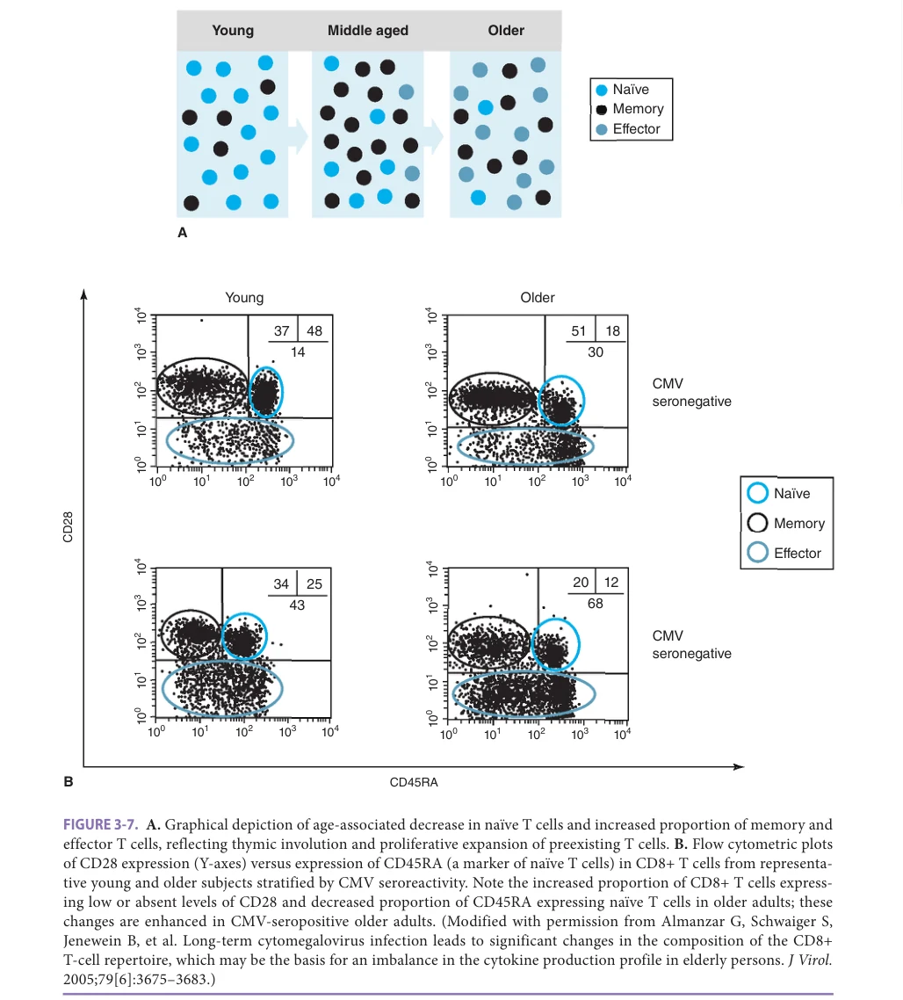

*FIGURE 3-7. A. Graphical depiction of age-associated decrease in naïve T cells and increased proportion of memory and effector T cells, reflecting thymic involution and proliferative expansion of preexisting T cells. B. Flow cytometric plots of CD28 expression (Y-axes) versus expression of CD45RA (a marker of naïve T cells) in CD8+ T cells from representative young and older subjects stratified by CMV seroreactivity. Note the increased proportion of CD8+ T cells expressing low or absent levels of CD28 and decreased proportion of CD45RA expressing naïve T cells in older adults; these changes are enhanced in CMV-seropositive older adults. (Modified with permission from Almanzar G, Schwaiger S, Jenewein B, et al. Long-term cytomegalovirus infection leads to significant changes in the composition of the CD8+ T-cell repertoire, which may be the basis for an imbalance in the cytokine production profile in elderly persons. J Virol. 2005;79[6]:3675–3683.)*

*Owner annotations/highlights are from the marked source copy, not the book.*

**[p. 58]**

In this regard, signal transduction by the TCR is also diminished in the context of aging—in general, nonreceptor tyrosine kinase–dependent pathways downstream of the TCR are inhibited in T cells from older adults, with potential mechanisms for impaired signaling including increased expression of phosphatases that are negative regulators of MAP kinase– dependent signaling. Though the mechanisms underlying diminished signaling in human T cells remain incompletely understood, both cell-intrinsic mechanisms, such as mitochondrial dysfunction in T cells resulting in increased levels of reactive oxygen species (ROS), and cell-extrinsic mechanisms, such as the inhibition of TCR signaling and engagement of inhibitory cytokine signaling pathways (such as the suppressor of cytokine signaling [SOCS] proteins) resulting from increased systemic levels of TNF-α and other cytokines, appear to be important contributing factors.

It is likely that such signaling alterations may differ among different T cell populations and lineages to extend beyond the dichotomy of CD8+ and CD4+ T cells to CD4+ T cell subtypes. These include TH1 helper T cells, which develop in response to IL-12 produced by activated APCs and the transcriptional regulator T-bet to produce interferon-γ and facilitate intracellular immunity against bacteria, viruses, and fungi; TH2 helper cells developing in response to the GATA3 transcription factor that produce IL-4, IL-5, and IL-13 and mediate allergic and antiparasitic T cell responses; TH17 cells, a heterogeneous lineage in humans that are named for their production of IL-17 and are associated with inflammatory responses in the context of bacterial and fungal infections, autoimmunity, and malignancy; follicular helper T cells providing critical help for B cells in lymphoid follicles of lymph nodes and other secondary lymphoid organs; regulatory T cells (Treg) expressing the FoxP3 transcription factor that inhibit immune responses; and resident memory T cells (TRM) present in specific tissues or organs such as lung, skin, or gut that do not recirculate and appear critical for rapid responses to pathogens (both Treg and TRM cells may be either CD4+ or CD8+ single positive). The functional consequences of aging on these human T cell subsets remain incompletely understood, but are likely to be complex; for example, current evidence suggests that human CD4+ and CD8+ Treg cells are found in increased numbers in the blood of older, compared to young adults, but the ability to induce Treg cell development (particularly CD8+ Treg cells) with cytokine treatment is diminished with age. The consequences of these opposing effects on the regulation of T cell responses remain to be determined.

## OVERVIEW OF B CELL DEVELOPMENT

In contrast to T lymphopoiesis, where T cell progenitors migrate from the bone marrow to the thymus, B cells arise from HSC that differentiate to a common lymphoid progenitor. However, as with the T cell lineage, antigen receptor gene rearrangement (in this case, of immunoglobulin [Ig] heavy and light chain genes) is intimately linked to

B cell development, with Ig heavy chain gene rearrangement occurring in early B cell progenitors (pro-B cells). The Ig heavy chain protein in conjunction with an invariant surrogate light chain protein forms the pre-B cell receptor complex that links to signal transduction pathways to mediate expansion and progression to the pre-B cell stage, when light chain gene rearrangement occurs to generate the mature Ig BCR (Figure 3-8). Through this process, a library of B cells is developed with a repertoire of millions of specificities. Notably, an incompletely understood mechanism of negative selection occurs in the B cell lineage (as in the T cell lineage) by which B cells expressing potentially autoreactive BCRs are deleted both in the bone marrow and in peripheral lymphoid tissues.

### Effects of Aging on B Cell Development and Function (Table 3-3)

Dramatic effects of aging on B cell development are found in mouse models; however, human B lymphopoiesis in the bone marrow appears generally preserved with age, although the total number and percentage of B cells diminish in the blood of older compared to young adults. Moreover, B cell production of antibodies in response to infection or vaccination is impaired with age, and is associated with diminished production of antibody-secreting B cells termed plasmablasts, which generally appear approximately 7 days following immunization. In part because of the use of varying definitions of B cell subsets, it has proven difficult to determine whether, as in the T cell lineage, memory B cells are expanded with age. Notably, the proportion and number of memory B cells that have undergone heavy chain class switching do decrease with age; it is likely that age-associated alterations in T cell function contribute to such differences, since B cell responses are intimately associated with helper T cell activity. However, B cell–intrinsic changes have been identified in older adults, such as the decreased expression of AID (essential for heavy chain class switching—Figure 3-4A) in B cells from older adults that is linked to decreased levels of the E47 transcription factor. Though age-related developmental changes in the B cell lineage remain completely understood, functional alterations are manifested for example by the age-associated increase in monoclonal gammopathy, which has been estimated to affect as many as 3% of adults 50 years or older and 5% of adults 70 years or older. In addition, titers of autoantibodies such as rheumatoid factor are generally increased with age, suggesting additional dysregulation and in particular, possible alterations in the negative selection steps mediating deletion of autoreactive B cell clones. The persistence of autoreactive B cell clones may also be reflected in age-related changes in the B cell repertoire; repertoire diversity appears to be diminished with age, with marked increases in nonmalignant clonal expansions of B cells. As with T cells, there is evidence that such expansions could be associated with the control of reactivation of chronic herpesvirus infections with CMV or EBV. In addition,

**[p. 59]**

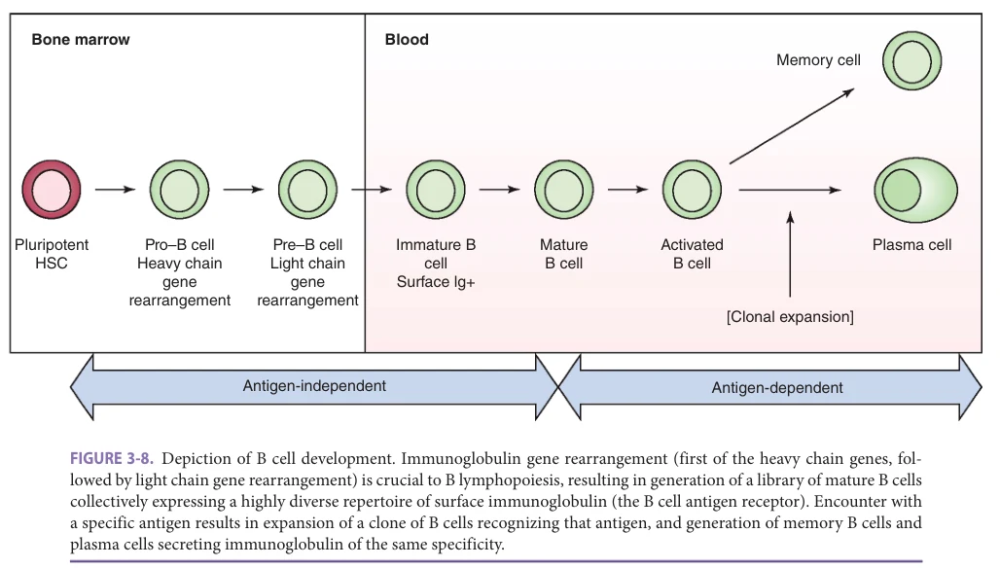

*FIGURE 3-8. Depiction of B cell development. Immunoglobulin gene rearrangement (first of the heavy chain genes, followed by light chain gene rearrangement) is crucial to B lymphopoiesis, resulting in generation of a library of mature B cells collectively expressing a highly diverse repertoire of surface immunoglobulin (the B cell antigen receptor). Encounter with a specific antigen results in expansion of a clone of B cells recognizing that antigen, and generation of memory B cells and plasma cells secreting immunoglobulin of the same specificity.*

*Owner annotations/highlights are from the marked source copy, not the book.*

profound loss of B cell repertoire diversity has been associated with alterations in health or functional status, such as frailty; the effects of functional alterations or multimorbidity on the immune system in older adults is an emerging area of significant research and clinical interest.

## EFFECTS OF AGE ON VACCINE RESPONSES

Impaired responses to vaccines represent perhaps the clearest examples of the consequences of immunosenescence, and have important clinical consequences reflected in the increased susceptibility to infectious diseases found in older adults. Mechanisms discussed in this chapter contribute to this impaired response, but multiple additional host factors including gender, age-associated changes in body composition (eg, changes in adipose tissue), and associated comorbid medical conditions or medication use all contribute. Here, we provide an overview of three vaccines—against influenza, VZV, and Streptococcus pneumoniae—currently recommended for older adults and briefly discuss vaccines against SARS-CoV-2 infection.

### Influenza Vaccine

Over 90% of the approximately 30,000 annual deaths from influenza in the United States occur in adults 65 years or older, and older adults are at increased risk for morbidity arising from complications of influenza, such as viral pneumonia or bacterial superinfection. Although the incidence of influenza infection decreased substantially with the advent of SARS-CoV-2 disease, it is virtually certain that influenza outbreaks will resume following the pandemic.

The seasonal vaccine in wide use is an inactivated vaccine containing defined doses of the hemagglutinin (HA) protein, one of the surface glycoproteins of the influenza virus; anti-HA antibodies are associated with protection against disease. However, because of a high mutation rate in the HA protein, the composition of viral strains in the vaccine is adjusted annually based on surveillance of circulating strains. Currently, four (quadrivalent) influenza strains are present in the vaccine, with two influenza A strains (typically one H1N1 and one H3N2 subtype) and two B strains.

The efficacy of the standard dose seasonal influenza vaccine in older adults has been estimated at approximately 40% for the prevention of an influenza-like illness, and approximately 60% for confirmed influenza, and is lower in older individuals with increased comorbid conditions (such as residents in long-term care facilities). Demonstration of a mortality benefit for influenza vaccination has proven to be difficult; it has been hypothesized that many studies may be influenced by selection bias in which a subset of frail adults who are undervaccinated because of poor health disproportionately contribute to mortality from influenza. However, a history of revaccination, as opposed to first vaccination against influenza, has been associated with decreased mortality in at least one study.

Evidence for poor vaccine efficacy, combined with the demonstration of impaired antibody responses to vaccination reflected in decreased levels of antibody-producing cells following influenza immunization have led to interest in alterative vaccine formats to improve response in older adults. Both the live attenuated influenza vaccine, which uses a cold-adapted virus that replicates in nasal mucosal

**[p. 60]**

tissues (at lower temperature than in the lungs) to establish immunity, and an intradermal influenza vaccine that utilizes the immunologic milieu of the skin (which contains APCs including Langerhans cells) that is bypassed by intramuscular vaccination, have shown efficacy in older adults; in fact, antibody titers to influenza viral vaccine strains were higher in older adults given the intradermal preparation versus standard intramuscular vaccine in at least one study. However, at present, these formats are not approved for adults age 65 and older. A high-dose trivalent influenza vaccine containing four times the dose of HA protein for each vaccine strain was approved for adults age 65 and older in 2009, and is now available in a quadrivalent format. Several studies have shown equivalent or increased antibody titers to vaccine viral strains compared to standard dose vaccine in studies enrolling older adults, and a randomized comparing standard to high-dose vaccine in nearly 32,000 older adults revealed a modest benefit for the highdose vaccine (with a 24% relative efficacy for prevention of influenza-like illness compared to standard dose vaccine). A second vaccine approved for use in adults 65 years and older is a standard-dose quadrivalent vaccine combined with MF59, a squalene-derived adjuvant that appears to enhance antigen presentation. A cluster-randomized trial comparing the MF59 adjuvanted vaccine to unadjuvanted, standard-dose vaccine in 823 nursing homes revealed a 17% reduction in suspected or laboratory-confirmed influenza outbreaks and a 20% reduction in hospitalization for pneumonia or influenza for the adjuvanted vaccine. Ongoing work to further improve influenza vaccines includes the use of adjuvants, including those activating the innate immune system such as TLR agonists. An additional research direction is the development of a “universal” influenza vaccine, which would not require annual revision. The immune response to current HA-based vaccines is dominated by antibodies to the highly variable head region of HA; approaches to a universal vaccine include the use of viral antigens that are highly conserved across influenza strains, such as the HA stalk region or neuraminidase protein. Such vaccines are in early clinical trials, and their efficacy in elucidating strong immune responses in older adults remains to be studied. Finally, biochemical pathways implicated in vaccine response may be pharmacologically modulated to enhance vaccine protection. An example of this possibility came from the demonstration in a placebocontrolled trial that low doses of the immunosuppressive agent rapamycin enhanced antibody response to influenza vaccination by about 20% in older adults. This study implicated the mechanistic target of rapamycin (mTOR) pathway, which is inhibited by rapamycin, in vaccine response. Notably, in addition to its effects on T cell signal transduction (relevant particularly for prevention of transplant rejection), rapamycin administration to mice late in life resulted in significant lifespan extension (14% for female and 9% extension for male mice). These increases in lifespan and vaccine response are principally mediated by the

TOR complex 1 (TORC1) protein complex downstream of mTOR, which appears crucial for nutrient sensing and activation of protein translation. Additional studies utilizing catalytic and allosteric inhibitors of mTOR that selectively inhibit TORC1 showed not only improved influenza vaccine response, but also decreased rates of respiratory tract infections over a 1-year period (after only 6 weeks of treatment with the mTOR inhibitor cocktail). These studies suggest the promise of enhancing age-associated impairment in immune responses to promote improved vaccine response or host defense against infection. In this regard, early clinical trials of so-called senolytic agents that induce apoptosis of senescent cells are in progress; one combination being tested is the combination of the tyrosine kinase inhibitor dasatinib and the flavonoid quercetin. Another candidate agent that may improve immune responses in older adults is metformin, an oral hypoglycemic agent with pleiotropic effects that result mainly from its activity as an AMP kinase activator, with inhibition of TORC1, decreased oxidative stress resulting from inhibition of complex I of the mitochondrial electron transport chain, and decreased age-related chronic inflammation through inhibition of the transcription factor NF-κB. The upcoming TAME (Targeting Aging by Metformin) trial represents a new paradigm for clinical trials in specifically targeting aging phenotypes; improving age-related deficits in immune response will be an important direction for these and other future trials designed to improve human health span (Figure 3-2).

### Varicella Zoster Vaccine

Herpes zoster (shingles), resulting from reactivation of VZV, frequently affects older adults—usually manifesting as a painful cutaneous vesicular eruption in a dermatomal distribution that could also present as multidermatomal or disseminated zoster in the setting of immunosuppression or malignancy. The incidence of herpes zoster increases markedly with age, and the CDC estimates that approximately one-third of Americans will have an episode of zoster infection during their lifetime. Studies in immunosuppressed adults have established that defects in T cell immunity, like those associated with aging, are essential for maintaining VZV in a state of latency in ganglia associated with peripheral and cranial nerves—although the precise mechanisms involved in maintaining VZV latency remain incompletely understood. Notably, studies to quantify VZV-specific CD4+ T cells have revealed that approximately 30% to 40% of adults 55 years and older have no detectable CD4+ VZV responses, a potential correlate for the increased risk of older adults for zoster infection; in an effort to boost this defective cell-mediated immunity the first-generation zoster vaccine (Zostavax) was a live attenuated viral preparation containing 10- to 40-fold higher viral plaque forming units compared to the VZV vaccine given to prevent primary infection in childhood. Based on a large placebo-controlled efficacy trial enrolling over 38,000 adults age 60 and older, the vaccine reduced the incidence

**[p. 61]**

of zoster by 51%, but a substantial decrease in efficacy was seen as a function of age: protection against zoster was estimated at 64% in individuals 60 to 69, 41% for those 70 to 79, and 18% for individuals over 80. This reduced efficacy in adults 70 years and older, limited the utility of the vaccine, particularly as it became clear that repeat vaccination would be necessary to maintain protection against shingles outbreaks. This first-generation vaccine is no longer available in the United States, and has been replaced by a second-generation, recombinant vaccine (Shingrix) containing VZV glycoprotein E and the AS01B adjuvant consisting of monophosphoryl lipid A (a TLR4 agonist) complexed with a saponin derivative (QS-21) in liposomal form. This vaccine reduced the incidence of shingles by 97% in a trial of adults 50 years and older and by 90% in a second trial of adults 70 years and older. This last trial also found an 89% decrease in the incidence of postherpetic neuralgia. In contrast to the first-generation live attenuated vaccine, no age-related decrease in efficacy was reported for this second-generation vaccine, suggesting that the AS01B adjuvant could potentially overcome age-related alterations in vaccine-immune response and would be a candidate for use in other vaccines used in older adults.

### Pneumococcal Vaccine

Adults 65 years and older and children under age 2 are at greatest risk for the development of invasive pneumococcal disease (eg, bacteremia, endocarditis, meningitis), but the highest mortality rates (of 15%–20%) are found in adults 65 years and older. For decades, vaccination against Streptococcus pneumoniae utilized the 23-valent polysaccharide vaccine, which contains purified pneumococcal capsular polysaccharides from 23 (of at least 90) strains that are commonly associated with infection in the United States. In most studies, this polysaccharide vaccine appears to reduce the risk for invasive pneumococcal disease, but at the same time most studies have not shown a benefit for this vaccine in prevention of noninvasive disease (such as pneumococcal pneumonia) or all-cause pneumonia in older adults. From an immunologic perspective, the polysaccharide vaccine is generally considered to be a so-called “T-independent” vaccine, as the pneumococcal polysaccharides stimulate B cells directly, inducing activation and differentiation to antibody-secreting cells. While it appears possible that some T-dependent responses may arise from this vaccine (for example from copurifying pneumococcal protein components in the vaccine), there remains concern regarding the potential defect in T cell–dependent immunologic memory—a potential limitation given the importance of the memory response in facilitating more rapid responses mediated by higher affinity antigen receptors resulting from processes such as somatic hypermutation in B cells.

For this reason, pneumococcal conjugate vaccine offered the possibility of improved efficacy, since in these vaccines polysaccharides are conjugated to a carrier protein, CRM197—a nontoxic mutant of diphtheria toxin.

This step allows the polysaccharide conjugate to undergo antigen processing for presentation in the context of host MHC to T cells, allowing a full memory response to be generated (with the resulting generation of memory B and T cells). While T cell function and memory responses are clearly diminished in older adults (as discussed above), there is biological plausibility to the hypothesis that immunologic memory, even diminished, is preferable to a complete absence of memory. The CAPiTA study specifically evaluated the 13-valent conjugate pneumococcal vaccine in a randomized, placebo-controlled trial of more than 80,000 adults 65 years and older in the Netherlands who had never previously received a pneumococcal vaccine. The conjugate vaccine was found to diminish the risks of both noninvasive and invasive pneumococcal infection arising from vaccine-related strains, and the protective effect extended for the duration of the study (~4 years). While this was the first study to show a benefit to vaccination in decreasing the incidence of pneumococcal pneumonia, it remains unclear whether a similar benefit for older adults in the United States would be found. Because the CAPiTA trial began in the Netherlands prior to the general use of conjugate vaccine in Dutch children, it has been speculated that the benefits of vaccinating older adults may be less clear in the United States, where the general use of pneumococcal conjugate vaccine in children has led to a substantial decrease in invasive disease in older adults. Currently, the 23-valent polysaccharide vaccine remains the mainstay of recommendations for the prevention of pneumococcal disease in older adults, while for adults with immunocompromising conditions a series of vaccination with the 13-valent conjugate vaccine followed by the polysaccharide vaccine in 8 weeks or later is suggested. However, newer generation conjugate vaccines with increased numbers of strains may further modify these recommendations for older adults.

### SARS-CoV-2 (COVID-19) Vaccines

As with other infectious diseases, the COVID-19 pandemic has had a disproportionate impact on older adults, with approximately 80% of deaths from COVID-19 occurring in adults 65 years and older; outbreaks in nursing homes have been particularly devastating, and it is estimated that nearly 1 in 10 nursing home residents in the United States died of COVID-19 during the pandemic. The specific immunologic mechanisms contributing to COVID-19 pathophysiology in older adults remain an area of active investigation; however, many aspects of the aging immune system appear to be manifested in COVID-19, such as increased levels of proinflammatory cytokines such as IL-6 and TNF-α, alterations in innate immune activation such as those responsible for the type I interferon response, and expansion of activated T cell populations with features of terminal differentiation. Such studies in patients with COVID-19 are challenging to interpret because of substantial heterogeneity resulting from differences in treatment regimens, comorbid medical conditions, and variability in timing of sample acquisition

**[p. 62]**

relative to disease course, and this remains an active area of investigation.

The first vaccines against SARS-CoV-2 to show efficacy in older adults were RNA vaccines—BNT162b2 and mRNA-1273—both containing messenger RNA (mRNA) encoding the full-length SARS-CoV-2 spike protein, with specific nucleoside modifications to minimize activation of host innate immune PRR pathways recognizing RNA. Such mRNAs were packaged in a lipid-containing nanoparticle, and upon intramuscular administration are translated in the cytoplasm of host cells to generate SARS-CoV-2 spike protein. Both vaccines elicit spike protein-specific neutralizing antibody and T cell responses, and initial data indicate excellent efficacy (92% for BNT162b2 and 86% for mRNA-1273) in adults 65 years and older. Additional vaccine platforms are also likely to find clinical use, using replication-deficient adenoviral-based vectors and recombinant protein vaccines. Many unanswered questions remain for all of these vaccines, such as duration of protection for B and T cell–dependent immunity, need for repeat of vaccinations/booster doses, and protection against emerging SARS-CoV-2 variants.

## FUTURE PERSPECTIVES

Understanding of the mechanisms underlying ageassociated immune dysfunction has implications not only for morbidity and mortality from infectious diseases and vaccine response, but also for the age-related increase in malignancy (perhaps reflecting age-related changes in tumor surveillance and DNA repair or genome stability) and for emerging fields of research such as wound healing

and organ transplantation. Studies of immune system aging have begun to utilize multidimensional data from wholegenome analyses of gene expression, including evaluation of small microRNAs whose expression has been implicated in the regulation of many genes. The analysis of age-related epigenetic changes, such as methylation or histone modification, that are linked to the regulation of gene expression has also advanced and will soon be routinely done at the single-cell level. In addition, the emerging interface of immunity and metabolism, as manifested for example by mitochondrial alterations or engagement of the mTOR pathway, suggests the utility of metabolic pathway analyses (metabolomics) using mass spectroscopy platforms. Immunologic studies increasingly will also include high dimensional data from mass cytometry (CyTOF) platforms that should be able to substantially exceed the number of analytic channels available using conventional flow cytometry. An additional area of ongoing research will evaluate the components of intestinal commensal organisms (the intestinal microbiome) or those at other tissue sites, and their interaction with the immune system in modulating inflammation, metabolic activity, and other parameters; initial studies have already found age-related differences in content of the intestinal microbiome that are associated with factors such as nutritional status, diet, and functional status such as frailty. In view of the high degree of heterogeneity found in older adults, encompassing medical comorbidities, medication use, as well as gender and race, future research on the aged immune system should provide new biological insights into how this heterogeneity is translated into changes in functional status—with the hope of identifying methods to improve quality of life in older adults.

## FURTHER READING

Anderson EJ, Rouphael NG, Widge AT, et al. Safety and

immunogenicity of SARS-CoV-2 mRNA-1273 vaccine in older adults. N Engl J Med. 2020;383:2427–2438. Black S, Gregorio ED, Rappuoli R. Developing vaccines for

an aging population. Sci Transl Med. 2015;7(281):281ps8. Bonten MJ, Huijts SM, Bolkenbaas M, et al. Polysaccharide

conjugate vaccine against pneumococcal pneumonia in adults. N Engl J Med. 2015;372(12):1114–1125. Cunningham AL, Lal H, Kovac M, et al. Efficacy of the her-

pes zoster subunit vaccine in adults 70 years of age or older. N Engl J Med. 2016;375:1019–1032. DiazGranados CA, Dunning AJ, Kimmel M, et al. Efficacy

of high-dose versus standard-dose influenza vaccine in older adults. N Engl J Med. 2014;371(7):635–645. Franceschi C, Garagnani P, Parini P, Giuliani C, Santoro A.

Inflammaging: a new immune-metabolic viewpoint for age-related diseases. Nat Rev Endocrinol. 2018; 14(10): 576–590.

Frasca D, Blomberg BB. B cell function and influenza

vaccine responses in healthy aging and disease. Curr Opin Immunol. 2014;29:112–118. Goronzy JJ, Weyand CM. Mechanisms underlying T cell

ageing. Nat Rev Immunol. 2019;19:573–583. Hazeldine J, Lord JM. Immunesenescence: a predisposing

risk factor for the development of COVID-19? Front Immunol. 2020;11:573662. Kirkland JL, Tchkonia T. Senolytic drugs: from discovery to

translation. J Intern Med. 2020;288:518–536. Kulkarni AS, Gubbi S, Barzilai N. Benefits of metfor-

min in attenuating the hallmarks of aging. Cell Metab. 2020;32(1):15–30. Liu GY, Sabatini DM. mTOR at the nexus of nutrition,

growth, ageing and disease. Nat Rev Mol Cell Biol. 2020;21(4):183–203. Mannick JB, Morris M, Hockey H-U P, et al. TORC1

inhibition enhances immune function and reduces

**[p. 63]**

infections in the elderly. Sci Transl Med. 2018;10(449): eaaq1564. McConeghy KW, Davidson HE, Canaday DH, et al. Cluster-

randomized trial of adjuvanted vs. non-adjuvanted trivalent influenza vaccine in 823 U.S. nursing homes. Clin Infect Dis. 2021;73(11);e4237–4243. Nikolich-Zugich J. The twilight of immunity: emerging

concepts in aging of the immune system. Nat Immunol. 2018;19:10–19.

Partridge L, Fuentealba M, Kennedy BK. The quest to slow

ageing through drug discovery. Nat Rev Drug Discov. 2020;19(8):513–532. Shaw AC, Goldstein DR, Montgomery RR. Age-dependent

dysregulation of innate immunity. Nat Rev Immunol. 2013;13(12):875–887.

**[p. 64]**
