# Hazzard's Geriatric Medicine and Gerontology, 8e - Chapter 40: Applied Clinical Geroscience

Sara E. Espinoza, Jamie N. Justice, John C. Newman, Robert J. Pignolo, George A. Kuchel

> **Status.** Fast build from the book; not lane-reviewed.

> Not cited in the 2020-2026 past papers.

> **Source and method.** Printed pages 593-604, from the marked 8th-edition copy (PDF page = printed page + 34). Prose follows its text layer; tables and figures are source-page crops. The book is canonical.

**[p. 593]**

“There is nothing more deceptive than an obvious fact. Besides, we may chance to hit upon some other obvious facts which may have been by no means obvious.”

#### Learning Objectives

- Understand how hallmarks of biological aging contribute to age-related diseases and conditions in older adults.

- Understand that since advances in aging research show that aging is modifiable, geroscience research focuses on preventing and delaying age-related diseases and conditions through interventions that target aging mechanisms.

- Discuss use of biomarkers of aging for clinical geroscience trials.

- Understand the principles of translational geroscience as they apply to clinical trials studying interventions in fundamental aging processes.

#### Key Clinical Points

1. Aging is a universal human experience that looms large in popular and commercial culture. Geroscience is a new field, and some of the early interventions being studied include repurposed drugs or overthe-counter agents that target aging mechanisms.

2. Common sense clinical judgment should prevail when providers are asked about using such substances ahead of rigorous clinical data and Food and Drug Administration (FDA) approvals. A plausible link to mechanisms of aging does not mean an intervention will be effective or risk-free. Unregulated clinics are not the same thing as carefully controlled and regulated clinical trials.

3. Attempting to reverse the many ways our bodies change as we age is not always appropriate or helpful, as some changes may be adaptive, or represent consequences rather than causes of aging. (Continued)

Sherlock Holmes in The Adventures of Sherlock Holmes. Arthur Conan Doyle (1892)

## WHAT IS THE GEROSCIENCE HYPOTHESIS?

Geroscience is a relatively new field in aging that focuses on understanding the relationships between biological aging and age-related diseases. Key terms and language in this new discipline are shown in Table 40-1. The geroscience hypothesis states that fundamental biological mechanisms of aging drive the susceptibility of aged individuals to not just one, but multiple chronic diseases, such as cardiovascular disease, type 2 diabetes, malignancy, and dementia.

Geroscience is based on evidence that a set of interrelated cellular biologic processes drive aging and the varied phenotypes observed with aging: macromolecular damage, metabolism, proteostasis, inflammation, adaptation to stress, epigenetics, cell senescence, and stem cells/regeneration. These processes have been coined the hallmarks or pillars of aging (Figure 40-1).

### Hallmarks of Aging

Aging is no longer a mysterious “black box.” It used to be common for a researcher studying a certain component of aging to argue that they were studying the single most important part of the aging process. Fortunately, such arguments and competing theories or visions of aging have been mostly superseded by a realization that there are several biological contributors to aging, and that the manipulation of one modulator of aging has implications for the entire system. Discovery of mutations in genes that radically alter lifespan and rates of aging in simple model organisms such as the nematode worm Caenorhabditis elegans, which have clear analogues to human biology, demonstrate that aging is a malleable biological process. Many fundamental discoveries in cell biology have shown that biological regulation is a normal part of aging in vivo. Finite cellular replicative lifespan is one such example. It is apparent that manipulating the rates of biological aging can be accomplished using genetic manipulations and drug-like molecules. Therefore,

**[p. 594]**

4. Providers and consumers should remember that most investigational drugs and therapies fail, and that typically older adults are at greater risk for harm by the misuse of medications or procedures.

5. Geriatricians will need to gain knowledge in geroscience so that they can function as content experts in geroscience-guided therapies as they are developed and approved for clinical use.

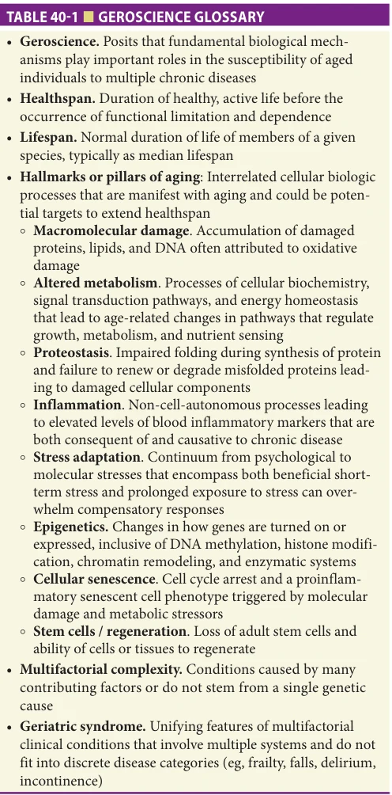

*TABLE 40-1 ■ GEROSCIENCE GLOSSARY*

*Owner annotations/highlights are from the marked source copy, not the book.*

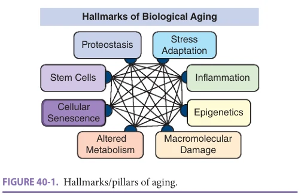

*FIGURE 40-1. Hallmarks/pillars of aging.*

*Owner annotations/highlights are from the marked source copy, not the book.*

a wealth of diverse research into the biology of aging has led to the identification of “clusters” of biological mechanisms, now referred to as hallmarks or pillars, that individually and collectively appear to “drive” aging (see Figure 40-1; Table 40-2).

These insightful discoveries suggest that aging processes can be modified to increase lifespan through more than one pathway intervention. Such an approach was first shown viable with laboratory-based genetic interventions that extended median lifespan, and this approach is further supported by decades of research demonstrating the aging-related benefits of dietary restriction (see Chapter 1, Biology of Aging and Longevity). It was first observed in the 1930s that restricting the food intake of laboratory rodents, without malnutrition, would extend their lifespan up to 40%. While there are important genetic and environmental variables, this basic effect has now been replicated in many species including non-human primates. Careful mechanistic studies in model organisms revealed that many of the biological effects of dietary restriction on conditions of aging are mediated by specific molecular signaling pathways that can be manipulated genetically or pharmacologically. We are now witnessing an emergence of pharmacological approaches that may extend median lifespan and healthspan in model organisms. First among these were studies conducted using worms (C. elegans), fruit flies (Drosophila), and rodents, demonstrating that targeting pathways such as mammalian target of rapamycin (mTOR) signaling with drugs or drug-like molecules could also extend lifespan and healthspan.

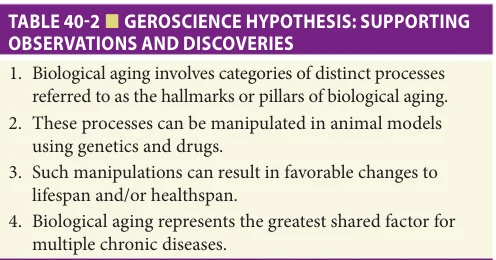

*TABLE 40-2 ■ GEROSCIENCE HYPOTHESIS: SUPPORTING OBSERVATIONS AND DISCOVERIES*

*Owner annotations/highlights are from the marked source copy, not the book.*

**[p. 595]**

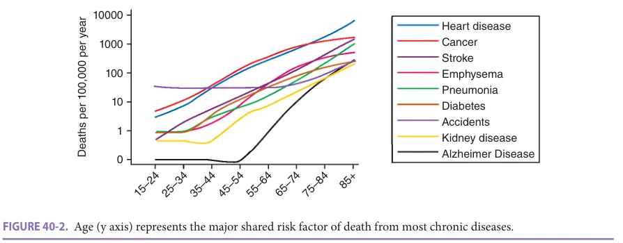

*FIGURE 40-2. Age (y axis) represents the major shared risk factor of death from most chronic diseases.*

*Owner annotations/highlights are from the marked source copy, not the book.*

### Geroscience-Driven Interventions to Modulate Aging in Humans

Aging represents the major shared risk factor for death from most chronic diseases (Figure 40-2). The promise of geroscience is that interventions will be found that target aging processes, thereby simultaneously preventing, delaying the onset of, or slowing the progression of multiple chronic diseases. Supporting observations and discoveries are listed in Table 40-2. While grounded to a large extent in the biological sciences, the geroscience hypothesis is highly congruent with clinical observations that overlapping and interacting predisposing factors influence the risk of multiple different chronic diseases or geriatric syndromes, and that interventions designed to target such shared upstream or downstream risk factors may help improve highly diverse and varied clinical phenotypes and outcomes. Targeting the overlapping and interacting molecular and cellular mechanisms of aging via hallmarks or pillars that drive many chronic predisposing factors is the translational geroscience approach.

Multifactorial complexity

Some Challenges The term “geriatric syndrome” has been used to capture the unifying features of distinct and disparate clinical conditions that do not fit into discrete disease

categories. Research into common geriatric syndromes has shown that no single risk factor typically determines their onset. Instead, in the case of conditions as varied and complex as delirium, falls, incontinence, and frailty, multiple coexisting risk factors need to be considered, with each individual risk factor contributing only modestly to the overall risk of such conditions. Given the nature of this type of multifactorial complexity, it has been difficult to envision a path from basic mechanistic studies to interventions with the potential to prevent or slow the progression of these complex conditions.

Early Insights The observation that multifactorial risk profiles often include both predisposing and precipitating risk factors has raised the possibility that some chronic factors may contribute as “drivers” throughout the entire disease process, while other more acute events may play a role as precipitating events in later stages. Similarly, four independent predisposing risk factors (slow-timed chair stands, decreased arm strength, decreased vision and hearing, and either a high anxiety or depression score) were associated with the risk of distinct and disparate outcomes raised for the first time the specter of shared risk factors for these geriatric syndromes (Figures 40-3 and 40-4).

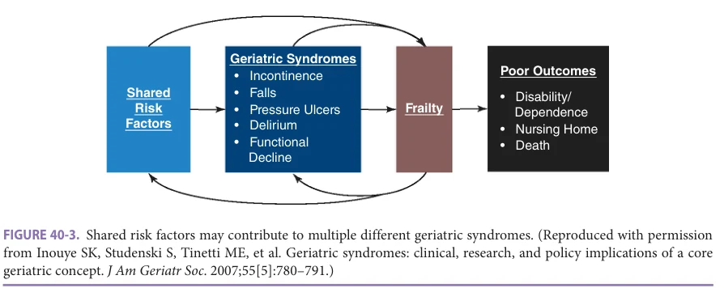

*FIGURE 40-3. Shared risk factors may contribute to multiple different geriatric syndromes. (Reproduced with permission from Inouye SK, Studenski S, Tinetti ME, et al. Geriatric syndromes: clinical, research, and policy implications of a core geriatric concept. J Am Geriatr Soc. 2007;55[5]:780–791.)*

*Owner annotations/highlights are from the marked source copy, not the book.*

**[p. 596]**

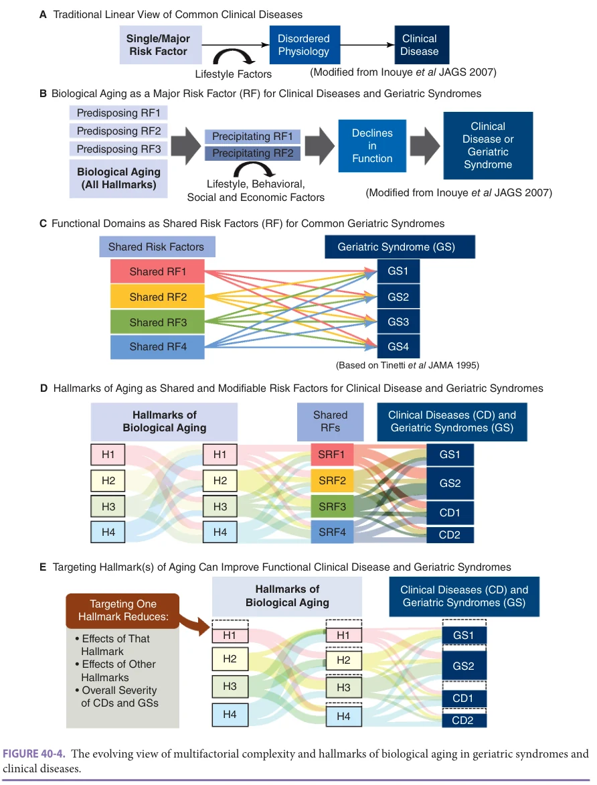

*FIGURE 40-4. The evolving view of multifactorial complexity and hallmarks of biological aging in geriatric syndromes and clinical diseases.*

*Owner annotations/highlights are from the marked source copy, not the book.*

Therefore, interventions such as exercise and physical activity may result in functional improvements across diverse outcomes because they target shared risk factors for different conditions or geriatric syndromes. Such approaches offer a path to treating individuals with multiple morbidities. Moreover, evidence that some combinations of risk factors may influence each other and mediate their downstream effects via common shared pathways

opens the possibility of targeting such points of risk factor synergism.

The Path to Geroscience The pathophysiology of many conditions, particularly those that are inherited, can be viewed along a traditional linear model in which a single or one major predominant risk factor results in disordered physiology which then progresses to overt clinical disease

**[p. 597]**

(Figure 40-4A). In the case of some inherited conditions, onset of disease is inevitable and independent of lifestyle factors with its full manifestations becoming evident at birth or even in utero. In the case of many other conditions, even those that are attributable to a single gene mutation, the onset and progression of physiological and clinical manifestations is highly sensitive to varied lifestyle factors. For example, while phenylketonuria (PKU), an inborn error of metabolism that results in decreased metabolism of the amino acid phenylalanine, is not currently treatable, if diagnosed early in life, functional declines and disease can be fully averted by controlling phenylalanine in the diet.

However, in spite of its simplicity and appeal, this linear model does not apply to most adult chronic diseases since the etiology of such conditions is typically multifactorial. Such multifactorial complexity is particularly important when seeking to understand and manage geriatric syndromes. While extremely heterogeneous, geriatric syndromes share a number of overarching features. First, these conditions are highly prevalent in frail older adults with a substantial impact on function, independence, and quality of life. Second, clinical features and functional effects of any given geriatric syndrome often involve multiple different and even distant organ systems, defying and challenging traditional organ and discipline-based boundaries. Third, the underlying etiology and pathophysiology of all geriatric syndromes is highly multifactorial with each single risk factor contributing only modestly to the overall risk of such conditions. Moreover, this multifactorial complexity is further enhanced by temporal factors whereby multiple different chronic predisposing risk factors collectively enhance the future risk of these conditions, while other more acute precipitating factors can subsequently induce declines in function and the emergence of a clinical diagnosis of a specific geriatric syndrome (see Figure 40-4B).

Functional domains as shared risk factors for common geriatric syndromes In addition to a multifactorial pathogenesis involving each specific geriatric syndrome, many individual risk factors, especially those involving varied measures of function, are shared by different geriatric syndromes (Figure 40-4C). For example, it has been shown that declines in lower extremity function, declines in upper extremity function, and neurobehavioral changes in the form of anxiety or depression represent independent but shared risk factors for urinary incontinence, falls, and functional dependence. Although published nearly three decades ago, this description of shared functional risk factors for varied geriatric syndromes offers seminal insights into translational geroscience when examining the role of varied individual facets of biological aging as shared predictors and/or drivers of different geriatric syndromes (Figures 40-4D and E). Moreover, these considerations provide an explanation of why an intervention such as exercise can have benefits on conditions as diverse as urinary incontinence, falls, and functional dependence since it can positively influence each of the above risk factors (Figure 40-4B).

Aging as a major risk factor for chronic diseases and geriatric syndromes The much belated recognition that aging represents the single largest risk factor for most chronic diseases and geriatric syndromes represented one foundational element for the emergence of the geroscience hypothesis. Nevertheless, a need arose to reconcile these observations drawn mostly from the study of populations toward more mechanistic research. Most evidence suggest a role for biological aging exerting its predisposing effects over time while other more traditional risk factors also enhance the risk and progression of chronic diseases and geriatric syndromes (Figure 40-4B).

Varied biological hallmarks of aging as shared and modifiable risk factors for chronic diseases and geriatric syndromes Since many diverse biological processes clearly contribute to the aging process, no one single molecule or biological pathway should be considered responsible. As in the case of shared functional predictors, such as lower extremity performance, a growing body of knowledge supports varied biological hallmarks of aging as shared risk factors or drivers for multiple different chronic conditions (Figure 40-4D). Moreover, evidence that modifying hallmarks of aging using genetic and pharmacological manipulations can slow biological aging provided additional support for the geroscience hypothesis. Finally, the ability of geroscience-guided interventions to target one or more biological hallmarks of aging, each representing a shared risk factor for different chronic diseases, offers insights into why interventions focused on a primary biological mechanism may offer such broad and pleiotropic beneficial effects (Figure 40-4E).

Impact of targeting upstream vs downstream hallmarks of aging While hallmarks of aging generally have broad effects on aging-related conditions (including other hallmarks; Figure 40-4E), some appear to have more widespread effects because of the ability to target such hallmarks “upstream” of other hallmarks. This offers insight into why some geroscience-guided interventions focused on more downstream biological pathways (eg, inflammation) have at times shown lesser functional and clinical benefit compared to interventions targeting more upstream biological pathways (eg, cellular senescence) that have biological effects on multiple downstream pathways, including inflammation.

### Basic and Preclinical Research in Support of Geroscience

A broad range of preclinical studies has established the feasibility of geroscience-guided treatments in animal models. For example, mouse studies have clearly established a role for low-dose rapamycin (mTOR inhibitor) in extending both lifespan and healthspan. In other studies, drugs with senolytic properties (such as dasatinib and quercetin, which kill potentially harmful senescent cells) also increase lifespan and improve a broad variety of physiological measures including mobility performance and cognitive

**[p. 598]**

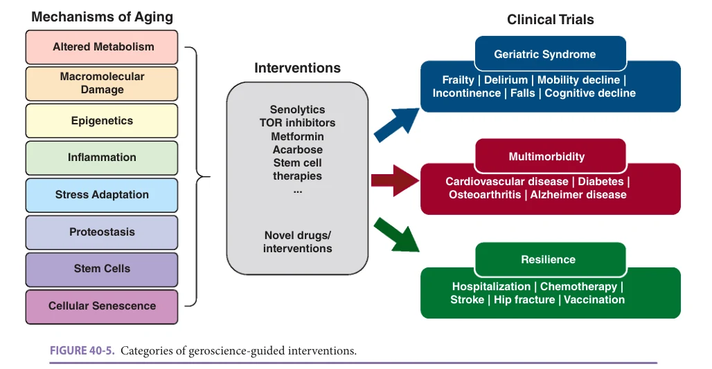

*FIGURE 40-5. Categories of geroscience-guided interventions.*

*Owner annotations/highlights are from the marked source copy, not the book.*

function, while also improving geriatric syndromes such as frailty, sarcopenia, and late-life osteoporosis (Figure 40-5).

### Types of Geroscience Interventions Based on Preclinical Studies

One way to assess the likelihood of successful translation of a geroscience-based intervention into clinical trials is to weigh the evidence from preclinical studies. Thus, a major prediction of translational geroscience is that healthspan, and perhaps lifespan, would be extended in model organisms. The National Institute on Aging (NIA) Interventions Testing Program (ITP) tests drugs to determine if they prevent disease and extend lifespan in genetically heterogeneous (outbred) mice. The ITP has shown that of 26 drugs tested to date, 7 extended lifespan significantly: nor-dihydroguaiaretic acid, aspirin, acarbose*, protandim*, rapamycin, 17-α-estradiol*, glycine, and a synergistic combination of rapamycin + metformin (*indicates mainly effective in males). Table 40-3 lists examples of interventions that successfully target primary aging processes to extend health- and lifespans, healthspan alone, or lifespan alone. Several interventions include currently available pharmacologic agents that have been repurposed for studying effects on human aging, such as rapamycin, angiotensin-converting enzyme (ACE) inhibitors/angiotensin II receptor blockers (ARBs), metformin, and so-called “senolytic” compounds.

### Senotherapeutics as an Example of Geroscience Discovery-to-Translation

Progress has been made toward targeting fundamental aging processes, and multiple interventions are currently being explored, especially cellular senescence. Senolytic agents

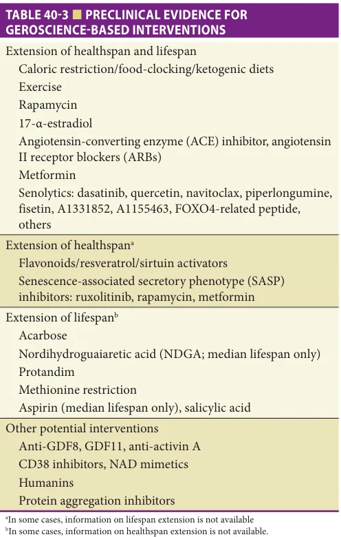

*TABLE 40-3 ■ PRECLINICAL EVIDENCE FOR GEROSCIENCE-BASED INTERVENTIONS*

*Owner annotations/highlights are from the marked source copy, not the book.*

**[p. 599]**

were first described on the basis of their inhibition of senescent cell apoptotic pathways. In preclinical models, clearance of senescent cells improves age-related phenotypes, such as chronic diseases, poor resilience, and geriatric syndromes including frailty. Interventions that genetically or pharmacologically remove senescent cells in animal models of aging offer proof-of-concept that they can be translated to human conditions associated with aging, especially those with heavy senescent cell burden. There are many potential interventions proposed to intervene in primary aging processes that may be distinct from cellular senescence; however, these processes are not necessarily mutually exclusive, and in fact may be interdependent. This suggests that any intervention that targets a single fundamental aging process could affect multiple processes that impact aging. Translation of promising pharmacologic senolytic agents has begun with assessments of safety and target engagement, and these early studies will provide lessons for future geroscience-based interventions.

Human studies using such approaches include evidence that a rapamycin analogue administered to community-dwelling older adults improves influenza vaccine responses, while also enhancing general immune responses and decreasing rate of reported infections. A randomized controlled trial of 25% calorie restriction in nonobese adults, CALERIE, showed that dietary restriction is safe and well tolerated, and can improve clinical measures of aging-related diseases as well as biomarkers of aging. Also, the intermittent use of a combination of two senolytics (dasatinib and quercetin) has been shown to be well-tolerated and safe in an open-label pilot study in individuals with idiopathic pulmonary fibrosis, a chronic, ultimately fatal, condition driven mostly by cellular senescence. As a result of these encouraging findings, examples of relevant clinical trials currently underway include studies testing dasatinib and quercetin for Alzheimer disease, while another senolytic called fisetin is being studied for frailty. Many other studies are about to begin recruitment.

Moreover, in the context of COVID-19, for which aging and chronic diseases jointly represent the greatest risk factor for severe illness and death, separate studies are underway testing the use of a rapamycin analogue, fisetin, or metformin in older adults residing in the community and nursing homes. Finally, the Targeting Aging with Metformin trial has been designed to forge a regulatory pathway for aging biology as a target for drug development (https://www.afar.org/tame-trial, accessed 02/14/2022).

## TRANSLATIONAL GEROSCIENCE

### Principles

Translation of therapies rooted in the basic concepts of the geroscience hypothesis includes the following general principles:

• Any pharmacological, dietary, or exercise-derived intervention that targets fundamental aging processes;

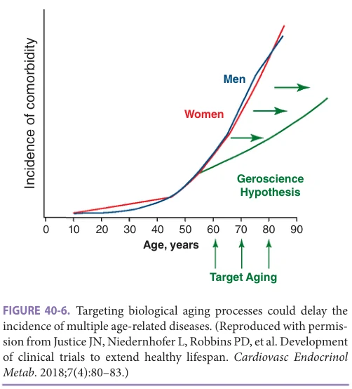

*FIGURE 40-6. Targeting biological aging processes could delay the incidence of multiple age-related diseases. (Reproduced with permission from Justice JN, Niedernhofer L, Robbins PD, et al. Development of clinical trials to extend healthy lifespan. Cardiovasc Endocrinol Metab. 2018;7(4):80–83.)*

*Owner annotations/highlights are from the marked source copy, not the book.*

• Geroscience-based clinical trials are built upon strong findings from preclinical studies utilizing relevant animal models and/or human studies demonstrating efficacy for single, chronic disease states with supporting evidence for age-related pleiotropic effects; • The intervention ultimately works to prevent, delay, ameliorate, or reverse multiple chronic conditions or geriatric syndromes (Figure 40-6); • Efficacy of geroscience interventions are based on clinically meaningful outcomes that will benefit healthspan, resiliency, and possibly lifespan; • Pilot or proof-of-concept human studies provide early insight into safety and administration (dosing, etc), possible efficacy in terms of surrogate biological outcomes and aging mechanistic target engagement, as well as initial data on clinical outcomes that inform the design of larger clinical trials; and • The successful intervention is generally applicable to older adults with multimorbidity, functional decline, and decreased resilience, and to those of racial, ethnic, and gender diversity who also live in diverse residential settings.

These general principles of translational geroscience serve to identify and target primary aging mechanisms in older adults; confirm efficacy through disease-based, functional, and other outcomes; “de-risk” interventions in a vulnerable population; and assure wide applicability in real-world settings.

### Framework for Geroscience-Based Clinical Trials

Conceptually, two categories of clinical trial approaches for geroscience-based therapies have emerged—those aimed at prolonging healthspan and those focused on improving

**[p. 600]**

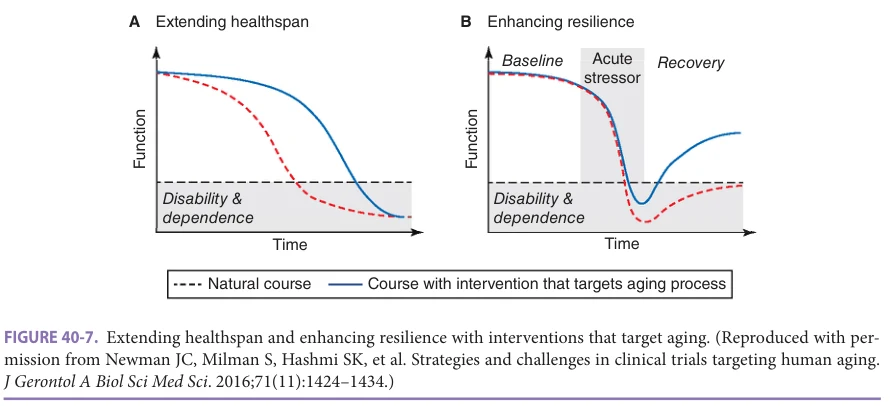

*FIGURE 40-7. Extending healthspan and enhancing resilience with interventions that target aging. (Reproduced with permission from Newman JC, Milman S, Hashmi SK, et al. Strategies and challenges in clinical trials targeting human aging. J Gerontol A Biol Sci Med Sci. 2016;71(11):1424–1434.)*

*Owner annotations/highlights are from the marked source copy, not the book.*

resilience (Figure 40-7). In the first approach, expected declines in healthspan due to progressive loss of physiological and physical function, as well as accumulation of multiple chronic diseases and geriatric syndromes, are targeted to avoid resultant disability and dependence. The advantages of this strategy are that, if successful, it would have high clinical impact on multimorbidity and quality of life, leverage known pathophysiology, and be suited to various interventions. Weaknesses include the difficulty in separating effects of an intervention on a single disease from an underlying effect on primary aging and the challenge of conducting mechanistic studies with multifactorial conditions.

In the second approach, the effects of an acute event that cause sudden, severe morbidity and functional dependence is targeted to optimize recovery to prior functioning and independence. Resiliency, or rebound after an acute event to prior baseline functional and health status, is difficult to achieve in older, frail individuals. In this approach, the goal would be to evaluate interventions that would minimize common physiological stressors such as surgery, trauma, or myocardial infarction. A successful intervention would reduce the severity of consequences in older individuals, including longer recovery times, higher risk of death, and lower likelihood of recovery to baseline function and independence. Strengths of this strategy include the focus on acute events that cause the most disability (eg, trauma) and the potential to evaluate short-term, high-impact outcomes for high-incident acutely deleterious events (eg, 30-day survival after myocardial infarction). Weaknesses are the likely heterogeneity of a specific stressor and the population or circumstances of the acute event as well as the greater possibly for harm associated with very serious stressors.

### Outcome Measures

There are many potential outcome measures that capture aspects of fundamental aging processes and clinical measurements related to multimorbidity and physical function that would support the major predictions of the geroscience hypothesis. Several endorsements have been made

for the following outcome measures in clinical trials of geroscience-based therapies: (1) mortality; (2) active life expectancy or expected disability-free survival; (3) markers of geriatric syndromes including gait speed, frailty indices, assessments of physical and cognitive functions, and activities of daily living; (4) accumulation of age-related diseases and co-occurrence with disabilities and geriatric syndromes; (5) composite outcomes from subsets of chronic diseases; and (6) other outcomes, including the rate of accumulation of new, age-related diseases, as well as indices of multimorbidity, such as the Charlson Comorbidity Index. Consideration for grouping chronic diseases with shared risk factors and underlying mechanisms into the same categories has been proposed in order to distinguish that an intervention is effective in slowing the aging process rather than having an effect related to a particular shared mechanistic pathway. Additional potential clinical outcome measures are listed in Table 40-4.

Outcome measures for geroscience clinical trials should be designed to evaluate time to onset of a new, age-related chronic disease as well as to assess major agerelated functional outcomes (mobility, cognitive function, or activities of daily living limitation) and biomarkers of aging as secondary and tertiary outcomes (see biomarkers section on next page). Key features of this design are a primary clinical outcome that represents diverse disease families that are not expected to share etiologic mechanisms except as related to primary aging processes. The secondary outcome related to functional changes is only partially explained by multimorbidity and so key aspects of physical decline likely also reflect fundamental aging.

### Populations

Geroscience-based clinical trials must adopt a geriatriccentric design so as to not arbitrarily exclude individuals with coexisting chronic diseases or those who reside in diverse settings, to assure appropriate functional outcome measures, and to avoid focusing on interventions that target only single disease states. These principles optimize

**[p. 601]**

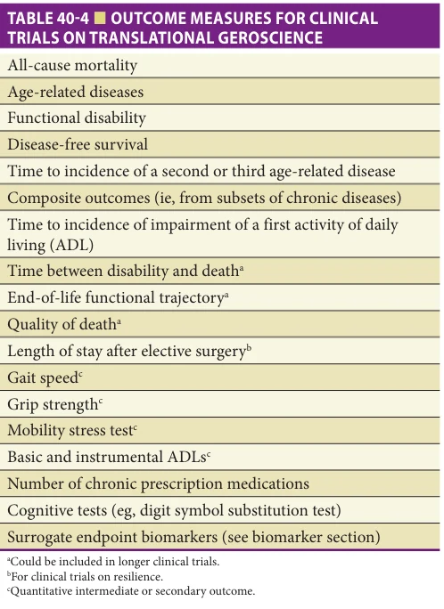

*TABLE 40-4 ■ OUTCOME MEASURES FOR CLINICAL TRIALS ON TRANSLATIONAL GEROSCIENCE*

*Owner annotations/highlights are from the marked source copy, not the book.*

the generalizability of study findings for typical geriatric patients with multiple coexisting conditions, support patient preferences involving function and independence, acknowledge aging as a major risk factor for multimorbidity, and help to validate geroscience-guided therapies in multiple residential and other settings.

Aging studies centered on geroscience-based interventions must be broadly inclusive to capture the heterogeneity of the aging population with respect to gender, race and ethnicity, genetics, socioeconomic status, physical functioning, comorbidities, disabilities, and complex physiology. Exclusion based on very old age or multiple comorbidities would limit those who would most likely benefit from geroscience interventions. Design strategies that may increase statistical power and clinical benefit include stratification by function, comorbidities, or surrogate biomarkers, as well as targeting patients at higher risk for the primary outcome. These approaches may also decrease the time to carry out the study and increase the likelihood of detecting an effect of the intervention. Caveats must be considered for inclusion of individuals with many major morbidities and/or profound functional impairment with limited life expectancy to avoid futile intervention or possible harm. Conversely, recruitment of older individuals lacking any age-related conditions and disabilities could minimize detection of new onset disease or disability during the prescribed study period.

Lastly, standardization of geroscience-based clinical trial outcomes across interventional studies offers the advantages of comparing efficacy and safety findings, establishing benchmarks for assays of target engagement and changes in clinically meaningful endpoints, and assuring quality measures associated with reproducibility. Standardized outcome measures would necessarily apply to a common or core set of measurements and would vary slightly depending on target population (outpatient/ community-dwelling, in-hospital, skilled nursing facility).

## BIOMARKERS OF AGING FOR CLINICAL TRIALS IN GEROSCIENCE

As highlighted previously, there is no single accepted endpoint for clinical trials testing promising geroscience interventions. The clinical endpoints necessary to ascertain intervention efficacy would be impractical in many trials. Consequently, there is a great deal of activity in developing and validating biomarkers that might (1) change over a much shorter period of time, (2) serve to identify promising intervention candidates, and (3) inform mechanisms or change in the underlying aging biology.

Importantly, biomarkers for clinical trials must have a strong statistical link to the desired outcome. Though biomarkers might lie on the causal pathway, primary interest is identifying biomarkers that move in a direction after intervention to predict clinical outcomes. In other words, biomarkers for geroscience trials reflect the interaction between the change in underlying biology and the change in clinical endpoint (healthspan, lifespan). For example, dysregulated inflammatory signaling and chronic low-grade inflammation is a pillar of biological aging that is strongly associated with mortality and multiple age-related health events. Interventions targeting specific inflammatory pathways, such as anakinra (interleukin [IL]-1 receptor antagonist), canakinumab (human anti-IL-1β monoclonal antibody that neutralizes IL-1β signaling), and tocilizumab (monoclonal IL-6 receptor antibody), are successfully used in the treatment of inflammatory disease. Yet there is little evidence that specifically targeting these inflammatory signaling pathways confer direct benefit on lifespan or aging per se in the absence of underlying disease. This does not diminish the importance of chronic inflammation in aging biology or etiology of chronic disease, nor does this limit utility as a biomarker for intervention effect. Many geroscience-guided interventions that robustly extend lifespan and healthspan broadly affect sources of systemic chronic inflammation that precede and predict health indicators and mortality in model organisms and humans. Thus, inflammatory biomarkers reflect the interaction between a change in underlying aging biology and change in organismal health.

This concept is counter to biomarker development and validation in the context of specific disease. For example, serum high low-density lipoprotein cholesterol (LDL-C) is a biomarker for atherosclerotic heart disease. Elevated

**[p. 602]**

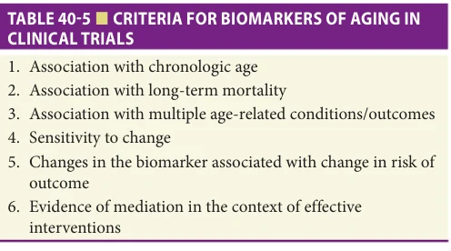

*TABLE 40-5 ■ CRITERIA FOR BIOMARKERS OF AGING IN CLINICAL TRIALS*

*Owner annotations/highlights are from the marked source copy, not the book.*

LDL-C is related to higher coronary heart disease risk, and interventions that lower LDL-C also lower the risk of heart disease. The link is so well established that new drugs can be approved on the basis of their cholesterol-lowering properties rather than proving a reduction in heart disease risk. The strength of LDL-C as a biomarker for heart disease is based on its causal role in the promotion of atherosclerosis.

The search for biomarkers of longevity or use in clinical trials in geroscience is complicated by the fact that no single pathway or mechanism that leads to long life has been identified. Nevertheless, it is possible to propose criteria for biomarkers such that if they were positively affected by a treatment, one would expect life or health extension with some confidence (Table 40-5).

Collaborative efforts to develop and validate biomarkers of aging for use in clinical research and practice are underway. Several candidate biomarkers outlined below reflect underlying cellular and molecular aging pathways, are associated with long-term mortality, and show association with multiple age-related conditions and outcomes other than mortality. The latter criteria are most difficult to meet. Longitudinal assessment of biomarkers not implicated in specific disease pathways are infrequently measured clinically or in large cohort studies; this greatly limits evaluation of sensitivity to change and association of change in biomarker with change in outcome risk. In order to meet the final criteria, “evidence of mediation in the context of effective intervention,” there must first be: (1) an accepted outcome for a geroscience trial, and (2) an intervention that is proven effective at changing the risk of that outcome. The field is making strides to meet these challenges. Aging outcomes trials are in progress, and interventions are under investigation that could one day demonstrate efficacy. Such investigations will provide needed validation of biomarkers of aging for use in clinical trials targeting aging biology.

Importantly, use of a panel of biomarkers is considered collectively to examine an intervention’s effects on multiple aging pathways. Many options are possible to construct a multivariable score of blood-based biomarkers of biological age: statistical modeling or principal component analyses, or a simple rank-based biomarker index. For example, in the Cardiovascular Health Study, an index of five circulating biomarkers was constructed; the hazard ratio for mortality per point of the biomarker index was

1.30 (95% confidence interval 1.25–1.34) and attenuated the association of age on mortality by 25%. Investigations testing the utility of biomarker indices in clinical trials and association with outcomes such as multimorbidity and physiologic function are underway.

Another class of biomarker strategy uses multisystem physiologic, phenotypic, and clinical measures to calculate a composite score representing biologic age that differs in older cohorts compared with a reference population. Examples include homeostatic dysregulation, phenotypic age, and Klemera-Doubal methods, which include measures that might not be associated with chronological age when considered independently, but considered collectively in each of these models, may represent a meaningful biomarker of biological age. For example, several groups have applied the Klemera-Doubal method that takes biochemical measures and uses a reference population to calculate what an individual’s predicted chronologic age would be. This method was used in a post-hoc analysis of the CALERIE trial, which showed that caloric restriction for 2 years reduced the advancement of physiologic age compared to control participants.

Aging is associated with changes to DNA including distinct patterns of DNA methylation and telomere loss. The gradual erosion of telomeres limits the replicative capacity of a cell in vitro, known as the Hayflick limit, and so in vivo telomere length was an early focus of aging biomarkers efforts. In practice, telomere length in peripheral white blood cells has shown some association with aging and age-related conditions but with substantial variability that has limited clinical applications so far. Epigenetic biomarkers take advantage of observed chronologic changes in DNA methylation to calibrate “clocks” that can estimate age and aging-related risk. Many aging metrics based on patterns of DNA methylation have been developed, and each “clock” or DNA methylation biomarker is unique to its calibration method. For example, they may be calibrated to chronological age, multifactorial aging phenotypes, or aging-related biomarkers. These estimators can detect a myriad of age-related diseases, predict mortality and adverse health events, and reliably identify persons who appear physiologically older than their chronologic age. A few small studies suggest that methylomic patterns can change in response to an intervention, but much more work needs to be done.

## COUNSELING PATIENTS ON “ANTI-AGING” THERAPIES

Aging is a uniquely universal human experience that looms large in popular and commercial culture. Geroscience is a new field, and some of the early interventions being studied include repurposed drugs or over-the-counter agents that may be implicated in aging mechanisms. Common sense clinical judgment should prevail when providers are asked about using such substances ahead of rigorous clinical data and FDA approvals. A plausible link to mechanisms of aging does not mean an intervention will be effective or risk-free. Unregulated

**[p. 603]**

clinics are not the same thing as carefully controlled and regulated clinical trials. Attempting to reverse the many ways our bodies change as we age is not always appropriate or helpful, as some changes may be adaptive, or represent consequences rather than causes of aging. Providers and consumers should remember that most investigational drugs and therapies fail, and that typically older adults are at greater risk for harm by the misuse of medications or procedures.

## BARRIERS TO RAPID PROGRESS IN GEROSCIENCE AND A PATH FORWARD

Despite the rapidly growing scientific foundation of geroscience, and the promise for transforming the health and health care of older adults, translational

progress has been slow. Many of these barriers are related to the newness of the field. Geroscience is a new branch of translational research requiring a unique combination of expertise in geriatric medicine, biology of aging, clinical research methods, and clinical research in older adults that few investigators possess. In spite of these challenges, the geroscience approach holds promise as a means of leveraging advances in the biology of aging to make tangible strides toward improving human health with aging. Geriatricians and other clinicians who are fully focused on the care of older adults will need to acquire and maintain content expertise in geroscience and in the use of geroscienceguided therapies in order to optimally function as specialists and providers.

## FURTHER READING

Burch JB, Augustine AD, Frieden LA, et al. Advances in

geroscience: impact on healthspan and chronic disease. J Gerontol A Biol Sci Med Sci. 2014;69 Suppl 1:S1–S3. Campisi J, Kapahi P, Lithgow GJ, Melov S, Newman JC,

Verdin E. From discoveries in ageing research to therapeutics for healthy ageing. Nature. 2019;571(7764): 183–192. Hickson LJ, Langhi Prata LGP, Bobart SA, et al. Senolytics

decrease senescent cells in humans: preliminary report from a clinical trial of dasatinib plus quercetin in individuals with diabetic kidney disease. EBio Medicine. 2019;47:446–456. Inouye SK, Studenski S, Tinetti ME, Kuchel GA. Geriatric

syndromes: clinical, research, and policy implications of a core geriatric concept. J Am Geriatr Soc. 2007; 55(5): 780–791. Justice J, Miller JD, Newman JC, et al. Frameworks for

proof-of-concept clinical trials of interventions that target fundamental aging processes. J Gerontol A Biol Sci Med Sci. 2016;71(11):1415–1423. Justice JN, Niedernhofer L, Robbins PD, et al. Development

of clinical trials to extend healthy lifespan. Cardiovasc Endocrinol Metab. 2018a;7(4):80–83. Justice JN, Ferrucci L, Newman AB, et al. A framework

for selection of blood-based biomarkers for geroscience-guided clinical trials: report from the TAME Biomarkers Workgroup. Geroscience. 2018b;40(5-6): 419–436. Justice JN, Nambiar AM, Tchkonia T, et al. Senolytics in

idiopathic pulmonary fibrosis: results from a first-inhuman, open-label, pilot study. EBio Medicine. 2019;40: 554–563. Kennedy BK, Berger SL, Brunet A, et al. Geroscience: link-

ing aging to chronic disease. Cell. 2014;159(4):709–713.

Kulkarni AS, Gubbi S, Barzilai N. Benefits of metfor-

min in attenuating the hallmarks of aging. Cell Metab. 2020;32(1):15–30. Lopez-Otin C, Blasco MA, Partridge L, Serrano M,

Kroemer G. The hallmarks of aging. Cell. 2013;153(6): 1194–1217. Mannick JB, Del Giudice G, Lattanzi M, et al. mTOR

inhibition improves immune function in the elderly. Sci Transl Med. 2014;6(268):268ra179. Mannick JB, Morris M, Hockey HP, et al. TORC1 inhibi-

tion enhances immune function and reduces infections in the elderly. Sci Transl Med. 2018;10(449):eaaq1564. Miller RA. Extending life: scientific prospects and political

obstacles. Milbank Q. 2002;80(1):155–174. Newman JC, Milman S, Hashmi SK, et al. Strategies and

challenges in clinical trials targeting human aging. J Gerontol A Biol Sci Med Sci. 2016;71(11):1424–1434. Newman JC, Sokoloski JL, Robbins PD, et al. Creating the

next generation of translational geroscientists. J Am Geriatr Soc. 2019;67(9):1934–1939. Pignolo RJ, Passos JF, Khosla S, Tchkonia T, Kirkland JL.

Reducing senescent cell burden in aging and disease. Trends Mol Med. 2020;26(7):630–638. Sanders JL, Arnold AM, Boudreau RM, et al. Association

of biomarker and physiologic indices with mortality in older adults: cardiovascular health study. J Gerontol A Biol Sci Med Sci. 2019;74(1):114–120. Tinetti ME, Inouye SK, Gill TM, Doucette JT. Shared risk

factors for falls, incontinence, and functional dependence. Unifying the approach to geriatric syndromes. JAMA. 1995;273(17):1348–1353. Xu M, Pirtskhalava T, Farr JN, et al. Senolytics improve

physical function and increase lifespan in old age. Nat Med. 2018;24(8):1246–1256.

**[p. 604]**
