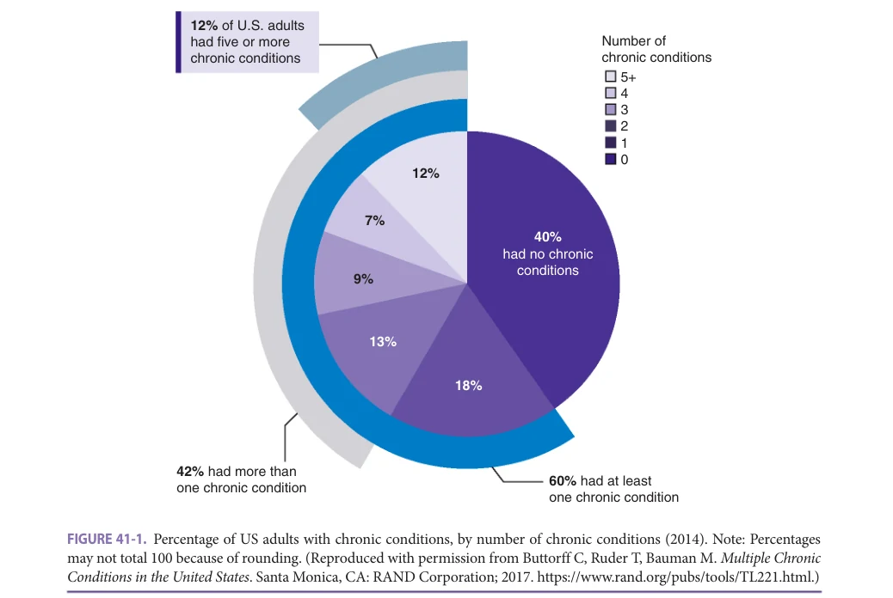
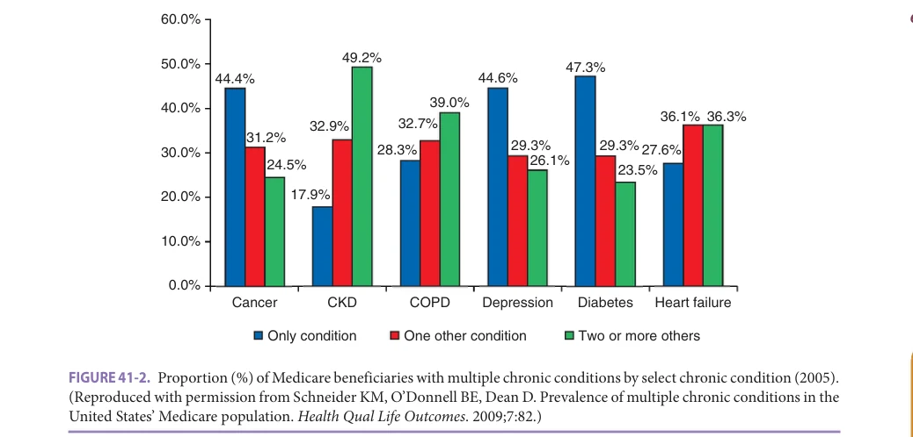
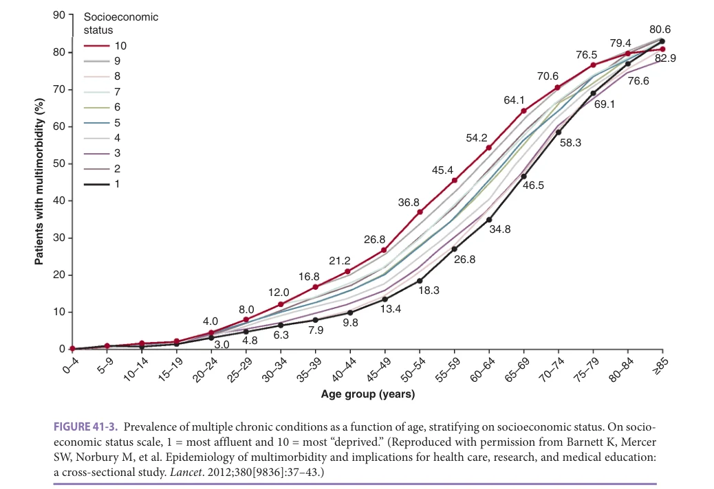
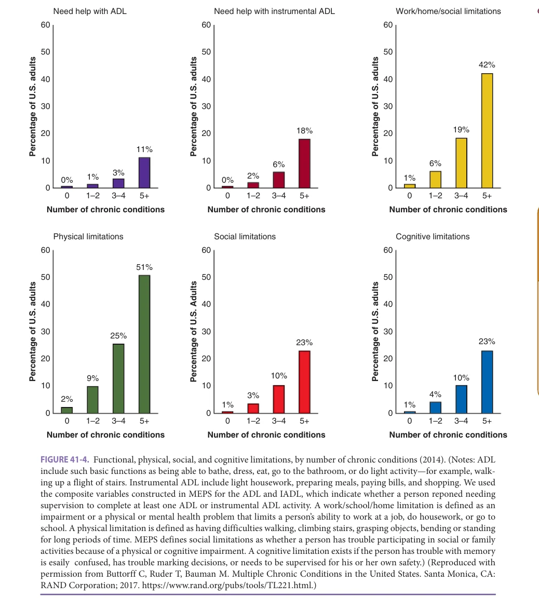
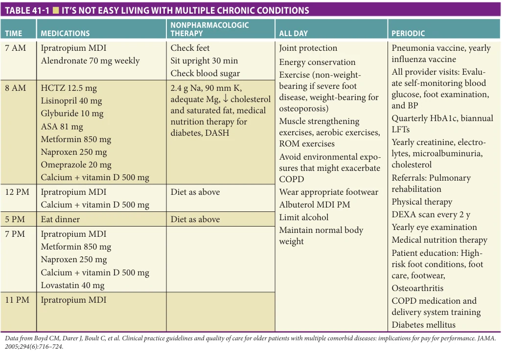

# Hazzard's Geriatric Medicine and Gerontology, 8e - Chapter 41: Managing the Care of Patients with Multiple Chronic Conditions

Stephanie Nothelle, Francesca Brancati, Cynthia Boyd

> **Status.** Fast build from the book; not lane-reviewed.

> Not cited in the 2020-2026 past papers.

> **Source and method.** Printed pages 605-614, from the marked 8th-edition copy (PDF page = printed page + 34). Prose follows its text layer; tables and figures are source-page crops. The book is canonical.

**[p. 605]**

## INTRODUCTION

Worldwide, one in three adults has more than one chronic condition, and in the United States, more than half of older adults have three or more chronic conditions. Multiple chronic conditions present unique challenges for older adults, their families, and clinicians. Older adults with multiple chronic conditions are at greater risk of death, functional decline, diminished quality of life, and long-term care placement. Clinicians who care for adults with multiple chronic conditions have limited evidence to draw upon and are often asked to follow disease-specific guidelines with conflicting and interacting treatment plans. Providing person- and family-centered care for older adults with multiple chronic conditions is a key skill of geriatric medicine.

#### Learning Objectives

- Discuss implications of multiple chronic conditions for older adults and their families, the health care system, and society.

- Describe one common clinical challenge in the care of a person with multiple chronic conditions.

- Explain suggested approaches to the care of an older adult with multiple chronic conditions.

#### Key Clinical Points

1. Having multiple chronic conditions is the most common condition—over 63% of Americans older than 65 years have at least two chronic medical conditions.

2. A challenge in providing care to older adults with multiple chronic conditions is reconciling their care with the specific clinical practice guidelines and recommendations for each of their conditions, given the increased likelihood for polypharmacy and treatment burden.

3. Focusing on older adults’ goals and priorities for their health care, what matters most, is key to providing care in the context of multiple chronic conditions.

This chapter will review the epidemiology and impact of multiple chronic conditions for individuals, clinicians, and society. We will also discuss common challenges that result when caring for someone with multiple chronic conditions and present a suggested approach to caring for older adults with multiple chronic conditions. We will also briefly review the evidence for interventions focused on older adults with multiple chronic conditions. Many chapters in this book focus on individual organ systems and common diseases. This introductory focus on multiple chronic conditions will provide an important context to be considered as each of the subsequent organ- and disease-specific chapters are read.

## TERMINOLOGY

A challenge in addressing the topic of multiple chronic conditions is the lack of consensus around terminology and definitions of the terms used. Two of the most commonly used terms or phrases to describe this issue are “multiple chronic conditions” and “multimorbidity.” While comorbidity is often used synonymously, comorbidity refers to the presence of a second condition in reference to an index condition. For example, a clinician focused on treating hypertension might consider a patient’s comorbid chronic renal disease when choosing an appropriate therapy. When older adults have multiple chronic conditions, it is disjointed and disease-centric to consider each disease as being “index” in sequence, and many times to patients

there is not one central or focal condition. Herein we will use the phrase “multiple chronic conditions.”

In its simplest form, having multiple chronic conditions means having more than one chronic condition. A chronic condition, while also variably defined, is defined per the Centers for Disease Control and Prevention as a condition that lasts at least a year and requires ongoing medical attention and/or limits activities of daily living. However, simply counting chronic conditions fails to acknowledge that not all chronic conditions or combinations of chronic conditions are equal in terms of their effect on patients, their effects on other conditions, or their effect on outcomes such as function and quality of life. The approach to two

**[p. 606]**

*FIGURE 41-1. Percentage of US adults with chronic conditions, by number of chronic conditions (2014). Note: Percentages may not total 100 because of rounding. (Reproduced with permission from Buttorff C, Ruder T, Bauman M. Multiple Chronic Conditions in the United States. Santa Monica, CA: RAND Corporation; 2017. https://www.rand.org/pubs/tools/TL221.html.)*

*Owner annotations/highlights are from the marked source copy, not the book.*

disparate conditions, osteoarthritis and hypothyroidism, is different than the approach to two conditions such as congestive heart failure and chronic kidney disease, where the management of one is intricately tied to the other. Thus, determining which chronic conditions “count” in a definition of multimorbidity is another area of disagreement.

In this chapter we will use the National Quality Forum definition, which states, “Persons with multiple chronic conditions are defined as having two or more concurrent chronic conditions that collectively have an adverse effect on health status, function, or quality of life and that require complex healthcare management, decision-making or coordination.”

## EPIDEMIOLOGY

Due to the variability in definitions of multiple chronic conditions, statistics on multiple chronic conditions can vary dramatically depending on what conditions are being considered. These definitions may include just a handful of common chronic conditions, dozens of physical conditions, or any mental or physical health condition that persists for more than one year and requires ongoing medical attention or limits activities of daily living.

Recent estimates demonstrate that over 42% of American adults have at least two chronic conditions and up to 12% have five or more chronic conditions when including

any physical or mental chronic condition (Figure 41-1). When considered by age group, up to 50% of Americans between ages 45 and 65, and over 80% of Americans older than age 65, have multiple chronic conditions. Prevalence of multiple chronic conditions is highest in non-Hispanic White adults at 31% and lowest among Hispanic adults and non-Hispanic Asian adults, at 18% and 16%, respectively, when considering 10 common physical conditions. Men and women older than age 65 have an equal prevalence of multiple chronic conditions. Differences in multimorbidity prevalence by insurance status have also been demonstrated. In adults older than age 65, patients on both Medicare and Medicaid have the highest prevalence of multiple chronic conditions (77%), while patients on Medicare fee-for-service have the lowest prevalence of multiple chronic conditions (59%). Sixty-three percent of both Medicare with Medicare Advantage and private insurance holders have multiple chronic conditions, with similar or higher rates likely among the uninsured.

The most common chronic conditions in the United States are hypertension (27% of American adults aged 18 and older in 2014), high cholesterol (22%), and mood disorders (12%). Currently the chronic disease that is most associated with a second chronic condition is kidney disease, with 81% of chronic kidney disease patients on Medicare having at least one other chronic condition (usually diabetes or congestive heart failure) (Figure 41-2). Among American adults between 2008 and 2014, men saw the highest increase

**[p. 607]**

*FIGURE 41-2. Proportion (%) of Medicare beneficiaries with multiple chronic conditions by select chronic condition (2005). (Reproduced with permission from Schneider KM, O’Donnell BE, Dean D. Prevalence of multiple chronic conditions in the United States’ Medicare population. Health Qual Life Outcomes. 2009;7:82.)*

*Owner annotations/highlights are from the marked source copy, not the book.*

in prevalence of hypertension (2.5% increase) while women saw the highest increase in mental health conditions (4% increase in anxiety disorder alone). Studies that include mental health in their definition of chronic conditions demonstrate a positive correlation between the number of chronic conditions and the onset of depression. Depression was found in 14% of adults between ages 50 and 74 with one physical chronic condition, 21% of people with two chronic conditions, 30% of people with three chronic conditions, and 37% of people with four chronic conditions. In 2014, mood and anxiety disorders were the third and fifth most prevalent chronic conditions in American adults.

In the United States, rural populations have a higher prevalence of multiple chronic conditions than urban populations (35% vs 26%). Socioeconomic status has also been found to impact the prevalence of chronic multimorbidity in high income countries. A 2012 study found that on average, populations living in the poorest areas of Scotland had a 10- to 15-year earlier onset of multimorbidity compared to their peers living in most affluent neighborhoods. The disparity in the prevalence of multiple chronic conditions by socioeconomic status begins in the second decade of life and disappears in the eighth decade, perhaps due to survival bias (Figure 41-3). All socioeconomic groups show a steep increase in the prevalence of multiple chronic conditions starting at age 50 (see Figure 41-3). This study also found that low socioeconomic status was found to be particularly linked to the presence of mental health disorders cooccurring with multiple chronic conditions. However, there is only a weak correlation between socioeconomic status and multiple chronic condition prevalence globally. This is potentially because many behaviors that confer risk for chronic conditions (smoking, physical inactivity, alcohol consumption, unhealthy diet, etc) are more common among people of low socioeconomic status in high-income countries but

are more common among those with higher socioeconomic status in low- and middle-income countries.

## IMPACT

The impacts of multiple chronic conditions on older adults and their families/friends, the health care community, and society are extensive. Impacts include use of health care, complications from health care, and functional and quality of life outcomes relevant to the daily lives of older adults and their loved ones.

Patients with multiple chronic conditions require more health care resources. When taking all chronic conditions into account, Americans who have three or more chronic conditions make up 28% of the population but 67% of health care expenditures. The more concurrent chronic conditions a patient has, the greater health care expenditures they incur. In 2005, Medicare beneficiaries with no chronic conditions amassed health care costs of about $3000, while patients with two and three or more chronic conditions amassed costs of about $16,400 and $35,700, respectively. Further, patients with three or more chronic conditions spend 6.6 times as much on medications than their peers with no chronic conditions and 2.1 times more than their peers with one or two chronic conditions. Patients with multiple chronic conditions also use a greater proportion of the resources in the health care system, seeing both primary care and specialty physicians 2 to 5 times more often than their peers without chronic conditions. The number and duration of hospital stays also correlates with the presence of multiple chronic conditions; older adults with three or more chronic conditions have 14.6 times more hospital stays and spend 25 times more nights in a hospital than their peers without any chronic conditions. Further, older adults with four or more chronic conditions are 90 times as

**[p. 608]**

*FIGURE 41-3. Prevalence of multiple chronic conditions as a function of age, stratifying on socioeconomic status. On socioeconomic status scale, 1 = most affluent and 10 = most “deprived.” (Reproduced with permission from Barnett K, Mercer SW, Norbury M, et al. Epidemiology of multimorbidity and implications for health care, research, and medical education: a cross-sectional study. Lancet. 2012;380[9836]:37–43.)*

*Owner annotations/highlights are from the marked source copy, not the book.*

likely to incur hospital admissions than someone without any chronic conditions.

In addition to increased cost of care, older adults with multiple chronic conditions also tend to experience a lower quality of care. Older adults with multiple chronic conditions are more likely to experience adverse drug effects, including drug-drug interactions, as well as experience greater difficulty in participating in their own care due to the complexity of their health conditions, when compared to adults without multiple chronic conditions. Additionally, different combinations of conditions are associated with receiving lower quality treatment. Adults with both psychoses and arthritis, for example, are less likely to receive treatment for arthritis than individuals with arthritis alone. For other combinations of conditions, however, the opposite trend is seen. For instance, older adults are more likely to be treated for psychiatric disorders if they have a concurrent somatic chronic condition, such as diabetes.

Older adults with multiple chronic conditions report experiencing a lower quality of life and greater functional disability than their peers, though some conditions have a larger impact on quality of life and disability than others. Adults with multiple chronic conditions require more help with activities of daily living and experience more social, home, work, physical, and cognitive limitations than their peers without chronic conditions—these limitations

increase with the number of chronic conditions a person has (Figure 41-4). Older adults in particular experience more limitations in daily activity and cognitive ability than younger adults with the same number of chronic conditions.

Out of 10 common chronic conditions, a 2014 crosssectional study of Spanish adults older than 50 years found depression, anxiety, and stroke to have the greatest impact on quality of life and disability scores. Hypertension had the least impact on both quality of life and disability scores, as defined by the World Health Organization Quality of Life instrument and Disability Assessment Schedule. While an increasing number of chronic conditions generally correlated with worse quality of life and disability scores in both genders, women tended to report worse quality of life and disability scores than men for the same number of conditions. Women with two chronic conditions, for example, had an average disability score of 9.9, compared to 7.3 for men. Additionally, there was some variation in the impact of certain conditions on disability scores between the sexes. Women reported worse disability outcomes for anxiety and angina than men did, while men reported worse disability outcomes for edentulism and asthma than women. It should be noted that not all concurrent chronic conditions confer worse quality of life than having a single chronic condition. Chronic obstructive pulmonary disease (COPD) and asthma, for example, have overlapping symptoms and therefore have not been shown to

**[p. 609]**

*FIGURE 41-4. Functional, physical, social, and cognitive limitations, by number of chronic conditions (2014). (Notes: ADL include such basic functions as being able to bathe, dress, eat, go to the bathroom, or do light activity—for example, walking up a flight of stairs. Instrumental ADL include light housework, preparing meals, paying bills, and shopping. We used the composite variables constructed in MEPS for the ADL and IADL, which indicate whether a person reponed needing supervision to complete at least one ADL or instrumental ADL activity. A work/school/home limitation is defined as an impairment or a physical or mental health problem that limits a person’s ability to work at a job, do housework, or go to school. A physical limitation is defined as having difficulties walking, climbing stairs, grasping objects, bending or standing for long periods of time. MEPS defines social limitations as whether a person has trouble participating in social or family activities because of a physical or cognitive impairment. A cognitive limitation exists if the person has trouble with memory is esaily confused, has trouble marking decisions, or needs to be supervised for his or her own safety.) (Reproduced with permission from Buttorff C, Ruder T, Bauman M. Multiple Chronic Conditions in the United States. Santa Monica, CA: RAND Corporation; 2017. https://www.rand.org/pubs/tools/TL221.html.)*

*Owner annotations/highlights are from the marked source copy, not the book.*

worsen quality of life in patients with both conditions compared to patients with only one.

## CHALLENGES AND POTENTIAL SOLUTIONS

There are numerous challenges for patients, their families, clinicians, and society as a result of multiple chronic conditions. In this section of the chapter, we will focus on a few of the most commonly encountered challenges in clinical practice.

### Clinical Practice Guidelines

Many people with multiple chronic conditions experience disease-focused, not patient-centered care, in part due to the focus of clinical practice guidelines on specific diseases. Single disease-focused clinical practice guidelines are often applied in the care of people with multiple chronic conditions, despite the fact that there are limitations to the applicability of these guidelines to this population.

**[p. 610]**

*TABLE 41-1 ■ IT’S NOT EASY LIVING WITH MULTIPLE CHRONIC CONDITIONS*

*Owner annotations/highlights are from the marked source copy, not the book.*

A study that delineated the treatment regimen that would arise from implementation of clinical practice guidelines for an older woman with five common chronic conditions (COPD, hypertension, diabetes, osteoarthritis, and hypertension) resulted in 12 different medicines, in 19 doses per day, with a high degree of medication regimen complexity (Table 41-1)

Many single disease guidelines only address people with multiple chronic conditions in a limited fashion, and many fail to incorporate many patient-centered topics, like how to incorporate patient preferences. Applying the guidelines to older adults with multiple chronic conditions thus takes interpretation on the part of the clinician. Suggestions for interpreting the evidence in the context of multiple chronic conditions and incorporating guideline-based recommendations into the overall care plan are outlined below.

### Polypharmacy, Potentially Inappropriate Medications, and Deprescribing

As expected, having multiple chronic conditions is a strong risk factor for polypharmacy. Approximately 50% of people 65 years or older take more than five regular medications and up to 91% of people living in long-term care take five or more regular medications.

Polypharmacy has significant negative consequences for patients. Taking more than four medications is associated with a higher risk of injurious falls and the risk of having a fall further increases with each additional medication, regardless of the type of medication. Polypharmacy can be appropriate in some patients (referred to as “evidence-based polypharmacy”), but even when the medications are recommended for individual conditions (ie, in guidelines), they may not always be effective or safe in a person with multiple chronic conditions.

Frequently people with polypharmacy are taking potentially inappropriate medications, in which the risks of medication use may outweigh the benefit (eg, high risk and unnecessary medications). Twenty to seventy-nine percent of older adults are taking at least one potentially inappropriate medicine, which puts them at increased risk of adverse drug events and mortality.

Several assessment tools exist for potentially inappropriate medications including explicit tools such as the Beers Criteria, STOPP (Screening Tool of Older People’s Prescriptions), and START (Screening Tool to Alert to the Right Treatment), and implicit criteria such as the Medication Appropriateness Index. The Beers Criteria are regularly updated by a panel through the American Geriatrics Society and contain a list of medications for which the risk

**[p. 611]**

of adverse effects may exceed the benefit of the medication. The STOPP and START criteria have clear standards to guide clinicians in decision making about stopping a potentially risky medication and starting a new, alternative medication. In contrast, the Medication Appropriateness Index relies on 10 questions to ask about each medication. This tool relies on physician judgment, which allows for a more patient-centered approach but is much more time consuming to apply than the explicit tools such as the Beers Criteria and STOPP and START.

Although there is considerable information to guide prescribers in the safe and effective initiation of new medications, there is a proportionate lack of guidance regarding how inappropriate medications should be safely and effectively discontinued. Stopping or decreasing medications is referred to as deprescribing. Patients are more likely to consider deprescribing if their physician recommends it. Reasons to consider deprescribing a medication include, but are not limited to, lack of a valid indication for the medication in the patient’s medical history, duplicative therapy (eg, proton pump inhibitor and H2-blocker), dose adjustment for hepatic or renal impairment, drug-drug/ drug-food/drug-disease interactions, lack of time to benefit, low magnitude of effect, adverse drug events, and medication cost.

Patient and family preferences and goals of therapy need to be considered when selecting medications for deprescribing. Once a medication is selected for deprescribing, a plan should be made to taper or stop the medication and to monitor for effects of the change. Guidelines including algorithms to stop certain medications (eg, proton pump inhibitors, antihyperglycemics) as well as shared decision-making aids are available through the Canadian Deprescribing Network at www.deprescribing.org.

### Limited Evidence

Older adults with multiple chronic conditions are often excluded from clinical trials that are focused on examining a single disease. The average clinical trial participant has half the number of chronic conditions as the average primary care patient. The lack of evidence on how to treat an older adult with multiple chronic conditions can be frustrating for clinicians who are forced to make assumptions about how other conditions and treatments may interact.

Enrolling large numbers of older adults with multiple chronic conditions for participation in clinical trials is challenging given typical exclusion criteria and study protocols. Once recruited, retention in studies requires specific protocols and resources that maximize the participation of older adults. Concerns about missing data can be addressed with proactive attention to retention and analytic approaches, as the NIH Inclusion Across the Life Span program advocates. Moreover, as noted above, multiple chronic conditions can be very heterogeneous, which presents challenges when trying to create counterfactual populations in clinical trials, but analyses based on multivariate risk prediction are

opportunities to avoid the challenges of multiple subgroup analyses. Innovative approaches to address the net balance of benefits and harms, across multiple dimensions of heterogeneity can help synthesize the evidence base in such a way that existing data can inform care for older adults with multiple chronic conditions. However, currently we have inadequate evidence to inform many decisions for older adults with multiple chronic conditions. The lack of evidence on how to treat an older adult with multiple chronic conditions can be challenging for clinicians who are forced to make assumptions about how other conditions and treatments may interact as they care for older adults.

To help clinicians address this challenge, the American Geriatrics Society Expert Panel on the Care of Older Adults with Multimorbidity has proposed several questions to consider when reviewing the literature for adults with multiple chronic conditions as part of a set of Guiding Principles, described further. First, the panel suggests considering whether older adults with multiple chronic conditions were included in the trial and if so whether specific chronic conditions modified the treatment effect; for example, whether chronic renal disease made a given treatment less effective or more likely to cause side effects.

The panel also suggests considering the strength or quality of the evidence and whether the outcome examined is one that is important to older adults with multiple chronic conditions. Clinical trials will often include endpoints that are markers of disease (eg, low-density lipoprotein level or change in forced expiratory volume in 1 second). Such an outcome is likely seen as less important to an older adult than whether or not they have a stroke that requires hospitalization or if the distance they can walk is limited by their shortness of breath.

Harms and benefits should also be weighed. In addition to considering whether a treatment effect was observed, a clinician might consider whether adverse effects were sufficiently explored and reported and how the proposed treatment might interact with an older adult’s other treatments. Specifically, financial cost and treatment burden or complexity of the treatment should be considered as they are associated with adherence.

Finally, two concepts to consider when interpreting the results include absolute risk reduction (ARR) and time to benefit. Many studies report the relative risk reduction (RRR) rather than the ARR. The ARR is the difference in risk between the two groups being compared (eg, baseline risk compared to risk of an outcome with a treatment) while the RRR is the ARR divided by the baseline risk. As an example, if the risk of a negative outcome is 2% in the placebo group and 1% in the treatment group, this amounts to a 1% ARR and a 50% RRR. Presence of multiple chronic conditions can impact the baseline risk of a given outcome and may change the magnitude of the RRR, making interpretation of these values challenging. Focusing on the RRR promotes overestimation of the effect. Thus, focusing on the ARR can help ground the clinician’s interpretation of effect. Lastly, time to

**[p. 612]**

benefit is the time it takes to achieve an observable and clinically meaningful change in a given outcome as a result of the treatment. Time to harm is a similar concept that examines the time it takes to observe an adverse effect. These values can help guide a clinician who is treating an older adult with multiple chronic conditions who may have limited life expectancy. If the time to benefit from a treatment is 5 years, but the older adult is unlikely to live that long, then it may not be helpful to start the treatment.

### Coordination of Care

Older adults with multiple chronic conditions typically see many clinicians from many specialties, which require coordination of care. The number of different physicians seen each year by the average Medicare beneficiary ranges from 4 for those with just 1 condition to 14 for those with 5 or more chronic conditions. As the number of physicians seen increases, the need for coordination across providers increases in turn.

Coordination of care is important for older adults with multiple chronic conditions. Care that is scattered across providers increases risk of unnecessary tests and procedures, which exposes individuals to harm and adds burden to the patient and his/her caregivers who need to arrange for what is ordered. Much of this fragmentation reflects a health care system that was designed for single disease, episodic care, and has been slow to adapt to the care of older adults with multiple chronic conditions.

Historically, the primary care clinician has been seen as the physician responsible for coordinating care across providers, however, given time constraints and administrative burdens, it may be challenging for primary care clinicians to coordinate across all of the specialists involved in an older adult’s care. To address the gap in coordination, health care entities are increasingly employing professionals in coordination roles. While the titles for these positions are varied, care manager or case manager is commonly used. Typically, these positions are filled by someone who is a nurse or social worker by training. The care manager is charged with helping a panel of complex older adults, usually with multiple chronic conditions, with coordination of care and disease self-management. While data on the success of these programs is mixed, some have showed the ability to improve outcomes and lower health care costs. Further discussion on interventions targeting older adults with multiple chronic conditions is below.

### Including the Caregiver

Most of the care for older adults with multiple chronic conditions is provided by informal caregivers. Herein, we will use the term “caregiver” to refer to an unpaid family member or friend who assists the patient with their care and daily activities and “care recipient” to refer to the person with multiple chronic conditions who is receiving the care. In addition to helping with self-care, emotional support, and household activities, almost half of caregivers also help

with health care activities (eg, coordinating and attending health care visits, managing medications). Individuals who primarily help with health care activities may not view themselves as caregivers; the phrase “care partners” is increasingly used to recognize that care can be bidirectional or that the care recipient can still play an active role in their care. For example, among two spouses, each may help each other with different tasks. Caring for persons with multiple chronic conditions has been associated with increased caregiver burden and reduced health related quality of life for the caregiver; however, having a caregiver is associated with improved medication adherence, healthy lifestyle behavior promotion, and reduced emergency services utilization for the care recipient.

Despite the significant role caregivers play in delivering care to a person with multiple chronic conditions, caregivers are not routinely identified or supported in health care delivery, which is typically focused on the patient (the care recipient). Further, evidence from national studies suggest that almost one half of older adults’ caregivers were not asked during routine health care encounters if they needed help managing older adults’ care. Some of this may be a consequence of health care providers such as physicians and nurses feeling uncertain about how to interact with caregivers. It may be challenging to effectively partner with a caregiver while respecting patient privacy and autonomy and balancing differences in health care priorities and goals between the care recipient and caregiver. Although the evidence regarding how to be work with caregivers in the health care setting is still limited, some best practice suggestions have been put forth by the National Academies for Science, Engineering, and Medicine in their report “Families Caring for an Aging America” including routinely identifying caregivers who are involved in an older adult’s care, assessing the caregiver’s needs, and supporting identified needs through appropriate referrals and connections to services in the health care system and community.

## APPROACH TO THE PATIENT WITH MULTIPLE CHRONIC CONDITIONS

Given the limited evidence surrounding care of older adults with multiple chronic conditions, many of the currently available recommendations are derived from expert opinion. The American Geriatrics Society convened two work groups to create five guiding principles for the management of multiple chronic conditions and a framework with Action Steps to translate the principles into patient care decisions. Below we provide some suggestions for approaching clinical care for adults with multiple chronic conditions based on the Action Steps proposed by the American Geriatrics Society.

### Focus on Patient Goals and Priorities

Older adults with multiple chronic conditions are likely to vary significantly in their care preferences, medical condition, and life context. Thus, eliciting and communicating a

**[p. 613]**

patient’s goals and priorities for their health care are vitally important in the care of older adults with multiple chronic conditions.

There are several validated tools to elicit a patient’s health priorities. For all older adults with multiple chronic conditions the “Patient Priorities Identification” tool (available at: www.patientprioritiescare.org) and validated questions available through the American Geriatrics Society (GeriatricsCareOnline.org) can help guide a conversation. Others such as VITALtalk (www.vitaltalk.org) and Prepare for your Care (www.prepareforyourcare.org) are more appropriate in advanced illness. Priorities and goals can shift over time so reviewing and updating established goals and priorities, particularly after a major change in condition or life circumstances (eg, functional decline, loss of a spouse), is important. Finally, once the priorities and goals are identified, they should be clearly documented in the medical record and shared with all members of the care team.

### Consider the Patient’s Health Trajectory

Assessing and discussing a patient’s health trajectory is also important in the overall care of older adults with multiple chronic conditions. Health trajectory refers to likely pathways or patterns of change in function, health status, or quality of life, including likelihood of death. While there are unfortunately few tools to estimate changes in function, health status, or risk of death, a discussion with the patient and family of general expectations for changes in quality of life or function may be just as helpful as a more precise prognosis. For example, framing a decision or discussion into time frames of 1–2, 2–5, 6–10, or 10+ years can be helpful. An online repository of calculators to estimate life expectancy is available at www.eprognosis.org. Other practical considerations for specific clinical care decisions include using the estimated “time to benefit” or lag time for an estimated intervention. For example, the time to benefit for many cancer screenings is estimated at 10 years while the time to the benefit from antihypertensive therapy is 2 to 3 years. Having this information in mind can help guide a patient to make a decision about what is best for them.

Prior to discussing health trajectory and life expectancy with a patient, it is wise to explore whether and how much the patient would like to discuss this topic and what information he or she is interested in knowing (eg, need for repeated hospitalizations or need to move to a more supportive living environment). Potential ways to bring up this conversation include asking “What is your understanding of how your illnesses will affect your day-to-day life and your health?” and following up with, “Would you like to talk more about this?” Some patients may have a hard time articulating what they do or do not want to know and providing options can be helpful. For example, “Some of my patients want a big picture view of what to expect; others want lots of details about what might happen; and some don’t want to talk about this at all. What is best for you?”

### Consider Treatment Complexity and Treatment Burden

Older adults with multiple chronic conditions are asked to take on a great number of health care and self-management tasks (also discussed in Chapter 25). The negative effect of managing health related treatments and tasks on quality of life is referred to as treatment burden. Approximately 40% of older adults report some degree of treatment burden. Older adults and their caregivers spend an average of 2 hours a day on health care related tasks (eg, measuring blood sugar) and 2 hours for each health care visit. Treatment burden increases the risk of nonadherence to effective treatments, which may lead to poor outcomes (eg, uncontrolled blood pressure) that in turn lead to health care professionals further intensifying the treatment. Minimizing treatment burden is thus not only important for patient and family quality of life but it also provides an opportunity to stop burdensome care and start more beneficial and goal concordant care. While tools to measure treatment burden exist, they are multiquestion surveys which in current form are likely more useful in the research than in the clinical setting.

### Refine the Treatment Plan Based on Patient Priorities and Health Trajectory

Using the patient’s care priorities as a guide, all health care activities (medications, visits, self-management tasks) should be reviewed and modified as appropriate from time to time. Care that is harmful, burdensome, or misaligned with patient care priorities should be stopped. Consider a patient’s health trajectory and the time to benefit (lag time) for treatments such as cancer screening and each medication when deciding whether to start, continue, or stop a medication.

A key step in refining care for older adults with multiple chronic conditions is to align care decisions across all parties—patients, family, and other clinicians. Having all parties agree and focus on the patient’s health priorities and health trajectory as guiding principles in care decisions can be helpful. Further, patients and family involved in care should be invited to be active participants in the decisionmaking process.

Aligning the perspectives of all parties can be challenging when individuals have different perspectives. For example, patients and clinicians may have different perspectives about starting or stopping a medication. Sometimes this is due to a disconnect between the patient’s goals and their preferences (what they are willing to do) and discussing this discrepancy can help decision making. Other times, patients and clinicians may simply not agree and it is best to accept the patient’s decision and move forward, revisiting the topic in the future if appropriate. When clinicians have different perspectives, it can help to focus on the patient’s priorities instead of individual diseases using the principles of collaborative negotiation (eg, define the issue around a common goal, make sure all parties are using the same information, identify sources of differing recommendations, brainstorm therapeutic alternatives).

**[p. 614]**

## INTERVENTIONS TARGETING CARE OF PEOPLE WITH MULTIPLE CHRONIC CONDITIONS

A Cochrane review published in 2015 examined 17 interventions aimed at improving care for persons with multiple chronic conditions. Most of the studies (12 of 17) utilized an organizational or system level approach to improving care through utilization of a care or case manager to assist with coordination of care and self-management. The remaining five studies focused on patient education and engagement directly through chronic disease self-management and patient engagement workshops. The interventions resulted in modest improvements in mental health outcomes and possible improvements in functional outcomes, in the studies that reported these outcomes. However, there were no clear positive improvements in clinical outcomes (eg, blood pressure, symptom scores), health service use, medication adherence, patient-related health behaviors, health professional behaviors, or costs. The authors suggest that interventions are most successful when they are integrated into

existing health care systems and when they focus on specific problems or outcomes experienced by people with multiple chronic conditions.

## CONCLUSIONS

Effectively caring for the growing population of older adults with multiple chronic conditions is a key component of geriatric medicine. While there are several challenges to caring for this population such as limited evidence to guide care and disease-based clinical practice guidelines, focusing on patient and family preferences and considering the patient’s overall health trajectory and burden of treatment can help a clinician effectively tailor care. In many chapters of this book, several common conditions and their treatments are reviewed in detail within the confines of each individual organ system. We encourage the reader to remember the key principles of this chapter when considering how to implement disease-specific recommendations in the care of an older adult who has multiple chronic conditions.

## FURTHER READING

American Geriatrics Society Expert Panel on the Care of

Older Adults with Multimorbidity. Patient-centered care for older adults with multiple chronic conditions: a stepwise approach from the American Geriatrics Society: American Geriatrics Society Expert Panel on the Care of Older Adults with Multimorbidity. J Am Geriatr Soc. 2012;60(10):1957–1968. Barnett K, Mercer SW, Norbury M, Watt G, Wyke S,

Guthrie B. Epidemiology of multimorbidity and implications for health care, research and medical education: a cross-sectional study. Lancet. 2012;380(9836):37–43. Boersma P, Black LI, Ward BW. Prevalence of multiple

chronic conditions among US adults, 2018. Prev Chronic Dis. 2020;17:200130. Boyd CM, Darer J, Boult C, Fried LP, Boult L, Wu AW.

Clinical practice guidelines and quality of care for older patients with multiple comorbid diseases: implications for pay for performance. JAMA. 2005;294(6):716–724. Boyd C, Smith CD, Masoudi FA, et al. Decision making for

older adults with multiple chronic conditions: executive summary for the American Geriatrics Society Guiding Principles on the Care of Older Adults with Multimorbidity. J Am Geriatr Soc. 2019;67(4):665–673. Buttorff C, Ruder T, Bauman M. Multiple chronic condi-

tions in the United States. Santa Monica, CA: RAND Corporation, 2017. Available at https://www.rand.org/ pubs/tools/TL221.html. Accessed February 2, 2022.

Garin N, Olaya B, Moneta MV, et al. Impact of multimor-

bidity on disability and quality of life in the Spanish older population. PLoS One. 2014;9(11):e111498. Goodman RA, Ling SM, Briss PA, Parrish RG, Salive ME,

Finke BS. Multimorbidity patterns in the United States: implications for research and clinical practice. J Gerontol A Biol Sci Med Sci. 2016;71(2):215–220. Guiding principles for the care of older adults with

multimorbidity: an approach for clinicians. Guiding principles for the care of older adults with multimorbidity: an approach for clinicians: American Geriatrics Society Expert Panel on the Care of Older Adults with Multimorbidity. J Am Geriatr Soc. 2012;60(10):E1–E25. Hajat C, Stein E. The global burden of multiple chronic

conditions: a narrative review. Prev Med Rep. 2018;12: 284–293. Lehnart T, Heider D, Leicht H, et al. Review: health care uti-

lization and costs of elderly persons with multiple chronic conditions. Med Care Res Rev. 2011;68(4):387–420. Schneider KM, O’Donnell BE, Dean D. Prevalence of mul-

tiple chronic conditions in the United States’ Medicare population. Health Qual Life Outcomes. 2009;7(1):82. Vogeli C, Shields AE, Lee TA, et al. Multiple chronic condi-

tions: prevalence, health consequences, and implications for quality, care management, and costs. J Gen Intern Med. 2007;22(Suppl 3):391–395.
