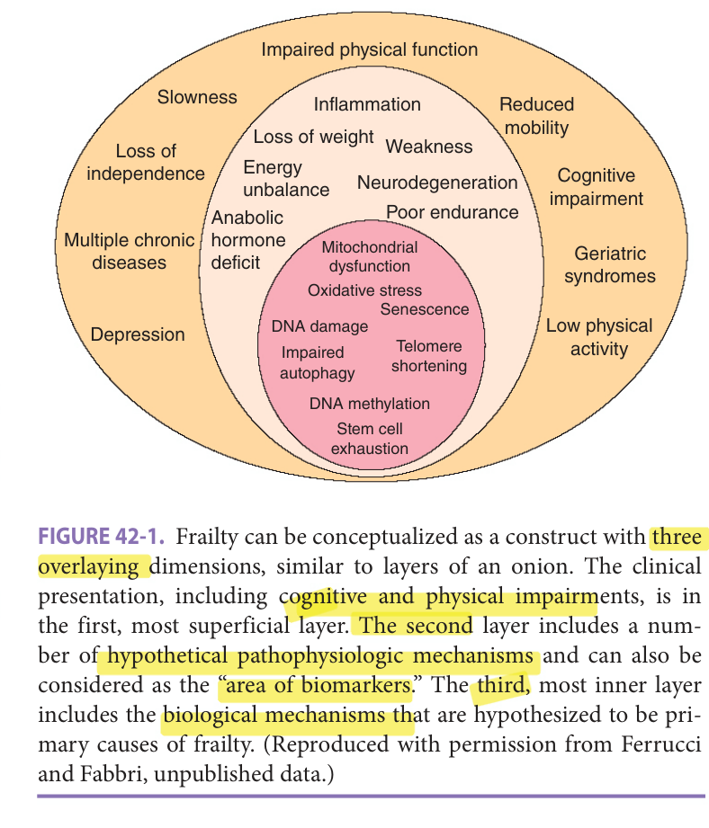
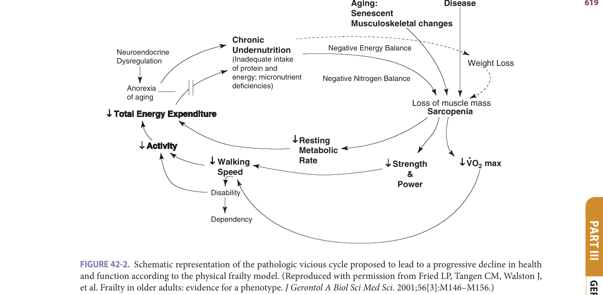
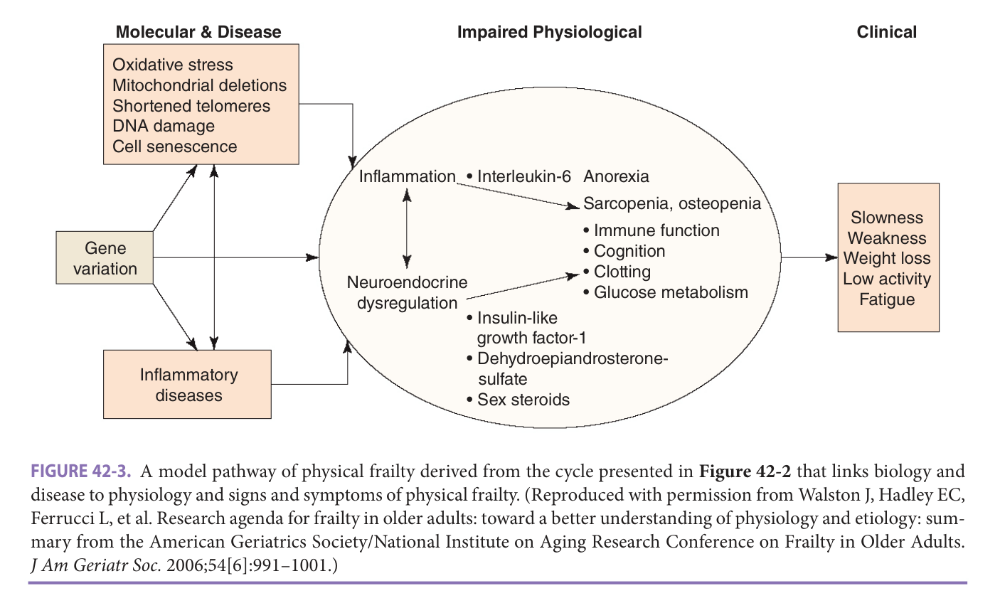
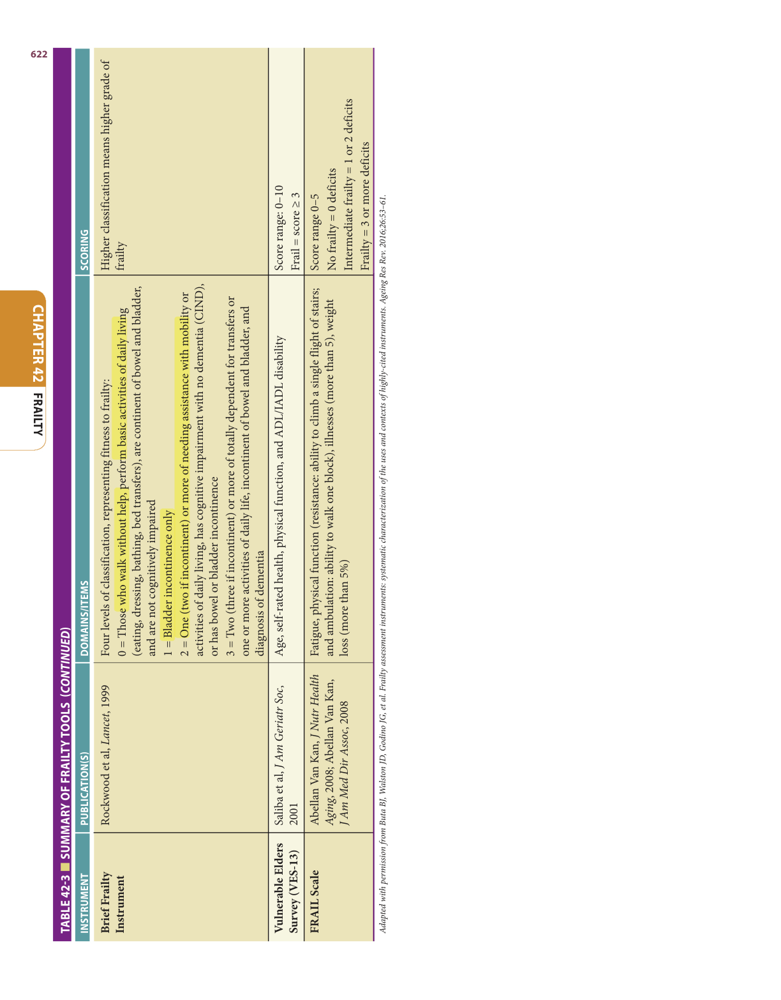
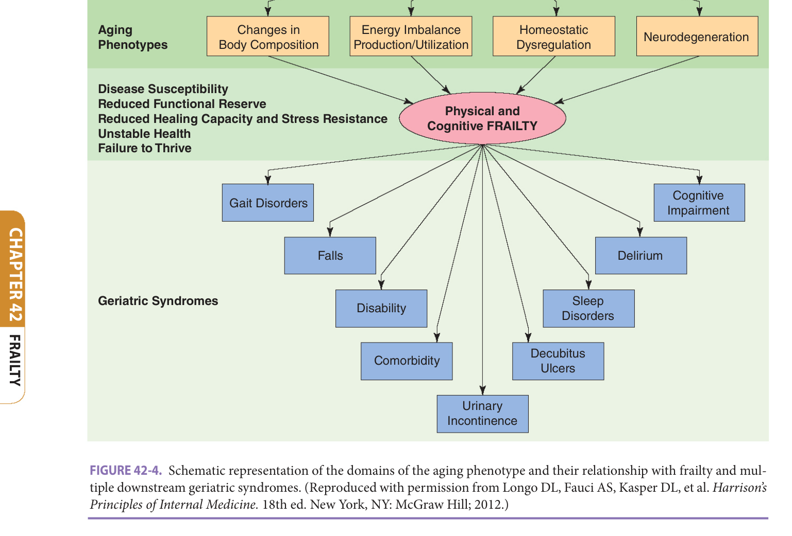
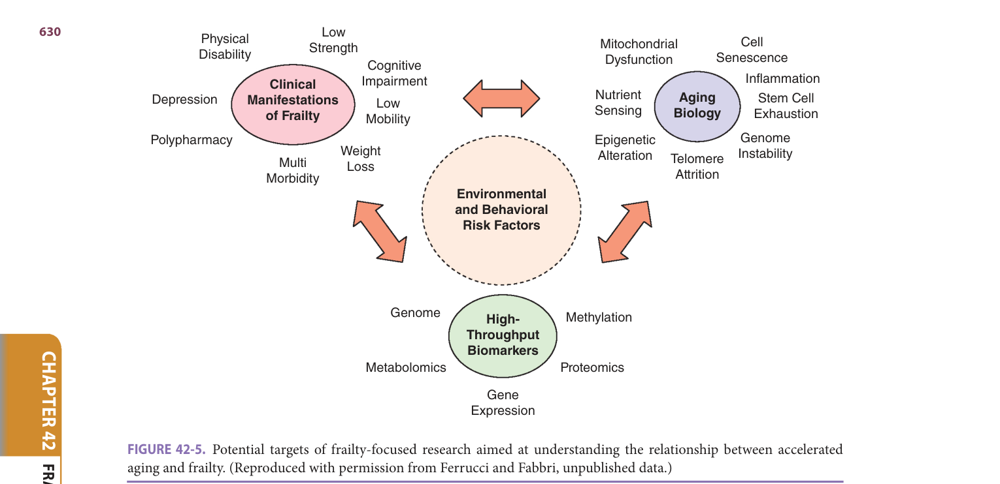

# Hazzard's Geriatric Medicine and Gerontology, 8e — Chapter 42: Frailty

Luigi Ferrucci, Jeremy D. Walston

> **Lane-reviewed against the book, 25 Sep 2026.**

**[p. 615]**

#### Learning Objectives

- Gain perspective about the general concept of frailty in older persons.
- Understand alternative operational definitions of frailty.
- Recognize frailty in older persons.
- Understand the etiologic contributions to frailty.
- Understand clinical conditions that may impact frailty in older adults.
- Understand frailty as the final stage of processes that start early in life and are due to the progressive imbalance between damage accumulation and resilience capacity.

#### Key Clinical Points

1. Frailty is a syndrome often observed in older persons. It is strongly associated with a broad range of adverse outcomes, including physical and cognitive disability, increased health care utilization, and early death.
2. Although there are many operational definitions of frailty, the most widely utilized in clinical and epidemiological studies is physical frailty, which includes measures of unintentional weight loss, weakness, slow gait, exhaustion, and low activity.
3. Aging phenotypes that are closely related to frailty and late-life decline include (1) imbalance in the signaling networks that maintain homeostatic equilibrium and stress responses, (2) changes in body composition, (3) imbalance between energy availability and energy demand, and (4) neurodegeneration/neuroplasticity.
4. Frailty occurs when mechanisms of resilience that reduce damage accumulation are exhausted and the potential to recover from even subliminal stresses declines.
5. The failing of resilience and the accumulation of damage are associated with a chronic proinflammatory state.
6. Frailty can be conceptualized as a final common outcome of accelerated aging processes.
7. Frailty ascertainment is essential to optimize medical and surgical treatment of older persons who may be vulnerable to related adverse outcomes.
8. The paradigm of precision medicine provides an ideal entry point for frailty measurement into clinical medicine.

### Introduction

Over the past century, the science of clinical medicine, the identification of risk factors for disease  states, and the discovery of specific pathophysiologic mechanisms have greatly improved treatment and preventive strategies and increased longevity around the world. From 1900 to 2013, and in spite of the aging of the population, the percentage of the population who died every year fell from 2.5% to 0.7% and life expectancy at birth rose from 47 to 79 years. Death rates have been strongly affected by improvement in living conditions, availability of energy and clean water, and later on by smoking reduction, treatment of hyperlipidemia and hypertension, and to some extent progress in medicine. For example, heart disease death rates declined by almost two-thirds during the past 50 years, and stroke rates declined by more than three-quarters (http://www.cdc.gov). In spite of the relative success in the early detection of major diseases, the current approach remains “watch and wait” and then intervene to manage the symptoms of many chronic diseases. As a consequence, the mortality of chronic disease patients declined, and many older adults live into a period of life characterized by disease-related multimorbidity and disability (see Chapter 2).

Geriatrics is the medical specialty that first developed the concept that a specific disease diagnosis or an assemblage of diagnoses could not encompass the substantial heterogeneity and complexity of the health problems of many older patients. Knowing the diseases and their clinical stage is not enough to explain presence and severity of physical and cognitive limitations. Prompt diagnosis and optimal care of specific diseases remain an important goal, but the criteria for the definition of “optimal care” may change substantially. There is also evidence that older people respond differently to many treatments when they are affected

**[p. 616]**

by multimorbidity, disability, and geriatric syndromes, although mechanisms for such differential response are still not understood. In other words, to understand and potentially improve the health of their patients, geriatricians should complement their knowledge of internal medicine with sound theory about how multimorbidity, frailty, and functional and cognitive impairment affect prognosis, response to treatments, care needs, and quality of life. As the recognition of rising burden that the aging of the population imposes on people, families, the health care system, and the society as a whole, we have started asking whether the burden imposed by aging was unavoidable or, at least to some extent, could be prevented or “compressed.” In this chapter, we describe the concept of “frailty” as relevant both in the assessment and care of older patients as well as a “state of reference” in the science aimed at identifying individuals who are aging faster than others and at developing interventions that slow down aging and prevents its consequences.

### From Comprehensive Geriatric Assessment To Frailty

Historically, a major focus of geriatric medicine has been to conceptually capture the complexity of older patients and develop standard tools for measuring it. This effort has demonstrated unequivocally that health status in older

patients is best measured by the ability to function in the environment and that functional status provides powerful prognostic information on multiple adverse health outcomes independent of disease status. An array of large epidemiologic studies provided robust evidence that even minor declines in physical function are associated with substantial deterioration of quality of life, are good metrics of disease severity progression, are more accurate and predictive than traditional organ-specific measures, and provide prognostic information for multiple health-related outcomes, including health care resources utilization, progression of disability, and mortality. This bulk of knowledge created the premises for the conceptualization of frailty as a status of susceptibility that is related to diseases, but evolves independently.

### Frailty Conceptual Development And The “LAYERS” Of Frailty

Most health care professionals recognize that there are complexities that are unique to geriatric patients. Despite extensive research with a focus on the development of functional assessment tools and overall functional status, there is still a vacuum of knowledge about the complexity of aging and its relationship with diseases and disability. Understanding physical and cognitive function is clearly important, but this understanding often does not provide clear and specific paths to interventions. Furthermore, since addressing each single disease does not necessarily require information on functional status, ouside the world of geriatric assessment functional status has often been ignored.

Although there is a broad awareness that recognizing diseases is a necessary component of clinical care, there is also evidence that making a diagnosis is not enough to infer prognosis or expected response to treatments and to fully understand health and functional status of older patients. The conceptualization and operationalization of frailty is an attempt to capture the missing components of deteriorating health status that are often overlooked in the traditional medical approach based on disease diagnoses, in order to find the most vulnerable subset of older adults and ultimately develop treatment strategies that can improve their conditions.

It is often argued that clinicians can easily recognize frail older persons when they see and interact with them. This assumption was examined by a formal multistage Delphi process conducted between 2011 and 2012 that asked a large number of geriatricians, health care providers, and experts to identify the critical characteristics that define a frail older person. Not unexpectedly, results were mixed. The majority of participants agreed that frailty should be (1) considered a clinical syndrome that involves multiple physiologic systems, (2) characterized by decreased reserve and impaired ability to respond to stress, and (3) useful in different settings to identify individuals at high

**[p. 617]**
risk of developing adverse health outcomes. However, there was very little agreement on a specific set of clinical measurements and laboratory biomarkers useful for diagnosis. Because of the lack of clarity and the need to determine whether there was sufficient information available to justify systematic screening for frailty, a consensus conference was convened in December 2012. The project was endorsed by experts from six major international scientific societies and included the participation of other independent top experts in the field. Consistent with the previous experience, a construct of frailty emerged as a “medical syndrome with multiple causes and contributors characterized by diminished strength, endurance, and reduced physiologic function that increases an individual’s vulnerability for developing increased dependency and/or death.” There was consensus that because frailty screening is particularly important to identify individuals at risk of disability, the definitions of frailty and disability should not overlap and that frailty cannot be exhaustively defined by the presence of sarcopenia or multimorbidity. The published report from the conference supported screening for frailty in all individuals 70 and older using some of the operational criteria developed and validated. However, the rationale provided in support of population screening was less than robust as there are still no follow-up recommendations to be made to frail individuals. Indeed, at the current time, there is no strong evidence that frailty can be prevented, although observational studies have suggested that following a Mediterranean style diet and being physical active are associated with lower risk of developing frailty. Also, no randomized controlled trial has yet demonstrated that frailty and its consequences on health and function can be reversed. The lack of this information is likely the most important obstacle to the introduction of frailty in routine assessment of older persons.

Specific guidelines on how the presence of frailty should modify treatment strategies are now being published and endorsed by diverse medical societies: surgery, diabetes, pain management, renal and cardiac failure, oncology, pulmonary diseases, and many others. Almost surprisingly, the practice of frailty assessment is being incorporated into the clinical evaluation of these specialties more than in general geriatrics, perhaps because evidence-based general clinical guidelines of management and treatment of frailty have not yet appeared.

Starting from the consensus conclusions above, the complexity of typical frail patients can be conceptualized by considering their features in concentric layers, like the layers of an onion ( **Figure 42-1** ). The first layer is the clinical presentation characterized by _multimorbidity, impaired physical function_ (including loss of mobility) _, cognitive impairment,_ and _mental health problems_.

These characteristics can be considered as the common beacon at the confluence of all frailty characteristics that contribute to the clinical syndrome. The clinical tools to evaluate this layer convey most of the demonstrated prognostic information for disability, mortality, and many other adverse health outcomes. Examples are _walking speed_ , _poor lower extremity performance_ , _reduced physical activity_ , _reduced muscle strength_ , _poor memory_ , _number of diseases_ , _number of drug treatments_ , and many others. Part of this first layer is also a dynamic dimension that is clinically observable, characterized by _reduced functional reserve_ , _impaired resilience_ to a number of stresses, and _delayed and incomplete recovery_ after homeostatic perturbations, health instability, and impending deterioration of health and functional status.

> *FIGURE 42-1. Frailty can be conceptualized as a construct with three overlaying dimensions, similar to layers of an onion. The clinical presentation, including cognitive and physical impairments, is in the first, most superficial layer. The second layer includes a number of hypothetical pathophysiologic mechanisms and can also be considered as the “area of biomarkers.” The third, most inner layer includes the biological mechanisms that are hypothesized to be primary causes of frailty. (Reproduced with permission from Ferrucci and Fabbri, unpublished data.)*

> Highlighting is the owner's annotation, not the book's.

Older patients who come to the observation of geriatricians often present these characteristics. In spite of medical treatment aimed at promoting recovery and stabilization, many patients show a spiral of progressive health deterioration with a wide range of clinical features, as listed in **Table 42-1** . Such patients may already have or soon develop one or more “geriatric syndromes” (see subsequent Chapters 43–48). It can be quite useful to consider the geriatric syndromes as an overt manifestation of different combinations of the aging phenotypes.

The next, second layer closer to the frailty core could be defined as the “area of biomarkers” and departs from a purely descriptive interpretation of frailty by providing some information on possible mechanisms. Frailty includes impairments across multiple physiologic systems and organs: (1) muscle mass and strength are reduced and fat mass increased beyond what is expected from aging alone, and these changes may be accompanied by extreme bone fragility; (2) level of fitness is poor and accompanied by altered resting metabolic rate due in part to change in body composition and in the most severe cases to impaired

**[p. 618]**

oxidative capacity and reduced energetic efficiency, which likely contribute to fatigue and reduced mobility; and (3) some homeostatic mechanisms/stress response systems are impaired, show low reserve and reduced ability to respond to perturbation, and have reduced ability to recover a stable level of equilibrium (described in detail in Chapter 39). Perhaps the most pervasive homeostatic dysregulation feature is the development of a proinflammatory state, demonstrated by chronically elevated levels of cytokines and associated with blunted immune responses to vaccination and/or to infection, thereby predisposing to infections. The etiology of the age-related proinflammatory state is complex and not completely understood (see discussion later in this chapter). Kidney function in frailty is often substantially impaired beyond normal aging changes. Anemia and malnutrition are also prominent features. Broad involvement of the nervous system (including central, peripheral, and autonomic components) likely plays an important role in the physical and cognitive manifestations of frailty. Frailty is associated with leukoaraiosis as well as micro- and macroischemic lesions in the white matter on brain imaging, longer reaction time, and reduced performance in dual tasks that involve both cognitive and physical challenges. There is motor neuron loss and fragmentation of the neuromuscular junction, which probably contributes to sarcopenia and poor mobility. Impaired orthostatic hemodynamics, heart rate control, and reduced intestinal peristalsis are signs of autonomic dysfunction. While many studies have considered relationships of frailty with single physiologic and pathologic features, the constant involvement of multiple physiologic systems in frailty suggests that most of them are driven by some unifying cause, perhaps an acceleration of the same mechanisms that at the molecular and cellular level account for the phenotypic manifestations of aging.

In parallel to the conceptual development of frailty as a clinical entity with profound functional consequences and poor prognosis, its biological basis is being investigated. The biological basis of frailty represents the deeper, third layer of the onion-like frailty syndrome model, which is mechanistic and still largely hypothetical. Attempts to understand the core mechanisms of frailty provide the basis for making a connection between the biology of aging and the experience of geriatric practice. As explained in Chapter 40, the geroscience hypothesis is that accelerated aging-related biological processes (“hallmarks of aging”) drive the accumulation of tissue and organ damage across many physiologic systems that eventually leads the development of the aging-related phenotype including frailty and other geriatric syndromes. The identification of these mechanisms and the development of pathophysiological changes is at the front edge of the science of frailty and ultimately has strong potential for translation. Interestingly, most of the “hallmarks of aging” may trigger an inflammatory response. For example, senescent cells produce large quantities of proinflammatory cytokines and chemokines that appear in the circulation. Unrepaired DNA damage causes genomic instability that further precipitates cellular senescence. Damaged mitochondria not eliminated and recycled due to defective mitophagy can trigger both the production of interleukin 1 (IL-1) and IL-18 through the NLP3 inflammasome and type I interferons through the stimulator of interferon genes (STING) signaling pathway. Because of this connection, it has been proposed that “inflammaging” is a global biomarker of the mechanisms involved in the biology of aging.

### From Speculation To Practice: Operational Definitions Of Frailty

Functional assessment attempts to assess and track the consequences of physiologic declines that occur with aging and to characterize the consequences regardless of the causes and mostly for management purposes.

**TABLE 42-1** ■ **CHARACTERISTICS OF FRAILTY**

- Increased vulnerability
- Reduced physiologic reserves
- Decreased resistance to stressors
- Reduced capacity to maintain internal homeostasis
- Loss of resilience
- Multisystem dysregulation
- Failure to thrive
- Accumulation of deficits
- Functional decline
- Dependence in daily activities
- Impaired mobility
- Disability
- Comorbidity
- Cognitive impairment
- Poor health function
- Poor psychological functioning
- Depression
- Unintentional weight loss
- Sarcopenia/muscle wasting
- Weakness
- Low strength
- Slow motor performance
- Slow walking speed
- Decreased balance
- Low energy expenditure
- Low physical activity
- Low fitness
- Poor endurance
- Exhaustion
- Gait abnormality
- Impaired vibration sense tremor
- Vision and/or hearing deficits

**[p. 619]**

> *FIGURE 42-2. Schematic representation of the pathologic vicious cycle proposed to lead to a progressive decline in health and function according to the physical frailty model. (Reproduced with permission from Fried LP, Tangen CM, Walston J, et al. Frailty in older adults: evidence for a phenotype. _J Gerontol A Biol Sci Med Sci._ 2001;56[3]:M146–M156.)*

> Highlighting is the owner's annotation, not the book's.

In contrast, the concept of frailty implies the existence of underlying pathophysiologic mechanisms responsible for the phenotypical manifestations. Although different interpretative frameworks for frailty have been developed, with different operational criteria, most connect frailty directly or indirectly with the biology of aging. In summary, individuals become frail when their residual resilience capacity can no longer cope with the simple stress of being alive. This is the reason why frailty can rapidly progress and is associated with very high risk of disability and mortality.

### Frailty As A Syndrome Or Phenotype

The operational model of frailty developed by Linda Fried and others working in the Cardiovascular Health Study (CHS) hypothesized the existence of an identifiable phenotype of frailty and has been supported by a large body of strong methodological work. According to this model, frailty is the result of dysregulation of the stress response systems responsible for organismal resilience, leading to loss of homeostatic capabilities, increased susceptibility to stress, and the emergence of a distinct syndromic phenotype that is predictive of a range of adverse clinical outcomes. The syndromic attribution to frailty in CHS was later validated by the Women’s Health and Aging Study, and implies that the criteria used for the clinical definition are not exhaustive of the syndrome but rather represent biomarkers that in the aggregate allow for the identification of a group of subjects likely to be affected by the intended condition with some level of sensitivity and specificity.

In describing their theoretical construct of frailty, the authors of the frailty index consider the diagnostic criteria as the milestones of a pathologic vicious cycle of declining energetics and reserve that leads to a progressive decline in health and function. The visual representation of this cycle has become part of the background culture in geriatrics and gerontology ( **Figure 42-2** ). The updated model has helped to facilitate the testing of biological hypotheses related to frailty and other adverse health outcomes often observed in older adults ( **Figure 42-3** ). This evolution toward a deeper biological and etiologic understanding remains key to progress in this field.

Thus, the defining elements of frailty represent both the diagnostic criteria for the syndrome and the core features of its pathophysiology. In particular, the phenotype of frailty was defined by five characteristics ( **Table 42-2** ): unintentional weight loss, weakness, exhaustion, slowness, and low activity.

Those individuals who meet at least three of the five criteria are considered frail, while those individuals who meet two criteria out of five are considered as prefrail. Of note, the presence of one criterion alone may constitute a risk factor but does not represent frailty itself, because frailty is considered a multisystemic syndrome. Using this operational definition, the severity of frailty is associated with risk for disability and loss of independence, even in the absence of an acute precipitant. In addition, frailty is associated with the presence of specific chronic diseases, particularly those with an inflammatory etiology, and patients with chronic multimorbidity are likely to be frail or have high risk of developing frailty. While frailty incidence

**[p. 620]**

rises with increasing age independent of chronic diseases, the association with such chronic diseases, including cardiovascular, kidney, and rheumatologic diseases, suggests that there may be both a primary, aging-related frailty and a phenotype of frailty that is secondary to chronic disease or jointly related to a shared etiology.

> *FIGURE 42-3. A model pathway of physical frailty derived from the cycle presented in **Figure 42-2** that links biology and disease to physiology and signs and symptoms of physical frailty. (Reproduced with permission from Walston J, Hadley EC, Ferrucci L, et al. Research agenda for frailty in older adults: toward a better understanding of physiology and etiology: summary from the American Geriatrics Society/National Institute on Aging Research Conference on Frailty in Older Adults. _J Am Geriatr Soc._ 2006;54[6]:991–1001.)*

> Highlighting is the owner's annotation, not the book's.

The phenotypic approach to frailty is appealing because it can be assessed easily and quickly using the Physical Frailty Phenotype, per **Table 42-3** , and also because it is based on a solid pathophysiologic model that highlights opportunities for interventions. However, this approach to frailty also has a few drawbacks. The first problem is the lack of a specific cognitive dimension, which is in contrast with the clinical experience that cognitive impairment often accompanies frailty. Indeed, the subgroup of older patients who experience “dual” decline of mobility and cognition appear to be at very high risk of developing functional decline and disability. A second problem is the inclusion of weight loss in the syndrome. Unexplained weight loss is a strong biomarker of health decline with aging. However, given the increasing prevalence of obesity, a sarcopenic-obesity variant of frailty is becoming more and more frequent, and this variant may be missed by the weight loss criterion. Third, the threshold selected for the definition of some of the criteria are based on distributions in the CHS population, which may not be fully representative of all clinical populations in the United States. Despite these limitations, this definition of frailty has proven to be a useful tool both for research and clinical applications, and it has been adapted for many studies and uses. Examples of the many successful applications are given later in this chapter.

**TABLE 42-2** ■ **CRITERIA FOR FRAILTY SYNDROME ACCORDING TO FRIED AND COLLEAGUES**

| CHARACTERISTICS OF FRAILTY | CARDIOVASCULAR HEALTH STUDY MEASURE |
|---|---|
| 1. Weight loss (unintentional)/sarcopenia (loss of muscle mass) | > 10 lb lost unintentionally in prior year |
| 2. Weakness | Grip strength: lowest 20% (by gender, body mass index) |
| 3. Exhaustion/poor endurance | “Exhaustion” (self-report) |
| 4. Slowness | Walking time/15 ft: slowest 20% (by gender, height) |
| 5. Low activity | kcal/wk: lowest 20% males: < 383 kcal/wk; females: < 270 kcal/wk |

_Adapted with permission from Fried LP, Tangen CM, Walston J, et al. Frailty in older adults: evidence for a phenotype. J Gerontol A Biol Sci Med Sci. 2001;56(3):M146–M156._

### Frailty As A Deficit Accumulation

Another major school of thought that has been a mainstream in frailty research is the approach developed by Ken Rockwood and colleagues. In this approach, frailty is considered an accumulation of illnesses, signs, symptoms, and laboratory abnormalities, based on the observation that “the more things individuals have wrong with them, the higher the likelihood that they will be frail.” Using data from two population-based Canadian studies, Rockwood and his collaborators combined a series of 70 measurements (jointly referred to as “deficits”) in order to generate a multisystem, broad, graded, and conceptually simple

**[p. 621]**

> *Table 42-3 reproduced as a page image (printed p. 621) — the grid did not extract reliably as text for this fast build.*

> Highlighting is the owner's annotation, not the book's.

**[p. 622]**

> *Table 42-3 reproduced as a page image (printed p. 622) — the grid did not extract reliably as text for this fast build.*

> Highlighting is the owner's annotation, not the book's.

**[p. 623]**

tool into the Deficit Accumulation Index, usually referred to as the Frailty Index (FI). This approach conceptualizes frailty as a stochastic accumulation of structural and functional deficits in almost any physiologic system or organ and operationalizes it as a simple unweighted count of the number of deficits. The FI, in particular, is the ratio of the deficits present in a person to the total number of deficits considered. Therefore, according to this definition, it is the proportion of all potential deficits considered for a given person rather than their specific nature or combination that best expresses the likelihood and the severity of frailty. The FI and multiple shorter versions of the original FI have most often been used as a means of assessing individual aging and risk of mortality as described below.

The FI has a strong face validity; it shows an age-specific, nonlinear increase (similar to Gompertz law), higher values in females, strong associations with adverse outcomes (eg, mortality), and a universal limit to its increase (at FI ~ 0.7). This approach is reproducible and highly correlates with mortality, but it is unwieldy for clinical use because of the large number of variables that need to be collected. Therefore, Rockwood and collaborators developed a much simpler approach, the seven-category Clinical Frailty Scale (CFS), based on the clinician’s overall impression. The CFS has similar predictive power to FI for institutionalization and death. The seven CFS categories are described in **Table 42-3** . The CFS mixes items such as comorbidity, cognitive impairment, and disability that other groups separate in focusing on physical frailty.

The FI approach has several attractive features but some drawbacks as well. First, as a prognostic tool, the FI is a sensitive predictor of adverse health outcomes, in part because it includes multiple related factors known to share causal relationships with adverse outcomes. The clinical version of the FI is very direct and intuitive, and shorter versions of FI can be generated quickly from medical records. The stochastic approach of the FI approximates the idea of aging as a rise in entropy, which makes intuitive sense and is supported by a wealth of research data and solid mathematical models. Because of the flexibility of the criteria used for definition, the FI can be operationalized widely, which explains in part its increasing popularity. Indeed, the FI is one of the strongest predictors of dementia development and predicts the risk of COVID-19 infection and mortality, both in nursing homes as well as in patients admitted to intensive care units (ICUs).

However, the purely stochastic nature of the FI definition of frailty limits any link with biological mechanisms. This and the lack of a focused list of measures make the development of specific mechanistic, biological, and intervention development studies needed to move toward focused clinical strategies more challenging. Finally, the FI, even with multilevel variables, is still based on the assumption of equality of deficits, although that does not appear to limit its clinical value of predicting adverse outcomes.

The Edmonton Frail Scale (EFS) is a clinical tool for the assessment of frailty now used widely. The EFS was developed for clinicians who have limited time but want to evaluate frailty in their practice even though they may not have specialized geriatric training. The EFS assesses nine domains: cognition, general health status, functional independence, social support, medication use, nutrition, mood, continence, and functional performance. The EFS provides information on frailty and vulnerability that is organized into domains that are consistent with a comprehensive geriatric assessment. The EFS has been validated against many other screening tools, such as the Mini Mental State Examination and the Geriatric Depression Scale, in hospitalized older patients.

### Other Operational Definitions Of Frailty

There are many other operational definitions of frailty beyond the ones described above, although most of them arise from the already discussed concepts. The most relevant operational definitions are summarized in **Table 42-3** . The wide variety and number of published tools document the very lively discussion in the field about the definition and interpretation of frailty, which has occupied many hours in meetings, workshops, and roundtables.

### A Novel Approach: Frailty As Age-related Biological Decline

While agreement on an operational definition of frailty is very important for translational purpose, until the pathophysiology of frailty is fully understood, operational definitions of frailty should be considered temporary and amenable to change. Importantly, the theoretical discussion and research on the biological and mechanistic origin of frailty does not completely depend on a specific operational definition. We recently proposed an agnostic approach, which assumes that frailty is, in fact, a syndrome of accelerated aging and, therefore, phenotypes of aging as well as frailty can be identified as those physiologic dimensions that change with aging in all humans and, perhaps, in all living organisms. For example, the risk of developing a clinical disease such as coronary artery disease (CAD) increases with aging but not all individuals develop CAD. Therefore, CAD cannot be considered a phenotype of aging. On the other hand, percent body fat, especially visceral fat, increases with aging in all individuals and, therefore, increased visceral fat could be considered a phenotype of aging.

Based on these assumptions, we proposed that the phenotypes of aging can be clustered in discrete interactive domains, whose impairments are pervasive across body systems and, therefore, can serve as proxy measures of the rate of aging. In particular, we identified four main “aging phenotypes” that we hypothesize are closely related

**[p. 624]**

to frailty and late-life decline: (1) signaling networks that maintain homeostasis; (2) body composition; (3) balance between energy availability and energy demand; and (4) neurodegeneration/neuroplasticity, whose changes occur in parallel in all aging individuals and are strongly intercorrelated ( **Figure 42-4** ). Extensive evidence, in fact, shows that physical frailty is associated with overt changes in these four main interacting domains regardless of its operational definition. Such conceptualization of frailty also recognizes the heterogeneity and dynamic nature of the aging process. Aging is a universal phenomenon, but the progressive multisystem instability and deterioration that characterize aging are very heterogeneous among different individuals. The conceptualization of frailty as a result of various levels of impairment in the “aging phenotypes” represents an interconnecting and dynamic interface between the clinical presentation of the syndrome (first layer of frailty in **Figure 42-1** ) and its biological bases (the inner and deeper layer or biological core of frailty). This model also illustrates a causal link to the development of multiple geriatric syndromes as well as some chronic disease states, whose occurrence can be interpreted as clinical expression of alterations in specific combinations of aging phenotypes.

> *FIGURE 42-4. Schematic representation of the domains of the aging phenotype and their relationship with frailty and multiple downstream geriatric syndromes. (Reproduced with permission from Longo DL, Fauci AS, Kasper DL, et al. _Harrison’s Principles of Internal Medicine._ 18th ed. New York, NY: McGraw Hill; 2012.)*

> Highlighting is the owner's annotation, not the book's.

### Signaling Networks That Maintain Homeostasis

A remarkable and pervasive biological feature of aging and frailty is the presence of a chronic and mild proinflammatory state, revealed by elevated levels of serum proinflammatory cytokines such as IL-6 and tumor necrosis factor α (TNF-α). Such a proinflammatory signature of aging, also called “inflammaging,” has been described across different animal models and tissues, and is even present in individuals who are free of diseases, disabilities, and cardiovascular risk factors. Moreover, higher levels of proinflammatory biomarkers have been associated with loss of physiologic reserve and function across multiple organs and system in older adults. In addition, some of these inflammatory cytokines are known to damage tissues and organs and depress stem cell replenishment processes over time. These biomarkers are strong independent predictors of adverse health outcomes including multiple chronic diseases, disability, hospitalization, and mortality. More details on the proinflammatory state of aging are provided in Chapter 3.

Another important mechanism that connects the biology of aging with inflammation and frailty is cellular senescence. Cells that undergo different types of

**[p. 625]**

stress express mediators that cause arrest of replication, probably as a cancer avoidance mechanism, and secrete large amounts of immune modulators, growth factors, proteases, microRNA, DNA fragments, and other bioactive molecules, which are collectively named the senescence-associated secretory phenotype. Studies in animal models have demonstrated that the removal of senescent cells is allocated with the delayed phenotypic aging, and randomized controlled trials of senolytic drugs (drugs that selectively remove senescent cells) to prevent a number of geriatric conditions, including components of frailty, are now in the field. The accumulation of senescent cells in multiple tissues and the spilling of Senescence Associated Secretory Phenotype (SASP) molecules in the circulation may account, at least in part, for the high circulating levels of inflammatory markers in older persons. Indeed, recent studies that use assay methods that detect the concentrations of thousands of proteins in the circulation have found that many of the proteins whose concentration increases with aging are SASP proteins.

An additional and relevant characteristic of the aging process is the occurrence of complex and profound hormonal changes, including a decline in multiple anabolic hormone concentrations (dehydroepiandrosterone sulfate [DHEAS], testosterone, estrogens, growth hormone [GH]/ insulin-like growth factor 1 [IGF-1], and vitamin D), with a relative preservation of catabolic hormones (thyroid hormones, cortisol). A single hormonal alteration, in fact, is unusual in older persons and usually is a sign of a specific impending disease. More often, aging individuals experience a complex “multiple hormonal dysregulation,” characterized by simultaneous and synergistic mild multiple anabolic hormonal deficiencies, which may be an important contributor to progressive loss of resilience and high vulnerability in older adults. Multihormonal dysregulation has also been associated with the development of numerous geriatric conditions, including sarcopenia and cognitive decline as well as high risk of disability, comorbidity, and mortality.

### Body Composition

Aging is also characterized by major changes in body composition that negatively affect metabolism and functional status. These changes contribute to impaired mobility, disability, and other adverse health outcomes in older adults. Details regarding the age-related decline of lean body (ie, muscle) mass and muscle strength and increase of fat mass, especially visceral and intermuscular fat, are provided in Chapter 30. After the age of 70, fat-free mass and fat mass tend to decrease in parallel, with consequent decreasing weight. The decrease in muscle strength exceeds what is expected on the basis of the decline in muscle mass alone, especially after the age of 60 to 70, suggesting that other factors related to muscle quality may play a major role in the decline in muscle strength and physical function in older adults. The causes of these changes are not completely known but several lines of evidence are emerging,

as described in detail in Chapter 49, Muscle Aging and Sarcopenia. There is evidence that volumetric changes in specific brain areas are associated with decline of muscle strength. Progressive muscle denervation secondary to progressive failure of the denervation/reinnervation cycle and to dysfunction of the neuromuscular junction is probably responsible for part of the decline of muscle mass and quality with aging. Furthermore, there is increased fat infiltration within the muscle, which probably results from age-related changes in body composition and includes storage of lipids in adipocytes located between the muscle fibers (also termed intramuscular fat) and between muscle groups (intermuscular fat) as well as lipids stored within the muscle cells themselves (intramyocellular lipids). This fat infiltration is thought to be largely responsible for the deterioration of muscle quality, impaired muscle force production, and mobility decline in older adults. Interestingly, visceral and intramuscular adipocytes are among the cell types most likely to become senescencent and produce proinflammatory moleculles that contribute to a proinflammatory phenotype local and systemic often seen in frail older adults. Another focus has been on energy availability. The muscle tissues are highly energetically demanding, with energy consumption raising as much as 100-fold between rest and contraction. There is strong evidence that mitochondrial mass and mitochondrial function decline with aging, and lower mitochondrial function has been associated with mobility loss through the mediation of its negative impact on muscle strength. The failure of mechanisms of the maintenance and repair of damaged muscle fibers, mainly due to the limited energy and reduced regenerative capacity of satellite cells (stem cells resident in muscle tissue) may be particularly important in late life when continued and intensive repair is require because of the rapid accumulation of damage. Again, chronic inflammation and specifically chronic elevations in the cytokine IL-6 may be driving some of these events. Overall, the decline in muscle mass and muscle strength with aging plays a critical role in the development of the frailty syndrome.

### Balance Between Energy Availability And Energy Demand

Although the idea that longevity and health are linked to energy metabolism was introduced over a century ago, the role of energy metabolism in human aging and chronic diseases is still not fully understood. As described earlier, Fried and colleagues conceptualized frailty as a vicious cycle of declining energetics and reserves. Indeed, the integrity of energetic metabolism is a prerogative for successful aging because resilience strategies at the biological and phenotypic level require substantial amounts of energy to be effective. In fact, the degenerative processes that characterize aging occur when organisms lose the ability to produce the extra energy required for resilience. From this perspective, lack of energy could be the root causes of progressively higher morbidity and mortality with aging.

**[p. 626]**

> Resting metabolic rate (RMR) is the energy required to maintain structural and functional homeostasis at physical rest, in fasting and neutral conditions. RMR reflects, at least in part, the energy used continuously to cope with damage accumulation through repair, recycling, or novel biogenesis of molecules or organelles.

RMR accounts for 60% to 70% of the total daily energy expenditure and can be assessed by indirect calorimetry. RMR normalized by body size declines rapidly from birth up to the end of the third decade, and then continues to decline more slowly from adulthood until death, mostly but not completely, as a consequence of the age-related loss of lean body mass. Consistent with the idea that high RMR reflects in part higher need for compensation and repair, in older adults higher RMR is an independent risk factor for mortality and predicts future greater burden of chronic diseases; consequently it should be considered a marker of health deterioration. Studies conducted in large samples have shown a complex relationship between RMR rate and the presence of chronic diseases. In the initial phase, RMR may be higher than expected because of the high energetic cost of compensation; however, later on as frailty develops, the production of energy becomes the limiting factor and RMR declines. An interesting hypothesis is that when this shift in RMR occurs, there is accelerated and irreversible deterioration of health. Specifically, the initial increase of RMR is a resilience mechanism that copes efficiently and effectively with internal and  environmental challenges to maintain homeostatic equilibrium; however, the later decline of RMR in spite of critical stresses indicates a failure of the resilience mechanism. The maximum energy that can be produced by an organism over extended time periods, or fitness, which can be estimated from the peak oxygen consumption during a maximal treadmill test, also declines with age, as described in detail in Chapter 54, Therapeutic Exercise.

### Neurodegeneration

An important biomarker of aging and frailty is the age-related degeneration of the central and peripheral nervous system. As result of these changes, declining performance in specific cognitive abilities, such as memory, processing speed, executive function, reasoning, and multitasking, is commonly experienced with aging. All of these so-called “fluid” mental abilities are important for carrying out everyday activities, living independently, and leading a fulfilling life. Interestingly, it is becoming clear that individuals who experience “dual decline” of mobility and cognitive function are at particularly high risk of dementia and other health outcomes.

Age-related changes occur also at the level of the peripheral nervous system, especially after the age of 60, with a progressive degeneration in structure and function from the spinal cord motor neuron to the neuromuscular junction. The number of motor neurons declines with aging, likely contributing to the age-related loss of muscle strength and quality. Age-related motor unit remodeling

leads to changes in fiber-type composition because denervation occurs preferentially in the fast muscle fibers with reinnervation occurring by axonal sprouting from slow fibers. As a consequence, motor units decrease in number and become progressively larger but less functional with aging, leading to reductions in fine motor control. Furthermore, the efficiency of segmental demyelinationremyelination processes declines with aging, resulting in slower nerve conduction and consequent decreased sensation as well as slower reflexes.

### The Epidemiology Of Frailty

The prevalence of frailty varies enormously among studies according to different definitions, countries, and settings. Among community-dwelling adults aged 65 and older the average prevalence is 11% (but the reported range is 4.0%– 59%). Use of a broader definition of frailty results in a higher prevalence than use of the Fried tool (14% vs 10%). Moreover, prevalence of frailty increases with age, reaching 16% in individuals aged 80 to 84 and 26% in those aged 85 or older. Independent of the type of definition, the prevalence is higher in women than men (Fried Scale: 9.6% vs 5.2%; FI: 39% vs 37%). The relationship between frailty and body mass index (BMI) is U-shaped, with higher rates of frailty in individuals at both low and very high BMI. The prevalence of frailty has varied from 27% to 80% in older hospitalized patients and from 30% to 70% in institutionalized older adults. Using the CHS definition, exhaustion seems to be the criterion that contributes most to frailty status and most likely to appear first, followed by the other criteria.

The clinical relevance of frailty is mainly due to its being an important predictor of serious adverse outcomes, such as disability, health care utilization, and death. A linear relationship between mortality rate and frailty as accumulation of deficits has also been demonstrated. In addition, physical frailty indicators are strong predictors of disability in activities of daily living in community-dwelling older people. Slow gait speed and low physical activity/exercise seem to be the most powerful predictors followed by weight loss, lower extremity function, balance, muscle strength, and other indicators. Moreover, increasing frailty is associated with increasing length of hospital stay, nursing home institutionalization, high health care utilization and costs, and mortality. Furthermore, frailty negatively impacts quality of life, directly or indirectly (through associated comorbidity), and prescribing drugs for these vulnerable individuals is difficult and frequently complicated by iatrogenesis.

Finally, using the Fried definition, nearly 60% of people older than age 70 have at least one transition between any two of the three frailty states over 4.5 years. Transitions to states of greater frailty are more common than to states of lesser frailty, and the probability of transitioning from being frail to nonfrail is very low. Although a person who has already entered the frail state is unlikely to transition back to no frailty, the evidence that frailty is a

**[p. 627]**

dynamic process in which older adults gradually progress through different frailty states suggests the opportunity for prevention.

### Cognition, Dementia, And Frailty

Traditionally, operationalization of frailty has been mostly focused on the physical aspects of the syndrome. However, the contribution of cognition to frailty and their complex interrelationship have been increasingly recognized. There is a higher prevalence of cognitive impairment and lower cognitive performance in frail older adults than in fit ones. Moreover, frailty increases the risk of future cognitive decline and incident dementia. As a consequence, the term “cognitive frailty” has been used to describe a clinical condition characterized by the simultaneous occurrence of both physical frailty and cognitive impairment, in the absence of a diagnosis of dementia or underlying neurologic conditions. In particular, the operational definition of cognitive frailty is based on the following criteria: (1) physical frailty; (2) mild cognitive impairment (MCI), according to the Clinical Dementia Rating (CDR, score equal to 0.5); and (3) exclusion of Alzheimer disease (AD) and other dementias. Moreover, it has been suggested that the occurrence of physical frailty should precede the onset of cognitive impairment, in order to differentiate between a physically driven cognitive decline versus a cognitive deterioration independent of physical conditions. Furthermore, frailty is a significant effect modifier in the pathway to dementia. In particular, the risk of dementia associated with accumulation of brain pathology as evidenced by neuroimaging is substantially higher in those who are frail compared to those who are not frail, although the mechanism of this synergic association is not clear. Future research in this field should better define the epidemiology and clinical presentation of this condition as well as the underlying biological and pathophysiologic pathways.

### Frailty In The Context Of Specific Medical Conditions

The robust scientific progress generated in understanding functional status as a prognostic marker has induced other specialties to incorporate frailty into clinical decision making.

- 1. _Frailty to evaluate surgical risk._ Despite progress in medical and anesthesia support techniques, older surgical patients have an excess risk of postoperative adverse outcomes. The main reasons are the frequent presence of comorbid conditions and reduced functional reserve across multiple systems. In addition, surgical diseases and surgery itself are stressors that may alter physiologic homeostasis. Therefore, assessing frailty has a particular clinical relevance for older patients who are considered as candidates for surgery.

Frailty status identifies individuals who are far more likely to experience postoperative complications such as pneumonia, delirium, and urinary tract infections; have prolonged hospital stays; be discharged to nursing homes or long-term care facilities; and have higher mortality. Although surgical decision making is very challenging due to the heterogeneity of health status and level of fitness among older adults, frailty measurement tools are increasingly being applied to identify higher risk older adults. This is in part because traditional risk assessment measures have substantial limitations as they are mostly based on specific comorbid conditions or on single organ system, and they do not estimate individual physiologic reserve. “Alternative” tools, whose cornerstone is the assessment of frailty, are also emerging. One example is a multidimensional frailty score which was more useful than conventional methods for predicting outcomes in geriatric patients undergoing surgery. In addition, a modified FI strongly predicted the risk of postsurgical morbidity and mortality, suggesting that preoperative frailty assessment may improve surgical decision making.

2. _Frailty and cancer._ Emerging evidence suggests that the pathogenesis of age-related degenerative diseases and cancers may share many common denominators, in particular cellular senescence. One of the major issues facing physicians who deal with older adults with cancer is the heterogeneity of their physiologic reserve, including levels of physical and cognitive fitness. Consequently, it is difficult to predict their ability to tolerate aggressive surgical and nonsurgical treatments that may be necessary to improve their prognosis. Thus, as described in detail in Chapter 88, a comprehensive geriatric assessment is useful in the evaluation of older adults with cancer, with particular attention to functional status, presence of comorbidities, social support, cognitive status, and presence of geriatric syndromes. Even in very old patients with a diagnosis of cancer but who are apparently healthy, physically active, and cognitively intact, susceptibility to stress cannot be evaluated with traditional approaches. In these cases, the conceptual framework provided by the physical phenotype of frailty is particularly useful to estimate the risk of side effects of potentially harmful treatments and make the most appropriate choices among different treatment options. It now appears that the susceptibility to the side effects of cancer chemotherapic treatment can be estimated based on the percent of senescent cells in the circulation. This finding provides a conceptual bridge between the biology of aging and frailty.

3. _Frailty and chronic kidney disease (CKD)._ Reduced renal function, even when still in the range considered “normal aging,” is one of the main factors associated with unsuccessful aging. Older adults with the more severe stages of CKD are often frail individuals with reduced physiologic reserves, homeostatic
**[p. 628]**
dysregulation, comorbid conditions, polypharmacy, geriatric syndromes, disability, need for institutional care, frequent hospitalization, and high mortality rate. CKD even at earlier stages has been associated with clinical manifestations of frailty. Individuals in the CHS population with CKD had a twofold risk of being frail and disabled because of disease-related conditions such as protein-energy wasting, anemia, inflammation, acidosis, and hormonal disturbances. Frailty is also extremely common among patients starting dialysis and is associated with adverse outcomes among incident dialysis patients, including higher risk of hospitalization and death. In these patients, frailty may be either a result of uremia or independent of CKD. Frail patients are started on dialysis earlier (at a higher estimated glomerular filtration rate) on average than nonfrail patients, although there are no data to suggest that frail patients derive any benefit from early initiation of dialysis either in the form of improved survival or functional status.

4. _Frailty and cardiovascular disease (CVD)._ Frailty has become a high priority in the management of CVD patients due to their increasing aging and complexity. Frailty is about three times more prevalent among persons with CVD than in those without CVD. In the CHS, frail subjects were more likely to have subclinical CVD, and subjects with subclinical CVD were more likely to have impaired physical or mental function during follow-up. Similarly, women with coronary artery disease (CAD) in the Women’s Health Initiative Study were more likely to develop de novo frailty over 6 years (12% vs 5%), and the Health, Aging, and Body Composition study showed that older adults with objectively measured frailty were more likely to develop CAD events (3.6% vs 2.8% per year). **Table 42-4** lists CVD conditions with high frailty rates and adverse frailty-related outcomes. Thus, identifying frailty has important implications for clinical care of older patients with CVD. The assessment of frailty is particularly relevant when counseling older patients with CVD regarding their prognosis following a procedure in order to plan personalized management and treatment and increase their likelihood of positive outcomes.

**TABLE 42-4** ■ **CARDIOVASCULAR CONDITIONS WITH HIGH FRAILTY PREVALENCE AND POOR FRAILTY-RELATED OUTCOMES**

- Coronary artery disease (CAD)
- Percutaneous coronary intervention (PCI)
- Aortic valve replacement (transcutaneous)
    - ↑ mortality
    - ↑ institutional care
- Heart failure
    - ↑ mortality
    - ↑ emergency department visits
    - ↑ hospitalizations
        - ↑ length of stay
        - ↓ activities of daily living
        - ↑ higher readmissions
        - ↑ mortality
- Cardiac surgery
    - ↑ postoperative mortality and morbidity
    - ↑ need for rehabilitation
    - ↑ institutional care

5. _Frailty and diabetes._ In the CHS, both frail and pre-frail subjects had higher rates of diabetes than nonfrail subjects. Furthermore, frail CHS participants were more likely to have higher glucose and insulin levels at baseline and on oral glucose tolerance testing than those who were not frail. Thus, there is no doubt that diabetes and frailty are closely interrelated, but what is uncertain is whether frailty leads to glucose disorders, glucose disorders lead to frailty, or both are casually related to other common factors. Insulin resistance predicts incident frailty, and diabetes accelerates the loss of skeletal muscle strength—an important component of frailty. Increased expression of inflammatory markers in frail older adults may negatively influence late-life glucose tolerance leading to the development of diabetes and may also have an adverse impact on the microvascular complications of diabetes.

6. _Frailty and HIV._ Patients with HIV experience accelerated aging and greater risk of frailty and difficulty with daily activities than HIV-negative people of the same age. Prevalence of frailty in younger HIV-infected individuals is similar to that in older adults, ranging from 5% to 20%. A decline in prevalence of frailty was observed with increased use of effective antiretroviral therapy. Duration of HIV infection and other markers of advanced HIV disease (CD4+ T-cell count < 350 cells/mm3 ) are independently associated with the occurrence of a frailty-related phenotype. The presence of clinical AIDS, previous opportunistic illnesses, and CD4+ T-cell count less than 100 cells/mm3 are further risk factors for HIV-related frailty. A low serum albumin, which may represent an end point of chronic low-grade inflammation from concomitant comorbidities, weight loss, and/or nutritional and metabolic disturbances, is also associated with HIV-related frailty and is an important independent predictor of death in untreated HIV-infected persons. Frail HIV-infected persons have greater comorbidities including CKD, cognitive impairment, and depression; higher rates of nonelective hospitalization; and longer inpatient admissions.

7. _Frailty and transplantation._ An increasing number of older adults are referred for and have access to organ transplantation and also are donating organs. Organ allocation systems vary by specific organ and by programmatic tendencies. For example, the lung allocation score, which includes age as a variable, grades disease severity and physiologic reserve. The Model

**[p. 629]**

for End-Stage Liver Disease (MELD) predicts waitlist mortality but predicts posttransplant outcomes only at scores above 35. Although short-term outcomes are acceptable for older transplant recipients across organs, long-term outcomes differ by age. Older donor organs also have been associated with inferior long-term outcomes, for example, increased risk for graft loss. Transplant recipients are often selected based on the likelihood of successful outcomes, and age is often used as a determinant. However, comprehensive risk assessment, based on stronger predictors than age and accounting for end points such as independence and quality of life, is needed to evaluate risk versus benefit for older recipients. One prospective study of 487 patients with end-stage liver disease referred for liver transplant demonstrated that frailty, defined using the Fried criteria, is a better indicator of quality of life than severity of liver disease measured as MELD.

**MULTIMORBIDITY, FRAILTY, AND OTHER GERIATRIC SYNDROMES ARE PARALLEL MANIFESTATION OF ACCELERATED AGING**

As people age, they not only tend to lose their physical and cognitive integrity, but also become highly susceptible to many chronic diseases and geriatric syndromes. Indeed, the terms multimorbidity and multiple chronic conditions, the co-occurrence of at least two chronic diseases in the same person at the same time, are mainly used to refer to an age-related phenomenon, as described in detail in Chapter 41. Consistent with the ideas that aging is the root cause of chronic diseases and that the rate of biological aging is heterogeneous, in some individuals the number of chronic diseases is higher and in some others is lower than expected, which further supports the notion that aging is the main risk factor for most chronic diseases.

If frailty is the aggregation of subclinical losses of reserve across multiple physiologic systems, it is not surprising that it may present itself through different clinical manifestations such as multimorbidity, the geriatric syndromes, or the aging phenotypes that are considered part of the frailty syndrome. Attempts to operationalize frailty mainly focus on the identification of preclinical measures of high vulnerability to stressors with consequent increased risk to develop adverse outcomes, including disability, cognitive decline, multimorbidity, geriatric syndromes, and ultimately death.

Consistent with this idea, multimorbidity is strongly associated with the main clinical manifestations of frailty such as impaired physical function and cognitive decline. Multimorbidity is associated with reduced response to flu vaccination as well as with the risk of COVID-19 infection and COVID-19 mortality. In addition, multimorbidity is strongly associated with several aging phenotypes (second layer of frailty—see **Figure 42-1** ). In the InCHIANTI study,

higher baseline levels and steeper increases over time of IL-6 strongly predicted accelerated longitudinal accumulation of chronic diseases in older adults. Moreover, multimorbidity was also related to higher RMR, and RMR higher than expected for a certain age, sex, and body composition predicted future greater development of chronic diseases. In addition, obesity is associated with greater burden of diseases compared to normal weight and overweight status. However, in older adults who are obese at baseline, loss of weight over time rather than gain of weight is associated with the most dramatic rise in number of chronic conditions.Thus, weight loss, which is also one of the diagnostic criteria for the physical phenotype of frailty, when it occurs in obese older adults, may represent a sign of ongoing health status deterioration and steeper accumulation of multimorbidity.

The relationship between multimorbidity and the basic biological mechanisms of frailty is still largely unexplored. Age-related pathologies once thought to be distinct from each other are now understood to share the same underlying molecular and cellular mechanisms, some of which are also the biological underpinnings of the aging process.

### Geroscience As A Possible Interface Between Frailty And Precision Medicine

The manifesto of geroscience (see Chapter 40) embraces the conceptual approach outlined in the onion frailty model. According to this view, slowing down aging would be considerably more effective to improve the health of older persons than addressing any disease or risk factor separately. Although biological mechanisms of aging are still poorly understood, research in animal models strongly suggests that the rate of aging can be modified and even reversed by several nonpharmacological and pharmacological interventions (see Chapter 1). Some of the hypothetical mechanisms of the biology of aging can now be tested in humans to verify whether one or more of them are related and change in parallel with frailty, thereby validating the hypothesis that they are true drivers of the aging process. While it would be difficult and prohibitively expensive to apply routinely sophisticated techniques of molecular biology to the evaluation of frail older patients, it may be possible to identify basic biomarkers that capture the biological nature of the processes at the core of frailty. These processes (illustrated in **Figure 42-5** ) could be targeted for potential interventions.

High-throughput genetic and genomic biomarkers are increasingly employed to study aging and age-related medical conditions and may have value in understanding the core of frailty and translate this knowledge into clinical applications. Studies that combine measures of aging biology, such as high-throughput biomarkers and in-depth phenotyping, may create a convergence between geroscience

**[p. 630]**

and “precision medicine.” Precision medicine assumes that individual patients can be classified into subpopulations that differ in some key biological characteristics that make them susceptible to specific medical conditions or outcomes. Preventive or therapeutic interventions could then be tailored to those patients with specific characteristics, thereby maximizing effectiveness and sparing expense and side effects. Frailty appears to result from perturbing and stressful events that act on a background predisposition leading to multisystem dysregulation. The biological mechanisms responsible for the frailty syndrome could be identified as those that are cross-sectionally and longitudinally correlated with some predefined phenotypes. The nature of these relationships might be further described by a signature biomarker set derived from genetic, gene expression, epigenetic, or proteomic biomarkers. Once these relationships have been robustly established, such methods could be used to classify patients to receive different targeted therapeutic interventions. In fact, a number of circulating proteins that are strongly associated with frailty and predict the development of frailty have been identified and replicated in separate populations. Some of these biomarkers are already proposed for clinical utilization.

The new paradigm of precision medicine provides an almost ideal entry for the frailty concept into the mainstream of modern medicine. Beyond the variety of operational definitions, at the heart of precision medicine is the attempt to better understand the pathology in the context of the physiology of a specific individual, so that prevention and treatment strategies can be selected that account for variability across individuals. To accomplish this goal, precision medicine relies on state-of-the-art molecular profiling and the emerging ability of computational biology and systems biology to extract meaningful information from “big data.” An attractive feature of precision medicine is the agnostic approach to patient subgroup classification that excludes preconceived assumptions about etiology and pathophysiology. Under the assumption that biological mechanisms underpinning the aging process are also involved in the pathophysiology of chronic diseases and frailty, namely that multimorbidity and frailty result from accelerated aging, the agnostic approach proposed by precision medicine may be able to capture their nature. Prevention and treatment strategies driven by precision medicine will have to take into account the core mechanisms of aging and, perhaps, will be able to distinguish pathologic conditions that have a unique, intrinsic pathophysiology from those that are mostly age related. To accomplish this goal, it is critical that the next-generation studies that derive the molecular signature of pathology include measures of multimorbidity and frailty and that geriatricians and gerontologists be involved in the development of these new tools.

> *FIGURE 42-5. Potential targets of frailty-focused research aimed at understanding the relationship between accelerated aging and frailty. (Reproduced with permission from Ferrucci and Fabbri, unpublished data.)*

> Highlighting is the owner's annotation, not the book's.

**[p. 631]**
### Further Reading

- Ferrucci L, Fabbri E. Inflammageing: chronic inflammation in ageing, cardiovascular disease, and frailty. _Nat Rev Cardiol._ 2018;15(9):505–522.

- Ferrucci L, Studenski S. Clinical problems of aging. In: Longo DL, Fauci AS, Kasper DL, et al., eds. _Harrison’s Principles of Internal Medicine_ . 18th ed. New York, NY: McGraw Hill; 2012.

- Kennedy BK, Berger SL, Brunet A, et al. Geroscience: linking aging to chronic disease. _Cell_ . 2014;159(4): 709–713.

- Morley JE, Vellas B, van Kan GA, et al. Frailty consensus: a call to action. _J Am Med Dir Assoc_ . 2013;14(6):392–397.

- Usher T, Buta B, Thorpe RJ, et al. Dissecting the racial/ethnic disparity in frailty in a nationally representative cohort study with respect to health, income, and measurement. _J Gerontol A Biol Sci Med Sci._ 2021;76(1):69–76.

- Walston J, Bandeen-Roche K, Buta B, et al. Moving frailty toward clinical practice: NIA Intramural Frailty Science Symposium Summary. _J Am Geriatr Soc._ 2019; 67(8):1559–1564.

**[p. 632]**

