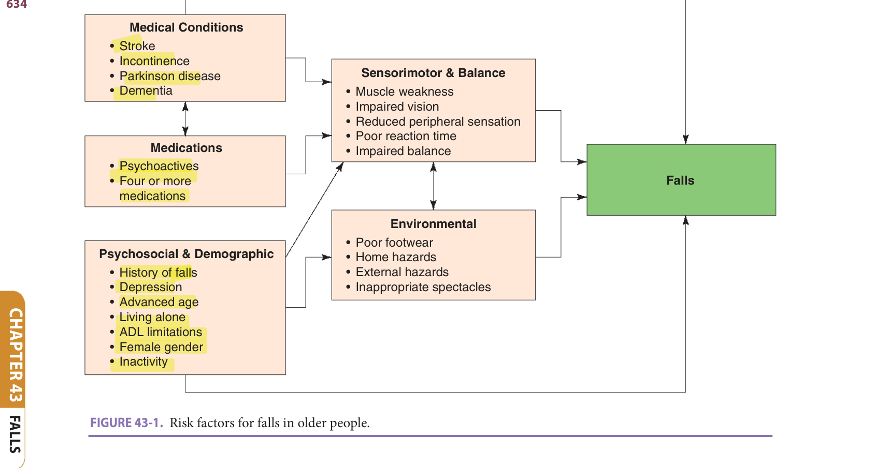
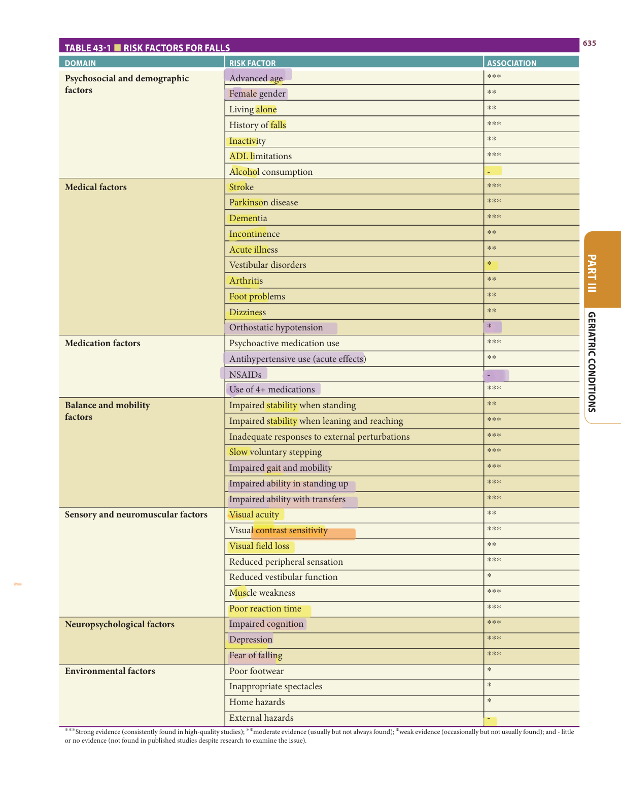
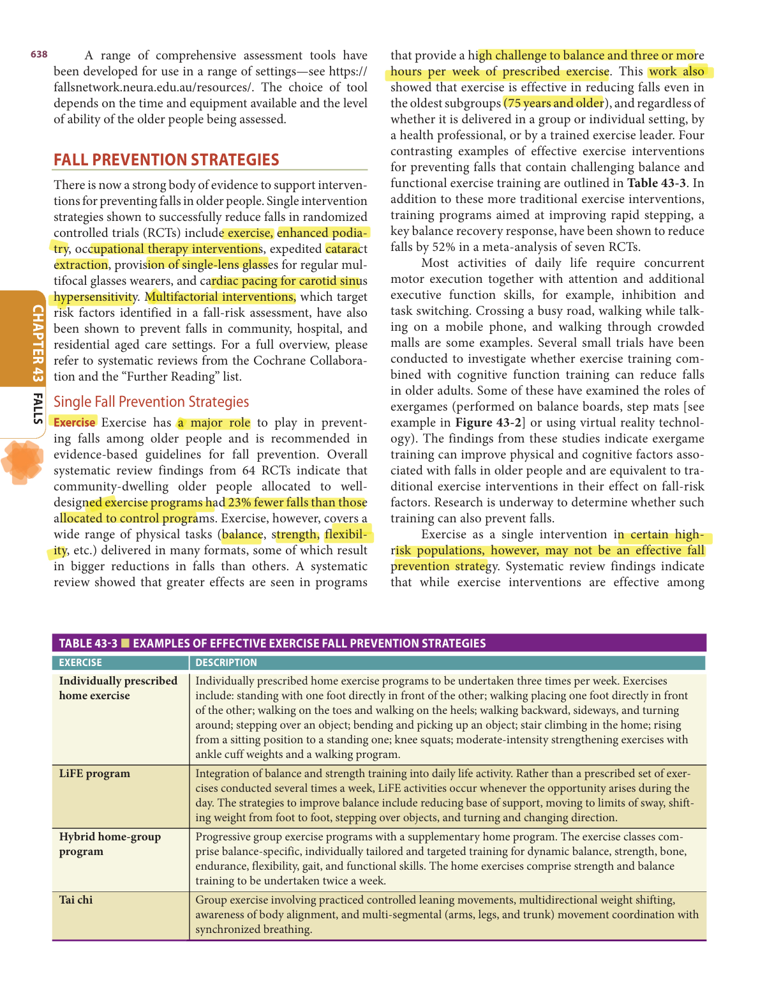
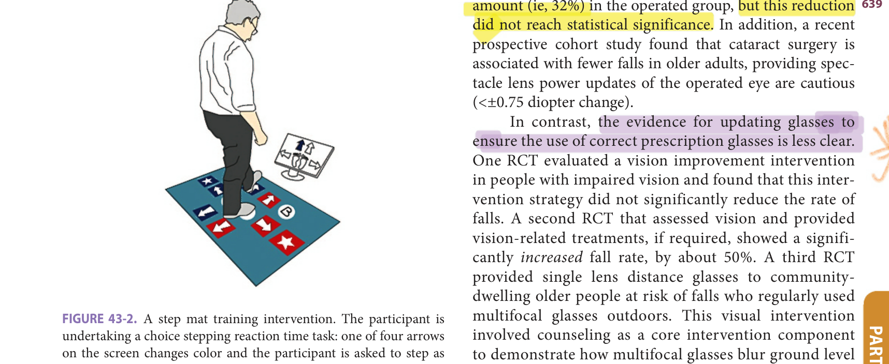
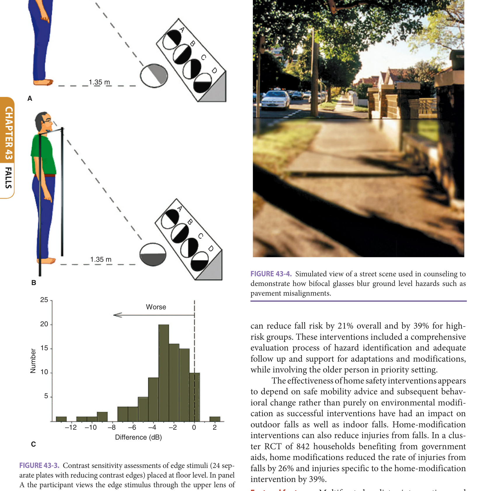
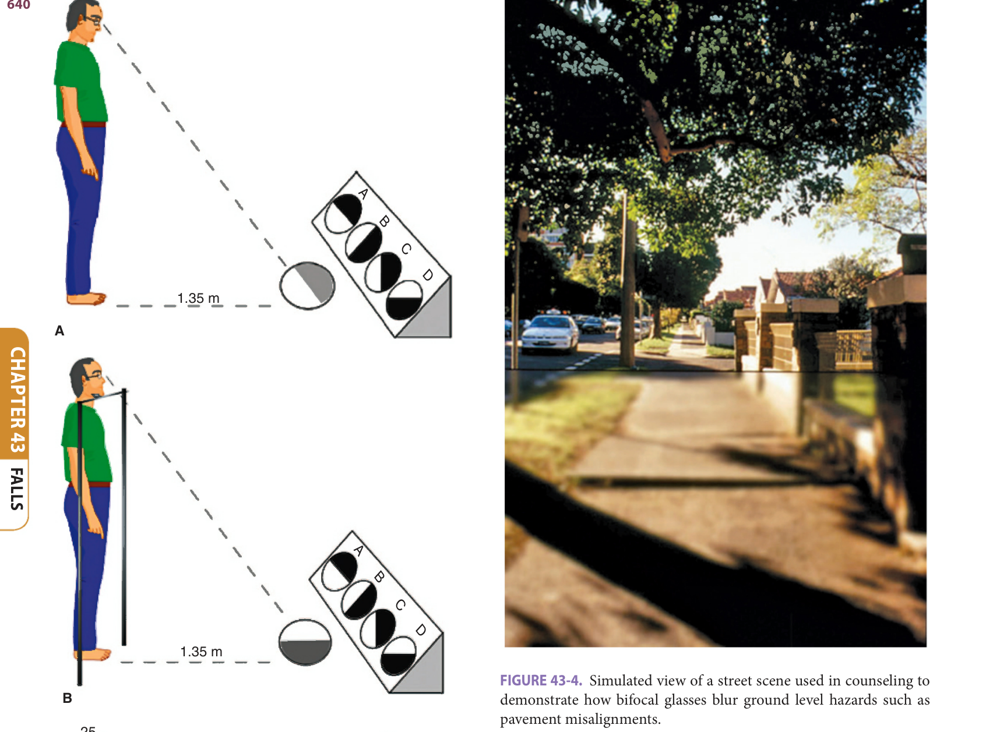

# Hazzard's Geriatric Medicine and Gerontology, 8e — Chapter 43: Falls

Stephen R. Lord, Jasmine C. Menant

> **Fast build from the book, 22 Sep; not lane-reviewed.**

**[p. 633]**

#### Learning Objectives

- To be aware of the extent of the problem and consequences of falls in older people.
- To appreciate the broad range of risk factors for falls, and in particular, the risk factors that are amenable to correction through fall prevention initiatives.
- To be aware of appropriate fall-risk screens and assessments for the community setting, and validated assessments for hospital and residential aged care settings.
- To have knowledge of effective single and multifaceted interventions for preventing falls and the populations for which appropriate interventions should be targeted.

#### Key Clinical Points

1. Falls are common in older people and frequently have serious consequences including fractures, significant fear of falling, reduced mobility, increased dependency, and need for institutional care.
2. A broad range of risk factors for falls have been documented. Key among these are factors directly or indirectly influencing balance control and gait stability.
3. Evidence-based assessments are available for community, hospital, and residential aged care settings.
4. Single intervention strategies shown to successfully prevent falls include exercise, enhanced podiatry, occupational therapy interventions, expedited cataract extraction, provision of single lens glasses for regular multifocal glasses wearers, cardiac pacing for carotid sinus hypersensitivity, and vitamin D supplementation in people with low levels of vitamin D living in RACFs.
5. Tailored multifaceted and multifactorial interventions are the most effective interventions for preventing falls in high-risk populations including RACF residents.

## Epidemiology Of Falls And Fallrelated Injuries In Older People

A fall is “an event which results in a person coming to rest inadvertently on the ground or floor or other lower level.” Prospective studies undertaken in community settings have reported fall incidence rates of 32% to 40% in people aged 65 and older and fall rates of 40% to 50% in people beyond the age of 75. Prospective studies in residential aged care facilities (RACFs) report fall incidence rates between 30% and 56%. Falls also occur frequently when people are in hospital, with incidence rates ranging between 2% in general hospitals to 27% in acute hospital geriatric wards.

Fall-related injuries can be severe and lead to a decline in the quality of life of an older person. Around 37% to 56% of all falls lead to minor injuries, while 10% to 15% of falls cause major injuries. Falls are the leading cause of injury-related hospitalizations in people aged 65 and older, and account for 14% of emergency admissions and 4% of all hospital admissions in this age group. Falls that do not result in physical injuries can also have serious consequences including significant fear of falling, which can lead to reduced mobility and frailty through the avoidance of daily activities. Furthermore, falls constitute a key predisposing factor for older people requiring institutional care.

## Risk Factors Of Falls

Many sociodemographic, medical, neuropsychological, and sensorimotor factors are strongly related with falls. As a result of age-related changes, disease, or adverse medication effects, sensorimotor and balance systems can be impaired and predispose to falls ( **Figure 43-1** ). **Table 43-1** summarizes the findings of numerous prospective cohort studies and rates each risk factor according to the strength of published evidence.

### Psychosocial And Demographic Risk Factors

Falls are associated with increased age and female gender in community-living older people. The difference in fall rates between men and women has been attributed to more women living alone, being underweight, using more - - psychotropic medications and having reduced muscle strength. Additionally, older women are also more likely -

**[p. 634]**
<!-- Start of picture text -->
Medical Conditions • Stroke • Incontinence • Parkinson disease Sensorimotor & Balance • Dementia • Muscle weakness • Impaired vision • Reduced peripheral sensation • Poor reaction time Medications • Impaired balance • Psychoactives • Four or more Falls  medications Environmental • Poor footwear Psychosocial & Demographic • Home hazards • History of falls • External hazards • Depression • Inappropriate spectacles • Advanced age • Living alone • ADL limitations • Female gender • Inactivity <!-- End of picture text -->

> *FIGURE 43-1. Risk factors for falls in older people.*

> Highlighting is the owner's annotation, not the book's.

to sustain fall-related fractures due to a higher prevalence of osteoporosis. However, in hospitals and institutions, fall -- incidence is similar for men and women, or even, higher in men. The finding that living alone is a risk factor for falls is most likely confounded by gender and increased age, in that women comprise most of the very old population.

As outlined in the intervention section later, physical activity can improve strength, balance, and functional abilities in older people. However, being more physically active does not always prevent falls, which likely reflects more physically active older people take part in activities which increase exposure to fall-risk situations. In addition, frail older adults taking up physical exercise training are likely to overestimate their balance abilities early in the program. Clearly, the risk related to increased exposure to falls should be balanced against other benefits of exercise including increased physical functioning and independence.

The most surprising finding regarding associations between sociodemographic factors and falls is that alcohol consumption has not been shown to be a fall-risk factor. Despite examining the issue, no significant associations have been found between alcohol use and falls in several large cohort studies. The lack of a positive association between alcohol use and falls may be due to response and selection biases, in that heavy alcohol consumers are likely to underreport their drinking levels or simply decline participation in research studies. There is strong evidence that long-term high alcohol intake can lead to multiple medical problems including osteoporosis, cerebellar atrophy, and peripheral neuropathy. Emergency department data for fall-related presentations also indicate that traumatic brain

injuries are twice as prevalent among older people presenting with an indication of alcohol use prior to the fall.

### Medical Factors

Many diseases and associated impairments have been identified as risk factors of falling, mainly through impairing neuropsychological function and balance control. Major - conditions include stroke, Parkinson disease, multiple - sclerosis, dementia, depression, dizziness, urinary incontinence, and arthritis. These conditions increase the risk of falls in both community and institutional settings, although the importance of some of these factors such as incontinence and impaired cognition are of greater importance in institutions. On the other hand, certain conditions commonly thought to be strong risk factors for falls, such as vestibular disorders and orthostatic hypotension, have not been found to be strong risk factors in community-based research studies but may be important in clinical populations, for example, orthostatic hypotension in Parkinson disease.

### Medications

Both community and institutional studies have demonstrated consistent associations between medication use and falls in older people, particularly for psychoactive medication (benzodiazepine, antidepressant, and antipsychotic) and multiple medication use. These studies indicate that use of psychoactive medications leads to a two to threefold increased risk of falls and a twofold increased risk of I experiencing a hip fracture. The association between the use of nonsteroidal anti-inflammatory drugs and falls is

**[p. 635]**
**Table 43-1 — Risk factors for falls**

|**DOMAIN**|**RISK FACTOR**|**ASSOCIATION**| |---|---|---| |**Psychosocial and** **demographic**|Advanced age|***| | **factors**| Female gender|**| ||Living alone|**| ||History of falls -|***| ||Inactivity|**| ||ADL limitations|***| ||Alcohol consumption|-| |**Medical factors**|Stroke|***| ||Parkinson disease|***| ||Dementia|***| ||Incontinence|**| ||Acute illness|**| ||Vestibular disorders|*| ||Arthritis|**| ||Foot problems|**| ||Dizziness|**| ||Orthostatic hypotension|*| … *(table text runs longer in the printed book; not fully reproduced in this fast build)*

ing up|***|

> *Table 43-1 reproduced as a page image (printed p. 635) — the grid did not extract reliably as text for this fast build.*

> Highlighting is the owner's annotation, not the book's.

***Strong evidence (consistently found in high-quality studies); **moderate evidence (usually but not always found); *weak evidence (occasionally but not usually found); and - little or no evidence (not found in published studies despite research to examine the issue) _._

**[p. 636]**

- inconsistent across studies but the most recent and comprehensive systematic review found that these medications do not increase fall risk in an adjusted analysis. Results of studies into use of antihypertensive medications have been conflicting and have also highlighted the importance of examining drug classes rather than grouping all antihypertensive medications together. In fact, there is evidence that some classes of antihypertensive agents (ie, angiotensin system blocking medications) are protective against falls but the mechanisms underpinning this effect are unclear. These findings also need to be interpreted in the context of medication initiation and prescription changes as a time-risk analysis has shown the risk of falls is significantly increased within the 24-hour periods following the initiation of an antihypertensive or change in antihypertensive dose.

### Balance, Mobility, And Gait Factors

Balance, Mobility, and Gait Factors The ability to rise from a chair, turn while walking, and ascend and descend stairs all require good balance control. Aging is associated with impairments in sensorimotor systems that contribute to balance, which in turn can impair ability to safely perform a range of functional tasks. Gait changes are also common with increasing age. Older adults tend to walk with slower speed, shorter step length, increased step time variability, wider step width, and a relatively increased proportion of time spent in the double-support phase. It is likely these changes are due to both physical limitations and adaptive strategies to improve safety; but nonetheless, these spatiotemporal gait patterns are predictive of falls. Older adults at risk of falls are also less able to adapt their gait on short notice to negotiate obstacles and recover from unexpected trips and slips. In addition, older people at high risk of falls have difficulty controlling the accelerations of their trunk and head while walking, which may impair their gaze stability.

### Sensory And Neuromuscular Factors

Good balance requires the complex integration of sensory information regarding the position of the body relative to the surroundings and the ability to generate appropriate motor responses to control body movement. Reduced balance and mobility in older people can result from impairments in sensory, motor, and central processing systems. Impairments may result from a specific pathology affecting a particular system, or a progressive age-related loss of function. Visual input provides a continually updated reference frame regarding the position and motion of body segments in relation to each other and the environment. Impaired vision, particularly reduced contrast sensitivity and depth perception, is a risk factor for falls and fractures as it increases the likelihood of misjudging obstacles in the environment. In addition, sensory systems provide information about the nature of balance perturbations. Decreased lower limb muscle strength also has important ramifications for balance and falls in older people, and in large community-based studies, reduced knee extension

strength has been shown to increase fall risk. Similarly, in RACFs, knee extension and ankle dorsiflexor weakness have been found to be major risk factors for falls. Finally, adequate central processing and reaction time are necessary for voluntarily correcting balance perturbations.

### Neuropsychological Factors

Several studies have shown that walking is not a fully automated process and that increased cognitive resources are required for balance control in older age. For example, a significant percentage of older people in residential aged care are unable to answer a simple question while maintaining walking, with such people at increased risk of falls. Older people who fall also do poorly in tests of executive functioning and attention. Recording of cortical activity using functional near-infrared spectroscopy while people step, walk, and negotiate obstacles has also confirmed the increased reliance on the prefrontal cortex with increasing task complexity, and that older people exhibit neural inefficiency (stagnation or decrease in behavioral performance with concurrent increases in cortical activity). Fear .. of falling and depression, both prevalent in older people, may have detrimental effects on several domains of life, including restricting activities of daily living and enjoyable pastimes, and in consequence lead to physical inactivity and social isolation. Older people with high levels of fear or generalized anxiety have also been shown to select inadequate postural control strategies, such as excessive stiffening in threatening conditions (such as when standing at height).

### Environmental Factors

It has been estimated that extrinsic factors are involved in 35% to 45% of falls that result in injuries, and one prospective study with repeated assessments over the follow-up period found the presence of home hazards was a significant risk factor for falls in frail older people. The interaction between an older person’s abilities and their exposure to environmental factors is particularly important. People with high physical abilities can withstand a bigger range of environmental challenges without falling, yet when faced with an extreme challenge, such as an icy footpath, may still fall. People with lower physical abilities can generally cope well in an environment that offers few challenges, such as in their own home, but in people with very poor abilities, falls may occur in relatively safe, hazard-free environments. In addition, the extent of a person’s risk-taking behavior or exposure to fall-risk situations plays an important role in the interaction between an older person’s abilities and their environment. There is evidence that environmental hazards play a greater role in falls that occur away from the home where, depending on the population studied, about one quarter to one half of falls occur. Falls occurring away from the home more frequently involve stairs or slipping and tripping hazards, or temporary hazards that cannot be anticipated. In addition, environmental factors can play a

**[p. 637]**

role in whether a fall will lead to a serious injury. For example, a fall on stairs is associated with a twofold increase in risk of injury.

## Fall-Risk Screening And Assessment

Several tools for screening fall risk have been validated for use in older people living in the community ( **Table 43-2** ). In this setting, fall-risk screening provides an efficient means of identifying those people at greatest risk of falling who should have a comprehensive fall-risk assessment performed. A simple, easy-to-administer screen is to ask older people about their history of falls in the past 12 months and assess their balance and mobility status. Several studies have identified previous falls as one of the strongest predictors for falling again in the following year. It has therefore been suggested that health care practitioners should ask all older people about any falls they have experienced.

Best practice guidelines recommend the Timed Up and Go (TUG) Test as a simple screening tool to identify people warranting an assessment of balance and gait. It involves measuring the time taken for a person to rise - from a chair, walk 3 meters at normal pace and with usual assistive devices, turn, return to the chair, and sit down. However, a systematic review involving 25 studies found the predictive value of the TUG for falls in communitydwelling older adults was limited and no cut-point for impaired performance could be recommended. Alternatives

-

**Table 43-2 — Examples of validated fall-risk screening tools**

|**The Timed Up** **and Go Test**|The Timed Up and Go Test (TUG) mea- sures the time taken for a person to rise from a chair, walk 3 meters at normal pace with their usual assistive device, turn, return to the chair, and sit down. Both quality of the walk and transfers and the time taken to complete the tests should be recorded.| |---|---| |**The Alternate** **Step Test**|The Alternate Step Test measures the abil- ity of patients to alternatively place … *(table text runs longer in the printed book; not fully reproduced in this fast build)*

The Short Physi-** **cal Performance** **Battery**|The Short Physical Performance Battery comprises simple assessments of standing balance, chair rise ability, and gait. Each test is graded from 0–4 with a total test score of 12.|

> to the TUG that are simple to administer and have good • predictive accuracy for falls include the Alternate Step Test, the Sit to Stand Test, and the Short Physical Performance Battery ( **Table 43-2** ).

### Assessment – Community

Older people living in the community with a history of one or more falls in the past year who perform poorly on a simple test of balance or gait should be assessed further to develop an individualized fall prevention care plan. Assessment tools provide detailed information on the underlying deficits contributing to overall risk and should be used to guide interventions. Assessing fall risk typically involves either the use of multifactorial assessment tools that cover

a wide range of fall-risk factors or individual functional mobility assessments that focus on the physiologic and functional domains of postural stability, including vision, strength, coordination, balance, and gait.

### Assessment – Hospitals

The UK NICE guidelines recommend that hospital patients aged 65 and older or those aged 50 to 64 who have an underlying condition that places them at risk, such as a recent stroke, should be assumed to be at risk and automatically undergo multifactorial assessments and interventions. Such assessments should have good predictive accuracy, validation across multiple hospitals, and evaluate risk factors for falls that can be addressed or managed during the inpatient stay, such as postural instability, cognitive impairment, visual impairment, continence issues, and medication use. This information should then form the basis for an individualized fall prevention plan.

### Assessment – Residential Aged Care

Some guidelines recommend that residents who score at risk of falls on a screening tool should undergo a comprehensive fall-risk assessment, as well as residents who experience a fall, or who move to or reside in a setting where most people are considered to have a high risk of falls (eg, high-care facilities, dementia units). In many residential care settings, however, most residents are at an increased risk of falls so it may be pragmatic to omit the screening process and implement regular fall-risk assessments of all residents.

The CaHFRiS Fall Screen comprises easily collectable measures and provides a simple way of quantifying the probability with which a care home resident will fall over a 6-month period. The CaHFRis items are: MMSE less than - 17, presence of impulsivity, reduced standing balance, reliance on a walking frame, a fall in the previous year, and use of antidepressants and/or hypnotics/anxiolytics with the absolute risk of falling increasing from zero in those with no risk factors to 100% in those with six or more risk factors. While described as a fall risk screen, this tool assists in identifying important explanatory risk factors for falls that may be amenable to targeted interventions.

**[p. 638]**

> A range of comprehensive assessment tools have been developed for use in a range of settings—see https:// fallsnetwork.neura.edu.au/resources/. The choice of tool depends on the time and equipment available and the level of ability of the older people being assessed.

## Fall Prevention Strategies

There is now a strong body of evidence to support interventions for preventing falls in older people. Single intervention strategies shown to successfully reduce falls in randomized controlled trials (RCTs) include exercise, enhanced podiatry, occupational therapy interventions, expedited cataract - extraction, provision of single-lens glasses for regular multifocal glasses wearers, and cardiac pacing for carotid sinus hypersensitivity. Multifactorial interventions, which target risk factors identified in a fall-risk assessment, have also been shown to prevent falls in community, hospital, and residential aged care settings. For a full overview, please refer to systematic reviews from the Cochrane Collaboration and the “Further Reading” list.

### Single Fall Prevention Strategies

**Exercise** Exercise has a major role to play in preventing falls among older people and is recommended in evidence-based guidelines for fall prevention. Overall systematic review findings from 64 RCTs indicate that community-dwelling older people allocated to welldesigned exercise programs had 23% fewer falls than those allocated to control programs. Exercise, however, covers a wide range of physical tasks (balance, strength, flexibility, etc.) delivered in many formats, some of which result in bigger reductions in falls than others. A systematic review showed that greater effects are seen in programs

that provide a high challenge to balance and three or more hours per week of prescribed exercise. This work also showed that exercise is effective in reducing falls even in the oldest subgroups (75 years and older), and regardless of whether it is delivered in a group or individual setting, by a health professional, or by a trained exercise leader. Four contrasting examples of effective exercise interventions for preventing falls that contain challenging balance and functional exercise training are outlined in **Table 43-3** . In addition to these more traditional exercise interventions, training programs aimed at improving rapid stepping, a key balance recovery response, have been shown to reduce falls by 52% in a meta-analysis of seven RCTs.

Most activities of daily life require concurrent motor execution together with attention and additional executive function skills, for example, inhibition and task switching. Crossing a busy road, walking while talking on a mobile phone, and walking through crowded malls are some examples. Several small trials have been conducted to investigate whether exercise training combined with cognitive function training can reduce falls in older adults. Some of these have examined the roles of exergames (performed on balance boards, step mats [see example in **Figure 43-2** ] or using virtual reality technology). The findings from these studies indicate exergame training can improve physical and cognitive factors associated with falls in older people and are equivalent to traditional exercise interventions in their effect on fall-risk factors. Research is underway to determine whether such training can also prevent falls.

Exercise as a single intervention in certain highrisk populations, however, may not be an effective fall prevention strategy. Systematic review findings indicate that while exercise interventions are effective among

**Table 43-3 — Examples of effective exercise fall prevention strategies**

|**EXERCISE**|**DESCRIPTION**| |---|---| |**Individually prescribed** **home exercise**|Individually prescribed home exercise programs to be undertaken three times per week. Exercises include: standing with one foot directly in front of the other; walking placing one foot directly in front of the other; walking on the toes and walking on the heels; walking backward, sideways, and turning around; stepping over an object; bending and picking up an object; stair climbing in the home; … *(table text runs longer in the printed book; not fully reproduced in this fast build)*

he strategies to improve balance include reducing base of support, moving to limits of sway, shift- ing weight from foot to foot, stepping over objects, and turning and changing direction.|

> *Table 43-3 reproduced as a page image (printed p. 638) — the grid did not extract reliably as text for this fast build.*

> Highlighting is the owner's annotation, not the book's.

**[p. 639]**

amount (ie, 32%) in the operated group, but this reduction did not reach statistical significance. In addition, a recent prospective cohort study found that cataract surgery is associated with fewer falls in older adults, providing spectacle lens power updates of the operated eye are cautious (<±0.75 diopter change).

> *FIGURE 43-2. A step mat training intervention. The participant is undertaking a choice stepping reaction time task: one of four arrows on the screen changes color and the participant is asked to step as quickly as possible onto the same location of the pad.*

> Highlighting is the owner's annotation, not the book's.

people with Parkinson disease and those with cognitive impairment, they do not reduce fall rates among longterm stroke survivors or older people recently discharged from hospital. In fact, one home-based exercise program significantly _increased_ falls in older people recently discharged from hospitals by 43%. This area requires further investigation, as it may be that to be effective; exercise needs to form part of multifactorial interventions or be supplemented with educational components in these frailer populations.

The effect of exercise alone as a fall prevention intervention in acute hospitals is not known, but in subacute hospital settings, three RCTs have shown that balance and mobility interventions can prevent falls. The evidence for exercise programs in RACFs as a single intervention is also mixed, but a recent trial of twice-weekly combined progressive resistance and balance training for 25 weeks improved physical performance and reduced falls by 55% in long-term aged-care residents. In addition, several multifaceted programs that have included exercise have shown positive effects in preventing falls. For example, an intervention program that involved staff training and feedback, information and education for residents, environmental adaptations, hip protectors, and twice-weekly exercise in groups of six to eight people delivered by exercise instructors reduced falls by 45%.

**Visual interventions** Two trials have examined the effects of expedited cataract surgery in reducing falls. The first examined the efficacy of cataract surgery in the first eye and showed that the fall rate in the operated group was significantly lower (a 34% reduction) than that observed in the control group. The second trial showed that cataract surgery for the second eye reduced falls by a similar

In contrast, the evidence for updating glasses to ensure the use of correct prescription glasses is less clear. One RCT evaluated a vision improvement intervention in people with impaired vision and found that this intervention strategy did not significantly reduce the rate of falls. A second RCT that assessed vision and provided vision-related treatments, if required, showed a significantly _increased_ fall rate, by about 50%. A third RCT provided single lens distance glasses to communitydwelling older people at risk of falls who regularly used multifocal glasses outdoors. This visual intervention involved counseling as a core intervention component to demonstrate how multifocal glasses blur ground level hazards ( **Figures 43-3** and **43-4** ) and was effective in significantly reducing all falls (by 40%), outside falls, and injurious falls in the subgroup of people who regularly took part in outside activities.

Some older people have impaired vision that cannot be corrected. A targeted home safety assessment and modification program designed for older people with low vision has been shown to reduce the rate of falls by 41% in people with severe visual impairment.

**Medication management** Centrally acting medications have consistently been shown to increase fall risk. While initial trials found withdrawing centrally acting medications could significantly reduce falls in community and residential care settings, a more recent systematic review involving five trials and 1309 participants in clinical trials found fall-risk inducing drugs withdrawal strategies (mostly targeting centrally acting medications) did not significantly reduce fall rates (RaR: 0.98, 95% CI: 0.63, 1.51) in older people over a 6- to 12-month follow-up period. This suggests strategies to prevent the initial uptake of centrally acting medications are warranted. Furthermore, the prescription of benzodiazepines, z-drugs, or other psychotropic medication for the management of insomnia in older persons should be avoided, unless there is a clear pattern of addiction or inability to complete a withdrawal program. Nonpharmacological approaches to the management of insomnia should also be considered.

Current evidence from systematic reviews and mega-trials indicates vitamin D supplementation does not improve physical function or prevent falls in communitydwelling older adults, even in those with vitamin D deficiency, but may reduce falls in older adults living in RACFs.

**Home safety interventions** Home safety interventions are effective in high-risk groups and when delivered by an occupational therapist. A meta-analysis showed that intensive interventions carried out by occupational therapists

**[p. 640]**

<!-- Start of picture text -->
640 \. \ \ \. \ 1.35 m A \ \ \ '  \ \ \ \ '  \ \ 1.35 m B 25 Worse 20 15 10 5 –12 –10 –8 –6 –4 –2 0 2 Difference (dB) C A B C D A B C D CHAPTER 43 FALLS Number <!-- End of picture text -->

> *FIGURE 43-3. Contrast sensitivity assessments of edge stimuli (24 separate plates with reducing contrast edges) placed at floor level. In panel A the participant views the edge stimulus through the upper lens of bifocal spectacles. In panel B the participant is forced to view the edge stimulus through the lower lens. Participants are then shown the difference between their upper and lower lens contrast vision. For reference, panel C shows differences between upper and lower lens edge contrast sensitivity scores for 87 regular multifocal glasses wearers.*

> Highlighting is the owner's annotation, not the book's.

> *FIGURE 43-4. Simulated view of a street scene used in counseling to demonstrate how bifocal glasses blur ground level hazards such as pavement misalignments.*

> Highlighting is the owner's annotation, not the book's.

can reduce fall risk by 21% overall and by 39% for highrisk groups. These interventions included a comprehensive evaluation process of hazard identification and adequate follow up and support for adaptations and modifications, while involving the older person in priority setting.

The effectiveness of home safety interventions appears to depend on safe mobility advice and subsequent behavioral change rather than purely on environmental modification as successful interventions have had an impact on outdoor falls as well as indoor falls. Home-modification interventions can also reduce injuries from falls. In a cluster RCT of 842 households benefiting from government aids, home modifications reduced the rate of injuries from falls by 26% and injuries specific to the home-modification intervention by 39%.

**Feet and footwear** Multifaceted podiatry interventions and multifactorial interventions incorporating podiatry can reduce falls by 23% and 27%, respectively, in older people living in the community, according to a meta-analysis - and systematic review. These interventions comprise the

**[p. 641]**

provision of foot orthoses and/or new safe footwear, advice on footwear, foot and ankle exercises, and routine podia- C try. One pilot study has investigated the effect of a podiatry intervention in RACFs residents, showing small protective effect on falls directly after the intervention delivery (3 months), which disappeared at 6-month follow-up.

**Psychological interventions** There is limited evidence on psychological interventions in relation to fall prevention. Most cognitive behavioral programs when implemented as sole interventions have not prevented falls in people with fear of falling. However, the addition of cognitive behavioral therapy principles to multifactorial fall prevention interventions, especially in combination with exercise programs, may be more effective in reducing fall risk in people with fear of falling compared to exercise alone. Other psychological conditions, such as depression, anxiety, and sleep disorders, have been identified as risk factors for falls. There is a good evidence that cognitive behavioral therapy is an effective treatment of these conditions in older people, but this approach has not been investigated in relation to fall prevention.

**Cardiovascular interventions** Not all falls are caused directly by gait and balance problems. Individuals presenting with recurrent falls and no obvious balance or mobility impairment can benefit from a specialist assessment and specific diagnostic investigations. Three studies have evaluated the efficacy of implantation of pacemakers as a fall prevention strategy for people with cardioinhibitory carotid sinus hypersensitivity—an abnormal hemodynamic response to massage of the carotid sinus that is characterized clinically by unexplained dizziness and/or syncope. Overall, these studies indicate that pacemakers are effective in reducing drop attacks and syncope and reducing falls frequency.

### Multifactorial Fall Prevention Strategies

Multifactorial interventions involve identifying a range of risk factors associated with falls and interventions based on the identified risk profile, and a recent Cochrane review of 43 trials conducted in community-dwellers found that multifactorial interventions reduced falls overall by 23%. Common strategies in multifactorial prevention programs are medication adjustment, home safety modifications, exercise programs, and education.

Residents of RACFs have a high prevalence of physical frailty and cognitive impairment, and in this setting, single approaches to intervention have generally not been shown to be effective. In contrast, multifactorial interventions provided by multidisciplinary teams with appropriate staff education have been shown to significantly reduce falls. Some of these trials have included comprehensive geriatric assessments of each patient whereas others have used specific fall-risk assessments. Multifactorial interventions

successful at reducing falls in hospital inpatients include combinations of supervised exercise and balance training, resident and staff education, medication review, vitamin D supplementation, environmental review, walking aids, and provision of hip protectors.

### Impact Of Multifactorial Interventions On Fall-Related Injuries

Two recent very large trials have tested the impact of multifactorial fall prevention interventions on fractures (n = 5451) and serious fall injuries (n = 9803), respectively. Both were undertaken in General Practice settings and sought to implement interventions within existing services primarily using existing resources and both found that their interventions did not significantly reduce falls - or factures. These studies raise interesting questions about the challenge of funding and implementing fall prevention interventions as well as the ability of investigators to support and even measure uptake of intervention components in very large trials. Overall, it appears that multifactorial interventions are difficult to implement in practice and require greater commitment from participants and health care professionals than single component interventions. It also seems that multiple risk factor interventions are more effective in reducing falls if the interventions are provided directly, and less effective if the interventions rely on referral to routine service providers.

## Conclusion

Many RCTs have shown interventions for preventing falls in older people. These have built on large epidemiological studies that have identified risk factors for falls amenable to intervention and validated assessments that can identify individuals at high risk of falls. A range of single intervention strategies have been shown to successfully reduce falls, including exercise containing medium-high intensity balance training, enhanced podiatry, home safety interventions, expedited cataract extraction, cardiac pacing for people with carotid sinus hypersensitivity, and vitamin D supplementation in people living in RACFs. Further research is required to clarify the roles medication reviews, visual interventions, and cognitive behavioral therapy can play in preventing falls. Tailored multifaceted and multifactorial interventions are particularly effective in preventing falls in high-risk populations including RACF residents. The translation of research findings into clinical practice remains a challenge. A combination of population health initiatives for lowering fall risk in the general population of older people combined with targeted interventions for those at increased risk is required to realize fall reductions at the population level.

**[p. 642]**
## Further Reading

   - Bhasin S, Gill TM, Reuben DB, et al. A randomized trial of a multifactorial strategy to prevent serious fall injuries. _N Engl J Med_ . 2020;383:129.

   - Cameron ID, Dyer SM, Panagoda CE, et al. Interventions for preventing falls in older people in care facilities and hospitals. _Cochrane Database Syst Rev_ . 2018;9:CD005465.

   - de Vries M, Seppala LJ, Daams JG, et al. EUGMS Task and Finish Group on Fall-Risk-Increasing Drugs. Fall-risk-increasing drugs: a systematic review and meta-analysis: I. Cardiovascular drugs. _J Am Med Dir Assoc_ . 2018;19:371.e1.

   - E JY, Li T, McInally L, et al. Environmental and behavioural interventions for reducing physical activity limitation and preventing falls in older people with visual impairment. _Cochrane Database Syst Rev_ . 2020;9:CD009233.

- and preventing falls in older people with visual impairment. _Cochrane Database Syst Rev_ . 2020;9:CD009233.

- Gillespie LD, Robertson MC, Gillespie WJ, et al. Interventions for preventing falls in older people living in the community. _Cochrane Database Syst Rev_ . 2012;9: CD007146.

- Hewitt J, Goodall S, Clemson L, et al. Progressive resistance and balance training for falls prevention in long-

   - Hewitt J, Goodall S, Clemson L, et al. Progressive resistance and balance training for falls prevention in longterm residential aged care: a cluster randomized trial of the Sunbeam program. _J Am Med Dir Assoc_ . 2018; 19:361.

   - Hopewell S, Copsey B, Nicolson P, et al. Multifactorial interventions for preventing falls in older people living in the community: a systematic review and meta-analysis of 41 trials and almost 20,000 participants. _Br J Sports Med_ . 2020;54:1340.

   - Lamb SE, Bruce J, Hossain A, et al. Prevention of fall injury trial study group. Screening and intervention to prevent falls and fractures in older people. _N Engl J Med_ . 2020;383:1848.

   - Lamb SE, Jorstad-Stein EC, Hauer K, et al. Development of a common outcome data set for fall injury prevention trials: the Prevention of Falls Network Europe consensus. _J Am Geriatr Soc_ . 2005;53:1618.

   - Lee J, Negm A, Wong E, et al. Does deprescribing fallassociated drugs reduce falls and its complications? A systematic review. _Innov Aging_ . 2017;1:268.

- Mackenzie L, Beavis AM, Tan ACW, et al. Systematic review and meta-analysis of intervention studies with general practitioner involvement focused on falls prevention for community-dwelling older people. _J Aging Health_ . 2020;32:1562.

- Okubo Y, Schoene D, Lord SR. Step training improves reaction time, gait and balance and reduces falls in older people: a systematic review and meta-analysis. _Br J Sports Med_ . 2017;51:586.

- Oliver D, Papaioannou A, Giangregorio L, et al. A systematic review and meta-analysis of studies using the STRATIFY tool for prediction of falls in hospital patients: how well does it work? _Age Ageing_ . 2008;37:621.

- Schoene D, Wu SM, Mikolaizak AS, et al. Discriminative ability and predictive validity of the timed up and go test in identifying older people who fall: systematic review and meta-analysis. _J Am Geriatr Soc_ . 2013;61:202.

- Seppala LJ, Wermelink AMAT, de Vries M, et al. EUGMS task and Finish group on fall-risk-increasing drugs. Fall-risk-increasing drugs: a systematic review and meta-analysis: II. Psychotropics. _J Am Med Dir Assoc_ . 2018;19:371.e11.

- Sherrington C, Fairhall NJ, Wallbank GK, et al. Exercise for preventing falls in older people living in the community. _Cochrane Database Syst Rev_ . 2019;1:CD012424.

- Tiedemann A, Shimada H, Sherrington C, et al. The comparative ability of eight functional mobility tests for predicting falls in community-dwelling older people. _Age Ageing_ . 2008;37:430.

- Weber M, Belala N, Clemson L, et al. Feasibility and effectiveness of intervention programmes integrating functional exercise into daily life of older adults: a systematic review. _Gerontology_ . 2018;64:172.

- Whitney J, Close JCT, Lord SR, et al. Identification of highrisk fallers among older people living in residential care facilities: a simple screen based on easily collectable measures. _Arch Gerontol Geriatr_ . 2012;55:690.

- Wylie G, Torrens C, Campbell P, et al. Podiatry interventions to prevent falls in older people: a systematic review and meta-analysis. _Age Ageing_ . 2019;48:327.

